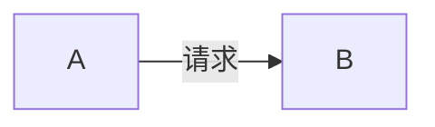

# 可构建性约定(conventions)

> 本文件是 notes-writing skill 的引用材料:每条 md 写法对应 `build_html.py` 的渲染能力。写到位时查,不预先全读。目标不是"格式统一",是"写出来的 md 构建出好 HTML、agent 能照着写"。

## 哪些文件进 HTML

`build_html.py` 只收 `README.md` + `NN-*.md`(`NN` 是两位数字,如 `01-`、`02-`)。其它文件名不进 HTML。所以专题正文用编号文件,辅助材料(草稿、汇总)不要编号或放子目录。专题的一手规范(spec/manual/datasheet)放 `reference/` 子目录,不编号、不进 HTML,作为正文的事实来源。

## 跨文档链接

| 写法 | 渲染成 | 说明 |
| --- | --- | --- |
| `[text](./NN-foo.md)` | hash 路由 `#/NN-foo` | 文档集内跳转,单文件内生效 |
| `[text](./NN-foo.md#锚点)` | `#/NN-foo#锚点` | 跳到目标文档某 H2 |
| `[text](../other/NN-foo.md)` | `file://` 绝对路径 | 跨目录,本机可点、他机显示路径 |
| `[text](./src/...)` | `file://` 绝对路径 | 指向源码,见下文源码引用 |
| `[text](https://...)` | 外链 | 原样保留 |
| `[text](#锚点)` | 文档内锚点 | H2 标题自动有 id,或源码块锚点(见下) |

锚点 id 由标题文本生成(slugify,保留中文)。要链接某 H2,用其标题文本小写、空格转连字符即可。

## 源码引用(代码追踪/查看的核心)

两种写法,build_html 都渲染成:**出处徽章(可点击跳源码 file://)+ 带行号的代码块 + 锚点 id**(供文中函数名链接跳转,call graph 雏形)。

### 新写法(推荐,agent 友好;构建时从源码拉取,防漂移)

````markdown
见 [`bl1_main()`](#src-bl1_main) 入口:

```c src="./src/tf-a-src/bl1/bl1_main.c" lines="51-60" anchor="bl1_main"
```
````

- `src=`:相对专题目录的源码路径。
- `lines=`:`起-止` 行区间。
- `anchor=`:可选,给该代码块一个友好锚点 id(如 `bl1_main`),文中用 `[bl1_main()](#src-bl1_main)` 跳转。
- fence 体留空,构建时自动填入源码对应行。你不用复制代码,源码变了构建即同步。

### 旧写法(代码已手贴,块首注释标出处;兼容,零改动)

````markdown
```c
/* 摘自 [tf-a-src/bl1/bl1_main.c](./src/tf-a-src/bl1/bl1_main.c) 第 51-60 行 */
void bl1_main(void) { ... }
```
````

- build_html 识别 `摘自 ... 第 X-Y 行`(及 `L X-Y` 变体),把注释转成徽章,给代码块加行号(从 X 起)。
- 手贴代码可能与源码漂移,新内容建议用新写法。

### 函数名跳转

给源码块加 `anchor="名"` 后,文中用 `` [`函数名()`](#src-名) `` 链接跳到该代码块。这是不依赖 ctags 的调用导航:你在正文讲"调用了 `bl1_early_platform_setup()`",把这个函数名链到它的代码块锚点,读者就能一路点下去。需要更多调用关系时,手写 Mermaid call graph(见下)补足。

## 图片

- 本地图片(`./images/x.png`)构建时自动 base64 内嵌,单文件可移植。
- 外部 `http(s)` 图片原样保留(查看时需联网)。
- 图片与正文紧耦合,前后有文字说明。复用官方图标来源(`*来源:Author, Year Figure X*` 或 `*来源:JEDEC Standard No. XX, Figure X*`)。
- 文件命名 `{来源简写}-{主题}.png`,存 `images/`。

## Mermaid 图

写 ``` ```mermaid ``` 块,前端 mermaid.js 渲染。**主题由构建兜底(neutral),不必每图写 `%%{init}%%`**——要自定义配色才写,图级 init 会覆盖兜底主题。



选型:流程/步骤 `flowchart`、时序 `sequenceDiagram`、状态 `stateDiagram-v2`、层级 `flowchart + subgraph`、学习路径 `gantt`。节点 ID 用 PascalCase、标签中文、连接线带标签——这些是好习惯,非硬约束。

## 数学公式

行内 `$...$`、块 `$$...$$`(也支持 `\(\)`、`\[\]`)。必须 LaTeX 语法,别用 Unicode 拼公式。独立公式前后空行。

## 代码块

- 标语言:`c` `asm` `python` `ld` `yaml` `json` `dts` `kconfig` 等(highlight.js 高亮;`armasm`/`x86asm` 已注册)。
- 非"源码引用"的普通代码块原样渲染,不带行号。
- 过程性内容(初始化序列、算法步骤)用编号列表呈现,每步一动作。
- 代码块前后空行,超 30 行考虑拆或标注省略。

## 标题层级

- `#` H1 文档标题(每篇一个);`##` H2 进侧边栏 TOC;`###`/`####` 不进侧边栏。
- 同专题编号风格统一(阿拉伯 `## 1.` 或中文 `## 一、`,不混用)。
- 标题末尾不加标点。

## 表格

表头加粗,前后空一行,对比类第一列为"对比维度"。复杂表格(多列数值)后附 `> **如何读这张表**:…`。

## 核心要点

`> **核心要点**:…` 有高亮样式(要点字标蓝)。有真结论才用,非每节标配。

## README 要素

专题 README:一句话定位;Mermaid 学习路线图;文档索引表(序号/文档/概要/建议学时);官方文档表;若有 `src/` 加源码导航表。每篇正文前置阅读 + 结尾"下一篇"链接,双向可达。

## 文件命名

有序章节 `NN-描述.md`;英文 kebab-case;导航 `README.md`;复用图 `{来源简写}-{主题}.png`。同专题统一。

## 构建

```
python3 build_html.py <专题目录> --check          # 先校验:死链/缺图/坏 mermaid/源码引用问题
python3 build_html.py <专题目录>                   # 构建 HTML
python3 build_html.py <专题目录> --check --json   # 机器可读结果(agent 解析)
python3 build_html.py <专题目录> -o <专题>/index.html -t "标题"
```

`--check` 有 error 时退出码非 0,agent 可据此判断成败。
