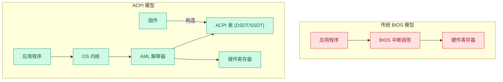
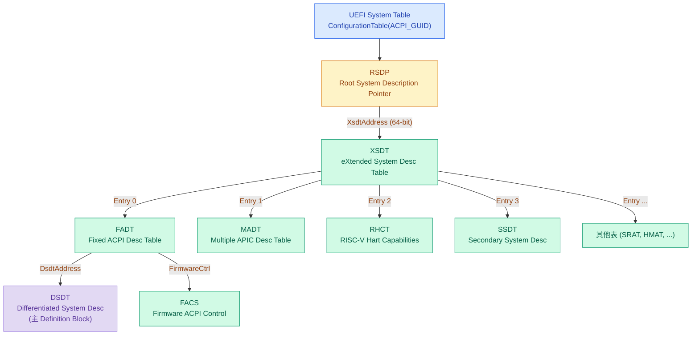
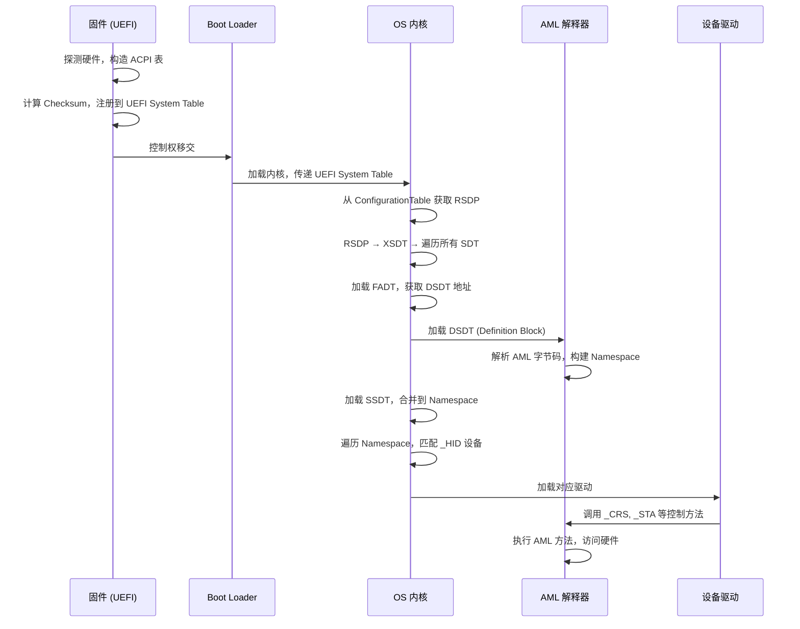
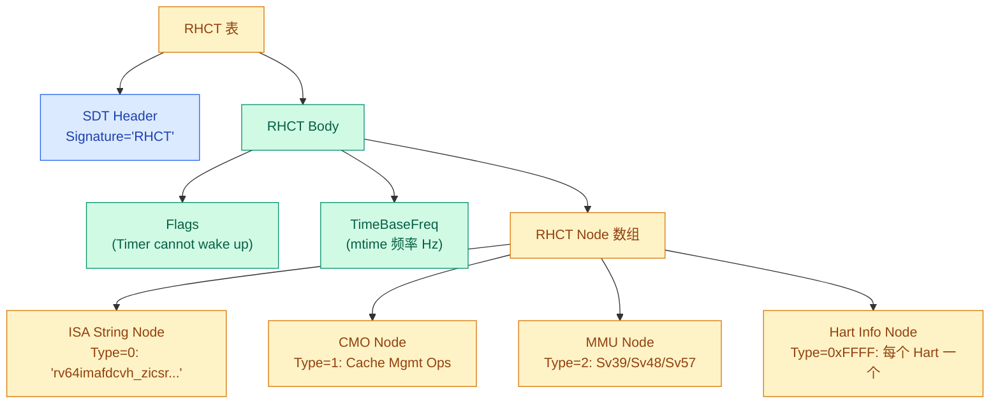
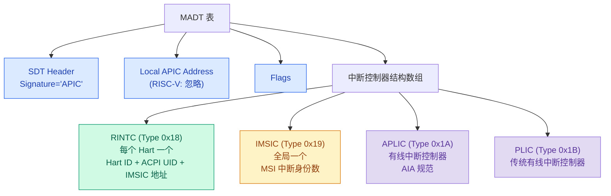
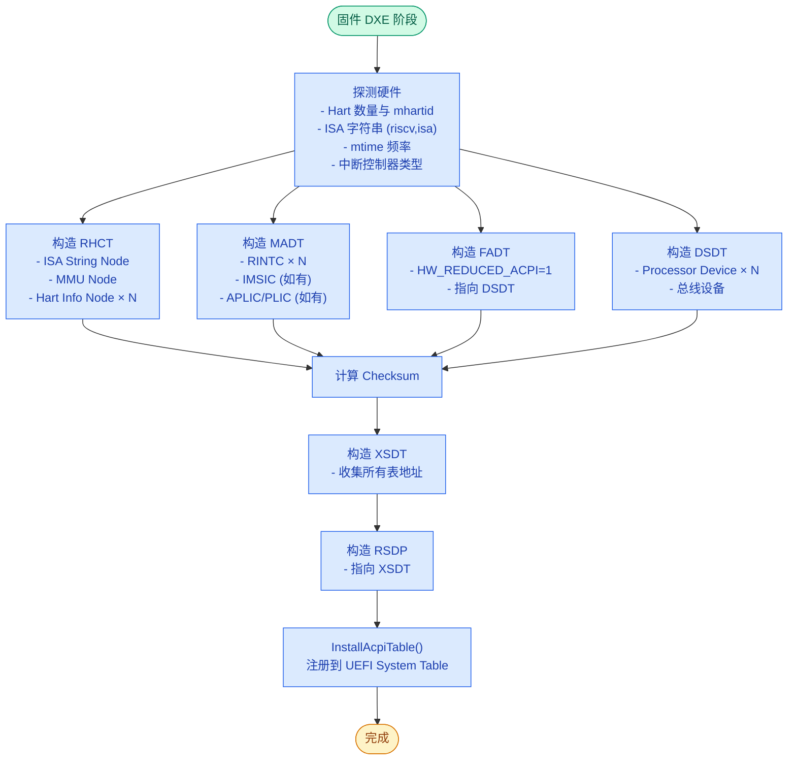

# ACPI 基础概念与 RISC-V 实践

> ACPI (Advanced Configuration and Power Interface) 是固件与操作系统之间的标准化接口层，负责硬件发现、电源管理和配置。对 RISC-V 固件开发者而言，ACPI 是替代 Device Tree 的服务器级硬件描述方案。
>
> **工程师视角**：ACPI 不是"另一种 Device Tree"——它是带可执行字节码（AML）的硬件抽象虚拟机。理解 ACPI 的关键不是背表结构，而是理解数据流向：固件构造表 → OS 解析表 → AML 解释器执行方法 → 驱动加载。RISC-V 的 ACPI 支持从 ACPI 6.4+ 开始成熟，核心是 RHCT 表（替代 x86 CPUID）和 MADT 中的 RINTC/IMSIC/APLIC 结构。

### 关键术语

| 缩写 | 全称 | 含义 |
|------|------|------|
| ACPI | Advanced Configuration and Power Interface | 高级配置与电源管理接口 |
| OSPM | OS-directed Power Management | 操作系统主导的电源管理 |
| RSDP | Root System Description Pointer | ACPI 入口结构，指向 XSDT/RSDT |
| XSDT | eXtended System Description Table | 64 位指针版 ACPI 根表 |
| FADT | Fixed ACPI Description Table | 固定硬件寄存器描述表 |
| DSDT | Differentiated System Description Table | 差异化系统描述表（主 Definition Block） |
| SSDT | Secondary System Description Table | 次级系统描述表（附加 Definition Block） |
| SDT | System Description Table | 所有 ACPI 表的通用头部格式 |
| AML | ACPI Machine Language | ACPI 虚拟机字节码 |
| ASL | ACPI Source Language | AML 的源语言 |
| RHCT | RISC-V Hart Capabilities Table | RISC-V Hart 能力表（ISA 字符串等） |
| MADT | Multiple APIC Description Table | 多 APIC 描述表（含中断控制器结构） |
| RINTC | RISC-V Interrupt Controller | MADT 中 RISC-V 中断控制器结构 |
| IMSIC | Incoming MSI Controller | RISC-V AIA 的 MSI 接收控制器 |
| APLIC | Advanced Platform Level Interrupt Controller | RISC-V AIA 的高级平台级中断控制器 |
| PLIC | Platform Level Interrupt Controller | RISC-V 传统平台级中断控制器 |
| GPE | General-Purpose Event | 通用事件（ACPI 中断事件模型） |
| SCI | System Control Interrupt | 系统控制中断 |
| FACS | Firmware ACPI Control Structure | 固件 ACPI 控制结构（含 Global Lock） |

### 前置知识

| 需要了解 | 参考文档 |
|----------|----------|
| RISC-V 特权模式 M/S/U 与 SBI | [特权模式与 CSR](../riscv/03-privileged/privileged-modes-and-csr.md) |
| RISC-V 启动流程与 OpenSBI | [启动流程](../riscv/03-privileged/boot-process.md) |
| UEFI 基础概念 | [为什么需要 UEFI](../edk2/01-why-uefi.md) |
| RISC-V UEFI 移植（含 ACPI 构造代码） | [RISC-V 平台移植实战](../edk2/09-riscv-porting.md) |

---

## 1. 概述

### 1.1 ACPI 解决什么问题

在 ACPI 出现之前，x86 平台使用 BIOS 中断调用（INT 0x15 等）和 APM (Advanced Power Management) 做电源管理，用 PnP BIOS 做设备枚举。这些方案的问题：

- **固件与 OS 耦合**：OS 必须调用 BIOS 代码，BIOS 代码质量直接影响 OS 稳定性
- **不可扩展**：每种新硬件需要新的 BIOS 接口
- **无统一电源模型**：APM 的电源策略在 BIOS 中，OS 无法根据用户场景优化

ACPI 的核心思路：**把硬件描述和控制逻辑从固件代码中剥离，变成数据（表）和可解释字节码（AML），由 OS 的 ACPI 驱动（AML 解释器）统一执行**。固件只负责构造表，OS 负责解释和执行。



### 1.2 ACPI 的两大组成部分

ACPI 规范由两大块组成：

| 组成部分 | 内容 | 对应 Spec 章节 |
|----------|------|---------------|
| **ACPI 表系统** | 静态数据表（FADT、MADT、RHCT 等）+ 含 AML 字节码的 Definition Block（DSDT、SSDT） | Ch5 |
| **ACPI 硬件规范** | 固定硬件寄存器接口（PM1、GPE、Sleep 寄存器等） | Ch4 |

对于 RISC-V 平台，**硬件规范部分几乎全部不适用**——RISC-V 使用 Hardware-Reduced ACPI 模式（见第 4 节）。

### 1.3 ACPI 与 Device Tree 的对比

| 对比维度 | ACPI | Device Tree |
|----------|------|-------------|
| 数据格式 | 二进制表 + AML 字节码 | 文本 DTS → 二进制 DTB |
| 可执行逻辑 | AML 控制方法（条件、循环、算术） | 无（纯静态描述） |
| 电源管理 | 完整的 S-state/C-state/P-state 模型 | 无标准电源模型 |
| 热管理 | 内置 Thermal Zone 模型 | 无 |
| 设备枚举 | `_HID` / `_CID` 即插即用 ID | `compatible` 字符串 |
| 运行时修改 | SSDT 动态加载/卸载 | 静态（Overlay 有限支持） |
| 主要使用场景 | x86 服务器、ARM 服务器、RISC-V 服务器 | 嵌入式、ARM 移动端、RISC-V 嵌入式 |
| RISC-V 支持 | ACPI 6.4+ (RHCT, RINTC, IMSIC, APLIC) | 原生支持 |

---

## 2. ACPI 表系统架构

### 2.1 表的发现链

ACPI 所有表的入口是 RSDP (Root System Description Pointer)。OS 通过 UEFI System Table 或搜索内存找到 RSDP，然后逐级发现所有表：



### 2.2 RSDP 结构

RSDP 是 ACPI 的入口，在 UEFI 系统中通过 `EFI_ACPI_TABLE_PROTOCOL` 或直接搜索 `"RSD PTR "` 签名定位（Spec 5.2.5）。

```c
// RSDP 结构 (ACPI 2.0+)
typedef struct {
  UINT64  Signature;        // "RSD PTR " (8 bytes, 含尾部空格)
  UINT8   Checksum;         // 前 20 字节的校验和
  UINT8   OemId[6];
  UINT8   Revision;         // 0=ACPI 1.0, 2=ACPI 2.0+
  UINT32  RsdtAddress;      // 32-bit RSDT 地址 (ACPI 1.0)
  UINT32  Length;           // RSDP 结构长度
  UINT64  XsdtAddress;      // 64-bit XSDT 地址 (ACPI 2.0+)
  UINT8   ExtendedChecksum; // 整个结构的校验和
  UINT8   Reserved[3];
} EFI_ACPI_6_6_ROOT_SYSTEM_DESCRIPTION_POINTER;
```

**关键点**：OS 优先使用 `XsdtAddress`（64 位），仅在它为 0 时才回退到 `RsdtAddress`（32 位）。RISC-V 平台始终使用 XSDT。

### 2.3 通用 SDT 表头

所有 ACPI 表（FADT、MADT、RHCT、DSDT、SSDT 等）共享同一个头部结构（Spec 5.2.6）：

```c
typedef struct {
  UINT32  Signature;       // 4 字节 ASCII 签名，如 "FACP", "APIC", "RHCT", "DSDT"
  UINT32  Length;          // 整个表的字节数（含此头部）
  UINT8   Revision;        // 表结构版本
  UINT8   Checksum;        // 8-bit 校验和：整个表所有字节求和必须为 0
  UINT8   OemId[6];        // OEM ID
  UINT64  OemTableId;      // OEM 表 ID
  UINT32  OemRevision;     // OEM 修订号
  UINT32  CreatorId;       // 创建者 ID（如 "INTL" = Intel ACPICA）
  UINT32  CreatorRevision; // 创建者修订号
} EFI_ACPI_DESCRIPTION_HEADER;
```

**校验和计算**：遍历整个表（Length 字节），逐字节累加（8-bit 无符号加法），结果必须为 0。构造表时，先设 Checksum=0，计算累加和，取 `(256 - sum) & 0xFF` 填入。

### 2.4 两类 ACPI 表

| 类型 | 特征 | 示例 |
|------|------|------|
| **数据表** | 纯静态数据，OS 直接读取结构体字段 | FADT、MADT、RHCT、SRAT、HMAT |
| **Definition Block** | 包含 AML 字节码，由 AML 解释器执行 | DSDT、SSDT |

DSDT 是主 Definition Block——OS 启动时加载并永不卸载。SSDT 是附加 Definition Block——可由固件在运行时动态加载/卸载（例如响应热插拔事件）。

---

## 3. ACPI 初始化流程

从按下电源键到 OS 加载 ACPI 设备驱动，完整流程如下（Spec 第 1 章 Overview）：



### 3.1 各阶段详解

**阶段 1 — 固件构造表**：UEFI 固件在 DXE 阶段探测硬件（CPU 数量、ISA 字符串、中断控制器、内存拓扑），构造 FADT、MADT、RHCT、DSDT、SSDT 等表，通过 `EFI_ACPI_TABLE_PROTOCOL::InstallAcpiTable()` 注册。

**阶段 2 — OS 发现 RSDP**：在 UEFI 系统上，OS Loader 从 `EFI_SYSTEM_TABLE.ConfigurationTable` 中搜索 `EFI_ACPI_20_TABLE_GUID`，获取 RSDP 指针（Spec 5.2.5.2）。

**阶段 3 — 构建 Namespace**：OS 的 ACPI 子系统加载 DSDT 中的 AML 字节码，AML 解释器逐条执行，构建出层级化的 ACPI Namespace（设备树）。然后加载 SSDT 合并进去。

**阶段 4 — 设备枚举**：OS 遍历 Namespace，对每个含 `_HID`（Hardware ID）对象的节点，查找并加载对应驱动。`_HID` 是 PnP ID 格式，如 `ACPI0007` 表示 Processor Device。

---

## 4. Hardware-Reduced ACPI（RISC-V 的核心模式）

### 4.1 为什么需要 Hardware-Reduced

ACPI 最初为 x86 PC 设计，第 4 章定义了固定硬件寄存器接口（PM1 事件/控制寄存器、PM 定时器、GPE 寄存器块等）。这些寄存器要求硬件实现特定的 I/O 端口行为。

RISC-V 平台（以及现代 ARM 服务器）**不实现这些 x86 遗留硬件**。ACPI 5.0 引入了 Hardware-Reduced ACPI 模式（Spec 3.11.1, 4.1），允许平台跳过整个硬件规范章节。

### 4.2 Hardware-Reduced 的要求

| 要求 | 说明 |
|------|------|
| 必须使用 UEFI 启动 | 不支持 Legacy BIOS |
| 始终在 ACPI 模式 | 无 ACPI Enable/Disable 切换，无 SMI_CMD |
| 无 Global Lock | 不支持 OSPM 与 UEFI Runtime Services 共享硬件 |
| 无 Bus Master Reload / Arbiter Disable | 不依赖 OS 维护跨处理器睡眠状态的缓存一致性 |
| 无 GPE 块设备 | 使用 GPIO 或中断信号事件替代 |
| FADT Revision ≥ 5 | 且必须设置 `HW_REDUCED_ACPI` Flag |

### 4.3 四种平台类型

FADT 中的 `HW_REDUCED_ACPI` 和 `LOW_POWER_S0_IDLE_CAPABLE` 两个 Flag 组合出四种平台类型（Spec 表 3.3）：

| HW_REDUCED | S0 Idle | 平台类型 | RISC-V 适用 |
|------------|---------|----------|-------------|
| 0 | 0 | 传统 PC（固定硬件 + S3 睡眠） | 否 |
| 0 | 1 | 固定硬件 + 低功耗 S0 空闲 | 否 |
| 1 | 0 | **HW-Reduced + 传统睡眠/唤醒** | **是（嵌入式 RISC-V）** |
| 1 | 1 | **HW-Reduced + 低功耗 S0 空闲** | **是（服务器 RISC-V）** |

RISC-V 服务器通常选择 `HW_REDUCED=1, S0_IDLE=1`——不实现 S3 睡眠，而是通过 S0 空闲状态达到类似功耗水平。

### 4.4 Hardware-Reduced 下的事件模型

传统 ACPI 使用 GPE (General-Purpose Event) 寄存器块处理事件。HW-Reduced 模式提供两种替代方案（Spec 4.1.1）：

**GPIO 信号事件**：通过 GPIO 中断连接描述，在 `_AEI` (ACPI Event Information) 对象中列出。OS 将 GPIO 中断视为 SCI，执行对应事件方法。

**中断信号事件**：声明 GED (Generic Event Device) 设备，在 `_CRS` 中描述中断。中断触发时 OS 执行 `_EVT` 方法，传入中断 ID 参数。

---

## 5. RISC-V 特有的 ACPI 表

### 5.1 RHCT — RISC-V Hart Capabilities Table

RHCT 是 RISC-V 最独特的 ACPI 表（Spec 5.2.37）。x86 用 `CPUID` 指令探测 CPU 功能，**RISC-V 用 RHCT 中的 ISA 字符串**向 OS 宣告每个 Hart 支持哪些指令扩展。



**RHCT 表体结构**：

| 字段 | 大小 | 说明 |
|------|------|------|
| Flags | 4B | bit0: Timer cannot wake up |
| Time Base Frequency | 8B | `mtime` 计数器频率 (Hz)，所有 Hart 相同 |
| Number of RHCT nodes | 4B | Node 数组元素数 |
| Offset to node array | 4B | 从表起始到第一个 Node 的偏移 |
| RHCT Node[N] | 变长 | Node 数组 |

**RHCT Node 通用头**：

| 字段 | 大小 | 说明 |
|------|------|------|
| Type | 2B | 0=ISA, 1=CMO, 2=MMU, 0xFFFF=Hart Info |
| Length | 2B | 本 Node 总字节数 |
| Revision | 2B | Node 结构版本 |

**Hart Info Node**（Type=0xFFFF）是每个 Hart 的入口，包含 `NumOfOffsets`、`AffinityId`（对应 MADT RINTC 的 `ACPI Processor UID`）、以及 ISA 字符串偏移。

### 5.2 MADT 中的 RISC-V 中断控制器结构

MADT (Multiple APIC Description Table) 是中断控制器拓扑的描述表（Spec 5.2.12）。RISC-V 在 MADT 中定义了四种结构类型：



#### 5.2.1 RINTC (Type 0x18) — 每个 Hart 必须有一个

| 字段 | 大小 | 说明 |
|------|------|------|
| Type | 1B | 0x18 |
| Length | 1B | 36 字节 |
| Flags | 4B | bit0: Enabled, bit1: Online Capable |
| Hart ID | 8B | `mhartid` 硬件 Hart ID |
| ACPI Processor UID | 4B | 与 DSDT Processor Device `_UID` 匹配 |
| External Interrupt Controller ID | 4B | PLIC/APLIC 的 ID + Context ID |
| IMSIC Base Address | 8B | 本 Hart IMSIC MMIO 基地址 |
| IMSIC Size | 4B | IMSIC MMIO 区域大小 |

**Flags 语义**：

| Enabled | Online Capable | 含义 |
|---------|---------------|------|
| 1 | 0 | Hart 可用 |
| 0 | 1 | Hart 当前不可用，但硬件支持运行时启用 |
| 0 | 0 | Hart 不可用，OS 忽略此结构 |

#### 5.2.2 IMSIC (Type 0x19) — 全局一个

IMSIC (Incoming MSI Controller) 是 RISC-V AIA (Advanced Interrupt Architecture) 定义的 MSI 接收控制器。每个 Hart 有独立的 IMSIC 中断文件（Supervisor 级和 Guest 级各一个），但 MADT 中只需一个 IMSIC 结构描述全局属性（Spec 5.2.12.28）。

| 字段 | 大小 | 说明 |
|------|------|------|
| Number of Supervisor Interrupt Identities | 2B | S 级支持的 MSI 中断身份数 |
| Number of Guest Interrupt Identities | 2B | VS 级支持的 MSI 中断身份数 |
| Guest Index Bits | 1B | Guest 中断文件索引位数 |

#### 5.2.3 APLIC (Type 0x1A) — 有线中断控制器

APLIC (Advanced Platform Level Interrupt Controller) 是 AIA 规范定义的有线中断控制器，替代传统 PLIC。支持 MSI 传递模式——将有线中断转换为 MSI 传递给 IMSIC。

#### 5.2.4 PLIC (Type 0x1B) — 传统有线中断控制器

PLIC (Platform Level Interrupt Controller) 是 RISC-V 传统中断控制器。如果平台使用 PLIC 而非 APLIC，则在 MADT 中放置 PLIC 结构。

---

## 6. ACPI Namespace 与 AML

### 6.1 Namespace 概念

ACPI Namespace 是 OS 在内存中维护的层级树结构，所有节点来自 DSDT 和 SSDT 中的 Definition Block（Spec 第 2 章术语定义）。它类似于 Device Tree 的树结构，但节点可以包含**可执行方法**（Control Method）。

```
\ (Root)
├── \_SB (System Bus)           ← 所有设备的根
│   ├── PCI0 (PCI Root Bridge)  ← _HID=PNP0A08, _CRS 描述资源
│   ├── UAR1 (UART)             ← _HID=NS16550A, _CRS 描述 MMIO
│   └── PR00 (Processor)        ← _HID=ACPI0007, _UID 匹配 RINTC
├── \_TZ (Thermal Zone)         ← 热管理
│   └── TZ00
└── \_SB (System Bus)
    └── GED (Generic Event Dev) ← HW-Reduced 事件
```

### 6.2 关键 ACPI 对象

| 对象 | 含义 | 示例 |
|------|------|------|
| `_HID` | Hardware ID（PnP ID） | `ACPI0007` = Processor, `NS16550A` = UART |
| `_CID` | Compatible ID | 备用 PnP ID |
| `_UID` | Unique ID | 区分同类设备，如 CPU0/CPU1 |
| `_CRS` | Current Resource Settings | MMIO 基址、IRQ 号 |
| `_STA` | Status | 设备是否存在/可用 |
| `_ADR` | Physical Address | PCI 设备的 BDF 地址 |
| `_DSM` | Device Specific Method | 设备特定功能（UUID 标识） |

### 6.3 ASL 示例

ASL (ACPI Source Language) 编译为 AML 字节码。以下是一个 RISC-V UART 设备的 ASL 描述：

```asl
// DSDT 中的 UART 设备定义
Device (UAR1) {
    Name (_HID, "NS16550A")     // 兼容 16550 UART
    Name (_UID, 1)
    Name (_CRS, ResourceTemplate() {
        QWordMemory (           // 64-bit MMIO
            ResourceConsumer,   // 此设备消费该资源
            PosDecode,          // 正译码
            0,                  // 最小地址固定
            0x10000000,         // 基地址
            0x10000FFF,         // 最大地址
            0,                  // 地址翻译偏移
            0x1000,             // 地址范围长度
            ,, ,                // 其他属性
            AddressRangeMemory, // 内存空间类型
            TypeStatic
        )
        Interrupt (ResourceConsumer, Level, ActiveHigh, Exclusive) {
            10                  // IRQ 号
        }
    })
    Name (_STA, 0x0F)           // 设备存在且可用
}
```

### 6.4 AML 控制方法

AML 支持完整的控制流（条件、循环、算术运算），可以访问硬件寄存器。这使得 ACPI 能处理 Device Tree 无法表达的逻辑：

```asl
// 根据硬件版本返回不同配置
Method (_CRS, 0) {
    If (LEqual (REV0, 1)) {     // 硬件版本 1
        Return (CRS1)
    } Else {
        Return (CRS2)
    }
}

// 电源资源控制
PowerResource (PWR0, 0) {
    Method (_ON) {              // 上电
        Store (1, GPIO0)
        Sleep (10)              // 等待 10ms
    }
    Method (_OFF) {             // 下电
        Store (0, GPIO0)
    }
}
```

---

## 7. RISC-V 固件开发者实践指南

### 7.1 最小 ACPI 表集合

一个 RISC-V 平台要让 Linux 通过 ACPI 启动，至少需要以下表：

| 表 | 必要性 | 说明 |
|----|--------|------|
| RSDP | 必须 | ACPI 入口 |
| XSDT | 必须 | 指向所有其他表 |
| FADT | 必须 | `HW_REDUCED_ACPI=1`，指向 DSDT |
| DSDT | 必须 | 主 Definition Block，含 Processor Device |
| MADT | 必须 | 含每个 Hart 的 RINTC 结构 |
| RHCT | 必须 | 含每个 Hart 的 ISA 字符串 |
| SSDT | 可选 | 附加设备描述（PCI、UART 等） |

### 7.2 构造流程



### 7.3 关键注意事项

**RHCT 与 MADT 的关联**：RHCT Hart Info Node 的 `AffinityId` 必须等于 MADT RINTC 的 `ACPI Processor UID`。这是 OS 将 ISA 字符串与中断控制器关联的唯一方式。

**DSDT Processor Device**：每个 Hart 在 DSDT 中需要一个 Processor Device（`_HID=ACPI0007`），其 `_UID` 必须与 RINTC 的 `ACPI Processor UID` 一致。

**TimeBaseFreq**：RHCT 中的 `TimeBaseFreq` 是所有 Hart 的 `mtime` 计数器频率（Hz）。这个值必须准确——Linux 用它校准 `sched_clock`。

**校验和**：每个表独立计算 8-bit checksum。忘记计算会导致 Linux 拒绝整个表。

**HW_REDUCED_ACPI**：FADT 中必须设置此 Flag（bit 20），否则 OS 会尝试访问不存在的固定硬件寄存器。

### 7.4 调试技巧

| 问题 | 排查方法 |
|------|----------|
| Linux 不识别 ACPI | 检查 RSDP 是否正确注册到 UEFI System Table；`dmesg \| grep ACPI` |
| 表被拒绝 | 检查 Checksum；`acpidump -s` 查看签名 |
| Hart 不出现 | 检查 RINTC `ACPI Processor UID` 与 DSDT `_UID` 是否匹配 |
| ISA 字符串无效 | RHCT Hart Info Node 的 ISA 偏移计算是否正确 |
| 中断不工作 | MADT 中 IMSIC/APLIC 结构与实际硬件是否一致 |

---

## 参考资料

- [ACPI Specification 6.6](https://uefi.org/specs/ACPI/6.6/) — 本笔记的主要参考源
- [ACPI 6.6 PDF](./ACPI_Spec_6.6.pdf) — 本地 PDF 副本
- [RISC-V UEFI 移植实战（含 ACPI 构造代码）](../edk2/09-riscv-porting.md) — EDK2 中 RHCT/MADT/FADT 的完整 C 代码
- [RISC-V AIA 规范](https://github.com/riscv/riscv-aia) — IMSIC/APLIC 硬件规范
- [ACPICA (ACPI Component Architecture)](https://github.com/acpica/acpica) — Intel 开源的 ACPI 工具和库（iasl 编译器、acpidump）
- [UEFI ACPI Table Protocol](https://uefi.org/specs/UEFI/2.10/) — UEFI Spec 中 `EFI_ACPI_TABLE_PROTOCOL` 的定义