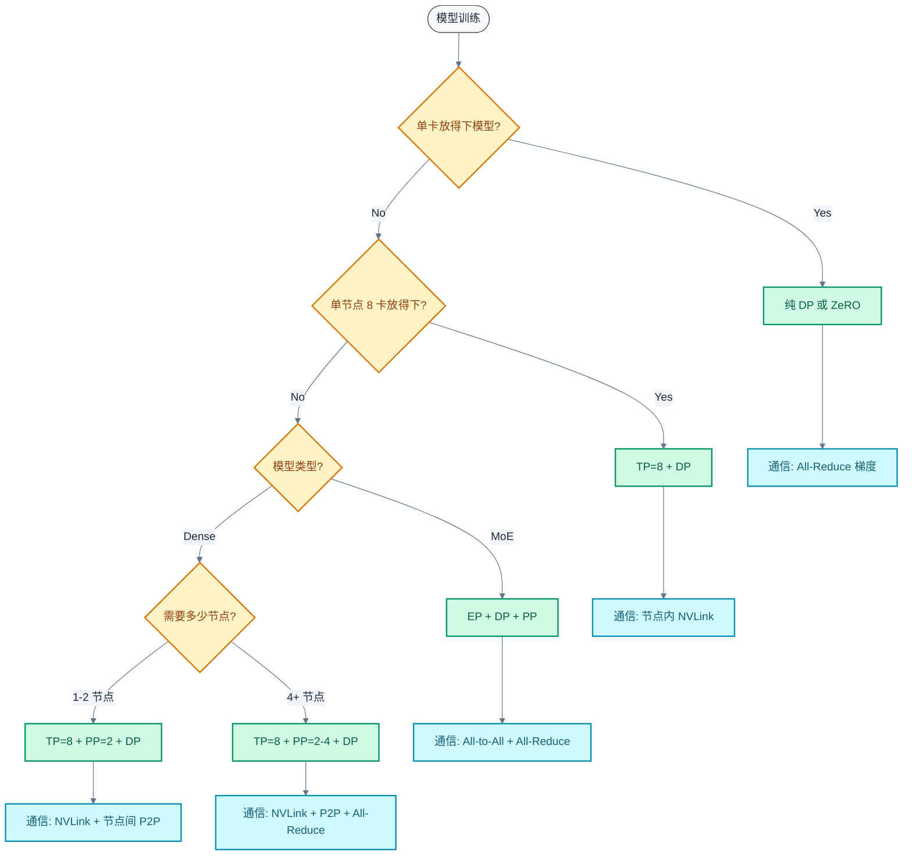

# 分布式训练并行策略

> 单卡放不下 70B 模型——这是分布式训练的起点。本文从显存约束出发，逐个推导 DP/ZeRO/TP/PP/SP/EP 的通信量和内存节省，最终回答：给定模型和硬件，并行策略怎么选？

### 关键术语

| 缩写 | 全称 | 含义 |
|------|------|------|
| DP | Data Parallelism | 数据并行，每卡完整模型副本+不同数据 |
| TP | Tensor Parallelism | 张量并行，按权重列/行切分到多卡 |
| PP | Pipeline Parallelism | 流水线并行，按层切分到多卡 |
| SP | Sequence Parallelism | 序列并行，沿序列维度切分 |
| EP | Expert Parallelism | 专家并行，MoE 专家分布到多卡 |
| ZeRO | Zero Redundancy Optimizer | 零冗余优化器，消除 DP 的内存冗余 |
| FSDP | Fully Sharded Data Parallel | 全分片数据并行，PyTorch 原生 ZeRO-3 |
| All-Reduce | — | 集合通信原语，所有卡聚合数据后广播 |
| All-to-All | — | 集合通信原语，每对卡之间点对点交换数据 |
| NVLink | — | NVIDIA GPU 间高速互连，900 GB/s (H100) |
| IB | InfiniBand | 高性能网络互连，400 Gb/s (NDR) |
| MFU | Model FLOPs Utilization | 模型算力利用率 |

---

## 1. 从一个问题出发

上一篇推导了 LLaMA-2 70B 训练一步需要 6.88 PFLOPS。但更紧迫的问题是——**模型放不进单张卡**。

```
70B 模型训练显存需求:
  参数 (BF16):       140 GB
  梯度 (BF16):       140 GB
  优化器状态 (FP32): 840 GB  (AdamW: 参数副本 + m + v)
  激活值 (选择性重计算): ~40 GB
  总计:              ~1160 GB

单张 H100 HBM: 80 GB
需要: 1160 / 80 ≈ 15 张卡 (仅从显存角度)
```

15 张卡只是显存下限。实际上还需要考虑通信开销、负载均衡、容错等因素，通常需要更多卡。核心矛盾：**模型太大放不下 → 必须切分 → 切分引入通信 → 通信降低 MFU**。

每种并行策略都是在"内存节省"和"通信代价"之间做权衡。本文的目标是定量理解这个权衡。

---

## 2. 数据并行（DP）：最简单的起点

### 2.1 基本原理

数据并行最直观：每张卡持有一个完整的模型副本，输入数据按 batch 维度切分。

```
GPU 0: 模型副本 + batch[0:B/N]
GPU 1: 模型副本 + batch[B/N:2B/N]
...
GPU N-1: 模型副本 + batch[(N-1)B/N:B]

前向: 各卡独立计算
反向: 各卡独立计算梯度 → All-Reduce 聚合梯度 → 各卡同步更新
```

**显存分析**：每卡需要存储完整模型（参数+梯度+优化器状态），N 卡 DP 的总显存是单卡的 N 倍——**冗余**。

```
70B 模型 DP=8:
  每卡: 1160 GB → 放不进 80 GB HBM
  总显存: 1160 × 8 = 9280 GB → 8 卡浪费了 7 份完整副本
```

**通信分析**：每步一次 All-Reduce，通信量等于梯度大小：

```
All-Reduce 通信量 = 2 × (N-1)/N × 参数量 × sizeof(dtype)
                 ≈ 2 × 参数量 × sizeof(dtype)  (N 较大时)

70B BF16: 2 × 70 × 10⁹ × 2 = 280 GB/步
```

系数 2 来自 Ring All-Reduce 的两个阶段（Reduce-Scatter + All-Gather），每阶段传输约 `(N-1)/N × 数据量`。

### 2.2 DP 的适用场景

DP 适合**模型能放进单卡**的情况。此时 DP 只增加算力，不增加单卡显存：

```
7B 模型训练显存:
  参数: 14 GB, 梯度: 14 GB, 优化器: 84 GB, 激活: ~5 GB
  总计: ~117 GB → 单卡放不下

7B 模型用 ZeRO-3 后:
  参数分片: 14/N GB, 梯度分片: 14/N GB, 优化器分片: 84/N GB
  N=2: 每卡 ~58 GB → 放进 80 GB HBM ✓
```

但 70B 模型即使 ZeRO-3 分片到 8 卡，每卡仍需 ~145 GB——还是放不下。**大模型必须用模型并行**。

---

## 3. ZeRO：消除数据并行的内存冗余

### 3.1 三级优化

ZeRO 的核心观察：DP 的 N 个副本中，优化器状态、梯度、参数都是冗余的。逐级消除：

| 级别 | 分片对象 | 每卡显存 | 通信量变化 |
|------|----------|----------|-----------|
| DP (基线) | 无 | 2Ψ + 2Ψ + 12Ψ = 16Ψ | All-Reduce 梯度 |
| ZeRO-1 | 优化器状态 | 2Ψ + 2Ψ + 12Ψ/N | 不变 |
| ZeRO-2 | +梯度 | 2Ψ + 2Ψ/N + 12Ψ/N | Reduce-Scatter 替代 All-Reduce |
| ZeRO-3 | +参数 | 2Ψ/N + 2Ψ/N + 12Ψ/N = 16Ψ/N | +All-Gather 参数 |

其中 Ψ = 参数量（BF16，2 Bytes），优化器状态按 FP32 的参数+m+v = 12Ψ Bytes 计算。

```
70B 模型 (Ψ = 70×10⁹):
  DP:      16 × 140 GB = 2240 GB/卡 → 不可能
  ZeRO-1:  280 + 280 + 840/N GB
           N=8:  280+280+105 = 665 GB/卡 → 不够
  ZeRO-2:  280 + 280/N + 840/N GB
           N=8:  280+35+105 = 420 GB/卡 → 不够
  ZeRO-3:  280/N + 280/N + 840/N = 1400/N GB
           N=8:  175 GB/卡 → 还是超 80 GB
           N=16: 87.5 GB/卡 → 仍超 80 GB
           N=32: 43.75 GB/卡 → 放得下 ✓
```

**结论**：70B 模型纯 ZeRO-3 需要至少 32 卡——仅从显存角度。但 32 卡 ZeRO-3 的通信代价很高。

### 3.2 ZeRO-3 的通信代价

ZeRO-3 每层前向和反向都需要 All-Gather 参数：

```
每层前向: All-Gather 参数 → 计算 → 丢弃参数
每层反向: All-Gather 参数 → 计算梯度 → 丢弃参数

通信量 = 2 × n_layers × 参数量/层 × sizeof(dtype)
       = 2 × 80 × 856M × 2
       = 274 GB/步

对比 DP 的 All-Reduce 梯度: 280 GB/步
```

通信量与 DP 相当，但**通信模式不同**：DP 是一步大 All-Reduce，ZeRO-3 是每层两次小 All-Gather。ZeRO-3 的优势是可以与计算重叠——在计算第 L 层时 All-Gather 第 L+1 层的参数。

### 3.3 ZeRO 的局限

ZeRO 本质上还是数据并行——它没有改变"每张卡需要计算完整前向+反向"的事实。当模型大到单卡算力不够（即使参数分片后激活值放不下），ZeRO 就无能为力了。

```
70B 模型 ZeRO-3, N=32:
  每卡参数: 4.4 GB (BF16)
  每卡激活值: ~40 GB (不分片, 与 DP 相同)
  每卡总显存: ~44 GB → 放得下

但激活值 40 GB 是选择性重计算后的值。
如果不做重计算: 激活值可达 200+ GB → 单卡放不下
```

**激活值是 ZeRO 无法分片的**（它取决于当前层的输入，必须完整可用）。这就是需要模型并行的原因——模型并行不仅分片参数，还分片计算和激活值。

---

## 4. 张量并行（TP）：按权重切分

### 4.1 列并行与行并行

TP 的核心思想：将一个大的 GEMM 拆成多个小 GEMM，分布到多卡上。

**列并行（Column Parallel）**：按输出维度切分权重矩阵的列。

```
Y = X × W = X × [W₁ | W₂ | ... | Wₙ]

GPU i: Yᵢ = X × Wᵢ    (Wᵢ 是 W 的第 i 块列)

每卡计算量: 2 × M × K × N/N_tp
每卡权重:   K × N/N_tp × sizeof
```

**行并行（Row Parallel）**：按输入维度切分权重矩阵的行。

```
Y = X × W = [X₁, X₂, ..., Xₙ] × [W₁; W₂; ...; Wₙ]

GPU i: Yᵢ = Xᵢ × Wᵢ    (Wᵢ 是 W 的第 i 块行)
Y = Σ Yᵢ                (需要 All-Reduce 聚合)

每卡计算量: 2 × M × K/N_tp × N
每卡权重:   K/N_tp × N × sizeof
```

### 4.2 Transformer 层的 TP 切分

一个 Transformer 层有两个需要 TP 的位置：

```
Attention:
  QKV 投影 → 列并行 (输出按 head 切分)
    GPU i 计算 n_heads/N_tp 个 head 的 Q, K, V
    → 各卡独立完成 Attention (每卡有自己的 head 子集)
  Output 投影 → 行并行 (输入按 head 切分)
    GPU i: AttnOutᵢ × Woᵢ
    → All-Reduce 聚合结果

FFN:
  Gate + Up 投影 → 列并行 (输出按 d_ff 切分)
    GPU i 计算 d_ff/N_tp 列
  Down 投影 → 行并行 (输入按 d_ff 切分)
    GPU i: FFN_midᵢ × Wdownᵢ
    → All-Reduce 聚合结果
```

**每层需要 2 次 All-Reduce**（Attention 后 1 次 + FFN 后 1 次）。

### 4.3 TP 通信量推导

每次 All-Reduce 传输的数据量等于该层输出的激活值：

```
每次 All-Reduce 通信量 = 2 × S × d_model × sizeof(dtype)
                       (系数 2: Reduce-Scatter + All-Gather)

每层: 2 次 All-Reduce
通信量/层 = 2 × 2 × S × d_model × sizeof(dtype)
         = 4 × S × d_model × sizeof(dtype)

70B 模型, S=4096, BF16:
  = 4 × 4096 × 8192 × 2
  = 268 MB/层

80 层: 80 × 268 MB = 21 GB/步
```

### 4.4 TP 的内存节省

```
TP=N_tp 时每卡显存:
  参数: 140/N_tp GB
  梯度: 140/N_tp GB
  优化器状态: 840/N_tp GB
  激活值: ~40/N_tp GB (TP 也分片激活值!)
  总计: 1160/N_tp GB

TP=8: 1160/8 = 145 GB → 仍超 80 GB
TP=16: 1160/16 = 72.5 GB → 放进 80 GB ✓
```

**TP 的关键优势**：激活值也被分片。这是 TP 相比 ZeRO 的根本区别——ZeRO 分片参数但激活值完整保留，TP 连激活值一起分片。

### 4.5 TP 度的选择

TP 度不是越大越好。通信量与 TP 度无关（固定 2 次 All-Reduce/层），但**通信延迟**受硬件拓扑约束：

```
TP 通信要求极低延迟:
  每次 All-Reduce: ~268 MB / 2 = 134 MB (Reduce-Scatter 或 All-Gather)
  NVLink 带宽: 900 GB/s (节点内)
  IB 带宽: 50 GB/s (节点间, NDR 400 Gb/s)

  节点内 TP=8: 134 MB / 900 GB/s ≈ 0.15 ms
  节点间 TP=2: 134 MB / 50 GB/s ≈ 2.7 ms

  节点间通信延迟是节点内的 18×!
```

**实践规则**：TP 限制在单个节点内（通常 TP ≤ 8）。跨节点用 PP 或 DP。

| TP 度 | 每卡显存 (70B) | 通信延迟 | 适用场景 |
|-------|---------------|----------|----------|
| 1 | 1160 GB | 0 | 模型能放进单卡 |
| 2 | 580 GB | ~0.07 ms | 7B-13B 模型 |
| 4 | 290 GB | ~0.11 ms | 30B-70B 模型 |
| 8 | 145 GB | ~0.15 ms | 70B+ 模型 (单节点) |

---

## 5. 流水线并行（PP）：按层切分

### 5.1 基本原理

PP 将模型的不同层分配到不同卡上，数据像流水线一样依次通过各卡：

```
GPU 0: Layer 0-19    → 接收输入, 计算前 20 层, 发送激活值给 GPU 1
GPU 1: Layer 20-39   → 接收激活值, 计算, 发送给 GPU 2
GPU 2: Layer 40-59   → ...
GPU 3: Layer 60-79   → 计算最后 20 层, 反向传播开始
```

**PP 的内存节省**：每卡只存储一部分层的参数、梯度和优化器状态。

```
70B 模型 PP=4:
  每卡参数: 140/4 = 35 GB
  每卡梯度: 140/4 = 35 GB
  每卡优化器: 840/4 = 210 GB
  每卡激活值: ~10 GB (只存自己层的)
  每卡总计: ~290 GB → 还是超 80 GB
```

PP 单独使用时，70B 模型仍需 PP≥15 才能放进 80 GB HBM。但 PP 的通信量很小：

```
PP 通信量 = 2 × S × d_model × sizeof(dtype)  (前向+反向各一次点对点)
         = 2 × 4096 × 8192 × 2 = 134 MB/步

对比 TP: 21 GB/步 → PP 通信量是 TP 的 1/160!
```

### 5.2 气泡问题：PP 的核心代价

PP 的代价不是通信量，而是**流水线气泡**——GPU 空闲等待的时间。

**朴素 PP（GPipe）**：先做完整前向，再做完整反向。

```
时间 →  GPU0    GPU1    GPU2    GPU3
F0     [F0]     .       .       .        ← 只有 GPU0 在工作
F1     [F1]     [F0]    .       .        ← GPU1 开始, GPU0 继续
F2     [F2]     [F1]    [F0]    .        ← 逐级填充
F3     [F3]     [F2]    [F1]    [F0]     ← 全部填充
B3     .        [B3]    [B2]    [B1]     ← 反向开始
B2     .        .       [B3]    [B2]
B1     .        .       .       [B3]
B0     [B0]     .       .       .        ← GPU0 等了很久

气泡率 = 空闲时间 / 总时间 ≈ (PP-1) / PP = 75% (PP=4)
```

**1F1B 调度**：交替执行前向和反向，减少气泡。

```
时间 →  GPU0      GPU1      GPU2      GPU3
        [F0]      .         .         .
        [F1]      [F0]      .         .
        [F2]      [F1]      [F0]      .
        [F3]      [F2]      [F1]      [F0]     ← 预热完成
        [B0]      [F3]      [F2]      [F1]     ← GPU0 开始反向
        [F4]      [B1]      [F3]      [F2]     ← 1F1B 稳态
        [B4]      [F5]      [B2]      [F3]
        ...       ...       ...       ...
        [B_last]  [B_last-1][B_last-2][B_last-3]

气泡率 ≈ (PP-1) / (PP + micro_batches - 1)
micro_batches=16, PP=4: 气泡率 ≈ 3/19 ≈ 16%
```

### 5.3 Interleaved 1F1B：进一步压缩气泡

标准 1F1B 中，每卡只负责连续的一组层。Interleaved 1F1B 让每卡负责多组不连续的层：

```
标准 PP=4:
  GPU0: Layer 0-19,   GPU1: Layer 20-39
  GPU2: Layer 40-59,  GPU3: Layer 60-79

Interleaved PP=4 (每组 10 层):
  GPU0: Layer 0-9,  40-49     ← 两组不相邻的层
  GPU1: Layer 10-19, 50-59
  GPU2: Layer 20-29, 60-69
  GPU3: Layer 30-39, 70-79
```

效果：每个 micro-batch 在流水线中前进的"步长"变小，气泡缩小：

```
标准 1F1B 气泡率: (PP-1) / (PP + m - 1)
Interleaved 气泡率: (PP-1) / (PP × V + m - 1)    (V = 每卡的段数)

PP=4, m=16, V=2:
  标准: 3/19 ≈ 16%
  Interleaved: 3/23 ≈ 13%
```

代价：通信次数增加 V 倍（每段之间都需要点对点通信），但每次通信量更小。

### 5.4 PP 的通信量 vs TP 的通信量

```
PP 通信量/步:
  = 2 × PP × S × d_model × sizeof  (前向+反向, PP-1 次点对点)
  ≈ 2 × 4 × 4096 × 8192 × 2 = 536 MB

TP 通信量/步 (TP=8):
  = 80 × 4 × 4096 × 8192 × 2 = 21 GB

PP 通信量是 TP 的 1/40!
```

**但 PP 的气泡损失远大于 TP 的通信损失**。PP=4 时气泡率 16%，而 TP=8 的通信占比约 5-8%。这就是为什么实践中优先用 TP，PP 作为补充。

---

## 6. 序列并行（SP）：长上下文的必需品

### 6.1 TP 的隐藏问题

在标准 TP 中，Dropout 和 LayerNorm 等操作在序列维度上是独立的，但它们的激活值在所有 TP 卡上完整冗余：

```
TP=8 时, Attention 和 FFN 的激活值被分片到 8 卡:
  每卡激活值: 1/8

但 LayerNorm 和 Dropout 的激活值在每卡上都是完整的:
  每卡: 完整的 S × d_model 激活值 → 冗余!
```

SP 将 LayerNorm/Dropout 的激活值也沿序列维度切分：

```
标准 TP:
  All-Reduce → LayerNorm(完整) → Dropout(完整) → 列并行 GEMM → All-Reduce → ...

SP:
  All-Reduce → [Reduce-Scatter 沿 S 维度] → LayerNorm(分片) → Dropout(分片)
  → [All-Gather 沿 S 维度] → 列并行 GEMM → All-Reduce → ...
```

### 6.2 SP 的通信代价

SP 用 Reduce-Scatter + All-Gather 替代 All-Reduce，通信量不变：

```
All-Reduce = Reduce-Scatter + All-Gather
通信量: 2 × S × d_model × sizeof(dtype)

SP: Reduce-Scatter + All-Gather (沿 S 维度)
通信量: 2 × S × d_model × sizeof(dtype) → 相同!
```

**SP 是"免费"的**——通信量不变，但节省了 LayerNorm/Dropout 的激活值显存。Megatron-LM 默认开启 SP。

### 6.3 Ring Attention：超长序列的 SP

当序列长度 S 超过单卡能处理的范围（如 S=128K），需要沿序列维度切分 Attention 计算：

```
Ring Attention:
  将 S 切分为 N_sp 段, 每卡处理 S/N_sp 个 Token
  Q, K, V 沿 S 维度分片到各卡
  通过环形通信传递 K, V 块
  每卡逐步累加得到完整的 Attention 输出

通信量: ~2 × S × d_model × sizeof × n_layers
```

Ring Attention 的核心价值：让 128K 甚至 1M 上下文的训练成为可能，代价是额外的环形通信。

---

## 7. 专家并行（EP）：MoE 的特殊需求

### 7.1 MoE 的并行挑战

MoE 模型的 FFN 由多个专家组成，每个 Token 只激活 top_k 个专家。EP 将专家分布到不同卡上：

```
DeepSeek-V3: 256 个路由专家 + 1 个共享专家
EP=64: 每卡 4 个路由专家 + 共享专家的 1/64

Token 路由:
  1. 计算 Router 得到每个 Token 的 top-8 专家
  2. All-to-All Dispatch: Token 发送到目标专家所在 GPU
  3. 计算专家输出
  4. All-to-All Combine: 输出返回原 GPU
```

### 7.2 All-to-All 通信量

```
All-to-All 通信量 ≈ 2 × S × d_ff × sizeof(dtype) / EP
                  (Dispatch + Combine)

DeepSeek-V3, S=4096, d_ff=18432, BF16, EP=64:
  = 2 × 4096 × 18432 × 2 / 64
  = 4.7 MB/层

58 层 MoE: 58 × 4.7 = 273 MB/步 → 通信量不大
```

**但 All-to-All 的实际延迟远高于理论值**：

```
All-to-All 延迟 = 算法延迟 + 网络延迟 + 同步开销

问题:
  1. 负载不均衡: 某些专家收到更多 Token → 最慢的卡决定整体延迟
  2. 小消息: 每对 GPU 间传输量小, 无法充分利用带宽
  3. 同步: 所有卡必须同时开始和结束

DeepSeek-V3 报告 All-to-All 占比 ~20% → 这是 MoE MFU 低的主要原因
```

### 7.3 EP 的负载均衡

负载不均衡是 EP 的核心难题。解决方案：

| 方案 | 原理 | 代价 |
|------|------|------|
| 辅助损失 | Router 训练时加正则项，鼓励均匀分配 | 损失精度 |
| 容量因子 | 每个专家预留额外容量（如 1.25×） | 浪费算力和显存 |
| Token 丢弃 | 超出容量的 Token 直接丢弃 | 损失信息 |
| Expert Choice | 专家选择 Token（而非 Token 选专家） | 改变语义 |
| 共享专家 | 1 个专家始终激活，减少路由压力 | 增加计算量 |

DeepSeek-V3 使用辅助损失 + 共享专家 + 无辅助损失的负载均衡策略，将负载不均衡控制在 5% 以内。

---

## 8. 混合并行策略选择

### 8.1 3D 并行：TP + PP + DP

实际训练大模型时，单一并行策略都不够，需要组合使用：

```
3D 并行 = TP × PP × DP

总 GPU 数 = TP × PP × DP

70B 模型在 H100 上的典型配置:
  TP=8, PP=2, DP=4 → 64 张 H100

  每卡显存:
    参数: 140/(8×2) = 8.75 GB
    梯度: 140/(8×2) = 8.75 GB
    优化器: 840/(8×2) = 52.5 GB
    激活值: ~40/(8×2) = 2.5 GB
    总计: ~72.5 GB → 放进 80 GB ✓
```

### 8.2 并行策略选择决策树



### 8.3 典型配置的定量对比

以 LLaMA-2 70B 在不同规模集群上的配置为例：

| 配置 | TP | PP | DP | 总 GPU | 每卡显存 | 通信占比 | MFU |
|------|-----|-----|-----|--------|---------|---------|-----|
| 单节点 | 8 | 1 | 1 | 8 | 145 GB ❌ | 5-8% | — |
| 2 节点 | 8 | 2 | 1 | 16 | 72.5 GB ✓ | 10-15% | ~50% |
| 4 节点 | 8 | 2 | 4 | 64 | 72.5 GB ✓ | 12-18% | ~48% |
| 8 节点 | 8 | 2 | 8 | 128 | 72.5 GB ✓ | 15-22% | ~45% |

**通信占比随规模增长的原因**：DP 维度的 All-Reduce 需要跨节点，走 IB 而非 NVLink，带宽降低 18×。

### 8.4 DeepSeek-V3 的并行配置

DeepSeek-V3 (671B MoE) 的配置展示了 MoE 模型的并行策略选择：

```
模型: 671B 总参数, 37B 激活参数/Token
硬件: 2048 × H800 (2 节点 × 8 卡, NVLink + IB)

并行配置:
  EP=64: 256 个专家分布到 64 卡, 每卡 4 个专家
  DP=32: 32 个数据并行组
  PP=1:  无流水线并行 (单节点内完成一层)

  总 GPU = EP × DP = 64 × 32 = 2048

通信分析:
  All-to-All (EP):  每层 2 次, 占比 ~20%
  All-Reduce (DP):  每步 1 次, 占比 ~5%
  总通信占比: ~25%

  MFU: ~52% (考虑 FP8 训练的额外节省)
```

**为什么不用 PP？** 因为 MoE 的 All-to-All 通信已经很高，再加 PP 的气泡会进一步降低 MFU。DeepSeek-V3 选择用更多卡做 EP+DP，避免 PP 的气泡损失。

### 8.5 通信量汇总对比

```
70B Dense 模型, S=4096, BF16, 每步通信量:

DP=64:     All-Reduce 梯度: 280 GB
TP=8:      All-Reduce 激活: 21 GB
PP=4:      P2P 激活: 0.5 GB
SP (TP内): 与 TP 相同 (替换 All-Reduce)
EP=64:     All-to-All: ~0.3 GB/层 (MoE 专用)

关键洞察:
  DP 通信量最大, 但可以与计算重叠
  TP 通信量中等, 但延迟敏感 (必须等通信完成才能继续计算)
  PP 通信量最小, 但气泡损失最大
  EP 通信量不大, 但 All-to-All 延迟高
```

---

## 9. 要点回顾

| 要点 | 说明 |
|------|------|
| DP 冗余 | N 卡 DP 存储 N 份完整副本，显存效率 1/N |
| ZeRO 三级 | 逐级分片优化器状态→梯度→参数，ZeRO-3 每卡 16Ψ/N |
| ZeRO 局限 | 无法分片激活值，大模型仍需模型并行 |
| TP 核心 | 列并行+行并行组合，每层 2 次 All-Reduce |
| TP 优势 | 激活值也被分片；限制在节点内（NVLink） |
| PP 代价 | 通信量小但气泡大，1F1B 气泡率 ≈ (PP-1)/(PP+m-1) |
| SP | 替换 All-Reduce 为 RS+AG，通信量不变但节省激活值 |
| EP | MoE 的 All-to-All 通信占比 ~20%，是 MFU 主要损失 |
| 3D 并行 | TP(节点内) + PP(跨节点少量) + DP(大规模扩展) |
| 策略选择 | 先满足显存约束，再最小化通信占比，最后考虑实现复杂度 |

---

## 参考资料

- [Megatron-LM: Training Multi-Billion Parameter Language Models](https://arxiv.org/abs/1909.08053) — TP + PP 实现
- [ZeRO: Memory Optimizations Toward Training Trillion Parameter Models](https://arxiv.org/abs/1910.02054) — ZeRO 原理
- [Efficient Large-Scale Language Model Training on GPU Clusters](https://arxiv.org/abs/2104.04473) — 3D 并行 MFU 分析
- [DeepSeek-V3 Technical Report](https://arxiv.org/abs/2412.19437) — EP + DP + FP8 实践
- [Reducing Activation Recomputation in Large Transformer Models](https://arxiv.org/abs/2205.05198) — SP + 激活值优化
- [Ring Attention with Blockwise Transformers](https://arxiv.org/abs/2310.01889) — Ring Attention

> 前置阅读：[03-GPU架构：从SIMT到TensorCore](./03-GPU架构-从SIMT到TensorCore.md)、[02-Transformer计算特征第一性分析](./02-Transformer计算特征第一性分析.md)
> 下一篇：[05-训练全流程与工程实践](./05-训练全流程与工程实践.md)
