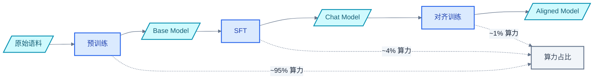

# 训练全流程与工程实践

> 知道并行策略还不够——从数据准备到模型发布，训练一个 LLM 要经历哪些阶段？每个阶段的算法选择如何影响系统需求？本文以 LLaMA-2 70B 和 DeepSeek-V3 为线索，串联预训练、SFT、对齐训练的完整流程，并定量分析混合精度、优化器、检查点等工程决策的代价。

### 关键术语

| 缩写 | 全称 | 含义 |
|------|------|------|
| SFT | Supervised Fine-Tuning | 有监督微调 |
| RLHF | Reinforcement Learning from Human Feedback | 基于人类反馈的强化学习 |
| PPO | Proximal Policy Optimization | 近端策略优化 |
| DPO | Direct Preference Optimization | 直接偏好优化 |
| GRPO | Group Relative Policy Optimization | 组相对策略优化 |
| LoRA | Low-Rank Adaptation | 低秩适配，参数高效微调 |
| BF16 | BFloat16 | 16 位浮点格式（8 位指数，7 位尾数） |
| FP8 | Floating Point 8 | 8 位浮点格式 |
| TE | Transformer Engine | NVIDIA Transformer 引擎 |
| AdamW | Adam with Decoupled Weight Decay | 解耦权重衰减的 Adam 优化器 |
| GC | Gradient Checkpointing | 梯度检查点/选择性激活重计算 |
| BFloat16 | Brain Float 16 | Google Brain 设计的 16 位浮点格式 |

---

## 1. 训练全流程总览

一个 LLM 从零到可用，经历三个训练阶段：



**为什么需要三个阶段？** 每个阶段解决不同的问题：

| 阶段 | 目标 | 数据 | 典型规模 |
|------|------|------|----------|
| 预训练 | 学习语言知识和世界知识 | 万亿 Token 无标注语料 | 2T tokens, 6.88 PFLOPS/步 |
| SFT | 学习遵循指令 | 数万条指令-回复对 | 10K-100K 样本 |
| 对齐训练 | 对齐人类偏好 | 偏好对比数据 | 10K-50K 对 |

---

## 2. 预训练：算力消耗的 95%

### 2.1 数据准备

预训练数据的质量直接决定模型上限。LLaMA-2 的数据流水线：

```
原始语料 (网页、书籍、代码、论文)
  ↓ 去重 (MinHash + LSH)
  ↓ 过滤 (语言检测、质量分类、毒性过滤)
  ↓ 混合 (不同来源按比例组合)
  ↓ Tokenization (BPE/SentencePiece)
训练数据 (~2T tokens)
```

**数据混合比例的影响**：

| 数据源 | LLaMA-2 比例 | 作用 |
|--------|-------------|------|
| 网页 | 67% | 通用语言知识 |
| 书籍 | 4.5% | 长文本理解 |
| 维基 | 4.5% | 事实性知识 |
| 代码 | 5% | 逻辑推理 |
| 论文 | 2.5% | 科学知识 |
| 对话 | 2% | 对话能力 |

代码数据占比虽小，但对推理能力提升显著。DeepSeek-Coder 用 87% 代码训练，在代码任务上远超通用模型。

### 2.2 训练稳定性：为什么大模型容易训崩

大模型训练最怕的不是慢，而是**训崩**——损失突然飙升，模型不可恢复。

**损失尖峰的常见原因**：

```
1. 数据质量问题
   → 某个 batch 包含异常数据 (如重复 Token、乱码)
   → 梯度异常大 → 参数更新过大 → 损失飙升

2. 学习率过大
   → 训练初期参数变化剧烈
   → 某些层进入数值不稳定区域

3. 梯度爆炸
   → 深层网络梯度累积
   → BF16 的动态范围不够 → 溢出
```

**工程对策**：

| 对策 | 原理 | 代价 |
|------|------|------|
| 梯度裁剪 | `grad_norm = max(grad_norm, max_norm)` | 无，标准做法 |
| 学习率预热 | 前 2000 步从 0 线性增到 lr | 无，标准做法 |
| BF16 混合精度 | 主权重 FP32，计算 BF16 | 显存增加 ~50% |
| 损失监控 | 检测到尖峰时回滚到上一个检查点 | 需要频繁保存 |
| 数据质量过滤 | 去重、去噪、质量评分 | 数据量减少 |

### 2.3 长上下文训练

从 4K 到 128K 上下文，不只是改个参数——训练过程本身需要分阶段：

```
阶段 1: S=4096, 训练 2T tokens → 基础能力
阶段 2: S=32768, 训练 100B tokens → 扩展上下文
  → RoPE 外推: 调整旋转位置编码的频率基数
  → 常见做法: 将 RoPE 的 base 频率从 10000 增大到 1000000

上下文扩展的显存影响:
  S=4K:  激活值 ~40 GB (选择性重计算)
  S=32K: 激活值 ~320 GB → 需要 SP 或更多 TP
  S=128K: 激活值 ~1280 GB → 必须用 Ring Attention
```

**为什么不能直接用长上下文训练？** 因为 Attention 的 O(S²) 计算量。S=128K 时，单步计算量是 S=4K 的 1024 倍。分阶段训练先用短上下文建立基础能力，再用少量长上下文数据扩展。

---

## 3. 混合精度训练：速度与精度的权衡

### 3.1 为什么不用 FP32 训练

```
70B 模型 FP32 训练显存:
  参数: 280 GB, 梯度: 280 GB, 优化器: 1680 GB
  总计: 2240 GB → 需要更多卡

FP32 计算吞吐 (H100):
  FP32 Tensor Core: 989 TFLOPS
  BF16 Tensor Core: 989 TFLOPS → 相同!

  但 BF16 数据量减半 → 通信量减半 → 带宽压力减半
```

FP32 训练没有吞吐优势，但显存和通信代价翻倍。所以现代 LLM 训练全部使用混合精度。

### 3.2 BF16 vs FP16

| 对比维度 | FP16 | BF16 |
|----------|------|------|
| 指数位 | 5 位 | 8 位 |
| 尾数位 | 10 位 | 7 位 |
| 动态范围 | 2⁻¹⁴ ~ 2¹⁵ | 2⁻¹²⁶ ~ 2¹²⁷ |
| 精度 | 更高 | 更低 |
| 损失缩放 | 必须 | 不需要 |

**关键区别**：BF16 的动态范围与 FP32 相同（8 位指数），所以不需要损失缩放。FP16 的动态范围小，梯度容易下溢，必须用损失缩放将梯度放大到 FP16 可表示的范围。

```
FP16 损失缩放:
  loss_scaled = loss × scale_factor
  grad_scaled = backward(loss_scaled)
  grad = grad_scaled / scale_factor

  问题: scale_factor 太大 → 梯度溢出; 太小 → 梯度下溢
  → 需要动态调整 scale_factor → 增加工程复杂度

BF16: 不需要损失缩放 → 简化训练流程
```

**代价**：BF16 尾数只有 7 位，精度比 FP16 低。但在实践中，BF16 的精度对 LLM 训练足够——因为 Adam 优化器的主权重和梯度方差本身就不需要高精度。

### 3.3 FP8 训练：Hopper 的新可能

H100 引入 FP8 (E4M3 和 E5M2) 支持，理论吞吐翻倍：

```
H100 吞吐:
  BF16 Tensor Core: 989 TFLOPS
  FP8 Tensor Core:  1979 TFLOPS → 2×

FP8 格式:
  E4M3: 4 位指数 + 3 位尾数 → 前向传播 (需要精度)
  E5M2: 5 位指数 + 2 位尾数 → 反向传播 (需要动态范围)
```

**FP8 训练的挑战**：

```
1. 精度损失
   FP8 只有 3-4 位尾数 → 表示误差大
   → 需要细粒度量化: 每 128 个元素一组缩放因子

2. 梯度量化
   反向传播的梯度用 FP8 表示 → 梯度噪声
   → 需要随机舍入或确定性舍入

3. 累加精度
   Tensor Core 内部用 FP32 累加 → 累加精度足够
   但输入只有 FP8 → 输入量化误差传播到输出
```

**DeepSeek-V3 的 FP8 实践**：

```
策略: 细粒度量化 + 在线缩放
  每 128 个 Token × 128 个通道 一组缩放因子
  前向: BF16 → FP8(E4M3) → GEMM → BF16
  反向: BF16 → FP8(E5M2) → GEMM → BF16
  主权重和优化器状态保持 BF16/FP32

效果:
  训练速度提升 ~40% (不是 2×, 因为非 GEMM 操作不变)
  精度损失: 在基准测试上与 BF16 训练差异 <0.1%
```

FP8 训练不是"全 FP8"——关键路径（权重主副本、优化器状态、归约操作）仍用高精度，只在 GEMM 计算时用 FP8。

---

## 4. 优化器：AdamW 的显存代价

### 4.1 AdamW 的显存开销

AdamW 为每个参数维护三个状态：

```
每个参数的显存:
  参数 (BF16):     2 Bytes
  梯度 (BF16):     2 Bytes
  主权重 (FP32):   4 Bytes  ← 混合精度训练需要 FP32 副本
  一阶动量 m (FP32): 4 Bytes
  二阶动量 v (FP32): 4 Bytes
  总计: 16 Bytes/参数

70B 模型: 70 × 10⁹ × 16 = 1120 GB → 仅优化器状态就占 840 GB!
```

优化器状态占训练显存的 **75%**。这就是 ZeRO 优先分片优化器状态的原因。

### 4.2 优化器状态的内存优化

| 方案 | 每参数显存 | 70B 总量 | 精度影响 |
|------|-----------|---------|---------|
| AdamW (基线) | 16 B | 1120 GB | — |
| ZeRO-1 (N=8) | 2+2+4+4+4/8=12.5 B | 875 GB | 无 |
| ZeRO-3 (N=8) | 16/8=2 B | 140 GB | 无 |
| 8-bit Adam | 2+2+4+1+1=10 B | 700 GB | 微小 |
| Sophia | 2+2+4+4+4=16 B | 1120 GB | — |
| Adafactor | 2+2+4+~0.5+~0.5=9 B | 630 GB | 中等 |

8-bit Adam 将 m 和 v 量化到 INT8，节省 50% 优化器显存。但量化/反量化的计算开销可能抵消部分收益。

### 4.3 学习率调度

LLM 训练几乎统一使用 Warmup + Cosine Decay：

```
lr(t) = {
  lr_max × t / warmup_steps,                    t < warmup_steps
  lr_min + 0.5 × (lr_max - lr_min) × (1 + cos(π × (t-warmup) / (T-warmup))),  t ≥ warmup_steps
}

典型参数:
  lr_max = 3e-4 (70B 模型)
  lr_min = 3e-5 (lr_max 的 1/10)
  warmup_steps = 2000
  T = 总步数 (~1.5M for 2T tokens, batch=4M tokens/step)
```

**为什么用 Cosine Decay 而不是 Step Decay？** Cosine Decay 是平滑的，不会在衰减点产生训练不稳定。Step Decay 在衰减点损失会突然波动。

---

## 5. SFT：从 Base 到 Chat

### 5.1 数据格式

SFT 的数据是"指令-回复"对：

```
输入: "请解释什么是梯度下降"
输出: "梯度下降是一种优化算法，通过沿梯度反方向更新参数来最小化损失函数..."

训练时:
  拼接输入+输出, 但只在输出部分计算损失
  → 模型学习生成回复, 而不是复述指令
```

### 5.2 全参数微调 vs LoRA

| 对比维度 | 全参数微调 | LoRA |
|----------|-----------|------|
| 可训练参数 | 全部 70B | ~0.1-1% (70M-700M) |
| 训练显存 | 1160 GB | ~50-100 GB |
| 训练速度 | 基线 | 2-3× 快 |
| 效果 | 最优 | 接近全参数 (95-99%) |
| 多任务 | 每任务一个完整模型 | 每任务一个 LoRA 适配器 (~100 MB) |

**LoRA 的原理**：将权重更新分解为低秩矩阵：

```
原始: Y = X × W,  W ∈ R^{d×d}
LoRA: Y = X × (W + ΔW) = X × (W + B × A)
  A ∈ R^{d×r}, B ∈ R^{r×d}, r << d (典型 r=8-64)

可训练参数: 2 × d × r
  d=8192, r=16: 2 × 8192 × 16 = 262K/层
  80 层: ~21M → 仅 0.03% 的参数量
```

**LoRA 的显存节省**：

```
全参数微调 70B:
  参数+梯度+优化器: 16 × 70B = 1120 GB

LoRA (r=16):
  原始参数 (冻结): 2 × 70B = 140 GB
  LoRA 参数: 2 × 21M = 42 MB
  LoRA 梯度: 42 MB
  LoRA 优化器: 16 × 21M = 336 MB
  激活值: ~40 GB
  总计: ~180 GB → 单卡 80 GB 仍不够, 但 TP=2 即可
```

### 5.3 灾难性遗忘

微调时模型可能"忘记"预训练学到的知识：

```
原因: SFT 数据量远小于预训练 (10K vs 2T)
  → 参数被拉向 SFT 数据的分布
  → 远离预训练数据的分布

缓解:
  1. 学习率降低: SFT lr = 预训练 lr / 10
  2. 数据混合: SFT 数据中混入少量预训练数据
  3. LoRA: 只更新低秩适配器, 原始权重不变
  4. 正则化: KL 散度约束微调模型与原始模型的输出分布
```

---

## 6. 对齐训练：让模型更安全有用

### 6.1 RLHF 流程

RLHF 分两步：训练奖励模型 + 用奖励模型做 PPO 训练。

```
Step 1: 训练 Reward Model
  输入: 人类标注的偏好对 (prompt, chosen_response, rejected_response)
  损失: -log(σ(rm(chosen) - rm(rejected)))
  输出: 一个能区分好坏回复的奖励模型

Step 2: PPO 训练
  对每个 prompt:
    1. 策略模型生成回复
    2. 奖励模型打分
    3. 用 PPO 更新策略模型 (最大化奖励, 同时约束不偏离太远)

  约束: KL 散度惩罚
    reward_total = rm_score - β × KL(π_θ || π_ref)
    β 控制偏离参考模型的程度
```

**RLHF 的显存需求**：需要同时加载 4 个模型：

```
PPO 训练的 4 个模型:
  1. 策略模型 (Actor): 70B → 生成回复
  2. 参考模型 (Reference): 70B → 计算 KL 惩罚
  3. 奖励模型 (Reward): 7B → 打分
  4. 价值模型 (Critic): 7B → 估计基线

  总显存: 2 × 70B + 2 × 7B = 154B 参数
  训练显存: ~2500 GB → 需要多卡并行
```

### 6.2 DPO：绕过奖励模型

DPO (Direct Preference Optimization) 直接从偏好数据训练，不需要奖励模型：

```
DPO 损失:
  L = -log(σ(β × (log π_θ(chosen|prompt)/π_ref(chosen|prompt)
                  - log π_θ(rejected|prompt)/π_ref(rejected|prompt))))

只需要 2 个模型:
  1. 策略模型: 70B
  2. 参考模型: 70B (冻结)

总显存: 2 × 70B = 140B → 比 RLHF 少 2 个模型
```

DPO 的代价：无法在线采样——策略模型不能在训练中生成新回复，只能用预先收集的偏好数据。这限制了数据多样性和策略探索。

### 6.3 GRPO：DeepSeek 的选择

GRPO (Group Relative Policy Optimization) 是 DeepSeek-R1 使用的方法：

```
GRPO 核心思想:
  对每个 prompt, 生成一组 G 个回复
  用组内相对排名作为奖励 (不需要外部奖励模型)

  advantage_i = (r_i - mean(r_1..G)) / std(r_1..G)

  损失: -advantage_i × log π_θ(response_i | prompt) + β × KL

优势:
  1. 不需要奖励模型 → 省显存
  2. 组内相对排名 → 更鲁棒
  3. 可以结合规则奖励 (如代码执行结果)
```

---

## 7. 工程实践：检查点、容错、监控

### 7.1 检查点保存

训练 70B 模型需要数周，必须定期保存检查点以防故障：

```
检查点内容:
  模型参数: 140 GB (BF16)
  优化器状态: 840 GB (FP32)
  RNG 状态: ~1 GB
  训练状态: ~1 GB
  总计: ~982 GB

保存时间:
  HBM → SSD: ~982 GB / 7 GB/s (NVMe) ≈ 140 秒
  → 每 1000 步保存一次, 每次停顿 ~2.3 分钟

优化:
  1. 异步保存: 计算下一批数据的同时保存检查点
  2. 只保存优化器状态到 CPU 内存
  3. 分片保存: 每卡只保存自己的分片
```

### 7.2 故障恢复

大规模训练的硬件故障是常态而非例外：

```
2048 卡训练的故障率:
  单卡 MTBF: ~1000 小时
  2048 卡: MTBF ≈ 1000/2048 ≈ 0.5 小时 → 约每 30 分钟一次故障

恢复策略:
  1. 检测: 心跳超时、NCCL 超时、CUDA 错误
  2. 定位: 哪张卡/哪个节点故障
  3. 隔离: 排除故障节点
  4. 恢复: 从最近检查点重启, 重新分配并行组
  5. 验证: 短暂训练确认损失正常

弹性训练:
  排除故障节点后, 用剩余节点重新组织并行组
  例: 2048 卡减到 2040 卡, DP 从 256 降到 255
  → 需要框架支持动态并行组调整
```

### 7.3 训练监控

关键监控指标：

| 指标 | 正常范围 | 异常信号 |
|------|----------|----------|
| 训练损失 | 平稳下降 | 突然飙升 → 训崩 |
| 梯度范数 | 稳定 | 突然增大 → 梯度爆炸 |
| 学习率 | 按调度变化 | 不变 → 调度器 bug |
| MFU | 45-55% | <40% → 通信或 IO 瓶颈 |
| GPU 利用率 | >90% | <80% → 数据加载瓶颈 |
| 显存使用 | ~95% | 100% → OOM 风险 |

---

## 8. 要点回顾

| 要点 | 说明 |
|------|------|
| 三阶段 | 预训练(95%算力) → SFT(4%) → 对齐(1%)，各阶段目标不同 |
| 训练稳定性 | 梯度裁剪+BF16+损失监控，防止损失尖峰 |
| BF16 vs FP16 | BF16 不需要损失缩放，是现代 LLM 训练默认选择 |
| FP8 训练 | 细粒度量化+在线缩放，速度提升 ~40%，精度损失 <0.1% |
| AdamW 显存 | 16 Bytes/参数，优化器状态占 75% |
| LoRA | 低秩适配，0.03% 参数量获得 95-99% 全参数微调效果 |
| RLHF 显存 | 4 个模型同时加载，PPO 显存需求是预训练的 2×+ |
| DPO/GRPO | 绕过奖励模型，降低显存需求，但限制数据多样性 |
| 检查点 | ~1 TB/次，异步保存避免训练停顿 |
| 故障恢复 | 2048 卡约每 30 分钟一次故障，弹性训练是必需品 |

---

## 参考资料

- [LLaMA 2: Open Foundation and Fine-Tuned Chat Models](https://arxiv.org/abs/2307.09288) — LLaMA-2 训练细节
- [DeepSeek-V3 Technical Report](https://arxiv.org/abs/2412.19437) — FP8 训练 + MoE 实践
- [LoRA: Low-Rank Adaptation of Large Language Models](https://arxiv.org/abs/2106.09685) — LoRA 原理
- [Direct Preference Optimization](https://arxiv.org/abs/2305.18290) — DPO
- [DeepSeek-R1 Technical Report](https://arxiv.org/abs/2501.12948) — GRPO
- [Mixed Precision Training](https://arxiv.org/abs/1710.03740) — 混合精度训练原理
- [FP8 Formats for Deep Learning](https://arxiv.org/abs/2209.05433) — FP8 格式定义

> 前置阅读：[04-分布式训练并行策略](./04-分布式训练并行策略.md)、[02-Transformer计算特征第一性分析](./02-Transformer计算特征第一性分析.md)
> 下一篇：[06-推理优化：从算法到系统](./06-推理优化-从算法到系统.md)
