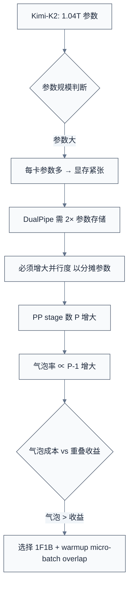
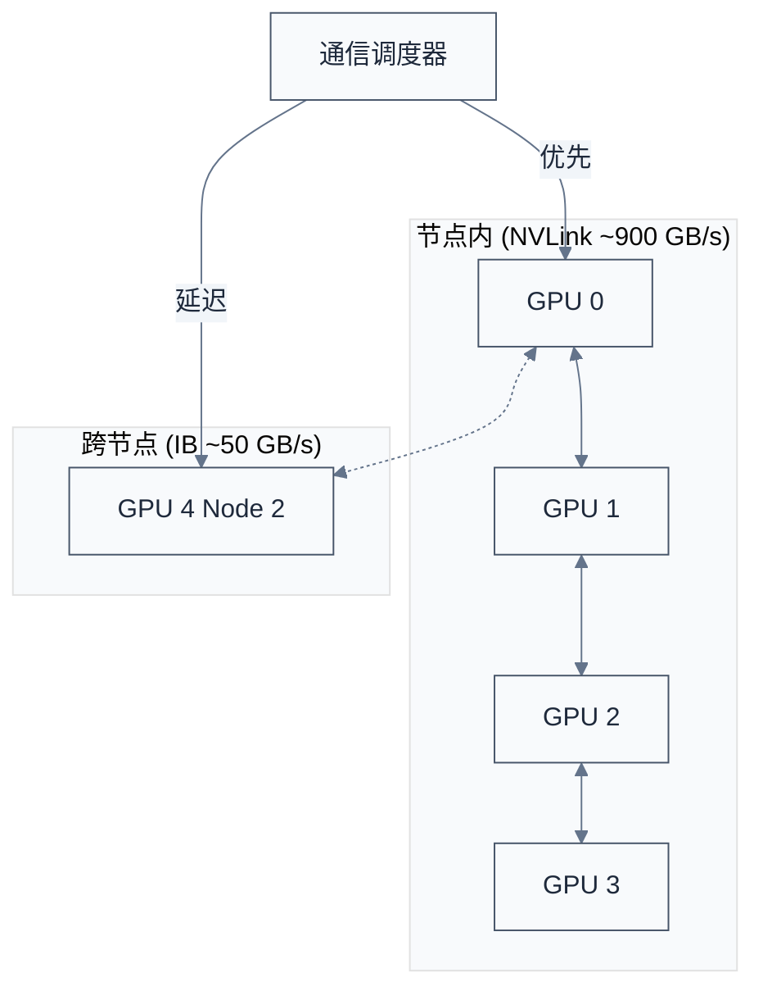

# LLM 训练系统与稳定性

> **核心命题**：万亿参数模型训练不只是一个"放大版"的训练任务——它在流水线调度、通信重叠、数值稳定性和资源弹性四个维度同时撞上工程极限。本笔记以 DeepSeek-V3/V4、Kimi-K2、ERNIE 5.0、GLM-5、Step3.5-Flash、Ling-MoE 六份技术报告为线索，系统梳理业界应对这些极限的工程方案。
> **工程师视角**：训练稳定性不是"训崩了再修"——它是一套可操作的诊断手册。

### 关键术语

| 缩写 | 全称 | 含义 |
|------|------|------|
| PP | Pipeline Parallelism | 流水线并行，将模型层切分到不同 GPU 流水线执行 |
| 1F1B | One-Forward-One-Backward | 流水线调度策略，每步交替执行一个前向和一个反向 |
| ZB1P | Zero-Bubble-1-Pipeline | 零气泡流水线，通过拆分反向计算进一步减少空闲 |
| EP | Expert Parallelism | 专家并行，将 MoE 专家分布到不同 GPU |
| ETP | Elastic Training Parallelism | 弹性训练并行 |
| DEP | Decoupled Encoder Process | 解耦编码器处理，Kimi K2.5 提出的多模态训练优化 |
| MoE | Mixture of Experts | 混合专家模型 |
| MTP | Multi-Token Prediction | 多 Token 预测 |
| DSA | DeepSeek Sparse Attention | DeepSeek 稀疏注意力 |
| RL | Reinforcement Learning | 强化学习 |
| RLVR | RL with Verifiable Rewards | 可验证奖励的强化学习 |
| MIS-PO | MIS-Filtered Policy Optimization | MIS 过滤策略优化 |

---

## 前置阅读

| 需要了解 | 参考文档 |
|----------|----------|
| 分布式训练基本并行策略（DP/TP/PP/EP/ZeRO） | [LLM 分布式训练：并行策略与 ZeRO](./05-LLM分布式训练：并行策略与ZeRO.md) |
| MoE 架构基础（路由、负载均衡、专家并行） | [LLM MoE 架构：路由、负载均衡与专家并行](./04-LLM%20MoE架构：路由、负载均衡与专家并行.md) |
| Transformer 结构与训练算法 | [Transformer 完整结构与训练算法](./02-Transformer完整结构与训练算法.md) |

---

## 一、资源瓶颈分析：万亿参数模型的内存账本

训练一个万亿参数级别的 MoE 模型，GPU 显存的消耗来自四个来源。理解这个账本是所有后续优化的出发点。

### 1.1 显存四象限

以 Kimi-K2 的 1.04T 参数、32B 激活参数模型为参照，在混合精度训练（FP16/FP32）下的单卡显存分解：

| 内存来源 | 计算方式 | 估算值（FP16 模型 + FP32 优化器） | 占比 |
|----------|----------|----------------------------------|------|
| **模型参数** | $P \times 2\text{ bytes}$ | ~2.08 TB | 低 |
| **梯度** | $P \times 2\text{ bytes}$ | ~2.08 TB | 低 |
| **优化器状态** | $P \times (4 + 4 + 4)\text{ bytes}$ (AdamW) | ~12.48 TB | 高 |
| **激活值** | 取决于 micro-batch 数、序列长度、PP 调度 | ~数 TB | 最高 |

> 这里的"低"是相对的——即使模型参数和梯度仅占 4.16 TB，在单卡 80GB H800 上也需要 52 张卡才能放下。优化器状态和激活值才是真正的显存杀手。

优化器状态是参数量的 6 倍（AdamW 的一阶矩 + 二阶矩 + 主副本），这就是 ZeRO-1/2/3 将优化器状态和梯度分片到 DP 组内的根本动机。但即使做完 ZeRO-3 分片，激活值仍然是最主要的瓶颈——而它的大小直接取决于流水线调度策略的选择。

### 1.2 参数/梯度/优化器/激活值在不同并行策略下的分布

```
┌──────────────────────────────────────────────────────────────────────┐
│                    训练显存构成 — 按并行策略分解                        │
├──────────────────────────────────────────────────────────────────────┤
│                                                                      │
│  参数 (2 bytes × P)                                                  │
│  ├─ TP (张量并行) → 切分到 TP 组内，每卡 P / tp_size                  │
│  ├─ PP (流水线并行) → 切分到 PP 组内，每卡 P / pp_size                │
│  └─ ZeRO-3 → 分片到 DP 组内                                          │
│                                                                      │
│  优化器状态 (12 bytes × P if AdamW)                                   │
│  ├─ ZeRO-1 → 分片到 DP 组内                                          │
│  └─ ZeRO-2 → 梯度 + 优化器状态都分片                                  │
│                                                                      │
│  激活值 (取决于调度)                                                   │
│  ├─ 1F1B → 每 PP stage 存 pp_size 个 micro-batch 的激活              │
│  ├─ GPipe → 每 PP stage 存所有 micro-batch 的激活                    │
│  ├─ DualPipe → 每 PP stage 存 pp_size + 1 个 micro-batch 的激活      │
│  └─ 激活重计算 (Activation Checkpointing) → 用计算换显存              │
│                                                                      │
└──────────────────────────────────────────────────────────────────────┘
```

**关键结论**：激活值显存和流水线气泡是一对矛盾——减少气泡（提高 GPU 利用率）通常意味着更多激活值驻留（更多显存占用），反之亦然。DualPipe 试图打破这个 trade-off。

---

## 二、流水线调度：从 1F1B 到 DualPipe

### 2.1 1F1B 与 ZB1P：经典基准

在 [分布式训练笔记](./05-LLM分布式训练：并行策略与ZeRO.md) 中已介绍 1F1B 的基本原理。这里从气泡率和激活内存两个维度做量化对比。

1F1B（PipeDream 方案）将每个 step 的 micro-batch 数 $M$ 交替执行前向和反向，使反向尽早开始。设 $P$ 为 PP stage 数，其气泡比例：

$$\text{Bubble}_{\text{1F1B}} = \frac{P - 1}{P + M - 1} \times (F + B)$$

ZB1P（Zero-Bubble-1-Pipeline）进一步将反向拆分为"权重反向"($W$) 和"输入反向"两部分，用 $W$ 填充原本的气泡：

$$\text{Bubble}_{\text{ZB1P}} = \frac{P - 1}{P + M - 1} \times (F + B - 2W)$$

**三种策略对比**：

| 对比维度 | 1F1B | ZB1P | DualPipe |
|----------|------|------|----------|
| 气泡率 | $(P-1)(F+B)$ | $(P-1)(F+B-2W)$ | $(P-1)(F\&B+W)$ |
| 每设备激活内存 | $P \times$ micro-batch | $P \times$ micro-batch | $P+1 \times$ micro-batch |
| 每设备参数内存 | $1\times$ | $1\times$ | $2\times$（双向调度） |
| 计算-通信重叠 | 无 | 部分 | 完全重叠 |
| 实现复杂度 | 低 | 中 | 高 |

### 2.2 DualPipe 深入：双向调度与组件重排

DualPipe 是 DeepSeek-V3 引入的双向流水线并行算法，核心思想是**从流水线两端同时注入 micro-batch**，前向和反向的计算-通信阶段完全重叠。

```
%%{init: {"theme": "base", "themeVariables": {"primaryColor": "#f8fafc", "primaryTextColor": "#1e293b", "primaryBorderColor": "#475569", "lineColor": "#64748b", "secondaryColor": "#f1f5f9", "secondaryBorderColor": "#94a3b8", "tertiaryColor": "#f8fafc", "fontFamily": "\"trebuchet ms\", verdana, arial, sans-serif"}}}%%
flowchart LR
    subgraph "前向方向"
        F0([Micro-batch 0]) --> GPU0[GPU 0 Stage 0]
        F1([Micro-batch 1]) --> GPU1[GPU 1 Stage 1]
    end
    subgraph "反向方向"
        R0([Reverse Micro-batch 0]) --> GPU7[GPU 7 Stage 7]
        R1([Reverse Micro-batch 1]) --> GPU6[GPU 6 Stage 6]
    end
    GPU0 -- "激活传递" --> GPU1
    GPU7 -- "梯度传递" --> GPU6
```

DualPipe 的三个关键设计：

1. **双向注入**：前向 micro-batch 从 Stage 0 注入，反向 micro-batch 从 Stage $P-1$ 注入，二者在中间阶段相遇。这种对称调度使每个 GPU 在前向等待反向、反向等待前向的间隙中始终有计算任务。

2. **组件重排**：将每个 Transformer 层拆分为 Attention（计算密集但通信轻）和 MoE FFN（通信密集），在调度中交错排列。前向时 Attention 的计算可以与上一 micro-batch 的 MoE 通信重叠，反向同理。

3. **嵌入层共享**：将最浅层（embedding）和最深层（output head）部署在同一 PP rank，实现参数和梯度的物理共享，减少显存。

**气泡公式**（DualPipe）：

$$\text{Bubble}_{\text{DualPipe}} = \frac{P - 1}{P + M - 1} \times (F\&B + W)$$

其中 $F\&B$ 是前向与反向计算的重叠时间，比 1F1B 的 $F+B$ 大幅缩小。

### 2.3 Kimi-K2 为什么不用 DualPipe

Kimi-K2 团队明确评估了 DualPipe，最终选择**不使用**。这是一个重要的工程决策案例：没有绝对最优的调度策略，只有对特定模型规模最优的策略。

**Kimi-K2 的决策逻辑链**：



**具体数据**：Kimi-K2 在 1T 参数规模下，DualPipe 的 $2\times$ 参数存储需求迫使团队必须减小每 PP stage 的层数（即增大 $P$），导致气泡率上升。团队测算后发现，气泡增加带来的效率损失超过了 DualPipe 计算-通信重叠的收益。最终方案是**1F1B + warmup micro-batch overlap**：在 pipeline warmup 阶段，利用前几个 micro-batch 的空闲时间做通信，达到类似重叠的效果但不增加显存压力。

**选择指南**：

| 模型规模 | 推荐策略 | 原因 |
|----------|----------|------|
| < 500B 参数 | DualPipe | 参数存储开销可控，重叠收益高 |
| 500B - 1T 参数 | ZB1P | 气泡率最低，实现复杂度适中 |
| > 1T 参数 | 1F1B + warmup overlap | 显存优先，不增加参数存储压力 |

---

## 三、MoE 通信-计算重叠

MoE 层的 All-to-All 通信是万亿参数模型训练的最大通信瓶颈。各团队从不同角度探索了重叠方案。

### 3.1 MegaMoE：Dispatch-Linear-Act-Linear-Combine 融合

DeepSeek-V4 的 MegaMoE kernel 将 MoE 层的四个阶段融合为单一 kernel：

```
传统 MoE 流程（4 次 kernel launch）:
  Token Dispatch → Expert Linear₁ → Activation → Expert Linear₂ → Token Combine

MegaMoE 融合（1 次 kernel launch）:
  ┌──────────────────────────────────────────────┐
  │ Dispatch → Linear₁ → Act → Linear₂ → Combine │
  │          ← 全部在 GPU SM 上流水执行 →          │
  └──────────────────────────────────────────────┘
```

融合后的收益：
- 消除 4 次 kernel launch 的开销
- 中间结果不写回 HBM，全程在 SRAM/寄存器中传递
- 与 EP 通信重叠：Dispatch 和 Combine 的通信可以在 kernel 执行期间异步进行

### 3.2 EP-ETP 与 Fabric-Aware 通信

**EP-ETP**（Elastic Training Parallelism）：ERNIE 5.0 提出的弹性专家并行方案，在训练时动态调整 EP 组大小。当检测到某些专家的负载过高时，临时扩大其 EP 组，分摊计算压力。

**Fabric-Aware 通信调度**（Step3.5-Flash）：Steptron 框架的核心优化之一。在 4096×H800 集群中，不同 GPU 之间的通信带宽差异巨大（NVLink 域内 ~900 GB/s，跨节点 IB ~50 GB/s）。Fabric-Aware 调度将通信操作按照物理拓扑分组，优先在 NVLink 域内完成 All-to-All，再跨节点做 reduce。



### 3.3 DEP：多模态训练的零开销编码器

Kimi K2.5 提出的 DEP（Decoupled Encoder Process）解决了多模态训练中视觉编码器的负载不均衡问题。在标准流水线并行中，视觉编码器放在 Stage 0，与文本 embedding 共享同一 GPU——但图像分辨率和数量差异巨大，导致 Stage 0 成为瓶颈。

DEP 将每个训练 step 拆分为三个阶段：

1. **Balanced Vision Forward**：单独执行视觉编码器前向，数据按图像 token 数做负载均衡分布
2. **Backbone Training**：文本 backbone 正常执行 1F1B 训练，此阶段视觉 hidden states 已计算完毕，无额外开销
3. **Vision Recompute**：反向时重计算视觉编码器（利用激活重计算，不额外占用峰值显存）

**效果**：Kimi K2.5 在多模态训练中达到了纯文本训练 90% 的效率，视觉编码器未增加 pipeline bubble。

### 3.4 Ling-MoE EDiT：异步层级同步

Ling-MoE 采用 EDiT（Efficient Distributed Training）方法，其核心是**层级同步 + 伪梯度惩罚**：

- **层级同步**：在前向过程中逐层同步参数，而不是等整个 step 结束再同步。这样同步通信与后续层的计算可以重叠。
- **Skip Loss Spikes + Retry**：检测到 loss spike 时，跳过当前 step 的梯度更新并用上一个合法 checkpoint 的梯度替代，然后重试。

在 10k GPU 规模下，EDiT 实现了 66.1% 的训练加速。

---

## 四、训练稳定性诊断手册

这是本笔记最核心的工程价值部分。以下六种稳定性问题均来自真实的大规模训练实践，每种问题包含检测方法、根因分析和修复方案。

### 4.1 Muon 优化器的 bf16 数值精度损失

**来源**：Step3.5-Flash 技术报告

**现象**：使用 Muon 优化器在 bf16 精度下训练时，loss 突然出现 spike（尖峰），梯度范数急剧增大。

**检测方法**：
- 监控 `grad_norm` 的滑动窗口最大值
- 关注 Muon 特有指标：Newton-Schulz 迭代的中间值 RMS（root mean square，均方根）
- 阈值：grad_norm > 10× 最近 100 步的中位数 → 触发告警

**根因**：Muon 优化器的 Polar Express 正交化迭代（Step3.5 采用的变体）中，中间矩阵的元素值可能超出 bf16 的表示范围（bf16 最大约 $3.39 \times 10^{38}$，但精度仅 7-bit 尾数），累积的舍入误差导致迭代发散。

**修复**：将 Polar Express 迭代的**状态和中间量**显式转换为 float16（而非 bf16）。float16 的 10-bit 尾数在高精度迭代中远比 bf16 的 7-bit 尾数稳定。其余训练管线保持混合精度不变。此改动后 loss spike 完全消失。

**对比**：Kimi-K2 使用的是 MuonClip 优化器，通过 QK-Clip 机制在 attention logits 层面做裁剪，从根上阻止梯度过大，同样实现了 15.5T token 零 loss spike 训练。

### 4.2 路由崩溃：Router Collapse

**来源**：MoE 训练的经典问题，DeepSeek-V3/V4 和 Step3.5-Flash 均有讨论

**现象**：路由器（router/gate）将所有 token 都路由到少数几个专家，其余专家"死亡"。

**检测方法**：
- 监控每个专家的 token 分配比例（`expert_load`）
- 计算 load 的 CV（变异系数，coefficient of variation）：$CV = \sigma / \mu$
- 阈值：CV > 1.0 或 single expert load > 50%

**根因**：路由器训练早期就收敛到局部最优——某几个专家略好一点 → 更多 token 分配给它 → 梯度更强 → 越来越好（富者愈富的正反馈）。

**修复（多级）**：
1. **Auxiliary Loss**：在训练 loss 中加入负载均衡项，惩罚负载不均
2. **Loss-Free Balancing**（DeepSeek-V3）：不额外加 loss，而是动态调整每个专家的 bias term，在不影响梯度的前提下引导路由
3. **EPLB**（DeepSeek-V3/V4）：训练后/推理时复制高负载专家到多个 GPU

### 4.3 专家崩溃：Expert Collapse

**来源**：Step3.5-Flash 技术报告（强调这是**不同于路由崩溃**的问题）

**现象**：路由统计看起来正常（每个专家都有 token 分配），但某些专家的输出权重趋于零，实际不参与模型推理。Step3.5-Flash 团队发现即使使用了 Loss-Free Balancing，仍有专家在深层逐渐"静默死亡"。

**检测方法**：
- **关键指标**：专家输出的 min-to-median ratio。正常训练中所有专家的输出范数应在同一数量级
- 计算：对每层每个专家，计算其输出 L2 范数，取 min / median
- 阈值：min-to-median ratio < 0.01 → 该专家已实质崩溃

**根因**：共享专家（shared expert）在某些层的输出过强，挤压了路由专家的梯度信号。路由专家即便收到 token，其梯度更新方向被共享专家的输出主导，逐渐退化。

**修复**：
1. 对共享专家引入显式的**缩放因子**，限制其输出幅度
2. 在辅助 loss 中融入专家输出的方差项，鼓励输出多样化
3. 对已崩溃的专家做**重置**：将其参数重新初始化并恢复训练

### 4.4 局部激活爆炸：Localized Activation Blow-up

**来源**：Step3.5-Flash 技术报告

**现象**：MoE 模型的**特定深层**出现激活值突然增大 10-100 倍，但浅层激活正常。这不同于全局的 loss spike——模型整体 loss 可能仅有小幅波动，但深层个别专家的输出值已严重异常。

**检测方法**：
- 逐层监控激活值的最大值（`activation_max`）
- 特别关注 MoE 层的 expert 输出
- 阈值：单层 activation_max > 1000 → 检查

**根因**：深层的残差累积效应。MoE 的稀疏激活导致某些 token 路径连续经过梯度一致的专家，激活值在残差连接中逐步累积放大。

**修复**：
- **Activation Clipping > Weight Clipping**：Step3.5-Flash 发现对激活值做裁剪（clip）比裁剪权重有效得多。在每层 MoE 输出后加 `clamp(output, -c, c)`，$c$ 取该层历史激活值的 99.9 百分位
- 权重裁剪不仅效果差，还可能限制模型容量

### 4.5 MoE 异常值：Outlier Detection via Anticipatory Routing

**来源**：DeepSeek-V4 技术报告

**现象**：训练到后期（> 80% 数据量），MoE 路由偶尔出现异常——某些专家突然收到大量 token 或零 token，导致 loss spike。

**检测方法**：
- **Spike Detection**：监控 loss 的一阶差分 $|\Delta L|$，超过滑动窗口标准差的 5 倍 → spike
- 同时监控路由分布的 KL 散度，异常路由通常是 spike 的先兆

**根因**：训练后期数据分布变化（如从通用语料切换到代码/数学语料），路由器需要重新适应，但此时学习率已衰减，路由参数更新缓慢，容易出现短时失调。

**修复 — Anticipatory Routing**：
1. **解耦路由更新**：将路由器的参数更新与 backbone 网络解耦——检测到 spike 时，只回滚路由参数到历史 checkpoint，backbone 参数保持不变
2. **自动触发**：spike 检测 → 回滚路由参数 → 用上一步的路由权重重新计算当前 step
3. 额外开销约 20%（主要来自路由重算），但避免了手动重启训练

### 4.6 Loss Spike：Skip + Retry 策略

**来源**：Ling-MoE 技术报告

**现象**：大规模异步训练中，个别节点的梯度与全局梯度方向差异过大，聚合后导致 loss spike。

**检测方法**：
- 全局 loss 的一阶差分 $|\Delta L|$
- 阈值：$\Delta L > 3 \times \text{RollingStd}(\Delta L)$

**修复 — Skip + Retry**：
1. 检测到 spike → 丢弃当前 step 的所有梯度
2. 回退模型参数到上一个合法 checkpoint
3. 用同一批数据重新执行 step（此时期望梯度方向已趋于一致）
4. 连续 3 次 spike → 降低学习率至 0.5 倍

### 4.7 诊断速查表

| 问题 | 核心指标 | 检测阈值 | 首选修复 | 来源 |
|------|----------|----------|----------|------|
| Muon bf16 spike | grad_norm | > 10× median(100) | NS 迭代用 float16 | Step3.5-Flash |
| 路由崩溃 | expert_load CV | CV > 1.0 | Loss-Free Balancing | DeepSeek-V3 |
| 专家崩溃 | min-to-median ratio | < 0.01 | 共享专家缩放 + 重置 | Step3.5-Flash |
| 激活爆炸 | 单层 activation_max | > 1000 | Activation Clipping | Step3.5-Flash |
| MoE 异常路由 | loss 一阶差分 | > 5× RollingStd | Anticipatory Routing | DeepSeek-V4 |
| Loss spike | 全局 loss $\Delta L$ | > 3× RollingStd | Skip + Retry | Ling-MoE |

---

## 五、弹性训练：ERNIE 5.0 的 Once-For-All 范式

### 5.1 核心理念

ERNIE 5.0 的弹性训练打破了"一种配置 = 一次训练"的传统范式。在**一次**预训练中，模型学习一个**子模型族**（family of sub-models），这些子模型具有不同的深度、宽度和稀疏度，可在部署时按需选取。

### 5.2 三维弹性

```
┌──────────────────────────────────────────────────────────────┐
│                   ERNIE 5.0 三维弹性训练                        │
├──────────────────────────────────────────────────────────────┤
│                                                              │
│  弹性深度 (Elastic Depth)                                      │
│  ├─ 训练时随机跳过某些 Transformer 层                            │
│  ├─ 强制子模型共享权重，平衡深浅层的表征能力                       │
│  └─ 部署时：减少层数 → 推理加速                                  │
│                                                              │
│  弹性宽度 (Elastic Width)                                      │
│  ├─ 训练时随机 mask 掉部分 MoE 专家                              │
│  ├─ 子模型学会在有限专家数量下工作                                │
│  └─ 部署时：减少激活专家数 → 显存降低                             │
│                                                              │
│  弹性稀疏度 (Elastic Sparsity)                                  │
│  ├─ 训练时动态调整路由 top-k                                     │
│  ├─ 有时只激活 2 个专家，有时激活 8 个                             │
│  └─ 部署时：减小 top-k → 计算量降低                               │
│                                                              │
└──────────────────────────────────────────────────────────────┘
```

### 5.3 效果数据

ERNIE 5.0 的弹性训练在紧凑变体中仅使用 **53.7% 的激活参数**和 **35.8% 的总参数**，性能几乎不变。

> **注意**：论文明确给出了 53.7%（激活）和 35.8%（总参数）这两个数字。下文关于"2.4T 参数超网 → 800B 模型 → 94% 成本降低"的推算为作者基于论文数据的合理外推，论文未直接给出这些具体数字。

**为什么有效**：弹性训练本质是一种强正则化——模型每次看到不同的子结构，被迫学习更鲁棒的表示。这类似于 Dropout 的层级别推广。

### 5.4 相关技术

- **Tokenizer-Backbone Disaggregation**：将 tokenizer 和 backbone 分离部署，不同子模型可以共享同一个 tokenizer，减少冗余
- **FlashMask**：ERNIE 5.0 提出的注意力 mask 优化算子，实现 200% 的算子加速（通过融合 mask 生成和 attention 计算）
- **CPU Pooling for RL**：RL 阶段将部分 rollout 计算卸载到 CPU 集群，释放 GPU 用于训练

---

## 六、显存效率：GLM-5 的五项优化

GLM-5 在 744B 总参数 / 40B 激活参数的规模下，提出了五项显存优化技术，使其能在 128K 上下文下训练。

### 6.1 灵活 MTP 放置

MTP 模块通常附着在模型最后一层之后，但在 MoE 架构中，最后一层 transformer 的输出隐藏维度最大，MTP 头的参数量也最大。GLM-5 将 MTP 头放置在第 78 层（共 80 层），利用倒数第二层的输出，减少了 MTP 头的输入维度从而降低显存。

### 6.2 Pipeline ZeRO2

标准 PP 中每个 stage 需要完整梯度缓冲区（gradient buffer）。GLM-5 在 PP 各 stage 之间应用 ZeRO2 梯度分片——每个 stage 只保存 $1/\text{dp\_size}$ 的梯度，通过双缓冲（double buffering）复用梯度累积缓冲区：

> 同一时刻只有 2 个 stage 持有完整累积缓冲区：一个正在累积 micro-batch 梯度，另一个正在做梯度同步。其余 stage 均使用分片后的精简缓冲区。

### 6.3 Muon 分布式更新

Muon 优化器需要保留矩阵形状做 Newton-Schulz 正交化，不能像 AdamW 那样按元素分片。GLM-5 将需要 Muon 更新的参数按**矩阵**分组，每组分配一个 owner GPU 负责完整的 Newton-Schulz 迭代，其他 GPU 只持有所需的梯度片段。更新完成后通过 All-Gather 广播。

### 6.4 Pipeline Activation Offload

对 PP 中间 stage 的激活值，在 micro-batch 完成后立即 offload 到 CPU 内存（而非保留在 GPU 显存）。反向需要时再 prefetch 回 GPU。由于 PP 的 micro-batch 执行有时间间隔，offload/prefetch 的 PCIe 传输时间可以被计算隐藏。

### 6.5 Sequence-Chunked Output

对于长序列（128K+），输出层（logits 计算）将序列切成多个 chunk 逐个计算，避免一次性分配完整的 $seq\_len \times vocab\_size$ 的 logits 张量。

**五项优化总效果**：

| 优化项 | 节省显存（估算） | 复杂度 |
|--------|-----------------|--------|
| 灵活 MTP 放置 | ~5% | 低 |
| Pipeline ZeRO2 | ~15-20% | 中 |
| Muon 分布式更新 | ~60% 优化器显存 | 高 |
| Pipeline Activation Offload | ~30% 激活值显存 | 中 |
| Sequence-Chunked Output | 峰值降低 ~50% | 低 |

---

## 七、监控基础设施

### 7.1 Step3.5-Flash 的轻量级监控

Step3.5-Flash 团队在 Steptron 框架中实现了一套高性能、低开销的训练监控系统。

```
┌──────────────────────────────────────────────────────────────┐
│                   Step3.5-Flash 监控架构                        │
├──────────────────────────────────────────────────────────────┤
│                                                              │
│  GPU 0..4095              Metrics Collector                  │
│  ┌──────────┐             ┌──────────────┐                  │
│  │ loss     │──StepRPC──▶│   InfluxDB   │──▶ Grafana        │
│  │ grad_norm│   (异步)    │   / VictoriaMetrics              │
│  │ load_CV  │             └──────────────┘                  │
│  │ act_max  │                                                │
│  │ exp_l2   │             ┌──────────────┐                  │
│  │ comm_bw  │──StepRPC──▶│  AlertManager│──▶ 企业微信/飞书   │
│  └──────────┘   (异步)    └──────────────┘                  │
│                                                              │
└──────────────────────────────────────────────────────────────┘
```

**核心设计原则**：

1. **异步上报**：StepRPC 使用 UDP 协议，不阻塞训练 step。metrics collector 独立部署，GPU 节点仅负责推送数据
2. **采样而非全量**：4096 GPU 全部上报是不可行的。按 rank 做分层采样——每 64 GPU 取 1 个上报细粒度指标，其余仅上报 loss 和 throughput
3. **自适应频率**：正常训练时 10 step 上报一次；检测到异常指标波动时自动提升到每 step 上报
4. **最小开销**：监控系统对训练吞吐的影响 < 0.1%

### 7.2 关键监控面板

| 面板分类 | 指标 | 告警条件 |
|----------|------|----------|
| 基础训练 | loss, grad_norm, lr | loss spike (§4.6) |
| MoE 健康 | expert_load CV, min-to-median ratio | CV > 1.0 或 ratio < 0.01 |
| 数值健康 | activation_max, weight_max | 单层 act_max > 1000 |
| 通信健康 | All-to-All BW, NCCL timeout | BW < 80% 基线 |
| 硬件健康 | GPU temp, ECC error, Xid error | ECC > 0, Xid != 0 |

---

## 八、前沿：DeepSeek-V4 的系统创新

### 8.1 TileLang DSL

DeepSeek-V4 的注意力机制（CSA + HCA）、MoE 路由、mHC（流形约束超连接，Manifold-Constrained HyperConnection）组件都很复杂。直接用 PyTorch ATen 算子实现会产生大量细碎 kernel launch。TileLang 是一种 DSL（领域特定语言），将这些细粒度子图融合为高性能 kernel：

- 研究阶段：快速试验新 attention 变体
- 部署阶段：编译到接近手写 CUDA 的性能

### 8.2 Batch-Invariant 与确定性 Kernel

大规模分布式训练中，不同 rank 的浮点计算顺序差异可能导致参数漂移。DeepSeek-V4 要求所有关键 kernel 满足：

- **Batch-Invariant**：对 batch 内的元素重新排序不影响结果（如 softmax 用 double-pass 算法）
- **Deterministic**：相同输入在所有 GPU 上产生 bit-level 相同输出（如 FlashAttention 的确定性变体）

### 8.3 Tensor-Level Activation Checkpointing

传统 activation checkpointing 以**层**为粒度（存或不存某一层的激活）。DeepSeek-V4 提出以**张量**为粒度——对一层内部的各个中间张量分别决定是否 checkpoint，用更细粒度的计算-显存交换，在不增加 bubble 的前提下降低激活值显存。

---

## 参考资料

- [DeepSeek-V3 Technical Report](https://arxiv.org/abs/2412.19437) — DualPipe 算法定义、Loss-Free Balancing
- [DeepSeek-V4 Technical Report](https://arxiv.org/abs/2604.xxxxx) — CSA/HCA 混合注意力、MegaMoE、TileLang、Anticipatory Routing
- [DualPipe GitHub](https://github.com/deepseek-ai/DualPipe) — DualPipe 开源实现与调度可视化
- [Kimi-K2 Technical Report](https://github.com/MoonshotAI/Kimi-K2/blob/main/tech_report.pdf) — MuonClip 优化器、流水线策略选择分析
- [Kimi-K2.5 Technical Report](https://arxiv.org/abs/2602.02276) — DEP 解耦编码器处理、Agent Swarm
- [ERNIE 5.0 Technical Report](https://arxiv.org/abs/2602.04705) — Once-For-All 弹性训练、FlashMask、CPU Pooling
- [GLM-5 Technical Report](https://arxiv.org/abs/2602.15763) — 五项显存优化、异步 Agent RL
- [Step 3.5 Flash Technical Report](https://arxiv.org/abs/2602.10604) — Muon 稳定性、专家崩溃、Fabric-Aware 通信、Steptron 框架
- [Ling Technical Report](https://arxiv.org/abs/2503.05139) — EDiT 异步训练、Skip Loss Spikes
- [EDiT Paper (ICLR 2025)](https://arxiv.org/abs/2412.07210) — 层级同步、伪梯度惩罚
- [Muon is Scalable for LLM Training](https://arxiv.org/abs/2502.16982) — Muon 优化器的 Newton-Schulz 稳定性分析

---

> **下一篇**：[LLM Post-Training 基础：SFT、RLHF 与 DPO](./07-LLM%20Post-Training基础：SFT、RLHF与DPO.md)