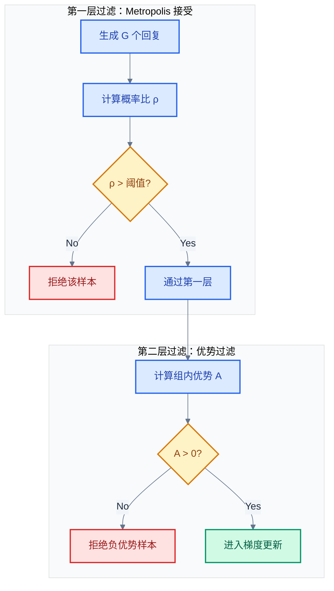
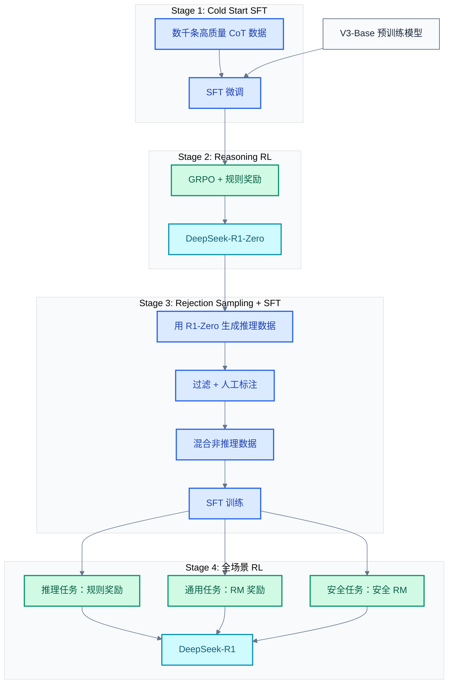
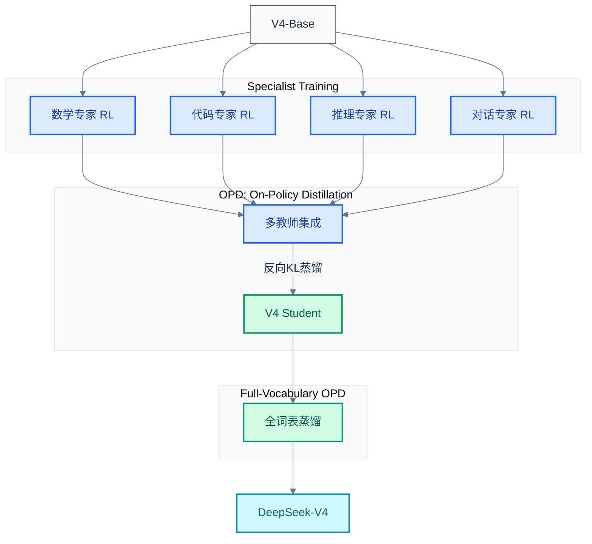
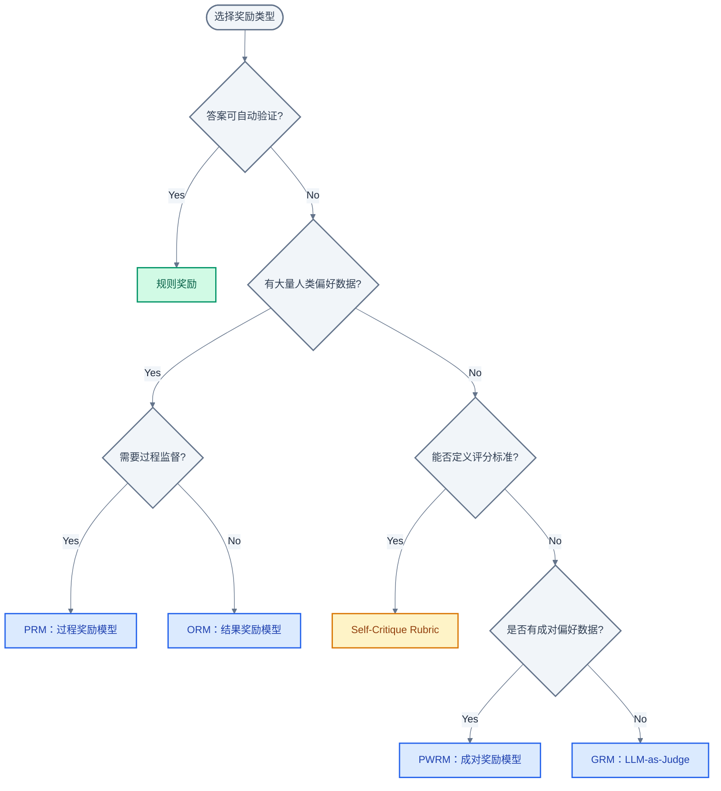
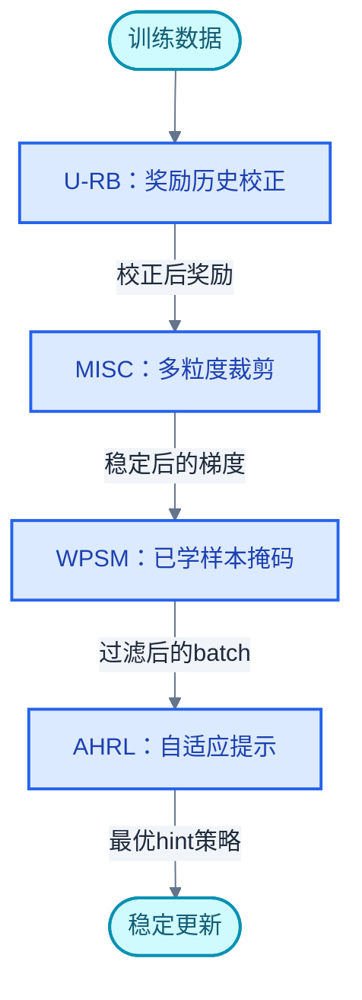
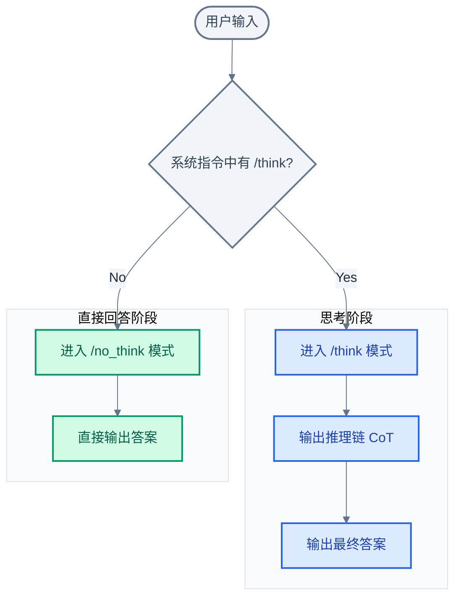

# LLM Post-Training 进阶：GRPO 与多阶段强化学习

> **核心命题**：GRPO 用"组内比较"取代"价值函数估计"，将 PPO 时代的四模型架构压缩为两模型，同时以工程化手段解决了长 CoT 场景下的训练稳定性问题。后续的算法变体和多阶段管线并非简单的堆叠，而是针对特定瓶颈的精确回应——MoE 的 off-policy 漂移、token 效率、跨阶段知识迁移、奖励信号稀疏性——每一项改进都对应一个真实的生产痛点。
> **工程师视角**：本文不仅是算法综述，更是一份"问题→方案"的映射手册。每个技术方案的核心都在回答一个问题：是什么阻碍了上一代方案在大规模训练中的落地？

### 关键术语

| 缩写 | 全称 | 含义 |
|------|------|------|
| GRPO | Group Relative Policy Optimization | 组内相对策略优化，PPO 的轻量化替代方案 |
| GAE | Generalized Advantage Estimation | 广义优势估计，PPO 中用于平衡偏差与方差的技术 |
| PRM | Process Reward Model | 过程奖励模型，对推理的每个中间步骤打分 |
| ORM | Outcome Reward Model | 结果奖励模型，仅对最终答案打分 |
| OPD | On-Policy Distillation | 在策略蒸馏，在 RL 训练过程中同步进行蒸馏 |
| MIS-PO | Metropolis Independence Sampling-Filtered Policy Optimization | 基于 Metropolis 采样的策略优化，Step3.5 提出 |
| ODPO | Online DPO | 在线 DPO，每步采样当前策略的新偏好对 |
| PWRM | Pairwise Reward Model | 成对奖励模型，Ministral 3 提出 |
| U-RB | Unbiased Replay Buffer | 无偏回放缓冲，ERNIE 5.0 提出 |
| MISC | Multi-granularity Importance Sampling Clipping | 多粒度重要性采样裁剪 |
| WPSM | Well-learned Positive Sample Mask | 已学正样本掩码 |
| AHRL | Adaptive Hint-based RL | 自适应提示强化学习 |
| GRM | Generative Reward Model | 生成式奖励模型，DeepSeek-V4 提出 |
| RLHF | Reinforcement Learning from Human Feedback | 基于人类反馈的强化学习 |

---

## 目录

1. [GRPO 为何取代 PPO](#grpo-为何取代-ppo)
2. [GRPO 核心机制](#grpo-核心机制)
3. [算法变体：针对特定瓶颈的精确回应](#算法变体针对特定瓶颈的精确回应)
4. [多阶段训练管线](#多阶段训练管线)
5. [奖励设计方法论](#奖励设计方法论)
6. [RL 稳定性工程](#rl-稳定性工程)
7. [思考模式融合：Qwen3 的双模切换](#思考模式融合qwen3-的双模切换)

---

## 1. GRPO 为何取代 PPO

### 1.1 前置知识

| 需要了解 | 参考文档 |
|----------|----------|
| PPO 算法原理与 Value Model 概念 | [07-Post-Training基础](./07-LLM%20Post-Training基础：SFT、RLHF与DPO.md) |
| RLHF 基本流程 | [07-Post-Training基础](./07-LLM%20Post-Training基础：SFT、RLHF与DPO.md) |

### 1.2 PPO 的三大工程瓶颈

在 DeepSeek-R1 的训练规模下，PPO 暴露出三个系统性问题。这些问题并非算法理论上的缺陷，而是在长 CoT + 大规模分布式训练条件下的工程不可行性。

**瓶颈一：Value Model 的显存开销**

PPO 需要同时维护四个模型：

```
PPO 模型占用:
  ┌──────────────┬──────────────┬───────────────────┐
  │ 模型           │ 参数量         │ 显存（BF16, 671B） │
  ├──────────────┼──────────────┼───────────────────┤
  │ Policy Model │ 671B         │ ~1.34 TB           │
  │ Value Model  │ 671B         │ ~1.34 TB  ← 额外!   │
  │ Ref Model    │ 671B         │ ~1.34 TB           │
  │ Reward Model │ ~10B         │ ~20 GB             │
  ├──────────────┼──────────────┼───────────────────┤
  │ 合计           │ ~2T          │ ~4.04 TB           │
  └──────────────┴──────────────┴───────────────────┘
```

Value Model 的参数量与 Policy Model 相同（通常共享 backbone 但独立 head），意味着网络通信量翻倍、checkpoint 存储翻倍、故障恢复时间翻倍。在千卡集群上，这直接转化为不可接受的硬件成本。

**瓶颈二：GAE λ 在长 CoT 场景下的敏感性**

GAE（Generalized Advantage Estimation）是 PPO 中平衡偏差与方差的机制：

$$A_t^{\text{GAE}(\lambda)} = \sum_{l=0}^{\infty} (\gamma\lambda)^l \delta_{t+l}$$

其中 $\delta_t = r_t + \gamma V(s_{t+1}) - V(s_t)$ 是 TD 误差，$\lambda \in [0,1]$ 控制偏差-方差权衡。

问题在于：当 CoT 长度达到数千 token 时，$\lambda$ 的选择极为敏感。$\lambda$ 偏大时，单个 token 的奖励信号需要传播数千步，方差爆炸；$\lambda$ 偏小时，模型几乎看不到远期奖励，CoT 的长期推理链路无法被学习。工程实践中，每个任务类型（数学证明 vs. 代码生成 vs. 通用问答）的最优 $\lambda$ 不同，需要大量消融实验。

**瓶颈三：隐式长度惩罚**

PPO 的 value-based 优势估计对序列长度有隐式偏差：长序列的 value 估计累积了更多误差项，导致优势函数的噪声水平与序列长度正相关。这意味着模型在训练中会受到"默认惩罚长答案"的压力——与希望模型发展出长推理链的目标直接冲突。

### 1.3 解决方案：从"估计优势"到"比较优势"

GRPO 的核心洞察：如果对每个 prompt 采样一组 response，组内比较本身就是天然的优势信号，无需价值函数估计。

| 对比维度 | PPO | GRPO |
|----------|-----|------|
| 优势信号来源 | Value Model 估计 | 组内标准化奖励 |
| 同时加载模型数 | 4（Policy + Value + Ref + RM） | 2（Policy + Old Policy） |
| 显存占用比例 | 100% | ~50% |
| GAE λ 敏感性问题 | 有 | 无（不使用 GAE） |
| 长 CoT 隐式长度惩罚 | 有 | 无（组内比较天然长度无关） |
| 每个 prompt 需采样数 | 1（理论上可多，实践中通常 1） | G ≥ 2（典型 G=64） |

GRPO 将问题从"精确估计每个 token 的贡献"转化为"在组内分辨好答案和坏答案"——后者在工程上更稳健。

---

## 2. GRPO 核心机制

### 2.1 组内优势归一化

对于每个问题 $q$，采样 $G$ 个回复 $\{o_1, o_2, \ldots, o_G\}$，每个回复获得标量奖励 $r_i$：

$$A_i = \frac{r_i - \text{mean}(\{r_j\}_{j=1}^{G})}{\text{std}(\{r_j\}_{j=1}^{G})} \tag{1}$$

其中 $A_i$ 是第 $i$ 个回复的优势值，分母的标准差提供了自适应的缩放——当组内奖励差异大时，优势信号更强；当所有回复质量相近时，优势信号自动衰减，避免对无意义差异的过拟合。

### 2.2 GRPO 目标函数

完整的 GRPO 损失（per-token 形式）：

$$\mathcal{J}_{\text{GRPO}}(\theta) = \frac{1}{\sum_i |o_i|} \sum_{i=1}^{G} \sum_{t=1}^{|o_i|} \left[ \min\left( \rho_{i,t} \hat{A}_i,\ \text{clip}(\rho_{i,t}, 1-\varepsilon, 1+\varepsilon) \hat{A}_i \right) - \beta \cdot \mathbb{D}_{\text{KL}}(\pi_\theta \parallel \pi_{\text{ref}}) \right] \tag{2}$$

其中：

- $\rho_{i,t} = \frac{\pi_\theta(o_{i,t} \mid q, o_{i,<t})}{\pi_{\text{old}}(o_{i,t} \mid q, o_{i,<t})}$ 是 token 级别的概率比（importance sampling ratio）
- $\hat{A}_i$ 是式 (1) 中的组内标准化优势（注意：对同一回复的所有 token 共享同一个 $\hat{A}_i$）
- $\varepsilon$ 是 clip 范围，GRPO 中典型值为 $\varepsilon = 0.2$（与 PPO 一致）
- $\beta$ 是 KL 惩罚系数
- $\mathbb{D}_{\text{KL}}$ 是 KL 散度估计

### 2.3 clip_ratio=10 的工程逻辑

GRPO 中额外引入了一个全局 clip `clip_ratio`（不同于 PPO 的 $\varepsilon$），作用于概率比的上限：

$$\rho_{i,t} = \text{clip}\left(\frac{\pi_\theta}{\pi_{\text{old}}}, \frac{1}{\text{clip\_ratio}}, \text{clip\_ratio}\right)$$

典型值设为 10。这个值远大于 PPO 的 0.8-1.2 范围，原因如下：

```
PPO clip (ε=0.2):          GRPO clip (clip_ratio=10):
  ρ ∈ [0.8, 1.2]            ρ ∈ [0.1, 10]

为什么差这么大？
  ┌────────────────────────────────────────────────┐
  │ PPO:   每个 prompt 1 个采样                     │
  │        优势估计依赖 Value Model → 噪声大        │
  │        小 clip 防止信任不可靠的优势信号          │
  │                                                │
  │ GRPO:  每个 prompt G=64 个采样                  │
  │        优势来自组内比较 → 噪声小                │
  │        大 clip 允许模型更激进地利用好样本        │
  │        只要不出数值问题即可                      │
  └────────────────────────────────────────────────┘
```

本质原因：GRPO 的优势信号比 PPO 可靠得多（组内比较天然方差小），因此可以用更宽松的信任域。

### 2.4 KL 散度的两种实现

GRPO 中 KL 惩罚有两种写入损失的方式：

**方式一：KL 在 Loss 中（DeepSeek-R1 采用）**

```python
# KL 作为 loss 的一个独立项
loss = policy_loss - beta * per_token_kl
```

低方差估计器（k3 估计）：

$$\mathbb{D}_{\text{KL}} = \frac{1}{2}\left(\frac{\pi_\theta}{\pi_{\text{old}}} - \log\frac{\pi_\theta}{\pi_{\text{old}}} - 1\right)^2$$

这是 KL 的 Taylor 展开近似，避免了直接计算 log 比值的数值不稳定。

**方式二：KL 在 Reward 中（部分实践采用）**

```python
# KL 从 token 级奖励中扣除
token_reward = rule_reward - beta * per_token_kl
```

两种方式的对比：

| 对比维度 | KL 在 Loss 中 | KL 在 Reward 中 |
|----------|---------------|------------------|
| 梯度流向 | KL 梯度直接流入参数更新 | KL 通过优势函数间接影响 |
| 优势估计 | 不受 KL 影响 | 优势 = 标准化(奖励 - KL) |
| 超参数耦合 | β 与学习率耦合 | β 与奖励尺度耦合 |
| 适用场景 | 通用 | 需要精细控制 token 级行为时 |

DeepSeek-R1 采用方式一，因为组内优势归一化已将奖励标准化，再将 KL 混入 reward 会导致优势信号的信噪比下降。

---

## 3. 算法变体：针对特定瓶颈的精确回应

### 3.1 MIS-PO：解决 MoE 的 Off-Policy 漂移

**提出者**：Step3.5-Flash Technical Report

**针对问题**：MoE 架构中，Router 的离散决策使 old policy 和 current policy 的 token 分布差异远大于 Dense 模型。标准 PPO/GRPO 的 importance sampling 在概率比 $\rho_{i,t} \gg 10$ 时方差爆炸，训练不稳定。

**核心思路**：双层二值过滤——不是裁剪概率比，而是直接过滤掉分布差异过大的样本。



**双重过滤的含义**：

- **Layer 1（Metropolis Acceptance）**：概率比 $\rho_{i,t}$ 低于阈值的 token 被丢弃。这保证了 importance sampling 的方差可控——只有 old policy 和 current policy 分布足够接近的样本才被使用。
- **Layer 2（Advantage Filter）**：仅保留正优势（$A_i > 0$）的样本。负优势样本对 MoE Router 的梯度可能产生误导——Router 可能将"惩罚坏行为"误学习为"激活不同的专家"。

**效果**：在 Step3.5-Flash 的实验中，MIS-PO 使 MoE 模型的 RL 训练成功率（不崩溃的比例）从约 60% 提升到约 95%。

### 3.2 Toggle 算法：Token 高效的 RL

**提出者**：Kimi K2.5 Technical Report

**针对问题**：标准 GRPO 中，每个 prompt 采样固定的 G=64 个回复，大量 token 被浪费在"显然正确"或"显然错误"的样本上。尤其在训练后期，模型已有较强能力，大部分采样结果处于极端区域，对训练的边际贡献近乎零。

**核心思路**：交替使用"预算受限"和"标准扩展"两个阶段。


**Budget-Limited Phase** 用 G=8 的小批量快速评估模型当前的薄弱点（哪些类型的问题还需要更多训练），**Standard Scaling Phase** 用 G=64 的大批量深度利用这些发现。

Toggle 的关键在于**切换条件**：当 Budget-Limited 阶段的 reward 分布方差低于阈值（即模型对该批问题的能力已饱和），或 token 预算耗尽时，切换到 Standard Scaling Phase；当 Standard Scaling 阶段发现新的 reward 提升趋于平缓时，切换回 Budget-Limited Phase 寻找新的增长点。

**效果**：相比固定 G=64 的 GRPO，Toggle 在相同 token 预算下将最终 benchmark 分数提升了 3-5 个百分点。

### 3.3 Token-Level Clipping

**提出者**：Kimi K2.5 Technical Report

**针对问题**：标准 GRPO 对同一回复的所有 token 共享同一个 $\hat{A}_i$（式 (2) 中 $\hat{A}_i$ 不随 $t$ 变化）。但对长 CoT 回复（可能 5000+ token），并非所有 token 同等重要——推理关键步骤的 token 应获得更强的更新信号，而填充/格式化 token 应被抑制。

**方案**：在 token 级别引入额外的 clip，限制单个 token 的概率变化幅度：

$$\mathcal{L}_{\text{token-clip}} = -\min\left(\rho_{i,t} \hat{A}_i,\ \text{clip}(\rho_{i,t}, 1-\varepsilon_t, 1+\varepsilon_t) \hat{A}_i\right)$$

其中 $\varepsilon_t$ 与 token 的"重要程度"关联——关键推理 token（如数学符号、逻辑连接词附近的 token）使用较大的 $\varepsilon_t$，普通 token 使用较小的 $\varepsilon_t$。

Token 重要性的判断通过注意力权重统计得到：在生成过程中被大量后续 token 关注的 token 视为关键 token。

### 3.4 算法变体对比

| 对比维度 | GRPO (R1) | MIS-PO (Step3.5) | Toggle (Kimi K2.5) | Token-Level Clip (Kimi K2.5) |
|----------|-----------|-------------------|---------------------|------------------------------|
| 针对问题 | PPO 显存开销 | MoE off-policy 漂移 | token 效率低下 | 长 CoT 中 token 重要性不均 |
| 核心手段 | 组内优势归一化 | 双层二值过滤 | 交替 G 值 | token 级 clip 差异化 |
| 额外开销 | 最低 | 两个过滤步骤 | 阶段切换逻辑 | 注意力统计 |
| 与 GRPO 兼容性 | — | 叠加使用 | 叠加使用 | 叠加使用 |
| 适用架构 | 通用 | MoE 优先 | 通用 | 长 CoT 场景 |

---

## 4. 多阶段训练管线

### 4.1 多阶段的必要性

单阶段 RL 的核心问题是**能力耦合**：推理能力、指令遵循、安全对齐、语言流畅性在单一 RL 阶段中共享梯度空间，导致目标间的隐性竞争。多阶段管线的本质是将不同类型的优化目标分配到不同的阶段，通过 SFT 阶段进行**能力固化**，再通过 RL 阶段进行**能力扩展**。

### 4.2 DeepSeek-R1：四阶段管线



**Stage 1 的设计考量**：Cold Start SFT 不是为了教会模型推理——那留给 RL 做——而是在 RL 之前给模型一个"合理的行为基线"。没有 Stage 1 直接 RL（即为 R1-Zero 路线），模型也可以发展出推理能力，但输出格式混乱、语言混合严重。数千条高质量 CoT 样本的成本远低于 RL 阶段因格式崩溃导致的 token 浪费。

**Stage 2 的 Outcome Reward 策略**：DeepSeek-R1 明确放弃了 PRM（Process Reward Model）和 MCTS（Monte Carlo Tree Search），仅使用最终答案的正确性作为奖励。原因：

- PRM 需要大量人工标注中间步骤，成本极高且标注一致性差；
- MCTS 的搜索空间在 token 级别过大（每个 token 有 128K+ 个可能选择），在 step 级别又缺乏自然边界；
- 实验发现，仅用 Outcome Reward + GRPO，模型自发涌现了自我反思、回溯、验证等行为——这些不需要显式教。

**Stage 3 的 Rejection Sampling**：用 Stage 2 训练出的 R1-Zero 对训练集中的问题生成多个回复，仅保留正确答案的回复用于 SFT。这一步的核心价值是**将 RL 阶段学到的隐性推理模式转化为显式的 SFT 数据**，为 Stage 4 的全场景 RL 提供了更稳定的起点。

**Stage 4 的混合奖励**：推理任务（数学、代码）使用确定性规则奖励，通用任务使用 RM，安全任务使用独立的安全 RM。不同奖励源的梯度在 batch 内混合，通过控制各类数据的采样比例来平衡。

### 4.3 DeepSeek-V4：Specialist Training + OPD

**提出者**：DeepSeek-V4 Technical Report

**核心创新**：将模型能力分解为多个"专家方向"，通过 On-Policy Distillation（OPD）将各方向的专长汇聚到单一模型。



**Specialist Training**：从同一个 Base 模型出发，分别在数学、代码、推理、对话四个方向上独立进行 RL 训练。每个 Specialist 仅优化其领域的奖励信号，不受其他目标干扰。

**OPD（On-Policy Distillation）** 的关键设计：

- **多教师反向 KL**：不是传统的教师→学生的 forward KL（$D_{KL}(p_t \parallel p_s)$），而是反向 KL（$D_{KL}(p_s \parallel p_t)$）。反向 KL 使学生的分布"挤"到教师的高概率区域，而非前向 KL 的"覆盖"教师所有模式。这在多教师场景下避免了不同教师分布冲突导致的 mode averaging（不同教师各自的高概率区域不同，前向 KL 会试图平均所有模式，产生模糊输出）。

- **On-Policy 采样**：蒸馏损失中的学生分布 $\pi_s$ 是从学生自身采样得到的，而非从教师采样。这保证了蒸馏发生在学生的当前分布上，而非教师的数据分布上——后者会导致 distribution mismatch。

**Full-Vocabulary OPD**：标准蒸馏只在学生和教师共享的 token 空间计算损失。Full-Vocabulary OPD 将蒸馏扩展到完整的 128K+ 词表，使得学生的整个输出分布都受到教师约束，而非仅在 top-p 内。

### 4.4 GLM-5：On-Policy Cross-Stage Distillation

**提出者**：GLM-5 Technical Report

**核心创新**：在 RL 训练的多阶段管线中，将前一个阶段的模型作为下一阶段的 teacher，用 logit 差异替代 advantage 函数。


**Cross-Stage Distillation 的机制**：

标准 GRPO 的优势函数（式 (1)）被替换为：

$$A_i^{\text{cross-stage}} = \frac{1}{|o_i|} \sum_{t=1}^{|o_i|} \left( \log \pi_{\text{teacher}}(o_{i,t} \mid \cdot) - \log \pi_{\text{student}}(o_{i,t} \mid \cdot) \right) \tag{3}$$

即 teacher（上一阶段模型）和 student（当前阶段模型）在该回复上的平均 logit 差异。这个设计让每个阶段的 RL 训练不仅优化当前阶段的奖励，还保持与上一阶段知识的连续性。

**与 OPD 的区别**：

| 对比维度 | DeepSeek-V4 OPD | GLM-5 Cross-Stage |
|----------|-----------------|-------------------|
| 教师来源 | 多方向 Specialist | 上一阶段模型 |
| 教师数量 | 多个并行 | 单个串行 |
| 蒸馏方向 | 多师→一生 | 串行传递 |
| KL 方向 | 反向 KL | logit 差异作 advantage |
| 目标 | 能力汇聚 | 知识连续 + RL 扩展 |

### 4.5 多阶段管线对比

| 对比维度 | R1 四阶段 | V4 Specialist+OPD | GLM-5 Cross-Stage |
|----------|-----------|-------------------|-------------------|
| SFT 角色 | 行为基线（Stage 1） + 能力固化（Stage 3） | Specialist 训练前的共同起点 | 每个 Stage 的初始化 |
| RL 角色 | 纯规则奖励 → 混合奖励 | 分方向独立 RL | 每阶段独立 RL |
| 知识传递 | Rejection Sampling（隐式） | OPD（显式蒸馏） | Cross-Stage Distillation（显式） |
| 核心挑战 | 混合奖励的平衡 | 多教师分布冲突 | 串行训练的累积误差 |
| 适用场景 | 从零构建推理模型 | 已有多个方向的 RL 专长 | 渐进式能力提升 |

---

## 5. 奖励设计方法论

### 5.1 奖励分类与选择决策树



### 5.2 Self-Critique Rubric Reward（Kimi K2.5）

**核心思想**：不让 Reward Model 打分，而让模型**自己对照评分标准给自己打分**。

三层 Rubric 结构：

```
Core Rubrics（核心标准）
  ├── 准确性：最终答案是否正确
  ├── 逻辑性：推理步骤是否有逻辑漏洞
  └── 完整性：是否回答了问题的所有部分

Prescriptive Rubrics（规范性标准）
  ├── 步骤标注：关键推理步骤是否有明确标记
  ├── 格式规范：是否遵循指定输出格式
  └── 引用规范：引用的前提/数据是否有来源

Manual Rubrics（人工标准）
  ├── 安全性：是否包含有害/偏见内容
  └── 有用性：回复对用户是否有实际帮助
```

每层 Rubric 对应一个维度评分。模型在生成回复后，在 `/critique` 模式下对自身回复按三层标准打分：

1. 模型首先生成回复
2. 切换到一个 critique prompt，让模型扮演"评审"角色
3. 评审模式输出三个维度的评分和理由
4. 评分汇总为最终奖励

**与 RM 的关键区别**：RM 是一个固定网络，训练完成后不再更新；Self-Critique Rubric 随着 Policy Model 的进化而同步进化——更强的模型也是更强的评审。

**局限**：模型对自己的评分存在系统性偏差（对自身错误更宽容）；需要额外的 critique prompt 工程和 token 开销。

### 5.3 GRM：生成式奖励模型（DeepSeek-V4）

**核心思想**：不训练一个独立的标量 RM，而是让模型本身扮演"评判"角色——输入问题和回复，输出结构化的评判结果和分数。

```
传统 RM:   (question, response) → scalar reward
GRM:       (question, response) → {score: 8.5, criteria: {accuracy: 9, ...}, reasoning: "..."}
```

优势：
- **可解释性**：不仅给出分数，还给出评判理由
- **细粒度**：可以按多个维度给出独立评分
- **co-adaptation**：GRM 和 Policy 可以交替训练，互相促进

### 5.4 奖励方案对比

| 对比维度 | 规则奖励 | ORM | PRM | Self-Critique Rubric | GRM |
|----------|---------|-----|-----|----------------------|-----|
| 准确性 | 100%（确定性） | 受 RM 质量约束 | 受标注质量约束 | 受模型能力约束 | 受模型能力约束 |
| 覆盖范围 | 数学/代码/逻辑 | 所有有偏好数据的任务 | 所有有过程标注的任务 | 所有可定义标准的任务 | 所有任务 |
| 成本 | 零 | RM 训练 | 过程标注 + RM 训练 | critique token 开销 | 评判 token 开销 |
| 可解释性 | 天然透明 | 黑盒 | 步骤级灰盒 | 自我解释 | 结构化输出 |
| 典型用户 | R1, R1-Zero | InstructGPT, Llama-2 | 数学推理 | Kimi K2.5 | DeepSeek-V4 |

---

## 6. RL 稳定性工程

大规模 RL 训练中的稳定性问题与常规 DL 训练的稳定性问题有本质区别：RL 中的"崩溃"不是 loss NaN 或梯度爆炸，而是**策略坍缩**——模型学会了一种"钻空子"的策略，在 RL 奖励下表现优异但在真实评估中完全失效。

### 6.1 ERNIE 5.0 四件套：U-RB + MISC + WPSM + AHRL

ERNIE 5.0 提出了一个由四个组件构成的稳定性体系，每个组件解决 RL 训练中的一个特定不稳定性源。

#### U-RB：无偏回放缓冲

**问题**：标准的经验回放（Experience Replay）在 RL for LLM 中引入了严重的偏差。从旧策略采样的回复，其 token 分布与当前策略差异巨大，importance sampling 的权重趋于零或无穷。

**方案**：U-RB 不存储完整回复，而是存储"问题 + 奖励统计量"（每个问题的历史最高/最低/平均奖励）。当同一问题再次出现在新的 batch 中时，用历史统计量对当前奖励进行校正：

$$r_i^{\text{corrected}} = r_i - \alpha \cdot (r_i - \bar{r}_i^{\text{history}}) \tag{4}$$

其中 $\bar{r}_i^{\text{history}}$ 是该问题的历史平均奖励，$\alpha$ 是校正强度。这种"奖励级"的回放避免了 token 级 importance sampling 的数值问题。

#### MISC：多粒度重要性采样裁剪

**问题**：标准 PPO/GRPO 的 clip 在 token 级别操作（$\rho_{i,t}$ 的 clip），但重要性采样的不稳定性可能在 token、sequence、batch 三个粒度上同时出现。

**方案**：三层裁剪：

$$\rho_t^{\text{token}}\ \text{(token 级)} \quad \rightarrow \quad \rho_s^{\text{seq}} = \prod_{t} \rho_t \ \text{(sequence 级)} \quad \rightarrow \quad \rho_b^{\text{batch}}\ \text{(batch 级)}$$

在三个粒度上分别应用 clip $\varepsilon_t, \varepsilon_s, \varepsilon_b$：

```
Token-Level:  clip(ρ_t, 1/ε_t, ε_t)      ← ε_t = 10
Sequence-Level: clip(∏ρ_t, 1/ε_s, ε_s)  ← ε_s = 5
Batch-Level:    clip(mean(ρ_s), 1/ε_b, ε_b) ← ε_b = 3
```

不同粒度的 clip 解决不同层级的不稳定性：token 级防止单个异常 token 主导梯度，sequence 级防止某条异常回复主导 batch 梯度，batch 级防止训练步之间的剧烈波动。

#### WPSM：已学正样本掩码

**问题**：训练后期，模型对大部分问题都能稳定给出正确答案。这些"已掌握"的正样本如果继续参与训练，贡献的梯度近乎零但会稀释"未掌握"样本的信号。

**方案**：维护一个滑动窗口——如果某个问题在最近 K 个 epoch 中持续获得最高奖励，则将其标记为"已学"并从当前 batch 中移除。

```
if (rolling_accuracy[question_id] > threshold for K consecutive epochs):
    mask this sample in current batch
```

效果是让模型的计算资源集中在尚未掌握的问题上，类似课程学习但由 RL 奖励自动驱动。

#### AHRL：自适应提示强化学习

**问题**：不同难度的问题需要不同程度的"提示"（hint）。简单问题给 hint 是浪费 token，复杂问题不给 hint 是浪费训练步。

**方案**：对每个问题评估一个"难度分数"（基于 baseline 模型的成功率），根据难度动态选择 hint 策略：

```
                easy           medium          hard
no_hint:        直接训练        可能收敛慢       几乎不收敛
weak_hint:      浪费token      较优策略         收敛慢
strong_hint:    依赖hint       依赖hint        较优策略
```

AHRL 根据难度分数自动选择 hint 强度，在三个阶段之间渐近调整。

#### 四件套协同关系



四个组件按数据流顺序协作：U-RB 在奖励层面消除偏差 → MISC 在概率比层面控制方差 → WPSM 在样本层面过滤冗余 → AHRL 在训练策略层面自适应。

### 6.2 Ministral 3：ODPO + PWRM

**提出者**：Ministral 3 Technical Report

Ministral 3 在推理能力的 RL 训练中采用了三段式管线：

```
CoT-SFT → GRPO → ODPO+PWRM
```

**ODPO（Online DPO）**：不同于标准 DPO 使用固定的离线偏好数据集，ODPO 在每步训练中：
1. 从当前 Policy 采样两个回复
2. 用 PWRM 对这对回复打分
3. 将（回复A, 回复B, PWRM判断A>B）作为即时的偏好对
4. 计算 DPO 损失

ODPO 的目标函数：

$$\mathcal{L}_{\text{ODPO}} = -\log \sigma\left( \beta \log\frac{\pi_\theta(y_w)}{\pi_{\text{ref}}(y_w)} - \beta \log\frac{\pi_\theta(y_l)}{\pi_{\text{ref}}(y_l)} \right) \tag{5}$$

其中 $y_w$（winner）和 $y_l$（loser）由 PWRM 实时判定，$\pi_{\text{ref}}$ 是参考策略（通常为 GRPO 阶段结束时的模型），$\sigma$ 是 sigmoid 函数。

**PWRM（Pairwise Reward Model）的双侧损失**：

标准 RM 只学习打分，PWRM 额外学习"比较"——输入一对回复 $(y_a, y_b)$，输出偏好概率 $P(y_a \succ y_b)$。PWRM 的损失函数：

$$\mathcal{L}_{\text{PWRM}} = -\mathbb{E}_{(x, y_w, y_l)} \left[ \log \sigma(r_w - r_l) \right] - \lambda \cdot \mathbb{E}_{(x, y)} \left[ (r - r^*) ^2 \right] \tag{6}$$

第一项是成对偏好损失（pairwise），第二项是逐点回归损失（pointwise）。$\lambda$ 控制两者的权重比例。双侧损失的设计让 PWRM 既能分辨"A 比 B 好多少"，也能给出绝对质量评分。

**与标准 RLHF 的对比**：

| 对比维度 | RLHF (PPO) | RLHF (DPO) | Ministral 3 (GRPO → ODPO+PWRM) |
|----------|------------|------------|-------------------------------|
| RM 形式 | 标量 RM | 无需 RM | 成对 RM（PWRM） |
| 训练方式 | 在线 RL | 离线优化 | 在线偏好优化 |
| 奖励信号 | 连续标量 | 二元偏好 | 二元偏好 + 连续评分 |
| 稳定性 | 中（Reward Hacking） | 高 | 高（ODPO 天然正则化） |
| 推理阶段 | PPO | — | GRPO（规则奖励） |

Ministral 3 的策略是先通过 GRPO + 规则奖励建立推理能力基础（规则奖励的确定性避免了早期训练的不稳定），再通过 ODPO + PWRM 扩展到无法用规则验证的开放域任务。

### 6.3 稳定性技术全景对比

| 技术 | 来源 | 解决什么问题 | 作用阶段 | 额外开销 |
|------|------|-------------|----------|---------|
| group-wise advantage | R1 (GRPO) | Value Model 不稳定 | 优势估计 | G 倍采样 |
| U-RB | ERNIE 5.0 | 旧策略偏差 | 奖励预处理 | 低（统计量存储） |
| MISC | ERNIE 5.0 | 重要性采样方差爆炸 | 梯度裁剪 | 低（额外 clip） |
| WPSM | ERNIE 5.0 | 训练后期梯度稀释 | 样本过滤 | 低（滑动窗口） |
| AHRL | ERNIE 5.0 | 难度不匹配的收敛速度 | 训练策略 | 中（hint prompt） |
| MIS-PO 双层过滤 | Step3.5 | MoE off-policy 漂移 | 样本过滤 | 中（概率比计算） |
| PWRM 双侧损失 | Ministral 3 | RM 打分 + 比较 | 奖励建模 | RM 训练 |
| ODPO 在线采样 | Ministral 3 | 离线偏好数据分布偏移 | 偏好优化 | 每步额外采样 |
| Token-Level Clipping | Kimi K2.5 | 长 CoT 中 token 重要性不均 | 梯度裁剪 | 低（注意力统计） |

---

## 7. 思考模式融合：Qwen3 的双模切换

### 7.1 问题定义

Qwen3 面临一个独特的部署约束：同一个模型需要在两种截然不同的场景下工作：

- **`/think` 模式**：需要深度推理的任务（数学证明、代码调试），允许模型"思考"，消耗大量 token
- **`/no_think` 模式**：需要快速响应的任务（闲聊、简单翻译），不应思考，直接输出

传统方案是为两种模式训练两个模型，但这导致显存翻倍且无法共享通用能力。

### 7.2 Thinking Mode Fusion 的实现



**训练阶段的实现**：在 SFT 和 RL 数据中，50% 的数据使用 `/think` 格式（包含 CoT 推理链），50% 使用 `/no_think` 格式（直接回答）。模型通过 system prompt 中的标记学习区分两种模式。

**RL 阶段的分化**：
- `/think` 样本的奖励：答案正确性 + CoT 质量（Self-Critique Rubric）
- `/no_think` 样本的奖励：答案正确性 - 长度惩罚（鼓励简洁）

### 7.3 Thinking Budget：涌现现象

Qwen3 在训练中发现了一个涌现行为：即使在 `/think` 模式下，模型也能根据问题难度**自动调节思考长度**。

```
简单问题（2+3=？）:     思考 20 token  → 输出 "5"
中等问题（微积分）:      思考 500 token → 输出过程
困难问题（证明题）:      思考 3000 token → 输出完整证明
```

这个行为并非显式编程——训练数据中所有 `/think` 样本的 CoT 长度是随机的（由生成时的 temperature 决定）。模型在训练中学会了"思考长度应与问题难度正相关"，称为 **Thinking Budget 涌现**。

**工程意义**：无需为不同难度的问题设置不同的 max_tokens，模型自身学会了合理分配思考预算。

### 7.4 Strong-to-Weak Distillation

Qwen3 还采用了 Strong-to-Weak On/Off-Policy Distillation：

- **On-Policy Distillation**：强教师模型对每个问题**实时生成**回复，弱学生模型在当前分布上学习——与 DeepSeek-V4 的 OPD 类似
- **Off-Policy Distillation**：使用强教师模型**提前生成并存储**的回复数据集——成本更低但存在 distribution mismatch

Qwen3 的实践：RL 训练的 Stage 3 使用 On-Policy（保证分布匹配），Stage 4 使用 Off-Policy（降低推理成本），两者混合比例约为 3:7。

### 7.5 Stage 3/4 的 Tradeoff

| 阶段 | 主要目标 | /think 比例 | /no_think 比例 | 蒸馏方式 |
|------|---------|------------|---------------|---------|
| Stage 1 (SFT) | 建立双模行为基线 | 50% | 50% | — |
| Stage 2 (GRPO) | 推理能力 RL | 80% | 20% | — |
| Stage 3 (SFT+RL) | 双模平衡 + 蒸馏 | 60% | 40% | On-Policy |
| Stage 4 (RL) | 通用对齐 | 40% | 60% | Off-Policy |

Stage 3/4 的核心权衡：Stage 3 强调推理质量（更多 /think），Stage 4 强调用户体验（更多 /no_think，更快的响应）。Off-Policy 蒸馏在 Stage 4 降低推理成本，但需要额外的分布对齐损失。

---

## 参考资料

- [DeepSeek-R1 Technical Report](https://arxiv.org/abs/2501.12948) — GRPO 算法、四阶段管线、Outcome Reward 策略
- [DeepSeek-V4 Technical Report](https://arxiv.org/abs/2503.21790) — Specialist Training + OPD、Full-Vocabulary OPD、GRM
- [Qwen3 Technical Report](https://arxiv.org/abs/2505.10262) — Thinking Mode Fusion、Thinking Budget、Strong-to-Weak Distillation
- [Kimi K2.5 Technical Report](https://arxiv.org/abs/2505.17165) — Self-Critique Rubric Reward、Toggle 算法、Token-Level Clipping
- [GLM-5 Technical Report](https://arxiv.org/abs/2504.21084) — On-Policy Cross-Stage Distillation、Async Agentic RL
- [ERNIE 5.0 Technical Report](https://arxiv.org/abs/2503.09429) — U-RB、MISC、WPSM、AHRL 四件套
- [Step3.5-Flash Technical Report](https://arxiv.org/abs/2505.11728) — MIS-PO 双重过滤
- [Ministral 3 Technical Report](https://arxiv.org/abs/2504.19751) — ODPO + PWRM 双侧损失、推理训练管线

---

> **上一篇**：[07-Post-Training基础](./07-LLM%20Post-Training基础：SFT、RLHF与DPO.md)
> **下一篇**：[09-量化技术](./09-LLM量化技术：PTQ、QAT到FP8推理.md)