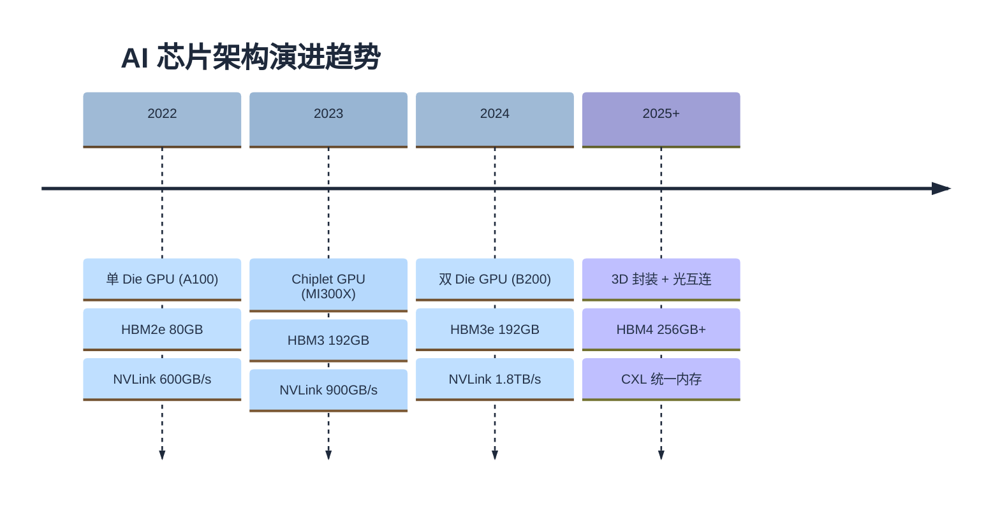

# 互连拓扑与 AI 芯片

> 分布式训练的通信占比从 5% 到 30% 不等，差距完全由互连拓扑决定。本文从通信需求出发，定量分析 NVLink、NVSwitch、PCIe、InfiniBand 的带宽和延迟特征，推导拓扑感知的并行策略分配，最后扩展到 GPU 之外的 AI 芯片架构。

### 关键术语

| 缩写 | 全称 | 含义 |
|------|------|------|
| NVLink | — | NVIDIA GPU 间高速互连 |
| NVSwitch | — | NVLink 交换芯片，实现全互联 |
| PCIe | Peripheral Component Interconnect Express | 外设互连标准 |
| IB | InfiniBand | 高性能网络互连 |
| RoCE | RDMA over Converged Ethernet | 融合以太网上的 RDMA |
| RDMA | Remote Direct Memory Access | 远程直接内存访问 |
| SHARP | Scalable Hierarchical Aggregation and Reduction Protocol | 网内归约协议 |
| NCCL | NVIDIA Collective Communications Library | NVIDIA 集合通信库 |
| ICI | Inter-Chip Interconnect | TPU 芯片间互连 |
| CDNA | Compute DNA | AMD GPU 计算架构 |
| HBM | High Bandwidth Memory | 高带宽内存 |

---

## 1. 通信需求：从并行策略推导

04 篇推导了各种并行策略的通信量。现在从硬件角度重新审视：

```
70B 模型训练一步的通信需求:

TP=8 (节点内):
  每层 2 次 All-Reduce, 每次 ~134 MB
  80 层: 160 次 × 134 MB = 21 GB
  要求: 极低延迟 (每次通信 <0.2 ms) → 必须走 NVLink

PP=2 (跨节点少量):
  前向+反向各 1 次点对点, 每次 ~67 MB
  通信量: 4 × 67 MB = 268 MB
  要求: 中等延迟 (<5 ms) → NVLink 或 IB

DP=4 (跨节点):
  1 次 All-Reduce 梯度, ~280 GB
  要求: 高带宽 (>50 GB/s) → IB
```

**核心矛盾**：不同并行策略对互连的需求不同——TP 需要低延迟，DP 需要高带宽，PP 需要中等延迟。互连拓扑必须同时满足这些需求。

---

## 2. GPU 互连技术

### 2.1 NVLink

NVLink 是 NVIDIA GPU 间的点对点高速互连：

```
NVLink 代际演进:
  V1 (Pascal):  40 GB/s, 4 链路
  V2 (Volta):   50 GB/s, 6 链路, 总带宽 300 GB/s
  V3 (Ampere):  50 GB/s, 12 链路, 总带宽 600 GB/s
  V4 (Hopper):  100 GB/s, 18 链路, 总带宽 900 GB/s
  V5 (Blackwell): 200 GB/s, 18 链路, 总带宽 1.8 TB/s

方向: 双向, 上述带宽为单向
```

**NVLink 的拓扑约束**：

```
H100 有 18 条 NVLink, 但不是所有 GPU 之间都有直连:

8 卡节点 (HGX H100):
  每卡 18 条 NVLink → 900 GB/s 双向
  通过 NVSwitch 实现全互联 → 任意两卡间 900 GB/s

4 卡节点 (常见配置):
  每卡 18 条 NVLink
  无 NVSwitch 时: 拓扑受限, 部分卡对间带宽 <900 GB/s
```

### 2.2 NVSwitch

NVSwitch 是 NVLink 的交换芯片，实现节点内全互联：

```
无 NVSwitch (4 卡):
  GPU0 ←→ GPU1: 900 GB/s (直连)
  GPU0 ←→ GPU2: 需经 GPU1 中转 → 带宽减半
  GPU0 ←→ GPU3: 需经 2 跳 → 带宽再减半

有 NVSwitch (8 卡):
  GPU_i ←→ GPU_j: 900 GB/s (全互联, 任意两卡间)
  NVSwitch 提供 72 个 NVLink 端口 → 8 卡全互联

HGX H100:
  4 个 NVSwitch 芯片
  每卡 18 条 NVLink 分配到 4 个 NVSwitch
  → 任意两卡间 900 GB/s
```

### 2.3 PCIe

PCIe 是 GPU 与 CPU 之间的标准互连：

```
PCIe Gen5:
  x16 带宽: 64 GB/s (双向)
  对比 NVLink V4: 900 GB/s → PCIe 是 NVLink 的 1/14

NUMA 亲和:
  双路 CPU 服务器:
    CPU 0 ← PCIe → GPU 0,1,2,3
    CPU 1 ← PCIe → GPU 4,5,6,7
    CPU 0 ←→ CPU 1: UPI 互连, ~40 GB/s

  跨 NUMA 访问:
    GPU 0 → GPU 4: PCIe → UPI → PCIe → 延迟高, 带宽低
    GPU 0 → GPU 1: NVLink → 延迟低, 带宽高
```

**PCIe 的角色**：主要用于 GPU-CPU 数据传输（如加载模型权重、保存检查点），不用于 GPU 间训练通信。

### 2.4 InfiniBand

IB 是节点间的高速网络互连：

```
IB 代际:
  HDR (200 Gb/s):  25 GB/s/端口, 4 端口 = 100 GB/s
  NDR (400 Gb/s):  50 GB/s/端口, 4 端口 = 200 GB/s
  XDR (800 Gb/s):  100 GB/s/端口, 4 端口 = 400 GB/s

对比:
  NVLink V4: 900 GB/s (节点内)
  NDR IB:    200 GB/s (节点间) → NVLink 的 1/4.5

RoCE v2:
  在标准以太网上实现 RDMA
  带宽: 400 Gb/s (100 GB/s) → 与 HDR IB 相当
  延迟: ~2-5 μs (vs IB ~1 μs) → 稍高
  优势: 成本低, 不需要专用 IB 交换机
```

### 2.5 带宽层次总览

```
互连带宽层次 (H100 集群):
  GPU 内 HBM:       3,350 GB/s  (1×)
  NVLink (节点内):    900 GB/s  (0.27×)
  NVSwitch (节点内):  900 GB/s  (0.27×)
  PCIe Gen5:           64 GB/s  (0.02×)
  NDR IB (节点间):    200 GB/s  (0.06×)
  RoCE v2:            100 GB/s  (0.03×)
  以太网 (25G):        3 GB/s  (0.001×)

关键: 节点内 NVLink 带宽是节点间 IB 的 4.5×
  → TP 必须在节点内, DP 可以跨节点
```

---

## 3. 集群拓扑

### 3.1 DGX/HGX 架构

NVIDIA 的标准 AI 服务器架构：

```
HGX H100 (8×H100):
  ┌──────────────────────────────────────────────┐
  │  NVSwitch × 4                                │
  │  ┌─────┐ ┌─────┐ ┌─────┐ ┌─────┐           │
  │  │GPU 0│ │GPU 1│ │GPU 2│ │GPU 3│           │
  │  └─────┘ └─────┘ └─────┘ └─────┘           │
  │  ┌─────┐ ┌─────┐ ┌─────┐ ┌─────┐           │
  │  │GPU 4│ │GPU 5│ │GPU 6│ │GPU 7│           │
  │  └─────┘ └─────┘ └─────┘ └─────┘           │
  │  2× CPU (双路)                               │
  │  2× ConnectX-7 (IB HCA)                     │
  │  NVMe SSD × 8                                │
  └──────────────────────────────────────────────┘

  GPU 间: NVLink 900 GB/s (全互联)
  节点间: IB NDR 400 Gb/s (200 GB/s 双向)
```

### 3.2 多节点拓扑

```
Fat-Tree 拓扑 (常见于大规模集群):
  叶交换机: 每个连接 8-16 个节点
  脊交换机: 连接所有叶交换机
  → 任意两节点间带宽相等

64 节点 (512 GPU) Fat-Tree:
  8 个叶交换机 × 8 节点/叶
  4 个脊交换机 × 连接所有叶
  总 IB 带宽: 64 × 200 GB/s = 12.8 TB/s

  All-Reduce 带宽:
    理论: 12.8 TB/s / 2 = 6.4 TB/s (Ring)
    实际: ~3-4 TB/s (协议开销 + 拥塞)
```

### 3.3 拓扑感知调度

并行策略的分配必须考虑物理拓扑：

```
原则: 通信密集的策略放在带宽高的路径上

TP (通信密集, 延迟敏感):
  → 必须在节点内 (NVLink 900 GB/s)
  → 绝对不能跨节点

PP (通信量小, 延迟中等):
  → 可以跨节点 (IB 200 GB/s)
  → 但相邻 stage 最好在同一节点

DP (通信量大, 但可与计算重叠):
  → 跨节点 (IB)
  → All-Reduce 可以与反向传播计算重叠

示例: 64 节点, 512 GPU, 70B 模型
  TP=8 (节点内), PP=2 (跨 2 节点), DP=32
  → 每 2 节点组成一个 PP 组
  → 32 个 PP 组做 DP
```

---

## 4. 集合通信

### 4.1 NCCL 的角色

NCCL 是 NVIDIA 的集合通信库，负责实现 All-Reduce、All-Gather、Reduce-Scatter、All-to-All 等原语：

```
NCCL 的核心功能:
  1. 自动检测拓扑 (NVLink/PCIe/IB)
  2. 选择最优通信算法 (Ring/Tree/Ring-Tree)
  3. 管理通信通道和缓冲区
  4. 支持通信与计算重叠

NCCL 环境变量:
  NCCL_IB_DISABLE=0        → 启用 IB
  NCCL_NET_GDR_LEVEL=5     → GPU Direct RDMA
  NCCL_ALGO=Ring           → 强制 Ring 算法
  NCCL_MIN_NCHANNELS=4     → 最小通道数
```

### 4.2 Ring All-Reduce

Ring All-Reduce 是最常用的 All-Reduce 算法：

```
Ring All-Reduce (N 个 GPU):
  阶段 1: Reduce-Scatter
    数据分成 N 块, 沿环传递并累加
    每步传输 数据量/N, 共 N-1 步
    总通信量: (N-1)/N × 数据量 ≈ 数据量

  阶段 2: All-Gather
    累加结果沿环广播
    每步传输 数据量/N, 共 N-1 步
    总通信量: (N-1)/N × 数据量 ≈ 数据量

  总通信量: 2 × 数据量
  带宽利用率: 每步只传输 1/N 的数据 → 带宽被 N 个 GPU 分时复用

  8 卡 NVLink Ring:
    每步带宽: 900 GB/s / 8 = 112.5 GB/s (每条链路)
    134 MB All-Reduce: 7 步 × 134MB/8 / 112.5 GB/s ≈ 0.10 ms
```

### 4.3 SHARP：网内归约

SHARP (Scalable Hierarchical Aggregation and Reduction Protocol) 让交换机参与归约计算：

```
传统 All-Reduce:
  GPU 0 → GPU 1 → GPU 2 → ... → GPU 7 → GPU 0
  数据在 GPU 之间传递, 每个 GPU 做部分归约

SHARP:
  GPU 0 ──┐
  GPU 1 ──┤
  GPU 2 ──┼── 交换机 (内置归约引擎) ──→ 归约结果广播
  GPU 3 ──┤
  ...   ──┘

  优势:
    1. 减少 GPU 间的数据传输量
    2. 交换机做归约 → GPU 不参与 → GPU 可以继续计算
    3. 延迟降低 ~30%

  限制:
    仅支持 Reduce-Scatter 和 All-Reduce
    需要 IB 交换机支持 SHARP
```

---

## 5. AI 芯片架构对比

### 5.1 Google TPU

```
TPU v5p:
  算力: 459 TFLOPS (BF16)
  HBM: 95 GB, 2.76 TB/s
  ICI 互连: 4.8 Tbps (600 GB/s) / 芯片
  拓扑: 3D Torus (6 邻居)

  与 H100 对比:
    算力: 459 vs 989 TFLOPS → H100 的 46%
    HBM 带宽: 2.76 vs 3.35 TB/s → H100 的 82%
    互连: 600 vs 900 GB/s → H100 的 67%

  TPU 的优势:
    1. 脉动阵列 (MXU): 专为矩阵乘法设计
    2. ICI 拓扑: 3D Torus 比 Fat-Tree 更适合大规模
    3. 成本: TPU v5p 租用价格低于 H100

  TPU 的劣势:
    1. 灵活性差: 不擅长非矩阵运算
    2. 生态: JAX/PyTorch XLA, 不如 CUDA 成熟
    3. 稀疏性: MoE 的 All-to-All 在 ICI 上效率低于 NVLink
```

### 5.2 华为昇腾

```
昇腾 910B:
  算力: 320 TFLOPS (FP16)
  HBM: 64 GB, 1.6 TB/s
  HCCS 互连: 392 GB/s (芯片间)
  HCCL 通信库 (对应 NCCL)

  Da Vinci 架构:
    Cube 单元: 矩阵乘加 (对应 Tensor Core)
    Vector 单元: 向量运算 (Softmax, LayerNorm)
    Scalar 单元: 标量控制

  与 H100 对比:
    算力: 320 vs 989 TFLOPS → H100 的 32%
    HBM 带宽: 1.6 vs 3.35 TB/s → H100 的 48%
    互连: 392 vs 900 GB/s → H100 的 44%
```

### 5.3 AMD Instinct

```
MI300X (CDNA 3):
  算力: 1.3 PFLOPS (FP16, 含稀疏)
  HBM: 192 GB HBM3, 5.3 TB/s
  Infinity Fabric: 800 GB/s (芯片间)
  ROCm 生态

  优势:
    1. HBM 容量 192 GB → 单卡可跑 70B 模型推理
    2. HBM 带宽 5.3 TB/s → Decode 吞吐高
    3. Chiplet 设计 → 成本优势

  劣势:
    1. ROCm 生态不如 CUDA 成熟
    2. 软件栈兼容性问题
    3. FP8 支持不如 Hopper 完善
```

### 5.4 架构趋势



| 趋势 | 驱动力 | 对 LLM 的影响 |
|------|--------|---------------|
| Chiplet | 单 Die 面积/良率限制 | 更大 HBM 容量，更低成本 |
| 3D 封装 | 带宽需求 | HBM 与计算芯粒更近，带宽提升 |
| FP8/FP4 | 推理吞吐需求 | 推理吞吐 2-4×，训练速度 ~1.4× |
| CXL | 内存容量限制 | CPU/GPU 共享内存池，突破 HBM 容量限制 |
| 光互连 | 互连带宽瓶颈 | 节点间带宽 10×，DP 通信不再是瓶颈 |
| 存算一体 | 带宽瓶颈 | Decode 阶段权重读取零搬运 |

---

## 6. 通信需求如何决定硬件选型

### 6.1 从模型规模推导互连需求

```
给定: 70B 模型, S=4096, BF16, 目标 MFU > 45%

TP 通信需求:
  每层 2 次 All-Reduce, 每次 134 MB
  允许通信占比: <8%
  每步计算时间: ~3 ms/层
  允许通信时间: 3 × 0.08 = 0.24 ms/层
  需要 All-Reduce 带宽: 2 × 134 MB / 0.24 ms = 1.1 TB/s
  → 必须走 NVLink (900 GB/s 接近, 考虑双缓冲和重叠)

DP 通信需求:
  All-Reduce 梯度: 280 GB
  允许通信占比: <10%
  每步计算时间: ~3 s (80 层 × 3 ms × batch)
  允许通信时间: 0.3 s
  需要带宽: 280 GB / 0.3 s = 933 GB/s
  → NDR IB 200 GB/s × 8 卡 = 1.6 TB/s → 足够
```

### 6.2 硬件选型决策

| 模型规模 | 推荐 GPU | TP 度 | PP 度 | 互连要求 |
|----------|---------|-------|-------|---------|
| 7B | 1×A100 | 1 | 1 | 无 |
| 13B | 2×A100 | 2 | 1 | NVLink |
| 70B | 8×H100 | 8 | 1 | NVSwitch |
| 70B (大规模) | 64×H100 | 8 | 2 | NVSwitch + IB NDR |
| 405B | 128×H100 | 8 | 4 | NVSwitch + IB NDR |
| 671B MoE | 2048×H100 | 8 | 1 | NVSwitch + IB NDR + SHARP |

---

## 7. 要点回顾

| 要点 | 说明 |
|------|------|
| 带宽层次 | HBM 3350 > NVLink 900 > IB 200 > PCIe 64 GB/s |
| TP 必须节点内 | NVLink 延迟 ~0.15 ms，IB 延迟 ~2.7 ms，差 18× |
| NVSwitch | 实现节点内全互联，任意两卡间 900 GB/s |
| Ring All-Reduce | 总通信量 2×数据量，带宽被 N 卡分时复用 |
| SHARP | 交换机参与归约，减少 GPU 间数据传输，延迟降低 ~30% |
| 拓扑感知 | TP 在节点内，PP 跨少量节点，DP 跨大规模节点 |
| TPU ICI | 3D Torus 拓扑，适合大规模，但灵活性不如 GPU |
| MI300X | 192 GB HBM 是推理优势，ROCm 生态是短板 |
| 架构趋势 | Chiplet、3D 封装、FP8/FP4、光互连、CXL |

---

## 参考资料

- [NVIDIA HGX H100 Whitepaper](https://www.nvidia.com/en-us/data-center/hgx/) — HGX 架构
- [NCCL Documentation](https://docs.nvidia.com/deeplearning/nccl/user-guide/docs/) — NCCL 原理与配置
- [SHARP: Scalable Hierarchical Aggregation and Reduction Protocol](https://www.mellanox.com/related-docs/prod_software/PB_Scalable_Hierarchical_Aggregation_and_Reduction_Protocol.pdf) — SHARP
- [TPU v5p System Architecture](https://cloud.google.com/tpu/docs/v5p) — TPU 架构
- [AMD Instinct MI300X](https://www.amd.com/en/products/accelerators/instinct/mi300/mi300x.html) — MI300X 规格
- [NVIDIA Blackwell Architecture](https://www.nvidia.com/en-us/data-center/dgx-b200/) — Blackwell 互连
- [NVIDIA-GPU架构演进与LLM](./NVIDIA-GPU架构演进与LLM.md) — GPU 代际演进

> 前置阅读：[04-分布式训练并行策略](./04-分布式训练并行策略.md)、[03-GPU架构：从SIMT到TensorCore](./03-GPU架构-从SIMT到TensorCore.md)
> 本文档为系列终篇
