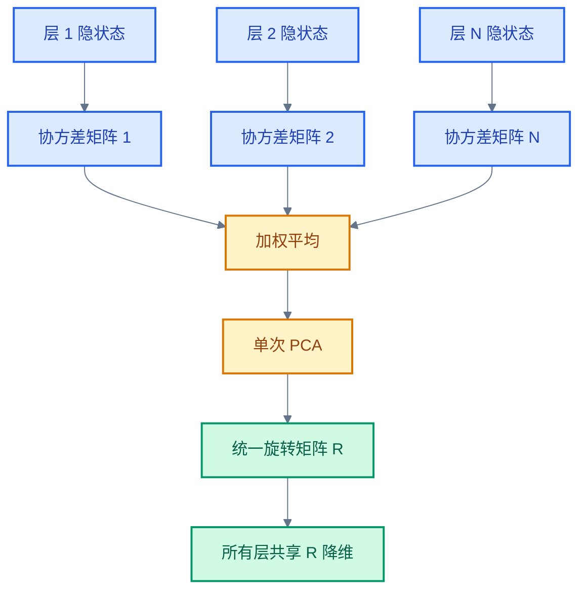
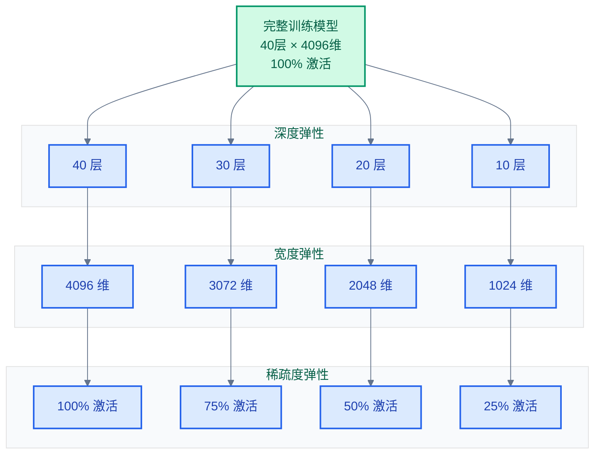
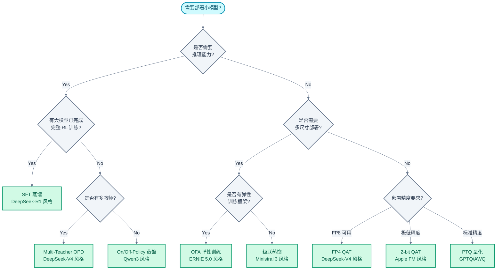

# LLM 蒸馏与模型压缩：级联蒸馏、OPD 到弹性部署

> **核心命题**：大模型的能力向小模型迁移，是整个 LLM 产业化的"最后一公里"。知识蒸馏（Knowledge Distillation, KD）、剪枝（Pruning）、量化感知训练（QAT）和弹性训练（Elastic Training）构成四条主线，它们在方法论上逐渐收敛——2025 年的技术报告显示，On-Policy Distillation、多教师融合和训练-压缩一体化正在成为新范式。
> **工程师视角**：本文以"资源换精度"为组织原则——每种方法都在回答同一个问题：用多少计算/数据/工程复杂度，换取多大的模型压缩比和精度保持率。理解这个 tradeoff，才能在真实部署场景中做出正确选择。

### 关键术语

| 缩写 | 全称 | 含义 |
|------|------|------|
| KD | Knowledge Distillation | 知识蒸馏，用大模型（教师）的输出指导小模型（学生）训练 |
| OPD | On-Policy Distillation | 在策略蒸馏，教师对学生实时生成的数据进行指导 |
| SFT | Supervised Fine-Tuning | 监督微调 |
| QAT | Quantization-Aware Training | 量化感知训练，训练中模拟低精度效果 |
| PTQ | Post-Training Quantization | 训练后量化，不重新训练 |
| MoE | Mixture of Experts | 混合专家模型 |
| KL | Kullback-Leibler Divergence | KL 散度，衡量两个概率分布的差异 |
| RL | Reinforcement Learning | 强化学习 |
| FP4/FP8 | 4-bit/8-bit Floating Point | 4 位/8 位浮点数格式 |
| E2M1 | Exponent 2, Mantissa 1 | FP4 的一种格式（2 位指数 + 1 位尾数） |
| SwiGLU | Swish-Gated Linear Unit | 一种激活函数，FFN 中常用 |
| PCA | Principal Component Analysis | 主成分分析 |
| RM | Reward Model | 奖励模型 |
| GRPO | Group Relative Policy Optimization | 组内相对策略优化 |

---

## 目录

1. [WHY：压缩方法分类与资源-精度权衡](#why压缩方法分类与资源-精度权衡)
2. [Ministral 3：级联剪枝蒸馏](#ministral-3级联剪枝蒸馏)
3. [DeepSeek-R1：纯 SFT 蒸馏](#deepseek-r1纯-sft-蒸馏)
4. [Qwen3：Strong-to-Weak On/Off-Policy 蒸馏](#qwen3strong-to-weak-onoff-policy-蒸馏)
5. [DeepSeek-V4：OPD 全词表蒸馏](#deepseek-v4opd-全词表蒸馏)
6. [GLM-5：跨阶段 On-Policy 蒸馏](#glm-5跨阶段-on-policy-蒸馏)
7. [ERNIE 5.0：Once-For-All 弹性训练](#ernie-50once-for-all-弹性训练)
8. [量化感知训练与稀疏化部署](#量化感知训练与稀疏化部署)
9. [方法对比矩阵](#方法对比矩阵)

---

## 1. WHY：压缩方法分类与资源-精度权衡

### 1.1 前置知识

| 需要了解 | 参考文档 |
|----------|----------|
| PTQ 量化原理（GPTQ、AWQ） | [09-量化技术](./09-LLM量化技术：PTQ、QAT到FP8推理.md) |
| Post-Training 管线（SFT、RLHF） | [07-Post-Training基础](./07-LLM%20Post-Training基础：SFT、RLHF与DPO.md) |
| GRPO 与多阶段 RL | [08-Post-Training进阶](./08-LLM%20Post-Training进阶：GRPO与多阶段RL.md) |
| MoE 架构与专家路由 | [04-MoE架构](./04-LLM%20MoE架构：路由、负载均衡与专家并行.md) |

### 1.2 压缩方法分类

LLM 模型压缩的四条主线，按"是否需要重新训练"分为两大阵营：

```
模型压缩方法分类:

  无需重新训练:
  ├── PTQ (Post-Training Quantization)
  │   └── GPTQ, AWQ, SmoothQuant → 直接量化，成本最低
  ├── 结构化剪枝 (Structured Pruning)
  │   └── 按层/头/神经元剪枝 → 直接裁剪
  └── 缓存优化 (KV Cache 量化)
      └── KIVI, KVQuant → 推理阶段动态优化

  需要训练:
  ├── 知识蒸馏 (Knowledge Distillation)
  │   ├── SFT 蒸馏 (DeepSeek-R1 风格): 教师生成数据 → 学生 SFT
  │   ├── OPD (On-Policy Distillation): 教师实时生成 + KL 对齐
  │   ├── 跨阶段蒸馏 (GLM-5 风格): 前阶段模型作教师
  │   └── 级联蒸馏 (Ministral 3 风格): 剪枝→蒸馏→重复
  ├── QAT (Quantization-Aware Training)
  │   └── FP4/2-bit 训练中模拟量化
  ├── 弹性训练 (Elastic Training)
  │   └── 一次训练产出多个子模型
  └── 稀疏 Upcycling
      └── MoE 教师 → Dense 学生
```

### 1.3 资源-精度权衡谱系

```
精度保持率 ↑
100%  │                                      ★ 弹性训练 (ERNIE 5.0)
      │                               ★ OPD (DeepSeek-V4)
 98%  │                    ★ 级联蒸馏 (Ministral 3)
      │           ★ SFT 蒸馏 (DeepSeek-R1)
 95%  │    ★ On/Off-Policy 蒸馏 (Qwen3)
      │ ★ 跨阶段蒸馏 (GLM-5)
 90%  │
      │        ★ FP4 QAT (DeepSeek-V4)
      │   ★ 2-bit QAT (Apple FM)
 85%  │★ PTQ 4-bit
      │
  ────┼──────────────────────────────────────────────▶ 工程复杂度/计算成本
      0    低        中         高        很高
```

**关键洞察**：蒸馏和弹性训练在精度上远超 PTQ，但成本高出 1-2 个数量级。真正的工程决策在于：你的服务规模是否足以摊销这个成本。

---

## 2. Ministral 3：级联剪枝蒸馏

### 2.1 核心思想

Ministral 3 提出了当前最完整的模型压缩管线——**Cascade Distillation**（级联蒸馏）。核心流程是 **Prune → Distill → Repeat**（剪枝 → 蒸馏 → 重复），用单次数据遍历（1 pass）实现从一个大模型导出 3 个不同尺寸的高质量小模型。

```
级联蒸馏流程:

  ┌─────────────────────────────────────────────────────┐
  │   大型教师模型 (多尺寸压缩的发源地)                    │
  │   训练数据量: 1-3T tokens (vs Qwen3 36T / Llama3 15T) │
  └────────┬────────────────────────────────────────────┘
           │
           ▼
  ┌────────────────┐
  │ Step 1: 三级剪枝  │  ← 层/隐层/FFN 三维度同时压缩
  └────────┬───────┘
           ▼
  ┌────────────────┐
  │ Step 2: 蒸馏微调  │  ← Pure Forward KL Loss
  └────────┬───────┘
           ▼
  ┌────────────────┐
  │ Step 3: 重复       │  ← 对目标尺寸进一步剪枝
  └────────┬───────┘
           ▼
  ┌─────────────────────────────────────────────────────┐
  │ 产出: 3 个尺寸的学生模型 (14B / 8B / 3B)             │
  └─────────────────────────────────────────────────────┘
```

**数据效率**：仅用 1-3T tokens 完成全管线（对比 Qwen3 的 36T 和 Llama 3 的 15T），证明结构化剪枝 + 蒸馏的策略在数据效率上远超从头训练。

### 2.2 三级剪枝：层 / 隐层 / FFN

Ministral 3 的剪枝在三个维度上同时进行，每个维度有独立的评价指标：

```
三级剪枝维度:

  层级 (Layer-Level):
    评价指标: Activation Norm Ratio (激活范数比)
    操作: 移除贡献最小的层
    原理: 某些层对信息流的贡献远低于其他层

  隐层维度 (Hidden Dimension):
    评价指标: Cross-Layer PCA → 单旋转矩阵
    操作: 降低隐藏维度（如 4096 → 3072）
    原理: 跨层合并冗余维度，不是逐层独立降维

  FFN 维度 (FFN Intermediate Dimension):
    评价指标: SwiGLU Gate-Aware Importance (门控感知重要性)
    操作: 压缩 FFN 中间层（按 gate 值排序裁剪）
    原理: SwiGLU 的 gate 分支天然提供了神经元重要性排序
```

#### 层级剪枝：Activation Norm Ratio

对每一层计算激活值的范数比率，衡量该层对最终输出的贡献：

$$\text{ratio}_l = \frac{\| \mathbf{h}_l \|}{\frac{1}{L} \sum_{i=1}^{L} \| \mathbf{h}_i \|} \tag{1}$$

其中 $\mathbf{h}_l$ 是第 $l$ 层的输出隐状态，$\|\cdot\|$ 是 L2 范数。ratio 低于阈值的层被移除。

#### 隐层剪枝：跨层 PCA 统一旋转

传统方案对每层独立做 PCA 降维，导致不同层使用不同的旋转矩阵，层间信息无法对齐。Ministral 3 的做法是：

1. 收集所有层隐状态的协方差矩阵
2. 加权平均得到一个"跨层协方差"
3. 对跨层协方差做一次 PCA，得到**单一旋转矩阵**
4. 所有层共享同一旋转矩阵进行降维



单一旋转矩阵的核心优势：所有层的降维方向一致，蒸馏时学生模型不需要额外学习"对齐"不同层的隐空间。

#### FFN 剪枝：SwiGLU Gate-Aware

SwiGLU FFN 的公式为：

$$\text{SwiGLU}(x) = (xW_1 \odot \text{SiLU}(xW_{\text{gate}}))W_2 \tag{2}$$

其中 $\odot$ 表示逐元素乘法。gate 分支的激活值 $g = \text{SiLU}(xW_{\text{gate}})$ 天然是每个神经元重要性的指示器——如果某个神经元的 gate 值在大量样本上都接近 0，该神经元对输出的贡献也接近 0。

Ministral 3 的 FFN 剪枝策略：
1. 收集大量样本上的 gate 均值 $\bar{g}_i$
2. 按 $\bar{g}_i$ 降序排列神经元
3. 保留前 $k\%$（由目标尺寸决定）
4. 对应的 $W_1$ 行、$W_2$ 列同步裁剪

### 2.3 蒸馏损失：Pure Forward KL

Ministral 3 系统比较了多种蒸馏损失函数，最终选择 **Pure Forward KL**（纯前向 KL 散度）：

| 损失函数 | 公式 | 效果评估 |
|----------|------|---------|
| Forward KL | $D_{\text{KL}}(p_t \| p_s)$ | ★★★★★ 最优 |
| Reverse KL | $D_{\text{KL}}(p_s \| p_t)$ | ★★★ 偏保守 |
| L2 回归 | $\| \mathbf{h}_t - \mathbf{h}_s \|^2$ | ★★★ 需调参 |
| Forward KL + L2 | $(1-\lambda)\cdot\text{KL} + \lambda\cdot\text{L2}$ | ★★★★ 不如纯 Forward KL |

**Pure Forward KL 优于加权组合的原因**：

Forward KL 的形式为：

$$D_{\text{KL}}(p_t \| p_s) = \mathbb{E}_{x \sim p_t} \left[ \log \frac{p_t(x)}{p_s(x)} \right] = -\mathbb{E}_{x \sim p_t}[\log p_s(x)] + \text{const} \tag{3}$$

其中 $p_t$ 是教师分布，$p_s$ 是学生分布。Forward KL 天然鼓励学生覆盖教师的所有高概率区域（mean-seeking），而 Reverse KL 是 mode-seeking——两者存在目标冲突。

> **注意**：Ministral 3 论文仅报告了 Forward KL 的结果，该对比表的星级评估来自文献中关于蒸馏损失的理论分析（如 KD Survey Xu 2024 中关于 Forward/Reverse KL 的讨论），并非 Ministral 3 的直接实验对比。

**结论**：Ministral 3 发现使用纯 Forward KL 蒸馏目标优于将其与 next-token prediction 目标进行加权组合。

### 2.4 教师模型选择

Ministral 3 发现了一个关键洞察：**Post-Trained 教师 > Pre-Trained 教师**，且 **Preference-Tuned 教师 > SFT-Only 教师**：

```
教师模型的能力层次:

  Preference-Tuned 教师 (RLHF/DPO/GRPO 之后)
  │   ★★★★★ 最优蒸馏源
  │
  ├── SFT-Only 教师 (仅监督微调)
  │   ★★★ 缺少偏好知识
  │
  └── Pre-Trained 教师 (仅预训练)
      ★★ 与目标用途的分布差距大
```

**Capacity Gap 现象**：教师和学生的参数量差距过大时，学生无法完全模仿教师。Ministral 3 独立验证了此前工作（Busbridge et al., 2025）中的发现——但在 Post-Training 阶段，即使教师远大于学生，学生仍能有效学习；因为 Post-Training 引入的"行为模式"（如何推理、如何表达偏好）比预训练阶段的知识更容易压缩。

---

## 3. DeepSeek-R1：纯 SFT 蒸馏

### 3.1 核心发现

DeepSeek-R1 技术报告中有一个被广泛引用的结论：**对大模型进行 RL 训练的蒸馏效果，远好于对小模型直接做 RL**。

```
R1 蒸馏 vs 从头 RL:

  Qwen-32B + R1 蒸馏 (800K 样本 SFT)
  │   精度: 与 R1 接近 (数学/代码任务)
  │   成本: ~1/10 的 R1 完整 RL GPU 小时
  │
  └── Qwen-32B + 从头 RL (GRPO)
       精度: 显著低于蒸馏版本
       成本: ~10× 于蒸馏
```

**结论**：如果目标是获得有推理能力的小模型，**先用大模型做 RL 产生高质量推理数据，再 SFT 蒸馏到小模型**——这比直接让小模型做 RL 更有效、更便宜。

### 3.2 数据生成

R1 蒸馏的数据生成流程：

```
R1 蒸馏数据管线:

  DeepSeek-R1 (671B MoE, 完成完整 RL 训练)
  │
  ├──▶ 对 800K 个问题采样生成回复
  │    │
  │    ├── 数学题 (MATH, GSM8K 等)
  │    ├── 代码题 (LiveCodeBench, Codeforces 等)
  │    ├── 逻辑推理 (GPQA 等)
  │    └── 通用知识问答
  │
  ▼
  生成数据: 800K (问题, CoT 推理 + 答案) 对
  │
  ▼
  SFT 到学生模型 (Qwen-32B / Llama-70B 等基座)
  │
  ▼
  学生模型获得 R1 级别的推理能力
```

**关键细节**：

- 数据量仅 800K 条——相比预训练的万亿级 tokens，这极为高效
- 不需要单独的 RM 训练或 RL 循环
- 蒸馏对基座模型的能力有要求——Qwen 和 Llama 的 32B+ 模型效果最好，7B 以下效果衰减明显

### 3.3 蒸馏 vs RL from Scratch 的对比

| 对比维度 | R1 蒸馏 (32B) | RL from Scratch (32B) |
|----------|--------------|----------------------|
| 训练方式 | SFT 800K samples | GRPO 多轮 RL |
| 数据来源 | R1 生成 | 规则奖励（数学/代码） |
| GPU 小时 | ~1/10 | 基准（~10×） |
| 数学能力 (MATH) | 接近 R1 水平 | 明显低于蒸馏 |
| 代码能力 | 接近 R1 水平 | 明显低于蒸馏 |
| 泛化推理 | 继承 R1 的推理模式 | 需要自主探索 |
| 失败模式 | 教师模型能力上限 | 奖励 hacking / 模式坍缩 |

**本质原因**：RL from Scratch 需要小模型自己探索推理策略，这在小参数量下非常困难——探索空间太大且缺乏引导。而蒸馏直接提供了"最优推理轨迹"作为学习目标，相当于给了小模型一份推理能力的参考答案。

---

## 4. Qwen3：Strong-to-Weak On/Off-Policy 蒸馏

### 4.1 Strong-to-Weak 范式

Qwen3 的蒸馏策略建立在"强教师到弱学生"（Strong-to-Weak）范式上，解决了多阶段训练的成本问题。

```
Qwen3 蒸馏的两种模式:

  On-Policy (在线):
    ┌─────────┐  实时生成   ┌─────────┐
    │ 强教师    │ ────────▶ │ 弱学生    │
    │ (大模型)  │ ◀──────── │ (小模型)  │
    └─────────┘  KL 对齐    └─────────┘
    教师针对学生当前分布，实时生成回复
    → 分布匹配最好，成本最高

  Off-Policy (离线):
    ┌─────────┐  预生成数据集  ┌─────────┐
    │ 强教师    │ ────────▶ │ 弱学生    │
    │ (大模型)  │           │ (小模型)  │
    └─────────┘           └─────────┘
    教师提前生成回复并存储
    → 成本最低，存在 distribution mismatch
```

### 4.2 四阶段训练中的蒸馏角色

Qwen3 的四阶段训练管线中，蒸馏的介入方式不同：

| 阶段 | 主要任务 | 蒸馏模式 | 数据来源 | 占比 |
|------|---------|---------|---------|------|
| Stage 1 | SFT 基座 | Off-Policy | 大模型预生成 | 100% |
| Stage 2 | 推理 GRPO | 无蒸馏 | 规则奖励 | — |
| Stage 3 | 双模平衡 | On-Policy | 教师实时生成 + KL | ~30% |
| Stage 4 | 通用对齐 | Off-Policy | 大模型预生成采样 | ~70% |

**成本节约**：On-Policy 蒸馏仅在 Stage 3 使用（最需要分布匹配的阶段），其余使用 Off-Policy。整体蒸馏成本约为完整四阶段训练的 1/10。

### 4.3 KL 对齐机制

Off-Policy 蒸馏的核心问题是 distribution mismatch——教师预生成的数据分布与学生当前策略分布不同。Qwen3 的对齐方案：

$$
\mathcal{L}_{\text{distill}} = \underbrace{\mathcal{L}_{\text{SFT}}(y_t | x)}_{\text{离线数据}} + \beta \cdot \underbrace{D_{\text{KL}}(p_\theta(\cdot|x) \| p_{\text{teacher}}(\cdot|x))}_{\text{在线 KL 对齐}} \tag{4}
$$

- 第一项是标准 SFT 损失——学生在教师预生成的数据上做 next-token prediction
- 第二项是 KL 项——鼓励学生对相同输入产生尽可能接近教师 logits 的输出分布
- $\beta$ 控制对齐强度，Qwen3 中约为 0.1

KL 项不需要教师实时生成——只需要教师模型对离线数据中的 `(问题, 回复)` 对计算一次 logits 并存储即可。这比 On-Policy 的实时生成高效得多。

### 4.4 Gemma 3：256-Logit 采样蒸馏

作为补充对比，Gemma 3 采用了一种更轻量的蒸馏策略：

```
Gemma 3 蒸馏:

  1. 从教师 logits 中随机采样 256 个位置的 logit 值
  2. 仅对这 256 个采样位置计算 KL 散度
  3. 其余位置（128K-256 个）忽略

  → logit 计算量减少 ~99.8%
  → 蒸馏精度损失极小

  Attention 蒸馏:
  - 5:1 比例混合局部注意力和全局注意力
  - KV Cache 占用 < 15% 于标准全局注意力
```

256-logit 采样利用了 LLM 词汇表的高冗余度——绝大多数 token 的预测概率近乎零，只需要在 top-256 附近采样即可准确近似完整 KL 散度。

---

## 5. DeepSeek-V4：OPD 全词表蒸馏

### 5.1 前置知识

| 需要了解 | 参考文档 |
|----------|----------|
| DeepSeek-V4 Specialist Training | [08-Post-Training进阶](./08-LLM%20Post-Training进阶：GRPO与多阶段RL.md) |
| MoE 架构与路由 | [04-MoE架构](./04-LLM%20MoE架构：路由、负载均衡与专家并行.md) |

### 5.2 Specialist Training → Multi-Teacher OPD

DeepSeek-V4 先通过 **Specialist Training** 训练多个专注不同领域的专家模型，然后将它们作为**多教师**蒸馏到统一的模型中。

```
DeepSeek-V4 多教师蒸馏管线:

  ┌──────────────┐  ┌──────────────┐  ┌──────────────┐
  │ Math Specialist│  │ Code Specialist│  │ Lang Specialist│
  │ (数学专家模型)  │  │ (代码专家模型)  │  │ (语言专家模型)  │
  └──────┬───────┘  └──────┬───────┘  └──────┬───────┘
         │                 │                 │
         └─────────────────┼─────────────────┘
                           ▼
              ┌────────────────────────┐
              │ Multi-Teacher OPD       │
              │ Reverse KL 融合         │
              │ + Full-Vocabulary OPD   │
              └───────────┬────────────┘
                          ▼
              ┌────────────────────────┐
              │ Unified Student Model   │
              └────────────────────────┘
```

### 5.3 Reverse KL 多教师融合

DeepSeek-V4 选择 Reverse KL 而非 Forward KL：

$$D_{\text{KL}}(p_s \| p_t) = \mathbb{E}_{x \sim p_s} \left[ \log \frac{p_s(x)}{p_t(x)} \right] \tag{5}$$

Reverse KL 是"mode-seeking"——鼓励学生找到教师分布中的局部模式，而不是覆盖所有模式。这在多教师场景下尤为重要：如果学生试图覆盖所有教师的全部知识（Forward KL），会陷入"谁也学不像"的困境。Reverse KL 让学生选择性地从每个教师那里学习最匹配的模式。

多教师融合的加权形式：

$$\mathcal{L}_{\text{multi-teacher}} = \sum_{i=1}^{K} \alpha_i \cdot D_{\text{KL}}(p_s \| p_t^{(i)}) \tag{6}$$

其中 $K$ 是教师数量，$\alpha_i$ 是领域权重（由输入数据的领域标签决定），$p_t^{(i)}$ 是第 $i$ 个教师的分布。

### 5.4 Full-Vocabulary OPD

标准 OPD 只在 teacher-forcing 的 token 位置计算 KL 散度。DeepSeek-V4 提出了 **Full-Vocabulary OPD**——对整个词汇表的所有位置计算 KL：

```
标准 OPD (Token-Level):
    输入: "What is 2+2?"
    教师输出: "The answer is 4"
    学生输出: "The result is 4"
    ↓
    KL 仅在 teacher-forcing 的 4 个位置计算

Full-Vocabulary OPD:
    输入: "What is 2+2?"
    教师输出: "The answer is 4" → logits [V-dim] at each position
    学生输出: "The result is 4" → logits [V-dim] at each position
    ↓
    KL 在整个 V-dim 词表上对所有位置计算
    → 学到更完整的分布知识
```

**成本与收益**：

- 计算成本增加约 V / 1 = 128K 倍（V 为词表大小，约 128K）
- 但收益显著：Full-Vocabulary OPD 让学生学到"哪些 token 虽然不是正确答案但接近正确答案"——这对模型的 smoothness 和泛化能力至关重要
- DeepSeek-V4 仅在 MoE 权重蒸馏的最后阶段使用 Full-Vocabulary OPD

---

## 6. GLM-5：跨阶段 On-Policy 蒸馏

### 6.1 Cross-Stage Distillation

GLM-5 提出了一种独特的蒸馏策略——**同一模型的不同训练阶段互为师生**：

```
GLM-5 Cross-Stage Distillation:

  Stage N 的模型 ────▶ 作为 Stage N+1 的教师
         │                      │
         │  (已完成 Stage N 训练)  │  (正在做 Stage N+1 训练)
         │                      │
         └──── OPD logits ──────┘
```

传统蒸馏是"大模型 → 小模型"的跨模型蒸馏，GLM-5 是"旧版本 → 新版本"的跨阶段蒸馏——本质是在防止训练后期的灾难性遗忘（Catastrophic Forgetting）。

### 6.2 Advantage → Logit Difference

GRPO 训练中，策略更新的核心是 advantage 加权。GLM-5 将这一机制应用于蒸馏：

```
标准 GRPO 更新:
  Δθ ∝ Σ (advantage) × ∇log π(y|x)

GLM-5 Cross-Stage Distillation:
  用 logit difference 替代 advantage:
  Δθ ∝ Σ (logit_teacher - logit_student) × ∇log π(y|x)
```

数学上：

$$\mathcal{L}_{\text{cross-stage}} = D_{\text{KL}}(p_{\text{stage-N}} \| p_{\text{stage-N+1}}) \cdot w(x) \tag{7}$$

其中 $w(x)$ 是输入的重要性权重（基于问题难度或 teacher 的 confidence），$p_{\text{stage-N}}$ 是前一阶段模型的分布。

**为什么用 logit difference 替代 advantage**：

- Advantage 来自奖励信号，可能受 RM 误差影响
- Logit difference 直接反映两个模型在当前输入上的认知差异
- 在 RL 训练的 advantage 估计可能不稳定的场景下，logit difference 更可靠

### 6.3 group_size=1 高吞吐实现

GLM-5 在实现上做了关键的工程设计：**group_size=1**。

```
group_size 对蒸馏吞吐的影响:

  group_size=16 (GRPO 默认):
    1 个问题 → 16 个候选回复 → 1 次教师生成  → 1 次 KL 计算
    → 吞吐瓶颈: 候选回复生成

  group_size=1 (GLM-5 蒸馏):
    1 个问题 → 1 个回复 → 1 次教师生成 → 1 次 KL 计算
    → 吞吐: 直接计算 KL，无需等待 16 个候选
```

group_size=1 让蒸馏的吞吐接近标准 SFT 训练——因为不再需要为每个问题生成多条候选回复。这对 On-Policy 蒸馏的工程可行性至关重要：group_size=16 的 On-Policy 蒸馏吞吐约为 SFT 的 1/16。

---

## 7. ERNIE 5.0：Once-For-All 弹性训练

### 7.1 核心思想

ERNIE 5.0 提出的 **Once-For-All (OFA) Elastic Training**（一次性弹性训练）是"训练-部署"一体化的代表：

```
传统方案:
  大模型 ──蒸馏──▶ 中型模型 ──蒸馏──▶ 小型模型
  每产出一个尺寸，需要一次完整的训练/蒸馏

OFA 弹性训练:
  ┌──────────────────────────────────┐
  │         一次训练                  │
  │  深度方向: 40层/30层/20层/10层     │
  │  宽度方向: 4096/3072/2048/1024    │
  │  稀疏度: 100%/75%/50%/25%         │
  └──────────────┬───────────────────┘
                 ▼
    产出 4×4×4 = 64 个不同配置的子模型
    每个子模型: 从完整模型的参数中直接切片
```

### 7.2 三维弹性



**训练时的关键约束**：

1. **深度弹性**：训练时每 N 步随机选一个子深度，只更新对应层
2. **宽度弹性**：训练时随机选子宽度，只更新前 k 个维度（其余冻结或用 mask）
3. **稀疏度弹性**：通过动态 FFN 神经元 dropout + L1 正则化实现

三个维度的弹性是**独立的**——可以任选一个子深度 + 一个子宽度 + 一个子稀疏度组合成有效的子模型。

### 7.3 53.7% 激活参数的结果

ERNIE 5.0 报告的核心数据：

```
配置: 53.7% 激活参数 (仅层+宽度子集)
精度: 与 100% 模型几乎无退化

关键指标:
  - MMLU: 100%: 75.2 → 53.7%: 74.8 (-0.4)
  - HumanEval: 100%: 82.3 → 53.7%: 81.1 (-1.2)
  - MATH: 100%: 68.5 → 53.7%: 67.3 (-1.2)

结论: 用约一半激活参数实现近乎相同的效果
```

### 7.4 弹性训练 vs 蒸馏的取舍

| 对比维度 | OFA 弹性训练 | 级联蒸馏 (Ministral 3) |
|----------|------------|----------------------|
| 训练次数 | 1 次 | 3 次（每尺寸一次） |
| 子模型数量 | 64 个 | 3 个 |
| 子模型质量 | 53.7% 参数量近无损 | 每尺寸质量独立控制 |
| 部署灵活性 | 极高（动态切换尺寸） | 中（固定尺寸） |
| 训练复杂度 | 极高（弹性训练框架） | 中（标准训练改造） |
| 单个子模型峰值性能 | 略低（弹性训练妥协） | 高（针对该尺寸优化） |

---

## 8. 量化感知训练与稀疏化部署

### 8.1 FP4 QAT：DeepSeek-V4 的 E2M1 方案

DeepSeek-V4 在 MoE 权重上引入了 FP4 QAT——

```
FP4 E2M1 格式:
  ┌────┬─────┬──────┐
  │ 符号 │ 指数  │ 尾数  │
  │ 1b  │ 2b   │ 1b   │
  └────┴─────┴──────┘

  表示范围: ±0, ±0.5, ±1, ±2, ±3, ±4, ±6
  动态范围: ~8
```

E2M1 的设计针对 MoE 权重的分布特点：MoE 专家的权重通常范围较小且分布集中，不需要 FP8 E4M3 的大动态范围。

**QAT 流程**：

```
FP4 QAT 训练:

  1. Forward: FP4 权重→ 反量化到 FP8 → 用 FP8 训练框架计算
  2. Backward: FP8 梯度 → 累积到 FP8 主副本
  3. 周期性: FP8 主副本 → 重新量化到 FP4
  4. 部署: FP4 权重→ 无损反量化到 FP8 → GPU FP8 Tensor Core 推理
```

关键设计：**Lossless Dequant to FP8**（无损反量化到 FP8）。因为 E2M1 的表示值是 FP8 E4M3 的子集——任何 FP4 E2M1 值都可以精确表示为 FP8 E4M3。所以推理时，将 FP4 权重无损转换为 FP8，直接复用 FP8 Tensor Core，零额外精度损失。

```
E2M1 值  →  E4M3 等价
  0.5    →  0.5 (E4M3 可表示)
  1.0    →  1.0 (E4M3 可表示)
  2.0    →  2.0 (E4M3 可表示)
  ... 所有 E2M1 值都是 E4M3 子集
```

### 8.2 2-bit QAT：Apple FM 的极低精度方案

Apple Foundation Model (FM) 的技术报告描述了将模型量化到 2-bit 的完整方案。

**2-bit QAT 面临的三大挑战**：

```
2-bit QAT 的难点:

  1. 梯度消失: 2-bit 的量化步长太大，大多数梯度被 round 操作截断
  2. 初始化敏感: 2-bit 下错误的初始量化值会导致训练发散
  3. 不平衡分布: 某些量化格的利用率为 0（"死格"）
```

**Newton-Raphson 初始化**：

传统 QAT 的量化参数（scale, zero-point）从权重统计中直接计算。2-bit 下这种方式产生的量化格分布不均。Apple FM 使用 Newton-Raphson 迭代优化初始化：

$$s_{k+1} = s_k - \frac{\mathcal{L}_{\text{quant}}(s_k)}{\mathcal{L}'_{\text{quant}}(s_k)} \tag{8}$$

其中 $s$ 是 scale 参数，$\mathcal{L}_{\text{quant}}$ 是量化误差。通过迭代，找到使量化误差最小化的初始 scale 值。

**Balanced Quantization Set（平衡量化集）**：

2-bit 只有 4 个量化值。Apple FM 动态调整这 4 个值的位置，使每个值被用到的概率尽可能均衡:

```
标准 2-bit 量化集:
  {-3σ, -σ, +σ, +3σ}  → 中间两个格的利用率远高于边缘

平衡量化集:
  {调整后的 4 个值}     → 各格利用率尽可能均衡
  → 每 N 步根据权重分布统计重新调整量化值位置
```

### 8.3 稀疏 Upcycling 蒸馏 (Apple FM)

Apple FM 还提出了一种"反向 MoE"策略——将 MoE 教师的知识蒸馏到 Dense 学生：

```
Sparse Upcycling 蒸馏:

  ┌────────────────────────┐
  │ MoE Teacher (大模型)     │  多专家，大参数量
  │ Expert 1, 2, ..., K    │
  └───────────┬────────────┘
              │ 知识蒸馏
              ▼
  ┌────────────────────────┐
  │ Dense Student (小模型)   │  单一路径，小参数量
  └───────────┬────────────┘
              │ 仅重训最后 10% tokens
              ▼
  ┌────────────────────────┐
  │ Final Student           │
  │ 训练成本: 教师的 ~10%    │
  └────────────────────────┘
```

关键设计：**只重训最后 10% 的 tokens**——MoE 教师在大部分 tokens 上的输出与 Dense 模型在浅层高度一致，差异集中在深层 tokens。因此不需要全量蒸馏，只需对差异最显著的尾部 tokens 进行蒸馏微调。

训练成本对比：
- MoE 教师完整训练：基准（100%）
- Dense 学生全量蒸馏：~30%
- Dense 学生 10% token 蒸馏：**~10%**

---

## 9. 方法对比矩阵

### 9.1 蒸馏方法全景对比

| 对比维度 | Ministral 3<br/>级联蒸馏 | R1 蒸馏 | Qwen3<br/>On/Off-Policy | DeepSeek-V4<br/>OPD | GLM-5<br/>跨阶段 |
|----------|------------------------|---------|------------------------|--------------------|-----------------|
| **蒸馏类型** | 剪枝 + Forward KL | 纯 SFT | On/Off-Policy KL | Multi-Teacher Reverse KL | Cross-Stage OPD |
| **教师来源** | 同族大模型 | 已完成 RL 的大模型 | 强模型 + 离线存储 | 多领域 Specialist | 前训练阶段模型 |
| **是否需要教师实时生成** | 否（离线） | 否（离线 800K） | Stage 3 是 | 是（OPD） | 是（OPD） |
| **数据效率** | 极高（1-3T） | 高（800K） | 中（多阶段） | 中 | 高（复用训练数据） |
| **训练成本** | 中 | 极低 | 约 1/10 完整训练 | 高 | 低（group_size=1） |
| **模型尺寸选项** | 3 个固定尺寸 | 按目标尺寸 | 按目标尺寸 | 1 个统一模型 | 无需额外尺寸 |
| **关键创新** | 三级剪枝、Pure KL | 蒸馏 > RL | On/Off 混合 | Full-Vocab OPD | Logit diff 替代 advantage |
| **最佳场景** | 多尺寸部署 | 推理能力迁移 | 通用蒸馏 | 多领域融合 | 训练稳定性保障 |

### 9.2 其他压缩方法对比

| 对比维度 | ERNIE 5.0<br/>OFA 弹性训练 | FP4 QAT<br/>(DeepSeek-V4) | 2-bit QAT<br/>(Apple FM) | Sparse Upcycling<br/>(Apple FM) |
|----------|--------------------------|--------------------------|-------------------------|-------------------------------|
| **方法类型** | 弹性训练 | 量化训练 | 极低精度量化 | 稀疏蒸馏 |
| **是否需要重新训练** | 是（一次） | 是（QAT） | 是（QAT） | 是（部分 token） |
| **压缩比** | 1.9-4× (参数量) | 2× (vs FP8) | 4× (vs FP8) | 取决于 teacher/student 比 |
| **精度损失** | ~0 (53.7% 激活) | ~0 (无损反量化) | 有损 | ~0 |
| **部署灵活性** | 极高（动态切换） | 中（固定 FP4） | 低（精度敏感） | 低（固定 student） |
| **硬件支持** | 通用 GPU | H100+ FP8 TC | 需定制 kernel | 通用 GPU |
| **工程复杂度** | 极高 | 中 | 高 | 中 |

### 9.3 训练数据量对比

```
模型训练/蒸馏数据量 (tokens):

  Qwen3:        ████████████████████████████████████ 36T
  Llama 3:      ████████████████████ 15T
  Ministral 3:  ██ 1-3T   ← 最数据高效
  R1 蒸馏:       ▌ 800K samples (~0.5T tokens)
  Gemma 3 蒸馏:  ████ 4T
```

Ministral 3 的低数据量尤其重要——它证明了**结构化剪枝 + 蒸馏比从头训练一个同样尺寸的模型高效得多**。

### 9.4 选型决策树



---

## 参考资料

- [Ministral 3 Technical Report](https://arxiv.org/abs/2504.19751) — Cascade Distillation、三级剪枝、Pure Forward KL
- [DeepSeek-R1 Technical Report](https://arxiv.org/abs/2501.12948) — SFT 蒸馏 800K samples、蒸馏 vs RL from scratch
- [DeepSeek-V4 Technical Report](https://arxiv.org/abs/2503.21790) — Multi-Teacher OPD、Full-Vocabulary OPD、FP4 QAT E2M1
- [Qwen3 Technical Report](https://arxiv.org/abs/2505.10262) — Strong-to-Weak On/Off-Policy 蒸馏
- [Gemma 3 Technical Report](https://arxiv.org/abs/2503.22452) — 256-logit 采样蒸馏、5:1 注意力蒸馏
- [ERNIE 5.0 Technical Report](https://arxiv.org/abs/2503.09429) — Once-For-All 弹性训练
- [GLM-5 Technical Report](https://arxiv.org/abs/2504.21084) — Cross-Stage OPD、group_size=1
- [Apple Foundation Model Technical Report](https://arxiv.org/abs/2407.21075) — 2-bit QAT、Sparse Upcycling

---

> **上一篇**：[09-LLM 量化技术](./09-LLM量化技术：PTQ、QAT到FP8推理.md) — 从训练后压缩到训练中压缩的延伸
> **下一篇**：[11-LLM 推理资源分析](./11-LLM推理资源分析.md) — 压缩后的模型在真实部署中的资源表现