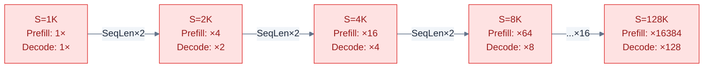
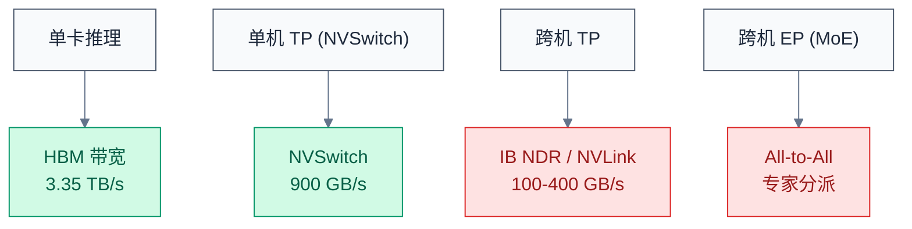
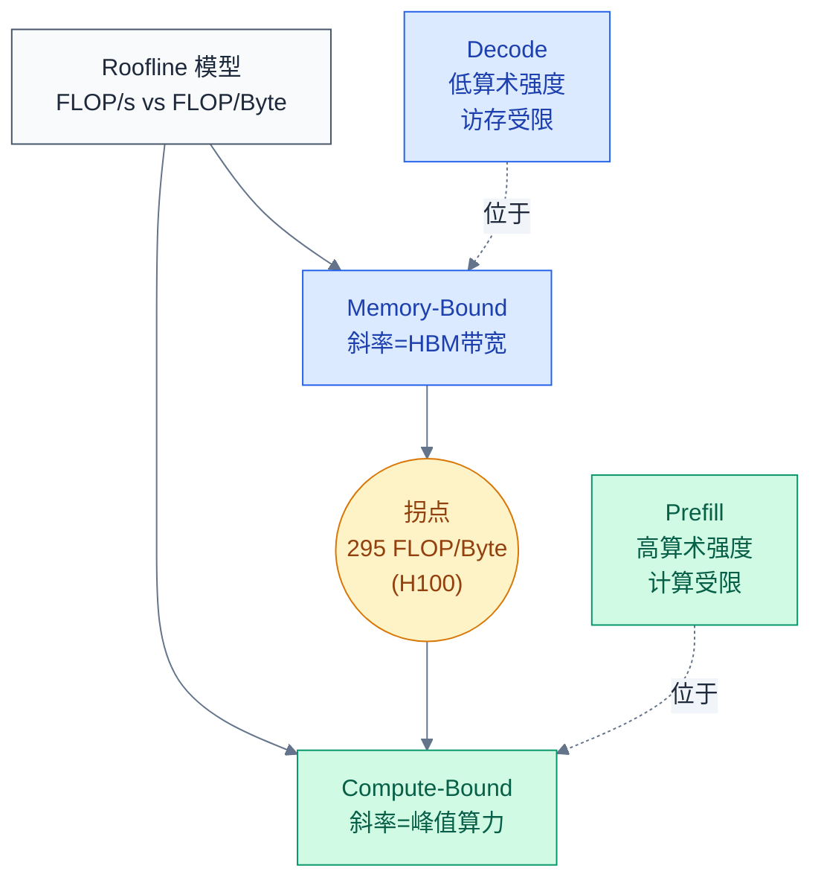
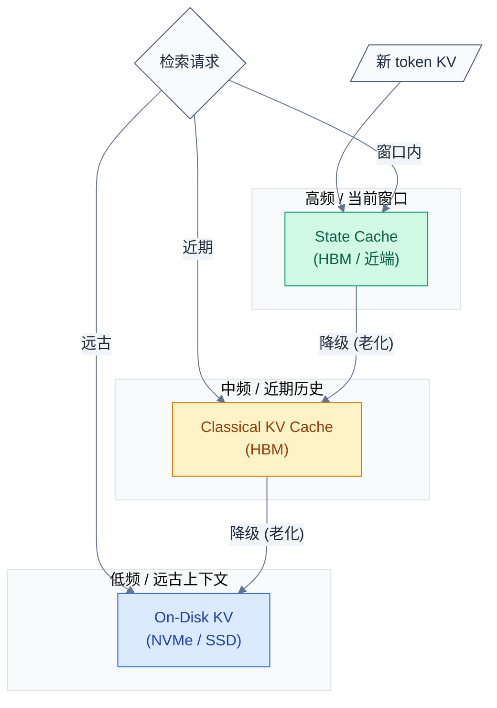
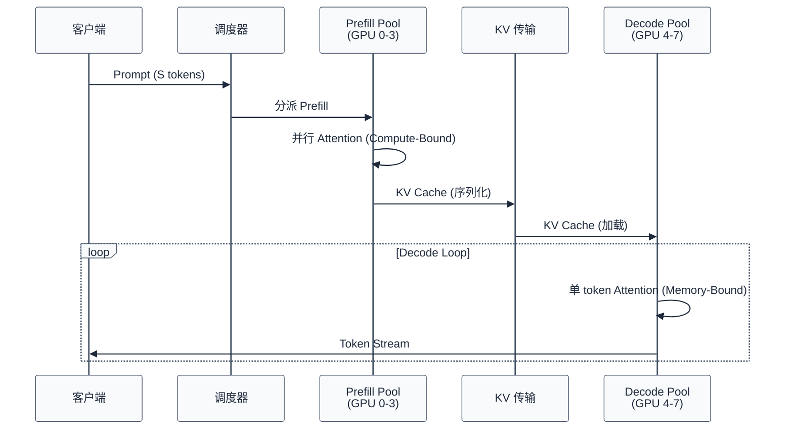
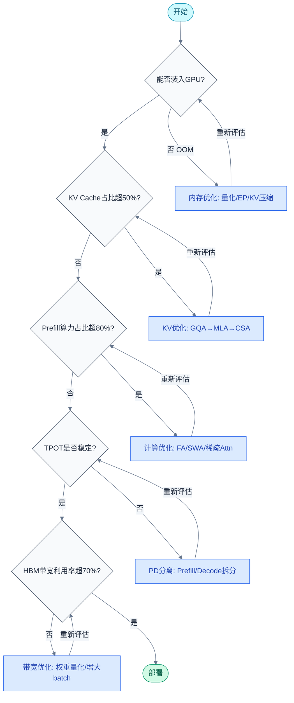

# LLM 推理资源定量分析

> 讨论推理优化之前，必须先用具体数字回答一个根本问题：**推理到底在"消费"什么资源？**
> **工程师视角**：优化策略的有效性取决于当前瓶颈在哪一维度——显存、计算、带宽、延迟。本文提供一套可复用、可代入具体模型参数的定量分析框架。

### 关键术语

| 缩写 | 全称 | 含义 |
|------|------|------|
| KV Cache | Key-Value Cache | 注意力机制中缓存的键值对，避免 Decode 阶段重复计算历史 token |
| TTFT | Time To First Token | 首 token 延迟，用户提交 prompt 到收到第一个 token 的时间 |
| TPOT | Time Per Output Token | 每输出 token 的生成时间（不含首个 token） |
| FLOPs | Floating Point Operations | 浮点运算次数 |
| GQA | Grouped-Query Attention | 分组查询注意力 |
| MLA | Multi-head Latent Attention | 多头潜在注意力（DeepSeek-V2/V3） |
| CSA | Compressed State Attention | 压缩状态注意力（DeepSeek-V4） |
| HCA | Hybrid Compressed Attention | 混合压缩注意力（DeepSeek-V4） |
| SWA | Sliding Window Attention | 滑动窗口注意力 |
| PD | Prefill-Decode Disaggregation | Prefill/Decode 分离式部署 |
| MoE | Mixture of Experts | 混合专家模型 |
| HBM | High Bandwidth Memory | GPU 高带宽显存 |
| BF16 | Brain Floating Point 16 | 16 位脑浮点格式 |
| RoPE | Rotary Position Embedding | 旋转位置编码 |
| OOM | Out Of Memory | 显存溢出 |

---

## 一、推理资源分解模型

LLM 推理的资源消耗可从四个维度定量建模：**显存**、**计算**、**带宽**、**延迟**。这四个维度互相耦合，单一瓶颈会拖垮整体效率。

### 1.1 显存

推理场景的显存由四部分组成：

$$M_{\text{total}} = M_{\text{weights}} + M_{\text{kv\_cache}} + M_{\text{activations}} + M_{\text{temp}}$$

#### 1.1.1 权重显存

模型参数本身占用的显存，与精度格式和参数量直接相关：

| 模型 | 总参数 | 激活参数 | 精度 | 权重显存 |
|------|--------|---------|------|---------|
| DeepSeek-V3.2 | 671B | 37B | BF16 | ~1.34 TB |
| DeepSeek-V4 | 671B | 38B | BF16 | ~1.34 TB |
| Step3.5-Flash | 196B | 11B | BF16 | ~392 GB |
| GLM-5 | 743B | 95B | BF16 | ~1.49 TB |
| Qwen3-235B | 235B | 235B (Dense) | BF16 | ~470 GB |

对于 MoE 模型，权重显存取决于部署策略：全量部署需加载所有专家参数，而细粒度专家切片（如 DeepSeek-V4 的 384 个路由专家 + 1 个共享专家）的存储总量远大于每 token 激活参数——上表中总参数与激活参数之比即"稀疏率"。

#### 1.1.2 KV Cache 显存

KV Cache 是推理阶段独有的显存消耗。每生成一个新 token，需存储该 token 对应所有层的 K、V 矩阵。单层单 token 的 KV 存储量为：

$$M_{\text{kv\_per\_layer\_token}} = 2 \times d_{\text{kv}} \times h_{\text{effective}} \times \text{bytes\_per\_elem}$$

其中 $d_{\text{kv}}$ 为每头 KV 维度，$h_{\text{effective}}$ 为有效的 KV 头数（考虑 GQA/MLA 压缩后）。

总 KV Cache 显存为：

$$M_{\text{kv\_cache}} = L \times S \times 2 \times d_{\text{kv}} \times h_{\text{effective}} \times \text{bytes\_per\_elem}$$

其中 $L$ 为层数，$S$ 为序列长度。

代入具体模型在 128K context 长度下的数字：

| 架构 | 模型示例 | KV 维度/头数 | 单 token KV (BF16) | 128K context KV Cache |
|------|---------|-------------|---------------------|----------------------|
| MHA-8 | Llama-3 70B | $d_k=128$, 8 头×80 层 | 160 KB/token | ~20.5 GB |
| GQA-8 | Llama-3 70B | $d_k=128$, 8 头×80 层 | 160 KB/token | ~20.5 GB |
| GQA-4 (4:1) | Qwen2-72B | $d_k=128$, 16 头×80 层 | 320 KB/token | ~41.0 GB |
| MLA (V2) | DeepSeek-V2 | $d_c=512$ latent, 60 层 | ~16.3 KB/token | ~2.1 GB |
| MLA (V3.2) | DeepSeek-V3.2 | $d_c=512$ latent, 60 层 | ~16.3 KB/token | ~2.1 GB |
| **CSA (V4-Pro)** | DeepSeek-V4-Pro | 压缩 90% | **~1.6 KB/token** | **~0.21 GB** |
| **CSA (V4-Flash)** | DeepSeek-V4-Flash | 压缩 93% | **~1.1 KB/token** | **~0.15 GB** |
| **HCA (V4)** | DeepSeek-V4 | 混合压缩 | **~1.3 KB/token** | **~0.17 GB** |
| SWA (Step3.5) | Step3.5-Flash | 窗口=8K, full attn interleaved | 窗口内~41.0 GB, 等效~15 GB | — |

核心观察：DeepSeek-V4 的 CSA/HCA 将 KV Cache 压缩到 V3.2 MLA 的 **10%（V4-Pro）至 7%（V4-Flash）**，这是百万级上下文长度可行性的关键依赖。

对 Gemma3 的 5:1 GQA 压缩比，KV Cache 降至全量 MHA 的 **< 15%**——依然是 GQA 结构，压缩倍数远不及 CSA/MLA。

#### 1.1.3 激活显存与临时缓冲区

推理时的中间激活取决于 batch size 和序列长度：

$$M_{\text{activations}} \approx b \times S \times h_{\text{hidden}} \times L \times \text{bytes\_per\_elem}$$

其中 $b$ 为 batch size，$h_{\text{hidden}}$ 为隐层维度。

以 DeepSeek-V4 为例（$h_{\text{hidden}}=7168$, $L=60$），单请求 128K context 的激活显存约 550 MB（含 intermediate attention states）。临时缓冲区包括 MoE 路由中间结果、量化反量化临时张量，通常预留 5-10% 总显存。

#### 1.1.4 完整显存预算表（实例）

以 DeepSeek-V4、8×H100 SXM (80 GB × 8 = 640 GB HBM)、128K context、BF16、batch=1 为例：

| 显存组成部分 | 计算公式 | 占用量 | 占比 |
|------------|---------|--------|------|
| 权重（全量专家） | 671B × 2 bytes | ~1.34 TB | 需多卡并行 |
| 权重（TP=8，每卡） | 1.34 TB / 8 | **~167.5 GB** | 26.2% |
| KV Cache（CSA Pro） | §1.1.2 公式 | **~0.21 GB** | 0.03% |
| KV Cache（MLA V3.2 对比） | 同上 | ~2.1 GB | 0.33% |
| 激活值 | $1 \times 128K \times 7168 \times 60 \times 2$ | ~0.55 GB | 0.09% |
| 临时缓冲区（预留 10%） | 总 HBM × 10% | ~64 GB | 10% |
| **总计（TP=8，CSA）** | — | **~232.3 GB** | 36.3% |
| **总计（TP=8，MLA V3.2）** | — | **~234.2 GB** | 36.6% |
| **可用 HBM（8 卡）** | 80 GB × 8 | **640 GB** | 100% |

> 实际部署中，CSA 带来的 KV Cache 节省（~1.9 GB）相对总额并不显著，但扩展到 1M context：MLA 的 KV Cache = ~16.4 GB 而 CSA = ~1.64 GB——差距扩大到 **14.8 GB**，在 batch size 增大时这是高价值空间。

### 1.2 计算（FLOPs）

#### 1.2.1 Prefill FLOPs

Prefill 阶段一次性处理全部 $S$ 个输入 token，注意力计算的 FLOPs 为：

$$F_{\text{prefill}} = F_{\text{linear}} + F_{\text{attention}}$$

$$F_{\text{attention}} \approx 4 \times L \times S^2 \times d_{\text{model}}$$

$F_{\text{linear}}$ 包含所有线性层（QKV 投影、FFN、输出投影等）的计算量，与 $S$ 呈线性关系。$F_{\text{attention}}$ 与 $S^2$ 成正比——这是 Prefill 成为计算瓶颈的根源。

**序列长度翻倍时，Prefill 计算量近似翻四倍（$O(S^2)$）**。

#### 1.2.2 Decode FLOPs

Decode 阶段每次生成一个 token，注意力计算变为：

$$F_{\text{decode\_per\_token}} = F_{\text{linear}} + 4 \times L \times S \times d_{\text{model}}$$

与 Prefill 的关键区别：Decode 的 $F_{\text{attention}}$ 与 $S$ 呈**线性**关系（非平方），因为 $Q$ 只有 1 个 token 需要与所有 $K$ 做点积。

**序列长度翻倍时，Decode 每 token 计算量仅翻倍（$O(S)$）**。

#### 1.2.3 实际数字对比

DeepSeek-V4 对 1M context 的单 token Decode FLOPs 仅为 V3.2 的 **27%**——这个缩小来自两层机制：

1. CSA/HCA 压缩 KV，使 $S$ 在注意力计算中的有效参与量下降
2. 细粒度 MoE 使每 token 仅激活 38B/671B 参数

Step3.5-Flash 的 SWA/Full 混合注意力机制带来的 FLOPs 节省：

| 阶段 | Full Attention | SWA/Full 混合 | 节省比 |
|------|---------------|---------------|--------|
| Prefill | 基准 | **~1/3** | 67% |
| Decode (per token) | 基准 | **~1/2.3** | 56% |

SWA (Sliding Window Attention) 将注意力限制在 8K 窗口内，大部分层不执行全注意力计算。Step3.5-Flash 的设计更进一步：将 Query Head 数量从 64 扩展到 **96**，增加的 head 仅参与 SWA 窗口内计算——在保持 Decode 低开销的同时提升 Prefill 的表达能力。

**Prefill vs Decode FLOPs 增长对比图**：



> 注：增长倍数以 S=1K 为基准的 Attention FLOPs 倍数。红色底色标记 Prefill 的 $O(S^2)$ 爆发式增长。

当 $S$ 从 1K 增长到 128K 时，线性部分的 FLOPs 增长 128×（线性），而 Attention 部分的 FLOPs 增长 16384×（平方）。随着 context 继续扩大，Attention FLOPs 占据 Prefill 总 FLOPs 的比例快速逼近 100%：

| context 长度 | 线性 FLOPs (相对) | Attention FLOPs (相对) | Attn 占比 |
|-------------|-------------------|----------------------|----------|
| 1K | 1× | 1× | ~20% |
| 4K | 4× | 16× | ~50% |
| 16K | 16× | 256× | ~80% |
| 64K | 64× | 4096× | ~95% |
| 128K | 128× | 16384× | **~98%** |
| 1M | 1024× | 1,048,576× | **~99.9%** |

> 这就是为什么 1M context 推理必须解决 Attention 的平方复杂度——即使线性部分做再多优化（如 MoE、量化），只要 Attention 还是 $O(S^2)$，Prefill 就无法规模化。

### 1.3 带宽

LLM 推理中带宽瓶颈出现在两个层面：HBM 带宽（GPU 内部）和网络带宽（GPU 之间）。

#### 1.3.1 HBM 带宽与 Roofline 定位

GPU 的 HBM 带宽决定权重读取速率。对于 Decode 阶段（每次只算 1 个 token），每个 token 需读取全部权重。以 H100 SXM 为例：

| 指标 | 数值 |
|------|------|
| HBM 带宽 | 3.35 TB/s |
| BF16 Tensor Core FP16 算力 | 989 TFLOPS |
| 算术强度阈值 (Roofline 拐点) | 989e12 / 3.35e12 ≈ **295 FLOP/Byte** |

Decode 每 token 的计算量与访存量之比（算术强度）远低于 295 FLOP/Byte 的拐点，因此 **Decode 是典型的访存受限（memory-bound）负载**。

#### 1.3.2 不同并行策略下的带宽瓶颈

| 场景 | GPU 配置 | HBM 带宽 | 瓶颈位置 |
|------|---------|---------|---------|
| 单卡推理 | 1×H100 (80GB) | 3.35 TB/s | HBM 带宽：71B BF16 模型每 token 读取 142 GB，理论最大 ~23.5 tok/s |
| 单机 8 卡 TP | 8×H100 SXM + NVSwitch | 3.35 TB/s × 8 | NVSwitch 全互联 900 GB/s，TP 通信不构成瓶颈；HBM 仍是主瓶颈 |
| 跨机 TP | 16×H100 (2 node) | 3.35 TB/s × 16 | **跨机 NVLink (100 GB/s/link) 或 InfiniBand NDR (400 GB/s)** 成为瓶颈 |
| MoE EP | 多卡专家并行 | 每卡读其专家权重 | All-to-All 通信（专家分派 token）引入额外延迟 |

**核心结论**：单机内 HBM 带宽是 Decode 吞吐的理论上限；跨机部署时，网络带宽/延迟替代 HBM 成为主要瓶颈。

对于 Dense 模型（如 Llama-3 70B），单卡 TPOT 的理论下限由 HBM 带宽决定。以 Llama-3 70B BF16 为例：

$$T_{\text{decode\_min}} = \frac{2 \times 70 \times 10^9}{3.35 \times 10^{12}} \approx 41.8\text{ ms}$$

这意味着即使 GPU 算力无限大，单卡 Decode 速度上限也只有 **~24 tok/s**。如果用户感知的 TPOT 远低于此值（如 10 ms/tok），要么模型更小（如 8B），要么分布在多卡上（TP 每卡读部分权重）。



### 1.4 延迟拆分

#### 1.4.1 TTFT 与 TPOT

用户感知的延迟可从两个指标定量拆分：

| 指标 | 定义 | 受控因素 |
|------|------|---------|
| **TTFT** (Time To First Token) | 接收 prompt → 输出第一个 token | Prefill 计算时间 + All-Reduce 通信 |
| **TPOT** (Time Per Output Token) | 后续每 token 生成间隔 | HBM 带宽（Decode 是 memory-bound） |

#### 1.4.2 Prefill 延迟：计算受限

Prefill 阶段并行处理 $S$ 个 token 的 Attention，计算量与 $S^2$ 成正比。在 Roofline 模型中：

- 算术强度（$S$ 在数百到数千量级时）通常超过 HBM 带宽拐点
- **Prefill 位于 Roofline 曲线右侧——计算受限（compute-bound）**

Prefill 延迟 ≈ 总 FLOPs / GPU 可用算力 + 通信时间：

$$T_{\text{prefill}} \approx \frac{F_{\text{prefill}}}{P_{\text{compute}}} + T_{\text{comm}}$$

以 DeepSeek-V4 128K context 为例：Prefill FLOPs 约 420 TFLOPs，在 8×H100 (TP=8, 约 7.9 PFLOPs 理论算力) 上约需 **53 ms**，加上通信开销约 10-15 ms，TTFT 约 65-70 ms。

#### 1.4.3 Decode 延迟：访存受限

Decode 每步只计算 1 个 token 的 Attention，逻辑很简单：读取所有权重 → 做少量计算 → 输出一个 token。读取 140 GB（71B BF16 模型）需要 140/3350 ≈ **42 ms**——这远大于实际 1 token 需要的计算时间（< 1 ms）。**Decode 位于 Roofline 曲线左侧——访存受限（memory-bound）**。

TPOT ≈ 权重读取时间 ≈ $M_{\text{weights}} / \text{BW}_{\text{HBM}}$：

| 模型 | 权重显存 | H100 单卡 TPOT（理论下限） |
|------|---------|-------------------------|
| Llama-3 8B | 16 GB | ~4.8 ms |
| Llama-3 70B | 140 GB | ~41.8 ms |
| DeepSeek-V4 (全量) | 1.34 TB | 无法单卡部署 |
| DeepSeek-V4 (TP=8) | 167 GB/卡 | ~50 ms |



---

## 二、KV Cache 专题

KV Cache 是推理阶段区别于训练阶段的显存消耗大头，也是长上下文推理的第一阻碍。

### 2.1 单层 KV 的公式统一表述

对于标准 MHA，单层单 token 的 KV 对存储量为：

$$M_{\text{kv\_layer}} = 2 \times h \times d_{\text{head}} \times \text{bytes\_per\_elem}$$

其中 $h$ 为 head 数量，$d_{\text{head}}$ 为每头维度。

GQA 通过减少 KV 头数压缩存储：$h_{\text{kv}} = h / g$，其中 $g$ 为分组数（如 GQA-8 表示 8 个 Q 头共享 1 个 KV 头）。

MLA 更进一步：不再直接存储 $K$ 和 $V$ 的完整表示，而是存储低秩潜在向量 $c_t^{\text{KV}} \in \mathbb{R}^{d_c}$，推理时通过上投影矩阵恢复：

$$k_t = W_{\text{UK}} \cdot c_t^{\text{KV}}, \quad v_t = W_{\text{UV}} \cdot c_t^{\text{KV}}$$

其中 $d_c \ll h \times d_{\text{head}}$，MLA 的 KV Cache 量 = $L \times S \times d_c \times \text{bytes\_per\_elem}$。

### 2.2 多架构 KV Cache 对比

代入实际数字，对比在 128K context、BF16 精度下的 KV Cache 总量：

| 架构 | 模型 | 压缩机制 | 单 token KV | 128K 总量 | 相对 MHA |
|------|------|---------|------------|----------|---------|
| MHA | Llama-3 70B | 无 | 160 KB | ~20.5 GB | 100% |
| GQA-8 | Llama-3 70B | KV 头=1/8 Q 头 | 160 KB | ~20.5 GB | 100% |
| GQA-4 (4:1) | Qwen2-72B | KV 头=1/4 Q 头 | 320 KB | ~41.0 GB | 200% |
| GQA-5 (5:1) | Gemma3 | KV 头=1/5 Q 头 | ~96 KB | ~12.3 GB | **< 15%** |
| MLA | DeepSeek-V3.2 | 低秩潜在向量 $d_c=512$ | ~16.3 KB | ~2.1 GB | **~10.2%** |
| **CSA** | DeepSeek-V4-Pro | 压缩状态注意力 | **~1.63 KB** | **~0.21 GB** | **~1.0%** |
| **CSA** | DeepSeek-V4-Flash | 压缩状态注意力 | **~1.14 KB** | **~0.15 GB** | **~0.7%** |
| **HCA** | DeepSeek-V4 | 混合压缩注意力 | **~1.30 KB** | **~0.17 GB** | **~0.8%** |

> DeepSeek-V4-Pro 的 CSA 将 KV Cache 压缩到 V3.2 MLA 的 **10%**，Flash 版进一步压缩到 **7%**。这种量级的压缩使 1M context 推理从"不可能"变为"可行"。

### 2.3 从 MLA 到 CSA：DeepSeek-V4 的进化

DeepSeek-V4 的 HCA (Hybrid Compressed Attention) 和 CSA (Compressed State Attention) 在 MLA 基础上新增状态感知压缩：

- **HCA**：根据 token 的注意力重要性动态调整压缩率——高频访问的 token 保留更多 KV 信息，低频 token 进一步压缩
- **CSA**：将 KV 压缩为紧凑的状态向量，类似于 SSM（State Space Model，状态空间模型）的状态表示，但保留了注意力机制的 token 级可寻址性

核心数字（来自 DeepSeek-V4 Technical Report）：

| 指标 | V3.2 MLA | V4-Pro CSA | V4-Flash CSA |
|------|---------|-----------|-------------|
| 1M context KV Cache | ~16.4 GB | **~1.64 GB** | **~1.15 GB** |
| 单 token Decode FLOPs | 基准 | **27%** | **27%** |
| 单 token Prefill FLOPs | 基准 | ~85% | ~85% |

### 2.4 异构 KV Cache 管理：DeepSeek-V4 的三层设计

DeepSeek-V4 引入了**异构 KV Cache 管理**，将 KV Cache 按频率-重要性分为三层：



- **State Cache**（HBM 近端）：紧凑的状态向量，覆盖最近窗口内的 token，延迟最低
- **Classical KV Cache**（HBM）：标准 KV 对，覆盖中频访问区段，容量介于两层之间
- **On-Disk KV**（NVMe/SSD）：完整的 KV 历史，用于低频检索远古上下文

这种异构设计使 DeepSeek-V4 在 1M context 场景下，HBM 内仅需保持数 GB 的活跃 KV Cache，剩余历史按需从磁盘加载——**用存储容量换显存容量**。

三层间的迁移策略由重要性打分函数驱动：

$$s(i) = \alpha \cdot f_{\text{recency}}(i) + \beta \cdot f_{\text{attention}}(i) + \gamma \cdot f_{\text{position}}(i)$$

其中 $f_{\text{recency}}$ 衡量 token $i$ 距离当前生成位置的时间衰减（$\propto e^{-t/\tau}$），$f_{\text{attention}}$ 衡量该 token 的历史平均注意力权重，$f_{\text{position}}$ 捕捉绝对位置信息（如文档开头 token 天然更重要）。三个维度加权求和后，高分的 token 优先留在 State Cache，低分的逐步降级。

实际工程数据的近似值（来自 DeepSeek-V4 报告）：
- State Cache 容量：~2-4 GB（HBM 中），覆盖 ~8K-32K 活跃窗口
- Classical KV Cache 容量：~4-8 GB（HBM 中），覆盖 ~128K-256K 近期历史
- On-Disk 容量：~100 GB+（NVMe），完整保留 1M 上下文
- Token 降级延迟（从 On-Disk 检索并重建 KV Cache）：~5-10 ms

**这个 5-10 ms 的重建延迟是整个异构 KV 系统的关键 trade-off**：大幅节省 HBM，但远程 token 访问从"零延迟"变为"毫秒级延迟"。实践中多数 attention head 的注意力权重集中在近端窗口（~80% 权重分配给最近 8K token），因此 On-Disk 层仅在少数 key token 检索时被触发，性能影响可控。

---

## 三、Prefill vs Decode 分离

### 3.1 计算特性冲突

从 §1.4 的 Roofline 分析可得出一个根本性矛盾：

| 阶段 | 负载类型 | 需要的硬件特征 |
|------|---------|-------------|
| Prefill | Compute-bound | 高算力、大 batch |
| Decode | Memory-bound | 高 HBM 带宽、KV Cache 大 |

**同一 GPU 上同时运行 Prefill 和 Decode 时**，Prefill 的 GEMM 会占据 SM（流式多处理器）和 Tensor Core，导致 Decode 的访存延迟被"污染"——Decode 等待 Prefill 的计算完成才能获得 GPU 资源，TPOT 不可预测地升高。

### 3.2 PD Disaggregation 的原理

PD (Prefill-Decode) Disaggregation（分离式部署）将 Prefill 和 Decode 分配到不同的 GPU 池：

```
┌───────────────────────────────────────────────────────────┐
│                    PD Disaggregation                       │
├───────────────────────────────────────────────────────────┤
│                                                           │
│  用户请求────▶ Prefill Pool (高算力、小显存)               │
│               │  GPU 0-3: 大 batch Prefill                 │
│               │  KV Cache 暂存 → InfiniBand →  Decode Pool │
│               ▼                                           │
│            Decode Pool (高 HBM、KV Cache 常驻)             │
│               GPU 4-7: 持续 Decode，KV Cache 不释放         │
│               │                                           │
│               ▼                                           │
│            输出 token 流                                   │
│                                                           │
└───────────────────────────────────────────────────────────┘
```

资源分配的定量逻辑：

- Prefill Pool 配置：GPU 算力密度优先（如 H200），batch size 可设较大（算力利用率高），KV Cache 仅 prefill 期间暂存
- Decode Pool 配置：GPU HBM 容量/带宽优先，KV Cache 常驻（释放后需重新 prefill），batch size 受 KV Cache 容量限制

### 3.3 GLM-5 Slime 框架的具体数字

GLM-5 的 Slime（Slim Inference framework，精简推理框架）实现了 PD Disaggregation 的工程落地。在 DeepSeek-V4 技术报告中也有类似分离设计。具体收益：

| 指标 | 一体化部署 | PD Disaggregation | 提升 |
|------|----------|-------------------|------|
| Prefill 吞吐 | 基准 | **+40-60%** | Prefill batch 不受 Decode 干扰 |
| Decode TPOT 稳定性 | 抖动 30-50% | **抖动 < 5%** | Decode 独占 GPU，无 Prefill 污染 |
| 总吞吐 (throughput) | 基准 | **+25-35%** | 两阶段独立优化 |
| KV Cache 利用率 | ~60% | **~90%** | KV Cache 全生命周期驻留 Decode Pool |

分离部署的额外成本：KV Cache 从 Prefill Pool 到 Decode Pool 的传输延迟。以 128K context、MLA 压缩的 KV Cache (~2.1 GB) 为例，通过 400 Gbps InfiniBand 传输需约 **42 ms**（2.1 GB × 8 bit / 400 Gbps）——这笔延迟加在 TTFT 上。但对于 CSA 压缩后的 KV Cache (~0.21 GB)，传输仅需 **4.2 ms**——压缩不仅节省 HBM，还**降低了 PD Disaggregation 的传输代价**，形成正向循环。

GLM-5 Slime 框架的额外发现：PD 分离后，Prefill Pool 和 Decode Pool 可以使用不同精度的权重。

- Prefill Pool 使用 BF16 高精度权重（Prefill 是 compute-bound，精度影响输出质量）
- Decode Pool 使用 INT4/FP8 量化权重（Decode 是 memory-bound，量化直接降低权重读取量 → TPOT 反比缩短）



---

## 四、优化路线决策树

给定模型参数、架构和上下文长度，按以下顺序定量识别瓶颈并选择优化方向：

### 4.1 决策流程



### 4.2 按模型规模分类的定量决策表

代入具体模型参数，以 128K context、8×H100 SXM 部署为例：

| 模型类别 | 参数范围 | 主要瓶颈 | 优先级 1 | 优先级 2 | 优先级 3 |
|---------|---------|---------|---------|---------|---------|
| 小模型 (≤8B) | Llama-3 8B, Qwen2-7B | HBM 有大量空闲，KV Cache 占比 < 20% | **提高吞吐**：增大 batch、Continuous Batching | 前缀缓存 → 命中率 30-70% | — |
| 中模型 (8-70B Dense) | Llama-3 70B, Qwen2-72B | KV Cache（128K = 20-41 GB）逼近单卡 HBM 上限 | **GQA/量化 KV** → KV Cache 减 50% | PD Disaggregation → TPOT 稳定 | Batch 策略动态调整 |
| MoE 模型 (70-200B 激活) | Step3.5-Flash, GLM-5 | 权重总量超大 + MoE All-to-All 通信 | **EP（专家并行）** → 分散权重 | **KV Cache 压缩**（SWA, CSA） | MoE-aware PD Disaggregation |
| 超大 MoE (>600B) | DeepSeek-V4 | 权重 1.34TB (无法单机) + 长 context KV + EP 通信 | **TP+EP 混合部署** | **CSA/HCA KV 压缩** → 1M context | **异构 KV 管理**（State Cache + HBM + On-Disk） |

### 4.3 给定 context 长度的瓶颈识别公式

定义三个比值来定量判断当前瓶颈：

1. **显存压力比**：

$$R_{\text{mem}} = \frac{M_{\text{total}}}{M_{\text{HBM\_total}}}$$

若 $R_{\text{mem}} > 0.9$：显存是首要瓶颈，优先考虑量化权重、压缩 KV Cache、或增加 GPU 数量。

2. **Prefill 计算占比**（在 TTFT 敏感场景）：

$$R_{\text{prefill}} = \frac{T_{\text{prefill}}}{T_{\text{prefill}} + S \times T_{\text{decode}}}$$

若 $R_{\text{prefill}} > 0.3$：TTFT 受 Prefill 主导，优先考虑 SWA、Chunked Prefill 或 FlashAttention 优化。

3. **访存效率比**（Decode 阶段）：

$$R_{\text{bw}} = \frac{\text{BW}_{\text{actual}}}{\text{BW}_{\text{peak}}}$$

若 $R_{\text{bw}} < 0.5$：Decode 阶段 HBM 利用率低，可能存在 KV Cache 碎片化（考虑 PagedAttention）或 batch size 过小。

### 4.4 关键数字速查表

| 数字 | 来源 | 含义 |
|------|------|------|
| KV Cache = V3.2 × 10% | DeepSeek-V4 CSA Pro | 从 MLA 到 CSA 的 KV 压缩比 |
| KV Cache = V3.2 × 7% | DeepSeek-V4 CSA Flash | Flash 版进一步压缩 |
| Decode FLOPs = V3.2 × 27% | DeepSeek-V4 | CSA + 细粒度 MoE 的综合效果 |
| Prefill FLOPs = Full × 1/3 | Step3.5-Flash SWA | SWA 混合注意力的 Prefill 削减 |
| Decode FLOPs = Full × 1/2.3 | Step3.5-Flash SWA | SWA 混合注意力的 Decode 削减 |
| Q Head: 64 → 96 | Step3.5-Flash | SWA 增强查询头 |
| MoE 稀疏率 ~18× | GLM-5 (743B → 95B) | 全参数与激活参数比值 |
| H100 算术强度拐点 ≈ 295 FLOP/Byte | NVIDIA Spec | Roofline 模型中 Compute-Bound 与 Memory-Bound 的分界 |
| TPOT 理论下限 ≈ 42ms/tok | 70B BF16 / 3.35 TB/s | 单卡不可突破的权重读取时间 |

---

## 参考资料

- [DeepSeek-V4 Technical Report](./refs/DeepSeek_V4_Technical_Report.pdf) — CSA/HCA KV Cache 压缩、1M context FLOPs 对比、异构 KV Cache 三层管理
- [Step3.5-Flash Technical Report](./refs/Step3.5-Flash-Technical-Report.pdf) — SWA/Full 混合注意力 FLOPs、Query Head 扩展设计
- [GLM-5 Technical Report](./refs/GLM-5_Technical_Report.pdf) — PD Disaggregation Slime 框架、MoE 稀疏率
- [Qwen3 Technical Report](./refs/Qwen3_Technical_Report.pdf) — Qwen3-MoE 路由均衡策略
- [ERNIE 5.0 Technical Report](./refs/ERNIE_5.0_Technical_Report.pdf) — 第一层 MoE 负载均衡反直觉发现

---

> **下一篇**：[LLM 推理引擎：vLLM 到 TensorRT-LLM](./12-LLM推理引擎：vLLM到TensorRT-LLM.md) — 从资源定量分析走向推理引擎实现
> **前置阅读**：[LLM MoE 架构](./04-LLM MoE架构：路由、负载均衡与专家并行.md) | [LLM 分布式训练：并行策略与 ZeRO](./05-LLM分布式训练：并行策略与ZeRO.md) | [NVIDIA GPU 架构演进与 LLM](./deep-dive/11-NVIDIA-GPU架构演进与LLM.md)