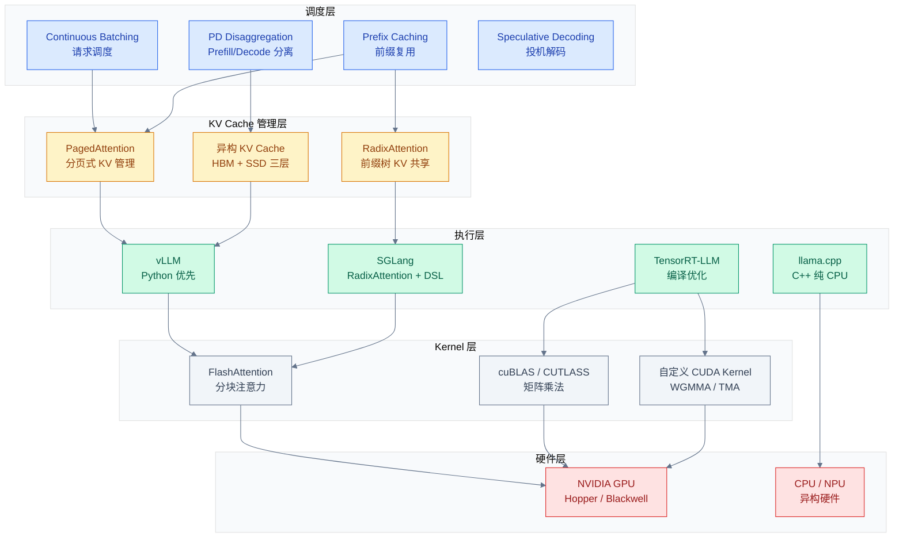
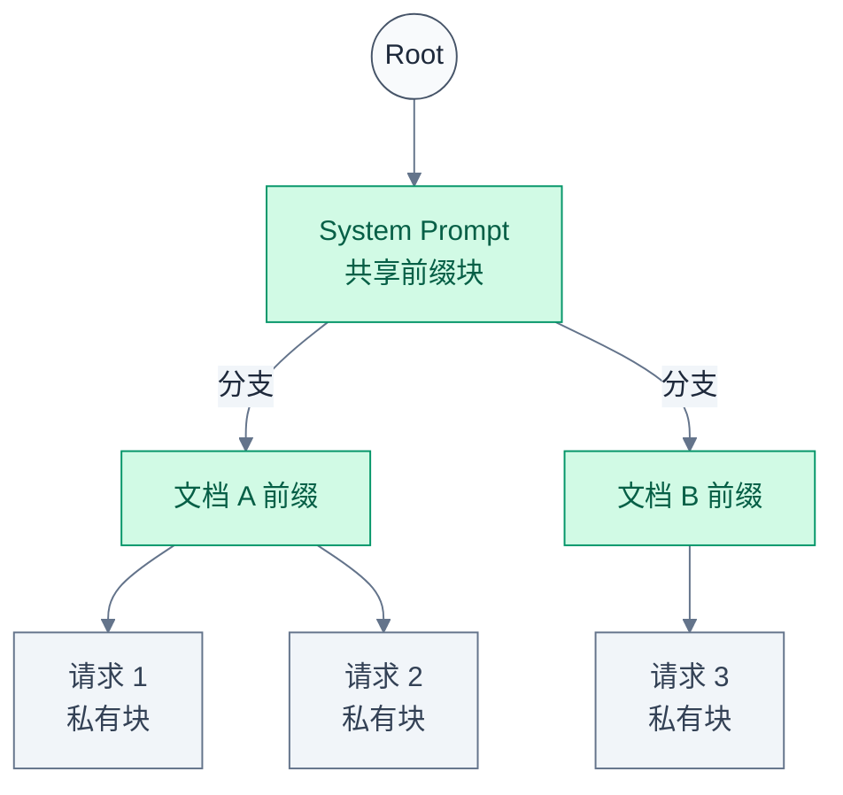
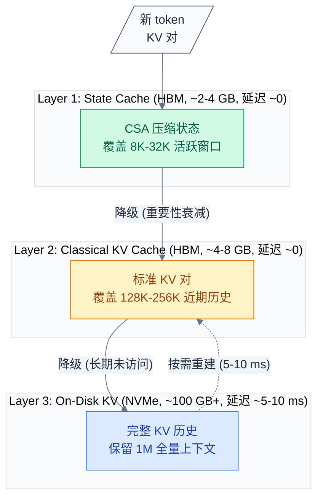
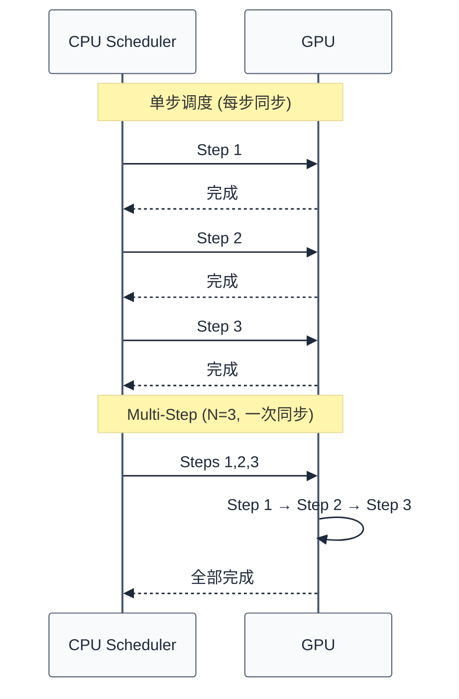
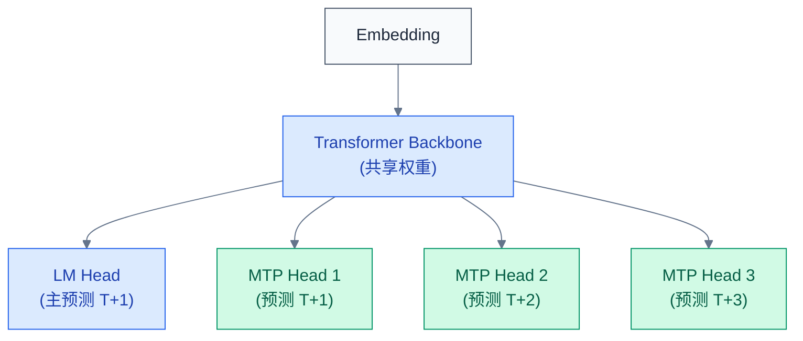
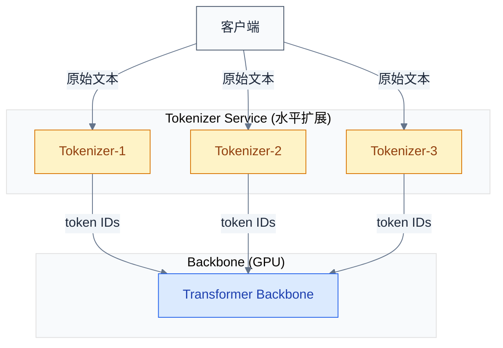
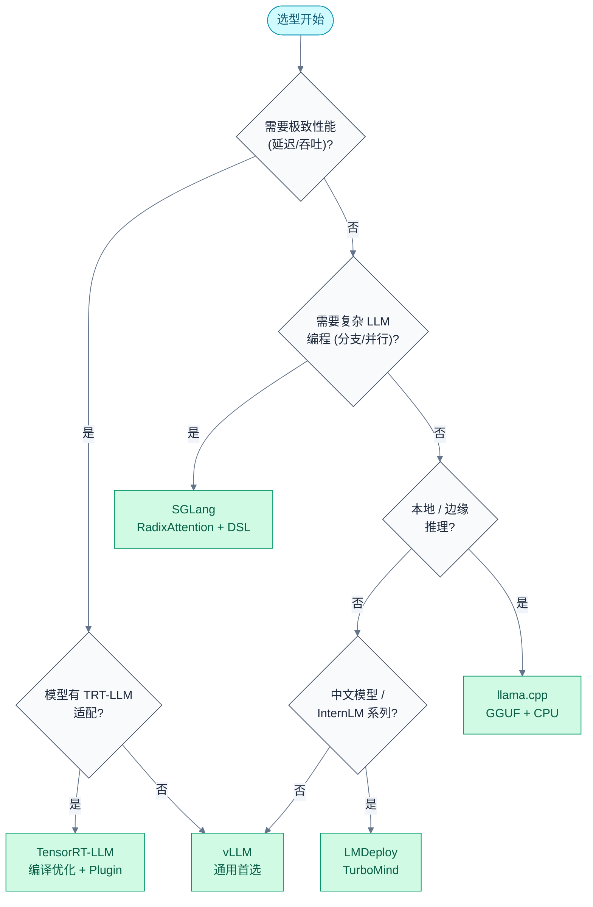

# LLM 推理引擎：vLLM 到 TensorRT-LLM

> 推理引擎是 LLM 落地的"最后一公里"——它将训练好的模型转化为高性能在线服务。vLLM 和 TensorRT-LLM 代表了两种设计哲学：灵活性与极致性能。
> **工程师视角**：选型取决于你要解决的问题是"显存放不下"还是"延迟不够低"。前者靠 PagedAttention 和 KV Cache 压缩，后者靠 kernel 融合和量化。

### 关键术语

| 缩写 | 全称 | 含义 |
|------|------|------|
| KV Cache | Key-Value Cache | 注意力机制中缓存的键值对，避免 Decode 阶段重复计算历史 token |
| TTFT | Time To First Token | 首 token 延迟 |
| TPOT | Time Per Output Token | 每输出 token 的平均生成间隔 |
| PagedAttention | Paged Attention | vLLM 提出的分页式 KV Cache 管理算法 |
| CB | Continuous Batching | 连续批处理，请求可在任意时刻加入/离开 batch |
| PD | Prefill-Decode Disaggregation | Prefill/Decode 分离式部署 |
| MTP | Multi-Token Prediction | 多 token 预测，一次前向预测多个 token |
| SWA | Sliding Window Attention | 滑动窗口注意力 |
| WGMMA | Warp Group Matrix Multiply-Accumulate | Hopper 架构的 warp group 级矩阵乘加指令 |
| TMA | Tensor Memory Accelerator | Hopper 架构的张量内存加速器 |
| MoE | Mixture of Experts | 混合专家模型 |
| EP | Expert Parallelism | 专家并行 |
| TP | Tensor Parallelism | 张量并行 |
| CSA | Compressed State Attention | 压缩状态注意力（DeepSeek-V4） |
| HCA | Hybrid Compressed Attention | 混合压缩注意力（DeepSeek-V4） |

---

## 一、推理引擎全景

### 1.1 前置知识

| 需要了解 | 参考文档 |
|----------|----------|
| 推理阶段的资源瓶颈（显存/计算/带宽/延迟） | [11-推理资源分析](./11-LLM推理资源分析.md) |
| Attention 机制（MHA/GQA/MLA/CSA） | [03-注意力机制发展与演进](./03-LLM注意力机制发展与演进.md) |
| GPU 硬件架构（SM/Tensor Core/HBM） | [NVIDIA GPU 架构演进与 LLM](./deep-dive/11-NVIDIA-GPU架构演进与LLM.md) |

### 1.2 引擎矩阵

推理引擎不是单一软件，而是一个分层技术栈。按抽象层次从上到下：



### 1.3 引擎速览

| 引擎 | 设计哲学 | 核心创新 | 适用场景 | 开发语言 |
|------|---------|---------|---------|---------|
| **vLLM** | Python 优先，调度灵活 | PagedAttention、Chunked Prefill、Multi-Step | 通用在线服务 | Python/C++ |
| **TensorRT-LLM** | 编译优化，极致性能 | 图编译 + In-Flight Batching + Plugin | 延迟/吞吐极致要求的场景 | C++/Python |
| **SGLang** | 结构化生成 + 高效前缀共享 | RadixAttention、SGLang DSL | 复杂 LLM 编程、高前缀复用 | Python |
| **llama.cpp** | 零依赖，本地优先 | GGUF 量化格式、纯 C++ | 边缘推理、低资源环境 | C/C++ |
| **Flood** (Step3.5) | 新架构模型专用 | SWA + Spec Decode 深度协同 | Step3.5 系列 | C++/CUDA |

从[资源分析](./11-LLM推理资源分析.md)的结论出发：推理引擎的所有优化最终都服务于四个维度——降低显存占用、提高计算效率、提升带宽利用率、控制端到端延迟。以下逐层展开。

---

## 二、资源分析速览

> 本节是[11-推理资源分析](./11-LLM推理资源分析.md)的结论摘要，为后续引擎设计讨论提供定量背景。

### 2.1 核心数字

LLM 推理的两个阶段有截然不同的瓶颈：

| 阶段 | 负载类型 | 瓶颈 | 算式 |
|------|---------|------|------|
| Prefill | Compute-bound | GPU 算力 | $F_{\text{attention}} \propto S^2$ |
| Decode | Memory-bound | HBM 带宽 | $T_{\text{decode}} \approx M_{\text{weights}} / \text{BW}_{\text{HBM}}$ |

以 H100 SXM 为例：HBM 带宽 3.35 TB/s，算术强度拐点 ~295 FLOP/Byte。Decode 的算术强度远低于拐点，Prefill 通常高于拐点。这决定了两个阶段需要完全不同的优化策略。

以 Llama-3 70B BF16 为例，单卡 TPOT 理论下限：

$$T_{\text{decode\_min}} = \frac{2 \times 70 \times 10^9}{3.35 \times 10^{12}} \approx 41.8\text{ ms}$$

这意味**即使 GPU 算力无限**，单卡 Decode 速度上限也只有 ~24 tok/s。因此 Decode 优化的核心是减少每次 token 需要的权重读取量——量化是最直接的手段。

### 2.2 KV Cache 的压迫性

随着 context 长度增长，KV Cache 可能比权重大得多。以 128K context 为例：

| 模型 | KV Cache (128K, BF16) | 权重 | KV Cache 占比 |
|------|----------------------|------|-------------|
| Llama-3 70B (GQA-8) | ~20.5 GB | ~140 GB | ~13% |
| Qwen2-72B (GQA-4) | ~41.0 GB | ~144 GB | ~22% |
| DeepSeek-V3.2 (MLA) | ~2.1 GB | ~1.34 TB | ~0.16% |
| DeepSeek-V4 (CSA) | **~0.17 GB** | ~1.34 TB | **~0.01%** |

这就是为什么 PagedAttention 和 KV Cache 压缩是推理引擎的核心战场——在长 context 时代，KV Cache 管理能力决定了服务能承载的并发数上限。

---

## 三、KV Cache 管理深探

### 3.1 朴素 KV Cache 的问题

传统推理框架在请求到来时预分配连续显存块存储 KV Cache。问题在于：

1. **碎片化**：各请求序列长度不同，预分配的最大长度块造成大量内部碎片
2. **无法共享**：即使多个请求共享同一 system prompt，KV Cache 也各自独立存储
3. **无法动态回收**：请求提前结束时，预分配的显存无法重新利用

这三个问题使 GPU 显存利用率通常只有 20-40%，大量显存被空洞占据。

### 3.2 PagedAttention：分页式 KV Cache

vLLM 在 2023 年提出的 PagedAttention 将操作系统的虚拟内存思想引入 KV Cache 管理：

```
┌─────────────────────────────────────────────────────┐
│                  PagedAttention                      │
├─────────────────────────────────────────────────────┤
│                                                     │
│  逻辑 KV 序列                                       │
│  ┌─────┬─────┬─────┬─────┬─────┬─────┐            │
│  │ B0  │ B1  │ B2  │ B3  │ B4  │ B5  │  ← 连续     │
│  └──┬──┘──┬──┘──┬──┘──┬──┘──┬──┘──┬──┘            │
│     │     │     │     │     │     │                 │
│     ▼     ▼     ▼     ▼     ▼     ▼                 │
│  ┌──────────────────────────────────┐               │
│  │  Block Table (逻辑→物理映射)      │               │
│  └──┬───┬───┬───┬───┬───┬──────────┘               │
│     │   │   │   │   │   │                           │
│     ▼   ▼   ▼   ▼   ▼   ▼                           │
│  ┌─────────────────────────────────┐                │
│  │  Physical Block Pool            │                │
│  │  ┌──┐ ┌──┐ ┌──┐ ┌──┐ ┌──┐ ┌──┐│                │
│  │  │P0│ │P3│ │P1│ │P5│ │P2│ │P4││ ← 任意分布     │
│  │  └──┘ └──┘ └──┘ └──┘ └──┘ └──┘│                │
│  └─────────────────────────────────┘                │
│                                                     │
└─────────────────────────────────────────────────────┘
```

关键设计：

- **Block 大小**：默认 16 tokens（可在 8-32 间调整），是分配和释放的最小粒度
- **Block Table**：每请求维护一张逻辑块到物理块的映射表，Attention kernel 通过查表访问
- **Copy-on-Write (CoW)**：多请求共享前缀 blocks 时，读取共享同一份物理 blocks，写入时分配新 blocks

Block 大小的选择存在 trade-off：块越小，碎片越少但 Block Table 更大且 kernel 查表开销更高；块越大，碎片越多但管理开销更低。16 是经验性的平衡点。

### 3.3 Prefix Caching：前缀感知 vs 内容感知

PagedAttention 的 CoW 机制自然支持 Prefix Caching——相同前缀的请求自动共享物理 blocks。但实现方式有"前缀感知"和"内容感知"两种思路：

| 维度 | 前缀感知 (vLLM) | 内容感知 (SGLang RadixAttention) |
|------|-----------------|-------------------------------|
| 匹配粒度 | 从序列头部开始的连续前缀 | 任意位置的公共子序列 |
| 数据结构 | Hash Table（前缀 token hash） | Radix Tree（前缀树） |
| 命中率 | 仅 system prompt 固定的场景高 | 多文档、多轮对话等复杂场景也高 |
| 实现复杂度 | 低 | 中等（需维护树结构） |

RadixAttention 的前缀树管理：



命中后延逻辑：当新请求的 token 序列在 Radix Tree 中匹配到已有节点时，直接复用该节点对应的物理 KV blocks（引用计数 +1），无需重新计算 Prefill。在 RAG 场景（多请求共享大量文档片段）中，RadixAttention 的 KV Cache 命中率可达 **60-80%**。

### 3.4 异构 KV Cache：DeepSeek-V4 的三层设计

PagedAttention 解决的是单层显存（HBM）内的碎片化问题。DeepSeek-V4 将 KV Cache 管理扩展到跨存储介质的三层异构设计：



三层间的迁移由重要性打分函数驱动：

$$s(i) = \alpha \cdot f_{\text{recency}}(i) + \beta \cdot f_{\text{attention}}(i) + \gamma \cdot f_{\text{position}}(i)$$

其中 $f_{\text{recency}}(i) \propto e^{-t/\tau}$ 衡量时间衰减，$f_{\text{attention}}(i)$ 衡量历史平均注意力权重，$f_{\text{position}}(i)$ 捕捉绝对位置信息。

这一设计的核心 trade-off：绝大多数 attention head 的权重集中在近端窗口（~80% 权重分配给最近 8K token），因此 On-Disk 层仅在少数 key token 检索时才触发 5-10 ms 的重建延迟。HBM 内仅需保持数 GB 的活跃 KV Cache，**用磁盘容量换显存容量**，使 1M context 推理成为可能。

### 3.5 KV Cache 混合精度

DeepSeek-V4 在 KV Cache 存储上还引入了混合精度策略：

| KV 维度 | 精度 | 理由 |
|---------|------|------|
| RoPE 编码维度 | BF16 | RoPE 的频率旋转对精度敏感 |
| 其余维度 | FP8 | 压缩 50% 存储，精度损失可忽略 |

这种"关键维度保持高精度、非关键维度压缩"的思路，使 KV Cache 在 CSA 压缩之上再减半，同时不损失注意力质量。

---

## 四、Continuous Batching 调度机制

### 4.1 为什么需要 CB

传统静态 batching 要求 batch 内所有请求同时开始、同时结束——最短的请求必须等待最长的请求完成。对语言生成任务来说，不同请求的输出长度差异巨大（一个 token vs 一千个 token），静态 batching 导致 GPU 大量空转。

Continuous Batching 的核心思想：**请求可以在任意时刻加入或离开 batch，GPU 不需要等待**。

```
时间 →
静态 batching:
  Req1: ████████████████████████████████
  Req2: ██████              (GPU 空转)

Continuous Batching:
  Req1: ████████████████████████████████
  Req2: ██████
  Req3:         ████████████████████
  Req4:               ██████████
  → GPU 持续满载
```

### 4.2 调度算法核心

vLLM 的调度器在每个 step 做出决策：

1. **候选池**：等待队列中的新请求 + 已有但未完成的请求
2. **约束检查**：
   - 显存约束：KV Cache block pool 剩余量能否容纳候选请求
   - 计算约束：batch 中总 token 数不超过 `max_num_batched_tokens`
   - 序列数约束：并发序列数不超过 `max_num_seqs`
3. **FCFS with Preemption**：按到达时间排序，尽可能多地入队；显存不够时，将低优先级请求的 KV Cache 卸载到 CPU 内存

```python
# vLLM 调度器核心参数
# 显存相关
--gpu-memory-utilization 0.90    # GPU 显存使用比例
--max-model-len 8192             # 最大序列长度

# 计算/并发相关
--max-num-batched-tokens 8192    # batch 中最大 token 总数
--max-num-seqs 256               # 最大并发序列数
--max-num-batched-tokens 8192    # batch 中最大 token 总数（prefill + decode）

# 调度策略
--enable-chunked-prefill         # 开启分段 Prefill
--num-scheduler-steps 8          # 一次调度执行多步 decode
```

### 4.3 Chunked Prefill

Prefill 和 Decode 混合在同一个 batch 中时存在一个尖锐矛盾：Prefill 计算量大（$O(S^2)$），如果一次处理完整个 prompt，会长时间阻塞 Decode→TPOT 飙升。

Chunked Prefill 的解决思路：将长 prompt 的 Prefill **切分成多个小块**（chunk），每个 chunk 与 Decode 混合调度：

```
时间 →
无 Chunked Prefill:
  P(长prompt): ████████████      ← TTFT 高，期间 Decode 被阻塞

Chunked Prefill:
  P1: ██  P2: ██  P3: ██  P4: ██
  D:  ██████████████████████    ← Decode 持续进行
```

每个 chunk 计算一部分 QKV，KV Cache 逐步累积。代价是 Prefill 的端到端时间变长（被切分的 chunks 之间有调度间隔），但 Decode TPOT 保持稳定——对用户体验更友好。

### 4.4 Multi-Step Scheduling

标准调度流程中，每个 decode step 需要一次 CPU-GPU 同步：GPU 完成计算 → CPU 调度器决定下一 batch → GPU 再执行。这个同步点引入了显著的 CPU 开销。

Multi-Step Scheduling 让 CPU 调度器**一次性决策 N 步**（如 8 步），GPU 连续执行 N 个 decode step 后才同步：



代价是：在 N 步期间，无法让新请求加入 batch（因为 CPU 没有介入重新调度的机会）。但带来的 CPU 开销削减（从 N 次降到 1 次同步）在低延迟场景中显著。

---

## 五、vLLM 核心设计

### 5.1 架构

vLLM 由四个核心组件构成：

```
vLLM Engine
├── Scheduler         → 决定每个 step 哪些请求进入 batch
├── Block Manager     → PagedAttention 的 block 分配/释放/CoW
├── Model Runner      → 封装模型前向传播（TP/PP 感知）
└── Cache Engine      → Prefix Caching 的 hash 索引和命中逻辑
```

GPU Workers 通过 Ray 或 multiprocessing 管理，每个 Worker 持有模型的一个 TP shard。数据在 worker 间通过 NCCL All-Reduce 同步。

### 5.2 部署

```bash
# 基础 OpenAI 兼容 API 服务
vllm serve meta-llama/Llama-3.1-8B-Instruct \
    --host 0.0.0.0 \
    --port 8000 \
    --tensor-parallel-size 1 \
    --max-model-len 32768 \
    --gpu-memory-utilization 0.90 \
    --max-num-seqs 256 \
    --enable-prefix-caching \
    --enable-chunked-prefill

# FP8 KV Cache
vllm serve meta-llama/Llama-3.1-8B-Instruct \
    --kv-cache-dtype fp8
```

```python
# Python API
from vllm import LLM, SamplingParams

llm = LLM(
    model="meta-llama/Llama-3.1-8B-Instruct",
    tensor_parallel_size=2,
    max_model_len=32768,
    enable_prefix_caching=True,
    gpu_memory_utilization=0.90,
)

sampling_params = SamplingParams(
    temperature=0.7,
    top_p=0.9,
    max_tokens=2048,
)

outputs = llm.generate(["Explain PagedAttention in detail."], sampling_params)
```

### 5.3 量化集成

vLLM 通过插件机制支持多种量化方案：

| 量化方式 | 权重精度 | 激活精度 | KV Cache | 实现 |
|---------|---------|---------|---------|------|
| AWQ | INT4 | FP16 | FP16 | `--quantization awq` |
| GPTQ | INT4/INT8 | FP16 | FP16 | `--quantization gptq` |
| FP8 (W8A8) | FP8 (E4M3) | FP8 | FP8 | `--quantization fp8` |
| BitsAndBytes | INT4/INT8 | FP16 | FP16 | `--quantization bitsandbytes` |

FP8 量化的关键优势：不仅压缩权重，还可将 KV Cache 存储为 FP8（`--kv-cache-dtype fp8`），KV Cache 显存减半。配合 PagedAttention，在同等显存下可承载近一倍的并发请求。

---

## 六、TensorRT-LLM 核心设计

### 6.1 编译优化范式

TensorRT-LLM 采用 **AOT（Ahead-of-Time，提前编译）** 范式，与 vLLM 的即时执行形成对比：

```
工作流程:
  1. Python API 定义模型结构图
     → 类似 PyTorch 的 layer-by-layer 描述
     → 指定 TP/PP 配置
     → 指定量化精度

  2. 图编译 (trtllm-build)
     → 算子融合：LayerNorm + Quant + GEMM → 单一 kernel
     → 显存优化：中间张量复用、预分配
     → Kernel 自动调优 (Tactic Selection)：为每个 GEMM 选择最优 kernel

  3. C++ Runtime 执行
     → 加载编译后的 engine 文件
     → In-Flight Batching (Continuous Batching)
     → KV Cache 管理
```

编译优化的核心价值：**消除 Python overhead**。vLLM 中模型前向传播的部分逻辑仍在 Python 层调度，而 TensorRT-LLM 将所有计算编译为单一 C++ 执行图，调度和计算都在 C++ 运行时完成。

### 6.2 In-Flight Batching

TensorRT-LLM 的 In-Flight Batching 在功能上与 vLLM 的 Continuous Batching 等价，但实现层级不同：

| 维度 | vLLM CB | TRT-LLM IFB |
|------|---------|------------|
| 调度语言 | Python | C++ |
| 请求粒度 | Python 对象管理 | C++ struct，零 Python overhead |
| Kernel 切换 | 通过 PyTorch dispatch | 直接在 C++ Runtime 内调用 |
| 延迟抖动 | 有 GC/解释器影响 | 极低 |

实测数据：在 batch size 小（< 16）的低延迟场景中，TensorRT-LLM 的调度开销仅为 vLLM 的 **1/5-1/3**。这个差异随着 GPU 更强（计算时间更短）而变得更重要——因为调度开销占总延迟的比例随之上升。

### 6.3 构建示例

```python
# TensorRT-LLM 模型构建（简化）
import tensorrt_llm
from tensorrt_llm import BuildConfig, build
from tensorrt_llm.models import LLaMAForCausalLM

# 1. 从 HuggingFace checkpoint 构建
model = LLaMAForCausalLM.from_hugging_face(
    "meta-llama/Llama-3.1-8B-Instruct",
    dtype="float16",
    mapping=tensorrt_llm.Mapping(world_size=1, tp_size=1),
)

# 2. 编译配置
build_config = BuildConfig(
    max_batch_size=64,
    max_input_len=32768,
    max_seq_len=34816,
    max_beam_width=1,
    max_num_tokens=8192,
    opt_num_tokens=16,
)

# 3. 构建并保存 engine
engine = build(model, build_config)
engine.save("llama3_8b_fp16.engine")
```

### 6.4 Plugin 系统

TensorRT-LLM 的核心扩展机制是 Plugin——允许用户注入自定义 CUDA kernel 替换默认实现：

- **GEMM Plugin**：为特定矩阵形状编译最优 kernel（超越 cuBLAS 的通用启发式）
- **Attention Plugin**：集成 FlashAttention-2/3、自定义 PagedAttention kernel
- **Quantization Plugin**：FP8/INT4 的量化/反量化 kernel，融合进 GEMM

Plugin 的存在意味着 TensorRT-LLM 是"编译框架 + kernel 库"而非单纯的编译框架——它提供了替换任何算子的能力，这是极致性能的根基。

---

## 七、其他引擎精选

### 7.1 SGLang：RadixAttention 与 DSL

SGLang 由 Stanford 开发，两个核心差异化能力：

**RadixAttention**（参见 §3.3）：基于前缀树（Radix Tree）的 Prefix Caching，比 vLLM 的 hash-based 方案匹配粒度更细。在 RAG、多轮对话等存在大量公共子序列的场景中，Cache 命中率显著更高。

**SGLang DSL**：一种 LLM 编程语言，支持多轮调用、并行分支、条件控制：

```python
@sgl.function
def multi_turn_qa(s, question):
    s += sgl.system("You are a helpful assistant.")
    s += sgl.user(question)
    s += sgl.assistant(sgl.gen("answer", max_tokens=256))
    # 并行生成多个候选，选最佳
    forks = s.fork(3)
    forks += sgl.gen("candidate", max_tokens=128)
    forks.join()
    s += sgl.select("candidate")  # 自动选最高概率者
```

DSL 的价值在于：它将复杂的 LLM 调用链编译为对 RadixAttention 最优的执行计划，自动最大化前缀共享。

### 7.2 llama.cpp：GGUF 格式

llama.cpp 采用自研的 GGUF (GPT-Generated Unified Format) 量化格式：

```
K-quant 量化系列:
  Q2_K  - 2-bit 量化，极小模型专用
  Q3_K_S / Q3_K_M / Q3_K_L  - 3-bit，S/M/L 代表质量等级
  Q4_K_S / Q4_K_M  - 4-bit（推荐），性价比最优
  Q5_K_S / Q5_K_M  - 5-bit，近乎无损
  Q6_K  - 6-bit
  Q8_0  - 8-bit，practically lossless
```

K-quant 的核心思路：不同层对量化的敏感度不同——attention 层的权重用更高精度，FFN 层可以压得更激进。`_S`/`_M`/`_L` 后缀表示 trade-off 方向：S 更小更快，L 质量更高。

llama.cpp 的局限：不支持 Continuous Batching（请求串行处理），不适合高并发在线服务。但在本地推理和批量离线处理中，其零依赖、跨平台特性无可替代。

### 7.3 引擎创新对比

| 引擎 | 差异化能力 | 独特 kernel 技术 |
|------|-----------|----------------|
| vLLM | PagedAttention、Multi-Step Scheduling | PagedAttention kernel、Chunked Prefill kernel |
| SGLang | RadixAttention、结构化生成 DSL | Radix Tree 索引、共享 KV block 管理 |
| TensorRT-LLM | AOT 编译、Plugin 扩展 | GEMM Plugin、Attention Plugin |
| llama.cpp | GGUF K-quant、纯 C++ | CPU SIMD GEMM (AVX2/AVX-512/NEON) |
| Flood (Step3.5) | SWA + Spec Decode 协设计 | SWA kernel、MTP-3 轻量 head |

---

## 八、投机解码工程

### 8.1 投机解码原理

投机解码（Speculative Decoding）用一个小模型（draft model）快速生成多个候选 token，再由大模型（target model）一次验证：

```
标准自回归解码：
  Target: T1 → T2 → T3 → T4 → 每步一次前向

投机解码 (draft 生成 3 个候选):
  Draft:  D1 → D2 → D3
  Target: 一次前向验证 D1,D2,D3 → 接受/拒绝
```

Target model 一次前向处理 draft 生成的 K 个候选 token，并行验证其正确性。如果 draft 质量和 target 足够接近，吞吐可提升 2-3×。

### 8.2 MTP：多 Token 预测

MTP (Multi-Token Prediction) 将投机解码的"两个模型"压缩为"一个模型 + 轻量预测头"——无需独立的 draft model：



Step3.5-Flash 采用 MTP-3（3 个轻量预测头），训练策略为：先 clone 主 LM head 作为 MTP 初始化，再与 backbone 联合 fine-tune。配合 Speculative Decoding，在 Hopper GPU 上实现 **~170 tokens/s** 的生成速度。

GLM-5 更进一步：在 FP8 精度下运行 MTP，减少每 token 的权重读取量——MTP head 本身的 FP8 权重加上 backbone 的 FP8 KV Cache，使单 token 延迟显著降低。

### 8.3 SWA 与 Linear Attention 的投机解码兼容性

Step3.5-Flash 的技术报告揭示了一个关键选择：为什么用 SWA 而非 Linear Attention？

| 注意力机制 | 与 Spec Decode 的兼容性 | 原因 |
|-----------|----------------------|------|
| SWA | **兼容** | SWA 的 KV mask 是确定性的（固定窗口），可与 draft tree 的并行 KV 验证无缝结合 |
| Linear Attention | **不兼容** | Linear Attention 的状态更新是递归式的（$S_t = S_{t-1} + k_t v_t^T$），每个 decode step 修改全局状态，导致 draft tree 中的分支生成复杂化 |

具体来说：draft tree 中有多个分支（不同候选序列），标准 attention 的 KV Cache 可以独立并行验证每个分支。但 Linear Attention 的全局状态 $S$ 在每个 step 被更新，不同分支无法共享同一个状态——要么为每个分支复制状态（显存爆炸），要么串行验证（损失并行性）。

这就是为什么 Step3.5-Flash 坚持 SWA + Full Attention 混合策略，并在 SWA 的确定性窗口内做投机解码——两者在设计层面是协同的。

### 8.4 接受率与 Draft Tree 设计

投机解码的实际收益取决于两个因素：

- **接受率**：target model 同意 draft token 的比例。接受率 × draft 长度 = 平均每步生成的 token 数
- **Draft Tree 深度 vs 宽度**：更深的树降低平均延迟但增加验证失败后的 wasted FLOPs；更宽的树探索更多可能但 draft 开销更大

```
Draft Tree 示例 (MTP-3, 深度=3, 宽度=1):
  T+0 ─→ T+1 ─→ T+2 ─→ T+3

更深 (MTP-4):
  T+0 ─→ T+1 ─→ T+2 ─→ T+3 ─→ T+4

更宽 (MTP-2+beam=2):
  T+0 ─→ T+1a ─→ T+2a
      └→ T+1b ─→ T+2b
```

GLM-5 在 Slime 框架中采用了**动态深度**策略：根据上一步的接受率自适应调整下一步的 draft 深度。接受率高 → 增加深度（信心足），接受率低 → 降低深度（避免浪费）。

---

## 九、MoE 推理优化

### 9.1 MoE 推理的特殊挑战

MoE 模型在推理阶段引入三个独有问题：

| 问题 | 描述 | 影响 |
|------|------|------|
| **权重总量大** | 671B 参数的 V4 有 384 个路由专家，总权重 ~1.34 TB | 单卡放不下，必须 EP |
| **All-to-All 通信** | 每层 token 路由到不同专家的 GPU 需要 All-to-All | 引入额外延迟 |
| **负载不均** | 某些专家被频繁选中，其他专家闲置 | 降低有效吞吐 |

### 9.2 Expert-Aware Batching

传统 batching 只考虑 token 总数约束，MoE 场景下还需考虑**专家利用率**——如果 batch 中 token 集中在少数专家上，其他专家的 GPU 闲置。

Expert-Aware Batching 在调度时额外考虑请求的路由分布：

1. 预测每个请求对各专家的偏好（基于路由概率的统计分布）
2. 选择路由分布互补的请求组 batch——确保各专家负载均衡
3. 对已 backlogged 的专家对应的请求适当延迟入队

```python
# 伪代码：Expert-Aware 调度
def schedule_expert_aware(requests, expert_load):
    batch = []
    for req in sorted_by_arrival(requests):
        # 计算加入后每个专家的负载
        projected_load = expert_load + req.expected_expert_distribution()
        if max(projected_load) < THRESHOLD:
            batch.append(req)
            expert_load = projected_load
    return batch
```

### 9.3 专家 Offloading 与冗余部署

两种应对权重总量过大的策略：

**专家 Offloading**：不常用专家存放在 CPU 内存或 NVMe，使用时异步加载到 GPU。类似异构 KV Cache 的思路——"热"专家常驻 HBM，"冷"专家按需加载。

**冗余部署**：对于 MoE 模型推理（非训练），不需要在所有 GPU 上完整部署所有专家。可在不同 GPU 组上部署不同的专家子集，各 GPU 组独立服务不同的请求——本质上是用更多 GPU 换更高吞吐。

GLM-5 Slime 框架的实践：DP-Attention 多节点部署下，利用数据并行（DP）的冗余性，各 node 按需缓存最常用的专家子集，减少 All-to-All 通信频率。

---

## 十、多节点推理

### 10.1 跨节点并行的带宽约束

从[资源分析 §1.3](./11-LLM推理资源分析.md#13-带宽)已知：

| 互联方式 | 带宽 | 延迟 |
|---------|------|------|
| NVSwitch (单机内) | 900 GB/s | ~1 μs |
| NVLink Network (跨机) | 100 GB/s/link | ~3-5 μs |
| InfiniBand NDR (跨机) | 400 GB/s | ~3-5 μs |

跨机 TP 时，每层前向的 All-Reduce 需要等最慢的 GPU 完成通信。NVLink Network 的 100 GB/s 相对 NVSwitch 的 900 GB/s 存在近 10× 差距——当 TP 跨节点时，通信时间可能超过计算时间。

这就是为什么大模型推理首选**单机内 TP**，只有模型超出单机容量时才跨机。

### 10.2 PD Disaggregation 的工程实现

PD Disaggregation（§2.2 介绍原理）在引擎层面的工程化涉及：

1. **KV Cache 传输**：Prefill Pool 生成的 KV Cache 通过 InfiniBand 传输到 Decode Pool
   - MLA (V3.2) 128K KV Cache ~2.1 GB → IB NDR ~42 ms
   - CSA (V4) 128K KV Cache ~0.17 GB → IB NDR ~3.4 ms
2. **精度分离**：Prefill Pool 使用 BF16 高精度权重（compute-bound），Decode Pool 使用 FP8 量化权重（memory-bound）——GLM-5 Slime 框架的实践
3. **双层调度**：一级调度器分配请求到 Prefill Pool，KV Cache 传输完成后由二级调度器接管 Decode

MiniMax-01 的优化：将 Prefill 和 Decode 放在**两个独立的 CUDA stream** 中运行，50ms 的 TTFT 降低到 ~50ms（通过 stream 级别的调度而非节点级别的分离）——这是 PD Disaggregation 的轻量版实现。

### 10.3 ERNIE 5.0 Tokenizer-Backbone Disaggregation

ERNIE 5.0 提出了一种新的分离粒度：将 tokenizer 从 backbone 中分离为独立的水平可扩展服务：



传统的 tokenizer 在 GPU 节点本地的 CPU 上运行，成为并发瓶颈——大量用户请求时 tokenizer 排队。ERNIE 5.0 将其拆分为独立的 CPU 水平可扩展服务，tokenizer 与 backbone 通过 RPC 通信。这一设计在高并发场景下将 tokenizer 延迟从 O(batch_size) 降为 O(1)。

---

## 十一、CUDA 级优化

### 11.1 Hopper 架构关键特性

| 特性 | 作用 | 在推理中的应用 |
|------|------|-------------|
| **WGMMA** (Warp Group MMA) | warp group（4 个 warp = 128 线程）直接执行异步矩阵乘法 | GEMM kernel 核心，消除共享内存中转 |
| **TMA** (Tensor Memory Accelerator) | 硬件加速的张量数据搬运（HBM→SMEM） | KV Cache block 加载、注意力分块 |
| **FP8 Tensor Core** | 原生 FP8 (E4M3/E5M2) 矩阵乘加 | 权重和 KV Cache 量化推理 |

WGMMA 的关键突破：传统 GEMM 需要将数据从 HBM 加载到共享内存再加载到寄存器。WGMMA 允许 warp group 直接从寄存器操作数执行 MMA，减少了两级内存中转。

### 11.2 算子融合模式

TensorRT-LLM 的编译器和 vLLM 的自定义 kernel 使用了多种融合模式：

```
融合模式 1: LayerNorm + 量化 + GEMM
  ┌──────────┐    ┌───────┐    ┌──────┐
  │LayerNorm │ → │Quantize│ → │ GEMM │  三合一 kernel
  └──────────┘    └───────┘    └──────┘
  收益：消除两次 HBM 读写中间结果

融合模式 2: GEMM + 激活函数 + GEMM (FFN)
  ┌──────┐    ┌──────┐    ┌──────┐
  │ GEMM1│ → │ SiLU │ → │ GEMM2│  FFN 融合
  └──────┘    └──────┘    └──────┘

融合模式 3: 残差连接 + LayerNorm
  ┌──────┐    ┌──────────┐
  │ +Res │ → │LayerNorm  │  残差+归一化融合
  └──────┘    └──────────┘
```

算子融合的收益不来自减少计算量（计算量不变），而来自**减少 HBM 读写次数**——对于 memory-bound 的 Decode 阶段，每减少一次 HBM 往返就是可量化的延迟降低。

### 11.3 StridedBatchedMatmul

MiniMax-01 引入的 StridedBatchedMatmul 策略针对 batch 内有不同序列长度的情况：

标准 batched matmul 要求 batch 内所有矩阵形状一致（通过 padding 到最长）。StridedBatchedMatmul 允许每个 batch element 有独立形状，通过 stride 指针而非 padding 实现。

配合 **Multi-Level Padding**（32/64/128/256 动态 block size），将不同长度的序列按需分组到不同大小的 block 中——避免统一 padding 到最大长度的浪费。

### 11.4 TileLang DSL

DeepSeek-V4 引入的 TileLang 是一种 kernel 编译 DSL：

```
普通 CUDA Kernel 开发:
  编写 .cu → nvcc 编译 → PTX → cubin → launch
  → 迭代周期以小时计

TileLang 流程:
  DSL 描述 tile 计算 → IR 级联优化 → host launcher (< 1 μs)
  → 迭代周期以秒计
```

核心创新：IR 级联编译使 kernel launch overhead 降至 **< 1 μs**，且生成的 kernel 是 **Batch-Invariant（批处理不变性）和 Deterministic（确定性）**——相同输入保证相同输出，不受 batch 内其他元素影响。这对生产环境的可复现性至关重要。

---

## 十二、部署实践与监控

### 12.1 引擎选型决策树



### 12.2 生产部署架构

```
                    ┌──────────────┐
                    │   Nginx /    │
                    │   Envoy      │  (L7 负载均衡 + 重试)
                    └──────┬───────┘
                           │
              ┌────────────┼────────────┐
              ▼            ▼            ▼
        ┌──────────┐ ┌──────────┐ ┌──────────┐
        │ vLLM     │ │ vLLM     │ │ vLLM     │
        │ GPU 0-7  │ │ GPU 0-7  │ │ GPU 0-7  │
        │ Instance │ │ Instance │ │ Instance │
        └──────────┘ └──────────┘ └──────────┘
              │            │            │
              └────────────┼────────────┘
                           ▼
                    ┌──────────────┐
                    │   Redis /    │
                    │  共享 KV     │  (Prefix Cache 跨实例共享)
                    └──────────────┘
```

多实例间共享 Prefix Cache 的关键：Redis 存储 prefix hash → 物理 block 位置的映射，实例 B 可从实例 A 的 GPU 显存中直接读取 prefix blocks（通过 GPU Direct RDMA）——无需 CPU 中转。

### 12.3 监控指标体系

| 类别 | 指标 | 告警阈值建议 |
|------|------|------------|
| **延迟** | TTFT P50/P95/P99 | P95 < 200 ms (交互式) |
| **延迟** | TPOT P50/P95/P99 | P95 < 50 ms (交互式) |
| **延迟** | E2E Latency P95 | < 5 s |
| **吞吐** | Tokens/s/gpu | 以首次部署为 baseline |
| **显存** | KV Cache 使用率 | > 85% 需扩容 |
| **显存** | GPU 显存占用 | > 95% 有 OOM 风险 |
| **质量** | KV Cache Hit Rate | < 30% 需检查 prefix 设计 |
| **质量** | Preemption Rate | > 5% 需扩容或减少 batch |
| **调度** | Queue Length (P95) | > 10 需扩容 |

### 12.4 Docker 部署示例

```dockerfile
# Dockerfile
FROM nvidia/cuda:12.6.0-runtime-ubuntu22.04

RUN pip install vllm==0.6.6

EXPOSE 8000

ENV CUDA_VISIBLE_DEVICES=0,1,2,3

CMD ["vllm", "serve", "meta-llama/Llama-3.1-70B-Instruct", \
     "--host", "0.0.0.0", "--port", "8000", \
     "--tensor-parallel-size", "4", \
     "--max-model-len", "32768", \
     "--gpu-memory-utilization", "0.90", \
     "--enable-prefix-caching"]
```

```yaml
# docker-compose.yml
version: '3.8'
services:
  vllm-0:
    build: .
    ports:
      - "8001:8000"
    deploy:
      resources:
        reservations:
          devices:
            - driver: nvidia
              count: 4
              capabilities: [gpu]
    environment:
      - CUDA_VISIBLE_DEVICES=0,1,2,3
  vllm-1:
    build: .
    ports:
      - "8002:8000"
    deploy:
      resources:
        reservations:
          devices:
            - driver: nvidia
              count: 4
              capabilities: [gpu]
    environment:
      - CUDA_VISIBLE_DEVICES=4,5,6,7
```

---

## 参考资料

- [vLLM: Easy, Fast, and Cheap LLM Serving with PagedAttention](https://arxiv.org/abs/2309.06180) — PagedAttention 原论文
- [TensorRT-LLM Documentation](https://nvidia.github.io/TensorRT-LLM/) — NVIDIA 官方文档
- [SGLang: Efficient Execution of Structured Language Model Programs](https://arxiv.org/abs/2312.07104) — RadixAttention 和 SGLang DSL
- [DeepSeek-V4 Technical Report](./refs/DeepSeek_V4_Technical_Report.pdf) — 异构 KV Cache、CSA/HCA、TileLang DSL
- [Step3.5-Flash Technical Report](./refs/Step3.5-Flash-Technical-Report.pdf) — SWA 投机解码、MTP-3
- [GLM-5 Technical Report](./refs/GLM-5_Technical_Report.pdf) — Slime PD Disaggregation、DSA
- [ERNIE 5.0 Technical Report](./refs/ERNIE_5.0_Technical_Report.pdf) — Tokenizer-Backbone Disaggregation、FlashMask
- [NVIDIA Hopper Architecture Whitepaper](https://resources.nvidia.com/en-us-tensor-core/gtc22-whitepaper-hopper) — WGMMA、TMA

---

> **下一篇**：[LLM 推理服务架构：调度、缓存与投机解码](./13-LLM推理服务架构：调度、缓存与投机解码.md)
> **前置阅读**：[LLM 推理资源分析](./11-LLM推理资源分析.md) | [LLM MoE 架构](./04-LLM MoE架构：路由、负载均衡与专家并行.md)