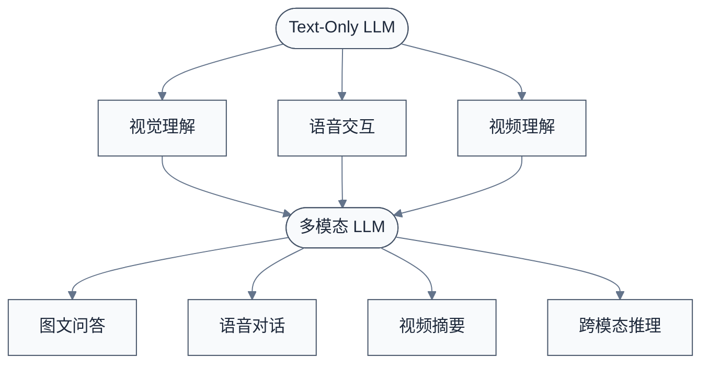
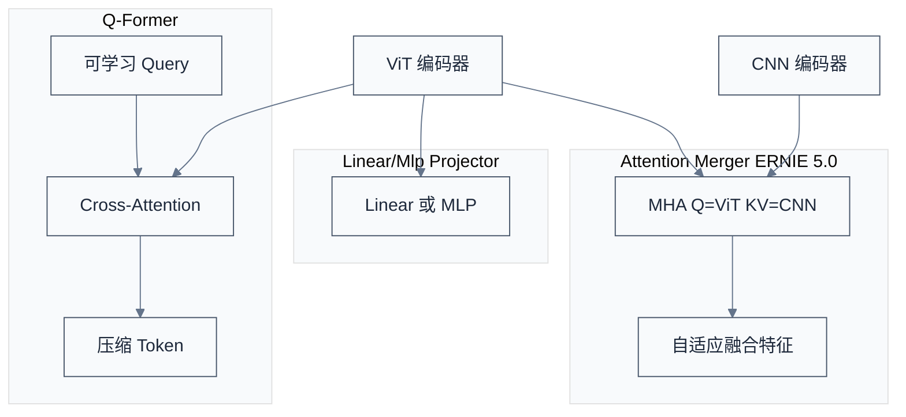
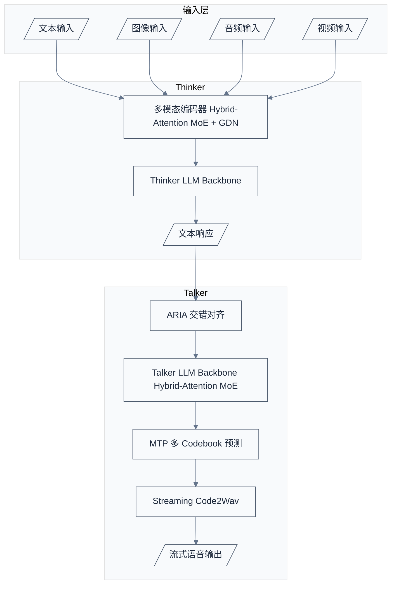
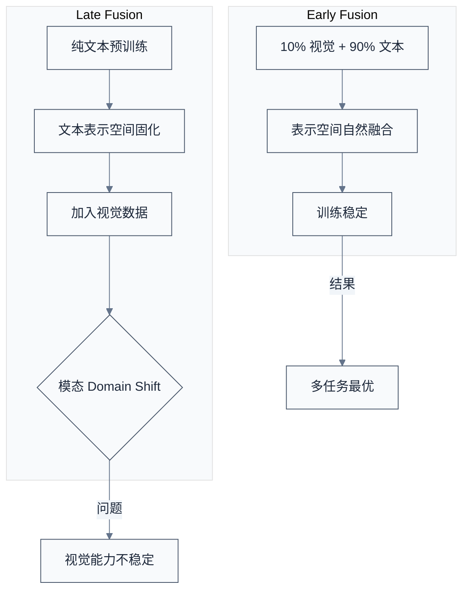

# LLM 多模态架构

> 多模态不是"给 LLM 加个图编码器"那么简单。视觉、语音、视频与文本在信息密度、时序粒度、语义层级上存在根本性差异——如何将这些异质信号统一到同一个自回归框架中，是 2024-2025 年各厂技术报告的共同主线。
> **工程师视角**：选型多模态架构的核心矛盾是"统一性 vs 专用性"——统一 Backbone 带来的端到端可微分性是诱人的，但各模态专用编码器在效率和质量上的优势往往更实际。理解每种选择的代价，比记住"谁用了什么"更重要。

### 关键术语

| 缩写 | 全称 | 含义 |
|------|------|------|
| ViT | Vision Transformer | 视觉 Transformer，将图像切分为 Patch 后送入 Transformer 处理 |
| RVQ | Residual Vector Quantization | 残差向量量化，将连续信号逐层量化为离散 Code，广泛用于音频 Codec |
| MTP | Multi-Token Prediction | 多 Token 预测，同时预测未来多个 Token 以加速解码 |
| GDN | Grouped Dynamic Normalization | 分组动态归一化，用于稳定大规模训练 |
| NFSP | Next-Frame-and-Scale Prediction | 下一帧与尺度预测，ERNIE 5.0 的视频预训练目标 |
| NCP | Next-Codec Prediction | 下一 Codec 预测，ERNIE 5.0 的深度方向音频生成范式 |
| MoE | Mixture of Experts | 混合专家模型 |

### 前置知识

| 需要了解 | 参考文档 |
|----------|----------|
| Transformer 结构与自回归生成 | [02-Transformer 完整结构](./02-Transformer完整结构与训练算法.md) |
| MoE 架构与路由机制 | [04-LLM MoE 架构](./04-LLM MoE架构：路由、负载均衡与专家并行.md) |
| Post-Training (SFT/RL) | [07-Post-Training 基础](./07-LLM Post-Training基础：SFT、RLHF与DPO.md) |
| 注意力机制变体 | [03-注意力机制发展](./03-LLM注意力机制发展与演进.md) |

---

## 目录

1. [为什么是多模态：模态对齐的根本挑战](#一为什么是多模态模态对齐的根本挑战)
2. [视觉编码器设计空间](#二视觉编码器设计空间)
3. [视觉-语言对齐：从投影到融合](#三视觉-语言对齐从投影到融合)
4. [音频处理：Codec 设计与流式生成](#四音频处理codec-设计与流式生成)
5. [统一架构 vs 级联架构](#五统一架构-vs-级联架构)
6. [训练策略：融合时机、模态配比与阶段设计](#六训练策略融合时机模态配比与阶段设计)
7. [时序建模：视频帧处理与时间对齐](#七时序建模视频帧处理与时间对齐)
8. [多模态架构对比矩阵](#八多模态架构对比矩阵)

---

## 一、为什么是多模态：模态对齐的根本挑战

### 1.1 从 Text-Only 到 Multimodal 的必然性

纯文本 LLM 的 Scaling Law 仍然有效，但天花板已现——文本数据的增长趋缓，而视觉、语音、视频数据以指数级增长。更重要的是，真实世界的交互本质上是多模态的：人类同时通过视觉、语音、文字理解世界。让 LLM 具备多模态能力，既是为了**数据效率**（用更多模态的数据喂模型），也是为了**交互自然度**（语音对话、视觉问答、视频理解）。



### 1.2 模态对齐的核心矛盾

不同模态的信息密度存在数量级差异：

| 模态 | 原始信息密度 | 典型 Token 量 | 语义层级 |
|------|-------------|-------------|---------|
| 文本 | 低（每 token ~4 bytes，但语义高度浓缩） | 1K-100K tokens | 高层语义 |
| 图像 | 极高（一帧 1080P = 6MB 原始像素） | 256-4096 vision tokens | 中层特征 |
| 音频 | 高（16kHz 采样 = 16K samples/s） | 25-50 tokens/s（压缩后） | 低层声学 + 高层语义 |
| 视频 | 极高（30fps × 1080P = 180MB/s） | 数千-数万 vision tokens/s | 时空联合语义 |

**核心问题**：如何在统一的自回归框架中，让这些信息密度差异巨大的模态协同工作，而不会出现"视觉淹没文本"或"文本忽视视觉"？

### 1.3 多模态架构的四种范式


- **范式 A**（Gemma 3）：快速、稳定，但上限受限于 LLM 本身的冻结状态
- **范式 B**（Kimi K2.5、Apple FM）：平衡灵活性与能力，是当前主流
- **范式 C**（Qwen3.5-Omni）：将感知与生成分离，流式语音体验更好
- **范式 D**（ERNIE 5.0）：理论最优但工程挑战最大，真正从零训练多模态 Backbone

---

## 二、视觉编码器设计空间

### 2.1 ViT 基础

Vision Transformer 的核心操作：

1. **Patchify**：将 $H \times W$ 图像切分为 $P \times P$ 的 Patch，每个 Patch 通过线性投影映射到 $d_{model}$ 维
2. **位置编码**：为每个 Patch 添加可学习或固定的位置嵌入
3. **Transformer 编码**：多层 Self-Attention + FFN 提取特征
4. **输出**：通常取 `[CLS]` token 或对所有 Patch 特征做池化


### 2.2 主流视觉编码器对比

| 模型 | 视觉编码器 | 参数量 | 冻结/训练 | 输出 token 数 | 关键特性 |
|------|-----------|--------|----------|-------------|---------|
| Gemma 3 | SigLIP | 400M | 冻结 | 固定 256 vectors | 全系列共享同一编码器，预计算 Embedding |
| Kimi K2.5 | MoonViT-3D (SigLIP-SO-400M 继续预训练) | ~400M | 可训练 | 动态（NaViT） | 3D 时序压缩，原生分辨率 |
| Apple FM | ViT-g / RW-ViTDet | 1B / 300M | — | 多分辨率 | 双编码器可选 |
| ERNIE 5.0 | 原生多模态统一 Tokenizer | — | 从头训练 | 动态 | Attention-based Patch Merger |
| Qwen3.5-Omni | — | — | — | — | 主要聚焦音频，视觉为辅助 |

### 2.3 分辨率策略

图像分辨率是视觉编码器最关键的架构选择之一。固定分辨率简单高效但会损失非标准比例图像的细节；原生分辨率更精确但增加了序列长度的不确定性。

**Gemma 3 方案：固定 896×896 + Pan & Scan**

Gemma 3 将任意图像统一缩放至 896×896，ViT 输出固定的 256 个 vision token。对于非正方形图像，引入 **Pan & Scan** 自适应窗口：

- 将非正方形图像按 896×896 窗口扫描
- 每个窗口独立编码，产生多个 256-token 序列
- 最终合并所有窗口的特征送入 LLM

效果：DocVQA 提升 +8.2%，InfoVQA 提升 +12.9%。

**Kimi K2.5 方案：NaViT 原生分辨率 Packing**

Kimi K2.5 的 MoonViT-3D 基于 SigLIP-SO-400M 继续预训练，采用 NaViT（Native Resolution ViT）策略：

- 不强制统一缩放，保持图像原始宽高比
- 将不同分辨率的 Patch 序列 Packing 到同一 Batch 中
- 通过 Masking 处理不同长度的序列

优势是细节保真度高（尤其对文档、图表类图像），代价是训练和推理的序列长度不固定，需要额外的 Padding/Masking 管理。


### 2.4 Attention-based Patch Merger

ERNIE 5.0 提出了一种新的 Vision-Language 融合方式：**Attention-based Patch Merger**。

传统做法是 CNN 降采样 → ViT 编码 → MLP 投影到 LLM 空间。ERNIE 5.0 的改进是将 CNN 特征与 ViT 特征通过 **多头自注意力** 进行融合，而非简单的 MLP 拼接：

$$O = \text{MHA}(Q_{ViT}, K_{CNN}, V_{CNN})$$

这个设计的动机是解决 MLP 投影中的 **表示干扰**（Representational Interference）问题——CNN 的局部纹理特征和 ViT 的全局语义特征在简单拼接时会互相干扰，而注意力机制可以自适应地选择融合权重。

---

## 三、视觉-语言对齐：从投影到融合

### 3.1 投影器（Projector）设计空间

视觉编码器输出的特征序列与 LLM 的文本 Embedding 空间存在维度不匹配，需要投影器做桥接：

| 投影器类型 | 结构 | 参数量 | 优势 | 劣势 | 代表 |
|-----------|------|--------|------|------|------|
| Linear | 单层线性变换 | 最少 | 最简单，保持特征完整性 | 表达能力有限 | LLaVA |
| MLP | 2-3 层 FFN | 较少 | 非线性能量更强 | 可能引入训练不稳定 | Gemma 3 |
| Q-Former | Cross-Attention 查询压缩 | 中等 | 可压缩 token 数 | 训练复杂，信息可能丢失 | BLIP-2 |
| Attention Merger | MHA 融合多尺度特征 | 中等 | 自适应融合，解决表示干扰 | 计算量增加 | ERNIE 5.0 |



### 3.2 Gemma 3：预计算与冻结策略

Gemma 3 在所有尺寸（4B / 12B / 27B）上**共享同一个冻结的 SigLIP 视觉编码器**。这意味着：

- 视觉 Embedding 可以**预计算**并缓存，推理时无视觉编码器开销
- 不同尺寸的 LLM 使用完全相同的视觉特征，简化了多尺寸部署
- 代价是视觉理解能力受限于固定的编码器，无法随着 LLM 增大而提升

### 3.3 Apple FM：多分辨率 SFT 与 KV-Cache 共享

Apple FM 在 SFT 阶段支持多种分辨率模式，让模型适应不同精度需求。此外，其 Block 结构实现了 **KV-Cache 共享**：

- Block 1（占 62.5% 层数）：正常计算并保存 KV-Cache
- Block 2（占 37.5% 层数）：复用 Block 1 的 KV-Cache，不额外存储

结果是 KV-Cache 总量减少约 37.5%，同时 TTFT（Time To First Token）缩短约 37.5%。

---

## 四、音频处理：Codec 设计与流式生成

### 4.1 音频 Codec 基础

语音信号的原始采样率（如 16kHz）意味着每秒 16000 个采样点，无法直接送入 Transformer。音频 Codec 将连续波形压缩为离散 Token 序列，核心机制是 **RVQ（Residual Vector Quantization）**：

```
原始音频波形 (16kHz PCM)
        │
        ▼
  Encoder (卷积下采样)
        │
        ▼
  RVQ Layer 1 → Code 1  ─┐
  RVQ Layer 2 → Code 2   ├─→ [Code1, Code2, ..., CodeK]  K 层 Residual
  RVQ Layer 3 → Code 3   │
  ...                    │
  RVQ Layer K → Code K  ─┘
        │
        ▼
  Decoder → 重建波形
```

RVQ 的每一层量化前一层的残差，$K$ 层（通常 8-32 层）共同表示一个音频帧。每层有独立的 Codebook，大小为 $V_{code}$（通常 1024）。一个音频帧产生的 Token 数为 $K$ 个，每秒约 25-50 个音频 Token。

### 4.2 深度方向自回归 vs 时间方向自回归

**问题**：$K$ 层 RVQ 产生 $K$ 个 Token 对应同一时刻的音频帧，如何安排这些 Token 的自回归顺序？

```mermaid
%%{init: {"theme": "base", "themeVariables": {"primaryColor": "#f8fafc", "primaryTextColor": "#1e293b", "primaryBorderColor": "#475569", "lineColor": "#64748b", "secondaryColor": "#f1f5f9", "secondaryBorderColor": "#94a3b8", "tertiaryColor": "#f8fafc", "fontFamily": "\"trebuchet ms\", verdana, arial, sans-serif"}}}%%
flowchart TD
    subgraph "时间方向自回归 传统"
        T1[t=1, 生成 K 个 Code]
        T2[t=2, 基于 t=1 全部 Code 生成 K 个 Code]
        T3[t=3, 基于 t=1:2 全部 Code 生成 K 个 Code]
        T1 --> T2 --> T3
    end

    subgraph "深度方向自回归 ERNIE 5.0 NCP"
        D1[t=1 Code1]
        D2[t=1 Code2 | Code1]
        D3[t=1 Code3 | Code1:2]
        D4[t=2 Code1 | t=1 全部]
        D5[t=2 Code2 | t=1全部 + t=2 Code1]
        D1 --> D2 --> D3 --> D4 --> D5
    end
```

ERNIE 5.0 的 **NCP（Next-Codec Prediction）** 采用深度方向：先完成一个时间帧的全部 $K$ 个 Codec 层，再进入下一帧。这种方式让上层 Codec 能利用同帧底层 Codec 的上下文，提高了音频重建质量。

### 4.3 Qwen3.5-Omni 音频方案

Qwen3.5-Omni 在音频处理上有一系列细致的设计：

**AuT 音频编码器**

- 帧率 $6.25\text{Hz}$（即每 160ms 一帧），这比常见的 50-75Hz 更低
- 训练数据：4000 万小时音频，规模远超同期的音频模型
- 低帧率意味着更少的 Token 数，适合与文本/视觉 Token 混合

**250K 词表 Byte-Level BPE**

- 词表大小 25 万，使用 Byte-Level BPE 直接编码原始字节
- 编码效率提升 10%-60%（相比传统 100K 词表），尤其对多语言和特殊符号
- 好处：覆盖更广的语言/符号范围，减少 OOV 问题

**MTP 多 Codebook 预测**

Qwen3.5-Omni 的 Talker 使用 Multi-Token Prediction 同时预测多个 Codebook 层的 Code：

```
Talker 输入: Thinker 输出的文本 Token
        │
        ▼
  MTP Head 1 → 预测 Codebook Layer 1
  MTP Head 2 → 预测 Codebook Layer 2
  ...
  MTP Head K → 预测 Codebook Layer K
        │
        ▼
  Streaming Code2Wav Decoder → 流式波形
```

多 Head 并行预测大幅减少了自回归步数，而 **Streaming Code2Wav** 解码器允许在 Code 生成的同时就开始输出波形，降低首音延迟。

**ARIA 对齐**

ARIA（Adaptive Rate Interleave Alignment）是 Qwen3.5-Omni 中解决文本-语音编码速率不匹配的方案：

- 文本每秒约 3-5 tokens，语音每秒约 25-50 tokens
- ARIA 将两种 Token **交错排列**在单一序列中：`[T, S₁, T, S₂, T, S₃, ...]`
- 交错率自适应调节，确保 Thinker 的缓慢推理与 Talker 的快速生成协调

**显式时间戳**

Qwen3.5-Omni 放弃了之前版本的纯 TMRoPE（Time-Modulated RoPE），改用**显式时间戳**标记每个音频 Token 的时间位置。这让模型能准确理解"这段话说了多长时间"，对会议摘要、视频对齐等任务至关重要。

---

## 五、统一架构 vs 级联架构

### 5.1 架构选型的本质

多模态 LLM 的根本架构选择可以归结为一个问题：**感知和生成是分是合？**

| 维度 | 级联架构（Thinker-Talker） | 统一架构（Native Multimodal） |
|------|--------------------------|------------------------------|
| 模态耦合 | 松耦合，各模态可独立优化 | 紧耦合，端到端可微分 |
| 训练难度 | 分阶段训练，相对可控 | 必须联合训练，梯度冲突风险大 |
| 推理效率 | Talker 可独立缓存优化 | 全模态共享 KV-Cache |
| 扩展性 | 新模态可独立接入 | 新模态需要修改 Backbone |
| 流式能力 | 天然支持流式生成 | 需额外设计 |
| 代表 | Qwen3.5-Omni | ERNIE 5.0 |

### 5.2 Qwen3.5-Omni：Thinker-Talker 双系统



Thinker 和 Talker 都使用 **Hybrid-Attention MoE + GDN**（Grouped Dynamic Normalization），但各司其职：

- **Thinker**：多模态输入 → 文本中间表示。可以理解图片、听懂语音、处理视频
- **Talker**：文本中间表示 → 流式语音输出。只关心从文本到语音的生成质量
- **ARIA** 是二者之间的关键桥梁，管理不同速率的 Token 流

### 5.3 ERNIE 5.0：原生统一自回归 Backbone

ERNIE 5.0 选择了范式 D——从零设计一个能**原生处理文本、图像、视频、音频**的统一自回归 Transformer：

```
[文本 Token] [图像 Token] [视频 Token] [音频 Token]
        │          │          │          │
        └──────────┴──────────┴──────────┘
                      │
              ┌───────▼───────┐
              │  Unified      │
              │  Transformer  │
              │  Backbone     │
              └───────┬───────┘
                      │
        ┌─────────────┼─────────────┐
        ▼             ▼             ▼
   文本输出     图像输出      音频输出
   (AR)      (Diffusion)   (NCP + Diffusion)
```

ERNIE 5.0 的关键创新：

1. **NFSP（Next-Frame-and-Scale Prediction）**：视频预训练时不仅预测下一帧，还预测下一帧的分辨率尺度，让模型理解时空尺度的变化
2. **Uni-RoPE**：统一的时空位置编码，文本的 1D 位置、图像的 2D 位置、视频的 3D 位置共用一个 RoPE 框架
3. **Progressive Tokenizer Switching**：训练过程中逐步切换 Tokenizer，从简单到精细
4. **Cascaded Diffusion Refiner**：AR（自回归）负责语义框架，Diffusion 负责细节填充。这种"AR 语义 + Diffusion 细节"的级联策略在图像/视频生成中取得 SOTA


### 5.4 Gemma 3：务实的外挂编码器方案

Gemma 3 不追求架构统一，而是采用了最务实的方案：

- SigLIP 视觉编码器冻结，输出 256 个固定的 vision token
- 将这些 vision token 与文本 token 拼接后送入标准 LLM
- 不同尺寸模型共享同一编码器，视觉 Embedding 可预计算

这种"外挂"方案看似简单，但在工程上极为高效——视觉预处理完全独立于 LLM，可作为独立的微服务部署。

---

## 六、训练策略：融合时机、模态配比与阶段设计

### 6.1 Early Fusion vs Late Fusion

**Late Fusion（先训文本，后加视觉）** 是早期多模态模型的常见做法，但 Kimi K2.5 团队做了一个关键实验：

| 策略 | 训练起始阶段 | 结果 |
|------|------------|------|
| Late Fusion | 先纯文本预训练，最后阶段加入视觉 | 视觉能力不稳定，存在模态 Domain Shift |
| Early Fusion | 训练开始即混入 10% 视觉数据 | 训练最稳定，视觉任务最优 |
| Full Fusion | 50%:50% 视觉/文本 | 视觉不错但文本能力下降 |

**结论**：Early Fusion（10% 视觉 : 90% 文本）在所有指标上表现最稳定。Late Fusion 的问题在于模型在纯文本训练中形成了固定的表示空间，后期加入视觉数据会造成 **模态 Domain Shift**——视觉特征强制挤入已有的文本表示空间，导致冲突。



### 6.2 Qwen3.5-Omni 三阶段预训练

Qwen3.5-Omni 的预训练分三个阶段，逐步提升模型能力：

```
阶段 1: Encoder Alignment（编码器对齐）
    │  冻结 LLM Backbone，只训练多模态编码器和投影器
    │  目的：让视觉/音频特征与文本 Embedding 空间对齐
    │  序列长度：标准
    │
    ▼
阶段 2: General Pretraining（通用预训练）
    │  解冻全部参数，32K 上下文
    │  目的：联合训练多模态理解能力
    │
    ▼
阶段 3: Long Context（长上下文）
    │  扩展上下文至 262K tokens
    │  目的：支持长视频、长会议等多模态长序列任务
```

### 6.3 Specialist Distillation → OPD → Interaction-Aligned RL

Qwen3.5-Omni 的 Post-Training 流程：

1. **Specialist Distillation（专家蒸馏）**：为不同任务（ASR、TTS、VQA 等）训练专门模型，再将知识蒸馏到统一模型中
2. **OPD（Omni Preference Data）**：收集全模态偏好数据，覆盖文本质量、语音自然度、视觉准确性
3. **Interaction-Aligned RL**：基于交互场景的强化学习，优化端到端的对话体验（而非单一模态指标）

### 6.4 Zero-Vision SFT

Kimi K2.5 发现了一个反直觉的结果：**纯文本 SFT 居然能激活视觉推理和 Tool-Use 能力**。

具体做法：

- 在 SFT 阶段使用纯文本的推理和工具调用数据
- 用 IPython 代码执行环境训练模型的工具使用
- 结果：模型不仅学会了推理和用工具，而且这些能力**迁移到了视觉任务**上——看到图表后能自动写出正确的 Python 数据提取代码

更反直觉的是：**人工设计的视觉推理轨迹（human-designed vision trajectories）效果反而更差**。K2.5 团队尝试了精心设计的视觉问答 → 推理 → 结论的链式轨迹，但最终效果不如让模型自己从文本推理中学会思维链，再泛化到视觉场景。

### 6.5 Joint Multimodal RL：按能力不按模态

Kimi K2.5 的 RL 阶段采用 **Joint Multimodal RL**——不按模态分别做 RL，而是混合所有模态的数据做联合 RL：

- 视觉 RL 让文本推理能力提升 **+1.7% ~ +2.2%**
- 这验证了联合训练的跨模态迁移效应：模型在视觉任务中学会的推理模式可以迁移到文本任务

### 6.6 视觉数据分类

Kimi K2.5 将训练中的视觉数据分为 7 类：

| 类别 | 内容 | 用途 |
|------|------|------|
| 自然图像 | 场景、物体、人物 | 通用视觉理解 |
| 文档/图表 | PDF、表格、流程图 | 文档理解 |
| 代码截图 | IDE 截图、Diff 图 | 代码视觉理解 |
| 数学公式 | 公式图片、手写推导 | 数学推理 |
| UI 截图 | 网页、App 界面 | Agent/Tool-Use |
| 视频帧 | 视频关键帧 | 时序视觉 |
| 多图序列 | 前后对比、步骤图 | 多图推理 |

---

## 七、时序建模：视频帧处理与时间对齐

### 7.1 视频的 Token 爆炸问题

一段 1 分钟的 1080P 30fps 视频 = 1800 帧。如果用标准 ViT（每帧 256 tokens），总计 460,800 tokens——远超大多数 LLM 的上下文窗口。时序建模的核心是**在保留关键时序信息的前提下，大幅压缩帧数或每帧 token 数**。

### 7.2 Kimi K2.5 MoonViT-3D：3D 时序压缩

MoonViT-3D 将 Vision Transformer 扩展到时间维度：

- **输入**：$T \times H \times W$ 的视频片段（$T$ 帧连续的图像）
- **3D Patchify**：将 $T \times P \times P$ 的时空立方体映射为 token
- **时序压缩**：通过 **Patch-Level Temporal Averaging** 将每 4 帧合并为 1 帧

$$
\text{Token}_{compressed} = \frac{1}{4}\sum_{i=1}^{4} \text{Token}_{frame_i}
$$

这实现了 **4× 压缩**：一段 16 帧的视频压缩为 4 个 token 序列。压缩后的 token 数量仍在 LLM 可处理范围内。

### 7.3 Qwen3.5-Omni：显式时间戳

Qwen3.5-Omni 对时序处理做了关键改进：

**之前（TMRoPE）**：使用 Time-Modulated RoPE，将时间信息隐式编码在位置旋转中。问题是模型无法精确回答"事件发生在第几分第几秒"。

**现在（显式时间戳）**：在每个音频/视频 Token 上附加显式时间戳标记：

```
[Audio Token, t=0.00s] [Audio Token, t=0.16s] [Audio Token, t=0.32s] ...
```

这让模型可以：
- 精确回答时间相关问题（"第 30 秒说了什么？"）
- 跨模态时间对齐（音频的 t=3.2s 对应视频的哪一帧？）
- 会议摘要中的时间定位

### 7.4 ERNIE 5.0：Uni-RoPE + NFSP

**Uni-RoPE** 将 RoPE 从 1D 扩展到统一的 N-D 空间：

| 模态 | 位置维度 | RoPE 配置 |
|------|---------|----------|
| 文本 | 1D（序列位置） | $\text{RoPE}(pos)$ |
| 图像 | 2D（高度 × 宽度） | $\text{RoPE}(h) \oplus \text{RoPE}(w)$ |
| 视频 | 3D（时间 × 高度 × 宽度） | $\text{RoPE}(t) \oplus \text{RoPE}(h) \oplus \text{RoPE}(w)$ |
| 音频 | 1D（时间）+ 1D（深度 Codec 层） | $\text{RoPE}(t) \oplus \text{RoPE}(depth)$ |

各维度的 RoPE 通过拼接组合，让统一 Backbone 能区分不同模态的时空结构。

**NFSP（Next-Frame-and-Scale Prediction）** 是 ERNIE 5.0 的视频预训练目标。不同于仅预测下一帧内容，NFSP 同时预测下一帧的**分辨率尺度**：

$$\mathcal{L}_{NFSP} = \mathcal{L}_{content}(\hat{x}_{t+1}, x_{t+1}) + \lambda \cdot \mathcal{L}_{scale}(\hat{s}_{t+1}, s_{t+1})$$

这让模型学到：某些场景需要高分辨率（如文字细节），某些场景可以用低分辨率（如背景），从而在推理时自适应分配计算资源。

---

## 八、多模态架构对比矩阵

### 8.1 架构一览

| 维度 | Qwen3.5-Omni | Kimi K2.5 | ERNIE 5.0 | Gemma 3 | Apple FM |
|------|-------------|-----------|-----------|---------|----------|
| **架构范式** | 级联 Thinker-Talker | 外挂编码器 + LLM 可训练 | 原生统一 Backbone | 外挂编码器 + 冻结 LLM | 外挂编码器 + LLM 可训练 |
| **视觉编码器** | — | MoonViT-3D (SigLIP-SO-400M 续训) | 原生多模态 Tokenizer | SigLIP (冻结, 共享) | ViT-g / RW-ViTDet |
| **视觉编码器参数** | — | ~400M | 从头训练 | 400M | 1B / 300M |
| **分辨率策略** | — | NaViT 原生分辨率 | 动态 | 固定 896×896 + Pan & Scan | 多分辨率 SFT |
| **输出 Token 数** | — | 动态 | 动态 | 固定 256 | 多分辨率 |
| **投影器** | 多模态编码器 (MoE) | MLP | Attention-based Patch Merger | MLP | — |
| **音频方案** | AuT 6.25Hz + 250K BPE + MTP | — | NCP 深度方向自回归 + Diffusion | — | — |
| **音频训练数据** | 4000 万小时 | — | — | — | — |
| **视频时序** | 显式时间戳 | 3D 时序压缩 4×（Patch 平均） | Uni-RoPE + NFSP | — | — |
| **LLM Backbone** | Hybrid-Attention MoE + GDN (×2) | MoE | 统一 Transformer | Dense | PT-MoE |
| **参数规模** | Thinker + Talker 分离 | 1.04T 总参, 32B 激活 | ~1T 总参, <3% 激活 | 4B/12B/27B | — |
| **KV-Cache 优化** | — | — | — | 预计算视觉 Embedding | KV 共享 (-37.5%) |
| **融合时机** | — | Early Fusion (10%:90%) | 从头联合 | Late Fusion | — |
| **Post-Training** | Specialist Distillation → OPD → Interaction-Aligned RL | Zero-Vision SFT + Joint Multimodal RL | — | — | — |
| **跨模态 RL 收益** | — | 视觉 RL 提升文本 +1.7~2.2% | — | — | — |

### 8.2 关键洞察总结

1. **"外挂优先"是当前主流**：5 个报告中 4 个采用外挂编码器 + LLM 架构，只有 ERNIE 5.0 选择了原生统一 Backbone。原因是一个简单的事实——从头训练多模态 Backbone 的资源需求是外挂方案的数十倍。
2. **Early Fusion 优于 Late Fusion**：Kimi K2.5 的消融实验给出了清晰结论——训练一开始就混入视觉数据（哪怕只有 10%）远好于后期加入。模态 Domain Shift 是真实存在的问题。
3. **跨模态迁移真实存在**：Multi-modal RL 能提升纯文本能力（Kimi K2.5 的 +1.7~2.2%，Zero-Vision SFT 激活视觉推理），说明不同模态之间存在可迁移的推理模式。
4. **音频的深层挑战是速率对齐**：文本 3-5 tokens/s vs 语音 25-50 tokens/s，Qwen3.5-Omni 的 ARIA 交错方案和 ERNIE 5.0 的深度方向自回归是两种不同的解决思路。
5. **时序建模走向精细化**：从隐式 TMRoPE 到显式时间戳（Qwen3.5-Omni），从 2D RoPE 到 Uni-RoPE（ERNIE 5.0），从逐帧处理到 3D Patch（Kimi K2.5），时序信息的利用越来越精确。

---

## 参考资料

- [Qwen3.5-Omni Technical Report](https://arxiv.org/abs/2505.19634) — Thinker-Talker 架构、ARIA 对齐、AuT 编码器
- [Kimi K2.5 Technical Report](https://arxiv.org/abs/2505.21519) — MoonViT-3D、Early Vision Fusion、Zero-Vision SFT、Joint Multimodal RL
- [ERNIE 5.0 Technical Report](https://arxiv.org/abs/2505.21714) — 原生统一 Backbone、NFSP、NCP、Attention Patch Merger、Uni-RoPE
- [Gemma 3 Technical Report](https://storage.googleapis.com/deepmind-media/gemma/Gemma3Report.pdf) — SigLIP 冻结编码器、Pan & Scan、预计算 Embedding
- [Apple Foundation Models](https://machinelearning.apple.com/research/apple-foundation-models) — KV-Cache 共享、PT-MoE、多分辨率 SFT

> **下一篇**：[LLM Agent 系统设计](./15-LLM%20Agent系统设计.md) — 从多模态感知走向自主行动