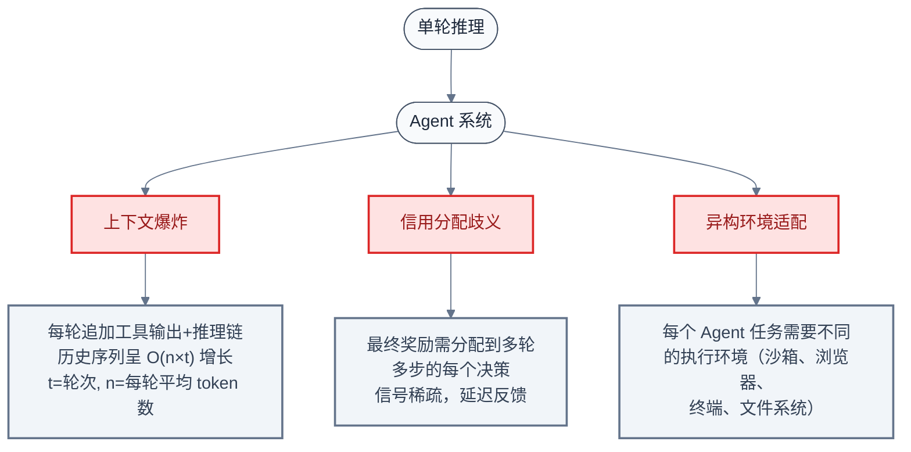
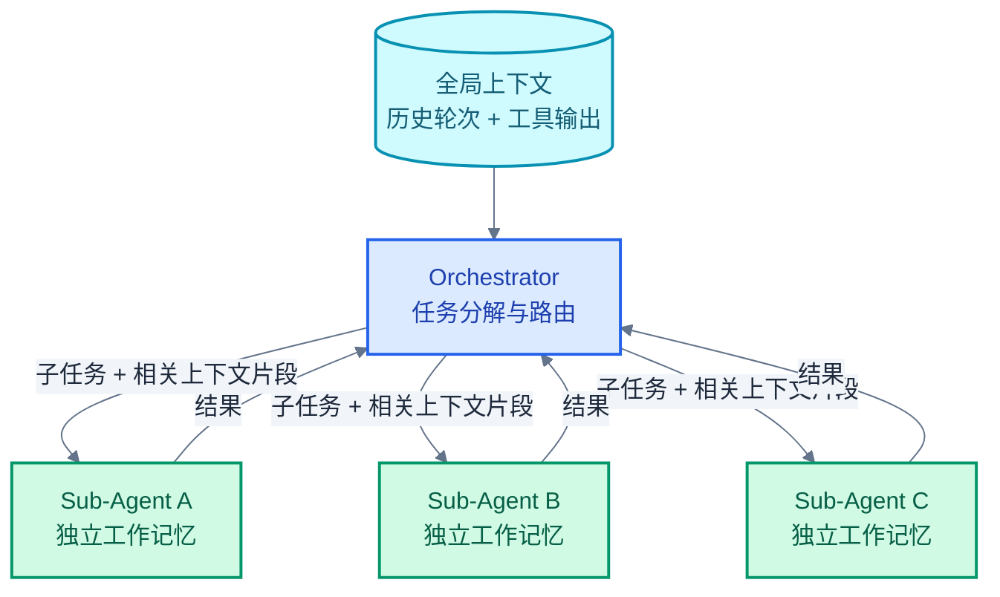
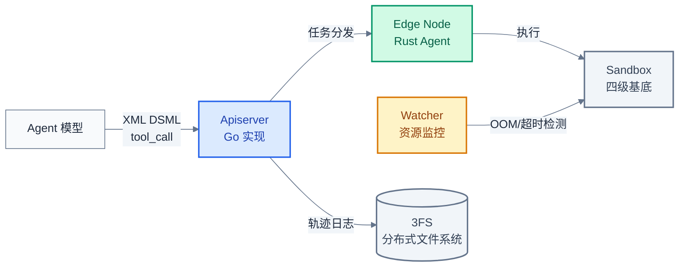
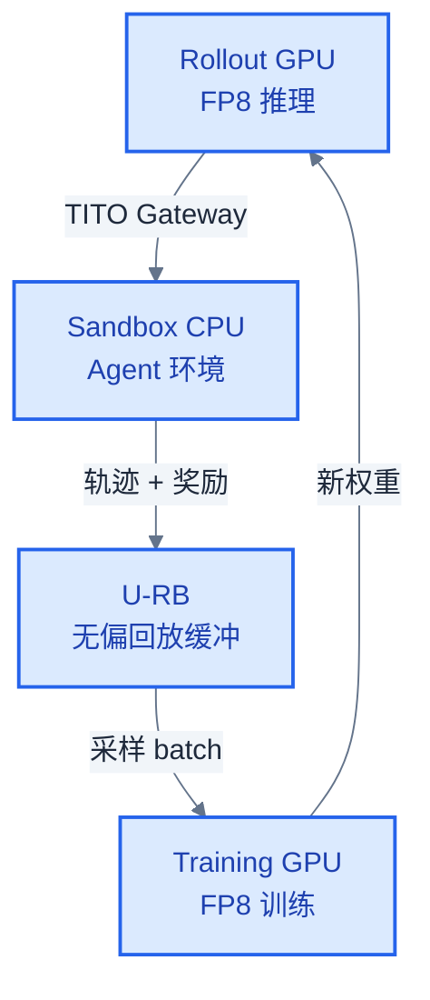
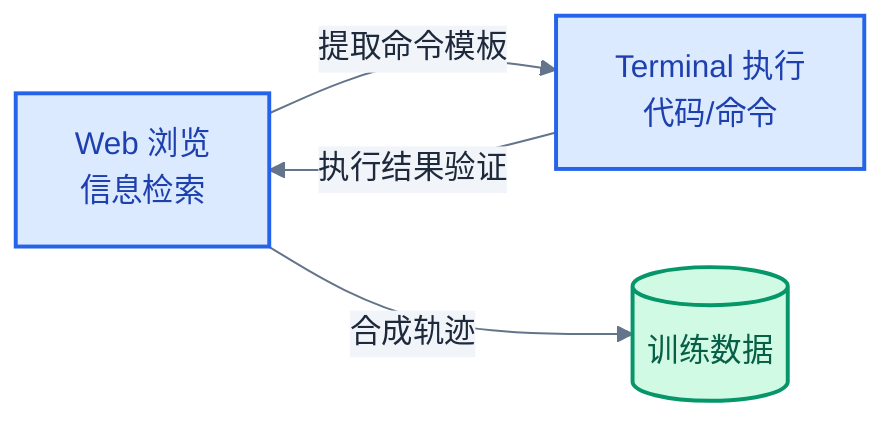

# LLM Agent 系统设计：上下文、编排、沙箱与异步 RL

> **核心命题**：单轮推理是"算一道题"，Agent 是"解一套题"——中间的差距不在模型能力，而在系统工程。Multi-turn 交互带来的上下文爆炸、信用分配歧义、异构环境适配，以及 RL 训练中的推理-训练耦合，每一个都是让 Agent 从 demo 走向生产必须跨越的工程鸿沟。
> **工程师视角**：本文以 Kimi K2.5、GLM-5、DeepSeek-V4、ERNIE 5.0、Step3.5-Flash 五个 2025 年技术报告为线索，按"问题 → 方案 → 代价"的模式，梳理 Agent 系统的七大工程难题及其解法。

### 关键术语

| 缩写 | 全称 | 含义 |
|------|------|------|
| PARL | Parallel Agent Reinforcement Learning | 并行 Agent 强化学习，Kimi K2.5 多 Agent 训练框架 |
| HCM | Heuristic Context Management | 启发式上下文管理，GLM-5 的上下文裁剪策略 |
| TITO | Token-In-Token-Out | GLM-5 推理-训练引擎间的 token 级通信网关 |
| IS | Importance Sampling | 重要性采样，off-policy RL 中修正分布偏移的技术 |
| U-RB | Unbiased Replay Buffer | 无偏回放缓冲，ERNIE 5.0 的 off-policy 数据复用机制 |
| DSec | DeepSeek Sandbox | DeepSeek-V4 的 Rust 实现安全沙箱 |
| 3FS | Fire-Flyer File System | DeepSeek 的分布式文件系统，DSec 的存储底座 |
| OCI | Open Container Initiative | 容器镜像标准，DSec 多种执行基底的封装格式 |
| SFT | Supervised Fine-Tuning | 监督微调 |
| RL | Reinforcement Learning | 强化学习 |
| CoT | Chain of Thought | 思维链 |
| KV Cache | Key-Value Cache | 注意力机制的键值缓存 |

---

## 目录

1. [Agent 为什么难：multi-turn 的系统级挑战](#agent-为什么难multi-turn-的系统级挑战)
2. [上下文管理：从丢弃到分片](#上下文管理从丢弃到分片)
3. [多 Agent 编排：Orchestrator-Subagent 解耦](#多-agent-编排orchestrator-subagent-解耦)
4. [沙箱与环境：从 Docker 到 microVM](#沙箱与环境从-docker-到-microvm)
5. [异步 Agentic RL：推理-训练全解耦](#异步-agentic-rl推理-训练全解耦)
6. [工具调用工程：Schema、解码与并行](#工具调用工程schema解码与并行)
7. [Agent 数据合成：环境闭环与自评估](#agent-数据合成环境闭环与自评估)
8. [技术全景对比](#技术全景对比)

---

## 1. Agent 为什么难：multi-turn 的系统级挑战

### 1.1 前置知识

| 需要了解 | 参考文档 |
|----------|----------|
| RLHF / PPO / DPO 基础 | [07-Post-Training基础](./07-LLM%20Post-Training基础：SFT、RLHF与DPO.md) |
| GRPO 与多阶段 RL | [08-Post-Training进阶](./08-LLM%20Post-Training进阶：GRPO与多阶段RL.md) |
| 推理服务架构（Continuous Batching, KV Cache） | [13-推理服务架构](./13-LLM推理服务架构：调度、缓存与投机解码.md) |

### 1.2 单轮推理 vs Agent：系统层面的三个新矛盾

单轮推理的工程问题（KV Cache 管理、调度、量化）经过 2023-2024 年的大量投入已基本解决。Agent 则在系统层面引入了三个此前不存在的矛盾：



**矛盾一：上下文爆炸**。每轮 Agent 交互追加工具调用的输入输出、推理中间步骤，历史长度从单轮的 $N$ token 增长为 multi-turn 的 $T \times (N_{\text{think}} + N_{\text{tool}})$，其中 $T$ 通常为 5-50 轮。KV Cache 占用超出单 GPU HBM 容量是常态而非例外。

**矛盾二：信用分配歧义**。单轮推理中，每个 token 对最终答案的贡献可直接由 RL 奖励信号回溯。Agent 场景中，最终任务成功与否取决于多轮决策的复合效应：某一步的"好决策"可能因为后续步骤的失误而得不到奖励，反之亦然。这是强化学习中经典的 **Credit Assignment Problem**，在 LLM Agent 场景中被序列长度和动作空间的组合爆炸放大。

**矛盾三：异构环境**。Agent 需要在沙箱中执行代码、在浏览器中点击、在终端中运行命令。每个环境有不同的资源需求（CPU/内存/存储）和生命周期管理需求（创建/快照/销毁），传统推理服务的 Kubernetes + GPU 模型完全不适用。

### 1.3 各方案的技术侧重点

| 方案 | 核心创新 | 主要解决的矛盾 |
|------|---------|--------------|
| Kimi K2.5 Agent Swarm | Orchestrator-Subagent 解耦 + PARL 奖励函数 | 信用分配歧义 |
| GLM-5 Async Agentic RL | TITO Gateway + 双向重要性采样 | 训练-推理耦合 |
| DeepSeek-V4 DSec | 四级执行基底 + 分层存储快照 | 异构环境适配 |
| ERNIE 5.0 RL Infra | Unified FP8 Stack + Elastic CPU Pooling | 硬件 TCO |
| Step3.5-Flash | PaCoRe 并行推理 + FullyAsync 训练 | 上下文爆炸 + 训练效率 |

---

## 2. 上下文管理：从丢弃到分片

Agent 的上下文管理远不只是"截断历史"，而是**在多轮工具交互的 token 洪流中，保留对完成任务最关键的信号，丢弃冗余噪声**。不同方案给出了一系列从简单到复杂的策略。

### 2.1 四种基础策略：Step3.5-Flash 的消融对比

Step3.5-Flash 技术报告给出了目前唯一的公开定量对比：

| 策略 | 原理 | BrowseComp 准确率 |
|------|------|:---:|
| **Multi-Agent** | 任务分解 → 子 Agent 独立工作记忆 | **68.5%** |
| **Discard-All** | $T > T_{\text{max}}$ 时丢弃全部历史，重启 | 66.0% |
| **Keep-First&Last-K** | 保留最早 $K$ 条和最近 $K$ 条 | 58.0% |
| **Summary** | 用模型对中间历史做摘要压缩 | 57.0% |

一个反直觉的发现：最暴力的 Discard-All 策略（总 token 超阈值即全丢弃）反而优于精心设计的 Keep-First&Last-K 和 Summary 策略。原因在于：Agent 的"中间推理"往往包含大量不可压缩的试错过程，摘要模型无法区分"关键失败教训"和"噪音"，而正确的失败信息一旦被压缩即不可恢复。

Multi-Agent 策略得分最高，其原理不是被动压缩，而是**主动分片**——将任务拆解为子任务，每个子 Agent 只维护自己的工作记忆，避免全局上下文膨胀。这引出了第 3 节的多 Agent 编排话题。

### 2.2 HCM：GLM-5 的启发式上下文管理

GLM-5 提出了 **HCM (Heuristic Context Management, 启发式上下文管理)**，规则简单但工程上有效：

```
HCM 算法:
  k = 5                           # keep-recent 参数
  T_max = 32768                   # 总 token 上限

  def hcm(history):
      if total_tokens(history) <= T_max:
          return history           # 未超阈值, 不处理

      # 超阈值: 丢弃全部历史, 保留最近 k 轮
      recent = history[-k:]
      # 重启环境 (放弃中间状态)
      restart_environment()
      return recent
```

核心参数：`keep-recent k=5`、总 token 阈值 $T_{\text{max}} = 32\text{K}$。当上下文超过 32K token 时，丢弃全部历史，仅保留最近 5 轮交互，并重启 Agent 的执行环境。

配合 HCM，GLM-5 在 BrowseComp 上达到 75.9%。与 Step3.5 的 Discard-All 66.0% 对比，差异在于：GLM-5 保留了最近 $k=5$ 轮的即时上下文，而 Discard-All 是彻底的清零。这个差异说明**最近几轮的工具调用上下文对任务连续性至关重要**，但更早的历史（可能包含失败的探索路径）反而干扰决策。

### 2.3 Agent Swarm 上下文分片：Kimi K2.5

Kimi K2.5 的 Agent Swarm 将上下文管理从"压缩旧信息"升级为"给不同 Agent 分配不同的信息子集"。



关键设计：

1. **任务分解**：Orchestrator 将用户任务分解为多个子任务（如"搜索 A 的信息 → 搜索 B 的信息 → 对比 A 和 B"），每个子任务分配给一个 Sub-Agent
2. **选择性路由**：Orchestrator 不是将全部上下文发给每个 Sub-Agent，而是只发送与当前子任务相关的上下文片段
3. **独立工作记忆**：每个 Sub-Agent 在自己的上下文窗口内维护独立的探索路径，互不污染

这与传统的"全量上下文传输"有本质区别：不是在被动压缩已有信息，而是在**定义每个子 Agent 需要看到什么信息**。从系统角度看，总上下文量并未减少（甚至增加），但每个 Agent 的局部上下文被控制在可管理范围内。

### 2.4 上下文策略选型指南

| 场景 | 推荐策略 | 原因 |
|------|---------|------|
| 短任务（<3 轮工具调用） | 不处理 | 上下文在 KV Cache 可承受范围 |
| 中等任务（3-10 轮） | Keep-Recent (k=5) | 保留即时上下文，丢弃早期探索 |
| 长任务（>10 轮） | Discard-All + Restart | 历史噪音 > 有用信号 |
| 复杂多子任务 | Agent Swarm 上下文分片 | 子任务天然隔离 |
| Web 浏览 | HCM (GLM-5) | 页面切换频繁，早期信息快速过期 |

---

## 3. 多 Agent 编排：Orchestrator-Subagent 解耦

### 3.1 动机：为什么要解耦？

在多 Agent RL 训练中，Kim K2.5 团队识别出两个核心问题：

**问题一：信用分配歧义 (Credit Assignment Ambiguity)**。单个 Agent 执行多步工具调用 → 最终奖励信号需要跨越多个决策步骤分配。当所有 Agent 共享同一个可训练模型时，某个 Sub-Agent 的"好行为"可能因为 Orchestrator 的错误分配而被惩罚。

**问题二：训练不稳定性 (Training Instability)**。同步更新 Orchestrator 和 Sub-Agent → 梯度振荡。原因：Orchestrator 和 Sub-Agent 的优化目标（全局规划 vs. 局部执行）存在内在冲突。

### 3.2 架构：Orchestrator（可训练）+ Sub-Agent（冻结）

```
┌──────────────────────────────────────────────────────────────┐
│                  Kimi K2.5 Agent Swarm 架构                    │
├──────────────────────────────────────────────────────────────┤
│                                                               │
│  ┌──────────────────────────────────────────────────────┐   │
│  │  Orchestrator  ← 唯一可训练组件                       │   │
│  │  ┌────────────────────────────────────────────────┐  │   │
│  │  │  职责:                                          │  │   │
│  │  │  1. 接收用户任务 → 分解为子任务                 │  │   │
│  │  │  2. 为每个子任务选择最优 Sub-Agent              │  │   │
│  │  │  3. 汇总 Sub-Agent 结果 → 生成最终输出         │  │   │
│  │  │  4. 决定何时停止任务分解/重试                   │  │   │
│  │  └────────────────────────────────────────────────┘  │   │
│  └───────────────────────┬──────────────────────────────┘   │
│                          │                                   │
│          ┌───────────────┼───────────────┐                  │
│          ▼               ▼               ▼                  │
│  ┌──────────────┐ ┌──────────────┐ ┌──────────────┐        │
│  │  Sub-Agent A  │ │  Sub-Agent B  │ │  Sub-Agent C  │        │
│  │  (Frozen)     │ │  (Frozen)     │ │  (Frozen)     │        │
│  │  代码搜索     │ │  网页浏览     │ │  文件操作     │        │
│  └──────────────┘ └──────────────┘ └──────────────┘        │
│                                                               │
└──────────────────────────────────────────────────────────────┘
```

Sub-Agent 使用同一个基础模型但**冻结权重**——它们只做推理，不做训练。这解决了两个问题：

1. **信用分配简化**：只有 Orchestrator 接收 RL 奖励信号，Sub-Agent 的输出被视为"环境的一部分"。这消除了跨组件梯度冲突。
2. **训练稳定性**：Sub-Agent 固定后，Orchestrator 面对的是一个**静态的环境分布**，训练更容易收敛。

代价：Sub-Agent 不会随着训练而改进，Orchestrator 能力的上限受限于 Sub-Agent 的质量。需要精心选择 Sub-Agent 的初始化能力基线。

### 3.3 PARL 奖励函数：三个维度的显式约束

PARL (Parallel Agent Reinforcement Learning) 的奖励函数由三项组成：

$$R_{\text{PARL}} = r_{\text{parallel}} + r_{\text{finish}} + r_{\text{perf}}$$

其中 $\lambda$ 为退火系数，逐步衰减至 0（即训练后期完全依靠 $r_{\text{perf}}$）。

**$r_{\text{parallel}}$ — 反串行崩溃奖励**：

Orchestrator 可能学会一个退化策略：将本应并行的子任务**串行化**（逐个分配、逐个等待）。这虽然能完成任务，但放弃了并行带来的延迟收益。

$$
r_{\text{parallel}} = 
\begin{cases}
+1, & \text{如果子任务被正确并行分配（依赖 DAG 分析验证）} \\
-1, & \text{如果并行子任务被串行化}
\end{cases}
$$

**$r_{\text{finish}}$ — 反伪装并行奖励**：

更隐蔽的退化模式：Orchestrator 同时发起多个 Sub-Agent 请求（表面上是并行的），但故意让第一个 Sub-Agent 完成后的输出触发后续的任务重分配——本质上仍是串行的。

$$
r_{\text{finish}} = 
\begin{cases}
+1, & \text{如果所有真正并行的子任务在同一个时间窗口内完成} \\
0, & \text{否则}
\end{cases}
$$

**$r_{\text{perf}}$ — 任务完成质量奖励**：由外部评估器对最终输出打分（如 WideSearch 上的答案准确率）。

$\lambda$ 退火策略：训练初期 $\lambda_{\text{init}}=1.0$（强约束并行行为），逐步退火到 $0$（后期只关注任务质量）。动机：在 Agent 学习初期，必须显式惩罚并行-串行之间的退化捷径；一旦 Agent 内化了并行策略，就不再需要约束。

PARL 在 WideSearch 上实现了 **3-4.5×** 的延迟加速。

### 3.4 Critical Steps 指标：Agent 的计算关键路径

Critical Steps 是 Kimi K2.5 提出的 Agent 评估指标，类比于计算图（DAG）中的 **Critical Path（关键路径）**。

```
Agent 执行 DAG:

   ┌──────────┐
   │ Step 1   │  (开始任务, 1s)
   └────┬─────┘
        │
   ┌────┴─────┐
   │ Step 2   │  (分解任务, 0.5s)
   └────┬─────┘
        │
   ┌────┼────────────────┐
   ▼    ▼                ▼
  [A]  [B]             [C]
  搜索  浏览             代码
  2s    3s              5s     ← Critical Path = Step1→Step2→C = 1+0.5+5 = 6.5s
        │
        ▼
     [汇总] (0.5s)              ← 非关键路径，C 仍是瓶颈
```

Critical Steps 定义为 DAG 上最长延迟路径上的节点数。该指标直接对应延迟上界：在无限并行度的理想条件下，延迟 = $\sum_{i \in \text{critical path}} t_i$。实际延迟因 GPU 并发度和工具 API 速率限制而更高。

### 3.5 GLM-5 的 MLA 改进：Muon Split 和 MLA-256

GLM-5 在 MLA（参见 [07-Post-Training基础](./07-LLM%20Post-Training基础：SFT、RLHF与DPO.md) MLA 部分）基础上做了两项针对性改进：

**Muon Split — 每头独立正交化**：

MLA 的低秩压缩将多头的 KV 投影到一个共享的低维空间。这虽然压缩了显存，但也导致**不同 head 的 KV 表示耦合在一起**，降低了 attention 的多样性。Muon Split 的解决方式：在低秩压缩之后，为每个 head 独立施加正交化变换，确保各 head 在压缩空间中仍保持信息独立性。

效果：MLA 的 attention 质量追平 GQA-8。

$$W_K^{(h)} = W_K^{\text{shared}} \cdot O^{(h)}$$

其中 $O^{(h)}$ 是第 $h$ 个 head 的正交化矩阵，满足 $(O^{(h)})^\top O^{(h)} = I$。

**MLA-256 — 增大 head dim，减少 head 数**：

标准 MLA 的 head dim $d_h = 192$。GLM-5 将其增大到 $256$，同时按 $256/192 = 4/3$ 的比例减少 head 数（保持总参数量不变）。

效果：Decode 阶段的计算量随 head 数线性减少（少 1/3 的 attention head），而每个 head 的表达能力随维度增加而增强。Pre-fill 阶段的 FLOPs 基本不变（总参数量不变），但 Decode 的 latency 显著降低——而 Decode 恰是 Agent 工具调用场景的延迟瓶颈。

---

## 4. 沙箱与环境：从 Docker 到 microVM

Agent 需要"动手"而不是"动嘴"——执行代码、操作文件、浏览网页。这要求**安全的多租户执行环境**，其系统工程复杂度远超给模型加一个 `tool_call` 字段。

### 4.1 DSec：DeepSeek-V4 的安全沙箱架构

DeepSeek-V4 的 DSec 沙箱是 2025 年公开技术报告中描述最完整的 Agent 执行环境，包含三个核心组件：



- **Apiserver**（Go）：接收 Agent 模型的 tool_call 请求，解析任务类型，路由到对应的 Edge 节点。Go 的 goroutine 并发模型天然适合 IO 密集型 API 调度。
- **Edge**（Rust）：Worker 节点，在目标执行基底中运行 Agent 的代码/命令。Rust 的内存安全保证对沙箱场景至关重要——Agent 生成的代码可能是恶意的或有 bug 的，必须在语言层面隔离崩溃影响。
- **Watcher**（Rust）：独立进程，监控 Edge 的资源使用（CPU、内存、磁盘 IO），超限即强制终止并回收。不依赖 Edge 的自报——Edge 被恶意代码卡死后 Watcher 仍可正常 kill。

存储底座为 **3FS (Fire-Flyer File System)**，DeepSeek 自研的分布式文件系统。选择自研而非 Ceph/HDFS 的原因：Agent 轨迹日志需要**全局有序写入**（保证确定性回放），通用分布式文件系统的乱序写入语义不够。

### 4.2 四级执行基底：安全性和开销的权衡

DSec 支持四种执行基底，按隔离强度递增排列：

| 基底 | 隔离级别 | 启动延迟 | 适用场景 |
|------|:---:|:---:|------|
| **Function Call** | 进程级 | <1ms | 简单计算（如 `eval("2+3")`） |
| **Container (OCI)** | 内核命名空间 | ~100ms | 安装 Python 包、运行脚本 |
| **microVM (Firecracker)** | 轻量虚拟机 | ~200ms | 需要 root 权限的任务 |
| **fullVM (KVM)** | 完全虚拟化 | ~1s | 内核模块编译、危险实验 |

层次选择策略：
- 默认使用 **Container**（覆盖 90%+ 的 Agent 任务）
- Agent 请求中包含 `requires_root: true` 时升级到 **microVM**
- Agent 请求中包含 `compile_kernel: true` 时升级到 **fullVM**

### 4.3 分层存储快照：ms 级环境恢复

Agent 的一个独特需求：在 multi-turn 工具调用中，**某一步的失败不应污染后续步骤的环境**。ML 领域标准的解决方案是"每步创建新的容器"——但 Docker 镜像的 pull + extract 延迟通常在秒级，Agent 的数十步交互会累积为不可接受的等待时间。

DSec 使用分层存储快照：

```
┌────────────────────────────────────────────────────┐
│  基础层 (Base Layer)                                │
│  EROFS 只读镜像: Python 3.12 + 常用科学计算包         │
│  首次启动: ~1s (一次性预热到 3FS cache)              │
│                                                     │
├────────────────────────────────────────────────────┤
│  差异层 (Diff Layer)                                │
│  overlaybd: 仅存储当前 step 的文件系统修改            │
│  创建快照: ~5ms (写 overlaybd metadata)              │
│  恢复快照: ~30ms (挂载 overlaybd + 回滚)              │
│  每个快照: <10MB (压缩后的 diff)                     │
├────────────────────────────────────────────────────┤
│  当前层 (Active Layer)                              │
│  Agent 可读写的工作空间                              │
│  Step 出错 → 回滚到上一个 diff layer 快照            │
└────────────────────────────────────────────────────┘
```

关键：每步工具调用前自动创建 diff 快照，执行出错后 ~30ms 回滚——比销毁并重建容器快 ~300 倍。

### 4.4 轨迹日志：全局有序与确定性回放

Agent 训练的一个前提条件：**相同的 prompt + 相同的随机种子 → 完全相同的 Agent 行为序列**。这要求：

1. **全局有序日志**：3FS 保证所有 Edge 节点的日志写入具有全局顺序（通过全局递增的 sequence number）
2. **确定性回放**：日志不仅记录 Agent 的 tool_call 决策，还记录环境状态（文件系统快照 ID、进程 PID、网络请求 ID）。回放时精确重建环境状态

与分布式数据库的 WAL（Write-Ahead Log）类似设计——但 DSec 的日志粒度为"一个 Agent step"，而非"一个事务"。

### 4.5 RepoLaunch：GLM-5 的 SWE 环境工厂

GLM-5 的 RepoLaunch 解决了一个数据瓶颈：如何大规模生成真实的 SWE（Software Engineering）Agent 任务？

```
RepoLaunch Pipeline:

  GitHub Issues ──→ 自动分析仓库 ──→ 生成可验证环境
       │                  │                  │
       ▼                  ▼                  ▼
  提取 10k+ Issue   分析依赖图、      创建 Docker 环境
  关联的 PR          构建系统、测试    运行基准测试
                                          ↓
                                   验证: >90% 准确率
                                   (Issue→PR 映射正确)
```

覆盖 9 种编程语言（Python/JS/TS/Go/Rust/C++/Java/Ruby/PHP），产出 10k+ 条 SWE-bench 级别的可验证环境。每条环境包含：
- `issue.md`：原始 GitHub Issue 描述
- `solution.diff`：关联 PR 的 git diff（ground truth）
- `tests/`：验证修复正确性的测试用例
- `Dockerfile`：可重现的执行环境

### 4.6 终端环境的三阶段合成

GLM-5 的 Terminal (Bash) 环境合成使用三阶段 pipeline：

| 阶段 | 输入 | 输出 | 方法 |
|------|------|------|------|
| **Draft** | 自然语言命令描述 | 初始子任务分解和命令草稿 | LLM 生成 |
| **Implementation** | 草稿 + Docker 沙箱 | 实际可执行的命令序列 | Agent 在沙箱中试错 |
| **Refinement** | 执行轨迹 + 正确性反馈 | 精炼后的标准答案 | 人工 + LLM 联合审核 |

Docker 环境准确率 >90%（即生成的环境在 90% 的尝试中能成功执行并得到预期结果）。

---

## 5. 异步 Agentic RL：推理-训练全解耦

Agent RL 训练与对话模型的 RLHF 在系统架构上有根本差异：**Agent 的 rollout 需要在异构 CPU 环境（沙箱）中执行**，而训练在 GPU 上进行。传统的同步 RL 架构（推理 → 收集 → 训练 → 推理 → ...）会导致 GPU 在 rollout 期间大量空闲。

### 5.1 GLM-5 TITO Gateway：消除文本↔Token 的边界开销

传统 Agent RL 训练流程中的隐式瓶颈：

```
GPU (Token 空间)          CPU/沙箱 (Text 空间)
┌──────────────┐          ┌──────────────┐
│ 模型生成 token │          │              │
│              │          │              │
│      ↓       │          │              │
│ Detokenize   │─────────→│ 文本 (prompt) │  ← 边界一: GPU→CPU
│      ↓       │          │      ↓       │
│              │          │ Agent 执行    │
│              │          │      ↓       │
│              │          │ 工具输出 (text)│
│              │          │      ↓       │
│   Tokenize   │←─────────│              │  ← 边界二: CPU→GPU
│      ↓       │          │              │
│  训练更新     │          │              │
└──────────────┘          └──────────────┘

问题: Detokenize→Tokenize 的往返带来了:
  1. Tokenization 偏差 (同一文本可映射到不同 token 序列)
  2. 额外的延迟 (~10ms per boundary, 长序列可累积到秒级)
```

GLM-5 的 **TITO Gateway (Token-In-Token-Out)** 消除了两次边界转换：

- 推理引擎输出的 token 直接传给沙箱执行器（沙箱自己能 detokenize）
- 沙箱输出重新 tokenize 后直接送入训练引擎
- 网关负责**双向 token 缓冲**，推理引擎和训练引擎各自以最高速率消费

这要求推理和训练引擎共享同一个 Tokenizer 实例（避免词表版本不一致），且网关需要实现**反压**（当一侧消费速率低于另一侧生产速率时，网关缓冲满 → 暂停生产侧）。

### 5.2 直接双面重要性采样：消除历史策略追踪

传统 RLHF 中，PPO 需要维护当前策略 $\pi_\theta$ 和旧策略 $\pi_{\text{old}}$（即 rollout 时的策略），用 IS (Importance Sampling) 比率修正：

$$A_t^{\text{corrected}} = \frac{\pi_\theta(a_t|s_t)}{\pi_{\text{old}}(a_t|s_t)} \cdot A_t$$

问题是：在异步 RL 架构中（rollout 和 training 在不同 GPU 上并行进行），维护 $\pi_{\text{old}}$ 意味着需要追踪"每个 rollout 样本生成时的策略版本"——这引入了全局状态同步开销。

GLM-5 的 **Direct Double-sided Importance Sampling** 方案：

- **Direct**：不再追踪 $\pi_{\text{old}}$ 的历史版本，而是直接从 rollout 中复用 log-probability（即 rollout 引擎生成 token 时计算并存储 $\log\pi_{\text{old}}(a_t|s_t)$）
- **Double-sided**：同时用 IS 修正策略梯度（actor loss）和价值估计（critic loss，如果使用 value-based 方法）

效果：消除了分布式共识协议的开销（不需要在 rollout GPU 和 training GPU 之间同步策略版本号）。

### 5.3 Off-policy 丢弃：过期版本 + 环境崩溃

GLM-5 定义了两类需要丢弃的 off-policy 样本：

```
Off-policy 丢弃规则:

  Rule 1: 过期版本丢弃 (Stale Version Discard)
    IF |version(rollout) - version(training)| > 1:
        DISCARD this rollout sample
    动机: 策略版本差 > 1 → IS 修正的方差过大, 纳入训练有害

  Rule 2: 环境崩溃丢弃 (Environment Crash Discard)
    IF rollout 因沙箱崩溃/超时/OOM 而中断:
        DISCARD this rollout trajectory
    动机: 不完整的轨迹无法正确分配信用, 且崩溃前的"好行为"
          因为被截断而得不到公正的奖励 → 训练偏差
```

丢弃比例：GLM-5 报告在 BrowseComp 任务上，过期版本丢弃约占 15%，环境崩溃丢弃约占 8%，合计约 23% 的 rollout 样本被丢弃。这是异步 RL 架构的固有代价——但被 ~10× 的训练吞吐提升（见 5.4 FullyAsync）所弥补。

### 5.4 Step3.5-Flash FullyAsync：~10× 效率提升

Step3.5-Flash 的 **FullyAsync** 训练方案将解耦推向极致：

```
传统同步 RL:
  时间轴
  ├── Rollout (GPU + CPU) ────┤ ├── Training (GPU) ──┤ ├── Rollout ──┤ ...
                                 ↑ GPU 空闲等待

FullyAsync RL:
  ├── Rollout GPU ────────────────────────────────────────┤
  ├── Sandbox CPU ────────────────────────────────────────┤ (持续工作)
  ├── Training GPU ───────────────────────────────────────┤ (持续工作)
       ↑ 三者独立运行, 通过异步队列通信
```

核心机制是 **Sticky Scheduling**：

- 同一个 rollout 的多轮交互（multi-turn）尽量调度到同一 GPU 上
- 目的：**复用 KV Cache**——同一 Session 的多轮交互中，历史轮次的 KV Cache 可以直接复用，而不需要每次重新 prefill
- 这要求调度器感知 "Session → GPU" 的映射关系，而非仅按负载均衡分配

效率：~10× 的端到端训练吞吐提升。代价：Sticky Scheduling 可能造成 GPU 负载不均（某些 Session 特别长，独占 GPU）；需要配合 Session-Router 的 migration 机制（将长时间空闲的 Session 迁移到其他 GPU）。

### 5.5 ERNIE 5.0 RL Infrastructure：全解耦控制面

ERNIE 5.0 的 RL 基础设施将 Agentic RL 的训练拆解为五个完全解耦的组件：



三项关键设计：

**1. Unified FP8 Execution Stack**

推理（Rollout）和训练使用相同的 FP8 算子集——同一份 kernel 代码既用于 rollout 的 GEMM，也用于训练的 GEMM。这消除了传统架构中"推理用 BF16、训练用 FP8"的精度转换开销。

**2. U-RB (Unbiased Replay Buffer)**

传统 RL 的 Replay Buffer 面临 off-policy bias（回放的样本来自旧策略，直接训练会导致偏差）。U-RB 通过双重重要性采样在回放时修正分布偏移：

$$w_i = \min\left(C, \frac{\pi_{\text{current}}(a_i|s_i)}{\pi_{\text{rollout}}(a_i|s_i)}\right)$$

其中 $C$ 是 IS 裁剪阈值，防止极端重要性权重导致的梯度爆炸。

**3. Elastic CPU Pooling — 虚拟化 GPU 集群的空闲 CPU**

GPU 集群中的 CPU 核心（用于数据预处理、日志写入）存在大量空闲时间。ERNIE 5.0 将这些空闲 CPU 虚拟化为 Agent 环境的执行资源：

- 检测 GPU 节点上的空闲 CPU core（利用率 < 20%）
- 在这些 core 上启动沙箱容器（Docker/microVM）
- Agent rollout 的执行不占用 GPU，而 GPU 专注于推理和训练

效果：将 GPU 集群的 TCO (Total Cost of Ownership) 中的 CPU 资源利用率从 ~30% 提升到 ~80%，无需额外采购 CPU 服务器。

### 5.6 Session-Router：Kubernetes + Tmux 的千级并发

Step3.5-Flash 的 Session-Router 管理数千个并发 Agent 环境：

- **Kubernetes** 负责基础设施层（Pod 生命周期、资源配额、故障恢复）
- **Tmux** 负责 Session 层（持久化终端会话、断线重连、多路复用）
- Session-Router 作为中间层，将 Agent 的 `tool_call: terminal` 请求路由到对应的 Tmux session

为什么使用 Tmux 而非更现代的方案（如 Kubernetes exec API）？因为 Agent 终端交互需要**完整的 PTY (Pseudo-Terminal) 语义**——包括 ANSI 转义序列、光标控制、终端尺寸协商——这些在 `kubectl exec` 中是不完整的。

---

## 6. 工具调用工程：Schema、解码与并行

工具调用的系统工程远不只是定义一个 JSON function schema。真正的挑战在三个层面：Schema 设计的紧凑性、解码阶段的约束执行、并行调用的竞态管理。

### 6.1 Schema 设计：从 JSON Schema 到 TypeScript 声明

主流方案（OpenAI Function Calling）使用 JSON Schema 描述工具：

```json
{
  "name": "search_web",
  "description": "Search the web for a given query",
  "parameters": {
    "type": "object",
    "properties": {
      "query": {"type": "string", "description": "The search query"}
    },
    "required": ["query"]
  }
}
```

问题：JSON Schema 本身就占用大量 token。在 Agent 场景中（通常有 10-50 个工具），Schema 的描述 token 可能超过实际对话的 token。

Kimi K2.5 改用 **TypeScript 声明**：

```typescript
function search_web(query: string): SearchResult;
function read_file(path: string, encoding?: "utf-8" | "base64"): FileContent;
function exec_command(cmd: string, timeout_ms?: number): CommandOutput;
```

更紧凑（省略了 `"type"`, `"properties"`, `"description"` 等 JSON Schema 元数据 key），且 TypeScript 语法对 LLM 的训练数据（包含大量代码库）来说更加熟悉——tokenizer 对 `function`, `string`, `:` 等符号的编码效率高于 JSON 的 `"type":`。

### 6.2 Constrained Decoding Enforcer

Kimi K2.5 的工具调用使用特殊 token 触发：

```
<|tool_call_section_begin|>
search_web("DeepSeek-V4 benchmark results")
<|tool_call_section_end|>
```

当模型生成 `<|tool_call_section_begin|>` 后，**Constrained Decoding Enforcer** 接管解码：

1. 根据 `search_web` 的函数签名，Enforcer 构建一个 token-level 的 DFA（确定性有限自动机）
2. 每个解码 step，Enforcer 将 logits 中"不符合 DFA 当前状态"的 token 置为 $-\infty$
3. 该 DFA 确保输出的语法正确——不会出现 `search_web("query"` 遗漏闭合括号的情况

与传统的 "生成 → 解析 → 报错 → 重试" 相比，Enforcer 消除了重试的 token 浪费。在 Agent 场景中（每轮都有工具调用），重试 token 的累积开销可达 10-20%。

### 6.3 DeepSeek-V4 DSML：XML 格式的工具调用 Schema

DeepSeek-V4 使用 XML 风格的 **DSML (DeepSeek Markup Language)**：

```xml
<tool_call>
  <name>read_file</name>
  <arguments>
    <path>/home/user/main.py</path>
    <encoding>utf-8</encoding>
  </arguments>
</tool_call>
```

选择 XML 而非 JSON 的三个原因：

1. **流式解码友好**：XML 的 `<tag>` 结构天然支持逐个 token 的解码验证（你可以在看到 `<path>` 开始标签时就约束后续内容），而 JSON 的 `{"path": "..."}` 需要先看到 key 才能验证 value
2. **多模态扩展**：`<image>base64...</image>` 比 JSON 的 base64 字符串更易读（对于 debug）
3. **Interleaved Thinking**：在 `<thought>` 和 `<tool_call>` 之间自由切换，XML 的嵌套结构比 JSON 更自然

### 6.4 Interleaved Thinking：保留跨工具调用的推理链

DeepSeek-V4 的 **Interleaved Thinking** 允许模型在工具调用之间保留推理状态：

```
┌──────────────────────────────────────────────────┐
│  round 1:                                         │
│    <thought>需要读取 main.py 来确定入口函数</thought> │
│    <tool_call>read_file("main.py")</tool_call>      │
│    <tool_output>def main(): ...</tool_output>       │
│                                                    │
│  round 2:                                         │
│    <thought>入口是 main()，它调用了 utils.py 的    │
│    parse_config。先看一下 utils.py。               │
│    (上一轮的推理仍在上下文中，不需要重新思考)       │
│    </thought>                                      │
│    <tool_call>read_file("utils.py")</tool_call>    │
│                                                    │
│  上下文窗口: 1M token                               │
│  → 所有跨轮的推理链都被保留                        │
└──────────────────────────────────────────────────┘
```

1M 上下文窗口的存在意义不仅是"能读长文档"，更是**让 Agent 的跨轮推理不被截断**。在 10-50 轮工具交互中，如果推理链被截断，每轮都需要重新"回忆"之前的推理——这本质上是冗余计算。

### 6.5 Quick Instruction：复用 KV Cache 的辅助 token

DeepSeek-V4 引入了一个 **Quick Instruction** 机制：特殊的辅助 token，用于在不破坏主 KV Cache 的前提下附加辅助指令。

```
主 KV Cache:
  [user_msg] [thought_1] [tool_call_1] [tool_output_1] [thought_2] ...

Quick Instruction (特殊 token):
  <qi>检查上一步的 read_file 输出中是否有 import 循环</qi>
  → 这个 token 可以被附加到现有 KV Cache 末尾
  → 不需要重新 prefill 整个上下文
  → 模型只需处理这一个 token + 已有 KV Cache → 极低的额外延迟
```

工程实现：Quick Instruction token 的 embedding 需要特殊训练（在 pre-training 阶段作为特殊 token 加入），但其 KV Cache 复用逻辑完全在推理引擎层实现，不改变模型结构。

### 6.6 并行工具调用：竞态管理

Kimi K2.5 的 Agent Swarm 支持并行工具调用的两个维度：

1. **同一 Sub-Agent 的多工具并行**：如同时发起 3 个搜索请求（不同 query），等待全部返回后统一分析
2. **不同 Sub-Agent 的并行**：Sub-Agent A 搜索文档的同时，Sub-Agent B 执行代码

竞态管理机制：

```
并行工具调用的响应处理:

  ┌─────────────────────────────────────────────┐
  │  Orchestrator 发出 3 个并行调用               │
  │  call_1: search("X")                        │
  │  call_2: search("Y")                        │
  │  call_3: search("Z")                        │
  │                                              │
  │  → 超时策略: max_wait = min(T_max, 2×P50)   │
  │    如果 call_2 超时，不阻塞 call_1/call_3   │
  │  → 合并策略: 至少 N_min=2 个返回后即开始     │
  │    分析，剩余结果追加到分析上下文             │
  └─────────────────────────────────────────────┘
```

关键参数：`T_max`（绝对超时阈值）、`N_min`（最少返回数，达到即开始处理）。这两个参数避免了"一个慢 API 拖死全部并行调用"的问题。

---

## 7. Agent 数据合成：环境闭环与自评估

Agent 训练数据的需求与单轮对话有本质差异：**需要环境反馈**。一条训练样本必须是 `(prompt, Agent轨迹, 环境反馈, 最终奖励)` 的四元组，而非简单的 `(prompt, response)` 对。

### 7.1 Web → Terminal 闭环合成

GLM-5 的数据合成采用环境闭环策略：



闭环的含义：Agent 先在 Web 环境中搜索信息（如"如何编译 Linux 6.8 内核"），根据搜索结果在终端中执行命令。**命令执行的成功/失败反馈**反过来验证搜索结果的质量——如果搜索结果声称 `make -j$(nproc)` 即可编译，但终端返回编译错误，则该 Web 搜索的结果被标记为"可能不完整"。

这种闭环检验使 GLM-5 的 Agent 数据质量显著高于单向合成（LLM 自己生成搜索-执行的文本而不实际验证）。

### 7.2 Slide Generation：从 HTML 到渲染质量的层次奖励

GLM-5 的 Slide Generation 任务（生成 HTML 幻灯片）使用多级奖励：

| 级别 | 评估对象 | 评估方式 | 权重 |
|------|---------|---------|:---:|
| Level 1 | 静态 HTML 结构 | CSS/HTML 语法检查 + DOM 树完整性 | 30% |
| Level 2 | 运行时 DOM | 在 headless browser 中渲染，检查 JS 错误、布局溢出 | 30% |
| Level 3 | 视觉特征 | 像素级对比（颜色一致性、文本对齐、图片比例） | 40% |

Level 3 权重最高的原因：Slide 的最终用户关心视觉效果而非代码质量。一个在 Level 1/2 满分但 Level 3 极差的 Slide（如颜色刺眼、字体混乱）对用户无意义。

### 7.3 Agent 作为自评估器

DeepSeek-V4 和 Kimi K2.5 都采用 `Agent-as-Evaluator` 模式：

```
Agent-as-Evaluator:

  Step 1: Agent A 执行任务 → 生成轨迹 Traj_A
  Step 2: Agent B (Evaluator) 审查 Traj_A:
    - 工具调用是否正确 (如在 search_web 之前没有 read_file)
    - 推理是否自洽 (如 thought_1 中的计划与 tool_call_2 是否一致)
    - 最终答案是否可被验证 (如代码是否可运行, 数学结果是否正确)
  Step 3: Evaluator 打分 (μ ∈ [0, 1]) + 详细理由
  Step 4: (μ, 理由, Traj_A) → 训练样本
```

这本质上是用 LLM 替代人工标注器。可扩展的前提是 Evaluator Agent 本身的能力足够强——如果 Evaluator 频繁误判，训练信号会被噪声淹没。Kimi K2.5 报告在实践中使用支路评估（对同一轨迹，三个不同的 Evaluator 独立打分，取中位数），降低了单个 Evaluator 的偏差。

---

## 8. 技术全景对比

| 维度 | Kimi K2.5 | GLM-5 | DeepSeek-V4 | ERNIE 5.0 | Step3.5-Flash |
|------|-----------|-------|-------------|-----------|---------------|
| **上下文管理** | Agent Swarm 分片 | HCM (keep-5, 32K→丢弃) | 1M + Interleaved Thinking | — | Discard-All / Multi-Agent |
| **多 Agent** | Orchestrator 可训练 + Sub-Agent 冻结 | — | — | — | — |
| **沙箱基底** | — | Docker (>90%) | Container/microVM/fullVM | Elastic CPU Pooling | Kubernetes+Tmux |
| **RL 训练** | PARL (三奖励 + λ退火) | TITO + 双面 IS | 轨迹日志确定性回放 | Unified FP8 + U-RB | FullyAsync (~10×) |
| **工具 Schema** | TypeScript 声明 | — | XML DSML | — | — |
| **关键指标** | 3-4.5× 延迟加速 | BrowseComp 75.9% | ms 级快照恢复 | GPU TCO CPU ~80% | Multi-Agent 68.5% |

### 8.1 工程观点总结

1. **Multi-turn 上下文爆炸**是 Agent 系统的第一瓶颈。解决路径：简单截断（HCM/Discard-All）→ 智能保留（Keep-Recent）→ 任务分片（Agent Swarm）。选择取决于任务复杂度。
2. **Orchestrator-Subagent 解耦**是解决信用分配歧义的工程化方案——不是更好的 RL 算法，而是改变"谁接收奖励"的拓扑结构。
3. **沙箱不是附属品**，而是 Agent 基础设施的核心组件。DSec 的四级基底 + 分层快照是目前公开的最完整方案。
4. **异步 RL**（推理和训练物理分离）从"锦上添花"变为"必须品"——Agent rollout 的低 GPU 利用率（等待沙箱执行）迫使重新设计训练架构。
5. **工具调用 Schema**的演化方向：从冗长的 JSON Schema → 紧凑的 TypeScript/XML → 配合 Constrained Decoding 消除生成-解析的往返开销。

---

## 参考资料

| 技术报告 | 核心贡献 |
|---------|---------|
| Kimi K2.5 Technical Report | Agent Swarm, PARL, TypeScript tool schema, Constrained Decoding |
| GLM-5 Technical Report | HCM, TITO Gateway, Direct Double-sided IS, RepoLaunch |
| DeepSeek-V4 Technical Report | DSec Sandbox, DSML, Interleaved Thinking, Quick Instruction |
| ERNIE 5.0 Technical Report | Unified FP8 Stack, U-RB, Elastic CPU Pooling |
| Step3.5-Flash Technical Report | PaCoRe, FullyAsync, Session-Router, Multi-Agent context |

> **下一篇**：回到 [LLM 训练推理全景学习框架](./00-LLM训练推理全景学习框架.md) — 全栈串联