# NVIDIA GPU 架构演进：从 Tesla 到 Blackwell

> 如果把 NVIDIA GPU 近二十年的架构演进概括成一句话，核心主线就是**执行域、供数域、同步域与协同边界不断外扩**；功能堆叠只是表层现象。
> **工程师视角**：理解每一代"卡在哪里 → 引入什么机制 → 新矛盾推到哪里"，比记住新增特性清单重要得多。这篇文章从专利、官方文档和指令集三个层面交叉印证这条主线。

### 关键术语
| 缩写 | 全称 | 含义 |
|------|------|------|
| SM | Streaming Multiprocessor | 流式多处理器，GPU 的基本执行单元 |
| GPC | Graphics Processing Cluster | 图形处理集群，多个 SM 的上级组织单位 |
| RF | Register File | 寄存器文件，线程私有存储 |
| LSU | Load/Store Unit | 加载/存储单元，处理内存访问指令 |
| ALU | Arithmetic Logic Unit | 算术逻辑单元 |
| FPU | Floating Point Unit | 浮点运算单元 |
| FMA | Fused Multiply-Add | 融合乘加运算 |
| HMMA | Half-precision Matrix Multiply-Accumulate | 半精度矩阵乘加（Tensor Core 指令） |
| WGMMA | Warp-Group Matrix Multiply-Accumulate | Warp 组级矩阵乘加（Hopper） |
| SIMT | Single Instruction Multiple Threads | 单指令多线程，GPU 的执行模型 |
| CTA | Cooperative Thread Array | 协作线程数组（即 Thread Block） |
| CGA | Cooperative Grid Array | 协作网格数组（Hopper 的 cluster 级对象） |
| ITS | Independent Thread Scheduling | 独立线程调度（Volta 引入） |
| DSM | Distributed Shared Memory | 分布式共享内存（Hopper cluster 内跨 SM） |
| TMA | Tensor Memory Accelerator | 张量内存加速器（Hopper 的专用搬运单元） |
| TMEM | Tensor Memory | 张量内存（Blackwell 的 Tensor Core 近端存储） |
| DAG | Directed Acyclic Graph | 有向无环图 |
| HBM | High Bandwidth Memory | 高带宽内存 |
| NVLink | — | NVIDIA 的 GPU 间高速互连 |
| NVSwitch | — | NVIDIA 的 GPU 间交换芯片 |
| TE | Transformer Engine | Transformer 引擎（Hopper 的 FP8 精度管理层） |

---

## 1. 概述

### 1.1 前置知识
| 需要了解 | 参考文档 |
|----------|----------|
| GPU 基本架构（SM、Warp、显存层次） | GPU 基础资料 |
| Transformer / LLM 基本结构 | [LLM注意力机制发展与演进](./LLM注意力机制发展与演进.md) |
| CUDA 编程模型（Thread Block, Grid） | NVIDIA CUDA Programming Guide |

### 1.2 核心主线：四条边界的持续外扩

NVIDIA GPU 最开始是一台相对简单的机器：以 warp lockstep 为默认执行方式、围绕 RF → ALU 的近端供数链、以寄存器依赖和 busy-bit 为同步手段、以单 SM 为硬件协同边界。后续每一代真正重要的架构断点，都在打破其中至少一个边界。

全文围绕三个问题展开：**上一代到底卡在哪里，下一代引入了什么机制，这个机制又把新矛盾推向哪里。**

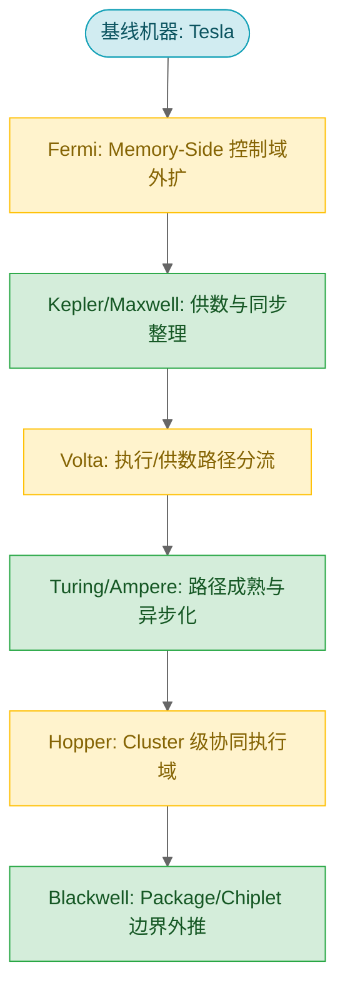

近二十年的主线可归纳为三层压力：

- **Memory-Side 控制/语义压力**：当 L2、atomic、residency、coherence 从后台细节升格，memory-side 必须变成真正的硬件域。
- **Datapath Specialization 压力**：当矩阵计算、低比特格式、warp-uniform 数据流难以继续塞进同一条通用路径，执行与供数就必须分流。
- **Coordination 压力**：当 cp.async、TMA、WGMMA、cluster 协同成为主角后，同步原语和互连边界都必须升级。

---

## 2. 基线机器：Tesla（2006）

### 2.1 SIMT 与 Warp 锁步执行模型

Tesla（G80，2006 年发布）固定了几条最基础的边界：

- **SIMT + warp 锁步推进**：同一 warp 内的 32 个线程共享同一份程序计数器（PC），以 lockstep 方式共同前进。分歧时通过 active mask + reconvergence stack 让不同路径串行执行。
- **单 SM 为协同边界**：shared memory、scoreboard、执行聚合都在一个 SM 内部完成。
- **RF → ALU 近端供数链**：banked RF（专利 US7339592B2、US7490208B1）将源操作数读出后送入执行单元。

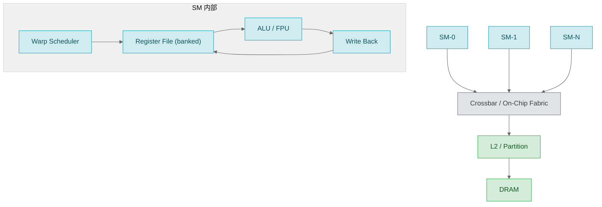

### 2.2 片上流量组织：Crossbar 与 Virtual Channels

GPU 从一开始就需要一张能同时承接多客户端、多目的端、多类请求的统一交换层。多个 SM/GPC 并发争用共享 memory-side 资源，图形与计算流量可能同时存在，芯片不可能为每一类流量单独铺一套互连。

专利 US8539130B2（申请于 2009 年）表明，最早在 Tesla 代际，NVIDIA 已经把 crossbar + virtual channels 作为正式的架构问题写出来。Virtual channels 的核心思路是：在同一张物理 crossbar 上，按 traffic class（compute / memory / graphics）切成逻辑隔离的通道，避免 head-of-line blocking——队头请求卡住后，后面本可发往空闲目标的请求也被拖住。

```text
无 Virtual Channels:
  SM0(mem) --\
  GPC(gfx) ---+--> [ one shared queue ] --> [ busy destination ]
  SM1(comp) --/
  所有不相关流量都被队头阻塞拖住

有 Virtual Channels:
  SM0(mem)  ----> [ VC-memory   ] --> memory path
  GPC(gfx)  ----> [ VC-graphics ] --> graphics path
  SM1(comp) ----> [ VC-compute  ] --> compute path
  各流量独立排队，通过仲裁共享后端交换资源
```

---

## 3. 第一次架构重写：Fermi — Memory-Side 控制域的确立

### 3.1 为什么 Memory-Side 需要成为独立控制域

Tesla 时代的 memory-side 更像是"地址请求最终落到哪里"的后台路径，没有成为稳定的软件可见控制边界。Fermi 改变的是这件事：**global 访问不再只是把地址送到 DRAM 再取回数据，软件开始需要区分访问意图**——哪些数据该 cache、哪些只是 streaming、哪些希望弱化局部副本。

从 SM 本地执行视角看，Fermi 仍是 dual warp scheduler + instruction dispatch 驱动的单 SM 机器。这恰好反衬出它的关键转折不在执行域外扩，而在 memory-side 控制点第一次被写成稳定硬件边界。

三个直接原因推动了这一改变：

1. **global 访问意图分化**：软件需要区分 cache、streaming、write-through 风格路径。
2. **处理域稳定化需求**：L1 是每个 SM 本地私有的，不能作为不同 SM 访问同一 global 地址时的共同处理点。需要一个更靠近 L2/partition/DRAM 的共同 memory-side owner。
3. **Atomic 与同步下沉**：atomic、写回、驻留等操作需要一个按地址稳定的落点来做顺序判定。

### 3.2 L2/Partition：从被动缓存到可调优处理域

专利 US9639479B2（申请于 2010 年）是第一个关键转折点，它将以下组件固化成同一组硬件边界：

- **Partition Unit**：按地址哈希将请求路由到固定 partition
- **L2 Slice**：per-partition 的共享缓存
- **FB DRAM Interface**：通向外部显存的接口边界
- **Cache Policy Modifier**：`.cg` / `.cs` / `.cv` / `.wt`

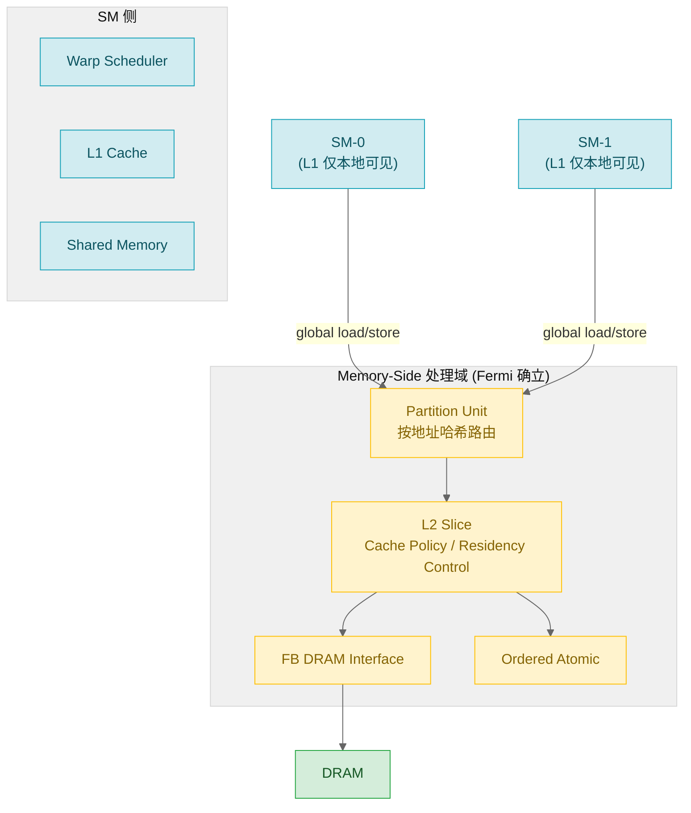

关键点：同一个 global 地址，无论来自哪个 SM，都会稳定落到相同的 L2 slice / partition，由那里处理缓存策略、atomic 顺序、写回时机和完成路径。这里的"稳定"指处理域稳定，不保证访问一定命中 L2。

### 3.3 Cache Policy Modifier：软件意图的编码

硬件看到的只是一串地址流，软件知道的却是访问意图。Fermi 引入的 loader/store policy modifier 把这种意图编码为 cache policy / locality hint：

| Modifier | 语义 | 典型场景 |
|----------|------|----------|
| `.cg` | 偏向 L2 级别缓存，不优先占用 L1 | 多 block 反复读取同一张参数表 |
| `.cs` | streaming 数据，优先逐出 | 一次性扫描大块输入样本 |
| `.cv` | 偏向重新取数，减少陈旧缓存干扰 | 读取 host 或外部 agent 更新的数据 |
| `.wt` | write-through 风格，推向 memory-side | host-mapped buffer、队列元数据 |

这些 modifier 是性能提示（PTX 语义），不改变内存一致性行为。真正的同步仍由 barrier、fence、atomic 承担。

### 3.4 后续影响：Kepler 与 Maxwell 的完善

Fermi 把语义推至 memory-side 后，Kepler 和 Maxwell 在 SM 侧做配套整理：

- **Kepler**：把 RF → crossbar → collector 供数闭环写完整。collector 是靠近算子入口的 operand 暂存/复用层，让算子入口不必每次回 RF 重读。
- **Maxwell**：把同步从 busy-bit 推向 barrier 化。software scoreboard（US9612836B2）让指令等待对象从硬件隐式判断推进为软件/编译器可显式声明；convergence barrier（US10067768B2）把分歧后的线程汇合从隐式 active mask + token stack 改成显式 barrier 机制。

这些工作为 Volta 更大范围的结构改写准备好了条件。

---

## 4. 第二次架构重写：Volta — 执行与供数路径的分流

### 4.1 矩阵计算的专用化需求

进入深度学习时代后，矩阵乘加已成为 GPU 的主要工作负载。但矩阵运算有三层压力不适合继续塞在同一条通用 FPU 路径里：

1. **吞吐压力**：矩阵 tile 上的大量 dot-product 吞吐目标远高于一般 FMA。
2. **供数方式不同**：矩阵块数据需要在算子入口附近成组缓存、反复复用，而非每步都走 RF → crossbar 全路径。
3. **数值类型分叉**：FP16 input + FP32 accumulate 已超出通用 FPU"多支持一种模式"的范畴。

### 4.2 HMMA Datapath：Tensor Core 的硬件实现

专利 US10338919B2（申请于 2017-11-29）直接把一条新的供数与执行路径画成硬件现实：

```text
RF banks → crossbar → operand collectors → HMMA datapath → result queue → RF writeback
```

各层的分工：

- **RF banks**：线程寄存器来源，但读带宽有限，不能每个 dot-product 子步骤都重读整块矩阵。
- **Crossbar**：将寄存器值路由到正确的 operand collector。
- **Operand Collectors**：靠近 datapath 入口的向量暂存层。专利正文描述为可在多 cycle 内从 RF 预装操作数，然后在一次 MMA 执行时并行送入 datapath。同一组 A/B 向量可在多个 dot-product pass 中反复使用。
- **HMMA Datapath**：消费到位的向量组合，生成结果矩阵中的多个元素。
- **Result Queue**：缓冲结果，等待 RF 写回仲裁。

边界澄清：专利中 Fig. 9 同时画出 HMMA datapath 930 和 FP64 datapath 940，二者共享 operand collectors 与 result queue。Volta 没有完全重造供数与写回结构，而是将矩阵 dot-product 的前半段和中段专用化。

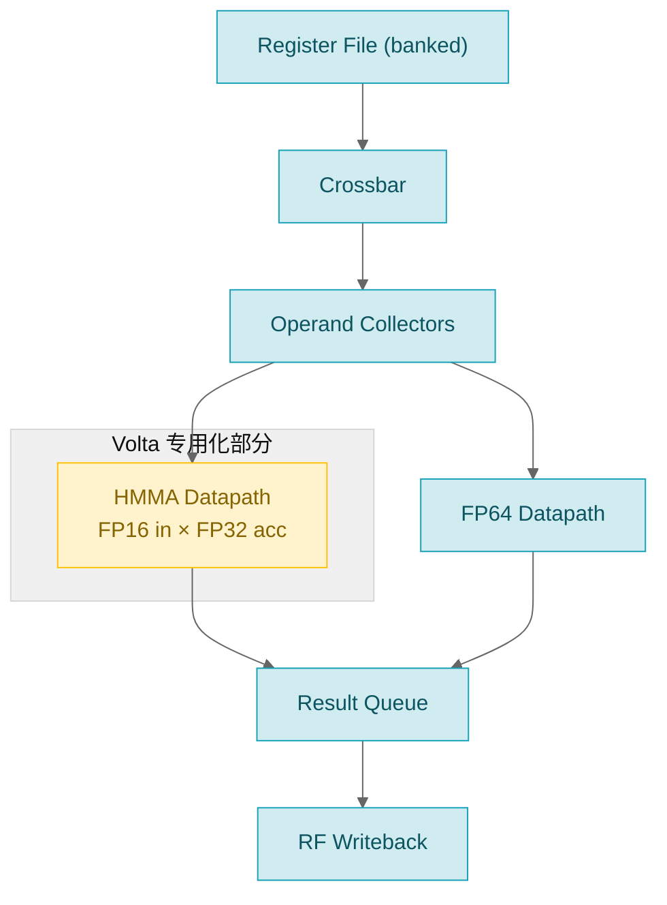

这件事的意义深远：Volta 保留原有通用路径，同时让矩阵乘加拥有独立入口、中段和结果回流组织。后续 BF16、TF32、FP8、FP4 的演进，都是沿着这条被剥离出来的路径持续下沉。

### 4.3 执行模型的改写：从隐式 Warp 锁步到独立线程调度

Volta 的第二处关键改写发生在执行模型。它保留 warp 对象本身，但把**隐式锁步前进从默认前提改写成可被显式打破和重组的执行语义**。

**Volta 之前**：同一 warp 内活动线程默认共享同一 PC，分歧时靠 active mask + reconvergence stack 串行执行，硬件认为它们最终会整齐汇合。

**Volta 之后（ITS, Independent Thread Scheduling）**：线程不再只能被当作默认整齐同步的 warp 单位来理解。同一 warp 内不同线程可以处在不同 PC，各自独立等待和前进。这也是为什么 `__syncwarp()` 变得重要——程序需要显式告诉硬件"这组线程此刻要求在同一个汇合点上成立共同前进"。

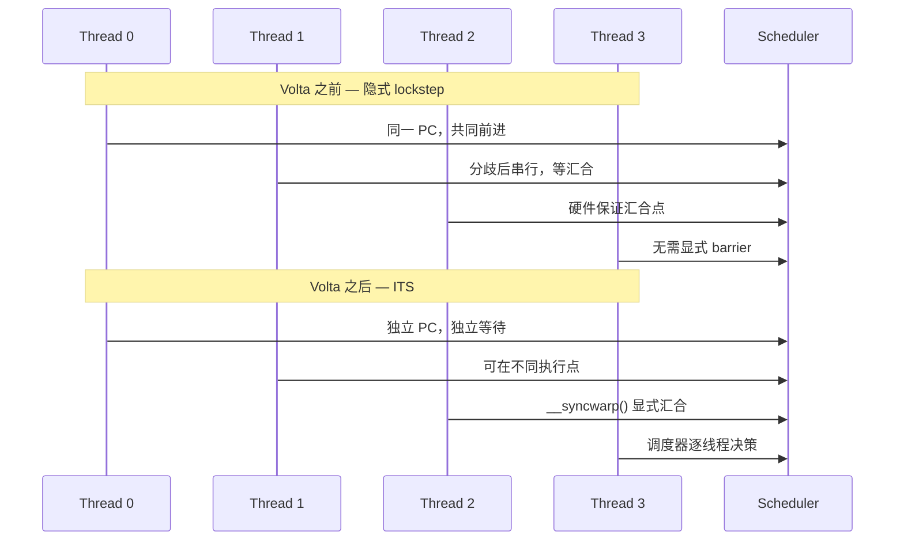

### 4.4 后续影响：Turing 与 Ampere

Volta 之后，Turing 和 Ampere 把这些新机制做成熟：

- **Turing**：精度主线正式分叉到 INT8/INT4，Tensor Core 不再只是训练加速器，开始为推理形成独立分支。同时 uniform datapath 正式落地（R2UR/S2UR/U* 指令族）。
- **Ampere**：cp.async 让 global → shared 的异步搬运成为显式协议，BF16/TF32 与结构化稀疏一起出现。专利侧还有 shard scheduling（warp 内按线程子集交错推进），提示调度粒度继续下探。

---

## 5. 第三次架构重写：Hopper — Cluster 级协同执行域

### 5.1 单 SM 之外的瓶颈

Volta 到 Ampere 解决的是单个 SM 内怎样分流、搬运和等待。到 Hopper 时代，单 SM 内部已经把矩阵算子、异步 copy 和等待机制组织得很满，下一步瓶颈变成：**多个 SM 之间怎样共享工作集，怎样让数据搬运与矩阵消费跨更大执行域闭环。**

Hopper 的架构创新不只在单 SM 的 Tensor Core 增强，而在于五层接口形成一个闭环：

| 层次 | 机制 | 解决的问题 |
|------|------|-----------|
| 数值契约 | FP8 (E4M3/E5M2) + Transformer Engine | 低比特格式选择与 scale 管理 |
| 消费者粒度 | WGMMA | 矩阵消费从单个 warp 推到 warp group |
| 搬运路径 | TMA | 大块 tile 搬运从线程循环移到专用硬件 |
| 共享作用域 | Thread Block Cluster + DSM | shared memory 协作从单 SM 扩到一组共同调度的 SM |
| 异步与 Barrier | Transaction-Aware Barrier | barrier 不只等线程到达，也等数据搬运完成 |

### 5.2 DSM：跨 SM 的分布式共享内存

专利 US20230289189A1（申请于 2022 年）把 shared memory 的有效作用域从单 SM 扩到 cluster，形成 DSM（Distributed Shared Memory）。

关键理解：DSM 是**分布式共享**，不是所有 block 共用一块无归属的大 shared memory。每个 thread block 仍有自己的 per-block shared memory 分片，DSM 做的是把同一个 cluster 内这些分片映射进一个可跨 block 访问的地址空间。

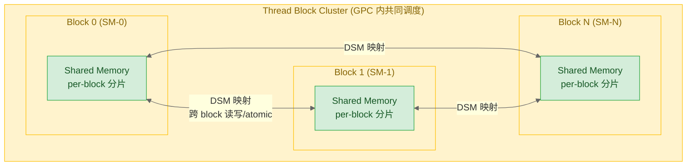

CUDA compute capability 9.0 明确：cluster 内的 thread blocks 保证共同调度到一个 GPC 上，可访问彼此的 shared memory 分片。Block 间过去只能靠 global memory 交换状态，到了 cluster 可以在硬件保证的共同驻留范围内同步和共享数据。

### 5.3 TMA：张量块搬运的专用硬件路径

专利 US12141082B2（申请于 2022 年）让大块 tile 搬运脱离传统 LSU 直通路径，形成 TMA（Tensor Memory Accelerator）。

Ampere 的 cp.async 已经让 global → shared 的 copy 异步化，但地址生成、循环切分和 copy 编排仍由线程承担。Hopper 的 TMA 把 tensor tile 的维度、stride、边界和布局放进 descriptor，由单个发起线程提交大块异步搬运，后续地址生成和数据移动由硬件处理。

**关键**：生产者线程从逐段搬运中解放出来，矩阵主循环围绕大块 tile 的生产、等待和消费来调度。

### 5.4 Transaction Barrier：数据到达即等待

专利 US20230289242A1（申请于 2022 年）让 barrier 不只等待线程到达，也等待 transaction arrival。

传统 barrier 只回答"线程都到齐了吗"；transaction-aware barrier（mbarrier）还要回答"承诺的数据搬运都完成了吗"。这对 WGMMA 消费很关键——只看线程到达而不看 copy transaction 完成，就会把"发起了搬运"和"数据已可被消费"混在一起。

```text
Hopper mbarrier 的等待状态同时包含：
  - thread arrival count（多少线程到达了 barrier 点）
  - transaction arrival count（多少搬运事务完成了）
  → 两者都满足才释放等待的消费者
```

### 5.5 WGMMA：Warp-Group 级矩阵消费

WGMMA（Warp-Group MMA）把矩阵消费从单个 warp 推到 warp group（4 个 warp，共 128 线程）。

PTX 手册将 `wgmma.mma_async` 写成 warpgroup-level MMA，要求 warpgroup 内所有线程执行同一条 `.aligned` 指令。它需要的就绪条件远超出单线程或单 warp：

```text
WGMMA-ready = resident tile + transaction completion + visibility + group release
```

### 5.6 Hopper 的 Producer-Consumer 闭环

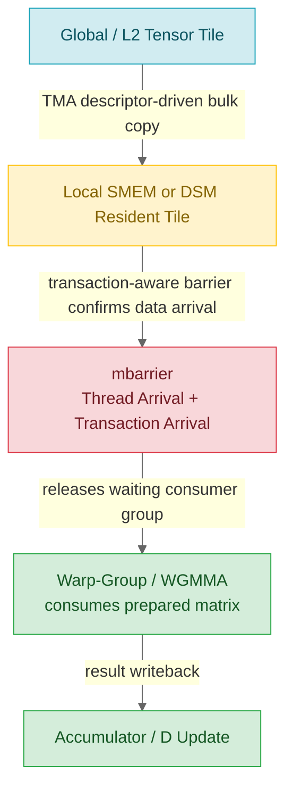

Hopper 的历史地位：**把 GPU 从以单 SM 为主要 shared-memory 协同与共享状态边界的机器，推向 Thread Block Cluster / DSM 这一类 cluster 级协同执行机器。**

---

## 6. Blackwell：问题向 Package 与 Chiplet 边界外推

### 6.1 双 Die 单 GPU：封装内互连重构

官方材料将 Blackwell 写成 two reticle-limited dies、10 TB/s chip-to-chip interconnect 和 unified single GPU。核心变化发生在过去默认绑定在一起的两件事之间：**软件看到的 GPU 仍是统一 CUDA 对象，物理实现却由两个 GPU die 和封装内高速互连共同组成。**

```text
软件视图：一个 CUDA GPU
物理实现：die 0 ↔ package chip-to-chip fabric ↔ die 1
```

### 6.2 FP4/MX 与第二代 Transformer Engine

如果只写 FP8 → FP4，会误以为只是 payload 位宽减半。实际上更关键的是 scale、metadata、block size、packing 和格式选择也进入了矩阵任务描述空间。

Blackwell 的低比特是一组组合契约：

```text
payload bits
  + scale factor
  + block granularity
  + metadata / packing
  + Transformer Engine format policy
```

NVFP4 技术博客将其描述为 micro-block scaling、E4M3 scale factor、Hadamard reshape、2D block quantization 和 stochastic rounding 共同成立的一套 recipe。Blackwell 的性能提升（FP8/FP6 20 PFLOPS ≈ 2.5× Hopper，FP4 40 PFLOPS ≈ 5× Hopper）来自低比特 Tensor Core、HBM 容量/带宽、NVLink collective 和软件栈的共同作用。

### 6.3 TMEM：显式 Tensor 近端存储

这是 Blackwell 与 Hopper 最关键的差别之一。根据 CUDA Binary Utilities 的 Blackwell 指令集：

- `tmem[URX]` 被列为合法存储位置
- `LDT/LDTM`：从 Tensor Memory 载入矩阵到寄存器文件
- `STT/STTM`：从寄存器文件写回 Tensor Memory
- `UTCCP/UTCSHIFT`：shared memory 与 Tensor Memory 之间的搬运和重排

TMEM 关心的不止是"怎样把 tile 送到 SMEM/DSM"，还包括哪些 operand、accumulator、scale 和 metadata 应该停在 Tensor Core 更近的专用存储层里。

### 6.4 与 Hopper 的关键差异：从 Warpgroup Collective 到 Single-Thread Issue

Blackwell 取消/替换的是 Hopper 那种显式 WARPGROUP / WGMMA 风格的 SASS 编码与执行接口，新主线变成 `tcgen05.mma`、OMMA/QMMA、TMEM 与 UTC* 这组对象。

| 对比维度 | Hopper WGMMA | Blackwell tcgen05 |
|----------|-------------|-------------------|
| 发起语义 | warpgroup collective issue | single-thread semantics |
| Accumulator 位置 | 分布在参与线程的寄存器 fragment | TMEM（per-CTA 二维片上存储） |
| Operand 位置 | SMEM / DSM 常驻 tile | A 在 TMEM 或 shared，B 在 shared |
| 等待协议 | wgmma.wait_group | TMEM 驻留 + tcgen05 CTA/CTA-pair 协议 |
| 核心指令 | wgmma.mma_async | tcgen05.mma |

关键变化：矩阵指令的"语义中心"从 warpgroup 持有的寄存器 fragment，迁移到 TMEM 中的矩阵状态 + descriptor 描述符 + tcgen05 指令协议。

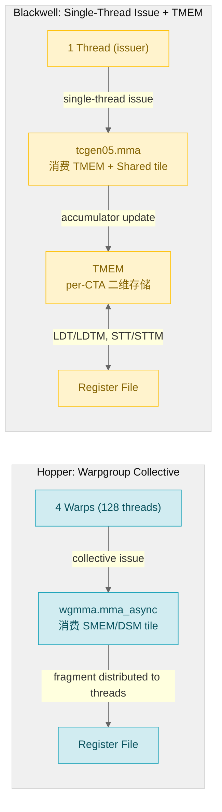

Blackwell 传递的信息不是故事完结，而是问题已从 SM 内部扩展到 package、fabric、format 与协同域的整体组织。

---

## 7. 技术维度演进总览

### 7.1 执行模型：从 Warp Lockstep 到 Cluster 级协同 Launch

| 代际 | 执行模型变化 | 关键机制 |
|------|-------------|----------|
| Tesla → Pascal | warp 为默认同步前进单位 | active mask + reconvergence stack |
| Volta | 线程独立前进（ITS） | `__syncwarp()`, BSSY/BSYNC |
| Ampere | 调度粒度继续下探 | shard scheduling（专利） |
| Hopper | cluster 级协同 launch | CGA, cluster barrier |
| Blackwell | 单线程发起矩阵任务 | single-thread issue semantics |

### 7.2 供数链：从 RF/Collector 到 cp.async/TMA 驱动的 Staging

| 代际 | 供数链变化 | 关键机制 |
|------|-----------|----------|
| Tesla/Fermi | RF → ALU 直连 | banked RF |
| Kepler | RF → crossbar → collector | operand collector（靠近算子的暂存复用层） |
| Volta | 矩阵路径独立供数 | RF → crossbar → collectors → HMMA |
| Ampere | 异步 staging 剥离 | cp.async（global → shared 异步 copy） |
| Hopper | 大块 tile 搬运交给专用单元 | TMA（descriptor-driven bulk copy） |
| Blackwell | Tensor Core 近端显式存储 | TMEM + LDT/LDTM + STT/STTM |

### 7.3 精度体系：从通用浮点到按计算语义分流的格式体系

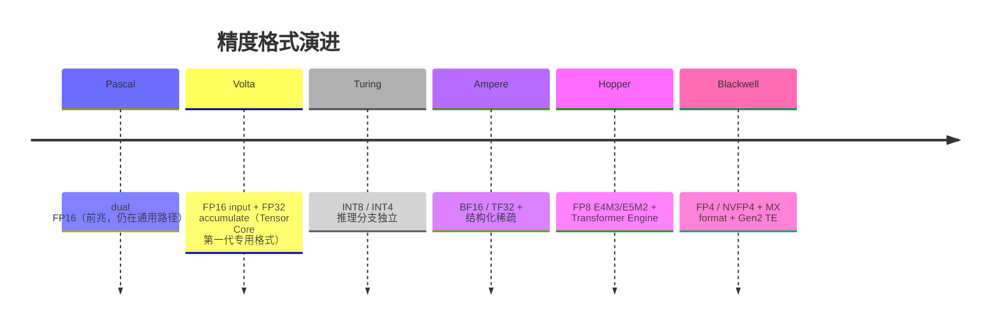

精度演进的主题不是格式越来越多，而是**格式开始服务不同计算语义与不同吞吐路径**：训练用 BF16/TF32/FP8，推理用 INT8/INT4/FP4。

### 7.4 同步原语：从寄存器相关性到 Transaction 与 Domain

| 代际 | 同步对象 | 关键机制 |
|------|---------|----------|
| Tesla | pending write, scoreboard | 指令能否发出（硬件隐式） |
| Maxwell | 可编程 barrier | software scoreboard + convergence barrier |
| Volta | 显式 warp sync | `__syncwarp()`, DEPBAR |
| Ampere | execution barrier 元数据 | Join/Wait/Cancel 稳定化 |
| Hopper | transaction + domain | mbarrier（线程 + 事务到达）、memory sync domain |
| Blackwell | TMEM 驻留 + task descriptor | tcgen05 CTA-pair 协议 |

### 7.5 互连架构：从片上 Crossbar 到跨 GPU 与跨封装协同

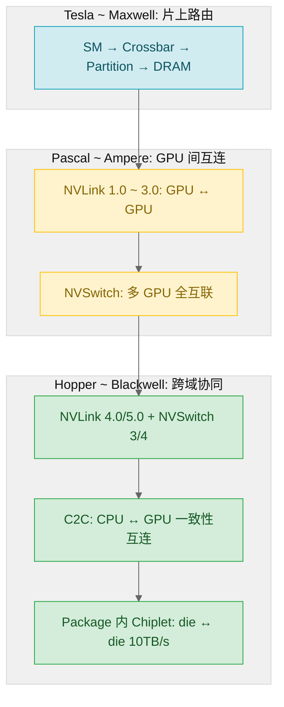

互连不再只是"带宽是否够"，而是回答**协同边界应扩展到何处、一致性和可见性如何保障**。

---

## 8. SASS 指令集：架构演进的指令层投影

### 8.1 各代 SASS 关键变化

指令集层不是与前面维度平行的物理主线，而是硬件边界变化在机器指令层的投影。一旦一个新机制稳定出现在 SASS 中，说明编译器、汇编器和工具链都必须正面处理它。

| 代际 | 新增关键指令/对象 | 退场指令/对象 | 反映的架构变化 |
|------|------------------|-------------|---------------|
| Maxwell/Pascal | 传统 SIMT, LD/ST, texture | — | 通用、锁步、单 SM 为主 |
| Volta | BSSY/BSYNC, WARPSYNC, DEPBAR, HMMA/IMMA | SSY/SYNC, XMAD | ITS 执行模型 + 矩阵路径分流 |
| Turing | R2UR/S2UR, UIADD3/UIMAD..., BMMA, LDSM | — | uniform datapath 落地 + INT8/4 矩阵 |
| Ampere/Ada | LDGSTS, LDGDEPBAR, DMMA, F2IP/I2FP | — | cp.async staging + 矩阵路径扩张 |
| Hopper | UTMA\*, UCGABAR\_\*, WARPGROUP, UBLK\*, ENDCOLLECTIVE, SYNCS, PREEXIT | — | cluster 协同 + TMA + warp-group MMA |
| Blackwell | OMMA/QMMA, LDT/LDTM, STT/STTM, UTC\*, UGETNEXTWORKID, UF\*/UI\* 变体 | WARPGROUP, 部分 \*GMMA 形式 | TMEM 显式对象 + single-thread MMA issue |

### 8.2 指令变化与三条架构重写的对应

| 架构重写 | 指令集证据 |
|----------|-----------|
| Fermi: memory-side 控制域 | L2/partition 成为 load/store 的后端处理域（间接证据，SASS 层不直接体现 cache policy modifier） |
| Volta: 执行/供数路径分流 | HMMA/IMMA 出现（矩阵路径写成 SASS 对象）；BSSY/BSYNC 替代 SSY/SYNC（执行模型改写） |
| Hopper: cluster 级协同 | UTMA\*/UCGABAR\_\*/WARPGROUP 成组出现（搬运/同步/协同对象不再局限于单个 warp/SM） |
| Blackwell: package 边界外推 | OMMA/QMMA 替代 WGMMA 风格（矩阵任务从 warpgroup 表面下沉到 TMEM + descriptor） |

---

## 9. LLM 与 GPU 架构的协同演进

### 9.1 Transformer 对 GPU 架构的反向塑造

GPU 架构从通用计算走向专用化，与 LLM/Transformer 的崛起有直接因果关系。Transformer 的核心计算模式——大规模矩阵乘（QKV 投影、FFN）、softmax reduction、layer norm——不同于传统 HPC 或图形工作负载，对 GPU 提出了新的需求：

| Transformer 计算特征 | 对 GPU 架构的驱动 | 对应代际 |
|---------------------|-------------------|----------|
| 矩阵乘占主导（>90% FLOPs） | Tensor Core 的引入与持续增强 | Volta → Blackwell |
| 训练需高精度，推理可量化 | 精度路径分叉（FP16/BF16/TF32 vs INT8/FP8/FP4） | Turing → Blackwell |
| 模型参数指数增长 | HBM 容量/带宽、NVLink 域扩张 | Ampere → Blackwell |
| Attention 的 softmax/mask | 非矩阵算子仍需通用 FPU 路径 | 所有代际通用路径持续保留 |
| 分布式训练（TP/PP/DP） | NVSwitch、SHARP in-network reduction | Hopper → Blackwell |

### 9.2 训练 vs 推理的不同需求

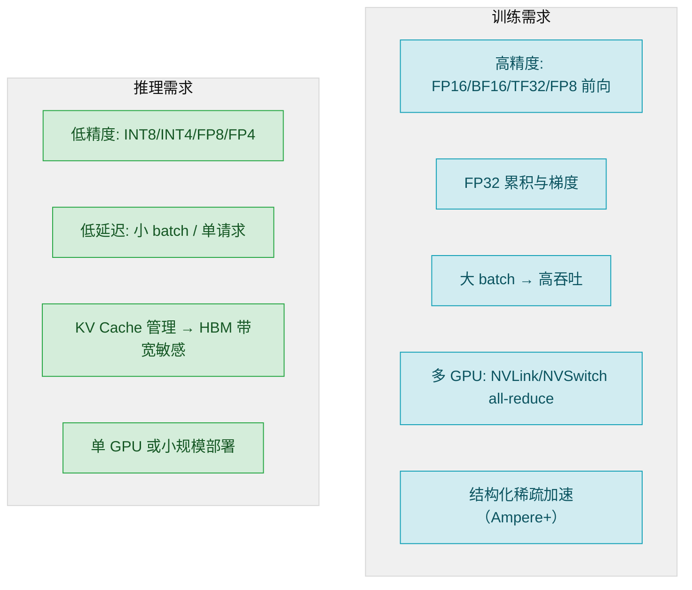

这种训练/推理需求的分叉，对应了 GPU 架构的两个演进方向：

- **训练方向**：高吞吐 Tensor Core + FP8 Transformer Engine + NVSwitch 大数据域
- **推理方向**：低比特 INT4/FP4 + 更大 HBM 容纳 KV Cache + 单 GPU 或小集群

### 9.3 从 H100 到 B200：LLM 时代的硬件加速路径

Hopper（H100）到 Blackwell（B200）的演变，与 LLM 规模的增长直接对应：

| LLM 趋势 | Hopper 的应对 | Blackwell 的进一步推进 |
|----------|-------------|---------------------|
| 模型变大（GPT-4 级别） | HBM3 80GB, NVSwitch 4 全互联 | HBM3e 192GB, NVLink 5 + NVSwitch 4, NVL72 |
| 训练精度降低（FP8） | Transformer Engine + FP8 E4M3/E5M2 | Gen2 TE + FP4/MX micro-scaling |
| Token 生成（推理） | INT8 Tensor Core | FP4 + TMEM 近端存储加速 tile 消费 |
| 分布式推理管道 | TMA 异步 tile 搬运 | die-to-die 10TB/s + 更大 fabric |
| Mixture-of-Experts (MoE) | — | 双 die 单 GPU（更多 SM 并行处理 expert） |

---

## 10. 三次架构重写的设计哲学

### 10.1 Fermi：控制语义从 SM 内部向 Memory-Side 外扩

**核心哲学**：让软件可以观察和控制"数据在 memory 层次中怎样流动"。不再把 memory-side 当作被动后台，而是将 L2/partition、cache policy、atomic 顺序写成一个稳定的软件界面。

### 10.2 Volta：执行与供数从通用机器向专用机器分流

**核心哲学**：不再把所有计算按同一套执行/供数协议处理。按**数据形态**（矩阵 vs 标量 vs warp-uniform）和**执行形态**（独立线程 vs warp 锁步）拆分成不同路径。

特别需要指出：这种分流不是按 FP vs INT 简单拆寄存器——真正值得单独分出来的，取决于"数据如何被使用"：warp-uniform 值适合统一广播路径（URF），矩阵 tile 走 HMMA 专用 datapath，barrier/predicate 走专用状态存储。

### 10.3 Hopper：协同边界从单 SM 向 Cluster、互连和封装层外推

**核心哲学**：单个 SM 已不是瓶颈，"如何在更大硬件域内安全、高效地共享和消费数据"才是。DSM、TMA、transaction barrier、WGMMA 这四条机制必须配合使用才有意义。

---

## 11. 十代架构总览

| 代际 | 关键贡献 | 与 LLM 的关系 | 对后续的影响 |
|------|---------|-------------|-------------|
| Tesla (2006) | SIMT + warp lockstep, crossbar + VC | 尚无直接关系 | 定义了基线机器 |
| Fermi (2010) | L2/partition 从被动缓存变软件可调优域 | — | 重写 memory-side 控制边界 |
| Kepler (2012) | collector cache 供数闭环 | — | SM 侧供数整理 |
| Maxwell (2014) | software scoreboard, convergence barrier | — | 同步从 busy-bit 推至 barrier 化 |
| Pascal (2016) | dual FP16, NVLink 1.0 | FP16 为首次矩阵加速试水 | 互连语义化的起点 |
| Volta (2017) | Tensor Core (HMMA), ITS | FP16 训练（BERT/GPT 早期） | 改写执行/供数两条线 |
| Turing (2018) | INT8/INT4 Tensor Core, uniform datapath | 推理加速起步 | 精度路径分叉 |
| Ampere (2020) | cp.async, BF16/TF32, 结构化稀疏 | GPT-3 级训练主流平台 | 新机制成熟化 |
| Hopper (2022) | cluster DSM, TMA, WGMMA, FP8+TE | GPT-4 级训练 + FP8 | 协同边界外扩至 cluster |
| Blackwell (2024) | 双 die 单 GPU, FP4/MX, TMEM, tcgen05 | 更大模型 + 更低比特 | package/fabric 边界外推 |

---

## 12. 要点回顾

| 要点 | 说明 |
|------|------|
| 四条边界的持续外扩 | 执行域、供数域、同步域、协同边界——每一代打破至少一个 |
| 三次架构重写 | Fermi 推 memory-side、Volta 分流 datapath + 改写执行模型、Hopper 扩到 cluster 协同 |
| 专利是架构证据 | US9639479B2 (Fermi)、US10338919B2 (Volta)、US20230289189A1 (Hopper) 分别对应三次重写的核心硬件变更 |
| Tensor Core 的专用化路径 | 不是通用 FPU 的增强，而是独立 datapath + 独立精度体系 + 独立供数控链 |
| Hopper 的 cluster 闭环 | DSM + TMA + mbarrier + WGMMA 必须配合使用，"只看一个模块会误读历史地位" |
| Blackwell 的 TMEM | 矩阵指令语义中心从 warpgroup 寄存器 fragment → TMEM + descriptor。发起语义从 collective → single-thread |
| LLM 驱动精度下沉 | 训练 FP8 → FP4，推理 INT8/4 → FP4。低比特不只是位宽减半，而是 scale + metadata + packing 的组合契约 |
| SASS 为旁证 | 指令成组出现/退场反映硬件状态、等待对象和协同边界的变化 |

---

## 参考资料

- [理解 NVIDIA GPU 迭代的脉络（知乎原文）](https://zhuanlan.zhihu.com/p/2031795257612953005) — 本文的核心内容来源
- [NVIDIA CUDA C Programming Guide — Thread Block Clusters](https://docs.nvidia.com/cuda/cuda-c-programming-guide/index.html#thread-block-clusters) — Hopper cluster 编程模型
- [NVIDIA Blackwell Tuning Guide](https://docs.nvidia.com/cuda/archive/12.8.0/blackwell-tuning-guide/index.html) — Blackwell 调优指南
- [NVFP4 Trains with Precision of 16-Bit and Speed and Efficiency of 4-Bit](https://developer.nvidia.com/blog/nvfp4-trains-with-precision-of-16-bit-and-speed-and-efficiency-of-4-bit/) — Blackwell FP4 技术细节
- [LLM注意力机制发展与演进](./LLM注意力机制发展与演进.md) — 同目录下 LLM 注意力机制相关文档
- US9639479B2 — Fermi L2/partition 控制域（申请于 2010 年）
- US10338919B2 — Volta HMMA datapath（申请于 2017 年）
- US20230289189A1 — Hopper DSM cluster 共享内存（申请于 2022 年）
- US12141082B2 — Hopper TMA 张量搬运（申请于 2022 年）
- US20230289242A1 — Hopper transaction-aware barrier（申请于 2022 年）
</^parameter>
</^invoke>
</tool_calls>