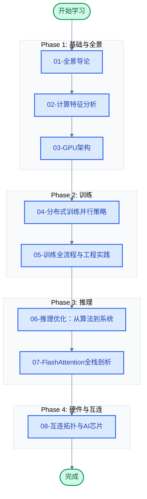

# LLM 训练与推理学习笔记

> 从软件架构到芯片架构，全栈视角理解 LLM 训练推理的瓶颈映射与优化实践。

## 文档索引

| 序号 | 文档 | 核心问题 | 建议学时 |
|------|------|----------|----------|
| 01 | [全景导论](./01-全景导论.md) | 为什么必须全栈视角？ | 4h |
| 02 | [Transformer计算特征第一性分析](./02-Transformer计算特征第一性分析.md) | 每个算子到底算多少、访多少？ | 10h |
| 03 | [GPU架构：从SIMT到TensorCore](./03-GPU架构-从SIMT到TensorCore.md) | 硬件如何执行我的Kernel？ | 8h |
| 04 | [分布式训练并行策略](./04-分布式训练并行策略.md) | 模型放不下怎么办？通信代价多大？ | 10h |
| 05 | [训练全流程与工程实践](./05-训练全流程与工程实践.md) | 从预训练到RLHF怎么跑？ | 8h |
| 06 | [推理优化：从算法到系统](./06-推理优化-从算法到系统.md) | 自回归解码的带宽瓶颈怎么破？ | 8h |
| 07 | [FlashAttention全栈剖析](./07-FlashAttention全栈剖析.md) | 一个算子如何从算法优化到硬件？ | 8h |
| 08 | [互连拓扑与AI芯片](./08-互连拓扑与AI芯片.md) | 通信需求如何决定硬件选型？ | 6h |

**总计约 62 学时**

## 专题笔记

| 文档 | 概要 |
|------|------|
| [LLM注意力机制发展与演进](./LLM注意力机制发展与演进.md) | 注意力机制从MHA到MLA的技术演进 |
| [NVIDIA-GPU架构演进与LLM](./NVIDIA-GPU架构演进与LLM.md) | GPU架构从Tesla到Blackwell的演进主线 |
