# NVIDIA GPU 架构演进：从 Tesla 到 Blackwell

> 如果把 NVIDIA GPU 近二十年的架构演进概括成一句话，核心主线就是**执行域、数据供给域、同步域与协同边界持续向外扩展**；功能堆叠只是表层现象。
> **工程师视角**：理解每一代"卡在哪里 → 引入什么机制 → 新矛盾推到哪里"，比记住新增特性清单重要得多。本文从专利、官方文档和指令集三个层面交叉印证这条主线。

### 关键术语

| **缩写** | **全称** | **含义** |
|------|------|------|
| SM | Streaming Multiprocessor | 流式多处理器，GPU 的基本执行单元 |
| GPC | Graphics Processing Cluster | 图形处理集群，多个 SM 的上级组织单位 |
| RF | Register File | 寄存器文件，线程私有存储 |
| LSU | Load/Store Unit | 加载/存储单元，处理内存访问指令 |
| ALU | Arithmetic Logic Unit | 算术逻辑单元 |
| FPU | Floating Point Unit | 浮点运算单元 |
| FMA | Fused Multiply-Add | 融合乘加运算 |
| HMMA | Half-precision Matrix Multiply-Accumulate | 半精度矩阵乘加（Tensor Core 指令） |
| WGMMA | Warp-Group Matrix Multiply-Accumulate | Warp 组级矩阵乘加（Hopper） |
| SIMT | Single Instruction Multiple Threads | 单指令多线程，GPU 的执行模型 |
| CTA | Cooperative Thread Array | 协作线程数组（即 Thread Block） |
| CGA | Cooperative Grid Array | 协作网格数组（Hopper 的 cluster 级对象） |
| ITS | Independent Thread Scheduling | 独立线程调度（Volta 引入） |
| DSM | Distributed Shared Memory | 分布式共享内存（Hopper cluster 内跨 SM） |
| TMA | Tensor Memory Accelerator | 张量内存加速器（Hopper 的专用数据搬运单元） |
| TMEM | Tensor Memory | 张量内存（Blackwell 的 Tensor Core 近端存储） |
| HBM | High Bandwidth Memory | 高带宽内存，通过硅中介层与 GPU 封装互联 |
| NVLink | — | NVIDIA 的 GPU 间高速互连 |
| NVSwitch | — | NVIDIA 的 GPU 间交换芯片 |
| TE | Transformer Engine | Transformer 引擎（Hopper 的 FP8 精度管理层） |
| SHARP | Scalable Hierarchical Aggregation and Reduction Protocol | 可扩展层次聚合归约协议（NVSwitch 内的网内归约） |
| GQA | Grouped-Query Attention | 分组查询注意力（KV 头数 < Query 头数） |
| MoE | Mixture of Experts | 混合专家模型（稀疏激活） |
| TP | Tensor Parallelism | 张量并行 |
| PP | Pipeline Parallelism | 流水线并行 |
| DP | Data Parallelism | 数据并行 |
| PC | Program Counter | 程序计数器 |
| HPC | High Performance Computing | 高性能计算 |
| SXM | Server PCI Express Module | 服务器 PCIe 模块（NVIDIA 高功耗 GPU 封装形式） |
| SASS | Streaming ASsembly | 流式汇编（NVIDIA GPU 机器指令集） |
| PTX | Parallel Thread Execution | 并行线程执行（NVIDIA 中间指令集） |
| GEMM | General Matrix Multiply | 通用矩阵乘法 |
| MHA | Multi-Head Attention | 多头注意力 |
| MLA | Multi-head Latent Attention | 多头潜在注意力（DeepSeek-V2/V3 使用） |
| MIG | Multi-Instance GPU | 多实例 GPU（Ampere 引入，单 GPU 切分为多实例） |
| LLM | Large Language Model | 大语言模型 |
| NRZ | Non-Return-to-Zero | 不归零编码（信号调制方式） |
| PAM4 | Pulse Amplitude Modulation 4-level | 四电平脉冲幅度调制（信号调制方式） |
| ECC | Error Correction Code | 纠错码 |
| OCP | Open Compute Project | 开放计算项目（FP8 格式的行业标准组织） |

---

## 1. 概述

### 1.1 前置知识

| **需要了解** | **参考文档** |
|----------|----------|
| GPU 基本架构（SM、Warp、显存层次） | NVIDIA CUDA Programming Guide |
| Transformer / LLM 基本结构 | [LLM注意力机制发展与演进](./LLM注意力机制发展与演进.md) |
| CUDA 编程模型（Thread Block, Grid） | NVIDIA CUDA Programming Guide |

### 1.2 核心主线：四条边界的持续外扩

NVIDIA GPU 最初是一台相对简单的机器：以 warp 锁步为默认执行方式、以 RF → ALU 近端通路为数据搬运路径、以寄存器依赖和 busy-bit 为同步手段、以单 SM 为硬件协同边界。后续每一代真正重要的架构断点，都在打破其中至少一个边界。

全文围绕三个问题展开：**上一代到底卡在哪里，下一代引入了什么机制，这个机制又把新矛盾推向哪里。**

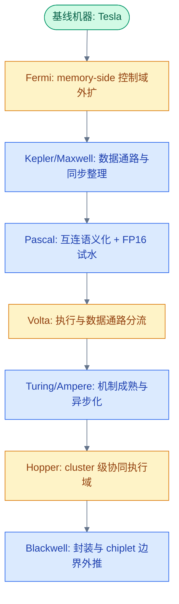

近二十年的主线可归纳为三层压力：

- **memory-side 的控制与语义压力**：当 L2 缓存、atomic 操作、数据驻留策略、一致性语义从底层实现细节上升为软件可见的硬件抽象，memory-side 必须成为独立的硬件域。
- **数据通路专用化压力**：当矩阵计算、低比特格式、warp-uniform 数据流难以继续沿用同一条通用路径，执行与数据供给就必须分流。
- **协同压力**：当 cp.async、TMA、WGMMA、cluster 协同成为主要机制后，同步原语和互连边界都必须升级。

### 1.3 各代旗舰数据中心 GPU 规格总览

下表列出每代代表性数据中心 GPU 的核心规格，供后文引用。注意：不同封装（SXM vs PCIe）的规格可能不同，此处以 SXM 版本为准。

| **规格** | **G80** | **GF110** | **GK110** | **GM200** | **GP100** | **GV100** | **GA100** | **GH100** | **GB200** |
|------|------|-------|-------|-------|-------|-------|-------|-------|-------|
| **世代** | Tesla | Fermi | Kepler | Maxwell | Pascal | Volta | Ampere | Hopper | Blackwell |
| **代表产品** | Tesla D870 | Tesla M2090 | Tesla K40 | Tesla M40 | Tesla P100 | V100 SXM2 | A100 SXM4 | H100 SXM5 | B200 SXM |
| **发布年份** | 2006 | 2011 | 2013 | 2015 | 2016 | 2017 | 2020 | 2022 | 2024 |
| **制程** | 90 nm | 40 nm | 28 nm | 28 nm | 16 nm | 12 nm | 7 nm | 4 nm | 4NP |
| **芯片面积** | 484 mm² | 520 mm² | 561 mm² | 601 mm² | 610 mm² | 815 mm² | 826 mm² | 814 mm² | ~750 mm² ×2 |
| **SM 数** | 16 | 16 | 15 | 24 | 56 | 80 | 108 | 132 | 160 (2×80) |
| **CUDA Core** | 128 | 512 | 2880 | 3072 | 3584 | 5120 | 6912 | 16896 | 20480 |
| **内存类型** | GDDR3 | GDDR5 | GDDR5 | GDDR5 | HBM2 | HBM2 | HBM2e | HBM3 | HBM3e |
| **内存容量** | 1.5 GB | 6 GB | 12 GB | 12 GB | 16 GB | 16/32 GB | 40/80 GB | 80 GB | 192 GB |
| **内存带宽** | 76.8 GB/s | 177 GB/s | 288 GB/s | 288 GB/s | 720 GB/s | 900 GB/s | 2039 GB/s | 3350 GB/s | 8000 GB/s |
| **TDP** | 170 W | 250 W | 235 W | 250 W | 300 W | 300 W | 400 W | 700 W | 1000 W |
| **FP32 (TFLOPS)** | 0.35 | 1.33 | 4.29 | 6.84 | 9.3 | 14.0 | 19.5 | 67 | 90 |
| **FP16 Tensor (TFLOPS)** | — | — | — | — | — | 125 | 312 | 989 | 2250 |

> **注**：FP16 Tensor 行为密集模式峰值吞吐（FMA 计为两次运算），稀疏模式通常为密集模式的 2 倍。B200 芯片面积为单 die 面积，采用双 die 封装。H100/B200 的 FP16 Tensor 吞吐较前代显著提升，部分源于 WGMMA 指令对矩阵 tile 的更高效处理。

一个直观的类比：如果把 G80 比作一条单车道乡间公路，B200 就是一条 16 车道的高速公路——但真正重要的不是车道数增加了多少，而是**交通规则、信号灯、匝道设计**全部重写了。

---

## 2. 基线机器：Tesla（2006）

### 2.1 SIMT 与 Warp 锁步执行模型

Tesla（G80，2006 年发布）固定了几条最基础的边界：

- **SIMT + warp 锁步执行**：同一 warp 内的 32 个线程共享同一份程序计数器（PC），以锁步方式共同前进。分支分歧时通过 active mask + reconvergence stack 让不同路径串行执行。
- **单 SM 为协同边界**：shared memory、scoreboard、执行调度都在一个 SM 内部完成。
- **RF → ALU 近端通路为数据搬运路径**：banked RF（专利 US7339592B2、US7490208B1）将源操作数读出后送入执行单元。

可以把 warp 想象成一列火车：32 节车厢必须同时到站、同时出发。如果某节车厢的乘客需要下车（分支分歧），整列火车就停下来，先送一批人去 A 站，再回来送另一批人去 B 站——两条路径只能串行执行。这种"等齐了再走"的模式简单粗暴，但在早期工作负载下足够用。

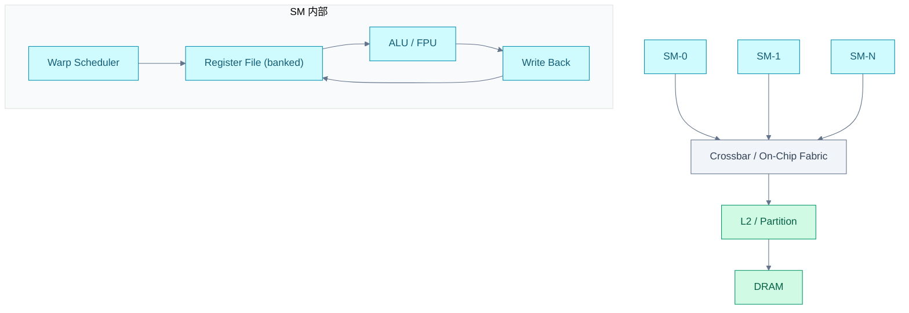

### 2.2 片上流量组织：Crossbar 与 Virtual Channels

GPU 从第一代起就需要一套能同时承接多客户端、多目的端、多类请求的统一交换层。多个 SM/GPC 并发争用共享 memory-side 资源，图形与计算流量可能同时存在，芯片不可能为每一类流量单独部署一套互连。

专利 US8539130B2（申请于 2009 年）表明，最晚到 Tesla 代际，NVIDIA 已将 crossbar + virtual channels 作为正式的架构问题写入专利。Virtual channels 的核心思路是：在同一套物理 crossbar 上，按流量类别（compute / memory / graphics）切成逻辑隔离的通道，避免队头阻塞（head-of-line blocking）——队头请求因目标端繁忙而卡住时，后面本可发往空闲目标的请求也被拖住。

```text
无 Virtual Channels:
  SM0(mem) --\
  GPC(gfx) ---+--> [ one shared queue ] --> [ busy destination ]
  SM1(comp) --/
  所有不相关流量都被队头阻塞拖住

有 Virtual Channels:
  SM0(mem)  ----> [ VC-memory   ] --> memory path
  GPC(gfx)  ----> [ VC-graphics ] --> graphics path
  SM1(comp) ----> [ VC-compute  ] --> compute path
  各流量独立排队，通过仲裁共享后端交换资源
```

这个设计思路贯穿至今——即使到 Blackwell 的片上互连，流量隔离仍是基本需求。

> **注**：G80 发布于 2006 年，而 US8539130B2 申请于 2009 年。该专利足以支撑"片上流量组织很早就是基础问题"这一判断，但不能单凭此专利反推 G80 已采用完全同名的实现。

---

## 3. 第一次架构重写：Fermi — memory-side 控制域的确立

### 3.1 为什么 memory-side 需要成为独立控制域

Tesla 时代的 memory-side 更像是"地址请求最终落到哪里"的实现细节，尚未成为稳定的软件可见控制边界。Fermi 改变了这一点：**global 访问不再只是把地址送到 DRAM 再取回数据，软件开始需要区分访问意图**——哪些数据应该缓存、哪些只是流式读取、哪些希望弱化局部副本。

从 SM 本地执行视角看，Fermi 仍是由 dual warp scheduler + instruction dispatch 驱动的单 SM 机器。这说明它的关键转折不在执行域外扩，而在于 memory-side 控制点第一次被确立为稳定的硬件边界。

三个直接原因推动了这一改变：

1. **global 访问意图分化**：软件需要区分缓存、流式读取、write-through 等不同路径。
2. **请求路由的地址稳定性**：L1 是每个 SM 本地私有的，不能作为不同 SM 访问同一 global 地址时的共同处理节点。需要一个更靠近 L2/partition/DRAM 的统一处理节点，确保同一地址无论来自哪个 SM，都路由到同一个 L2 slice / partition。
3. **atomic 与同步下沉**：atomic 操作、写回、数据驻留等操作需要一个按地址稳定的处理点来做顺序判定。

### 3.2 L2/Partition：从被动缓存到可调优处理域

专利 US9639479B2（申请于 2010 年）是第一个关键转折点，它将以下组件确立为同一组硬件边界：

- **Partition Unit**：按地址哈希将请求路由到固定 partition
- **L2 Slice**：per-partition 的共享缓存
- **FB DRAM Interface**：通向外部显存的接口边界
- **Cache Policy Modifier**：`.cg` / `.cs` / `.cv` / `.wt`

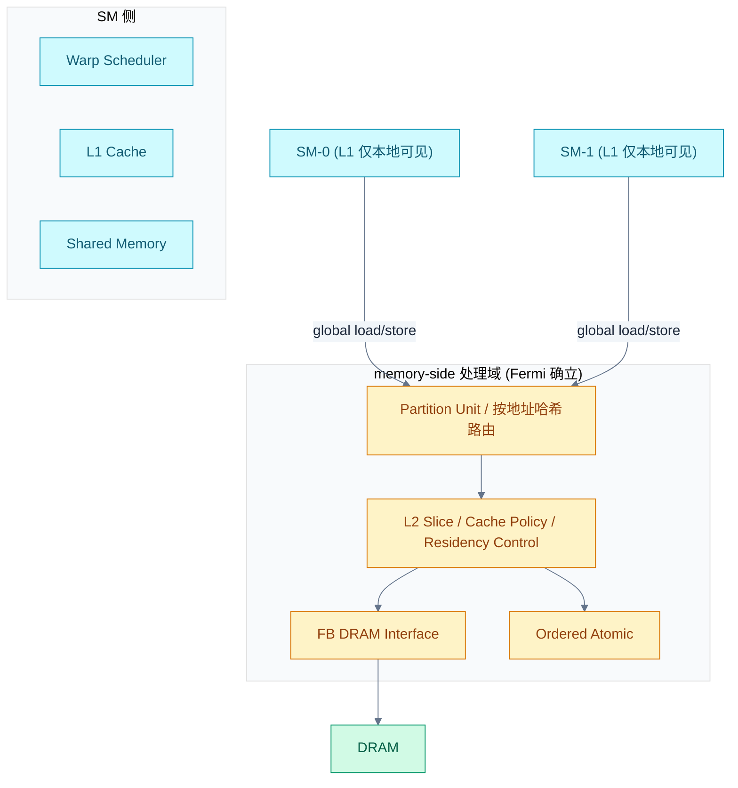

关键点：同一个 global 地址，无论来自哪个 SM，都会路由到相同的 L2 slice / partition，由该节点统一处理缓存策略、atomic 顺序、写回时机和完成路径。所谓"路由稳定"，是指同一地址始终映射到同一个 memory-side 处理节点，但不保证访问一定命中 L2，也不赋予 cache operator 同步语义。

类比：Fermi 之前，memory-side 像一个没有前台的大楼——每个 SM 自己找门进去，彼此不知道对方的状态。Fermi 给大楼装了一个统一的前台（Partition Unit），所有访客先到前台登记，前台知道谁在哪个房间、哪些房间可以共享。

### 3.3 Cache Policy Modifier：软件意图的编码

硬件只能看到地址流，而软件了解的是访问意图。Fermi 引入的 load/store policy modifier 把这种意图编码为 cache policy / locality hint：

| **Modifier** | **语义** | **典型场景** |
|----------|------|----------|
| `.cg` | 偏向 L2 级别缓存，不优先占用 L1 | 多 block 反复读取同一张参数表 |
| `.cs` | 流式数据，优先逐出 | 一次性扫描大块输入样本 |
| `.cv` | 偏向重新从内存读取，减少陈旧缓存干扰 | 读取 host 或外部 agent 更新的数据 |
| `.wt` | write-through 风格，推向 memory-side | host-mapped buffer、队列元数据 |

这些 modifier 是性能提示（PTX 语义），不改变内存一致性行为。真正的同步仍由 barrier、fence、atomic 承担。

### 3.4 Fermi 的规格与局限

Fermi GF110（Tesla M2090）是第一代面向数据中心的统一架构 GPU：16 个 SM、512 个 CUDA Core、6 GB GDDR5、177 GB/s 带宽。它的 FP64/FP32 比率为 1:2，是数据中心 GPU 中最高的双精度比率——这个数字后来再也没有被超越。

Fermi 的局限也很明显：GDDR5 带宽仅 177 GB/s，L2 容量仅 768 KB，无法支撑大规模数据集的缓存驻留。功耗 250W 在当时已经很高，但性能密度远不及后续世代。这些局限直接推动了 Kepler 和 Maxwell 在数据通路与同步机制上的改进。

---

## 4. 数据通路与同步整理：Kepler（2012）与 Maxwell（2014）

Fermi 把语义推至 memory-side 后，Kepler 和 Maxwell 在 SM 侧做配套整理。这两代没有发生架构重写，但它们补全了 Fermi 留下的数据通路和同步机制缺口，为 Volta 的更大范围改写准备了条件。

### 4.1 Kepler：数据通路闭环

Kepler（GK110，Tesla K40）的核心贡献是把 RF → crossbar → collector 数据通路闭环完善。

**Operand Collector 的意义**：在 Kepler 之前，每个执行单元每次需要操作数时都必须回 RF 重读。Kepler 引入的 collector 是靠近算子入口的操作数暂存与复用层——操作数到位后暂存在 collector 中，算子就绪即可发射，不必每次回 RF 重读。这对矩阵类计算尤其重要，因为同一组操作数会被多个 dot-product pass 复用。


Kepler 的其他改进包括：SMX 设计（每个 SMX 含 192 个 CUDA Core，大幅提升每时钟吞吐）、动态并行（Dynamic Parallelism，GPU 内核可直接启动子内核）、Hyper-Q（多个 CPU 流同时向 GPU 提交任务）。但这些更多是工程优化，而非架构边界的外扩。

**Kepler 的规格**：15 个 SMX、2880 个 CUDA Core、12 GB GDDR5、288 GB/s 带宽、FP64/FP32 比率 1:3。相比 Fermi，FP32 吞吐提升 3.2 倍，但代价是 FP64 比率从 1:2 降至 1:3。

### 4.2 Maxwell：同步从隐式走向显式

Maxwell（GM200，Tesla M40）把同步从 busy-bit 推向 barrier 化，这是同步域外扩的关键一步。

**Software Scoreboard**（专利 US9612836B2）：在 Maxwell 之前，指令能否发出由硬件隐式判断——检查寄存器依赖、等待 pending write 完成。Maxwell 将等待对象从硬件隐式判断推进为软件/编译器可显式声明：编译器在指令中标注依赖关系，硬件据此决定是否发射，不必每次都去查。

**Convergence Barrier**（专利 US10067768B2）：把分歧后的线程汇合从隐式 active mask + token stack 改成显式 barrier 机制——进入分歧区的线程先登记到 barrier，先到汇合点的线程等待，后到的继续执行；所有线程到齐后统一恢复。Volta 之后的 `__syncwarp()` 就是从这里演变而来的。

**Maxwell 的代价**：FP64 吞吐被大幅削减至 1:32（双精度仅为单精度的 1/32），这是 Maxwell 在 HPC 领域的致命短板。Tesla M40 主要面向深度学习推理而非科学计算。

**Maxwell 的规格**：24 个 SMM、3072 个 CUDA Core、12 GB GDDR5、288 GB/s 带宽。虽然 SM 数和 Core 数比 Kepler 多，但 FP32 吞吐提升主要来自更高的时钟频率和更高效的 SM 设计（每 SMM 仅 128 个 Core 但 IPC 更高）。

---

## 5. 互连语义化的起点：Pascal（2016）

Pascal 是 NVIDIA 数据中心 GPU 的转折点，但它的转折不在 SM 内部架构，而在**互连和内存介质的跃迁**。

### 5.1 HBM2：从 GDDR 到硅中介层

Pascal（GP100，Tesla P100）首次采用 HBM2 内存，带宽从 Maxwell 的 288 GB/s 跃升至 720 GB/s——2.5 倍的提升来自介质切换而非架构改进。

HBM 的核心优势在于通过硅中介层（silicon interposer）将 DRAM 裸片与 GPU 裸片封装在一起，用 4096-bit 超宽总线替代 GDDR 的 384-bit 窄总线。类比：GDDR 是一条窄但快的高速公路，HBM 是一条宽但每车道稍慢的城市主干道——总吞吐量取决于车道数 × 每车道速率，HBM 靠车道数取胜。

| **对比维度** | **GDDR5 (Maxwell)** | **HBM2 (Pascal)** |
|----------|-----------------|---------------|
| 总线宽度 | 384-bit | 4096-bit |
| 每引脚速率 | ~6 Gbps | ~1.4 Gbps |
| 堆栈数 | N/A | 4 |
| 总带宽 | 288 GB/s | 720 GB/s |
| 容量 | 12 GB | 16 GB |

### 5.2 NVLink 1.0：GPU 间互连的语义化

Pascal 引入 NVLink 1.0，首次让 GPU 间通信脱离 PCIe 的带宽限制。P100 配置 4 条 NVLink，总带宽 160 GB/s，约为 PCIe 3.0 x16（32 GB/s）的 5 倍。

NVLink 的意义不止于带宽——它让多 GPU 系统从"各自为政的独立设备通过总线通信"变成"有专用高速通道的协作集群"。这个语义转变是后续 NVSwitch、NVLink 域扩张的基础。

### 5.3 FP16：矩阵加速的首次试水

Pascal 引入原生 FP16 支持，FP16 吞吐为 FP32 的 2 倍（18.7 vs 9.3 TFLOPS）。但这时的 FP16 仍在通用 FPU 路径上执行，没有独立的矩阵加速单元——真正的 Tensor Core 要到 Volta 才出现。Pascal 的 FP16 更像是一次"探路"：验证低精度计算的市场需求，为 Volta 的专用化路径铺路。

**Pascal 的规格**：56 个 SM、3584 个 CUDA Core、16 GB HBM2、720 GB/s 带宽、NVLink 1.0（160 GB/s）、FP64/FP32 比率恢复至 1:2。

---

## 6. 第二次架构重写：Volta — 执行与数据通路的分流

### 6.1 矩阵计算的专用化需求

进入深度学习时代后，矩阵乘加已成为 GPU 的主要工作负载。但矩阵运算面临三重压力，使其难以继续沿用同一条通用 FPU 路径：

1. **吞吐压力**：矩阵 tile 上的 dot-product 吞吐需求远高于一般 FMA。
2. **数据供给方式不同**：矩阵块数据需要在算子入口附近集中暂存、反复复用，而非每步都走 RF → crossbar 全路径重取。
3. **数值类型分叉**：FP16 input + FP32 accumulate 已超出通用 FPU"多支持一种模式"的范畴。

类比：通用 FPU 像一把瑞士军刀，什么都能干但效率一般；矩阵计算像砍柴——你需要的是一把专门的斧头，而不是瑞士军刀上的小锯条。Volta 做的就是把"斧头"从"瑞士军刀"中拆出来，给它独立的把手和磨刀石。

### 6.2 HMMA Datapath：Tensor Core 的硬件实现

专利 US10338919B2（申请于 2017-11-29）直接将一条新的数据供给路径与计算执行路径确立为硬件实现：

```text
RF banks → crossbar → operand collectors → HMMA datapath → result queue → RF writeback
```

各层的分工：

- **RF banks**：线程寄存器来源，但读带宽有限，不能每个 dot-product 子步骤都重读整块矩阵。
- **Crossbar**：将寄存器值路由到正确的 operand collector。
- **Operand Collectors**：靠近 datapath 入口的向量暂存层。专利正文描述为可在多 cycle 内从 RF 预装操作数，然后在一次 MMA 执行时并行送入 datapath。同一组 A/B 向量可在多个 dot-product pass 中反复使用。
- **HMMA Datapath**：使用已就位的向量组合，生成结果矩阵中的多个元素。
- **Result Queue**：缓冲结果，等待 RF 写回仲裁。

边界澄清：专利中 Fig. 9 同时画出 HMMA datapath 930 和 FP64 datapath 940，二者共享 operand collectors 与 result queue。Volta 并未完全重构数据供给与结果写回结构，而是将矩阵 dot-product 的前半段和中段专用化。

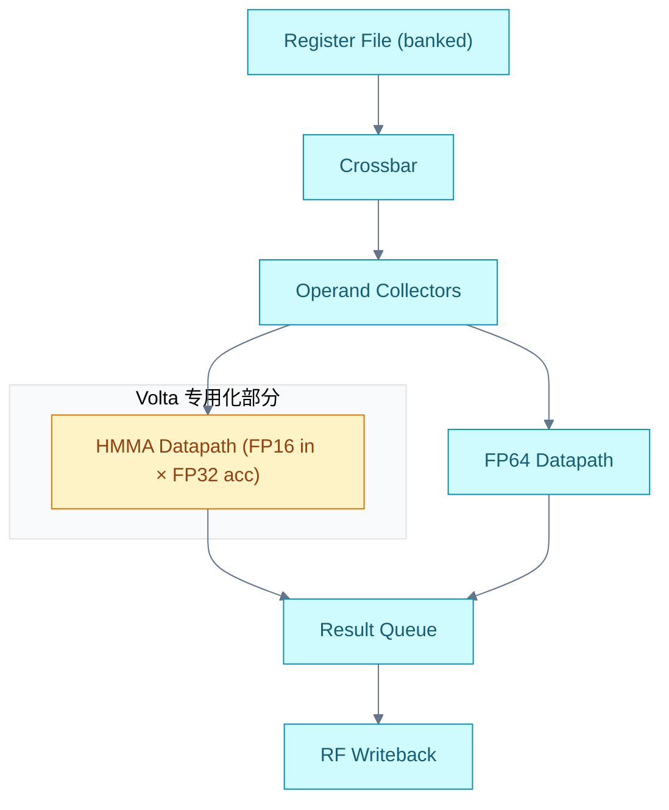

这件事的意义深远：Volta 保留原有通用路径，同时让矩阵乘加拥有独立的数据读取入口、执行中段和结果写回路径。后续 BF16、TF32、FP8、FP4 的演进，都是沿着这条独立出来的路径持续深化。

**Volta 的规格**：80 个 SM、5120 个 CUDA Core + 640 个 Tensor Core、16/32 GB HBM2、900 GB/s 带宽、NVLink 2.0（300 GB/s，首次支持缓存一致性）。FP16 Tensor Core 吞吐 125 TFLOPS，是 CUDA Core FP16（28 TFLOPS）的 4.5 倍——这是专用化路径带来的第一次显著收益。

### 6.3 执行模型的改写：从隐式 Warp 锁步到独立线程调度

Volta 的第二处关键改写发生在执行模型。它保留 warp 对象本身，但把**隐式锁步从默认行为变为可以被显式打破和重组的执行模式**。

**Volta 之前**：同一 warp 内活动线程默认共享同一 PC，分歧时靠 active mask + reconvergence stack 串行执行，硬件认为它们最终会整齐汇合。

**Volta 之后（ITS, Independent Thread Scheduling）**：同一 warp 内不同线程可以处在不同 PC，各自独立等待和前进。这也是为什么 `__syncwarp()` 变得重要——程序需要显式告诉硬件"这组线程此刻要求在同一个汇合点上同步前进"。

回到火车的类比：Volta 之前，32 节车厢必须同时到站；Volta 之后，每节车厢有了独立的刹车和加速系统，可以在不同站台停靠，但需要 `__syncwarp()` 来宣布"全体到齐，统一出发"。

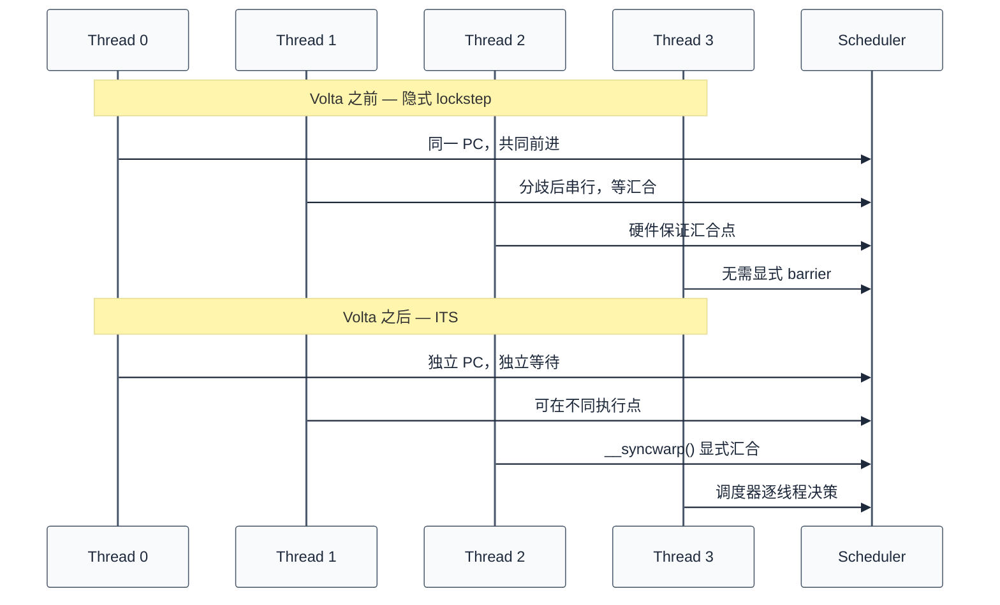

这里还需要澄清一个容易误解的点：所谓"按数据特征分流"，并不等于机械地按 FP 和 INT 将寄存器文件拆分为两套。真正需要独立路径的，取决于"数据如何被使用"——warp-uniform 值适合走统一广播路径（URF），矩阵 tile 走 HMMA 专用 datapath，barrier/predicate 走专用状态存储。硬件更应该按"数据如何被复用、广播、累加和使用"来划分数据通路，而不只按数值类型划分存储空间。

---

## 7. 机制成熟与异步化：Turing（2018）与 Ampere（2020）

Volta 之后，Turing 和 Ampere 将新机制推向成熟，同时各自引入新的分化方向。

### 7.1 Turing：精度路径正式分叉

Turing（TU102，RTX 8000）在 Volta 的基础上做了三个关键分化：

**精度主线分叉至 INT8/INT4**：Tensor Core 不再只是训练加速器，开始为推理形成独立分支。INT8/INT4 的引入意味着推理场景不再需要"降级使用 FP16"，而是有了专用路径。这对 LLM 推理至关重要——量化推理的硬件基础从这里开始。

**Uniform Datapath 落地**：R2UR/S2UR/U* 指令族让 warp-uniform 值（所有线程共享同一值）走专用广播路径，不必每个线程都从 RF 读一遍。这看似小优化，实际上是对 Volta "按数据使用方式分流"设计思路的延续：warp-uniform 值、矩阵 tile、barrier/predicate 各走各路。

**RT Core 引入**：光线追踪加速单元，与 LLM 无直接关系，但反映了 NVIDIA 的策略——为不同工作负载的专用单元持续增加芯片面积占比。

**Turing 的局限**：FP64 吞吐被削减至 1:32，不适合 HPC。Turing 在数据中心的存在感较弱，主要面向专业可视化与推理。使用 GDDR6 而非 HBM，带宽 672 GB/s 远低于同代 HBM2e 的水平。

### 7.2 Ampere：异步数据暂存与精度扩展

Ampere（GA100，A100 SXM4）是 Volta/Turing 路径成熟化的集大成者，四个关键机制同时落地：

**cp.async — global → shared 的异步搬运**：Ampere 之前，global memory 到 shared memory 的 copy 由线程循环驱动——线程发起 load，等数据回来，写 shared memory，循环。cp.async 让这个 copy 异步化：线程发起 copy 后立即返回，数据搬运在后台完成，线程通过 `cp.async.commit_group` + `cp.async.wait_group` 来等待。

这是数据供给域外扩的关键一步：**数据搬运从"线程的同步职责"变成"异步协议"**。后续 Hopper 的 TMA 把这个思路推到极致。

**BF16/TF32 — 训练精度的实用化**：

| **精度** | **格式** | **用途** | **与 FP16 的区别** |
|------|------|------|---------------|
| BF16 | 1-8-7 | 训练 | 指数位与 FP32 相同，动态范围大，不易溢出 |
| TF32 | 1-8-10 | 训练 | FP32 的输入兼容格式，Tensor Core 内部使用 |

BF16 解决了 FP16 训练中常见的溢出问题（动态范围不够），TF32 则让 Tensor Core 在不修改代码的情况下获得接近 FP32 精度的训练结果。这两种格式标志着精度体系开始**按计算语义分流**——训练用 BF16/TF32，推理用 INT8/INT4。

**结构化稀疏**：Ampere 的 Tensor Core 支持 2:4 稀疏模式——权重矩阵中每 4 个元素有 2 个为零，Tensor Core 跳过零值计算，吞吐翻倍。这对 LLM 训练有直接收益：训练后的模型通常有 50%+ 的权重接近零，剪枝后可利用稀疏加速。

**Ampere 的规格**：108 个 SM、6912 个 CUDA Core、432 个 Tensor Core、40/80 GB HBM2e、2039 GB/s 带宽、NVLink 3.0（600 GB/s）、TDP 400W。FP16 Tensor 吞吐 312 TFLOPS（密集），稀疏模式 624 TFLOPS。Ampere 是 GPT-3 级别训练的主流平台。

**MIG（Multi-Instance GPU）**：A100 可将单个 GPU 切分为最多 7 个独立实例，每个实例有独立的 SM、L2 和 HBM 带宽。这对推理服务的多租户部署很有用，但不改变架构边界。

---

## 8. 第三次架构重写：Hopper — cluster 级协同执行域

### 8.1 单 SM 之外的瓶颈

Volta 到 Ampere 解决的是单个 SM 内怎样分流、搬运和等待。到 Hopper 时代，单 SM 内部的矩阵算子、异步数据搬运和等待机制已经高度优化，瓶颈转移到：**多个 SM 之间怎样共享工作集，怎样让数据搬运与矩阵计算在更大的执行域内形成闭环。**

Hopper 的架构创新不只在单 SM 的 Tensor Core 增强，更在于五层机制形成一个闭环：

| **层次** | **机制** | **解决的问题** |
|------|------|-----------|
| 精度约定 | FP8 (E4M3/E5M2) + Transformer Engine | 低比特格式选择与 scale 管理 |
| 计算粒度 | WGMMA | 矩阵计算的粒度从单个 warp 扩展到 warp group |
| 搬运路径 | TMA | 大块 tile 搬运从线程循环移到专用硬件 |
| 共享作用域 | Thread Block Cluster + DSM | shared memory 协作从单 SM 扩到一组共同调度的 SM |
| 异步同步 | Transaction-Aware Barrier | barrier 不只等线程到达，也等数据搬运完成 |

### 8.2 DSM：跨 SM 的分布式共享内存

专利 US20230289189A1（申请于 2022 年）把 shared memory 的有效作用域从单 SM 扩到 cluster，形成 DSM（Distributed Shared Memory）。

关键理解：DSM 是**分布式共享**，不是所有 block 共用一块无归属的大 shared memory。每个 thread block 仍有自己的 per-block shared memory 分片，DSM 做的是把同一个 cluster 内这些分片映射进一个可跨 block 访问的地址空间。

类比：DSM 不是把多间小办公室拆掉改成大通铺，而是给每间办公室装了互通门——你仍然有自己的工位和文件柜，但可以穿过门去隔壁办公室查阅资料。

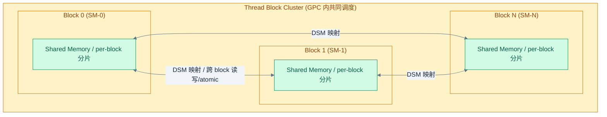

CUDA compute capability 9.0 明确：cluster 内的 thread blocks 保证共同调度到一个 GPC 上，可访问彼此的 shared memory 分片。Block 间过去只能靠 global memory 交换状态，到了 cluster 可以在硬件保证的共同驻留范围内同步和共享数据。

### 8.3 TMA：张量块搬运的专用硬件路径

专利 US12141082B2（申请于 2022 年）让大块 tile 搬运脱离传统 LSU 直通路径，形成 TMA（Tensor Memory Accelerator）。

Ampere 的 cp.async 已经让 global → shared 的 copy 异步化，但地址生成、循环切分和 copy 编排仍由线程承担。Hopper 的 TMA 把 tensor tile 的维度、stride、边界和布局放进 descriptor，由单个发起线程提交大块异步搬运，后续地址生成和数据移动由硬件处理。

**关键**：生产者线程不再需要逐段搬运数据，矩阵主循环围绕大块 tile 的生产、等待和计算来调度。

类比：cp.async 像是自己开车送货——虽然不用等货到（异步），但路线规划、装卸都是自己干。TMA 像是叫了快递——你只管填好地址单（descriptor），快递公司（硬件）负责取货、运输、送达。

### 8.4 Transaction Barrier：数据到达即等待

专利 US20230289242A1（申请于 2022 年）让 barrier 不只等待线程到达，也等待 transaction arrival。

传统 barrier 只回答"线程都到齐了吗"；transaction-aware barrier（mbarrier）还要回答"承诺的数据搬运都完成了吗"。这对 WGMMA 很关键——如果只看线程到达而不看 copy transaction 完成，就会把"发起了搬运"和"数据已经可用"混为一谈。

```text
Hopper mbarrier 的等待状态同时包含：
  - thread arrival count（多少线程到达了 barrier 点）
  - transaction arrival count（多少搬运事务完成了）
  → 两者都满足才释放等待的线程组
```

### 8.5 WGMMA：Warp-Group 级矩阵计算

WGMMA（Warp-Group MMA）把矩阵计算的粒度从单个 warp 扩展到 warp group（4 个 warp，共 128 线程）。

PTX 手册将 `wgmma.mma_async` 定义为 warpgroup-level MMA，要求 warpgroup 内所有线程执行同一条 `.aligned` 指令。它需要的就绪条件远超出单线程或单 warp：

```text
WGMMA-ready = tile 已驻留 + transaction 完成 + 可见性保证 + group 释放
```

### 8.6 Hopper 的生产者-消费者闭环

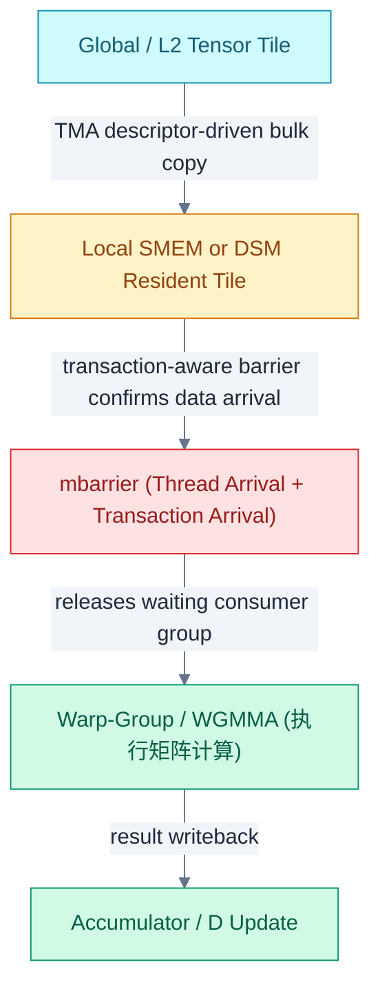

Hopper 的历史地位：**将 GPU 的协同边界从单 SM 扩展到 Thread Block Cluster / DSM，使 cluster 成为新的共享内存与协同执行单元。**

**Hopper 的规格**：132 个 SM、16896 个 CUDA Core、528 个第四代 Tensor Core、80 GB HBM3、3350 GB/s 带宽、NVLink 4.0（900 GB/s）、TDP 700W。FP16 Tensor 吞吐 989 TFLOPS（密集），FP8 Tensor 吞吐 1979 TFLOPS（密集），稀疏模式翻倍。H100 是 GPT-4 级别训练的核心平台。

---

## 9. Blackwell：问题向封装与 chiplet 边界外推

### 9.1 双 Die 单 GPU：封装内互连重构

官方材料将 Blackwell 描述为 two reticle-limited dies、10 TB/s chip-to-chip interconnect 和 unified single GPU。核心变化在于：**软件看到的 GPU 仍是统一 CUDA 对象，物理实现却由两个 GPU die 和封装内高速互连共同组成。**

```text
软件视图：一个 CUDA GPU
物理实现：die 0 ↔ 封装内 chip-to-chip 互连 ↔ die 1
```

类比：双 die 设计像是在同一栋楼里建了两层，中间用一部超高速电梯（10 TB/s 互连）连接。住户（软件）只知道自己住在一栋楼里，不用关心自己在哪一层。但电梯的速度决定了两层之间的协作效率——10 TB/s 意味着 die 间通信延迟远低于跨 GPU 的 NVLink 通信。

### 9.2 FP4/MX 与第二代 Transformer Engine

如果只写 FP8 → FP4，会误以为只是数据位宽减半。实际上更关键的是，scale factor、metadata、block size、packing 和格式选择同样决定了矩阵计算的效率与精度。

Blackwell 的低比特量化是一整套组合方案：

```text
payload bits
  + scale factor (E4M3 FP8, per micro-block)
  + block granularity (16 元素共享一个 scale)
  + metadata / packing (Hadamard 变换 + 2D block quantization)
  + Transformer Engine format policy
```

NVFP4 技术博客将其描述为 micro-block scaling、E4M3 scale factor、Hadamard reshape、2D block quantization 和 stochastic rounding 共同组成的一套方案。Blackwell 的性能提升来自低比特 Tensor Core、HBM 容量/带宽、NVLink collective 和软件栈的共同作用。

**为什么需要 Hadamard 变换**：4-bit 的表示能力极其有限（仅 16 个离散值），如果权重分布不均匀，大量信息会丢失。Hadamard 变换将权重旋转到一个"更圆"的分布，使得量化误差在各维度均匀分布，而非集中在少数维度。

### 9.3 TMEM：显式 Tensor 近端存储

这是 Blackwell 与 Hopper 最关键的差别之一。根据 CUDA Binary Utilities 的 Blackwell 指令集：

- `tmem[URX]` 被列为合法存储位置
- `LDT/LDTM`：从 Tensor Memory 载入矩阵到寄存器文件
- `STT/STTM`：从寄存器文件写回 Tensor Memory
- `UTCCP/UTCSHIFT`：shared memory 与 Tensor Memory 之间的搬运和重排

TMEM 解决的问题不止是"怎样把 tile 送到 SMEM/DSM"，还包括哪些操作数、累加器、scale 和 metadata 应该留在 Tensor Core 更近的专用存储层里。

类比：Hopper 的矩阵计算像是在公共厨房（SMEM）里做饭，食材和成品都放在公共冰箱（寄存器 fragment 分布在各线程）。Blackwell 给 Tensor Core 装了一个专属的储物柜（TMEM），常用的食材和半成品直接放在手边，不用每次都去公共冰箱取。

### 9.4 与 Hopper 的关键差异：从 Warpgroup 集体发起到单线程发起

Blackwell 取消/替换的是 Hopper 那种显式 WARPGROUP / WGMMA 风格的 SASS 编码与执行接口，新主线变成 `tcgen05.mma`、OMMA/QMMA、TMEM 与 UTC* 这组对象。

| **对比维度** | **Hopper WGMMA** | **Blackwell tcgen05** |
|----------|-------------|-------------------|
| 发起方式 | warpgroup 集体发起 | 单线程发起 |
| 累加器位置 | 分布在参与线程的寄存器 fragment | TMEM（per-CTA 二维片上存储） |
| 操作数位置 | SMEM / DSM 常驻 tile | A 在 TMEM 或 shared，B 在 shared |
| 等待协议 | wgmma.wait_group | TMEM 驻留 + tcgen05 CTA/CTA-pair 协议 |
| 核心指令 | wgmma.mma_async | tcgen05.mma |

关键变化：矩阵指令的核心语义从 warpgroup 寄存器 fragment 迁移到 TMEM 中的矩阵状态 + 描述符 + tcgen05 指令协议。

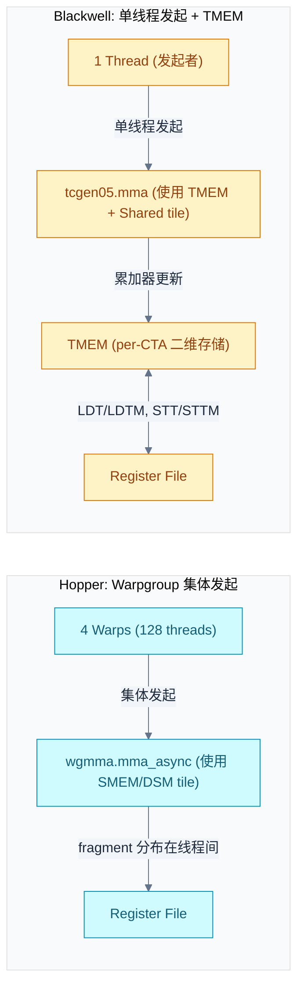

Blackwell 的意义不在于架构演进的终点，而在于问题已从 SM 内部扩展到封装、互连、格式与协同域的整体组织。

**Blackwell 的规格**：160 个 SM（2 × 80）、20480 个 CUDA Core、192 GB HBM3e、8000 GB/s 带宽、NVLink 5.0（1800 GB/s）、TDP 1000W。FP16 Tensor 吞吐 2250 TFLOPS（密集），FP4 Tensor 吞吐 9000 TFLOPS（密集），稀疏模式翻倍。

---

## 10. 互连架构演进：从片上 Crossbar 到 NVL72

互连的核心问题不再只是"带宽是否够"，而是**协同边界应扩展到何处、一致性和可见性如何保障**。互连的演进是协同边界外扩的直接体现。

### 10.1 NVLink 演进

| **参数** | **NVLink 1.0** | **NVLink 2.0** | **NVLink 3.0** | **NVLink 4.0** | **NVLink 5.0** |
|------|-----------|-----------|-----------|-----------|-----------|
| **对应架构** | Pascal | Volta | Ampere | Hopper | Blackwell |
| **每链路带宽（双向）** | 40 GB/s | 50 GB/s | 50 GB/s | 50 GB/s | 100 GB/s |
| **链路数/GPU** | 4 | 6 | 12 | 18 | 18 |
| **总带宽（双向）** | 160 GB/s | 300 GB/s | 600 GB/s | 900 GB/s | 1800 GB/s |
| **信令方式** | NRZ | NRZ | NRZ | PAM4 | PAM4 |
| **缓存一致性** | 不支持 | 支持 | 支持 | 支持 | 支持 |

NVLink 带宽增长主要靠链路数扩张（4→18），而非单链路提速。NVLink 5.0 是首次单链路带宽翻倍（50→100 GB/s），得益于 PAM4 信令速率提升。

对比 PCIe：NVLink 1.0 已是 PCIe 3.0 x16 的 5 倍，NVLink 5.0 是 PCIe 5.0 x16 的 14 倍。GPU 间通信如果走 PCIe，带宽根本不够支撑张量并行的 All-Reduce。

### 10.2 HBM 演进

| **参数** | **HBM2** | **HBM2e** | **HBM3** | **HBM3e** |
|------|------|-------|------|-------|
| **每引脚速率** | 2 Gbps | 3.2 Gbps | 5.2 Gbps | 8 Gbps |
| **每堆栈带宽** | 256 GB/s | 410 GB/s | 665 GB/s | 1024 GB/s |
| **每堆栈最大容量** | 8 GB | 16 GB | 24 GB | 48 GB |
| **通道数** | 8 | 8 | 16 | 16 |
| **内建 ECC** | 可选 | 可选 | 内建 | 内建 |

HBM 带宽增长靠堆栈数 + 每引脚速率双轮驱动。从 P100 到 B200，堆栈数从 4→8，每引脚速率从 ~1.4→~7.8 Gbps，总带宽从 720 GB/s 增至 8 TB/s（约 11 倍）。

HBM3e 的每堆栈 1 TB/s 是当前实用极限。B200 的 8 TB/s 总带宽来自 8 个 HBM3e 堆栈（双 die 各 4 个），每堆栈 1 TB/s。

### 10.3 NVSwitch 与 SHARP 网内归约

| **参数** | **NVSwitch 1.0** | **NVSwitch 2.0** | **NVSwitch 3.0** | **NVSwitch 4.0** |
|------|-------------|-------------|-------------|-------------|
| **对应 GPU** | V100 | A100 | H100 | B200 |
| **端口数** | 18 | 36 | 64 | 72 |
| **每端口带宽** | 50 GB/s | 50 GB/s | 50 GB/s | 100 GB/s |
| **总交换容量** | 900 GB/s | 1.8 TB/s | 3.2 TB/s | 7.2 TB/s |
| **SHARP** | 不支持 | v1 | v2 | v3 |
| **最大互联 GPU** | 8 | 8 | 8 | 72 (NVL72) |

SHARP（Scalable Hierarchical Aggregation and Reduction Protocol）让 NVSwitch 从"连通器"变成"计算节点"——All-Reduce 的归约操作可在交换芯片内完成，无需将数据回传 GPU。SHARP v3 可将大规模 All-Reduce 延迟降低 60-70%。

**NVL72**（Blackwell 时代）：72 张 B200 GPU 通过 18 颗 NVSwitch 4.0 全互联，形成一个 72-GPU 的 NVLink 域。在这个域内：总 HBM 容量 13.8 TB，总 FP4 算力 324 PFLOPS，总 HBM 带宽 576 TB/s。这足以在单一 NVLink 域内训练/推理万亿参数模型。

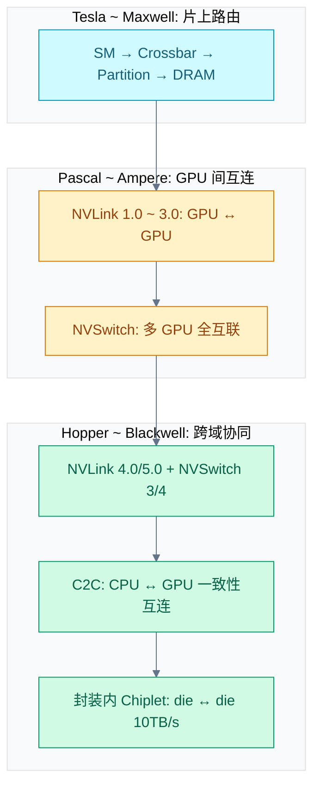

---

## 11. 技术维度演进总览

### 11.1 执行模型：从 Warp 锁步到 cluster 级协同调度

| **代际** | **执行模型变化** | **关键机制** |
|------|-------------|----------|
| Tesla → Pascal | warp 为默认同步前进单位 | active mask + reconvergence stack |
| Volta | 线程独立前进（ITS） | `__syncwarp()`, BSSY/BSYNC |
| Ampere | 调度粒度继续下探 | shard scheduling（专利） |
| Hopper | cluster 级协同调度 | CGA, cluster barrier |
| Blackwell | 单线程发起矩阵任务 | single-thread issue semantics |

### 11.2 数据通路：从 RF/Collector 到 cp.async/TMA 驱动的异步暂存

| **代际** | **数据通路变化** | **关键机制** |
|------|-----------|----------|
| Tesla/Fermi | RF → ALU 直连 | banked RF |
| Kepler | RF → crossbar → collector | operand collector（靠近算子的暂存复用层） |
| Volta | 矩阵路径独立供给数据 | RF → crossbar → collectors → HMMA |
| Ampere | 异步数据暂存剥离 | cp.async（global → shared 异步 copy） |
| Hopper | 大块 tile 搬运交给专用单元 | TMA（descriptor-driven bulk copy） |
| Blackwell | Tensor Core 近端显式存储 | TMEM + LDT/LDTM + STT/STTM |

### 11.3 精度体系：从通用浮点到按计算语义分流的格式体系

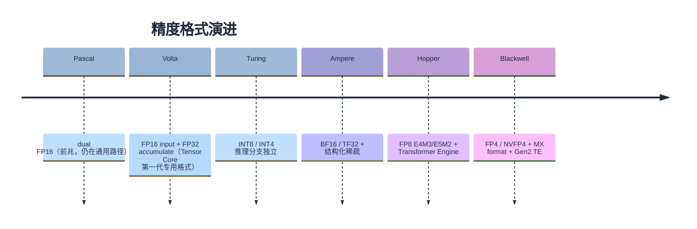

精度演进的主题不是格式越来越多，而是**格式开始服务不同计算语义与不同吞吐路径**：训练用 BF16/TF32/FP8，推理用 INT8/INT4/FP4。

### 11.4 同步原语：从寄存器相关性到 Transaction 与 Domain

| **代际** | **同步对象** | **关键机制** |
|------|---------|----------|
| Tesla | pending write, scoreboard | 指令能否发出（硬件隐式） |
| Maxwell | 可编程 barrier | software scoreboard + convergence barrier |
| Volta | 显式 warp sync | `__syncwarp()`, DEPBAR |
| Ampere | execution barrier 元数据 | Join/Wait/Cancel 稳定化 |
| Hopper | transaction + domain | mbarrier（线程 + 事务到达）、memory sync domain |
| Blackwell | TMEM 驻留 + task descriptor | tcgen05 CTA-pair 协议 |

---

## 12. SASS 指令集：架构演进的指令层投影

### 12.1 各代 SASS 关键变化

指令集层不是与前面维度平行的物理主线，而是硬件边界变化在机器指令层的投影。一旦一个新机制稳定出现在 SASS 中，说明编译器、汇编器和工具链都必须正面处理它。

| **代际** | **新增关键指令/对象** | **退场指令/对象** | **反映的架构变化** |
|------|------------------|-------------|---------------|
| Maxwell/Pascal | 传统 SIMT, LD/ST, texture | — | 通用、锁步、单 SM 为主 |
| Volta | BSSY/BSYNC, WARPSYNC, DEPBAR, HMMA/IMMA | SSY/SYNC, XMAD | ITS 执行模型 + 矩阵路径分流 |
| Turing | R2UR/S2UR, UIADD3/UIMAD..., BMMA, LDSM | — | uniform datapath 落地 + INT8/4 矩阵 |
| Ampere/Ada | LDGSTS, LDGDEPBAR, DMMA, F2IP/I2FP | — | cp.async 异步暂存 + 矩阵路径扩张 |
| Hopper | UTMA\*, UCGABAR\_\*, WARPGROUP, UBLK\*, ENDCOLLECTIVE, SYNCS, PREEXIT | — | cluster 协同 + TMA + warp-group MMA |
| Blackwell | OMMA/QMMA, LDT/LDTM, STT/STTM, UTC\*, UGETNEXTWORKID, UF\*/UI\* 变体 | WARPGROUP, 部分 \*GMMA 形式 | TMEM 显式对象 + 单线程发起 MMA |

### 12.2 指令变化与三次架构重写的对应

| **架构重写** | **指令集证据** |
|----------|-----------|
| Fermi: memory-side 控制域 | L2/partition 成为 load/store 的后端处理域（间接证据，SASS 层不直接体现 cache policy modifier） |
| Volta: 执行与数据通路分流 | HMMA/IMMA 出现（矩阵路径写成 SASS 对象）；BSSY/BSYNC 替代 SSY/SYNC（执行模型改写） |
| Hopper: cluster 级协同 | UTMA\*/UCGABAR\_\*/WARPGROUP 成组出现（搬运/同步/协同对象不再局限于单个 warp/SM） |
| Blackwell: 封装边界外推 | OMMA/QMMA 替代 WGMMA 风格（矩阵任务从 warpgroup 层面下沉到 TMEM + 描述符） |

---

## 13. LLM 与 GPU 架构的协同演进

GPU 架构从通用计算走向专用化，与 LLM/Transformer 的崛起有直接关联。这一章从 LLM 的计算特征出发，解释每一代 GPU 架构变化如何被 LLM 的需求驱动，以及 LLM 的瓶颈如何映射到 GPU 硬件。

### 13.1 Transformer 对 GPU 架构的反向塑造

Transformer 的核心计算模式——大规模矩阵乘（QKV 投影、FFN）、softmax reduction、layer norm——不同于传统 HPC 或图形工作负载，对 GPU 提出了新的需求：

| **Transformer 计算特征** | **对 GPU 架构的驱动** | **对应代际** |
|---------------------|-------------------|----------|
| 矩阵乘占主导（>90% FLOPs） | Tensor Core 的引入与持续增强 | Volta → Blackwell |
| 训练需高精度，推理可低精度 | 精度路径分叉（FP16/BF16/TF32 vs INT8/FP8/FP4） | Turing → Blackwell |
| 模型参数指数增长 | HBM 容量/带宽、NVLink 域扩张 | Ampere → Blackwell |
| Attention 的 softmax/mask | 非矩阵算子仍需通用 FPU 路径 | 所有代际通用路径持续保留 |
| 分布式训练（TP/PP/DP） | NVSwitch、SHARP in-network reduction | Hopper → Blackwell |

### 13.2 LLM 的计算瓶颈：Compute-Bound vs Memory-Bandwidth-Bound

理解 LLM 在 GPU 上的性能，核心概念是**算术强度**（Arithmetic Intensity）= FLOPs / Bytes Accessed，单位 FLOP/Byte。GPU 的"平衡点"算术强度为：

平衡点 = 峰值 FLOPS / 峰值带宽

H100 FP16: 989 TFLOPS / 3.35 TB/s $\approx$ 295 FLOP/Byte
B200 FP4:  9000 TFLOPS / 8 TB/s  $\approx$ 1125 FLOP/Byte

当操作的算术强度低于平衡点时，该操作是 **memory-bandwidth-bound**（数据供给速度跟不上计算速度，计算单元空闲等待）；高于平衡点则是 **compute-bound**（计算能力不足，数据供给过剩）。

LLM 的两个阶段有本质差异：

| **对比维度** | **Prefill（预填充）** | **Decode（逐 token 生成）** |
|----------|------------------|----------------------|
| 输入 | 完整 prompt（seq_len 个 token） | 单个新 token |
| 矩阵乘形状 | $[1, seq\_len] \times [d\_model, d\_model]$ | $[1, 1] \times [d\_model, d\_model]$ |
| 算术强度 | 高（$\sim 2 \times d_{\text{model}}$ FLOP/Byte） | 低（$\sim 1$ FLOP/Byte 或更低） |
| 瓶颈 | Compute-bound | **Memory-bandwidth-bound** |
| Tensor Core 利用率 | 高（>50%） | 极低（<5%） |

**Decode 阶段是当前 GPU 架构的最大挑战**：每生成一个 token，需要读取全部模型权重（70B BF16 模型 = 140 GB），但只做极少量的计算。H100 的平衡点是 295 FLOP/Byte，而 decode 的算术强度仅约 1 FLOP/Byte——Tensor Core 绝大多数时间在等数据，计算单元严重空闲。

这就是为什么量化（FP8/FP4）对推理如此重要：不是为了让计算更快，而是为了让权重更小、读取更快，缓解带宽瓶颈。

### 13.3 Attention 机制到 GPU 硬件的映射

#### QKV 投影：Tensor Core 的核心负载

QKV 投影本质上是三个连续的矩阵乘法：

Q = X · W_Q    $[batch \cdot seq\_len, d\_model] \times [d\_model, d\_k \cdot n\_heads]$
K = X · W_K    同上
V = X · W_V    同上

这三个 GEMM 操作占 Transformer 层约 40-50% 的 FLOPs，是典型的 compute-bound 操作，直接映射到 Tensor Core 的 WGMMA/tcgen05 指令。

以 GPT-3（175B）为例，单层 QKV 投影的计算量：

FLOPs = $6 \times batch \times seq\_len \times d\_{model}^2$
      $= 6 \times 512 \times 2048 \times 12288^2 \approx 9.5 \times 10^{14}$ FLOPs（单层）

H100 FP16 峰值约 989 TFLOPS（密集），单层 QKV 投影理论耗时约 1ms。实际性能受数据通路限制（TMA 搬运权重 tile 到 SMEM、WGMMA 使用 tile 的流水线效率），通常只能达到峰值的 50-70%。

#### Softmax：通用 FPU 路径的瓶颈

Attention score 的计算中，Q·K^T 和 P·V 仍是 GEMM，走 Tensor Core。但 **softmax 是逐行 reduction 操作，无法直接映射到 Tensor Core**，必须走 CUDA Core（通用 FPU）路径。

Softmax 的计算步骤（逐行）：

1. **行最大值**：`m_i = max(S[i,:])` — 跨列 reduction
2. **指数求和**：`l_i = sum(exp(S[i,:] - m_i))` — 跨列 reduction
3. **归一化**：`P[i,j] = exp(S[i,j] - m_i) / l_i` — 逐元素

这些操作涉及跨 warp 的 reduction（`__shfl_xor_sync` 或 atomic add），属于 memory-bandwidth-bound 操作。

**FlashAttention 的关键优化**：FlashAttention 将 softmax 的分块计算（tiling）与 QKV 的 GEMM 融合进同一个 kernel，避免将中间的 S 和 P 矩阵写回 HBM。这把 attention 的 HBM 访问量从 $O(N^2 d)$ 降到 $O(N^2 d^2 / M)$，其中 $M$ 是 SMEM 大小。在 H100 上，SMEM 容量 228KB/SM，可容纳更大的 tile，进一步减少 HBM 访问。FlashAttention 与 Hopper 的 TMA + transaction barrier 高度匹配——TMA 搬运 tile、mbarrier 确认到达、WGMMA 执行计算，形成高效的流水线。

### 13.4 KV Cache：HBM 容量与带宽的双重压力

自回归推理时，每生成一个 token 需要读取之前所有 token 的 K 和 V：

KV Cache 大小 = $2 \times n\_{layers} \times n\_{kv\_heads} \times d\_{head} \times seq\_len \times sizeof(dtype) \times batch\_size$

以 LLaMA-2-70B（BF16 精度，d_head=128，n_kv_heads=8）为例，不同序列长度下的 KV Cache 大小（batch_size=1）：

| **模型** | **seq_len=4K** | **seq_len=32K** | **seq_len=128K** |
|------|-----------|-------------|-------------|
| LLaMA-2-7B (MHA) | 2.0 GB | 16 GB | 64 GB |
| LLaMA-2-70B (GQA) | 1.25 GB | 10 GB | 40 GB |
| GPT-3 (175B, MHA) | 18 GB | 144 GB | 576 GB |

**GQA 的效果**：LLaMA-2-70B 采用 GQA（8 个 KV 头 vs 64 个 query 头），KV Cache 大小仅为 MHA 版本的 1/8。MLA（Multi-head Latent Attention，DeepSeek-V2/V3 使用）通过低秩压缩将 KV 压缩到约 10% 的原始大小。这些算法优化与 HBM 容量增长是互补的——[LLM注意力机制发展与演进](./LLM注意力机制发展与演进.md)中有更详细的分析。

**多请求场景**：以 LLaMA-2-70B、seq_len=8K、batch=32 为例，KV Cache 约 80 GB，加上模型权重 140 GB，总计约 220 GB。H100 80GB 单卡放不下，需要 3 张卡（TP=3）。B200 192GB 单卡也放不下，需要 2 张卡（TP=2）。

**Decode 阶段的带宽瓶颈**：每步需要读取全部 KV Cache。以 LLaMA-2-70B、seq_len=128K 为例，每步读取约 40 GB KV 数据 + 140 GB 权重 = 180 GB。H100 带宽 3.35 TB/s，理论延迟约 54 μs/step，对应约 18,500 tokens/s。B200 带宽 8 TB/s，理论延迟约 23 μs/step，对应约 44,000 tokens/s。

### 13.5 训练 vs 推理的不同需求

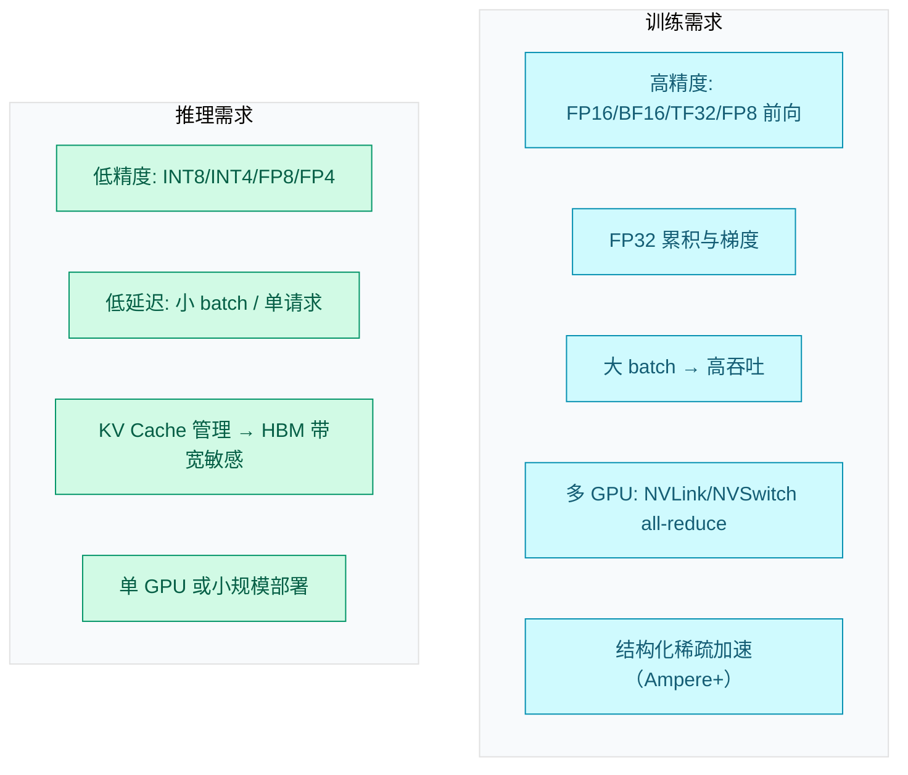

这种训练/推理需求的分化，对应了 GPU 架构的两个演进方向：

- **训练方向**：高吞吐 Tensor Core + FP8 Transformer Engine + NVSwitch 大数据域
- **推理方向**：低比特 INT4/FP4 + 更大 HBM 容纳 KV Cache + 单 GPU 或小集群

### 13.6 FP8/FP4 量化与 Transformer Engine

#### FP8 格式规范

FP8 有两种编码方式（NVIDIA/ARM/Intel 联合定义，OCP 标准）：

| **格式** | **符号位** | **指数位** | **尾数位** | **动态范围** | **精度** |
|------|--------|--------|--------|---------|------|
| E4M3 | 1 | 4 | 3 | ±448 | 较高精度 |
| E5M2 | 1 | 5 | 2 | ±57344 | 较大动态范围 |

分工：E4M3 用于前向传播的权重和激活（需要较高精度），E5M2 用于反向传播的梯度（需要较大动态范围）。

#### Transformer Engine 的工作机制

Transformer Engine (TE) 的核心功能是**动态量化**：在每次 GEMM 执行前，根据输入数据的实际分布选择最优的 scale factor，将 FP16/BF16 输入量化到 FP8 执行矩阵乘加，再反量化回 FP16/BF16 输出。

```text
TE 伪代码：
1. 统计输入和权重的动态范围 → compute_scale
2. 量化到 FP8 → quantize(input_fp16, scale, E4M3)
3. FP8 Tensor Core GEMM，FP32 累积 → wgmma_mma(input_fp8, weight_fp8, FP32)
4. 反量化回 FP16 → dequantize(output_fp32, scale)
```

关键细节：

- **延迟量化（Delayed Scaling）**：TE 使用上一层的统计信息来量化当前层，维护 `amax_history` 缓冲区记录最近若干步的激活最大值，避免在 GEMM 前做额外 reduction。
- **FP32 累积**：即使输入是 FP8，Tensor Core 内部的乘加累积仍使用 FP32，保证数值稳定性。
- **FP8 吞吐翻倍的原因**：WGMMA 指令中，FP8 的 A 矩阵 M 维度翻倍（64 vs FP16 的 16），单条指令计算量翻倍。

#### 量化的精度损失

| **精度** | **相对 FP16 的精度损失** | **典型适用场景** |
|------|---------------------|-------------|
| BF16 | 几乎无损 | 训练基准精度 |
| FP8 E4M3 | 0.1-0.5% perplexity 增加 | 训练前向、推理 |
| INT8 | 0.5-2% perplexity 增加 | 推理（需校准） |
| FP4 | 1-5% perplexity 增加 | 推理（需 GPTQ/AWQ 校准） |

### 13.7 MoE 模型与多 Die GPU 的协同

MoE (Mixture of Experts) 模型将 FFN 层替换为多个专家网络，每次推理只激活部分专家。以 DeepSeek-V3 为例：总参数量 671B，每 token 仅激活 ~37B，256 个专家中每 token 激活 8 个。

MoE 的硬件需求与传统稠密模型不同：

1. **HBM 容量**：671B 参数 $\times$ 2 bytes (BF16) = 1.34 TB，需要多卡甚至多节点
2. **All-to-All 通信**：每个 token 需要被发送到其被路由到的专家所在的 GPU，产生大量跨 GPU 通信

Blackwell 双 Die GPU 对 MoE 的收益：

| **对比维度** | **H100（单 die）** | **B200（双 die）** |
|----------|---------------|---------------|
| HBM 容量 | 80 GB | 192 GB |
| Die 间带宽 | N/A | 10 TB/s |
| 专家放置 | 跨 NVLink 的其他 GPU | 同一封装内的另一个 die |

关键收益：Token 路由到同封装 die 上的专家时，通信走 10 TB/s 的 die-to-die 互连，远快于跨 GPU 的 NVLink（900 GB/s），延迟降低约 10 倍。192 GB HBM3e 可以在单 GPU 内放置更多专家，减少跨 GPU All-to-All 通信次数。

### 13.8 分布式训练：TP/PP/DP 对互连的使用

实际训练大型模型时，通常组合使用三种并行策略：

总 GPU 数 = $DP \times TP \times PP$

**张量并行（TP）**：将单个矩阵乘法的权重按列/行切分到多个 GPU，每个 GPU 计算部分结果，然后通过 All-Reduce 聚合。每个 Transformer 层需要 2 次 All-Reduce（attention 后 1 次 + FFN 后 1 次）。

TP 的通信特征：高带宽、低延迟需求，适合 NVLink + NVSwitch 的节点内通信。H100 的 18 对 NVLink 4.0 总双向带宽 1.8 TB/s，TP=8 时 All-Reduce 通信占比仅 ~2-5%。

**流水线并行（PP）**：将模型按层切分到不同 GPU，每个 GPU 负责连续的若干层。PP 只需要相邻 GPU 之间传递中间激活，是点对点通信，带宽需求低于 TP。但 PP 存在"气泡"——当 micro-batch 还没到达后面的 stage 时，后面的 GPU 空闲。

**数据并行（DP）**：每个 GPU 持有完整模型副本，处理不同数据子集，反向传播后通过 All-Reduce 同步梯度。DP 的通信量大但可容忍高延迟（可通过梯度累积分摊），适合 InfiniBand 的节点间通信。

以 GPT-3 (175B) 训练为例（经典配置）：

| **并行策略** | **度** | **互联需求** | **通信占比** |
|----------|-----|---------|---------|
| TP | 8 | NVLink + NVSwitch（节点内） | ~2-5% |
| PP | 2 | NVLink 或 InfiniBand | ~1-3% |
| DP | 16 | InfiniBand（节点间） | ~5-15% |

### 13.9 从 H100 到 B200：LLM 时代的硬件加速路径

Hopper（H100）到 Blackwell（B200）的演变，与 LLM 规模的增长直接对应：

| **LLM 趋势** | **Hopper 的应对** | **Blackwell 的进一步推进** |
|----------|-------------|---------------------|
| 模型变大（GPT-4 级别） | HBM3 80GB, NVSwitch 3 全互联 | HBM3e 192GB, NVLink 5 + NVSwitch 4, NVL72 |
| 训练精度降低（FP8） | Transformer Engine + FP8 E4M3/E5M2 | Gen2 TE + FP4/MX micro-scaling |
| Token 生成（推理） | FP8 Tensor Core | FP4 + TMEM 近端存储加速 tile 计算 |
| 分布式推理管道 | TMA 异步 tile 搬运 | die-to-die 10TB/s + 更大互连域 |
| Mixture-of-Experts (MoE) | — | 双 die 单 GPU（更多 SM 并行处理 expert） |

---

## 14. 三次架构重写的设计哲学

### 14.1 Fermi：控制语义从 SM 内部向 memory-side 外扩

**核心哲学**：让软件可以观察和控制"数据在 memory 层次中怎样流动"。不再把 memory-side 当作被动后台，而是将 L2/partition、cache policy、atomic 顺序确立为稳定的软件接口。

### 14.2 Volta：执行与数据供给从通用机器向专用机器分流

**核心哲学**：不再把所有计算按同一套执行与数据供给协议处理。按**数据使用方式**（矩阵 vs 标量 vs warp-uniform）和**执行形态**（独立线程 vs warp 锁步）划分为不同路径。

特别需要指出：这种分流不是按 FP vs INT 简单拆寄存器——真正需要独立路径的，取决于"数据如何被使用"：warp-uniform 值适合统一广播路径（URF），矩阵 tile 走 HMMA 专用 datapath，barrier/predicate 走专用状态存储。

### 14.3 Hopper：协同边界从单 SM 向 cluster、互连和封装层外推

**核心哲学**：单个 SM 内部的优化已接近极限，"如何在更大硬件域内安全、高效地共享和使用数据"才是。DSM、TMA、transaction barrier、WGMMA 这四条机制必须配合使用才有意义。

---

## 15. 十代架构总览

| **代际** | **关键贡献** | **与 LLM 的关系** | **对后续的影响** |
|------|---------|-------------|-------------|
| Tesla (2006) | SIMT + warp 锁步, crossbar + VC | 尚无直接关系 | 定义基线机器 |
| Fermi (2010) | L2/partition 从被动缓存变为软件可调优域 | — | 重写 memory-side 控制边界 |
| Kepler (2012) | collector cache 数据通路闭环 | — | SM 侧数据通路整理 |
| Maxwell (2014) | software scoreboard, convergence barrier | — | 同步从 busy-bit 推至 barrier 化 |
| Pascal (2016) | HBM2, NVLink 1.0, dual FP16 | FP16 为首次矩阵加速试水 | 互连语义化 + 内存介质跃迁 |
| Volta (2017) | Tensor Core (HMMA), ITS | FP16 训练（BERT/GPT 早期） | 改写执行与数据供给两条线 |
| Turing (2018) | INT8/INT4 Tensor Core, uniform datapath | 推理加速起步 | 精度路径分叉 |
| Ampere (2020) | cp.async, BF16/TF32, 结构化稀疏 | GPT-3 级训练主流平台 | 新机制成熟化 |
| Hopper (2022) | cluster DSM, TMA, WGMMA, FP8+TE | GPT-4 级训练 + FP8 | 协同边界外扩至 cluster |
| Blackwell (2024) | 双 die 单 GPU, FP4/MX, TMEM, tcgen05 | 更大模型 + 更低比特 | 封装与互连边界外推 |

---

## 16. 要点回顾

| **要点** | **说明** |
|------|------|
| 四条边界的持续外扩 | 执行域、数据供给域、同步域、协同边界——每一代至少打破其中一个 |
| 三次架构重写 | Fermi 推 memory-side、Volta 分流 datapath + 改写执行模型、Hopper 扩到 cluster 协同 |
| 专利是架构证据 | US9639479B2 (Fermi)、US10338919B2 (Volta)、US20230289189A1 (Hopper) 分别对应三次重写的核心硬件变更 |
| Tensor Core 的专用化路径 | 不是通用 FPU 的增强，而是独立 datapath + 独立精度体系 + 独立的数据供给控制链 |
| Hopper 的 cluster 闭环 | DSM + TMA + mbarrier + WGMMA 必须配合使用，单独看任何一个模块会误读其历史地位 |
| Blackwell 的 TMEM | 矩阵指令核心语义从 warpgroup 寄存器 fragment → TMEM + 描述符。发起方式从集体发起 → 单线程发起 |
| LLM decode 的带宽瓶颈 | 算术强度约 1 FLOP/Byte，远低于 GPU 平衡点 295+ FLOP/Byte，Tensor Core 严重空闲 |
| 量化缓解带宽瓶颈 | FP8/FP4 减少权重读取量，是最直接的硬件-算法协同优化路径 |
| MoE 与双 die 协同 | die-to-die 10 TB/s 互连让专家路由延迟降低约 10 倍 |
| 互连从连通器到计算节点 | NVSwitch + SHARP 让交换芯片可执行归约运算，NVL72 将 NVLink 域扩至 72 GPU |
| SASS 为旁证 | 指令成组出现/退场反映硬件状态、等待对象和协同边界的变化 |

---

## 参考资料

- [理解 NVIDIA GPU 迭代的脉络（知乎原文）](https://zhuanlan.zhihu.com/p/2031795257612953005) — 本文的核心内容来源
- [NVIDIA CUDA C Programming Guide — Thread Block Clusters](https://docs.nvidia.com/cuda/cuda-c-programming-guide/index.html#thread-block-clusters) — Hopper cluster 编程模型
- [NVIDIA Blackwell Tuning Guide](https://docs.nvidia.com/cuda/archive/12.8.0/blackwell-tuning-guide/index.html) — Blackwell 调优指南
- [NVFP4 Trains with Precision of 16-Bit and Speed and Efficiency of 4-Bit](https://developer.nvidia.com/blog/nvfp4-trains-with-precision-of-16-bit-and-speed-and-efficiency-of-4-bit/) — Blackwell FP4 技术细节
- [FlashAttention: Fast and Memory-Efficient Exact Attention](https://arxiv.org/abs/2205.14135) — FlashAttention 论文
- [NVIDIA H100 White Paper](https://resources.nvidia.com/en-us-tensor-core) — Hopper 架构白皮书
- [NVIDIA A100 White Paper](https://www.nvidia.com/content/dam/en-zz/Solutions/Data-Center/a100/pdf/nvidia-a100-datasheet.pdf) — Ampere 架构白皮书
- [LLM注意力机制发展与演进](./LLM注意力机制发展与演进.md) — 同目录下 LLM 注意力机制相关文档
- US9639479B2 — Fermi L2/partition 控制域（申请于 2010 年）
- US10338919B2 — Volta HMMA datapath（申请于 2017 年）
- US20230289189A1 — Hopper DSM cluster 共享内存（申请于 2022 年）
- US12141082B2 — Hopper TMA 张量搬运（申请于 2022 年）
- US20230289242A1 — Hopper transaction-aware barrier（申请于 2022 年）
