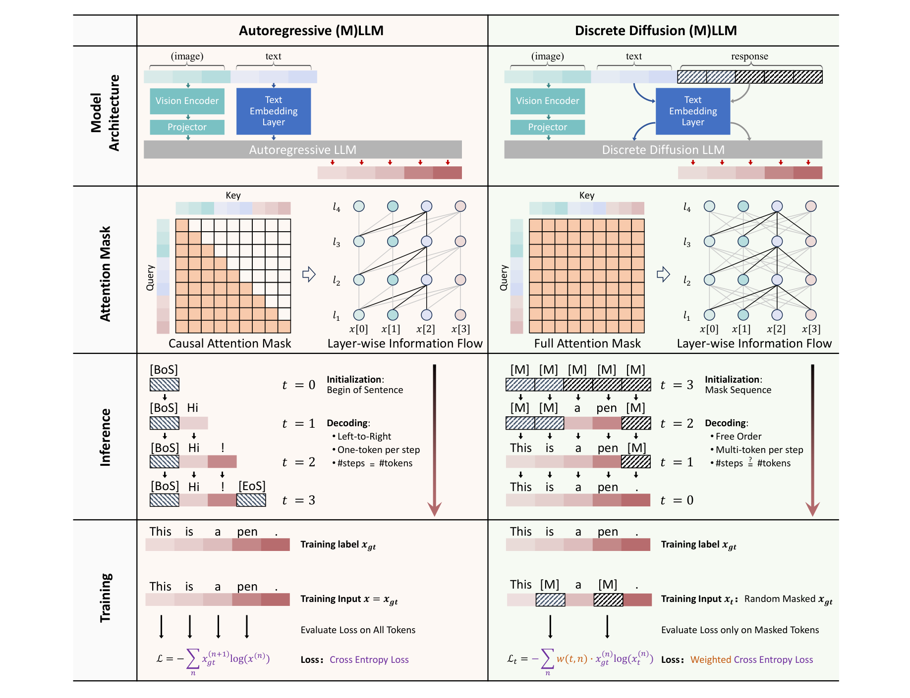
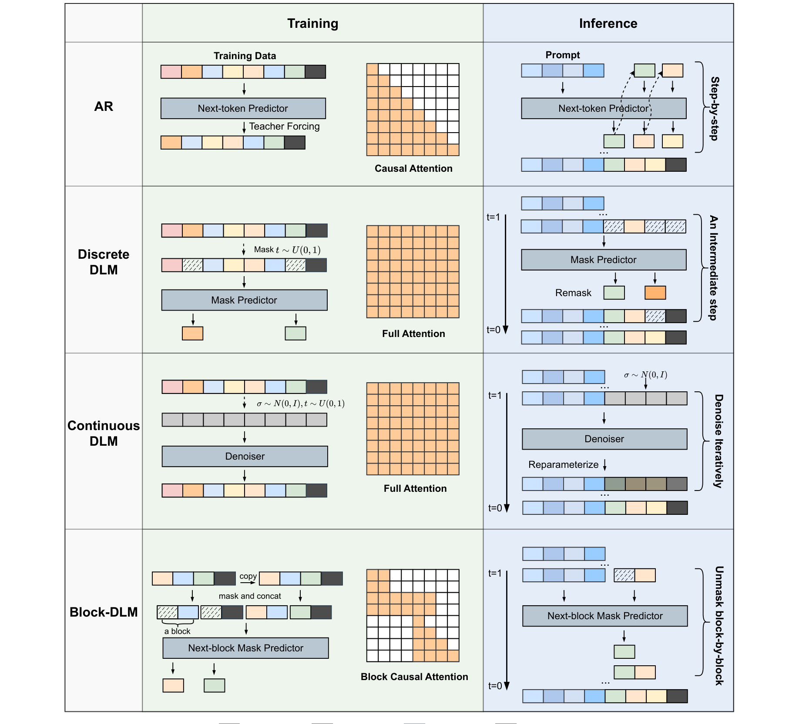
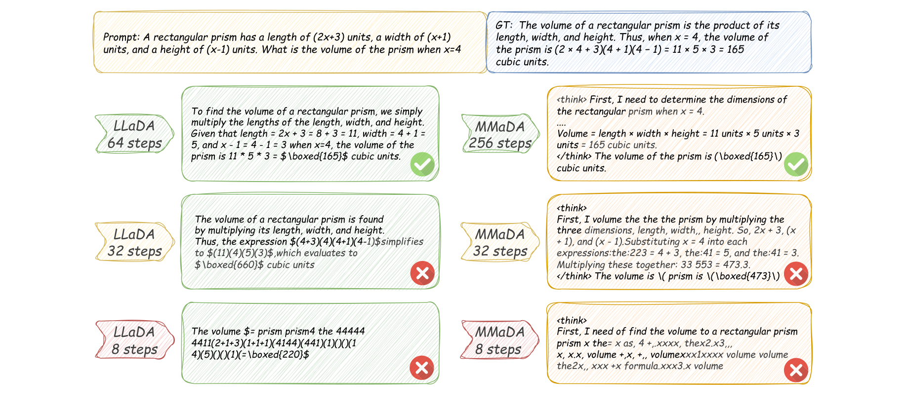
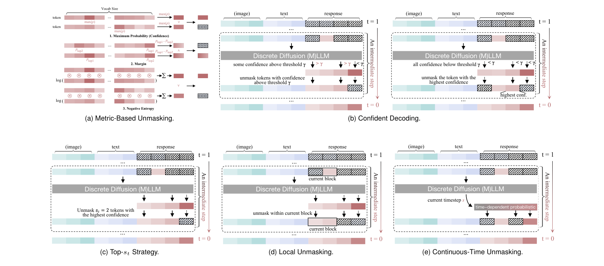
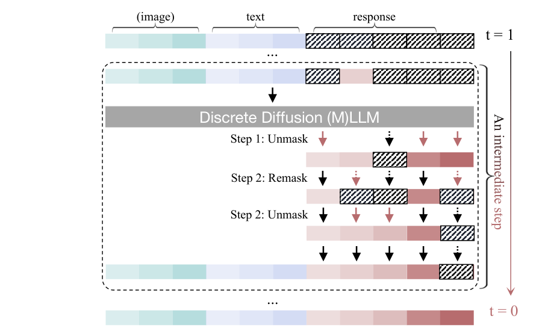
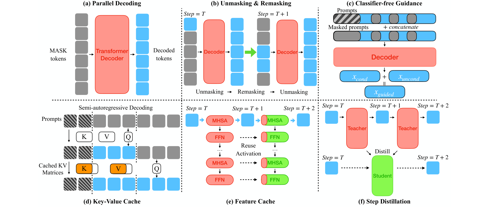

# 扩散语言模型原理

> 从零开始，系统梳理扩散语言模型的核心原理——先建立直觉，再逐步引入数学，深入讲解训练与推理的每一环节。

### 关键术语

| 缩写 | 全称 | 含义 |
|------|------|------|
| DLM | Diffusion Language Model | 扩散语言模型 |
| AR | Autoregressive | 自回归模型，逐 token 从左到右生成 |
| dLLM | Discrete Diffusion LLM | 离散扩散大语言模型 |
| dMLLM | Diffusion Multimodal LLM | 多模态扩散大语言模型 |
| D3PM | Discrete Denoising Diffusion Probabilistic Model | 离散去噪扩散概率模型 |
| MDLM | Masked Diffusion Language Model | 掩码扩散语言模型 |
| RDM | Reparameterized Discrete Model | 重参数化离散模型 |
| MD4 | Masked Diffusion for Discrete Data | 离散数据掩码扩散 |
| LLaDA | Large Language Diffusion with mAsking | 大语言掩码扩散模型 |
| CFG | Classifier-Free Guidance | 无分类器引导 |
| SFT | Supervised Fine-Tuning | 监督微调 |
| MLM | Masked Language Model | 掩码语言模型 |
| ELBO | Evidence Lower Bound | 证据下界 |
| DoT | Diffusion-of-Thought | 扩散思维链 |
| DCoLT | Diffusion Chain-of-Lateral-Thought | 侧向思维扩散链 |
| SEPO | Score Entropy Policy Optimization | 分数熵策略优化 |
| VRPO | Variance-Reduced Preference Optimization | 方差缩减偏好优化 |

---

## 1. 直觉：扩散模型在做什么

### 1.1 从填字游戏说起

想象你在做填字游戏：

- 一开始，答题纸上全是空格
- 你先填上几个最有把握的词——比如主语、谓语
- 有了这些词做线索，原来不确定的空格就变得清晰了
- 反复几轮，所有空格都填满了

**GPT 的做法**不同：它必须从左到右，一个字一个字填。写第二个字之前不能瞄第三个字。这有两个根本缺陷：**慢**（100 个字需要 100 步）和**单向**（写完后面想改前面？不行）。

**扩散语言模型**的做法就是：一开始整段话全是空格，然后一轮一轮把所有词同时推出来。这要求模型必须"从全局考虑"——每个位置的词要和其他所有位置的词协调。

### 1.2 "扩散"这个名字的由来

"扩散"来自物理学——一滴墨水滴入水中，墨水逐渐扩散、均匀分布。扩散模型的数学思想正好相反：**不是从有序到无序，而是学会从无序恢复有序**。

具体来说，扩散模型定义了两个过程：

- **前向过程**：逐步破坏数据。对文本来说，就是随机把一些词替换成空格（掩码）
- **反向过程**：学会从被破坏的数据中恢复原始内容

训练时，我们给模型看各种"被破坏到不同程度"的文本，让它学会猜出空格里原来是什么。推理时，从全空格开始，让模型一轮一轮把词猜出来。

### 1.3 一个具体的例子

生成 "今天的天气非常好" 这句话：

**GPT（自回归）**——必须从左到右，一个字一个字生成：

```text
步骤 1: ""           -> "今天"
步骤 2: "今天"       -> "的"
步骤 3: "今天的"     -> "天气"
步骤 4: "今天的天气" -> "非常"
步骤 5: "今天的天气非常" -> "好"
```

5 个 token 需要 5 次前向传播，无法并行。

**扩散模型**——所有位置同时预测，逐步精炼：

```text
步骤 1: 输入 [空,空,空,空,空]
       模型同时预测所有位置，高置信度的先确定
       结果: [今天, 空, 空, 空, 好]

步骤 2: 输入 [今天, 空, 空, 空, 好]
       模型利用"今天...好"的双向上下文推理
       结果: [今天, 的, 天气, 非常, 好]
```

2 步完成！对于 500 token 的长文本，GPT 需要 500 步，扩散可能只需 30-50 步。

### 1.4 AR 与扩散：四维对比

理解了直觉之后，我们从四个维度精确对比 AR 模型和离散扩散模型——这是后续所有讨论的基础：

| 维度 | AR 模型 | 离散扩散模型 |
|------|---------|-------------|
| **注意力** | 因果掩码（只能看左边） | 全注意力（双向，看全局） |
| **推理** | 从左到右逐 token 生成，步数 = token 数 | 从全掩码并行去噪，步数独立于 token 数 |
| **训练** | 对所有位置计算 next-token 交叉熵 | 仅对掩码位置计算加权交叉熵 |
| **迭代精炼** | 不支持（生成后不可修改） | 支持（可重掩码已生成 token，修正错误） |

> **关键认知**：两者的网络结构（Transformer）完全相同，差异仅在注意力掩码、训练目标和生成方式。这意味着 AR 模型的训练基础设施几乎可以直接复用——这是扩散语言模型能快速发展的工程基础。

下图从架构、注意力掩码、推理、训练四个维度直观对比了 AR 模型和离散扩散模型的差异：



*来源：Yu et al., 2025 Fig.3*

### 1.5 扩散语言模型的发展

```text
2021: D3PM 奠定离散扩散数学基础
  |
2022: Diffusion-LM 尝试连续嵌入空间扩散
  |
2023-2024: SEDD, MDLM 简化训练目标; DiffusionBERT 探索 BERT 初始化
  |
2025.02: LLaDA-8B 首个从头训练的 8B 扩散语言模型，性能对齐 LLaMA3-8B
  |
2025.03: Dream-7B 用 AR 权重初始化; Block Diffusion 混合 AR 和扩散
  |
2025.05: Mercury 等工业级模型实现 >1000 tok/s 推理速度
  |
2025.12: LLaDA 2.0 扩展到 100B 参数
```

---

## 2. 数学基础：图像扩散模型

> 上一节建立了直觉：扩散模型 = 前向破坏 + 反向恢复。本节用图像数据把这个直觉翻译成精确的数学语言。为什么要从图像开始？因为图像是连续实数，天然适配高斯噪声，数学最简洁。文本是离散整数，需要额外适配（第四章再讲）。但理解图像扩散是理解文本扩散的必经之路。

### 2.1 图像数据长什么样

在讲扩散之前，先搞清楚"数据"到底是什么。

一张 $256 \times 256$ 的 RGB 彩色图片，在计算机中是一个形状为 $256 \times 256 \times 3$ 的张量（3 个颜色通道 R/G/B）。每个像素的每个通道值是 0~255 之间的整数，归一化后变成 $-1$ 到 $1$ 之间的实数。

扩散模型把这张图**展平**成一个 $196608$ 维的向量（$256 \times 256 \times 3 = 196608$），记为 $x_0$。这个向量的每一个元素都是一个实数。

**噪声** $\epsilon$ 也是一个 $196608$ 维的向量，每个元素独立地从标准正态分布 $\mathcal{N}(0, 1)$ 中采样。你可以把噪声想象成一张"雪花屏"——每个像素的每个通道都是随机的。

所以，扩散模型中所有运算（加噪、去噪）都是**逐元素**的：$x_0$ 的第 57321 个元素只和 $\epsilon$ 的第 57321 个元素运算，和其他元素无关。

#### 像素级示例：2×2 灰度图

用一个极简例子来感受。假设图片只有 $2 \times 2$ 像素、1 个灰度通道，则 $x_0$ 是一个 4 维向量：

$$x_0 = \begin{bmatrix} 0.8 \\ -0.3 \\ 0.5 \\ 0.1 \end{bmatrix}$$

4 个值分别对应 4 个像素，已归一化到 $[-1, 1]$。$0.8$ 代表接近白色的亮像素，$-0.3$ 代表偏暗的像素。

噪声 $\epsilon$ 也是 4 维向量，每个元素从 $\mathcal{N}(0,1)$ 采样：

$$\epsilon = \begin{bmatrix} 0.2 \\ -1.1 \\ 0.7 \\ -0.4 \end{bmatrix}$$

这就是噪声的"形式"——和原图同维度的随机实数向量。你可以把它想象成一张"雪花屏"：每个像素位置都是随机的亮度值。

### 2.2 前向过程：从数据到噪声

#### 单步加噪

每一步 $t$，给数据添加少量高斯噪声。用 $\beta_t$ 控制每步添加的噪声量：

$$x_t = \sqrt{1 - \beta_t} \cdot x_{t-1} + \sqrt{\beta_t} \cdot \epsilon$$

逐个符号解释：

- $x_{t-1}$：上一步的数据（$196608$ 维向量）
- $\epsilon$：从 $\mathcal{N}(0, \mathbf{I})$ 采样的随机噪声（也是 $196608$ 维向量，每个元素独立采样）
- $\beta_t$：噪声调度参数，通常从 $0.0001$ 逐渐增大到 $0.02$
- $\sqrt{1 - \beta_t}$：保真系数，保证数据不会因为反复缩放而爆炸或消失
- $\sqrt{\beta_t}$：噪声系数

**直觉**：$x_t$ 是"原图的缩小版"（乘以 $\sqrt{1-\beta_t}$）加上"纯噪声的放大版"（乘以 $\sqrt{\beta_t}$）。$\beta_t$ 越大，原图信号越弱，噪声越强。

用 2×2 灰度图感受加噪一步（假设 $\beta_1 = 0.0001$，即 $\sqrt{1-\beta_1} \approx 0.99995$，$\sqrt{\beta_1} = 0.01$）：

$$x_1 = 0.99995 \cdot \begin{bmatrix} 0.8 \\ -0.3 \\ 0.5 \\ 0.1 \end{bmatrix} + 0.01 \cdot \begin{bmatrix} 0.2 \\ -1.1 \\ 0.7 \\ -0.4 \end{bmatrix} = \begin{bmatrix} 0.8002 \\ -0.3011 \\ 0.5007 \\ 0.0996 \end{bmatrix}$$

几乎看不出变化。

#### 一步直达：重参数化技巧

由于高斯分布的可加性，不需要迭代 $T$ 次才能从 $x_0$ 得到 $x_t$。定义：

$$\alpha_t = 1 - \beta_t, \quad \bar{\alpha}_t = \alpha_1 \cdot \alpha_2 \cdot \cdots \cdot \alpha_t$$

$\bar{\alpha}_t$ 是前 $t$ 步保真系数的累积乘积，它衡量"到第 $t$ 步时，原始信号还剩多少"。可以直接写出：

$$x_t = \sqrt{\bar{\alpha}_t} \cdot x_0 + \sqrt{1 - \bar{\alpha}_t} \cdot \epsilon$$

这非常关键：**给定原始数据 $x_0$，可以直接采样任意时间步 $t$ 的噪声版本 $x_t$**。训练时随机采样一个 $t$，按这个公式加噪，然后让网络去噪——非常高效。

#### $\alpha$、$\beta$、$\bar{\alpha}$ 的数值表

以下是一个典型的线性噪声调度（$\beta_t$ 从 $0.0001$ 线性增长到 $0.02$，共 $T=1000$ 步）下，几个关键时间步的数值：

| 时间步 $t$ | $\beta_t$ | $\alpha_t = 1-\beta_t$ | $\bar{\alpha}_t$ | 信号占比 $\sqrt{\bar{\alpha}_t}$ | 噪声占比 $\sqrt{1-\bar{\alpha}_t}$ | 图像状态 |
|------------|-----------|----------------------|-------------------|-------------------------------|--------------------------------|---------|
| 1 | 0.0001 | 0.9999 | 0.9999 | 0.99995 | 0.01 | 几乎原图 |
| 100 | 0.0029 | 0.9971 | 0.78 | 0.88 | 0.47 | 轻微雪花 |
| 300 | 0.0069 | 0.9931 | 0.35 | 0.59 | 0.81 | 明显模糊 |
| 500 | 0.0109 | 0.9891 | 0.10 | 0.32 | 0.95 | 严重模糊 |
| 700 | 0.0149 | 0.9851 | 0.02 | 0.14 | 0.99 | 几乎全噪 |
| 1000 | 0.02 | 0.98 | $\approx 0$ | $\approx 0$ | $\approx 1$ | 纯噪声 |

> **如何读这张表**：$\sqrt{\bar{\alpha}_t}$ 是原图信号在 $x_t$ 中的权重，$\sqrt{1-\bar{\alpha}_t}$ 是噪声的权重。$t=100$ 时信号占 $88\%$、噪声占 $47\%$（注意两者平方和为 1），图像只是轻微雪花；$t=500$ 时信号只剩 $32\%$，噪声占 $95\%$，图像已经严重模糊。

### 2.3 训练：预测噪声

扩散模型的训练目标可以简化为：**预测噪声**。

给定 $x_t$（加噪后的数据），网络 $\epsilon_\theta$ 尝试预测添加的噪声 $\epsilon$：

$$\mathcal{L} = \mathbb{E}_{x_0, t, \epsilon} \left[ \| \epsilon - \epsilon_\theta(x_t, t) \|^2 \right]$$

这就是一个简单的 MSE 损失。训练一次的完整流程：

1. 从数据集采样一张图 $x_0$
2. 随机选一个时间步 $t$（比如 $t=500$）
3. 查表得到 $\bar{\alpha}_{500} = 0.10$
4. 采样噪声 $\epsilon$（$196608$ 维，每个元素从 $\mathcal{N}(0,1)$ 采样）
5. 计算 $x_{500} = \sqrt{0.10} \cdot x_0 + \sqrt{0.90} \cdot \epsilon$
6. 把 $x_{500}$ 和 $t=500$ 输入网络，得到预测噪声 $\hat{\epsilon}$
7. 计算损失 $= \| \epsilon - \hat{\epsilon} \|^2$
8. 反向传播，更新参数

> **为什么网络需要知道 $t$**？同样的噪声图案在不同 $t$ 代表的意义不同：$t$ 小的时候噪声很少，网络应"轻调"；$t$ 大的时候几乎全是噪声，网络应"大调"。时间步 $t$ 通过正弦位置编码注入网络。

### 2.4 推理（采样）：从噪声到数据

训练完成后，从纯噪声出发，逐步去噪。DDPM 采样算法如下：

1. $x_T$ 从 $\mathcal{N}(0, \mathbf{I})$ 采样（纯噪声）
2. 对 $t = T, T-1, \ldots, 1$：
   - (a) 把 $x_t$ 和 $t$ 输入网络，得到预测噪声 $\hat{\epsilon} = \epsilon_\theta(x_t, t)$
   - (b) 计算去噪后的均值：

$$\mu = \frac{1}{\sqrt{\alpha_t}} \left( x_t - \frac{\beta_t}{\sqrt{1-\bar{\alpha}_t}} \hat{\epsilon} \right)$$

   - (c) 如果 $t > 1$，加一点随机扰动：

$$x_{t-1} = \mu + \sqrt{\sigma_t^2} \cdot z, \quad z \sim \mathcal{N}(0, \mathbf{I})$$

$$\sigma_t^2 = \beta_t \cdot \frac{1 - \bar{\alpha}_{t-1}}{1 - \bar{\alpha}_t}$$

   - (d) 如果 $t = 1$，不加扰动：$x_0 = \mu$
3. 返回 $x_0$（生成的图片）

#### 逐步数值演算（以 $t=500 \to t=499$ 这一步为例）

假设推理到 $t=500$ 时，当前状态为：

$$x_{500} = \begin{bmatrix} -0.3 \\ 0.9 \\ -0.6 \\ 0.4 \end{bmatrix}, \quad \hat{\epsilon} = \begin{bmatrix} -0.5 \\ 1.2 \\ -0.8 \\ 0.3 \end{bmatrix}$$

查表得到：$\alpha_{500} = 0.9891$，$\beta_{500} = 0.0109$，$\bar{\alpha}_{500} = 0.10$，$\bar{\alpha}_{499} = 0.1011$

**计算均值** $\mu$：

$$\mu = \frac{1}{\sqrt{0.9891}} \left( x_{500} - \frac{0.0109}{\sqrt{0.90}} \hat{\epsilon} \right) = 1.0055 \left( x_{500} - 0.0115 \cdot \hat{\epsilon} \right)$$

逐元素计算：

$$\mu = 1.0055 \cdot \left( \begin{bmatrix} -0.3 \\ 0.9 \\ -0.6 \\ 0.4 \end{bmatrix} - 0.0115 \cdot \begin{bmatrix} -0.5 \\ 1.2 \\ -0.8 \\ 0.3 \end{bmatrix} \right) = 1.0055 \cdot \begin{bmatrix} -0.2942 \\ 0.8862 \\ -0.5908 \\ 0.3966 \end{bmatrix} = \begin{bmatrix} -0.2958 \\ 0.8911 \\ -0.5941 \\ 0.3988 \end{bmatrix}$$

**计算方差**：

$$\sigma_{500}^2 = 0.0109 \times \frac{0.8989}{0.90} \approx 0.0109$$

**采样** $x_{499}$（假设随机噪声 $z = \begin{bmatrix} 0.1 & -0.3 & 0.2 & -0.1 \end{bmatrix}^\top$）：

$$x_{499} = \begin{bmatrix} -0.2958 \\ 0.8911 \\ -0.5941 \\ 0.3988 \end{bmatrix} + 0.1044 \cdot \begin{bmatrix} 0.1 \\ -0.3 \\ 0.2 \\ -0.1 \end{bmatrix} = \begin{bmatrix} -0.2854 \\ 0.8598 \\ -0.5732 \\ 0.3884 \end{bmatrix}$$

这就是去噪一步的结果。重复 500 次这样的操作，最终 $x_0$ 就是一张全新的图像。

#### $\alpha$ 和 $\beta$ 在推理中的作用总结

| 参数 | 在推理中的角色 | 直觉 |
|------|--------------|------|
| $\alpha_t = 1 - \beta_t$ | 出现在 $1/\sqrt{\alpha_t}$ 中，控制去噪后的放大倍数 | 每步去噪后信号会略微放大，补偿前向过程中信号的衰减 |
| $\beta_t$ | 出现在 $\beta_t / \sqrt{1-\bar{\alpha}_t}$ 中，控制从 $x_t$ 中减去多少预测噪声 | $\beta_t$ 越大，该步原本加的噪声越多，所以减去的也越多 |
| $\bar{\alpha}_t$ | 出现在 $\sqrt{1-\bar{\alpha}_t}$ 中，衡量当前噪声的整体水平 | $\bar{\alpha}_t$ 越小，说明当前噪声越多，预测噪声的归一化系数越大 |
| $\bar{\alpha}_{t-1}$ | 出现在方差 $\sigma_t^2$ 的计算中 | 衡量上一步的噪声水平，决定随机扰动的大小 |

**关键认知**：$\alpha_t$、$\beta_t$、$\bar{\alpha}_t$ 都是**预先计算好的常数**，不需要学习。它们在训练和推理中完全相同——训练时用它们来加噪，推理时用它们来去噪，数学上是对称的。

### 2.5 图像扩散 vs 文本扩散：鸿沟在哪里

| 要素 | 图像扩散 | 文本扩散的挑战 |
|------|---------|--------------|
| 数据表示 | 实数向量（如 $196608$ 维） | 整数索引（如 $32000$ 个 token 之一） |
| 前向噪声 | 高斯噪声（每个维度加随机实数） | 不能直接加高斯噪声——"猫"和"狗"之间没有"猫的 $30\%$ 加狗的 $70\%$" |
| 网络输出 | 预测噪声向量（同维度实数） | 需要预测 token 概率分布（$32000$ 维的离散分布） |
| 采样 | 逐步去噪加随机扰动 | 需要不同的去掩码策略 |

下图并排展示了 AR、离散 DLM、连续 DLM 和块级 DLM 四种范式的训练与推理流程：



*来源：Li et al., 2025 Fig.4*

> **从下一节开始，我们进入文本世界**。文本的离散性是根本挑战——接下来的两章分别介绍两种应对策略：先在连续空间做扩散再映射回来（第三章），以及直接在离散空间做扩散（第四章，主流方案）。

---

## 3. 连续扩散语言模型：早期的探索

> 第二章末尾我们看到，图像扩散的核心操作——加高斯噪声、预测噪声向量——都依赖数据的连续性。文本是离散的，怎么办？最自然的想法是：把离散 token 映射为连续向量，在连续空间做扩散，再映射回来。

### 3.1 核心思路

连续扩散语言模型的流程可以和图像扩散一一对应：

| 步骤 | 图像扩散 | 连续文本扩散 |
|------|---------|-------------|
| 数据 | 像素值向量 $x_0$（实数） | 嵌入向量 $z_0$（由 token 经嵌入矩阵映射得到，实数） |
| 前向 | 对 $x_0$ 加高斯噪声 | 对 $z_0$ 加高斯噪声（完全相同的公式） |
| 训练 | 预测噪声 $\epsilon$ | 预测原始嵌入 $z_0$（或噪声 $\epsilon$） |
| 推理 | 从纯噪声逐步去噪 | 从纯噪声逐步去噪，得到 $\hat{z}_0$ |
| 输出 | 直接输出 $x_0$ | **Rounding**：将 $\hat{z}_0$ 映射回最近的 token |

前四步和图像扩散完全一致——这正是连续方案的吸引力。但第 5 步是致命弱点。

### 3.2 Rounding 的缓解尝试

研究人员尝试了多种策略来缓解 rounding 问题：

| 策略 | 做法 | 代表工作 |
|------|------|---------|
| 分类器引导 | 用分类器约束 rounding 后的 token 满足特定属性 | Diffusion-LM |
| 自条件 | 用上一步预测作为当前步的额外输入 | SED |
| Logit 空间扩散 | 直接在 logits（而非嵌入）上做扩散，避免 rounding | TESS/TESS2 |
| Rectified Flow | 用直线插值替代高斯噪声，采样更高效 | — |

**Rectified Flow** 是连续扩散的一个重要变体。与 DDPM 在数据和高斯噪声之间插值不同，Rectified Flow 直接在数据点 $x_0$ 和随机噪声 $x_1$ 之间做直线插值：

$$x_t = (1-t) \cdot x_0 + t \cdot x_1, \quad t \in [0,1]$$

训练目标改为预测"速度"$v = x_1 - x_0$。Rectified Flow 的采样路径更直，可以用更少的步数（甚至单步）完成生成。

### 3.3 致命弱点：Rounding 破坏了连续性

尽管有上述缓解策略，rounding 的根本问题无法消除：从连续向量到离散 token 的映射是阶梯函数——在嵌入空间中微小的移动可能导致 rounding 到完全不同的 token。更根本的问题是：高斯噪声假设数据在欧氏空间中——两个点越近越相似。但文本 token 的语义不遵循欧氏距离。"猫"和"狗"在嵌入空间中可能很近，但一旦 rounding 到错的 token，含义就完全不同了。

> **这就是为什么研究人员转向了离散扩散**——与其在连续空间做扩散再强行映射回来，不如直接在离散 token 空间定义扩散过程。下一章我们详细介绍。

---

## 4. 离散扩散语言模型：主流范式

> 连续方案的 Rounding 问题让人意识到：文本的离散性不是可以绕过的障碍，而是必须正面应对的本质特征。离散扩散直接在 token 空间操作，用"掩码替换"替代"加高斯噪声"——把一些词擦掉，让模型根据上下文猜回来。

### 4.1 离散扩散的分类：转移矩阵决定"怎么破坏"

离散扩散的核心问题是：**每一步怎么"破坏"一个 token？** 这由**转移矩阵** $\mathbf{Q}_t$ 决定。不同的 $\mathbf{Q}_t$ 对应不同的破坏策略：

| 转移类型 | 每步做什么 | 优点 | 缺点 | 代表工作 |
|----------|-----------|------|------|---------|
| **吸收态** | 以概率 $\beta_t$ 替换为 `[M]`，否则保持 | 结构清晰，与 MLM 天然对应 | 已去噪 token 不可修正 | D3PM, MDLM, LLaDA |
| 均匀 | 以概率 $\beta_t/K$ 转移到词表中任意 token | 允许自我修正 | 噪声化不够结构化 | D3PM (uniform) |
| 混合 | 吸收态 + 均匀的线性组合 | 兼顾两者优势 | 实现复杂 | GIDD, Roulette |
| 嵌入基 | 语义相似的 token 间更容易转移 | 尊重语义结构 | 需要预计算邻接矩阵 | D3PM (embedding) |

**吸收态转移已成为绝对主流**——后续的 MDLM、LLaDA、Dream 全部采用。原因很简单：它把离散扩散简化为"随机掩码比例的 BERT 训练"，工程上几乎零门槛。

### 4.2 D3PM：离散扩散的理论基础

D3PM（Austin et al., 2021）是奠基工作。对于吸收态转移，每个 token 以概率 $\beta_t$ 被替换为 `[M]`，以概率 $1-\beta_t$ 保持不变。`[M]` 本身保持不变（一旦被掩码就不会变回其他 token——"吸收态"的由来）。

前向过程的一步为：

$$q(x_t \mid x_{t-1}) = \mathrm{Cat}(x_t;\, \mathbf{Q}_t \cdot \mathrm{one\_hot}(x_{t-1}))$$

其中 $\mathrm{Cat}$ 表示分类分布，$\mathrm{one\_hot}$ 将 token 表示为独热向量。

与图像扩散类似，D3PM 也有"一步直达"的累积转移：$\bar{\mathbf{Q}}_t = \mathbf{Q}_1 \mathbf{Q}_2 \cdots \mathbf{Q}_t$，边际分布为 $q(x_t \mid x_0) = \mathrm{Cat}(x_t;\, x_0 \bar{\mathbf{Q}}_t)$。

训练目标为加权交叉熵：

$$\mathcal{L}_{\mathrm{D3PM}} = \mathbb{E}_{t, x_0} \left[ w(t) \sum_{i=1}^{L} \mathrm{CE}(x_0^i,\, p_\theta(x_0^i \mid x_t)) \right]$$

其中 $w(t)$ 是时间步权重，$\mathrm{CE}$ 是交叉熵。

### 4.3 MDLM：大幅简化

MDLM（Sahoo et al., 2024）做了一个关键简化：如果只用吸收态转移，整个框架退化为**随机掩码比例的 BERT 训练**。

**前向过程**简化为：给定连续时间 $t \in [0,1]$，每个位置独立地以概率 $t$ 被掩码：

$$q(x_t^i = \mathrm{[M]} \mid x_0^i) = t, \quad q(x_t^i = x_0^i \mid x_0^i) = 1 - t$$

**训练目标**简化为仅计算掩码位置上的交叉熵：

$$\mathcal{L}_{\mathrm{MDLM}} = \mathbb{E}_{t, x_0, x_t} \left[ w(t) \sum_{i=1}^{L} \mathbf{1}[x_t^i = \mathrm{[M]}] \cdot \log p_\theta(x_0^i \mid x_t) \right]$$

**这个简化意味着什么**：

- **训练上**：只需要一个标准 Transformer（不带因果掩码），一次前向传播同时计算所有掩码位置的交叉熵
- **理论上**：简化后的目标是负对数似然的上界，保证了概率建模的严谨性
- **工程上**：现有预训练基础设施几乎可以直接复用——只需把因果注意力改成全注意力，把 next-token 预测改成 mask 预测

> **一个深刻联系**：标准的交叉熵训练实际上等价于学习离散扩散的 Concrete Score（概率比值）。这意味着，即使不显式做 score matching，只要用交叉熵训练一个掩码语言模型，它本质上就在学习离散扩散所需的 score 信息。

### 4.4 SEDD：分数匹配视角

SEDD（Lou et al., 2024）从分数匹配角度重新定义离散扩散。其核心创新是**分数熵损失**（Score Entropy Loss）：

$$\mathcal{L}_{\mathrm{SEDD}} = \mathbb{E}_{t, x_t} \left[ \sum_{y \in \mathcal{V}} s_\theta(x_t, t)_y \cdot \log \frac{s_\theta(x_t, t)_y}{s^*(x_t, t)_y} \right]$$

其中 $s_\theta$ 是模型预测的 Concrete Score（概率比值），$s^*$ 是真实的 Concrete Score。分数熵损失具有非负、对称、凸的良好性质。

SEDD 学习的是概率比值而非绝对概率：

$$s_\theta(x)_y \approx \frac{p_{\mathrm{data}}(y)}{p_{\mathrm{data}}(x)}$$

这绕过了难以计算的归一化常数，在小规模实验上实现了 $25\%$-$75\%$ 的困惑度改善。但在大规模实践中，MDLM 的简化方案已成为主流。

> **从 D3PM 到 MDLM 的简化路径**，是理解离散扩散发展的关键：D3PM 定义了完整的变分下界（含 KL 散度项）→ RDM（Reparameterized Discrete Model）重参数化简化为加权交叉熵 → MD4 推导连续时间目标 → MDLM 引入 Rao-Blackwell 化目标，最终形式就是"不同掩码比例下 MLM 损失的加权平均"。

---

## 5. LLaDA：大规模掩码扩散的突破

> 前四章建立了从直觉到数学的完整框架。一个自然的问题是：这套理论真的能 scale 吗？LLaDA 用 8B 参数的实验给出了肯定回答——它是首个从头训练的大规模扩散语言模型，证明了 LLM 的核心能力不依赖自回归分解。

### 5.1 LLaDA 做了什么

LLaDA（Nie et al., 2025）证明了：

> **LLM 的核心能力（扩展性、上下文学习、指令跟随）源自生成式建模的基本原理（最大似然），而不是自回归分解本身。**

LLaDA-8B 用 2.3 万亿 token 预训练，在 MMLU、GSM8K 上与 LLaMA3-8B 相当，在反向推理任务上显著领先。

### 5.2 前向掩码过程

对于训练文本 $x_0$：

1. 采样时间步 $t \sim U[0, 1]$（均匀分布）
2. 对每个位置 $i$，独立地以概率 $t$ 替换为 `[M]`，以 $1-t$ 保持原样

$$q(x_t^i = \mathrm{[M]} \mid x_0^i) = t, \quad q(x_t^i = x_0^i \mid x_0^i) = 1 - t$$

关键：$t$ 是随机采样的。$t=0.3$ 时约 $30\%$ 被掩码，$t=0.9$ 时约 $90\%$ 被掩码。模型见过各种掩码比例。

### 5.3 反向过程：掩码预测器

LLaDA 使用标准 Transformer 作为掩码预测器。与 GPT 的关键差异：

| 维度 | GPT | LLaDA |
|------|-----|-------|
| 注意力 | 因果掩码（只能看左边） | 无掩码（双向，看全局） |
| 预测目标 | 下一个 token | 所有掩码位置的原始 token |
| 损失范围 | 所有位置 | 仅掩码位置 |

模型对每个掩码位置预测原始 token 的分布：

$$p_\theta(x_0 \mid x_t) = \prod_{i:\, x_t^i = \mathrm{[M]}} p_\theta(x_0^i \mid x_t)$$

注意：每个位置是**独立**预测的（乘积形式）——模型只输出各位置的边缘分布，不显式建模位置间的联合依赖。这是 DLM 的结构性局限（见第九节）。

### 5.4 训练损失

$$\mathcal{L}_{\mathrm{LLaDA}}(\theta) = -\mathbb{E}_{t, x_0, x_t} \left[ \frac{1}{t} \sum_{i:\, x_t^i = \mathrm{[M]}} \log p_\theta(x_0^i \mid x_t) \right]$$

权重 $1/t$ 的设计逻辑：

- $t$ 是均匀采样的，$t$ 很小时掩码位置少，这些样本在期望中出现概率低
- $1/t$ 补偿了低掩码比例样本的低采样概率，确保各种掩码比例的样本对梯度贡献均衡
- 当 $t \to 0$ 时权重发散，实际实现中需要 `clamp`（见伪代码 `t.clamp(min=1e-6)`）
- 这保证了训练信号在不同 $t$ 上的平衡

训练伪代码：

```python
for batch in dataloader:
    x0 = batch                              # 干净文本
    t = torch.rand(B, 1)                    # 采样掩码比例
    mask = torch.rand(B, L) < t             # 生成掩码
    xt = x0.clone()
    xt[mask] = MASK_TOKEN_ID                # 替换为 [M]
    logits = model(xt)                      # Transformer 前向
    log_probs = F.log_softmax(logits, dim=-1)
    loss = -(log_probs.gather(-1, x0.unsqueeze(-1)).squeeze(-1) * mask).sum()
    loss = loss / t.clamp(min=1e-6)         # 除以 t
    loss.backward()
```

### 5.5 推理：置信度重掩码

LLaDA 的推理采用**置信度重掩码**策略——从全掩码开始，每步预测所有掩码位置，只保留高置信度的预测，其余退回掩码状态：

1. $x = $ `[M, M, ..., M]`（全掩码）
2. 对 $s = S, S-1, \ldots, 1$：
   - $t = s / S$
   - $\mathrm{logits} = \mathrm{model}(x)$，预测所有掩码位置
   - 对每个掩码位置计算置信度 $= \max(\mathrm{softmax}(\mathrm{logits}))$
   - 高置信度位置确定（unmask），其余保留为 `[M]`
3. 返回 $x$

逐步可视化（生成 "今天的天气真好"，5 个 token，3 步）：

```text
步骤 1: 输入 [M, M, M, M, M]
       置信度最高的 2 个确定
       -> [今天, M, M, M, 好]

步骤 2: 输入 [今天, M, M, M, 好]
       利用双向上下文，再确定 2 个
       -> [今天, M, 天气, 真, 好]

步骤 3: 输入 [今天, M, 天气, 真, 好]
       最后 1 个确定
       -> [今天, 的, 天气, 真, 好]
```

### 5.6 为什么不能一步全预测：并行诅咒

同时解码多个 token 时，模型只输出各位置的边缘分布，不知道这些预测是否相互一致。这叫**并行诅咒**（Parallel Decoding Curse）。

一个极简的例子：假设训练数据只有两个序列 "ABABAB" 和 "BABABA"。统计上，A 和 B 在每个位置出现频率相同。AR 模型一旦生成第一个 A，就会预测 B，保持一致性；而 DLM 并行生成时可能独立采样第一个和第二个位置都为 A，产生 "AAABBA" 这样的无效序列。

重掩码机制解决这个问题：**把不确定的预测退回掩码状态，利用已确定的高置信度 token 作为锚点，重新推理剩余位置**。步数越少（并行度越高），生成质量越差——这是 DLM 在并行性和质量之间的根本权衡。

下图直观展示了 LLaDA 和 MMaDA 在不同去噪步数下的生成质量差异——64 步可以生成正确连贯的数学解答，8 步则输出完全混乱：



*来源：Li et al., 2025 Fig.7*

### 5.7 计算代价

LLaDA 推理需要 $S$ 步去噪（通常 32-128），每步一次完整前向传播。对比 GPT 需要 $L$ 步（$L$ 为序列长度）。当 $S < L$ 时扩散更快。长文本生成（$L > 500$）时，扩散步数远小于序列长度，加上每步全注意力在 GPU 上高度并行，整体延迟优势显著。

### 5.8 关键实验结果

| 对比维度 | LLaDA 8B | LLaMA3 8B |
|----------|----------|-----------|
| MMLU | 接近 | 略优 |
| GSM8K | 可比 | 可比 |
| 反向诗歌补全 | 42% | 32%（GPT-4o） |
| 预训练数据 | 2.3T tokens | 15T+ tokens |
| 双向建模 | 支持 | 不支持 |

LLaDA 解决了 AR 模型的**反转诅咒**——在反向诗歌补全任务上超越 GPT-4o，直接证明了双向建模的优势。

---

## 6. 多模态扩散语言模型

> 前面的章节聚焦于纯文本扩散。但扩散模型的真正潜力在于**统一多模态**——用同一套框架同时处理文本、图像、视频。本章介绍多模态扩散语言模型（dMLLM）的代表工作。

### 6.1 基本架构

dMLLM 的基本架构与 AR MLLM 相同：Vision Encoder + Projector + Diffusion LLM。差异仅在于 LLM 部分使用离散扩散替代自回归。

| 组件 | 功能 |
|------|------|
| Vision Encoder | 将图像编码为视觉 token（如 VQ-VAE 或 CLIP） |
| Projector | 对齐视觉和文本的表示空间 |
| Diffusion LLM | 在统一的 token 空间上做掩码扩散 |

### 6.2 代表模型

**Dimple**：两阶段混合训练。Phase I 用 AR 训练（因果注意力 + next-token 预测），Phase II 用扩散微调（全注意力 + 掩码 LM 损失）。Confident Decoding 策略动态选择每步去掩码数量，Prefilling 技巧加速 1.5-7×。

**LaViDa**：提出**互补掩码**策略——每个训练样本复制两份，使用两个不相交的掩码模式，确保所有 token 至少参与一次损失计算。Prefix-DLM 注意力掩码使图像和 prompt token 可缓存复用。

**MMaDA**：单一扩散 Transformer 处理所有模态，统一 CoT 格式对齐跨模态推理，UniGRPO 统一后训练。在 MME、GQA 等多模态基准上表现突出。

**FUDOKI**：基于离散流匹配（Discrete Flow Matching），使用动量最优速度场，双输出头分别处理文本和图像生成。

### 6.3 与纯文本扩散的差异

| 维度 | 纯文本 dLLM | 多模态 dMLLM |
|------|------------|-------------|
| 输入 | 仅文本 token | 文本 + 视觉 token |
| 掩码范围 | 整个序列 | 通常只掩码 response，保持图像/prompt 完整 |
| 训练挑战 | 文本语义一致性 | 跨模态对齐（图像内容 ↔ 文本描述） |
| 代表任务 | 文本生成、推理 | 图像理解、图文生成、视觉问答 |

---

## 7. 混合 AR-扩散模型：Block Diffusion

> 纯扩散模型有两个工程短板：需要预设输出长度、不能用 KV Cache。这两个问题都源于"所有 token 同时生成"的设计。Block Diffusion 的思路是：**宏观上保留 AR 的顺序性，微观上利用扩散的并行性**——两全其美。

### 7.1 动机

| 模型类型 | 生成质量 | 并行性 | 变长生成 | KV Cache |
|----------|---------|--------|---------|----------|
| AR | 高 | 不支持 | 支持 | 支持 |
| 纯扩散 | 中等 | 支持 | 不支持 | 不支持 |
| 混合 | 高 | 块内并行 | 支持 | 支持 |

### 7.2 Block Diffusion 的核心思想

Block Diffusion（ICLR 2025 Oral）的理念：**宏观自回归、微观并行扩散**。

联合概率按块分解：

$$p_\theta(x) = \prod_{b=1}^{B} p_\theta(x^{(b)} \mid x^{(1)}, \ldots, x^{(b-1)})$$

训练目标为带 $1/t$ 权重的块级交叉熵：

$$\mathcal{L}_{\mathrm{BD}}(x, \theta) = -\sum_{b=1}^{B} \mathbb{E}_{t \sim U[0,1]} \mathbb{E}_{q} \left[ \frac{1}{t} \sum_{i:\, x_t^{b,i} = \mathrm{[M]}} \log p_\theta(x^{b,i} \mid x_t^b, x^{(<b)}) \right]$$

每个块内部通过扩散并行生成，块间按 AR 顺序生成。关键设计：

- **块大小** $k$（通常 16-64 token）：块内并行，块间串行
- **变长生成**：通过生成 EOS token 结束
- **KV Cache**：块间的因果注意力使之前块的 KV 可缓存复用
- **注意力设计**：块内全注意力（双向），块间因果注意力

> Block Diffusion 是 AR 和扩散的折中方案。它用 AR 解决了纯扩散的两个工程短板，同时保留了块内并行生成的速度优势。后续第九节会看到，这种块级设计也影响了推理优化策略。

---

## 8. 训练策略详解

> 前面几章介绍了扩散语言模型的原理和代表工作。本章聚焦一个更实际的问题：**怎么把一个扩散语言模型训练好？** 从预训练到 SFT 到 RL 后训练，每一步都有和 AR 模型不同的设计选择。

### 8.1 预训练

LLaDA 的预训练和 GPT 极其相似，但有三个关键区别：

**区别 1：注意力掩码**

| 维度 | GPT | LLaDA |
|------|-----|-------|
| 注意力矩阵 | 下三角（因果） | 全矩阵（无约束） |
| 每个 token 能看到的范围 | 自己和左侧 | 所有位置 |

**区别 2：训练目标**

| 维度 | GPT | LLaDA |
|------|-----|-------|
| 预测什么 | 下一个 token | 掩码位置的原始 token |
| 损失计算范围 | 所有位置 | 仅掩码位置 |

**区别 3：输入构造**

| 维度 | GPT | LLaDA |
|------|-----|-------|
| 输入 | 原始序列 | 被随机掩码的序列 |
| 掩码比例 | 无 | 从 $U[0,1]$ 随机采样 |

> **为什么 LLaDA 不需要显式输入时间步 $t$**：在掩码扩散中，时间信息在输入中已经充分体现——掩码比例 $t$ 直接决定了序列中有多少 `[M]`。Transformer 通过统计 `[M]` 的数量就能隐式感知 $t$。这与图像扩散不同——图像扩散中相同的噪声图案在不同 $t$ 下含义不同，所以必须显式输入 $t$。

### 8.2 模型初始化策略

| 策略 | 代表模型 | 做法 | 优势 | 劣势 |
|------|---------|------|------|------|
| 从头训练 | LLaDA-8B | 随机初始化 | 不受 AR 偏见影响 | 训练成本高 |
| AR 权重初始化 | Dream-7B | 加载 GPT 权重，去掉因果掩码 | 复用训练成果 | 需适应期 |
| 图像扩散初始化 | D-DiT | 加载 DiT 权重 | 跨模态迁移 | 文本特化不足 |

**AR 初始化的具体操作**（以 Dream-7B 为例）：

1. 加载预训练好的 AR LLM 权重
2. 将因果注意力掩码替换为全注意力掩码
3. **将输出 logits 右移一位**：AR 模型在位置 $i$ 预测 token $x_{i+1}$，而扩散模型在位置 $i$ 预测 token $x_i$ 本身
4. 将输出头从"预测下一个 token"改为"预测掩码位置的 token"
5. 用较小学习率继续训练（适应期），训练稳定后恢复正常学习率

> **第 3 步的 Shift 操作是关键**：它使得预训练的 AR 权重可以直接作为扩散模型的初始化，而不需要重新学习位置对应关系。Dream-7B 从 Qwen2.5 7B 初始化，仅用 580B tokens 进一步训练，就大幅超越了现有 DLM 并匹配顶级 AR 模型。

### 8.3 掩码调度策略

| 调度类型 | 采样方式 | 效果 |
|----------|---------|------|
| 均匀 | $t \sim U[0, 1]$ | LLaDA 默认，最简单 |
| 余弦 | $t = (1 - \cos(\pi u)) / 2$ | 中间比例采样更多 |
| 几何 | 对数均匀采样 | 侧重低噪声区域 |
| Token 级 | 不同 token 不同掩码概率 | DiffusionBERT 的 spindle 调度，考虑 token 信息熵 |

### 8.4 监督微调（SFT）

SFT 的关键差异：**掩码只作用于 response 部分**，prompt 始终保持完整。

```python
prompt = "请解释什么是扩散模型"    # 始终不掩码
response = "扩散模型是一种..."     # 会被随机掩码

x0 = prompt_tokens + response_tokens
t = random.uniform(0, 1)
mask = random_mask(response_len, ratio=t)  # prompt 部分全为 False
xt = x0.clone()
xt[mask] = MASK_TOKEN
loss = compute_loss(model(xt), x0, mask)
```

**为什么 prompt 不被掩码**：SFT 的目标是学会 $p(\text{response} \mid \text{prompt})$。将 prompt 保持完整、只对 response 加掩码，让模型学习"看到完整 prompt 后推断 response 掩码部分"——这正是推理时需要的条件生成能力。

| 维度 | 预训练 | SFT |
|------|--------|-----|
| 掩码范围 | 整个序列 | 仅 response |
| prompt 处理 | 也被掩码 | 始终可见 |
| 数据 | 任意文本（trillions） | 指令-回答对（millions） |

### 8.5 训练效率：互补掩码

典型掩码 DLM 训练中，仅约 $50\%$ 的 token 参与损失计算（被掩码的那些），另一半被浪费了。LaViDa 提出**互补掩码**策略：每个训练样本复制两份，使用两个不相交的掩码模式，确保所有 token 至少参与一次损失计算。

例子：句子 "The answer is dog."

- 掩码版本 1："The `[M]` `[M]` dog."（第 2、3 个 token 被掩码）
- 互补掩码版本 2："`[M]` answer is `[M]`."（第 1、4 个 token 被掩码）

两个版本的非掩码区域互补，所有 token 都被训练到。

### 8.6 强化学习后训练

SFT 只教模型"模仿训练数据"。对于复杂任务（多步推理），RL 提供了"试错-反馈"机制。

**核心挑战**：DLM 中生成序列的对数似然不可计算（迭代非顺序过程），成熟的 AR RL 算法无法直接应用。

**三大方向**：

**(1) 并行化推理链**

- **DoT（Diffusion-of-Thought）**：将 CoT 的顺序推理步骤转化为并行精炼的中间"思维"，较小的 DLM 在某些数学推理基准上甚至超越了更大的 AR 模型
- **DCoLT**：将反向扩散的每一步视为潜在思维动作，用 RL 优化整个多步去噪轨迹，在 LLaDA 上实现 GSM8K +9.8%、HumanEval +19.5% 的提升

**(2) 适配策略梯度方法**

| 方法 | 核心思路 | 来源 |
|------|---------|------|
| diffu-GRPO | 引入单步对数概率估计器，用平均场分解近似序列对数概率 | Dream |
| coupled-GRPO | 构建互补掩码对，确保每个 token 恰好在一个掩码中被评估 | DiffuCoder |
| UniGRPO | 使用结构化噪声策略，确保模型暴露于多步去噪的各个阶段 | MMaDA |
| SEPO | 在分数熵框架内适配 PPO/GRPO，使用重要性采样 | — |

**(3) 适配偏好优化**

- **VRPO**（LLaDA 1.5）：发现 DPO 应用于离散 DLM 时 ELBO 方差过高，引入两种无偏方差缩减技术

---

## 9. 推理策略与优化

> 第八章讲了怎么训练，本章讲怎么高效推理。DLM 推理的核心矛盾是：**并行性带来速度，但牺牲一致性**。所有推理优化策略都在这个矛盾中寻找平衡。

### 9.1 去掩码策略：每步解掩码多少个 token

每步去掩码哪些 token、去掩码多少个？这是 DLM 推理最核心的设计选择。

**度量方式**——怎么判断一个位置"有多确定"：

| 度量 | 公式 | 直觉 |
|------|------|------|
| 置信度 | $\max_y p(y \mid x_t^i)$ | 最高概率 token 的概率，越大概率越确定 |
| 边际 | $p_{\mathrm{top1}} - p_{\mathrm{top2}}$ | 最好和第二好的差距，越大说明越不模糊 |
| 负熵 | $-\sum_y p(y \mid x_t^i) \log p(y \mid x_t^i)$ | 整体不确定性，越小说明越确定 |

**选择策略**——确定度量后，怎么选择去掩码哪些位置：

| 策略 | 做法 | 代表工作 |
|------|------|---------|
| Top-$s_t$ | 选择置信度最高的 $s_t$ 个 token 去掩码 | LLaDA 默认 |
| 置信度阈值 | 置信度超过阈值 $\gamma$ 的全部去掩码；否则只去掩码最高的一个 | Dimple |
| 块级 | 当前块内去掩码，块间从左到右 | Block Diffusion |
| 膨胀调度 | 选择等间距 token，间距随时间递减 | DUS |
| 确定性蒸馏 | 训练模型对多个 token 同时达到高置信度 | dParallel |
| 两阶段调度 | 先"慢"阶段谨慎定位稳定 token，再"快"阶段批量确定 | SlowFast |

下图详细展示了各种去掩码策略的分类和具体做法：



*来源：Yu et al., 2025 Fig.5*

> **并行性与质量的权衡**：步数越少（每步去掩码越多），速度越快但质量越差。LLaDA 的实验表明，64 步去噪可以生成正确连贯的数学解答，8 步则输出完全混乱。

### 9.2 重掩码：允许模型"改变主意"

标准掩码扩散中，一旦 token 被去掩码就固定不变。重掩码技术允许已解码的 token 重新变为掩码，实现迭代精炼。

**为什么重要**：确定性解码（一次 unmask 不再改）如果早期步出错了，错误会传播。重掩码通过允许纠正早期错误，提高最终质量。

**重掩码的三步循环**：

1. **Unmask**：模型预测并去掩码部分 token
2. **Remask**：将部分已去掩码的 token（低置信度的）重新替换为 `[M]`
3. **Unmask**：再次预测并去掩码，利用更多已确定的上下文

下图展示了重掩码的三步循环过程：



*来源：Yu et al., 2025 Fig.6*

### 9.3 无分类器引导（CFG）

CFG 的本质：**放大"有条件时的预测"和"无条件时的预测"的差异**。

训练时随机丢弃 prompt（比如 $10\%$ 概率），让模型也学会无条件补全。推理时：

$$\tilde{p}_\theta \propto \frac{p_\theta(\cdot \mid \text{prompt})^{1+w}}{p_\theta(\cdot \mid \varnothing)^w}$$

其中 $w > 0$ 是引导强度（典型值 1-3），$\varnothing$ 表示空 prompt。

直觉：如果模型在有 prompt 时预测"苹果"、无 prompt 时也预测"苹果"（烂大街的词），差异接近 $0$，不被放大。只有"因为有 prompt 才想出来的特定词"才会被放大——这就是贴近指令。

> **注意**：过强引导会降低质量——过早去掩码导致过度自信，反而损害生成效果。

下图综合展示了六种推理优化技术：并行解码、去掩码/重掩码、CFG、KV Cache、Feature Cache 和步骤蒸馏：



*来源：Li et al., 2025 Fig.5*

### 9.4 缓存优化

DLM 推理需要 $S$ 步去噪，每步一次完整前向传播。但不同步之间很多 token 已确定，中间表示可复用：

| 缓存 | 原理 | 加速比 | 关键挑战 |
|------|------|--------|---------|
| KV Cache | 已确定 token 的 Key/Value 在后续步不再计算 | 2-10× | dLLM 的全注意力使缓存是**近似有损的** |
| dKV-Cache | 延迟条件缓存，token 表示在位置被解码后才稳定 | 2-10× | 需要判断何时表示已稳定 |
| d2 Cache | 细粒度双自适应缓存，仅刷新快速变化的 KV 状态 | 更高 | 实现复杂 |
| Elastic-Cache | 注意力/深度感知的自适应刷新 | 45× | 需要预分析注意力模式 |
| Feature Cache | 缓存 Transformer 中间层激活值，相邻步间特征高度相似 | 9× | 需要自适应刷新策略 |
| DualCache | 同时做 KV Cache 和 Feature Cache | 27× | 实现复杂度最高 |

> **dLLM 的 KV Cache 与 AR 模型的根本区别**：AR 模型的因果注意力保证缓存是理论无损的，但 dLLM 的全注意力意味着后续步骤中其他 token 的更新会影响已缓存 token 的 KV 表示——因此 dLLM 的缓存是近似有损的。这是 dLLM 推理优化的独特挑战。

### 9.5 步骤蒸馏

能否将 $S$ 步去噪压缩为 1-4 步？用训练好的 $S$ 步 DLM 作为教师，训练步数极少的学生模型。

- **Progressive Distillation → ADD → LADD**：逐步将步数减半
- **Di4C**：扩展到离散扩散，通过显式蒸馏 token 间相关性
- **DLM-One**：使用基于分数的蒸馏加对抗正则化，单次前向传播生成整个序列，$500\times$ 加速

---

## 10. DLM 的结构性局限

> 前面九章展示了 DLM 的潜力和进展。但诚实面对局限同样重要——Jin et al.（2025）提出了审视 DLM 的五个维度，揭示了当前所有方案都只满足部分属性。

### 10.1 五项本质属性

**扩散属性**（D，来自扩散机制的内在要求）：

| 属性 | 含义 | 连续 DLM | 离散 DLM |
|------|------|---------|---------|
| D1：平滑腐蚀 | 破坏过程应是连续无穷小的 | 支持（高斯噪声） | 不支持（掩码是阶跃的） |
| D2：可处理中间态 | 每步的状态分布可解析表达 | 支持 | 支持 |
| D3：迭代精炼 | 可多步逐步改善 | 支持 | 支持 |

**语言属性**（L，来自离散文本的本质要求）：

| 属性 | 含义 | 连续 DLM | 离散 DLM |
|------|------|---------|---------|
| L1：离散性 | 最终输出必须是离散 token | 不支持（需要 rounding） | 支持 |
| L2：结构依赖 | 必须捕获 token 间的联合依赖 | 不支持 | 不支持 |

关键观察：两类 DLM 都无法满足 L2——连续 DLM 因为 rounding 丢失了依赖信息，离散 DLM 因为训练时对每个掩码位置独立计算损失（边际训练）。

### 10.2 三个深层挑战

**挑战 1：均匀掩码不尊重信息密度**

当前所有 DLM 对每个位置以相同概率 $t$ 做掩码。但文本的信息密度极度不均匀：

- 功能词（"的"、"是"、"了"）几乎可从上下文推断，掩码了也无所谓
- 关键词（专有名词、数字、术语）一旦掩码就难以恢复

理想方案：根据位置的信息量自适应调整掩码概率。

**挑战 2：边际训练 vs 联合生成——"边际陷阱"**

这是最根本的困境：

- **训练时**：对每个掩码位置独立计算交叉熵，只拟合边缘分布
- **推理时**：多个位置同时被 unmask，它们之间的联合依赖无法被模型捕获

> 例子：模型看到 "The cat `[M]` on the `[M]`"，独立预测两个掩码位置——可能出现 "The cat **are** on the **mat**"（主谓不一致）。因为训练时从未要求模型同时保证两个位置的正确性。

**挑战 3：训练-推理差异**

DLM 在训练时表现显著优于推理时——这是因为训练时的掩码是均匀随机的，而推理时的去掩码策略（基于置信度）引入了分布偏移。有工作提出两步扩散过程和改进调度来缓解这一差异。

---

## 11. 代表性模型总览

| 模型 | 参数量 | 类型 | 关键创新 | 时间 |
|------|--------|------|---------|------|
| D3PM | ~100M | 离散 | 离散扩散理论奠基 | 2021 |
| Diffusion-LM | ~100M | 连续 | 首个连续 DLM | 2022 |
| DiffusionBERT | ~340M | 离散 | BERT 初始化加 Token 级调度 | 2023 |
| SEDD | ~1B | 离散 | 分数熵离散扩散 | 2024 |
| MDLM | ~1B | 离散 | 简化为纯掩码扩散 | 2024 |
| LLaDA-8B | 8B | 离散 | 首个从头训练的大规模 DLM | 2025.02 |
| Dream-7B | 7B | 离散 | AR 权重初始化 | 2025.03 |
| Block Diffusion | ~1B | 混合 | ICLR 2025 Oral | 2025.03 |
| Mercury | 未公开 | 离散 | 推理 >1000 tok/s | 2025.05 |
| LLaDA 2.0 | 100B | 离散 | 最大开源 DLM | 2025.12 |

---

## 12. 挑战与展望

| 挑战 | 描述 | 当前状态 |
|------|------|---------|
| 推理效率 | 全注意力 $S$ 步的总 FLOPs 大于 AR 的 $L$ 步 | KV Cache 和步数蒸馏在缓解 |
| 边际陷阱 | 独立训练加并行解码导致联合不一致 | 尚无根本性解决方案 |
| 长序列 | 掩码扩散需预设长度 | Block Diffusion 从架构上缓解 |
| 复杂推理 | 在 multi-step reasoning 上仍落后 AR | DoT 等方法在探索 |
| 基础设施 | vLLM 等推理框架为 AR 优化 | SGLang 已开始支持 |

未来方向：

1. **联合依赖建模**：用结构化预测替代独立交叉熵训练
2. **信息感知掩码**：自适应调整掩码概率，匹配位置的信息密度
3. **闭环训练**：让训练循环感知推理时的 remasking 策略
4. **扩散推理链**（DoT）：在去噪过程中并行展开多推理链
5. **统一多模态**：同一扩散框架处理文本、图像、视频

---

## 参考资料

- [A Survey on Diffusion Language Models](https://arxiv.org/abs/2508.10875) — Li et al., 2025
- [Discrete Diffusion in LLM and MLLM: A Survey](https://arxiv.org/abs/2506.13759) — Yu et al., 2025
- [On the Role of Discreteness in Diffusion LLMs](https://arxiv.org/abs/2512.22630) — Jin et al., 2025
- [Large Language Diffusion Models (LLaDA)](https://arxiv.org/abs/2502.09992) — Nie et al., 2025
- [Block Diffusion](https://arxiv.org/abs/2503.09573) — Arriola et al., 2025
- [D3PM](https://arxiv.org/abs/2107.03006) — Austin et al., 2021
- [SEDD](https://arxiv.org/abs/2310.16834) — Lou et al., 2024
- [MDLM](https://arxiv.org/abs/2406.07524) — Sahoo et al., 2024
- [DDPM](https://arxiv.org/abs/2006.11239) — Ho et al., 2020
- [Awesome DLMs](https://github.com/VILA-Lab/Awesome-DLMs) — 论文与资源汇总
