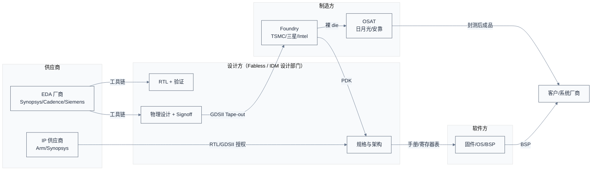
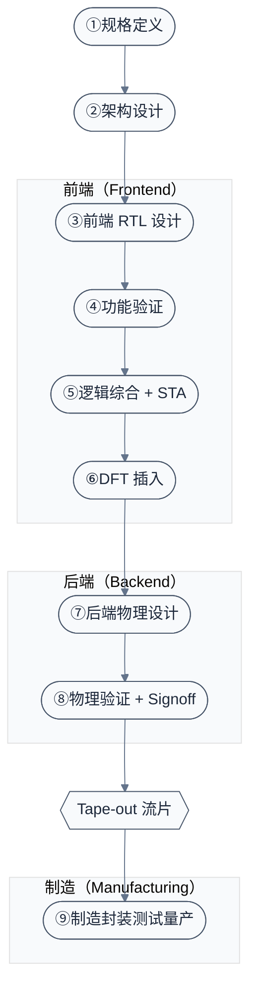
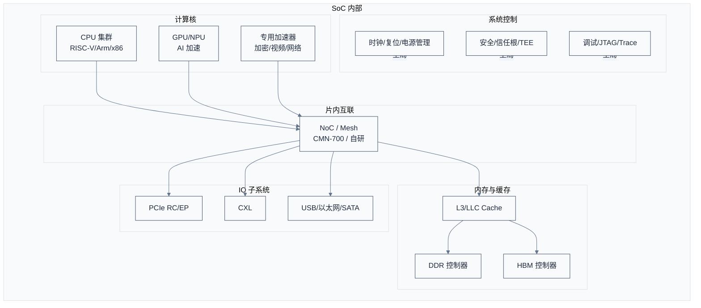

# SoC 设计全流程总览 —— 从一行规格到一片芯片

> 一句话概括：一片大规模 SoC（System on Chip，片上系统）从立项到量产，要走过**规格、架构、前端、后端、流片、制造、封装、测试、量产**九个阶段，跨越 Fabless 设计公司、IP 供应商、EDA 厂商、Foundry（晶圆厂）、OSAT（外包封测厂）五类角色，通常耗时 18–36 个月、耗资数千万到数亿美元。
> **工程师视角**：作为在"芯片-软件"交界处工作的工程师，你日常打交道的 SoC 手册、设备树、寄存器表，背后是一整套设计流程的产物。理解这套流程，不是为了去画版图，而是为了在调试时能判断"这是设计阶段定的、还是制造偏差、还是固件没用对"——知道一个现象该去问谁、该查哪份文档。

### 关键术语

| 缩写 | 全称 | 含义 |
|------|------|------|
| SoC | System on Chip | 片上系统，把 CPU/GPU/内存控制器/IO 等集成在一颗芯片上 |
| IP | Intellectual Property (core) | 可复用的设计模块，如 Arm CPU 核、Synopsys PCIe 控制器 |
| RTL | Register Transfer Level | 寄存器传输级，用硬件描述语言描述数字电路的数据流与控制流 |
| HDL | Hardware Description Language | 硬件描述语言，主要指 Verilog / VHDL / SystemVerilog |
| GDSII | Graphic Data Stream Information Interchange | 流片用的版图数据格式，交付给 Foundry 的最终产物 |
| EDA | Electronic Design Automation | 电子设计自动化工具，如综合、布局布线、验证工具 |
| PDK | Process Design Kit | 工艺设计套件，Foundry 提供给设计方的"工艺规则包" |
| Fabless | Fabrication-less | 无晶圆厂设计公司，自己不制造，如高通、英伟达、海思 |
| IDM | Integrated Device Manufacturer | 集成器件制造商，设计+制造+封测一体，如 Intel、三星 |
| Foundry | — | 晶圆代工厂，按设计方提供的版图代工制造，如 TSMC、三星 |
| OSAT | Outsourced Semiconductor Assembly and Test | 外包封测厂，做封装与成品测试，如日月光/安靠 |
| Tape-out | — | 流片，把版图数据交付 Foundry 制造的里程碑节点 |
| PPA | Performance / Power / Area | 性能、功耗、面积，芯片设计的核心三角权衡 |
| DFT | Design for Test | 可测性设计，在芯片内插入便于测试的硬件结构 |
| STA | Static Timing Analysis | 静态时序分析，不跑仿真即验证所有路径是否满足时序 |
| P&R | Place and Route | 布局布线，后端物理设计的核心步骤 |
| DRC/LVS | Design Rule Check / Layout Versus Schematic | 设计规则检查 / 版图与原理图一致性检查 |
| Signoff | — | 签核，流片前各维度（时序/功耗/物理）的最终验收 |
| PPA / Node | — | 工艺节点，如 7nm/5nm/3nm，代表工艺代际 |
| ESL | Electronic System Level | 电子系统级，用高级语言做架构级建模与仿真 |
| RTL/GDS/... | — | 见上 |

> **跨角色对照**：Fabless 设计方（写 RTL、做物理设计）↔ Foundry（按 GDSII 制造晶圆）↔ OSAT（切割封装测试）↔ IP 供应商（卖 CPU/PHY 等模块授权）↔ EDA 厂商（卖工具链）。这是当今半导体产业的主流分工——一颗芯片的设计与制造被切分到多家公司协同完成。

### 1.1 前置知识

| 需要了解 | 参考文档 |
|----------|----------|
| 数字电路基础（组合/时序逻辑、寄存器、时钟） | — |
| Verilog/SystemVerilog 基本语法 | — |
| 计算机体系结构（流水线、Cache、内存层级） | — |
| 片内总线协议（AXI/CHI） | [../interconnect/01-互联总线与协议全景辨析.md](../interconnect/01-互联总线与协议全景辨析.md) |
| DDR 内存基础 | [../ddr/README.md](../ddr/README.md) |

---

## 1. 概述

> **驱动力**：SoC 设计流程 20 年的演进，本质是被"晶体管微缩 → 集成度提升 → 设计复杂度爆炸"推着走的接力链——工艺每代微缩，单 die 能放的晶体管翻倍，但验证复杂度、物理设计难度、流片成本同步爆炸。这逼出三条演化路径：**IP 复用与平台化**（降设计复杂度）、**敏捷硬件开发**（CI/CD 缩短迭代）、**Chiplet 化**（绕开单 die 良率与成本墙）。**不变量**：无论怎么演进，"规格→架构→前端→后端→流片→制造→封测"的骨架不变，变的只是每一步的工具与协同方式。

### 1.2 系统上下文

**项目定位**：本文是整个 SoC 流程笔记的"地图"。它不深入任何单个工具或阶段的实现细节，而是回答三个问题——**这片芯片是谁造的？经历了哪些阶段？每个阶段产出什么、交给谁？** 读完本文，你应该能在看到任何 SoC 相关名词（比如"Tape-out 了"、"这颗 5nm"、"走 OSAT 封装"）时，迅速定位它在流程的哪个环节、涉及哪类角色。

**软硬件耦合点**（本规范最强调的视角）：

- **设计方 ↔ Foundry**：设计方拿 PDK 写 RTL、做版图；Foundry 按 GDSII 制造。PDK 是两者的契约——它规定了某一工艺下能用的器件、设计规则（最小线宽/间距）、电气参数（SPICE 模型）。**PDK 不对齐，版图就是废纸。**
- **IP 供应商 ↔ 设计方**：Arm 卖 CPU 核给高通，高通把它和自研 GPU、Synopsys 的 PCIe PHY 集成。IP 的"软核/硬核"形态决定了集成方式——软核给 RTL 自己综合，硬核给已物理实现的 GDSII 直接摆放。**IP 交付质量直接决定集成难度。**
- **芯片 ↔ 固件/OS**：芯片定义的中断号、地址映射、时钟树、电源域，最终变成设备树、ACPI 表、SBI/TF-A 平台代码。你在固件里调的每一个寄存器，都是架构与前端阶段设计决策的固化。
- **制造 ↔ 良率**：设计阶段每个"过紧的时序约束"、"过于激进的密度"，都会在量产时变成良率损失。设计与制造不是两个孤立环节，而是通过 DFM（Design for Manufacturing，可制造性设计）耦合。

**跨实现/跨架构对比**：

| 对比维度 | Fabless（高通/英伟达/海思） | IDM（Intel/三星） | RISC-V 新势力（SiFive/算能/进迭时空） |
|----------|------|------|------|
| 设计与制造 | 分离，靠 Foundry 代工 | 一体，自研工艺+自设计 | 分离，依赖 Foundry + 公开 IP |
| 工艺选择 | 选 TSMC/三星节点 | 用自家工艺（Intel 18A 等） | 多用成熟节点（7nm/12nm）控制成本 |
| CPU IP | 授权 Arm | 自研或授权 Arm | 自研或用开源 RISC-V |
| 设计周期 | 18–30 个月 | 类似，但工艺迭代更激进 | 12–24 个月，强调敏捷 |
| 软件生态 | 厂商驱动 BSP | 自家软硬协同（如 Intel+软件栈） | 依赖开源 + Linux 主线 |

> **如何读这张图**：横向是五个角色，纵向是数据/产物流向。注意三条关键耦合线——**IP 与 PDK 在规格阶段就进入设计方**（决定能用什么）、**GDSII 是设计方交付 Foundry 的唯一产物**（流片里程碑）、**固件依赖芯片手册**（架构阶段就要把软件接口定下来）。Fabless 模式的本质就是：设计方不拥有 Foundry，靠 GDSII 和 PDK 两个契约把设计与制造解耦。

> **核心要点**：现代半导体产业的主流是 Fabless + Foundry + OSAT 的分工模式。设计方掌握 RTL 与物理设计，Foundry 掌握工艺与制造，OSAT 掌握封装测试。三者的耦合点是 PDK（设计→制造）、GDSII（设计→制造产物）、手册（设计→软件）。理解这三个契约，就理解了整个产业链的接口。

---

## 2. 全流程地图：九个阶段一张图

> 上一章建立了产业链分工与三类契约（PDK/GDSII/手册）的全局框架。一个自然的问题是：这些角色和产物具体在哪些阶段交接、Tape-out 又为何成为分水岭？本章用九阶段流程图来回答——先给一张全局地图与一颗 RISC-V 服务器 SoC 的具体例子，再展开时间与人力分布。

先看一张完整的流程图，建立全局印象，再逐节展开。

> **如何读这张图**：①②是"想清楚要做什么"的阶段，产出规格与架构文档；③④⑤⑥是前端，把架构翻译成可验证的 RTL 并转向门级网表；⑦⑧是后端，把网表变成物理版图并通过签核；⑨是制造封测。**Tape-out 是分水岭**——之前是"在电脑上画芯片"，之后是"在工厂里造芯片"。Tape-out 一旦发生，纠错成本就从"改 RTL 重跑"变成"几十万到上千万美元的掩模费打水漂"。

### 2.1 一个具体例子：一颗服务器 SoC 的诞生

光看流程图太抽象，用一颗**RISC-V 服务器 SoC**（参考 SG2046 这类产品）走一遍，让你看到每个阶段到底产出什么。

| 阶段 | 这颗 SoC 在做什么 | 典型产出 |
|------|------|------|
| ①规格 | 定位"64 核 RISC-V 服务器，支持 DDR5/PCIe5/CXL，目标 2.0GHz" | 规格书、PPA 目标表 |
| ②架构 | 选 64 个 SG2042 同系列核、CMN-700 互联、Synopsys DDR5 控制器 | 架构文档、地址映射、IP 清单 |
| ③前端 RTL | 集成 IP，写自研模块（如安全协处理器）的 SystemVerilog | RTL 代码树 |
| ④验证 | 跑 UVM 回归、启动 Linux、跑 RISC-V 架构测试 | 验证报告、覆盖率报告 |
| ⑤综合+STA | 用 Design Compiler 综合，PrimeTime 收时序到 2.0GHz | 门级网表、时序报告 |
| ⑥DFT | 插扫描链、加 memory BIST | 带 DFT 的网表、ATPG 测试向量 |
| ⑦后端 | Floorplan、布局布线、时钟树（多时钟域） | 版图（DEF/GDSII） |
| ⑧签核 | DRC/LVS、最终 STA、功耗/EM/IR 分析 | Signoff 报告 |
| Tape-out | 把 GDSII 交给 TSMC | 流片里程碑 |
| ⑨制造封测 | TSMC 造晶圆 → 日月光倒装封装 → 测试分 bin | ES（工程样片）、量产芯片 |

> **核心要点**：每个阶段的产出都是下一阶段的输入。**Tape-out 之前的所有阶段都在"可逆"区间**——发现 bug 改 RTL 重跑就行（虽然贵）。**Tape-out 之后进入"半不可逆"区间**——制造已开始，掩模费已花；如果流片回来发现严重 bug，要么改 metal 重流（Eco/金属层改版，较便宜），要么全改重流（极贵）。所以签核阶段会反复检查到近乎偏执。

### 2.2 阶段的时间与人力分布

不同阶段花的时间差异巨大。下面是一颗中等规模 SoC（如手机 SoC）的典型分布（数值为业界经验区间，具体项目差异大）：

| 阶段 | 占设计周期比例 | 典型时长 | 人力主力 |
|------|:------:|------|------|
| ①规格 + ②架构 | 15–20% | 3–6 月 | 架构师、系统工程师 |
| ③前端 RTL | 15–20% | 4–6 月 | RTL 工程师 |
| ④功能验证 | 30–40%（最大头） | 与 RTL 并行且更长 | 验证工程师（人数常多于 RTL） |
| ⑤综合 + STA | 5–10% | 1–2 月 | 前端工程师 |
| ⑥DFT | 5% | 1 月 | DFT 工程师 |
| ⑦后端物理设计 | 15–20% | 4–6 月 | 后端工程师 |
| ⑧签核 | 5–10% | 1–2 月 | 后端 + 专项工程师 |
| ⑨制造封测 | 另算 | 3–6 月（流片到拿回芯片） | Foundry/OSAT |

> **如何读这张表**：注意**验证占了 30–40%**——这是设计阶段最大的单项投入。一个常见误解是"芯片设计就是写 RTL"，实际上写 RTL 的人往往比验证的人少。后端物理设计也占近 1/5，因为先进工艺下布局布线、时序收敛、IR 压降的难度急剧上升。制造封测的时间不算在"设计周期"里，但从立项到芯片到手通常再加 3–6 个月。

---

## 3. 钱花在哪：成本构成
> 上一章用九阶段地图与一颗 RISC-V 服务器 SoC 的例子建立了全流程框架。一个自然的问题是：走完这九阶段要花多少钱、单颗芯片又凭什么定价？本章用成本构成来回答--先拆 NRE（一次性工程费）与单颗成本，再讲工艺节点的商业代际本质与摩尔定律的放缓，最后给被系统性低估的"验证与软件成本"与 Tape-out 决策的对赌视角。

理解芯片流程，必须理解钱。一颗芯片的成本分两大块：**一次性投入（NRE）**和**单颗制造成本**。

### 3.1 NRE：一次性工程费用

NRE（Non-Recurring Engineering）是"不管你造多少颗都要花一次"的钱，包括设计人力、EDA 工具授权、IP 授权费、掩模费。

| NRE 项 | 典型金额（先进工艺） | 说明 |
|------|------|------|
| 掩模（Mask）费 | 3nm 约 50M$，5nm 约 20–40M$，7nm 约 10–15M$ | **最大单项**，先进工艺掩模套数多、贵到离谱 |
| EDA 工具年费 | 数百万到千万美元/年 | 三大厂（Synopsys/Cadence/Siemens）整套授权 |
| IP 授权费 | Arm CPU 核数百万到千万美元级 | 一次性 + 版税两段 |
| 设计人力 | 数千万美元/项目 | 大型 SoC 团队数百人 |
| 流片服务费 | 数百万美元 | Foundry 工程支持 |

> **待确认**：上述掩模费为业界常引用的经验区间，不同 Foundry、不同节点、不同掩模套数差异极大，实际以 Foundry 报价为准。

### 3.2 单颗成本：良率与规模

单颗芯片成本由良率与晶圆产出共同决定：

$$C_{\text{die}} \approx \frac{C_{\text{wafer}} + C_{\text{pkg}}}{Y \times N_{\text{die}}}$$

逐符号解释：

- $C_{\text{die}}$：单颗芯片成本，美元
- $C_{\text{wafer}}$：单片晶圆成本，美元（5nm 约 17000 美元）
- $C_{\text{pkg}}$：单片晶圆对应的封测成本，美元
- $Y$：良率，0~1（如 0.8）
- $N_{\text{die}}$：每片晶圆的好 die 数（理论 die 数 × 良率）

举个数值例子（示意，非真实报价）：一片 12 英寸 5nm 晶圆成本约 17000 美元，一片晶圆面积约 70000 mm²，单 die 假设 100 mm²，则每片晶圆理论上切出 700 颗 die；若良率 80%，则好 die 约 560 颗，代入公式 $C_{\text{die}} \approx (17000 + 0) / (0.8 \times 700) \approx 30$ 美元晶圆成本；加上封装测试约 10–30 美元，单颗成本约 40–60 美元。**注意**：这还没摊销 NRE——如果只卖 100 万颗，1 亿美元掩模费每颗就要摊 100 美元。

> **核心要点**：芯片是典型的"高固定成本 + 低边际成本"生意。NRE（尤其掩模费）是准入门槛，量大才能摊薄。这就是为什么先进工艺只有少数大厂能用得起——销量不够，单颗成本就降不下来，宁可退守成熟节点。3nm 掩模 50M$ 意味着至少要卖数千万颗才有经济性。

### 3.3 工艺节点：7nm 不是真的"7 纳米"

本文反复出现"7nm/5nm/3nm"这样的工艺节点名，必须澄清一个常见误解：**节点数字早已不再是晶体管的真实物理尺寸**。

早期（90nm 以上），节点名大致对应栅长或半节距——130nm 工艺的栅长确实约 130nm。但进入 28nm 以后，由于短沟道效应与光刻限制，栅长不再按节点等比缩小，节点名演变成**商业代际标识**——它代表"这一代工艺的综合密度与性能水平"，而非某个具体物理尺寸。

| 节点名 | 实际栅长（量级） | 实际金属半节距 | 说明 |
|------|------|------|------|
| 28nm | ~25nm | ~40nm | 仍较接近 |
| 7nm | ~12nm | ~18nm | 名字与物理尺寸已脱钩 |
| 5nm | ~8nm | ~14nm | |
| 3nm | ~6nm | ~11nm | 与 5nm 物理尺寸接近，靠架构优化拉开差距 |

> **待确认**：上表为量级估算，不同 Foundry 定义不同（TSMC/Intel/Samsung 对"3nm"的密度各不相同）。

所以比较芯片时，**不能只看节点名**——Intel 7（10nm 增强版）的密度与 TSMC 7nm 接近；TSMC N5 与 Intel 4 密度相当。业界更可靠的对比指标是**晶体管密度**（MTr/mm²，每平方毫米百万晶体管）和**SRAM 密度**。这也是为什么 Intel 改用"Intel 18A/Intel 3"命名而非纳米数。

> **核心要点**：工艺节点名是"代际商标"而非物理尺寸。28nm 以后节点名与实际栅长脱钩，比较工艺要看密度（MTr/mm²）而非名字。这解释了为什么"Intel 7 ≈ TSMC 7nm"——名字不同，密度相当。

### 3.4 摩尔定律：推动整个产业半个世纪的引擎

理解 SoC 流程的演进，绕不开摩尔定律（Moore's Law）。1965 年 Gordon Moore 观察到：**集成电路上可容纳的晶体管数目，约每 18–24 个月翻一番**。形式化地，若 $\tau$ 为翻倍周期（月），$N_0$ 为起点晶体管数，$t$ 个月后晶体管数为：

$$N(t) = N_0 \cdot 2^{t/\tau}, \quad \tau \in [18, 24]\,\text{月}$$

逐符号解释：

- $N(t)$：$t$ 个月后的晶体管数
- $N_0$：起点（$t=0$）的晶体管数
- $\tau$：翻倍周期，$18\sim 24$ 个月
- $t/\tau$：经过的翻倍周期数

**数值演算**：$N_0 = 1000$、$\tau = 18$ 月、$t = 10$ 年 $= 120$ 月，则 $N(120) = 1000 \times 2^{120/18} \approx 1000 \times 2^{6.67} \approx 1000 \times 101.6 \approx 101600$--10 年后晶体管数翻约 6.7 个倍频，即约 100 倍。这与过去 60 年的观测大致吻合，也是为什么你手机里的芯片比登月时代的整个 NASA 算力还强。

但物理极限终将逼近：原子尺寸是底线，硅的栅氧在几个原子层时就出现严重漏电。业界普遍认为**摩尔定律正在放缓**--单 die 密度提升变慢、成本下降变慢（近年 $\tau$ 已拉长到 30 月以上）。应对正是 [§5 现代趋势](#5-现代趋势chiplet3dai-soc)的三条路线：Chiplet（拆 die 提良率）、先进封装（堆叠提密度）、领域专用架构（DSA，靠架构而非工艺提性能）。

---
### 3.5 资深经验：被系统性低估的"验证与软件成本"

成本构成表列的是"显性成本"（掩模/EDA/IP/人力），但半导体行业有一个公认的"账外成本"问题，值得单列——**验证与软件的成本被系统性地低估**。

**一个反直觉的数据点**（Cadence 公开演讲中反复引用）：半导体公司**把 80% 的工程人力花在软件开发和验证上，只有 20% 花在设计与 IP 上；但工具预算的 80% 花在芯片设计工具上，只有 20% 花在验证与软件工具上**。也就是说——**资源最多的环节，恰恰是被资本化最少的环节**。这带来两个直接后果：

1. **验证/软件团队的人均工具投入远低于设计团队**：仿真与验证工具（Emulation、仿真器 License、覆盖率工具）在预算优先级上常年排后。资深团队知道该争取什么——**Emulation 一个周期的成本，摊到大批量回归上是你能买到的最便宜的验证向量**（详见 [03 章 §3.5](./03-前端设计RTL与验证.md#35-硬件加速验证从跑不动到跑得起来)），但预算委员会不这么算。
2. **"设计做完了"不等于"项目快完了"**：流片只是设计阶段的结束。**软件 bring-up、系统验证、量产爬坡加起来往往占项目总工期的 40% 以上**——NVIDIA 用 Emulation 把系统仿真 10 个月，换来硅回来几小时 bring-up，就是靠提前烧验证/软件成本换后期时间。

> **核心要点（成本资深视角）**：读成本表时，不要只盯掩模费和 EDA 费——**真正的隐藏成本是"验证不完备"和"软件没提前跑"**。一颗芯片流片后才发现 bug，Metal ECO 重流的几十万到数百万美元只是看得见的损失，看不见的是**软件团队全员空等芯片的数月工期**。成熟的成本观是把验证工具预算看作"保险金"：**在仿真阶段花 1 美元，通常能在流片后省 100 美元**——这是验证行业反复验证的经验比值。

### 3.6 资深经验：Tape-out 决策是"风险与时间的对赌"

Tape-out 不是"设计做完了"，而是**在"再多验证一轮"与"抢市场窗口"之间做决定**。资深项目管理的判断框架：

| 决策维度 | 倾向推迟 Tape-out | 倾向按时 Tape-out |
|----------|------------------|------------------|
| 覆盖率 | 功能覆盖率 < 95%，还有未覆盖的高风险场景 | 覆盖率达标，剩余风险已量化 |
| 已发现 bug 趋势 | 每周新 bug 还在两位数，曲线没收敛 | bug 收敛曲线已趋于零，多为低风险 |
| 市场窗口 | 无硬性发布节点，迟 3 个月可接受 | 有强竞争节点（如年底发布季），晚=丢市场 |
| 重流成本承受力 | 掩模费对项目预算占比高 | 项目量大，重流成本可摊薄 |
| 软件就绪度 | 软件生态还远，硅回来也无人可用 | 软件团队已通过 VP/Emulation 就绪，硅回来即可 bring-up |

> **核心要点（Tape-out 资深视角）**：**"再验证一个月"的成本是团队月薪 + EDA/Emulation 租金；"提前流片"的风险是掩模费打水漂 + 产品上市返工**。资深团队用三个信号做决策——**bug 收敛曲线**（每周新 bug 数是否趋零）、**覆盖率缺口**（剩余未覆盖是否高风险）、**市场窗口价值**（晚一个月损失多少钱）。**注意**：工程上"完备"永远是逼近而非到达，Tape-out 决策的本质是**在可量化的剩余风险与可量化的时间成本之间，做出管理者敢签字的决定**。

## 4. SoC 的典型组成：到底"片上"集成了什么
> 上一章讲了钱花在哪。一个自然的问题是：花这么多钱造的"SoC"到底由哪些模块拼成、这些模块从哪来？本章用典型组成来回答--先看一张现代服务器/AI SoC 的方框图，再讲 IP 的来源（买还是自研）。

在深入每个阶段前，先看清楚"SoC 到底是个什么东西"。下图是一颗现代服务器/AI SoC 的典型组成：

> **如何读这张图**：SoC = 计算 + 内存 + IO + 互联 + 系统控制，五类模块通过片内互联（NoC/Mesh）连成一体。**互联是骨架**（详见 [../interconnect/](../interconnect/)），**IP 是肉**。架构师的工作，本质上就是"选哪些 IP、怎么连、怎么分地址、怎么管时钟电源"。注意右下角"系统控制"——时钟树、电源域、安全根、调试设施，这些往往不出现在产品宣传里，却决定了固件能不能正常初始化、能不能调起来。

### 4.1 IP 的来源：买还是自研

SoC 里的模块不是都自己写的，大部分是买来的：

| IP 类型 | 典型来源 | 软核/硬核 | 谁在用 |
|------|------|------|------|
| CPU 核 | Arm（Cortex/Neoverse）、SiFive、T-Head | 多为软核（RTL） | 几乎所有非 x86 SoC |
| GPU | Arm Mali、Imagination、自研 | 软核 | 手机/服务器 SoC |
| DDR PHY/控制器 | Synopsys、Cadence、Rambus | 硬核（PHY）/软核（控制器） | 所有带 DDR 的 SoC |
| PCIe/CXL/USB PHY | Synopsys、Cadence | 硬核 | 所有高速 IO SoC |
| 互联 | Arm CMN、Arteris、自研 | 软核 | 大规模 SoC |
| 安全 | Arm TrustZone、RISC-V PMP/Tee | 软核 | 通用 |
| 物理库（标准单元/IO） | TSMC/Synopsys/Cadence | 硬核 | 所有 Foundry 工艺 |

**软核 vs 硬核**是 IP 集成的核心区分：

- **软核（Soft IP）**：交付 RTL，设计方自己综合、布局。灵活、可移植到不同工艺，但性能/面积由设计方综合质量决定。CPU 核、控制器逻辑通常是软核。
- **硬核（Hard IP）**：交付已物理实现的 GDSII（针对特定工艺），直接摆放。性能/面积/功耗最优，但不可移植，绑定单一工艺。PHY（DDR/PCIe/USB）、标准单元库通常是硬核。

> **核心要点**：SoC 设计不是"从零写所有模块"，而是"集成一堆 IP + 自研少量核心逻辑"。架构师 70% 的工作是 IP 选型与集成，30% 是自研差异化模块。**软核靠综合、硬核靠摆放**——这两类 IP 的集成流程在后端阶段完全不同。

---

## 5. 现代趋势：Chiplet、3D、AI SoC
> 上一章看了单 die SoC 的组成与 IP 来源。一个自然的问题是：单 die 越做越大还经济吗、产业下一步往哪走？本章用现代趋势来回答--先讲 Chiplet（拆 die 提良率），再讲先进封装（2.5D/3D 堆叠提密度），最后讲 AI 加速器 SoC 这个新物种。

经典的"单 die 单片 SoC"在 7nm 以下遇到三重墙：**良率墙**（die 越大良率越低）、**光刻墙**（掩模成本爆炸）、**功耗墙**（单片功耗密度爆表）。业界应对是三条路线。

### 5.1 Chiplet：把大 die 拆成小 die

Chiplet（小芯片）思路：把一颗大 SoC 拆成多个小 die，在封装内用高速互连（如 UCIe）连起来。代表：AMD Zen 系列的 chiplet CPU、Intel Ponte Vecchio、Intel/AMD 的多 die 设计。

| 对比维度 | 单片 SoC（Monolithic） | Chiplet |
|------|------|------|
| 良率 | die 大，良率低 | die 小，良率高 |
| 工艺 | 全用一个节点 | 可混合（计算核用 5nm，IO 用 12nm） |
| 互联 | 片内总线 | 封装内 D2D（UCIe/NVLink-C2C） |
| 成本 | 掩模一套但贵 | 掩模多套但每套小，可复用 |
| 设计 | 一次 | 多 die 协同设计复杂 |

### 5.2 先进封装：2.5D / 3D

- **2.5D**：多 die 摆在同一基板上，通过硅中介层（Silicon Interposer）高密度互连。代表：台积电 CoWoS（NVIDIA H100 用）。**为什么 2.5D 要硅中介层**?因为有机基板的布线密度不够(线宽/间距在微米级),而计算 die ↔ HBM 的互连需要上千根线、超高带宽——硅中介层线宽可达亚微米,把高密度互连从 PCB 移到硅上,这是"用硅工艺密度换互连密度"。
- **3D**：die 垂直堆叠，用 TSV（Through-Silicon Via，硅通孔）连接。代表：HBM（高带宽内存）与计算 die 的 3D 堆叠、台积电 SoIC、Intel Foveros。

### 5.3 AI 加速器 SoC

AI 大模型催生了一类新 SoC：以张量计算为核心、HBM 为内存、NVLink/UALink 为互联。代表：NVIDIA H100/B200、AMD MI300、Google TPU、Tenstorrent。这类 SoC 的设计重心从"通用计算"转向"数据流与内存带宽"——**算力可堆，带宽才是天花板**。**为什么算力可堆、带宽才是天花板**?因为计算 die 可以靠 Chiplet + 先进封装多堆几片,但 HBM 带宽虽高、接口数有限(AI 计算访存比约 10:1,即每算 10 个数要读 1 次内存),堆计算 die 让访存需求涨、HBM 接口数跟不上,带宽先于算力触顶。这就是为什么 AI 芯片都在抢 HBM 容量与带宽。

> **核心要点**：先进工艺下，"单片大 SoC"越来越不经济，产业向"Chiplet + 先进封装 + 异构工艺"演进。这意味着芯片设计的边界从"单 die"扩展到"多 die 系统"，封装内互连（UCIe）和 3D 堆叠成为新的设计维度。对软件工程师而言，多 die SoC 带来了 NUMA、die 间延迟、跨 die 一致性等新问题——硬件不再是"一个平面"。

---

## 6. 全流程的角色与协作
> 上一章讲了 Chiplet/先进封装/AI SoC 的现代趋势。一个自然的问题是：回到流程本身，九个阶段、五类角色、三种产物具体怎么衔接、EDA 工具怎么分工？本章用角色协作表来回答--先给一张全流程角色-工具-产物-交接表，再补 EDA 三大厂商工具全景、硅后调试与 errata 管理、敏捷硬件开发三条现代路径。

把九个阶段、五类角色、三种产物放一张表，建立最后的全局视图：

| 阶段 | 主力角色 | 用到的关键 EDA | 产出 | 交给谁 |
|------|------|------|------|------|
| ①规格 | 架构师、产品 | Excel/Word/内部工具 | 规格书、PPA 目标 | ②架构 |
| ②架构 | 架构师 | ESL 工具（如 Gem5/Synopsys Platform Architect） | 架构文档、IP 清单、地址映射 | ③前端、固件 |
| ③前端 RTL | RTL 工程师 | 编辑器 + SystemVerilog | RTL 代码树 | ④验证 |
| ④验证 | 验证工程师 | VCS/Xcelium、UVM、JasperGold | 验证报告、覆盖率 | ⑤综合 |
| ⑤综合+STA | 前端工程师 | Design Compiler/Genus、PrimeTime | 门级网表、时序报告 | ⑥DFT、⑦后端 |
| ⑥DFT | DFT 工程师 | Tessent/TestKompress | 带 DFT 网表、ATPG 向量 | ⑦后端 |
| ⑦后端 | 后端工程师 | ICC2/Innovus、CTS | 版图 | ⑧签核 |
| ⑧签核 | 后端 + 专项 | Calibre、PT、Voltus | Signoff 报告 | Foundry |
| Tape-out | 项目经理 | — | GDSII | Foundry |
| ⑨制造封测 | Foundry/OSAT | — | 裸 die → 封装芯片 → 测试分 bin | 客户 |

> **核心要点**：整个流程是"前一段产出喂给后一段"的瀑布，但验证和签核是两个**回环点**——验证发现 bug 改 RTL，签核不过改物理设计，都会回到上游。**EDA 工具是贯穿全流程的"第二语言"**，三大厂商（Synopsys/Cadence/Siemens）几乎垄断了先进工艺的工具链，这也是为什么 EDA 授权费如此之高。

### 6.1 EDA 工具全景：三大厂商的工具链分工

> 上面表格每行都列了关键 EDA 工具，但没讲"三大厂商各自强项、工具链依赖、License 商业模式"。本节补这张全景图——它是贯穿全流程的"第二语言"，理解它才能看懂各阶段工程师的工具选型。

| 厂商 | 强项领域 | 代表工具 | 流程覆盖 |
|------|----------|----------|----------|
| **Synopsys** | 完整 flow + 签核龙头 | Design Compiler（综合）、PrimeTime（STA）、ICC2（P&R）、StarRC（寄生）、Formality（LEC）、SpyGlass（Lint/CDC）、VCS（仿真）、VC Formal（形式）、ZeBu/HAPS（HAV） | 前端到签核全覆盖 |
| **Cadence** | 完整 flow + 模拟/定制强 | Genus（综合）、Innovus（P&R）、Tempus（STA）、Conformal（LEC）、Xcelium（仿真）、JasperGold（形式）、Palladium/Protium（HAV）、Voltus（IR） | 全覆盖，模拟/定制 IC 尤其强 |
| **Siemens EDA（Mentor）** | 签核 + DFT 垄断 | Calibre（DRC/LVS/PERC，签核事实标准）、Tessent（DFT，市占领先）、Veloce（HAV）、Questa（仿真）、Calibre xRC（寄生） | 物理验证 + DFT 是护城河 |

**工具链依赖关系**：后端流程的每个工具读不同文件（见 [04 章 §6.6](./04-后端物理设计与签核.md#66-工艺规则文件层次)）——综合读 .lib、P&R 读 LEF/TF、寄生提取读 RCx、STA 读 .lib。这些文件来自 Foundry PDK，**三大厂商的工具与 PDK 有"认证"关系**——Foundry 只认证特定工具版本为 signoff 工具（如 Calibre 认证为 DRC/LVS signoff、PrimeTime 认证为 STA signoff），用未认证工具的结果 Foundry 不收。

**License 商业模式**：

| 模式 | 特点 | 适用 |
|------|------|------|
| 固定 License（node-locked） | 绑定一台机器，便宜但利用率受机器限制 | 小团队 |
| 浮动 License（floating） | 多人共享一个 License 池，按并发数计费 | 主流，大团队 |
| 云端 License | 按小时/按用量计费，弹性扩缩 | 高峰项目、小团队 |

> **核心要点**：三大 EDA 厂商各押一边——**Synopsys 综合/STA 强、Cadence P&R/模拟强、Siemens Calibre/DFT 垄断**，签核工具的"Foundry 认证"关系是护城河。**EDA 授权费是 NRE 成本的大头之一**，这也是为什么先进工艺 EDA 费可达数千万美元——一个完整流程要买齐三大厂商的工具链。

### 6.2 硅后调试与 errata：流片回来后的事

> 上面九个阶段到 Tape-out 结束，但芯片真正的考验在流片回来之后——硅后调试与 errata 管理。这是"组件交界处"固件工程师的高频场景，本节补这条链路。

硅后调试的典型链路：

1. **Bring-up**：ES 样片回来，固件团队第一次在真实硅上跑代码。常发现 RTL 验证没覆盖的时序问题、IP 集成边界 bug、电源/时钟实际表现偏差。
2. **Bug 定位**：用 JTAG/trace 抓现场，判定"是 RTL bug、固件 bug、还是制造偏差"。制造偏差会让某些 die 行为异常（见 [05 章 §8.1](./05-流片制造封装与量产测试.md#81-es-调试软硬件第一次真集成)）。
3. **Errata sheet**：确认的 bug 写进 errata 清单，含受影响 stepping、症状、规避方案（workaround）、修复计划。固件/驱动据此写绕过（如 CPU errata 在 SBI/TF-A 层 patch）。
4. **Metal ECO vs Full Respin**：能改金属层的 bug 用 Metal ECO（只改几层掩模，2–3 月、数十万美元）；RTL 结构错的 bug 要 Full Respin（全掩模重流，6–9 月、数百万美元）。**优先 Metal ECO**，靠 spare cells 接入（见 [05 章 §8.1.2](./05-流片制造封装与量产测试.md#812-metal-eco-vs-full-respin硅后修复的决策树)）。
5. **Stepping 升级**：每次流片/ECO 升一个 stepping（A0→B0→C0），固件据此查"我手上这颗芯片有什么已知问题"。

**errata 在固件层的绕过**：典型如 CPU 的某条指令在某些条件下结果错——固件在 SBI/TF-A 启动时检查 stepping，若是受影响版本，patch 该指令的使用或禁用某特性。**errata sheet 是固件工程师与芯片交付团队沟通的契约**。

> **核心要点**：硅后调试是"组件交界处"的高频场景——ES 回来发现 bug 是常态，靠 errata sheet 管理、Metal ECO 修复、stepping 升级闭环。**固件工程师读 errata 写 workaround 是日常**——你查的"这颗芯片有什么已知问题"就是 errata。这也是为什么同型号芯片有不同 stepping——每个 stepping 是一次 Metal ECO 或重流的产物。

### 6.3 敏捷硬件开发：CI/CD 进入 RTL 流程

> 上面讲的是传统瀑布流程，但近年业界出现"敏捷硬件开发"——把软件的 CI/CD（持续集成/持续交付）理念引入 RTL 设计。这是应对"设计复杂度爆炸"的另一条路径。

敏捷硬件开发的三个特征：

1. **CI for RTL**：每次 RTL 提交触发自动回归——Lint + 轻量仿真 + 覆盖率比对。新提交引入的 `error` 阻断合并，问题挡在进综合前（shift-left）。代表工具：GitHub Actions / Jenkins + EDA 工具 CLI。
2. **迭代式 spec-to-tapeout**：不像传统流程"RTL 全写完再验证"，而是小步快跑——写一段 RTL + 对应验证用例，跑通再写下一段。这能避免"积累的 bug 让调试变成噩梦"。
3. **云原生 EDA**：EDA 工具从"买 License 装机房"转向"按需调云上 EDA"（见 [03 章 §3.5.5](./03-前端设计RTL与验证.md#355-成本模型为什么是云租用而非人人一台)）。这让小团队也能用上完整流程，是敏捷硬件的物质基础。

**公开案例**：Google TPU 团队公开过用敏捷 + 云 EDA 加速迭代；高校与初创（如 EFableys、CHIPS Alliance）用开源 EDA（OpenLane/OpenROAD）做小芯片敏捷流片。但**先进工艺大芯片仍以传统瀑布 + 重流程为主**——敏捷目前主要在中等规模 RTL 与学术/初创场景。

> **核心要点**：敏捷硬件开发把软件 CI/CD 引入 RTL——**CI for RTL 把问题挡在综合前、迭代式 spec 避免积累 bug、云 EDA 让小团队也能用完整流程**。这是应对设计复杂度爆炸的路径，但先进工艺大芯片仍以传统重流程为主——敏捷与瀑布的融合是趋势，不是替代。

---

## 7. 本文之后：怎么读下去

> 上一章用 EDA 全景、硅后调试与敏捷硬件三个延伸话题补完了流程图。一个自然的问题是：本文只是地图，后续每章怎么深入？本章用阅读导航来回答——列出后续四章的主题与建议阅读顺序。

本文建立了全景地图。接下来的四章按流程顺序深入每个关键环节：

- [02-规格定义与架构设计](./02-规格定义与架构设计.md)：讲清楚"想做什么"——PPA 权衡、IP 选型、软硬件协同。
- [03-前端设计RTL与验证](./03-前端设计RTL与验证.md)：讲清楚"怎么把架构变成可验证的代码"——RTL、UVM、综合、STA、DFT。
- [04-后端物理设计与签核](./04-后端物理设计与签核.md)：讲清楚"怎么把代码变成版图"——Floorplan、P&R、签核。
- [05-流片制造封装与量产测试](./05-流片制造封装与量产测试.md)：讲清楚"怎么把版图变成芯片"——Tape-out、Fab、封装、测试、良率。

如果你只读一章，读 02——它最能改变你"看芯片手册"的方式。

---

## 参考资料

- [IRDS (International Roadmap for Devices and Systems)](https://irds.ieee.org/) — 参考 §3 工艺节点演进趋势与路线图
- [TSMC Technology Overview](https://www.tsmc.com/english/dedicatedFoundry/technology/index.htm) — 参考 §3.3 N7/N5/N3 节点与密度
- [Synopsys Design Compiler / PrimeTime / ICC2 文档](https://www.synopsys.com/implementation-and-signoff/) — 参考 §6.1 综合/STA/P&R 工具分工
- [Cadence Genus / Innovus / Tempus 文档](https://www.cadence.com/) — 参考 §6.1 EDA 三大厂商分工
- [Siemens EDA Calibre / Tessent 文档](https://eda.sw.siemens.com/) — 参考 §6.1 物理验证与 DFT 工具分工
- [UCIe Specification](https://www.uciexpress.org/) — 参考 §5.1 Chiplet 片间互连
- [Google TPU 论文 / 开源硬件社区](https://www.chipsalliance.org/) — 参考 §6.3 敏捷硬件开发与开源 EDA
- [../interconnect/01-互联总线与协议全景辨析.md](../interconnect/01-互联总线与协议全景辨析.md) — 参考 §5 片内/片间互连分层
