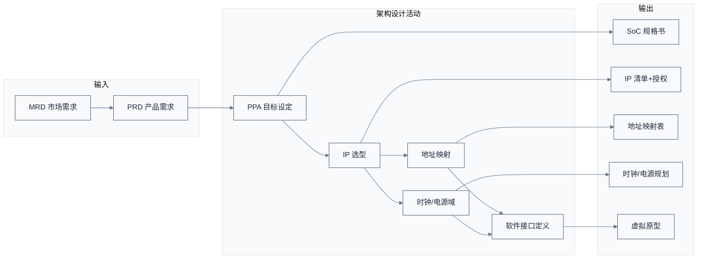
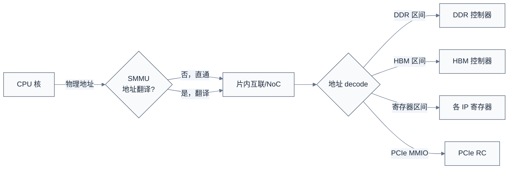

# 规格定义与架构设计 —— 想清楚要造什么

> 一句话概括：架构阶段回答"这片芯片到底要做什么、做到什么程度、用哪些 IP 凑出来"——它把市场语言（"做一颗 AI 推理 SoC"）翻译成工程语言（"64 TOPS@INT8、8 通道 LPDDR5、PCIe Gen5 x16、TSMC 6nm"），并定下 PPA（性能/功耗/面积）三个无法同时满足的硬约束。
> **工程师视角**：你后来在 SoC 手册里看到的地址映射、中断号、时钟域、电源域、IP 清单，全部诞生于这个阶段。架构师画的那张方框图，决定了你写设备树时要填多少个节点、固件初始化要按什么顺序来。理解架构阶段，就是理解"芯片为什么长成手册里那个样子"。

### 关键术语

| 缩写 | 全称 | 含义 |
|------|------|------|
| PPA | Performance / Power / Area | 性能、功耗、面积，芯片设计核心三角 |
| PRD | Product Requirements Document | 产品需求文档，市场驱动的输入 |
| MRD | Market Requirements Document | 市场需求文档 |
| ESL | Electronic System Level | 电子系统级建模，用高级语言做架构仿真 |
| VP | Virtual Prototype | 虚拟原型，软件可早期运行的架构模型 |
| IP | Intellectual Property (core) | 可复用设计模块，软核（RTL）或硬核（GDSII） |
| SoC Spec | — | SoC 规格书，定义所有接口/地址/时钟/电源 |
| TDP | Thermal Design Power | 热设计功耗，散热设计依据 |
| BOM | Bill of Materials | 物料清单，板级成本 |
| MMU | Memory Management Unit | 内存管理单元 |
| SMMU | System Memory Management Unit | 系统 MMU（ARM）/ IOMMU（RISC-V/x86） |
| QoR | Quality of Results | 综合结果质量（面积/时序/功耗） |

### 1.1 前置知识

| 需要了解 | 参考文档 |
|----------|----------|
| SoC 全流程地图 | [01-SoC设计全流程总览](./01-SoC设计全流程总览.md) |
| 片内互联协议（AXI/CHI） | [../interconnect/01-互联总线与协议全景辨析.md](../interconnect/01-互联总线与协议全景辨析.md) |
| DDR 内存基础 | [../ddr/01-DDR基础概念.md](../ddr/01-DDR基础概念.md) |

---

## 1. 概述

### 1.2 系统上下文

**项目定位**：架构设计是流程的"上游源头"——它接收来自产品/市场的 PRD（产品需求），输出一份足以让前端 RTL 工程师开干的 SoC 架构规格。这个阶段的产出物不是代码，而是文档、方框图、地址映射表、IP 清单、时钟/电源域规划。**它决定了芯片 70% 的最终成本与性能**——架构阶段的决策一旦流片就难以推翻。

**软硬件耦合点**：

- **PRD ↔ 架构**：市场要"AI 推理 50 TOPS"，架构师要算"需要多少 MAC 阵列、多少带宽、什么工艺能跑到这个频率"。市场语言到工程语言的翻译在这里完成。
- **IP 选型 ↔ 集成**：选了 Arm Neoverse N2，就要接受它的 AMBA CHI 接口、地址位宽、一致性域边界。IP 不是孤立模块，它的接口约束整个 NoC 设计。
- **架构 ↔ 固件**：地址映射、中断号、时钟树、电源域——这些架构阶段定下的东西，直接变成固件初始化代码与设备树。**改架构等于改固件**。
- **PPA ↔ 工艺**：2.0GHz@7nm 和 2.5GHz@5nm 是完全不同的设计。工艺节点决定能跑多快、功耗多少、面积多大。

**跨实现对比**：

| 对比维度 | 通用服务器 SoC | AI 加速器 SoC | 嵌入式 MCU SoC |
|------|------|------|------|
| 架构重心 | 通用算力 + 大带宽 | 张量算力 + HBM 带宽 | 低功耗 + 实时性 |
| 典型 CPU | Arm Neoverse / RISC-V RVA22 | 弱 CPU（仅控制面） | RISC-V / Cortex-M |
| 内存 | DDR5 多通道 | HBM + DDR | LPDDR / SRAM |
| 互联 | CHI Mesh | 数据流 NoC | AXI 总线 |
| PPA 权重 | 性能=带宽 | 性能=算力+带宽 | 功耗第一 |



> **如何读这张图**：架构设计不是线性流程，而是"PPA 目标驱动 IP 选型，IP 选型约束地址映射与时钟电源，三者共同定义软件接口"的迭代。**最容易被低估的是"软件接口定义"**——很多项目架构师只画硬件方框图，等到固件团队接手才发现寄存器地址没定、中断号冲突，被迫返工。

> **核心要点**：架构阶段是把"模糊的产品意图"转成"精确的工程契约"的过程。它的核心产物不是方框图，而是**可被前端、后端、固件三方共同依赖的规格书**——里面每一个地址、每一个中断号、每一个时钟域，都是后续数月工作的输入。

---

## 2. 产品定义：从市场语言到工程语言

### 2.1 PRD 里都有什么

一份合格的 PRD 至少回答这些问题：

| 维度 | 典型内容 | 工程翻译 |
|------|------|------|
| 目标市场 | "AI 推理服务器" | 算力目标、内存带宽、IO 带宽 |
| 性能 | "50 TOPS@INT8" | MAC 阵列规模、运行频率 |
| 功耗 | "<75W TDP" | 工艺、电压、电源域设计 |
| 成本 | "单颗 < 200 美元" | die 面积、封装、良率目标 |
| 供货 | "2026 Q2 量产" | 流片节点倒推、ES 时间表 |
| 兼容性 | "支持 Linux 主线、PCIe Gen5" | IP 选型、软件栈承诺 |
| 差异化 | "片间一致性互联" | 自研模块、IP 自研 vs 采购 |

### 2.2 一个具体例子：把"AI 推理 SoC"翻译成工程目标

假设 PRD 写的是"面向数据中心推理的 50 TOPS SoC，75W TDP"。架构师的第一步是**倒推算力与带宽**：

1. **算力倒推**：50 TOPS@INT8，若 MAC 阵列运行在 1.0GHz，每周期需 50 TOPS / 1GHz = 50 TOPS = 50000 GOPS/周期 → 需 25000 个 INT8 MAC（每个 MAC 每周期 2 次运算：乘+加，即 2 OP）。若用 128×128 阵列 = 16384 MAC，则需 ~1.5 个阵列或加大阵列。
2. **带宽倒推**：推理的算力利用率受限于带宽。典型 INT8 推理每 TOPS 需要 ~2 GB/s 带宽，50 TOPS 需 ~100 GB/s。DDR5-6400 单通道 51.2 GB/s，需 2 通道；若上 HBM3，单 stack 1 TB/s，远超需求。
3. **功耗倒推**：75W 里，MAC 阵列估算 30W、DDR 控制器+PHY 15W、NoC+Cache 15W、IO 10W、时钟树 5W——能对得上。

这就是架构师日常：**从顶层指标倒推子系统预算**，每一项都要落到具体 IP 与工艺。

> **核心要点**：架构师的核心技能不是画图，而是**预算分配**——把顶层的 PPA 目标拆成每个子系统的算力/带宽/功耗/面积预算，再为每个预算找到合适的 IP 或决定自研。预算分不平，就要回去砍 PRD。

---

## 3. PPA 三角：芯片设计的"不可能三角"

PPA（Performance / Power / Area）是芯片设计的核心约束，三者无法同时最优化——这就是架构师永恒的权衡。

### 3.1 三者关系

- **性能↑** → 要更高频率（升压升功耗）或更多并行（升面积）。
- **功耗↓** → 要降电压（降频率降性能）或门控（牺牲峰值性能）。
- **面积↓** → 要更小工艺（升成本升功耗密度）或更少资源（降性能）。

用一个数值例子感受：同一逻辑，从 1.0GHz 提到 1.2GHz（+20% 性能），往往要把电压从 0.8V 升到 0.9V，功耗与电压平方成正比，动态功耗增加约 (0.9/0.8)² × 1.2 ≈ 1.52 倍——**性能涨 20%，功耗涨 50%**。这就是为什么"再挤一点频率"代价巨大。

### 3.2 工艺对 PPA 的影响

| 工艺节点 | 典型频率 | 典型功耗密度 | die 成本 | 适用场景 |
|------|------|------|------|------|
| 28nm | < 1.5GHz | 低 | 低 | 嵌入式、IoT |
| 12/16nm | 2.0–2.5GHz | 中 | 中 | 中端 SoC |
| 7nm | 2.5–3.0GHz | 较高 | 高 | 服务器/手机旗舰 |
| 5nm | 3.0GHz+ | 高 | 很高 | 旗舰 |
| 3nm | 3.0GHz+ | 很高 | 极高 | 顶级 |

> **核心要点**：PPA 三角不是"三个目标都尽量好"，而是"在某一工艺与预算下，找一个可接受的折中点"。架构师的每一项决策（加几个核、用不用 HBM、跑多高频率）都是在三角里挪位置。**没有完美架构，只有对得起 PRD 的折中**。

---

## 4. IP 选型与采购：买还是造

这是架构阶段最核心的活动之一。SoC 里 70% 的模块是买来的 IP，选错 IP 会拖垮整个项目。

### 4.1 选型维度

| 维度 | 考量点 | 例子 |
|------|------|------|
| 功能匹配 | IP 是否支持所需特性 | DDR5 控制器是否支持 6400Mbps |
| 接口兼容 | IP 接口能否接入 NoC | CPU 核用 CHI 还是 AXI |
| 工艺适配 | 软核可综合到目标工艺？硬核有无目标工艺版？ | Arm 硬核只在 TSMC 5nm 有 |
| PPA 表现 | IP 在目标工艺的 QoR | 频率、功耗、面积报告 |
| 授权模式 | 一次性 + 版税？固定费用？ | Arm 是版税模式 |
| 交付质量 | 文档、验证套件、参考设计 | 是否带 UVM 验证环境 |
| 供货风险 | IP 厂商稳定性、出口管制 | 地缘政治影响 |

### 4.2 软核 vs 硬核：集成方式差异

| 对比维度 | 软核（RTL） | 硬核（GDSII） |
|------|------|------|
| 交付物 | SystemVerilog 代码 | 版图文件 |
| 工艺可移植 | 是，可综合到任意工艺 | 否，绑定特定工艺 |
| PPA 优化 | 取决于设计方综合 | IP 供应商已极致优化 |
| 集成方式 | 与自研 RTL 一起综合 | 后端阶段直接摆放 |
| 修改灵活度 | 高（可改 RTL） | 极低（只能改 metal 层） |
| 典型例子 | CPU 核、控制器逻辑 | DDR/PCIe/USB PHY、标准单元 |

### 4.3 自研 vs 采购的决策

| 决策因素 | 倾向采购 | 倾向自研 |
|------|------|------|
| 是否差异化核心 | 通用 IO、标准协议 | 算法独特、核心竞争力 |
| 内部能力 | 无相关经验 | 有团队 |
| 时间 | 紧迫 | 充裕 |
| 成本 | 采购比自研便宜 | 量大、版税太贵 |
| 例子 | USB/SATA/以太网 PHY | NPU 张量阵列、自研 NoC |

> **核心要点**：IP 选型的本质是"买时间还是买差异化"。通用模块买现成的，把人力投在差异化模块上。但买来的 IP 不是即插即用——**集成难度**往往被低估，尤其当 IP 接口与自研 NoC 不匹配时，胶水逻辑会成为验证噩梦。

---

## 5. 地址映射：芯片的"门牌号系统"

地址映射是架构阶段最具体、对软件影响最大的产出。它定义"谁、在哪个地址、能访问什么"。

### 5.1 一个简化的地址映射示例

下面是一颗服务器 SoC 的简化地址映射（物理地址，64 位）：

```text
0x0000_0000_0000_0000 - 0x0000_007F_FFFF_FFFF  DDR（DRAM，低地址区）
0x0000_0080_0000_0000 - 0x0000_008F_FFFF_FFFF  HBM
0x0000_0100_0000_0000 - 0x0000_0100_0000_0FFF  系统控制寄存器（CLK/RST/PWR）
0x0000_0100_0100_0000 - 0x0000_0100_0100_FFFF  UART0
0x0000_0100_0200_0000 - 0x0000_0100_020F_FFFF  PCIe RC 配置空间（ECAM）
0x0000_0100_0300_0000 - 0x0000_0100_0300_3FFF  GIC（中断控制器，Distributor）
0x0000_0100_0301_0000 - 0x0000_0100_0301_7FFF  GIC（Redistributor）
0x0000_0100_0400_0000 - 0x0000_0100_040F_FFFF  DDR 控制器寄存器
0x0000_0100_0500_0000 - 0x0000_0100_0500_0FFF  看门狗
0x0000_0200_0000_0000 - 0x0000_0200_FFFF_FFFF  PCIe MMIO（设备 BAR 空间）
```

> **如何读这张表**：每一行是一段物理地址区间，对应一个 IP 的寄存器或内存。**软件看到的"裸地址"就是这张表的实现**——固件初始化时按这张表配置每个 IP 的基址；设备树里 `reg = <...>` 字段填的就是这里的地址。地址映射错一个，整个系统启动不起来。

### 5.2 地址映射的设计约束

- **对齐**：IP 寄存器块按 4KB/64KB/1MB 对齐，便于页表映射与 decode 简化。
- **decode 优先级**：重叠地址区间的 decode 顺序要明确，否则总线报错。
- **SMMU/IOMMU**：IO 设备访问内存要过 SMMU，地址映射要区分"CPU 视角"与"设备视角"。
- **一致性域**：哪些地址是 cacheable（要走一致性互联）、哪些是非 cacheable（IO 寄存器），由地址区间的属性决定。



> **核心要点**：地址映射是架构师给软件留下的"最硬的契约"——一旦流片，地址就不能改（改了等于改设备树、改固件、改 BIOS）。所以架构阶段对地址映射的评审极其严格。你在设备树里写的每一行 `reg`，背后都是这张表。

---

## 6. 时钟与电源域：芯片的"血管与神经"

时钟树与电源域规划是架构阶段另一个对固件影响巨大的产出。

### 6.1 时钟域

一颗 SoC 有几十个时钟域——CPU、GPU、NoC、DDR、PCIe、USB 各自跑在不同频率，靠异步桥或同步 FIFO 跨域。

```text
PLL 输入 25MHz 晶振
  ├─ CPU PLL → CPU 域（2.0GHz）
  ├─ NoC PLL → 互联域（1.2GHz）
  ├─ DDR PLL → DDR 域（1.6GHz，对应 DDR5-6400）
  ├─ PCIe PLL → PCIe 域（100MHz 参考 + Gen5 PHY）
  └─ ... 几十个分频/门控
```

时钟规划决定：
- **哪些模块能动态调频**（DVFS，动态电压频率调节）
- **哪些模块必须同频**（如 NoC 与 CPU 的同步域）
- **跨域数据要过异步 FIFO**，否则亚稳态

### 6.2 电源域

电源域决定哪些模块能独立上下电。典型划分：

| 电源域 | 供电 | 控制对象 |
|------|------|------|
| Always-on | 0.7V | RTC、唤醒逻辑、看门狗 |
| CPU 域 | 0.8V（可调） | CPU 集群 |
| SoC 逻辑域 | 0.8V | NoC、Cache |
| DDR 域 | 1.1V（VDDQ）/1.8V（VPP） | DDR 控制器+PHY |
| IO 域 | 1.8V/3.3V | PCIe/USB PHY |
| HBM 域 | 独立 | HBM stack |

电源域规划影响：
- **上电时序**：必须按依赖关系上电（先 Always-on，再 SoC 逻辑，再 CPU）
- **隔离（Isolation）**：下电域的输出要隔离，防止漏电损坏上电域
- **状态保持（Retention）**：某些模块下电时要保留状态，需 retention 寄存器

> **核心要点**：时钟与电源域规划直接决定固件的初始化顺序与电源管理策略。**上电时序错了芯片可能物理损坏**（如核心先于 IO 上电导致 latch-up）。架构阶段定下的电源域图，是固件 `pmu_init()` 与 OS 深睡唤醒逻辑的依据。这也是为什么 TF-A/OpenSBI 的 `plat_psci_ops` 平台回调要严格匹配芯片电源域设计。

---

## 7. 软硬件协同设计与虚拟原型

架构阶段最容易忽视的是"软件能不能在硬件就绪前开始开发"。答案是虚拟原型（VP）。

### 7.1 虚拟原型是什么

虚拟原型是用高级语言（C++/SystemC）对 SoC 做的功能级模型，**能在 RTL 就绪前以接近实时的速度运行真实软件**——启动 U-Boot、跑 Linux、跑应用程序。它牺牲时序精度换速度：RTL 仿真一天跑几毫秒，VP 一秒跑几百万周期。

### 7.2 软件团队的时间线前移

| 传统流程 | 有 VP 的流程 |
|------|------|
| 等 RTL → 等网表 → 等流片 → 才能跑软件 | 架构阶段就拿到 VP，软件与硬件并行 |
| 软件团队 chip 回来才开始调 | 芯片回来时软件已基本就绪 |
| 发现架构层 bug 时已流片 | 早期发现架构问题，零成本改 |

VP 的另一个价值是**架构验证**——在 RTL 之前就用 VP 跑 benchmark，验证 PPA 预估是否合理，避免"RTL 都写完才发现架构方向错了"。

> **核心要点**：架构阶段不是纯硬件活动，而是**软硬件协同设计**的起点。虚拟原型把软件团队的开发时间线从"芯片回来后"前移到"架构阶段"，这是现代 SoC 项目缩短周期的关键手段。架构师在定义硬件的同时，必须定义软件能跑的模型——否则软硬件串行，整个项目周期会被拉长数月。

---

## 8. 架构评审与风险控制

架构阶段结束前要过**架构评审（Architecture Review）**，由资深架构师、前端/后端/验证/固件代表共同评审。评审清单要点：

- [ ] PPA 预算是否分得平（性能、功耗、面积都对得上 PRD）
- [ ] IP 清单是否完整（每个 IP 都有授权、有目标工艺版、有验证套件）
- [ ] 地址映射是否无冲突、对齐、decode 顺序明确
- [ ] 时钟/电源域是否覆盖所有模块、上下电时序可执行
- [ ] 软件接口是否定义清楚（寄存器、中断、设备树草案）
- [ ] 关键风险是否识别（新工艺、新 IP、新协议）
- [ ] 是否有 VP 供软件团队并行开发

**架构阶段最大风险**：**过晚发现的架构错误**。RTL 阶段发现 bug 改一行，架构阶段发现 bug 改整个方框图。所以架构评审宁可苛刻——这一关放过的问题，后面要乘以十倍的代价来还。

---

## 9. 小结

架构阶段把市场语言翻译成工程契约，产出五样东西：**PPA 预算、IP 清单、地址映射、时钟电源规划、软件接口定义**。这五样东西决定了接下来一年所有团队的工作。

> **核心要点**：架构不是"画方框图"，而是"做权衡与定契约"。它的产出是后续前端、后端、固件三方共同依赖的规格书。**架构阶段省下的每一周，可能在流片后用三个月来还**——所以这个阶段宁可慢，要慢在对的地方。

下一篇进入前端：把架构变成可验证的 RTL。

- 下一篇：[03-前端设计RTL与验证](./03-前端设计RTL与验证.md)
- 上一篇：[01-SoC设计全流程总览](./01-SoC设计全流程总览.md)

---

## 参考资料

- [AMBA AXI and ACE Protocol Specification (ARM IHI 0022)](https://developer.arm.com/documentation/ihi0022/latest) — 参考了 AXI/ACE 接口契约，IP 集成接口
- [AMBA CHI Architecture Specification (ARM IHI 0050)](https://developer.arm.com/documentation/ihi0050/latest) — 参考了一致性域设计
- [Arm Neoverse 系列 TRM](https://developer.arm.com/products/silicon-ip-cpu/neoverse) — 参考 IP 选型维度
- [Synopsys Platform Architect](https://www.synopsys.com/verification/virtual-prototyping.html) — 参考 ESL/虚拟原型工具
- [../interconnect/02-CMN-700架构与初始化固件.md](../interconnect/02-CMN-700架构与初始化固件.md) — 参考了地址映射与互联集成实践
