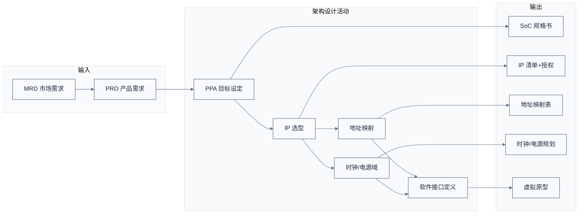
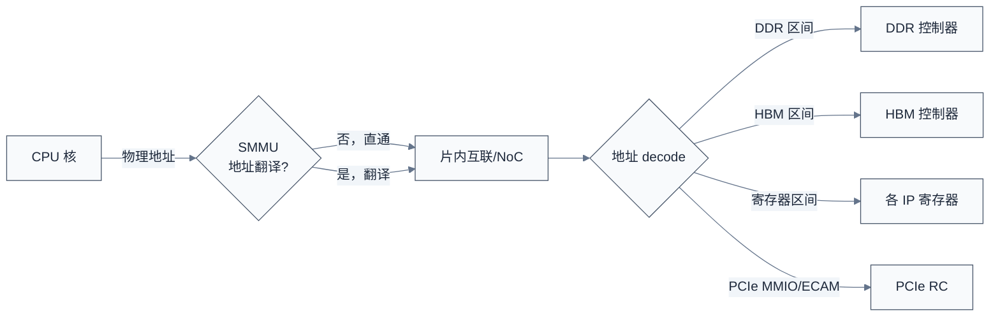

# 规格定义与架构设计 —— 想清楚要造什么

> 一句话概括：架构阶段回答"这片芯片到底要做什么、做到什么程度、用哪些 IP 凑出来"——它把市场语言（"做一颗 AI 推理 SoC"）翻译成工程语言（"64 TOPS@INT8、8 通道 LPDDR5、PCIe Gen5 x16、TSMC 6nm"），并定下 PPA（性能/功耗/面积）三个无法同时满足的硬约束。
> **工程师视角**：你后来在 SoC 手册里看到的地址映射、中断号、时钟域、电源域、IP 清单，全部诞生于这个阶段。架构师画的那张方框图，决定了你写设备树时要填多少个节点、固件初始化要按什么顺序来。理解架构阶段，就是理解"芯片为什么长成手册里那个样子"。

### 关键术语


| 缩写        | 全称                                  | 含义                             |
| --------- | ----------------------------------- | ------------------------------ |
| PPA       | Performance / Power / Area          | 性能、功耗、面积，芯片设计核心三角              |
| PRD       | Product Requirements Document       | 产品需求文档，市场驱动的输入                 |
| MRD       | Market Requirements Document        | 市场需求文档                         |
| ESL       | Electronic System Level             | 电子系统级建模，用高级语言做架构仿真             |
| VP        | Virtual Prototype                   | 虚拟原型，软件可早期运行的架构模型              |
| IP        | Intellectual Property (core)        | 可复用设计模块，软核（RTL）或硬核（GDSII）      |
| SoC Spec  | —                                   | SoC 规格书，定义所有接口/地址/时钟/电源        |
| TDP       | Thermal Design Power                | 热设计功耗，散热设计依据                   |
| BOM       | Bill of Materials                   | 物料清单，板级成本                      |
| MMU       | Memory Management Unit              | 内存管理单元                         |
| SMMU      | System Memory Management Unit       | 系统 MMU（ARM）/ IOMMU（RISC-V/x86） |
| GIC       | Generic Interrupt Controller        | ARM 通用中断控制器（GICv3/v4）          |
| PLIC      | Platform-Level Interrupt Controller | RISC-V 经典中断控制器                 |
| AIA       | Advanced Interrupt Architecture     | RISC-V 新一代中断架构                 |
| MSI       | Message Signaled Interrupt          | 消息信号中断，PCIe 设备写内存地址触发          |
| Snoop     | —                                   | 监听式缓存一致性协议，广播                  |
| Directory | —                                   | 目录式缓存一致性协议，点对点                 |
| QoR       | Quality of Results                  | 综合结果质量（面积/时序/功耗）               |


### 1.1 前置知识


| 需要了解            | 参考文档                                                                   |
| --------------- | ---------------------------------------------------------------------- |
| SoC 全流程地图       | [01-SoC设计全流程总览](./01-SoC设计全流程总览.md)                                    |
| 片内互联协议（AXI/CHI） | [../interconnect/01-互联总线与协议全景辨析.md](../interconnect/01-互联总线与协议全景辨析.md) |
| DDR 内存基础        | [../ddr/01-DDR基础概念.md](../ddr/01-DDR基础概念.md)                           |


---

## 1. 概述

### 1.2 系统上下文

**项目定位**：架构设计是流程的"上游源头"——它接收来自产品/市场的 PRD（产品需求），输出一份足以让前端 RTL 工程师开干的 SoC 架构规格。这个阶段的产出物不是代码，而是文档、方框图、地址映射表、IP 清单、时钟/电源域规划。**它决定了芯片 70% 的最终成本与性能**——架构阶段的决策一旦流片就难以推翻。

**软硬件耦合点**：

- **PRD ↔ 架构**：市场要"AI 推理 50 TOPS"，架构师要算"需要多少 MAC 阵列、多少带宽、什么工艺能跑到这个频率"。市场语言到工程语言的翻译在这里完成。
- **IP 选型 ↔ 集成**：选了 Arm Neoverse N2，就要接受它的 AMBA CHI 接口、地址位宽、一致性域边界。IP 不是孤立模块，它的接口约束整个 NoC 设计。
- **架构 ↔ 固件**：地址映射、中断号、时钟树、电源域——这些架构阶段定下的东西，直接变成固件初始化代码与设备树。**改架构等于改固件**。
- **PPA ↔ 工艺**：2.0GHz@7nm 和 2.5GHz@5nm 是完全不同的设计。工艺节点决定能跑多快、功耗多少、面积多大。

**跨实现对比**：


| 对比维度   | 通用服务器 SoC                   | AI 加速器 SoC    | 嵌入式 MCU SoC       |
| ------ | --------------------------- | ------------- | ----------------- |
| 架构重心   | 通用算力 + 大带宽                  | 张量算力 + HBM 带宽 | 低功耗 + 实时性         |
| 典型 CPU | Arm Neoverse / RISC-V RVA22 | 弱 CPU（仅控制面）   | RISC-V / Cortex-M |
| 内存     | DDR5 多通道                    | HBM + DDR     | LPDDR / SRAM      |
| 互联     | CHI Mesh                    | 数据流 NoC       | AXI 总线            |
| PPA 权重 | 性能=带宽                       | 性能=算力+带宽      | 功耗第一              |




> **如何读这张图**：架构设计不是线性流程，而是"PPA 目标驱动 IP 选型，IP 选型约束地址映射与时钟电源，三者共同定义软件接口"的迭代。**最容易被低估的是"软件接口定义"**——很多项目架构师只画硬件方框图，等到固件团队接手才发现寄存器地址没定、中断号冲突，被迫返工。

> **核心要点**：架构阶段是把"模糊的产品意图"转成"精确的工程契约"的过程。它的核心产物不是方框图，而是**可被前端、后端、固件三方共同依赖的规格书**——里面每一个地址、每一个中断号、每一个时钟域，都是后续数月工作的输入。

---

## 2. 产品定义：从市场语言到工程语言

> 上一章建立了架构阶段"把市场语言翻译成工程契约"的整体框架——PPA、IP 选型、地址映射、时钟电源、软件接口五样产出。一个自然的问题是：市场语言到底长什么样、架构师又怎么把"50 TOPS AI 推理"这种话翻成工程预算？本章用产品定义来回答——先讲 PRD 应回答的维度，再用一个 50 TOPS SoC 的具体例子倒推算力、带宽、功耗预算。

### 2.1 PRD 里都有什么

一份合格的 PRD 至少回答这些问题：


| 维度   | 典型内容                    | 工程翻译             |
| ---- | ----------------------- | ---------------- |
| 目标市场 | "AI 推理服务器"              | 算力目标、内存带宽、IO 带宽  |
| 性能   | "50 TOPS@INT8"          | MAC 阵列规模、运行频率    |
| 功耗   | "&lt;75W TDP"           | 工艺、电压、电源域设计      |
| 成本   | "单颗 &lt; 200 美元"        | die 面积、封装、良率目标   |
| 供货   | "2026 Q2 量产"            | 流片节点倒推、ES 时间表    |
| 兼容性  | "支持 Linux 主线、PCIe Gen5" | IP 选型、软件栈承诺      |
| 差异化  | "片间一致性互联"               | 自研模块、IP 自研 vs 采购 |


### 2.2 一个具体例子：把"AI 推理 SoC"翻译成工程目标

假设 PRD 写的是"面向数据中心推理的 50 TOPS SoC，75W TDP"。架构师的第一步是**倒推算力与带宽**：

1. **算力倒推**：50 TOPS@INT8，若 MAC 阵列运行在 1.0GHz，每周期需要的运算次数 = $50 \times 10^{12} \text{ OPS} \div 10^{9} \text{ Hz} = 50000 \text{ OPS/周期}$。每个 INT8 MAC 每周期做 2 次运算（1 次乘 + 1 次加，即 2 OP），所以需要 $50000 \div 2 = 25000$ 个 MAC。若用 128×128 阵列 = 16384 个 MAC，则需约 2 个这样的阵列（32768 MAC，留余量），或单个更大的阵列。
2. **带宽倒推**：推理的算力利用率受限于带宽。典型 INT8 推理每 TOPS 约需 2 GB/s 带宽，50 TOPS 需约 100 GB/s。DDR5-6400 单通道 51.2 GB/s，需 2 通道；若上 HBM3，单 stack 约 1 TB/s，远超需求。
3. **功耗倒推**：75W 里，MAC 阵列估算 30W、DDR 控制器+PHY 15W、NoC+Cache 15W、IO 10W、时钟树 5W——能对得上。

这就是架构师日常：**从顶层指标倒推子系统预算**，每一项都要落到具体 IP 与工艺。

> **核心要点**：架构师的核心技能不是画图，而是**预算分配**——把顶层的 PPA 目标拆成每个子系统的算力/带宽/功耗/面积预算，再为每个预算找到合适的 IP 或决定自研。预算分不平，就要回去砍 PRD。

---

## 3. PPA 三角：芯片设计的"不可能三角"

> 上一章把产品定义拆成了 PRD 维度与一个 50 TOPS SoC 的具体预算。一个自然的问题是：算力、带宽、功耗预算给定后，凭什么说"做得到"或"做不到"？本章用 PPA 三角来回答——先讲性能/功耗/面积为何无法同时最优，再讲工艺如何影响三者，最后给权衡方法。

PPA（Performance / Power / Area）是芯片设计的核心约束，三者无法同时最优化——这就是架构师永恒的权衡。

### 3.1 三者关系

- **性能↑** → 要更高频率（升压升功耗）或更多并行（升面积）。
- **功耗↓** → 要降电压（降频率降性能）或门控（牺牲峰值性能）。
- **面积↓** → 要更小工艺（升成本升功耗密度）或更少资源（降性能）。

用一个数值例子感受：同一逻辑，从 1.0GHz 提到 1.2GHz（+20% 性能），往往要把电压从 0.8V 升到 0.9V，功耗与电压平方成正比，动态功耗增加约 (0.9/0.8)² × 1.2 ≈ 1.52 倍——**性能涨 20%，功耗涨 50%**。这就是为什么"再挤一点频率"代价巨大。

### 3.2 工艺对 PPA 的影响


| 工艺节点    | 典型频率        | 典型功耗密度 | die 成本 | 适用场景     |
| ------- | ----------- | ------ | ------ | -------- |
| 28nm    | &lt; 1.5GHz | 低      | 低      | 嵌入式、IoT  |
| 12/16nm | 2.0–2.5GHz  | 中      | 中      | 中端 SoC   |
| 7nm     | 2.5–3.0GHz  | 较高     | 高      | 服务器/手机旗舰 |
| 5nm     | 3.0GHz+     | 高      | 很高     | 旗舰       |
| 3nm     | 3.0GHz+     | 很高     | 极高     | 顶级       |


> **核心要点**：PPA 三角不是"三个目标都尽量好"，而是"在某一工艺与预算下，找一个可接受的折中点"。架构师的每一项决策（加几个核、用不用 HBM、跑多高频率）都是在三角里挪位置。**没有完美架构，只有对得起 PRD 的折中**。

---

## 4. IP 选型与采购：买还是造

> 上一章讲了 PPA 三角与工艺影响。一个自然的问题是：要凑出这个 PPA，CPU 核、PHY、控制器这些模块从哪来、买还是造？本章用 IP 选型来回答--先讲选型维度，再对比软核与硬核的集成方式差异，然后给自研 vs 采购的决策框架，最后展开 IP 集成的四个真实坑。

这是架构阶段最核心的活动之一。SoC 里 70% 的模块是买来的 IP，选错 IP 会拖垮整个项目。

### 4.1 选型维度


| 维度     | 考量点                   | 例子                    |
| ------ | --------------------- | --------------------- |
| 功能匹配   | IP 是否支持所需特性           | DDR5 控制器是否支持 6400Mbps |
| 接口兼容   | IP 接口能否接入 NoC         | CPU 核用 CHI 还是 AXI     |
| 工艺适配   | 软核可综合到目标工艺？硬核有无目标工艺版？ | Arm 硬核只在 TSMC 5nm 有   |
| PPA 表现 | IP 在目标工艺的 QoR         | 频率、功耗、面积报告            |
| 授权模式   | 一次性 + 版税？固定费用？        | Arm 是版税模式             |
| 交付质量   | 文档、验证套件、参考设计          | 是否带 UVM 验证环境          |
| 供货风险   | IP 厂商稳定性、出口管制         | 地缘政治影响                |


### 4.2 软核 vs 硬核：集成方式差异


| 对比维度   | 软核（RTL）          | 硬核（GDSII）             |
| ------ | ---------------- | --------------------- |
| 交付物    | SystemVerilog 代码 | 版图文件                  |
| 工艺可移植  | 是，可综合到任意工艺       | 否，绑定特定工艺              |
| PPA 优化 | 取决于设计方综合         | IP 供应商已极致优化           |
| 集成方式   | 与自研 RTL 一起综合     | 后端阶段直接摆放              |
| 修改灵活度  | 高（可改 RTL）        | 极低（只能改 metal 层）       |
| 典型例子   | CPU 核、控制器逻辑      | DDR/PCIe/USB PHY、标准单元 |


### 4.3 自研 vs 采购的决策


| 决策因素    | 倾向采购             | 倾向自研            |
| ------- | ---------------- | --------------- |
| 是否差异化核心 | 通用 IO、标准协议       | 算法独特、核心竞争力      |
| 内部能力    | 无相关经验            | 有团队             |
| 时间      | 紧迫               | 充裕              |
| 成本      | 采购比自研便宜          | 量大、版税太贵         |
| 例子      | USB/SATA/以太网 PHY | NPU 张量阵列、自研 NoC |


> **核心要点**：IP 选型的本质是"买时间还是买差异化"。通用模块买现成的，把人力投在差异化模块上。但买来的 IP 不是即插即用——**集成难度**往往被低估，尤其当 IP 接口与自研 NoC 不匹配时，胶水逻辑会成为验证噩梦。

### 4.4 资深经验：IP 集成的四个真实坑

选型表只能决定"买哪个"，真正决定项目成败的是"怎么集成"。以下是 IP 集成在项目后期最常爆发的四类问题，全部是架构阶段能预防的：

| 坑 | 现象 | 根因 | 架构阶段预防 |
|----|------|------|-------------|
| **接口不匹配** | 胶水逻辑（glue logic）越写越多 | IP 接口（如 CHI/AXI 位宽、握手时序）与自研 NoC 不完全兼容 | 集成前做接口 checklist，确认位宽/突发长度/乱序能力/ID 宽度逐项对齐 |
| **配置空间不一致** | 同一个 IP 在两个 SOC 上行为不同 | 同一 IP 核被参数化成不同配置（端口数/中断数/特性开关） | 建立"IP 配置冻结"机制，配置表随 IP 版本一起版本化 |
| **中断/地址冲突** | 系统验证阶段才发现两个模块抢地址/中断 | 地址映射与中断分配没有集中管理 | 集中式地址/中断登记表，架构评审强制核对（见 §8） |
| **验证套件不可用** | IP 自带的验证环境与自研环境不兼容 | IP 的 VIP/UVM 组件与 SoC 级验证平台版本不匹配 | 采购时确认 VIP 支持目标仿真器与 UVM 版本，提前做 spike 验证 |

> **核心要点（IP 集成资深视角）**：选 IP 只是第一步，**集成才是大头——胶水逻辑、配置管理、地址中断登记、验证套件兼容性**四件事，做不好会把"买来的时间"全赔回去。成熟团队对每个采购 IP 建"集成评审单"，在架构阶段就把四类坑逐项签字——因为**这些坑到系统验证阶段才暴露时，修复成本是架构阶段的十倍**。

---

## 5. 地址映射：芯片的"门牌号系统"

> 上一章定下了 IP 清单。一个自然的问题是：这些 IP 怎么挂在总线上、CPU 怎么找到它们？本章用地址映射来回答--先看一张简化的地址映射示例，再讲规划方法与设计约束，然后补互连带宽计算（NoC 怎么算带宽、怎么避免死锁），最后展开中断架构与缓存一致性这两大软硬件契约。

地址映射是架构阶段最具体、对软件影响最大的产出。它定义"谁、在哪个地址、能访问什么"。

### 5.1 一个简化的地址映射示例

下面是一颗服务器 SoC 的简化地址映射（物理地址，64 位）：

```text
0x0000_0000_0000_0000 - 0x0000_007F_FFFF_FFFF  DDR（DRAM，低地址区）
0x0000_0080_0000_0000 - 0x0000_008F_FFFF_FFFF  HBM
0x0000_0100_0000_0000 - 0x0000_0100_0000_0FFF  系统控制寄存器（CLK/RST/PWR）
0x0000_0100_0100_0000 - 0x0000_0100_0100_FFFF  UART0
0x0000_0100_0200_0000 - 0x0000_0100_020F_FFFF  PCIe RC 配置空间（ECAM）
0x0000_0100_0300_0000 - 0x0000_0100_0300_3FFF  GIC（中断控制器，Distributor）
0x0000_0100_0301_0000 - 0x0000_0100_0301_7FFF  GIC（Redistributor）
0x0000_0100_0400_0000 - 0x0000_0100_040F_FFFF  DDR 控制器寄存器
0x0000_0100_0500_0000 - 0x0000_0100_0500_0FFF  看门狗
0x0000_0200_0000_0000 - 0x0000_0200_FFFF_FFFF  PCIe MMIO（设备 BAR 空间）
```

> **如何读这张表**：每一行是一段物理地址区间，对应一个 IP 的寄存器或内存。**软件看到的"裸地址"就是这张表的实现**——固件初始化时按这张表配置每个 IP 的基址；设备树里 `reg = <...>` 字段填的就是这里的地址。地址映射错一个，整个系统启动不起来。

### 5.2 地址映射的设计约束

> 上一节给了一张现成的地址映射表，但"如何规划"未讲——读者不知道 0x100_0000_0000 这个基址怎么定、为什么 DRAM 在低地址、寄存器区在高位。本节补规划方法与互连带宽计算。

地址映射的规划原则：

1. **DRAM 在低地址**：便于 0 基址启动——CPU 复位后从 0x0 取第一条指令，DRAM 在低地址让启动向量直接进 DRAM（或 ROM 在更低地址）。
2. **寄存器区集中在高位**：便于 decode 一段高位地址选片，减少地址比较器数量。如所有 IP 寄存器在 0x1000_0000~0x1FFF_FFFF，用高位 4 位译码。
3. **MMIO 与 DRAM 分离**：内存映射 IO 不能与 DRAM 重叠，且要给 DRAM 留扩展空间（未来加内存不能撞上 MMIO）。
4. **对齐粒度**：寄存器块按 4KB/64KB/1MB 对齐——粒度由寄存器块大小、页表映射粒度、decode 简化共同决定。小 IP 用 4KB 对齐，大块 IP 用 1MB。

- **decode 优先级**：重叠地址区间的 decode 顺序要明确，否则总线报错。
- **SMMU/IOMMU**：IO 设备访问内存要过 SMMU，地址映射要区分"CPU 视角"与"设备视角"。SMMU v3 用 context bank 翻译 IO 虚拟地址，架构阶段要为每个支持 DMA 的 IP 留 context bank。
- **一致性域**：哪些地址是 cacheable（要走一致性互联）、哪些是非 cacheable（IO 寄存器），由地址区间的属性决定。
- **PCIe ECAM**：PCIe 配置空间用 ECAM（Enhanced Configuration Access Mechanism）访问，架构阶段要在地址映射里给 PCIe ECAM 留一段（每 bus 256B × 256 bus × 8 device × 32 function）。



> **核心要点**：地址映射是架构师给软件留下的"最硬的契约"——一旦流片，地址就不能改（改了等于改设备树、改固件、改 BIOS）。所以架构阶段对地址映射的评审极其严格。你在设备树里写的每一行 `reg`，背后都是这张表。

### 5.3 互连带宽规划：NoC 怎么算带宽

> 上面讲了地址映射"怎么布"，但没讲"布完够不够带宽"。互连带宽计算是架构师的另一项核心工作——算 master/slave 矩阵的峰值与平均带宽，决定 NoC 拓扑与虚拟通道数。

**带宽公式**：

$$\text{BW} = f \times W \times \rho$$

逐符号解释：

- $\text{BW}$：链路带宽，单位 GB/s
- $f$：互连时钟频率，单位 GHz（如 1.2 GHz）
- $W$：数据位宽，单位 Byte（如 256 bit = 32 B）
- $\rho$：利用率，0~1，典型 0.5–0.7（考虑仲裁与冲突开销）

**数值演算**：一条 1.2 GHz、256 bit NoC 链路，利用率 0.6：

$$\text{BW} = 1.2 \times 32 \times 0.6 = 23.04\,\text{GB/s}$$

**峰值 vs 平均带宽**：峰值是 $f \times W$（不考虑利用率），平均是峰值 × 利用率。架构师要按**平均带宽规划容量**，按**峰值带宽规划时序**（峰值突发不能让 FIFO 溢出）。

**NoC 拓扑选型**：

| 拓扑 | 结构 | 适用 |
|------|------|------|
| Crossbar | 全互联 | 小规模（<8 节点），延迟低但面积爆炸 |
| Ring | 环形 | 中规模，面积小但延迟随节点数增长 |
| Mesh | 二维网格 | 大规模（16+ 节点），可扩展性好 |
| NoC（Virtual Channel） | 任意拓扑 + 虚通道 | 避免死锁、提升利用率 |

**死锁避免**：NoC 的两类死锁——

- **协议层死锁**：AXI 的 order 模型导致请求与响应互相等待。解法：协议规定响应通道独立，不阻塞请求。
- **拓扑层死锁**：环形或网格中，包绕一圈占满所有虚通道。解法：**虚拟通道（Virtual Channel）**——把物理链路分多个虚通道，不同流分类走不同虚通道，打破循环等待。

> **核心要点**：互连带宽计算是架构师的核心工作——**$BW = f \times W \times \rho$ 是基本公式，平均带宽规划容量、峰值带宽规划时序**。**NoC 拓扑选型看规模**（Crossbar/Ring/Mesh），**死锁避免靠虚拟通道**——拓扑层死锁是 NoC 设计的最大坑，虚通道数量与分配策略是架构决策。详见 [../interconnect/01](../interconnect/01-互联总线与协议全景辨析.md) 与 AMBA AXI 协议（IHI 0022）§A、AMBA CHI 协议（IHI 0050）§2 死锁章节。

### 5.5 中断架构：芯片的"神经信号"

地址映射回答"东西在哪"，中断架构回答"事件怎么通知 CPU"。它是软硬件交界的关键契约——固件的中断处理函数、OS 的中断子系统、驱动的中断注册，全都依赖架构阶段定义的中断控制器与中断号。

不同架构有不同的中断控制器 IP：


| 架构     | 中断控制器                             | 说明                                               |
| ------ | --------------------------------- | ------------------------------------------------ |
| ARM    | GIC（Generic Interrupt Controller） | GICv3/v4，支持亲和性、虚拟化、LPI                           |
| RISC-V | PLIC / ACLINT / AIA               | PLIC 经典，AIA（Advanced Interrupt Architecture）是新一代 |
| x86    | APIC / LAPIC / IOAPIC             | —                                                |


中断架构要决定的事：

- **中断源到中断号的映射**：每个 IP 的每个中断源（如 UART 接收、PCIe MSI、看门狗超时）分配一个唯一中断号，写进设备树的 `interrupts` 字段。
- **电平触发 vs 边沿触发**：电平触发要软件清中断源才解除，边沿触发只看跳变。选错会导致中断丢失或风暴。
- **中断亲和性（Affinity）**：多核 SoC 里中断发给哪个核？GIC 的 GICR（Redistributor）支持按核路由。
- **虚拟化支持**：是否支持把中断直接投递给虚拟机（如 GICv4 的虚拟 LPI）。
- **MSI/xID**：PCIe 设备用 MSI/MSI-X 写内存地址触发中断，要预留 MSI 地址区间。

**为什么中断架构要在架构阶段定死**？因为中断控制器是硬件 IP，中断号是寄存器位与设备树字段一一对应的契约——流片后改中断号等于改所有驱动。一个经典坑：两个 IP 共用同一中断号导致中断处理串扰，这种 bug 在系统验证阶段才暴露，调试极痛苦。

### 5.6 缓存一致性架构：谁来保证数据同步

多核 SoC 里，每个核有自己的 L1/L2 Cache。一个核写数据，另一个核读到的是新值还是旧值？这就是缓存一致性问题。架构阶段必须决定**一致性域边界**与**一致性协议**。

两种主流一致性协议：


| 协议            | 原理                            | 优势         | 劣势          | 适用        |
| ------------- | ----------------------------- | ---------- | ----------- | --------- |
| Snoop（监听）     | 所有 cache 监听共享总线，广播一致性消息       | 简单、延迟低     | 总线广播，核数多了爆炸 | 小规模（≤8 核） |
| Directory（目录） | 维护一个目录记录每行 cache 在哪些核，按需点对点通信 | 可扩展、核数多时高效 | 目录存储开销、延迟略高 | 大规模服务器    |


ARM CHI、RISC-V 自研 NoC 多用 Directory 协议（详见 [../interconnect/02-CMN-700架构与初始化固件.md](../interconnect/02-CMN-700架构与初始化固件.md)）。

架构阶段要回答的一致性问题：

- **哪些 master 在一致性域内**：CPU 集群通常在域内；GPU/IO 设备可能在域外（靠软件 flush），也可能纳入域内（如 CXL.cache、ACE 的 IO 一致性）。
- **IO 一致性**：DMA 读写内存时，要不要让 CPU Cache 自动同步？纳入一致性域则硬件保证，域外则驱动手动 flush/invalidate。
- **跨 die 一致性**：Chiplet 多 die SoC 里，跨 die 一致性靠 CML（CMN-700 的 Coherent Mesh Link）等机制，延迟与带宽是设计难点。

> **核心要点**：地址映射、中断架构、缓存一致性是架构阶段给软件留下的"三大契约"——它们共同定义了"东西在哪、事件怎么来、数据怎么同步"。三者一旦流片都无法更改，且任一出错都会让系统无法启动或数据错乱。这也是为什么架构评审要把这三项作为强制检查项。

---

## 6. 时钟与电源域：芯片的"血管与神经"

> 上一章定下了地址映射、中断、一致性三大契约。一个自然的问题是：芯片上电后各模块按什么频率跑、哪些能独立上下电、复位怎么管？本章用时钟与电源域来回答--先讲时钟域与电源域，再补复位架构（异步复位同步释放）、DfX 顶层规划（测试/调试/制造/可靠接入点）、安全可靠架构（功能安全/SEU/Secure Boot），最后讲封装与板级协同。

时钟树与电源域规划是架构阶段另一个对固件影响巨大的产出。

### 6.1 时钟域

一颗 SoC 有几十个时钟域——CPU、GPU、NoC、DDR、PCIe、USB 各自跑在不同频率，靠异步桥或同步 FIFO 跨域。

```text
PLL 输入 25MHz 晶振
  ├─ CPU PLL → CPU 域（2.0GHz）
  ├─ NoC PLL → 互联域（1.2GHz）
  ├─ DDR PLL → DDR 域（1.6GHz，对应 DDR5-6400）
  ├─ PCIe PLL → PCIe 域（100MHz 参考 + Gen5 PHY）
  └─ ... 几十个分频/门控
```

时钟规划决定：

- **哪些模块能动态调频**（DVFS，动态电压频率调节）
- **哪些模块必须同频**（如 NoC 与 CPU 的同步域）
- **跨域数据要过异步 FIFO**，否则亚稳态

### 6.2 电源域

电源域决定哪些模块能独立上下电。典型划分：


| 电源域       | 供电                   | 控制对象         |
| --------- | -------------------- | ------------ |
| Always-on | 0.7V                 | RTC、唤醒逻辑、看门狗 |
| CPU 域     | 0.8V（可调）             | CPU 集群       |
| SoC 逻辑域   | 0.8V                 | NoC、Cache    |
| DDR 域     | 1.1V（VDDQ）/1.8V（VPP） | DDR 控制器+PHY  |
| IO 域      | 1.8V/3.3V            | PCIe/USB PHY |
| HBM 域     | 独立                   | HBM stack    |


电源域规划影响：

- **上电时序**：必须按依赖关系上电（先 Always-on，再 SoC 逻辑，再 CPU）
- **隔离（Isolation）**：下电域的输出要隔离，防止漏电损坏上电域
- **状态保持（Retention）**：某些模块下电时要保留状态，需 retention 寄存器

> **核心要点**：时钟与电源域规划直接决定固件的初始化顺序与电源管理策略。**上电时序错了芯片可能物理损坏**（如核心先于 IO 上电导致 latch-up）。架构阶段定下的电源域图，是固件 `pmu_init()` 与 OS 深睡唤醒逻辑的依据。这也是为什么 TF-A/OpenSBI 的 `plat_psci_ops` 平台回调要严格匹配芯片电源域设计。

### 6.3 复位架构：上电后的"清零"系统

> 上面讲了时钟与电源域，但芯片上电后还有一个不可省的环节——复位。复位架构决定每个域"何时从已知状态开始工作"，复位乱序与跨域不同步会引入与 CDC 同源的亚稳态问题。

复位分两类，选哪种是架构决策：

| 复位类型 | 机制 | 优点 | 缺点 |
|----------|------|------|------|
| **同步复位** | 时钟沿生效，复位信号过时钟 | 不引入亚稳态、时序可分析 | 时钟没起来时复位无效 |
| **异步复位** | 复位信号直接清零触发器，不依赖时钟 | 任何时刻都能复位（含时钟未起） | 释放时刻若与时钟沿异步，触发器进亚稳态 |

**解法：异步复位、同步释放**——复位信号异步生效（保证无时钟也能复位），但释放时刻过同步器（让释放与时钟沿同步，避免亚稳态）。这是大多数 SoC 的默认策略。

**冷复位 vs 热复位**：

- **冷复位（Cold Reset / Power-On Reset）**：上电时把所有触发器清零，POR（Power-On Reset）电路检测电压稳定后释放复位。
- **热复位（Warm Reset）**：不断电，只复位部分域（如 CPU 核软重启），保留 Always-on 域状态。

**复位域跨越（RDC）**：与 CDC 同源的问题——两个复位域的复位释放时刻不同步，一个域的信号在另一个域还在复位时被采样，导致下游逻辑进不确定状态。解法与 CDC 一致：复位释放信号也要过复位同步器。RDC 检查工具（SpyGlass-RDC）静态扫描所有复位域跨越路径。

> **核心要点**：复位架构是"上电后第一个要管对的事"——**异步复位、同步释放**是 SoC 默认策略，兼顾无时钟也能复位与释放时不亚稳态。**复位域跨越（RDC）与时钟域跨越（CDC）同等优先级**，RDC 报告不清零不进综合。这也是为什么固件的 `pmu_init()` 要严格按 POR→等电压稳定→释放各域复位的顺序——乱来等于让触发器在亚稳态下工作。

### 6.4 DfX 顶层规划：为"测、调、造、修"留接口

> 架构阶段还要为后续的测试、调试、制造、维修预埋接入点——这叫 DfX（Design for X）。DfX 不是后端才想的事，接入点的位置与数量是架构决策。

DfX 是一族"Design for"的总称，架构阶段要为每一类留接入点：

| DfX | 全称 | 架构阶段要留什么 | 对应章节 |
|-----|------|-----------------|----------|
| **DFT** | Design for Test | 扫描链覆盖率目标、ATPG 策略、BIST 分布、测试引脚 | [03 章 §6](./03-前端设计RTL与验证.md#6-dft给芯片装上体检接口) |
| **DFD** | Design for Debug | trace 通路（STM/ETR）、JTAG/ADB/SWD 调试端口、交叉触发（CTI/CTM） | 本节 |
| **DFM** | Design for Manufacturing | 密度规则、OPC 友好版图、金属密度均衡 | [04 章 §5.4](./04-后端物理设计与签核.md#54-dfm-与多重图形让版图好造) |
| **DFR** | Design for Reliability | ECC 覆盖、双核锁步、看门狗、SEU 容忍 | §6.5 |
| **DFD（Debug）** | — | debug 架构：trace 路由、JTAG/ADB/SWD 通路 | 本节 |

**Debug 架构（DFD）**是架构阶段常被低估的一项。芯片回来后调试时，工程师要"看见"芯片内部在做什么——这要求架构阶段就埋好观测通路：

- **JTAG / ADB / SWD 调试端口**：通过 IEEE 1149.1（JTAG）或 ARM Debug Interface（ADI）访问 CPU 核内部寄存器、设置断点、单步执行。固件工程师用的 OpenOCD/Lauterbach 就是连这个端口。
- **Trace 通路**：STM（System Trace Macrocell）、ETR（Embedded Trace Router）把 CPU/SoC 的事件流写到专用 SRAM 或 DDR，供事后分析。**Trace 缓冲区大小与路由是架构决策**——太小丢失历史，太大占面积。
- **交叉触发（CTI/CTM）**：Cross-Trigger Interface/Matrix，让一个 IP 的事件触发另一个 IP 的动作——如 CPU 断点触发逻辑分析仪抓波形。架构阶段要规划触发网络覆盖哪些 IP。

**测试时间预算**：DFT 结构插入后，量产测试时间直接进单颗成本（见 [05 章 §6.7](./05-流片制造封装与量产测试.md#67-资深经验测试成本是每颗芯片都在交的税)）。架构阶段要为测试时间设预算——如"全芯片测试不超过 2 秒"，反推扫描链压缩比与并行度。

> **核心要点**：DfX 是架构阶段为"测、调、造、修"留接口的统称。**Debug 架构（DFD）最容易被低估**——芯片回来后调试时，"看不见内部"是最大障碍，trace 通路与 JTAG 端口要在架构阶段就埋好。这也是为什么固件工程师能用 OpenOCD 连芯片——那是架构阶段埋的 JTAG/ADB 通路，符合 IEEE 1149.1 / ARM ADI 标准。

### 6.5 安全可靠架构：功能安全、可靠性与信息安全

> 上面 DfX 管"测试与调试"，但汽车/数据中心/边缘场景的 SoC 还有一类架构层要求——安全与可靠。ISO 26262 功能安全、SEU/SET 可靠性、Secure Boot 信息安全，这三项在现代 SoC 架构阶段不能省。

#### 6.5.1 功能安全（ISO 26262）

车规与工业 SoC 要遵循 **ISO 26262** 功能安全标准，按 ASIL（Automotive Safety Integrity Level）分级：

| ASIL 等级 | 风险等级 | 典型要求 |
|-----------|----------|----------|
| ASIL A | 最低 | 基本 ECC、看门狗 |
| ASIL B/C | 中 | 双核锁步、内存 ECC、流动控制 |
| ASIL D | 最高 | 双核锁步 + 仲裁、覆盖率 ≥ 99%、诊断覆盖率 ≥ 90% |

**安全机制**：

- **双核锁步（Lockstep）**：两个 CPU 核跑相同代码，输出比较器比对——不一致就触发安全中断。代价是面积翻倍，但 ASIL D 的标配。
- **ECC / Parity**：内存、缓存、总线加纠错码——单 bit 错纠正、双 bit 错报警。
- **看门狗（Watchdog）**：定时器要求软件定期"喂狗"，超时触发复位——防软件死锁。

#### 6.5.2 可靠性（SEU / SET）

太空与高海拔应用要考虑**单粒子翻转（SEU，Single-Event Upset）**——宇宙射线打中存储器节点，让 bit 翻转。应对：

- **ECC 覆盖**：SRAM/寄存器加 ECC，SEU 能纠正。
- **TMR（Triple Modular Redundancy）**：关键逻辑做三份，输出多数表决——代价是面积 ×3。
- **定时器看门狗**：SET（单粒子瞬态）导致逻辑瞬时出错，看门狗复位恢复。

#### 6.5.3 信息安全（Secure Boot / TrustZone）

- **Secure Boot**：启动链每一步验证下一步签名（见 [01 章 §1.2](./01-SoC设计全流程总览.md) 与 TBBR 规范），防恶意固件。
- **TrustZone / WorldGuard**：ARM 用 TrustZone（Secure/Normal 世界硬件隔离），RISC-V 用 WorldGuard 或 PMP 做隔离。
- **加密引擎**：AES/SHA/RSA 硬件加速器，密钥存专用安全区。
- **DFT 通路禁用**：安全启动下必须显式禁用 JTAG/扫描链，防止攻击者用测试通路读密钥（见 [03 章 §6.5](./03-前端设计RTL与验证.md#65-dft-对软件的影响)）。

> **核心要点**：安全可靠架构是汽车/数据中心 SoC 的强制项——**ISO 26262 ASIL 分级决定安全机制选型**（ASIL D 要双核锁步），**SEU/SET 决定 ECC/TMR 覆盖范围**，**Secure Boot 决定启动链与 DFT 禁用策略**。这三项在架构阶段就要规划，后端阶段补不了——双核锁步要改 RTL 结构，Secure Boot 要改启动链。

### 6.6 封装与板级协同：架构阶段就要定的物理约束

> 上面讲的地址映射、时钟电源、DfX、安全都是"片上"的事，但架构阶段还要定一个"片外"约束——封装与板级。封装类型、引脚规划、热方案，要与封装/PCB 团队协同。

**封装选型决策矩阵**：

| 应用场景 | 推荐封装 | 理由 |
|----------|----------|------|
| 中低端 SoC | QFP / 引线键合 BGA | 成本低，引脚密度够 |
| 高性能 SoC | FC-BGA（倒装） | 引脚密度高、电感低、散热好 |
| AI 加速器（大 die + HBM） | 2.5D（CoWoS） | 计算die ↔ HBM 超高带宽互连，基板布线密度不够，靠硅中介层 |
| 移动 SoC | WLCSP / FOWLP | 超小封装、薄 |
| 堆叠存储 | 3D（SoIC / Foveros） | TSV 垂直堆叠，密度最高 |

**引脚规划（Ballsheet）**：IP 信号如何挤出到 BGA 焊球，是架构与封装协同的核心。约束：

- **电源/地引脚数量与位置**：大电流要足够电源/地引脚，且分布均匀降低电感。
- **高速信号走线约束**：DDR 数据线要等长、PCIe 差分对要紧挨——这些约束 die 内引脚位置，进而约束 floorplan 的 IO ring。
- **引脚复用**：GPIO 复用功能（I2C/SPI/UART）挤引脚，架构阶段要定复用表。

**热仿真**：架构阶段要估热阻（$\theta_{jc}$、$\theta_{ja}$）与瞬态热阻抗 $Z_{\theta}$，确认 TDP 在目标散热方案下能散掉——过不了就要降 TDP 或改封装。

> **核心要点**：封装与板级协同是架构阶段的"物理出口"——**封装选型决定 die 间互连方案**（2.5D 是大 die + HBM 的唯一可行路径），**引脚规划约束 floorplan 的 IO ring**，**热仿真决定 TDP 能否兑现**。这三项与封装/PCB 团队协同，是"组件交界处"工程师的典型工作。

---

## 7. 软硬件协同设计与虚拟原型

> 上一章把时钟电源、DfX、安全、封装都铺开了。一个自然的问题是：硬件还没就绪，软件团队难道干等？本章用虚拟原型（VP）来回答--先讲 VP 是什么、分哪几层，再说软件团队的时间线如何前移，最后讲 VP 的信任边界与维护成本。

架构阶段最容易忽视的是"软件能不能在硬件就绪前开始开发"。答案是虚拟原型（VP）。

### 7.1 虚拟原型是什么

虚拟原型是用高级语言（C++/SystemC）对 SoC 做的功能级模型，**能在 RTL 就绪前以接近实时的速度运行真实软件**——启动 U-Boot、跑 Linux、跑应用程序。它牺牲时序精度换速度：RTL 仿真一天跑几毫秒，VP 一秒跑几百万周期。

**VP 的抽象层次**是理解它的钥匙——VP 不是一个东西，而是一个"速度/精度刻度"上的系列：

| VP 类型 | 建模语言 | 精度 | 速度 | 用途 |
|---------|---------|------|------|------|
| 指令集模型（ISA） | C/C++（QEMU、riscv-isa-sim） | 只建模指令语义 | 百 MHz–GHz | 单核/单板软件验证 |
| 事务级模型（TLM 2.0） | SystemC + TLM 2.0 | 建模总线事务，无时序细节 | 数十 MHz | 系统级架构验证、OS 启动 |
| 周期精确模型（CA） | SystemC/手写 RTL 行为 | 周期级时序 | 数百 KHz | 性能验证、时序敏感场景 |

> **如何读这张表**：从 ISA 到 CA，精度递增、速度递减、工作量递增。**90% 的预硅软件验证用 TLM 级就够了**——因为它建模了"总线上的事务"而不管"每个周期谁在总线上"，这正好匹配软件关注的接口语义。周期精确模型只在"性能必须精确"（如跑 benchmark 验证带宽）时才值得做——因为它的建模工作量比 TLM 高一个数量级。

#### 7.1.1 资深经验：QEMU 与 SystemC VP 的分工

预硅软件验证最常见的困惑是"QEMU 不是也能跑吗，为什么还要 SystemC VP"。两者的分工是资深的选型分界：

- **QEMU（或同类开源 ISA 模拟器）**：模型是"这个指令集跑这个软件"——它**只仿真 CPU，不仿真 SoC 外设**。你要跑驱动，需要手动外挂外设模型（往往是残缺的）。**它快、免费、够验证纯软件逻辑，但验证不了"软件与硬件交互"**。
- **SystemC/TLM VP（商用：Synopsys Virtualizer、Cadence SystemC）**：模型是"整个 SoC——CPU + NoC + 外设 + 中断控制器"，且外设模型与 RTL 验证环境同源。**它慢一些但验证的是"软硬件接口契约"**——你的驱动在这个 VP 上跑通，意味着 RTL 实现的接口语义与模型一致（前提：模型与 RTL 保持同步）。

> **核心要点（VP 分工）**：**"软件逻辑对不对"用 QEMU，"软硬件接口对不对"用 SystemC VP**。前者验证你的代码，后者验证芯片手册。驱动/固件验证的刚需是后者——因为它要验证的恰恰是"寄存器地址对不对、中断行为对不对、DMA 描述符协议对不对"这类软硬件接口，QEMU 根本没有外设模型。这也是为什么商用 VP 的价值不在"模拟 CPU"，而在"外设模型与 RTL 同源、随 RTL 演进"。

### 7.2 软件团队的时间线前移


| 传统流程                      | 有 VP 的流程           |
| ------------------------- | ------------------ |
| 等 RTL → 等网表 → 等流片 → 才能跑软件 | 架构阶段就拿到 VP，软件与硬件并行 |
| 软件团队 chip 回来才开始调          | 芯片回来时软件已基本就绪       |
| 发现架构层 bug 时已流片            | 早期发现架构问题，零成本改      |


VP 的另一个价值是**架构验证**——在 RTL 之前就用 VP 跑 benchmark，验证 PPA 预估是否合理，避免"RTL 都写完才发现架构方向错了"。

### 7.3 资深经验：VP 的信任边界与维护成本

VP 不是免费的午餐，资深团队对 VP 有三个清醒认知：

1. **VP 的模型是"另一种验证对象"**：VP 模型自己也会写错——外设模型的行为与真实 RTL 不一致，软件在 VP 上跑通、在硅上跑挂，是最难排查的"模型-硅漂移"问题。**对策是模型与 RTL 的同步机制**：RTL 改行为时，模型要跟着改并跑一致性测试（商用工具支持从 RTL 自动生成/校验 TLM 模型）。
2. **VP 快，但快到"骗人"**：VP 不建模时序，所以"软件跑得快"不代表"芯片上跑得快"。**用 VP 验证功能，用周期精确模型/Emulation 验证性能**——把 VP 跑 benchmark 的结果当性能结论，是架构验证最常见的错误。
3. **维护成本随设计演进上升**：早期 VP 只要模型 CPU 和外设接口；RTL 越成熟，VP 越要向"与 RTL 行为一致"靠拢，维护工作量越大。**业界做法是让 VP 与 Emulation 形成"混合验证"**：成熟模块用 RTL 上 Emulation（快且真），未成熟模块用 VP 模型补齐（见 [03 章 §3.5](./03-前端设计RTL与验证.md#35-硬件加速验证从跑不动到跑得起来)）——这叫 **hybrid emulation**，是现代大型 SoC 验证流程的标准配置。

> **核心要点（VP 资深视角）**：VP 的价值是"把软件时间线前移"，但它的三个代价必须管理——**模型本身会错（要模型-RTL 同步）**、**不建模时序（性能验证要靠 Emulation）**、**维护成本随 RTL 成熟而上升（用 hybrid 分摊）**。判断你的 VP 是否健康，问三个问题：模型和 RTL 谁为准？性能数字从哪来？未成熟模块有没有 VP 兜底？

> **核心要点**：架构阶段不是纯硬件活动，而是**软硬件协同设计**的起点。虚拟原型把软件团队的开发时间线从"芯片回来后"前移到"架构阶段"，这是现代 SoC 项目缩短周期的关键手段。架构师在定义硬件的同时，必须定义软件能跑的模型——否则软硬件串行，整个项目周期会被拉长数月。

---

## 8. 架构评审与风险控制

> 上一章讲了 VP 如何前移软件时间线。一个自然的问题是：架构阶段这么多决策，怎么保证没漏、没错？本章用架构评审来回答--给一份评审清单（PPA/IP/地址/中断/一致性/时钟电源/软件接口/风险/VP），并指出架构阶段最大风险是过晚发现的架构错误。

架构阶段结束前要过**架构评审（Architecture Review）**，由资深架构师、前端/后端/验证/固件代表共同评审。评审清单要点：

- [x] PPA 预算是否分得平（性能、功耗、面积都对得上 PRD）
- [x] IP 清单是否完整（每个 IP 都有授权、有目标工艺版、有验证套件）
- [x] 地址映射是否无冲突、对齐、decode 顺序明确
- [x] 中断号分配是否唯一、触发方式是否定义、MSI 区间是否预留
- [x] 缓存一致性域边界是否明确、IO 一致性策略是否定义
- [x] 时钟/电源域是否覆盖所有模块、上下电时序可执行
- [x] 软件接口是否定义清楚（寄存器、中断、设备树草案）
- [x] 关键风险是否识别（新工艺、新 IP、新协议）
- [x] 是否有 VP 供软件团队并行开发

**架构阶段最大风险**：**过晚发现的架构错误**。RTL 阶段发现 bug 改一行，架构阶段发现 bug 改整个方框图。所以架构评审宁可苛刻——这一关放过的问题，后面要乘以十倍的代价来还。

---

## 9. 小结

> 上一章用架构评审 checklist 把架构阶段的产出过了一遍关。一个自然的问题是：回看整个架构阶段，五样产出对后续意味着什么、为什么这里省的每一周都要流片后用三个月还？本章用小结收束——重申架构不是画方框图而是做权衡与定契约，并指向下一篇前端 RTL。

架构阶段把市场语言翻译成工程契约，产出五样东西：**PPA 预算、IP 清单、地址映射、时钟电源规划、软件接口定义**。这五样东西决定了接下来一年所有团队的工作。

> **核心要点**：架构不是"画方框图"，而是"做权衡与定契约"。它的产出是后续前端、后端、固件三方共同依赖的规格书。**架构阶段省下的每一周，可能在流片后用三个月来还**——所以这个阶段宁可慢，要慢在对的地方。

下一篇进入前端：把架构变成可验证的 RTL。

- 下一篇：[03-前端设计RTL与验证](./03-前端设计RTL与验证.md)
- 上一篇：[01-SoC设计全流程总览](./01-SoC设计全流程总览.md)

---

## 参考资料

- [AmBA AXI and ACE Protocol Specification (ARM IHI 0022)](https://developer.arm.com/documentation/ihi0022/latest) — 参考 §4 IP 集成接口契约、§5.3 互连带宽与 QoS 章节
- [AMBA CHI Architecture Specification (ARM IHI 0050)](https://developer.arm.com/documentation/ihi0050/latest) — 参考 §5.6 一致性域设计、§2 死锁避免章节
- [GIC Architecture Specification (ARM IHI 0069)](https://developer.arm.com/documentation/ihi0069/latest) — 参考 §5.5 中断架构（GICv3/v4 与 ITS）
- [RISC-V Privileged ISA & AIA Specification](https://riscv.org/) — 参考 §5.5 RISC-V PLIC/AIA 中断架构与 PMP 隔离
- [ISO 26262 Road Vehicles - Functional Safety](https://www.iso.org/) — 参考 §6.5 功能安全（ASIL A/B/C/D 分级与安全机制）
- [IEEE 1685 (IP-XACT)](https://standards.ieee.org/) — 参考 §4 IP 元数据与可交付物清单格式
- [IEEE 1149.1 (JTAG) / ARM ADI](https://standards.ieee.org/) — 参考 §6.4 debug 架构（JTAG/ADB 调试端口）
- [Arm Neoverse 系列 TRM](https://developer.arm.com/products/silicon-ip-cpu/neoverse) — 参考 §4 IP 选型维度
- [Synopsys Platform Architect](https://www.synopsys.com/verification/virtual-prototyping.html) — 参考 §7 ESL/虚拟原型工具
- [../interconnect/02-CMN-700架构与初始化固件.md](../interconnect/02-CMN-700架构与初始化固件.md) — 参考 §5.2 地址映射与 §5.6 互联集成实践

