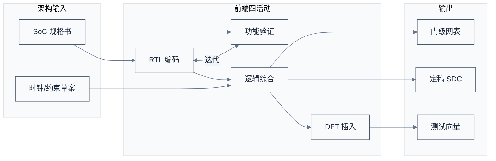
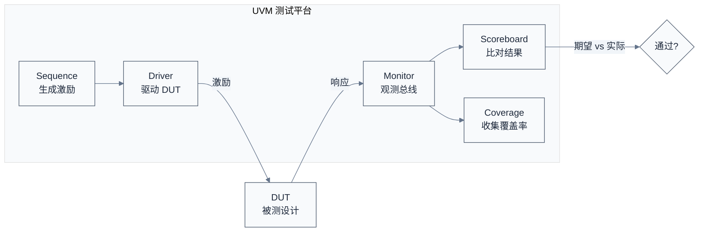
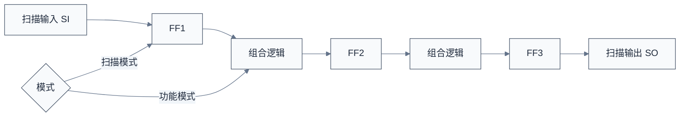

# 前端设计 RTL 与验证 —— 把架构变成可验证的代码

> 上一章把市场语言翻译成了工程契约——PPA 预算、IP 清单、地址映射、时钟电源域。一个自然的问题是：这些契约怎么变成真实的电路？本章用前端流程来回答——先写 RTL 描述行为，再用验证证明它对，最后综合成门级网表交给后端。
> **工程师视角**：你调试时遇到的"这个寄存器读出来是 0""中断没触发""DMA 卡住"这类问题，根因往往在前端阶段的某个边界条件没覆盖、某个时序路径没约束。理解前端流程，能让你在提 issue 时说清"这是 RTL 行为问题还是配置问题"，而不是把所有问题都甩给"芯片有 bug"。

### 关键术语

| 缩写 | 全称 | 含义 |
|------|------|------|
| RTL | Register Transfer Level | 寄存器传输级，描述数据如何在寄存器间流动与变换 |
| HDL | Hardware Description Language | 硬件描述语言，Verilog/VHDL/SystemVerilog |
| SV | SystemVerilog | Verilog 的超集，支持面向对象验证，现代主流 |
| UVM | Universal Verification Methodology | 通用验证方法学，基于 SV 的验证框架 |
| DUT | Design Under Test | 被测设计 |
| DUV | Design Under Verification | 被验证设计（同 DUT） |
| TB | Testbench | 测试平台 |
| Coverage | — | 覆盖率，量化验证完备程度（代码/功能/翻转） |
| Lint | — | 代码静态检查 |
| Formal | Formal Verification | 形式验证，数学证明电路性质 |
| Equivalence Check | — | 等价性检查，证明两个网表/RTL 功能一致 |
| Synthesis | — | 逻辑综合，RTL 转门级网表 |
| Netlist | — | 网表，门级逻辑的连接描述 |
| SDC | Synopsys Design Constraints | 设计约束文件（时序/时钟） |
| STA | Static Timing Analysis | 静态时序分析 |
| DFT | Design for Test | 可测性设计 |
| ATPG | Automatic Test Pattern Generation | 自动测试向量生成 |
| BIST | Built-In Self-Test | 内建自测试 |
| Scan | Scan Chain | 扫描链，DFT 主要结构 |

### 1.1 前置知识

| 需要了解 | 参考文档 |
|----------|----------|
| SoC 全流程与架构阶段 | [01-SoC设计全流程总览](./01-SoC设计全流程总览.md) · [02-规格定义与架构设计](./02-规格定义与架构设计.md) |
| SystemVerilog 基本语法 | — |
| 数字电路时序（建立/保持时间） | — |

---

## 1. 概述

### 1.1 系统上下文

**项目定位**：前端设计承接架构规格，产出**通过验证的门级网表**交给后端。它包含四个子活动——RTL 编码（写行为）、功能验证（证明行为对）、逻辑综合（行为转门级）、DFT 插入（加测试结构）。验证是其中耗时最长的，常占整个前端 60% 以上人力。

**软硬件耦合点**：

- **RTL ↔ 固件**：寄存器的位定义、读写时序、副作用（写 1 清中断、读清 FIFO），都是 RTL 决定的。固件工程师读的 IP 手册，本质是 RTL 行为的文档化。
- **RTL ↔ 验证**：RTL 与验证环境（UVM）并行开发，验证用例覆盖率反过来驱动 RTL 完善。
- **综合 ↔ 工艺**：综合工具用 Foundry 提供的标准单元库（.db/.lib），把 RTL 映射到具体工艺的门。同一份 RTL 在 7nm 和 12nm 综合出的网表 PPA 完全不同。
- **STA ↔ 时序约束**：SDC 文件定义时钟与路径约束，是综合与 STA 共同的输入。约束错了，STA 报"通过"也是假通过。

**跨实现对比**：

| 对比维度 | 自研 RTL | 采购软核 IP | 采购硬核 IP |
|------|------|------|------|
| RTL 来源 | 自己写 | IP 厂商交付 | 无 RTL（只有 GDSII） |
| 验证责任 | 全部自负责 | IP 厂商交付验证套件，集成方做系统验证 | IP 厂商全负责 |
| 综合责任 | 自己综合 | 自己综合到目标工艺 | 已综合好 |
| 修改灵活度 | 高 | 中（可改 RTL 但不建议） | 无 |



> **如何读这张图**：RTL 与验证是**强耦合迭代**的——写一段 RTL 就要写对应验证用例，验证失败回头改 RTL。综合与 DFT 在 RTL 冻结后进行，把行为级转成门级并插入测试结构。**SDC 贯穿综合与后端**，是时序的"宪法"。

> **核心要点**：前端的本质是"用代码精确描述电路行为，并用验证证明它对"。验证不是 RTL 写完才做的事，而是与 RTL 并行、甚至先于 RTL（验证驱动开发）。一个常见错误是"先把 RTL 全写完再验证"——这样积累的 bug 会让调试变成噩梦。

---

## 2. RTL 编码：用语言描述电路

### 2.1 RTL 的本质

RTL（Register Transfer Level）描述的是**数据在寄存器之间的流动与变换**。它不是软件意义上的"程序"，而是"电路的结构化描述"——每一行代码对应具体的硬件。

一个简单例子：一个带使能的 8 位计数器。

```verilog
// 一个带使能的 8 位计数器（同步复位）
module counter #(
    parameter WIDTH = 8
) (
    input  logic             clk,
    input  logic             rst_n,   // 低有效同步复位
    input  logic             enable,  // 计数使能
    output logic [WIDTH-1:0] count
);
    always_ff @(posedge clk) begin
        if (!rst_n)
            count <= '0;
        else if (enable)
            count <= count + 1'b1;
    end
endmodule
```

这段代码对应的电路是：一个 D 触发器组（count 寄存器）+ 一个加法器 + 一个 2 选 1 多路选择器（rst_n/enable 控制数据源）。**RTL 是描述电路，不是执行算法**——这是初学者最容易混淆的点。

### 2.2 RTL 编码的关键纪律

大规模 SoC 的 RTL 不是"能跑就行"，而要遵守严格纪律，否则综合后行为偏离、时序难收。

| 纪律 | 为什么 | 反例 |
|------|------|------|
| 时钟域显式 | 一个模块只用一个时钟，跨域用 FIFO | 在 always 里混用两个时钟 |
| 复位策略统一 | 同步或异步全芯片一致 | 有的模块同步复位有的异步 |
| 避免锁存器 | 综合出 latch 难分析时序 | if 不配 else 且不在 always_ff |
| 组合逻辑不跨时钟 | 跨域要过寄存器 | 直接把 A 域信号喂给 B 域 |
| 寄存器有复位值 | 上电状态确定 | 寄存器无复位，X 态传播 |
| 避免组合环路 | 时序无法分析 | 组合逻辑形成反馈环 |

### 2.3 一个真实场景：跨时钟域的 FIFO

SoC 里大量数据跨时钟域（如 CPU 2GHz 写、DDR 1.6GHz 读），靠**异步 FIFO** 实现。这是 RTL 工程师的常见工作：

```verilog
// 跨时钟域异步 FIFO（简化示意，省略空满判断细节）
module async_fifo #(
    parameter DW = 64,    // 数据位宽
    parameter AW = 8      // 地址位宽，深度 256
) (
    input  logic         wclk,        // 写时钟
    input  logic         wrst_n,
    input  logic         winc,        // 写使能
    input  logic [DW-1:0] wdata,
    output logic         wfull,

    input  logic         rclk,        // 读时钟
    input  logic         rrst_n,
    input  logic         rinc,        // 读使能
    output logic [DW-1:0] rdata,
    output logic         rempty
);
    /* ... 省略实现：双口 RAM + 格雷码指针 + 同步器 ... */
endmodule
```

**为什么用格雷码指针**？因为跨时钟域采样二进制计数器时，多位同时翻转可能被采样到中间态（如 011→100 被采样成 111）。格雷码每次只翻转一位，即使被采样到也是合法的相邻值，避免了读空/写满误判。**这就是"为什么这样设计"——电路细节背后是物理约束。**

> **核心要点**：RTL 编码的核心纪律是"可综合、可验证、可时序分析"。每一段 RTL 都要在脑子里想清楚对应的电路、它跨不跨时钟域、复位策略是否一致。**写 RTL 最大的坑是把硬件描述当成软件写**——结果综合出的电路充满了 latch、组合环路、跨域冒险，验证阶段才发现根本没法调。

---

## 3. 功能验证：证明 RTL 是对的

验证是前端耗时最长的活动，常占前端人力 60% 以上。它的目标只有一个：**在流片前把 bug 全找出来**——因为流片后修 bug 的成本是流片前的 100 倍以上。

### 3.1 验证的层次

| 层次 | 验证对象 | 工具 | 速度 | 精度 |
|------|------|------|------|------|
| 单元验证 | 单个模块 | 仿真器 + 定向用例 | 快 | 高 |
| 组件验证 | IP 子系统 | UVM | 中 | 高 |
| 子系统验证 | 多 IP 集成 | UVM + C 测试 | 较慢 | 高 |
| 系统验证 | 全 SoC | 仿真/FPGA/Emulation | 慢 | 中 |
| 形式验证 | 关键性质 | JasperGold/Formality | 极慢（但完备） | 最高 |

### 3.2 UVM：验证方法学的事实标准

UVM（Universal Verification Methodology）是基于 SystemVerilog 的验证框架，几乎所有商业 SoC 都用它。核心思想：**用可复用的组件搭验证环境，用受约束随机激励驱动 DUT，用覆盖率衡量验证完备度**。

一个 UVM 环境的典型组成：



> **如何读这张图**：Sequence 生成随机激励 → Driver 把它驱动到 DUT 输入 → Monitor 观测 DUT 的输入输出 → Scoreboard 把实际响应与参考模型比对 → Coverage 收集功能覆盖率。**这套机制的精髓是"随机+自检"**——不需要手写每个用例的期望值，靠参考模型自动比对，能在海量随机激励下发现人想不到的边界 bug。

### 3.3 覆盖率：验证到底做完没有

覆盖率是验证完备度的量化指标，分两类：

- **代码覆盖率**：自动统计，包括行覆盖、条件覆盖、翻转覆盖、状态机覆盖。100% 代码覆盖不等于功能正确，只表示代码都被跑过。
- **功能覆盖率**：人工定义，描述"我想验证的场景是否都覆盖到了"。比如"DDR 控制器在刷新冲突、Bank 交错、读写切换各种场景下都跑过"。

**两者的关系**：代码覆盖率高 + 功能覆盖率低 = 代码都跑了但没验证该验证的；功能覆盖率高 + 代码覆盖率低 = 想验证的都验证了但可能有死代码。**目标是两者都高**。

### 3.4 形式验证：数学证明而非仿真

仿真验证是"跑很多用例看有没有错"，形式验证是"用数学证明这个性质永远成立"。典型场景：

- **性质检查（Property Checking）**：证明"中断永远会在 X 周期内清除""FIFO 永远不会同时读空写满"。
- **等价性检查（Equivalence Check）**：证明综合前 RTL 与综合后网表功能一致——这比仿真快且完备，是综合后必做的验证。

形式验证不用写测试用例，但要把性质用断言（SVA，SystemVerilog Assertions）精确描述出来。它的优势是**完备性**——仿真跑一亿个用例也不能保证第一亿零一个不出错，形式验证能证明"所有可能输入下性质都成立"。

### 3.5 硬件加速验证：仿真跑不动就上硬件

软件仿真（VCS/Xcelium）速度是硬伤——一颗服务器 SoC 跑一秒真实软件，仿真可能要跑几个月。系统级验证（启动 Linux、跑数据库、跑 AI 推理）根本等不起。两类硬件加速手段填补这个空白：

| 手段 | 原理 | 速度 | 容量 | 成本 | 典型用途 |
|------|------|------|------|------|------|
| Emulation（仿真加速器） | 把 RTL 映射到专用 FPGA 阵列 | MHz 级（比软件仿真快 1000–10000 倍） | 数十亿门 | 极贵（百万美元级） | 全 SoC 启动 OS、跑固件 |
| FPGA 原型 | 把 RTL 综合到一两颗大 FPGA | 10–100 MHz | 受 FPGA 容量限制 | 较便宜 | 软件早期开发、现场演示 |

**为什么仿真不够**：软件仿真器是"逐周期逐门计算"，一颗 2GHz SoC 的一个时钟周期要拆成无数门级计算。启动 Linux 需要数十亿周期，仿真跑几毫秒就要几小时甚至几天——根本无法跑真实工作负载。

**Emulation 的位置**：它介于软件仿真与真实硅之间。速度足够跑完整启动序列和应用程序，精度接近 RTL（因为跑的就是 RTL 映射）。代价是设备极贵（如 Synopsys ZeBu、Cadence Palladium）、编译时间长（把 RTL 映射到 FPGA 阵列要数小时）。大芯片项目通常人手一台 Emulator 24 小时跑回归。

**FPGA 原型的位置**：比 Emulation 更快但容量更小，常用于"软件团队等不及芯片回来"的场景——把 RTL 烧进 FPGA 原型板，软件工程师当真实芯片用。代价是 FPGA 容量有限，可能要砍掉部分模块或降频。

```mermaid
%%{init: {"theme": "base", "themeVariables": {"primaryColor": "#f8fafc", "primaryTextColor": "#1e293b", "primaryBorderColor": "#475569", "lineColor": "#64748b", "secondaryColor": "#f1f5f9", "secondaryBorderColor": "#94a3b8", "tertiaryColor": "#f8fafc", "fontFamily": "\"trebuchet ms\", verdana, arial, sans-serif"}}}%%
flowchart LR
    VP["虚拟原型 VP<br/>架构级"] -->|"速度↑ 精度↓"| Sim["软件仿真<br/>RTL 级"]
    Sim -->|"速度↑ 精度↓"| Emu["Emulation<br/>RTL 映射 FPGA 阵列"]
    Emu -->|"速度↑ 精度↓"| FPGA["FPGA 原型<br/>综合到 FPGA"]
    FPGA -->|"速度↑ 精度↓"| Silicon["真实硅<br/>流片回来"]
    style VP fill:#cffafe,stroke:#0891b2
    style Sim fill:#dbeafe,stroke:#2563eb
    style Emu fill:#fef3c7,stroke:#d97706
    style FPGA fill:#d1fae5,stroke:#059669
    style Silicon fill:#f1f5f9,stroke:#64748b
```



> **如何读这张图**：从左到右，速度递增、精度递减、可用时间点递晚。VP 在架构阶段就有，但精度低；真实硅精度最高但要等流片。**Emulation 是"既要速度又要 RTL 精度"的折中**——这就是为什么它是大型 SoC 系统验证的主力。

> **核心要点**：验证不是"跑通几个用例"，而是"用覆盖率量化证明完备度"。UVM 的随机+自检机制能发现人想不到的边界 bug，形式验证能证明关键性质永真，硬件加速验证（Emulation/FPGA 原型）让系统级验证在流片前成为可能。**验证工程师的价值不在于"找到了多少 bug"，而在于"用覆盖率证明了还有多少没覆盖"**——剩下的不可知，就是流片后的风险。

---

## 4. 逻辑综合：RTL 转门级网表

RTL 是行为描述，Foundry 不认——它只认门级网表（用哪些标准单元、怎么连）。逻辑综合完成这个翻译。

### 4.1 综合的输入输出

| 输入 | 作用 |
|------|------|
| RTL 代码 | 待翻译的行为 |
| SDC 约束 | 时钟定义、时序要求、虚假路径 |
| 标准单元库（.lib/.db） | Foundry 提供的可用门及其时序/功耗参数 |
| 工艺角（PVT） | 工艺/电压/温度组合，多角综合保证各条件下都满足 |

输出：

| 输出 | 作用 |
|------|------|
| 门级网表（Verilog） | 交给后端布局布线 |
| 时序报告 | 哪些路径违例 |
| 面积/功耗报告 | 估算 PPA |

### 4.2 综合在做什么

综合分三步：

1. **翻译（Elaboration）**：把 RTL 翻译成与工艺无关的 GTECH 网表（布尔逻辑）。
2. **映射（Mapping）**：把 GTECH 映射到目标工艺的标准单元（如 TSMC 7nm 的 AND2X1、DFFX1）。
3. **优化（Optimization）**：在时序/面积/功耗约束下调整门的选择与结构，努力满足 SDC。

### 4.3 SDC：时序的宪法

SDC（Synopsys Design Constraints）是贯穿综合与后端的时序约束文件。一个最小 SDC 例子：

```tcl
# 创建时钟：名为 clk，周期 2.0ns（500MHz），占空比 50%
create_clock -name clk -period 2.0 [get_ports clk]

# 设置输入延迟（外部到 DUT 的延迟）
set_input_delay 0.5 -clock clk [all_inputs]

# 设置输出延迟
set_output_delay 0.5 -clock clk [all_outputs]

# 标记虚假路径（不需要时序检查）
set_false_path -from [get_pins rst_reg/Q] -to [get_pins data_reg/D]

# 标记多周期路径（数据多周期才更新一次）
set_multicycle_path 2 -from [get_pins slow_reg/Q]
```

**为什么 SDC 这么关键**？因为 STA 完全基于 SDC 算时序——SDC 错了，STA 报"通过"也是假通过，流片回来时序不满足就废了。**虚假路径漏标**是最常见的坑：某条路径实际不需要满足单周期时序，但没标 false path，综合工具为它拼命优化，浪费面积还干扰真正关键路径的优化。

> **核心要点**：综合把 RTL 翻译成门级网表，SDC 是这个翻译的"质量标准"。**综合的质量 70% 取决于 SDC 写得好不好**——时钟定义漏了、虚假路径没标、多周期路径没识别，都会导致时序报告失真。一份好的 SDC 是架构师、前端工程师、后端工程师三方反复评审的产物。

---

## 5. 静态时序分析 STA：不仿真也查时序

STA（Static Timing Analysis）不用跑激励，靠遍历所有时序路径检查是否满足建立时间（setup）和保持时间（hold）。

### 5.1 setup 与 hold 的本质

每个触发器要求数据在时钟沿前后稳定一段时间：

- **建立时间 setup**：数据必须在时钟沿到来前稳定 t_setup，否则触发器采样到错误值。
- **保持时间 hold**：数据必须在时钟沿后保持 t_hold，否则采样不确定。

STA 检查每条"发起触发器 → 组合逻辑 → 捕获触发器"路径：数据到达时间是否满足 setup（不能太慢）、是否满足 hold（不能太快）。

### 5.2 关键路径与 Slack

```text
Slack = 要求时间 - 到达时间
Slack ≥ 0：满足时序
Slack < 0：违例，需优化
```

**关键路径（Critical Path）**是 Slack 最小（最负或最接近 0）的路径，它决定了电路能跑的最高频率。一个 2.0GHz 设计如果关键路径 Slack = -0.1ns，意味着实际最高只能跑 1/(2.0ns + 0.1ns) ≈ 1.9GHz，要么降频、要么改 RTL/综合。

### 5.3 PVT 多角分析

同一电路在不同工艺角（P）、电压（V）、温度（T）下时序差异巨大。STA 必须检查多个角：

| 工艺角 | 典型用途 |
|------|------|
| SS（Slow-Slow） | 最慢，检查 setup |
| FF（Fast-Fast） | 最快，检查 hold |
| TT（Typical） | 典型 |
| SS + 低温 + 高压 | setup 最坏 |
| FF + 高温 + 低压 | hold 最坏（或漏电最大） |

先进工艺还要考虑多电压域、OCV（片上工艺变化）、AOCV/POCV 等更精细的统计模型。

> **核心要点**：STA 的价值是"完备性"——它不靠跑用例，而是遍历所有可能路径，所以不会漏掉仿真没覆盖的时序违例。**但 STA 的正确性 100% 依赖 SDC**——约束错了，分析结果就是错的。这也是为什么 Signoff 阶段会反复评审 SDC。

---

## 6. DFT：给芯片装上"体检接口"

DFT（Design for Test）在 RTL/网表里插入专门的测试结构，让芯片制造后能用自动化设备检测制造缺陷（短路/开路/坏单元）。**没有 DFT，造出来的芯片根本无法批量测试**——你不知道哪颗是好的。

### 6.1 为什么需要 DFT

制造不是完美的——晶圆上有缺陷，每片晶圆良率不到 100%。要在出厂前挑出坏芯片，必须能用测试机（ATE，Automated Test Equipment）快速给每颗芯片跑一遍测试向量。但芯片正常工作模式下，内部节点无法直接观测/控制——你需要专门的结构把"内部状态"引出来。

### 6.2 三大 DFT 结构

| 结构 | 检测对象 | 原理 |
|------|------|------|
| 扫描链（Scan Chain） | 组合逻辑（stuck-at 故障） | 把触发器串成移位寄存器，测试时移入测试向量、移出响应 |
| BIST | 存储器（SRAM/ROM） | 内建测试算法（如 March）自动跑存储器测试 |
| ATPG | 组合逻辑故障 | 软件生成针对每个 stuck-at 故障的测试向量 |

**扫描链的工作流程**：

1. 测试机进入扫描模式，触发器变成一条长移位寄存器。
2. 移入预设的测试向量（每个触发器要的值）。
3. 切回功能模式，跑一个时钟周期，组合逻辑算出结果存入触发器。
4. 再切回扫描模式，把结果移出，与期望值比对。



> **如何读这张图**：功能模式下，触发器接组合逻辑正常工作；扫描模式下，触发器串成移位寄存器，测试向量从 SI 移入、响应从 SO 移出。**这就是为什么 SoC 里每个触发器都要有"扫描使能"输入**——它牺牲了一点面积，换来了制造可测性。

### 6.3 故障模型：测试到底在测什么

DFT 要有效，先得定义"测什么缺陷"。缺陷是物理的（短路/开路/桥接），测试无法直接看物理，要把它抽象成**故障模型**——假设某个逻辑节点固定为 0 或 1，看测试向量能否检测到。

| 故障模型 | 假设 | 检测手段 | 覆盖难度 |
|------|------|------|------|
| Stuck-at（固定故障） | 某节点固定为 0 或 1 | 扫描链 + ATPG | 易，覆盖率高（≥99%） |
| Transition（跳变故障） | 某节点跳变变慢/不跳变 | 两次扫描捕获（launch-capture） | 中 |
| Path Delay（路径延迟） | 某条路径延迟超限 | 针对特定路径的 ATPG | 难 |
| IDDQ（静态电流） | 缺陷导致漏电异常 | 测芯片静态电流 | 模拟/混合信号，先进工艺下降效 |

**为什么 stuck-at 不够**：先进工艺下，很多缺陷不是"完全固定"，而是"跳变变慢"——正常电压下能工作，高温/低压下失效。所以 transition 和 path delay 故障模型越来越重要，它们用"快跑两拍看跳变能否跟上"的方式检测延迟类缺陷。

### 6.4 更多 DFT 结构：边界扫描、压缩、LBIST

除了扫描链和 ATPG，DFT 还有几个重要结构：

- **边界扫描（Boundary Scan，IEEE 1149.1 / JTAG）**：在芯片 IO 焊盘附近插入边界扫描单元，测板级焊接连通性。你在板子上用 JTAG 调试时，用的就是这套。TCK/TMS/TDI/TDO 四根线是 JTAG 接口的标准。
- **压缩扫描（Scan Compression）**：一颗大 SoC 扫描链可能上百万位，移入移出极慢。压缩扫描用少量外部引脚（如 8 进 8 出）解压内部长链，测试时间缩短 10–100 倍。现代 SoC 几乎都用压缩扫描。
- **LBIST（Logic BIST）**：把测试向量生成与响应比对做进芯片内部，靠片上 PRPG（伪随机向量生成器）与 MISR（多输入特征寄存器）自检，无需外部 ATE 喂向量。常用于现场自检（如车载芯片上电自检）。
- **MBIST（Memory BIST）**：专门测 SRAM/ROM 的内建自测，跑 March 等算法遍历各种读写模式，能测出存储器制造缺陷。DDR PHY、L3 Cache 都有 MBIST。

> **核心要点**：DFT 不是"可选项"——没有 DFT 的芯片无法量产测试。它通过扫描链把内部触发器变可观测可控，通过 BIST 让存储器自检，通过 ATPG 生成制造测试向量，通过边界扫描测板级连通。**故障模型决定测试质量**——stuck-at 是基础，transition/path delay 是先进工艺的进阶要求。DFT 也是固件与安全的交集——测试通路既能用来挑坏芯片，也能被攻击者用来读密钥，所以安全设计必须显式禁用测试通路。

### 6.5 DFT 对软件的影响

DFT 结构对固件工程师也有关联：

- **测试引脚**：芯片有专门的 JTAG/扫描引脚，量产测试时用；正常工作时这些引脚可能是 GPIO 复用，固件要正确配置。
- **BIST 寄存器**：DDR PHY、SRAM 都有 BIST 控制寄存器，固件启动时可能触发一次内存 BIST 自检。
- **安全启动**：某些 DFT 通路在安全启动下必须禁用，防止攻击者用扫描链读出密钥——这就是"安全与可测性的冲突"，需要专门的"安全 DFT"设计。

> **核心要点**：DFT 不是"可选项"——没有 DFT 的芯片无法量产测试。它通过扫描链把内部触发器变可观测可控，通过 BIST 让存储器自检，通过 ATPG 生成制造测试向量。DFT 也是固件与安全的交集——测试通路既能用来挑坏芯片，也能被攻击者用来读密钥，所以安全设计必须显式禁用测试通路。

---

## 7. 前端冻结与移交

前端阶段的里程碑叫"RTL Freeze"（RTL 冻结）或"Netlist Handoff"（网表移交）。标志是：

- [ ] 代码覆盖率与功能覆盖率达标（通常 ≥ 95%）
- [ ] 关键 bug 全部关闭
- [ ] 综合无违例或违例可接受
- [ ] STA 在所有 PVT 角下 setup/hold 满足
- [ ] DFT 结构插入完成，ATPG 覆盖率达标（通常 stuck-at 覆盖 ≥ 99%）
- [ ] 等价性检查通过（RTL ↔ 网表）

冻结后网表交给后端做物理设计。之后 RTL 仍可能因后端反馈或验证新发现 bug 而变更，但每次变更都要走 ECO（Engineering Change Order）流程，重新跑回归——**越接近流片，变更成本越高**。

---

## 8. 小结

前端把架构契约变成可验证的网表，四件事：写 RTL、做验证、做综合、插 DFT。其中验证是耗时大头，DFT 是量产前提。

> **核心要点**：前端的两个不变真理——**验证完备度决定流片风险**（覆盖率不够就是赌运气），**SDC 正确性决定时序真假**（约束错了 STA 通过也是假通过）。这两点做好，前端就稳了大半。

下一篇进入后端：把网表变成物理版图。

- 下一篇：[04-后端物理设计与签核](./04-后端物理设计与签核.md)
- 上一篇：[02-规格定义与架构设计](./02-规格定义与架构设计.md)

---

## 参考资料

- [SystemVerilog IEEE 1800-2017 Standard](https://standards.ieee.org/ieee/1800.1-10368/) — 参考 SV 语法与断言
- [UVM Reference (Accellera)](https://www.accellera.org/downloads/standards/uvm) — 参考 UVM 方法学
- [Synopsys Design Compiler / PrimeTime 文档](https://www.synopsys.com/implementation-and-signoff/) — 参考综合与 STA 流程
- [Siemens Tessent DFT 文档](https://eda.sw.siemens.com/en-US/ic/tessent/) — 参考扫描链/BIST/ATPG
- [JasperGold Formal Verification](https://www.cadence.com/en_US/home/tools/system-design-and-verification/formal-and-static-verification.html) — 参考形式验证
