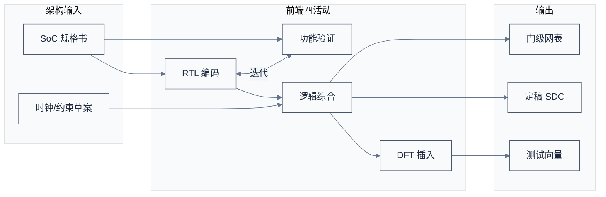
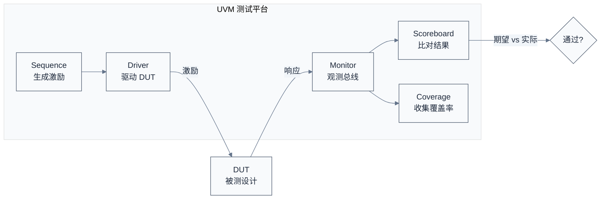
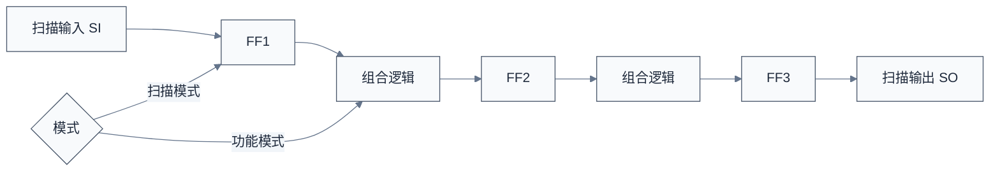

# 前端设计 RTL 与验证 —— 把架构变成可验证的代码

> 上一章把市场语言翻译成了工程契约——PPA 预算、IP 清单、地址映射、时钟电源域。一个自然的问题是：这些契约怎么变成真实的电路？本章用前端流程来回答——先写 RTL 描述行为，再用验证证明它对，最后综合成门级网表交给后端。
> **工程师视角**：你调试时遇到的"这个寄存器读出来是 0""中断没触发""DMA 卡住"这类问题，根因往往在前端阶段的某个边界条件没覆盖、某个时序路径没约束。理解前端流程，能让你在提 issue 时说清"这是 RTL 行为问题还是配置问题"，而不是把所有问题都甩给"芯片有 bug"。

### 关键术语

| 缩写 | 全称 | 含义 |
|------|------|------|
| RTL | Register Transfer Level | 寄存器传输级，描述数据如何在寄存器间流动与变换 |
| HDL | Hardware Description Language | 硬件描述语言，Verilog/VHDL/SystemVerilog |
| SV | SystemVerilog | Verilog 的超集，支持面向对象验证，现代主流 |
| UVM | Universal Verification Methodology | 通用验证方法学，基于 SV 的验证框架 |
| DUT | Design Under Test | 被测设计 |
| DUV | Design Under Verification | 被验证设计（同 DUT） |
| TB | Testbench | 测试平台 |
| Coverage | — | 覆盖率，量化验证完备程度（代码/功能/翻转） |
| Lint | — | 代码静态检查 |
| Formal | Formal Verification | 形式验证，数学证明电路性质 |
| Equivalence Check | — | 等价性检查，证明两个网表/RTL 功能一致 |
| HAV | Hardware-Assisted Verification | 硬件加速验证，Emulation 与 FPGA 原型的统称 |
| Emulation | — | 仿真加速器，把 RTL 映射到专用硬件，MHz 级且全信号可观测 |
| Prototyping | — | FPGA 原型，把 RTL 综合到商用 FPGA，速度接近真实芯片 |
| TDM | Time Division Multiplexing | 时分复用，多 FPGA 分区间共享线路传输信号 |
| Transactor | — | 事务级接口，连接仿真器与真实外设/软件的协议桥 |
| Synthesis | — | 逻辑综合，RTL 转门级网表 |
| Netlist | — | 网表，门级逻辑的连接描述 |
| SDC | Synopsys Design Constraints | 设计约束文件（时序/时钟） |
| STA | Static Timing Analysis | 静态时序分析 |
| DFT | Design for Test | 可测性设计 |
| ATPG | Automatic Test Pattern Generation | 自动测试向量生成 |
| BIST | Built-In Self-Test | 内建自测试 |
| Scan | Scan Chain | 扫描链，DFT 主要结构 |

### 1.1 前置知识

| 需要了解 | 参考文档 |
|----------|----------|
| SoC 全流程与架构阶段 | [01-SoC设计全流程总览](./01-SoC设计全流程总览.md) · [02-规格定义与架构设计](./02-规格定义与架构设计.md) |
| SystemVerilog 基本语法 | — |
| 数字电路时序（建立/保持时间） | — |

---

## 1. 概述

### 1.1 系统上下文

**项目定位**：前端设计承接架构规格，产出**通过验证的门级网表**交给后端。它包含四个子活动——RTL 编码（写行为）、功能验证（证明行为对）、逻辑综合（行为转门级）、DFT 插入（加测试结构）。验证是其中耗时最长的，常占整个前端 60% 以上人力。

**软硬件耦合点**：

- **RTL ↔ 固件**：寄存器的位定义、读写时序、副作用（写 1 清中断、读清 FIFO），都是 RTL 决定的。固件工程师读的 IP 手册，本质是 RTL 行为的文档化。
- **RTL ↔ 验证**：RTL 与验证环境（UVM）并行开发，验证用例覆盖率反过来驱动 RTL 完善。
- **综合 ↔ 工艺**：综合工具用 Foundry 提供的标准单元库（.db/.lib），把 RTL 映射到具体工艺的门。同一份 RTL 在 7nm 和 12nm 综合出的网表 PPA 完全不同。
- **STA ↔ 时序约束**：SDC 文件定义时钟与路径约束，是综合与 STA 共同的输入。约束错了，STA 报"通过"也是假通过。

**跨实现对比**：

| 对比维度 | 自研 RTL | 采购软核 IP | 采购硬核 IP |
|------|------|------|------|
| RTL 来源 | 自己写 | IP 厂商交付 | 无 RTL（只有 GDSII） |
| 验证责任 | 全部自负责 | IP 厂商交付验证套件，集成方做系统验证 | IP 厂商全负责 |
| 综合责任 | 自己综合 | 自己综合到目标工艺 | 已综合好 |
| 修改灵活度 | 高 | 中（可改 RTL 但不建议） | 无 |



> **如何读这张图**：RTL 与验证是**强耦合迭代**的——写一段 RTL 就要写对应验证用例，验证失败回头改 RTL。综合与 DFT 在 RTL 冻结后进行，把行为级转成门级并插入测试结构。**SDC 贯穿综合与后端**，是时序的"宪法"。

> **核心要点**：前端的本质是"用代码精确描述电路行为，并用验证证明它对"。验证不是 RTL 写完才做的事，而是与 RTL 并行、甚至先于 RTL（验证驱动开发）。一个常见错误是"先把 RTL 全写完再验证"——这样积累的 bug 会让调试变成噩梦。

---

## 2. RTL 编码：用语言描述电路

### 2.1 RTL 的本质

RTL（Register Transfer Level）描述的是**数据在寄存器之间的流动与变换**。它不是软件意义上的"程序"，而是"电路的结构化描述"——每一行代码对应具体的硬件。

一个简单例子：一个带使能的 8 位计数器。

```verilog
// 一个带使能的 8 位计数器（同步复位）
module counter #(
    parameter WIDTH = 8
) (
    input  logic             clk,
    input  logic             rst_n,   // 低有效同步复位
    input  logic             enable,  // 计数使能
    output logic [WIDTH-1:0] count
);
    always_ff @(posedge clk) begin
        if (!rst_n)
            count <= '0;
        else if (enable)
            count <= count + 1'b1;
    end
endmodule
```

这段代码对应的电路是：一个 D 触发器组（count 寄存器）+ 一个加法器 + 一个 2 选 1 多路选择器（rst_n/enable 控制数据源）。**RTL 是描述电路，不是执行算法**——这是初学者最容易混淆的点。

### 2.2 RTL 编码的关键纪律

大规模 SoC 的 RTL 不是"能跑就行"，而要遵守严格纪律，否则综合后行为偏离、时序难收。

| 纪律 | 为什么 | 反例 |
|------|------|------|
| 时钟域显式 | 一个模块只用一个时钟，跨域用 FIFO | 在 always 里混用两个时钟 |
| 复位策略统一 | 同步或异步全芯片一致 | 有的模块同步复位有的异步 |
| 避免锁存器 | 综合出 latch 难分析时序 | if 不配 else 且不在 always_ff |
| 组合逻辑不跨时钟 | 跨域要过寄存器 | 直接把 A 域信号喂给 B 域 |
| 寄存器有复位值 | 上电状态确定 | 寄存器无复位，X 态传播 |
| 避免组合环路 | 时序无法分析 | 组合逻辑形成反馈环 |

### 2.3 一个真实场景：跨时钟域的 FIFO

SoC 里大量数据跨时钟域（如 CPU 2GHz 写、DDR 1.6GHz 读），靠**异步 FIFO** 实现。这是 RTL 工程师的常见工作：

```verilog
// 跨时钟域异步 FIFO（简化示意，省略空满判断细节）
module async_fifo #(
    parameter DW = 64,    // 数据位宽
    parameter AW = 8      // 地址位宽，深度 256
) (
    input  logic         wclk,        // 写时钟
    input  logic         wrst_n,
    input  logic         winc,        // 写使能
    input  logic [DW-1:0] wdata,
    output logic         wfull,

    input  logic         rclk,        // 读时钟
    input  logic         rrst_n,
    input  logic         rinc,        // 读使能
    output logic [DW-1:0] rdata,
    output logic         rempty
);
    /* ... 省略实现：双口 RAM + 格雷码指针 + 同步器 ... */
endmodule
```

**为什么用格雷码指针**？因为跨时钟域采样二进制计数器时，多位同时翻转可能被采样到中间态（如 011→100 被采样成 111）。格雷码每次只翻转一位，即使被采样到也是合法的相邻值，避免了读空/写满误判。**这就是"为什么这样设计"——电路细节背后是物理约束。**

> **核心要点**：RTL 编码的核心纪律是"可综合、可验证、可时序分析"。每一段 RTL 都要在脑子里想清楚对应的电路、它跨不跨时钟域、复位策略是否一致。**写 RTL 最大的坑是把硬件描述当成软件写**——结果综合出的电路充满了 latch、组合环路、跨域冒险，验证阶段才发现根本没法调。

---

## 3. 功能验证：证明 RTL 是对的

验证是前端耗时最长的活动，常占前端人力 60% 以上。它的目标只有一个：**在流片前把 bug 全找出来**——因为流片后修 bug 的成本是流片前的 100 倍以上。

### 3.1 验证的层次

| 层次 | 验证对象 | 工具 | 速度 | 精度 |
|------|------|------|------|------|
| 单元验证 | 单个模块 | 仿真器 + 定向用例 | 快 | 高 |
| 组件验证 | IP 子系统 | UVM | 中 | 高 |
| 子系统验证 | 多 IP 集成 | UVM + C 测试 | 较慢 | 高 |
| 系统验证 | 全 SoC | 仿真/FPGA/Emulation | 慢 | 中 |
| 形式验证 | 关键性质 | JasperGold/Formality | 极慢（但完备） | 最高 |

### 3.2 UVM：验证方法学的事实标准

UVM（Universal Verification Methodology）是基于 SystemVerilog 的验证框架，几乎所有商业 SoC 都用它。核心思想：**用可复用的组件搭验证环境，用受约束随机激励驱动 DUT，用覆盖率衡量验证完备度**。

一个 UVM 环境的典型组成：



> **如何读这张图**：Sequence 生成随机激励 → Driver 把它驱动到 DUT 输入 → Monitor 观测 DUT 的输入输出 → Scoreboard 把实际响应与参考模型比对 → Coverage 收集功能覆盖率。**这套机制的精髓是"随机+自检"**——不需要手写每个用例的期望值，靠参考模型自动比对，能在海量随机激励下发现人想不到的边界 bug。

**资深经验：UVM 环境的价值不在"组件齐全"，而在三件事**——这是新手验证环境与生产级验证环境的真正差距：

1. **参考模型（Reference Model）才是灵魂**：Scoreboard 只是比对器，真正决定验证有效性的，是"期望值从哪来"。生产级环境用**事务级参考模型**（SystemC/TLM 或高层 C 模型）生成期望——它能被所有 DUT 复用，且独立于 RTL 实现（否则你只是拿 B 版本验证 A 版本）。**参考模型写错，整套随机回归全在验证一个错误的期望**——这是最隐蔽、最昂贵的验证错误。
2. **约束随机不是"乱跑"**：约束（constraint）决定激励的合法空间——`randc` 保证遍历、`solve...before` 控制相关性、`soft constraint` 允许覆盖。生产级团队花 30% 以上精力维护约束，因为**约束写窄了覆盖不到边界，写宽了大量用例跑在无关区域**。覆盖率的收敛速度，本质上是约束质量的函数。
3. **可重用是设计出来的，不是"写的时候顺便"**：一个 IP 的 UVM 环境能否复用到子系统、SoC 级，取决于组件是否走标准接口（UVC 与总线的耦合度）、配置是否参数化、tie-off 是否集中管理。**"环境重写一次"是验证工时最大的隐性浪费**——IP 级验证环境到 SoC 级重用率，资深团队的目标是 80%+。

> **核心要点（UVM 资深视角）**：UVM 不是"套模板写组件"，而是一个**分层、可重用、以参考模型为核心**的验证体系。判断一个验证环境的好坏，问三个问题：**参考模型独立于 RTL 吗？约束是否驱动了覆盖率收敛？换一层集成时环境复用率有多高？** 三个都答"是"，才是生产级环境。

### 3.3 覆盖率：验证到底做完没有

覆盖率是验证完备度的量化指标，分两类：

- **代码覆盖率**：自动统计，包括行覆盖、条件覆盖、翻转覆盖、状态机覆盖。100% 代码覆盖不等于功能正确，只表示代码都被跑过。
- **功能覆盖率**：人工定义，描述"我想验证的场景是否都覆盖到了"。比如"DDR 控制器在刷新冲突、Bank 交错、读写切换各种场景下都跑过"。

**两者的关系**：代码覆盖率高 + 功能覆盖率低 = 代码都跑了但没验证该验证的；功能覆盖率高 + 代码覆盖率低 = 想验证的都验证了但可能有死代码。**目标是两者都高**。

**资深经验：覆盖率的收敛（Closure）是一门手艺**，几个反直觉的要点：

- **99% 和 95% 不是差 4 个点，是差一个数量级的工作量**：覆盖率越接近 100% 越难收敛——最后几个百分点往往需要针对性的定向用例（directed test），"随机撞"撞不出来。资深团队按"覆盖率目标 vs 达成成本"决定在哪一档 cut line：IP 级要求高，SoC 级 90%+ 已是优秀。
- **覆盖率排除（Exclusion）要留证据**：有些代码/场景"不打算覆盖"（如未用功能、dead code），要显式排除（`$exclude`）并留注释说明理由。**无记录的排除 = 验证盲区的遮羞布**——审计时最先被质疑的就是大片黑名单。
- **交叉覆盖率（Cross Coverage）抓组合 bug**：单点覆盖率 100% 也抓不住"两个正常事件组合在一起就出错"。比如"DDR 读写切换 × 刷新冲突 × bank 状态"的组合——交叉覆盖率才是抓这类边界 bug 的手段，代价是组合爆炸，要按风险挑关键交叉项。
- **覆盖率回灌驱动回归**：生产级流程把"未覆盖点"自动转成新的约束/种子，驱动下一轮回归去补齐——这叫**覆盖率驱动验证（CDV）**。覆盖率不是终点报告，而是回归选择的输入。

> **核心要点（覆盖率资深视角）**：覆盖率的本质是**"风险账本"**——它量化"还有什么没验证"，剩下的不可知就是流片后的风险。三个纪律：**目标分档收敛（别盲目追 100%）**、**排除留证据（别用黑名单掩盖盲区）**、**交叉覆盖率抓组合（单点覆盖不够）**。验证团队向管理层报告的"覆盖率 95%"，翻译过来是"我们量化了剩下的 5% 风险，并决定接受它"——这就是验证的价值。

### 3.4 形式验证：数学证明而非仿真

仿真验证是"跑很多用例看有没有错"，形式验证是"用数学证明这个性质永远成立"。典型场景：

- **性质检查（Property Checking）**：证明"中断永远会在 X 周期内清除""FIFO 永远不会同时读空写满"。
- **等价性检查（Equivalence Check）**：证明综合前 RTL 与综合后网表功能一致——这比仿真快且完备，是综合后必做的验证。

形式验证不用写测试用例，但要把性质用断言（SVA，SystemVerilog Assertions）精确描述出来。它的优势是**完备性**——仿真跑一亿个用例也不能保证第一亿零一个不出错，形式验证能证明"所有可能输入下性质都成立"。

**资深经验：形式验证该用在哪、不该用在哪**——这是它与仿真互补而不是替代的关键：

| 场景 | 形式验证合适吗 | 理由 |
|------|--------------|------|
| 小规模控制逻辑的性质证明（FIFO、仲裁器、握手） | **非常适合** | 状态空间小，证明可行且完备 |
| 大规模数据通路（计算阵列、DMA 引擎） | **不适合** | 状态空间爆炸，形式工具跑不完，仿真更实际 |
| 等价性检查（综合前后、ECO 前后） | **必做** | 证明两个版本功能一致，比回归快且完备 |
| 随机仿真的"盲区"补漏 | 视状态空间大小 | 形式能覆盖仿真没跑到的最小/最大/边界值 |

**一条铁律**：形式验证的证明只覆盖你写进断言的属性。**断言没写的性质，形式验证也证明不了**——所以"形式验证过了"不等于"这个模块正确了"，只等于"你写的那几个性质永远成立"。断言质量决定形式验证价值。

> **核心要点（形式验证资深视角）**：形式验证是**"小规模、关键性质"的完备性武器**，不是仿真的替代品。最被低估的用途是**等价性检查**——它把"综合后网表功能对不对"从"跑回归"变成"数学证明"，是每个流程的强制项。最被高估的用途是把大型数据通路塞给形式工具——跑不完还烧算力。**选对场景：控制逻辑证明性质，数据通路靠仿真，任何改动前后做等价性检查。**

### 3.5 硬件加速验证：从"跑不动"到"跑得起来"

软件仿真（VCS/Xcelium）速度是硬伤，这一点要先量化到有体感：一颗 2GHz 服务器 SoC，**启动 Linux 大约需要几十亿个时钟周期**。RTL 仿真器是"逐周期逐门"解释执行，跑一个时钟周期要执行数以万计的 C 语句——算下来**仿真跑完一次 Linux 启动需要数周乃至数月**。这意味着：任何需要"真实软件负载"的验证（启动 OS、跑数据库、跑 AI 推理、验证驱动）在纯仿真下都不现实。硬件加速验证（HAV，Hardware-Assisted Verification）用真实硬件把验证提速到 MHz 级，是大型 SoC 的**强制选项而非奢侈选项**。

> **核心要点（为什么仿真不够）**：判断一个验证任务该不该上硬件，看两个数——**需要的周期数**和**单周期仿真耗时**。乘起来超过项目容忍的天数，就必须硬件加速。启动 OS、跑固件驱动、验证真实工作负载，动辄 $10^{10}$ 量级周期，这是硬算出来的需求，不是"验证团队想要更快"。

#### 3.5.1 两种硬件加速路线的本质区别

先说最容易混淆的点：**Emulation（仿真加速器）与 FPGA 原型是两种不同设计哲学的产物，不是"快一点和慢一点"的关系**。

| 对比维度 | Emulation（仿真加速器） | FPGA 原型（Prototyping） |
|----------|------------------------|--------------------------|
| **硬件载体** | 专用加速引擎（定制处理器 / 定制 FPGA / 商用 FPGA 阵列） | 一颗到几十颗商用大 FPGA |
| **核心目标** | **可观测性**（全信号可看、可断点、可回放） | **运行速度**（尽量接近真实芯片频率） |
| **运行频率** | 1–5 MHz（典型） | 10–100 MHz（NVIDIA 在 HAPS-200 上跑到 50 MHz） |
| **编译时间** | 数小时（Palladium Z2 十亿门级 &lt;8 小时） | 1–3 天（FPGA P&R 慢，Protium X3 &lt;24 小时） |
| **调试能力** | 编译后任意信号可观测，波形可无限回放 | 必须编译前预留探针信号，超出即不可见 |
| **典型容量** | 数十亿门（ZeBu Server 5 单机柜 3.8B 门，可扩到 30B+） | 数亿到数百亿门（HAPS-200 可扩到 10.8B 门） |
| **成本量级** | 百万美元级采购 / 云租用 | 数万到数十万美元/系统（相对便宜但一用就是一堆） |
| **定位** | 验证团队的主战场：回归、硬件 debug、OS 启动 | 软件团队的主战场：预硅软件 bring-up、驱动开发 |

> **如何读这张表**：核心差异是**为可观测性设计 vs 为速度设计**。Emulator 贵，贵在"任何信号随时可看、bug 能断点回放"——这是硬件 debug 的主需求；FPGA 原型快，快在"软件当真实芯片用"——但想看信号得编译前就想好插哪根探针。**两者的选型答案是"你有多少个 bug 要查"和"你要跑多快的软件"两个问题的加权**。

#### 3.5.2 三大仿真加速器的架构流派

同样是"Emulation"，三家厂商的底层硬件哲学完全不同。这是资深工程师选平台前必须懂的：**它决定了编译速度、可观测性、功耗、可靠性的根本差异**。

| 流派 | 代表产品 | 硬件 | 核心特征 | 代价 |
|------|---------|------|---------|------|
| **定制处理器** | Cadence Palladium | 大规模定制 Boolean 处理器阵列（如 65nm 定制 ASIC） | 编译最快（官方百 M 门/小时级）、全信号可观测是"免费"的、无需插探针 | 功耗高（水冷）、单机柜容量小、要堆机柜 |
| **定制 FPGA** | Siemens Veloce | 面向仿真的定制 FPGA | 编译快、100% 可观测性、片上 trace 深 | 功耗与体积中等 |
| **商用 FPGA** | Synopsys ZeBu | AMD/Xilinx 商用大 FPGA 阵列 | 单机柜容量大、功耗低（&lt;6kW/十亿门）、价格/门最低、可靠 | **编译最慢**（P&R 慢）、调试要动态探针且有速度惩罚 |

这套三流派格局从 1990 年代延续至今——Cadence 收购 Quickturn 后弃用 FPGA 方案转向定制处理器，Synopsys 收购 EVE 后用商用 FPGA 走"容量+成本"路线，Mentor（现 Siemens）的 Veloce 用定制 FPGA 取中间。选型的实际含义：

- **Palladium 用户看重"编译快 + 可观测性强"**——适合 RTL 频繁变化的前期硬件 debug，NVIDIA 是公开的大客户。
- **ZeBu 用户看重"单机柜容量大 + 总拥有成本低"**——适合大容量全芯片回归、软件验证；AMD 用它跑连续工作负载，Intel 是早期大客户。
- **Veloce 用户看重重型 trace 与调试**，生态与西门子工具链绑定。

> **核心要点（架构流派决定采购决策）**：三家在"编译速度 / 可观测性 / 容量成本"三个维度上各押一边，不存在全面最优。资深团队选型不是看"谁家宣称快 2 倍"，而是先回答三个问题——**设计多大（容量）、RTL 变动多频繁（编译速度）、调试依赖全信号可见还是探针够用（可观测性）**。近年 Cadence 用统一前端打通 Palladium 与 Protium、Synopsys 用 EP-Ready 硬件让 ZeBu 与 HAPS 复用，就是要消除"仿真和原型两套流程"的切换成本。

#### 3.5.3 FPGA 原型：HAPS / Protium 的定位

FPGA 原型是把 RTL 综合到商用大 FPGA 上，追求运行速度。两大主力：

- **Synopsys HAPS**（HAPS-100 → HAPS-200）：基于 AMD Versal Premium VP1902，单系统 6 颗 FPGA、可扩展到 12 颗/多机架（最大 10.8B 门）。NVIDIA 公开声明在 HAPS-200 上达到 50 MHz——这已经足够软件团队跑真实工作负载。接口子系统可以跑到 400+ MHz。
- **Cadence Protium**（X1 → X3）：同样基于 VP1902，Protium X3 单系统 250M ASIC 门、可扩到 48B 门，编译 <24 小时。与 Palladium 共用编译前端，设计可以"仿真→原型"无缝迁移。

**FPGA 原型的三个资深工程痛点**（厂商不会写在宣传页上）：

1. **多 FPGA 分区与 TDM 是头号杀手**：一颗 SoC 装不进一颗 FPGA，要切分到多颗，跨 FPGA 信号靠机箱背板布线。Rent's Rule 决定了——**FPGA 容量增长远快于片间 IO 带宽增长**，跨片信号必须时分复用（TDM，Time Division Multiplexing）挤在有限线路上，TDM 越深运行越慢。实际项目中，分区方案差、关键跨片路径走 TDM，会导致原型性能断崖式下跌——这是原型 bring-up 最磨人的环节。
2. **调试是编译时决定的，不是运行时决定的**：想看一个信号，编译前就要选它加入探针集。探针加多了拖慢运行，加少了漏掉现场。**"原型上复现 bug、但探针没留那根信号"是软件团队最常见的绝望时刻**——只能改探针重编译，来回 1–3 天。
3. **原型与真实芯片的时序差异会骗人**：原型跑在 50 MHz，但软件按 2 GHz 芯片的 timeout 假设写。某些"只在原型上出现"的 bug（异步逻辑在慢时钟下的竞态、中断处理太慢导致超时）在真实芯片上根本不存在，反之亦然。**判定"这是真 bug 还是原型伪影"是原型验证的核心技能**。

#### 3.5.4 Emulation 的调试：买的就是"回放权"

Emulation 贵，贵的本质是**调试时间**。仿真里随手可做的"看波形、设断点、回退重跑"，在硬件加速里每一项都有代价，资深团队会把"调试循环时间"（改 bug → 重编译 → 重跑到出错点）当作平台的核心 KPI：

- **可观测性**：Palladium 的 FullVision 支持"运行时任意信号全可见 + 无限深 trace"，Veloce 支持 100% 信号可观测且无需编译；ZeBu 靠静态/动态探针——动态探针（运行中追加观测信号）会有显著速度惩罚（FPGA 上最高可达 300 倍降速）。
- **断点与回放**：Palladium 支持 at-speed 触发、断点、checkpoint 保存/恢复——出错现场可以离线回放 debug，不必重跑整段。ZeBu-200 单模块 200GB trace 内存，配合 checkpoint 也能做"回退重跑"。
- **事务级接口（Transactor）**：把 RTL 与真实外设/软件解耦——用协议 transactor（PCIe/USB/DDR 等，ZeBu 提供 125+ 种）替代物理外设，或用 SpeedBridge 接真实 PCIe/以太网卡。**这是仿真器"接外设"的主要手段**，比物理连接灵活得多。

> **核心要点（调试视角）**：Emulator 的采购本质是买"bug 回放权"。判断预算值不值，就比一个数——**改一次 bug 到重验一次，你的团队要多少小时**。有 checkpoint/无限 trace 的平台，debug 循环可能是小时级；只有动态探针的平台，可能是一天级。大型 SoC 项目 debug 循环跑几十上百次，这个差距直接决定项目能不能按时 tape-out。

#### 3.5.5 成本模型：为什么是"云租用"而非"人人一台"

Emulation 的成本结构决定了它的商业模式：

| 成本维度 | 量级 | 说明 |
|----------|------|------|
| 采购价 | **100 万–1000 万美元**（Quickturn 时代公开引用） | 按门数计价，2013 年参考：定制处理器 2–5 美分/门，商用 FPGA 0.5–2 美分/门 |
| 运行环境 | 机房电费 + 水冷 + 维护 | 水冷系统占空间、功耗高，设备维护是隐性成本 |
| 云租用 | 按小时/按容量计费 | Cadence Palladium Cloud 自 2016 年起提供，Cadence 自己建数据中心 |
| 规模经济 | 大厂建"仿真农场" | NVIDIA 有几十台多代 Palladium 组成的仿真实验室，AMD 用 ZeBu 跑数小时到数周的连续工作负载 |

**采购 vs 云租用的决策逻辑**：买断要求"未来多年利用率足够高"（NVIDIA 级才划算），否则租更合理。Cadence 的公开经验数据：早期租用客户 80% 在 6 个月内转为购买——说明用惯了之后利用率自然上去了。**对大多数团队，云租用（Palladium Cloud / ZeBu 云）是把"百万美元采购"变成"按需付费"的务实路径**，也是小团队能用上仿真加速的唯一方式。

> **核心要点（成本视角）**：Emulation 的成本不是"买一台机器"，而是"为整个 debug 循环买单"。一个反直觉的行业论断——**仿真加速的一个周期，是你能买到的最便宜的验证向量**（DVCon 上厂商公开引用）。因为它的单周期成本摊在"大批量回归 + 软件验证 + 流片前的 OS 启动"上，摊到每个向量比大规模 CPU 仿真农场还低。**贵的不是硬件，贵的是不用它而重复的验证工时。**

#### 3.5.6 平台选型的决策框架

把上面所有维度收拢成一张决策表，给出"什么场景该上什么平台"：

| 你的任务 | 推荐平台 | 理由 |
|----------|---------|------|
| RTL 频繁改动期的硬件 debug | Emulation（Palladium/Veloce） | 编译快 + 全信号可观测，改 RTL 重编译成本低 |
| 全芯片 OS 启动、UVM 回归加速 | Emulation（ZeBu/Palladium） | 容量大、跑得动几十亿周期 |
| 软件 bring-up、驱动开发、现场演示 | FPGA 原型（HAPS/Protium） | 速度快到软件当真实芯片用 |
| 大容量、成本敏感、云上弹性 | ZeBu 或云租用 | 单机柜容量大、功耗低、按需付费 |
| 追求"编译一次全流程复用" | Palladium + Protium 组合 | 统一编译前端，仿真→原型无缝迁移 |

> **核心要点（选型哲学）**：业界最佳实践是**"仿真跑不了的上 Emulation，Emulation 跑不了的软件工作负载上 FPGA 原型"**——三者是接力关系而非替代关系（Cadence 称之为"dynamic duo"，Synopsys 用 EP-Ready 硬件把 ZeBu 与 HAPS 做成可重配置的同一套硬件）。NVIDIA 的做法是公开范本：**用 Palladium 仿真整个系统 10 个月，芯片回来几小时就 bring-up 完成**——软件工作负载在硅前全部跑过，硅回来的验证只剩"确认"，这就是 shift-left 的极致形态。

```mermaid
%%{init: {"theme": "base", "themeVariables": {"primaryColor": "#f8fafc", "primaryTextColor": "#1e293b", "primaryBorderColor": "#475569", "lineColor": "#64748b", "secondaryColor": "#f1f5f9", "secondaryBorderColor": "#94a3b8", "tertiaryColor": "#f8fafc", "fontFamily": "\"trebuchet ms\", verdana, arial, sans-serif"}}}%%
flowchart LR
    VP["虚拟原型 VP<br/>架构级 软件先跑"] -->|"速度↑ 精度↓"| Sim["软件仿真<br/>RTL 级 单元/模块"]
    Sim -->|"跑不动 OS"| Emu["Emulation<br/>1–5 MHz 硬件 debug/OS"]
    Emu -->|"要更快"| FPGA["FPGA 原型<br/>10–100 MHz 软件 bring-up"]
    FPGA -->|"确认"| Silicon["真实硅<br/>流片回来"]
    style VP fill:#cffafe,stroke:#0891b2
    style Sim fill:#dbeafe,stroke:#2563eb
    style Emu fill:#fef3c7,stroke:#d97706
    style FPGA fill:#d1fae5,stroke:#059669
    style Silicon fill:#f1f5f9,stroke:#64748b
```



> **如何读这张图**：从 VP 到真实硅，速度递增、精度递增、但可用时间点递晚——VP 在架构阶段就有，真实硅要等流片。**注意接力关系：Emulation 接住"仿真跑不动的 OS 级验证"，FPGA 原型接住"Emulation 不够快的软件 bring-up"**，每一级只解决前一级速度不够的问题。对软件工程师最有价值的一级是 FPGA 原型——它让你在硅回来前就把驱动、固件、OS 调试到位。

#### 3.5.7 软件工程师视角：Emulation / 原型与你的工作

从"芯片-软件交界处"看，硬件加速验证对软件工程师有四个实际触点：

1. **预硅软件 bring-up**：驱动、固件、BSP 可以在硅回来前就在 FPGA 原型上开发调试——这是现代 SoC 项目"软硬件并行"的物理基础（NVIDIA 靠它把硅后 bring-up 压缩到几小时）。
2. **覆盖率与"硅前验证"的责任**：验证团队在 Emulation 上跑 OS/驱动，跑出来的 bug 分两类——RTL bug（硬件团队改）和软件 bug（你改）。**"这个 bug 在原型上出现过吗"是硅后问题定位的第一问**，这要求软件团队也理解平台的局限（原型时序伪影、探针覆盖盲区）。
3. **JTAG / 调试器接入**：Emulation 支持通过 transactor 暴露虚拟 JTAG，第三方调试器（Lauterbach TRACE32、Arm DS、OpenOCD）可以像连真实芯片一样连到仿真器上的处理器核——你平时用的调试工具链，在硅前就能跑通。
4. **平台差异的三类坑**：原型伪影 bug（慢时钟竞态）、仿真器时序与真实硅的偏差（仿真器对异步逻辑、高速接口的处理与真实 PHY 不同）、容量裁剪（原型可能砍模块）——**判定平台相关 vs 硅相关，是硅后最贵的判断**。

> **核心要点**：对软件工程师而言，硬件加速验证的价值一句话概括——**把你的开发时间线从"硅回来之后"提前到"RTL 稳定之后"**。你在 FPGA 原型/Emulation 上调通的每一个驱动、每一段固件、每一次 OS 启动，都是硅后 bring-up 省下的时间。这也解释了为什么"预硅软件验证"成为现代 SoC 项目验证预算里越来越大的部分。

> **核心要点（全节收束）**：验证不是"跑通几个用例"，而是"用覆盖率量化证明完备度"。UVM 的随机+自检机制能发现人想不到的边界 bug，形式验证能证明关键性质永真，硬件加速验证（Emulation/FPGA 原型）让系统级验证在流片前成为可能。**验证工程师的价值不在于"找到了多少 bug"，而在于"用覆盖率证明了还有多少没覆盖"**——剩下的不可知，就是流片后的风险。而硬件加速验证的出现，把"不可知"的边界从"OS 能不能启动"压缩到"OS 启动后的极端并发场景"——这是现代大型 SoC 敢于 tape-out 的底气。

---

## 4. 逻辑综合：RTL 转门级网表

RTL 是行为描述，Foundry 不认——它只认门级网表（用哪些标准单元、怎么连）。逻辑综合完成这个翻译。

### 4.1 综合的输入输出

| 输入 | 作用 |
|------|------|
| RTL 代码 | 待翻译的行为 |
| SDC 约束 | 时钟定义、时序要求、虚假路径 |
| 标准单元库（.lib/.db） | Foundry 提供的可用门及其时序/功耗参数 |
| 工艺角（PVT） | 工艺/电压/温度组合，多角综合保证各条件下都满足 |

输出：

| 输出 | 作用 |
|------|------|
| 门级网表（Verilog） | 交给后端布局布线 |
| 时序报告 | 哪些路径违例 |
| 面积/功耗报告 | 估算 PPA |

### 4.2 综合在做什么

综合分三步：

1. **翻译（Elaboration）**：把 RTL 翻译成与工艺无关的 GTECH 网表（布尔逻辑）。
2. **映射（Mapping）**：把 GTECH 映射到目标工艺的标准单元（如 TSMC 7nm 的 AND2X1、DFFX1）。
3. **优化（Optimization）**：在时序/面积/功耗约束下调整门的选择与结构，努力满足 SDC。

### 4.3 SDC：时序的宪法

SDC（Synopsys Design Constraints）是贯穿综合与后端的时序约束文件。一个最小 SDC 例子：

```tcl
# 创建时钟：名为 clk，周期 2.0ns（500MHz），占空比 50%
create_clock -name clk -period 2.0 [get_ports clk]

# 设置输入延迟（外部到 DUT 的延迟）
set_input_delay 0.5 -clock clk [all_inputs]

# 设置输出延迟
set_output_delay 0.5 -clock clk [all_outputs]

# 标记虚假路径（不需要时序检查）
set_false_path -from [get_pins rst_reg/Q] -to [get_pins data_reg/D]

# 标记多周期路径（数据多周期才更新一次）
set_multicycle_path 2 -from [get_pins slow_reg/Q]
```

**为什么 SDC 这么关键**？因为 STA 完全基于 SDC 算时序——SDC 错了，STA 报"通过"也是假通过，流片回来时序不满足就废了。**虚假路径漏标**是最常见的坑：某条路径实际不需要满足单周期时序，但没标 false path，综合工具为它拼命优化，浪费面积还干扰真正关键路径的优化。

**资深经验：综合是最容易被低估质量差异的环节**。同一个 RTL，新手和资深工程师综合出的网表面积能差 10–20%、时序余量差一档，差距几乎全部来自约束与流程管理：

1. **约束是综合的"第一质量杠杆"**：`create_clock` 漏一个时钟、`set_false_path` 漏一条跨域路径、`set_multicycle_path` 标错周期数，都会让工具把资源浪费在错误的目标上。**综合报告"通过"不等于"对"——它只证明"在你给的约束下通过"**。约束写错的"假通过"，比约束松的"真失败"更危险。
2. **综合是"迭代收敛"不是"一把过"**：第一版综合报告几乎必然有违例，正常的收敛路径是——看违例路径在哪个模块 → 判断是 RTL 结构问题（该改代码）还是约束问题（该改 SDC）→ 改完重综合。**"所有违例都甩给后端"是团队协作中最贵的态度**——后端无法修复的违例，根源往往是 RTL 里隐式地生成了高扇出、长级联逻辑。
3. **关键路径是"举报信"**：违例路径聚集在哪个模块，就是哪个模块的架构在告诉你它设计得不好——比如一个 64 位加法器在关键路径上，说明该用进位选择/进位保留结构。**资深前端读综合报告像读体检报告：不是看"哪里没过"，而是看"哪个器官在报警"**。

> **核心要点（综合资深视角）**：综合把 RTL 翻译成门级网表，SDC 是这个翻译的"质量标准"。**综合的质量 70% 取决于 SDC 写得好不好**——时钟定义漏了、虚假路径没标、多周期路径没识别，都会导致时序报告失真。一份好的 SDC 是架构师、前端工程师、后端工程师三方反复评审的产物。而**"约束假通过"比"约束紧导致失败"危险十倍**——前者让问题潜伏到流片后，后者在流片前就能逼你改对。

---

## 5. 静态时序分析 STA：不仿真也查时序

STA（Static Timing Analysis）不用跑激励，靠遍历所有时序路径检查是否满足建立时间（setup）和保持时间（hold）。

### 5.1 setup 与 hold 的本质

每个触发器要求数据在时钟沿前后稳定一段时间：

- **建立时间 setup**：数据必须在时钟沿到来前稳定 t_setup，否则触发器采样到错误值。
- **保持时间 hold**：数据必须在时钟沿后保持 t_hold，否则采样不确定。

STA 检查每条"发起触发器 → 组合逻辑 → 捕获触发器"路径：数据到达时间是否满足 setup（不能太慢）、是否满足 hold（不能太快）。

### 5.2 关键路径与 Slack

```text
Slack = 要求时间 - 到达时间
Slack ≥ 0：满足时序
Slack < 0：违例，需优化
```

**关键路径（Critical Path）**是 Slack 最小（最负或最接近 0）的路径，它决定了电路能跑的最高频率。一个 2.0GHz 设计如果关键路径 Slack = -0.1ns，意味着实际最高只能跑 1/(2.0ns + 0.1ns) ≈ 1.9GHz，要么降频、要么改 RTL/综合。

### 5.3 PVT 多角分析

同一电路在不同工艺角（P）、电压（V）、温度（T）下时序差异巨大。STA 必须检查多个角：

| 工艺角 | 典型用途 |
|------|------|
| SS（Slow-Slow） | 最慢，检查 setup |
| FF（Fast-Fast） | 最快，检查 hold |
| TT（Typical） | 典型 |
| SS + 低温 + 高压 | setup 最坏 |
| FF + 高温 + 低压 | hold 最坏（或漏电最大） |

先进工艺还要考虑多电压域、OCV（片上工艺变化）、AOCV/POCV 等更精细的统计模型。

**资深经验：STA 报告是"合同"，签核余量是"谈判筹码"**。几个有体感的要点：

1. **时序余量（Slack）不是"越正越好"，而是"够签核就好"**：把关键路径 Slack 从 +0.1ns 优化到 +0.5ns，代价可能是面积/功耗显著上升。成熟团队按目标频率设"目标 Slack"（如对 2.0GHz 设计要 +0.05ns 才敢 signoff），把工具优化的精力留给真正收不回来的路径——**过优化是另一种浪费**。
2. **虚假路径/多周期路径的标注，是 STA 报告的"合法豁免区"**：签核评审时，最大的争议点往往不是"这条路径怎么优化"，而是"这条路径该不该标 false_path"。**标得太多 = 把真实违例藏进豁免区；标得太少 = 工具把精力浪费在不存在的关键路径上**。资深团队对豁免区有严格评审纪律，因为流片后发现的时序 bug，八成能追到"当年这条路径被错误地标成 false_path"。
3. **setup 看工艺慢角，hold 看工艺快角**：SS 角慢，是 setup 最坏角；FF 角快，是 hold 最坏角。**但 hold 违例只能靠改电路修（加 buffer、延时），setup 违例还能靠降频暂时缓解**——所以"流片后降频"救得了 setup，救不了 hold。这也是为什么 hold 签核在 FF 角上是死线：**hold 错了芯片根本跑不起来，任何频率都不行**。

> **核心要点**：STA 的价值是"完备性"——它不靠跑用例，而是遍历所有可能路径，所以不会漏掉仿真没覆盖的时序违例。**但 STA 的正确性 100% 依赖 SDC**——约束错了，分析结果就是错的。这也是为什么 Signoff 阶段会反复评审 SDC。而资深团队的 STA 功夫，一半在"读报告"（哪条路径是真实的、哪个豁免是合理的），一半在"谈余量"（留多少 Slack 给后端物理实现的退化）。

---

## 6. DFT：给芯片装上"体检接口"

DFT（Design for Test）在 RTL/网表里插入专门的测试结构，让芯片制造后能用自动化设备检测制造缺陷（短路/开路/坏单元）。**没有 DFT，造出来的芯片根本无法批量测试**——你不知道哪颗是好的。

### 6.1 为什么需要 DFT

制造不是完美的——晶圆上有缺陷，每片晶圆良率不到 100%。要在出厂前挑出坏芯片，必须能用测试机（ATE，Automated Test Equipment）快速给每颗芯片跑一遍测试向量。但芯片正常工作模式下，内部节点无法直接观测/控制——你需要专门的结构把"内部状态"引出来。

### 6.2 三大 DFT 结构

| 结构 | 检测对象 | 原理 |
|------|------|------|
| 扫描链（Scan Chain） | 组合逻辑（stuck-at 故障） | 把触发器串成移位寄存器，测试时移入测试向量、移出响应 |
| BIST | 存储器（SRAM/ROM） | 内建测试算法（如 March）自动跑存储器测试 |
| ATPG | 组合逻辑故障 | 软件生成针对每个 stuck-at 故障的测试向量 |

**扫描链的工作流程**：

1. 测试机进入扫描模式，触发器变成一条长移位寄存器。
2. 移入预设的测试向量（每个触发器要的值）。
3. 切回功能模式，跑一个时钟周期，组合逻辑算出结果存入触发器。
4. 再切回扫描模式，把结果移出，与期望值比对。



> **如何读这张图**：功能模式下，触发器接组合逻辑正常工作；扫描模式下，触发器串成移位寄存器，测试向量从 SI 移入、响应从 SO 移出。**这就是为什么 SoC 里每个触发器都要有"扫描使能"输入**——它牺牲了一点面积，换来了制造可测性。

### 6.3 故障模型：测试到底在测什么

DFT 要有效，先得定义"测什么缺陷"。缺陷是物理的（短路/开路/桥接），测试无法直接看物理，要把它抽象成**故障模型**——假设某个逻辑节点固定为 0 或 1，看测试向量能否检测到。

| 故障模型 | 假设 | 检测手段 | 覆盖难度 |
|------|------|------|------|
| Stuck-at（固定故障） | 某节点固定为 0 或 1 | 扫描链 + ATPG | 易，覆盖率高（≥99%） |
| Transition（跳变故障） | 某节点跳变变慢/不跳变 | 两次扫描捕获（launch-capture） | 中 |
| Path Delay（路径延迟） | 某条路径延迟超限 | 针对特定路径的 ATPG | 难 |
| IDDQ（静态电流） | 缺陷导致漏电异常 | 测芯片静态电流 | 模拟/混合信号，先进工艺下降效 |

**为什么 stuck-at 不够**：先进工艺下，很多缺陷不是"完全固定"，而是"跳变变慢"——正常电压下能工作，高温/低压下失效。所以 transition 和 path delay 故障模型越来越重要，它们用"快跑两拍看跳变能否跟上"的方式检测延迟类缺陷。

### 6.4 更多 DFT 结构：边界扫描、压缩、LBIST

除了扫描链和 ATPG，DFT 还有几个重要结构：

- **边界扫描（Boundary Scan，IEEE 1149.1 / JTAG）**：在芯片 IO 焊盘附近插入边界扫描单元，测板级焊接连通性。你在板子上用 JTAG 调试时，用的就是这套。TCK/TMS/TDI/TDO 四根线是 JTAG 接口的标准。
- **压缩扫描（Scan Compression）**：一颗大 SoC 扫描链可能上百万位，移入移出极慢。压缩扫描用少量外部引脚（如 8 进 8 出）解压内部长链，测试时间缩短 10–100 倍。现代 SoC 几乎都用压缩扫描。
- **LBIST（Logic BIST）**：把测试向量生成与响应比对做进芯片内部，靠片上 PRPG（伪随机向量生成器）与 MISR（多输入特征寄存器）自检，无需外部 ATE 喂向量。常用于现场自检（如车载芯片上电自检）。
- **MBIST（Memory BIST）**：专门测 SRAM/ROM 的内建自测，跑 March 等算法遍历各种读写模式，能测出存储器制造缺陷。DDR PHY、L3 Cache 都有 MBIST。

> **核心要点**：DFT 不是"可选项"——没有 DFT 的芯片无法量产测试。它通过扫描链把内部触发器变可观测可控，通过 BIST 让存储器自检，通过 ATPG 生成制造测试向量，通过边界扫描测板级连通。**故障模型决定测试质量**——stuck-at 是基础，transition/path delay 是先进工艺的进阶要求。DFT 也是固件与安全的交集——测试通路既能用来挑坏芯片，也能被攻击者用来读密钥，所以安全设计必须显式禁用测试通路。

**资深经验：DFT 的三个"算账"维度**——DFT 不是"插结构"，而是三本经济账的平衡：

1. **测试时间 = 真金白银**：ATE（自动测试设备）按秒计费，一颗芯片的测试时间直接进单颗成本。扫描向量越长、移入移出越慢，测试越贵——这是**压缩扫描（Scan Compression）**存在的全部理由：用 8 进 8 出的外部引脚喂几万条内部长链，测试时间缩短 10–100 倍。**一颗年产量千万颗的芯片，测试时间每省 0.1 秒，年省的成本就是千万级**——DFT 工程师的每一分优化都有直接的商业回报。
2. **覆盖率是"故障漏网率"的代理**：stuck-at 覆盖率 ≥99% 是行业惯例，但**覆盖率到 99% 后每提升 0.1% 的成本都会飙升**（要为最后几个难测故障专门构造向量）。资深团队按"故障类型 × 产品等级"分档设目标——消费级 stuck-at 99% 够用，车规级要 transition 覆盖率达标并做额外故障注入验证，因为**车规产品的漏测一个缺陷，召回成本远超测试成本**。
3. **DFT 与性能是零和博弈**：扫描链占用触发器面积、测试模式改变了时钟树、边界扫描在 IO 上加负载——这些都会轻微恶化功能模式性能。**"DFT 插得越全，功能越慢"是物理规律**。资深团队在架构阶段就确定 DFT 插入范围（哪些块可测、哪些块豁免），避免后端阶段为补 DFT 回头改 RTL。

### 6.5 DFT 对软件的影响

DFT 结构对固件工程师也有关联：

- **测试引脚**：芯片有专门的 JTAG/扫描引脚，量产测试时用；正常工作时这些引脚可能是 GPIO 复用，固件要正确配置。
- **BIST 寄存器**：DDR PHY、SRAM 都有 BIST 控制寄存器，固件启动时可能触发一次内存 BIST 自检。
- **安全启动**：某些 DFT 通路在安全启动下必须禁用，防止攻击者用扫描链读出密钥——这就是"安全与可测性的冲突"，需要专门的"安全 DFT"设计。

> **核心要点**：DFT 不是"可选项"——没有 DFT 的芯片无法量产测试。它通过扫描链把内部触发器变可观测可控，通过 BIST 让存储器自检，通过 ATPG 生成制造测试向量。DFT 也是固件与安全的交集——测试通路既能用来挑坏芯片，也能被攻击者用来读密钥，所以安全设计必须显式禁用测试通路。

---

## 7. 前端冻结与移交

前端阶段的里程碑叫"RTL Freeze"（RTL 冻结）或"Netlist Handoff"（网表移交）。标志是：

- [ ] 代码覆盖率与功能覆盖率达标（通常 ≥ 95%）
- [ ] 关键 bug 全部关闭
- [ ] 综合无违例或违例可接受
- [ ] STA 在所有 PVT 角下 setup/hold 满足
- [ ] DFT 结构插入完成，ATPG 覆盖率达标（通常 stuck-at 覆盖 ≥ 99%）
- [ ] 等价性检查通过（RTL ↔ 网表）

冻结后网表交给后端做物理设计。之后 RTL 仍可能因后端反馈或验证新发现 bug 而变更，但每次变更都要走 ECO（Engineering Change Order）流程，重新跑回归——**越接近流片，变更成本越高**。

---

## 8. 小结

前端把架构契约变成可验证的网表，四件事：写 RTL、做验证、做综合、插 DFT。其中验证是耗时大头，DFT 是量产前提。

> **核心要点**：前端的两个不变真理——**验证完备度决定流片风险**（覆盖率不够就是赌运气），**SDC 正确性决定时序真假**（约束错了 STA 通过也是假通过）。这两点做好，前端就稳了大半。

下一篇进入后端：把网表变成物理版图。

- 下一篇：[04-后端物理设计与签核](./04-后端物理设计与签核.md)
- 上一篇：[02-规格定义与架构设计](./02-规格定义与架构设计.md)

---

## 参考资料

- [SystemVerilog IEEE 1800-2017 Standard](https://standards.ieee.org/ieee/1800.1-10368/) — 参考 SV 语法与断言
- [UVM Reference (Accellera)](https://www.accellera.org/downloads/standards/uvm) — 参考 UVM 方法学
- [Synopsys Design Compiler / PrimeTime 文档](https://www.synopsys.com/implementation-and-signoff/) — 参考综合与 STA 流程
- [Siemens Tessent DFT 文档](https://eda.sw.siemens.com/en-US/ic/tessent/) — 参考扫描链/BIST/ATPG
- [JasperGold Formal Verification](https://www.cadence.com/en_US/home/tools/system-design-and-verification/formal-and-static-verification.html) — 参考形式验证
- [Cadence Palladium / Protium](https://www.cadence.com/en_US/home/tools/system-design-and-verification/emulation-and-prototyping/palladium.html) — 参考了 §3.5 Emulation 架构（定制处理器/FPGA 流派）、FullVision 调试、编译速度数据
- [Synopsys ZeBu Server 5 / ZeBu-200](https://www.synopsys.com/verification/emulation-prototyping/emulation/zebu-server.html) — 参考了 §3.5 商用 FPGA 流派、容量/功耗/Transactor 数据
- [Synopsys HAPS-200 / HAPS 页面](https://www.synopsys.com/verification/emulation-prototyping/prototyping/haps-200.html) — 参考了 §3.5 FPGA 原型容量、TDM 分区、NVIDIA 50 MHz 实测
- [ZeBu Server 5 规格书（PDF）](https://www.synopsys.com/content/dam/synopsys/verification/technical-papers/zebu-server5-spec-mar2023.pdf) — 参考了 §3.5 容量/功耗/语言支持具体规格
- [Cadence Protium X3 System Studio Datasheet](https://www.cadence.com/en_US/home/resources/datasheets/protium-x3-system-studio-ds.html) — 参考了 §3.5.3 VP1902/250M 门规格
- [Palladium Cloud（Cadence 博客）](https://community.cadence.com/cadence_blogs_8/b/breakfast-bytes/posts/cloud-palladium) — 参考了 §3.5.5 采购成本量级、云租用、NVIDIA 仿真 10 个月的案例
- [Lauro Rizzatti：三大 Emulator 架构对比](https://www.rizzatti.com/lauro-on-cdns-palladium-xp2-vs-ment-veloce-2-vs-snps-zebu-3/) — 参考了 §3.5.2 三大架构流派与编译速度/可观测性/功耗差异
- [DeepChip：Palladium/Veloce/ZeBu 技术对比](https://www.deepchip.com/items/0522-04.html) — 参考了 §3.5 价格/门、TDM、动态探针速度惩罚、Rent's Rule 对多 FPGA 分区的影响
- [ESNUG 532：TDM 与 FPGA 探针惩罚](http://deepchip.com/items/0532-02.html) — 参考了 §3.5.3 多 FPGA 分区、动态探针 300 倍降速数据
