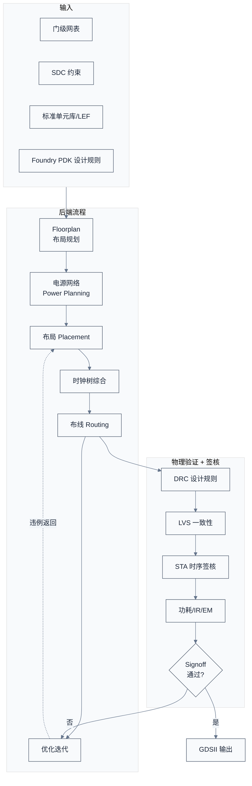
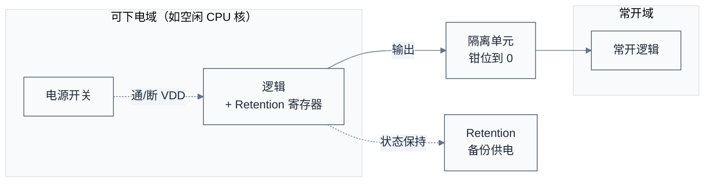
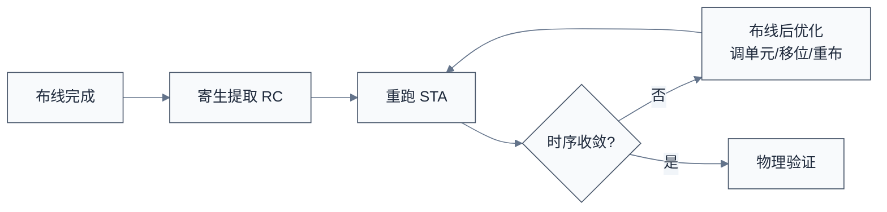

# 后端物理设计与签核 —— 把网表变成版图

> 上一章把架构变成了通过验证的门级网表。一个自然的问题是：网表只是"逻辑连接图"，Foundry 不认——它要的是物理版图（每个门摆在晶圆哪里、用哪层金属怎么连线）。本章用后端流程来回答——做 Floorplan、布局布线、时钟树、物理验证、签核，最终产出 GDSII。
> **工程师视角**：后端是离软件最远、却悄悄决定软件体验的环节——时钟树质量决定抖动与时序余量，电源网络决定能不能跑满频，floorplan 决定 die 大小与封装引脚。理解后端，能让你理解"为什么这颗芯片标称 2GHz 却只能稳定跑 1.8GHz""为什么高温时降频"这类现象的硬件根源。

### 关键术语

| 缩写 | 全称 | 含义 |
|------|------|------|
| Floorplan | — | 布局规划，定 die 尺寸、模块位置、电源网络骨架 |
| P&R | Place and Route | 布局布线，把门摆好并用金属连线 |
| CTS | Clock Tree Synthesis | 时钟树综合，构建时钟分配网络 |
| DEF | Design Exchange Format | 设计交换格式，描述版图布局与连线 |
| LEF | Library Exchange Format | 库交换格式，描述标准单元的物理抽象 |
| GDSII | Graphic Data Stream Information Interchange | 版图数据格式，流片交付物 |
| DRC | Design Rule Check | 设计规则检查（线宽/间距等） |
| LVS | Layout Versus Schematic | 版图与网表一致性检查 |
| ERC | Electrical Rule Check | 电气规则检查（短路/开路/悬空） |
| IR Drop | — | 电源压降，电流流过电源网络造成的电压跌落 |
| EM | Electromigration | 电迁移，大电流导致金属线老化失效 |
| UPF | Unified Power Format | 电源意图格式，描述电源域/隔离/保持 |
| DFM | Design for Manufacturing | 可制造性设计，提高良率 |
| OPC | Optical Proximity Correction | 光学邻近校正，补偿光刻变形 |
| SADP/SAQP | Self-Aligned Double/Quad Patterning | 自对准双重/四重图形，DUV 多重曝光 |
| STA | Static Timing Analysis | 静态时序分析 |
| Signoff | — | 签核，流片前最终验收 |
| ECO | Engineering Change Order | 工程变更指令，流片前后的小修改 |
| OCV | On-Chip Variation | 片上工艺变化 |
| AOCV/POCV | Advanced/Parametric OCV | 更精细的统计时序模型 |
| CRPR | Clock Reconvergence Pessimism Removal | 时钟重汇聚悲观消除 |
| SI | Signal Integrity | 信号完整性，crosstalk/noise 对时序的影响 |
| NDR | Non-Default Rules | 非默认规则，时钟网用的加宽加间距规则 |
| LEC | Logic Equivalence Check | 逻辑等价性检查，证明两版网表功能一致 |
| PERC | Programmable Electrical Rule Check | 可编程电气规则检查 |
| Standard Cell | — | 标准单元，Foundry 提供的基本逻辑门 |
| Macro | — | 宏单元，已物理实现的大模块（如 SRAM、硬核 IP） |
| TF | Technology File | 工艺文件，ICC2 主工艺描述 |
| TechLEF | Technology LEF | 金属层规则（线宽/间距/方向） |
| RCx | RC Extraction Tech File | 寄生 RC 提取工艺文件 |

> **跨厂商对照**（同功能不同厂商工具，签核时常用互换）：

| 功能 | Synopsys | Cadence | Siemens EDA（Mentor） |
|------|----------|---------|------------------------|
| 布局布线 | IC Compiler II (ICC2) | Innovus | — |
| 静态时序 | PrimeTime (PT) | Tempus | — |
| 寄生提取 | StarRC | Quantus QRC | Calibre xRC |
| 物理验证 | IC Validator | Pegasus | Calibre |
| IR/EM 分析 | RedHawk-SC (Ansys) | Voltus | — |
| 形式等价 | Formality | Conformal EQC | — |
| DFT | TestMAX | — | Tessent |

### 1.1 前置知识

| 需要了解 | 参考文档 |
|----------|----------|
| 前端流程与网表 | [03-前端设计RTL与验证](./03-前端设计RTL与验证.md) |
| SDC 与 STA 概念 | [03-前端设计RTL与验证](./03-前端设计RTL与验证.md#5-静态时序分析-sta不仿真也查时序) |
| SoC 组成与电源域 | [02-规格定义与架构设计](./02-规格定义与架构设计.md) |

---

## 1. 概述

> **驱动力**：后端流程 20 年的演进，本质是一条被物理约束推着走的接力链——**工艺微缩 → 晶体管密度爆炸 → 布线拥塞/着色冲突 → IR/EM 恶化 → 工艺变化放大**。每一代工艺解决了上一代的容量问题，但立刻暴露下一个物理矛盾。7nm 以下，时序、IR/EM、拥塞三者耦合到无法分开优化，这是后端工作量与前端相当甚至更大的根本原因。**不变量**：无论工艺怎么变，后端永远是"把逻辑网表变成符合 Foundry 规则的物理版图"——floorplan/电源/CTS/布线/签核的骨架不变，变的只是每一步的物理约束越来越严。

### 1.2 系统上下文

**项目定位**：后端设计承接前端网表，产出**通过所有签核的 GDSII** 交给 Foundry 制造。它把"逻辑"变成"物理"——每个标准单元摆在 die 的哪个坐标、每根连线走哪层金属、时钟怎么从 PLL 分配到每个触发器、电源怎么从封装引脚送到每个单元。**这是离工艺最近的环节**——所有设计决策都要在 Foundry 的 PDK 规则内进行。

**软硬件耦合点**：

- **后端 ↔ Foundry**：PDK 是后端的"宪法"——设计规则（最小线宽、间距、孔密度）、电气参数（RC 寄生）、标准单元库，全部来自 Foundry。换 Foundry 或换节点，后端基本要重做。
- **Floorplan ↔ 封装**：die 尺寸、IO 引脚位置、电源 bump 位置，要与封装设计协同。BGA 引脚排列约束 floorplan 里的 IO ring。
- **时钟树 ↔ 固件**：时钟树的频率、分频比、门控点，最终变成固件的时钟初始化代码与 DVFS 策略。
- **电源网络 ↔ 热设计**：IR drop 与 EM 决定芯片能否在目标频率/电压下可靠工作，过不了就要降频或加电压域。

**跨实现对比**：

| 对比维度 | 传统单 die 后端 | Chiplet/多 die | 先进封装（2.5D/3D） |
|------|------|------|------|
| 设计对象 | 一个 die | 多个 die 各自后端 + 片间互连 | 多 die + 中介层 + TSV |
| 时序收敛 | die 内 STA | die 间需考虑封装互连延迟 | 3D 堆叠需考虑 TSV RC |
| 电源网络 | die 内电源环 | 每 die 独立 + 封装供电 | 多 die 共享/独立供电 |
| 签核范围 | 单 die | 多 die + 封装联合签核 | 含中介层、TSV 联合 |



> **如何读这张图**：后端是"布局规划 → 电源 → 布局 → 时钟树 → 布线 → 验证"的螺旋迭代。任何一步签核不过，都要回头调整——可能是改 floorplan，可能是改布局，可能是 ECO 改网表。**先进工艺下，时序/IR/EM 三者常常互相打架**：降 IR 要加宽电源线（占布线资源）、降 EM 要并联更多过孔（占面积）、收时序要短连线（挤布局）——后端工程师的工作就是在这些矛盾里找平衡。

> **核心要点**：后端是把网表"实体化"的过程，每一步都在与 Foundry 的物理规则博弈。**先进工艺下后端工作量与前端相当甚至更大**——因为 7nm 以下，布线拥塞、IR 压降、EM、工艺变化等问题急剧放大，传统流程要多次迭代才能收敛。

---

## 2. Floorplan：先画"小区规划图"

> 上一章把后端定位为"把网表变成符合 Foundry 规则的物理版图"，并画出"Floorplan → 电源 → P&R → 验证 → 签核"的骨架。一个自然的问题是：这套流程从哪里开始？为什么不能直接摆门？本章用 Floorplan 回答——先列 Floorplan 要决定的六件事（die 尺寸、模块摆放、IO、电源骨架、布线通道、keepout），再用一张示意图把 Macro/标准单元区/电源条纹的位置关系画出来，最后说明为什么 Floorplan 是"先难后易"——前期多花时间摆好 Macro、规划好电源骨架，后面布局布线才顺。

Floorplan 是后端第一步，决定 die 的整体布局——像城市规划，先定小区、道路、电网骨架。

### 2.1 Floorplan 要决定的事

| 决策 | 考量 |
|------|------|
| die 尺寸 | 面积 vs 成本，要留够布线空间 |
| 模块摆放 | 大 Macro（SRAM/硬核 IP）位置，影响布线长度 |
| IO 位置 | 与封装引脚对应，约束 IO ring |
| 电源骨架 | 电源环/条纹位置，供电入口 |
| 布线通道 | 模块间留通道，避免拥塞 |
| keepout | Macro 间留禁布区，避免干扰 |

### 2.2 一个 Floorplan 示意

```text
+----------------------------------------------------+
|  IO Ring (PAD/IO 单元环绕)                          |
|  +----------------------------------------------+  |
|  |  +----------+   +----------+   +----------+  |  |
|  |  | CPU 集群 |   |  NoC     |   | GPU/NPU  |  |  |
|  |  | (4×核)   |   |  Mesh    |   |          |  |  |
|  |  +----------+   +----------+   +----------+  |  |
|  |  +----------+         +----------+           |  |
|  |  | L3 Cache |         | DDR Ctrl |           |  |
|  |  | (SRAM)   |         | + PHY    |           |  |
|  |  +----------+         +----------+           |  |
|  |  +----------+   +----------+   +----------+  |  |
|  |  | PCIe RC  |   | 安全模块  |   | Debug    |  |  |
|  |  +----------+   +----------+   +----------+  |  |
|  |       电源条纹（横向）                          |  |
|  |       电源条纹（纵向）                          |  |
|  +----------------------------------------------+  |
+----------------------------------------------------+
```

> **如何读这张图**：Macro（SRAM、硬核 IP）摆在固定位置，标准单元区域（CPU 逻辑、控制器）填在 Macro 之间。**Macro 摆放是 Floorplan 最关键决策**——它决定了数据走多远、布线拥塞在哪、电源怎么走。一个好的 floorplan 能让后端事半功倍，差的 floorplan 怎么布局布线都收不回来。

> **核心要点**：Floorplan 是"先难后易"——前期多花时间摆好 Macro、规划好电源骨架，后面布局布线才顺。一个常见错误是 floorplan 草草了事，结果布线阶段发现 Macro 挡路、电源不够，要推倒重来。

---

## 3. 电源网络：芯片的"血管系统"

> 上一章讲了 Floorplan：定 die 尺寸、摆好 Macro、规划电源骨架与布线通道。一个自然的问题是：电源骨架为什么单列一章、还说是后端最容易翻车的暗坑？本章用电源网络回答——先讲先进工艺下电流巨大导致的 IR Drop 与 EM 两类失效，再展开"环 + 条纹 + 网格"的电源网络结构与高低层金属分工，接着讲静态/动态 IR 与 EM 分析签核，最后讲低功耗物理设计怎么用 UPF 落地电源域（隔离/电平转换/状态保持/电源开关四类特殊单元）。

电源网络（Power Network）把封装引脚送来的电，分配到 die 上每个晶体管。它是后端最容易被低估、却最容易翻车的部分。

### 3.1 为什么电源网络难

先进工艺下，晶体管密度爆炸、工作电流巨大——一颗 5nm 服务器 SoC 峰值电流可达数百安培。电流流过电源金属线会产生：

- **IR Drop**：电压跌落。若某单元工作电压 0.8V，但 IR drop 让它实际只收到 0.72V，时序就崩了——单元变慢，setup 违例。
- **EM（电迁移）**：大电流把金属原子撞走，时间久了金属线变细断路。EM 不达标，芯片用几年就坏。

### 3.2 电源网络的结构

典型电源网络是"环 + 条纹 + 网格"：

```text
封装供电 bump → 电源环（环绕 die 边缘）
              → 电源条纹（横纵向贯穿 die）
              → 标准单元行电源轨（每行接电）
              → 每个标准单元的 VDD/VSS 引脚
```

电源网络用高层金属（厚、低电阻），信号用低层金属（细、高密度）。层数越多、电源条纹越密，IR drop 越小，但占布线资源越多。

### 3.3 IR/EM 分析与签核

后端要用工具（如 Ansys RedHawk、Cadence Voltus）做静态和动态 IR 分析：

- **静态 IR**：平均电流下的压降，看整体供电是否够。
- **动态 IR**：峰值电流瞬态压降，看高活动时刻会不会局部塌电。比如 CPU 同时全核翻转的瞬间，局部电流飙升，可能瞬间 IR drop 200mV。
- **EM 分析**：每段电源线的电流密度，是否超过工艺允许的 EM 寿命阈值。

IR/EM 不达标怎么办？加宽电源条纹、加更多过孔、分区供电、降低翻转率——都是昂贵的选择。

> **核心要点**：电源网络是后端的"暗坑"——它不像时序那样有清晰的 Slack 数字，但一旦出问题就是大面积时序崩坏或可靠性失效。**先进工艺下，IR/EM 签核与 STA 签核同等重要**。这也是为什么大芯片要分多个电源域——既是为了电源管理，也是为了把大电流分散，降低单点 IR/EM 压力。

### 3.4 低功耗物理设计：电源域怎么落地

[第 2 章 §6](./02-规格定义与架构设计.md#6-时钟与电源域芯片的血管与神经) 定义了电源域划分，但"哪个域能下电、下电时怎么保护其他域"要靠后端插入专门的物理单元。这套设计由 **UPF（Unified Power Format）** 描述——它是电源意图的标准格式，告诉后端工具"哪里有电源域、哪里要隔离、哪里要保持状态"。

低功耗物理设计要插入四类特殊单元：

| 单元 | 作用 | 何时需要 |
|------|------|------|
| Isolation Cell（隔离单元） | 下电域的输出钳位到固定电平，防止悬空信号损坏上电域 | 任何可下电域的输出边界 |
| Level Shifter（电平转换单元） | 跨电压域信号电平转换（如 0.6V ↔ 0.8V） | 多电压域之间 |
| Retention Register（状态保持寄存器） | 域下电时保留关键状态，上电后恢复 | 需要快速唤醒的逻辑（如配置寄存器） |
| Power Switch（电源开关） | 控制某区域供电通断，实现电源门控（Power Gating） | 大块可下电区域（如空闲 CPU 核） |



> **如何读这张图**：可下电域通过电源开关切断 VDD 省电；它的输出必须经过隔离单元钳位到固定电平，否则悬空信号会让常开域的输入处于亚稳态；关键状态存入 retention 寄存器（有独立备份供电），上电后恢复，避免重新初始化。**这套机制是"深睡唤醒"功能的硬件基础**——你手机待机一天不耗电、按一下秒唤醒，靠的就是电源门控 + retention。

> **核心要点**：电源域划分是架构决策，但电源域的物理实现（隔离/电平转换/状态保持/电源开关）是后端工作，由 UPF 描述。**没有这些特殊单元，电源门控会直接损坏芯片**——下电域的悬空输出会干扰上电域。这也是为什么固件的电源管理代码要严格匹配 UPF 定义的上下电时序，乱关电源域会导致硬件损坏。

---

## 4. 布局布线 P&R：把门摆好连好

> 上一章讲了电源网络：用"环 + 条纹 + 网格"把电送到每个晶体管，并用 UPF 落地电源域。一个自然的问题是：电源骨架搭好后，标准单元怎么摆、怎么连、时钟怎么分到每个触发器？本章用 P&R 回答——先讲布局（Placement）怎么定每个单元坐标，再讲时钟树综合（CTS）怎么从 PLL 把时钟分配到几十万个触发器，接着讲布线（Routing）用各层金属连线并处理拥塞，最后讲布线后寄生提取与 post-route 优化，并补一节资深视角看 CTS 这个"时序收敛的隐藏战场"。

P&R 是后端的核心步骤，把标准单元摆到 die 上，用金属线连起来。

### 4.1 布局（Placement）

布局工具（如 Synopsys ICC2、Cadence Innovus）根据网表连接关系、时序约束、拥塞情况，决定每个标准单元放在哪个坐标。目标：连线短、时序好、不拥塞、标准单元行规整。

布局不是一次到位的——它要和时序优化、拥塞分析反复迭代。先进工艺下，布局质量直接决定后续布线能否收敛。

### 4.2 时钟树综合 CTS

时钟信号要从一个 PLL 源，分配到 die 上几十万个触发器。CTS（Clock Tree Synthesis）构建这棵时钟分配树：

```text
PLL → 时钟根 → 缓冲器 → 分支 → 缓冲器 → ... → 触发器
```

CTS 的目标：

- **时钟偏差（Skew）小**：同一时钟沿到达不同触发器的时间差要小，否则 setup/hold 都难满足。
- **时钟延迟（Latency）可控**：从 PLL 到触发器的总延迟要在合理范围。
- **时钟功耗低**：时钟网络翻转率最高，占动态功耗大头，要尽量少用缓冲器、用时钟门控。

先进工艺还要处理多时钟域、多电压域、时钟门控单元插入、时钟不确性（uncertainty）建模。

### 4.3 布线（Routing）

布线工具用各层金属把标准单元按网表连起来。金属层分上下两组：

- **低层金属（M1-M4）**：细、密，用于标准单元内部与短距连接。
- **高层金属（M5-M_top）**：粗、厚、低电阻，用于长距连线、时钟、电源。

布线的难点是**拥塞（Congestion）**——某些区域连线太多挤不下，导致绕路或无法布通。拥塞热点常出现在 Macro 边缘、接口集中处。解决靠调整 floorplan、加布线通道、用更多金属层。

### 4.4 寄生提取与优化

布线完成后，每根连线有了真实的物理长度与寄生电容/电阻（RC）。后端工具做**寄生提取**（如 StarRC、QRC），把 RC 反标到网表，重跑 STA——这是第一次看到"真实时序"。通常布线后时序会比综合时差（因为综合用的是估算 RC），需要工具做布线后优化（post-route optimization）——重新调整单元尺寸、移动单元位置、重布关键路径。



> **核心要点**：P&R 是后端的"主战场"，布局决定能否摆得开，CTS 决定时钟质量，布线决定能否连得通。**三者中最容易被低估的是 CTS**——时钟树质量直接决定 setup/hold 是否可收、动态功耗是否合理。一个差的时钟树会让时序怎么优化都收敛不了。

### 4.5 资深经验：CTS 是时序收敛的"隐藏战场"

综合阶段的时序是"理想时钟"（zero skew）假设，后端 CTS 之后第一次出现真实时钟延迟——**这是前端综合报告与后端真实时序第一次"对账"的地方**。资深后端团队的 CTS 功夫在于三件事：

1. **skew 是"分配"出来的，不是"消除"出来的**：CTS 的目标不是 skew=0，而是**把 skew 设计成对关键路径有利**——比如给一条 setup 紧张路径的捕获时钟人为"压晚"（useful skew），等效多给数据半个周期。**会利用 useful skew 的团队，和只会"平衡到零"的团队，最高频率能差 5–10%**。
2. **CTS 与布局是往返迭代**：CTS 做完看 skew 超标、插入延迟太大，往往要回头调 floorplan——把时钟源摆到逻辑中心、把高扇出寄存器的物理位置聚拢。**"CTS 一次过"是很少见的好运气**，正常流程是布局→CTS→看树质量→回头调布局 2–3 轮。
3. **时钟门控（Clock Gating）是功耗与 CTS 的耦合点**：门控单元（ICG）插在时钟树上，减少动态功耗，但它本身增加时钟延迟与 skew 不确定性。**门控插在哪一级、插多少，是功耗预算与时序余量的直接交易**——这也是为什么低功耗设计（见 §3.4）要早定，CTS 阶段再改门控策略代价极高。

> **核心要点（CTS 资深视角）**：CTS 把"理想时钟"变成"真实时钟"，是前端与后端的第一次对账。**会做 useful skew 的团队在收时序；只会"平衡到零"的团队在填坑**。判断一个团队 CTS 水平，就问一个问题——"你的 skew 数字是越接近零越好，还是按路径方向分配出来的？"

---

## 5. 物理验证：DRC / LVS / ERC

> 上一章讲了 P&R：布局摆门、CTS 分时钟、布线连线、post-route 优化收敛时序。一个自然的问题是：布线通了就等于版图能用吗？本章用物理验证回答——先讲 DRC 查 Foundry 设计规则（线宽/间距/孔/天线/密度），再讲 LVS 把版图与网表做结构性比对查短路开路，接着讲 ERC 查电气合理性，然后把 DFM 与多重图形（OPC/CMP/SADP/着色）作为"好不好造"的软关展开，最后讲布线后才存在的信号完整性 SI（crosstalk 噪声毛刺与延迟变化）及 NDR 对时钟网的保护。

布线完成不等于版图可用——还要过三道物理验证关。

### 5.1 DRC（Design Rule Check）

DRC 检查版图是否违反 Foundry 的设计规则：

- 最小线宽、最小间距
- 孔的最小尺寸与密度
- 天线规则（长金属连到栅极时，工艺中电荷积累会击穿栅氧）
- 密度规则（某层金属填充率不能太低也不能太高）

DRC 不过，Foundry 拒收。**天线规则**是初学者常踩的坑——一根长金属在刻蚀过程中会积累静电，连到 MOS 栅极会击穿栅氧，解决靠加二极管或改布线层。

### 5.2 LVS（Layout Versus Schematic）

LVS 检查版图与网表是否功能一致——把版图提取成网表，与设计网表比对，看元件与连接是否完全对应。常见 LVS 错误：

- 短路：两根不该连的线连上了
- 开路：该连的没连上
- 元件错：用了错的单元版本

### 5.3 ERC（Electrical Rule Check）

ERC 检查电气合理性——悬空输入、电源地短路、非法连接等。

这三道验证由 Calibre（Siemens）等工具完成，是流片前的硬性关卡。**任何一项不过都不能流片**。

### 5.4 DFM 与多重图形：让版图"好造"

DRC 保证版图"能造"，DFM（Design for Manufacturing，可制造性设计）追求"好造"——提高良率、降低对工艺波动的敏感。先进工艺下 DFM 是签核的重要一环：

- **光刻友好（Litho-Friendly）**：某些版图形状在光刻下会变形（如密集线条末端变圆）。工具做 OPC（光学邻近校正）调整形状，但设计师也能通过避免坏形状帮光刻——如避免孤立线、保持方向一致。
- **CMP Aware（化学机械抛光感知）**：金属密度不均会让抛光后表面不平，影响后续层。靠加 dummy metal（填充金属）让密度均匀。
- **多重图形（Multi-Patterning）**：DUV 光刻分辨率不够时，把一层版图拆成多次曝光（SADP/SAQP，自对准双重/四重图形），每次曝光画一部分。这要求版图"可拆分"——相邻图形要能分到不同掩模。后端工具做"着色（Coloring）"分配，分不开就是 DFM 违例。

**为什么多重图形影响后端**：它把"一层金属"变成"几次曝光"，布线时要保证可着色——某些图形组合数学上无法用 N 次曝光分开（N-着色冲突），必须改布线。7nm 以下 DUV 工艺，布线拥塞常常不是空间不够，而是着色冲突。

> **核心要点**：DRC 是"能不能造"的硬关，DFM 是"好不好造、良率高不高"的软关。**多重图形让先进工艺的布线多了一个"可着色性"约束**——这是 7nm 以下后端难度急剧上升的重要原因。EUV 缓解了多重图形问题（见 [第 5 章 §3](./05-流片制造封装与量产测试.md#32-duv-vs-euv)），但成本极高。

### 5.5 信号完整性 SI：crosstalk 与噪声

> 上面 DRC/LVS/DFM 检查的是"几何与连接"对不对，但先进工艺下还有一类问题不是几何违规却能致命——布线后真实存在的耦合电容让信号互相干扰，这就是信号完整性（SI，Signal Integrity）。SI 是签核的必备一维，与 STA、IR/EM 并列。

#### 5.5.1 为什么 SI 是后端问题

综合阶段看不到 SI 问题——那时还没有真实布线，耦合电容是估算值。布线完成后，相邻金属线之间有了真实的物理间距与平行走线长度，**耦合电容 $C_c$ 不再是零**。当一根线（aggressor，攻击线）翻转时，会通过 $C_c$ 向相邻线（victim，受害线）注入电流 $\Delta I = C_c \cdot dV/dt$，在 victim 上产生一个噪声毛刺（glitch）或延迟变化（delta delay）。这是布线后才出现的问题，**只能靠后端 SI 分析与修复**。

#### 5.5.2 crosstalk 的两类危害

```text
攻击线翻转 ──耦合电容 Cc──> 受害线
                              │
                              ├── 噪声毛刺（glitch）：victim 电平被扰动，可能误触发
                              └── 延迟变化（delta delay）：victim 翻转变慢或变快
```

- **噪声毛刺（glitch）**：victim 静止时，aggressor 翻转注入的电荷让 victim 电平瞬间偏离稳定值。若毛刺幅度超过阈值，下游组合逻辑可能误识别为一次翻转——导致功能错误。
- **延迟变化（delta delay）**：victim 与 aggressor 同向翻转时，耦合电容的等效方向让 victim 翻转**变快**（ Helpful）或**变慢**（harmful）。变慢的那类会让 setup 恶化、变快的那类会让 hold 恶化——**SI 让时序分析从"确定延迟"变成"带不确定性的延迟"**。

> **如何读这段**：crosstalk 的本质是"布线让线之间有了真实电容，翻转互相干扰"。它同时影响功能（毛刺）和时序（延迟变化），所以 SI 签核要同时跑噪声分析和延迟分析。PrimeTime-SI / Tempus-SI 是 Synopsys/Cadence 的 SI 签核工具。

#### 5.5.3 NDR：时钟网的特殊保护

时钟网翻转率最高、扇出最大，是 crosstalk 最严重的 victim 也是最重要的 aggressor。后端对时钟网用**非默认规则（NDR，Non-Default Rules）**特殊保护：

| NDR 规则 | 内容 | 目的 |
|----------|------|------|
| **加宽加间距**（double-width double-spacing） | 时钟线宽与间距翻倍 | 减小耦合电容，降低 crosstalk |
| **屏蔽布线**（shielded routing） | 时钟线两侧布 GND/VSS 线 | 把耦合对象固定为电源地，消除对信号线的干扰 |
| **限制同层同向** | 时钟网与高速信号避免长距离并行 | 减少耦合面积 |
| **跳层避让** | 关键时钟段跳到高层粗金属 | 高层间距大、耦合小 |

**普通信号网的修复**靠 spacing（加大间距）、layer assignment（把高速线分配到间距大的层）、jog routing（绕开平行段）。这些由后端 SI 修复流程自动或半自动完成。

> **核心要点（SI 资深视角）**：SI 是"布线后才存在"的问题，是先进工艺签核不可省的一维。三个资深纪律：**(1) 时钟网必须上 NDR**——加宽加间距 + 屏蔽，这是 crosstalk 修复的最高优先级；**(2) setup 和 hold 都受 SI 影响**——同向翻转变慢伤 setup、变快伤 hold，SI 签核两向都要查；**(3) SI 修复是布线-分析迭代**——先布线，跑 SI 分析看违例，再调布线，反复几轮。**SI 签核工具（PrimeTime-SI / Tempus-SI）与 STA 签核工具同源**，因为 SI 延迟要叠加到 STA 路径延迟上一起算。

---

## 6. 签核 Signoff：流片前的最终体检

> 上一章讲了物理验证 DRC/LVS/DFM，那是"版图几何与连接"对不对。但签核还要回答另外几个问题：时序在所有条件下都满足吗（STA）？两版网表功能真的一致吗（形式等价）？功耗与压降在预算内吗（IR/EM）？本章把签核的多维度一次性展开，重点补 STA 深度与形式签核——这是"资深"与"通识"的分水岭。

Signoff 是流片前最后一道综合验收，包含多个维度的"签核"。只有所有签核都通过，才允许把 GDSII 交给 Foundry。

### 6.1 签核维度全表

| 签核项 | 工具（Synopsys / Cadence / Siemens） | 检查内容 | 不达标后果 |
|------|------|------|------|
| **STA 时序签核** | PrimeTime / Tempus | 所有 PVT 角 setup/hold 满足 | 跑不到目标频率 |
| **SI 信号完整性** | PrimeTime-SI / Tempus-SI | crosstalk 延迟与噪声 | 时序违例/功能错误 |
| **形式等价签核** | Formality / Conformal EQC | RTL ↔ 网表 ↔ post-route 网表功能一致 | 两版网表功能偏离 |
| **物理签核** | IC Validator / Pegasus / Calibre | DRC/LVS/ERC 全过 | Foundry 拒收 |
| **功耗签核** | PT-PX / Voltus | 动态/静态功耗在预算内 | TDP 超标 |
| **IR/EM 签核** | RedHawk-SC / Voltus | 压降与电迁移在阈值内 | 局部时序崩/可靠性失效 |
| **可测性签核** | TestMAX / Tessent | ATPG 覆盖率达标 | 量产测不出坏芯片 |
| **可靠性签核** | — | ESD/闩锁/老化 | 寿命/抗静电不达标 |
| **金属密度签核** | Calibre | 各层金属密度在规则范围 | CMP 失败/良率降 |

### 6.2 形式签核：等价性检查

> 等价性检查（LEC，Logic Equivalence Check）是签核里最容易被外行忽略、却最不可省的一维——它用数学证明两版网表功能一致，是"改动后功能没变"的硬保证。

形式等价检查证明两个设计版本在**所有输入下输出一致**，不靠跑激励，靠数学。它在三个节点做：

```text
RTL ──综合──> 综合后网表 ──CTS/布线──> post-route 网表 ──ECO──> ECO 后网表
  └── LEC1 ──┘              └──── LEC2 ─────┘             └── LEC3 ──┘
```

- **LEC1（RTL ↔ 综合网表）**：证明综合没改变功能，只翻译了表示。
- **LEC2（综合网表 ↔ post-route 网表）**：证明 CTS、布线、buffer 插入没改变功能——后端工具会改网表（加 buffer、调尺寸），LEC 保证这些改动只改结构不改功能。
- **LEC3（ECO 前后）**：Metal ECO 改连线后，证明改动没引入功能 bug。

**为什么 LVS 不够**：LVS 只查"版图与网表的元件和连接是否对应"，是结构性检查；LEC 查"两版网表的**逻辑功能**是否一致"，是功能性检查。LVS 过了不等于功能对——比如把一个与非门连反了，LVS 可能仍认"元件对、连线对"，但功能已经错了。**ECO 后必须重做 LEC**，因为 ECO 改了网表连线，只有 LEC 能证明功能没变。

> **核心要点（形式签核）**：LEC 是"改动后功能没变"的数学证明，是 ECO 流程的强制项。三个节点（综合后/布线后/ECO 后）都要做。**LVS 过 ≠ 功能对**——LVS 是结构检查，LEC 是功能检查，两者互补不可替代。任何一次 ECO 后不跑 LEC 就流片，等于赌改动没引入功能 bug，这是签核红线。

### 6.3 STA 深度：corner、OCV/POCV、CRPR、报告解读

> 上面表格里 STA 是一行，但它本身是一个值得专章展开的话题。这里补四个资深必须懂的点：signoff corner 的选择逻辑、OCV/AOCV/POCV 的演进、CRPR、以及 STA 报告怎么读、违例怎么修。

#### 6.3.1 Signoff corner 的选择逻辑

先进工艺签核要覆盖**多模式（Multi-Mode）多角（Multi-Corner）**：

- **多模式**：功能模式、测试模式、低功耗模式、各种 DVFS 电压点。
- **多角**：SS/FF/TT + 不同电压温度组合。

为什么 setup 看最慢角、hold 看最快角？

- **setup（建立时间）**检查"数据能不能在一个周期内到达"。最坏情况是**路径最慢**——SS 工艺角（晶体管慢）+ 高温 + 低压，组合逻辑延迟最大。所以 setup 用最慢角检查，这是**最严**条件。
- **hold（保持时间）**检查"数据是不是到得太快了，捕获奖还没准备好"。最坏情况是**路径最快**——FF 工艺角（晶体管快）+ 低温 + 高压，数据飞快到达。所以 hold 用最快角检查。

> **核心要点**：setup 看慢角、hold 看快角，这不是惯例而是物理必然——setup 怕慢，hold 怕快。**hold 违例只能靠改电路修（加 buffer/延时），setup 违例还能靠降频暂时缓解**——所以"流片后降频"救得了 setup，救不了 hold。这也是为什么 hold 签核是死线：hold 错了芯片任何频率都跑不起来。

#### 6.3.2 OCV → AOCV → POCV 的演进

同一块芯片上的晶体管，因工艺波动，参数（$V_t$、$L_{eff}$）并非完全一致——这就是**片上工艺变化（OCV，On-Chip Variation）**。STA 必须给路径延迟加 derate（打折/加严）来覆盖这个不确定性。三阶段演进：

| 模型 | 做法 | 局限 |
|------|------|------|
| **OCV** | 给所有路径统一 derate（如 ±10%） | 过悲观——短路径也加同样 derate，浪费时序余量 |
| **AOCV** | 按路径**深度**（经过多少级门）derate，深路径 derate 小 | 离散叠加，仍偏保守 |
| **POCV** | 用**正态分布**建模每级延迟（mean + sigma），路径总延迟按统计合成 | 最接近真实，先进工艺标配 |

**POCV 为什么取代 AOCV**：AOCV 按路径段数离散叠加 derate，长路径叠加次数多，保守度累积过高；POCV 用正态分布的均值与方差合成，$N$ 级门的总延迟方差按 $\sqrt{N}$ 增长（而非 $N$），更接近真实统计——**POCV 把"为了保险而浪费的时序余量"夺回来，是先进工艺能收时序的关键**。

#### 6.3.3 CRPR：消除时钟重汇聚的悲观

时钟树从 PLL 到触发器，常常有多条路径在某个点汇聚又分开（reconvergence）。OCV/POCV 会对每条路径独立 derate，导致**公共时钟路径被重复打折**——同一段时钟线在发起时钟路径里 derate 一次，在捕获时钟路径里又 derate 一次，产生人为的悲观。

**CRPR（Clock Reconvergence Pessimism Removal）**把公共路径的 derate 消掉，只对真正分叉的部分 derate。这是 STA 工具的内置功能，但需要工程师在 SDC 里正确声明时钟树结构才能生效。

#### 6.3.4 SDC 时序例外：签核的"合法豁免区"

STA 报告的违例里，有些路径**不需要满足单周期时序**——比如异步跨域信号（已过同步器，不需要 STA 检查）、慢速配置寄存器（多周期才更新一次）。这些要用 SDC 声明豁免：

```tcl
# —— 时钟定义 ——
create_clock -name clk -period 2.0 [get_ports clk]
create_generated_clock -name clk_div2 -divide_by 2 -source [get_pins clk_mux/out] [get_pins div_reg/Q]

# —— 时序例外：豁免 ——
# 虚假路径：跨时钟域信号已过同步器，不需 STA 检查
set_false_path -from [get_clocks clk_a] -to [get_clocks clk_b]

# 多周期路径：配置寄存器 4 拍才更新一次，setup 给 4 周期、hold 给 0
set_multicycle_path 4 -setup -from [get_pins cfg_reg/Q] -to [get_pins sink_reg/D]
set_multicycle_path 0 -hold  -from [get_pins cfg_reg/Q] -to [get_pins sink_reg/D]

# case analysis：某个 mux 选固定输入，让工具别算另一条
set_case_analysis 0 [get_pins mux/sel]
```

这段 SDC 体现了三个签核决策：**(1) `set_false_path` 豁免跨域**——已过同步器的跨域路径不再做 STA，否则工具会为它"虚违例"；**(2) `set_multicycle_path` 给慢路径放宽**——配置寄存器不需要单周期，标了多周期后工具不再按单周期要求它，节省的优化资源给真正关键路径；**(3) `set_case_analysis` 固定 mux**——告诉工具某个选择信号固定，工具只需分析选定的一条路径。**豁免区是签核评审的最大争议点**——标多了把真实违例藏进去，标少了工具浪费资源，资深团队对每条 false_path/multicycle 有严格评审。

#### 6.3.5 STA 报告解读与时序违例修复

STA 报告的核心是 **slack** 与 **violating paths**：

```text
 Slack (MET) : +0.12   （正=满足，负=违例）
  发起触发器: src_reg/Q  （上升沿 @ 2.0ns 发起数据）
  组合逻辑 : 3 级 NAND + 1 级 NOR，延迟 1.6ns
  捕获触发器: dst_reg/D  （上升沿 @ 2.0ns 要求到达）
  到达时间 (Arrival)   : 0.2 (发起时钟) + 1.6 (逻辑) = 1.8ns
  要求时间 (Required)  : 2.0 (捕获时钟) - 0.05 (setup) = 1.95ns
  Slack = Required - Arrival = 1.95 - 1.8 = +0.15ns （MET）
```

**两个关键汇总指标**：

- **WNS（Worst Negative Slack）**：最差违例的 slack 值，看严重程度。
- **TNS（Total Negative Slack）**：所有违例路径 slack 之和，看违例总量。

**时序违例修复优先级**（资深纪律）：

1. **hold 优先于 setup**：hold 违例只能改电路修（加 buffer/延时 cell），且 hold 修复会影响 setup。**先修 hold 再修 setup**——反过来 setup 修复可能再破坏 hold。
2. **setup 修复手段**：size up cell（换更快的驱动）、加 buffer 减少扇出、移动单元靠近、改 RTL 结构（拆流水线）。
3. **hold 修复手段**：加 delay cell、走远路绕一圈、加 buffer 延时。

> **核心要点（STA 资深视角）**：STA 签核的功夫一半在"读报告"（哪条路径是真违例、哪个豁免是合法的、WNS/TNS 趋势是变好还是变坏），一半在"谈余量"（留多少 slack 给后端物理实现的退化、给 IR drop 的时序惩罚）。**POCV + CRPR + SDC 豁免评审**是先进工艺 STA 的三件套——POCV 把统计真实化、CRPR 去时钟悲观、SDC 豁免把不该检查的路径剔出来。三者协同才能在先进工艺下收时序。

### 6.4 签核不过怎么办

- **时序违例**：ECO 改单元尺寸、加缓冲器、重布关键路径；严重时改 RTL 重综合。
- **IR/EM 违例**：加电源条纹、加过孔、分区。
- **DRC 违例**：改布线、加填充。
- **形式等价失败**：检查 ECO 改动是否引入功能偏差，打回 RTL 或修正 ECO。

ECO（Engineering Change Order）是签核阶段的常用手段——在不重跑整个后端流程的前提下，做小范围修改。

#### 6.4.1 ECO 流程与 spare cells

> 上一章 §6.2 提了 Metal-only ECO，这里展开完整 ECO 流程——它是"冻结后改动控制"的核心机制。

ECO 分两类：

- **Functional ECO**：改 RTL 功能（修 RTL bug）。流程：改 RTL → 增量重综合局部网表 → LEC 证明功能对 → 后端 ECO 布线。代价中等，可能要重做部分流程。
- **Timing ECO**：只改时序（调 cell 尺寸、加 buffer、改连线）。不改功能，只动后端网表。代价小，后端工具自动执行。

**Metal-only ECO** 的秘密武器是 **spare cells**：设计阶段预先在 die 上散布一批**未连接的备用单元**（spare inverter/buffer/flop/mux），ECO 时通过金属层把它们接入电路——**不改器件层（不重做全部掩模），只改几层金属连线**。这是流片后修 bug 能"只花几十万而非几百万"的关键。

```tcl
# —— Timing ECO 示例（ICC2 Tcl）——
# 给违例路径的驱动 cell 换更大尺寸
ecoChangeCell -cell BUFx4 [get_pins path_buf/A]
# 给某条 hold 违例路径加 delay cell
ecoAddCell -cell DELAYx2 [get_nets hold_net]
# 重布改动后的连线
ecoRoute
```

这段 Tcl 体现了 ECO 的设计决策：**(1) `ecoChangeCell` 换尺寸**不改功能只改驱动能力，对应 timing ECO；**(2) `ecoAddCell` 加单元**优先用 spare cells（已在 die 上的备用），避免加新单元导致布局变化；**(3) ECO 后必须重做 LEC + 局部 DRC**——不重跑全流程，但功能等价与局部几何必须验证。

> **核心要点（ECO 资深视角）**：ECO 是"冻结后改动控制"的机制，spare cells 是 Metal-only ECO 的物理基础。三个纪律：**(1) functional ECO 必跑 LEC**——改了 RTL 必须证明功能没偏；**(2) timing ECO 优先用 spare cells**——不加新单元，避免布局连带变化；**(3) ECO 后局部验证**——LEC + 局部 DRC，不重跑全流程省时间。**spare cells 的数量与分布是 floorplan 阶段的架构决策**——留少了 ECO 时没料可用，留多了浪费面积，资深团队按历史 ECO 数据预估。

### 6.5 资深经验：签核的"多角多模式"到底多磨人

签核阶段的"多模式多角"不是学术概念，而是实打实的算力与人力消耗——这正是大项目签核要跑数周的原因。资深视角的三个要点：

1. **角与模式是组合爆炸的**：一颗 SoC 的功能模式（正常/测试/低功耗/DVFS 各电压点）乘以工艺角（SS/FF/TT × 电压 × 温度），一个 2GHz 设计的签核角组合轻松上百个。**每个角都要完整 STA 收敛**——这就是为什么 Signoff 阶段要用大规模计算集群，且要按"风险优先"排序：setup 只看最慢角，hold 只看最快角，中间角只在关键路径上抽查，把算力花在刀刃上。
2. **签核余量是"谈判"出来的**：STA 报通过不等于能流片——工具模型（OCV/时钟不确定性/IR drop 的时序惩罚）都有保守系数。**前端给的 +0.05ns 和签核工具的 +0.1ns 余量要求，是两拨工程师的"合同"**。留太多余量 = 面积功耗浪费；留太少 = 流片后降频风险。资深签核工程师的价值，就是在这条线上给管理层一个"敢签字"的置信度。
3. **签核发现的 bug，一半改在后端，一半要打回前端**：ECO 能修的小时序违例留在后端；但"这个路径结构上就收不了"的问题，必须打回 RTL 重综合。**签核团队对前端最珍贵的反馈，是"你的 RTL 里哪里长出了不可收敛的结构"**——这比任何优化建议都值钱，因为它让下一轮综合从根上变好。

> **核心要点（签核资深视角）**：Signoff 不是"最后点一下通过"，而是一个**"多模式多角 × 多维度"的组合收敛过程**。它考验两件事——**算力调度**（把有限的签核资源花在最坏角上）和**余量谈判**（给管理层一个敢签字的不确定度）。签核团队的价值，一半是"证明它收敛了"，一半是"诚实地指出剩下的风险是什么"。

### 6.6 工艺规则文件层次

> 签核与后端所有工具都依赖一套工艺规则文件，换 Foundry 或换节点意味着整套文件全换——这是后端"离工艺最近"的具体体现。

| 文件 | 全称 / 含义 | 用途 |
|------|-------------|------|
| **TF** | Technology File | ICC2 主工艺描述：金属层、规则、颜色 |
| **LEF** | Library Exchange Format | 标准单元物理抽象，placement/routing 用 |
| **TechLEF** | Technology LEF | 金属层规则（线宽/间距/方向/首选方向） |
| **RCx** | RC Extraction Tech File | StarRC/QRC 寄生提取工艺参数 |
| **ITF** | Interconnect Technology File | RCx 的源格式（Synopsys） |
| **.lib / nangate** | Liberty / 工艺库 | 单元时序/功耗参数，STA 用 |
| **.db** | 二进制库 | Synopsys 工具内部加速格式 |
| **CDL / GDS** | Circuit Description Language / 版图 | LVS 用的电路网表与版图参考 |

**为什么这一层重要**：后端流程的每个工具读不同文件——ICC2 读 TF/LEF、StarRC 读 RCx、PrimeTime 读 .lib。这些文件全部来自 Foundry 的 PDK（Process Design Kit），**换节点 = 整套文件全换 = 后端基本重做**。这也是为什么同一段 RTL 在 7nm 和 12nm 综合出的网表 PPA 完全不同——不是 RTL 变了，是底层这套文件变了。

> **核心要点**：后端工具链建立在 Foundry PDK 之上——TF/LEF/TechLEF/RCx/.lib 这套文件是"工艺与工具的接口"。**换节点不只换工艺，是换整套文件**，这也是为什么后端工程师换节点的学习曲线陡——不是流程变了，是约束参数全变了。

> **核心要点**：Signoff 不是单一检查，而是时序、物理、功耗、IR/EM、可靠性、可测性的**多维度联合验收**。任何一维不过都不能流片。**多模式多角分析是先进工艺签核的标配**——它保证芯片在所有工作条件（电压/温度/模式）下都可靠。这也是为什么签核阶段要花数周，团队会反复"几乎通过又退回来"——一次流片太贵，宁可苛刻。

---

## 7. 从 GDSII 到 Tape-out

> 上一章讲了签核：用时序/物理/功耗/IR-EM/可靠性/可测性多维度联合验收，逼出"敢签字"的置信度。一个自然的问题是：所有签核都过了，最终交付给 Foundry 的是什么、Tape-out 这个分水岭前后差异有多大？本章用 GDSII 与 Tape-out 回答——所有签核通过后版图导出为 GDSII，它包含每层金属每个图形的多边形数据，是 Foundry 光刻机的"施工图"；Tape-out 后改错成本比之前高一两个数量级，所以签核阶段的偏执是有道理的。

所有签核通过后，版图导出为 GDSII 文件，这便是**Tape-out 的交付物**。GDSII 包含每一层金属、每个图形的多边形数据——它是给 Foundry 光刻机的"施工图"。

Tape-out 这个词来自早期把版图数据录到磁带送给 Foundry 的传统。虽然现在都走网络传输，但这个词保留了下来。Tape-out 是整个芯片项目的分水岭：

| | Tape-out 之前 | Tape-out 之后 |
|---|---|---|
| 纠错方式 | 改 RTL/版图，重跑 | 改 metal 重流（贵）或全改重流（极贵） |
| 主要成本 | 人力、EDA、IP | 掩模费、流片费、封测费 |
| 时间 | 18–30 月设计 | 3–6 月等芯片回来 |
| 心态 | 还能改 | 几乎定生死 |

> **核心要点**：GDSII 是后端唯一产出物，Tape-out 是项目分水岭。**Tape-out 后的修改成本比之前高 1–2 个数量级**——Metal ECO 只改几层掩模也要数十万美元，全改等于重流。所以 Signoff 阶段的"偏执"是有道理的。

---

## 8. 小结

> 上一章讲了 Tape-out：GDSII 交付、Tape-out 前后纠错成本差一两个数量级。一个自然的问题是：回头看后端这一整段，哪些结论是贯穿始终、必须记住的？本章用一段小结收束——后端核心是 Floorplan → 电源 → P&R → CTS → 布线 → 验证 → 签核的螺旋迭代，不变真理是先进工艺下时序、IR/EM、拥塞三者互相耦合，后端工程师的价值是在这个三角里找到收敛点。

后端把网表变成 GDSII，核心是 Floorplan → 电源 → P&R → CTS → 布线 → 验证 → 签核的螺旋迭代。

> **核心要点**：后端是与 Foundry 物理规则博弈的过程。先进工艺下，**时序、IR/EM、拥塞三者互相耦合**，任何一维的优化都可能恶化其他两维——后端工程师的价值就是在这个三角里找到收敛点。这也是为什么先进节点后端人力与前端相当，且高度依赖经验。

下一篇进入制造：把 GDSII 变成真实的芯片。

- 下一篇：[05-流片制造封装与量产测试](./05-流片制造封装与量产测试.md)
- 上一篇：[03-前端设计RTL与验证](./03-前端设计RTL与验证.md)

---

## 参考资料

- [Calibre Physical Verification 文档 (Siemens EDA)](https://eda.sw.siemens.com/en-US/ic/calibre-design/) - 参考 §5 DRC/LVS 流程、天线规则与 §6.6 工艺规则文件层次
- [Synopsys IC Compiler II / PrimeTime 文档](https://www.synopsys.com/implementation-and-signoff/) - 参考 §4 P&R、§6.3 STA/POCV/CRPR、§6.4 ECO 流程
- [Cadence Innovus / Voltus / Tempus 文档](https://www.cadence.com/) - 参考 §3 IR/EM 分析、§4 布局布线、§6.3 STA 签核
- [Ansys RedHawk-SC](https://www.ansys.com/products/semiconductors/ansys-redhawk-sc) - 参考 §3 动态 IR 签核与激励向量分析
- [Synopsys Formality / Cadence Conformal 文档](https://www.synopsys.com/implementation-and-signoff/signoff/formal-verification.html) - 参考 §6.2 形式等价签核（LEC 三节点）
- [UPF / IEEE 1801 标准](https://standards.ieee.org/) - 参考 §3.4 电源意图描述（隔离/保持/开关）
- [TSMC N5/N3 PDK 文档（NDA）](https://www.tsmc.com/) - 参考 §6.6 工艺规则文件（TF/LEF/RCx/.lib）与设计规则（受限访问）
