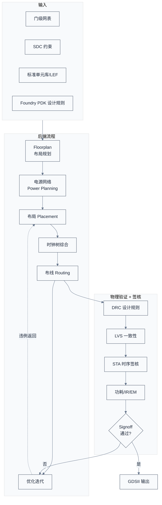
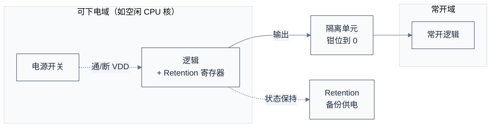
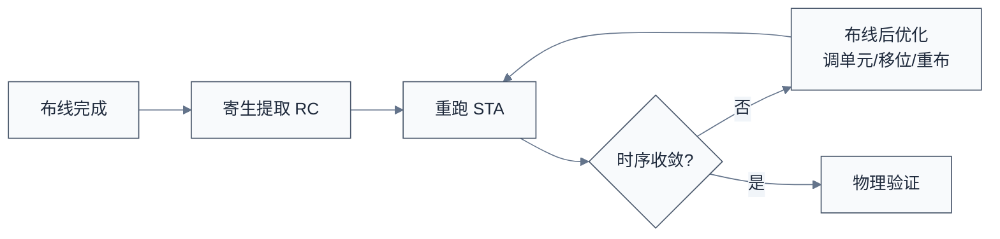

# 后端物理设计与签核 —— 把网表变成版图

> 上一章把架构变成了通过验证的门级网表。一个自然的问题是：网表只是"逻辑连接图"，Foundry 不认——它要的是物理版图（每个门摆在晶圆哪里、用哪层金属怎么连线）。本章用后端流程来回答——做 Floorplan、布局布线、时钟树、物理验证、签核，最终产出 GDSII。
> **工程师视角**：后端是离软件最远、却悄悄决定软件体验的环节——时钟树质量决定抖动与时序余量，电源网络决定能不能跑满频，floorplan 决定 die 大小与封装引脚。理解后端，能让你理解"为什么这颗芯片标称 2GHz 却只能稳定跑 1.8GHz""为什么高温时降频"这类现象的硬件根源。

### 关键术语

| 缩写 | 全称 | 含义 |
|------|------|------|
| Floorplan | — | 布局规划，定 die 尺寸、模块位置、电源网络骨架 |
| P&R | Place and Route | 布局布线，把门摆好并用金属连线 |
| CTS | Clock Tree Synthesis | 时钟树综合，构建时钟分配网络 |
| DEF | Design Exchange Format | 设计交换格式，描述版图布局与连线 |
| LEF | Library Exchange Format | 库交换格式，描述标准单元的物理抽象 |
| GDSII | Graphic Data Stream Information Interchange | 版图数据格式，流片交付物 |
| DRC | Design Rule Check | 设计规则检查（线宽/间距等） |
| LVS | Layout Versus Schematic | 版图与网表一致性检查 |
| ERC | Electrical Rule Check | 电气规则检查（短路/开路/悬空） |
| IR Drop | — | 电源压降，电流流过电源网络造成的电压跌落 |
| EM | Electromigration | 电迁移，大电流导致金属线老化失效 |
| UPF | Unified Power Format | 电源意图格式，描述电源域/隔离/保持 |
| DFM | Design for Manufacturing | 可制造性设计，提高良率 |
| OPC | Optical Proximity Correction | 光学邻近校正，补偿光刻变形 |
| SADP/SAQP | Self-Aligned Double/Quad Patterning | 自对准双重/四重图形，DUV 多重曝光 |
| STA | Static Timing Analysis | 静态时序分析 |
| Signoff | — | 签核，流片前最终验收 |
| ECO | Engineering Change Order | 工程变更指令，流片前后的小修改 |
| OCV | On-Chip Variation | 片上工艺变化 |
| AOCV/POCV | Advanced/Parametric OCV | 更精细的统计时序模型 |
| Standard Cell | — | 标准单元，Foundry 提供的基本逻辑门 |
| Macro | — | 宏单元，已物理实现的大模块（如 SRAM、硬核 IP） |

### 1.1 前置知识

| 需要了解 | 参考文档 |
|----------|----------|
| 前端流程与网表 | [03-前端设计RTL与验证](./03-前端设计RTL与验证.md) |
| SDC 与 STA 概念 | [03-前端设计RTL与验证](./03-前端设计RTL与验证.md#5-静态时序分析-sta不仿真也查时序) |
| SoC 组成与电源域 | [02-规格定义与架构设计](./02-规格定义与架构设计.md) |

---

## 1. 概述

### 1.1 系统上下文

**项目定位**：后端设计承接前端网表，产出**通过所有签核的 GDSII** 交给 Foundry 制造。它把"逻辑"变成"物理"——每个标准单元摆在 die 的哪个坐标、每根连线走哪层金属、时钟怎么从 PLL 分配到每个触发器、电源怎么从封装引脚送到每个单元。**这是离工艺最近的环节**——所有设计决策都要在 Foundry 的 PDK 规则内进行。

**软硬件耦合点**：

- **后端 ↔ Foundry**：PDK 是后端的"宪法"——设计规则（最小线宽、间距、孔密度）、电气参数（RC 寄生）、标准单元库，全部来自 Foundry。换 Foundry 或换节点，后端基本要重做。
- **Floorplan ↔ 封装**：die 尺寸、IO 引脚位置、电源 bump 位置，要与封装设计协同。BGA 引脚排列约束 floorplan 里的 IO ring。
- **时钟树 ↔ 固件**：时钟树的频率、分频比、门控点，最终变成固件的时钟初始化代码与 DVFS 策略。
- **电源网络 ↔ 热设计**：IR drop 与 EM 决定芯片能否在目标频率/电压下可靠工作，过不了就要降频或加电压域。

**跨实现对比**：

| 对比维度 | 传统单 die 后端 | Chiplet/多 die | 先进封装（2.5D/3D） |
|------|------|------|------|
| 设计对象 | 一个 die | 多个 die 各自后端 + 片间互连 | 多 die + 中介层 + TSV |
| 时序收敛 | die 内 STA | die 间需考虑封装互连延迟 | 3D 堆叠需考虑 TSV RC |
| 电源网络 | die 内电源环 | 每 die 独立 + 封装供电 | 多 die 共享/独立供电 |
| 签核范围 | 单 die | 多 die + 封装联合签核 | 含中介层、TSV 联合 |



> **如何读这张图**：后端是"布局规划 → 电源 → 布局 → 时钟树 → 布线 → 验证"的螺旋迭代。任何一步签核不过，都要回头调整——可能是改 floorplan，可能是改布局，可能是 ECO 改网表。**先进工艺下，时序/IR/EM 三者常常互相打架**：降 IR 要加宽电源线（占布线资源）、降 EM 要并联更多过孔（占面积）、收时序要短连线（挤布局）——后端工程师的工作就是在这些矛盾里找平衡。

> **核心要点**：后端是把网表"实体化"的过程，每一步都在与 Foundry 的物理规则博弈。**先进工艺下后端工作量与前端相当甚至更大**——因为 7nm 以下，布线拥塞、IR 压降、EM、工艺变化等问题急剧放大，传统流程要多次迭代才能收敛。

---

## 2. Floorplan：先画"小区规划图"

Floorplan 是后端第一步，决定 die 的整体布局——像城市规划，先定小区、道路、电网骨架。

### 2.1 Floorplan 要决定的事

| 决策 | 考量 |
|------|------|
| die 尺寸 | 面积 vs 成本，要留够布线空间 |
| 模块摆放 | 大 Macro（SRAM/硬核 IP）位置，影响布线长度 |
| IO 位置 | 与封装引脚对应，约束 IO ring |
| 电源骨架 | 电源环/条纹位置，供电入口 |
| 布线通道 | 模块间留通道，避免拥塞 |
| keepout | Macro 间留禁布区，避免干扰 |

### 2.2 一个 Floorplan 示意

```text
+----------------------------------------------------+
|  IO Ring (PAD/IO 单元环绕)                          |
|  +----------------------------------------------+  |
|  |  +----------+   +----------+   +----------+  |  |
|  |  | CPU 集群 |   |  NoC     |   | GPU/NPU  |  |  |
|  |  | (4×核)   |   |  Mesh    |   |          |  |  |
|  |  +----------+   +----------+   +----------+  |  |
|  |  +----------+         +----------+           |  |
|  |  | L3 Cache |         | DDR Ctrl |           |  |
|  |  | (SRAM)   |         | + PHY    |           |  |
|  |  +----------+         +----------+           |  |
|  |  +----------+   +----------+   +----------+  |  |
|  |  | PCIe RC  |   | 安全模块  |   | Debug    |  |  |
|  |  +----------+   +----------+   +----------+  |  |
|  |       电源条纹（横向）                          |  |
|  |       电源条纹（纵向）                          |  |
|  +----------------------------------------------+  |
+----------------------------------------------------+
```

> **如何读这张图**：Macro（SRAM、硬核 IP）摆在固定位置，标准单元区域（CPU 逻辑、控制器）填在 Macro 之间。**Macro 摆放是 Floorplan 最关键决策**——它决定了数据走多远、布线拥塞在哪、电源怎么走。一个好的 floorplan 能让后端事半功倍，差的 floorplan 怎么布局布线都收不回来。

> **核心要点**：Floorplan 是"先难后易"——前期多花时间摆好 Macro、规划好电源骨架，后面布局布线才顺。一个常见错误是 floorplan 草草了事，结果布线阶段发现 Macro 挡路、电源不够，要推倒重来。

---

## 3. 电源网络：芯片的"血管系统"

电源网络（Power Network）把封装引脚送来的电，分配到 die 上每个晶体管。它是后端最容易被低估、却最容易翻车的部分。

### 3.1 为什么电源网络难

先进工艺下，晶体管密度爆炸、工作电流巨大——一颗 5nm 服务器 SoC 峰值电流可达数百安培。电流流过电源金属线会产生：

- **IR Drop**：电压跌落。若某单元工作电压 0.8V，但 IR drop 让它实际只收到 0.72V，时序就崩了——单元变慢，setup 违例。
- **EM（电迁移）**：大电流把金属原子撞走，时间久了金属线变细断路。EM 不达标，芯片用几年就坏。

### 3.2 电源网络的结构

典型电源网络是"环 + 条纹 + 网格"：

```text
封装供电 bump → 电源环（环绕 die 边缘）
              → 电源条纹（横纵向贯穿 die）
              → 标准单元行电源轨（每行接电）
              → 每个标准单元的 VDD/VSS 引脚
```

电源网络用高层金属（厚、低电阻），信号用低层金属（细、高密度）。层数越多、电源条纹越密，IR drop 越小，但占布线资源越多。

### 3.3 IR/EM 分析与签核

后端要用工具（如 Ansys RedHawk、Cadence Voltus）做静态和动态 IR 分析：

- **静态 IR**：平均电流下的压降，看整体供电是否够。
- **动态 IR**：峰值电流瞬态压降，看高活动时刻会不会局部塌电。比如 CPU 同时全核翻转的瞬间，局部电流飙升，可能瞬间 IR drop 200mV。
- **EM 分析**：每段电源线的电流密度，是否超过工艺允许的 EM 寿命阈值。

IR/EM 不达标怎么办？加宽电源条纹、加更多过孔、分区供电、降低翻转率——都是昂贵的选择。

> **核心要点**：电源网络是后端的"暗坑"——它不像时序那样有清晰的 Slack 数字，但一旦出问题就是大面积时序崩坏或可靠性失效。**先进工艺下，IR/EM 签核与 STA 签核同等重要**。这也是为什么大芯片要分多个电源域——既是为了电源管理，也是为了把大电流分散，降低单点 IR/EM 压力。

### 3.4 低功耗物理设计：电源域怎么落地

[第 2 章 §6](./02-规格定义与架构设计.md#6-时钟与电源域芯片的血管与神经) 定义了电源域划分，但"哪个域能下电、下电时怎么保护其他域"要靠后端插入专门的物理单元。这套设计由 **UPF（Unified Power Format）** 描述——它是电源意图的标准格式，告诉后端工具"哪里有电源域、哪里要隔离、哪里要保持状态"。

低功耗物理设计要插入四类特殊单元：

| 单元 | 作用 | 何时需要 |
|------|------|------|
| Isolation Cell（隔离单元） | 下电域的输出钳位到固定电平，防止悬空信号损坏上电域 | 任何可下电域的输出边界 |
| Level Shifter（电平转换单元） | 跨电压域信号电平转换（如 0.6V ↔ 0.8V） | 多电压域之间 |
| Retention Register（状态保持寄存器） | 域下电时保留关键状态，上电后恢复 | 需要快速唤醒的逻辑（如配置寄存器） |
| Power Switch（电源开关） | 控制某区域供电通断，实现电源门控（Power Gating） | 大块可下电区域（如空闲 CPU 核） |



> **如何读这张图**：可下电域通过电源开关切断 VDD 省电；它的输出必须经过隔离单元钳位到固定电平，否则悬空信号会让常开域的输入处于亚稳态；关键状态存入 retention 寄存器（有独立备份供电），上电后恢复，避免重新初始化。**这套机制是"深睡唤醒"功能的硬件基础**——你手机待机一天不耗电、按一下秒唤醒，靠的就是电源门控 + retention。

> **核心要点**：电源域划分是架构决策，但电源域的物理实现（隔离/电平转换/状态保持/电源开关）是后端工作，由 UPF 描述。**没有这些特殊单元，电源门控会直接损坏芯片**——下电域的悬空输出会干扰上电域。这也是为什么固件的电源管理代码要严格匹配 UPF 定义的上下电时序，乱关电源域会导致硬件损坏。

---

## 4. 布局布线 P&R：把门摆好连好

P&R 是后端的核心步骤，把标准单元摆到 die 上，用金属线连起来。

### 4.1 布局（Placement）

布局工具（如 Synopsys ICC2、Cadence Innovus）根据网表连接关系、时序约束、拥塞情况，决定每个标准单元放在哪个坐标。目标：连线短、时序好、不拥塞、标准单元行规整。

布局不是一次到位的——它要和时序优化、拥塞分析反复迭代。先进工艺下，布局质量直接决定后续布线能否收敛。

### 4.2 时钟树综合 CTS

时钟信号要从一个 PLL 源，分配到 die 上几十万个触发器。CTS（Clock Tree Synthesis）构建这棵时钟分配树：

```text
PLL → 时钟根 → 缓冲器 → 分支 → 缓冲器 → ... → 触发器
```

CTS 的目标：

- **时钟偏差（Skew）小**：同一时钟沿到达不同触发器的时间差要小，否则 setup/hold 都难满足。
- **时钟延迟（Latency）可控**：从 PLL 到触发器的总延迟要在合理范围。
- **时钟功耗低**：时钟网络翻转率最高，占动态功耗大头，要尽量少用缓冲器、用时钟门控。

先进工艺还要处理多时钟域、多电压域、时钟门控单元插入、时钟不确性（uncertainty）建模。

### 4.3 布线（Routing）

布线工具用各层金属把标准单元按网表连起来。金属层分上下两组：

- **低层金属（M1-M4）**：细、密，用于标准单元内部与短距连接。
- **高层金属（M5-M_top）**：粗、厚、低电阻，用于长距连线、时钟、电源。

布线的难点是**拥塞（Congestion）**——某些区域连线太多挤不下，导致绕路或无法布通。拥塞热点常出现在 Macro 边缘、接口集中处。解决靠调整 floorplan、加布线通道、用更多金属层。

### 4.4 寄生提取与优化

布线完成后，每根连线有了真实的物理长度与寄生电容/电阻（RC）。后端工具做**寄生提取**（如 StarRC、QRC），把 RC 反标到网表，重跑 STA——这是第一次看到"真实时序"。通常布线后时序会比综合时差（因为综合用的是估算 RC），需要工具做布线后优化（post-route optimization）——重新调整单元尺寸、移动单元位置、重布关键路径。



> **核心要点**：P&R 是后端的"主战场"，布局决定能否摆得开，CTS 决定时钟质量，布线决定能否连得通。**三者中最容易被低估的是 CTS**——时钟树质量直接决定 setup/hold 是否可收、动态功耗是否合理。一个差的时钟树会让时序怎么优化都收敛不了。

### 4.5 资深经验：CTS 是时序收敛的"隐藏战场"

综合阶段的时序是"理想时钟"（zero skew）假设，后端 CTS 之后第一次出现真实时钟延迟——**这是前端综合报告与后端真实时序第一次"对账"的地方**。资深后端团队的 CTS 功夫在于三件事：

1. **skew 是"分配"出来的，不是"消除"出来的**：CTS 的目标不是 skew=0，而是**把 skew 设计成对关键路径有利**——比如给一条 setup 紧张路径的捕获时钟人为"压晚"（useful skew），等效多给数据半个周期。**会利用 useful skew 的团队，和只会"平衡到零"的团队，最高频率能差 5–10%**。
2. **CTS 与布局是往返迭代**：CTS 做完看 skew 超标、插入延迟太大，往往要回头调 floorplan——把时钟源摆到逻辑中心、把高扇出寄存器的物理位置聚拢。**"CTS 一次过"是很少见的好运气**，正常流程是布局→CTS→看树质量→回头调布局 2–3 轮。
3. **时钟门控（Clock Gating）是功耗与 CTS 的耦合点**：门控单元（ICG）插在时钟树上，减少动态功耗，但它本身增加时钟延迟与 skew 不确定性。**门控插在哪一级、插多少，是功耗预算与时序余量的直接交易**——这也是为什么低功耗设计（见 §3.4）要早定，CTS 阶段再改门控策略代价极高。

> **核心要点（CTS 资深视角）**：CTS 把"理想时钟"变成"真实时钟"，是前端与后端的第一次对账。**会做 useful skew 的团队在收时序；只会"平衡到零"的团队在填坑**。判断一个团队 CTS 水平，就问一个问题——"你的 skew 数字是越接近零越好，还是按路径方向分配出来的？"

---

## 5. 物理验证：DRC / LVS / ERC

布线完成不等于版图可用——还要过三道物理验证关。

### 5.1 DRC（Design Rule Check）

DRC 检查版图是否违反 Foundry 的设计规则：

- 最小线宽、最小间距
- 孔的最小尺寸与密度
- 天线规则（长金属连到栅极时，工艺中电荷积累会击穿栅氧）
- 密度规则（某层金属填充率不能太低也不能太高）

DRC 不过，Foundry 拒收。**天线规则**是初学者常踩的坑——一根长金属在刻蚀过程中会积累静电，连到 MOS 栅极会击穿栅氧，解决靠加二极管或改布线层。

### 5.2 LVS（Layout Versus Schematic）

LVS 检查版图与网表是否功能一致——把版图提取成网表，与设计网表比对，看元件与连接是否完全对应。常见 LVS 错误：

- 短路：两根不该连的线连上了
- 开路：该连的没连上
- 元件错：用了错的单元版本

### 5.3 ERC（Electrical Rule Check）

ERC 检查电气合理性——悬空输入、电源地短路、非法连接等。

这三道验证由 Calibre（Siemens）等工具完成，是流片前的硬性关卡。**任何一项不过都不能流片**。

### 5.4 DFM 与多重图形：让版图"好造"

DRC 保证版图"能造"，DFM（Design for Manufacturing，可制造性设计）追求"好造"——提高良率、降低对工艺波动的敏感。先进工艺下 DFM 是签核的重要一环：

- **光刻友好（Litho-Friendly）**：某些版图形状在光刻下会变形（如密集线条末端变圆）。工具做 OPC（光学邻近校正）调整形状，但设计师也能通过避免坏形状帮光刻——如避免孤立线、保持方向一致。
- **CMP Aware（化学机械抛光感知）**：金属密度不均会让抛光后表面不平，影响后续层。靠加 dummy metal（填充金属）让密度均匀。
- **多重图形（Multi-Patterning）**：DUV 光刻分辨率不够时，把一层版图拆成多次曝光（SADP/SAQP，自对准双重/四重图形），每次曝光画一部分。这要求版图"可拆分"——相邻图形要能分到不同掩模。后端工具做"着色（Coloring）"分配，分不开就是 DFM 违例。

**为什么多重图形影响后端**：它把"一层金属"变成"几次曝光"，布线时要保证可着色——某些图形组合数学上无法用 N 次曝光分开（N-着色冲突），必须改布线。7nm 以下 DUV 工艺，布线拥塞常常不是空间不够，而是着色冲突。

> **核心要点**：DRC 是"能不能造"的硬关，DFM 是"好不好造、良率高不高"的软关。**多重图形让先进工艺的布线多了一个"可着色性"约束**——这是 7nm 以下后端难度急剧上升的重要原因。EUV 缓解了多重图形问题（见 [第 5 章 §3](./05-流片制造封装与量产测试.md#32-duv-vs-euv)），但成本极高。

---

## 6. 签核 Signoff：流片前的最终体检

Signoff 是流片前最后一道综合验收，包含多个维度的"签核"。只有所有签核都通过，才允许把 GDSII 交给 Foundry。

| 签核项 | 工具 | 检查内容 | 不达标后果 |
|------|------|------|------|
| STA 时序签核 | PrimeTime | 所有 PVT 角 setup/hold 满足 | 跑不到目标频率 |
| 物理签核 | Calibre | DRC/LVS/ERC 全过 | Foundry 拒收 |
| 功耗签核 | Voltus/PT-PX | 动态/静态功耗在预算内 | TDP 超标 |
| IR/EM 签核 | RedHawk/Voltus | 压降与电迁移在阈值内 | 局部时序崩/可靠性失效 |
| 可测性签核 | Tessent | ATPG 覆盖率达标 | 量产测不出坏芯片 |
| 可靠性签核 | — | ESD/闩锁/老化 | 寿命/抗静电不达标 |

### 6.1 签核的多角与多模式

先进工艺签核要覆盖**多模式（Multi-Mode）多角（Multi-Corner）**：

- **多模式**：功能模式、测试模式、低功耗模式、各种 DVFS 电压点。
- **多角**：SS/FF/TT + 不同电压温度组合。

每模式每角都要 STA 通过——组合爆炸，签核工具要跑数小时到数天。这也是为什么 Signoff 阶段算力消耗巨大。

### 6.2 签核不过怎么办

- **时序违例**：ECO 改单元尺寸、加缓冲器、重布关键路径；严重时改 RTL 重综合。
- **IR/EM 违例**：加电源条纹、加过孔、分区。
- **DRC 违例**：改布线、加填充。

ECO（Engineering Change Order）是签核阶段的常用手段——在不重跑整个后端流程的前提下，做小范围修改。**Metal-only ECO** 只改金属层连线，不改器件，可只重做掩模的几层，比全改便宜得多——这是流片后修复 bug 的常用路径。

### 6.3 资深经验：签核的"多角多模式"到底多磨人

签核阶段的"多模式多角"不是学术概念，而是实打实的算力与人力消耗——这正是大项目签核要跑数周的原因。资深视角的三个要点：

1. **角与模式是组合爆炸的**：一颗 SoC 的功能模式（正常/测试/低功耗/DVFS 各电压点）乘以工艺角（SS/FF/TT × 电压 × 温度），一个 2GHz 设计的签核角组合轻松上百个。**每个角都要完整 STA 收敛**——这就是为什么 Signoff 阶段要用大规模计算集群，且要按"风险优先"排序：setup 只看最慢角，hold 只看最快角，中间角只在关键路径上抽查，把算力花在刀刃上。
2. **签核余量是"谈判"出来的**：STA 报通过不等于能流片——工具模型（OCV/时钟不确定性/IR drop 的时序惩罚）都有保守系数。**前端给的 +0.05ns 和签核工具的 +0.1ns 余量要求，是两拨工程师的"合同"**。留太多余量 = 面积功耗浪费；留太少 = 流片后降频风险。资深签核工程师的价值，就是在这条线上给管理层一个"敢签字"的置信度。
3. **签核发现的 bug，一半改在后端，一半要打回前端**：ECO 能修的小时序违例留在后端；但"这个路径结构上就收不了"的问题，必须打回 RTL 重综合。**签核团队对前端最珍贵的反馈，是"你的 RTL 里哪里长出了不可收敛的结构"**——这比任何优化建议都值钱，因为它让下一轮综合从根上变好。

> **核心要点（签核资深视角）**：Signoff 不是"最后点一下通过"，而是一个**"多模式多角 × 多维度"的组合收敛过程**。它考验两件事——**算力调度**（把有限的签核资源花在最坏角上）和**余量谈判**（给管理层一个敢签字的不确定度）。签核团队的价值，一半是"证明它收敛了"，一半是"诚实地指出剩下的风险是什么"。

> **核心要点**：Signoff 不是单一检查，而是时序、物理、功耗、IR/EM、可靠性、可测性的**多维度联合验收**。任何一维不过都不能流片。**多模式多角分析是先进工艺签核的标配**——它保证芯片在所有工作条件（电压/温度/模式）下都可靠。这也是为什么签核阶段要花数周，团队会反复"几乎通过又退回来"——一次流片太贵，宁可苛刻。

---

## 7. 从 GDSII 到 Tape-out

所有签核通过后，版图导出为 GDSII 文件，这便是**Tape-out 的交付物**。GDSII 包含每一层金属、每个图形的多边形数据——它是给 Foundry 光刻机的"施工图"。

Tape-out 这个词来自早期把版图数据录到磁带送给 Foundry 的传统。虽然现在都走网络传输，但这个词保留了下来。Tape-out 是整个芯片项目的分水岭：

| | Tape-out 之前 | Tape-out 之后 |
|---|---|---|
| 纠错方式 | 改 RTL/版图，重跑 | 改 metal 重流（贵）或全改重流（极贵） |
| 主要成本 | 人力、EDA、IP | 掩模费、流片费、封测费 |
| 时间 | 18–30 月设计 | 3–6 月等芯片回来 |
| 心态 | 还能改 | 几乎定生死 |

> **核心要点**：GDSII 是后端唯一产出物，Tape-out 是项目分水岭。**Tape-out 后的修改成本比之前高 1–2 个数量级**——Metal ECO 只改几层掩模也要数十万美元，全改等于重流。所以 Signoff 阶段的"偏执"是有道理的。

---

## 8. 小结

后端把网表变成 GDSII，核心是 Floorplan → 电源 → P&R → CTS → 布线 → 验证 → 签核的螺旋迭代。

> **核心要点**：后端是与 Foundry 物理规则博弈的过程。先进工艺下，**时序、IR/EM、拥塞三者互相耦合**，任何一维的优化都可能恶化其他两维——后端工程师的价值就是在这个三角里找到收敛点。这也是为什么先进节点后端人力与前端相当，且高度依赖经验。

下一篇进入制造：把 GDSII 变成真实的芯片。

- 下一篇：[05-流片制造封装与量产测试](./05-流片制造封装与量产测试.md)
- 上一篇：[03-前端设计RTL与验证](./03-前端设计RTL与验证.md)

---

## 参考资料

- [Calibre Physical Verification 文档 (Siemens EDA)](https://eda.sw.siemens.com/en-US/ic/calibre-design/) — 参考 DRC/LVS 流程与天线规则
- [Synopsys IC Compiler II / PrimeTime 文档](https://www.synopsys.com/implementation-and-signoff/) — 参考 P&R 与 STA 签核
- [Cadence Innovus / Voltus 文档](https://www.cadence.com/) — 参考布局布线与 IR/EM 分析
- [Ansys RedHawk-SC](https://www.ansys.com/products/semiconductors/ansys-redhawk-sc) — 参考动态 IR 签核
- [TSMC N5/N3 PDK 文档（NDA）](https://www.tsmc.com/) — 参考设计规则与标准单元库（受限访问）
