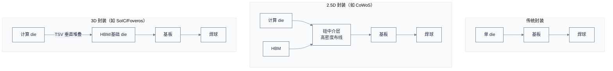

# 流片制造封装与量产测试 —— 把版图变成芯片

> 上一章把网表变成了通过签核的 GDSII。一个自然的问题是：版图数据怎么变成一颗能插上主板的物理芯片？本章用制造流程来回答——从 Tape-out 交付 GDSII 开始，走过掩模光刻、晶圆制造、封装、测试、量产，直到一颗芯片出厂。
> **工程师视角**：这是离软件最远的环节，但它的产物决定了你的工作环境——封装形式决定 PCB 设计约束，测试策略决定芯片有没有保留 JTAG、有没有 BIST 寄存器，良率决定芯片供货与价格。理解制造，能让你理解"为什么 ES 样片有 bug 是正常的""为什么同型号芯片有不同 stepping""为什么某些批次有特定问题"。

### 关键术语

| 缩写 | 全称 | 含义 |
|------|------|------|
| Tape-out | — | 流片，把 GDSII 交付 Foundry |
| Mask / Reticle | — | 掩模/光罩，光刻用的图案版 |
| Lithography | — | 光刻，把掩模图案转印到晶圆 |
| EUV | Extreme Ultraviolet Lithography | 极紫外光刻，13.5nm 波长，5nm/3nm 主力 |
| DUV | Deep Ultraviolet | 深紫外光刻，193nm 波长，成熟工艺用 |
| Wafer | — | 晶圆，硅圆片，制造基底 |
| Die | — | 裸芯片，晶圆上切割下来的单个芯片 |
| FEOL/MOL/BEOL | Front/Middle/Back-End Of Line | 前道/中道/后道工艺，造器件/过渡/连线 |
| Yield | — | 良率，好 die 占总 die 的比例 |
| Fab | Fabrication Plant | 晶圆厂 |
| MPW | Multi-Project Wafer | 多项目晶圆，多家共享一片掩模降成本 |
| OSAT | Outsourced Semiconductor Assembly and Test | 外包封测厂 |
| BGA | Ball Grid Array | 球栅阵列封装 |
| QFP | Quad Flat Package | 四侧引脚扁平封装 |
| SiP | System in Package | 系统级封装 |
| SoIC / CoWoS / Foveros | — | 先进封装平台（TSMC/Intel） |
| TSV | Through-Silicon Via | 硅通孔，3D 堆叠垂直互连 |
| Interposer | — | 中介层，2.5D 封装承载数 chip |
| ATE | Automated Test Equipment | 自动测试设备 |
| CP | Circuit Probing / Wafer Test | 晶圆测试（探针卡测裸 die） |
| FT | Final Test | 成品测试（封装后测） |
| SLT | System Level Test | 系统级测试，跑真实工作负载 |
| Binning | — | 分 bin，按性能/缺陷分等级销售 |
| HTOL | High Temperature Operating Life | 高温工作寿命测试，加速老化 |
| ESD | Electrostatic Discharge | 静电放电，抗静电能力测试 |
| ES | Engineering Sample | 工程样片 |
| CS | Customer Sample | 客户样片 |
| MP | Mass Production | 量产 |
| DPPM | Defective Parts Per Million | 每百万缺陷数，质量指标 |
| FA | Failure Analysis | 失效分析，定位坏 die 物理根因 |
| PFA | Physical FA | 破坏性失效分析，开盖/切片定位缺陷 |
| NFA | Non-destructive FA | 非破坏失效分析，X-ray/CSAM 查封装缺陷 |
| FIB | Focused Ion Beam | 聚焦离子束，切片/修调电路 |
| Arrhenius | — | 阿伦尼乌斯方程，加速老化寿命推算模型 |
| AEC-Q100 | — | 车规芯片可靠性认证标准 |
| Stepping | — | 步进号，芯片修订版（A0/B0/C0） |
| Respin | — | 重流片，全掩模或大部分重做 |

### 1.1 前置知识

| 需要了解 | 参考文档 |
|----------|----------|
| 后端流程与 GDSII | [04-后端物理设计与签核](./04-后端物理设计与签核.md) |
| DFT（扫描链/BIST/ATPG） | [03-前端设计RTL与验证](./03-前端设计RTL与验证.md#6-dft给芯片装上体检接口) |
| SoC 组成与封装影响 | [01-SoC设计全流程总览](./01-SoC设计全流程总览.md) |

---

## 1. 概述

### 1.1 系统上下文

**项目定位**：本章覆盖从 GDSII 到出厂芯片的全过程，跨 Foundry（晶圆制造）与 OSAT（封装测试）两类厂商。对 Fabless 设计公司而言，这一阶段是"交付后等待"——但并非撒手不管，要配合 Foundry 做 Tape-out signoff、跟 MPW/全掩模选择、跟 ES 调试、跟 OSAT 做测试程序开发。

**软硬件耦合点**：

- **GDSII ↔ Foundry**：GDSII 是设计方交付 Foundry 的唯一产物。Foundry 做 Tape-out signoff（用它的规则库再验一遍），通过才开掩模。
- **封装 ↔ PCB**：封装形式（BGA/QFN/FC-BGA）决定 PCB 设计约束——引脚间距、电源层、散热。先进封装（CoWoS）甚至要求 PCB 支持特定电源时序。
- **测试 ↔ DFT**：量产测试用的测试向量，就是前端 DFT 阶段生成的 ATPG。测试程序开发是固件/测试工程师与 OSAT 协同的工作。
- **良率 ↔ 设计**：设计阶段的密度、规则余量，直接影响良率。设计方要配合 Foundry 做良率分析（Yield Learning），定位是设计问题还是工艺问题。
- **ES ↔ 固件**：ES（工程样片）回来后，固件团队第一次在真实硅上跑代码——这是软硬件第一次真刀真枪集成，常发现大量 RTL 验证没覆盖的问题。

**跨实现对比**：

| 对比维度 | MPW（多项目晶圆） | 全掩模流片 | Metal ECO 重流 |
|------|------|------|------|
| 掩模成本 | 共摊，低 | 独享，高 | 只重做几层金属，中 |
| 适用阶段 | 验证、学习 | 量产前流片 | 流片后小修 |
| 时间 | 与别人拼车 | 独立排期 | 较快 |
| 风险 | 共享晶圆 | 独立 | 改动有限 |

```mermaid
%%{init: {"theme": "base", "themeVariables": {"primaryColor": "#f8fafc", "primaryTextColor": "#1e293b", "primaryBorderColor": "#475569", "lineColor": "#64748b", "secondaryColor": "#f1f5f9", "secondaryBorderColor": "#94a3b8", "tertiaryColor": "#f8fafc", "fontFamily": "\"trebuchet ms\", verdana, arial, sans-serif"}}}%%
flowchart LR
    GDS["GDSII<br/>设计方交付"] --> Signoff["Foundry<br/>Tape-out Signoff"]
    Signoff --> Mask["掩模制作<br/>Mask/Reticle"]
    Mask --> Fab["晶圆制造<br/>Fab 光刻/刻蚀/离子注入"]
    Fab --> Wafer["完成晶圆<br/>含数百 die"]
    Wafer --> CP["晶圆测试 CP<br/>探针卡测裸 die"]
    CP --> Dice["切割<br/>Die 分离"]
    Dice --> Pkg["封装<br/>OSAT"]
    Pkg --> FT["成品测试 FT<br/>ATE + SLT"]
    FT --> Binning["分 bin 分级"]
    Binning --> Ship["出厂<br/>ES/CS/MP"]
```

> **如何读这张图**：从 GDSII 到芯片出厂是一条线性主链，但每一步都可能有回路——CP 发现某 die 坏就标记废弃，FT 发现性能不够就降级 bin，ES 回来发现 bug 就 Metal ECO 重流。**整个制造封测环节通常 3–6 个月**，从 Tape-out 到拿到 ES 样片。

> **核心要点**：制造封测是把"数字版图"变成"物理芯片"的过程，跨 Foundry 与 OSAT 两类厂商。Fabless 设计公司在这一阶段的角色是"配合+验收"——配合 Foundry 做流片前 signoff，配合 OSAT 开发测试程序，验收 ES 样片。**ES 回来是整个项目最紧张的时刻**——之前所有验证对不对，硅上见分晓。

---

## 2. Tape-out 与掩模

> 上一章建立了从 GDSII 到出厂芯片的全流程框架。一个自然的问题是：设计方交付 GDSII 后到 Foundry 开掩模之间到底要过哪些关、掩模为什么这么贵？本章用 Tape-out 与掩模来回答——先讲 Final Signoff Checklist 与 GO/NO-GO 评审，再展开掩模套数与成本，最后对比 MPW 与全掩模的取舍。

### 2.1 Tape-out 里程碑

Tape-out 是设计阶段的终点、制造阶段的起点。具体动作：

1. 设计方完成所有 Signoff，导出 GDSII。
2. 把 GDSII 交给 Foundry，Foundry 用自己的规则库做 Tape-out signoff（再验一遍 DRC/LVS/天线等）。
3. 双方确认后，Foundry 开始做掩模。

#### 2.1.1 Final Signoff Checklist 与 GO/NO-GO 评审

> 上面三步看似简单，但"完成所有 Signoff"本身是一个跨团队的多维度验收。Tape-out 前有一场正式的 **GO/NO-GO 评审**（Tape-out Review），架构/前端/后端/DFT/签核/产品各方代表签字，任何一方否决就不流片。

Final Signoff Checklist 的维度（每项都要"通过"或"带条件接受"）：

| 签核维度 | 通过判据 | 负责方 |
|----------|----------|--------|
| STA 时序 | 所有 signoff corner setup/hold WNS ≥ 0（或带可接受余量） | 签核工程师 |
| 物理验证 | DRC/LVS/ERC 全清零（或带 waived 违例） | 后端 |
| IR/EM | 静态/动态 IR < 阈值（如 VDD 的 5–10%），EM 寿命达标 | 后端 |
| 形式等价 | RTL ↔ post-route 网表 LEC 通过 | 前端 |
| 功耗 | 动态/静态功耗在 TDP 预算内 | 架构/后端 |
| DFT | ATPG 覆盖率达标（stuck-at ≥ 99%），测试向量就绪 | DFT 工程师 |
| 可靠性 | ESD/Latch-up 仿真通过 | 后端 |
| 金属密度 | 各层密度在规则范围内 | 后端 |
| IP 交付 | 所有第三方 IP 的 signoff 文件齐备 | 架构 |

**Stream-out**：签核通过后，版图导出为 GDSII，连同 UPF、RTL、SDC、测试向量一起打包交付 Foundry——不是只给 GDSII，而是一整套"设计交付物包"，Foundry 用它做 Tape-out signoff 与后续良率分析。

> **核心要点**：Tape-out 不是"点一下导出 GDSII"，而是**一场跨九个维度的 GO/NO-GO 评审**——任何一项不过就不流。**"带条件接受"（waiver）要留记录**——某条 DRC 违例因设计特殊性被 waived，流片后若出问题，这条记录就是追责依据。这也是为什么签核阶段要"偏执"——一次流片太贵，宁可苛刻。

### 2.2 掩模（Mask）

掩模是光刻用的图案版——晶圆上的每一层（每层金属、每个器件层）都对应一张掩模。一颗先进工艺 SoC 的掩模套数可达 60–90 层。

掩模制作极贵且极慢：

| 工艺 | 掩模套数 | 掩模总成本 |
|------|------|------|
| 28nm | ~40 层 | ~300 万美元 |
| 7nm | ~60 层 | ~1000–1500 万美元 |
| 5nm | ~70 层 | ~2000–4000 万美元 |
| 3nm | ~80 层 | ~5000 万美元+ |

> **待确认**：上述为业界常引用的经验区间，实际因 Foundry、掩模版规格、EUV 层数不同差异大。

掩模一旦做出，改一处就要重做整层掩模——这就是为什么 Tape-out 后修改成本极高。**Metal ECO** 只改几层金属掩模，能省下大部分器件层掩模费用，是流片后修复的首选。

### 2.3 MPW vs 全掩模

对小团队、学习项目，全掩模太贵，可用 MPW（Multi-Project Wafer）——多家设计方把各自的 die 拼在同一个掩模上，共摊掩模费。代价是要和别的项目拼车排期，且 die 数量少。MPW 是高校、初创验证想法的常用路径。

---

## 3. 光刻：把图案印到晶圆上
> 上一章讲了 Tape-out 与掩模的经济学。一个自然的问题是：掩模做好后怎么把图案印到晶圆上、为什么 7nm 以下非用 EUV 不可？本章用光刻来回答--先讲瑞利公式决定的最小线宽，再对比 DUV 与 EUV，最后给光刻流程。

光刻是制造的核心工艺——把掩模上的图案转印到晶圆的光刻胶上，后续刻蚀把图案刻到硅/金属层。

### 3.1 光刻分辨率

光刻能画出的最小线宽由瑞利公式决定：

$$R = k_1 \cdot \frac{\lambda}{NA}$$

- $R$：最小可分辨线宽（半节距），单位 nm
- $k_1$：工艺相关系数，通常 0.25–0.4，靠 OPC、多重图形等降低
- $\lambda$：光刻光源波长，单位 nm
- $NA$：透镜数值孔径，无量纲

**数值演算**：以 EUV 5nm 工艺为例，$k_1 = 0.3$、$\lambda = 13.5\,\text{nm}$、$NA = 0.33$（ASML NXE 系列）：

$$R = 0.3 \times \frac{13.5}{0.33} \approx 0.3 \times 40.9 \approx 12.3\,\text{nm}$$

即单次 EUV 曝光理论最小半节距约 12.3nm——这与 5nm 节点要求的 16nm 半节距吻合（留余量给多重图形）。若用 DUV（$\lambda = 193\,\text{nm}$、$NA = 1.35$ 液浸）：

$$R = 0.3 \times \frac{193}{1.35} \approx 0.3 \times 143 \approx 43\,\text{nm}$$

DUV 单次曝光只能到 43nm 半节距，7nm 以下必须靠 SADP/SAQP 多重图形拆分——这就是 EUV 不可替代的数学原因。

逐符号解释：

- $k_1$ 越小越好，靠 OPC（光学邻近校正）、多重图形等工艺技术降低。
- $\lambda$ 越短越好：DUV 用 193nm 波长，EUV 用 13.5nm 波长——EUV 让 7nm 以下成为可能。
- $NA$ 越大越好，但受透镜设计限制。

### 3.2 DUV vs EUV

| 对比维度 | DUV（193nm） | EUV（13.5nm） |
|------|------|------|
| 波长 | 193nm | 13.5nm |
| 光源 | 准分子激光 | 激光等离子体（锡滴） |
| 单次曝光分辨率 | ~40nm 半节距 | ~13nm 半节距 |
| 多重图形 | 7nm 以下需 SADP/SAQP，套刻次数多 | 5nm/3nm 主力，减少多重图形 |
| 设备成本 | ~1 亿美元/台 | ~2–3 亿美元/台 |
| 产能 | 高 | 较低（每小时晶圆数少） |
| 适用节点 | ≥7nm | ≤7nm |

**为什么 EUV 这么贵又慢还非用不可**？因为 DUV 在 7nm 以下要做 4 重甚至更多图形（SAQP），套刻对准难度爆炸、掩模层数翻倍、成本反而比 EUV 高。EUV 一次曝光替代多次 DUV，整体更经济——虽然单台设备贵到 3 亿美元。

### 3.3 光刻流程（简化）

1. 晶圆涂光刻胶。
2. 掩模对准，光照射，图案转印到光刻胶。
3. 显影，洗掉曝光（或未曝光）部分。
4. 刻蚀，把图案刻到下层材料。
5. 去胶，清洗。
6. 下一层重复。

晶圆上每一层都走一遍这个循环，几十层叠加，最终形成完整的器件与连线。

> **核心要点**：光刻是制造的心脏，分辨率决定工艺节点。**EUV 是 5nm/3nm 的 enabling 技术**——没有 EUV，先进工艺在 DUV 多重图形下成本不可承受。这也是为什么 ASML（唯一量产 EUV 光刻机的公司）成为半导体产业的关键卡点。

---

## 4. 晶圆制造工艺
> 上一章讲了光刻这一步。一个自然的问题是：光刻之外，晶圆制造还有哪些工序、为什么分前道/中道/后道三段？本章用晶圆制造工艺来回答--先讲 FEOL/MOL/BEOL 三段分工，再列主要工艺步骤，最后算一片晶圆能切多少 die。

光刻只是晶圆制造的一步，完整的晶圆制造包含几十道工序，按层次分三大段：

| 阶段 | 全称 | 做什么 | 关键工艺 |
|------|------|------|------|
| FEOL | Front-End Of Line | 在硅衬底上造晶体管（器件层） | 离子注入、热氧化、栅极形成、源漏掺杂 |
| MOL | Middle Of Line | 器件与金属之间的过渡 | 接触孔（Contact）、局部互连 |
| BEOL | Back-End Of Line | 多层金属连线（把晶体管连成电路） | 金属沉积、光刻刻蚀、CMP、通孔（Via） |

**为什么分这三段**：FEOL 造器件（晶体管），BEOL 造连线，MOL 是两者之间的桥梁。FEOL 工艺温度高（要驱动离子扩散），BEOL 工艺温度低（保护已造好的器件与低熔点金属），所以必须先 FEOL 后 BEOL，顺序不能乱。这也是为什么"改 metal"（Metal ECO）只需重做 BEOL 几层，不动 FEOL——便宜且快。

### 4.1 主要工艺步骤

| 工序 | 作用 |
|------|------|
| 离子注入 | 掺杂改变硅的电学性质（形成源漏、阱） |
| 热氧化 | 生长栅氧 |
| 沉积（CVD/PVD/ALD） | 沉积多晶硅、金属、介质层 |
| 光刻 + 刻蚀 | 图案化每一层 |
| 化学机械抛光（CMP） | 把晶圆表面磨平，保证后续层平整 |
| 金属化 | 形成各层金属连线 |

整个晶圆制造要在超净间（Class 1–10）进行，一颗芯片要花 2–3 个月走过几百道工序。

### 4.2 晶圆尺寸

主流晶圆为 12 英寸（300mm）直径，面积约 70000 mm²。一片晶圆上能切多少 die 取决于 die 大小：

- die 100 mm²：理论 ~700 颗，扣边缘良率后约 500–600 颗
- die 400 mm²（大芯片）：理论 ~175 颗，良率后约 100–130 颗

die 越大，单晶圆产出越少、良率越低（缺陷概率随面积上升）——这是大芯片成本高的根本原因。

---

## 5. 封装：给裸 die 穿上"外壳"
> 上一章把晶圆造出来了。一个自然的问题是：裸 die 又脆又小，怎么变成能焊到主板的芯片、为什么先进封装成了 AI 芯片瓶颈？本章用封装来回答--先讲封装基本功能，再对比传统与先进封装，然后看 2.5D/3D 三种形态、Chiplet 与封装的关系，最后走封装工艺流程。

裸 die 太脆弱、太小，无法直接焊到主板上。封装给 die 提供机械保护、电气连接、散热路径、外形标准化。

### 5.1 封装的基本功能

| 功能 | 说明 |
|------|------|
| 电气互连 | die 焊盘 ↔ 封装引脚（引线键合/倒装） |
| 机械保护 | 保护 die 免受物理/化学损伤 |
| 散热 | 把 die 热量导到散热器 |
| 外形标准化 | 提供可焊到 PCB 的引脚阵列 |

### 5.2 传统封装 vs 先进封装

| 对比维度 | 传统封装（QFP/BGA/引线键合） | 先进封装（FC-BGA/倒装/2.5D/3D） |
|------|------|------|
| 互连方式 | 引线键合（金属线） | 倒装（焊料凸点直接贴基板/中介层） |
| 引脚密度 | 低 | 高 |
| 电感/电阻 | 较高（引线长） | 低（短互连） |
| 散热 | 一般 | 好（裸 die 背面贴散热器） |
| 成本 | 低 | 高 |
| 适用 | 中低端 | 高性能 SoC、AI 芯片 |

### 5.3 先进封装的三种形态

> **如何读这张图**：传统封装单 die 贴基板；2.5D 把多 die 摆在硅中介层上，中介层做高密度布线（如计算 die ↔ HBM 的超高带宽互连）；3D 把 die 垂直堆叠，用 TSV 直接互连，密度最高。**NVIDIA H100、AMD MI300 都用 2.5D/3D 封装把计算 die 与 HBM 封在一起**——这是 AI 芯片的标配。

### 5.4 Chiplet 与先进封装的关系

Chiplet（见 [01 章 §5.1](./01-SoC设计全流程总览.md#51-chiplet把大-die-拆成小-die)）依赖先进封装实现 die 间高速互连：

- UCIe 是封装内 die 间 PHY+链路层标准（详见 [../interconnect/01](../interconnect/01-互联总线与协议全景辨析.md)）。
- NVIDIA NVLink-C2C 是私有片间互连，用在 Grace CPU + Hopper GPU 的封装内集成。

> **核心要点**：封装从"给 die 穿外壳"演变成"多 die 系统集成"——先进封装让 Chiplet 成为可能，让设计方可以混合工艺、按需拼装。**封装不再是制造的附庸，而是与设计、工艺并列的第三维**。这也是为什么 TSMC 的 CoWoS 产能成为 AI 芯片出货瓶颈——先进封装产能极其有限。

### 5.5 封装工艺流程：从晶圆到成品

封装不是一步完成的，OSAT 的传统封装流程大致如下：

1. **晶圆切割（Dicing）**：用金刚石刀片或激光，把晶圆切成一个个裸 die。切割精度要微米级，不能损伤 die 边缘。
2. **贴片（Die Attach）**：把裸 die 用导电/导热胶粘到封装基板或引线框架上。
3. **互连**：
   - **引线键合（Wire Bonding）**：用金/铜线把 die 焊盘连到基板引脚。便宜但引线长、电感大。
   - **倒装（Flip Chip）**：die 翻转，焊料凸点直接贴基板。短互连、高频，先进封装主流。
4. **塑封（Molding）**：用环氧树脂把 die 与互连包起来，提供机械保护与散热路径。
5. **打标（Marking）**：激光刻印型号、批次、序列号——这是可追溯性的关键。
6. **切筋成型（Trim & Form）**：切掉多余引脚，弯成最终形状（引线键合封装用）。
7. **焊球植入（Solder Ball Attach）**：BGA 封装在底部植焊球，供 PCB 焊接。

先进封装（2.5D/3D）流程更复杂：先在硅中介层上做高密度布线、TSV，再把多个 die 用微凸点贴到中介层上，最后中介层再贴基板——工序多、良率挑战大，这也是先进封装贵且慢的原因。

> **核心要点**：封装是"切割 → 贴片 → 互连 → 塑封 → 打标"的多步流程。传统引线键合便宜但性能受限，倒装是高性能主流，先进封装（2.5D/3D）工序最复杂。**打标的批次号是芯片可追溯性的基础**——出问题能定位到具体晶圆与批次。

---

## 6. 测试：挑出坏芯片
> 上一章把芯片封装好了。一个自然的问题是：封装好的芯片怎么挑出坏的、怎么分级卖？本章用测试来回答--先讲 CP/FT/SLT 三阶段，再展开可靠性测试（JEDEC 标准 + Arrhenius 加速模型）与车规 AEC-Q100，最后给测试成本的资深视角。

制造不完美，每片晶圆都有坏 die。测试的目标是**在出厂前把每颗芯片都验证可用，并按性能分级**。

### 6.1 三阶段测试

| 阶段 | 时机 | 工具 | 检测内容 |
|------|------|------|------|
| CP（Wafer Test） | 切割前，测裸 die | 探针卡 + ATE | 制造缺陷，挑坏 die 不浪费封装 |
| FT（Final Test） | 封装后 | ATE + 测试板 | 封装缺陷、功能、性能分 bin |
| SLT（System Level Test） | FT 后（可选） | 真实系统主板 | 跑真实工作负载，捕捉 ATE 漏掉的边缘 bug |

### 6.2 CP：晶圆测试

CP 在切割前用探针卡（Probe Card）直接扎到裸 die 的焊盘上，跑 ATPG 向量测制造缺陷。CP 的价值是**早期筛选**——坏 die 不进封装，省下封装成本。先进工艺下 CP 探针卡极贵（数十万美元），且 die 数量多，CP 时间直接影响成本。

### 6.3 FT：成品测试

封装后的芯片上 ATE（自动测试设备）跑完整测试程序：

1. **DC 测试**：测静态参数（漏电、电源电流）。
2. **功能测试**：跑 ATPG 向量验证逻辑功能。
3. **AC 测试**：测时序，在不同频率下跑，确定最高稳定频率。
4. **BIST 测试**：触发 DDR/SRAM BIST 自检。

### 6.4 SLT：系统级测试

ATE 测试是"短向量、快速度"，但有些 bug 只在长时间真实负载下暴露——如 PCIe 链路在某些温度下偶发丢包、DDR 在特定访问模式下抖动。SLT 把芯片插到真实主板，跑 OS + 应用几小时到几天，捕捉这些边缘缺陷。SLT 是高端 CPU/GPU/AI 芯片的标配，代价是慢且贵。

### 6.5 分 bin

测试后按性能与缺陷分级，叫 binning：

| Bin | 说明 | 命运 |
|-----|------|------|
| Bin 0/1（满血） | 全功能、最高频率 | 高价销售 |
| Bin 2/3（降级） | 部分核坏或频率低 | 关闭坏核降价销售（如三核当四核卖） |
| Bin F（废品） | 严重缺陷 | 报废 |

这也是为什么市场上同型号 CPU 有不同频率版本、不同核数——同一片晶圆上按测试结果分出来的。**核数差异往往是良率策略的产物，不是设计差异**。

> **核心要点**：测试是制造的"质检关"，三阶段（CP/FT/SLT）层层筛缺陷。**Binning 把良率损失变成可销售产品**——坏一颗核的 die 关掉那颗核当降级版卖，是行业公开的良率经济学。理解这点，就理解了为什么同型号芯片有不同 stepping 和频率档。

### 6.6 可靠性测试：保证芯片"活得久"

上面的测试管"出厂时好不好"，可靠性测试管"用几年后好不好"。芯片要在客户设备里工作 5–10 年，必须通过一系列加速老化测试。这些测试遵循 **JEDEC JESD22 系列**标准（与 AEC-Q100 车规标准对照见 §6.8）：

| 测试 | 全称 | JEDEC 标准 | 典型条件 | 样本数 | 检测 |
|------|------|-----------|----------|--------|------|
| HTOL | High Temperature Operating Life | JESD22-A108 | 125°C 加压运行 1000h（可延 2000h） | 77+3 颗 | 长期可靠性、早期失效 |
| LTOL | Low Temperature Operating Life | JESD22-A108 | −40°C 运行 1000h | 77+3 | 冷启动失效 |
| TC | Temperature Cycling | JESD22-A104 | −65~+150°C 循环 500/1000 次 | 77+3 | 材料热膨胀差异导致的机械失效 |
| uHAST | Unbiased HAST | JESD22-A118 | 130°C / 85% RH 96h | 77+3 | 封装吸湿腐蚀 |
| ESD HBM | Human Body Model | JS-001 | ±500V / ±1kV / ±2kV 分级 | — | 抗静电（人体放电模型） |
| ESD CDM | Charged Device Model | JS-002 | ±250V / ±500V 分级 | — | 抗静电（器件带电模型） |
| Latch-up | — | JESD78 | 注入电流触发闩锁 | — | 抗闩锁能力 |

> **如何读这张表**：每项测试都有**标准条件 + 样本数 + 通过判据**——不是"跑一下看看"，而是"77 颗样品在 125°C 跑 1000 小时，全部功能正常且参数漂移在允许范围内"才算通过。**HTOL 的 77+3 是 JEDEC 规定的最小样本量**（77 颗主测 + 3 颗备用），用于统计置信度。

#### 6.6.1 Arrhenius 加速模型：把 1000 小时推算成数年寿命

> 上面表格里"125°C 跑 1000 小时"是加速条件，但客户在 25°C 用 5–10 年——怎么从加速条件推算真实寿命？靠 Arrhenius 方程。

可靠性测试用"高温加速"把数年失效压缩到数周测完。加速因子（AF，Acceleration Factor）用 **Arrhenius 方程**算：

$$AF = \exp\left(\frac{E_a}{k} \left(\frac{1}{T_{\text{use}}} - \frac{1}{T_{\text{test}}}\right)\right)$$

逐符号解释：

- $AF$：加速因子，无量纲，$AF=100$ 表示测试 1 小时等效使用 100 小时
- $E_a$：激活能，eV，典型 0.6–0.7 eV（电迁移约 0.6，栅氧老化约 0.7）
- $k$：玻尔兹曼常数，$8.617 \times 10^{-5}$ eV/K
- $T_{\text{use}}$：使用温度，开尔文，如 25°C = 298 K
- $T_{\text{test}}$：测试温度，开尔文，如 125°C = 398 K

**数值演算**：HTOL 125°C/1000h 等效多少年使用？取 $E_a = 0.7$ eV、$T_{\text{use}} = 298$ K、$T_{\text{test}} = 398$ K：

$$AF = \exp\left(\frac{0.7}{8.617 \times 10^{-5}} \left(\frac{1}{298} - \frac{1}{398}\right)\right)$$

$$= \exp\left(8124 \times (0.003356 - 0.002513)\right)$$

$$= \exp\left(8124 \times 0.000843\right) = \exp(6.85) \approx 944$$

即加速因子约 944——**测试 1000 小时（约 42 天）等效真实使用 $944 \times 1000 \approx 944000$ 小时 ≈ 108 年**。这就是为什么 HTOL 1000h 通过能"证明"芯片用 10 年以上——加速因子把测试时间放大了三个数量级。

> **核心要点**：可靠性测试的核心算账是 **Arrhenius 加速模型**——$AF$ 由激活能 $E_a$ 与温度差决定，温度越高加速越快。**HTOL 125°C/1000h 在 $E_a=0.7$ eV 下等效约 100 年使用**，这是 JEDEC qual 能"用 42 天证明 10 年寿命"的数学基础。不同失效模式 $E_a$ 不同（电迁移 0.6、栅氧 0.7、焊点疲劳不同），所以 TC/HTOL 测的是不同失效机制。

### 6.7 资深经验：测试成本是"每颗芯片都在交的税"

测试不是"质检"那么简单——**它是每一颗出厂的芯片都在承担的固定成本**。ATE（自动测试设备）按小时计费，测试时间直接进单颗芯片成本，这决定了量产测试的所有设计取向：

1. **测试时间就是钱，设计取向是"并行 + 缩短"**：一片晶圆上几百颗 die，探针台一次扎一整排、同时测多个 die（并行测试）；测试向量要短（扫描链压缩，见 [03 章 §6.4](./03-前端设计RTL与验证.md#64-更多-dft-结构边界扫描压缩lbist)）；能并测 32 颗绝不并测 8 颗。**一颗芯片测试时间每多 0.1 秒，年产量千万颗的产品年测试成本就多几百万美元**。
2. **不是所有测试都要全覆盖**：量产测试在"测试覆盖"与"测试成本"间取平衡——高价值的 CP/FT 全测，低成本的抽检（可靠性样品、量产抽检）。**把 ATE 上跑不完的长向量放到 SLT 或软件自检里跑**，是成熟团队的标准做法。
3. **Bin 划分让"次品"变成"降级品"**：见 §6.5——坏核数、最高频率把 die 分成多档，坏一核的 die 当低价版卖而不是报废。**良率损失不一定要变成成本损失**——这是消费级 SoC 敢上大 die 的重要原因。

> **核心要点（测试资深视角）**：测试是"每颗芯片都在交的税"，所以**测试设计的目标不是"测得多"，而是"在可接受的漏检率下测得快、测得省"**。看懂一颗芯片的测试策略，就看三个数字：测试时间、覆盖率、bin 档位——它们共同决定单颗测试成本。

### 6.8 AEC-Q100：车规芯片的额外认证

> 上面 JEDEC JESD22 是通用可靠性标准，但汽车电子芯片有更严苛的要求——AEC-Q100 是车规芯片的强制认证门槛。

**AEC-Q100（Automotive Electronics Council）**定义车规芯片的温度等级与额外测试要求：

| 等级 | 结温范围 | 适用场景 |
|------|----------|----------|
| Grade 0 | −40°C ~ +150°C | 发动机舱、变速箱 |
| Grade 1 | −40°C ~ +125°C | 发动机周边、车身控制 |
| Grade 2 | −40°C ~ +105°C | 车内信息娱乐、座舱 |
| Grade 3 | −40°C ~ +85°C | 非关键电子 |

**车规 vs 消费级的关键差异**：

| 维度 | 消费级 | 车规（AEC-Q100） |
|------|--------|-------------------|
| 工作温度 | 0~+85°C | −40~+125/150°C |
| 寿命要求 | 3–5 年 | 15 年 / 20 万公里 |
| DPPM 目标 | < 100–500 | < 1–10（近乎零缺陷） |
| 失效后果 | 退货/换货 | 召回（成本高千倍） |
| 额外测试 | — | 车规 HTOL（更长）、TC（更多循环）、可焊性、机械冲击 |

**为什么车规要求 DPPM < 10**：一辆车有上千颗芯片，若每颗 DPPM=100，整车芯片缺陷概率 $\approx 1 - (1-0.0001)^{1000} \approx 10\%$——十辆有一辆因芯片问题返修，这是车厂不可接受的。所以车规要求近乎零缺陷，对应 DFT 要做 transition 故障覆盖 + 故障注入验证（见 [03 章 §6](./03-前端设计RTL与验证.md#6-dft给芯片装上体检接口)），不只 stuck-at。

> **核心要点**：AEC-Q100 是车规芯片的**强制门槛**，温度等级与 DPPM 要求远严于消费级。**车规 DPPM < 10 对应 DFT 要做 transition 覆盖**——stuck-at 99% 对消费级够，对车规不够。这也是为什么车规芯片流片前签核更久、测试时间更长、成本更高——漏测一个缺陷的代价是整车召回。

---

## 7. 良率：制造的核心经济指标
> 上一章讲了测试挑坏芯片。一个自然的问题是：到底有多少 die 是好的、良率怎么算、为什么大 die 不经济？本章用良率来回答--先讲影响因素与良率学习，再给一个 Poisson 模型数值例子，然后区分 CP 与 FT 良率，最后展开失效分析（FA）流程。

良率（Yield）是好 die 占总 die 的比例，直接决定单颗成本——前面 [01 章 §3.2](./01-SoC设计全流程总览.md#32-单颗成本良率与规模) 算过：单颗成本 ≈ (晶圆成本 + 封测) / (良率 × 好 die 数)。

### 7.1 良率的影响因素

| 因素 | 影响 |
|------|------|
| die 面积 | 越大良率越低（缺陷命中概率随面积上升） |
| 工艺成熟度 | 新工艺初期良率低，量产爬坡后提升 |
| 设计密度 | 高密度区域对工艺波动敏感 |
| 设计规则余量 | 留余量的设计良率更稳 |
| 缺陷密度 | Foundry 工艺控制水平 |

### 7.2 良率学习

新工艺节点初期良率可能只有 30–50%，经过良率学习（Yield Learning）可提升到 90%+。良率学习是 Foundry 与设计方协同的过程：

- Foundry 改进工艺控制（降低缺陷密度）。
- 设计方分析失效 die 的模式（哪些区域/哪些电路敏感），做设计优化或加冗余。

冗余设计是良率手段之一——如 SRAM 加冗余行/列，发现坏 cell 用激光熔丝切换到冗余行，把坏 die 救回来。CPU 集群关核降级也是同思路。

> **核心要点（良率学习资深视角）**：良率学习是"钱生钱"的过程——**良率每提升 1%，在年产量千万颗的产品上就是千万级的毛利**，所以产线良率小组的每一分投入都有直接回报。良率学习的关键不是"等 Foundry 修"，而是**设计方主动送测**：ES 回片后做系统性的失效分析（FA，Failure Analysis）——把坏 die 开盖、打层、上 SEM/EDX 定位缺陷，看是随机缺陷、系统性工艺问题、还是设计薄弱点。**"良率曲线不爬升"不是工艺问题，常常是设计没送足够的样本、FA 做得不够深**。成熟团队在量产爬坡期的日常工作，就是盯着 yield dashboard 上每一个低良率 bin，追到物理根因。

### 7.3 一个良率数值例子

假设 5nm 工艺、die 面积 100 mm²、缺陷密度 0.1/cm²，用 Poisson 模型估算良率：

$$Y = e^{-A \cdot D} = e^{-1.0 \times 0.1} = e^{-0.1} \approx 0.905$$

即良率约 90.5%。若 die 面积增到 400 mm²（大芯片）：

$$Y = e^{-4.0 \times 0.1} = e^{-0.4} \approx 0.67$$

良率降到 67%——**die 面积翻 4 倍，良率从 90% 掉到 67%**。这就是大芯片经济性差的原因，也是 Chiplet 兴起的根本动力：4 个 100 mm² 的小 die 良率各 90%，远好于 1 个 400 mm² 的大 die 67%。

> **如何读这两个数**：缺陷密度 D=0.1/cm² 是 5nm 量级的经验值（早期可能更高，成熟后更低）。面积 A 单位是 cm²，100 mm² = 1 cm²。Poisson 模型是简化估算，实际用更精细的负二项或 Murphy 模型，但量级结论一致——**die 越大良率越低，且下降是非线性的**。

### 7.4 CP Yield vs FT Yield：两个良率要分开算

> 上面通篇讲"良率"，但实际工程里有两个良率不能混——CP 良率（die 制造缺陷）与 FT 良率（封装缺陷），最终出厂良率是两者乘积。

- **CP Yield（Wafer Test Yield）**：晶圆测试阶段，测裸 die 的制造缺陷。典型值 **70–95%**——新工艺初期可能 30–50%，成熟后 90%+。
- **FT Yield（Final Test Yield）**：封装后测试，测封装缺陷（键合断、焊球短路、塑封应力）。典型值 **95–99%**——封装良率通常高于晶圆良率。

**最终出厂良率**：

$$Y_{\text{total}} = Y_{\text{cp}} \times Y_{\text{ft}}$$

**数值演算**：CP 85% × FT 98% = 83.3%——即"晶圆上每 100 颗 die，最终出厂 83 颗可用"。

> **如何读这个公式**：CP 与 FT 良率差距说明，**封装不是良率杀手，晶圆制造才是**——CP 良率每提升 1%，FT 良率不变，总良率也提升约 0.85%。这也是为什么良率学习（§7.2）主要盯着 Foundry 的晶圆制造缺陷密度，而非封装厂。

### 7.5 失效分析（FA）：坏 die 怎么定位根因

> 上面 §7.2 提了"送测 + FA"，这里展开 FA 流程——它是良率学习闭环的物理依据，从"坏 die 报废"到"坏 die 告诉我们工艺或设计哪里有问题"。

失效分析分破坏性（PFA）与非破坏性（NFA），编号流程如下：

1. **失效复现**：CP/FT 标记的坏 die，在 ATE 上复测确认失效模式（功能错、漏电大、频率低）。先排除测试误判。
2. **非破坏分析（NFA）**：不破坏样品，用 X-ray 查封装内键合/焊球断裂、CSAM（C-SAM）查塑封料分层/空洞、SAT 查封装裂纹。
3. **半破坏**：开盖（Decap）去塑封料——化学腐蚀或激光去封，暴露 die 表面，但 die 本身不破坏。
4. **破坏分析（PFA）**：用 **FIB（聚焦离子束）**切剖面，看金属层/通孔的物理缺陷；SEM/EDX/TEM 定位缺陷层与元素成分（如发现某金属层有异常元素聚集，指向该层工艺问题）。
5. **根因报告**：综合 NFA/PFA 结果，判定缺陷属于随机缺陷（Foundry 工艺波动）还是系统性（设计薄弱点或工艺偏移），反馈 Foundry 或设计方。

| 分析手段 | 破坏性 | 查什么 |
|----------|--------|--------|
| X-ray | 否 | 封装内键合、焊球、die 倾斜 |
| CSAM (C-SAM) | 否 | 塑封料分层、空洞、裂纹 |
| Decap (开盖) | 半 | 暴露 die 表面供后续分析 |
| FIB | 是 | 切剖面、电路修调（试修断线验证根因） |
| SEM/EDX | 是 | 形貌 + 元素成分 |
| TEM | 是 | 原子级形貌（最精确，样品制备最难） |

> **核心要点（FA 资深视角）**：FA 是良率学习的**物理依据**——没有 FA，CP/FT 良率数字只是统计，不知道为什么坏。三个纪律：**(1) 先 NFA 后 PFA**——X-ray/CSAM 不破坏样品，先排除封装缺陷再开盖；**(2) FIB 修调验证根因**——切到疑似断线，用 FIB 接上，若功能恢复则根因确认；**(3) 区分随机 vs 系统性**——随机缺陷送 Foundry 改工艺，系统性缺陷改设计。"**良率不爬 = FA 不够深**"是良率小组的铁律。

---

## 8. ES、CS、MP：从样片到量产
> 上一章讲了良率与失效分析。一个自然的问题是：芯片从流片到能量产卖，中间分几步、ES 有 bug 怎么办？本章用样片阶段来回答--先讲 ES/CS/MP 三阶段，再展开 ES 调试、errata 与 stepping 管理、Metal ECO vs Full Respin 决策，最后讲量产质量控制。

芯片不是一次性"造好就卖"，而是分阶段交付：

| 阶段 | 全称 | 时机 | 用途 | 质量 |
|------|------|------|------|------|
| ES | Engineering Sample | 首次流片回来 | 给设计方/固件团队调试 | 有 bug 正常，性能不达标正常 |
| CS | Customer Sample | ES 修复后 | 给客户评估、预研产品 | 接近量产，仍有小修可能 |
| MP | Mass Production | 全部验证通过 | 量产出货 | 质量达标，DPPM 受控 |

### 8.1 ES 调试：软硬件第一次真集成

ES 样片回来是项目最紧张的时刻。固件团队第一次在真实硅上跑代码，常发现：

- RTL 验证没覆盖的时序问题（真实工艺角下的行为）
- IP 集成的边界 bug
- 电源/时钟的实际表现与预估偏差
- 制造偏差导致的某些 die 行为异常

ES 调试发现的 bug，能 Metal ECO 改的就 Metal ECO，不能的就等下次重流。**ES 有 bug 是常态**——这就是为什么设计方留 ES 阶段做缓冲，而不是直接量产。

#### 8.1.1 Errata 与 Stepping：硅后 bug 的管理

> ES 发现 bug 后怎么管理？靠 errata sheet 与 stepping 编号。这是固件工程师最相关的部分——你查的"这颗芯片有什么已知问题"，就是 errata。

- **Stepping（步进号）**：芯片修订版的编号。**A0 = ES1**（首次流片）、**B0 = ES2/CS**（修复后）、**C0+ = MP**（量产）。每个 stepping 对应一次流片或 Metal ECO，stepping 升级意味着 bug 修复。

- **Errata sheet**：每个 stepping 对外发布的已知问题清单，含受影响 stepping、症状、规避方案（workaround）、修复计划。固件/驱动团队据此写"硅后 workaround"——典型如 CPU errata 在 SBI/TF-A/opcode patch 层绕过。

| Errata 字段 | 示例 |
|-------------|------|
| 受影响 stepping | A0, B0 |
| 症状 | 某些时序条件下 DDR 训练失败 |
| 规避方案 | 固件降低 DDR 频率至 1.6GHz |
| 修复状态 | C0 修复 |

#### 8.1.2 Metal ECO vs Full Respin：硅后修复的决策树

> ES 发现 bug 后，改金属层还是重做全掩模？这是流片后最贵的决策。

| 决策 | Metal ECO（只改金属） | Full Respin（全掩模重流） |
|------|----------------------|--------------------------|
| 适用 | 连线错误、门尺寸调整、spare cell 接入 | RTL 结构错误、器件层问题 |
| 改动范围 | 只重做几层 BEOL 金属掩模 | 重做全部掩模（含 FEOL） |
| 时间 | 2–3 个月 | 6–9 个月 |
| 成本 | 数十万美元 | 数百万美元 |
| 风险 | 低（不改器件） | 高（等同重流片） |

**决策树**：bug 是连线/尺寸问题 → 查 spare cells 够不够用 → 够 → Metal ECO；不够或 RTL 结构错 → Full Respin。**优先 Metal ECO** 是行业惯例——只要能用 spare cells 接入解决，绝不重流。

> **核心要点（Errata 资深视角）**：硅后 bug 管理靠 errata sheet + stepping，修复靠 Metal ECO 优先。三个纪律：**(1) 每个流片/ECO 升一个 stepping**——固件据此查"我手上这颗芯片是哪个版本、有什么已知问题"；**(2) workaround 要写进固件**——典型如 SBI/TF-A 里的 CPU errata patch，固件工程师要读 errata sheet 写绕过；**(3) Metal ECO 优先于 Full Respin**——只要 spare cells 够用，绝不重流，省数百万美元。**stepping letter 是固件工程师与芯片交付团队沟通的契约**——"B0 修了 A0 的什么"是查 errata 的第一问。

### 8.2 量产与质量控制

量产阶段关注：

- **DPPM（每百万缺陷数）**：质量指标，高端芯片要求 < 100 DPPM 甚至更低。
- **良率监控**：每批晶圆统计良率，异常要查根因。
- **可追溯性**：每颗芯片有 lot/wafer/die 编号，出问题能追溯到具体晶圆。

---

## 9. 全流程回顾

> 上一章用 ES/CS/MP 与 errata/Metal ECO 回答了"样片到量产的硅后闭环"。一个自然的问题是：走完整条链，每个阶段的角色、产出、风险能不能一张表收束？本章用全流程回顾来回答——把九个阶段的关键产出与风险列成一张表，回到 01 章的全流程图。

回到 [01 章的全流程图](./01-SoC设计全流程总览.md#2-全流程地图九个阶段一张图)，现在你能看懂每个环节了：

| 阶段 | 角色 | 关键产出 | 关键风险 |
|------|------|------|------|
| 规格架构 | 架构师 | PPA/IP/地址映射 | 架构错误流片才发现 |
| 前端 RTL | RTL 工程师 | RTL 代码 | 验证覆盖不全 |
| 验证 | 验证工程师 | 覆盖率报告 | 边界 bug 漏网 |
| 综合/STA | 前端 | 网表/SDC | SDC 错误致假通过 |
| DFT | DFT 工程师 | 测试结构/向量 | 测试覆盖率不足 |
| 后端 | 后端工程师 | GDSII | 时序/IR/EM 不收敛 |
| 制造 | Foundry | 裸 die | 良率/工艺偏差 |
| 封装 | OSAT | 封装芯片 | 封装缺陷/热阻 |
| 测试 | OSAT/设计方 | 分 bin 出厂 | 漏测边缘缺陷 |

> **核心要点**：从规格到量产，每一步都在与"成本"和"风险"博弈。**Tape-out 是分水岭，ES 是验收时刻，量产是商业兑现**。整个链路 18–36 个月、耗资数千万到数亿美元——这就是为什么芯片是"高风险高投入"产业，也是为什么产业链分工（Fabless/Foundry/OSAT/IP/EDA）如此精细：没有任何一家公司能独自承担全流程。

---

## 10. 给软件工程师的回顾

> 上一章用一张表收束了九个阶段的产出与风险。一个自然的问题是：作为在"芯片-软件"交界处工作的固件/驱动/系统工程师，这五章学下来日常工作的每一项该对应到哪个阶段？本章用软件工程师视角的回顾来回答——把设备树、寄存器、初始化顺序、调试、stepping 这些日常工作一一映射回流片前的设计决策。

如果你是固件/驱动/系统软件工程师，走过这五章后，回头看你的日常工作：

- 你写的**设备树**，地址来自 [02 章架构阶段](./02-规格定义与架构设计.md#5-地址映射芯片的门牌号系统)定的地址映射。
- 你调的**寄存器**，行为来自 [03 章前端 RTL](./03-前端设计RTL与验证.md#2-rtl-编码用语言描述电路)。
- 你的**初始化顺序**，受 [02 章时钟电源域](./02-规格定义与架构设计.md#6-时钟与电源域芯片的血管与神经) 约束。
- 你遇到的**降频/热保护**，根源在 [04 章电源网络与 IR](./04-后端物理设计与签核.md#3-电源网络芯片的血管系统)。
- 你的**JTAG 调试**，来自 [03 章 DFT](./03-前端设计RTL与验证.md#6-dft给芯片装上体检接口)。
- 你买的 **ES/量产芯片**，经历 [05 章制造封测](./05-流片制造封装与量产测试.md)。
- 同型号芯片的 **stepping 差异**，是 [05 章 Metal ECO/重流](./05-流片制造封装与量产测试.md#22-掩模mask) 的产物。

芯片不是黑盒——它是这套流程所有决策的物理固化。理解流程，就能从"芯片有 bug"升级到"这是哪一阶段的什么决策导致的、该查什么"。

> **核心要点**：芯片设计与制造是一套跨越五类角色、九个阶段、18–36 个月的系统工程。对软件工程师而言，理解这套流程的最大价值是**建立"硬件根因"思维**——你遇到的每一个芯片行为异常，都能追溯到流程中某个阶段的某个决策。这不是为了让你去造芯片，而是为了让你在"芯片-软件"交界处工作时，问对问题、找对人、查对文档。

---

## 参考资料

- [JEDEC JESD22-A108 / A104 / A118 / JESD78](https://www.jedec.org/) — 参考 §6.6 可靠性测试条件（HTOL/LTOL/TC/uHAST/Latch-up），参考了 A108 高温寿命、A104 温度循环、A118 uHAST、JESD78 闩锁测试
- [JEDEC JS-001 / JS-002](https://www.jedec.org/) — 参考 §6.6 ESD 测试（HBM/CDM 模型与分级）
- [AEC-Q100 车规可靠性标准](https://www.aecautomotive.org/) — 参考 §6.8 车规温度等级（Grade 0/1/2/3）与 DPPM 要求
- [IEEE 1149.1 (JTAG) / IEEE 1500](https://standards.ieee.org/) — 参考 §6 测试接口（边界扫描/Core Test wrapper）
- [IRDS Lithography Roadmap](https://irds.ieee.org/) — 参考 §3 光刻节点与 EUV 趋势
- [ASML EUV Lithography](https://www.asml.com/en/technology/lithography/euv) — 参考 §3.1 瑞利公式数值演算与 §3.2 DUV/EUV 对比
- [TSMC Technology Overview](https://www.tsmc.com/english/dedicatedFoundry/technology/index.htm) — 参考 N7/N5/N3 工艺与 CoWoS/SoIC 先进封装（§5.3）
- [Intel Foundry 18A / RibbonFET / PowerVia](https://www.intel.com/content/www/us/en/foundry/process-node-roadmap.html) — 参考 §5 先进工艺与背面供电
- [UCIe Specification](https://www.uciexpress.org/) — 参考 §5.4 Chiplet 片间互连
- [ASE / Amkor OSAT 服务](https://www.aseglobal.com/) — 参考 §5.5 封装测试外包流程
- [../interconnect/01-互联总线与协议全景辨析.md](../interconnect/01-互联总线与协议全景辨析.md) — 参考 §5.4 UCIe/Chiplet 互连分层
