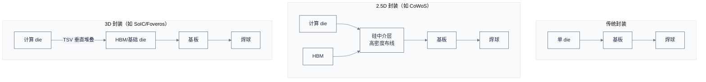

# 流片制造封装与量产测试 —— 把版图变成芯片

> 上一章把网表变成了通过签核的 GDSII。一个自然的问题是：版图数据怎么变成一颗能插上主板的物理芯片？本章用制造流程来回答——从 Tape-out 交付 GDSII 开始，走过掩模光刻、晶圆制造、封装、测试、量产，直到一颗芯片出厂。
> **工程师视角**：这是离软件最远的环节，但它的产物决定了你的工作环境——封装形式决定 PCB 设计约束，测试策略决定芯片有没有保留 JTAG、有没有 BIST 寄存器，良率决定芯片供货与价格。理解制造，能让你理解"为什么 ES 样片有 bug 是正常的""为什么同型号芯片有不同 stepping""为什么某些批次有特定问题"。

### 关键术语

| 缩写 | 全称 | 含义 |
|------|------|------|
| Tape-out | — | 流片，把 GDSII 交付 Foundry |
| Mask / Reticle | — | 掩模/光罩，光刻用的图案版 |
| Lithography | — | 光刻，把掩模图案转印到晶圆 |
| EUV | Extreme Ultraviolet Lithography | 极紫外光刻，13.5nm 波长，5nm/3nm 主力 |
| DUV | Deep Ultraviolet | 深紫外光刻，193nm 波长，成熟工艺用 |
| Wafer | — | 晶圆，硅圆片，制造基底 |
| Die | — | 裸芯片，晶圆上切割下来的单个芯片 |
| Yield | — | 良率，好 die 占总 die 的比例 |
| Fab | Fabrication Plant | 晶圆厂 |
| MPW | Multi-Project Wafer | 多项目晶圆，多家共享一片掩模降成本 |
| OSAT | Outsourced Semiconductor Assembly and Test | 外包封测厂 |
| BGA | Ball Grid Array | 球栅阵列封装 |
| QFP | Quad Flat Package | 四侧引脚扁平封装 |
| SiP | System in Package | 系统级封装 |
| SoIC / CoWoS / Foveros | — | 先进封装平台（TSMC/Intel） |
| TSV | Through-Silicon Via | 硅通孔，3D 堆叠垂直互连 |
| Interposer | — | 中介层，2.5D 封装承载数 chip |
| ATE | Automated Test Equipment | 自动测试设备 |
| CP | Circuit Probing / Wafer Test | 晶圆测试（探针卡测裸 die） |
| FT | Final Test | 成品测试（封装后测） |
| SLT | System Level Test | 系统级测试，跑真实工作负载 |
| Binning | — | 分 bin，按性能/缺陷分等级销售 |
| ES | Engineering Sample | 工程样片 |
| CS | Customer Sample | 客户样片 |
| MP | Mass Production | 量产 |
| DPPM | Defective Parts Per Million | 每百万缺陷数，质量指标 |

### 1.1 前置知识

| 需要了解 | 参考文档 |
|----------|----------|
| 后端流程与 GDSII | [04-后端物理设计与签核](./04-后端物理设计与签核.md) |
| DFT（扫描链/BIST/ATPG） | [03-前端设计RTL与验证](./03-前端设计RTL与验证.md#6-dft给芯片装上体检接口) |
| SoC 组成与封装影响 | [01-SoC设计全流程总览](./01-SoC设计全流程总览.md) |

---

## 1. 概述

### 1.1 系统上下文

**项目定位**：本章覆盖从 GDSII 到出厂芯片的全过程，跨 Foundry（晶圆制造）与 OSAT（封装测试）两类厂商。对 Fabless 设计公司而言，这一阶段是"交付后等待"——但并非撒手不管，要配合 Foundry 做 Tape-out signoff、跟 MPW/全掩模选择、跟 ES 调试、跟 OSAT 做测试程序开发。

**软硬件耦合点**：

- **GDSII ↔ Foundry**：GDSII 是设计方交付 Foundry 的唯一产物。Foundry 做 Tape-out signoff（用它的规则库再验一遍），通过才开掩模。
- **封装 ↔ PCB**：封装形式（BGA/QFN/FC-BGA）决定 PCB 设计约束——引脚间距、电源层、散热。先进封装（CoWoS）甚至要求 PCB 支持特定电源时序。
- **测试 ↔ DFT**：量产测试用的测试向量，就是前端 DFT 阶段生成的 ATPG。测试程序开发是固件/测试工程师与 OSAT 协同的工作。
- **良率 ↔ 设计**：设计阶段的密度、规则余量，直接影响良率。设计方要配合 Foundry 做良率分析（Yield Learning），定位是设计问题还是工艺问题。
- **ES ↔ 固件**：ES（工程样片）回来后，固件团队第一次在真实硅上跑代码——这是软硬件第一次真刀真枪集成，常发现大量 RTL 验证没覆盖的问题。

**跨实现对比**：

| 对比维度 | MPW（多项目晶圆） | 全掩模流片 | Metal ECO 重流 |
|------|------|------|------|
| 掩模成本 | 共摊，低 | 独享，高 | 只重做几层金属，中 |
| 适用阶段 | 验证、学习 | 量产前流片 | 流片后小修 |
| 时间 | 与别人拼车 | 独立排期 | 较快 |
| 风险 | 共享晶圆 | 独立 | 改动有限 |

```mermaid
%%{init: {"theme": "base", "themeVariables": {"primaryColor": "#f8fafc", "primaryTextColor": "#1e293b", "primaryBorderColor": "#475569", "lineColor": "#64748b", "secondaryColor": "#f1f5f9", "secondaryBorderColor": "#94a3b8", "tertiaryColor": "#f8fafc", "fontFamily": "\"trebuchet ms\", verdana, arial, sans-serif"}}}%%
flowchart LR
    GDS["GDSII<br/>设计方交付"] --> Signoff["Foundry<br/>Tape-out Signoff"]
    Signoff --> Mask["掩模制作<br/>Mask/Reticle"]
    Mask --> Fab["晶圆制造<br/>Fab 光刻/刻蚀/离子注入"]
    Fab --> Wafer["完成晶圆<br/>含数百 die"]
    Wafer --> CP["晶圆测试 CP<br/>探针卡测裸 die"]
    CP --> Dice["切割<br/>Die 分离"]
    Dice --> Pkg["封装<br/>OSAT"]
    Pkg --> FT["成品测试 FT<br/>ATE + SLT"]
    FT --> Binning["分 bin 分级"]
    Binning --> Ship["出厂<br/>ES/CS/MP"]
```

> **如何读这张图**：从 GDSII 到芯片出厂是一条线性主链，但每一步都可能有回路——CP 发现某 die 坏就标记废弃，FT 发现性能不够就降级 bin，ES 回来发现 bug 就 Metal ECO 重流。**整个制造封测环节通常 3–6 个月**，从 Tape-out 到拿到 ES 样片。

> **核心要点**：制造封测是把"数字版图"变成"物理芯片"的过程，跨 Foundry 与 OSAT 两类厂商。Fabless 设计公司在这一阶段的角色是"配合+验收"——配合 Foundry 做流片前 signoff，配合 OSAT 开发测试程序，验收 ES 样片。**ES 回来是整个项目最紧张的时刻**——之前所有验证对不对，硅上见分晓。

---

## 2. Tape-out 与掩模

### 2.1 Tape-out 里程碑

Tape-out 是设计阶段的终点、制造阶段的起点。具体动作：

1. 设计方完成所有 Signoff，导出 GDSII。
2. 把 GDSII 交给 Foundry，Foundry 用自己的规则库做 Tape-out signoff（再验一遍 DRC/LVS/天线等）。
3. 双方确认后，Foundry 开始做掩模。

### 2.2 掩模（Mask）

掩模是光刻用的图案版——晶圆上的每一层（每层金属、每个器件层）都对应一张掩模。一颗先进工艺 SoC 的掩模套数可达 60–90 层。

掩模制作极贵且极慢：

| 工艺 | 掩模套数 | 掩模总成本 |
|------|------|------|
| 28nm | ~40 层 | ~300 万美元 |
| 7nm | ~60 层 | ~1000–1500 万美元 |
| 5nm | ~70 层 | ~2000–4000 万美元 |
| 3nm | ~80 层 | ~5000 万美元+ |

> **待确认**：上述为业界常引用的经验区间，实际因 Foundry、掩模版规格、EUV 层数不同差异大。

掩模一旦做出，改一处就要重做整层掩模——这就是为什么 Tape-out 后修改成本极高。**Metal ECO** 只改几层金属掩模，能省下大部分器件层掩模费用，是流片后修复的首选。

### 2.3 MPW vs 全掩模

对小团队、学习项目，全掩模太贵，可用 MPW（Multi-Project Wafer）——多家设计方把各自的 die 拼在同一个掩模上，共摊掩模费。代价是要和别的项目拼车排期，且 die 数量少。MPW 是高校、初创验证想法的常用路径。

---

## 3. 光刻：把图案印到晶圆上

光刻是制造的核心工艺——把掩模上的图案转印到晶圆的光刻胶上，后续刻蚀把图案刻到硅/金属层。

### 3.1 光刻分辨率

光刻能画出的最小线宽由瑞利公式决定：

$$R = k_1 \cdot \frac{\lambda}{NA}$$

- $R$：最小可分辨线宽（半节距）
- $k_1$：工艺相关系数，通常 0.25–0.4
- $\lambda$：光刻光源波长
- $NA$：透镜数值孔径

逐符号解释：

- $k_1$ 越小越好，靠 OPC（光学邻近校正）、多重图形等工艺技术降低。
- $\lambda$ 越短越好：DUV 用 193nm 波长，EUV 用 13.5nm 波长——EUV 让 7nm 以下成为可能。
- $NA$ 越大越好，但受透镜设计限制。

### 3.2 DUV vs EUV

| 对比维度 | DUV（193nm） | EUV（13.5nm） |
|------|------|------|
| 波长 | 193nm | 13.5nm |
| 光源 | 准分子激光 | 激光等离子体（锡滴） |
| 单次曝光分辨率 | ~40nm 半节距 | ~13nm 半节距 |
| 多重图形 | 7nm 以下需 SADP/SAQP，套刻次数多 | 5nm/3nm 主力，减少多重图形 |
| 设备成本 | ~1 亿美元/台 | ~2–3 亿美元/台 |
| 产能 | 高 | 较低（每小时晶圆数少） |
| 适用节点 | ≥7nm | ≤7nm |

**为什么 EUV 这么贵又慢还非用不可**？因为 DUV 在 7nm 以下要做 4 重甚至更多图形（SAQP），套刻对准难度爆炸、掩模层数翻倍、成本反而比 EUV 高。EUV 一次曝光替代多次 DUV，整体更经济——虽然单台设备贵到 3 亿美元。

### 3.3 光刻流程（简化）

1. 晶圆涂光刻胶。
2. 掩模对准，光照射，图案转印到光刻胶。
3. 显影，洗掉曝光（或未曝光）部分。
4. 刻蚀，把图案刻到下层材料。
5. 去胶，清洗。
6. 下一层重复。

晶圆上每一层都走一遍这个循环，几十层叠加，最终形成完整的器件与连线。

> **核心要点**：光刻是制造的心脏，分辨率决定工艺节点。**EUV 是 5nm/3nm 的 enabling 技术**——没有 EUV，先进工艺在 DUV 多重图形下成本不可承受。这也是为什么 ASML（唯一量产 EUV 光刻机的公司）成为半导体产业的关键卡点。

---

## 4. 晶圆制造工艺

光刻只是晶圆制造的一步，完整的前道工艺（FEOL/BEOL）包含几十道工序。

### 4.1 主要工艺步骤

| 工序 | 作用 |
|------|------|
| 离子注入 | 掺杂改变硅的电学性质（形成源漏、阱） |
| 热氧化 | 生长栅氧 |
| 沉积（CVD/PVD/ALD） | 沉积多晶硅、金属、介质层 |
| 光刻 + 刻蚀 | 图案化每一层 |
| 化学机械抛光（CMP） | 把晶圆表面磨平，保证后续层平整 |
| 金属化 | 形成各层金属连线 |

整个晶圆制造要在超净间（Class 1–10）进行，一颗芯片要花 2–3 个月走过几百道工序。

### 4.2 晶圆尺寸

主流晶圆为 12 英寸（300mm）直径，面积约 70000 mm²。一片晶圆上能切多少 die 取决于 die 大小：

- die 100 mm²：理论 ~700 颗，扣边缘良率后约 500–600 颗
- die 400 mm²（大芯片）：理论 ~175 颗，良率后约 100–130 颗

die 越大，单晶圆产出越少、良率越低（缺陷概率随面积上升）——这是大芯片成本高的根本原因。

---

## 5. 封装：给裸 die 穿上"外壳"

裸 die 太脆弱、太小，无法直接焊到主板上。封装给 die 提供机械保护、电气连接、散热路径、外形标准化。

### 5.1 封装的基本功能

| 功能 | 说明 |
|------|------|
| 电气互连 | die 焊盘 ↔ 封装引脚（引线键合/倒装） |
| 机械保护 | 保护 die 免受物理/化学损伤 |
| 散热 | 把 die 热量导到散热器 |
| 外形标准化 | 提供可焊到 PCB 的引脚阵列 |

### 5.2 传统封装 vs 先进封装

| 对比维度 | 传统封装（QFP/BGA/引线键合） | 先进封装（FC-BGA/倒装/2.5D/3D） |
|------|------|------|
| 互连方式 | 引线键合（金属线） | 倒装（焊料凸点直接贴基板/中介层） |
| 引脚密度 | 低 | 高 |
| 电感/电阻 | 较高（引线长） | 低（短互连） |
| 散热 | 一般 | 好（裸 die 背面贴散热器） |
| 成本 | 低 | 高 |
| 适用 | 中低端 | 高性能 SoC、AI 芯片 |

### 5.3 先进封装的三种形态

> **如何读这张图**：传统封装单 die 贴基板；2.5D 把多 die 摆在硅中介层上，中介层做高密度布线（如计算 die ↔ HBM 的超高带宽互连）；3D 把 die 垂直堆叠，用 TSV 直接互连，密度最高。**NVIDIA H100、AMD MI300 都用 2.5D/3D 封装把计算 die 与 HBM 封在一起**——这是 AI 芯片的标配。

### 5.4 Chiplet 与先进封装的关系

Chiplet（见 [01 章 §5.1](./01-SoC设计全流程总览.md#51-chiplet把大-die-拆成小-die)）依赖先进封装实现 die 间高速互连：

- UCIe 是封装内 die 间 PHY+链路层标准（详见 [../interconnect/01](../interconnect/01-互联总线与协议全景辨析.md)）。
- NVIDIA NVLink-C2C 是私有片间互连，用在 Grace CPU + Hopper GPU 的封装内集成。

> **核心要点**：封装从"给 die 穿外壳"演变成"多 die 系统集成"——先进封装让 Chiplet 成为可能，让设计方可以混合工艺、按需拼装。**封装不再是制造的附庸，而是与设计、工艺并列的第三维**。这也是为什么 TSMC 的 CoWoS 产能成为 AI 芯片出货瓶颈——先进封装产能极其有限。

---

## 6. 测试：挑出坏芯片

制造不完美，每片晶圆都有坏 die。测试的目标是**在出厂前把每颗芯片都验证可用，并按性能分级**。

### 6.1 三阶段测试

| 阶段 | 时机 | 工具 | 检测内容 |
|------|------|------|------|
| CP（Wafer Test） | 切割前，测裸 die | 探针卡 + ATE | 制造缺陷，挑坏 die 不浪费封装 |
| FT（Final Test） | 封装后 | ATE + 测试板 | 封装缺陷、功能、性能分 bin |
| SLT（System Level Test） | FT 后（可选） | 真实系统主板 | 跑真实工作负载，捕捉 ATE 漏掉的边缘 bug |

### 6.2 CP：晶圆测试

CP 在切割前用探针卡（Probe Card）直接扎到裸 die 的焊盘上，跑 ATPG 向量测制造缺陷。CP 的价值是**早期筛选**——坏 die 不进封装，省下封装成本。先进工艺下 CP 探针卡极贵（数十万美元），且 die 数量多，CP 时间直接影响成本。

### 6.3 FT：成品测试

封装后的芯片上 ATE（自动测试设备）跑完整测试程序：

1. **DC 测试**：测静态参数（漏电、电源电流）。
2. **功能测试**：跑 ATPG 向量验证逻辑功能。
3. **AC 测试**：测时序，在不同频率下跑，确定最高稳定频率。
4. **BIST 测试**：触发 DDR/SRAM BIST 自检。

### 6.4 SLT：系统级测试

ATE 测试是"短向量、快速度"，但有些 bug 只在长时间真实负载下暴露——如 PCIe 链路在某些温度下偶发丢包、DDR 在特定访问模式下抖动。SLT 把芯片插到真实主板，跑 OS + 应用几小时到几天，捕捉这些边缘缺陷。SLT 是高端 CPU/GPU/AI 芯片的标配，代价是慢且贵。

### 6.5 分 bin

测试后按性能与缺陷分级，叫 binning：

| Bin | 说明 | 命运 |
|-----|------|------|
| Bin 0/1（满血） | 全功能、最高频率 | 高价销售 |
| Bin 2/3（降级） | 部分核坏或频率低 | 关闭坏核降价销售（如三核当四核卖） |
| Bin F（废品） | 严重缺陷 | 报废 |

这也是为什么市场上同型号 CPU 有不同频率版本、不同核数——同一片晶圆上按测试结果分出来的。**核数差异往往是良率策略的产物，不是设计差异**。

> **核心要点**：测试是制造的"质检关"，三阶段（CP/FT/SLT）层层筛缺陷。**Binning 把良率损失变成可销售产品**——坏一颗核的 die 关掉那颗核当降级版卖，是行业公开的良率经济学。理解这点，就理解了为什么同型号芯片有不同 stepping 和频率档。

---

## 7. 良率：制造的核心经济指标

良率（Yield）是好 die 占总 die 的比例，直接决定单颗成本——前面 [01 章 §3.2](./01-SoC设计全流程总览.md#32-单颗成本良率与规模) 算过：单颗成本 ≈ (晶圆成本 + 封测) / (良率 × 好 die 数)。

### 7.1 良率的影响因素

| 因素 | 影响 |
|------|------|
| die 面积 | 越大良率越低（缺陷命中概率随面积上升） |
| 工艺成熟度 | 新工艺初期良率低，量产爬坡后提升 |
| 设计密度 | 高密度区域对工艺波动敏感 |
| 设计规则余量 | 留余量的设计良率更稳 |
| 缺陷密度 | Foundry 工艺控制水平 |

### 7.2 良率学习

新工艺节点初期良率可能只有 30–50%，经过良率学习（Yield Learning）可提升到 90%+。良率学习是 Foundry 与设计方协同的过程：

- Foundry 改进工艺控制（降低缺陷密度）。
- 设计方分析失效 die 的模式（哪些区域/哪些电路敏感），做设计优化或加冗余。

冗余设计是良率手段之一——如 SRAM 加冗余行/列，发现坏 cell 用激光熔丝切换到冗余行，把坏 die 救回来。CPU 集群关核降级也是同思路。

### 7.3 一个良率数值例子

假设 5nm 工艺、die 面积 100 mm²、缺陷密度 0.1/cm²，用 Poisson 模型估算良率：

$$Y = e^{-A \cdot D} = e^{-1.0 \times 0.1} = e^{-0.1} \approx 0.905$$

即良率约 90.5%。若 die 面积增到 400 mm²（大芯片）：

$$Y = e^{-4.0 \times 0.1} = e^{-0.4} \approx 0.67$$

良率降到 67%——**die 面积翻 4 倍，良率从 90% 掉到 67%**。这就是大芯片经济性差的原因，也是 Chiplet 兴起的根本动力：4 个 100 mm² 的小 die 良率各 90%，远好于 1 个 400 mm² 的大 die 67%。

> **如何读这两个数**：缺陷密度 D=0.1/cm² 是 5nm 量级的经验值（早期可能更高，成熟后更低）。面积 A 单位是 cm²，100 mm² = 1 cm²。Poisson 模型是简化估算，实际用更精细的负二项或 Murphy 模型，但量级结论一致——**die 越大良率越低，且下降是非线性的**。

> **核心要点**：良率是制造的核心经济指标，与 die 面积强相关（指数衰减）。**这是 Chiplet 兴起的根本动力**——把大 die 拆成小 die，良率从 67% 提升到 90%+，综合成本反而更低。理解良率，就理解了为什么芯片产业从"单片大 SoC"转向"Chiplet + 先进封装"。

---

## 8. ES、CS、MP：从样片到量产

芯片不是一次性"造好就卖"，而是分阶段交付：

| 阶段 | 全称 | 时机 | 用途 | 质量 |
|------|------|------|------|------|
| ES | Engineering Sample | 首次流片回来 | 给设计方/固件团队调试 | 有 bug 正常，性能不达标正常 |
| CS | Customer Sample | ES 修复后 | 给客户评估、预研产品 | 接近量产，仍有小修可能 |
| MP | Mass Production | 全部验证通过 | 量产出货 | 质量达标，DPPM 受控 |

### 8.1 ES 调试：软硬件第一次真集成

ES 样片回来是项目最紧张的时刻。固件团队第一次在真实硅上跑代码，常发现：

- RTL 验证没覆盖的时序问题（真实工艺角下的行为）
- IP 集成的边界 bug
- 电源/时钟的实际表现与预估偏差
- 制造偏差导致的某些 die 行为异常

ES 调试发现的 bug，能 Metal ECO 改的就 Metal ECO，不能的就等下次重流。**ES 有 bug 是常态**——这就是为什么设计方留 ES 阶段做缓冲，而不是直接量产。

### 8.2 量产与质量控制

量产阶段关注：

- **DPPM（每百万缺陷数）**：质量指标，高端芯片要求 < 100 DPPM 甚至更低。
- **良率监控**：每批晶圆统计良率，异常要查根因。
- **可追溯性**：每颗芯片有 lot/wafer/die 编号，出问题能追溯到具体晶圆。

---

## 9. 全流程回顾

回到 [01 章的全流程图](./01-SoC设计全流程总览.md#2-全流程地图九个阶段一张图)，现在你能看懂每个环节了：

| 阶段 | 角色 | 关键产出 | 关键风险 |
|------|------|------|------|
| 规格架构 | 架构师 | PPA/IP/地址映射 | 架构错误流片才发现 |
| 前端 RTL | RTL 工程师 | RTL 代码 | 验证覆盖不全 |
| 验证 | 验证工程师 | 覆盖率报告 | 边界 bug 漏网 |
| 综合/STA | 前端 | 网表/SDC | SDC 错误致假通过 |
| DFT | DFT 工程师 | 测试结构/向量 | 测试覆盖率不足 |
| 后端 | 后端工程师 | GDSII | 时序/IR/EM 不收敛 |
| 制造 | Foundry | 裸 die | 良率/工艺偏差 |
| 封装 | OSAT | 封装芯片 | 封装缺陷/热阻 |
| 测试 | OSAT/设计方 | 分 bin 出厂 | 漏测边缘缺陷 |

> **核心要点**：从规格到量产，每一步都在与"成本"和"风险"博弈。**Tape-out 是分水岭，ES 是验收时刻，量产是商业兑现**。整个链路 18–36 个月、耗资数千万到数亿美元——这就是为什么芯片是"高风险高投入"产业，也是为什么产业链分工（Fabless/Foundry/OSAT/IP/EDA）如此精细：没有任何一家公司能独自承担全流程。

---

## 10. 给软件工程师的回顾

如果你是固件/驱动/系统软件工程师，走过这五章后，回头看你的日常工作：

- 你写的**设备树**，地址来自 [02 章架构阶段](./02-规格定义与架构设计.md#5-地址映射芯片的门牌号系统)定的地址映射。
- 你调的**寄存器**，行为来自 [03 章前端 RTL](./03-前端设计RTL与验证.md#2-rtl-编码用语言描述电路)。
- 你的**初始化顺序**，受 [02 章时钟电源域](./02-规格定义与架构设计.md#6-时钟与电源域芯片的血管与神经) 约束。
- 你遇到的**降频/热保护**，根源在 [04 章电源网络与 IR](./04-后端物理设计与签核.md#3-电源网络芯片的血管系统)。
- 你的**JTAG 调试**，来自 [03 章 DFT](./03-前端设计RTL与验证.md#6-dft给芯片装上体检接口)。
- 你买的 **ES/量产芯片**，经历 [05 章制造封测](./05-流片制造封装与量产测试.md)。
- 同型号芯片的 **stepping 差异**，是 [05 章 Metal ECO/重流](./05-流片制造封装与量产测试.md#22-掩模mask) 的产物。

芯片不是黑盒——它是这套流程所有决策的物理固化。理解流程，就能从"芯片有 bug"升级到"这是哪一阶段的什么决策导致的、该查什么"。

> **核心要点**：芯片设计与制造是一套跨越五类角色、九个阶段、18–36 个月的系统工程。对软件工程师而言，理解这套流程的最大价值是**建立"硬件根因"思维**——你遇到的每一个芯片行为异常，都能追溯到流程中某个阶段的某个决策。这不是为了让你去造芯片，而是为了让你在"芯片-软件"交界处工作时，问对问题、找对人、查对文档。

---

## 参考资料

- [IRDS Lithography Roadmap](https://irds.ieee.org/) — 参考了光刻节点与 EUV 趋势
- [TSMC Technology Overview](https://www.tsmc.com/english/dedicatedFoundry/technology/index.htm) — 参考了 N7/N5/N3 工艺与 CoWoS/SoIC 先进封装
- [Intel Foundry 18A / RibbonFET / PowerVia](https://www.intel.com/content/www/us/en/foundry/process-node-roadmap.html) — 参考了先进工艺与背面供电
- [ASML EUV Lithography](https://www.asml.com/en/technology/lithography/euv) — 参考了 EUV 光刻原理
- [UCIe Specification](https://www.uciexpress.org/) — 参考了 Chiplet 片间互连
- [ASE / Amkor OSAT 服务](https://www.aseglobal.com/) — 参考了封装测试外包流程
- [../interconnect/01-互联总线与协议全景辨析.md](../interconnect/01-互联总线与协议全景辨析.md) — 参考了 UCIe/Chiplet 互连分层
