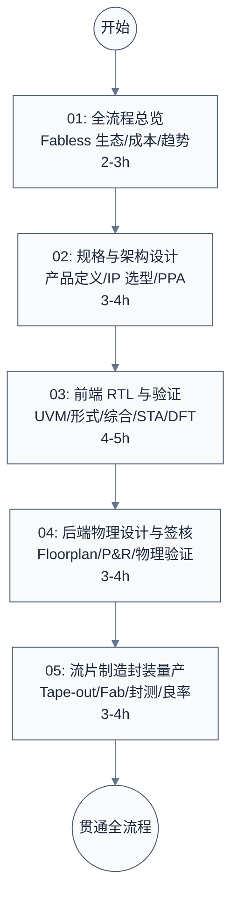

# SoC 芯片设计到生产全流程学习笔记

> 面向嵌入式/系统软件工程师的 SoC 全流程导览。从一行规格到一片可以插上主板的封装芯片，走过**规格 → 架构 → 前端 → 后端 → 流片 → 制造 → 封装 → 测试 → 量产**的完整链路，说清每个环节在做什么、为什么这么做、谁在做、要花多久、花多少钱。

---

## 学习路线图



---

## 文档索引

| 序号 | 文档 | 内容概要 | 建议用时 |
|:----:|------|---------|:--------:|
| 01 | [SoC 设计全流程总览](./01-SoC设计全流程总览.md) | Fabless 生态全景、九大阶段地图、时间与成本构成、Chiplet/3D/AI SoC 现代趋势 | 2-3h |
| 02 | [规格定义与架构设计](./02-规格定义与架构设计.md) | 产品定义、PPA 三角权衡、IP 选型与采购、软硬件协同设计、虚拟原型与架构验证 | 3-4h |
| 03 | [前端设计 RTL 与验证](./03-前端设计RTL与验证.md) | RTL 编码规范、UVM 验证方法学、覆盖率、形式验证、硬件加速验证（Emulation/FPGA 原型）、逻辑综合、静态时序分析、DFT（扫描链/BIST/ATPG） | 4-5h |
| 04 | [后端物理设计与签核](./04-后端物理设计与签核.md) | Floorplan、电源规划、布局布线、时钟树综合、寄生提取、DRC/LVS、签核收敛 | 3-4h |
| 05 | [流片制造封装与量产测试](./05-流片制造封装与量产测试.md) | Tape-out 与 GDSII、掩模与光刻、晶圆制造、传统与先进封装、Wafer/FT/SLT 测试、良率与量产 | 3-4h |

---

## 官方文档

| 文档 | 用途 | 建议阅读时机 |
|------|------|------|
| [IRDS (International Roadmap for Devices and Systems)](https://irds.ieee.org/) | IEEE 出品的半导体技术与工艺路线图，接替 ITRS，看工艺节点演进趋势 | 学完 01 后 |
| [TSMC Online Documentation / Process Overview](https://www.tsmc.com/english/dedicatedFoundry/technology/index.htm) | Foundry 工艺节点（N7/N5/N3/N2）与 PDK 概览 | 学完 01、05 时对照 |
| [Intel Foundry Process Nodes](https://www.intel.com/content/www/us/en/foundry/process-node-roadmap.html) | Intel 18A/14A 等 RibbonFET/PowerVia 工艺路线 | 学完 05 后 |
| [JEDEC Standards](https://www.jedec.org/) | DDR/LPDDR/HBM 标准，SoC 内存接口 IP 必须对齐 | 涉及 DDR 控制器时 |
| [AMBA Specification (ARM IHI 0022/0050)](https://developer.arm.com/documentation/ihi0022/latest) | AXI/ACE/CHI 片内总线协议，IP 集成契约 | 学完 02 IP 集成时 |
| [UCIe Specification](https://www.uciexpress.org/) | Chiplet 片间互连标准，2.0 支持 3D 封装 | 学完 05 先进封装时 |
| [Synopsys/Cadence/Siemens EDA 产品文档](https://www.synopsys.com/ · https://www.cadence.com/ · https://eda.sw.siemens.com/) | 三大 EDA 厂商工具链（DC/PrimeTime/ICC2、Genus/Innovus、Calibre/Tessent） | 对应章节工具对照 |

---

## 源码导航

本专题为流程导览型，无独立 `src/` 子目录。涉及的具体实现分布在相邻专题：

| 仓库 | 路径 | 职责 | 对应专题 |
|------|------|------|---------|
| linux-common | `drivers/clk/`、`drivers/reset/`、`drivers/pinctrl/` | SoC 时钟/复位/管脚控制驱动 | — |
| linux-common | `drivers/soc/` | SoC 平台特定驱动（如 SG2044/SG2046） | [../sg2046/](../sg2046/) |
| edk2 | `Platform/`、`Silicon/` | UEFI 固件与 SoC 平台集成 | [../edk2/](../edk2/) |
| trusted-firmware | `plat/` | SBI/TF-A 与 SoC 平台层耦合 | [../trusted-firmware/](../trusted-firmware/) |

---

## 按角色推荐学习路径

### 固件/驱动工程师（在"芯片-软件"交界处工作）

目标是理解"芯片给软件暴露了什么、软件依赖芯片的哪些设计决策"：

```text
01 总览 → 02 架构设计（重点：IP 集成与地址映射）→ 04 后端（重点：时钟树/电源域）→ 05 制造（重点：测试与量产）
```

- **02 是核心**：理解 IP 集成方式，才能看懂 SoC 手册里那些 IP 块、中断号、地址映射是怎么来的
- **04 的时钟树/电源域**直接决定固件初始化顺序与电源管理策略
- **05 的测试环节**帮你理解为什么芯片有 JTAG/边界扫描、为什么有某些保留寄存器

### 系统软件工程师（做选型与系统设计）

目标是建立"一片芯片从需求到量产要付出什么代价"的全局观：

```text
01 总览（重点：成本与周期）→ 02 架构设计 → 05 制造与量产（重点：良率与供货）
```

- **01 的成本构成**让你理解为什么某颗芯片卖这个价、为什么先进工艺贵
- **02** 帮你看懂厂商架构文档背后的设计权衡
- **05** 让你理解芯片供货周期、ES/CS/量产版本的差异

### 硬件/板级工程师

```text
01 总览 → 04 后端物理设计（重点）→ 05 封装与测试（重点）
```

- **04** 帮你理解芯片封装引脚背后的电源/地分配与信号完整性约束
- **05 的封装**直接决定 PCB 设计约束（BGA fanout、电源层、热设计）

---

**文档版本**: v1.0
**最后更新**: 2026-08-03
**适用对象**: 嵌入式工程师、系统软件工程师、固件/驱动工程师、板级硬件工程师
