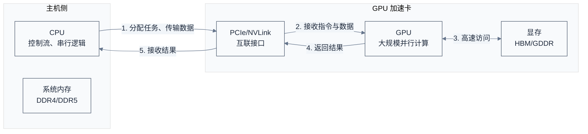
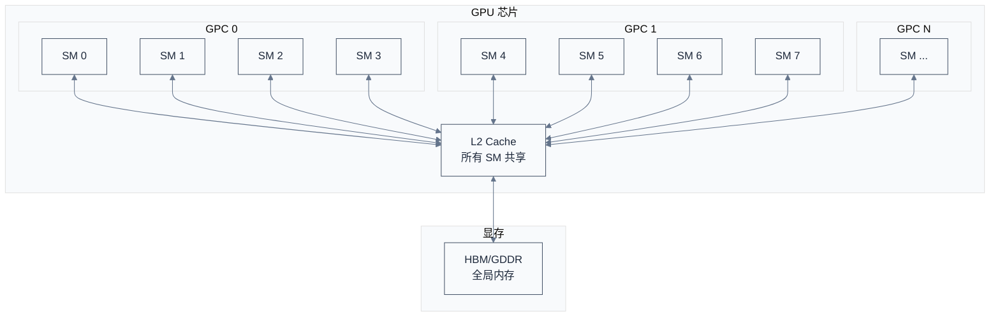
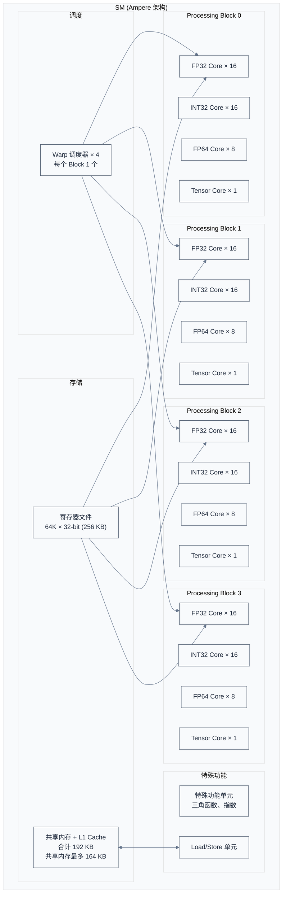
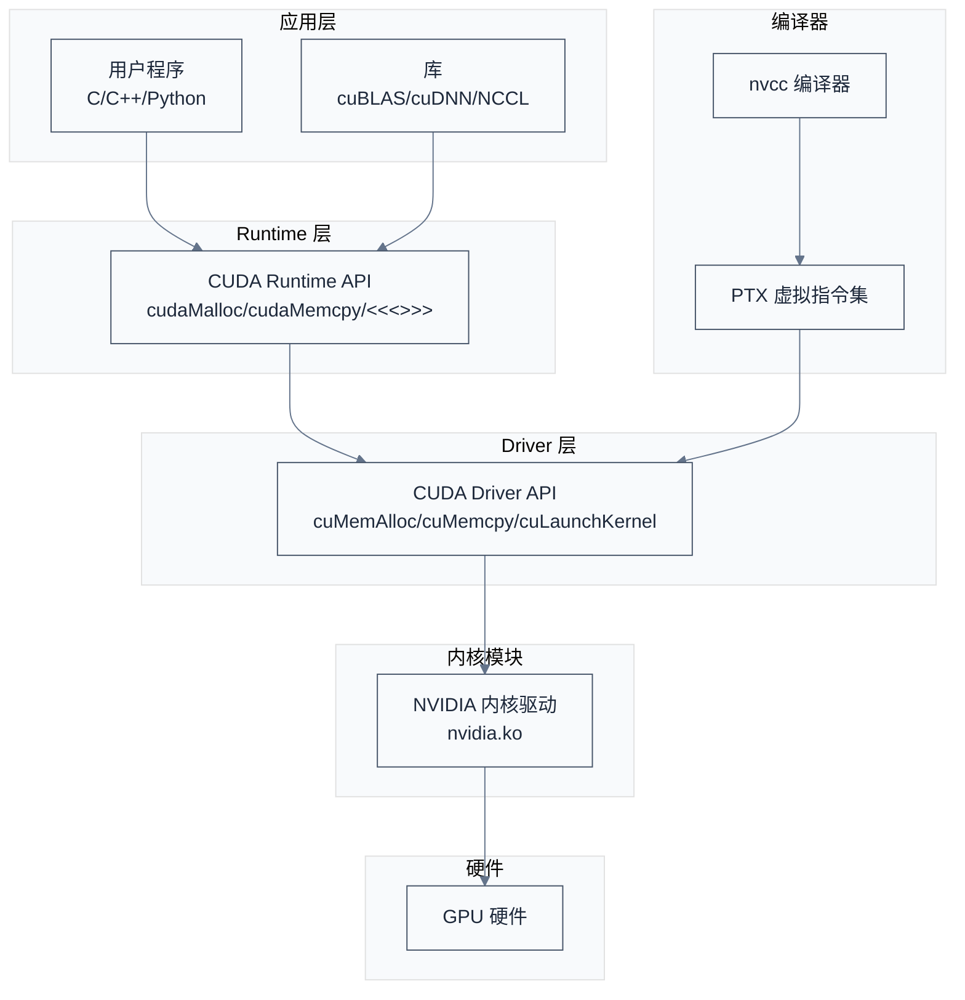

# GPU 架构基础

> 本篇介绍 GPU 硬件架构，从 SM 结构到内存层级，建立理解 CUDA 软件栈的硬件基础。
> **工程师视角**：GPU 不是"更快的 CPU"——它是为大规模并行计算设计的完全不同的硬件架构。理解这一点，才能理解为什么 CUDA 的编程模型、内存管理、执行模型都与传统 CPU 编程截然不同。

### 关键术语


| 缩写            | 全称                                  | 含义                        |
| ------------- | ----------------------------------- | ------------------------- |
| SM            | Streaming Multiprocessor            | GPU 核心执行单元，包含多个 CUDA Core |
| CUDA Core     | —                                   | GPU 的基本计算单元，执行浮点/整数运算     |
| Tensor Core   | —                                   | 专门用于矩阵运算的加速单元（Volta 架构引入） |
| Warp          | —                                   | GPU 调度的基本单位，32 个线程一组同步执行  |
| SIMT          | Single Instruction Multiple Threads | 单指令多线程执行模型                |
| SP            | Single Precision                    | 单精度浮点（32 位）               |
| DP            | Double Precision                    | 双精度浮点（64 位）               |
| HBM           | High Bandwidth Memory               | 高带宽内存，通过硅中介层与 GPU 封装在一起   |
| GDDR          | Graphics DDR                        | 图形专用 DDR 内存，用于中高端 GPU     |
| L1/L2         | Level 1/Level 2 Cache               | GPU 缓存层级                  |
| Register File | —                                   | 寄存器文件，SM 内最快的存储           |
| Shared Memory | —                                   | SM 内的用户可控共享存储             |


### 1.1 前置知识


| 需要了解                  | 参考文档 |
| --------------------- | ---- |
| 计算机体系结构基础（CPU、缓存、流水线） | —    |
| 并行计算基本概念              | —    |


---

## 1. GPU 在计算系统中的位置

> 在深入 GPU 硬件细节之前，先理解 GPU 在整个计算系统中的角色——它不是独立存在的，而是与 CPU 协同工作的加速器。

### 1.1 系统上下文



**如何读这张图**：GPU 是 PCIe/NVLink 总线上的设备，CPU 通过总线向 GPU 发送指令和数据，GPU 执行并行计算后将结果返回。这个交互模式决定了 CUDA 编程的基本范式——CPU 负责控制流，GPU 负责数据并行。

### 1.2 为什么需要 GPU

**本质**：CPU 为低延迟设计，GPU 为高吞吐设计。


| 对比维度      | CPU                     | GPU                     |
| --------- | ----------------------- | ----------------------- |
| **设计目标**  | 低延迟，快速响应单个任务            | 高吞吐，同时处理大量任务            |
| **核心数量**  | 少（4-64 核）               | 多（数千到数万核）               |
| **单核复杂度** | 高（乱序执行、分支预测、多级缓存）       | 低（顺序执行、简单流水线）           |
| **缓存设计**  | 大容量多级缓存（L1/L2/L3，数十 MB） | 小容量缓存，依赖寄存器文件和共享内存      |
| **分支处理**  | 分支预测 + 乱序执行，隐藏分支延迟      | Warp 内所有线程同步执行分支，发散时串行化 |
| **适用场景**  | 复杂逻辑、串行任务、操作系统          | 数据并行、矩阵运算、图像处理          |


**具体例子**：假设要计算 100 万个浮点数的平方。

- **CPU 方案**：用 8 核 CPU，每核处理 12.5 万个数，单核需要执行 12.5 万条乘法指令。现代 CPU 单核每秒可执行约 10^9 条指令，耗时约 0.125 毫秒。
- **GPU 方案**：用 GPU 的 5000 个 CUDA Core，每个 Core 处理 200 个数，所有 Core 同时工作，只需执行 200 条乘法指令。虽然单核频率较低（约 1.5 GHz），但并行度极高，耗时约 0.13 微秒——快 1000 倍。

> **核心要点**：GPU 的优势不在于"每个核心更快"，而在于"同时工作的核心更多"。这种设计适合数据并行任务，但不适合复杂逻辑和串行依赖强的任务。

---

## 2. GPU 硬件结构

> 理解了 GPU 的设计哲学后，本节深入 GPU 的内部结构——从顶层的 GPC 到核心的 SM，再到 SM 内部的 CUDA Core、寄存器文件、共享内存。

### 2.1 GPU 整体架构



**层级结构**：

- **GPC (Graphics Processing Cluster)**：GPU 顶层分组，每个 GPC 包含多个 SM
- **SM (Streaming Multiprocessor)**：GPU 的核心执行单元，包含 CUDA Core、寄存器文件、共享内存、Warp 调度器
- **CUDA Core**：SM 内的基本计算单元，执行浮点/整数运算

以 NVIDIA A100 为例（参考 NVIDIA A100 架构白皮书 §2.1）：

- 8 个 GPC
- 每个 GPC 包含 8 个 TPC(Texture Processing Cluster)，每个 TPC 包含 2 个 SM
- 完整 GA100 die 共 128 个 SM，A100 启用其中 108 个 SM
- 每个 SM 包含 64 个 FP32 CUDA Core

### 2.2 SM 内部结构



**SM 的关键组件**（以 Ampere 架构 A100 为例，参考 NVIDIA A100 白皮书 §2.1）：


| 组件                  | 数量 / 容量               | 功能                               |
| ------------------- | --------------------- | -------------------------------- |
| **FP32 CUDA Core**  | 64 个（4 个 Processing Block × 16）  | 单精度浮点运算                          |
| **FP64 CUDA Core**  | 32 个（4 × 8）                 | 双精度浮点运算（A100 特有）                 |
| **INT32 CUDA Core** | 64 个（4 × 16，与 FP32 等量）                  | 整数运算，可与 FP32 并发执行                |
| **Tensor Core**     | 4 个（每 Block 1 个）                   | 矩阵乘法加速（FP16/BF16/TF32/INT8/FP64） |
| **Warp 调度器**        | 4 个（每 Block 1 个）                   | 每个周期调度一个 Warp 执行指令               |
| **寄存器文件**           | 64K × 32-bit (256 KB) | 每个线程的私有寄存器                       |
| **共享内存 + L1 Cache** | 合计 192 KB，共享内存最多 164 KB（可配置 carveout）           | SM 内共享的高速存储                      |
| **L1 Cache / 纹理缓存** | 与共享内存共享 192 KB        | 全局内存的缓存                          |


> **如何读这张图**：SM 是 GPU 的核心执行单元。4 个 Warp 调度器可以同时调度多个 Warp，每个 Warp 包含 32 个线程。寄存器文件是每线程私有的高速存储，共享内存是 Block 内线程共享的存储。FP32/INT32 Core 可以并行执行，这是 Ampere 架构的改进。

### 2.3 Warp 调度与执行

**Warp 的本质**：GPU 调度的基本单位，32 个线程一组，所有线程执行相同的指令。

**为什么是 32 个线程？** 这是硬件设计决策——32 个线程共享一个指令解码器和调度器，摊薄了控制逻辑的开销。如果 Warp 太小，控制逻辑占比过高；如果 Warp 太大，分支发散（divergence）问题会更严重。

**Warp 调度示例**：假设一个 SM 有 4 个 Warp 调度器，每个调度器管理 8 个 Warp（共 32 个 Warp）。

```
周期 1: 调度器 0 选择 Warp 0，执行指令 A
周期 2: 调度器 1 选择 Warp 8，执行指令 A
周期 3: 调度器 2 选择 Warp 16，执行指令 A
周期 4: 调度器 3 选择 Warp 24，执行指令 A
周期 5: 调度器 0 选择 Warp 1，执行指令 A
...
```

**隐藏延迟的机制**：当一个 Warp 等待内存访问时，调度器立即切换到另一个就绪的 Warp，保持流水线满载。这就是为什么 GPU 需要大量线程——用线程数换吞吐量。

**Occupancy（占用率）**：SM 中活跃 Warp 数与最大 Warp 数的比值。

- A100 每个 SM 最多 64 个 Warp（2048 线程 / 32 线程每 Warp）
- 如果只启动了 16 个 Warp，occupancy = 16/64 = 25%
- 低 occupancy 意味着无法充分隐藏延迟，性能下降

---

## 3. 内存层级

> GPU 的内存系统是分层的，从最快的寄存器到最慢的全局内存，容量和延迟差异巨大。理解这个层级是优化 CUDA 程序的关键。

### 3.1 内存层级结构


| 内存类型         | 位置            | 容量                 | 延迟          | 带宽      | 可见性        | 生命周期        |
| ------------ | ------------- | ------------------ | ----------- | ------- | ---------- | ----------- |
| **寄存器**      | SM 内          | 每线程 255 个 32-bit   | ~1 周期       | 极高      | 线程私有       | Kernel 执行期间 |
| **共享内存**     | SM 内          | A100 最多 164 KB/SM（与 L1 共享 192 KB）；H100 最多 228 KB/SM（与 L1 共享 256 KB） | ~20-30 周期   | 极高      | Block 内共享  | Block 执行期间  |
| **L1 Cache** | SM 内          | 与共享内存共享 192 KB (A100) / 256 KB (H100)    | ~30 周期      | 高       | 线程私有（自动缓存） | —           |
| **L2 Cache** | GPU 芯片级       | 40 MB (A100) / 50 MB (H100)       | ~200 周期     | 中       | 所有 SM 共享   | —           |
| **全局内存**     | 显存 (HBM/GDDR) | 40-80 GB (A100) / 80 GB (H100)          | ~400-600 周期 | 高（但延迟高） | 所有线程可见     | 由用户管理       |
| **常量内存**     | 全局内存的一部分      | 64 KB              | 缓存后 ~5 周期   | 高       | 所有线程只读     | 由用户管理       |
| **纹理内存**     | 全局内存的一部分      | 无限制                | 缓存后 ~5 周期   | 高       | 所有线程只读     | 由用户管理       |


**如何读这张表**：从寄存器到全局内存，容量递增、延迟递增。寄存器和共享内存是 SM 内的片上存储，速度极快但容量有限；全局内存是显存，容量大但延迟高。CUDA 编程的核心优化技巧之一就是合理利用内存层级——把频繁访问的数据放在快的存储中。

### 3.2 具体数值：A100 vs H100

以 NVIDIA A100 和 H100 为例（数据来源：NVIDIA A100 架构白皮书、NVIDIA H100 架构白皮书）：


| 指标                   | A100 (Ampere)     | H100 (Hopper)    | 说明            |
| -------------------- | ----------------- | ---------------- | ------------- |
| **SM 数量**            | 108               | 132              | H100 增加了 22%  |
| **FP32 CUDA Core**   | 6912              | 16896            | H100 增加了 144% |
| **Tensor Core**      | 432 (第三代)         | 528 (第四代)        | H100 增加了 22%  |
| **寄存器文件**            | 每 SM 256 KB       | 每 SM 256 KB      | 相同            |
| **共享内存**             | 每 SM 最多 164 KB(与 L1 合计 192 KB)       | 每 SM 最多 228 KB(与 L1 合计 256 KB)      | H100 增加了 39%  |
| **L2 Cache**         | 40 MB             | 50 MB            | H100 增加了 25%  |
| **显存容量**             | 40/80 GB HBM2e    | 80 GB HBM3       | H100 带宽更高     |
| **显存带宽**             | 1555 GB/s(40GB) / 2039 GB/s(80GB) (HBM2e) | 3350 GB/s (HBM3) | H100 增加了 115% |
| **FP32 算力**          | 19.5 TFLOPS       | 60 TFLOPS        | H100 增加了 208% |
| **Tensor 算力 (FP16)** | 312 TFLOPS        | 989 TFLOPS       | H100 增加了 217% |
| **TDP 功耗**           | 400W              | 700W             | H100 功耗更高     |


**数值演算示例**：计算 A100 的 FP32 算力。

- 每个 SM 有 64 个 FP32 Core
- 每个 FP32 Core 每周期执行 1 个 FMA（Fused Multiply-Add，融合乘加）指令
- FMA 在 IEEE 计数规则下记为 2 个浮点操作（1 次乘 + 1 次加）
- GPU 加速频率约 1.41 GHz
- A100 启用 108 个 SM

$$
\text{FP32 算力} = 64 \times 2 \times 1.41 \times 10^9 \times 108 \approx 19.5 \text{ TFLOPS}
$$

- $64$：每 SM 的 FP32 Core 数
- $2$：每条 FMA 指令对应的浮点操作数（1 乘 + 1 加）
- $1.41 \times 10^9$：GPU 时钟频率（Hz）
- $108$：启用的 SM 数

结果与 A100 标称值 19.5 TFLOPS 一致。

> **常见误区**：有人误以为"每周期执行 2 个 FMA = 4 个浮点操作"。这是把 FMA 指令数和 FLOP 数混淆了——每条 FMA 指令本身就包含乘加两步运算，按 2 FLOP 计数。GPU 的 64 个 FP32 Core 在同一周期都可以执行 FP32，不存在"部分 Core 仅供 FP64 或 INT32"的限制（A100 的 INT32 Core 与 FP32 Core 等量且独立，可同时发射）。

> **核心要点**：GPU 的算力来自大规模并行——数千个 Core 同时工作，而不是单个 Core 特别快。显存带宽是性能瓶颈之一，H100 用 HBM3 将带宽提升到 3.35 TB/s，但仍远低于计算需求。

---

## 4. 与 CPU 架构的深度对比

> 理解了 GPU 的硬件结构后，本节从系统软件工程师的视角，深入对比 CPU 和 GPU 的架构差异——这些差异决定了 CUDA 编程模型的设计。

### 4.1 缓存设计差异

**CPU 缓存**：多级缓存（L1/L2/L3），容量大（L3 可达数十 MB），硬件自动管理，对程序员透明。

**GPU 缓存**：

- L1 Cache 与共享内存共享 192 KB，用户需要手动分配比例
- L2 Cache 是全局的，所有 SM 共享
- 没有 L3 Cache——GPU 依赖大容量显存和高带宽

**为什么这样设计？** CPU 面对的是复杂的、不可预测的内存访问模式，大容量缓存可以减少主存访问。GPU 面对的是规则的、可预测的内存访问模式（如矩阵运算），程序员可以手动优化数据布局，不需要大容量缓存。

### 4.2 分支处理差异

**CPU**：分支预测 + 乱序执行，可以高效处理复杂的条件分支。

**GPU**：Warp 内 32 个线程同步执行相同指令。如果线程走不同的分支路径，称为**分支发散 (Branch Divergence)**。

**具体例子**：

```c
if (threadIdx.x % 2 == 0) {
    // 路径 A
    result = x * 2;
} else {
    // 路径 B
    result = x + 1;
}
```

- **CPU 执行**：分支预测器猜测方向，错误预测时清空流水线，但总体效率高。
- **GPU 执行**：Warp 内 32 个线程，偶数线程走路径 A，奇数线程走路径 B。GPU 必须先执行路径 A（偶数线程活跃，奇数线程禁用），再执行路径 B（奇数线程活跃，偶数线程禁用）。性能减半。

> **核心要点**：GPU 的 SIMT 模型要求 Warp 内线程尽量走相同路径，避免分支发散。这是 CUDA 编程的重要约束。

### 4.3 线程调度差异

**CPU**：操作系统调度器管理线程上下文切换，切换开销大（数千周期），因此线程数通常与核心数相当。

**GPU**：硬件 Warp 调度器管理 Warp 切换，切换开销小（零开销——只需选择下一个 Warp），因此 GPU 需要大量线程（数万到数十万）来隐藏延迟。

**为什么 GPU 需要大量线程？** 当一个 Warp 等待内存访问（约 400-600 周期）时，调度器切换到另一个 Warp。如果有足够多的 Warp，流水线可以一直保持满载。这就是"延迟隐藏"（latency hiding）机制。

---

## 5. CUDA 软件栈概览

> 硬件架构建立了基础，但程序员不会直接操作硬件——CUDA 提供了一套完整的软件栈，从高层 API 到底层驱动。

### 5.1 软件栈层级



**如何读这张图**：

- **应用层**：用户程序和高层库（如 cuBLAS）
- **Runtime 层**：CUDA Runtime API，提供简化的接口语义（如 `cudaMalloc`）
- **Driver 层**：CUDA Driver API，提供更底层的控制（如 `cuMemAlloc`）
- **编译器**：nvcc 将 CUDA C++ 编译为 PTX 虚拟指令集
- **内核模块**：NVIDIA 内核驱动（nvidia.ko）管理硬件资源
- **硬件**：GPU 硬件执行实际的计算

> **核心要点**：CUDA Runtime 是 Driver 的封装层，简化了接口语义但牺牲了部分控制能力。系统软件工程师通常需要直接操作 Driver API，而应用开发者使用 Runtime API 即可。

---

## 参考资料

- [NVIDIA A100 Tensor Core GPU Architecture Whitepaper](https://images.nvidia.com/aem-dam/en-z3/Solutions/data-center/nvidia-ampere-architecture-whitepaper.pdf) — 参考了 §2.1 SM 结构、§3 内存层级
- [NVIDIA H100 Tensor Core GPU Architecture Whitepaper](https://resources.nvidia.com/en-us-hopper-architecture/h100-tensor-core-gpu-architecture-whitepaper) — 参考了 §2 SM 增强、§4 内存系统
- [CUDA C Programming Guide §5. Architecture](https://docs.nvidia.com/cuda/cuda-c-programming-guide/index.html#architecture) — 参考了 §5.1-5.3 GPU 硬件结构

---

**下一篇**：[02-CUDA编程模型](./02-CUDA编程模型.md) — 从硬件到软件抽象，理解 Kernel、Thread 层次、SIMT 执行模型