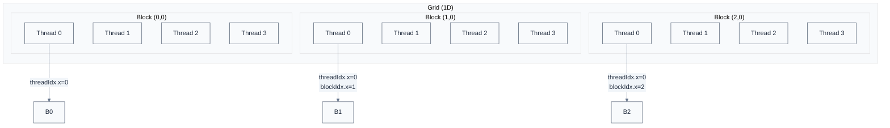
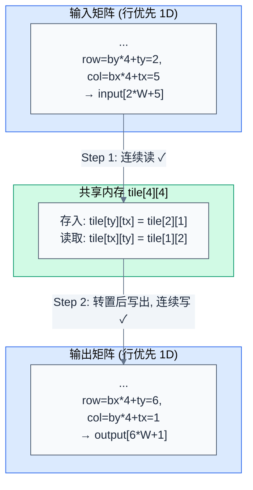
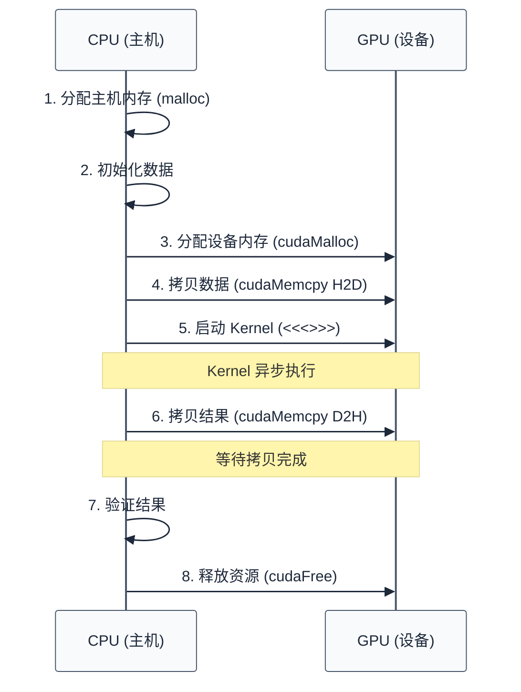

# CUDA 编程模型

> 上一章建立了 GPU 硬件基础。一个自然的问题是：程序员如何控制这数千个核心？本章介绍 CUDA 的编程抽象——Kernel、Thread 层次、SIMT 执行模型，以及内存空间映射。
>
> **工程师视角**：CUDA 的编程模型本质上是将 GPU 的硬件并行性暴露给程序员。理解 Grid-Block-Thread 三层结构的设计动机，才能写出高效的 CUDA 程序。

### 关键术语

| 缩写 | 全称 | 含义 |
|------|------|------|
| Kernel | — | 在 GPU 上执行的函数，被所有线程并行执行 |
| Thread | — | CUDA 的基本执行单元，每个线程执行相同的 Kernel 代码 |
| Block | — | 线程组，Block 内线程可以同步和共享内存 |
| Grid | — | Block 组，一个 Kernel 启动产生一个 Grid |
| SIMT | Single Instruction Multiple Threads | 单指令多线程执行模型 |
| Warp | — | 32 个线程的调度单位，Warp 内线程同步执行 |
| Divergence | — | Warp 内线程走不同分支路径，导致串行化 |
| threadIdx | Thread Index | 线程在 Block 内的索引 |
| blockIdx | Block Index | Block 在 Grid 内的索引 |
| blockDim | Block Dimension | Block 的维度（每维的线程数） |
| gridDim | Grid Dimension | Grid 的维度（每维的 Block 数） |

### 前置知识

| 需要了解 | 参考文档 |
|----------|----------|
| GPU 硬件结构（SM、Warp、内存层级） | [01-GPU架构基础](./01-GPU架构基础.md) |
| C/C++ 编程基础 | — |

***

## 1. 核心抽象：Kernel 与 Thread 层次

> GPU 有数千个核心，如何让程序员方便地分配任务？CUDA 的答案是：Kernel + 三层 Thread 层次结构。

### 1.1 Kernel 的本质

**Kernel** 是在 GPU 上执行的函数，被所有线程并行执行。Kernel 用 `__global__` 修饰符声明：

```c
__global__ void vectorAdd(const float *A, const float *B, float *C, int numElements) {
    int i = blockDim.x * blockIdx.x + threadIdx.x;
    if (i < numElements) {
        C[i] = A[i] + B[i];
    }
}
```

**关键特性**：
- Kernel 在 GPU 上执行，CPU 调用 Kernel 后继续执行（异步）
- 所有线程执行相同的 Kernel 代码，但操作不同的数据（SIMD 思想）
- Kernel 只能访问 GPU 内存，不能直接访问 CPU 内存

### 1.2 三层 Thread 层次结构

CUDA 将线程组织为三层结构：**Thread → Block → Grid**。



**为什么需要三层结构？** 这是硬件和软件的折中：

| 层次 | 对应硬件 | 设计动机 |
|------|----------|----------|
| **Thread** | 一个线程 | 最小执行单元，每个线程有独立的寄存器和局部内存 |
| **Block** | 一个 SM 上的线程组 | Block 内线程可以同步（`__syncthreads()`）和共享内存。Block 是资源分配的基本单位——一个 Block 必须在一个 SM 上执行完毕 |
| **Grid** | 整个 GPU | Grid 包含所有 Block，Block 之间不能同步（除非用 Cooperative Groups） |

**具体例子**：假设要计算 1024 个元素的向量加法，Block 大小设为 256。

- Grid 维度：`gridDim.x = 1024 / 256 = 4` 个 Block
- Block 维度：`blockDim.x = 256` 个 Thread
- 总线程数：`4 × 256 = 1024` 个 Thread

**Thread ID 计算**：

```c
int i = blockDim.x * blockIdx.x + threadIdx.x;
```

- Block 0 的 Thread 0-255：`i = 256 * 0 + [0-255] = [0-255]`
- Block 1 的 Thread 0-255：`i = 256 * 1 + [0-255] = [256-511]`
- Block 2 的 Thread 0-255：`i = 256 * 2 + [0-255] = [512-767]`
- Block 3 的 Thread 0-255：`i = 256 * 3 + [0-255] = [768-1023]`

> **核心要点**：Block 是资源隔离的边界——Block 内线程可以协作（共享内存、同步），Block 间完全独立。这种设计允许 GPU 将不同 Block 分配到不同 SM，实现大规模并行。

### 1.3 多维索引

实际应用中，数据往往是多维的（如图像、矩阵）。CUDA 支持 1D/2D/3D 的 Grid 和 Block 维度。

**二维例子**：处理 512×512 的图像，Block 大小 16×16。

```c
__global__ void imageProcess(float *image, int width, int height) {
    int x = blockIdx.x * blockDim.x + threadIdx.x;
    int y = blockIdx.y * blockDim.y + threadIdx.y;
    
    if (x < width && y < height) {
        int idx = y * width + x;
        image[idx] = image[idx] * 2.0f;
    }
}

// 启动配置
dim3 block(16, 16);
dim3 grid((width + block.x - 1) / block.x, (height + block.y - 1) / block.y);
imageProcess<<<grid, block>>>(d_image, width, height);
```

**数值演算**：
- Block 维度：`blockDim = (16, 16)`，每 Block 256 线程
- Grid 维度：`gridDim = (512/16, 512/16) = (32, 32)`，共 1024 个 Block
- 总线程数：`1024 × 256 = 262144` 线程

**如何计算像素 (100, 200) 的 Thread ID？**
- `threadIdx.x = 100 % 16 = 4`
- `threadIdx.y = 200 % 16 = 8`
- `blockIdx.x = 100 / 16 = 6`
- `blockIdx.y = 200 / 16 = 12`
- 验证：`x = 6 * 16 + 4 = 100`，`y = 12 * 16 + 8 = 200` ✓

***

## 2. SIMT 执行模型

> 理解了 Thread 层次后，本节深入 GPU 如何实际执行这些线程——SIMT 模型和 Warp 调度。

### 2.1 SIMT vs SIMD

**SIMD (Single Instruction Multiple Data)**：传统向量处理器，一条指令作用于多个数据元素，所有元素必须执行相同操作。

**SIMT (Single Instruction Multiple Threads)**：NVIDIA 的创新，一条指令作用于多个线程，但允许线程走不同的分支路径。

**关键差异**：

| 对比维度 | SIMD | SIMT |
|----------|------|------|
| **执行单位** | 向量（固定长度，如 256-bit） | 线程（灵活数量） |
| **分支处理** | 所有元素必须走相同路径 | 线程可以走不同路径（但会串行化） |
| **编程模型** | 显式向量化（intrinsics） | 标量编程，硬件自动分组 |
| **灵活性** | 低（需要数据对齐） | 高（任意线程逻辑） |

### 2.2 Warp 的执行机制

**Warp**：32 个线程的调度单位，Warp 内所有线程在同一周期执行相同的指令。

**Warp 调度示例**：假设一个 SM 有 4 个 Warp 调度器，每个调度器管理 8 个 Warp。

```
时间线：
周期 1: 调度器 0 选择 Warp 0，执行 ADD 指令
周期 2: 调度器 1 选择 Warp 8，执行 ADD 指令
周期 3: 调度器 2 选择 Warp 16，执行 MUL 指令
周期 4: 调度器 3 选择 Warp 24，执行 LOAD 指令（等待内存）
周期 5: 调度器 3 切换到 Warp 25，执行 ADD 指令（隐藏延迟）
```

**延迟隐藏**：当一个 Warp 等待内存访问时，调度器立即切换到另一个就绪的 Warp，保持流水线满载。这就是为什么 GPU 需要大量线程——用线程数换吞吐量。

### 2.3 分支发散 (Branch Divergence)

**问题**：Warp 内 32 个线程如果走不同的分支路径，会发生什么？

**具体例子**：

```c
__global__ void divergentKernel(float *data) {
    int tid = threadIdx.x;
    
    if (tid % 2 == 0) {
        // 路径 A：偶数线程
        data[tid] = data[tid] * 2.0f;
    } else {
        // 路径 B：奇数线程
        data[tid] = data[tid] + 1.0f;
    }
}
```

**执行过程**：

```
周期 1-2: 执行路径 A（偶数线程活跃，奇数线程禁用）
周期 3-4: 执行路径 B（奇数线程活跃，偶数线程禁用）
```

**性能影响**：两条路径都执行，性能减半。

**如何避免分支发散？**

1. **Warp 内线程尽量走相同路径**：将相同分支的线程组织到同一个 Warp
2. **使用分支融合**：将条件表达式转换为算术运算

```c
// 差：分支发散
float result = (tid % 2 == 0) ? data[tid] * 2.0f : data[tid] + 1.0f;

// 好：无分支
float multiplier = (tid % 2 == 0) ? 2.0f : 1.0f;
float addend = (tid % 2 == 0) ? 0.0f : 1.0f;
float result = data[tid] * multiplier + addend;
```

**为什么"好"的版本没有分支？** 关键在于三元表达式选的是**操作还是数据**。

- **差版本**：三元表达式选择两种**操作**（`data[tid] * 2.0f` 是 MUL，`data[tid] + 1.0f` 是 ADD）。编译器必须生成分支——偶数线程走 MUL pass，奇数线程走 ADD pass，warp 内串行化。

- **好版本**：三元表达式选择两种**数据**（`multiplier` 和 `addend` 各两个候选值）。GPU 从 Fermi 起就有硬件 **SEL（predicated select）指令**，一条指令根据 predicate 从两个源操作数中选一个写入目标。所有 32 线程执行完全相同的指令序列（SEL → SEL → MUL → ADD），只是 predicate 值不同导致 SEL 选回不同的数据。**没有分支，没有串行化。**

> **核心要点**：SIMT 模型允许线程走不同路径，但代价是串行化。CUDA 编程的重要优化技巧是减少 Warp 内的分支发散——把"条件驱动操作差异"转化为"条件驱动数据差异"，利用硬件 SEL 消除分支。

***

## 3. 内存空间映射

> 理解了执行模型后，本节介绍 CUDA 的内存空间——每种内存类型对应不同的硬件存储，有不同的访问特性和使用场景。

### 3.1 内存空间分类

| 内存空间 | 位置 | 可见性 | 生命周期 | 访问方式 | 典型用途 |
|----------|------|--------|----------|----------|----------|
| **寄存器** | SM 内 | 线程私有 | Kernel 执行期间 | 直接访问 | 局部变量、临时计算 |
| **局部内存** | 全局内存（自动溢出） | 线程私有 | Kernel 执行期间 | 直接访问 | 寄存器溢出、大数组 |
| **共享内存** | SM 内 | Block 内共享 | Block 执行期间 | `__shared__` 声明 | Block 内线程协作 |
| **全局内存** | 显存 | 所有线程可见 | 由用户管理 | `cudaMalloc` 分配 | 输入/输出数据 |
| **常量内存** | 全局内存（缓存） | 所有线程只读 | 由用户管理 | `__constant__` 声明 | 配置参数、查找表 |
| **纹理内存** | 全局内存（缓存） | 所有线程只读 | 由用户管理 | 纹理对象 | 图像、不规则访问 |

### 3.2 寄存器与局部内存

**寄存器**：最快的存储，每个线程最多 255 个 32-bit 寄存器。

```c
__global__ void kernel() {
    int x = 10;      // 寄存器
    float y = 3.14;  // 寄存器
    // ...
}
```

**寄存器溢出 (Register Spilling)**：如果寄存器不够用，编译器会自动将部分变量放到局部内存（实际在全局内存中），性能大幅下降。

**如何避免溢出？**
- 减少局部变量数量
- 使用 `__launch_bounds__` 提示编译器

```c
__global__ void __launch_bounds__(256, 4) kernel() {
    // 256: 每 Block 最大线程数
    // 4: 每个 SM 最小 Block 数
    // 编译器会限制寄存器使用，确保 occupancy
}
```

### 3.3 共享内存

**共享内存**：SM 内的高速存储，Block 内线程可以共享数据。

```c
__global__ void matrixTranspose(float *input, float *output, int width) {
    __shared__ float tile[16][16];
    
    int x = blockIdx.x * blockDim.x + threadIdx.x;
    int y = blockIdx.y * blockDim.y + threadIdx.y;
    
    // 读取数据到共享内存
    tile[threadIdx.y][threadIdx.x] = input[y * width + x];
    __syncthreads();
    
    // 从共享内存写回（转置）
    int outX = blockIdx.y * blockDim.y + threadIdx.x;
    int outY = blockIdx.x * blockDim.x + threadIdx.y;
    output[outY * width + outX] = tile[threadIdx.x][threadIdx.y];
}
```

下图以 Block `(bx, by) = (1, 0)`、一个 4×4 tile 为例，展示 Thread `(tx, ty) = (1, 2)` 的完整数据路径：



**如何读这张图**：
- Step 1：Thread `(1,2)` 从 input 读 `input[2*W+5]`（即 input 位置 `(row=2, col=5)`），存到 `tile[2][1]`。共享内存中 `tile[ty][tx]` 的行列与原始矩阵一致。
- Step 2：`__syncthreads()` 之后，Thread `(1,2)` 读 `tile[1][2]`——这是 Step 1 中 Thread `(2,1)` 写入的数据（来自 input 位置 `(row=1, col=6)`），写到 `output[6*W+1]`（即 output 位置 `(row=6, col=1)`）。**input `(1,6)` → output `(6,1)`**，行号变成列号——转置完成。
- 对称地，Thread `(1,2)` 在 Step 1 写入 `tile[2][1]` 的数据（input `(2,5)`）会被 Thread `(2,1)` 在 Step 2 读走并写到 `output[5*W+2]`（output `(5,2)`）。每个线程同时充当"写入者"与"被读出者"两种角色。
- 两段全局内存访问都是连续线程访问连续地址，保持 coalesced。

**Bank 冲突 (Bank Conflict)**：共享内存分为 32 个 Bank，每个 Bank 4 字节。如果多个线程同时访问同一个 Bank 的不同地址，会串行化。

**如何避免 Bank 冲突？**
- 使用 Padding：`__shared__ float tile[16][16+1];`
- 调整访问模式，确保每个线程访问不同的 Bank

### 3.4 全局内存

**全局内存**：显存（HBM/GDDR），容量大但延迟高。

**合并访问 (Coalesced Access)**：相邻线程访问相邻内存地址，GPU 可以合并为一次内存事务。

```c
// 好：合并访问
float value = data[threadIdx.x];

// 差：非合并访问（步长为 32）
float value = data[threadIdx.x * 32];
```

**性能影响**：合并访问可以利用显存的突发传输，带宽利用率高；非合并访问会导致多次内存事务，性能下降。

### 3.5 常量内存与纹理内存

**常量内存**：64 KB 只读内存，有专用缓存。适合所有线程读取相同数据的场景（如配置参数）。

```c
__constant__ float constants[100];

__global__ void kernel() {
    float value = constants[0];  // 所有线程读取相同地址，缓存命中
}
```

**纹理内存**：专为图像和不规则访问设计，支持硬件插值和边界检查。现代 CUDA 更多使用 `__ldg()` 指令或 `ldg` 内建函数。

```c
__global__ void kernel(float *data) {
    float value = __ldg(&data[threadIdx.x]);  // 通过只读缓存加载
}
```

> **核心要点**：CUDA 的内存空间映射到不同的硬件存储。理解每种内存的特性（容量、延迟、可见性），才能合理选择数据类型和访问模式，最大化性能。

***

## 4. 具体例子：向量加法完整实现

> 理论讲完了，本节用一个完整的向量加法示例，展示 CUDA 编程的完整流程。本节代码基于 CUDA Samples 官方示例 [vectorAdd.cu](./src/cuda-samples/cpp/0_Introduction/vectorAdd/vectorAdd.cu) 简化而来。

### 4.1 完整代码

```c
#include <stdio.h>
#include <cuda_runtime.h>

// Kernel 定义
__global__ void vectorAdd(const float *A, const float *B, float *C, int numElements) {
    int i = blockDim.x * blockIdx.x + threadIdx.x;
    if (i < numElements) {
        C[i] = A[i] + B[i];
    }
}

int main(void) {
    // 1. 分配主机内存
    int numElements = 50000;
    size_t size = numElements * sizeof(float);
    
    float *h_A = (float *)malloc(size);
    float *h_B = (float *)malloc(size);
    float *h_C = (float *)malloc(size);
    
    // 2. 初始化数据
    for (int i = 0; i < numElements; i++) {
        h_A[i] = rand() / (float)RAND_MAX;
        h_B[i] = rand() / (float)RAND_MAX;
    }
    
    // 3. 分配设备内存
    float *d_A = NULL;
    float *d_B = NULL;
    float *d_C = NULL;
    
    cudaMalloc((void **)&d_A, size);
    cudaMalloc((void **)&d_B, size);
    cudaMalloc((void **)&d_C, size);
    
    // 4. 从主机拷贝数据到设备
    cudaMemcpy(d_A, h_A, size, cudaMemcpyHostToDevice);
    cudaMemcpy(d_B, h_B, size, cudaMemcpyHostToDevice);
    
    // 5. 启动 Kernel
    int threadsPerBlock = 256;
    int blocksPerGrid = (numElements + threadsPerBlock - 1) / threadsPerBlock;
    
    vectorAdd<<<blocksPerGrid, threadsPerBlock>>>(d_A, d_B, d_C, numElements);
    
    // 6. 从设备拷贝结果回主机
    cudaMemcpy(h_C, d_C, size, cudaMemcpyDeviceToHost);
    
    // 7. 验证结果
    for (int i = 0; i < numElements; i++) {
        if (fabs(h_A[i] + h_B[i] - h_C[i]) > 1e-5) {
            fprintf(stderr, "Verification failed at element %d!\n", i);
            exit(EXIT_FAILURE);
        }
    }
    
    printf("Test PASSED\n");
    
    // 8. 释放资源
    cudaFree(d_A);
    cudaFree(d_B);
    cudaFree(d_C);
    free(h_A);
    free(h_B);
    free(h_C);
    
    return 0;
}
```

### 4.2 执行流程分析



**关键步骤**：
1. **分配主机内存**：`malloc` 分配 CPU 可访问的内存
2. **初始化数据**：在 CPU 上准备输入数据
3. **分配设备内存**：`cudaMalloc` 分配 GPU 可访问的内存
4. **拷贝数据到设备**：`cudaMemcpy` 通过 PCIe 传输数据（同步）
5. **启动 Kernel**：`<<<>>>` 语法启动 Kernel（异步）
6. **拷贝结果回主机**：`cudaMemcpy` 传输结果（同步）
7. **验证结果**：在 CPU 上检查正确性
8. **释放资源**：`cudaFree` 释放设备内存

### 4.3 编译与运行

```bash
# 编译
nvcc vectorAdd.cu -o vectorAdd

# 运行
./vectorAdd
```

**nvcc 编译器的工作**：
1. 分离主机代码（CPU）和设备代码（GPU）
2. 将设备代码编译为 PTX 虚拟指令集
3. 将 PTX 进一步编译为特定架构的 cubin
4. 将主机代码和 cubin 链接为可执行文件

***

## 5. 设计决策：为什么这样设计？

> 理解了 CUDA 的编程模型后，本节从系统软件工程师的视角，分析这些设计决策的动机。

### 5.1 为什么选择 Grid-Block-Thread 三层结构？

**历史背景**：早期 GPU 编程（如 OpenGL/Direct3D）使用固定的线程组织方式，无法适应通用计算的需求。

**设计权衡**：

| 方案 | 优点 | 缺点 |
|------|------|------|
| **单层 Thread** | 简单 | 无法实现 Block 内协作（共享内存、同步） |
| **两层 Block-Thread** | 可以协作 | 无法跨 Block 扩展（受限于 SM 数量） |
| **三层 Grid-Block-Thread** | 既支持 Block 内协作，又支持大规模扩展 | 复杂度增加 |

**核心动机**：
- **Block 内协作**：共享内存和同步是优化性能的关键（如矩阵分块计算）
- **跨 Block 扩展**：Grid 允许将任务分配到数千个 SM，不受硬件限制

### 5.2 为什么 Block 大小建议是 32 的倍数？

**硬件原因**：Warp 是 32 个线程，如果 Block 大小不是 32 的倍数，最后一个 Warp 会有空闲线程，浪费资源。

**具体例子**：
- Block 大小 256 = 8 × 32，正好 8 个 Warp，无浪费
- Block 大小 200 = 6 × 32 + 8，6 个完整 Warp + 1 个部分 Warp（24 个线程空闲）

**最佳实践**：Block 大小通常选择 128、256、512（都是 32 的倍数）。

### 5.3 为什么 Warp 内线程必须同步执行？

**硬件简化**：Warp 内所有线程共享一个指令解码器和调度器，摊薄了控制逻辑的开销。

**设计权衡**：
- **同步执行**：硬件简单，功耗低，但分支发散时性能下降
- **异步执行**：硬件复杂（每个线程独立的指令解码器），功耗高，但分支处理灵活

**为什么选择同步？** GPU 的目标应用（图像、矩阵运算）通常没有复杂的分支，同步执行的收益大于成本。

> **核心要点**：CUDA 的编程模型是硬件设计和应用场景的折中。Grid-Block-Thread 三层结构平衡了协作需求和扩展能力；Warp 同步执行简化了硬件，但要求程序员避免分支发散。

***

## 参考资料

- [CUDA C Programming Guide §3. Programming Model](https://docs.nvidia.com/cuda/cuda-c-programming-guide/index.html#programming-model) — 参考了 §3.1-3.3 Thread 层次、SIMT 模型
- [CUDA C Programming Guide §5.2. Shared Memory](https://docs.nvidia.com/cuda/cuda-c-programming-guide/index.html#shared-memory) — 参考了共享内存和 Bank 冲突
- [CUDA C Programming Guide §B. Memory Optimizations](https://docs.nvidia.com/cuda/cuda-c-programming-guide/index.html#memory-optimizations) — 参考了合并访问、常量缓存

***

**上一篇**：[01-GPU架构基础](./01-GPU架构基础.md)
**下一篇**：[03-内存管理与地址空间](./03-内存管理与地址空间.md) — 深入内存管理 API、统一内存、固定内存，以及带宽利用率计算
