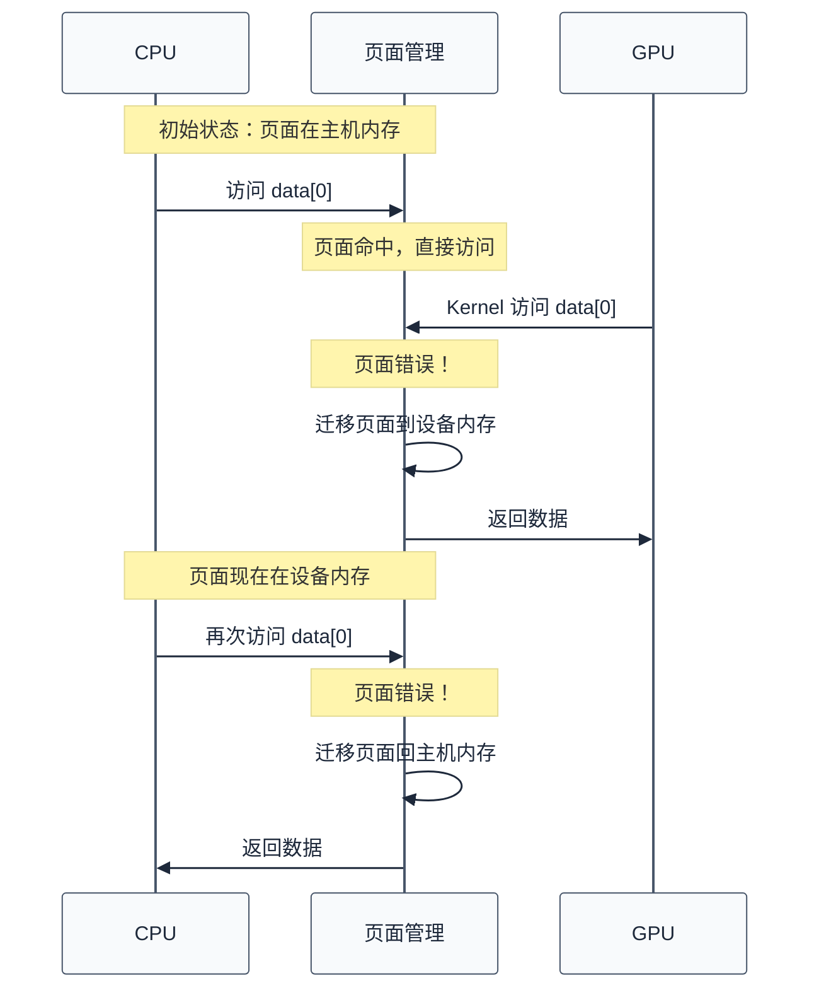

# 内存管理与地址空间

> 上一章建立了 CUDA 编程模型，理解了 Grid-Block-Thread 三层结构和内存空间映射。一个自然的问题是：如何在代码中管理这些内存？本章深入内存管理 API、统一内存、固定内存，以及带宽利用率计算。
>
> **工程师视角**：内存管理是 CUDA 性能优化的核心。理解不同内存类型的特性、API 语义、以及底层硬件映射，才能写出高效的 CUDA 程序。

### 关键术语

| 缩写 | 全称 | 含义 |
|------|------|------|
| Global Memory | — | 全局内存，显存中的主要存储区域 |
| Shared Memory | — | 共享内存，SM 内 Block 线程共享 |
| Pinned Memory | — | 固定内存，不会被交换到磁盘的主机内存 |
| Unified Memory (UM) | — | 统一内存，自动管理 CPU-GPU 数据迁移 |
| UVA | Unified Virtual Addressing | 统一虚拟地址空间 |
| H2D | Host to Device | 主机到设备的数据传输 |
| D2H | Device to Host | 设备到主机的数据传输 |
| D2D | Device to Device | 设备内的数据传输 |
| Bank Conflict | — | 共享内存的 Bank 冲突 |
| Coalesced Access | — | 合并访问，相邻线程访问相邻地址 |
| Page Fault | — | 页面错误，统一内存中的页面迁移触发 |
| Oversubscription | — | 超额订阅，分配的内存超过物理容量 |

### 3.1 前置知识

| 需要了解 | 参考文档 |
|----------|----------|
| CUDA 编程模型（Thread、Block、内存空间） | [02-CUDA编程模型](./02-CUDA编程模型.md) |
| GPU 内存层级（寄存器、共享内存、全局内存） | [01-GPU架构基础](./01-GPU架构基础.md) |
| C/C++ 内存管理（malloc/free） | — |

***

## 1. 全局内存管理

> 全局内存是 CUDA 程序中最常用的内存类型，对应显存（HBM/GDDR）。本节介绍全局内存的分配、释放、数据传输 API。

### 1.1 基本 API

**分配与释放**：

```c
// 分配设备内存
cudaError_t cudaMalloc(void **devPtr, size_t size);

// 释放设备内存
cudaError_t cudaFree(void *devPtr);
```

**语义解析**：
- `cudaMalloc`：在设备上分配 `size` 字节，返回设备指针
- `cudaFree`：释放设备内存，指针变为无效
- 返回值：`cudaSuccess` 表示成功，其他值表示错误

**具体例子**：

```c
float *d_data;
size_t size = 1000 * sizeof(float);

// 分配
cudaError_t err = cudaMalloc((void **)&d_data, size);
if (err != cudaSuccess) {
    fprintf(stderr, "cudaMalloc failed: %s\n", cudaGetErrorString(err));
    exit(EXIT_FAILURE);
}

// 使用 d_data...

// 释放
cudaFree(d_data);
```

> **核心要点**：`cudaMalloc` 和 `cudaFree` 是同步 API，会阻塞 CPU 直到操作完成。频繁调用会导致性能下降，应该尽量复用内存。

### 1.2 数据传输 API

**主机 ↔ 设备传输**：

```c
cudaError_t cudaMemcpy(void *dst, const void *src, size_t count, 
                       cudaMemcpyKind kind);
```

**参数解析**：
- `dst`：目标地址（可以是主机或设备）
- `src`：源地址（可以是主机或设备）
- `count`：传输字节数
- `kind`：传输方向
  - `cudaMemcpyHostToDevice` (H2D)：主机 → 设备
  - `cudaMemcpyDeviceToHost` (D2H)：设备 → 主机
  - `cudaMemcpyDeviceToDevice` (D2D)：设备 → 设备
  - `cudaMemcpyHostToHost` (H2H)：主机 → 主机（等同于 `memcpy`）

**语义**：`cudaMemcpy` 是**同步** API，CPU 会阻塞直到传输完成。

**具体例子**：

```c
// 主机内存
float *h_data = (float *)malloc(1000 * sizeof(float));
for (int i = 0; i < 1000; i++) {
    h_data[i] = (float)i;
}

// 设备内存
float *d_data;
cudaMalloc((void **)&d_data, 1000 * sizeof(float));

// H2D 传输（同步）
cudaMemcpy(d_data, h_data, 1000 * sizeof(float), cudaMemcpyHostToDevice);

// 执行 Kernel...

// D2H 传输（同步）
cudaMemcpy(h_data, d_data, 1000 * sizeof(float), cudaMemcpyDeviceToHost);
```

### 1.3 异步传输

**异步 API**：

```c
cudaError_t cudaMemcpyAsync(void *dst, const void *src, size_t count,
                            cudaMemcpyKind kind, cudaStream_t stream = 0);
```

**与同步版本的区别**：
- `cudaMemcpyAsync` 立即返回，CPU 不阻塞
- 传输在后台进行，与 CPU 执行并发
- 必须使用固定内存（Pinned Memory）才能真正异步
- 通过 Stream 参数控制传输顺序

**具体例子**（见第 4 节）：

```c
// 分配固定内存
float *h_data;
cudaHostAlloc((void **)&h_data, 1000 * sizeof(float), cudaHostAllocDefault);

// 创建 Stream
cudaStream_t stream;
cudaStreamCreate(&stream);

// 异步传输
cudaMemcpyAsync(d_data, h_data, size, cudaMemcpyHostToDevice, stream);

// CPU 可以继续执行其他任务...

// 等待传输完成
cudaStreamSynchronize(stream);
```

> **核心要点**：`cudaMemcpy` 是同步的，`cudaMemcpyAsync` 是异步的。异步传输需要固定内存和 Stream 才能真正并发，否则退化为同步。

***

## 2. 共享内存管理

> 共享内存是 SM 内的高速存储，Block 内线程可以共享数据。本节介绍共享内存的分配方式、Bank 冲突、以及优化技巧。

### 2.1 静态分配

**语法**：

```c
__shared__ float sharedData[256];
```

**特点**：
- 编译时确定大小
- 每个 Block 有独立的共享内存副本
- 生命周期与 Block 相同

**具体例子**：

```c
__global__ void reduceKernel(float *input, float *output, int n) {
    __shared__ float sharedData[256];
    
    int tid = threadIdx.x;
    int i = blockIdx.x * blockDim.x + threadIdx.x;
    
    // 读取数据到共享内存
    if (i < n) {
        sharedData[tid] = input[i];
    } else {
        sharedData[tid] = 0.0f;
    }
    __syncthreads();
    
    // 归约
    for (int s = blockDim.x / 2; s > 0; s >>= 1) {
        if (tid < s) {
            sharedData[tid] += sharedData[tid + s];
        }
        __syncthreads();
    }
    
    // 写入结果
    if (tid == 0) {
        output[blockIdx.x] = sharedData[0];
    }
}
```

### 2.2 动态分配

**语法**：

```c
extern __shared__ float sharedData[];
```

**启动时指定大小**：

```c
reduceKernel<<<blocks, threads, sharedMemSize>>>(input, output, n);
```

**特点**：
- 运行时确定大小
- 通过 Kernel 启动的第三个参数指定字节数
- 适合大小不固定的场景

**具体例子**：

```c
__global__ void dynamicSharedKernel(float *data) {
    extern __shared__ float sharedData[];
    
    int tid = threadIdx.x;
    sharedData[tid] = data[tid];
    __syncthreads();
    
    // 使用 sharedData...
}

// 启动：每 Block 256 线程，共享内存 256 * sizeof(float) 字节
dynamicSharedKernel<<<1, 256, 256 * sizeof(float)>>>(d_data);
```

### 2.3 Bank 冲突

**共享内存结构**：共享内存分为 32 个 Bank，每个 Bank 4 字节（32-bit）。

```
地址 0: Bank 0
地址 4: Bank 1
地址 8: Bank 2
...
地址 124: Bank 31
地址 128: Bank 0 (循环)
```

**Bank 冲突类型**：

| 访问模式 | 说明 | 性能 |
|----------|------|------|
| **无冲突** | 每个线程访问不同的 Bank | 最快，单次内存事务 |
| **单播** | 多个线程访问同一 Bank 的同一地址 | 广播，单次事务 |
| **多播冲突** | 多个线程访问同一 Bank 的不同地址 | 串行化，性能下降 |

**具体例子**：以 32×32 线程的 Block 为例（每个 Warp 32 个线程，`threadIdx.x` 在 0-31 变化，`threadIdx.y` 在 Warp 内是常数）：

```c
__shared__ float sharedData[32][32];

// 无冲突：每线程访问不同列（threadIdx.x 不同 → 不同 Bank）
float value = sharedData[threadIdx.y][threadIdx.x];

// 广播（非冲突）：所有线程访问同一地址（同一 Bank 同一地址，硬件广播）
float value = sharedData[threadIdx.y][0];  // 32 个线程读同一地址，单次事务

// 32 路冲突：threadIdx.x 在 0-31 变化，不同行同列 → 全部落到 Bank 0
float value = sharedData[threadIdx.x][0];  // 32 个线程访问 Bank 0 的不同地址
```

> **如何读这段代码**：Bank 冲突判定要抓住"同一 Warp 内 32 个线程访问的地址落到哪些 Bank"——若不同地址但同 Bank，发生冲突；若同一地址，发生广播(单次事务，非冲突)。这里 Warp 内 `threadIdx.y` 是常数、`threadIdx.x` 在 0-31 变化，因此 `sharedData[threadIdx.y][threadIdx.x]` 的第二维恰好让 32 个线程落到 32 个不同 Bank。

**如何避免 Bank 冲突？**

1. **Padding**：

```c
// 差：32 列，按列访问（threadIdx.x 在变化）时所有线程访问同一 Bank
__shared__ float sharedData[32][32];

// 好：33 列，列访问时相邻行的同列落到不同 Bank
__shared__ float sharedData[32][32 + 1];
```

2. **调整访问模式**：

```c
// 转置访问
float value = sharedData[threadIdx.x][threadIdx.y];  // 无冲突
```

> **核心要点**：共享内存的 Bank 冲突会显著降低性能。通过 Padding 或调整访问模式，可以避免冲突，最大化带宽。

***

## 3. 固定内存与零拷贝

> 固定内存（Pinned Memory）是主机内存的特殊类型，不会被交换到磁盘，支持 DMA 传输。本节介绍固定内存的分配、使用场景、以及零拷贝技术。

### 3.1 固定内存分配

**API**：

```c
cudaError_t cudaHostAlloc(void **pHost, size_t size, unsigned int flags);
```

**参数解析**：
- `pHost`：返回的主机指针
- `size`：分配字节数
- `flags`：分配标志
  - `cudaHostAllocDefault`：普通固定内存
  - `cudaHostAllocPortable`：对所有设备可见
  - `cudaHostAllocWriteCombined`：写合并内存，适合写入频繁的场景
  - `cudaHostAllocMapped`：映射到设备地址空间（零拷贝）

**释放**：

```c
cudaError_t cudaFreeHost(void *pHost);
```

**具体例子**：

```c
float *h_data;
size_t size = 1000 * sizeof(float);

// 分配固定内存
cudaHostAlloc((void **)&h_data, size, cudaHostAllocDefault);

// 使用 h_data...

// 释放
cudaFreeHost(h_data);
```

### 3.2 固定内存的优势

**与普通主机内存的对比**：

| 对比维度 | 普通主机内存 | 固定内存 |
|----------|--------------|----------|
| **可交换性** | 可以被交换到磁盘 | 不会被交换 |
| **DMA 支持** | 不支持，需要 CPU 参与 | 支持 DMA，CPU 不参与 |
| **异步传输** | 退化为同步 | 真正异步 |
| **分配速度** | 快 | 慢（需要锁定物理页面） |
| **适用场景** | 临时数据 | 频繁传输的数据 |

**为什么固定内存支持异步传输？** 普通内存可能被交换到磁盘，物理地址不固定，DMA 无法直接访问。固定内存锁定在物理内存中，DMA 可以直接访问，因此支持异步传输。

### 3.3 零拷贝 (Zero-Copy)

**概念**：固定内存映射到设备地址空间，GPU 可以直接访问主机内存，无需显式拷贝。

**API**：

```c
// 分配映射的固定内存
cudaHostAlloc((void **)&h_data, size, cudaHostAllocMapped);

// 获取设备指针
float *d_data;
cudaHostGetDevicePointer((void **)&d_data, h_data, 0);

// GPU 直接访问 d_data，实际访问的是主机内存
```

**适用场景**：
- 数据只访问一次（传输开销 > 计算开销）
- 数据量大，无法全部放入显存
- CPU 和 GPU 需要共享数据

**性能权衡**：
- **优点**：无需显式拷贝，节省传输时间
- **缺点**：通过 PCIe 访问，延迟高（约 10 微秒），带宽低（PCIe 带宽）

**具体例子**：

```c
// 适合零拷贝的场景：大数据集，只访问一次
float *h_data;
cudaHostAlloc((void **)&h_data, 1000000 * sizeof(float), cudaHostAllocMapped);

float *d_data;
cudaHostGetDevicePointer((void **)&d_data, h_data, 0);

// GPU 直接访问主机内存
processKernel<<<blocks, threads>>>(d_data);
```

> **核心要点**：固定内存支持 DMA 和异步传输，是高性能 CUDA 程序的必备。零拷贝适合"传输开销 > 计算开销"的场景，但不适合频繁访问。

***

## 4. 统一内存 (Unified Memory)

> 统一内存是 CUDA 6.0 引入的简化编程模型，自动管理 CPU-GPU 数据迁移。本节介绍统一内存的 API、页面迁移机制、以及性能特性。

### 4.1 统一内存 API

**分配**：

```c
cudaError_t cudaMallocManaged(void **devPtr, size_t size, unsigned int flags = 0);
```

**特点**：
- 返回的指针可以在 CPU 和 GPU 上同时访问
- 系统自动管理数据迁移
- 无需显式 `cudaMemcpy`

**具体例子**：

```c
// 分配统一内存
float *data;
cudaMallocManaged((void **)&data, 1000 * sizeof(float));

// CPU 访问
for (int i = 0; i < 1000; i++) {
    data[i] = (float)i;
}

// GPU 访问（自动迁移）
processKernel<<<blocks, threads>>>(data);
cudaDeviceSynchronize();

// CPU 再次访问（自动迁移回来）
for (int i = 0; i < 10; i++) {
    printf("%f\n", data[i]);
}

// 释放
cudaFree(data);
```

### 4.2 页面迁移机制

**工作原理**：



**关键概念**：
- **页面错误 (Page Fault)**：访问的页面不在当前设备，触发迁移
- **页面迁移**：在主机和设备之间移动页面（通常 2MB 或 4KB）
- **页面驻留**：页面当前所在的物理位置

### 4.3 超额订阅 (Oversubscription)

**概念**：分配的统一内存超过 GPU 物理显存容量。

**支持情况**：
- CUDA 6.0-7.5：不支持，分配大小不能超过显存
- CUDA 8.0+：支持超额订阅，系统自动换出页面

**具体例子**：

```c
// A100 40GB 显存，分配 100GB
float *data;
cudaMallocManaged((void **)&data, 100 * 1024 * 1024 * 1024LL);

// 系统会自动管理页面换入换出
```

**性能影响**：
- 频繁换入换出会导致性能下降（类似操作系统的抖动）
- 适合"数据访问局部性好"的场景

### 4.4 统一内存 vs 显式内存管理

**对比表格**：

| 对比维度 | 统一内存 | 显式内存管理 |
|----------|----------|--------------|
| **编程复杂度** | 低（无需手动拷贝） | 高（需要管理 H2D/D2H） |
| **性能** | 中等（页面迁移开销） | 高（可控的传输） |
| **适用场景** | 快速原型、小数据 | 高性能计算、大数据 |
| **内存限制** | 可超额订阅 | 受限于显存容量 |
| **调试难度** | 高（页面迁移不透明） | 低（明确的传输点） |

**选择建议**：
- **统一内存**：快速原型验证、数据量小、访问模式简单
- **显式管理**：性能敏感、数据量大、需要精细控制

> **核心要点**：统一内存简化了编程，但引入了页面迁移开销。性能敏感的应用应该使用显式内存管理，配合固定内存和异步传输。

***

## 5. 带宽利用率计算

> 内存带宽是 CUDA 性能的关键瓶颈。本节介绍如何计算理论带宽、实际带宽、以及带宽利用率。

### 5.1 理论带宽

**公式**：

$$
\text{理论带宽} = \text{显存有效频率} \times \text{显存位宽} / 8
$$

- $\text{显存有效频率}$：单位 Hz。HBM/GDDR 是 DDR(Double Data Rate) 内存,在时钟的上升沿和下降沿各传输一次,有效频率是物理时钟频率的 2 倍
- $\text{显存位宽}$：单位 bit。一次传输的数据位数,A100 是 5120-bit(即 5 个 HBM2e stack,每 stack 1024-bit)
- $/8$：将 bit 换算为 Byte(1 Byte = 8 bit)

**数值演算**(以 A100 40GB 版本为例,数据来自 A100 白皮书 §4):

1. HBM2e 物理时钟频率 = 1.215 GHz
2. DDR 双沿触发 → 有效频率 = 1.215 × 2 = 2.43 GHz = $2.43 \times 10^9$ Hz
3. 显存位宽 = 5120 bit
4. 每秒传输位数 = $2.43 \times 10^9 \times 5120 = 1.244 \times 10^{13}$ bit/s
5. 换算为 Byte = $1.244 \times 10^{13} / 8 = 1.555 \times 10^{12}$ B/s
6. 换算为 GB/s = $1.555 \times 10^{12} / 10^9 \approx 1555$ GB/s

$$
\text{理论带宽} = 2.43 \times 10^9 \times 5120 / 8 \approx 1555 \text{ GB/s}
$$

> A100 80GB 版本因采用更高频率的 HBM2e,带宽可达 2039 GB/s;H100 用 HBM3,带宽达 3350 GB/s。

### 5.2 实际带宽

**测量方法**：

```c
__global__ void bandwidthKernel(float *data, int n) {
    int i = blockIdx.x * blockDim.x + threadIdx.x;
    if (i < n) {
        data[i] = data[i] * 2.0f;  // 读 + 写
    }
}

// 测量
cudaEvent_t start, stop;
cudaEventCreate(&start);
cudaEventCreate(&stop);

cudaEventRecord(start);
bandwidthKernel<<<blocks, threads>>>(d_data, n);
cudaEventRecord(stop);
cudaEventSynchronize(stop);

float milliseconds = 0;
cudaEventElapsedTime(&milliseconds, start, stop);

// 计算带宽
size_t bytes = 2 * n * sizeof(float);  // 读 + 写
float bandwidth = bytes / (milliseconds / 1000.0f) / 1e9;  // GB/s
printf("Achieved bandwidth: %.2f GB/s\n", bandwidth);
```

### 5.3 带宽利用率

**公式**：

$$
\text{带宽利用率} = \frac{\text{实际带宽}}{\text{理论带宽}} \times 100\%
$$

- $\text{实际带宽}$：单位 GB/s。由 Kernel 测量得到(读写字节数 / Kernel 执行时间)
- $\text{理论带宽}$：单位 GB/s。由显存物理参数计算得到(见 §5.1)
- $\times 100\%$：换算为百分比

**具体例子**：
- 理论带宽：1555 GB/s (A100 40GB)
- 实测带宽：1400 GB/s
- 带宽利用率 = $1400 / 1555 \times 100\% \approx 90\%$

**影响因素**：
- **合并访问**：相邻线程访问相邻地址，利用率高
- **非合并访问**：步长访问，利用率低
- **Bank 冲突**：共享内存冲突，降低有效带宽
- **内存事务大小**：GPU 以 32 字节或 128 字节为单位传输

### 5.4 合并访问优化

**具体例子**：

```c
// 好：合并访问（步长 1）
__global__ void coalescedKernel(float *data) {
    int i = blockIdx.x * blockDim.x + threadIdx.x;
    data[i] = data[i] * 2.0f;
}

// 差：非合并访问（步长 32）
__global__ void uncoalescedKernel(float *data) {
    int i = blockIdx.x * blockDim.x + threadIdx.x;
    data[i * 32] = data[i * 32] * 2.0f;
}
```

**性能对比**（A100）：
- 合并访问：1400 GB/s（90% 利用率）
- 非合并访问（步长 32）：50 GB/s（3% 利用率）

> **核心要点**：合并访问是 CUDA 内存优化的基础。相邻线程应该访问相邻地址，最大化带宽利用率。

***

## 6. 内存管理最佳实践

> 理解了内存管理的 API 和原理后，本节总结工程实践中的最佳实践。

### 6.1 内存分配策略

**原则**：减少分配次数，复用内存。

**具体例子**：

```c
// 差：每次循环都分配
for (int iter = 0; iter < 100; iter++) {
    float *d_data;
    cudaMalloc((void **)&d_data, size);
    // 使用 d_data...
    cudaFree(d_data);
}

// 好：分配一次，复用
float *d_data;
cudaMalloc((void **)&d_data, size);
for (int iter = 0; iter < 100; iter++) {
    // 使用 d_data...
}
cudaFree(d_data);
```

### 6.2 数据传输优化

**原则**：使用异步传输，重叠计算和传输。

**具体例子**：

```c
// 使用双缓冲，重叠传输和计算
float *h_data[2], *d_data[2];
cudaStream_t stream[2];

for (int i = 0; i < 2; i++) {
    cudaHostAlloc((void **)&h_data[i], size, cudaHostAllocDefault);
    cudaMalloc((void **)&d_data[i], size);
    cudaStreamCreate(&stream[i]);
}

for (int iter = 0; iter < 100; iter++) {
    int current = iter % 2;
    int next = (iter + 1) % 2;
    
    // 异步传输当前批次
    cudaMemcpyAsync(d_data[current], h_data[current], size,
                    cudaMemcpyHostToDevice, stream[current]);
    
    // 执行 Kernel（与传输重叠）
    kernel<<<blocks, threads, 0, stream[current]>>>(d_data[current]);
    
    // 异步传输下一批次（与计算重叠）
    cudaMemcpyAsync(d_data[next], h_data[next], size,
                    cudaMemcpyHostToDevice, stream[next]);
}
```

### 6.3 共享内存使用

**原则**：合理使用共享内存，避免 Bank 冲突。

**具体例子**：

```c
// 矩阵分块乘法
__global__ void matMulKernel(float *A, float *B, float *C, int width) {
    __shared__ float As[TILE_SIZE][TILE_SIZE + 1];  // Padding 避免 Bank 冲突
    __shared__ float Bs[TILE_SIZE][TILE_SIZE + 1];
    
    int bx = blockIdx.x, by = blockIdx.y;
    int tx = threadIdx.x, ty = threadIdx.y;
    
    int aBegin = width * TILE_SIZE * by;
    int aEnd = aBegin + width - 1;
    int aStep = TILE_SIZE;
    
    int bBegin = TILE_SIZE * bx;
    int bStep = TILE_SIZE * width;
    
    float Csub = 0.0f;
    
    for (int a = aBegin, b = bBegin; a <= aEnd; a += aStep, b += bStep) {
        // 加载数据到共享内存
        As[ty][tx] = A[a + width * ty + tx];
        Bs[ty][tx] = B[b + width * ty + tx];
        __syncthreads();
        
        // 计算
        for (int k = 0; k < TILE_SIZE; k++) {
            Csub += As[ty][k] * Bs[k][tx];
        }
        __syncthreads();
    }
    
    // 写回结果
    C[width * TILE_SIZE * by + TILE_SIZE * bx + width * ty + tx] = Csub;
}
```

### 6.4 内存泄漏检测

**工具**：`compute-sanitizer`

```bash
# 检测越界访问、内存泄漏
compute-sanitizer --tool memcheck ./my_program

# 启用泄漏检测
compute-sanitizer --tool memcheck --leak-check yes ./my_program

# 检测未初始化内存读取
compute-sanitizer --tool initcheck ./my_program

# 检测数据竞争
compute-sanitizer --tool racecheck ./my_program
```

**常见错误**：
- 忘记 `cudaFree`
- 数组越界
- 使用已释放的指针

> **核心要点**：内存管理是 CUDA 性能优化的核心。减少分配次数、使用异步传输、合理使用共享内存、避免 Bank 冲突，是工程实践中的关键技巧。

***

## 参考资料

- [CUDA C Programming Guide §5. Memory Hierarchy](https://docs.nvidia.com/cuda/cuda-c-programming-guide/index.html#memory-hierarchy) — 参考了 §5.1-5.4 内存类型和特性
- [CUDA C Programming Guide §3.2.2. Unified Memory](https://docs.nvidia.com/cuda/cuda-c-programming-guide/index.html#unified-memory) — 参考了统一内存机制
- [CUDA Runtime API Reference](https://docs.nvidia.com/cuda/cuda-runtime-api/) — 参考了内存管理 API

***

**上一篇**：[02-CUDA编程模型](./02-CUDA编程模型.md)
**下一篇**：[04-执行模型与同步机制](./04-执行模型与同步机制.md) — 深入异步执行、Stream、Event、协作组
