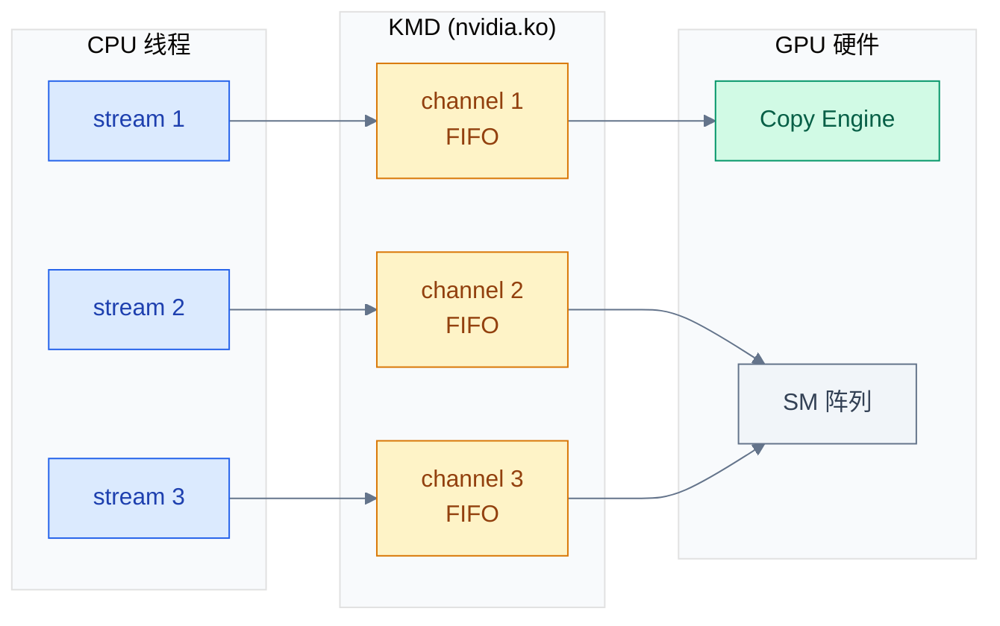

```mermaid
%%{init: {"theme": "base", "themeVariables": {"primaryColor": "#f8fafc", "primaryTextColor": "#1e293b", "primaryBorderColor": "#475569", "lineColor": "#64748b", "secondaryColor": "#f1f5f9", "secondaryBorderColor": "#94a3b8", "tertiaryColor": "#f8fafc", "fontFamily": "\"trebuchet ms\", verdana, arial, sans-serif"}}}%%
gantt
    title CPU-GPU 并发执行时间线
    dateFormat X
    axisFormat %s
    
    section CPU
    分配内存        :0, 1
    等待传输 H2D    :crit, 1, 3
    启动 Kernel     :2, 3
    等待传输 D2H    :crit, 5, 7
    
    section GPU
    传输 H2D        :1, 3
    执行 Kernel     :3, 5
    传输 D2H        :5, 7
```

```mermaid
%%{init: {"theme": "base", "themeVariables": {"primaryColor": "#f8fafc", "primaryTextColor": "#1e293b", "primaryBorderColor": "#475569", "lineColor": "#64748b", "secondaryColor": "#f1f5f9", "secondaryBorderColor": "#94a3b8", "tertiaryColor": "#f8fafc", "fontFamily": "\"trebuchet ms\", verdana, arial, sans-serif"}}}%%
gantt
    title 单流串行执行
    dateFormat X
    axisFormat %s
    
    section Stream
    Kernel 1  :0, 10
    Kernel 2  :10, 20
    Kernel 3  :20, 30
```

```mermaid
%%{init: {"theme": "base", "themeVariables": {"primaryColor": "#f8fafc", "primaryTextColor": "#1e293b", "primaryBorderColor": "#475569", "lineColor": "#64748b", "secondaryColor": "#f1f5f9", "secondaryBorderColor": "#94a3b8", "tertiaryColor": "#f8fafc", "fontFamily": "\"trebuchet ms\", verdana, arial, sans-serif"}}}%%
gantt
    title 计算与传输重叠
    dateFormat X
    axisFormat %s
    
    section CPU
    准备数据 0    :0, 5
    准备数据 1    :10, 15
    准备数据 2    :20, 25
    
    section Stream 0
    传输 H2D 0    :0, 5
    Kernel 0      :5, 15
    传输 D2H 0    :15, 20
    
    section Stream 1
    传输 H2D 1    :10, 15
    Kernel 1      :15, 25
    传输 D2H 1    :25, 30
```

# 执行模型与同步机制

> 前三章建立了 GPU 硬件基础、编程模型和内存管理。一个自然的问题是：CPU 和 GPU 如何协同工作？如何控制多个任务的执行顺序？本章深入异步执行模型、Stream、Event、协作组等同步机制。
>
> **工程师视角**：CUDA 的异步执行模型是性能优化的关键。理解 Stream 和 Event 的语义，才能实现计算与传输的重叠、多流并发，最大化 GPU 利用率。

### 关键术语

| 缩写 | 全称 | 含义 |
|------|------|------|
| Stream | — | 流，CUDA 中的任务队列，流内任务按顺序执行 |
| Event | — | 事件，用于流间同步和计时 |
| Default Stream | — | 默认流（Stream 0），同步流 |
| Concurrent Kernel | — | 并发 Kernel，多个 Kernel 同时执行 |
| Cooperative Groups | — | 协作组，CUDA 9.0 引入的同步原语 |
| cudaDeviceSynchronize | — | 等待所有 GPU 任务完成 |
| cudaStreamSynchronize | — | 等待指定流的所有任务完成 |
| cudaStreamWaitEvent | — | 流等待事件完成 |
| Occupancy | — | SM 中活跃 Warp 数与最大 Warp 数的比值 |
| Latency Hiding | — | 延迟隐藏，用多线程隐藏内存访问延迟 |
| FE | Front End | GPU 前端单元，从 ring buffer 取任务描述符并分发到 SM |
| KMD | Kernel Mode Driver | 内核态驱动（`nvidia.ko`），管理硬件资源与 ioctl 调度 |
| Ring Buffer | — | 硬件任务队列，CPU 写入 descriptor、GPU FE 取出执行 |
| PTE | Page Table Entry | 页表项，描述虚拟地址到物理页的映射 |
| Scoreboard | — | SM 内硬件单元，跟踪 Warp 寄存器依赖与指令完成状态 |
| Launch Descriptor | — | 任务描述符，包含 function/grid/block/参数地址等 Kernel 启动信息 |
| Channel | — | GPU 硬件通道，每个 stream 对应一个 channel，FIFO 队列结构 |
| Copy Engine (CE) | — | GPU 内独立的内存传输引擎，与 SM 计算单元并行工作 |
| FIFO | First In First Out | 先进先出队列，stream 内任务按提交顺序执行的核心机制 |

### 前置知识

| 需要了解 | 参考文档 |
|----------|----------|
| CUDA 编程模型（Kernel、Thread、Block） | [02-CUDA编程模型](./02-CUDA编程模型.md) |
| 内存管理（cudaMalloc、cudaMemcpy） | [03-内存管理与地址空间](./03-内存管理与地址空间.md) |
| C/C++ 多线程基础 | — |

***

## 1. 异步执行模型

> CPU 和 GPU 是两个独立的处理器，CUDA 的异步执行模型允许它们并发工作。本节介绍 Kernel 启动和内存传输的异步语义。

### 1.1 Kernel 启动的异步语义

**默认行为**：Kernel 启动是**异步**的，CPU 调用 Kernel 后立即返回，不等待 GPU 执行完成。

```c
// CPU 启动 Kernel
myKernel<<<blocks, threads>>>(args);

// CPU 立即继续执行下一行
printf("Kernel launched!\n");

// GPU 在后台执行 Kernel
```

**为什么这样设计？** 如果 Kernel 启动是同步的，CPU 必须等待 GPU 执行完成（可能几毫秒到几秒），期间 CPU 空闲。异步启动允许 CPU 继续准备下一批数据或启动其他任务，提高整体吞吐量。

**具体例子**：

```c
// 启动多个 Kernel，GPU 依次执行
kernel1<<<blocks, threads>>>(args1);
kernel2<<<blocks, threads>>>(args2);
kernel3<<<blocks, threads>>>(args3);

// CPU 不等待，立即返回
// GPU 按顺序执行 kernel1 → kernel2 → kernel3
```

**注意**：虽然 CPU 不等待，但同一个 Stream 内的 Kernel 是**串行**的。如果需要并发执行多个 Kernel，需要使用不同的 Stream（见第 3 节）。

#### 1.1.1 异步启动的硬件 dispatch 路径

**本质先行**：Kernel 启动异步不是 API 选择，而是硬件 dispatch 队列的直接映射——CPU 把任务描述符提交到 GPU 的硬件 work queue 后立即返回，GPU 前端 (FE, Front End) 单元从队列取描述符、分发到 SM，整个过程 CPU 不阻塞。

**硬件 dispatch 路径**（基于公开的 NVIDIA driver 架构 + 标准 GPU command buffer 模式推断）：

```mermaid
%%{init: {"theme": "base", "themeVariables": {"primaryColor": "#f8fafc", "primaryTextColor": "#1e293b", "primaryBorderColor": "#475569", "lineColor": "#64748b", "secondaryColor": "#f1f5f9", "secondaryBorderColor": "#94a3b8", "tertiaryColor": "#f8fafc", "fontFamily": "\"trebuchet ms\", verdana, arial, sans-serif"}}}%%
flowchart LR
    CPU["CPU<br/>cuLaunchKernel"] -->|"ioctl"| KMD["KMD<br/>nvidia.ko"]
    KMD -->|"写入"| RB["Ring Buffer<br/>per-channel"]
    RB -->|"FE 取 descriptor"| FE["GPU Front End"]
    FE -->|"分发"| SM["SM 阵列"]
    
    style CPU fill:#dbeafe,stroke:#2563eb,color:#1e40af
    style KMD fill:#fef3c7,stroke:#d97706,color:#92400e
    style RB fill:#cffafe,stroke:#0891b2,color:#155e75
    style FE fill:#d1fae5,stroke:#059669,color:#065f46
    style SM fill:#f1f5f9,stroke:#64748b,color:#334155
```



**5 步 dispatch 路径**：

1. CPU 调用 `cuLaunchKernel` → libcuda 组装 launch descriptor（含 function pointer、grid/block 维度、参数地址、共享内存大小）
2. libcuda 通过 `ioctl` 把 descriptor 提交到 KMD (nvidia.ko)
3. KMD 把 descriptor 写入 per-channel 的 ring buffer（每个 stream 对应一个 channel）
4. GPU Front End (FE) 通过 PCIe doorbell 感知新任务 → 从 ring buffer 取 descriptor
5. FE 把任务分发到空闲 SM，SM 启动 warp 执行

**为什么 CPU 不阻塞？** 关键在 ring buffer 是异步队列——CPU 写完 descriptor 即返回，不等 GPU 取走。GPU FE 按提交顺序取 descriptor 并执行，保证同 stream 内 Kernel 串行。Launch queue 深度受 KMD channel 容量限制，实践中约 1024 个 pending 任务（参考 CUDA C Programming Guide §3.2.6 "Stream and Event Management"），只要队列未满，CPU 可连续提交。

**源码证据**——`simpleStreams.cu` 一次性提交 `nstreams × nreps × 2` 个任务，CPU 立即返回：

```c
/* 摘自 [src/cuda-samples/cpp/0_Introduction/simpleStreams/simpleStreams.cu](./src/cuda-samples/cpp/0_Introduction/simpleStreams/simpleStreams.cu) 第 378-395 行 */
for (int k = 0; k < nreps; k++) {
    for (int i = 0; i < nstreams; i++) {
        init_array<<<blocks, threads, 0, streams[i]>>>(d_a + i * n / nstreams, d_c, niterations);
    }
    for (int i = 0; i < nstreams; i++) {
        checkCudaErrors(cudaMemcpyAsync(hAligned_a + i * n / nstreams,
                                        d_a + i * n / nstreams,
                                        nbytes / nstreams,
                                        cudaMemcpyDeviceToHost,
                                        streams[i]));
    }
}
/* CPU 立即返回，所有任务已在 ring buffer 中排队 */
```

**这段代码体现了什么设计决策？** 异步 launch 让 CPU 在几微秒内提交上千个任务，远超 Kernel 实际执行时间——这是双缓冲 (double buffering) 与多流并发优化的硬件基础。若 launch 是同步的，CPU 必须等每个 Kernel 完成才能提交下一个，GPU 利用率会被 CPU 串行化拖垮。

**何时会"假同步"？** 两种情况会让异步 launch 退化为同步：

1. **Launch queue 已满**：CPU 提交速度过快，GPU 来不及消费，ring buffer 写满 → libcuda 阻塞 CPU 直到 FE 取走一个 entry
2. **资源不足**：Kernel 需要的寄存器/共享内存超过 SM 容量，FE 无法立即分发到 SM → 任务在 queue 中等待

> **核心要点**：Kernel 启动异步是硬件 dispatch 队列的直接映射——CPU 提交 descriptor 到 ring buffer 后立即返回，GPU FE 按序执行。这让 CPU 能在几微秒内提交上千任务，是双缓冲与多流并发优化的硬件基础。

### 1.2 内存传输的异步语义

**同步版本**：`cudaMemcpy` 是同步的，CPU 等待传输完成。

```c
cudaMemcpy(d_data, h_data, size, cudaMemcpyHostToDevice);
// CPU 阻塞，等待传输完成
printf("Transfer complete!\n");
```

**异步版本**：`cudaMemcpyAsync` 是异步的，CPU 立即返回。

```c
cudaMemcpyAsync(d_data, h_data, size, cudaMemcpyHostToDevice, stream);
// CPU 立即返回，不等待
printf("Transfer started!\n");
// GPU 在后台传输数据
```

**关键约束**：
- `cudaMemcpyAsync` 必须使用**固定内存**（Pinned Memory）才能真正异步
- 如果使用普通主机内存，会退化为同步传输
- 必须指定 Stream 参数（默认为 0）

### 1.3 CPU-GPU 并发执行时间线

**具体例子**：分析以下代码的执行时间线：

```c
// 1. 分配内存
cudaMalloc((void **)&d_data, size);

// 2. 同步传输 H2D
cudaMemcpy(d_data, h_data, size, cudaMemcpyHostToDevice);

// 3. 启动 Kernel
myKernel<<<blocks, threads>>>(d_data);

// 4. 同步传输 D2H
cudaMemcpy(h_data, d_data, size, cudaMemcpyDeviceToHost);
```



**如何读这张图**：
- CPU 启动传输后阻塞，等待 GPU 完成传输
- GPU 完成传输后执行 Kernel
- Kernel 完成后，CPU 启动 D2H 传输并再次阻塞
- 总时间 = 传输 H2D + Kernel 执行 + 传输 D2H

**问题**：CPU 在等待传输时空闲，GPU 在执行 Kernel 时 CPU 也空闲。如何优化？

**答案**：使用异步传输和 Stream，重叠 CPU 和 GPU 的工作（见第 3 节）。

> **核心要点**：CUDA 的异步执行模型允许 CPU 和 GPU 并发工作，但同步 API 会阻塞 CPU。使用异步 API 和 Stream 可以最大化利用率。

***

## 2. 同步原语

> 异步执行带来了性能，但也引入了同步问题：如何确保数据已经传输完成？如何确保 Kernel 执行完毕？本节介绍 CUDA 的同步机制。

### 2.1 cudaDeviceSynchronize

**功能**：等待**所有** GPU 任务完成（所有 Stream 的 Kernel 和传输）。

```c
myKernel<<<blocks, threads>>>(args);
cudaDeviceSynchronize();
// 确保 Kernel 执行完成
printf("Kernel finished!\n");
```

**语义**：
- 阻塞 CPU，直到所有 GPU 任务完成
- 等价于对所有 Stream 调用 `cudaStreamSynchronize`
- 通常用于确保结果可用（如 D2H 传输前）

**使用场景**：
- 计时（确保 Kernel 执行完毕）
- 验证结果（确保计算完成）
- 错误检查（捕获异步错误）

### 2.2 cudaStreamSynchronize

**功能**：等待**指定 Stream** 的所有任务完成。

```c
cudaStream_t stream;
cudaStreamCreate(&stream);

myKernel<<<blocks, threads, 0, stream>>>(args);
cudaStreamSynchronize(stream);
// 确保该 Stream 的任务完成
printf("Stream finished!\n");
```

**语义**：
- 阻塞 CPU，直到指定 Stream 的所有任务完成
- 不影响其他 Stream
- 比 `cudaDeviceSynchronize` 更精细

### 2.3 隐式同步点

**某些 API 会隐式同步**：

```c
// 同步 API（会阻塞 CPU）
cudaMemcpy(...);              // 同步传输
cudaDeviceSynchronize();      // 显式同步
cudaStreamSynchronize(...);   // 显式同步

// 异步 API（不阻塞 CPU）
cudaMemcpyAsync(...);         // 异步传输
kernel<<<..., stream>>>(...); // 异步启动
```

**注意**：某些操作会**隐式同步当前上下文的所有未完成 Stream 任务**:
- `cudaMalloc` / `cudaFree`:释放内存会等待同一上下文中所有未完成 Kernel 完成(参考 CUDA C Programming Guide §3.2.7)。原因:Driver 必须确保没有 Kernel 还在使用待释放的内存
- `cudaDeviceReset`:销毁整个 primary context,等价于销毁所有 Stream/Event/Memory 句柄
- 阻塞式同步 API(`cudaMemcpy` 同步版本、`cudaEventSynchronize` with blocking sync)

#### 2.3.1 隐式同步的硬件页表保护机制

**本质先行**：`cudaFree` 必须等待所有 Kernel 完成不是 API 设计选择，而是硬件页表保护的必然结果——Driver 维护 per-context "内存使用集合"，记录每个 device pointer 被哪些 Kernel 引用；释放前必须等所有引用了该 pointer 的 Kernel 完成才能从 GPU 页表中删除 entry，否则后续 Kernel 会访问已被释放的物理页。

**为什么不"标记 dirty"而必须同步？** 三个层面的约束：

1. **硬件约束**：GPU 的 page table entry (PTE) 删除是即时的——一旦删除，后续访问该 VA 会触发 page fault。但若正在执行的 Kernel 还在持有该 VA 的引用（指令中的地址在 TLB 中缓存），删除 PTE 会让 Kernel 异常退出。Driver 必须 drain SM 上所有活跃 warp。
2. **Driver 约束**：Driver 内部维护 "VA → (Kernel, Stream)" 依赖图，每个 launch descriptor 提交时记录所引用的 device pointer 集合。`cudaFree(ptr)` 触发反向查找 → 等所有引用 ptr 的 Kernel 完成 → 才能回收物理页。
3. **跨 stream 同步**：依赖图跨所有 stream——Kernel A 在 stream 0、Kernel B 在 stream 1 都引用 ptr → `cudaFree(ptr)` 必须等 A 和 B 都完成，即使 stream 0/1 之间无数据依赖（参考 CUDA C Programming Guide §3.2.4.4 "Implicit Synchronization"）。

**源码证据**——`ptxjit.cpp` 展示了"cleanup 时 cudaFree 隐式等待"的标准模式：

```c
/* 摘自 [src/cuda-samples/cpp/3_CUDA_Features/ptxjit/ptxjit.cpp](./src/cuda-samples/cpp/3_CUDA_Features/ptxjit/ptxjit.cpp) 第 231-244 行 */
// Cleanup
if (d_data) {
    checkCudaErrors(cudaFree(d_data));   // 隐式等待所有引用 d_data 的 Kernel 完成
    d_data = 0;
}
if (h_data) {
    free(h_data);
    h_data = 0;
}
if (hModule) {
    checkCudaErrors(cuModuleUnload(hModule));  // 隐式等待所有该 module 的 Kernel 完成
    hModule = 0;
}
```

`UnifiedMemoryStreams.cu` 在 Task 类析构函数中先 `cudaDeviceSynchronize` 再 `cudaFree`，让隐式同步显式可见：

```c
/* 摘自 [src/cuda-samples/cpp/0_Introduction/UnifiedMemoryStreams/UnifiedMemoryStreams.cu](./src/cuda-samples/cpp/0_Introduction/UnifiedMemoryStreams/UnifiedMemoryStreams.cu) 第 88-95 行 */
~Task()
{
    // ensure all memory is deallocated
    checkCudaErrors(cudaDeviceSynchronize());  // 显式同步，避免 cudaFree 内部阻塞
    checkCudaErrors(cudaFree(data));
    checkCudaErrors(cudaFree(result));
    checkCudaErrors(cudaFree(vector));
}
```

**这段代码体现了什么设计决策？** `cudaFree(d_data)` 的"隐式等待"特性让 cleanup 代码无需显式同步就能正确——但代价是性能：若 `cudaFree` 与未完成 Kernel 在不同 stream 上，整个 context 都会被 drain。最佳实践是在 cleanup 前先 `cudaDeviceSynchronize` 让等待显式可见（如 `UnifiedMemoryStreams.cu` 所做），便于性能分析定位阻塞点。

> **核心要点**：`cudaFree` 触发隐式同步不是 API 妥协而是硬件页表保护的必然——PTE 删除是即时的，但正在执行的 Kernel 仍持有 VA 引用，Driver 必须 drain 所有引用了待释放内存的 Kernel 才能安全删除 PTE。这是"VA 释放必须等待引用清除"的硬件-软件协同。

> 建议参考 CUDA C Programming Guide §3.2.7 "Unmapped Memory" 和 §3.2.4.4 "Implicit Synchronization" 了解细节。

> **核心要点**：CUDA 提供多级同步原语：`cudaDeviceSynchronize`（全局）、`cudaStreamSynchronize`（流级）、`cudaEventSynchronize`（事件级）。选择合适的粒度，避免过度同步。

***

## 3. Stream（流）

> Stream 是 CUDA 中的任务队列，流内任务按顺序执行，不同流的任务可以并发。本节先讲 Stream 的硬件本质（FIFO work queue 与三种同步策略），再介绍使用方法与并发优化。

### 3.1 Stream 的硬件本质：FIFO Work Queue

**本质先行**：Stream 不是软件抽象，而是 GPU 硬件 work queue（channel）的封装——每个 stream 对应一个独立的硬件 channel，CPU 提交的 Kernel/Memcpy 任务以 FIFO 顺序进入 channel，GPU FE 按提交顺序取出执行。FIFO 顺序保证可预测性 + 避免数据竞争——开发者无需显式同步即可保证同 stream 内任务的执行顺序。

**Stream 的硬件映射**（参考 CUDA C Programming Guide §3.2.6 "Stream and Event Management"）：



**为什么是 FIFO？三个设计动机**：

1. **可预测性**：开发者提交 `kernelA → kernelB`，期望 B 在 A 之后执行。FIFO 保证这一点——无需显式同步即可推断执行顺序。
2. **避免数据竞争**：若 stream 内任务乱序执行，后提交的 Kernel 可能读到前一个 Kernel 未写完的数据。FIFO 让"提交顺序 = 执行顺序 = 数据可见顺序"。
3. **硬件简化**：FIFO 是最简单的队列结构——CPU 写入尾指针、GPU 读取头指针，无需复杂调度算法。这让 channel 的硬件实现极简，延迟低。

**不同 stream 对应不同 engine**：GPU 有两类执行单元——Copy Engine (CE) 负责内存传输，SM 阵列负责 Kernel 计算。stream 提交的任务类型决定路由到哪个 engine。多 stream 并发的本质是"CE 与 SM 并行" + "多个 SM 上不同 stream 的 Kernel 并行"。

**三种同步策略**（`cudaSetDeviceFlags`，参考 CUDA C Programming Guide §3.5 "Event and Stream Synchronization"）：

| Flag | CPU 行为 | 延迟 | CPU 占用 | 适用场景 |
|------|----------|------|----------|----------|
| `cudaDeviceScheduleAuto` | Driver 自动选择 | 中 | 中 | 默认，通用 |
| `cudaDeviceScheduleSpin` | 自旋等待（busy-wait） | 最低 | 100% | 低延迟，CPU 专用于等待 |
| `cudaDeviceScheduleYield` | 让出 CPU 给其他线程 | 低 | 中 | 多线程共享 CPU |
| `cudaDeviceScheduleBlockingSync` | 阻塞（OS 调度） | 高 | 0% | 后台任务，CPU 节能 |

> **如何读这张表**：同步策略是"延迟 vs CPU 占用"的权衡——Spin 延迟最低但 CPU 100% 占用（自旋不让出），BlockingSync CPU 0% 占用但延迟最高（OS 调度唤醒开销）。Yield 是折中——主动让出 CPU 但保留 runnable 状态，比 BlockingSync 快，比 Spin 省 CPU。

**源码证据**——`simpleStreams.cu` 展示了同步策略的选择与设置：

```c
/* 摘自 [src/cuda-samples/cpp/0_Introduction/simpleStreams/simpleStreams.cu](./src/cuda-samples/cpp/0_Introduction/simpleStreams/simpleStreams.cu) 第 51-58 行 */
const char *sDeviceSyncMethod[] = {"cudaDeviceScheduleAuto",
                                   "cudaDeviceScheduleSpin",
                                   "cudaDeviceScheduleYield",
                                   "INVALID",
                                   "cudaDeviceScheduleBlockingSync",
                                   NULL};

/* 摘自 [src/cuda-samples/cpp/0_Introduction/simpleStreams/simpleStreams.cu](./src/cuda-samples/cpp/0_Introduction/simpleStreams/simpleStreams.cu) 第 295-296 行 */
checkCudaErrors(cudaSetDeviceFlags(device_sync_method | (bPinGenericMemory ? cudaDeviceMapHost : 0)));
```

**这段代码体现了什么设计决策？** CUDA 把"CPU 如何等待 GPU 完成"的策略交给开发者——延迟敏感型应用用 Spin（自旋抢占 CPU），节能型应用用 BlockingSync（让出 CPU 给其他任务）。这是 GPU 异步模型与 OS 调度协同的关键设计点。

> **核心要点**：Stream 是 GPU 硬件 channel 的封装——FIFO 顺序保证可预测性与数据竞争避免。多 stream 并发的本质是不同 channel 路由到不同 engine（CE/SM）。`cudaSetDeviceFlags` 的三种同步策略让开发者在延迟与 CPU 占用之间权衡。

### 3.2 Stream 的基本概念

**定义**：Stream 是一个任务队列，任务按提交顺序执行。

**默认 Stream**：Stream 0（或 `cudaStreamLegacy`），同步流。

**创建与销毁**：

```c
cudaStream_t stream;
// cudaStreamCreate 在 CUDA 11+ 已软弃用(默认与 NULL stream 同步),推荐显式指定 flag
cudaStreamCreateWithFlags(&stream, cudaStreamNonBlocking);  // 创建非阻塞流
cudaStreamDestroy(stream);      // 销毁
```

> `cudaStreamNonBlocking` 流不与 NULL stream(Legacy 默认流)同步,适合多流并发场景;若用旧版 `cudaStreamCreate`,流会与 NULL stream 互锁,降低并发性能。

**非默认 Stream**：异步流，可以并发执行。

### 3.3 Stream 的使用

**Kernel 启动**：

```c
myKernel<<<blocks, threads, 0, stream>>>(args);
```

**内存传输**：

```c
cudaMemcpyAsync(d_data, h_data, size, cudaMemcpyHostToDevice, stream);
```

**具体例子**：

```c
cudaStream_t stream1, stream2;
cudaStreamCreate(&stream1);
cudaStreamCreate(&stream2);

// Stream 1 的任务
kernel1<<<blocks, threads, 0, stream1>>>(args1);
cudaMemcpyAsync(d_data1, h_data1, size, cudaMemcpyHostToDevice, stream1);

// Stream 2 的任务
kernel2<<<blocks, threads, 0, stream2>>>(args2);
cudaMemcpyAsync(d_data2, h_data2, size, cudaMemcpyHostToDevice, stream2);

// Stream 1 和 Stream 2 的任务可以并发执行
```

### 3.4 多流并发执行

**时间线分析**：

```c
// 单流：串行执行
cudaStream_t stream;
cudaStreamCreate(&stream);

kernel1<<<blocks, threads, 0, stream>>>(args1);  // 10ms
kernel2<<<blocks, threads, 0, stream>>>(args2);  // 10ms
kernel3<<<blocks, threads, 0, stream>>>(args3);  // 10ms

// 总时间：30ms
```



```c
// 多流：并发执行
cudaStream_t stream1, stream2, stream3;
cudaStreamCreate(&stream1);
cudaStreamCreate(&stream2);
cudaStreamCreate(&stream3);

kernel1<<<blocks, threads, 0, stream1>>>(args1);  // 10ms
kernel2<<<blocks, threads, 0, stream2>>>(args2);  // 10ms
kernel3<<<blocks, threads, 0, stream3>>>(args3);  // 10ms

// 总时间：10ms（理想情况）
```



```mermaid
%%{init: {"theme": "base", "themeVariables": {"primaryColor": "#f8fafc", "primaryTextColor": "#1e293b", "primaryBorderColor": "#475569", "lineColor": "#64748b", "secondaryColor": "#f1f5f9", "secondaryBorderColor": "#94a3b8", "tertiaryColor": "#f8fafc", "fontFamily": "\"trebuchet ms\", verdana, arial, sans-serif"}}}%%
gantt
    title 多流并发执行
    dateFormat X
    axisFormat %s
    
    section Stream 1
    Kernel 1  :0, 10
    
    section Stream 2
    Kernel 2  :0, 10
    
    section Stream 3
    Kernel 3  :0, 10
```

**并发条件**：
- 不同 Stream 的任务必须可以并发（无数据依赖）
- GPU 必须有足够的资源（SM、内存带宽）
- Kernel 的 Occupancy 不能太高（否则无法并发）

#### 3.4.1 多流并发的硬件 Scoreboarding 机制

**本质先行**：Scoreboard 是 GPU 硬件跟踪 warp 依赖与执行状态的机制——每个 SM 内部有一个 Scoreboard 单元记录活跃 warp 的寄存器依赖、内存访问完成状态；多流 Kernel 并发不是软件调度，而是 SM 的硬件并行执行——只要资源允许且无数据依赖，FE 会把不同 stream 的 Kernel 分发到不同 SM 上同时运行。

**两类 Scoreboard**（参考 NVIDIA V100 Whitepaper §2.2 "Streaming Multiprocessor"）：

| 类型 | 位置 | 跟踪内容 | 作用范围 |
|------|------|----------|----------|
| **Warp Scoreboard** | SM 内 | 寄存器依赖、长延迟指令完成 | Warp 调度 |
| **Stream Scoreboard** | Driver/FE | Kernel 引用的 device pointer 集合 | 跨 Kernel 依赖 |

> **如何读这张表**：Warp Scoreboard 是 SM 内的硬件单元，颗粒度为单条指令的寄存器依赖；Stream Scoreboard 是 Driver 维护的软件结构，颗粒度为整个 Kernel 引用的内存范围。两者共同保证"Warp 级延迟隐藏"与"Kernel 级数据依赖"。

**Warp 级 Scoreboarding**：SM 的 Warp Scheduler 每个 cycle 选 ready warp 分发到 SM。判定 ready 的依据是 Warp Scoreboard——若 warp 当前指令依赖前一条长延迟指令（如 global memory load、FP64 op）的结果，scoreboard 标记该 warp 为"等待中"，scheduler 选其他 warp 执行。这是 **延迟隐藏 (Latency Hiding)** 的硬件基础——单 warp 等 memory 时，SM 切换到其他 warp 继续工作（参考 CUDA C Programming Guide §5.2 "Hardware Multiplicity"）。

**跨 Kernel Scoreboarding**：两个 Kernel 在不同 stream 上启动时，Driver 把每个 Kernel 引用的 device pointer 集合编码到 launch descriptor 中，FE 检查两组 pointer 是否相交：

- **不相交**：两个 Kernel 可分发到不同 SM 并行执行（或同一 SM 上重叠 warp 调度）
- **相交**：FE 等待先启动的 Kernel 完成 → 串行执行（即使在不同 stream 上）

**并发限制的硬件来源**：

1. **SM 数量**：108 SM 的 A100 最多同时跑 108 个 Kernel（理论值），实际受 Occupancy 影响
2. **寄存器/共享内存占用**：高 Occupancy Kernel 已占满 SM 资源 → 无法再并发其他 Kernel
3. **低 Occupancy Kernel 才适合并发**：每 Kernel 用 1/4 SM 资源时，4 个 Kernel 可并发

**源码证据**——`memMapIpc.cpp` 用 `cuOccupancyMaxActiveBlocksPerMultiprocessor × SM 数` 计算"所有 Block 必须同时驻在 SM 上"的最大值：

```c
/* 摘自 [src/cuda-samples/cpp/3_CUDA_Features/memMapIPCDrv/memMapIpc.cpp](./src/cuda-samples/cpp/3_CUDA_Features/memMapIPCDrv/memMapIpc.cpp) 第 356-358 行 */
checkCudaErrors(cuOccupancyMaxActiveBlocksPerMultiprocessor(&blocks, _memMapIpc_kernel, threads, 0));
checkCudaErrors(cuDeviceGetAttribute(&multiProcessorCount, CU_DEVICE_ATTRIBUTE_MULTIPROCESSOR_COUNT, device));
blocks *= multiProcessorCount;   // Grid 中 Block 总数上限 = 每 SM 容量 × SM 数
```

**这段代码体现了什么设计决策？** Cooperative Launch 要求所有 Block 同时驻在 SM 上才能做 Grid 级同步——这正是 Scoreboarding 的硬性约束：硬件无法把 Block 暂存到内存再恢复，所有 Block 必须在 SM 寄存器中保持活跃状态。普通 Kernel Launch 没有此约束，FE 可以"等待 SM 空出后再分发后续 Block"。

**为什么单 stream 内 Kernel 必须串行？** 即使资源充足，同 stream 内 Kernel 也按 FIFO 顺序执行——这是 stream 的"可预测性保证"。若允许同 stream 内 Kernel 并发，开发者必须给每个 Kernel 加显式同步，破坏了 stream 抽象的简洁性（参考 CUDA C Programming Guide §5.2.3 "Concurrency"）。

> **核心要点**：多流并发依赖硬件 Scoreboarding——Warp 级 Scoreboard 跟踪寄存器依赖实现延迟隐藏，Stream 级 Scoreboard 跟踪 device pointer 集合实现跨 Kernel 依赖检查。并发限制来自 SM 数量 + 寄存器/共享内存占用，低 Occupancy Kernel 才适合并发。

### 3.5 计算与传输重叠

**核心优化技巧**：使用多流重叠计算和传输。

**具体例子**：

```c
// 双缓冲，重叠传输和计算
const int NUM_STREAMS = 2;
cudaStream_t streams[NUM_STREAMS];
float *h_data[NUM_STREAMS], *d_data[NUM_STREAMS];

for (int i = 0; i < NUM_STREAMS; i++) {
    cudaStreamCreate(&streams[i]);
    cudaHostAlloc((void **)&h_data[i], size, cudaHostAllocDefault);
    cudaMalloc((void **)&d_data[i], size);
}

for (int iter = 0; iter < 100; iter++) {
    int current = iter % NUM_STREAMS;
    int next = (iter + 1) % NUM_STREAMS;
    
    // 1. 异步传输当前批次（Stream current）
    cudaMemcpyAsync(d_data[current], h_data[current], size,
                    cudaMemcpyHostToDevice, streams[current]);
    
    // 2. 执行 Kernel（Stream current）
    kernel<<<blocks, threads, 0, streams[current]>>>(d_data[current]);
    
    // 3. 准备下一批次数据（CPU 工作，与 GPU 重叠）
    prepareData(h_data[next]);
    
    // 4. 异步传输下一批次（Stream next，与 Kernel 重叠）
    cudaMemcpyAsync(d_data[next], h_data[next], size,
                    cudaMemcpyHostToDevice, streams[next]);
}
```



**如何读这张图**：
- CPU 准备数据时，GPU 在执行前一批次的 Kernel
- Stream 0 传输数据时，Stream 1 在执行 Kernel
- 通过重叠，总时间大幅减少

> **核心要点**：Stream 是 CUDA 并发编程的核心。通过多流重叠计算和传输，可以最大化 GPU 利用率，减少空闲时间。

***

## 4. Event（事件）

> Event 是 CUDA 中的同步和计时原语，用于流间同步和性能测量。本节介绍 Event 的创建、使用、以及计时方法。

### 4.1 Event 的基本概念

**功能**：
- **同步**：标记 Stream 中的某个点，其他 Stream 可以等待该点
- **计时**：测量两个 Event 之间的时间间隔

**创建与销毁**：

```c
cudaEvent_t start, stop;
cudaEventCreate(&start);
cudaEventCreate(&stop);

cudaEventDestroy(start);
cudaEventDestroy(stop);
```

### 4.2 Event 的使用

**记录 Event**：

```c
cudaEventRecord(start, stream);
// Stream 中的任务
cudaEventRecord(stop, stream);
```

**等待 Event**：

```c
cudaEventSynchronize(stop);
// 确保 stop 之前的任务完成
```

**流间等待**：

```c
cudaStreamWaitEvent(stream2, start, 0);
// stream2 等待 start 事件完成后才继续
```

### 4.3 计时

**测量 Kernel 执行时间**：

```c
cudaEvent_t start, stop;
cudaEventCreate(&start);
cudaEventCreate(&stop);

cudaEventRecord(start, stream);
myKernel<<<blocks, threads, 0, stream>>>(args);
cudaEventRecord(stop, stream);

cudaEventSynchronize(stop);

float milliseconds = 0;
cudaEventElapsedTime(&milliseconds, start, stop);
printf("Kernel execution time: %.3f ms\n", milliseconds);
```

**语义解析**：
- `cudaEventRecord`：在 Stream 中插入一个事件标记
- `cudaEventElapsedTime`：计算两个事件之间的时间（毫秒）
- `cudaEventSynchronize`：等待事件完成

**注意事项**：
- Event 必须在同一个 Stream 中记录
- `cudaEventElapsedTime` 必须在两个事件都完成后调用
- 计时精度约 0.5 微秒

### 4.4 具体例子：性能分析

```c
// 测量不同配置的 Kernel 性能
cudaEvent_t start, stop;
cudaEventCreate(&start);
cudaEventCreate(&stop);

float milliseconds;

// 配置 1：Block 大小 128
cudaEventRecord(start);
kernel<<<blocks, 128>>>(args);
cudaEventRecord(stop);
cudaEventSynchronize(stop);
cudaEventElapsedTime(&milliseconds, start, stop);
printf("Block size 128: %.3f ms\n", milliseconds);

// 配置 2：Block 大小 256
cudaEventRecord(start);
kernel<<<blocks, 256>>>(args);
cudaEventRecord(stop);
cudaEventSynchronize(stop);
cudaEventElapsedTime(&milliseconds, start, stop);
printf("Block size 256: %.3f ms\n", milliseconds);
```

> **核心要点**：Event 是 CUDA 中精确计时的标准方法。通过记录事件，可以测量 Kernel 执行时间、传输时间，定位性能瓶颈。

### 4.5 Event 计时的硬件时间戳机制

> 上一节展示了 Event 计时的标准用法——`cudaEventRecord` + `cudaEventElapsedTime`。一个自然的疑问是：**Event 到底在测什么时间？** 是 CPU 调用 `cudaEventRecord` 的时刻？还是 GPU 真正执行到那个点的时刻？答案决定了 Event 计时是否可信。

#### 4.5.1 本质：时间戳由 GPU 自己写，而非 CPU

**关键事实**：`cudaEventRecord(event, stream)` **不会**在 CPU 端立即记录"现在时间"。它只是在 stream 的 ring buffer 中插入一条特殊的"event marker"命令——这条命令带着 event 句柄，等待 GPU 走到它时由 GPU 自己写入时间戳。

这让 Event 计时反映的是 **GPU 实际执行时间**，而不是 CPU 提交时间。两者差异极大——CPU 可能在几毫秒内提交几百个任务，但 GPU 实际执行可能持续几秒。如果用 CPU 时钟测量，会得到几乎为 0 的时间；用 Event 测量，才能反映真实 GPU 工作。

**5 步硬件时间戳路径**（基于公开的 GPU command processor 架构推断，参考 NVIDIA H100 Whitepaper §2.1 "GPU Architecture Overview"）：


**5 步路径详解**：

1. **CPU 提交**：`cudaEventRecord(event, stream)` → libcuda 把 "event marker" 命令追加到 stream 的 ring buffer 末尾。CPU 立即返回，不读 GPU 时钟。
2. **FE 取命令**：GPU 前端 (FE) 按 ring buffer 顺序取下一条命令。若前面有 Kernel/Memcpy 未完成，FE 必须等待它们完成（与 §1.1.1 的 dispatch 路径相同——ring buffer 是严格 FIFO）。
3. **Drain 前序任务**：marker 命令的语义是"前面的任务全部完成后才执行"——这是 Event 能正确测量"Kernel 执行时间"的根本保证。
4. **GPU 读时钟**：marker 到达时，GPU 从其内部时钟计数器读取当前 tick，写入 event 关联的存储区。
5. **CPU 可见**：时间戳写入后，`cudaEventQuery(event)` 返回 `cudaSuccess`，`cudaEventSynchronize(event)` 解除阻塞。

**为什么必须 GPU 写而非 CPU 写？** 三个原因：

| 原因 | 说明 |
|------|------|
| **CPU-GPU 异步** | CPU 提交时 GPU 可能还在跑前一个 Kernel，CPU 时钟无法反映 GPU 真实进度 |
| **多流交错** | 同一时刻多个 stream 都在提交，CPU 时钟无法区分哪个 stream 走到哪一步 |
| **时钟域独立** | GPU 有自己的时钟域（与 PCIe 时钟、CPU 时钟都不同），跨时钟域测量需同步原语（PTP），开销大且不必要 |

#### 4.5.2 跨 Stream 计时的合法性

**一个常见疑问**：`cudaEventElapsedTime(start, stop)` 要求 start 和 stop 在**同一 stream** 吗？

**答案**：**不要求**——start 和 stop 可以在不同 stream 中记录，`cudaEventElapsedTime` 仍能给出正确结果。

**为什么合法？** 因为所有 stream 共享同一个 GPU 时钟计数器。每个 `cudaEventRecord` 写入的 tick 值都来自同一个时钟，所以差值物理上有效。

**典型场景**——测量两个 stream 的重叠时间：

```c
cudaEvent_t s1_start, s1_stop, s2_start, s2_stop;
cudaEventCreate(&s1_start); /* ... 同上创建其余三个 ... */

cudaEventRecord(s1_start, stream1);
kernelA<<<..., stream1>>>(...);
cudaEventRecord(s1_stop, stream1);

cudaEventRecord(s2_start, stream2);
kernelB<<<..., stream2>>>(...);
cudaEventRecord(s2_stop, stream2);

cudaEventSynchronize(s1_stop);
cudaEventSynchronize(s2_stop);

float t1, t2;
cudaEventElapsedTime(&t1, s1_start, s1_stop);
cudaEventElapsedTime(&t2, s2_start, s2_stop);
/* 若 t1 与 t2 接近且 stream1 / stream2 并发执行，
   说明 KernelA 与 KernelB 在 GPU 上真正并行 */
```

**跨设备限制**：若 start 在 GPU0 记录、stop 在 GPU1 记录，`cudaEventElapsedTime` 返回 `cudaErrorInvalidResourceHandle`——不同 GPU 有独立的时钟计数器，tick 值不可比。要测量跨设备延迟需用 `cudaEventRecord` + 同步 + CPU 端 `clock_gettime`。

#### 4.5.3 异步查询：cudaEventQuery 与忙等

**`cudaEventQuery(event)` 的语义**：不阻塞 CPU，立即返回 `cudaSuccess`（已完成）或 `cudaErrorNotReady`（仍未完成）。这是检查 event 状态的轻量方式。

**源码证据**——`asyncAPI.cu` 用 `cudaEventQuery` 实现 CPU/GPU 并发：

```c
/* 摘自 [src/cuda-samples/cpp/0_Introduction/asyncAPI/asyncAPI.cu](./src/cuda-samples/cpp/0_Introduction/asyncAPI/asyncAPI.cu) 第 109-132 行 */
cudaEventRecord(start, 0);                              // 记录 start
cudaMemcpyAsync(d_a, a, nbytes, cudaMemcpyHostToDevice, 0);
increment_kernel<<<blocks, threads, 0, 0>>>(d_a, value);
cudaMemcpyAsync(a, d_a, nbytes, cudaMemcpyDeviceToHost, 0);
cudaEventRecord(stop, 0);                              // 记录 stop

/* CPU 在 GPU 跑上述任务时做循环计数 */
unsigned long int counter = 0;
while (cudaEventQuery(stop) == cudaErrorNotReady) {    // 忙等
    counter++;                                          // CPU 干点活
}

checkCudaErrors(cudaEventElapsedTime(&gpu_time, start, stop));
printf("time spent executing by the GPU: %.2f\n", gpu_time);
printf("CPU executed %lu iterations while waiting for GPU to finish\n", counter);
```

**这段代码体现了什么设计决策？** Event 的异步查询语义让 CPU 能在 GPU 工作期间做有用的事——`counter` 记录了"CPU 在等待 GPU 期间能做多少轮循环"，这就是 CPU/GPU 并发的体现。若用 `cudaEventSynchronize(stop)`（阻塞版），CPU 会被挂起，无法执行循环。

**忙等的代价**：`cudaEventQuery` 在内部仍是一次用户态→libcuda 的调用 + 一次内存读取（读 event 的 pinned host memory），开销约 100 ns。若循环上百万次，CPU 会浪费几十毫秒在轮询上。**长等待场景**应改用 `cudaEventSynchronize` + `cudaEventBlockingSync` 标志（见 §4.5.5）。

#### 4.5.4 计时精度来源

CUDA C Programming Guide §5.5 "Timing" 给出 Event 计时的精度规格：

> The resolution of the timer is approximately 0.5 microseconds.

**0.5 μs 精度的来源**：GPU 内部时钟计数器精度本身（约 1 μs 量级），加上 marker 命令在 ring buffer 中的处理延迟（FE 取命令、读时钟、写回的几拍）。这意味着：

- 测量**毫秒级** Kernel：精度足够（误差 < 0.1%）
- 测量**微秒级** Kernel：误差可能达 10%-50%，需重复执行多次取平均
- 测量**纳秒级**操作（如单条指令）：**不能用 Event**，应改用 `clock64()` 内置函数在 Kernel 内部测量

**为什么不能更精确？** 因为 Event marker 是按 stream FIFO 顺序处理的——FE 在 marker 之前若有任何任务未完成，marker 就会等待。GPU 端的 marker 处理延迟（约 1 μs）就是精度上限的根本原因。

**消除精度限制的替代方案**：

| 方法 | 适用场景 | 精度 | 限制 |
|------|----------|------|------|
| `cudaEventElapsedTime` | 跨 Kernel、Kernel+Memcpy | ~0.5 μs | 受 ring buffer 延迟限制 |
| Kernel 内 `clock64()` | Kernel 内代码段 | 1 cycle（~ns） | 仅 Kernel 内可见，不能跨 Kernel |
| `cudaProfilerStart/Stop` + nsight | 全程序热点分析 | ns | 离线分析，非运行时查询 |

#### 4.5.5 Event 创建标志：禁用计时与阻塞同步

`cudaEventCreate` 是默认行为——创建一个**可计时**且**忙等同步**的 event。但有些场景不需要计时（只要同步语义），或需要长等待（忙等浪费 CPU）。`cudaEventCreateWithFlags` 解决这两个需求：

```c
/* 标志 1：禁用计时（仅用于同步） */
cudaEvent_t e_sync;
cudaEventCreateWithFlags(&e_sync, cudaEventDisableTiming);
/* 用途：cudaStreamWaitEvent(stream, e_sync) 等纯同步场景
   收益：略低开销、略小存储——不分配 timestamp 字段、不读 GPU 时钟 */

/* 标志 2：阻塞同步（替代忙等） */
cudaEvent_t e_block;
cudaEventCreateWithFlags(&e_block, cudaEventBlockingSync);
/* 用途：cudaEventSynchronize(e_block) 时，CPU 线程被 OS 挂起，
   等 GPU 通过中断唤醒而非忙等
   收益：长等待时 CPU 不占 cycles；代价：唤醒延迟 ~10 μs（OS 调度） */
```

**与 `cudaSetDeviceFlags` 的关系**：§3.1 提到的 `cudaDeviceScheduleSpin/Yield/BlockingSync` 是**进程级**调度策略，影响所有同步原语的默认行为。Event 的 `cudaEventBlockingSync` 是**单 event 级**覆盖——让某个 event 在长等待时阻塞，其余 event 仍按进程级策略走。这让"偶尔长等待"的场景不必全局降速。

**为什么 `cudaEventDisableTiming` 与计时分开设计？** 因为计时并非免费——每个 marker 命令需读 GPU 时钟、写 pinned memory，约 0.5-1 μs 开销。在不需要 `cudaEventElapsedTime` 的纯同步场景（如 stream 间依赖图），关闭计时能让 marker 路径更短，在高频提交场景下能累积成可观节省。

> **核心要点**：Event 计时的本质是"GPU 自己写时间戳"——`cudaEventRecord` 在 stream ring buffer 插入 marker 命令，GPU FE 按序处理到该 marker 时从内部时钟读取 tick 并写回。这让计时反映真实 GPU 执行而非 CPU 提交时间。跨 stream 计时合法因所有 stream 共享 GPU 时钟；跨设备则因时钟域独立而失败。精度上限 ~0.5 μs 源自 marker 处理延迟，需纳秒级测量应改用 Kernel 内 `clock64()`。

***

## 5. 协作组 (Cooperative Groups)

> CUDA 9.0 引入了协作组，提供更灵活的同步原语。本节介绍协作组的概念、类型、以及使用方法。

### 5.1 协作组的概念

**问题**：传统的 `__syncthreads()` 只能同步 Block 内的线程，无法实现更细粒度或更粗粒度的同步。

**解决方案**：协作组（Cooperative Groups）提供了灵活的线程分组和同步机制。

**核心思想**：将线程组织为不同的组，组内线程可以同步和通信。

### 5.2 协作组类型

| 类型 | 说明 | 同步范围 |
|------|------|----------|
| **thread_block** | Block 内的线程组 | Block 内 |
| **coalesced_threads** | Warp 内活跃的线程组 | Warp 内 |
| **thread_block_tile** | Block 内的子组（如 16、8、4 线程） | 子组内 |
| **grid_group** | Grid 内的所有线程 | Grid 内（需要 Cooperative Launch） |

### 5.3 使用方法

**包含头文件**：

```c
#include <cooperative_groups.h>
namespace cg = cooperative_groups;
```

**基本用法**：

```c
__global__ void kernel() {
    // 获取 thread_block 组
    cg::thread_block block = cg::this_thread_block();
    
    // 同步 Block 内所有线程
    block.sync();
    
    // 获取线程索引
    int tid = block.thread_rank();
    
    // 获取 Warp 内活跃线程组
    cg::coalesced_group active = cg::coalesced_threads();
    
    // Warp 内同步
    active.sync();
}
```

### 5.4 具体例子：Warp 内归约

下面示例展示**单 Warp Block**(Block 大小 = 32)的归约。注意:**多 Warp Block** 不能让每个 Warp 的 lane 0 都写同一地址 `data[blockIdx.x]`,否则会数据竞争。多 Warp 情形需要先用共享内存做跨 Warp 归约,再由 Warp 0 的 lane 0 写最终结果。

```c
#include <cooperative_groups.h>
namespace cg = cooperative_groups;

// 假设 blockDim.x == 32,每 Block 只有 1 个 Warp
__global__ void warpReduceKernel(float *data) {
    cg::thread_block block = cg::this_thread_block();
    cg::thread_block_tile<32> warp = cg::tiled_partition<32>(block);

    int tid = block.thread_rank();
    float value = data[tid];

    // Warp 内归约:最终 lane 0 持有 32 个线程的累加和
    for (int offset = warp.size() / 2; offset > 0; offset /= 2) {
        value += warp.shfl_down(value, offset);
    }

    // 仅 Warp 的 lane 0 写入结果
    if (warp.thread_rank() == 0) {
        data[blockIdx.x] = value;
    }
}
```

**多 Warp Block 的两阶段归约**(Block 含多个 Warp,每 Warp 32 线程):

```c
__global__ void blockReduceKernel(float *data, float *out) {
    cg::thread_block block = cg::this_thread_block();
    cg::thread_block_tile<32> warp = cg::tiled_partition<32>(block);

    int tid = block.thread_rank();
    int warp_id = tid / 32;
    int lane = tid % 32;
    float value = data[tid];

    // 第一阶段:Warp 内归约(每 Warp 一个结果)
    for (int offset = warp.size() / 2; offset > 0; offset /= 2) {
        value += warp.shfl_down(value, offset);
    }

    // 用共享内存暂存各 Warp 的结果
    __shared__ float warp_sum[8];  // 假设最多 8 个 Warp = 256 线程
    if (lane == 0) warp_sum[warp_id] = value;
    block.sync();

    // 第二阶段:Warp 0 归约 warp_sum[0..num_warps-1]
    value = (tid < (block.size() + 31) / 32) ? warp_sum[lane] : 0.0f;
    if (warp_id == 0) {
        for (int offset = warp.size() / 2; offset > 0; offset /= 2) {
            value += warp.shfl_down(value, offset);
        }
        if (lane == 0) out[blockIdx.x] = value;
    }
}
```

**优势**：
- 比传统的 `__shfl_down_sync` 更清晰
- 支持任意大小的子组（不限于 32）
- 更好的代码可读性和可维护性

### 5.5 Grid 级同步

**Cooperative Launch**：允许 Grid 内所有线程同步（需要硬件支持）。

```c
#include <cooperative_groups.h>
namespace cg = cooperative_groups;

__global__ void gridSyncKernel(float *data) {
    cg::grid_group grid = cg::this_grid();
    
    // 阶段 1
    int tid = blockIdx.x * blockDim.x + threadIdx.x;
    data[tid] = data[tid] * 2.0f;
    
    // Grid 级同步
    grid.sync();
    
    // 阶段 2（所有 Block 都完成阶段 1）
    data[tid] = data[tid] + 1.0f;
}

// 启动
void *args[] = {&d_data};
cudaLaunchCooperativeKernel((void *)gridSyncKernel, blocks, threads, args);
```

**约束**：
- 需要计算能力 6.0+（Pascal 架构）
- Grid 中 Block 总数不能超过 `cudaOccupancyMaxActiveBlocksPerMultiprocessor × SM 数`,即所有 Block 必须同时驻在 SM 上
- 启动时需使用 `cudaLaunchCooperativeKernel`,普通 `<<<>>>` 启动无法做 Grid 级同步

> **核心要点**：协作组提供了灵活的同步原语，从 Warp 内到 Grid 内，支持不同粒度的同步需求。相比传统的 `__syncthreads()`，协作组更强大、更灵活。

***

## 6. 同步机制对比与选择

> 理解了各种同步原语后，本节总结它们的使用场景和选择策略。

### 6.1 同步原语对比

| 同步原语 | 同步范围 | 阻塞对象 | 使用场景 |
|----------|----------|----------|----------|
| `__syncthreads()` | Block 内线程 | 不阻塞 CPU | Block 内线程协作 |
| `cudaDeviceSynchronize()` | 所有 GPU 任务 | CPU | 确保所有任务完成 |
| `cudaStreamSynchronize()` | 指定 Stream | CPU | 确保流内任务完成 |
| `cudaEventSynchronize()` | 指定 Event | CPU | 等待事件完成 |
| `cudaStreamWaitEvent()` | Stream 间 | 不阻塞 CPU | 流间依赖 |
| `cg::grid_group::sync()` | Grid 内所有线程 | 不阻塞 CPU | Grid 级协作 |

### 6.2 选择策略

**原则**：
1. **最小化同步范围**：能用 Block 内同步就不用全局同步
2. **避免不必要的同步**：只在必要时同步
3. **使用异步 API**：最大化并发

**具体场景**：

| 场景 | 推荐方案 |
|------|----------|
| Block 内线程协作 | `__syncthreads()` |
| Warp 内线程协作 | `cg::coalesced_group::sync()` |
| 等待 Kernel 完成 | `cudaEventSynchronize()` |
| 流间依赖 | `cudaStreamWaitEvent()` |
| 多流并发 | 不同 Stream，无需同步 |
| Grid 级协作 | `cg::grid_group::sync()`（需要 Cooperative Launch） |

### 6.3 常见错误

**错误 1：过度同步**

```c
// 差：每次 Kernel 后都同步
for (int i = 0; i < 100; i++) {
    kernel<<<blocks, threads>>>(args);
    cudaDeviceSynchronize();  // 过度同步！
}

// 好：批量启动，最后同步
for (int i = 0; i < 100; i++) {
    kernel<<<blocks, threads, 0, streams[i % NUM_STREAMS]>>>(args);
}
cudaDeviceSynchronize();
```

**错误 2：忽略数据依赖**

```c
// 差：Stream 1 写入，Stream 2 读取，但没有同步
kernel1<<<blocks, threads, 0, stream1>>>(d_data);  // 写入
kernel2<<<blocks, threads, 0, stream2>>>(d_data);  // 读取（可能读到旧数据）

// 好：使用 Event 同步
cudaEvent_t event;
cudaEventCreate(&event);
cudaEventRecord(event, stream1);
cudaStreamWaitEvent(stream2, event, 0);
kernel2<<<blocks, threads, 0, stream2>>>(d_data);
```

**错误 3：默认流同步问题**

```c
// 差：默认流会隐式同步所有非默认流
kernel1<<<blocks, threads, 0, stream1>>>(args1);
kernel2<<<blocks, threads>>>(args2);  // 默认流，等待 stream1 完成
kernel3<<<blocks, threads, 0, stream1>>>(args3);  // 等待 kernel2 完成

// 好：使用非默认流，避免隐式同步
kernel1<<<blocks, threads, 0, stream1>>>(args1);
kernel2<<<blocks, threads, 0, stream2>>>(args2);
kernel3<<<blocks, threads, 0, stream1>>>(args3);
```

> **核心要点**：同步是 CUDA 性能优化的关键。选择合适的同步原语，避免过度同步，确保数据依赖正确，是编写高效 CUDA 程序的基础。

***

## 参考资料

- [CUDA C Programming Guide §3.2.6. Stream and Event Management](https://docs.nvidia.com/cuda/cuda-c-programming-guide/index.html#stream-and-event-management) — 参考了 Stream 和 Event 的语义、launch queue 异步语义
- [CUDA C Programming Guide §3.2.4.4. Implicit Synchronization](https://docs.nvidia.com/cuda/cuda-c-programming-guide/index.html) — 参考了 cudaFree 触发隐式同步的设计语义
- [CUDA C Programming Guide §3.5. Event and Stream Synchronization](https://docs.nvidia.com/cuda/cuda-c-programming-guide/index.html) — 参考了 cudaDeviceScheduleSpin/Yield/BlockingSync 同步策略
- [CUDA C Programming Guide §5.5. Timing](https://docs.nvidia.com/cuda/cuda-c-programming-guide/index.html) — 参考了 Event 计时 ~0.5 μs 精度规格、`cudaEventElapsedTime` 语义
- [CUDA C Programming Guide §5.2. Hardware Multiplicity / §5.2.3. Concurrency](https://docs.nvidia.com/cuda/cuda-c-programming-guide/index.html#hardware-multiplicity) — 参考了 SM 调度、Warp Scheduler、并发 Kernel 限制
- [CUDA C Programming Guide §3.2.11. Cooperative Groups](https://docs.nvidia.com/cuda/cuda-c-programming-guide/index.html#cooperative-groups) — 参考了协作组的使用
- [CUDA Runtime API Reference](https://docs.nvidia.com/cuda/cuda-runtime-api/) — 参考了 cudaEventCreateWithFlags / cudaEventDisableTiming / cudaEventBlockingSync 标志语义
- [NVIDIA V100 Architecture Whitepaper](https://images.nvidia.com/content/volta-architecture/pdf/volta-architecture-whitepaper.pdf) — 参考了 §2.2 Streaming Multiprocessor (Warp Scheduler / Scoreboard)、§2.6 前端分发与 dispatch 路径
- [NVIDIA H100 Architecture Whitepaper](https://resources.nvidia.com/en-us-tensor-core/nvidia-tensor-core-gpu-architecture-whitepaper) — 参考了 §2.1 GPU Architecture Overview 推断 event marker dispatch 路径

***

**上一篇**：[03-内存管理与地址空间](./03-内存管理与地址空间.md)
**下一篇**：[05-CUDA-Runtime架构设计](./05-CUDA-Runtime架构设计.md) — 深入 Runtime 的内部设计、上下文管理、模块管理
