```mermaid
%%{init: {"theme": "base", "themeVariables": {"primaryColor": "#f8fafc", "primaryTextColor": "#1e293b", "primaryBorderColor": "#475569", "lineColor": "#64748b", "secondaryColor": "#f1f5f9", "secondaryBorderColor": "#94a3b8", "tertiaryColor": "#f8fafc", "fontFamily": "\"trebuchet ms\", verdana, arial, sans-serif"}}}%%
gantt
    title CPU-GPU 并发执行时间线
    dateFormat X
    axisFormat %s
    
    section CPU
    分配内存        :0, 1
    等待传输 H2D    :crit, 1, 3
    启动 Kernel     :2, 3
    等待传输 D2H    :crit, 5, 7
    
    section GPU
    传输 H2D        :1, 3
    执行 Kernel     :3, 5
    传输 D2H        :5, 7
```

```mermaid
%%{init: {"theme": "base", "themeVariables": {"primaryColor": "#f8fafc", "primaryTextColor": "#1e293b", "primaryBorderColor": "#475569", "lineColor": "#64748b", "secondaryColor": "#f1f5f9", "secondaryBorderColor": "#94a3b8", "tertiaryColor": "#f8fafc", "fontFamily": "\"trebuchet ms\", verdana, arial, sans-serif"}}}%%
gantt
    title 单流串行执行
    dateFormat X
    axisFormat %s
    
    section Stream
    Kernel 1  :0, 10
    Kernel 2  :10, 20
    Kernel 3  :20, 30
```

```mermaid
%%{init: {"theme": "base", "themeVariables": {"primaryColor": "#f8fafc", "primaryTextColor": "#1e293b", "primaryBorderColor": "#475569", "lineColor": "#64748b", "secondaryColor": "#f1f5f9", "secondaryBorderColor": "#94a3b8", "tertiaryColor": "#f8fafc", "fontFamily": "\"trebuchet ms\", verdana, arial, sans-serif"}}}%%
gantt
    title 计算与传输重叠
    dateFormat X
    axisFormat %s
    
    section CPU
    准备数据 0    :0, 5
    准备数据 1    :10, 15
    准备数据 2    :20, 25
    
    section Stream 0
    传输 H2D 0    :0, 5
    Kernel 0      :5, 15
    传输 D2H 0    :15, 20
    
    section Stream 1
    传输 H2D 1    :10, 15
    Kernel 1      :15, 25
    传输 D2H 1    :25, 30
```

# 执行模型与同步机制

> 前三章建立了 GPU 硬件基础、编程模型和内存管理。一个自然的问题是：CPU 和 GPU 如何协同工作？如何控制多个任务的执行顺序？本章深入异步执行模型、Stream、Event、协作组等同步机制。
>
> **工程师视角**：CUDA 的异步执行模型是性能优化的关键。理解 Stream 和 Event 的语义，才能实现计算与传输的重叠、多流并发，最大化 GPU 利用率。

### 关键术语

| 缩写 | 全称 | 含义 |
|------|------|------|
| Stream | — | 流，CUDA 中的任务队列，流内任务按顺序执行 |
| Event | — | 事件，用于流间同步和计时 |
| Default Stream | — | 默认流（Stream 0），同步流 |
| Concurrent Kernel | — | 并发 Kernel，多个 Kernel 同时执行 |
| Cooperative Groups | — | 协作组，CUDA 9.0 引入的同步原语 |
| cudaDeviceSynchronize | — | 等待所有 GPU 任务完成 |
| cudaStreamSynchronize | — | 等待指定流的所有任务完成 |
| cudaStreamWaitEvent | — | 流等待事件完成 |
| Occupancy | — | SM 中活跃 Warp 数与最大 Warp 数的比值 |
| Latency Hiding | — | 延迟隐藏，用多线程隐藏内存访问延迟 |

### 4.1 前置知识

| 需要了解 | 参考文档 |
|----------|----------|
| CUDA 编程模型（Kernel、Thread、Block） | [02-CUDA编程模型](./02-CUDA编程模型.md) |
| 内存管理（cudaMalloc、cudaMemcpy） | [03-内存管理与地址空间](./03-内存管理与地址空间.md) |
| C/C++ 多线程基础 | — |

***

## 1. 异步执行模型

> CPU 和 GPU 是两个独立的处理器，CUDA 的异步执行模型允许它们并发工作。本节介绍 Kernel 启动和内存传输的异步语义。

### 1.1 Kernel 启动的异步语义

**默认行为**：Kernel 启动是**异步**的，CPU 调用 Kernel 后立即返回，不等待 GPU 执行完成。

```c
// CPU 启动 Kernel
myKernel<<<blocks, threads>>>(args);

// CPU 立即继续执行下一行
printf("Kernel launched!\n");

// GPU 在后台执行 Kernel
```

**为什么这样设计？** 如果 Kernel 启动是同步的，CPU 必须等待 GPU 执行完成（可能几毫秒到几秒），期间 CPU 空闲。异步启动允许 CPU 继续准备下一批数据或启动其他任务，提高整体吞吐量。

**具体例子**：

```c
// 启动多个 Kernel，GPU 依次执行
kernel1<<<blocks, threads>>>(args1);
kernel2<<<blocks, threads>>>(args2);
kernel3<<<blocks, threads>>>(args3);

// CPU 不等待，立即返回
// GPU 按顺序执行 kernel1 → kernel2 → kernel3
```

**注意**：虽然 CPU 不等待，但同一个 Stream 内的 Kernel 是**串行**的。如果需要并发执行多个 Kernel，需要使用不同的 Stream（见第 3 节）。

### 1.2 内存传输的异步语义

**同步版本**：`cudaMemcpy` 是同步的，CPU 等待传输完成。

```c
cudaMemcpy(d_data, h_data, size, cudaMemcpyHostToDevice);
// CPU 阻塞，等待传输完成
printf("Transfer complete!\n");
```

**异步版本**：`cudaMemcpyAsync` 是异步的，CPU 立即返回。

```c
cudaMemcpyAsync(d_data, h_data, size, cudaMemcpyHostToDevice, stream);
// CPU 立即返回，不等待
printf("Transfer started!\n");
// GPU 在后台传输数据
```

**关键约束**：
- `cudaMemcpyAsync` 必须使用**固定内存**（Pinned Memory）才能真正异步
- 如果使用普通主机内存，会退化为同步传输
- 必须指定 Stream 参数（默认为 0）

### 1.3 CPU-GPU 并发执行时间线

**具体例子**：分析以下代码的执行时间线：

```c
// 1. 分配内存
cudaMalloc((void **)&d_data, size);

// 2. 同步传输 H2D
cudaMemcpy(d_data, h_data, size, cudaMemcpyHostToDevice);

// 3. 启动 Kernel
myKernel<<<blocks, threads>>>(d_data);

// 4. 同步传输 D2H
cudaMemcpy(h_data, d_data, size, cudaMemcpyDeviceToHost);
```



**如何读这张图**：
- CPU 启动传输后阻塞，等待 GPU 完成传输
- GPU 完成传输后执行 Kernel
- Kernel 完成后，CPU 启动 D2H 传输并再次阻塞
- 总时间 = 传输 H2D + Kernel 执行 + 传输 D2H

**问题**：CPU 在等待传输时空闲，GPU 在执行 Kernel 时 CPU 也空闲。如何优化？

**答案**：使用异步传输和 Stream，重叠 CPU 和 GPU 的工作（见第 3 节）。

> **核心要点**：CUDA 的异步执行模型允许 CPU 和 GPU 并发工作，但同步 API 会阻塞 CPU。使用异步 API 和 Stream 可以最大化利用率。

***

## 2. 同步原语

> 异步执行带来了性能，但也引入了同步问题：如何确保数据已经传输完成？如何确保 Kernel 执行完毕？本节介绍 CUDA 的同步机制。

### 2.1 cudaDeviceSynchronize

**功能**：等待**所有** GPU 任务完成（所有 Stream 的 Kernel 和传输）。

```c
myKernel<<<blocks, threads>>>(args);
cudaDeviceSynchronize();
// 确保 Kernel 执行完成
printf("Kernel finished!\n");
```

**语义**：
- 阻塞 CPU，直到所有 GPU 任务完成
- 等价于对所有 Stream 调用 `cudaStreamSynchronize`
- 通常用于确保结果可用（如 D2H 传输前）

**使用场景**：
- 计时（确保 Kernel 执行完毕）
- 验证结果（确保计算完成）
- 错误检查（捕获异步错误）

### 2.2 cudaStreamSynchronize

**功能**：等待**指定 Stream** 的所有任务完成。

```c
cudaStream_t stream;
cudaStreamCreate(&stream);

myKernel<<<blocks, threads, 0, stream>>>(args);
cudaStreamSynchronize(stream);
// 确保该 Stream 的任务完成
printf("Stream finished!\n");
```

**语义**：
- 阻塞 CPU，直到指定 Stream 的所有任务完成
- 不影响其他 Stream
- 比 `cudaDeviceSynchronize` 更精细

### 2.3 隐式同步点

**某些 API 会隐式同步**：

```c
// 同步 API（会阻塞 CPU）
cudaMemcpy(...);              // 同步传输
cudaDeviceSynchronize();      // 显式同步
cudaStreamSynchronize(...);   // 显式同步

// 异步 API（不阻塞 CPU）
cudaMemcpyAsync(...);         // 异步传输
kernel<<<..., stream>>>(...); // 异步启动
```

**注意**：某些操作会**隐式同步当前上下文的所有未完成 Stream 任务**:
- `cudaMalloc` / `cudaFree`:释放内存会等待同一上下文中所有未完成 Kernel 完成(参考 CUDA C Programming Guide §3.2.7)。原因:Driver 必须确保没有 Kernel 还在使用待释放的内存
- `cudaDeviceReset`:销毁整个 primary context,等价于销毁所有 Stream/Event/Memory 句柄
- 阻塞式同步 API(`cudaMemcpy` 同步版本、`cudaEventSynchronize` with blocking sync)

> 建议参考 CUDA C Programming Guide §3.2.7 "Unmapped Memory" 和 §3.2.4.4 "Implicit Synchronization" 了解细节。

> **核心要点**：CUDA 提供多级同步原语：`cudaDeviceSynchronize`（全局）、`cudaStreamSynchronize`（流级）、`cudaEventSynchronize`（事件级）。选择合适的粒度，避免过度同步。

***

## 3. Stream（流）

> Stream 是 CUDA 中的任务队列，流内任务按顺序执行，不同流的任务可以并发。本节介绍 Stream 的创建、使用、以及并发优化。

### 3.1 Stream 的基本概念

**定义**：Stream 是一个任务队列，任务按提交顺序执行。

**默认 Stream**：Stream 0（或 `cudaStreamLegacy`），同步流。

**创建与销毁**：

```c
cudaStream_t stream;
// cudaStreamCreate 在 CUDA 11+ 已软弃用(默认与 NULL stream 同步),推荐显式指定 flag
cudaStreamCreateWithFlags(&stream, cudaStreamNonBlocking);  // 创建非阻塞流
cudaStreamDestroy(stream);      // 销毁
```

> `cudaStreamNonBlocking` 流不与 NULL stream(Legacy 默认流)同步,适合多流并发场景;若用旧版 `cudaStreamCreate`,流会与 NULL stream 互锁,降低并发性能。

**非默认 Stream**：异步流，可以并发执行。

### 3.2 Stream 的使用

**Kernel 启动**：

```c
myKernel<<<blocks, threads, 0, stream>>>(args);
```

**内存传输**：

```c
cudaMemcpyAsync(d_data, h_data, size, cudaMemcpyHostToDevice, stream);
```

**具体例子**：

```c
cudaStream_t stream1, stream2;
cudaStreamCreate(&stream1);
cudaStreamCreate(&stream2);

// Stream 1 的任务
kernel1<<<blocks, threads, 0, stream1>>>(args1);
cudaMemcpyAsync(d_data1, h_data1, size, cudaMemcpyHostToDevice, stream1);

// Stream 2 的任务
kernel2<<<blocks, threads, 0, stream2>>>(args2);
cudaMemcpyAsync(d_data2, h_data2, size, cudaMemcpyHostToDevice, stream2);

// Stream 1 和 Stream 2 的任务可以并发执行
```

### 3.3 多流并发执行

**时间线分析**：

```c
// 单流：串行执行
cudaStream_t stream;
cudaStreamCreate(&stream);

kernel1<<<blocks, threads, 0, stream>>>(args1);  // 10ms
kernel2<<<blocks, threads, 0, stream>>>(args2);  // 10ms
kernel3<<<blocks, threads, 0, stream>>>(args3);  // 10ms

// 总时间：30ms
```



```c
// 多流：并发执行
cudaStream_t stream1, stream2, stream3;
cudaStreamCreate(&stream1);
cudaStreamCreate(&stream2);
cudaStreamCreate(&stream3);

kernel1<<<blocks, threads, 0, stream1>>>(args1);  // 10ms
kernel2<<<blocks, threads, 0, stream2>>>(args2);  // 10ms
kernel3<<<blocks, threads, 0, stream3>>>(args3);  // 10ms

// 总时间：10ms（理想情况）
```



```mermaid
%%{init: {"theme": "base", "themeVariables": {"primaryColor": "#f8fafc", "primaryTextColor": "#1e293b", "primaryBorderColor": "#475569", "lineColor": "#64748b", "secondaryColor": "#f1f5f9", "secondaryBorderColor": "#94a3b8", "tertiaryColor": "#f8fafc", "fontFamily": "\"trebuchet ms\", verdana, arial, sans-serif"}}}%%
gantt
    title 多流并发执行
    dateFormat X
    axisFormat %s
    
    section Stream 1
    Kernel 1  :0, 10
    
    section Stream 2
    Kernel 2  :0, 10
    
    section Stream 3
    Kernel 3  :0, 10
```

**并发条件**：
- 不同 Stream 的任务必须可以并发（无数据依赖）
- GPU 必须有足够的资源（SM、内存带宽）
- Kernel 的 Occupancy 不能太高（否则无法并发）

### 3.4 计算与传输重叠

**核心优化技巧**：使用多流重叠计算和传输。

**具体例子**：

```c
// 双缓冲，重叠传输和计算
const int NUM_STREAMS = 2;
cudaStream_t streams[NUM_STREAMS];
float *h_data[NUM_STREAMS], *d_data[NUM_STREAMS];

for (int i = 0; i < NUM_STREAMS; i++) {
    cudaStreamCreate(&streams[i]);
    cudaHostAlloc((void **)&h_data[i], size, cudaHostAllocDefault);
    cudaMalloc((void **)&d_data[i], size);
}

for (int iter = 0; iter < 100; iter++) {
    int current = iter % NUM_STREAMS;
    int next = (iter + 1) % NUM_STREAMS;
    
    // 1. 异步传输当前批次（Stream current）
    cudaMemcpyAsync(d_data[current], h_data[current], size,
                    cudaMemcpyHostToDevice, streams[current]);
    
    // 2. 执行 Kernel（Stream current）
    kernel<<<blocks, threads, 0, streams[current]>>>(d_data[current]);
    
    // 3. 准备下一批次数据（CPU 工作，与 GPU 重叠）
    prepareData(h_data[next]);
    
    // 4. 异步传输下一批次（Stream next，与 Kernel 重叠）
    cudaMemcpyAsync(d_data[next], h_data[next], size,
                    cudaMemcpyHostToDevice, streams[next]);
}
```



**如何读这张图**：
- CPU 准备数据时，GPU 在执行前一批次的 Kernel
- Stream 0 传输数据时，Stream 1 在执行 Kernel
- 通过重叠，总时间大幅减少

> **核心要点**：Stream 是 CUDA 并发编程的核心。通过多流重叠计算和传输，可以最大化 GPU 利用率，减少空闲时间。

***

## 4. Event（事件）

> Event 是 CUDA 中的同步和计时原语，用于流间同步和性能测量。本节介绍 Event 的创建、使用、以及计时方法。

### 4.1 Event 的基本概念

**功能**：
- **同步**：标记 Stream 中的某个点，其他 Stream 可以等待该点
- **计时**：测量两个 Event 之间的时间间隔

**创建与销毁**：

```c
cudaEvent_t start, stop;
cudaEventCreate(&start);
cudaEventCreate(&stop);

cudaEventDestroy(start);
cudaEventDestroy(stop);
```

### 4.2 Event 的使用

**记录 Event**：

```c
cudaEventRecord(start, stream);
// Stream 中的任务
cudaEventRecord(stop, stream);
```

**等待 Event**：

```c
cudaEventSynchronize(stop);
// 确保 stop 之前的任务完成
```

**流间等待**：

```c
cudaStreamWaitEvent(stream2, start, 0);
// stream2 等待 start 事件完成后才继续
```

### 4.3 计时

**测量 Kernel 执行时间**：

```c
cudaEvent_t start, stop;
cudaEventCreate(&start);
cudaEventCreate(&stop);

cudaEventRecord(start, stream);
myKernel<<<blocks, threads, 0, stream>>>(args);
cudaEventRecord(stop, stream);

cudaEventSynchronize(stop);

float milliseconds = 0;
cudaEventElapsedTime(&milliseconds, start, stop);
printf("Kernel execution time: %.3f ms\n", milliseconds);
```

**语义解析**：
- `cudaEventRecord`：在 Stream 中插入一个事件标记
- `cudaEventElapsedTime`：计算两个事件之间的时间（毫秒）
- `cudaEventSynchronize`：等待事件完成

**注意事项**：
- Event 必须在同一个 Stream 中记录
- `cudaEventElapsedTime` 必须在两个事件都完成后调用
- 计时精度约 0.5 微秒

### 4.4 具体例子：性能分析

```c
// 测量不同配置的 Kernel 性能
cudaEvent_t start, stop;
cudaEventCreate(&start);
cudaEventCreate(&stop);

float milliseconds;

// 配置 1：Block 大小 128
cudaEventRecord(start);
kernel<<<blocks, 128>>>(args);
cudaEventRecord(stop);
cudaEventSynchronize(stop);
cudaEventElapsedTime(&milliseconds, start, stop);
printf("Block size 128: %.3f ms\n", milliseconds);

// 配置 2：Block 大小 256
cudaEventRecord(start);
kernel<<<blocks, 256>>>(args);
cudaEventRecord(stop);
cudaEventSynchronize(stop);
cudaEventElapsedTime(&milliseconds, start, stop);
printf("Block size 256: %.3f ms\n", milliseconds);
```

> **核心要点**：Event 是 CUDA 中精确计时的标准方法。通过记录事件，可以测量 Kernel 执行时间、传输时间，定位性能瓶颈。

***

## 5. 协作组 (Cooperative Groups)

> CUDA 9.0 引入了协作组，提供更灵活的同步原语。本节介绍协作组的概念、类型、以及使用方法。

### 5.1 协作组的概念

**问题**：传统的 `__syncthreads()` 只能同步 Block 内的线程，无法实现更细粒度或更粗粒度的同步。

**解决方案**：协作组（Cooperative Groups）提供了灵活的线程分组和同步机制。

**核心思想**：将线程组织为不同的组，组内线程可以同步和通信。

### 5.2 协作组类型

| 类型 | 说明 | 同步范围 |
|------|------|----------|
| **thread_block** | Block 内的线程组 | Block 内 |
| **coalesced_threads** | Warp 内活跃的线程组 | Warp 内 |
| **thread_block_tile** | Block 内的子组（如 16、8、4 线程） | 子组内 |
| **grid_group** | Grid 内的所有线程 | Grid 内（需要 Cooperative Launch） |

### 5.3 使用方法

**包含头文件**：

```c
#include <cooperative_groups.h>
namespace cg = cooperative_groups;
```

**基本用法**：

```c
__global__ void kernel() {
    // 获取 thread_block 组
    cg::thread_block block = cg::this_thread_block();
    
    // 同步 Block 内所有线程
    block.sync();
    
    // 获取线程索引
    int tid = block.thread_rank();
    
    // 获取 Warp 内活跃线程组
    cg::coalesced_group active = cg::coalesced_threads();
    
    // Warp 内同步
    active.sync();
}
```

### 5.4 具体例子：Warp 内归约

下面示例展示**单 Warp Block**(Block 大小 = 32)的归约。注意:**多 Warp Block** 不能让每个 Warp 的 lane 0 都写同一地址 `data[blockIdx.x]`,否则会数据竞争。多 Warp 情形需要先用共享内存做跨 Warp 归约,再由 Warp 0 的 lane 0 写最终结果。

```c
#include <cooperative_groups.h>
namespace cg = cooperative_groups;

// 假设 blockDim.x == 32,每 Block 只有 1 个 Warp
__global__ void warpReduceKernel(float *data) {
    cg::thread_block block = cg::this_thread_block();
    cg::thread_block_tile<32> warp = cg::tiled_partition<32>(block);

    int tid = block.thread_rank();
    float value = data[tid];

    // Warp 内归约:最终 lane 0 持有 32 个线程的累加和
    for (int offset = warp.size() / 2; offset > 0; offset /= 2) {
        value += warp.shfl_down(value, offset);
    }

    // 仅 Warp 的 lane 0 写入结果
    if (warp.thread_rank() == 0) {
        data[blockIdx.x] = value;
    }
}
```

**多 Warp Block 的两阶段归约**(Block 含多个 Warp,每 Warp 32 线程):

```c
__global__ void blockReduceKernel(float *data, float *out) {
    cg::thread_block block = cg::this_thread_block();
    cg::thread_block_tile<32> warp = cg::tiled_partition<32>(block);

    int tid = block.thread_rank();
    int warp_id = tid / 32;
    int lane = tid % 32;
    float value = data[tid];

    // 第一阶段:Warp 内归约(每 Warp 一个结果)
    for (int offset = warp.size() / 2; offset > 0; offset /= 2) {
        value += warp.shfl_down(value, offset);
    }

    // 用共享内存暂存各 Warp 的结果
    __shared__ float warp_sum[8];  // 假设最多 8 个 Warp = 256 线程
    if (lane == 0) warp_sum[warp_id] = value;
    block.sync();

    // 第二阶段:Warp 0 归约 warp_sum[0..num_warps-1]
    value = (tid < (block.size() + 31) / 32) ? warp_sum[lane] : 0.0f;
    if (warp_id == 0) {
        for (int offset = warp.size() / 2; offset > 0; offset /= 2) {
            value += warp.shfl_down(value, offset);
        }
        if (lane == 0) out[blockIdx.x] = value;
    }
}
```

**优势**：
- 比传统的 `__shfl_down_sync` 更清晰
- 支持任意大小的子组（不限于 32）
- 更好的代码可读性和可维护性

### 5.5 Grid 级同步

**Cooperative Launch**：允许 Grid 内所有线程同步（需要硬件支持）。

```c
#include <cooperative_groups.h>
namespace cg = cooperative_groups;

__global__ void gridSyncKernel(float *data) {
    cg::grid_group grid = cg::this_grid();
    
    // 阶段 1
    int tid = blockIdx.x * blockDim.x + threadIdx.x;
    data[tid] = data[tid] * 2.0f;
    
    // Grid 级同步
    grid.sync();
    
    // 阶段 2（所有 Block 都完成阶段 1）
    data[tid] = data[tid] + 1.0f;
}

// 启动
void *args[] = {&d_data};
cudaLaunchCooperativeKernel((void *)gridSyncKernel, blocks, threads, args);
```

**约束**：
- 需要计算能力 6.0+（Pascal 架构）
- Grid 中 Block 总数不能超过 `cudaOccupancyMaxActiveBlocksPerMultiprocessor × SM 数`,即所有 Block 必须同时驻在 SM 上
- 启动时需使用 `cudaLaunchCooperativeKernel`,普通 `<<<>>>` 启动无法做 Grid 级同步

> **核心要点**：协作组提供了灵活的同步原语，从 Warp 内到 Grid 内，支持不同粒度的同步需求。相比传统的 `__syncthreads()`，协作组更强大、更灵活。

***

## 6. 同步机制对比与选择

> 理解了各种同步原语后，本节总结它们的使用场景和选择策略。

### 6.1 同步原语对比

| 同步原语 | 同步范围 | 阻塞对象 | 使用场景 |
|----------|----------|----------|----------|
| `__syncthreads()` | Block 内线程 | 不阻塞 CPU | Block 内线程协作 |
| `cudaDeviceSynchronize()` | 所有 GPU 任务 | CPU | 确保所有任务完成 |
| `cudaStreamSynchronize()` | 指定 Stream | CPU | 确保流内任务完成 |
| `cudaEventSynchronize()` | 指定 Event | CPU | 等待事件完成 |
| `cudaStreamWaitEvent()` | Stream 间 | 不阻塞 CPU | 流间依赖 |
| `cg::grid_group::sync()` | Grid 内所有线程 | 不阻塞 CPU | Grid 级协作 |

### 6.2 选择策略

**原则**：
1. **最小化同步范围**：能用 Block 内同步就不用全局同步
2. **避免不必要的同步**：只在必要时同步
3. **使用异步 API**：最大化并发

**具体场景**：

| 场景 | 推荐方案 |
|------|----------|
| Block 内线程协作 | `__syncthreads()` |
| Warp 内线程协作 | `cg::coalesced_group::sync()` |
| 等待 Kernel 完成 | `cudaEventSynchronize()` |
| 流间依赖 | `cudaStreamWaitEvent()` |
| 多流并发 | 不同 Stream，无需同步 |
| Grid 级协作 | `cg::grid_group::sync()`（需要 Cooperative Launch） |

### 6.3 常见错误

**错误 1：过度同步**

```c
// 差：每次 Kernel 后都同步
for (int i = 0; i < 100; i++) {
    kernel<<<blocks, threads>>>(args);
    cudaDeviceSynchronize();  // 过度同步！
}

// 好：批量启动，最后同步
for (int i = 0; i < 100; i++) {
    kernel<<<blocks, threads, 0, streams[i % NUM_STREAMS]>>>(args);
}
cudaDeviceSynchronize();
```

**错误 2：忽略数据依赖**

```c
// 差：Stream 1 写入，Stream 2 读取，但没有同步
kernel1<<<blocks, threads, 0, stream1>>>(d_data);  // 写入
kernel2<<<blocks, threads, 0, stream2>>>(d_data);  // 读取（可能读到旧数据）

// 好：使用 Event 同步
cudaEvent_t event;
cudaEventCreate(&event);
cudaEventRecord(event, stream1);
cudaStreamWaitEvent(stream2, event, 0);
kernel2<<<blocks, threads, 0, stream2>>>(d_data);
```

**错误 3：默认流同步问题**

```c
// 差：默认流会隐式同步所有非默认流
kernel1<<<blocks, threads, 0, stream1>>>(args1);
kernel2<<<blocks, threads>>>(args2);  // 默认流，等待 stream1 完成
kernel3<<<blocks, threads, 0, stream1>>>(args3);  // 等待 kernel2 完成

// 好：使用非默认流，避免隐式同步
kernel1<<<blocks, threads, 0, stream1>>>(args1);
kernel2<<<blocks, threads, 0, stream2>>>(args2);
kernel3<<<blocks, threads, 0, stream1>>>(args3);
```

> **核心要点**：同步是 CUDA 性能优化的关键。选择合适的同步原语，避免过度同步，确保数据依赖正确，是编写高效 CUDA 程序的基础。

***

## 参考资料

- [CUDA C Programming Guide §3.2.6. Stream and Event Management](https://docs.nvidia.com/cuda/cuda-c-programming-guide/index.html#stream-and-event-management) — 参考了 Stream 和 Event 的语义
- [CUDA C Programming Guide §3.2.11. Cooperative Groups](https://docs.nvidia.com/cuda/cuda-c-programming-guide/index.html#cooperative-groups) — 参考了协作组的使用
- [CUDA Runtime API Reference](https://docs.nvidia.com/cuda/cuda-runtime-api/) — 参考了同步 API

***

**上一篇**：[03-内存管理与地址空间](./03-内存管理与地址空间.md)
**下一篇**：[05-CUDA-Runtime架构设计](./05-CUDA-Runtime架构设计.md) — 深入 Runtime 的内部设计、上下文管理、模块管理
