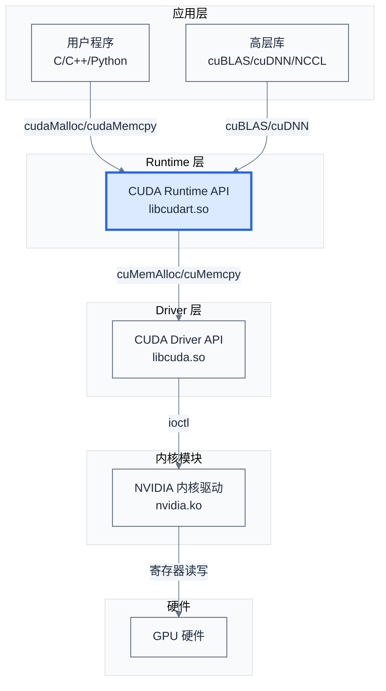
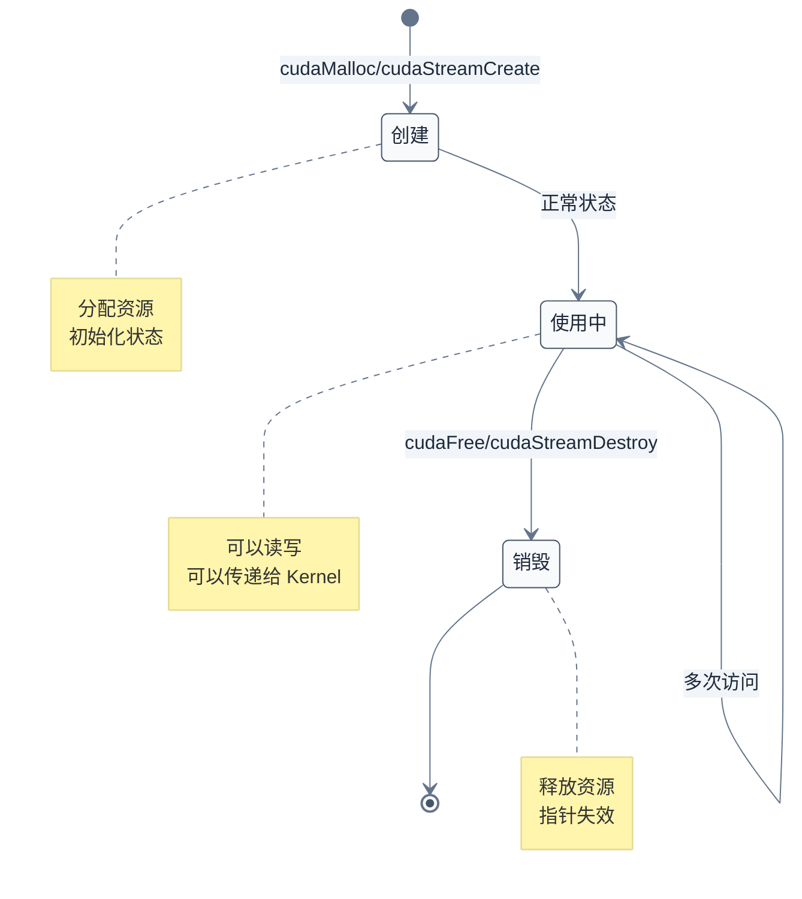

# CUDA Runtime 架构设计

> 前四章建立了 GPU 硬件基础、编程模型、内存管理和执行控制。一个自然的问题是：这些 API 是如何实现的？Runtime 内部如何管理资源、调度任务、与 Driver 交互？本章深入 CUDA Runtime 的架构设计，揭示其内部工作机制。
>
> **工程师视角**：理解 Runtime 的架构设计，才能理解为什么某些 API 有特定的行为约束（如上下文切换、默认流同步），才能在系统软件开发中做出正确的设计决策。

### 关键术语

| 缩写 | 全称 | 含义 |
|------|------|------|
| Runtime API | — | CUDA 运行时 API，提供简化的接口语义 |
| Driver API | — | CUDA 驱动 API，提供底层控制 |
| Context | — | 上下文，GPU 资源的容器 |
| Module | — | 模块，编译后的代码对象（cubin/fatbin） |
| Function | — | 函数，模块中的可执行代码（Kernel） |
| Primary Context | — | 主上下文，每个设备默认创建的上下文 |
| Per-thread Default Stream | — | 每线程默认流，CUDA 7.0 引入 |
| Legacy Default Stream | — | 遗留默认流，所有线程共享 |
| Lazy Initialization | — | 延迟初始化，首次使用时才创建资源 |
| Reference Counting | — | 引用计数，管理资源生命周期 |

### 5.1 前置知识

| 需要了解 | 参考文档 |
|----------|----------|
| CUDA 编程模型（Kernel、Stream、Event） | [02-CUDA编程模型](./02-CUDA编程模型.md)、[04-执行模型与同步机制](./04-执行模型与同步机制.md) |
| 内存管理（cudaMalloc、cudaMemcpy） | [03-内存管理与地址空间](./03-内存管理与地址空间.md) |
| C/C++ 动态链接库基础 | — |

***

## 1. Runtime 在软件栈中的位置

> 在深入 Runtime 内部之前，先理解它在整个 CUDA 软件栈中的位置——它是用户程序与 Driver 之间的桥梁。

### 1.1 软件栈层级



**如何读这张图**：
- **应用层**：用户程序和高层库（如 cuBLAS）
- **Runtime 层**：CUDA Runtime（`libcudart.so`），提供简化的 API
- **Driver 层**：CUDA Driver（`libcuda.so`），提供底层控制
- **内核模块**：NVIDIA 内核驱动（`nvidia.ko`），管理硬件资源
- **硬件**：GPU 硬件

**Runtime 的角色**：Runtime 是 Driver 的封装层，它：
1. 简化了接口语义（如 `cudaMalloc` vs `cuMemAlloc`）
2. 自动管理上下文（延迟初始化）
3. 提供默认行为（如默认流、主上下文）
4. 隐藏了部分底层细节（如模块加载、函数解析）

### 1.2 Runtime vs Driver 的设计权衡

| 对比维度 | Runtime API | Driver API |
|----------|-------------|------------|
| **设计目标** | 易用性 | 灵活性 |
| **上下文管理** | 自动（延迟初始化） | 手动（显式创建/销毁） |
| **模块加载** | 隐式（nvcc 自动处理） | 显式（`cuModuleLoad`） |
| **错误处理** | 简化（部分错误自动恢复） | 完整（所有错误码暴露） |
| **线程安全性** | 部分线程安全 | 需要手动管理 |
| **适用场景** | 应用开发 | 系统软件开发、驱动开发 |

**为什么需要两层 API？**

**历史原因**：CUDA 早期只有 Driver API，但接口语义复杂，应用开发者抱怨难用。NVIDIA 在 CUDA 2.0 引入了 Runtime API，作为 Driver 的封装层。

**设计动机**：
- **Runtime**：面向应用开发者，隐藏底层细节，提供"开箱即用"的体验
- **Driver**：面向系统软件工程师，提供完整的控制能力，支持高级场景（如多上下文、动态模块加载）

**具体例子**：

```c
// Runtime API：简单，自动管理上下文
cudaMalloc((void **)&d_data, size);
cudaMemcpy(d_data, h_data, size, cudaMemcpyHostToDevice);
myKernel<<<blocks, threads>>>(d_data);

// Driver API：复杂，需要手动管理
CUctxCreateParams params = {};  // CUDA 12.0+ 引入
CUcontext context;
cuCtxCreate(&context, &params, 0, device);
CUdeviceptr d_data;
cuMemAlloc(&d_data, size);
cuMemcpyHtoD(d_data, h_data, size);
// cuLaunchKernel 接受 6 个独立的 grid/block 维度分量,不接受 dim3
cuLaunchKernel(myKernel,
               blocks.x, blocks.y, blocks.z,    // gridDimX/Y/Z
               threads.x, threads.y, threads.z, // blockDimX/Y/Z
               0, NULL,                          // sharedMem, stream
               args, NULL);                      // kernelParams, extra
```

> **核心要点**：Runtime 是 Driver 的封装层，它简化了接口语义，但牺牲了部分控制能力。系统软件工程师通常需要直接操作 Driver API，而应用开发者使用 Runtime API 即可。

***

## 2. 上下文管理

> 上下文（Context）是 CUDA 中最重要的概念之一——它是所有 GPU 资源的容器。本节深入上下文的创建、切换、销毁，以及 Runtime 的自动管理机制。

### 2.1 上下文的本质

**定义**：上下文是 GPU 资源的容器，包含：
- 设备内存分配
- 模块（编译后的代码）
- Stream 和 Event
- 纹理和表面引用
- 配置参数（如共享内存大小）

**类比**：上下文类似于操作系统的进程——每个进程有独立的地址空间、文件描述符、线程等。类似地，每个上下文有独立的设备内存、模块、Stream 等。

### 2.2 Driver API 的上下文管理

**创建上下文**（CUDA 12.0+ 引入了 `CUctxCreateParams` 参数,旧签名被软弃用）:

```c
CUdevice device;
cuDeviceGet(&device, 0);

CUctxCreateParams params = {};  // CUDA 12.0+,可为空配置
CUcontext context;
cuCtxCreate(&context, &params, 0, device);
```

> 旧版签名 `cuCtxCreate(&ctx, flags, device)` 在 CUDA 12.0 之前使用,CUDA 12.0+ 仍向后兼容(通过 `cuCtxCreate_v2`),但推荐使用 `CUctxCreateParams` 版本以便启用向量上下文等新特性。

**切换上下文**：

```c
// 创建多个上下文
CUctxCreateParams params = {};
CUcontext ctx0, ctx1;
cuCtxCreate(&ctx0, &params, 0, device0);
cuCtxCreate(&ctx1, &params, 0, device1);

// 切换上下文
cuCtxSetCurrent(ctx0);  // 切换到 ctx0
// 使用 ctx0 的资源...

cuCtxSetCurrent(ctx1);  // 切换到 ctx1
// 使用 ctx1 的资源...
```

**销毁上下文**：

```c
cuCtxDestroy(context);
```

**引用计数**：每个上下文有引用计数，`cuCtxCreate` 增加计数，`cuCtxDestroy` 减少计数。计数为 0 时，上下文被销毁。

### 2.3 Runtime API 的自动管理

**延迟初始化（Lazy Initialization）**：

Runtime 采用延迟初始化策略——首次调用 CUDA API 时才创建上下文。

```c
// 首次调用 cudaMalloc 时，Runtime 自动：
// 1. 初始化 Driver
// 2. 选择设备（默认为 device 0）
// 3. 创建主上下文（Primary Context）
// 4. 将主上下文设置为当前上下文

cudaMalloc((void **)&d_data, size);  // 触发延迟初始化
```

**主上下文（Primary Context）**：

每个设备有一个主上下文，Runtime 自动管理其生命周期。

```c
// 获取主上下文
CUcontext primary;
cuDevicePrimaryCtxRetain(&primary, device);

// 释放主上下文（引用计数减 1）
cuDevicePrimaryCtxRelease(device);

// 重置主上下文（销毁并重新创建）
cuDevicePrimaryCtxReset(device);
```

**主上下文的特性**：
- 每个设备只有一个主上下文
- Runtime 自动创建和销毁
- 引用计数管理（`cuDevicePrimaryCtxRetain` 增加计数）
- 进程退出时自动释放

#### 2.3.1 为什么需要 Primary Context 这种抽象

**本质先行**：Primary Context 不是"另一个 context"，而是"Runtime 与 Driver 共享的 context"——它存在的唯一目的是让 Runtime 用户与 Driver 用户能在同一 GPU 上协作而不互相破坏。

**没有 Primary Context 会怎样？** 假设 Runtime 内部每次都通过 `cuCtxCreate` 创建一个普通 context，那么：

1. Runtime 用户调用 `cudaMalloc` → Runtime 创建普通 context A → 在 A 中分配内存
2. Driver 用户在同一进程内 `cuCtxCreate` 创建 context B → 在 B 中加载 module、启动 Kernel
3. **问题**：A 和 B 是两个独立的地址空间——Driver 加载的 module 中 Kernel 函数无法访问 Runtime 分配的 device 内存（VA 不互通）

**Primary Context 如何解决？** Primary Context 是"每设备唯一"的 context——`cuDevicePrimaryCtxRetain(device)` 在任意调用者（Runtime 或 Driver）返回的是**同一物理对象**，引用计数共享。因此：

- Runtime 调用 `cudaMalloc` → 内部 retain primary context → 在 primary 中分配内存
- Driver 用户 `cuDevicePrimaryCtxRetain(device)` → 拿到同一 primary context → 加载的 module 中 Kernel 能访问 Runtime 分配的内存

**状态机**：Primary Context 有三个状态——`未创建` → `已创建但未激活` → `已激活`。引用计数为 0 时 primary **仍保留创建状态**（与普通 `cuCtxCreate` 不同，普通 context 引用计数为 0 即销毁），只有调用 `cuDevicePrimaryCtxReset` 才真正销毁，这让"释放后又 retain"能快速恢复。

**生命周期与 `cudaDeviceReset`**：调用 `cudaDeviceReset` → 内部走 `cuDevicePrimaryCtxReset` → 强制销毁所有 Stream/Event/Memory/Module，即使有未完成的引用。这是清理"卡死状态"的最后手段，但会让所有 handle 失效。

**三种 Runtime/Driver 互操作模式**（参考 CUDA C Programming Guide §G.1 "CUDA Runtime API Compatibility"）：

| 模式 | 描述 | 示例 |
|------|------|------|
| **A. 纯 Runtime** | Runtime 自动管理 primary context | 普通应用 |
| **B. Driver 先 → Runtime** | Driver `cuCtxCreate` 普通 context 后，Runtime 检测 `cuCtxGetCurrent()` 非空 → 用此 context 而非 primary | `simpleDrvRuntime.cpp` L92-L152 |
| **C. Runtime 先 → Driver** | Runtime 已激活 primary context，Driver API 调用走同一 primary | `ptxjit.cpp` L183-L218 |

模式 B 的源码证据（Driver/Runtime 混用，见 `simpleDrvRuntime.cpp` L94-L122）：

```c
/* 摘自 [src/cuda-samples/cpp/0_Introduction/simpleDrvRuntime/simpleDrvRuntime.cpp](./src/cuda-samples/cpp/0_Introduction/simpleDrvRuntime/simpleDrvRuntime.cpp) 第 94-122 行 */
checkCudaDrvErrors(cuCtxCreate(&cuContext, &ctxCreateParams, 0, cuDevice));  // Driver 显式创建普通 context
/* ... 省略 fatbin 加载与 cuModuleGetFunction ... */
checkCudaErrors(cudaMallocHost(&h_A, size));    // Runtime 调用：检测到 current context 非空，沿用 Driver context 而非创建 primary
checkCudaErrors(cudaMalloc((void **)(&d_A), size));  // 同上，分配在 Driver context 中
cudaStream_t stream;
checkCudaErrors(cudaStreamCreateWithFlags(&stream, cudaStreamNonBlocking));  // Runtime 创建 stream，挂在 Driver context 上
checkCudaErrors(cudaMemcpyAsync(d_A, h_A, size, cudaMemcpyHostToDevice, stream));  // Runtime 异步拷贝，走 Driver context
```

**这段代码体现了什么设计决策？** Runtime 不强制覆盖当前 context——它在每次 API 调用前检查 `cuCtxGetCurrent()`，若非空就沿用，否则才 retain primary context。这让 Driver 用户能完全控制 context 生命周期，同时仍能用 Runtime 的便利 API（如 `cudaMalloc`、`cudaMemcpyAsync`）。

> **核心要点**：Primary Context 是"Runtime 与 Driver 共享的 context"——它通过 per-device 唯一性 + 引用计数共享，让两种 API 用户能在同一地址空间协作。Runtime 在每次调用前检测 `cuCtxGetCurrent()`，沿用 Driver 显式创建的 context，而非盲目创建 primary——这是"延迟初始化 + 检测"双策略的设计。

### 2.4 上下文切换的开销

**问题**：上下文切换需要保存/恢复 GPU 状态，开销较大。

**具体例子**：

```c
// 差：频繁切换上下文
for (int i = 0; i < 100; i++) {
    cuCtxSetCurrent(ctx0);
    // 使用 ctx0...
    
    cuCtxSetCurrent(ctx1);
    // 使用 ctx1...
}

// 好：批量使用，减少切换
cuCtxSetCurrent(ctx0);
for (int i = 0; i < 100; i++) {
    // 使用 ctx0...
}

cuCtxSetCurrent(ctx1);
for (int i = 0; i < 100; i++) {
    // 使用 ctx1...
}
```

**性能影响**：
- 上下文切换开销约 10-100 微秒
- 频繁切换会导致性能下降
- 建议：尽量使用单个上下文，必要时批量切换

### 2.5 多上下文 vs 多进程

**多上下文**：
- 优点：共享进程地址空间，数据传递方便
- 缺点：上下文切换开销，线程安全性需要手动管理

**多进程**：
- 优点：进程隔离，无切换开销
- 缺点：数据传递需要 IPC（进程间通信）

**选择建议**：
- **单设备**：使用单上下文（Runtime 自动管理）
- **多设备**：每个设备一个线程，每个线程一个上下文
- **高性能场景**：多进程，避免上下文切换

> **核心要点**：上下文是 GPU 资源的容器。Runtime 自动管理主上下文，简化了编程；Driver API 提供手动管理，支持高级场景。上下文切换开销大，应尽量避免频繁切换。

***

## 3. 模块与函数管理

> 上下文管理 GPU 资源，模块（Module）管理编译后的代码。本节深入模块的加载、函数的解析，以及 Runtime 的自动管理机制。

### 3.1 模块的本质

**定义**：模块是编译后的代码对象，包含：
- Kernel 函数（`__global__` 函数）
- 设备函数（`__device__` 函数）
- 常量数据（`__constant__` 变量）
- 纹理引用

**编译产物**：
- **PTX**（Parallel Thread Execution）：虚拟指令集，文本格式，可移植。PTX 是中间表示而非最终形态——加载时由 Driver JIT 编译为当前 GPU 的 SASS（Streaming Assembler）指令
- **cubin**：二进制格式，特定架构（如 sm_80 的 cubin 不能在 sm_70 上运行）。cubin 是 ELF 文件，magic `0x7F454C46`（`\x7FELF`）
- **fatbin**：**容器**而非新格式，包含多个 cubin/PTX 子节，支持多架构部署。fatbin header magic = `0xBA55ED50`，后续每个子节有自己的 magic 与 architecture 字段（参考 CUDA Binary Utilities Guide §3 "Fat Binary"）

#### 3.1.1 fatbin 容器格式

```
+-------------------------------+
| Fat Binary Header             |
|   magic = 0xBA55ED50          |
|   version, 子节数量, 子节表偏移 |
+-------------------------------+
| 子节表 (array of entry)        |
|   entry[0]: arch=sm_80, offset, size
|   entry[1]: arch=sm_86, offset, size
|   entry[2]: arch=compute_80 (PTX), offset, size
+-------------------------------+
| cubin for sm_80 (ELF)         |
| cubin for sm_86 (ELF)         |
| PTX for compute_80 (文本)     |
+-------------------------------+
```

**架构选择策略**（参考 CUDA Driver API §8.3 "Module Management"）：
1. 精确匹配 cubin 优先（如运行在 sm_80，先找 `arch=sm_80` 的 cubin）
2. 若无精确匹配，找最接近的 PTX 子节（如 `compute_80`）→ JIT 编译为当前架构 cubin
3. 都没有则报错 `CUDA_ERROR_NO_KERNEL_IMAGE_FOR_DEVICE`

### 3.2 Driver API 的模块管理

**加载模块**：

```c
// 从文件加载（等价于 read + cuModuleLoadData）
CUmodule module;
cuModuleLoad(&module, "kernel.cubin");

// 从内存加载（自动识别 cubin/PTX/fatbin 格式）
cuModuleLoadData(&module, kernel_data);

// 从 fatbin 加载（专门处理 fatbin 容器）
cuModuleLoadFatBinary(&module, fatbin_data);
```

**`cuModuleLoadData` 的格式自动识别**：Driver 读取前 4 字节判断格式——`0x7F454C46` 走 cubin 路径，`0xBA55ED50` 走 fatbin 路径，否则按 PTX 文本处理。这让 API 不要求调用者预先知道格式。

**获取函数**：

```c
CUfunction kernel;
cuModuleGetFunction(&kernel, module, "myKernel");
```

**卸载模块**：

```c
cuModuleUnload(module);
```

> **缓存策略对比**：Driver **不缓存** module——每次 `cuModuleLoadData` 都重新解析 fatbin、（必要时）JIT PTX、构建符号表。同一 fatbin 加载两次得到两个独立的 `CUmodule` 句柄。Runtime 则自动缓存（见 §3.3）。JIT 结果本身有进程级缓存（Linux 通常在 `~/.nv/ComputeCache`，参考 CUDA Programming Guide §4.4.4 "JIT Compilation"）。

### 3.3 Runtime API 的自动管理

**隐式加载**：

Runtime 在程序启动时自动加载模块（由 nvcc 嵌入的 fatbin）。

```c
// nvcc 编译时，将 fatbin 嵌入可执行文件
// 程序启动时，Runtime 自动加载 fatbin
// 用户无需手动调用 cuModuleLoad

myKernel<<<blocks, threads>>>(args);  // Runtime 自动解析 myKernel
```

**具体流程**（参考 CUDA Binary Utilities Guide §3 与 nvcc 文档）：

1. **编译时**：nvcc 将每个 `.cu` 文件编译为 fatbin，嵌入可执行文件的 `.nv_fatbin` ELF section
2. **链接时**：nvcc 在 `.init_array` section 注册 `__cudaRegisterFatBinary` 回调（C runtime 在 `main` 前调用，**不是** `__attribute__((constructor))`）
3. **启动时**：cudart 的 `.init_array` 回调扫描 `.nv_fatbin`，把每个 fatbin 注册到进程级 fatbin 列表（不立即加载到 GPU）
4. **首次调用**：`myKernel<<<...>>>` 触发 `__cudaRegisterFunction` → 在当前 context 加载 module → 解析符号 → 缓存

**Runtime 初始化与符号解析流程**（基于公开 ABI 行为推断）：

```c
/* 简化的 Runtime 注册流程（基于 cudart 公开符号与 .init_array 机制推断） */
/* 注意：__cudaRegisterFatBinary 与 __cudaRegisterFunction 是 nvcc 生成的静态
   初始化代码调用的内部 API，非用户接口。其精确行为未在官方文档完整描述，
   以下为基于 observable behavior 的推断。 */

void __cudaRegisterFatBinary(void *fatbin) {
    /* 1. 把 fatbin 加入进程级 fatbin 列表（持锁，防止并发注册） */
    fatbin_list_lock();
    fatbin_list_append(fatbin);
    fatbin_list_unlock();
    /* 注意：此处不调用 cuModuleLoadFatBinary，不分配 GPU 资源 */
}

void __cudaRegisterFunction(void *fatbin, const char *name,
                            const char *device_fun, ...) {
    /* 1. 查找 (context, fatbin, name) 三元组缓存 */
    CUcontext ctx = get_current_context();  /* 可能触发 primary context retain */
    CUfunction func = function_cache[ctx][fatbin][name];
    if (func) return func;

    /* 2. 缓存未命中：加载 module 到当前 context（持锁防止并发重复加载） */
    function_cache_lock(ctx, fatbin);
    /* 双重检查，避免锁等待期间其他线程已加载 */
    if (function_cache[ctx][fatbin][name]) {
        function_cache_unlock(ctx, fatbin);
        return function_cache[ctx][fatbin][name];
    }

    CUmodule module;
    cuModuleLoadData(&module, fatbin);  /* 触发 JIT（首次）或读 JIT 缓存 */
    cuModuleGetFunction(&func, module, name);

    /* 3. 写入缓存，键为 (context, fatbin, name) 三元组 */
    function_cache[ctx][fatbin][name] = func;
    function_cache_unlock(ctx, fatbin);
    return func;
}
```

**缓存键为何是三元组？** 切换 context 后即使同一 fatbin 也需要重新加载——因为 module 句柄关联到具体 context，context 销毁时 module 自动失效。这就是为什么"切换 context 后首次调用 Kernel 会有明显延迟"。

**源码证据**——`ptxjit.cpp` 展示了"Runtime 隐式创建 primary context + Driver API 走同一 context"的完整链路：

```c
/* 摘自 [src/cuda-samples/cpp/3_CUDA_Features/ptxjit/ptxjit.cpp](./src/cuda-samples/cpp/3_CUDA_Features/ptxjit/ptxjit.cpp) 第 183-218 行 */
int deviceCount = 0;
cudaGetDeviceCount(&deviceCount);  /* Runtime 调用：可能触发 primary context 创建 */

int driverVersion = 0, runtimeVersion = 0;
cudaDriverGetVersion(&driverVersion);     /* 版本独立性检查 */
cudaRuntimeGetVersion(&runtimeVersion);
if (driverVersion < CUDART_VERSION) { /* ... 报错 ... */ }

cudaSetDevice(dev);  /* 选择 device */

/* The runtime API will create the GPU Context implicitly here */
checkCudaErrors(cudaMalloc((void **)&d_A, size));  /* 触发 primary context retain + 激活 */

/* ... PTX JIT via cuLinkCreate / cuLinkAddData / cuLinkComplete ... */
checkCudaErrors(cuModuleLoadData(&mod, cuOut));  /* Driver API：走 Runtime 已激活的 primary context */
checkCudaErrors(cuModuleGetFunction(&kernel, mod, "_Z9simpleKernelPfi")));

void *args[] = {&d_A, &N};
checkCudaErrors(cuLaunchKernel(kernel, 1, 1, 1, 1, 1, 1, 0, NULL, args, NULL));
```

**这段代码体现了什么设计决策？** L196 注释明确说明"runtime API will create the GPU Context implicitly here"，随后 L202 `cudaMalloc` 创建并激活 primary context，后续 Driver API（`cuModuleLoadData`、`cuLaunchKernel`）自动走这个 primary context。这就是 §2.3.1 表中模式 C 的实现基础。

### 3.4 函数调用的内部流程

**Kernel 启动的完整流程**：

```c
myKernel<<<blocks, threads>>>(args);
```

**内部实现**（伪代码）：

```c
// 1. 解析函数
CUfunction func = function_cache["myKernel"];
if (!func) {
    // 首次调用，加载模块并解析
    func = __cudaRegisterFunction(fatbin, "myKernel");
}

// 2. 获取当前上下文
CUcontext context = get_current_context();

// 3. 配置 Kernel 参数
CUlaunchConfig config = {
    .gridDim = blocks,
    .blockDim = threads,
    .sharedMem = 0,
    .stream = 0
};

// 4. 启动 Kernel
cuLaunchKernel(func, config.gridDim, config.blockDim, 
               config.sharedMem, config.stream, args, NULL);
```

**关键步骤**：
1. **函数解析**：从缓存中查找函数，首次调用时加载模块
2. **上下文检查**：确保当前上下文有效
3. **参数配置**：设置 Grid/Block 维度、共享内存大小、Stream
4. **Driver 调用**：调用 `cuLaunchKernel` 启动 Kernel

### 3.5 模块缓存

**问题**：每次调用 Kernel 都要加载模块吗？

**答案**：Runtime 会缓存已加载的模块，避免重复加载。

**缓存策略**：
- **进程级缓存**：每个进程一个缓存，存储已加载的模块
- **上下文级缓存**：每个上下文一个缓存，存储该上下文加载的模块

**具体例子**：

```c
// 第一次调用
myKernel<<<blocks, threads>>>(args);
// Runtime 加载模块，缓存到 function_cache

// 第二次调用
myKernel<<<blocks, threads>>>(args);
// Runtime 从 function_cache 查找，直接使用

// 切换上下文后调用
cuCtxSetCurrent(ctx1);
myKernel<<<blocks, threads>>>(args);
// Runtime 检查 ctx1 的缓存，如果没有则加载模块
```

> **核心要点**：Runtime 自动管理模块和函数的加载、解析、缓存。用户无需手动调用 `cuModuleLoad`，但理解内部流程有助于调试性能问题（如首次调用延迟）。

***

## 4. 默认流的行为

> 默认流（Stream 0）是 CUDA 中最常用的流，但它的行为在不同 CUDA 版本中有变化。本节深入默认流的语义、Legacy vs Per-thread 模式，以及同步行为。

### 4.1 默认流的定义

**Legacy Default Stream**（CUDA 7.0 之前）：
- 所有线程共享同一个默认流
- 默认流与所有非默认流同步

**Per-thread Default Stream**（CUDA 7.0+）：
- 每个线程有独立的默认流
- 默认流不与非默认流同步

### 4.2 Legacy Default Stream 的行为

**同步语义**：

```c
// 线程 1
kernel1<<<blocks, threads, 0, stream1>>>(args1);
kernel2<<<blocks, threads>>>(args2);  // 默认流

// 线程 2
kernel3<<<blocks, threads, 0, stream2>>>(args3);
kernel4<<<blocks, threads>>>(args4);  // 默认流
```

**执行顺序**：
1. `kernel1` 在 `stream1` 中启动
2. `kernel2` 在默认流中启动，**等待 `stream1` 和 `stream2` 完成**
3. `kernel3` 在 `stream2` 中启动
4. `kernel4` 在默认流中启动，**等待所有流完成**

**问题**：默认流是同步点，会阻塞所有其他流，降低并发性能。

### 4.3 Per-thread Default Stream 的行为

**启用方式**：

```bash
# 编译时指定
nvcc --default-stream per-thread program.cu -o program
```

**同步语义**：

```c
// 线程 1
kernel1<<<blocks, threads, 0, stream1>>>(args1);
kernel2<<<blocks, threads>>>(args2);  // 线程 1 的默认流

// 线程 2
kernel3<<<blocks, threads, 0, stream2>>>(args3);
kernel4<<<blocks, threads>>>(args4);  // 线程 2 的默认流
```

**执行顺序**：
1. `kernel1` 在 `stream1` 中启动
2. `kernel2` 在线程 1 的默认流中启动，**只等待线程 1 的流**
3. `kernel3` 在 `stream2` 中启动
4. `kernel4` 在线程 2 的默认流中启动，**只等待线程 2 的流**

**优势**：
- 每个线程的默认流独立，不会相互阻塞
- 提高多线程程序的并发性能
- 更符合直觉（每个线程有自己的默认流）

### 4.4 默认流与非默认流的同步

**Legacy 模式**：

```c
cudaStream_t stream;
cudaStreamCreate(&stream);

kernel1<<<blocks, threads, 0, stream>>>(args1);
kernel2<<<blocks, threads>>>(args2);  // 默认流，等待 stream 完成
kernel3<<<blocks, threads, 0, stream>>>(args3);  // 等待默认流完成
```

**执行顺序**：
1. `kernel1` 在 `stream` 中启动
2. `kernel2` 在默认流中启动，**等待 `stream` 完成**
3. `kernel3` 在 `stream` 中启动，**等待默认流完成**

**Per-thread 模式**：

```c
cudaStream_t stream;
cudaStreamCreate(&stream);

kernel1<<<blocks, threads, 0, stream>>>(args1);
kernel2<<<blocks, threads>>>(args2);  // 默认流，不等待 stream
kernel3<<<blocks, threads, 0, stream>>>(args3);  // 不等待默认流
```

**执行顺序**：
1. `kernel1` 在 `stream` 中启动
2. `kernel2` 在默认流中启动，**不等待 `stream`**
3. `kernel3` 在 `stream` 中启动，**不等待默认流**

**如何选择？**

| 场景 | 推荐模式 |
|------|----------|
| 单线程程序 | Legacy(向后兼容,默认) |
| 多线程程序 | Per-thread(避免线程间同步阻塞) |
| 需要显式同步 | Per-thread + Event |
| 与旧库交互 | Legacy(若库假设默认流是全局同步点) |

> 编译时通过 `nvcc --default-stream per-thread` 切换;宏 `CUDA_API_PER_THREAD_DEFAULT_STREAM` 控制头文件中的默认流解析。不指定时默认为 Legacy 模式。

> **核心要点**：默认流的行为在 CUDA 7.0 后发生了变化。Legacy 模式下默认流是全局同步点，Per-thread 模式下每个线程有独立的默认流。多线程程序建议使用 Per-thread 模式，避免不必要的同步。

***

## 5. 资源生命周期管理

> CUDA 中的资源（内存、模块、Stream 等）都有生命周期。本节深入资源的生命周期管理，以及 Runtime 的自动清理机制。

### 5.1 资源的生命周期

**典型生命周期**：



### 5.2 引用计数机制

**主上下文引用计数**(由 Driver 自动管理,CUDA 中只有 primary context 提供引用计数 API):

```c
// 保留主上下文(引用计数 +1)
CUcontext primary;
cuDevicePrimaryCtxRetain(&primary, device);

// 释放主上下文引用(引用计数 -1)
cuDevicePrimaryCtxRelease(device);

// 引用计数归 0 时,主上下文仍保留,直到调用 cuDevicePrimaryCtxReset 才销毁
// 这与 cuCtxDestroy(显式上下文)不同
```

> 注意:CUDA Driver API 中**没有** `cuCtxRetain`/`cuCtxRelease` 这两个函数(常见误解)。引用计数机制只针对 primary context,通过 `cuDevicePrimaryCtxRetain`/`cuDevicePrimaryCtxRelease` 管理;显式创建的上下文(`cuCtxCreate`)只能通过 `cuCtxDestroy` 销毁,无 retain/release 计数。

**模块引用计数**：

```c
// 加载模块（引用计数 = 1）
CUmodule module;
cuModuleLoad(&module, "kernel.cubin");

// 卸载模块（引用计数 = 0，实际卸载）
cuModuleUnload(module);
```

### 5.3 进程退出时的清理

**Runtime 的自动清理**：

进程退出时，Runtime 会自动清理所有资源：
1. 同步所有 Stream
2. 销毁所有上下文
3. 释放所有设备内存
4. 卸载所有模块

**具体流程**（伪代码）：

```c
__attribute__((destructor))
void __cuda_runtime_cleanup(void) {
    // 1. 同步所有 Stream
    cudaDeviceSynchronize();
    
    // 2. 遍历所有上下文
    for (each context in context_list) {
        // 3. 释放上下文中的资源
        for (each allocation in context.allocations) {
            cuMemFree(allocation.ptr);
        }
        
        // 4. 卸载模块
        for (each module in context.modules) {
            cuModuleUnload(module);
        }
        
        // 5. 销毁上下文
        cuCtxDestroy(context);
    }
}
```

**注意**：
- 自动清理可能掩盖资源泄漏问题
- 建议在程序退出前显式释放资源
- 使用 `compute-sanitizer` 检测资源泄漏

### 5.4 资源泄漏检测

**工具**：`compute-sanitizer`

```bash
# 检测内存泄漏
compute-sanitizer --tool memcheck ./program

# 检测资源泄漏
compute-sanitizer --tool leakcheck ./program
```

**常见泄漏场景**：
- 忘记 `cudaFree`
- 忘记 `cudaStreamDestroy`
- 忘记 `cudaEventDestroy`
- 上下文未正确销毁

**最佳实践**：

```c
// 好：使用 RAII 模式管理资源
class CudaMemory {
    void *ptr;
public:
    CudaMemory(size_t size) {
        cudaMalloc(&ptr, size);
    }
    ~CudaMemory() {
        cudaFree(ptr);
    }
    void *get() { return ptr; }
};

// 使用
{
    CudaMemory data(1000 * sizeof(float));
    // 使用 data.get()...
}  // 自动释放
```

> **核心要点**：CUDA 资源有明确的生命周期，Runtime 通过引用计数管理资源。进程退出时 Runtime 会自动清理，但建议显式管理资源，避免泄漏。

***

## 6. Runtime 的设计决策

> 理解了 Runtime 的内部机制后，本节从系统软件工程师的视角，分析 Runtime 的设计决策及其权衡。

### 6.1 为什么选择延迟初始化？

**设计动机**：
- **简化编程**：用户无需手动初始化 CUDA
- **按需加载**：首次使用时才创建资源，减少启动开销
- **错误延迟**：初始化错误在首次使用时才暴露，便于调试

**权衡**：
- **优点**：编程简单，启动快
- **缺点**：首次调用延迟大（约 100-500 毫秒），不适合实时应用

**具体例子**：

```c
// 首次调用触发初始化
cudaMalloc((void **)&d_data, size);  // 耗时 100-500ms

// 后续调用快速
cudaMalloc((void **)&d_data2, size);  // 耗时 < 1ms
```

### 6.2 为什么需要主上下文？

**设计动机**：
- **简化多设备编程**：每个设备一个主上下文，自动管理
- **避免上下文切换**：主上下文是默认上下文，无需手动切换
- **资源隔离**：每个设备的主上下文独立，资源不冲突

**权衡**：
- **优点**：编程简单，适合单设备场景
- **缺点**：无法灵活控制上下文生命周期

### 6.3 为什么默认流是同步的？

**历史原因**：
- CUDA 早期只有默认流，为了简化语义，默认流与所有流同步
- 这样可以保证代码的正确性，避免数据竞争

**演进**：
- CUDA 7.0 引入 Per-thread Default Stream，解决多线程性能问题
- 但 Legacy 模式仍然是默认，保持向后兼容

**权衡**：
- **Legacy 模式**：正确性优先，性能较差
- **Per-thread 模式**：性能优先，需要手动同步

### 6.4 Runtime vs Driver 的分层动机

**设计动机**：
- **职责分离**：Runtime 负责易用性，Driver 负责灵活性
- **版本独立**：Runtime 可以独立于 Driver 升级（见下方"版本独立性"详述）
- **多语言支持**：Runtime 提供 C/C++ API，Driver 提供更底层的接口

**权衡**：
- **优点**：应用开发者使用 Runtime，系统软件工程师使用 Driver
- **缺点**：两层 API 增加学习成本，部分功能重复

#### 6.4.1 Runtime 不是 Driver 的"薄封装"

**本质先行**：很多文档把 Runtime 描述为"Driver 的薄封装"——这是简化说法。Runtime 在每次 API 调用前做了大量状态检查和配置栈管理，并非简单透传。

**`<<<>>>` 的真实展开路径**（参考 CUDA C Programming Guide §4.3.2 "Kernel Execution Syntax"）：

```c
/* 用户代码 */
myKernel<<<gridDim, blockDim, sharedMem, stream>>>(arg1, arg2);

/* 编译期展开为（CUDA 4.0+ 新 ABI）*/
__cudaPushCallConfiguration(gridDim, blockDim, sharedMem, stream);  /* 压入配置栈 */
myKernel(arg1, arg2);  /* 调用 device 函数 stub，不实际执行 */
__cudaPopCallConfiguration(&gridDim, &blockDim, &sharedMem, &stream);  /* 弹出 */
cudaLaunchKernel((char *)&__device_stub__myKernel,
                 gridDim, blockDim, args, sharedMem, stream);  /* 内部 API */
/* cudaLaunchKernel 内部：检查 primary context → 调用 cuLaunchKernel */
```

**配置栈 `__cudaPushCallConfiguration`/`__cudaPopCallConfiguration` 的设计目的**：让 `<<<>>>` 语法糖在 C++ 编译期展开为标准函数调用（避免在编译器层面修改语法树），同时把 grid/block/shmem/stream 暂存到栈帧中。这是"语法糖 + ABI 兼容"的工程权衡。

**`cudaMalloc` vs `cuMemAlloc` 内部路径**：

```c
/* Runtime: cudaMalloc */
cudaError_t cudaMalloc(void **devPtr, size_t size) {
    /* 1. 检查 primary context 是否激活（每调用一次都检查） */
    CUcontext ctx;
    cuCtxGetCurrent(&ctx);
    if (ctx == NULL) {
        cuDevicePrimaryCtxRetain(&ctx, device);  /* 隐式 retain */
        cuCtxSetCurrent(ctx);
    }
    /* 2. 调用 Driver API */
    CUdeviceptr ptr;
    CUresult err = cuMemAlloc(&ptr, size);
    /* 3. 包装返回值（CUdeviceptr → void*）*/
    *devPtr = (void *)ptr;
    return cudaError_from_CUresult(err);
}

/* Driver: cuMemAlloc（无前置检查，要求调用者已设置 current context）*/
CUresult cuMemAlloc(CUdeviceptr *dptr, size_t bytesize) {
    /* 直接调用 KMD ioctl 分配 */
}
```

**性能开销**：`cudaMalloc` 比 `cuMemAlloc` 多一次 `cuCtxGetCurrent` 检查（约 50-100ns），对单次分配可忽略，对高频分配（如循环内分配）会累积。这就是性能敏感场景推荐 Driver API 的原因之一。

#### 6.4.2 版本独立性的实现

**版本独立性**是 Runtime/Driver 分层最重要的工程价值——应用编译时绑定的 Runtime 版本（`CUDART_VERSION`）与运行时 Driver 版本（`cudaDriverGetVersion()`）可以不同。

**源码证据**——`ptxjit.cpp` L185-L192 的版本检查（参考 CUDA Driver API §1.3 "API Compatibility"）：

```c
/* 摘自 [src/cuda-samples/cpp/3_CUDA_Features/ptxjit/ptxjit.cpp](./src/cuda-samples/cpp/3_CUDA_Features/ptxjit/ptxjit.cpp) 第 185-192 行 */
int driverVersion = 0, runtimeVersion = 0;
cudaDriverGetVersion(&driverVersion);     /* 运行时 Driver 版本（来自 KMD）*/
cudaRuntimeGetVersion(&runtimeVersion);  /* 编译时 Runtime 版本（来自 cudart 头文件）*/

if (driverVersion < CUDART_VERSION) {  /* CUDART_VERSION 是编译时常量 */
    printf("Error: Driver version %d < Runtime version %d\n",
           driverVersion, CUDART_VERSION);
    exit(EXIT_FAILURE);
}
```

**兼容性规则**：
- **旧 Driver + 新 Runtime**：报错（如上代码检查）——新 Runtime 可能调用 Driver 不存在的新 API
- **新 Driver + 旧 Runtime**：兼容——Driver 向后兼容旧 Runtime 调用的所有 API
- **Enhanced Compatibility**（CUDA 11.0+）：允许新 Toolkit 在略旧的 Driver 上运行（同一大版本内），但部分新特性可能不可用

**为什么不直接把 Runtime 编译进 Driver？** 分离后：
- 应用可以静态链接 cudart（不依赖系统 cudart 版本）
- Driver 升级（如 nvidia.ko 更新）不需要重新编译应用
- 不同语言绑定（Python ctypes、Rust binding）可以独立演进

> **核心要点**：Runtime 的设计决策体现了"易用性优先"的原则。延迟初始化、主上下文、默认流同步等设计，都是为了简化编程。但这些设计也有代价（如首次调用延迟、同步开销），系统软件工程师需要理解这些权衡，在必要时使用 Driver API。Runtime 不是 Driver 的"薄封装"——每次调用都有配置栈、context 检查等额外路径，理解这些路径有助于在性能敏感场景做出正确的 API 选择。

***

## 参考资料

- [CUDA Runtime API Reference](https://docs.nvidia.com/cuda/cuda-runtime-api/) — 参考了上下文管理、模块管理、Stream 语义
- [CUDA Driver API Reference](https://docs.nvidia.com/cuda/cuda-driver-api/) — 参考了底层 API 的语义
- [CUDA C Programming Guide §4.3. CUDA Runtime](https://docs.nvidia.com/cuda/cuda-c-programming-guide/index.html#cuda-runtime) — 参考了 Runtime 的设计

***

**上一篇**：[04-执行模型与同步机制](./04-执行模型与同步机制.md)
**下一篇**：[06-CUDA-Driver接口与实现](./06-CUDA-Driver接口与实现.md) — 深入 Driver API 的语义、线程安全性、以及高级场景
