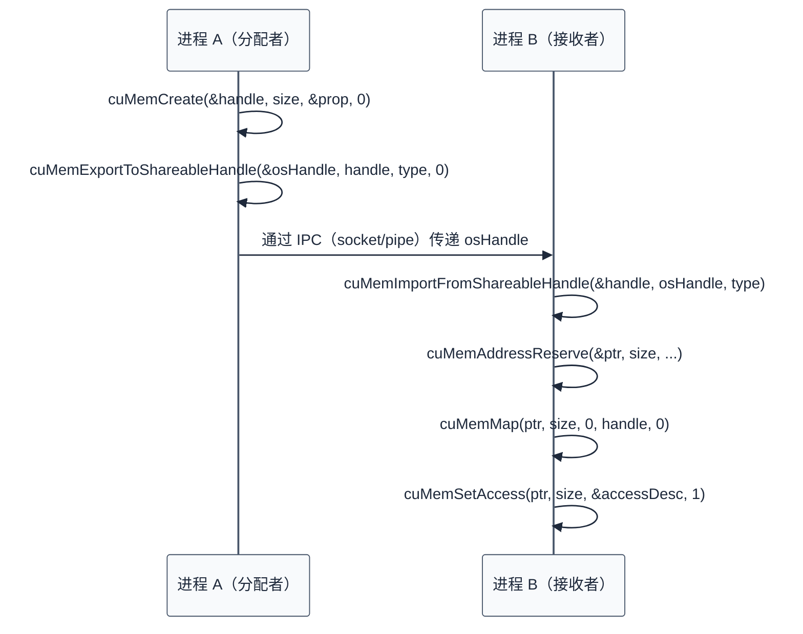

# CUDA Driver 接口与实现

> 上一章深入了 CUDA Runtime 的架构设计，理解了它是 Driver 的封装层。本章直接深入 CUDA Driver API 的语义和实现，探索底层控制能力、线程安全性、以及高级场景。
>
> **工程师视角**：Driver API 是 CUDA 软件栈的最底层用户态接口，直接操作 GPU 资源。理解 Driver API 的语义，才能理解 Runtime 的行为约束，才能在系统软件开发（如驱动、Runtime、性能分析工具）中做出正确决策。

### 关键术语

| 缩写 | 全称 | 含义 |
|------|------|------|
| Driver API | — | CUDA 驱动 API，提供底层控制 |
| Context | — | 上下文，GPU 资源的容器 |
| Module | — | 模块，编译后的代码对象 |
| Function | — | 函数，模块中的可执行代码 |
| Device Pointer | — | 设备指针，指向 GPU 内存 |
| Stream | — | 流，任务队列 |
| Event | — | 事件，同步和计时原语 |
| Thread Safety | — | 线程安全性 |
| Thread-local Storage | — | 线程本地存储 |
| Reference Counting | — | 引用计数，管理资源生命周期 |

### 6.1 前置知识

| 需要了解 | 参考文档 |
|----------|----------|
| CUDA Runtime 架构（上下文、模块、Stream） | [05-CUDA-Runtime架构设计](./05-CUDA-Runtime架构设计.md) |
| CUDA 编程模型（Kernel、Thread、Block） | [02-CUDA编程模型](./02-CUDA编程模型.md) |
| C/C++ 多线程基础 | — |

***

## 1. Driver API 概览

> 在深入具体 API 之前，先理解 Driver API 的整体设计——它的分类、命名规范、以及与 Runtime API 的对应关系。

### 1.1 API 分类

CUDA Driver API 按功能分为以下几类：

| 类别 | 前缀 | 功能 | 示例 |
|------|------|------|------|
| **初始化** | `cuInit` | 初始化 Driver | `cuInit(0)` |
| **设备管理** | `cuDevice` | 查询和管理设备 | `cuDeviceGet`、`cuDeviceGetAttribute` |
| **上下文管理** | `cuCtx` | 创建、切换、销毁上下文 | `cuCtxCreate`、`cuCtxSetCurrent` |
| **模块管理** | `cuModule` | 加载、卸载模块 | `cuModuleLoad`、`cuModuleUnload` |
| **函数管理** | `cuFunction` | 获取、调用函数 | `cuModuleGetFunction`、`cuLaunchKernel` |
| **内存管理** | `cuMem` | 分配、释放、拷贝内存 | `cuMemAlloc`、`cuMemcpy` |
| **Stream 管理** | `cuStream` | 创建、同步 Stream | `cuStreamCreate`、`cuStreamSynchronize` |
| **Event 管理** | `cuEvent` | 创建、记录、同步 Event | `cuEventCreate`、`cuEventRecord` |
| **错误处理** | `cuGetError` | 查询错误信息 | `cuGetErrorName`、`cuGetErrorString` |

### 1.2 命名规范

**Driver API vs Runtime API 命名对比**：

| 功能 | Runtime API | Driver API |
|------|-------------|------------|
| 分配内存 | `cudaMalloc` | `cuMemAlloc` |
| 拷贝内存 | `cudaMemcpy` | `cuMemcpyHtoD`、`cuMemcpyDtoH` |
| 启动 Kernel | `<<<>>>` 语法 | `cuLaunchKernel` |
| 创建 Stream | `cudaStreamCreate` | `cuStreamCreate` |
| 创建 Event | `cudaEventCreate` | `cuEventCreate` |

**关键差异**：
- Runtime API 使用 `cuda` 前缀，Driver API 使用 `cu` 前缀
- Runtime API 的内存拷贝是统一的 `cudaMemcpy`，Driver API 区分方向（`cuMemcpyHtoD`、`cuMemcpyDtoH`）
- Runtime API 使用 `<<<>>>` 语法启动 Kernel，Driver API 使用 `cuLaunchKernel` 函数

### 1.3 头文件与链接

**头文件**：

```c
#include <cuda.h>
```

**链接库**：

```bash
# Linux
gcc program.c -lcuda

# Windows
cl program.c cuda.lib
```

**注意**：Driver API 需要链接 `libcuda.so`（Linux）或 `cuda.lib`（Windows），而不是 `libcudart.so`。

> **核心要点**：Driver API 是 CUDA 的最底层用户态接口，提供完整的控制能力。它的命名规范与 Runtime API 不同，需要单独链接 `libcuda.so`。

***

## 2. 初始化与设备管理

> Driver API 的使用从初始化开始。本节介绍 `cuInit`、设备查询、以及设备属性获取。

### 2.1 初始化 Driver

**API**：

```c
CUresult cuInit(unsigned int Flags);
```

**语义**：
- 初始化 CUDA Driver
- 必须在使用其他 Driver API 之前调用
- `Flags` 必须为 0（保留参数）
- 返回 `CUDA_SUCCESS` 表示成功

**具体例子**：

```c
#include <cuda.h>
#include <stdio.h>

int main() {
    CUresult err = cuInit(0);
    if (err != CUDA_SUCCESS) {
        const char *errStr;
        cuGetErrorString(err, &errStr);
        fprintf(stderr, "cuInit failed: %s\n", errStr);
        return 1;
    }
    
    printf("CUDA Driver initialized successfully\n");
    return 0;
}
```

**注意**：
- `cuInit` 是线程安全的
- 可以多次调用，但只有第一次有效
- 如果 Driver 未安装或版本不兼容，返回 `CUDA_ERROR_NO_DEVICE`

### 2.2 设备查询

**获取设备数量**：

```c
int deviceCount;
cuDeviceGetCount(&deviceCount);
printf("Found %d CUDA devices\n", deviceCount);
```

**获取设备句柄**：

```c
CUdevice device;
cuDeviceGet(&device, 0);  // 获取设备 0
```

**获取设备属性**：

```c
// 获取设备名称
char deviceName[256];
cuDeviceGetName(deviceName, 256, device);
printf("Device name: %s\n", deviceName);

// 获取计算能力
int major, minor;
cuDeviceGetAttribute(&major, CU_DEVICE_ATTRIBUTE_COMPUTE_CAPABILITY_MAJOR, device);
cuDeviceGetAttribute(&minor, CU_DEVICE_ATTRIBUTE_COMPUTE_CAPABILITY_MINOR, device);
printf("Compute capability: %d.%d\n", major, minor);

// 获取 SM 数量
int smCount;
cuDeviceGetAttribute(&smCount, CU_DEVICE_ATTRIBUTE_MULTIPROCESSOR_COUNT, device);
printf("SM count: %d\n", smCount);

// 获取全局内存大小
size_t totalGlobalMem;
cuDeviceTotalMem(&totalGlobalMem, device);
printf("Total global memory: %zu bytes\n", totalGlobalMem);
```

### 2.3 设备属性详解

**常用属性**（参考 CUDA Driver API Reference）：

| 属性 | 说明 | 示例值（A100） |
|------|------|----------------|
| `CU_DEVICE_ATTRIBUTE_COMPUTE_CAPABILITY_MAJOR` | 计算能力主版本号 | 8 |
| `CU_DEVICE_ATTRIBUTE_COMPUTE_CAPABILITY_MINOR` | 计算能力次版本号 | 0 |
| `CU_DEVICE_ATTRIBUTE_MULTIPROCESSOR_COUNT` | SM 数量 | 108 |
| `CU_DEVICE_ATTRIBUTE_MAX_THREADS_PER_BLOCK` | 每 Block 最大线程数 | 1024 |
| `CU_DEVICE_ATTRIBUTE_MAX_BLOCK_DIM_X` | Block X 维度最大值 | 1024 |
| `CU_DEVICE_ATTRIBUTE_MAX_BLOCK_DIM_Y` | Block Y 维度最大值 | 1024 |
| `CU_DEVICE_ATTRIBUTE_MAX_BLOCK_DIM_Z` | Block Z 维度最大值 | 64 |
| `CU_DEVICE_ATTRIBUTE_MAX_GRID_DIM_X` | Grid X 维度最大值 | 2147483647 |
| `CU_DEVICE_ATTRIBUTE_MAX_SHARED_MEMORY_PER_BLOCK` | 每 Block 最大共享内存 | 167936 bytes |
| `CU_DEVICE_ATTRIBUTE_TOTAL_CONSTANT_MEMORY` | 常量内存大小 | 65536 bytes |
| `CU_DEVICE_ATTRIBUTE_WARP_SIZE` | Warp 大小 | 32 |
| `CU_DEVICE_ATTRIBUTE_MAX_REGISTERS_PER_BLOCK` | 每 Block 最大寄存器数 | 65536 |
| `CU_DEVICE_ATTRIBUTE_CLOCK_RATE` | 时钟频率（kHz） | 1410000 |
| `CU_DEVICE_ATTRIBUTE_MEMORY_CLOCK_RATE` | 内存时钟频率（kHz） | 1215000 |
| `CU_DEVICE_ATTRIBUTE_MEMORY_BUS_WIDTH` | 内存总线宽度 | 5120 |

**具体例子**：查询 A100 的完整配置

```c
CUdevice device;
cuDeviceGet(&device, 0);

int major, minor, smCount, maxThreads, warpSize;
size_t totalMem;

cuDeviceGetAttribute(&major, CU_DEVICE_ATTRIBUTE_COMPUTE_CAPABILITY_MAJOR, device);
cuDeviceGetAttribute(&minor, CU_DEVICE_ATTRIBUTE_COMPUTE_CAPABILITY_MINOR, device);
cuDeviceGetAttribute(&smCount, CU_DEVICE_ATTRIBUTE_MULTIPROCESSOR_COUNT, device);
cuDeviceGetAttribute(&maxThreads, CU_DEVICE_ATTRIBUTE_MAX_THREADS_PER_BLOCK, device);
cuDeviceGetAttribute(&warpSize, CU_DEVICE_ATTRIBUTE_WARP_SIZE, device);
cuDeviceTotalMem(&totalMem, device);

printf("Device: A100\n");
printf("Compute Capability: %d.%d\n", major, minor);
printf("SM Count: %d\n", smCount);
printf("Max Threads per Block: %d\n", maxThreads);
printf("Warp Size: %d\n", warpSize);
printf("Total Memory: %zu MB\n", totalMem / (1024 * 1024));
```

> **核心要点**：Driver API 提供完整的设备查询能力，可以获取设备的计算能力、SM 数量、内存大小等详细属性。这些信息对于优化 Kernel 配置至关重要。

***

## 3. 上下文管理

> 上下文是 GPU 资源的容器。本节深入 Driver API 的上下文管理——创建、切换、销毁，以及引用计数机制。

### 3.1 创建上下文

**API**（CUDA 12.0+ 引入了 `CUctxCreateParams` 参数,旧签名被软弃用但保持向后兼容）:

```c
// CUDA 12.0+ 新签名
CUresult cuCtxCreate(CUcontext *pctx, CUctxCreateParams *params,
                     unsigned int flags, CUdevice dev);

// CUDA 12.0 之前的旧签名(通过 cuCtxCreate_v2 别名保持兼容)
CUresult cuCtxCreate(CUcontext *pctx, unsigned int flags, CUdevice dev);
```

**参数解析**：
- `pctx`：返回的上下文句柄
- `params`（CUDA 12.0+）：创建参数,可为 `NULL` 或 `&((CUctxCreateParams){})`。用于启用向量上下文等高级特性
- `flags`：上下文标志
  - `CU_CTX_SCHED_AUTO`：自动选择调度策略
  - `CU_CTX_SCHED_SPIN`：自旋等待（低延迟）
  - `CU_CTX_SCHED_YIELD`：让出线程（低功耗）
  - `CU_CTX_SCHED_BLOCKING_SYNC`：阻塞同步（CUDA 7.0+）
  - `CU_CTX_MAP_HOST`：允许映射主机内存
  - `CU_CTX_LMEM_RESIZE_TO_MAX`：预分配本地内存
- `dev`：设备句柄

**具体例子**：

```c
CUdevice device;
cuDeviceGet(&device, 0);

CUctxCreateParams params = {};  // CUDA 12.0+,空配置
CUcontext context;
CUresult err = cuCtxCreate(&context, &params, CU_CTX_SCHED_BLOCKING_SYNC, device);
if (err != CUDA_SUCCESS) {
    fprintf(stderr, "cuCtxCreate failed: %d\n", err);
    exit(1);
}

printf("Context created successfully\n");
```

**语义**：
- 创建上下文并设置为当前上下文
- 上下文与设备绑定，一个设备可以有多个上下文
- 上下文创建后自动成为当前上下文

### 3.2 切换上下文

**API**：

```c
CUresult cuCtxSetCurrent(CUcontext ctx);
```

**语义**：
- 设置当前上下文
- 线程本地存储（TLS）保存当前上下文
- 所有后续的 CUDA 操作都在当前上下文中执行

**具体例子**：

```c
// 创建两个上下文
CUctxCreateParams params = {};
CUcontext ctx0, ctx1;
cuCtxCreate(&ctx0, &params, 0, device0);
cuCtxCreate(&ctx1, &params, 0, device1);

// ctx1 现在是当前上下文

// 切换到 ctx0
cuCtxSetCurrent(ctx0);
// 后续操作在 ctx0 中执行

// 切换回 ctx1
cuCtxSetCurrent(ctx1);
// 后续操作在 ctx1 中执行
```

**注意**：
- 上下文切换是线程本地的，不影响其他线程
- 切换开销约 10-100 微秒
- 频繁切换会导致性能下降

### 3.3 获取当前上下文

**API**：

```c
CUresult cuCtxGetCurrent(CUcontext *pctx);
```

**语义**：
- 获取当前线程的上下文
- 如果未设置上下文，返回 `NULL`

**具体例子**：

```c
CUcontext current;
cuCtxGetCurrent(&current);

if (current == NULL) {
    printf("No current context\n");
} else {
    printf("Current context: %p\n", current);
}
```

### 3.4 销毁上下文

**API**：

```c
CUresult cuCtxDestroy(CUcontext ctx);
```

**语义**：
- 销毁上下文，释放所有资源
- 如果上下文是当前上下文，当前上下文变为 `NULL`
- 引用计数减 1，计数为 0 时实际销毁

**具体例子**：

```c
CUctxCreateParams params = {};
CUcontext context;
cuCtxCreate(&context, &params, 0, device);

// 使用上下文...

cuCtxDestroy(context);
// 上下文被销毁，所有资源释放
```

### 3.5 主上下文引用计数

> **重要**:CUDA Driver API 中**没有** `cuCtxRetain`/`cuCtxRelease` 这两个函数(常见误解)。引用计数机制只针对 **primary context**(主上下文),通过以下 API 管理:

**保留主上下文**：

```c
CUresult cuDevicePrimaryCtxRetain(CUcontext *pctx, CUdevice dev);
```

**语义**：
- 获取设备的主上下文(若尚未创建则创建)
- 引用计数加 1
- 可以多次调用，每次返回相同的主上下文句柄

**释放主上下文引用**：

```c
CUresult cuDevicePrimaryCtxRelease(CUdevice dev);
```

**语义**：
- 释放主上下文的引用
- 引用计数减 1
- 计数归 0 后主上下文仍存在,需调用 `cuDevicePrimaryCtxReset` 才真正销毁(与显式 `cuCtxDestroy` 不同)

**重置主上下文**:

```c
CUresult cuDevicePrimaryCtxReset(CUdevice dev);
```

**语义**:销毁主上下文及其所有资源(Stream、Event、Module、内存分配),即使有未完成的引用。调用此函数后,正在使用主上下文的其他线程会得到错误。Runtime API 的 `cudaDeviceReset` 内部就调用此函数。

**具体例子**：

```c
// 获取主上下文（引用计数 = 1）
CUcontext primary;
cuDevicePrimaryCtxRetain(&primary, device);

// 再次获取（引用计数 = 2,返回相同句柄）
CUcontext primary2;
cuDevicePrimaryCtxRetain(&primary2, device);

// primary == primary2，指向同一个上下文

// 释放一次（引用计数 = 1）
cuDevicePrimaryCtxRelease(device);

// 再释放一次（引用计数 = 0）
cuDevicePrimaryCtxRelease(device);

// 主上下文仍然存在，但可以被 cuDevicePrimaryCtxReset 销毁
```

> **显式上下文 vs 主上下文**:
> - 显式上下文(`cuCtxCreate` 创建):无引用计数,只能 `cuCtxDestroy` 销毁
> - 主上下文(`cuDevicePrimaryCtxRetain`):有引用计数,Runtime API 默认使用主上下文
> - 主上下文存在的目的是让 Runtime API 与 Driver API 能共享同一上下文——Runtime 在内部 retain 主上下文,Driver 用户也可显式 retain 同一上下文

> **核心要点**：Driver API 提供完整的上下文管理能力，包括创建、切换、销毁、引用计数。上下文切换是线程本地的，开销较大，应尽量避免频繁切换。

***

## 4. 模块与函数管理

> 上下文管理 GPU 资源，模块管理编译后的代码。本节深入 Driver API 的模块加载、函数解析、以及 Kernel 启动。

### 4.1 加载模块

**从文件加载**：

```c
CUresult cuModuleLoad(CUmodule *module, const char *fname);
```

**语义**：从文件加载模块（cubin/fatbin/PTX）。模块加载到**当前上下文**，context 销毁时 module 自动失效。可以多次加载同一个文件——每次创建新的独立 `CUmodule` 对象（**Driver 不缓存 module**，与 Runtime 自动缓存对比，详见 [05-CUDA-Runtime架构设计 §3.3](./05-CUDA-Runtime架构设计.md)）。

**具体例子**：

```c
CUmodule module;
CUresult err = cuModuleLoad(&module, "kernel.cubin");
if (err != CUDA_SUCCESS) {
    fprintf(stderr, "cuModuleLoad failed: %d\n", err);
    exit(1);
}
```

**从内存加载**：

```c
CUresult cuModuleLoadData(CUmodule *module, const void *image);
```

**语义**：从内存加载模块。`image` 指向模块数据，**Driver 通过前 4 字节 magic 自动识别格式**（参考 CUDA Driver API §8.3.4）：

| 前 4 字节 | Magic 值 | 识别为 | 加载路径 |
|-----------|----------|--------|----------|
| `\x7FELF` | `0x7F454C46` | cubin | 直接解析 ELF + 重定位 |
| `0xBA55ED50` | `0xBA55ED50` | fatbin | 扫描子节表，按当前设备选最优 cubin/PTX |
| 其他 | — | PTX 文本 | JIT 编译为当前架构 cubin |

这让 `cuModuleLoadData` 成为最通用的入口——调用者无需预先知道映像格式。

**具体例子**：

```c
// PTX 代码
const char *ptx = 
    ".version 7.0\n"
    ".target sm_80\n"
    ".address_size 64\n"
    ".visible .entry myKernel(.param .u64 data) {\n"
    "    .reg .u64 %rd<2>;\n"
    "    ld.param.u64 %rd1, [data];\n"
    "    ret;\n"
    "}\n";

CUmodule module;
cuModuleLoadData(&module, ptx);
```

**从 fatbin 加载**：

```c
CUresult cuModuleLoadFatBinary(CUmodule *module, const void *fatCubin);
```

**语义**：从 fatbin 加载模块，专门处理 fatbin 容器（参考 CUDA Binary Utilities Guide §3 "Fat Binary"）。Driver 扫描子节表，按以下优先级选择：

1. **精确匹配 cubin 优先**：如运行在 sm_80，先找 `arch=sm_80` 的 cubin 子节（无需 JIT，最快）
2. **最接近的 PTX 子节**：若无精确匹配，找 `compute_80` 等 PTX 子节 → JIT 编译为当前架构 cubin
3. 都没有则返回 `CUDA_ERROR_NO_KERNEL_IMAGE_FOR_DEVICE`

#### 4.1.1 fatbin 容器格式详解

**本质先行**：fatbin 不是一种新的二进制格式，而是一个**容器**——类似 tar/zip 的角色，打包多个架构的 cubin/PTX 子节，让一份部署产物能在不同 GPU 上运行。

**容器结构**（参考 CUDA Binary Utilities Guide §3）：

```
+-------------------------------+
| Fat Binary Header             |
|   magic = 0xBA55ED50          |  ← 标识 fatbin 容器
|   version, 子节数量, 子节表偏移 |
+-------------------------------+
| 子节表 (array of entry)        |
|   entry[0]: arch=sm_80, offset, size
|   entry[1]: arch=sm_86, offset, size
|   entry[2]: arch=compute_80 (PTX), offset, size
+-------------------------------+
| cubin for sm_80 (ELF)         |  ← 子节 0：标准 ELF，magic 0x7F454C46
| cubin for sm_86 (ELF)         |  ← 子节 1：标准 ELF
| PTX for compute_80 (文本)     |  ← 子节 2：文本格式，以 .version 开头
+-------------------------------+
```

每个子节有独立的 magic——cubin 子节是标准 ELF（`0x7F454C46`），PTX 子节是文本起始（`.version`）。这让 fatbin 内部仍保持格式独立。

**源码证据**——`vectorAddDrv.cpp` 展示了从 fatbin 文件加载的完整路径：

```c
/* 摘自 [src/cuda-samples/cpp/0_Introduction/vectorAddDrv/vectorAddDrv.cpp](./src/cuda-samples/cpp/0_Introduction/vectorAddDrv/vectorAddDrv.cpp) 第 99-115 行 */
string module_path;
ostringstream fatbin;
if (!findFatbinPath(FATBIN_FILE, module_path, argv, fatbin)) {
    exit(EXIT_FAILURE);
}
if (!fatbin.str().size()) {
    printf("fatbin file empty. exiting..\n");
    exit(EXIT_FAILURE);
}

/* cuModuleLoadData 自动识别 fatbin magic (0xBA55ED50) → 扫描子节表
   → 选匹配当前设备的 cubin（或 PTX JIT）→ 构建 CUmodule 对象 */
checkCudaErrors(cuModuleLoadData(&cuModule, fatbin.str().c_str()));
```

**这段代码体现了什么设计决策？** `cuModuleLoadData` 的格式自动识别让 Driver 用户无需关心 fatbin 内部结构——把 fatbin 当作不透明 blob 传入即可。如果要细粒度控制（如指定 JIT 选项、强制使用 PTX 而非 cubin），用 `cuModuleLoadDataEx` 传 `CUjit_option` 数组。

#### 4.1.2 加载开销分解与缓存策略

**加载开销构成**（典型值，参考 CUDA Driver API §8.3 与 Binary Utilities Guide §5）：

| 阶段 | 开销 | 说明 |
|------|------|------|
| fatbin 解析 | ~10μs | 扫描子节表，选最优子节 |
| PTX JIT（首次） | ~10-100ms | PTX → SASS 编译，主要开销 |
| cubin 重定位 | ~100μs | 符号重定位、绝对地址修正 |
| 符号表构建 | ~10μs | 构建 kernel/device function 查找表 |

**JIT 缓存**：Driver 维护进程级 JIT 缓存（Linux 默认在 `~/.nv/ComputeCache`，参考 CUDA Programming Guide §4.4.4 "JIT Compilation"）。同一 PTX 二次加载直接读 cubin，跳过 JIT 阶段——这就是"第二次加载比第一次快一个数量级"的原因。

**Driver 不缓存 module**：每次 `cuModuleLoadData` 都创建新的 `CUmodule` 对象，**应用层必须自己缓存**。常见的应用层缓存策略：

```c
/* 应用层 module 缓存（推荐模式）*/
static std::unordered_map<std::string, CUmodule> module_cache;
static std::mutex cache_mutex;

CUmodule loadModuleCached(const std::string &fatbin_data, const std::string &key) {
    std::lock_guard<std::mutex> lock(cache_mutex);
    auto it = module_cache.find(key);
    if (it != module_cache.end()) return it->second;

    CUmodule mod;
    cuModuleLoadData(&mod, fatbin_data.c_str());
    module_cache[key] = mod;
    return mod;
}
```

> **核心要点**：fatbin 是容器而非格式（magic `0xBA55ED50`），打包多架构 cubin/PTX 子节；`cuModuleLoadData` 通过前 4 字节自动识别 cubin/fatbin/PTX；Driver 不缓存 module，需应用层自管；JIT 结果有进程级缓存（`~/.nv/ComputeCache`），二次加载快一个数量级。

### 4.2 获取函数

**API**：

```c
CUresult cuModuleGetFunction(CUfunction *hfunc, CUmodule hmod, const char *name);
```

**语义**：
- 从模块中获取函数（Kernel 或设备函数）
- `name` 是函数名（C++ 需要 mangled name）
- 函数句柄可以用于启动

**具体例子**：

```c
CUfunction kernel;
CUresult err = cuModuleGetFunction(&kernel, module, "myKernel");
if (err != CUDA_SUCCESS) {
    fprintf(stderr, "cuModuleGetFunction failed: %d\n", err);
    exit(1);
}
```

**C++ Name Mangling**：

```c
// C++ Kernel
extern "C" __global__ void myKernel(float *data) {
    // ...
}

// 使用 extern "C" 避免 name mangling
// 否则需要使用 mangled name，如 "_Z9myKernelPf"
```

### 4.3 启动 Kernel

**API**：

```c
CUresult cuLaunchKernel(CUfunction f,
                        unsigned int gridDimX, unsigned int gridDimY, unsigned int gridDimZ,
                        unsigned int blockDimX, unsigned int blockDimY, unsigned int blockDimZ,
                        unsigned int sharedMemBytes,
                        CUstream hStream,
                        void **kernelParams,
                        void **extra);
```

**参数解析**：
- `f`：函数句柄
- `gridDimX/Y/Z`、`blockDimX/Y/Z`：Grid/Block 维度（6 个独立分量，不接受 `dim3`）
- `sharedMemBytes`：动态共享内存大小
- `hStream`：Stream 句柄（0 表示默认流）
- `kernelParams`、`extra`：**两套独立 ABI**，详见 §4.3.1

#### 4.3.1 两套参数传递 ABI

**本质先行**：`kernelParams` 和 `extra` 不是冗余参数，而是**两套独立的参数传递 ABI** 并存于同一 API——它们对应不同的使用场景与性能特性（参考 CUDA Driver API §6.3 "cuLaunchKernel"）。

**简单 ABI（`kernelParams` 非 NULL）**：

```c
void *args[] = {&d_A, &d_B, &d_C, &N};  /* 每个元素指向一个参数的存储位置 */
cuLaunchKernel(kernel, ..., args, NULL);
```

- 类型：`void **`，是指向参数指针的数组
- 每个 `args[i]` 指向第 i 个参数的存储位置（如 `&d_A` 指向 `d_A` 这个 `CUdeviceptr` 变量）
- Driver 内部按 Kernel 函数签名逐个解引用，把参数值拷贝到 GPU 的 constant memory（参数区）
- 适合：手写代码、参数数量固定

**高级 ABI（`kernelParams` = NULL，`extra` 非 NULL）**：

```c
void *argBuffer[16];
int offset = 0;
*((CUdeviceptr *)&argBuffer[offset]) = d_A;  offset += sizeof(d_A);
*((CUdeviceptr *)&argBuffer[offset]) = d_B;  offset += sizeof(d_B);
*((CUdeviceptr *)&argBuffer[offset]) = d_C;  offset += sizeof(d_C);
*((int *)&argBuffer[offset]) = N;            offset += sizeof(N);

void *extra[] = {
    CU_LAUNCH_PARAM_BUFFER_POINTER, argBuffer,
    CU_LAUNCH_PARAM_BUFFER_SIZE,    &offset,
    CU_LAUNCH_PARAM_END
};
cuLaunchKernel(kernel, ..., NULL, extra);
```

- 类型：`void **`，是 `(token, value)` 对的列表，以 `CU_LAUNCH_PARAM_END` 终止
- `CU_LAUNCH_PARAM_BUFFER_POINTER` + `argBuffer`：所有参数连续打包在一个 buffer 中，应用层负责布局
- `CU_LAUNCH_PARAM_BUFFER_SIZE` + `&size`：packed buffer 的字节数
- 适合：编译器/NVRTC/PyTorch 等动态生成 Kernel 调用——避免指针数组解引用开销

**源码证据**——`vectorAddDrv.cpp` 同时展示两套 ABI，用 `if (1) {...} else {...}` 让开发者切换：

```c
/* 摘自 [src/cuda-samples/cpp/0_Introduction/vectorAddDrv/vectorAddDrv.cpp](./src/cuda-samples/cpp/0_Introduction/vectorAddDrv/vectorAddDrv.cpp) 第 141-144 行（简单 ABI） */
void *args[] = {&d_A, &d_B, &d_C, &N};  /* 指针数组，每元素指向参数存储 */
checkCudaErrors(cuLaunchKernel(vecAdd_kernel, blocksPerGrid, 1, 1,
                               threadsPerBlock, 1, 1, 0, NULL, args, NULL));
```

```c
/* 摘自 [src/cuda-samples/cpp/0_Introduction/vectorAddDrv/vectorAddDrv.cpp](./src/cuda-samples/cpp/0_Introduction/vectorAddDrv/vectorAddDrv.cpp) 第 150-165 行（高级 ABI） */
int   offset = 0;
void *argBuffer[16];
*((CUdeviceptr *)&argBuffer[offset]) = d_A;  offset += sizeof(d_A);
*((CUdeviceptr *)&argBuffer[offset]) = d_B;  offset += sizeof(d_B);
*((CUdeviceptr *)&argBuffer[offset]) = d_C;  offset += sizeof(d_C);
*((int *)&argBuffer[offset]) = N;             offset += sizeof(N);

checkCudaErrors(cuLaunchKernel(vecAdd_kernel, blocksPerGrid, 1, 1,
                               threadsPerBlock, 1, 1, 0, NULL, NULL, argBuffer));
```

**这段代码体现了什么设计决策？** 两套 ABI 并存是兼容性与性能的权衡：
- 简单 ABI 让手写代码简洁直观（编译器/人工都容易写）
- 高级 ABI 让运行时系统（如 NVRTC 动态编译 + 启动）避免逐参数解引用，单次 memcpy 完成参数传递
- 若同时传 `kernelParams` 和 `extra`，返回 `CUDA_ERROR_INVALID_VALUE`

**与 Runtime `<<<>>>` 的对应**：Runtime 的 `<<<>>>` 展开后调用 `cudaLaunchKernel`，内部用**简单 ABI** 调用 `cuLaunchKernel`（详见 [05-CUDA-Runtime架构设计 §6.4.1](./05-CUDA-Runtime架构设计.md)）。

**具体例子**（简单 ABI）：

```c
// Kernel 定义
__global__ void myKernel(float *data, int n) {
    int i = blockIdx.x * blockDim.x + threadIdx.x;
    if (i < n) {
        data[i] = data[i] * 2.0f;
    }
}

// 准备参数
float *d_data;
cuMemAlloc((CUdeviceptr *)&d_data, 1000 * sizeof(float));
int n = 1000;

// 参数数组
void *args[] = {&d_data, &n};

// 启动 Kernel
CUresult err = cuLaunchKernel(kernel,
                              4, 1, 1,      // gridDim
                              256, 1, 1,    // blockDim
                              0,            // sharedMemBytes
                              0,            // stream (默认)
                              args,         // kernelParams
                              NULL);        // extra

if (err != CUDA_SUCCESS) {
    fprintf(stderr, "cuLaunchKernel failed: %d\n", err);
}
```

**语义**：
- 异步启动 Kernel（详见 [04-执行模型与同步机制 §1.1](./04-执行模型与同步机制.md)）
- 立即返回，不等待 Kernel 完成
- Kernel 在指定的 Stream 中执行
- 参数传递通过 `kernelParams` 或 `extra` 二选一（不可同时使用）

> **核心要点**：`cuLaunchKernel` 的 `kernelParams` 和 `extra` 是两套独立 ABI——简单 ABI 用指针数组，适合手写代码；高级 ABI 用 packed buffer + token 列表，适合编译器/NVRTC/PyTorch 动态生成。两套 ABI 不可同时使用。

### 4.4 卸载模块

**API**：

```c
CUresult cuModuleUnload(CUmodule hmod);
```

**语义**：
- 卸载模块，释放资源
- 模块中的所有函数句柄失效
- 如果有函数正在执行，行为未定义

**具体例子**：

```c
CUmodule module;
cuModuleLoad(&module, "kernel.cubin");

// 使用模块...

cuModuleUnload(module);
// 模块被卸载
```

> **核心要点**：Driver API 提供完整的模块和函数管理能力，包括加载、解析、启动、卸载。`cuLaunchKernel` 是启动 Kernel 的底层 API，Runtime 的 `<<<>>>` 语法最终会调用它。

***

## 5. 内存管理

> Driver API 的内存管理与 Runtime API 类似，但提供更细粒度的控制。本节介绍内存分配、拷贝、以及高级特性。

### 5.1 分配内存

**API**：

```c
CUresult cuMemAlloc(CUdeviceptr *dptr, size_t bytesize);
```

**语义**：
- 在设备上分配内存
- 返回设备指针（`CUdeviceptr` 是整数类型）
- 内存未初始化

**具体例子**：

```c
CUdeviceptr d_data;
CUresult err = cuMemAlloc(&d_data, 1000 * sizeof(float));
if (err != CUDA_SUCCESS) {
    fprintf(stderr, "cuMemAlloc failed: %d\n", err);
    exit(1);
}

// 使用 d_data...

cuMemFree(d_data);
```

**对齐分配**：

```c
CUresult cuMemAllocPitch(CUdeviceptr *dptr, size_t *pPitch,
                         size_t WidthInBytes, size_t Height,
                         unsigned int ElementSizeBytes);
```

**语义**：
- 分配 2D 内存，保证行对齐
- `pPitch` 返回实际行宽度（字节）
- 适合 2D 数组和图像

**具体例子**：

```c
CUdeviceptr d_data;
size_t pitch;
cuMemAllocPitch(&d_data, &pitch, 100 * sizeof(float), 100, sizeof(float));

// pitch 可能大于 100 * sizeof(float)，保证对齐
```

### 5.2 释放内存

**API**：

```c
CUresult cuMemFree(CUdeviceptr dptr);
```

**语义**：
- 释放设备内存
- 指针变为无效

### 5.3 内存拷贝

**Driver API 区分拷贝方向**：

| API | 方向 | 说明 |
|-----|------|------|
| `cuMemcpyHtoD` | Host → Device | 主机到设备 |
| `cuMemcpyDtoH` | Device → Host | 设备到主机 |
| `cuMemcpyDtoD` | Device → Device | 设备到设备 |
| `cuMemcpyAtoH` | Array → Host | 数组到主机 |
| `cuMemcpyHtoA` | Host → Array | 主机到数组 |

**具体例子**：

```c
// Host → Device
float h_data[1000];
CUdeviceptr d_data;
cuMemAlloc(&d_data, 1000 * sizeof(float));
cuMemcpyHtoD(d_data, h_data, 1000 * sizeof(float));

// Device → Host
cuMemcpyDtoH(h_data, d_data, 1000 * sizeof(float));

// Device → Device
CUdeviceptr d_data2;
cuMemAlloc(&d_data2, 1000 * sizeof(float));
cuMemcpyDtoD(d_data2, d_data, 1000 * sizeof(float));
```

**异步拷贝**：

```c
CUresult cuMemcpyHtoDAsync(CUdeviceptr dstDevice, const void *srcHost,
                           size_t ByteCount, CUstream hStream);
```

**语义**：
- 异步拷贝，立即返回
- 必须使用固定内存（Pinned Memory）
- 在指定的 Stream 中执行

### 5.4 固定内存

**分配**：

```c
CUresult cuMemAllocHost(void **pp, size_t bytesize);
```

**语义**：
- 分配主机固定内存
- 内存不会被交换到磁盘
- 支持 DMA 传输

**具体例子**：

```c
void *h_data;
cuMemAllocHost(&h_data, 1000 * sizeof(float));

// 使用 h_data...

cuMemFreeHost(h_data);
```

**映射到设备**：

```c
CUresult cuMemHostGetDevicePointer(CUdeviceptr *pdptr, void *p, unsigned int Flags);
```

**语义**：
- 获取固定内存在设备上的指针
- 支持零拷贝(GPU 直接访问主机内存)
- 前提条件:Context 创建时设置 `CU_CTX_MAP_HOST` 标志,或使用 `cuMemHostAlloc(..., CU_MEMHOSTALLOC_MAPPED)` 分配

**具体例子**（更推荐的方式——直接用 `cuMemHostAlloc` 分配映射内存,避免依赖 Context flag）:

```c
// 方式 1: 用 cuMemHostAlloc 直接分配映射内存
void *h_data;
cuMemHostAlloc(&h_data, 1000 * sizeof(float),
               CU_MEMHOSTALLOC_PORTABLE | CU_MEMHOSTALLOC_MAPPED);

// 获取设备指针
CUdeviceptr d_data;
cuMemHostGetDevicePointer(&d_data, h_data, 0);

// GPU 可以直接访问 d_data，实际访问的是主机内存
// 释放用 cuMemFreeHost(h_data)
```

> **常见陷阱**:`cuMemAllocHost` 分配的内存默认**不带 MAPPED 标志**,直接调用 `cuMemHostGetDevicePointer` 会返回 `CUDA_ERROR_INVALID_VALUE`。若坚持用 `cuMemAllocHost`,必须在创建 Context 时传入 `CU_CTX_MAP_HOST` flag。

> **核心要点**：Driver API 的内存管理提供更细粒度的控制，区分拷贝方向，支持对齐分配和零拷贝。固定内存是高性能传输的基础。

***

### 5.5 虚拟内存管理（VMM）与 IPC

> 传统 `cuMemAlloc` 把"分配 VA + 分配物理内存 + 建立 VA→phys 映射"打包成一个调用。本节深入 CUDA 10.0+ 引入的 VMM API，它把这三步解耦，支持跨进程共享——这是高性能多进程 GPU 协作的基础（参考 CUDA Driver API §1.4 "Virtual Memory Management"）。

#### 5.5.1 VMM 三段式 API

**本质先行**：VMM 把 `cuMemAlloc` 的"原子操作"拆分为三个独立步骤，类似 Linux 的 `mmap` + `mmap`/`shmat` 模型——VA 预留与物理分配分离，让应用层精确控制内存布局。

| 步骤 | API | 作用 |
|------|-----|------|
| 1. VA 预留 | `cuMemAddressReserve(&ptr, size, align, addr, flags)` | 在 VA 空间预留一段区间（不分配物理） |
| 2. 物理分配 | `cuMemCreate(&handle, size, &prop, flags)` | 分配物理内存（可指定 device、类型） |
| 3. 建立映射 | `cuMemMap(ptr, size, 0, handle, flags)` | 把 VA 区间映射到物理 handle |

**释放流程**（与申请对称）：`cuMemUnmap` → `cuMemAddressFree` → `cuMemRelease`（释放 handle）。

**粒度对齐要求**：分配大小必须是 `cuMemGetAllocationGranularity` 返回值的倍数（通常 2MB，参考 CUDA Driver API §1.4）。这是硬件 page size 与 L2 cache line 的约束。

#### 5.5.2 跨进程共享（IPC）

**跨进程共享流程**：



**OS 句柄类型**（参考 `memMapIpc.cpp` L84-L88）：

```c
/* 摘自 [src/cuda-samples/cpp/3_CUDA_Features/memMapIPCDrv/memMapIpc.cpp](./src/cuda-samples/cpp/3_CUDA_Features/memMapIPCDrv/memMapIpc.cpp) 第 84-88 行 */
#if defined(__linux__)
#define PROCESS_MEM_HANDLE_TYPE CU_MEM_HANDLE_TYPE_POSIX_FILE_DESCRIPTOR
#elif defined(_WIN32)
#define PROCESS_MEM_HANDLE_TYPE CU_MEM_HANDLE_TYPE_WIN32
#endif
```

**这段代码体现了什么设计决策？** CUDA VMM 把 OS 句柄抽象为 `CUmemAllocationHandleType` 枚举——Linux 用 fd（POSIX）、Windows 用 HANDLE，跨平台代码只需切换枚举值，不必修改逻辑。这让同一份 IPC 代码能在两个平台运行。

#### 5.5.3 完整 VMM IPC 实现示例

**分配者进程**（参考 `memMapIpc.cpp` L156-L195）：

```c
/* 摘自 [src/cuda-samples/cpp/3_CUDA_Features/memMapIPCDrv/memMapIpc.cpp](./src/cuda-samples/cpp/3_CUDA_Features/memMapIPCDrv/memMapIpc.cpp) 第 156-195 行 */
CUmemAllocationProp allocProp = {};
allocProp.type          = CU_MEM_ALLOCATION_TYPE_PINNED;
allocProp.location.type = CU_MEM_LOCATION_TYPE_DEVICE;
allocProp.location.id   = dev;
allocProp.requestedHandleTypes = PROCESS_MEM_HANDLE_TYPE;  /* 跨平台句柄类型 */

size_t granularity;
cuMemGetAllocationGranularity(&granularity, &allocProp, CU_MEM_ALLOC_GRANULARITY_MINIMUM);
/* 分配大小需向上对齐到 granularity 倍数（通常 2MB）*/

CUmemGenericAllocationHandle handle;
cuMemCreate(&handle, allocSize, &allocProp, 0);

/* 导出为 OS 句柄（fd 或 HANDLE）*/
void *osHandle;
cuMemExportToShareableHandle(&osHandle, handle, PROCESS_MEM_HANDLE_TYPE, 0);

/* 在本地映射 */
CUdeviceptr d_ptr;
cuMemAddressReserve(&d_ptr, allocSize, 0, 0, 0);
cuMemMap(d_ptr, allocSize, 0, handle, 0);

CUmemAccessDesc accessDesc = {};
accessDesc.location = allocProp.location;
accessDesc.flags     = CU_MEM_ACCESS_FLAGS_PROT_READWRITE;
cuMemSetAccess(d_ptr, allocSize, &accessDesc, 1);
```

**接收者进程**（参考 `memMapIpc.cpp` L209-L255）：

```c
/* 摘自 [src/cuda-samples/cpp/3_CUDA_Features/memMapIPCDrv/memMapIpc.cpp](./src/cuda-samples/cpp/3_CUDA_Features/memMapIPCDrv/memMapIpc.cpp) 第 209-255 行（简化）*/
CUmemGenericAllocationHandle handle;
cuMemImportFromShareableHandle(&handle, osHandle, PROCESS_MEM_HANDLE_TYPE);

CUdeviceptr d_ptr;
cuMemAddressReserve(&d_ptr, allocSize, 0, 0, 0);
cuMemMap(d_ptr, allocSize, 0, handle, 0);

/* 设置访问权限（让接收进程也能读写）*/
CUmemAccessDesc accessDesc = {};
accessDesc.location.type = CU_MEM_LOCATION_TYPE_DEVICE;
accessDesc.location.id   = recvDev;
accessDesc.flags         = CU_MEM_ACCESS_FLAGS_PROT_READWRITE;
cuMemSetAccess(d_ptr, allocSize, &accessDesc, 1);

cuMemRelease(handle);  /* 释放 handle，但 mapping 保留直到 cuMemUnmap */
```

**释放流程**（与申请对称，必须按序）：
1. `cuMemUnmap(d_ptr, allocSize)` — 解除 VA 映射
2. `cuMemAddressFree(d_ptr, allocSize)` — 释放 VA 预留
3. `cuMemRelease(handle)` — 释放物理内存引用（最后一个引用释放时物理内存回收）

#### 5.5.4 设计动机与适用场景

**为什么需要 VMM？**

1. **非连续物理 → 连续 VA**：传统 `cuMemAlloc` 要求物理连续，大块分配易失败；VMM 可拼凑多个小物理段映射到连续 VA
2. **跨进程共享**：OS 句柄可通过 socket/pipe 传递，比旧 `cudaIpcGetMemHandle` 更灵活
3. **多 GPU 显式控制**：可指定物理内存在哪个 device 分配，VA 在哪个 device 可见

**适用场景**：
- 多进程协作的 AI 推理服务（如 Triton Inference Server 用 VMM 在 worker 进程间共享模型权重）
- 需要共享 GPU 显存的 IPC 应用（替代传统的 `cudaIpcGetMemHandle`）
- 需要精细控制内存位置的场景（如 NUMA-aware GPU 计算）

**与旧 IPC API 对比**：

| 对比维度 | `cudaIpcGetMemHandle`（旧） | VMM API（新） |
|----------|--------------------------|----------------|
| 共享粒度 | cudaMalloc 分配的整块 | 任意大小（粒度对齐） |
| 跨进程 | 同一 CUDA context | 不同 process（通过 OS 句柄） |
| VA 控制 | 固定（cudaMalloc 决定） | 可自定义 VA 区间 |
| 物理位置 | 当前 device | 可指定任意 device |

> **核心要点**：VMM 把 `cuMemAlloc` 的"VA + 物理 + 映射"三步解耦——`cuMemAddressReserve` + `cuMemCreate` + `cuMemMap`，支持跨进程共享（OS 句柄 fd/HANDLE 抽象）。分配粒度需对齐到 `cuMemGetAllocationGranularity`（通常 2MB）。`memMapIpc.cpp` 是完整 VMM IPC 实现的参考样本。

***

## 6. 线程安全性

> Driver API 的线程安全性是系统软件开发的关键问题。本节深入哪些 API 是线程安全的，哪些不是，以及如何正确地在多线程环境中使用 Driver API。

### 6.1 线程安全性分类

**线程安全的 API**：
- `cuInit`
- `cuDeviceGetCount`
- `cuDeviceGet`
- `cuDeviceGetAttribute`
- `cuCtxCreate`
- `cuCtxDestroy`
- `cuMemAlloc`
- `cuMemFree`

**非线程安全的 API**：
- `cuCtxSetCurrent`（线程本地，但切换本身是安全的）
- `cuCtxGetCurrent`（线程本地）
- 所有 Stream 和 Event 操作（需要手动同步）

### 6.2 多线程编程模型

**模型 1：每个线程一个上下文**

```c
void thread_func(int deviceId) {
    CUdevice device;
    cuDeviceGet(&device, deviceId);
    
    CUcontext context;
    cuCtxCreate(&context, 0, device);
    
    // 当前线程的上下文是 context
    // 其他线程不受影响
    
    // 使用 CUDA...
    
    cuCtxDestroy(context);
}
```

**优点**：
- 上下文隔离，无竞争
- 代码简单

**缺点**：
- 上下文切换开销
- 资源不共享

**模型 2：多个线程共享一个上下文**

```c
CUcontext sharedContext;
cuCtxCreate(&sharedContext, 0, device);

void thread_func() {
    // 每个线程需要切换上下文
    cuCtxSetCurrent(sharedContext);
    
    // 使用 CUDA...
    // 注意：需要手动同步共享资源
}
```

**优点**：
- 资源共享
- 无切换开销（如果一直使用同一个上下文）

**缺点**：
- 需要手动同步
- 容易出错

### 6.3 最佳实践

**原则**：
1. **每个线程一个上下文**：避免竞争
2. **使用 TLS 保存上下文**：避免频繁切换
3. **显式同步**：使用 Event 或 Stream 同步

**具体例子**：

```c
// 线程本地存储
__thread CUcontext tlsContext;

void thread_init(int deviceId) {
    CUdevice device;
    cuDeviceGet(&device, deviceId);
    
    cuCtxCreate(&tlsContext, 0, device);
}

void thread_func() {
    // 设置当前上下文（快速，因为已经是当前上下文）
    cuCtxSetCurrent(tlsContext);
    
    // 使用 CUDA...
}

void thread_cleanup() {
    cuCtxDestroy(tlsContext);
}
```

> **核心要点**：Driver API 的部分 API 是线程安全的，但上下文切换和 Stream/Event 操作需要手动管理。多线程程序建议使用每个线程一个上下文的模型，避免竞争。

### 6.4 真实源码摘录：vectorAddDrv.cpp

下面摘录 CUDA Samples 中 [vectorAddDrv.cpp](./src/cuda-samples/cpp/0_Introduction/vectorAddDrv/vectorAddDrv.cpp) 的关键片段，体现 Driver API 与 Runtime API 的设计差异：

```c
/* 摘自 [src/cuda-samples/cpp/0_Introduction/vectorAddDrv/vectorAddDrv.cpp](./src/cuda-samples/cpp/0_Introduction/vectorAddDrv/vectorAddDrv.cpp) 第 83-110 行 */
// 1. 显式初始化 Driver（Runtime 没有此步骤）
checkCudaErrors(cuInit(0));

cuDevice = findCudaDeviceDRV(argc, (const char **)argv);

// 2. 显式创建上下文（Runtime 自动创建主上下文）
checkCudaErrors(cuCtxCreate(&cuContext, &ctxCreateParams, 0, cuDevice));

// 3. 从 fatbin 文件加载模块（Runtime 在程序启动时自动加载）
if (!findFatbinPath(FATBIN_FILE, module_path, argv, fatbin)) {
    exit(EXIT_FAILURE);
}

// 4. 用 cuModuleLoadData 加载模块，而非 nvcc 嵌入
checkCudaErrors(cuModuleLoadData(&cuModule, fatbin.str().c_str()));

// 5. 显式解析函数符号（Runtime 自动缓存）
checkCudaErrors(cuModuleGetFunction(&vecAdd_kernel, cuModule, "VecAdd_kernel"));
```

**这段代码体现了什么设计决策？** Driver API 把"初始化→上下文→模块→函数"四步显式暴露给开发者，每一步都可以独立控制（如多次加载同一个模块、动态切换上下文）。Runtime 则把这四步打包成"延迟初始化"——用户调用 `cudaMalloc` 时，Runtime 内部按需创建主上下文、加载默认模块、解析符号。设计差异的代价是 Runtime 无法支持"运行时动态加载外部 cubin 文件"这类场景。

下面是同一个 vectorAdd 在 Driver API 下启动 Kernel 的代码：

```c
/* 摘自 [src/cuda-samples/cpp/0_Introduction/vectorAddDrv/vectorAddDrv.cpp](./src/cuda-samples/cpp/0_Introduction/vectorAddDrv/vectorAddDrv.cpp) 第 141-144 行 */
int threadsPerBlock = 256;
int blocksPerGrid   = (N + threadsPerBlock - 1) / threadsPerBlock;

// 参数数组：每个元素指向一个参数
void *args[] = {&d_A, &d_B, &d_C, &N};

// cuLaunchKernel 显式传入 grid/block 维度和参数数组
checkCudaErrors(cuLaunchKernel(vecAdd_kernel,
                               blocksPerGrid, 1, 1,    // gridDim
                               threadsPerBlock, 1, 1,  // blockDim
                               0, NULL,                // sharedMem, stream
                               args, NULL));           // kernelParams, extra
```

对比 Runtime 的 `vectorAdd<<<blocks, threads>>>(d_A, d_B, d_C, numElements);`——Driver API 把所有启动配置显式作为参数传入，而 Runtime 通过 `<<<>>>` 语法糖在编译期展开。两者最终都调用 `cuLaunchKernel`，但中间路径不同：Runtime 的 `<<<>>>` 首先展开为 `cudaConfigureCall` + `cudaSetupArgument`（老 ABI）或 `cudaLaunchKernel`（CUDA 4.0+ 新 ABI），内部通过 `__cudaPushCallConfiguration`/`__cudaPopCallConfiguration` 维护一个配置栈来暂存 grid/block/shmem/stream 参数，最终才下发到 `cuLaunchKernel`。Driver API 省去了配置栈这一层，允许在运行时动态决定 Grid/Block 维度和参数列表（详见 §4.3）。

***

## 7. 具体例子：完整的 Driver API 程序

> 理论讲完了，本节用一个完整的例子展示 Driver API 的使用流程。该示例基于 CUDA Samples 官方示例 [vectorAddDrv.cpp](./src/cuda-samples/cpp/0_Introduction/vectorAddDrv/vectorAddDrv.cpp) 简化而来，覆盖了 Driver API 的完整调用链。

### 7.1 完整代码（基于 vectorAddDrv.cpp 简化）

下面展示 Driver API 的完整调用链(完整源码见 [vectorAddDrv.cpp](./src/cuda-samples/cpp/0_Introduction/vectorAddDrv/vectorAddDrv.cpp),本处省略错误处理和数据初始化细节):

```c
#include <cuda.h>
#include <stdio.h>
#include <stdlib.h>

#define CHECK_CUDA(call) do { \
    CUresult err = call; \
    if (err != CUDA_SUCCESS) { \
        const char *errStr; cuGetErrorString(err, &errStr); \
        fprintf(stderr, "CUDA error at %s:%d: %s\n", __FILE__, __LINE__, errStr); \
        exit(1); \
    } \
} while (0)

int main(void) {
    int N = 50000;
    size_t size = N * sizeof(float);
    CUctxCreateParams ctxParams = {};  // CUDA 12.0+ 新签名

    // 1. 初始化 + 创建上下文
    CHECK_CUDA(cuInit(0));
    CUdevice device;  CUcontext context;
    CHECK_CUDA(cuDeviceGet(&device, 0));
    CHECK_CUDA(cuCtxCreate(&context, &ctxParams, 0, device));

    // 2. 加载模块 + 解析函数符号
    CUmodule module;  CUfunction kernel;
    CHECK_CUDA(cuModuleLoad(&module, "kernel.cubin"));
    CHECK_CUDA(cuModuleGetFunction(&kernel, module, "VecAdd_kernel"));

    // 3. 分配设备内存 + 拷贝输入数据
    CUdeviceptr d_A, d_B, d_C;
    float *h_A = (float *)malloc(size), *h_B = (float *)malloc(size), *h_C = (float *)malloc(size);
    /* ... 省略 h_A/h_B 初始化 ... */
    CHECK_CUDA(cuMemAlloc(&d_A, size));
    CHECK_CUDA(cuMemAlloc(&d_B, size));
    CHECK_CUDA(cuMemAlloc(&d_C, size));
    CHECK_CUDA(cuMemcpyHtoD(d_A, h_A, size));
    CHECK_CUDA(cuMemcpyHtoD(d_B, h_B, size));

    // 4. 启动 Kernel(args 数组每个元素指向一个参数)
    int threadsPerBlock = 256;
    int blocksPerGrid = (N + threadsPerBlock - 1) / threadsPerBlock;
    void *args[] = {&d_A, &d_B, &d_C, &N};
    CHECK_CUDA(cuLaunchKernel(kernel,
                               blocksPerGrid, 1, 1,        // gridDim X/Y/Z
                               threadsPerBlock, 1, 1,      // blockDim X/Y/Z
                               0, NULL,                      // sharedMem, stream
                               args, NULL));                 // kernelParams, extra

    // 5. 同步 + 拷贝结果回主机
    CHECK_CUDA(cuCtxSynchronize());  // 注意:cuCtxSynchronize 不接受参数
    CHECK_CUDA(cuMemcpyDtoH(h_C, d_C, size));

    /* ... 省略结果验证 ... */

    // 6. 资源清理
    CHECK_CUDA(cuMemFree(d_A));  CHECK_CUDA(cuMemFree(d_B));  CHECK_CUDA(cuMemFree(d_C));
    CHECK_CUDA(cuModuleUnload(module));
    CHECK_CUDA(cuCtxDestroy(context));
    free(h_A);  free(h_B);  free(h_C);
    return 0;
}
```

### 7.2 编译与运行

```bash
# 编译
gcc program.c -lcuda -o program

# 运行
./program
```

**注意**：
- 需要先编译 Kernel 为 cubin：`nvcc -cubin kernel.cu -o kernel.cubin`
- 链接 `libcuda.so`，而不是 `libcudart.so`

> **核心要点**：Driver API 的完整流程包括：初始化、设备查询、上下文创建、模块加载、函数获取、内存分配、数据拷贝、Kernel 启动、同步、结果拷贝、资源清理。相比 Runtime API，Driver API 需要更多的手动管理，但提供了更细粒度的控制。

***

## 参考资料

- [CUDA Driver API Reference](https://docs.nvidia.com/cuda/cuda-driver-api/) — 参考了所有 Driver API 的语义
- [CUDA C Programming Guide §4.4. CUDA Driver API](https://docs.nvidia.com/cuda/cuda-c-programming-guide/index.html#cuda-driver-api) — 参考了 Driver API 的设计

***

**上一篇**：[05-CUDA-Runtime架构设计](./05-CUDA-Runtime架构设计.md)
**下一篇**：[07-模块加载与PTX编译](./07-模块加载与PTX编译.md) — 深入 PTX 虚拟指令集、JIT 编译流程、以及模块加载的内部机制
