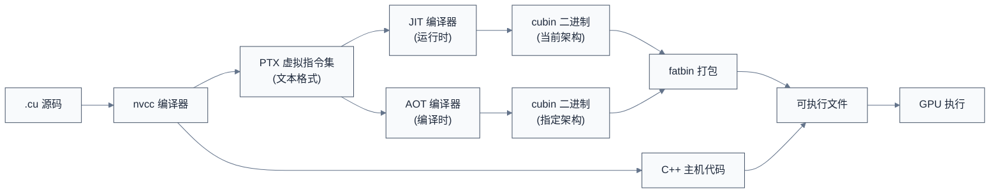
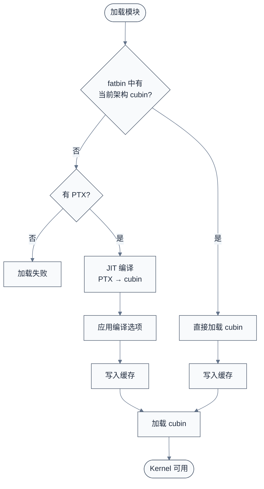

# 模块加载与 PTX 编译

> 上一章深入了 Driver API 的语义，理解了模块（Module）是 GPU 代码的容器。一个自然的问题是：用户写的 .cu 代码如何变成 GPU 可执行的指令？本章深入 PTX 虚拟指令集、JIT 编译流程、fatbin 格式，以及模块加载的内部机制。
>
> **工程师视角**：理解 PTX 和 JIT 编译是系统软件工程师的关键能力——它解释了为什么同一份 CUDA 代码可以运行在 Volta、Ampere、Hopper 等不同架构上，也解释了首次调用 Kernel 时的延迟来源。

### 关键术语

| 缩写 | 全称 | 含义 |
|------|------|------|
| PTX | Parallel Thread Execution | NVIDIA 虚拟指令集，JIT 编译的中间表示 |
| SASS | Shader Assembly Syntax | GPU 实际执行的机器指令 |
| cubin | CUDA Binary | 特定架构的二进制编译产物 |
| fatbin | Fat Binary | 包含多个架构代码的打包格式 |
| JIT | Just-In-Time Compilation | 运行时编译，PTX → cubin |
| AOT | Ahead-Of-Time Compilation | 提前编译，nvcc 直接生成 cubin |
| SM | Streaming Multiprocessor | GPU 架构代号（如 sm_80 对应 Ampere） |
| Compute Capability | — | 计算能力，如 8.0 对应 sm_80 |
| Linker | — | 链接器，合并多个 PTX/cubin |
| nvcc | NVIDIA CUDA Compiler | CUDA 编译器 |
| nvrtc | NVIDIA Runtime Compilation | 运行时编译库 |

### 前置知识

| 需要了解 | 参考文档 |
|----------|----------|
| CUDA Driver API（cuModuleLoad、cuLaunchKernel） | [06-CUDA-Driver接口与实现](./06-CUDA-Driver接口与实现.md) |
| CUDA 编程模型（Kernel、Thread、Block） | [02-CUDA编程模型](./02-CUDA编程模型.md) |
| 编译原理基础（前端、中间表示、后端） | — |

***

## 1. 编译产物：从源码到 GPU 指令

> 在深入 PTX 之前，先理解 CUDA 代码的完整编译链——从 .cu 源码到 GPU 实际执行的指令。

### 1.1 编译链概览



**如何读这张图**：
- **源码**：用户编写的 .cu 文件，包含主机代码和设备代码
- **nvcc 编译器**：分离主机代码和设备代码，分别编译
- **PTX**：虚拟指令集，文本格式，可移植到不同 GPU 架构
- **cubin**：特定架构的二进制，不可移植
- **fatbin**：包含多个 cubin/PTX 的打包格式，支持多架构
- **JIT**：运行时编译，PTX → cubin
- **AOT**：提前编译，nvcc 直接生成 cubin

### 1.2 三种编译产物对比

| 产物 | 格式 | 可移植性 | 性能 | 典型用途 |
|------|------|----------|------|----------|
| **PTX** | 文本 | 高（跨架构） | 中等（需 JIT） | 跨架构部署、动态生成 |
| **cubin** | 二进制 | 低（单架构） | 高（直接执行） | 特定架构优化 |
| **fatbin** | 打包 | 高（多架构） | 高（自动选择） | 多架构部署 |

> **核心要点**：PTX 是"中间表示"，cubin 是"最终产物"，fatbin 是"打包格式"。JIT 编译把 PTX 转换为当前 GPU 可执行的 cubin，是 CUDA 跨架构兼容的关键。

***

## 2. PTX 虚拟指令集

> PTX 是 CUDA 的核心设计——一个稳定的虚拟指令集，让同一份代码可以运行在不同 GPU 架构上。本节深入 PTX 的结构、指令、以及与 SASS 的关系。

### 2.1 PTX 的本质

**定义**：PTX（Parallel Thread Execution）是 NVIDIA 定义的虚拟指令集架构（ISA），作为 CUDA 编译的中间表示。

**类比**：PTX 类似于 Java 字节码或 LLVM IR——一个稳定的中间层，让前端（nvcc）和后端（JIT 编译器）解耦。

**PTX 文件结构**：

```ptx
.version 7.0                    // PTX 版本
.target sm_80                   // 目标架构（sm_80 = Ampere）
.address_size 64                // 地址空间大小（64 位）

// 入口函数声明
.visible .entry myKernel(
    .param .u64 input,          // 参数：64 位无符号整数（指针）
    .param .u32 n
) {
    // 寄存器声明
    .reg .u64 %rd<5>;
    .reg .u32 %r<3>;
    .reg .pred %p<2>;
    
    // 加载参数
    ld.param.u64 %rd1, [input];
    ld.param.u32 %r1, [n];
    
    // 计算线程索引
    mov.u32 %r2, %tid.x;        // threadIdx.x
    mov.u32 %r3, %ntid.x;       // blockDim.x
    
    // 边界检查
    setp.ge.u32 %p1, %r2, %r1;
    @%p1 bra END;               // if (threadIdx.x >= n) goto END;
    
    // 数据访问
    cvta.to.global.u64 %rd2, %rd1;
    mad.wide.u32 %rd3, %r2, 4, %rd2;
    ld.global.f32 %f1, [%rd3];
    
    // 计算
    mul.f32 %f2, %f1, 2.0;
    st.global.f32 [%rd3], %f2;
    
END:
    ret;
}
```

**关键指令分类**：

| 类别 | 指令示例 | 说明 |
|------|----------|------|
| **数据传输** | `ld.global.f32`、`st.global.f32` | 全局内存加载/存储 |
| **算术运算** | `add.f32`、`mul.f32`、`mad.f32` | 浮点加减乘 |
| **整数运算** | `add.u32`、`mul.lo.u32`、`mad.wide.u32` | 整数运算 |
| **比较与分支** | `setp.ge.u32`、`bra`、`@%p1 bra` | 条件分支 |
| **类型转换** | `cvta.to.global.u64` | 地址空间转换 |
| **特殊函数** | `sin.f32`、`cos.f32`、`sqrt.f32` | 数学函数 |
| **同步** | `bar.sync` | Block 内同步 |

### 2.2 PTX vs SASS

**PTX**：虚拟指令集，文本格式，可移植
**SASS**：实际机器指令，二进制格式，特定架构

**对比**：

| 维度 | PTX | SASS |
|------|-----|------|
| **抽象层次** | 虚拟 ISA | 物理 ISA |
| **格式** | 文本 | 二进制 |
| **可移植性** | 高（跨架构） | 低（单架构） |
| **性能** | 需要 JIT 编译 | 直接执行 |
| **稳定性** | 稳定（向后兼容） | 不稳定（架构相关） |
| **可读性** | 高 | 低 |

**为什么需要两层？**

1. **稳定性**：PTX 提供稳定的接口，让旧代码能在新架构上运行
2. **优化空间**：JIT 编译器可以利用当前架构的特性进行优化
3. **调试方便**：PTX 是文本格式，便于调试和分析

### 2.3 内联 PTX

CUDA 允许在 C++ 代码中直接嵌入 PTX 指令，称为内联 PTX（Inline PTX）。

**语法**：

```c
// 单条指令
int result;
asm("mov.u32 %0, %clock;" : "=r"(result));

// 多条指令
asm volatile(
    "membar.cta;"
    "mov.u32 %0, %tid.x;"
    : "=r"(threadIdx_x)
);
```

**具体例子**：读取 GPU 时钟周期

```c
__device__ uint64_t getGlobalTimer() {
    uint64_t timer;
    asm volatile("mov.u64 %0, %globaltimer;" : "=l"(timer));
    return timer;
}
```

**适用场景**：
- 访问 PTX 指令但 CUDA C++ 未暴露的功能
- 精确控制寄存器使用
- 实现特定架构的优化

**参考源码**：CUDA Samples 的 [inlinePTX 示例](./src/cuda-samples/cpp/2_Concepts_and_Techniques/inlinePTX/) 展示了内联 PTX 的使用方法。

> **核心要点**：PTX 是 CUDA 的虚拟指令集，提供稳定的中间表示。SASS 是 GPU 实际执行的指令，特定于架构。内联 PTX 允许开发者直接控制底层指令，但牺牲了可移植性。

***

## 3. JIT 编译流程

> JIT（Just-In-Time）编译是 CUDA 跨架构兼容的核心机制。本节深入 JIT 编译的流程、选项、缓存机制。

### 3.1 JIT 编译的触发时机

**触发条件**：
1. 加载的模块只有 PTX，没有当前架构的 cubin
2. 使用 `cuModuleLoadData` 加载 fatbin
3. Runtime 启动时加载嵌入的 fatbin

**具体流程**：



### 3.2 编译选项

**JIT 编译选项**（参考 CUDA Driver API Reference §3.17）：

| 选项 | 说明 | 用途 |
|------|------|------|
| `CU_JIT_WALL_TIME` | 返回 JIT 编译耗时 | 性能分析 |
| `CU_JIT_INFO_LOG_BUFFER` | 信息日志缓冲区 | 调试 |
| `CU_JIT_ERROR_LOG_BUFFER` | 错误日志缓冲区 | 错误诊断 |
| `CU_JIT_OPTIMIZATION_LEVEL` | 优化级别（0-4） | 控制优化 |
| `CU_JIT_TARGET_FROM_CUCONTEXT` | 从上下文获取目标架构 | 自动适配 |
| `CU_JIT_LOG_VERBOSE` | 详细日志 | 调试 |
| `CU_JIT_GENERATE_DEBUG_INFO` | 生成调试信息 | cuda-gdb 调试 |

### 3.3 JIT 编译缓存

**缓存机制**：JIT 编译结果会缓存到磁盘，下次加载同一 PTX 时直接使用。

**缓存位置**（Linux）：

```
~/.nv/ComputeCache/
├── <hash>/
│   ├── cubin          // 编译后的 cubin
│   └── metadata       // 元数据（源文件、修改时间等）
```

**缓存控制**：

```bash
# 禁用缓存
export CUDA_CACHE_DISABLE=1

# 设置缓存大小（默认 256 MB）
export CUDA_CACHE_MAXSIZE=536870912  # 512 MB

# 指定缓存路径
export CUDA_CACHE_PATH=/path/to/cache

# 查看缓存统计
ls -la ~/.nv/ComputeCache/
```

**缓存命中**：当 PTX 源码、目标架构、编译选项都匹配时，直接使用缓存的 cubin，避免重复编译。

### 3.4 真实源码分析：ptxjit 示例

下面分析 CUDA Samples 的 [ptxjit.cpp](./src/cuda-samples/cpp/3_CUDA_Features/ptxjit/ptxjit.cpp)，展示完整的 JIT 编译流程：

```c
/* 摘自 [src/cuda-samples/cpp/3_CUDA_Features/ptxjit/ptxjit.cpp](./src/cuda-samples/cpp/3_CUDA_Features/ptxjit/ptxjit.cpp) 第 96-164 行 */
void ptxJIT(int argc, char **argv, CUmodule *phModule, CUfunction *phKernel, CUlinkState *lState)
{
    CUjit_option options[6];
    void        *optionVals[6];
    float        walltime;
    char         error_log[8192], info_log[8192];
    unsigned int logSize = 8192;
    
    // 1. 设置 JIT 编译选项
    // 返回 JIT 编译耗时
    options[0]    = CU_JIT_WALL_TIME;
    optionVals[0] = (void *)&walltime;
    
    // 信息日志缓冲区
    options[1]    = CU_JIT_INFO_LOG_BUFFER;
    optionVals[1] = (void *)info_log;
    options[2]    = CU_JIT_INFO_LOG_BUFFER_SIZE_BYTES;
    optionVals[2] = (void *)(long)logSize;
    
    // 错误日志缓冲区
    options[3]    = CU_JIT_ERROR_LOG_BUFFER;
    optionVals[3] = (void *)error_log;
    options[4]    = CU_JIT_ERROR_LOG_BUFFER_SIZE_BYTES;
    optionVals[4] = (void *)(long)logSize;
    
    // 详细日志
    options[5]    = CU_JIT_LOG_VERBOSE;
    optionVals[5] = (void *)1;
    
    // 2. 创建链接器（允许多个 PTX/cubin 合并）
    checkCudaErrors(cuLinkCreate(6, options, optionVals, lState));
    
    // 3. 加载 PTX 源码
    if (!findModulePath(PTX_FILE, module_path, argv, ptx_source)) {
        exit(EXIT_FAILURE);
    }
    
    // 4. 把 PTX 加入链接器
    myErr = cuLinkAddData(*lState, CU_JIT_INPUT_PTX,
                          (void *)ptx_source.c_str(),
                          strlen(ptx_source.c_str()) + 1,
                          0, 0, 0, 0);
    
    if (myErr != CUDA_SUCCESS) {
        fprintf(stderr, "PTX Linker Error:\n%s\n", error_log);
    }
    
    // 5. 完成链接，生成 cubin
    checkCudaErrors(cuLinkComplete(*lState, &cuOut, &outSize));
    
    printf("CUDA Link Completed in %fms. Linker Output:\n%s\n", walltime, info_log);
    
    // 6. 加载 cubin 到模块
    checkCudaErrors(cuModuleLoadData(phModule, cuOut));
    
    // 7. 解析函数符号
    checkCudaErrors(cuModuleGetFunction(phKernel, *phModule, "myKernel"));
    
    // 8. 销毁链接器
    checkCudaErrors(cuLinkDestroy(*lState));
}
```

**这段代码体现了什么设计决策？** PTX JIT 编译器把"加载 PTX → 设置选项 → 链接 → 生成 cubin → 加载模块 → 解析函数"完整暴露给开发者。注意 `cuLinkCreate`/`cuLinkAddData`/`cuLinkComplete` 三步——这是一个完整的链接器接口，允许把多个 PTX/cubin/库文件合并成一个模块。Runtime 的 `<<<>>>` 语法糖在后台自动完成这些步骤，但无法支持这种"运行时动态链接"的场景。

**ptxjit_kernel.cu** 被编译为 PTX 的 kernel：

```c
/* 摘自 [src/cuda-samples/cpp/3_CUDA_Features/ptxjit/ptxjit_kernel.cu](./src/cuda-samples/cpp/3_CUDA_Features/ptxjit/ptxjit_kernel.cu) 第 32-36 行 */
extern "C" __global__ void myKernel(int *data)
{
    int tid   = blockIdx.x * blockDim.x + threadIdx.x;
    data[tid] = tid;
}
```

**注意 `extern "C"`**：避免 C++ name mangling，让 Driver API 能用 `"myKernel"` 这个名字查找函数。如果不用 `extern "C"`，编译器会生成 mangled name（如 `_Z8myKernelPi`），必须用 `cuModuleGetFunction(module, "_Z8myKernelPi")` 查找。

> **核心要点**：JIT 编译是 CUDA 跨架构兼容的关键。PTX 是中间表示，运行时由 JIT 编译器转换为当前架构的 cubin。编译结果会被缓存，避免重复编译。`cuLinkCreate` 系列接口允许运行时动态链接多个 PTX/cubin。

***

## 4. 模块加载接口

> 理解了 JIT 编译后，本节深入模块加载的具体接口——`cuModuleLoad` 系列函数的语义和差异。

### 4.1 模块加载 API 对比

| API | 输入 | 用途 |
|-----|------|------|
| `cuModuleLoad` | 文件路径 | 从文件加载 cubin/fatbin |
| `cuModuleLoadData` | 内存数据 | 从内存加载 cubin/fatbin/PTX |
| `cuModuleLoadFatBinary` | fatbin 数据 | 专门加载 fatbin |
| `cuLinkCreate` + `cuLinkAddData` + `cuLinkComplete` | 多个输入 | 链接多个 PTX/cubin |

### 4.2 cuModuleLoad

**语义**：从文件加载模块。

```c
CUresult cuModuleLoad(CUmodule *module, const char *fname);
```

**特点**：
- 文件必须是 cubin 或 fatbin 格式
- 加载到当前上下文
- 如果是 fatbin，自动选择当前架构的 cubin

**具体例子**：

```c
CUmodule module;
cuModuleLoad(&module, "kernel.cubin");  // 从文件加载
```

### 4.3 cuModuleLoadData

**语义**：从内存加载模块。

```c
CUresult cuModuleLoadData(CUmodule *module, const void *image);
```

**特点**：
- `image` 指向内存中的模块数据
- 支持 cubin、fatbin、PTX 格式
- 如果是 PTX，会触发 JIT 编译

**具体例子**：

```c
// PTX 代码作为字符串
const char *ptx = 
    ".version 7.0\n"
    ".target sm_80\n"
    ".address_size 64\n"
    ".visible .entry myKernel(.param .u64 data) {\n"
    "    .reg .u64 %rd<2>;\n"
    "    ld.param.u64 %rd1, [data];\n"
    "    ret;\n"
    "}\n";

CUmodule module;
cuModuleLoadData(&module, ptx);  // 从内存加载，触发 JIT
```

### 4.4 cuModuleLoadFatBinary

**语义**：从 fatbin 数据加载模块。

```c
CUresult cuModuleLoadFatBinary(CUmodule *module, const void *fatCubin);
```

**特点**：
- 专门用于 fatbin 格式
- 自动选择当前架构的 cubin
- 如果没有匹配的 cubin，但有 PTX，触发 JIT 编译

### 4.5 链接器接口

**`cuLinkCreate`**：创建链接器

```c
CUresult cuLinkCreate(unsigned int numOptions, CUjit_option *options,
                      void **optionValues, CUlinkState *stateOut);
```

> **版本提示**:CUDA 12.0 内部引入了带版本号的 `cuLinkCreate_v2` 别名(在头文件 `cudaGLApi.h` / `cuda_api.h` 中通过宏切换),用于后续扩展时校验参数布局。用户代码仍调用 `cuLinkCreate`,链接时由 CUDA 头自动映射到 `_v2`,无需手动修改。

**`cuLinkAddData`**：添加输入数据

```c
CUresult cuLinkAddData(CUlinkState state, CUjitInputType type,
                       void *data, size_t size, const char *name,
                       unsigned int numOptions, CUjit_option *options, void **optionValues);
```

**输入类型**：

| 类型 | 说明 |
|------|------|
| `CU_JIT_INPUT_CUBIN` | cubin 二进制 |
| `CU_JIT_INPUT_PTX` | PTX 文本 |
| `CU_JIT_INPUT_FATBINARY` | fatbin |
| `CU_JIT_INPUT_OBJECT` | 目标文件 |
| `CU_JIT_INPUT_LIBRARY` | 库文件 |

**`cuLinkComplete`**：完成链接

```c
CUresult cuLinkComplete(CUlinkState state, void **cubinOut, size_t *sizeOut);
```

**`cuLinkDestroy`**：销毁链接器

```c
CUresult cuLinkDestroy(CUlinkState state);
```

> **核心要点**：Driver API 提供多种模块加载方式，从文件、内存、fatbin 都可以加载。链接器接口（`cuLinkCreate` 系列）允许运行时动态合并多个 PTX/cubin，是 Runtime API 无法支持的强大功能。

***

## 5. fatbin 格式

> fatbin 是 CUDA 的多架构打包格式。本节深入 fatbin 的结构、作用，以及如何使用 cuobjdump 工具分析。

### 5.1 fatbin 的本质

**定义**：fatbin（Fat Binary）是包含多个架构代码的打包格式，让同一份可执行文件支持多种 GPU 架构。

**结构**：

```
fatbin
├── Header（魔术字、版本、架构数量）
├── Entry 1: PTX for sm_70
├── Entry 2: cubin for sm_80
├── Entry 3: cubin for sm_90
└── ...
```

### 5.2 编译时指定架构

**nvcc 编译选项**：

```bash
# 生成支持 sm_70、sm_80、sm_90 的 fatbin
nvcc -arch=compute_70 -code=compute_70,sm_70,sm_80,sm_90 my_kernel.cu -o my_kernel

# 生成 PTX（用于 JIT）
nvcc -ptx my_kernel.cu -o my_kernel.ptx

# 生成 cubin（特定架构）
nvcc -cubin -arch=sm_80 my_kernel.cu -o my_kernel.cubin

# 生成 fatbin（默认）
nvcc -arch=sm_80 my_kernel.cu -o my_kernel
```

**架构代号**：

| 架构 | 计算能力 | 代号 | 代表 GPU |
|------|----------|------|----------|
| Kepler | 3.0, 3.5, 3.7 | sm_30, sm_35, sm_37 | K20, K40, K80 |
| Maxwell | 5.0, 5.2, 5.3 | sm_50, sm_52, sm_53 | GTX 900, Tesla M40 |
| Pascal | 6.0, 6.1, 6.2 | sm_60, sm_61, sm_62 | P100, GTX 1080 |
| Volta | 7.0, 7.2 | sm_70, sm_72 | V100, Tegra Xavier |
| Turing | 7.5 | sm_75 | RTX 2080, T4 |
| Ampere | 8.0, 8.6 | sm_80, sm_86 | A100, RTX 3080 |
| Ada Lovelace | 8.9 | sm_89 | RTX 4090, RTX 4080 |
| Hopper | 9.0 | sm_90 | H100 |
| Blackwell | 10.0, 10.1 | sm_100, sm_101 | B200, B100 |

> **架构代号说明**:`sm_XX` 是 cubin 的目标架构(`-arch=sm_XX`),`compute_XX` 是 PTX 的虚拟架构(`-arch=compute_XX`)。PTX 向后兼容——`compute_70` 编译的 PTX 可在 sm_80/sm_90 上 JIT 运行,但反之不可。Hopper 引入 `sm_90a`(带架构特性后缀 `a`),用于启用 FP8 等架构特定功能。

### 5.3 cuobjdump 工具

**功能**：分析 fatbin/cubin/PTX 的内容。

**查看 fatbin 内容**：

```bash
# 查看可执行文件中的 fatbin
cuobjdump my_kernel

# 输出示例：
# Fatbin elf code:
# ================
# arch = sm_70
# code version = [1,7]
# producer = nvcc
# host = linux
# compile_time = 2024-01-01 12:00:00
# 
# Fatbin ptx code:
# ================
# arch = compute_70
# code version = [7,0]
# producer = nvcc
```

**反汇编 cubin 为 SASS**：

```bash
# 反汇编为 SASS
cuobjdump -sass my_kernel

# 输出示例：
# Function : myKernel
# .headerflags    @"EF_CUDA_SM80 EF_CUDA_64BIT_ADDRESS EF_CUDA_ELFSM80"
#         MOV R1, c[0x0][0x28];
#         S2R R0, SR_TID.X;
#         ...
```

**查看 PTX 代码**：

```bash
# 反汇编为 PTX
cuobjdump -ptx my_kernel
```

### 5.4 nvdisasm 工具

**功能**：SASS 反汇编器，比 cuobjdump 更详细。

```bash
# 反汇编 cubin
nvdisasm -print-life-ranges my_kernel.cubin
```

> **核心要点**：fatbin 是 CUDA 的多架构打包格式，让同一份代码支持多种 GPU。nvcc 通过 `-arch` 和 `-code` 选项控制生成的架构。cuobjdump 和 nvdisasm 是分析编译产物的必备工具。

***

## 6. nvrtc：运行时编译库

> nvrtc（NVIDIA Runtime Compilation）是 CUDA 提供的运行时编译库，允许在程序运行时编译 CUDA 源码为 PTX。本节介绍 nvrtc 的使用场景和 API。

### 6.1 nvrtc vs nvcc

| 维度 | nvcc | nvrtc |
|------|------|-------|
| **运行时机** | 编译时 | 运行时 |
| **输入** | .cu 文件 | .cu 源码字符串 |
| **输出** | 可执行文件 | PTX 字符串 |
| **依赖** | 需要安装 CUDA Toolkit | 只需要 libnvrtc.so |
| **适用场景** | 预编译代码 | 动态生成代码 |

### 6.2 nvrtc API

**头文件**：

```c
#include <nvrtc.h>
```

**链接库**：

```bash
gcc program.c -lnvrtc -o program
```

**基本流程**：

```c
// 1. 创建编译程序
nvrtcProgram prog;
nvrtcCreateProgram(&prog, cuda_source, "my_kernel.cu", 0, NULL, NULL);

// 2. 设置编译选项
const char *options[] = {
    "--gpu-architecture=compute_80",
    "-std=c++14"
};

// 3. 编译
nvrtcResult result = nvrtcCompileProgram(prog, 2, options);

// 4. 获取编译日志（如果有错误）
if (result != NVRTC_SUCCESS) {
    size_t log_size;
    nvrtcGetProgramLogSize(prog, &log_size);
    char *log = (char *)malloc(log_size);
    nvrtcGetProgramLog(prog, log);
    printf("Compile log:\n%s\n", log);
    free(log);
}

// 5. 获取 PTX 代码
size_t ptx_size;
nvrtcGetPTXSize(prog, &ptx_size);
char *ptx = (char *)malloc(ptx_size);
nvrtcGetPTX(prog, ptx);

// 6. 加载 PTX 到 CUDA Driver
CUmodule module;
cuModuleLoadData(&module, ptx);

// 7. 销毁编译程序
nvrtcDestroyProgram(&prog);
```

### 6.3 nvrtc 的应用场景

**场景 1：动态生成 Kernel**

```c
// 根据运行时参数生成 Kernel
char kernel_source[1024];
sprintf(kernel_source,
    "extern \"C\" __global__ void scale(float *data, int n) {\n"
    "    int i = blockIdx.x * blockDim.x + threadIdx.x;\n"
    "    if (i < n) data[i] *= %ff;\n"
    "}\n",
    scale_factor);

// 编译并执行
compile_and_run(kernel_source);
```

**场景 2：Torch、TensorFlow 等 JIT 编译**

PyTorch 和 TensorFlow 使用 nvrtc 在运行时编译自定义 Kernel，避免预编译的开销。

> **核心要点**：nvrtc 允许在运行时编译 CUDA 源码为 PTX，适用于动态生成 Kernel 的场景。它与 Driver API 的 `cuModuleLoadData` 配合，实现完整的运行时编译流程。

***

## 7. 设计决策：为什么需要 PTX 和 JIT？

> 理解了 PTX 和 JIT 编译后，本节从系统软件工程师的视角，分析这些设计决策的动机。

### 7.1 为什么需要 PTX 这个中间层？

**设计动机**：

1. **解耦前端和后端**：nvcc 只需要把 CUDA C++ 编译为 PTX，不需要关心具体的 GPU 架构。JIT 编译器把 PTX 转换为特定架构的 cubin。
2. **跨架构兼容**：同一份 PTX 可以运行在 Volta、Ampere、Hopper 等不同架构上，JIT 编译器负责适配。
3. **稳定性**：PTX 是稳定的接口，向后兼容。旧 PTX 可以在新 GPU 上运行，但新 PTX 不能在旧 GPU 上运行。

**权衡**：
- **优点**：跨架构兼容、稳定性、优化空间
- **缺点**：JIT 编译开销（首次启动延迟）、PTX 不能直接执行

### 7.2 为什么不直接编译为 cubin？

**场景**：如果直接编译为 cubin，每个架构都需要一个版本。

**问题**：
- 可执行文件体积大
- 无法支持新架构（除非重新编译）

**解决方案**：fatbin 打包多个架构的 cubin + PTX 兜底。

**具体例子**：

```bash
# 编译时包含多个架构 + PTX 兜底
nvcc -arch=compute_70 \
     -code=compute_70,sm_70,sm_80,sm_90 \
     my_kernel.cu -o my_kernel
```

**加载顺序**：
1. 如果有当前架构的 cubin，直接加载
2. 否则，如果有 PTX，JIT 编译
3. 否则，加载失败

### 7.3 为什么需要链接器？

**设计动机**：

1. **动态加载**：运行时动态加载外部 PTX/cubin，无需重新编译主程序
2. **模块化**：把不同功能的 Kernel 分到不同文件，运行时合并
3. **插件系统**：第三方可以提供 PTX 插件，主程序动态加载

**具体例子**：

```c
// 主程序
CUlinkState linkState;
cuLinkCreate(0, NULL, NULL, &linkState);

// 添加主 Kernel
cuLinkAddData(linkState, CU_JIT_INPUT_PTX, main_kernel_ptx, ...);

// 添加插件 Kernel（从配置文件加载）
cuLinkAddData(linkState, CU_JIT_INPUT_PTX, plugin_kernel_ptx, ...);

// 完成链接
void *cubin;
size_t cubinSize;
cuLinkComplete(linkState, &cubin, &cubinSize);

// 加载合并后的模块
CUmodule module;
cuModuleLoadData(&module, cubin);
```

> **核心要点**：PTX 和 JIT 编译是 CUDA 跨架构兼容的关键设计。PTX 提供稳定的中间表示，JIT 编译器在运行时适配当前架构。fatbin 打包多架构代码，链接器支持运行时动态合并。

***

## 参考资料

- [PTX ISA Reference](https://docs.nvidia.com/cuda/parallel-thread-execution/) — 参考了 PTX 指令集、寄存器声明、地址空间
- [CUDA Driver API Reference §3.17. Module Management](https://docs.nvidia.com/cuda/cuda-driver-api/group__CUDA__MODULE.html) — 参考了模块加载和 JIT 编译 API
- [CUDA Binary Utilities](https://docs.nvidia.com/cuda/cuda-binary-utilities/) — 参考了 cuobjdump、nvdisasm 工具
- [NVRTC Documentation](https://docs.nvidia.com/cuda/nvrtc/) — 参考了运行时编译库

***

**上一篇**：[06-CUDA-Driver接口与实现](./06-CUDA-Driver接口与实现.md)
**下一篇**：[08-错误处理与调试技术](./08-错误处理与调试技术.md) — 深入错误码体系、调试工具、性能分析
