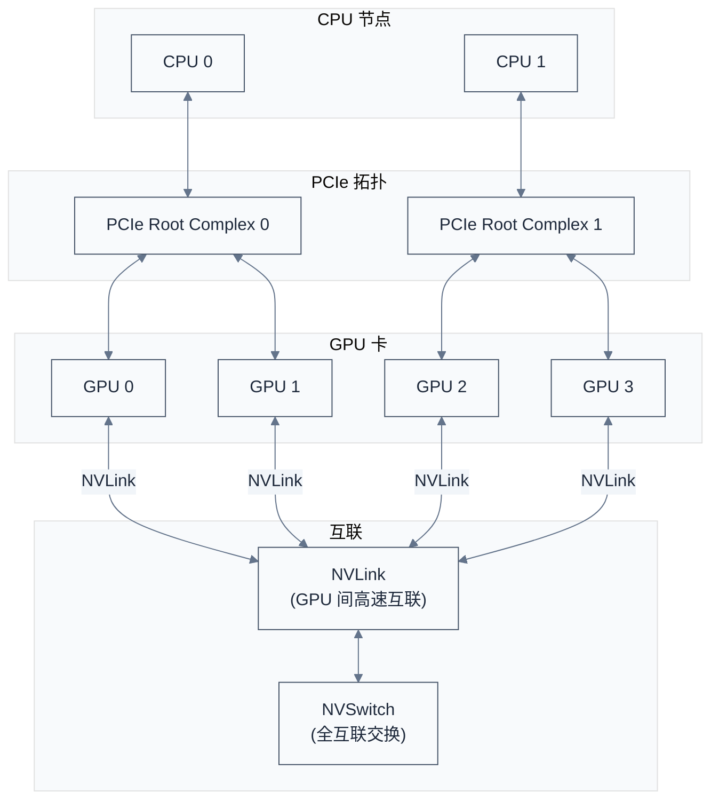

# 多 GPU 编程与互联拓扑

> 前八章聚焦单 GPU 编程。当计算需求超过单卡能力时，需要多 GPU 扩展。本章深入多 GPU 架构、互联拓扑（PCIe/NVLink/NVSwitch）、P2P 通信、统一地址空间。
>
> **工程师视角**：多 GPU 系统不是简单的"卡数相乘"——互联拓扑决定了实际带宽，P2P 通信决定了延迟。理解这些硬件特性，才能设计高效的多卡程序。这也是理解 NCCL（[../nccl/](../nccl/)）的基础。

### 关键术语

| 缩写 | 全称 | 含义 |
|------|------|------|
| P2P | Peer-to-Peer | GPU 间直接通信，不经 CPU |
| UVA | Unified Virtual Addressing | 统一虚拟地址空间 |
| UM | Unified Memory | 统一内存 |
| NVLink | — | NVIDIA GPU 间高速互联 |
| NVSwitch | — | NVLink 全互联交换芯片 |
| PCIe | Peripheral Component Interconnect Express | 标准外设互联 |
| GPUDirect | — | GPU 直接访问技术（RDMA、P2P） |
| DGX | — | NVIDIA 数据科学服务器 |
| Topology | — | 拓扑，GPU 间的物理连接关系 |
| P2P Access | — | P2P 访问，GPU 直接读写另一 GPU 内存 |
| P2P Copy | — | P2P 拷贝，通过 cudaMemcpyPeer 传输 |
| Unified Addressing | — | 统一寻址，所有 GPU 共享地址空间 |

### 9.1 前置知识

| 需要了解 | 参考文档 |
|----------|----------|
| CUDA 内存管理（cudaMalloc、cudaMemcpy） | [03-内存管理与地址空间](./03-内存管理与地址空间.md) |
| CUDA 执行模型（Stream、同步） | [04-执行模型与同步机制](./04-执行模型与同步机制.md) |
| 多 GPU 互联背景 | [../nccl/02-gpu-interconnect-background.md](../nccl/02-gpu-interconnect-background.md) |

***

## 1. 多 GPU 系统架构

> 在深入编程之前，先理解多 GPU 系统的硬件架构——互联方式决定了性能上限。

### 1.1 系统上下文



**如何读这张图**：
- **CPU 节点**：多路 CPU（如双路 Xeon/EPYC），每个 CPU 有自己的 PCIe Root Complex
- **PCIe 拓扑**：GPU 通过 PCIe 连接到 CPU，跨 CPU 通信需要经过 QPI/UPI
- **NVLink**：GPU 间高速互联，带宽远高于 PCIe
- **NVSwitch**：在 DGX 系统中，所有 GPU 通过 NVSwitch 全互联

### 1.2 互联方式对比

| 互联方式 | 单向带宽 | 延迟 | 典型用途 |
|----------|----------|------|----------|
| **PCIe 3.0 x16** | ~16 GB/s | ~5-10 μs | 通用 GPU 卡 |
| **PCIe 4.0 x16** | ~32 GB/s | ~5-10 μs | 现代 GPU 卡 |
| **PCIe 5.0 x16** | ~64 GB/s | ~3-5 μs | 最新 GPU 卡 |
| **NVLink 2.0** | 150 GB/s | ~1-2 μs | V100 |
| **NVLink 3.0** | 300 GB/s | ~1-2 μs | A100 |
| **NVLink 4.0** | 450 GB/s | ~1-2 μs | H100 |

**关键差异**：
- **PCIe**：标准外设互联，需要经过 CPU 中转
- **NVLink**：GPU 间直连，不需要 CPU 中转，带宽高、延迟低
- **NVSwitch**：让所有 GPU 两两直连，实现全互联

### 1.3 拓扑对性能的影响

**场景 1：同 PCIe Root Complex 下的 GPU**

```
CPU0 ─── PCIe0 ─── GPU0
              └── GPU1
```

GPU0 和 GPU1 之间的 P2P 传输不需要经过 CPU，性能最好。

**场景 2：跨 PCIe Root Complex 的 GPU**

```
CPU0 ─── PCIe0 ─── GPU0
                 └── GPU1
CPU1 ─── PCIe1 ─── GPU2
                 └── GPU3
```

GPU0 和 GPU2 之间的传输需要经过 CPU 互联（QPI/UPI），性能较差。

**如何查询拓扑？**

```c
// 查询两 GPU 之间的 P2P 能力
int canAccess;
cudaDeviceCanAccessPeer(&canAccess, 0, 1);
printf("GPU 0 can access GPU 1: %s\n", canAccess ? "Yes" : "No");
```

```bash
# 使用 nvidia-smi 查询拓扑
nvidia-smi topo -m
# 输出示例：
#       GPU0  GPU1  GPU2  GPU3
# GPU0   X   NV12  NV12  NV12
# GPU1  NV12   X   NV12  NV12
# GPU2  NV12  NV12   X   NV12
# GPU3  NV12  NV12  NV12   X
```

**拓扑标记说明**：

| 标记 | 含义 |
|------|------|
| `X` | 同一 GPU |
| `NV12` | NVLink 连接（12 条 lane） |
| `PIX` | 同一 PCIe Root Complex |
| `PHB` | 同一 PCIe Host Bridge |
| `SYS` | 跨 CPU 互联 |

> **核心要点**：多 GPU 系统的性能受互联拓扑影响巨大。NVLink 带宽远高于 PCIe，NVSwitch 实现全互联。使用 `nvidia-smi topo -m` 查询拓扑，根据拓扑设计通信模式。

***

## 2. 多 GPU 编程基础

> 理解了硬件拓扑后，本节介绍多 GPU 编程的基础——设备选择、上下文切换、内存分配。

### 2.1 设备选择

**API**：

```c
cudaError_t cudaSetDevice(int device);
```

**语义**：
- 设置当前设备
- 后续的 CUDA 操作（cudaMalloc、Kernel 启动）都在当前设备执行
- 线程本地存储（TLS），不影响其他线程

**具体例子**：

```c
int deviceCount;
cudaGetDeviceCount(&deviceCount);
printf("Found %d CUDA devices\n", deviceCount);

for (int i = 0; i < deviceCount; i++) {
    cudaSetDevice(i);
    
    cudaDeviceProp prop;
    cudaGetDeviceProperties(&prop, i);
    printf("Device %d: %s\n", i, prop.name);
}
```

### 2.2 多设备内存分配

**每个设备有独立的显存**：

```c
const int numGPUs = 4;
float *d_data[numGPUs];

for (int i = 0; i < numGPUs; i++) {
    cudaSetDevice(i);
    cudaMalloc((void **)&d_data[i], size);
}

// 每个设备的内存独立，互不影响
cudaSetDevice(0);
myKernel<<<blocks, threads>>>(d_data[0]);  // 在 GPU 0 上执行

cudaSetDevice(1);
myKernel<<<blocks, threads>>>(d_data[1]);  // 在 GPU 1 上执行
```

### 2.3 多设备 Kernel 启动

**不同设备可以并行执行 Kernel**：

```c
for (int i = 0; i < numGPUs; i++) {
    cudaSetDevice(i);
    myKernel<<<blocks, threads>>>(d_data[i]);
}

// 所有设备的 Kernel 异步并行执行
cudaDeviceSynchronize();  // 等待所有设备完成
```

**注意**：
- `cudaDeviceSynchronize()` 只同步当前设备
- 需要对每个设备调用同步

```c
// 同步所有设备
for (int i = 0; i < numGPUs; i++) {
    cudaSetDevice(i);
    cudaDeviceSynchronize();
}
```

### 2.4 多线程编程模型

**模型 1：每线程一个设备**

```c
void thread_func(int deviceId) {
    cudaSetDevice(deviceId);
    
    float *d_data;
    cudaMalloc((void **)&d_data, size);
    
    myKernel<<<blocks, threads>>>(d_data);
    
    cudaDeviceSynchronize();
    cudaFree(d_data);
}

// 启动多个线程
std::thread t0(thread_func, 0);
std::thread t1(thread_func, 1);
t0.join();
t1.join();
```

**优点**：
- 简单清晰
- 线程隔离，无竞争

**缺点**：
- 线程切换开销
- 资源不共享

> **核心要点**：多 GPU 编程的基础是 `cudaSetDevice` 切换当前设备。每个设备有独立的显存和执行队列，可以并行执行 Kernel。多线程编程时，建议每线程绑定一个设备。

***

## 3. P2P 通信

> P2P（Peer-to-Peer）是 GPU 间直接通信的能力，不需要经过 CPU 中转。本节深入 P2P 访问、P2P 拷贝、以及启用方法。

### 3.1 P2P 访问的概念

**传统方式**：GPU 0 → CPU → GPU 1

```
GPU0 内存 → PCIe → CPU 内存 → PCIe → GPU1 内存
```

**P2P 方式**：GPU 0 → NVLink/PCIe → GPU 1

```
GPU0 内存 → NVLink → GPU1 内存
```

**优势**：
- 不经过 CPU，延迟低
- 利用 NVLink 高带宽
- CPU 不参与，降低 CPU 负载

### 3.2 启用 P2P 访问

**API**：

```c
cudaError_t cudaDeviceEnablePeerAccess(int peerDevice, unsigned int flags);
```

**语义**：
- 启用当前设备对 `peerDevice` 的 P2P 访问
- 必须在两个设备上都启用
- `flags` 必须为 0

**真实源码**：CUDA Samples 的 [simpleP2P.cu](./src/cuda-samples/cpp/0_Introduction/simpleP2P/simpleP2P.cu) 展示了完整的 P2P 流程：

```c
/* 摘自 [src/cuda-samples/cpp/0_Introduction/simpleP2P/simpleP2P.cu](./src/cuda-samples/cpp/0_Introduction/simpleP2P/simpleP2P.cu) 第 127-132 行 */
// 在两个方向上都启用 P2P 访问
printf("Enabling peer access between GPU%d and GPU%d...\n", gpuid[0], gpuid[1]);
checkCudaErrors(cudaSetDevice(gpuid[0]));
checkCudaErrors(cudaDeviceEnablePeerAccess(gpuid[1], 0));
checkCudaErrors(cudaSetDevice(gpuid[1]));
checkCudaErrors(cudaDeviceEnablePeerAccess(gpuid[0], 0));
```

**这段代码体现了什么设计决策？** P2P 访问是**双向独立**的——GPU 0 启用对 GPU 1 的访问，并不自动让 GPU 1 也能访问 GPU 0。必须在每个设备上分别调用 `cudaDeviceEnablePeerAccess`，这是出于安全考虑：每个设备应该显式授权其他设备的访问。这种设计也意味着如果只有单向通信需求，只需启用一个方向。

### 3.3 P2P 拷贝

**API**：

```c
cudaError_t cudaMemcpyPeer(void *dst, int dstDevice, const void *src, int srcDevice, size_t count);
```

**语义**：
- 在两个设备之间拷贝数据
- 自动选择最优路径（NVLink 或 PCIe）
- 同步操作

**具体例子**：

```c
cudaSetDevice(0);
float *d_data0;
cudaMalloc((void **)&d_data0, size);

cudaSetDevice(1);
float *d_data1;
cudaMalloc((void **)&d_data1, size);

// P2P 拷贝
cudaMemcpyPeer(d_data1, 1, d_data0, 0, size);
```

### 3.4 统一虚拟地址（UVA）

**UVA 的本质**：所有 GPU 和 CPU 共享同一个虚拟地址空间。UVA 在 64 位操作系统和 64 位应用程序上默认启用(CUDA 4.0+),32 位平台不支持 UVA。

```c
// UVA 启用后，指针可以跨设备使用
float *d_data;
cudaSetDevice(0);
cudaMalloc((void **)&d_data, size);

// 在 GPU 1 上访问 GPU 0 的内存（需要 P2P 启用）
cudaSetDevice(1);
myKernel<<<blocks, threads>>>(d_data);  // d_data 指向 GPU 0 的内存
```

**UVA 的优势**：
1. **简化编程**：指针无需转换
2. **自动路由**：CUDA 运行时自动选择最优路径
3. **cudaMemcpyDefault**：使用 `cudaMemcpyDefault` 自动判断方向

**simpleP2P.cu 的 UVA 用法**：

```c
/* 摘自 [src/cuda-samples/cpp/0_Introduction/simpleP2P/simpleP2P.cu](./src/cuda-samples/cpp/0_Introduction/simpleP2P/simpleP2P.cu) 第 158-168 行 */
for (int i = 0; i < 100; i++) {
    // 借助 UVA，无需指定源和目标设备，runtime 根据指针自动判断
    if (i % 2 == 0) {
        checkCudaErrors(cudaMemcpy(g1, g0, buf_size, cudaMemcpyDefault));
    } else {
        checkCudaErrors(cudaMemcpy(g0, g1, buf_size, cudaMemcpyDefault));
    }
}
```

**关键点**：`cudaMemcpyDefault` 让 runtime 根据指针自动判断传输方向。这依赖于 UVA——所有指针都在同一个虚拟地址空间中，runtime 可以查询指针属于哪个设备。

### 3.5 跨设备 Kernel 访问

**启用 P2P 后，一个 GPU 的 Kernel 可以直接访问另一个 GPU 的内存**：

```c
/* 摘自 [src/cuda-samples/cpp/0_Introduction/simpleP2P/simpleP2P.cu](./src/cuda-samples/cpp/0_Introduction/simpleP2P/simpleP2P.cu) 第 193-200 行 */
// 在 GPU 1 上执行 Kernel，从 GPU 0 读取数据，写入 GPU 1
printf("Run kernel on GPU%d, taking source data from GPU%d and writing to GPU%d...\n",
       gpuid[1], gpuid[0], gpuid[1]);
checkCudaErrors(cudaSetDevice(gpuid[1]));
SimpleKernel<<<blocks, threads>>>(g0, g1);
```

**SimpleKernel 定义**：

```c
__global__ void SimpleKernel(float *src, float *dst) {
    int tid = blockIdx.x * blockDim.x + threadIdx.x;
    // src 指向 GPU 0 的内存，dst 指向 GPU 1 的内存
    // 通过 NVLink 直接访问，无需显式拷贝
    dst[tid] = src[tid] * 2.0f;
}
```

**性能影响**：
- **NVLink**：延迟低，带宽高，接近本地访问
- **PCIe**：延迟高，带宽低，性能下降明显

### 3.6 关闭 P2P 访问

```c
/* 摘自 [src/cuda-samples/cpp/0_Introduction/simpleP2P/simpleP2P.cu](./src/cuda-samples/cpp/0_Introduction/simpleP2P/simpleP2P.cu) 第 235-239 行 */
printf("Disabling peer access...\n");
checkCudaErrors(cudaSetDevice(gpuid[0]));
checkCudaErrors(cudaDeviceDisablePeerAccess(gpuid[1]));
checkCudaErrors(cudaSetDevice(gpuid[1]));
checkCudaErrors(cudaDeviceDisablePeerAccess(gpuid[0]));
```

> **核心要点**：P2P 通信让 GPU 间直接交换数据，不经过 CPU。必须双向启用 `cudaDeviceEnablePeerAccess`。UVA 让指针跨设备使用变得简单，`cudaMemcpyDefault` 自动判断传输方向。跨设备 Kernel 访问通过 NVLink 可以接近本地访问的性能。

***

## 4. NVLink 与 NVSwitch

> NVLink 是 NVIDIA 的高速互联技术，是多 GPU 系统的关键。本节深入 NVLink 的演进、带宽特性，以及 NVSwitch 的全互联架构。

### 4.1 NVLink 演进

| 版本 | 推出时间 | 单向带宽 | 链路数 | 代表 GPU |
|------|----------|----------|--------|----------|
| **NVLink 1.0** | 2016 (Pascal) | 80 GB/s | 4 | P100 |
| **NVLink 2.0** | 2017 (Volta) | 150 GB/s | 6 | V100 |
| **NVLink 3.0** | 2020 (Ampere) | 300 GB/s | 12 | A100 |
| **NVLink 4.0** | 2022 (Hopper) | 450 GB/s | 18 | H100 |
| **NVLink-C2C** | 2022 (Grace Hopper) | 900 GB/s | — | GH200 |

**关键改进**：
- **带宽翻倍**：每代 NVLink 带宽翻倍
- **链路数增加**：从 4 条增加到 18 条
- **全互联**：NVSwitch 让所有 GPU 两两直连

### 4.2 NVSwitch 架构

**问题**：NVLink 是点对点连接，N 个 GPU 要全互联需要 N(N-1)/2 条链路，成本极高。

**解决方案**：NVSwitch 提供交换功能，所有 GPU 连接到 NVSwitch，通过 NVSwitch 间接互联。

```
传统 NVLink：
GPU0 ─── GPU1
  │       │
GPU2 ─── GPU3
（需要 6 条链路才能全互联）

NVSwitch：
GPU0 ─┐
GPU1 ─┼── NVSwitch
GPU2 ─┤
GPU3 ─┘
（每个 GPU 只需一条链路到 NVSwitch）
```

**NVSwitch 的优势**：
- **全互联**：所有 GPU 两两直连
- **带宽翻倍**：聚合带宽 = 单链路 × GPU 数
- **简化设计**：无需复杂的点对点布线

### 4.3 DGX 系统拓扑

**DGX A100 拓扑**（8 个 A100）：

```
8 × A100 GPU
├── 每 GPU 12 条 NVLink 3.0
├── 6 个 NVSwitch
├── 全互联：每对 GPU 都有 600 GB/s 双向带宽
└── PCIe 4.0 连接到 CPU
```

**性能特征**：
- GPU 间带宽：600 GB/s（双向）
- GPU 到 CPU 带宽：64 GB/s（PCIe 4.0 x16）
- **结论**：GPU 间通信比 GPU-CPU 通信快 10 倍

### 4.4 查询 NVLink 拓扑

```c
// 查询 NVLink 信息(使用 Runtime API 枚举,不要混用 Driver API 枚举)
for (int i = 0; i < numGPUs; i++) {
    cudaSetDevice(i);

    for (int link = 0; link < 12; link++) {
        int remoteDevice;
        /* Runtime API 枚举为 cudaDevAttrNvLink1Device ~ cudaDevAttrNvLink12Device,
           不要用 Driver API 的 CU_DEVICE_ATTRIBUTE_NVLINK1_DEVICE;
           两套枚举值虽然对应同一物理概念,但数值不一定连续对齐。 */
        cudaDeviceAttribute attr;
        switch (link) {
            case 0: attr = cudaDevAttrNvLink1Device; break;
            case 1: attr = cudaDevAttrNvLink2Device; break;
            /* ... 省略 link 2-10 ... */
            case 11: attr = cudaDevAttrNvLink12Device; break;
            default: continue;
        }
        cudaDeviceGetAttribute(&remoteDevice, attr, i);
        if (remoteDevice >= 0) {
            printf("GPU %d NVLink %d → GPU %d\n", i, link, remoteDevice);
        }
    }
}
```

> **API 注意**:CUDA 11.0+ 推荐使用 `cuDeviceGetNvLinkRemoteDeviceType` / `cuDeviceGetNvLinkRemoteDeviceUuid`(Driver API)查询 NVLink 远端设备,旧的 `NVLINKx_DEVICE` 属性系列已软弃用,但在兼容性场景中仍可用。

```bash
# 使用 nvidia-smi 查询 NVLink 状态
nvidia-smi nvlink -s
nvidia-smi nvlink -r
```

> **核心要点**：NVLink 是 NVIDIA 的高速互联，带宽远高于 PCIe。NVSwitch 实现全互联，让所有 GPU 两两直连。DGX 系统提供 GPU 间 600 GB/s 的双向带宽，是多 GPU 训练的基础。

***

## 5. 多 GPU 编程模式

> 理解了硬件和 P2P 通信后，本节总结多 GPU 编程的常见模式。

### 5.1 数据并行

**概念**：每个 GPU 处理不同的数据子集，独立计算。

```c
// 数据并行：每 GPU 处理 1/4 数据
const int numGPUs = 4;
const int dataPerGPU = N / numGPUs;

for (int i = 0; i < numGPUs; i++) {
    cudaSetDevice(i);
    
    // 分配并拷贝数据子集
    cudaMalloc((void **)&d_data[i], dataPerGPU * sizeof(float));
    cudaMemcpy(d_data[i], h_data + i * dataPerGPU, 
               dataPerGPU * sizeof(float), cudaMemcpyHostToDevice);
    
    // 启动 Kernel
    myKernel<<<blocks, threads>>>(d_data[i], dataPerGPU);
}
```

### 5.2 模型并行

**概念**：模型太大，无法放入单个 GPU，将模型拆分到多个 GPU。

```c
// 模型并行：模型层 0 在 GPU 0，层 1 在 GPU 1
cudaSetDevice(0);
layer0Kernel<<<...>>>(input, intermediate);  // 在 GPU 0 计算中间结果

// 通过 P2P 传输中间结果到 GPU 1
cudaMemcpyPeer(d_input_gpu1, 1, intermediate, 0, size);

cudaSetDevice(1);
layer1Kernel<<<...>>>(d_input_gpu1, output);  // 在 GPU 1 计算最终结果
```

### 5.3 流水线并行

**概念**：把模型分成多个阶段，不同 GPU 执行不同阶段，形成流水线。

```c
// 流水线并行
cudaStream_t streams[numGPUs];
for (int i = 0; i < numGPUs; i++) {
    cudaSetDevice(i);
    cudaStreamCreate(&streams[i]);
}

// 每个 GPU 执行一个阶段，形成流水线
for (int batch = 0; batch < numBatches; batch++) {
    for (int stage = 0; stage < numGPUs; stage++) {
        cudaSetDevice(stage);
        stageKernel<<<blocks, threads, 0, streams[stage]>>>(
            d_data[stage], d_data[(stage + 1) % numGPUs]);
        
        // 通过 P2P 传输到下一个 GPU
        cudaMemcpyPeerAsync(d_data[(stage + 1) % numGPUs], (stage + 1) % numGPUs,
                           d_data[stage], stage, size, streams[stage]);
    }
}
```

### 5.4 与 MPI 结合

**概念**：跨节点的多 GPU 编程，使用 MPI 通信。

```c
#include <mpi.h>

int rank, size;
MPI_Init(&argc, &argv);
MPI_Comm_rank(MPI_COMM_WORLD, &rank);
MPI_Comm_size(MPI_COMM_WORLD, &size);

// 每个进程绑定一个 GPU
int numGPUs;
cudaGetDeviceCount(&numGPUs);
cudaSetDevice(rank % numGPUs);

// 本地计算
myKernel<<<blocks, threads>>>(d_data, n);
cudaDeviceSynchronize();

// 跨节点通信（CUDA-aware MPI）
MPI_Allreduce(d_data, d_result, n, MPI_FLOAT, MPI_SUM, MPI_COMM_WORLD);
```

**CUDA-aware MPI**：支持直接传输 GPU 内存，无需经过 CPU 中转。

> **核心要点**：多 GPU 编程有四种常见模式——数据并行（每 GPU 处理不同数据）、模型并行（模型拆分到多 GPU）、流水线并行（流水线阶段）、与 MPI 结合（跨节点）。选择哪种模式取决于模型大小、数据量、通信开销。

***

## 6. 性能优化

> 本节总结多 GPU 编程的性能优化技巧。

### 6.1 通信优化

**原则**：减少通信量，重叠计算和通信。

**技巧 1：梯度压缩**

```c
// 训练循环中，只传输梯度的稀疏表示
compressGradient(d_gradient, d_compressed, n);
cudaMemcpyPeer(d_compressed_remote, remoteDevice, d_compressed, 
               localDevice, compressed_size);
```

**技巧 2：流水线通信**

```c
// 前向计算时，提前传输下一批数据
for (int layer = 0; layer < numLayers; layer++) {
    cudaSetDevice(layer % numGPUs);
    
    // 启动当前层的计算
    forwardKernel<<<...>>>(d_input, d_output);
    
    // 同时传输下一层的输入
    if (layer < numLayers - 1) {
        cudaMemcpyPeerAsync(d_input_next, (layer + 1) % numGPUs,
                           d_output, layer % numGPUs, size, streams[layer]);
    }
}
```

### 6.2 负载均衡

**原则**：确保每个 GPU 的工作量相同，避免空闲。

```c
// 根据设备性能分配工作量
int performance[numGPUs];
for (int i = 0; i < numGPUs; i++) {
    cudaDeviceProp prop;
    cudaGetDeviceProperties(&prop, i);
    performance[i] = prop.multiProcessorCount;
}

int totalPerf = 0;
for (int i = 0; i < numGPUs; i++) {
    totalPerf += performance[i];
}

int offset = 0;
for (int i = 0; i < numGPUs; i++) {
    int workSize = N * performance[i] / totalPerf;
    cudaSetDevice(i);
    myKernel<<<blocks, threads>>>(d_data + offset, workSize);
    offset += workSize;
}
```

### 6.3 NCCL：集合通信库

**NCCL**（NVIDIA Collective Communications Library）是 NVIDIA 提供的多 GPU 集合通信库，自动优化拓扑。

```c
#include <nccl.h>

// 初始化 NCCL
ncclComm_t comms[numGPUs];
ncclCommInitAll(comms, numGPUs, NULL);

// AllReduce
ncclAllReduce(d_data, d_result, n, ncclFloat, ncclSum, 
              comms[0], streams[0]);
```

**NCCL 优势**：
- 自动选择最优通信路径
- 支持 Ring/Tree 算法
- 支持 NVLink/PCIe/IB
- 是 PyTorch DDP 的底层通信库

> 参考姊妹专题 [../nccl/](../nccl/) 深入学习 NCCL 的设计与实现。

> **核心要点**：多 GPU 性能优化的关键是减少通信、重叠计算与通信、负载均衡。NCCL 是 NVIDIA 官方的集合通信库，自动优化拓扑，是多 GPU 训练的事实标准。

***

## 参考资料

- [simpleP2P.cu](./src/cuda-samples/cpp/0_Introduction/simpleP2P/simpleP2P.cu) — 参考了 P2P 访问、UVA、跨设备 Kernel 访问的完整示例
- [simpleMultiGPU.cu](./src/cuda-samples/cpp/0_Introduction/simpleMultiGPU/simpleMultiGPU.cu) — 参考了多设备多线程编程
- [NVIDIA NVLink Whitepaper](https://www.nvidia.com/object/nvlink-whitepaper.html) — 参考了 NVLink 架构
- [NCCL Documentation](https://docs.nvidia.com/deeplearning/nccl/) — 参考了集合通信库
- [../nccl/](../nccl/) — 姊妹专题：NCCL 学习笔记

***

**上一篇**：[08-错误处理与调试技术](./08-错误处理与调试技术.md)
**下一篇**：[10-CUDA生态系统与最佳实践](./10-CUDA生态系统与最佳实践.md) — 深入 CUDA 生态、最佳实践、版本管理
