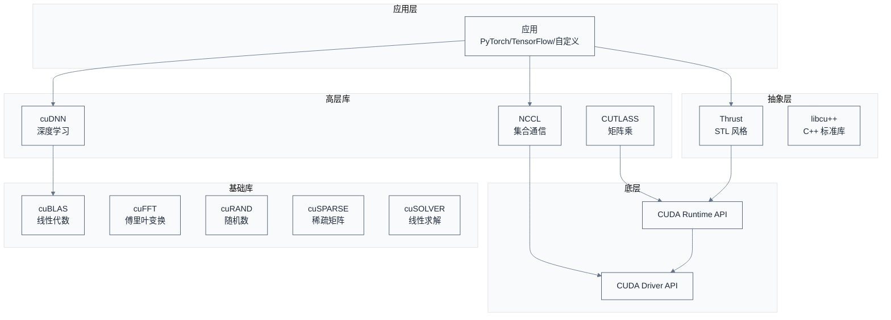
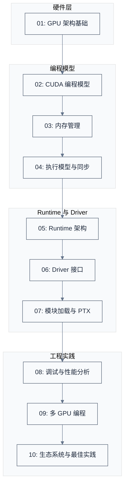

# CUDA 生态系统与最佳实践

> 前九章从硬件到软件、从理论到实践，建立了 CUDA 的完整知识体系。本章作为总结，介绍 CUDA 生态系统（cuBLAS、cuDNN、NCCL 等库）、工程实践的最佳实践、版本管理与兼容性。
>
> **工程师视角**：在实际开发中，很少直接手写 Kernel——成熟的库（cuBLAS、cuDNN）已经实现了高度优化的算法。理解何时使用现成库、何时手写 Kernel，是工程效率的关键。同时，CUDA 版本与驱动的兼容性是部署的基础。

### 关键术语

| 缩写 | 全称 | 含义 |
|------|------|------|
| cuBLAS | CUDA Basic Linear Algebra Subprograms | NVIDIA 线性代数库 |
| cuDNN | CUDA Deep Neural Network | NVIDIA 深度学习库 |
| NCCL | NVIDIA Collective Communications Library | NVIDIA 集合通信库 |
| Thrust | — | CUDA C++ 模板库（类似 STL） |
| libcu++ | — | CUDA C++ 标准库 |
| cuFFT | CUDA Fast Fourier Transform | NVIDIA FFT 库 |
| cuRAND | CUDA Random Number Generation | NVIDIA 随机数库 |
| cuSPARSE | CUDA Sparse Matrix | NVIDIA 稀疏矩阵库 |
| cuSOLVER | CUDA Solver | NVIDIA 线性求解库 |
| CUDA Toolkit | — | CUDA 工具包 |
| Enhanced Compatibility | — | 增强兼容性（向后兼容） |
| Minor Version Compatibility | — | 次要版本兼容性 |

### 10.1 前置知识

| 需要了解 | 参考文档 |
|----------|----------|
| CUDA 编程模型 | [02-CUDA编程模型](./02-CUDA编程模型.md) |
| CUDA 内存管理 | [03-内存管理与地址空间](./03-内存管理与地址空间.md) |
| 多 GPU 编程 | [09-多GPU编程与互联拓扑](./09-多GPU编程与互联拓扑.md) |

***

## 1. CUDA 生态系统

> CUDA 不只是一个编程语言，而是一个完整的生态系统。本节介绍核心库、抽象层、工具链。

### 1.1 库生态全景



### 1.2 核心库介绍

| 库 | 用途 | 典型场景 |
|------|------|----------|
| **cuBLAS** | 线性代数 | 矩阵乘法、向量运算 |
| **cuDNN** | 深度学习 | 卷积、池化、激活函数 |
| **NCCL** | 集合通信 | AllReduce、Broadcast |
| **cuFFT** | 傅里叶变换 | 信号处理、图像处理 |
| **cuRAND** | 随机数生成 | 蒙特卡洛、随机初始化 |
| **cuSPARSE** | 稀疏矩阵 | 稀疏线性代数 |
| **cuSOLVER** | 线性求解 | 特征值、奇异值分解 |
| **CUTLASS** | 矩阵乘模板 | 自定义矩阵乘优化 |

### 1.3 抽象层

**Thrust**：STL 风格的 CUDA C++ 模板库

```c
#include <thrust/device_vector.h>
#include <thrust/reduce.h>

// 类似 STL 的编程
thrust::device_vector<int> data(1000, 1);

// 归约求和
int sum = thrust::reduce(data.begin(), data.end(), 0, thrust::plus<int>());
// sum = 1000
```

**优势**：
- 类似 C++ STL，学习成本低
- 自动选择最优 Kernel
- 支持设备/主机代码混用

**劣势**：
- 性能可能不如手写 Kernel
- 灵活性有限

**libcu++**：CUDA C++ 标准库

```c
#include <cuda/atomic>
#include <cuda/std/array>

__device__ void example() {
    cuda::atomic_ref<int> ref(sharedData[tid]);
    ref.fetch_add(1, cuda::memory_order_relaxed);
}
```

> **核心要点**：CUDA 生态系统包含多个层次的库——基础库（cuBLAS、cuFFT）、高层库（cuDNN、NCCL）、抽象层（Thrust、libcu++）。实际开发中优先使用现成库，避免重复造轮子。

***

## 2. 何时使用现成库 vs 手写 Kernel

> 这是工程实践的关键决策。本节分析两种选择的适用场景。

### 2.1 使用现成库的场景

**场景 1：标准数学运算**

```c
// 矩阵乘法：直接用 cuBLAS
cublasSgemm(handle, CUBLAS_OP_N, CUBLAS_OP_N,
            m, n, k, &alpha, d_A, m, d_B, k, &beta, d_C, m);
```

**优势**：
- 高度优化，接近理论峰值
- 经过大量测试，稳定可靠
- 支持各种变体（转置、步长、批量）

**场景 2：深度学习层**

```c
// 卷积层：直接用 cuDNN
cudnnConvolutionForward(handle, &alpha, inputDesc, d_input,
                       filterDesc, d_filter, convDesc, algo,
                       workspace, workspaceSize, &beta,
                       outputDesc, d_output);
```

**场景 3：集合通信**

```c
// AllReduce：直接用 NCCL
ncclAllReduce(d_data, d_result, n, ncclFloat, ncclSum, comm, stream);
```

### 2.2 手写 Kernel 的场景

**场景 1：自定义融合操作**

```c
// 融合多个操作，减少内存访问
__global__ void fusedKernel(float *input, float *output, int n) {
    int i = blockIdx.x * blockDim.x + threadIdx.x;
    if (i < n) {
        // 融合：ReLU + Dropout + Scale
        float x = input[i];
        x = fmaxf(0.0f, x);  // ReLU
        if (dropout_mask[i]) x = 0.0f;  // Dropout
        x *= scale;  // Scale
        output[i] = x;
    }
}
```

**优势**：
- 减少中间结果存储
- 减少内存访问
- 提高性能

**场景 2：特殊数据布局**

```c
// 自定义数据布局，库不支持
__global__ void processSparseData(SparseBlock *blocks, int numBlocks) {
    // 自定义稀疏数据处理
}
```

**场景 3：性能极致优化**

```c
// 用 Tensor Core 实现特定矩阵乘
__global__ void tensorCoreMatmul(half *A, half *B, float *C) {
    // 使用 wmma API
    using namespace nvcuda::wmma;
    fragment<matrix_a, 16, 16, 16, half, row_major> a_frag;
    fragment<matrix_b, 16, 16, 16, half, col_major> b_frag;
    fragment<accumulator, 16, 16, 16, float> c_frag;
    
    load_matrix_sync(a_frag, A, 16);
    load_matrix_sync(b_frag, B, 16);
    mma_sync(c_frag, a_frag, b_frag, c_frag);
    store_matrix_sync(C, c_frag, 16, mem_row_major);
}
```

### 2.3 决策流程

```
是否标准数学运算？
├── 是 → 用对应库（cuBLAS/cuFFT/...）
└── 否 → 是否深度学习层？
    ├── 是 → 用 cuDNN
    └── 否 → 是否需要跨 GPU 通信？
        ├── 是 → 用 NCCL
        └── 否 → 是否有现成实现？
            ├── 是 → 用现成库
            └── 否 → 手写 Kernel
```

> **核心要点**：使用现成库的场景是标准数学运算、深度学习层、集合通信。手写 Kernel 的场景是自定义融合操作、特殊数据布局、性能极致优化。优先使用现成库，除非有特殊需求。

***

## 3. 最佳实践

> 本节总结 CUDA 工程实践的最佳实践。

### 3.1 内存管理最佳实践

**原则 1：减少分配次数**

```c
// 差：每次循环都分配
for (int iter = 0; iter < 100; iter++) {
    float *d_data;
    cudaMalloc((void **)&d_data, size);
    kernel<<<...>>>(d_data);
    cudaFree(d_data);
}

// 好：分配一次，复用
float *d_data;
cudaMalloc((void **)&d_data, size);
for (int iter = 0; iter < 100; iter++) {
    kernel<<<...>>>(d_data);
}
cudaFree(d_data);
```

**原则 2：使用固定内存**

```c
// 差：普通内存，异步传输退化为同步
float *h_data = (float *)malloc(size);
cudaMemcpyAsync(d_data, h_data, size, cudaMemcpyHostToDevice, stream);

// 好：固定内存，真正异步
cudaHostAlloc((void **)&h_data, size, cudaHostAllocDefault);
cudaMemcpyAsync(d_data, h_data, size, cudaMemcpyHostToDevice, stream);
```

**原则 3：使用统一内存简化编程**

```c
// 统一内存：无需显式拷贝
float *data;
cudaMallocManaged((void **)&data, size);

// CPU 初始化
for (int i = 0; i < n; i++) data[i] = i;

// GPU 计算（自动迁移）
kernel<<<...>>>(data);
cudaDeviceSynchronize();
```

### 3.2 Kernel 优化最佳实践

**原则 1：选择合适的 Block 大小**

```c
// 经验值：128、256、512
// 测试不同 Block 大小，选择最优
int blockSizes[] = {128, 256, 512, 1024};
for (int bs : blockSizes) {
    cudaEventRecord(start);
    kernel<<<(n + bs - 1) / bs, bs>>>(d_data, n);
    cudaEventRecord(stop);
    cudaEventSynchronize(stop);
    float ms;
    cudaEventElapsedTime(&ms, start, stop);
    printf("Block size %d: %.3f ms\n", bs, ms);
}
```

**原则 2：合并内存访问**

```c
// 差：非合并访问
float x = data[threadIdx.x * 32];

// 好：合并访问
float x = data[threadIdx.x];
```

**原则 3：减少分支发散**

```c
// 差：分支发散
if (threadIdx.x % 2 == 0) {
    data[threadIdx.x] = data[threadIdx.x] * 2.0f;
} else {
    data[threadIdx.x] = data[threadIdx.x] + 1.0f;
}

// 好：无分支
float multiplier = (threadIdx.x % 2 == 0) ? 2.0f : 1.0f;
float addend = (threadIdx.x % 2 == 0) ? 0.0f : 1.0f;
data[threadIdx.x] = data[threadIdx.x] * multiplier + addend;
```

**原则 4：使用共享内存**

```c
// 矩阵乘法：用共享内存分块
__shared__ float tileA[TILE_SIZE][TILE_SIZE];
__shared__ float tileB[TILE_SIZE][TILE_SIZE];

tileA[threadIdx.y][threadIdx.x] = A[aRow * width + threadIdx.x];
tileB[threadIdx.y][threadIdx.x] = B[threadIdx.y * width + bCol];
__syncthreads();

// 计算
for (int k = 0; k < TILE_SIZE; k++) {
    sum += tileA[threadIdx.y][k] * tileB[k][threadIdx.x];
}
```

### 3.3 异步执行最佳实践

**原则 1：使用多流**

```c
cudaStream_t streams[NUM_STREAMS];
for (int i = 0; i < NUM_STREAMS; i++) {
    cudaStreamCreate(&streams[i]);
}

// 流水线：重叠计算和传输
for (int i = 0; i < numBatches; i++) {
    int s = i % NUM_STREAMS;
    cudaMemcpyAsync(d_data[s], h_data[s], size, 
                    cudaMemcpyHostToDevice, streams[s]);
    kernel<<<blocks, threads, 0, streams[s]>>>(d_data[s]);
    cudaMemcpyAsync(h_data[s], d_data[s], size,
                    cudaMemcpyDeviceToHost, streams[s]);
}
```

**原则 2：避免过度同步**

```c
// 差：每次 Kernel 后都同步
for (int i = 0; i < 100; i++) {
    kernel<<<...>>>(d_data);
    cudaDeviceSynchronize();  // 过度同步
}

// 好：批量启动，最后同步
for (int i = 0; i < 100; i++) {
    kernel<<<...>>>(d_data);
}
cudaDeviceSynchronize();
```

**原则 3：使用 Event 计时**

```c
cudaEvent_t start, stop;
cudaEventCreate(&start);
cudaEventCreate(&stop);

cudaEventRecord(start, stream);
kernel<<<...>>>(d_data);
cudaEventRecord(stop, stream);
cudaEventSynchronize(stop);

float ms;
cudaEventElapsedTime(&ms, start, stop);
printf("Kernel time: %.3f ms\n", ms);
```

### 3.4 错误处理最佳实践

```c
// 使用错误检查宏
#define CHECK_CUDA(call) do { \
    cudaError_t err = call; \
    if (err != cudaSuccess) { \
        fprintf(stderr, "CUDA error at %s:%d: %s\n", \
                __FILE__, __LINE__, cudaGetErrorString(err)); \
        exit(1); \
    } \
} while (0)

// 检查 Kernel 启动错误
kernel<<<blocks, threads>>>(d_data);
CHECK_CUDA(cudaGetLastError());
CHECK_CUDA(cudaDeviceSynchronize());
```

> **核心要点**：CUDA 最佳实践包括内存管理（减少分配、固定内存、统一内存）、Kernel 优化（合并访问、减少分支、共享内存）、异步执行（多流、避免过度同步）、错误处理（宏封装）。

***

## 4. 版本管理与兼容性

> CUDA 版本与驱动版本的兼容性是部署的关键。本节介绍 CUDA 版本管理、兼容性机制。

### 4.1 CUDA 版本号

CUDA 版本格式：`主版本.次版本`（如 12.0、12.1、12.2）

**版本含义**：
- **主版本**：架构变化、API 破坏性修改
- **次版本**：新功能、性能优化、向后兼容

### 4.2 驱动版本要求

**关系**(参考 CUDA Toolkit Release Notes §CUDA Compatibility):

| CUDA Toolkit 版本 | Linux 驱动最低版本 | Windows 驱动最低版本 |
|-------------------|---------------------|------------------------|
| 12.0              | 525.60.13           | 526.98                 |
| 12.1              | 530.30.02           | 531.14                 |
| 12.2              | 535.54.03           | 536.25                 |
| 12.3              | 545.23.06           | 546.12                 |
| 12.4              | 550.54.14           | 551.61                 |
| 12.5              | 555.42.02           | 556.13                 |
| 12.6              | 560.28.03           | 561.10                 |

> **平台差异说明**:Linux 与 Windows 的驱动版本号不同(Linux 为 525.60.13,Windows 为 526.98),因为两套驱动独立开发。在生产部署时,务必查询目标平台的官方 Release Notes,不要跨平台套用版本号。Enhanced Compatibility 机制(CUDA 11.0+ 引入)允许新 Toolkit 与旧驱动配合——例如 CUDA 12.x 系列的 Toolkit 都可以在 525.60.13 及以上 Linux 驱动上运行,但部分新特性(如新架构的 JIT)可能不可用。

**查询当前版本**：

```bash
# 查看 CUDA 驱动版本
nvidia-smi
# 输出：CUDA Version: 12.2

# 查看 CUDA Runtime 版本
nvcc --version
# 输出：Cuda compilation tools, release 12.2

# 程序中查询
int driverVersion, runtimeVersion;
cudaDriverGetVersion(&driverVersion);
cudaRuntimeGetVersion(&runtimeVersion);
printf("Driver: %d, Runtime: %d\n", driverVersion, runtimeVersion);
```

### 4.3 Enhanced Compatibility（增强兼容性）

**概念**：CUDA 11.0+ 引入的机制，允许较新的 CUDA Toolkit 与较旧的驱动一起使用。

**规则**：
- CUDA Toolkit 12.x 可以与驱动 525+ 一起使用
- 驱动版本必须 >= CUDA Toolkit 的最低要求

**限制**：
- 某些新功能可能不可用
- JIT 编译可能需要更新的驱动

### 4.4 Minor Version Compatibility（次要版本兼容性）

**概念**：CUDA 11.x 系列内，次版本之间向后兼容。

**规则**：
- 用 CUDA 11.0 编译的程序可以在 CUDA 11.8 驱动上运行
- 用 CUDA 11.8 编译的程序可能无法在 CUDA 11.0 驱动上运行

**实践建议**：
- 编译时使用较旧的 CUDA 版本（如 11.0）
- 运行时使用较新的驱动

### 4.5 架构兼容性

**sm_XX 代号**(完整列表参考 [07-模块加载与PTX编译 §5.2](./07-模块加载与PTX编译.md)):

| 计算能力 | 架构 | 代号 | 代表 GPU |
|----------|------|------|----------|
| 7.0 | Volta | sm_70 | V100 |
| 7.5 | Turing | sm_75 | T4, RTX 2080 |
| 8.0 | Ampere | sm_80 | A100 |
| 8.6 | Ampere | sm_86 | RTX 3080 |
| 8.9 | Ada Lovelace | sm_89 | RTX 4090 |
| 9.0 | Hopper | sm_90 | H100 |
| 10.0 | Blackwell | sm_100 | B200 |

**编译时指定架构**：

```bash
# 支持多个架构
nvcc -arch=compute_70 -code=compute_70,sm_70,sm_80,sm_90 my_kernel.cu -o my_kernel

# 只支持特定架构
nvcc -arch=sm_80 my_kernel.cu -o my_kernel
```

**运行时查询架构**：

```c
cudaDeviceProp prop;
cudaGetDeviceProperties(&prop, 0);
printf("Compute capability: %d.%d\n", prop.major, prop.minor);
printf("SM count: %d\n", prop.multiProcessorCount);
```

> **核心要点**：CUDA 版本与驱动版本有对应关系。Enhanced Compatibility 允许新 Toolkit 与旧驱动一起使用。Minor Version Compatibility 保证次版本内向后兼容。编译时指定架构，运行时查询架构。

***

## 5. 学习路径与资源

> 本节提供后续学习路径和资源推荐。

### 5.1 按角色学习路径

**系统软件工程师（驱动开发）**：

```
本系列 01-10（已完成）→ CUDA Samples 源码 → NVIDIA 开发者博客 → GPU 架构白皮书
```

**应用开发者（算法工程师）**：

```
本系列 01-04, 10 → cuDNN/cuBLAS 文档 → PyTorch/TensorFlow 源码 → 优化技巧
```

**性能工程师**：

```
本系列 03, 04, 08 → Nsight Compute 文档 → CUTLASS 源码 → 性能分析案例
```

### 5.2 推荐资源

**官方文档**：

| 资源 | 链接 | 用途 |
|------|------|------|
| CUDA C Programming Guide | [链接](https://docs.nvidia.com/cuda/cuda-c-programming-guide/) | 完整编程指南 |
| CUDA Driver API Reference | [链接](https://docs.nvidia.com/cuda/cuda-driver-api/) | Driver API 参考 |
| PTX ISA Reference | [链接](https://docs.nvidia.com/cuda/parallel-thread-execution/) | PTX 指令集 |
| Nsight Compute Documentation | [链接](https://docs.nvidia.com/nsight-compute/) | 性能分析 |
| CUDA Samples | [本地](./src/cuda-samples/) | 官方示例代码 |

**推荐书籍**：

| 书名 | 作者 | 适用阶段 |
|------|------|----------|
| Programming Massively Parallel Processors | Kirk & Hwu | 入门 |
| CUDA by Example | Sanders & Kandrot | 入门 |
| Professional CUDA C Programming | Cheng | 进阶 |
| CUDA Handbook | Wilt | 参考 |

**推荐博客/课程**：

| 资源 | 链接 | 内容 |
|------|------|------|
| NVIDIA Developer Blog | [链接](https://developer.nvidia.com/blog) | 最新技术 |
| CUDA Training Series | [链接](https://www.olcf.ornl.gov/cuda-training-series/) | 系统课程 |
| GPU Computing | [链接](https://www.youtube.com/) | 视频教程 |

### 5.3 进阶学习方向

**方向 1：深入 NCCL**

参考姊妹专题 [../nccl/](../nccl/)，深入多 GPU 集合通信的源码实现。

**方向 2：CUTLASS**

学习 NVIDIA 的矩阵乘模板库，理解如何极致优化 GEMM。

**方向 3：cuDNN 源码**

虽然 cuDNN 不开源，但通过文档和性能分析理解其优化思路。

**方向 4：CUDA Graphs**

学习 CUDA 10.0 引入的 Graphs，理解如何优化启动开销。

**方向 5：Tensor Core 编程**

学习 WMMA API 和 CUTLASS，理解 Tensor Core 的使用。

> **核心要点**：CUDA 学习是一个持续的过程。本系列建立了完整的知识体系，后续可以根据职业方向深入特定领域——NCCL、CUTLASS、cuDNN、CUDA Graphs、Tensor Core 等。

***

## 6. 总结：CUDA 学习路径全景

> 本系列 10 篇文档建立了从硬件到软件、从理论到实践的 CUDA 完整知识体系。

### 6.1 知识体系回顾



### 6.2 关键能力清单

完成本系列后，你应该具备以下能力：

**硬件理解**：
- 理解 GPU 的 SM、Warp、内存层级
- 理解 CPU-GPU 异构架构
- 理解 NVLink/PCIe 拓扑

**编程能力**：
- 编写基本的 CUDA Kernel
- 使用 Grid-Block-Thread 三层结构
- 理解 SIMT 执行模型和 Warp 发散

**内存管理**：
- 合理使用全局、共享、常量、纹理内存
- 使用统一内存和固定内存
- 优化内存访问模式（合并访问、避免 Bank 冲突）

**执行控制**：
- 使用 Stream 和 Event 控制异步执行
- 实现多流并发和计算-传输重叠
- 理解同步原语和协作组

**Runtime/Driver**：
- 理解 Runtime 和 Driver 的分层
- 使用 Driver API 的完整流程
- 理解 PTX 和 JIT 编译

**调试与优化**：
- 使用 cuda-gdb 调试
- 使用 compute-sanitizer 检测内存错误
- 使用 Nsight Compute/Systems 分析性能

**多 GPU**：
- 理解多 GPU 拓扑
- 使用 P2P 通信和 UVA
- 理解 NVLink 和 NVSwitch

**工程实践**：
- 选择合适的库（cuBLAS、cuDNN、NCCL）
- 应用最佳实践
- 管理版本与兼容性

> **核心要点**：本系列建立了 CUDA 的完整知识体系。后续可以根据职业方向深入特定领域，持续学习最新的 GPU 架构和 CUDA 特性。

***

## 参考资料

- [CUDA Toolkit Documentation](https://docs.nvidia.com/cuda/) — CUDA 完整文档
- [CUDA C Programming Guide](https://docs.nvidia.com/cuda/cuda-c-programming-guide/) — 编程指南
- [CUDA Driver API Reference](https://docs.nvidia.com/cuda/cuda-driver-api/) — Driver API
- [NVIDIA Developer Blog](https://developer.nvidia.com/blog) — 最新技术博客
- [../nccl/](../nccl/) — 姊妹专题：NCCL 学习笔记

***

**上一篇**：[09-多GPU编程与互联拓扑](./09-多GPU编程与互联拓扑.md)
**返回**：[README](./README.md)
