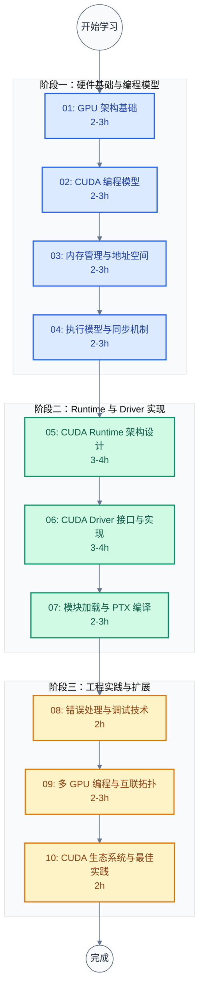

# CUDA 学习笔记

> 面向系统软件工程师的 CUDA 技术完整学习指南。从 GPU 硬件架构到 CUDA Driver 实现，覆盖 Runtime 设计、API 语义、JIT 编译、多 GPU 编程等核心主题。
>
> **工程师视角**：CUDA 不只是一个"GPU 编程库"——它是一套完整的异构计算软件栈，包含 Runtime、Driver、编译器、调试工具等多个层次。理解这些层次的设计动机，才能在系统软件开发（驱动、Runtime、性能分析工具）中做出正确决策。

### 关键术语

| 缩写 | 全称 | 含义 |
|------|------|------|
| CUDA | Compute Unified Device Architecture | NVIDIA 异构计算平台与编程模型 |
| GPU | Graphics Processing Unit | 图形处理单元，现广泛用于通用计算 |
| SM | Streaming Multiprocessor | GPU 核心执行单元，包含多个 CUDA Core |
| Warp | — | GPU 调度的基本单位，32 个线程一组同步执行 |
| SIMT | Single Instruction Multiple Threads | 单指令多线程执行模型 |
| PTX | Parallel Thread Execution | NVIDIA 虚拟指令集，JIT 编译的中间表示 |
| SASS | Shader Assembly Syntax | GPU 实际执行的机器指令 |
| cubin | CUDA Binary | 特定架构的二进制编译产物 |
| fatbin | Fat Binary | 包含多架构代码的打包格式 |
| HBM | High Bandwidth Memory | 高带宽内存，用于高端 GPU |
| GDDR | Graphics DDR | 图形专用 DDR 内存 |
| NVLink | — | NVIDIA GPU 间高速互联技术 |
| P2P | Peer-to-Peer | GPU 间直接通信机制 |
| UVA | Unified Virtual Addressing | 统一虚拟地址空间 |
| UM | Unified Memory | 统一内存，自动管理 CPU-GPU 数据迁移 |
| L1/L2 | Level 1/Level 2 Cache | GPU 缓存层级 |
| TFLOPS | Tera Floating Point Operations Per Second | 每秒万亿次浮点运算 |
| occupancy | — | SM 中活跃 Warp 数与最大 Warp 数的比值 |

---

## 学习路线图



> **如何读这张图**：三个阶段按依赖关系递进。阶段一建立硬件基础与编程模型（理解 GPU 能做什么）；阶段二深入 Runtime 与 Driver 实现（理解软件栈如何工作）；阶段三覆盖工程实践与多卡扩展（理解如何在生产环境中使用）。每篇 2-4 小时，总计约 25-30 小时。

---

## 文档索引

| 序号 | 文档 | 核心问题 | 概要 | 建议学时 |
|:----:|------|----------|------|:--------:|
| 01 | [GPU 架构基础](./01-GPU架构基础.md) | GPU 硬件长什么样？为什么这样设计？ | SM 结构、内存层级、Warp 调度、与 CPU 架构对比、A100/H100 具体数值 | 2-3h |
| 02 | [CUDA 编程模型](./02-CUDA编程模型.md) | CUDA 如何抽象硬件？ | Kernel、Thread 层次、SIMT 执行、Warp 发散、内存空间映射、向量加法示例 | 2-3h |
| 03 | [内存管理与地址空间](./03-内存管理与地址空间.md) | GPU 内存怎么管理？ | 全局/共享/常量/纹理内存、统一内存、固定内存、带宽利用率计算 | 2-3h |
| 04 | [执行模型与同步机制](./04-执行模型与同步机制.md) | CPU-GPU 怎么协同执行？ | 异步执行、Stream、Event、协作组、多流并发时间线分析 | 2-3h |
| 05 | [CUDA Runtime 架构设计](./05-CUDA-Runtime架构设计.md) | Runtime 内部怎么工作？ | Runtime 在软件栈中的位置、上下文管理、模块管理、函数管理、与 Driver 分层动机 | 3-4h |
| 06 | [CUDA Driver 接口与实现](./06-CUDA-Driver接口与实现.md) | Driver API 的语义是什么？ | 初始化、设备管理、上下文管理、模块加载、函数调用、内存管理、线程安全性 | 3-4h |
| 07 | [模块加载与 PTX 编译](./07-模块加载与PTX编译.md) | Kernel 怎么加载执行？ | PTX、cubin、fatbin、JIT 编译流程、编译选项、缓存机制、符号解析 | 2-3h |
| 08 | [错误处理与调试技术](./08-错误处理与调试技术.md) | 怎么调试 CUDA 程序？ | 错误码体系、cuda-gdb、compute-sanitizer、Nsight Compute/Systems、性能分析指标 | 2h |
| 09 | [多 GPU 编程与互联拓扑](./09-多GPU编程与互联拓扑.md) | 多卡怎么扩展？ | PCIe 拓扑、NVLink、NVSwitch、单进程多设备、P2P 通信、统一地址空间 | 2-3h |
| 10 | [CUDA 生态系统与最佳实践](./10-CUDA生态系统与最佳实践.md) | 工程实践怎么做？ | cuBLAS/cuDNN/NCCL、Thrust、最佳实践、版本管理、学习资源 | 2h |

---

## 未覆盖的进阶主题

本系列聚焦"Runtime 设计 + Driver 实现 + 系统软件视角",以下进阶主题未在本系列展开,作为后续学习方向:

| 主题 | 简述 | 官方文档入口 |
|------|------|--------------|
| **Tensor Core / WMMA** | 矩阵乘加速单元的编程接口(`wmma`/`mma.sync`),A100/H100 的核心算力来源 | [CUDA C++ Programming Guide §7.24](https://docs.nvidia.com/cuda/cuda-c-programming-guide/index.html#wmma-description) |
| **CUDA Graphs** | 把 Kernel 启动序列打包为图,降低启动开销(CUDA 10.0+) | [CUDA Graphs Documentation](https://docs.nvidia.com/cuda/cuda-runtime-api/group__CUDART__GRAPH.html) |
| **MPS (Multi-Process Service)** | 多进程共享 GPU 上下文,提升多租户场景的 SM 利用率 | [MPS Documentation](https://docs.nvidia.com/deploy/mps/index.html) |
| **MIG (Multi-Instance GPU)** | H100/A100 的硬件级 GPU 分片,把一个 GPU 切成多个独立实例 | [MIG Documentation](https://docs.nvidia.com/data-center/tesla/mig-user-guide/) |
| **cuDNN 深度学习库** | 卷积/池化/归一化的优化实现,PyTorch/TF 底层依赖 | [cuDNN Documentation](https://docs.nvidia.com/deeplearning/cudnn/) |
| **CUTLASS** | NVIDIA 开源的 GEMM 模板库,展示如何手写 Tensor Core Kernel | [CUTLASS GitHub](https://github.com/NVIDIA/cutlass) |
| **GPUDirect RDMA** | GPU 显存与网卡直接通信,绕过 CPU | [GPUDirect Documentation](https://docs.nvidia.com/cuda/gpudirect-rdma/) |

> **学习建议**:完成本系列 10 篇后,根据工作方向选择 1-2 个进阶主题深入。Tensor Core 与 CUDA Graphs 是性能优化的下一步,MPS/MIG 是多租户场景的关键,cuDNN/CUTLASS 是深度学习底层的核心。

---

## 按角色推荐学习路径

### 应用开发者（算法工程师 / 科学计算）

关注编程模型、内存管理、最佳实践：

```
01 GPU 架构 → 02 编程模型 → 03 内存管理（重点）→ 04 执行模型 → 10 最佳实践（重点）
```

- **03 和 10 是核心**：内存管理直接影响性能，最佳实践提供可操作的优化建议
- 01-02 建立基础认知，理解 GPU 能做什么
- 04 的 Stream 和 Event 是优化性能的关键

### 系统软件工程师（Runtime / 驱动开发）

关注 Runtime 架构、Driver 实现、模块加载：

```
01 GPU 架构 → 02 编程模型 → 05 Runtime 架构（重点）→ 06 Driver 接口（重点）→ 07 模块加载（重点）→ 08 调试技术
```

- **05、06、07 是核心**：Runtime 与 Driver 的内部设计直接对应日常工作
- 06 的 Driver API 语义是理解"为什么 Runtime 这样设计"的关键
- 07 的 JIT 编译流程帮助理解代码加载机制
- 08 的调试工具是定位问题的必备技能

### 驱动开发者（内核模块 / 设备驱动）

关注底层实现、硬件交互、调试技术：

```
全部 10 篇，重点 01（硬件基础）、06（Driver API）、07（模块加载）、09（多 GPU）
```

- **06 和 07 是核心**：Driver API 与模块加载是驱动开发的基础
- 01 的硬件结构帮助理解驱动需要管理什么
- 09 的多 GPU 互联涉及驱动层的拓扑管理
- 08 的调试技术是定位驱动问题的关键

### 性能工程师（系统优化 / Benchmark）

关注性能分析、内存带宽、执行效率：

```
01 GPU 架构 → 03 内存管理（重点）→ 04 执行模型（重点）→ 08 调试技术（重点）→ 10 最佳实践
```

- **08 是核心**：Nsight Compute/Systems 是性能分析的主要工具
- 03 的内存带宽计算和 04 的 Warp 调度效率直接影响实测性能
- 10 的最佳实践提供优化方向

---

## 官方文档

| 文档 | 用途 | 建议阅读时机 |
|------|------|--------------|
| [CUDA C Programming Guide](https://docs.nvidia.com/cuda/cuda-c-programming-guide/) | CUDA 编程完整指南 | 学完 02 后开始参考 |
| [CUDA Driver API Reference](https://docs.nvidia.com/cuda/cuda-driver-api/) | Driver API 完整参考 | 学 06 时必读 |
| [CUDA Runtime API Reference](https://docs.nvidia.com/cuda/cuda-runtime-api/) | Runtime API 完整参考 | 学 05 时参考 |
| [PTX ISA Reference](https://docs.nvidia.com/cuda/parallel-thread-execution/) | PTX 指令集架构 | 学 07 时必读 |
| [CUDA Binary Utilities (cuobjdump)](https://docs.nvidia.com/cuda/cuda-binary-utilities/) | 二进制工具 | 学 07 时参考 |
| [NVIDIA A100 Tensor Core GPU Architecture](https://images.nvidia.com/aem-dam/en-z3/Solutions/data-center/nvidia-ampere-architecture-whitepaper.pdf) | A100 硬件架构白皮书 | 学 01 时参考 |
| [NVIDIA H100 Tensor Core GPU Architecture](https://resources.nvidia.com/en-us-hopper-architecture/h100-tensor-core-gpu-architecture-whitepaper) | H100 硬件架构白皮书 | 学 01 时参考 |
| [Nsight Compute Documentation](https://docs.nvidia.com/nsight-compute/) | Kernel 性能分析工具 | 学 08 时必读 |
| [Nsight Systems Documentation](https://docs.nvidia.com/nsight-systems/) | 系统级性能分析工具 | 学 08 时必读 |

---

## 源码管理

本项目使用 Git Submodule 管理 CUDA 源码（CUDA Samples），以 `--depth=1` 浅克隆：

```bash
# 初始化 submodule
git submodule update --init cuda/src/cuda-samples

# 更新到最新
git submodule update --remote cuda/src/cuda-samples

# 固定到特定 commit（保证文档行号稳定）
cd cuda/src/cuda-samples
git checkout <tag-or-commit>
```

> **注意**：`cuda/src/` 已加入 `.gitignore`（沿用 `trusted-firmware/src/`、`nccl/src/nccl-src/` 模式），避免 IDE 索引大量源码。但 submodule gitlink 仍由 git 跟踪，clone 仓库后执行 `git submodule update --init cuda/src/cuda-samples` 即可获取源码。

---

## 源码阅读导航

| 仓库 | 路径 | 关键文件 | 职责 | 对应文档 |
|------|------|----------|------|----------|
| **CUDA Samples** | [src/cuda-samples/](./src/cuda-samples/) | `cpp/0_Introduction/vectorAdd/vectorAdd.cu` | Runtime API 最简示例：cudaMalloc/cudaMemcpy/<<<>>> | 02, 03 |
| | | `cpp/0_Introduction/vectorAddDrv/vectorAddDrv.cpp` | Driver API 版本：cuInit/cuCtxCreate/cuModuleLoad/cuLaunchKernel | 06 |
| | | `cpp/0_Introduction/simpleStreams/simpleStreams.cu` | 多流并发、固定内存、异步传输 | 04 |
| | | `cpp/0_Introduction/simpleCooperativeGroups/` | 协作组（Warp/Block/Grid 级同步） | 04 |
| | | `cpp/0_Introduction/simpleZeroCopy/simpleZeroCopy.cu` | 零拷贝（cudaHostAllocMapped） | 03 |
| | | `cpp/0_Introduction/UnifiedMemoryStreams/` | 统一内存 + Stream | 03, 04 |
| | | `cpp/0_Introduction/simpleP2P/simpleP2P.cu` | P2P 访问、UVA、cudaDeviceEnablePeerAccess | 09 |
| | | `cpp/0_Introduction/simpleMultiGPU/simpleMultiGPU.cu` | 多设备、多线程 | 09 |
| | | `cpp/0_Introduction/simpleAssert/` | 设备端断言 | 08 |
| | | `cpp/0_Introduction/simplePrintf/` | 设备端 printf | 08 |
| | | `cpp/0_Introduction/asyncAPI/` | 异步 API、事件计时 | 04 |
| | | `cpp/0_Introduction/matrixMulDrv/` | Driver API 矩阵乘 | 06 |
| | | `cpp/3_CUDA_Features/ptxjit/ptxjit.cpp` | PTX JIT 编译、cuLinkCreate | 07 |
| | | `cpp/3_CUDA_Features/ptxjit/ptxjit_kernel.cu` | 被编译为 PTX 的 kernel | 07 |
| | | `cpp/2_Concepts_and_Techniques/inlinePTX/` | 内联 PTX 汇编 | 07 |
| | | `cpp/2_Concepts_and_Techniques/reduction/` | 归约算法（共享内存 + 同步） | 02, 04 |
| | | `cpp/6_Performance/UnifiedMemoryPerf/` | 统一内存 vs 显式内存性能对比 | 03 |
| | | `cpp/6_Performance/transpose/` | 矩阵转置（共享内存优化） | 03 |
| | | `cpp/6_Performance/alignedTypes/` | 内存对齐访问 | 03 |
| | | `Common/helper_cuda.h` | 通用辅助函数（错误检查宏） | 全部 |
| | | `Common/helper_cuda_drvapi.h` | Driver API 辅助函数 | 06, 07 |

---

## 官方工具导航

| 工具 | 路径 / 来源 | 职责 | 对应文档 |
|------|-------------|------|----------|
| nvcc | CUDA Toolkit 自带 | CUDA 编译器，将 .cu 编译为 PTX/cubin | 07 |
| cuobjdump | CUDA Toolkit 自带 | 反汇编 cubin/fatbin，查看 PTX/SASS | 07 |
| nvdisasm | CUDA Toolkit 自带 | SASS 反汇编器 | 07 |
| cuda-gdb | CUDA Toolkit 自带 | GPU 源码级调试器 | 08 |
| compute-sanitizer | CUDA Toolkit 自带 | 内存错误、竞态、未初始化检测 | 08 |
| Nsight Compute | CUDA Toolkit 自带 | Kernel 级性能分析 | 08 |
| Nsight Systems | CUDA Toolkit 自带 | 系统级性能分析、时间线 | 08 |

---

**文档版本**: v1.0
**最后更新**: 2026-07-24
**适用对象**: 系统软件工程师、驱动开发者、性能工程师
**前置知识**: C/C++ 编程基础、操作系统基础概念
