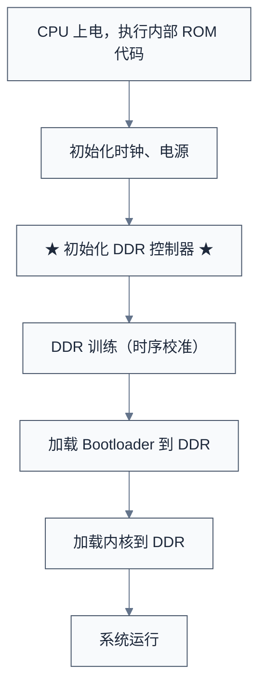
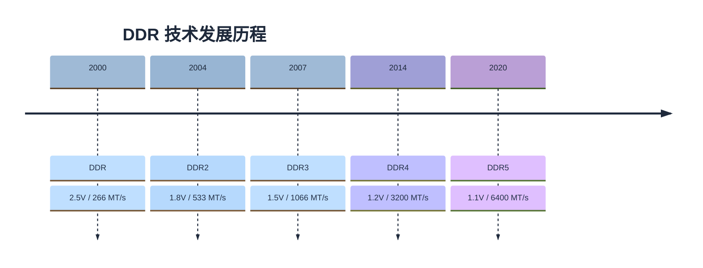

# DDR 基础概念

> 本篇介绍 DDR 内存的基本概念、发展历程、系统架构以及存储阵列结构，帮助读者建立对 DDR 技术的整体认知。
> **工程师视角**：DDR 是嵌入式系统中最容易出问题的部分之一——理解基本概念是排查一切 DDR 问题的前提。

### 关键术语

| 缩写 | 全称 | 含义 |
|------|------|------|
| DDR | Double Data Rate | 双倍数据速率，在时钟双边沿传输数据 |
| SDRAM | Synchronous Dynamic Random Access Memory | 同步动态随机存取存储器 |
| DIMM | Dual In-line Memory Module | 双列直插式内存模块（内存条） |
| RCD | Registering Clock Driver | 寄存时钟驱动器（RDIMM 上的缓冲芯片） |
| DB | Data Buffer | 数据缓冲器（LRDIMM 上的缓冲芯片） |
| JEDEC | Joint Electron Device Engineering Council | 联合电子设备工程委员会，制定 DDR 标准 |
| LPDDR | Low Power DDR | 低功耗 DDR，面向移动设备 |

### 1.1 前置知识

| 需要了解 | 参考文档 |
|----------|----------|
| 计算机体系结构基础（CPU-内存模型） | — |
| 数字电路基础（频率/周期/双边沿） | — |

***

## 一、DDR 概述

### 1.1 什么是 DDR

**DDR (Double Data Rate)** 即双倍数据速率同步动态随机存取存储器，是现代计算机和嵌入式系统中最重要的主存储器技术。

#### 核心特点

| 特性         | 说明               |
| ---------- | ---------------- |
| **双倍数据速率** | 在时钟的上升沿和下降沿都传输数据 |
| **同步传输**   | 与系统时钟同步，提高传输效率   |
| **动态存储**   | 需要定期刷新以保持数据      |
| **随机访问**   | 可任意地址读写          |

#### 与 SDR 的对比

```
SDR (Single Data Rate):
时钟:  ─┐  ┌─┐  ┌─┐  ┌─┐  ┌─
       └─┘  └─┘  └─┘  └─┘
数据:    D0    D1    D2    D3
         ↑     ↑     ↑     ↑
      仅上升沿传输

DDR (Double Data Rate):
时钟:  ─┐  ┌─┐  ┌─┐  ┌─┐  ┌─
       └─┘  └─┘  └─┘  └─┘
数据:    D0 D1 D2 D3 D4 D5 D6 D7
         ↑  ↑  ↑  ↑  ↑  ↑  ↑  ↑
      上升沿和下降沿都传输
```

**性能提升**: 相同时钟频率下，DDR 带宽是 SDR 的 2 倍。

### 1.2 为什么嵌入式工程师需要了解 DDR



**关键场景**：

- **系统启动**: Bootloader 需要初始化 DDR
- **驱动开发**: 内存控制器驱动、PMU 电源管理
- **性能优化**: 内存带宽优化、延迟优化
- **故障排查**: 内存不稳定、启动失败等问题
- **硬件调试**: 示波器测量 DDR 信号

***

## 二、DDR 发展历程

### 2.1 技术演进路线



> MT/s = MegaTransfers per second（百万次传输/秒）

### 2.2 各代 DDR 特性对比

| 特性          | DDR          | DDR2         | DDR3          | DDR4           | DDR5           |
| ----------- | ------------ | ------------ | ------------- | -------------- | -------------- |
| **电压**      | 2.5V         | 1.8V         | 1.5V/1.35V    | 1.2V           | 1.1V           |
| **预取**      | 2-bit        | 4-bit        | 8-bit         | 8-bit          | 16-bit         |
| **突发长度**    | 2/4/8        | 4/8          | 8             | 8              | 16             |
| **Bank 数量** | 4            | 4/8          | 8             | x4/x8: 16, x16: 8 | x4/x8: 32, x16: 16 |
| **单颗最大容量**  | 1Gb          | 4Gb          | 16Gb          | 64Gb           | 64Gb           |
| **频率范围**    | 100-200MHz   | 200-400MHz   | 400-1066MHz   | 800-1600MHz    | 1600-3200MHz (标准) / 4400MHz (扩展) |
| **传输速率**    | 200-400 MT/s | 400-800 MT/s | 800-2133 MT/s | 1600-3200 MT/s | 3200-8800 MT/s |

> **注意**: 
> - 单颗容量单位为 **Gb (Gigabit, 吉比特)**，不是 GB。1 GB = 8 Gb
> - DDR4 Bank 数量：x4/x8 为 16 个 Bank（4 个 Bank Group × 4 个 Bank），x16 为 8 个 Bank（2 个 Bank Group × 4 个 Bank）
> - DDR5 已标准化定义最高 8800 MT/s（JESD79-5），更高频率（如 DDR5-9600）属于厂商扩展

### 2.3 LPDDR 系列（低功耗版）

**LPDDR (Low Power DDR)** 专为移动设备设计，强调低功耗。

| 特性 | 说明 |
|------|------|
| 更低的工作电压 | 相比标准 DDR，电压更低以降低功耗 |
| 部分阵列自刷新 (PASR) | 仅刷新需要保持的 Bank 区域 |
| 深度功耗模式 (DPD) | 最低功耗模式，数据不保持 |
| 温度补偿自刷新 (TCSR) | 根据温度自动调整刷新频率 |
| 更小的封装尺寸 | 适合移动设备紧凑空间 |

| 类型      | VDD (核心) | VDDQ (I/O) | 典型应用        |
| ------- | ---------- | ---------- | ----------- |
| LPDDR3  | 1.2V       | 1.2V       | 智能手机、平板     |
| LPDDR4  | 1.1V       | 0.6V       | 高端手机        |
| LPDDR4X | 1.1V       | 0.6V       | 旗舰手机        |
| LPDDR5  | 1.05V      | 0.5V       | 5G 手机、AI 设备 |
| LPDDR5X | 0.9V       | 0.5V       | 最新旗舰手机     |

***

## 三、DDR 系统架构

### 3.1 整体架构

```
┌──────────────────────────────────────────────────────────────┐
│                        CPU / SoC                              │
│  ┌────────────────────────────────────────────────────────┐  │
│  │                    内存控制器 (MC)                      │  │
│  │  ┌──────────┐  ┌──────────┐  ┌──────────┐            │  │
│  │  │ 仲裁器   │  │ 调度器   │  │ 时序控制 │            │  │
│  │  └──────────┘  └──────────┘  └──────────┘            │  │
│  └────────────────────────────────────────────────────────┘  │
│                          │ DDR PHY                           │
│                          ▼                                    │
│  ┌────────────────────────────────────────────────────────┐  │
│  │              DDR PHY (物理层接口)                       │  │
│  │  ┌──────────┐  ┌──────────┐  ┌──────────┐            │  │
│  │  │ 发送端   │  │ 接收端   │  │ DLL/PLL  │            │  │
│  │  └──────────┘  └──────────┘  └──────────┘            │  │
│  └────────────────────────────────────────────────────────┘  │
└──────────────────────────│───────────────────────────────────┘
                           │ DDR 总线
                           ▼
┌──────────────────────────────────────────────────────────────┐
│                      DDR DRAM 芯片                            │
│  ┌────────────────────────────────────────────────────────┐  │
│  │                      存储阵列                          │  │
│  │  ┌─────────┐  ┌─────────┐  ┌─────────┐               │  │
│  │  │ Bank 0  │  │ Bank 1  │  │ Bank N  │  ...          │  │
│  │  │ ┌─────┐ │  │ ┌─────┐ │  │ ┌─────┐ │               │  │
│  │  │ │Row  │ │  │ │Row  │ │  │ │Row  │ │               │  │
│  │  │ │ ─── │ │  │ │ ─── │ │  │ │ ─── │ │               │  │
│  │  │ │Col  │ │  │ │Col  │ │  │ │Col  │ │               │  │
│  │  │ └─────┘ │  │ └─────┘ │  │ └─────┘ │               │  │
│  │  └─────────┘  └─────────┘  └─────────┘               │  │
│  └────────────────────────────────────────────────────────┘  │
└──────────────────────────────────────────────────────────────┘
```

### 3.2 DDR 总线信号

#### 3.2.1 主要信号线详解

**1. 时钟信号 (Clock Signals)**

```
┌─────────────────────────────────────────────────────────┐
│  时钟信号                                                │
├─────────────────────────────────────────────────────────┤
│  CK_t/CK_c   - 差分时钟对 (Differential Clock Pair)     │
└─────────────────────────────────────────────────────────┘

作用:
├── DDR 的所有操作都与时钟同步
├── 数据在时钟的上升沿和下降沿都传输 (DDR = Double Data Rate)
├── 命令和地址在时钟上升沿采样
└── 提供数据传输的时序基准

特性:
├── 差分信号: CK_t (正) 和 CK_c (负) 相位相反
├── 所有颗粒共享同一对时钟
├── 需要严格的等长匹配 (±5mil)
└── 频率决定 DDR 的数据速率

时序关系:
        CK_t  ─┐  ┌─┐  ┌─┐  ┌─┐  ┌─┐  ┌─┐  ┌─┐  ┌─
               └─┘  └─┘  └─┘  └─┘  └─┘  └─┘  └─┘
        CK_c  ───┐  ┌─┐  ┌─┐  ┌─┐  ┌─┐  ┌─┐  ┌─┐  ┌─
                 └─┘  └─┘  └─┘  └─┘  └─┘  └─┘  └─┘

        数据采样点: ↑ 和 ↓ (上升沿和下降沿)
```

**2. 地址/命令总线 (Address/Command Bus)**

```
┌─────────────────────────────────────────────────────────┐
│  地址/命令总线                                           │
├─────────────────────────────────────────────────────────┤
│  A[0:17]     - 地址线 (Address)                          │
│  BA[0:2]     - Bank 地址 (Bank Address)                  │
│  BG[0:1]     - Bank Group 地址 (DDR4+)                   │
│  RAS#        - 行地址选通 (Row Address Strobe)           │
│  CAS#        - 列地址选通 (Column Address Strobe)        │
│  WE#         - 写使能 (Write Enable)                     │
│  CS#         - 片选 (Chip Select)                        │
│  CKE         - 时钟使能 (Clock Enable)                   │
│  ODT         - 片上端接使能 (On-Die Termination)         │
└─────────────────────────────────────────────────────────┘
```

**A[0:17] - 地址线**

```
作用: 传输行地址和列地址 (分时复用)

行地址激活 (ACTIVATE命令时):
├── A[0:17] 传输行地址 (Row Address)
├── 配合 BA/BG 选择 Bank
└── 示例: 16位行地址可寻址 65536 行

列地址访问 (READ/WRITE命令时):
├── A[0:9]  传输列地址 (Column Address)
├── A[10]   自动预充电标志 (Auto Precharge)
└── 示例: 10位列地址可寻址 1024 列

注意: 行地址和列地址共用同一组地址线，通过 RAS#/CAS# 区分
```

**BA[0:2] / BG[0:1] - Bank 地址**

```
作用: 选择要访问的 Bank

DDR3 (无 Bank Group):
├── BA[0:2] 选择 8 个 Bank 之一
└── 3位地址: 000~111

DDR4 (有 Bank Group):
├── BG[0:1] 选择 Bank Group (4个)
├── BA[0:1] 选择 Bank Group 内的 Bank (4个)
└── 总共: 4 × 4 = 16 个 Bank

寻址示例 (DDR4):
物理地址 → [Rank] → [Bank Group] → [Bank] → [Row] → [Column]
           [1位]      [2位]          [2位]     [16位]    [10位]
```

**RAS# / CAS# / WE# - 命令信号**

```
这三个信号组合形成 DDR 命令：

| RAS# | CAS# | WE# | 命令 |
|------|------|-----|------|
| H | H | H | NOP（无操作） |
| H | H | L | 预留 |
| H | L | H | READ（读） |
| H | L | L | WRITE（写） |
| L | H | H | ACTIVATE（激活行） |
| L | H | L | PRECHARGE（预充电） |
| L | L | H | REFRESH（刷新） |
| L | L | L | MODE REGISTER SET（模式寄存器设置） |

> `#` 表示低电平有效（Active Low）

各命令说明：

| 命令 | 参数 | 说明 |
|------|------|------|
| ACTIVATE | Bank 地址 + 行地址 | 打开指定 Bank 的指定行 |
| READ | Bank 地址 + 列地址 | 从已激活的行读取数据 |
| WRITE | Bank 地址 + 列地址 | 向已激活的行写入数据 |
| PRECHARGE | Bank 地址（或所有 Bank） | 关闭当前行，准备访问其他行 |
| REFRESH | 无需参数 | 刷新存储单元，保持数据 |
| MODE REGISTER SET | 寄存器地址 + 配置值 | 配置 DDR 工作模式 |
```

**CS# - 片选信号 (Chip Select)**

```
作用: 选择要操作的 Rank

单 Rank 系统:
├── 只有 CS0# 信号
└── 所有颗粒共享 CS0#

双 Rank 系统:
├── CS0# 控制 Rank 0 (正面颗粒)
├── CS1# 控制 Rank 1 (背面颗粒)
└── 两个 Rank 可以独立操作

重要特性:
├── 低电平有效 (Active Low)
├── 同一时刻只能选中一个 Rank (通常)
├── 用于 Rank 交错访问
└── 未选中的 Rank 处于空闲状态

Rank 选择时序:
时钟周期:  1    2    3    4    5    6

CS0#    ─┐      ┌──────┐      ┌────────
         └──────┘      └──────┘
         Rank 0 选中   Rank 0 释放

CS1#    ──────────┐      ┌──────────────
                  └──────┘
                  Rank 1 选中
```

**CKE - 时钟使能 (Clock Enable)**

```
作用: 控制 DDR 时钟的使能和功耗状态

工作状态:
├── CKE = High: 正常工作模式
│   ├── 时钟正常运行
│   ├── 可以执行所有命令
│   └── 正常功耗
│
└── CKE = Low: 低功耗模式
    ├── 时钟暂停 (内部)
    ├── 只支持有限命令 (如自刷新)
    └── 降低功耗

应用场景:
├── 系统空闲时拉低 CKE 进入低功耗
├── 休眠前设置自刷新模式
├── 唤醒时拉高 CKE 恢复正常
└── 与电源管理配合

状态转换:
正常 ──CKE=Low──► 低功耗 ──CKE=High──► 正常
  │                   │
  │                   ├── 自刷新模式
  │                   └── 深度休眠
  │
  └── 激活状态
      └── 可以读写
```

**ODT - 片上端接使能 (On-Die Termination)**

```
作用: 控制 DDR 内部端接电阻的开关

为什么需要 ODT:
├── 防止信号反射
├── 改善信号完整性
├── 减少信号振铃
└── 提高信号质量
```

> 信号完整性（反射、串扰、眼图等）的详细分析请参阅 [DDR性能优化与测量调试](06-DDR性能优化与测量调试.md) 的信号完整性分析章节。

```
工作原理:
├── ODT = High: 使能端接电阻
│   └── 在颗粒内部连接电阻到 VDDQ/2
│
└── ODT = Low: 禁用端接电阻
    └── 高阻态，不影响总线

应用场景:
├── 写操作时: 目标颗粒使能 ODT
├── 读操作时: 控制器使能 ODT (如有)
├── 空闲时: 禁用 ODT 节省功耗
└── 训练时: 根据信号质量调整

ODT 阻抗值 (可配置):
├── DDR4: 240Ω, 120Ω, 80Ω, 60Ω, 48Ω, 40Ω
└── 通过模式寄存器 MR1 配置
```

**3. 数据总线 (Data Bus)**

```
┌─────────────────────────────────────────────────────────┐
│  数据总线                                                │
├─────────────────────────────────────────────────────────┤
│  DQ[0:63]    - 数据线 (Data)                             │
│  DQS[0:7]    - 数据选通 (Data Strobe)                    │
│  DQS#[0:7]   - 数据选通反相 (Differential)               │
│  DM[0:7]     - 数据掩码 (Data Mask)                      │
│  DBI[0:7]    - 数据总线翻转 (Data Bus Inversion, DDR4+)  │
└─────────────────────────────────────────────────────────┘
```

**DQ[0:63] - 数据线**

```
作用: 传输实际的数据

位宽配置:
├── x4 颗粒: DQ[0:3]   (4位)
├── x8 颗粒: DQ[0:7]   (8位)
├── x16 颗粒: DQ[0:15] (16位)
└── 64位系统: DQ[0:63] (需要 8颗 x8 或 4颗 x16)

数据传输:
├── 双边沿传输 (DDR)
├── 突发传输 (Burst): 一次命令传输多个数据
└── 示例: BL8 突发传输 8 个数据 beat = 8 × 8字节 = 64字节 (64位总线宽度)

分组 (Byte Lane):
├── DQ[0:7]   - Byte 0 (对应 DQS0)
├── DQ[8:15]  - Byte 1 (对应 DQS1)
├── ...
└── DQ[56:63] - Byte 7 (对应 DQS7)

每个 Byte Lane 独立训练和对齐
```

**DQS/DQS# - 数据选通**

```
作用: 作为数据采样的时钟参考

为什么需要 DQS:
├── DQ 和 CK 之间存在传输延迟
├── 直接用 CK 采样 DQ 会有误差
├── DQS 与 DQ 一起传输，延迟相同
└── 用 DQS 采样 DQ 更准确

特性:
├── 差分信号: DQS (正) 和 DQS# (负)
├── 边沿对齐: DQS 边沿与 DQ 中心对齐
├── 每 8位 DQ 对应 1对 DQS
└── 读时由 DDR 产生，写时由控制器产生

时序关系 (读操作):

CK      ─┐  ┌─┐  ┌─┐  ┌─┐  ┌─┐  ┌─┐  ┌─┐  ┌─
         └─┘  └─┘  └─┘  └─┘  └─┘  └─┘  └─┘

DQS          ──────┐  ┌─┐  ┌─┐  ┌─┐  ┌────
                   └─┘  └─┘  └─┘  └─┘

DQ             ─────< D0 >< D1 >< D2 >< D3 >
                      ↑     ↑     ↑     ↑
                   采样点: DQS 边沿对齐 DQ 中心

训练目标:
├── 调整 DQS 延迟，使采样点在 DQ 眼图中心
├── 保证建立时间 (Setup Time) 和保持时间 (Hold Time)
└── 最大化时序裕量
```

**DM - 数据掩码 (Data Mask)**

```
作用: 在写操作时屏蔽某些字节

工作原理:
├── DM = High: 屏蔽对应字节 (不写入)
├── DM = Low:  正常写入对应字节
└── 每 8位 DQ 对应 1位 DM

DM 与 DQ 的对应关系:
├── DM0 → DQ[0:7]
├── DM1 → DQ[8:15]
├── DM2 → DQ[16:23]
└── DM3 → DQ[24:31]

应用场景:
├── 部分写入: 只更新数据的某些字节
├── 字节对齐写入: 非对齐地址的写入
└── 避免读-修改-写操作

示例 (Byte Lane 0):
写入 0x12345678 到地址 0x100，但只更新低 2字节:
├── DQ[0:7]  = 0x78 (写入)
├── DQ[8:15] = 0x56 (写入)
├── DQ[16:23] = 0x34 (屏蔽，DM2=1)
├── DQ[24:31] = 0x12 (屏蔽，DM3=1)
└── 结果: 地址 0x100 只更新为 0xXXXX5678

注意: 读操作时 DM 信号通常不使用
```

**DBI - 数据总线翻转 (DDR4+)**

```
作用: 减少同时翻转的位数，降低功耗和噪声

工作原理:
├── 统计要发送的数据中 0 和 1 的数量
├── 如果 0 多于 1，翻转数据 (0变1，1变0)
├── 设置 DBI 位指示是否翻转
└── 接收端根据 DBI 恢复原始数据

优势:
├── 减少 SSO (Simultaneous Switching Output) 噪声
├── 降低功耗 (翻转次数减少)
├── 改善信号完整性
└── 提高可靠性

示例:
原始数据: 0x00 (00000000) - 8个0
翻转后:   0xFF (11111111) - 8个1
DBI = 1 (表示已翻转)

接收端: DBI=1 时，对 0xFF 取反 (NOT) → 0x00 (恢复原始数据)
```

**4. 信号线总结表**

| 信号名 | 方向 | 作用说明 |
|--------|------|----------|
| CK_t/CK_c | 控制器→DDR | 差分时钟，所有操作的时序基准 |
| A[0:17] | 控制器→DDR | 地址线，行/列地址复用 |
| BA[0:2] | 控制器→DDR | Bank 地址选择 |
| BG[0:1] | 控制器→DDR | Bank Group 地址 (DDR4+) |
| RAS#/CAS#/WE# | 控制器→DDR | 命令信号，组合形成各种操作命令 |
| CS# | 控制器→DDR | 片选，选择要操作的 Rank |
| CKE | 控制器→DDR | 时钟使能，控制功耗状态 |
| ODT | 控制器→DDR | 片上端接使能，改善信号质量 |
| DQ[0:63] | 双向 | 数据线，传输实际数据 |
| DQS/DQS# | 双向 | 数据选通，数据采样时钟 |
| DM | 控制器→DDR | 数据掩码，写操作时屏蔽字节 |
| DBI | 双向 | 数据总线翻转，降低功耗 (DDR4+) |
| RESET# | 控制器→DDR | 复位信号，初始化 DDR |
| ALERT# | DDR→控制器 | 告警信号，报告错误 (DDR4+) |
| TEN | 控制器→DDR | 测试使能，用于测试模式 |

> `#` 表示低电平有效

#### 3.2.2 信号时序关系

```
读操作时序:

CK     ─┐  ┌─┐  ┌─┐  ┌─┐  ┌─┐  ┌─┐  ┌─┐  ┌─
        └─┘  └─┘  └─┘  └─┘  └─┘  └─┘  └─┘

CMD    ──────< READ >────────────────────────

DQS           ──────┐  ┌─┐  ┌─┐  ┌─┐  ┌────
                    └─┘  └─┘  └─┘  └─┘

DQ              ─────< D0 >< D1 >< D2 >< D3 >
                      ↑     ↑     ↑     ↑
                   上升沿 下降沿 上升沿 下降沿
```

### 3.3 存储阵列结构

#### 3.3.1 Bank-Row-Column 三级寻址

```
DDR 存储阵列组织:

总容量 = Bank数 × 行数 × 列数 × 位宽

示例 (DDR4 8GB 系统):
├── Bank Group: 4 个
├── Bank: 每个 Bank Group 4 个 = 共 16 个 Bank
├── Row: 每个 Bank 65536 行 (16位行地址)
├── Column: 每行 1024 列 (10位列地址)
└── 位宽: 8 位 (x8 芯片)

单颗芯片容量计算:
16 Banks × 65536 Rows × 1024 Cols × 8 bits
= 8,589,934,592 bits = 8 Gb = 1 GB (单颗芯片容量)

8GB 系统配置:
├── 需要 8 颗 1GB (8Gb) 芯片
├── 总容量: 8 颗 × 1 GB = 8 GB
└── 总位宽: 8 颗 × 8 位 = 64 位

注意: Gb = Gigabit (吉比特), GB = Gigabyte (吉字节), 1 Byte = 8 bits
```

#### 3.3.2 寻址过程

```
读取地址 0x12345678 的数据:

步骤1: 激活 (ACTIVATE)
        发送行地址 → 激活某 Bank 的某一行
        Row: 0x1234 → Bank 0x5 的 Row 0x1234

步骤2: 读命令 (READ)
        发送列地址 → 从激活的行中读取数据
        Column: 0x678 → 读取数据

步骤3: 预充电 (PRECHARGE)
        关闭当前行，准备访问其他行

时序要求:
├── tRCD (RAS to CAS Delay): ACTIVATE 到 READ 的延迟
├── CL (CAS Latency): READ 命令到数据有效的延迟
└── tRP (RAS Precharge): PRECHARGE 时间
```

***

## 四、DDR 控制器实物介绍

### 4.1 什么是 DDR 控制器

一句话概括：**DDR 控制器就是 CPU 和内存条之间的"翻译官"**。

CPU 说的是"AXI 总线协议"（给我地址 0x80000000 的 64 字节数据），而 DRAM 芯片听的是"ACTIVATE → READ → PRECHARGE"这一套命令序列。这两者之间差了十万八千里，DDR 控制器就是负责把 CPU 的简单读写请求翻译成 DRAM 能理解的复杂操作。

```
没有控制器的情况 (CPU 直接操作 DRAM):

  CPU ──── "读 0x80000000" ────> DRAM ???
                                    │
                                    └── DRAM: "啥？你先给我发 ACTIVATE 命令啊！
                                               行地址呢？Bank 地址呢？
                                               等等，tRCD 满了吗？上次 REFRESH 是什么时候？"
                                    结果: CPU 根本没法直接用 DRAM


有控制器的情况:

  CPU ──── "读 0x80000000" ────> DDR Controller ──── "ACTIVATE Bank0 Row1234"
                                  (翻译官)          ──── "等待 tRCD..."
                                                     ──── "READ Col567"
                                                     ──── "返回数据给 CPU"
                                                     ──── "PRECHARGE Bank0"
                                    结果: CPU 完全感知不到底层复杂性
```

**为什么非得要控制器不可？**

| 原因 | 说明 |
|------|------|
| 时序太复杂 | ACT→READ 需等 tRCD，READ 到数据返回需等 CL，行切换需等 tRAS+tRP，每 64ms 必须刷新一次——CPU 无法直接管理 |
| 多 Master 争用 | CPU、GPU、DMA 等同时请求内存，控制器负责仲裁和公平调度 |
| 地址映射非直通 | CPU 地址 ≠ DRAM 的 Row/Col/Bank，需要地址重映射（interleaving 等），不同 SoC 映射方式不同 |
| 带宽优化 | 重新排序请求减少行切换、合并连续写操作、预取可能用到的数据 |
| 物理层适配 | 高速信号需要训练（Training）、阻抗匹配、延迟补偿，由 DDR PHY 配合控制器完成 |

### 4.2 实际 SoC 中的 DDR 控制器

#### 4.2.1 常见 DDR 控制器 IP 厂商

实际芯片中，DDR 控制器通常不是芯片厂自己从零写的，而是采购 IP 厂商的成熟方案：

| IP 厂商 | 代表产品 / 说明 |
|---------|----------------|
| Synopsys | DesignWare DDR Controller (uMCTL2)，★ 市场占有率最高，绝大多数 SoC 在用 |
| Cadence | DDR PHY / Controller IP，高端 FPGA 和 ASIC 常见 |
| ARM | PL35x / PL341 系列，用于早期的 ARM SoC |
| NXP | i.MX 系列 DDR 控制器，i.MX6/8/9 系列自研控制器 |
| Rockchip | RK3399 / RK3588 DDR 控制器，自研 + Synopsys PHY 混合方案 |
| Xilinx (AMD) | Zynq MPSoC DDR 控制器，PS 端硬核控制器 + PL 端软控制器 |
| RISC-V (平头哥等) | C920 DDR 控制器，国产 RISC-V SoC 常用 |

> 如果你做嵌入式 Linux，大概率会遇到 Synopsys uMCTL2。

#### 4.2.2 SoC 内部结构简图

```
┌──────────────────────────────────────────────────────────────────────┐
│                            SoC 芯片                                  │
│                                                                      │
│  ┌──────────┐  ┌──────────┐  ┌──────────┐                          │
│  │ CPU Core │  │   GPU    │  │   DMA    │  ← 多个 Master            │
│  │ (Cortex) │  │ (Mali)   │  │ (PL330)  │                          │
│  └────┬─────┘  └────┬─────┘  └────┬─────┘                          │
│       │              │              │                                │
│       └──────────────┼──────────────┘                                │
│                      │ AXI 总线                                      │
│                      ▼                                               │
│  ┌──────────────────────────────────────────────────────────────┐   │
│  │              系统总线互联 (Interconnect)                       │   │
│  │         CCI-500 / CNF / 自定义 NoC                            │   │
│  └──────────────────────┬───────────────────────────────────────┘   │
│                         │                                            │
│                         ▼                                            │
│  ┌──────────────────────────────────────────────────────────────┐   │
│  │              ★ DDR 控制器 (DDR Controller) ★                  │   │
│  │  ┌──────────┐  ┌──────────┐  ┌──────────┐  ┌──────────┐    │   │
│  │  │ 命令仲裁 │  │ 地址映射 │  │ 时序控制 │  │ 带宽优化 │    │   │
│  │  │Scheduler │  │Address   │  │Timing    │  │Reorder/  │    │   │
│  │  │          │  │Decoder   │  │Generator │  │Prefetch  │    │   │
│  │  └──────────┘  └──────────┘  └──────────┘  └──────────┘    │   │
│  └──────────────────────┬───────────────────────────────────────┘   │
│                         │ DFI (DDR PHY Interface)                    │
│                         ▼                                            │
│  ┌──────────────────────────────────────────────────────────────┐   │
│  │              ★ DDR PHY (物理层) ★                              │   │
│  │  ┌──────────┐  ┌──────────┐  ┌──────────┐  ┌──────────┐    │   │
│  │  │ IO 驱动  │  │ DLL/PLL  │  │ 阻抗校准 │  │ 读写训练 │    │   │
│  │  │ (I/O)   │  │ (时钟)   │  │ (ZQ)     │  │ (Training)│    │   │
│  │  └──────────┘  └──────────┘  └──────────┘  └──────────┘    │   │
│  └──────────────────────┬───────────────────────────────────────┘   │
└─────────────────────────┼────────────────────────────────────────────┘
                          │ DDR 总线 (DQ, DQS, CA, CK...)
                          ▼
┌──────────────────────────────────────────────────────────────────────┐
│                      DDR DRAM (内存条 / 颗粒)                        │
│  ┌──────────┐  ┌──────────┐  ┌──────────┐  ┌──────────┐            │
│  │ Rank 0   │  │ Rank 1   │  │  ...     │  │  SPD     │            │
│  │ (正面)   │  │ (背面)   │  │          │  │ (配置信息)│            │
│  └──────────┘  └──────────┘  └──────────┘  └──────────┘            │
└──────────────────────────────────────────────────────────────────────┘
```

#### 4.2.3 控制器 vs PHY：分工明确

```
DDR 控制器 (Controller)                    DDR PHY (物理层)
├── 负责"逻辑"                             ├── 负责"物理"
├── 协议层：理解 AXI/AHB 请求              ├── 信号层：驱动 DDR 总线
├── 命令调度：仲裁多个 Master               ├── 时钟生成：DLL/PLL
├── 地址翻译：CPU地址 → DRAM地址            ├── 信号完整性：阻抗匹配
├── 时序参数管理：tRCD, CL, tRP 等          ├── 训练：Write Leveling, Read DQS
├── 刷新调度：自动发 REFRESH                ├── IO 驱动：差分信号收发
└── 接口：DFI (DDR PHY Interface)           └── 接口：DFI (DDR PHY Interface)

                    DFI 总线
    Controller ◄════════════════════════► PHY
               (标准化接口协议)

    为什么分开放？
    ├── Controller 用数字逻辑实现，可以跟随工艺缩微
    ├── PHY 和工艺强相关（模拟电路），需要针对不同工艺定制
    ├── 方便替换：同一 Controller 可以搭配不同工艺的 PHY
    └── 行业标准 DFI 接口让两者可以来自不同厂商
```

### 4.3 DDR 控制器的核心功能

```
┌──────────────────────────────────────────────────────────────┐
│               DDR 控制器核心功能一览                           │
├──────────────────────────────────────────────────────────────┤
│                                                              │
│  1. 命令调度 (Command Scheduling / Arbitration)              │
│     ├── 多个 Master 同时请求访问内存                          │
│     ├── 控制器按优先级和策略仲裁                              │
│     ├── 典型策略: Round-Robin / 优先级 / 带宽保证            │
│     └── 目标: 公平 + 高效                                    │
│                                                              │
│  2. 地址映射 (Address Mapping / Decode)                      │
│     ├── CPU 地址 → [CS] [BG] [BA] [Row] [Col]              │
│     ├── 支持 Interleaving (交错映射，提高并行性)              │
│     ├── 不同 SoC 映射方式不同，需要查手册                     │
│     └── 示例: 0x80000000 → Rank0 BG1 BA3 Row0x123 Col0x45   │
│                                                              │
│  3. 时序控制 (Timing Control)                                │
│     ├── 自动插入 tRCD、tRP、tRAS、CL 等延迟                  │
│     ├── 自动发送 REFRESH 命令 (每 64ms / 32ms)               │
│     ├── 管理 tFAW (Four Activate Window) 等窗口限制           │
│     └── 确保 DRAM 时序参数不被违反                            │
│                                                              │
│  4. 带宽优化 (Bandwidth Optimization)                        │
│     ├── 请求重排序 (Reorder): 合理安排读写顺序               │
│     ├── Bank 交错 (Bank Interleave): 利用多个 Bank 并行       │
│     ├── 预取 (Prefetch): 预测 CPU 可能访问的地址             │
│     ├── 写合并 (Write Combining): 合并连续的小写操作          │
│     └── 目标: 最大化总线利用率                                │
│                                                              │
│  5. ECC 支持 (可选)                                          │
│     ├── 检测和纠正单比特错误 (SEC-DED)                       │
│     ├── 需要额外 8bit / 64bit 数据用于存储校验码             │
│     ├── 服务器和汽车电子中常见                                 │
│     └── 消费级 SoC 通常不支持                                 │
│                                                              │
│  6. 电源管理 (Power Management)                              │
│     ├── 自动进入 Self Refresh (自刷新)                       │
│     ├── Deep Power Down (深度掉电)                           │
│     ├── 动态频率/电压调节 (DVFS)                              │
│     ├── 根据 CKE 信号控制 DRAM 功耗状态                      │
│     └── Linux 中通过 devfreq 框架管理                        │
│                                                              │
└──────────────────────────────────────────────────────────────┘
```

### 4.4 从软件角度看 DDR 控制器

#### 4.4.1 U-Boot 中的 DDR 初始化

DDR 控制器的初始化是系统上电后最关键的步骤之一。在 U-Boot 中，这个工作通常在 `board_f.c` 的早期阶段完成：

```
U-Boot DDR 初始化流程:

board_init_f()
├── board_init_f_alloc_reserve()     // 分配早期栈
├── board_init_f_init_reserve()      // 初始化保留区域
└── dram_init()                      // ★ DDR 初始化入口
    ├── ddr_init()                   // 平台相关 DDR 初始化
    │   ├── 初始化时钟 (PLL 配置)
    │   ├── 初始化 DDR 控制器寄存器
    │   ├── 设置时序参数 (tRCD, CL, tRP...)
    │   ├── DDR 训练 (Training)
    │   │   ├── Write Leveling (写平衡)
    │   │   ├── Read Gate Training (读选通训练)
    │   │   └── Read DQS Training (读数据训练)
    │   ├── 使能 ECC (如果支持)
    │   └── 内存大小探测
    └── gd->ram_size = xxx MB        // 保存内存大小
```

以 Rockchip RK3588 为例，DDR 初始化代码在独立的 `ddr.bin` 中，由 BootROM 加载运行。这意味着 U-Boot SPL 本身不包含 DDR 初始化代码——它只是调用已加载的 `ddr.bin` 完成初始化后，再获取结果。

```c
/* U-Boot 中典型的 dram_init 实现 (简化)
 *
 * 这个函数在 DDR 已经初始化完成后被调用，它的职责不是"初始化 DDR"，
 * 而是"告诉 U-Boot DDR 在哪里、有多大"。
 *
 * 为什么 DDR 已经初始化好了？
 * 因为在 U-Boot SPL 阶段（或更早的 BootROM），DDR 控制器已经被配置、
 * 训练完成，DDR 已经可以正常读写。dram_init() 只是把结果注册到
 * U-Boot 的全局数据结构中，供后续阶段使用。
 */
int dram_init(void)
{
    struct dram_info *info = &dram_info;

    /*
     * base: DDR 在 CPU 物理地址空间中的起始地址。
     * 对于大多数 ARM SoC，DDR 起始于 0x80000000。
     * 这个值由 CONFIG_SYS_SDRAM_BASE 定义，不同 SoC 可能不同。
     */
    info->base = CONFIG_SYS_SDRAM_BASE;

    /*
     * size: 从 DDR 控制器寄存器中读取实际探测到的容量。
     * rockchip_dram_size() 是平台相关函数，它读取控制器状态寄存器
     * 中训练完成后记录的容量值。注意：这不是"配置的容量"，
     * 而是"训练后实际可用的容量"——如果某颗颗粒训练失败，
     * 这里返回的容量会小于硬件实际容量。
     */
    info->size = rockchip_dram_size();

    /*
     * gd (global_data) 是 U-Boot 的全局数据结构，在 board_init_f()
     * 阶段分配在栈上，board_init_r() 阶段迁移到 DDR 中。
     * ram_base 和 ram_size 被后续的内存管理、设备树修复（fdt_fixup_memory）、
     * Linux 内核启动参数（ATAG 或 FDT memory node）等模块使用。
     */
    gd->ram_base = info->base;
    gd->ram_size = info->size;

    printf("DRAM:  %d MiB\n", (int)(info->size >> 20));
    return 0;
}
```

#### 4.4.2 Linux 内核中的 DDR 驱动

Linux 内核不需要像 U-Boot 那样重新初始化 DDR——DDR 在 U-Boot 阶段已经初始化完成。内核的角色是**识别和管理**已有的 DDR 资源。这通过设备树（Device Tree）和内核的内存管理子系统共同完成。

**设备树中的 DDR 节点**：设备树不是用来"配置 DDR 控制器"的（那已经在 U-Boot 中完成了），而是告诉内核 DDR 控制器的寄存器地址和时钟信息，以便内核进行电源管理（devfreq）和性能监控（PMU）。

```c
/* 设备树中 DDR 节点的典型描述 (以 i.MX8 为例)
 *
 * 注意：这里的 reg 属性描述的是 DDR 控制器寄存器的地址，
 * 不是 DDR 内存本身的地址范围。DDR 内存范围由 memory 节点描述。
 */
/ {
    /*
     * memory 节点：告诉内核 DDR 的物理地址范围。
     * 这个节点通常由 U-Boot 在启动时根据实际探测结果动态填充（fdt_fixup_memory），
     * 而不是在静态设备树中写死。
     */
    memory@80000000 {
        device_type = "memory";
        reg = <0x80000000 0x80000000>;  // 起始 2GB，U-Boot 会修正此值
    };

    /*
     * ddrc 节点：DDR 控制器本身，用于 devfreq 调频和 PMU 监控。
     * 内核通过这个节点知道"控制器的寄存器在哪里"，
     * 从而可以动态调整 DDR 频率（DVFS）或读取性能计数器。
     */
    ddrc: ddrc@3d400000 {
        compatible = "nxp,imx8m-ddrc";
        reg = <0x3d400000 0x400000>;    // 控制器寄存器基址和大小
        clocks = <&clk IMX8M_CLK_DRAM_CORE>;
        operating-points-v2 = <&ddrc_opp_table>;  // 频率/电压表
    };

    /*
     * ddr-pmu 节点：DDR 性能监控单元。
     * 提供读写次数、带宽利用率、延迟分布等硬件计数器，
     * 通过 Linux perf 框架暴露给用户空间。
     */
    ddr-pmu {
        compatible = "nxp,imx8m-ddr-pmu";
        interrupts = <GIC_SPI 98 IRQ_TYPE_LEVEL_HIGH>;
    };
};
```

**内核如何获取 DDR 信息**：内核不直接读 DDR 控制器寄存器来获取容量，而是通过以下途径：

```bash
# /proc/meminfo —— 内核管理的内存统计
# MemTotal 不是"硬件容量"，而是内核实际可用的内存总量。
# 它已经扣除了内核代码、设备树、保留内存（reserved-memory）等占用的部分。
$ cat /proc/meminfo
MemTotal:        4036608 kB       # 约 4GB，但硬件可能是 4GB 整
MemFree:         2845120 kB       # 完全未使用的内存
MemAvailable:    3123456 kB       # 可用内存（含可回收的缓存）
CmaTotal:         262144 kB       # 连续内存分配器预留

# /proc/iomem —— 物理地址空间分配
# 这里显示的是"物理地址范围"到"用途"的映射。
# System RAM 段就是 DDR 占用的物理地址空间。
$ cat /proc/iomem
  80000000-bfffffff : System RAM   # DDR 物理地址范围
```

#### 4.4.3 常用调试命令

以下命令覆盖从 U-Boot 到 Linux 的 DDR 调试全流程。每个命令的用途和解读要点如下：

**U-Boot 阶段**——此时 Linux 尚未启动，只能用 U-Boot 自带命令检查 DDR 状态：

```bash
# ===== U-Boot 中 =====

# bdinfo: 查看 U-Boot 记录的 DDR 信息
# 关键字段: DRAM bank start/size —— 如果 size 为 0 或远小于预期，
# 说明 DDR 初始化失败或容量探测有问题。
=> bdinfo
arch_number = 0x00000000
boot_params = 0x80000100
DRAM bank   = 0x00000000
-> start    = 0x80000000
-> size     = 0x80000000 (2 GiB)

# mtest: 简单的 DDR 读写测试
# 原理: 向指定地址范围写入递增模式，再读回比对。
# 注意: mtest 会破坏测试区域的数据，不要在存有有用数据的区域运行。
# 如果测试失败，先缩小范围定位问题地址，再结合示波器排查硬件。
=> mtest 0x80000000 0x81000000
Testing 00000000 ... 00ffffff:
Pattern 00000000  Writing... Reading...

# md: 查看 DDR 中任意地址的内容
# 用于检查特定地址的数据是否正确，例如验证设备树或内核镜像是否完整加载。
=> md 0x80000000 10
80000000: 00000000 00000000 00000000 00000000    ................
```

**Linux 阶段**——系统启动后，通过内核接口获取更详细的 DDR 信息：

```bash
# ===== Linux 中 =====

# /proc/meminfo: 内核内存统计
# MemTotal 是内核实际可用的内存总量（已扣除保留区域）。
# 如果 MemTotal 远小于硬件容量，检查 reserved-memory 设备树节点
# 和内核 cmdline 中的 mem= 参数。
$ cat /proc/meminfo

# dmidecode: 读取 DIMM 的 SPD (Serial Presence Detect) 信息
# SPD 是 DIMM 上的一颗小 EEPROM，存储了厂商、型号、时序参数等。
# 注意: 这仅在 x86 服务器/PC 上有效，嵌入式系统（ARM SoC + 焊接颗粒）没有 SPD。
$ sudo dmidecode -t memory
# Memory Device
#   Size: 8192 MB
#   Form Factor: DIMM
#   Type: DDR4
#   Speed: 3200 MT/s
#   Manufacturer: Samsung
#   Part Number: M378A1K43CB2-CTD

# devfreq: DDR 频率调节接口
# cur_freq 是当前 DDR 控制器运行频率（不是数据速率，数据速率 = 频率 × 2）。
# available_frequencies 列出所有支持的频率档位。
# 如果 cur_freq 一直是最低档，可能是 devfreq 调速策略过于保守。
$ cat /sys/class/devfreq/ddr-devfreq/cur_freq
1056000000    # 当前 DDR 频率 1056MHz → DDR4-2133

$ cat /sys/class/devfreq/ddr-devfreq/available_frequencies
1056000000 664000000 528000000    # 支持的频率档位
```

#### 4.4.4 从上电到 DDR 可用：全流程

```
┌──────────────────────────────────────────────────────────────────────┐
│                  从上电到 DDR 可用的完整流程                           │
├──────────────────────────────────────────────────────────────────────┤
│                                                                      │
│  ┌─────────┐                                                        │
│  │  上电   │  VDD / VDDQ / VPP 电压稳定                             │
│  └────┬────┘                                                        │
│       │                                                              │
│       ▼                                                              │
│  ┌─────────────┐                                                    │
│  │ BootROM 运行 │  CPU 内部 ROM，固化代码                            │
│  │ (芯片内部)   │  初始化最基本的时钟和串口                            │
│  └────┬────────┘                                                    │
│       │                                                              │
│       ▼                                                              │
│  ┌─────────────────┐                                                │
│  │ 加载 DDR 固件    │  从 SPI/eMMC/NAND 加载 ddr.bin                  │
│  │ (SPL/TPL 阶段)  │  这是 DDR 初始化的核心代码                       │
│  └────┬────────────┘                                                │
│       │                                                              │
│       ▼                                                              │
│  ┌─────────────────────────────────────┐                            │
│  │ ★ DDR 控制器初始化 ★                 │                            │
│  │                                     │                            │
│  │  1. 配置 PLL，产生 DDR 时钟          │                            │
│  │  2. 复位 DDR 控制器和 PHY            │                            │
│  │  3. 设置控制器寄存器                 │                            │
│  │     ├── DRAM 时序参数                │                            │
│  │     ├── 地址映射规则                 │                            │
│  │     ├── 带宽和突发长度               │                            │
│  │     └── ODT 配置                    │                            │
│  │  4. DDR 训练 (Training)             │                            │
│  │     ├── Write Leveling              │                            │
│  │     ├── Read DQS Gate               │                            │
│  │     └── Vref 训练                   │                            │
│  │  5. 内存大小探测                     │                            │
│  │  6. 使能 ECC (可选)                  │                            │
│  └────┬────────────────────────────────┘                            │
│       │                                                              │
│       ▼                                                              │
│  ┌─────────────────┐                                                │
│  │ DDR 可用！       │  现在可以把 U-Boot 加载到 DDR 中运行了          │
│  │ 加载 U-Boot     │  SPL → U-Boot proper                          │
│  └────┬────────────┘                                                │
│       │                                                              │
│       ▼                                                              │
│  ┌─────────────────┐                                                │
│  │ 加载 Linux 内核  │  U-Boot 从 eMMC/SDC/NFS 加载 Image             │
│  │ 到 DDR          │  bootm / bootz 命令                            │
│  └────┬────────────┘                                                │
│       │                                                              │
│       ▼                                                              │
│  ┌─────────────────┐                                                │
│  │ 系统运行         │  内核接管，DDR 作为系统主存                     │
│  └─────────────────┘                                                │
│                                                                      │
└──────────────────────────────────────────────────────────────────────┘

关键时间节点:
├── DDR 初始化通常需要 100ms ~ 500ms (取决于训练复杂度)
├── 这是系统启动时间的主要瓶颈之一
├── 如果 DDR 初始化失败 → 系统直接挂死，串口无输出
└── 调试技巧: 在 DDR 初始化前后各加一条串口打印，定位问题
```

***

> **导航**：[下一篇：DDR 物理结构与硬件设计](./02-DDR物理结构与硬件设计.md)
