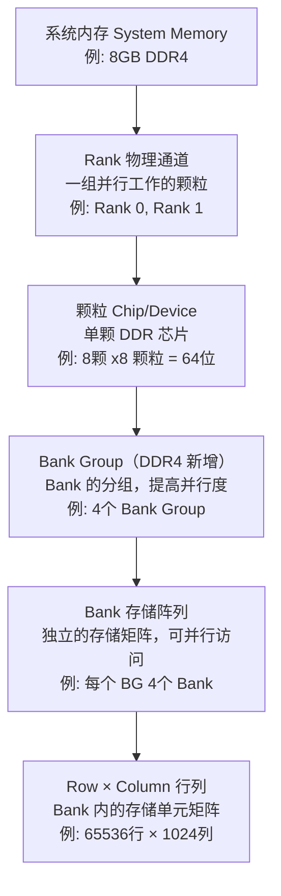

# DDR 物理结构与硬件设计

> 本文档从物理组织角度深入解析 DDR 内存结构，涵盖颗粒（Chip）、Rank、Bank、Bank Group 等核心概念，以及 PCB 布局设计、容量计算、ECC、ODT 等关键主题。
> **工程师视角**：理解物理结构是做好 PCB 布局和解决信号完整性问题的前提——DDR 的电气行为由物理结构决定。

### 关键术语

| 缩写 | 全称 | 含义 |
|------|------|------|
| ECC | Error Correction Code | 错误纠正码，检测并纠正内存数据错误 |
| ODT | On-Die Termination | 片上端接电阻，减少信号反射 |
| AL | Additive Latency | 附加延迟，让命令在控制器侧提前发出 |
| CR | Command Rate | 命令速率，1T=每周期发命令，2T=每两周期发命令 |
| RDIMM | Registered DIMM | 寄存式 DIMM，带 RCD 缓冲芯片 |
| LRDIMM | Load-Reduced DIMM | 减载 DIMM，带 RCD + DB 缓冲芯片 |
| UDIMM | Unbuffered DIMM | 无缓冲 DIMM，直接连接 |
| SODIMM | Small Outline DIMM | 小型 DIMM，用于笔记本/嵌入式 |

### 1.1 前置知识

| 需要了解 | 参考文档 |
|----------|----------|
| DDR 基本概念、信号线定义 | [DDR 基础概念](./01-DDR基础概念.md) |
| PCB 设计基础（阻抗/等长/层叠） | — |

***

## 一、DDR 物理组织结构：颗粒、Bank 与 Rank 详解

### 1.1 核心概念总览

DDR 内存层次结构，从系统级到存储单元级逐层展开：



### 1.2 颗粒详解

#### 1.2.1 什么是颗粒

**颗粒**即 DDR DRAM 芯片，是 DDR 内存的最基本物理单元。

DDR 颗粒封装类型:

```
┌─────────────────────────────────────────┐
│  FBGA (Fine-pitch Ball Grid Array)     │
│  ┌───────────────────────────┐         │
│  │  ┌─┬─┬─┬─┬─┬─┬─┬─┐       │         │
│  │  │●│●│●│●│●│●│●│●│       │         │
│  │  ├─┼─┼─┼─┼─┼─┼─┼─┤       │         │
│  │  │●│●│●│●│●│●│●│●│       │         │
│  │  ├─┼─┼─┼─┼─┼─┼─┼─┤       │         │
│  │  │●│●│●│●│●│●│●│●│       │         │
│  │  └─┴─┴─┴─┴─┴─┴─┴─┘       │         │
│  │    焊球阵列 (BGA)         │         │
│  └───────────────────────────┘         │
│  尺寸: 约 8mm × 14mm (x8)              │
└─────────────────────────────────────────┘
```

#### 1.2.2 颗粒位宽

颗粒按数据位宽分为 x4、x8、x16 三种类型：

| 类型 | 数据位宽 | DQS 对数 | 单颗典型容量 | 典型应用 |
|------|----------|----------|-------------|----------|
| x4 | 4位 (DQ[0:3]) | 1 | 较小 | 服务器 ECC 内存 |
| x8 | 8位 (DQ[0:7]) | 1 | 4Gb, 8Gb | 桌面、嵌入式（最常见） |
| x16 | 16位 (DQ[0:15]) | 2 | 较大 | 移动设备、低功耗 |

#### 1.2.3 颗粒容量计算

单颗颗粒容量计算:

- **容量 = Bank数 × 行数 × 列数 × 位宽**

**示例1: DDR4 8Gb x8 颗粒**
- Bank Group: 4
- Bank: 16 (4 Bank Groups × 4 Banks)
- Row: 65536 (16位行地址)
- Column: 1024 (10位列地址)
- 位宽: 8位
- 容量: 16 × 65536 × 1024 × 8 = 8,589,934,592 bits = 8 Gb

**示例2: DDR4 4Gb x16 颗粒**
- Bank Group: 2
- Bank: 8
- Row: 32768
- Column: 1024
- 位宽: 16位
- 容量: 8 × 32768 × 1024 × 16 = 4,294,967,296 bits = 4 Gb

#### 1.2.4 颗粒型号解读

**Samsung DDR4 颗粒型号示例:**

```
K4A8G085WB-BCWE
│ │ │ │ │  │ └─ 封装类型: FBGA
│ │ │ │ │  └─── 温度等级: 工业级
│ │ │ │ └────── 速度等级: 3200 Mbps
│ │ │ └──────── 版本号
│ │ └────────── 组织结构: x8 (08 = x8, 04 = x4, 16 = x16)
│ └──────────── 容量: 8Gb (8G = 8Gb, 4G = 4Gb)
└────────────── 厂商代码: K = Samsung
```

**Micron DDR4 颗粒型号示例:**

```
MT40A2G8SA-062E:B
│ │  │ │ │  │   └─ 封装: FBGA
│ │  │ │ │  └───── 速度等级: 3200 Mbps
│ │  │ │ └──────── 版本
│ │  │ └────────── 组织结构: x8
│ │  └──────────── 容量: 2Gb, x8 组织结构
│ └─────────────── 系列: DDR4
└──────────────── 厂商: Micron
```

> **说明:** `2G8` 中 `2G` 代表密度 2Gb，`8` 代表 x8 位宽。容量就是 2Gb，不存在乘法关系。

### 1.3 Rank 详解

#### 1.3.1 什么是 Rank

**Rank** 是一组共享相同片选信号 (CS#) 的 DDR 颗粒集合，它们并行工作以提供完整的数据位宽。

Rank 的定义:

- **一个 Rank = 64位数据宽度的颗粒组合**

```
┌─────────────────────────────────────────────────────────┐
│                    Rank 0                               │
│  ┌─────┐ ┌─────┐ ┌─────┐ ┌─────┐ ┌─────┐ ┌─────┐      │
│  │x8   │ │x8   │ │x8   │ │x8   │ │x8   │ │x8   │      │
│  │Chip0│ │Chip1│ │Chip2│ │Chip3│ │Chip4│ │Chip5│      │
│  │DQ0-7│ │DQ8-15│ │DQ16-23│ │DQ24-31│ │DQ32-39│ │DQ40-47│    │
│  └─────┘ └─────┘ └─────┘ └─────┘ └─────┘ └─────┘      │
│  ┌─────┐ ┌─────┐                                       │
│  │x8   │ │x8   │  共享同一个 CS# 信号                  │
│  │Chip6│ │Chip7│                                       │
│  │DQ48-55│ │DQ56-63│                                    │
│  └─────┘ └─────┘                                       │
│         8颗 x8 颗粒 = 64位数据宽度                     │
└─────────────────────────────────────────────────────────┘
```

#### 1.3.2 Single Rank vs Dual Rank

**Single Rank (单面内存):**

```
┌────────────────────────────────────────┐
│            内存模组 (正面)             │
│  ┌───┐┌───┐┌───┐┌───┐┌───┐┌───┐┌───┐┌───┐│
│  │x8 ││x8 ││x8 ││x8 ││x8 ││x8 ││x8 ││x8 ││
│  └───┘└───┘└───┘└───┘└───┘└───┘└───┘└───┘│
│           Rank 0 (CS0#)                │
└────────────────────────────────────────┘
```

特点:
- 只有一组颗粒
- 单个片选信号
- 成本较低
- 性能略低 (无法 Rank 交错)

**Dual Rank (双面内存):**

```
┌────────────────────────────────────────┐
│            内存模组 (正面)             │
│  ┌───┐┌───┐┌───┐┌───┐┌───┐┌───┐┌───┐┌───┐│
│  │x8 ││x8 ││x8 ││x8 ││x8 ││x8 ││x8 ││x8 ││
│  └───┘└───┘└───┘└───┘└───┘└───┘└───┘└───┘│
│           Rank 0 (CS0#)                │
└────────────────────────────────────────┘
┌────────────────────────────────────────┐
│            内存模组 (背面)             │
│  ┌───┐┌───┐┌───┐┌───┐┌───┐┌───┐┌───┐┌───┐│
│  │x8 ││x8 ││x8 ││x8 ││x8 ││x8 ││x8 ││x8 ││
│  └───┘└───┘└───┘└───┘└───┘└───┘└───┘└───┘│
│           Rank 1 (CS1#)                │
└────────────────────────────────────────┘
```

特点:
- 两组颗粒，分别在不同面
- 两个独立的片选信号 (CS0#, CS1#)
- 支持 Rank 交错，提高性能
- 成本较高

**Quad Rank (四 Rank):**

```
┌────────────────────────────────────────┐
│            内存模组 (正面)             │
│  ┌───┐┌───┐┌───┐┌───┐┌───┐┌───┐┌───┐┌───┐│
│  │x8 ││x8 ││x8 ││x8 ││x8 ││x8 ││x8 ││x8 ││
│  └───┘└───┘└───┘└───┘└───┘└───┘└───┘└───┘│
│           Rank 0 (CS0#)                │
└────────────────────────────────────────┘
┌────────────────────────────────────────┐
│            内存模组 (背面)             │
│  ┌───┐┌───┐┌───┐┌───┐┌───┐┌───┐┌───┐┌───┐│
│  │x8 ││x8 ││x8 ││x8 ││x8 ││x8 ││x8 ││x8 ││
│  └───┘└───┘└───┘└───┘└───┘└───┘└───┘└───┘│
│           Rank 1 (CS1#)                │
└────────────────────────────────────────┘
```

特点:
- 四组颗粒（双面各两个 Rank）
- 需要 CS0#, CS1#, CS2#, CS3# 四个片选信号
- 仅服务器 RDIMM/LRDIMM 支持，桌面 UDIMM 通常最多双 Rank
- 支持更高效的 Rank 交错，但信号负载更高

> **DDR4 标准最多支持 4 个 Rank**（JEDEC JESD79-4 定义）。实际支持的 Rank 数取决于控制器和 DIMM 插槽设计。

#### 1.3.3 Rank 配置示例

常见 Rank 配置:

**配置1: 8GB 单 Rank (使用 x8 颗粒)**
- 颗粒数量: 8颗 x8 颗粒
- 单颗容量: 8Gb
- 总容量: 8 × 8Gb = 64Gb = 8GB
- Rank 数: 1
- 数据位宽: 8 × 8 = 64位

**配置2: 8GB 双 Rank (使用 x8 颗粒)**
- 颗粒数量: 16颗 x8 颗粒
- 单颗容量: 4Gb
- 总容量: 16 × 4Gb = 64Gb = 8GB
- Rank 数: 2
- 数据位宽: 每个 Rank 64位

**配置3: 4GB 单 Rank (使用 x16 颗粒)**
- 颗粒数量: 4颗 x16 颗粒
- 单颗容量: 8Gb
- 总容量: 4 × 8Gb = 32Gb = 4GB
- Rank 数: 1
- 数据位宽: 4 × 16 = 64位

**配置4: 16GB 双 Rank (使用 x8 颗粒)**
- 颗粒数量: 16颗 x8 颗粒
- 单颗容量: 8Gb
- 总容量: 16 × 8Gb = 128Gb = 16GB
- Rank 数: 2
- 数据位宽: 每个 Rank 64位

### 1.4 Bank 详解

#### 1.4.1 什么是 Bank

**Bank** 是 DDR 芯片内部独立的存储阵列，可以并行访问以提高性能。

Bank 内部结构:

```
┌─────────────────────────────────────────────────────────┐
│                      Bank 0                             │
│  ┌───────────────────────────────────────────────────┐ │
│  │              Row 0                                │ │
│  │  Col0  Col1  Col2  Col3  ...  Col1023            │ │
│  │  ┌───┐┌───┐┌───┐┌───┐     ┌───┐                 │ │
│  │  │   ││   ││   ││   │ ... │   │                 │ │
│  │  └───┘└───┘└───┘└───┘     └───┘                 │ │
│  ├───────────────────────────────────────────────────┤ │
│  │              Row 1                                │ │
│  │  ┌───┐┌───┐┌───┐┌───┐     ┌───┐                 │ │
│  │  │   ││   ││   ││   │ ... │   │                 │ │
│  │  └───┘└───┘└───┘└───┘     └───┘                 │ │
│  ├───────────────────────────────────────────────────┤ │
│  │              Row 2                                │ │
│  │                      ...                          │ │
│  ├───────────────────────────────────────────────────┤ │
│  │             Row 65535                             │ │
│  │  ┌───┐┌───┐┌───┐┌───┐     ┌───┐                 │ │
│  │  │   ││   ││   ││   │ ... │   │                 │ │
│  │  └───┘└───┘└───┘└───┘     └───┘                 │ │
│  └───────────────────────────────────────────────────┘ │
│                                                         │
│  行缓冲区 (Row Buffer): 暂存当前激活行的数据           │
└─────────────────────────────────────────────────────────┘
```

关键概念:
- 同一时刻，一个 Bank 只能有一行处于激活状态
- 行缓冲区: 存储当前激活行的数据
- 行命中: 访问已激活的行 → 快速访问
- 行冲突: 访问未激活的行 → 需要 PRE + ACT

#### 1.4.2 Bank Group (DDR4 新增)

DDR4 Bank Group 架构:

```
┌─────────────────────────────────────────────────────────┐
│                   DDR4 芯片                             │
│  ┌──────────────────────────────────────────────────┐  │
│  │  Bank Group 0                                     │  │
│  │  ┌────────┐ ┌────────┐ ┌────────┐ ┌────────┐   │  │
│  │  │ Bank 0 │ │ Bank 1 │ │ Bank 2 │ │ Bank 3 │   │  │
│  │  └────────┘ └────────┘ └────────┘ └────────┘   │  │
│  ├──────────────────────────────────────────────────┤  │
│  │  Bank Group 1                                     │  │
│  │  ┌────────┐ ┌────────┐ ┌────────┐ ┌────────┐   │  │
│  │  │ Bank 4 │ │ Bank 5 │ │ Bank 6 │ │ Bank 7 │   │  │
│  │  └────────┘ └────────┘ └────────┘ └────────┘   │  │
│  ├──────────────────────────────────────────────────┤  │
│  │  Bank Group 2                                     │  │
│  │  ┌────────┐ ┌────────┐ ┌────────┐ ┌────────┐   │  │
│  │  │ Bank 8 │ │ Bank 9 │ │Bank 10 │ │Bank 11 │   │  │
│  │  └────────┘ └────────┘ └────────┘ └────────┘   │  │
│  ├──────────────────────────────────────────────────┤  │
│  │  Bank Group 3                                     │  │
│  │  ┌────────┐ ┌────────┐ ┌────────┐ ┌────────┐   │  │
│  │  │Bank 12 │ │Bank 13 │ │Bank 14 │ │Bank 15 │   │  │
│  │  └────────┘ └────────┘ └────────┘ └────────┘   │  │
│  └──────────────────────────────────────────────────┘  │
└─────────────────────────────────────────────────────────┘
```

Bank Group 的优势:
- 不同 Bank Group 可以更快的切换
- tCCD_L: 同一 Bank Group 内的命令间隔 (较长)
- tCCD_S: 不同 Bank Group 间的命令间隔 (较短)
- 提高并行度，提升性能

#### 1.4.3 各代 DDR Bank 数量对比

Bank 数量演进：

| 代际 | Bank 数 | Bank Group 数 | 地址线 | 说明 |
|------|---------|--------------|--------|------|
| DDR | 4 | 无 | BA[0:1] | — |
| DDR2 | 4 或 8 | 无 | BA[0:2] | — |
| DDR3 | 8 | 无 | BA[0:2] | — |
| DDR4 | 16 或 8 | 4 或 2 | BA[0:1] + BG[0:1] | x4/x8: 4 BG; x16: 2 BG |
| DDR5 | 32 或 16 | 8 或 4 | BA[0:1] + BG[0:2] | x4/x8: 32 Bank/8 BG; x16: 16 Bank/4 BG |

### 1.5 硬件设计视角

#### 1.5.1 PCB 布局设计

DDR PCB 布局要点:

```
┌─────────────────────────────────────────────────────────┐
│                    DDR4 布局示例                        │
│                                                         │
│    SoC/CPU                                             │
│   ┌──────┐                                             │
│   │      │                                             │
│   │ DDR  │                                             │
│   │ CTRL │                                             │
│   └──┬───┘                                             │
│      │                                                 │
│      │  数据线 (DQ) - 等长匹配                         │
│      │  ════════════════════════════                   │
│      │                                                 │
│      ├──────────────────────► 颗粒0 (DQ[0:7])         │
│      ├──────────────────────► 颗粒1 (DQ[8:15])        │
│      ├──────────────────────► 颗粒2 (DQ[16:23])       │
│      ├──────────────────────► 颗粒3 (DQ[24:31])       │
│      ├──────────────────────► 颗粒4 (DQ[32:39])       │
│      ├──────────────────────► 颗粒5 (DQ[40:47])       │
│      ├──────────────────────► 颗粒6 (DQ[48:55])       │
│      └──────────────────────► 颗粒7 (DQ[56:63])       │
│                                                         │
│      地址/命令线 - 拓扑结构 (T型或菊花链)              │
│      ══════════════════════════════════                │
│      │                                                 │
│      └──────────┬─────────┬─────────┬───►             │
│                 │         │         │                  │
│              颗粒0-7 共享地址/命令线                   │
│                                                         │
└─────────────────────────────────────────────────────────┘
```

关键设计规则:
- 数据线 (DQ): 点对点连接，等长匹配 ±10mil
- 地址/命令线: 拓扑结构，等长匹配
- 时钟线 (CK): 差分对，严格等长
- DQS: 差分对，与对应 DQ 组匹配
- 阻抗控制: 单端 50Ω (±10%), 差分 100Ω (±10%); DDR4 某些设计也用 40Ω/80Ω
- 参考平面: 完整地平面，避免分割

#### 1.5.2 颗粒布局方案

**单 Rank 布局 (8颗 x8):**

```
顶层 (Top Layer):
┌────────────────────────────────────┐
│  ┌───┐  ┌───┐  ┌───┐  ┌───┐       │
│  │U0 │  │U1 │  │U2 │  │U3 │       │
│  │x8 │  │x8 │  │x8 │  │x8 │       │
│  └───┘  └───┘  └───┘  └───┘       │
│                                    │
│  ┌───┐  ┌───┐  ┌───┐  ┌───┐       │
│  │U4 │  │U5 │  │U6 │  │U7 │       │
│  │x8 │  │x8 │  │x8 │  │x8 │       │
│  └───┘  └───┘  └───┘  └───┘       │
│                                    │
│         SoC/CPU                   │
│         ┌──────┐                  │
│         │      │                  │
│         └──────┘                  │
└────────────────────────────────────┘
```

**双 Rank 布局 (16颗 x8):**

```
顶层 (Top Layer) - Rank 0:
┌────────────────────────────────────┐
│  ┌───┐  ┌───┐  ┌───┐  ┌───┐       │
│  │U0 │  │U1 │  │U2 │  │U3 │       │
│  │x8 │  │x8 │  │x8 │  │x8 │       │
│  └───┘  └───┘  └───┘  └───┘       │
│                                    │
│  ┌───┐  ┌───┐  ┌───┐  ┌───┐       │
│  │U4 │  │U5 │  │U6 │  │U7 │       │
│  │x8 │  │x8 │  │x8 │  │x8 │       │
│  └───┘  └───┘  └───┘  └───┘       │
└────────────────────────────────────┘

底层 (Bottom Layer) - Rank 1:
┌────────────────────────────────────┐
│  ┌───┐  ┌───┐  ┌───┐  ┌───┐       │
│  │U8 │  │U9 │  │U10│  │U11│       │
│  │x8 │  │x8 │  │x8 │  │x8 │       │
│  └───┘  └───┘  └───┘  └───┘       │
│                                    │
│  ┌───┐  ┌───┐  ┌───┐  ┌───┐       │
│  │U12│  │U13│  │U14│  │U15│       │
│  │x8 │  │x8 │  │x8 │  │x8 │       │
│  └───┘  └───┘  └───┘  └───┘       │
└────────────────────────────────────┘
```

布局原则:
- 同一 Rank 的颗粒尽量靠近
- 数据线走线最短
- 地址/命令线均匀分布
- 去耦电容靠近电源引脚

#### 1.5.3 信号线分组

DDR4 信号分组（x8 颗粒，单 Rank）：

| 分组 | 包含信号 | 对应颗粒 | 等长匹配要求 |
|------|----------|----------|-------------|
| 数据组 0 (Byte Lane 0) | DQ[0:7], DQS0_t/DQS0_c, DM0 | U0 | DQ 与 DQS 匹配 ±10mil |
| 数据组 1 (Byte Lane 1) | DQ[8:15], DQS1_t/DQS1_c, DM1 | U1 | DQ 与 DQS 匹配 ±10mil |
| ... | ... | ... | ... |
| 数据组 7 (Byte Lane 7) | DQ[56:63], DQS7_t/DQS7_c, DM7 | U7 | DQ 与 DQS 匹配 ±10mil |
| 地址/命令组 | A[0:17], BA[0:1], BG[0:1], RAS#, CAS#, WE#, CS0#, CS1#, CKE, ACT# | — | 与时钟匹配 ±25mil |
| 时钟组 | CK_t, CK_c（差分对，所有颗粒共享） | — | 差分对内严格匹配 ±5mil |

> 不同 Byte Lane 间：DQS 间匹配 ±25mil

#### 1.5.4 DDR PCB Layout 设计指南

**1.5.4.1 阻抗控制**

DDR 信号阻抗要求：

> **说明：** 以下为 PCB 走线的目标特性阻抗（设计值），与 DDR 芯片内部的 ODT 端接阻抗（如 40Ω、60Ω 等）是不同的概念。PCB 阻抗通常设计为 50Ω/100Ω 以匹配大多数高速信号的行业标准。

| 信号类型 | 目标阻抗 | 控制方法 | 验证方式 |
|----------|----------|----------|----------|
| 单端信号（DQ, DQS, A, CMD, CK） | 50Ω ±10% | 调整走线宽度和介质厚度 | 阻抗计算工具（如 Polar Si9000） |
| 差分信号（CK_t/CK_c, DQS_t/DQS_c） | 100Ω ±10% | 调整差分对间距和走线宽度 | 差分阻抗仿真 |
| 电源平面（VDD, VDDQ） | 尽量低阻抗 | 去耦电容靠近电源引脚放置 | PDN 仿真 |

**1.5.4.2 等长匹配规则**

DDR 信号等长匹配要求：

| 信号类型 | 匹配对象 | 容差 | 备注 |
|----------|----------|------|------|
| CK_t/CK_c | 差分对内 | ±2mil | 最严格 |
| CK_t/CK_c | 到各颗粒 | ±25mil | 点对点 + 分支拓扑 |
| DQS_t/DQS_c | 差分对内 | ±2mil | — |
| DQ | 同一 Byte Lane 内 | ±5mil | — |
| DQ | 与对应 DQS | ±10mil | — |
| DQS | 不同 Byte Lane 间 | ±25mil | — |
| A, BA, CMD | 组内 | ±10mil | — |
| A, BA, CMD | 与时钟 | ±25mil | — |
| CS#, CKE, ODT | 到各颗粒 | ±25mil | — |
| CS#, CKE, ODT | 组内 | ±10mil | — |

> 等长匹配技巧：使用蛇形走线（Serpentine Routing）补偿长度，蛇形间距 ≥ 3 倍线宽，幅度 ≥ 3 倍线宽，避免锐角，使用 45° 或圆弧。

**1.5.4.3 拓扑结构**

DDR 地址/命令总线拓扑:

**Fly-by 拓扑 (推荐):**

```
控制器 ────┬──── U0 ──── U1 ──── U2 ──── U3
           │
           └── 终端电阻 (到 VDDQ/2)
```

特点:
- 信号依次经过每个颗粒
- 末端需要终端电阻
- 减少 stub 长度
- 适合高速 DDR3/DDR4/DDR5

**T-Topology (不推荐用于高速):**

```
           ┌──── U0
控制器 ────┼──── U1
           └──── U2
```

特点:
- 信号同时到达所有颗粒
- 等长要求严格
- 仅适合低速 DDR

**数据总线拓扑 (点对点):**

```
控制器 ──────── U0 (Byte Lane 0)
控制器 ──────── U1 (Byte Lane 1)
...
```

特点:
- 每个 Byte Lane 独立走线
- 无分支，信号质量最好
- 等长要求在同一 Byte Lane 内

**1.5.4.4 参考平面与层叠设计**

推荐 PCB 层叠 (8层板):

- Layer 1: 信号层 (DDR 信号)
- Layer 2: 地平面 (GND)
- Layer 3: 信号层 (DDR 信号)
- Layer 4: 电源平面 (VDD/VDDQ)
- Layer 5: 地平面 (GND)
- Layer 6: 信号层 (其他信号)
- Layer 7: 地平面 (GND)
- Layer 8: 信号层 (其他信号)

关键原则:
- DDR 信号层必须有完整的地平面参考
- 避免信号跨分割 (Split Plane)
- 电源平面与地平面相邻 (形成耦合电容)
- 地平面完整，减少返回路径阻抗

过孔设计:
- 尽量减少过孔数量 (最好 0~1 个)
- 使用盲埋孔 (Blind/Buried Via) 减少 stub
- 过孔反焊盘 (Anti-pad) 适当增大
- 关键信号避免换层

**1.5.4.5 去耦电容设计**

DDR 去耦电容配置：

| 位置 | 电容配置 | 放置要求 |
|------|----------|----------|
| 每个 DDR 颗粒 VDD 引脚 | 1×10μF + 2×0.1μF | 尽量靠近引脚（<5mm） |
| 每个 DDR 颗粒 VDDQ 引脚 | 1×10μF + 2×0.1μF | 尽量靠近引脚（<5mm） |
| 每个 DDR 颗粒 VREF 引脚 | 1×1μF + 1×0.1μF | 尽量靠近引脚（<5mm） |
| 电源平面（大面积去耦） | 4×22μF | 靠近连接器 |
| 电源平面（中频去耦） | 8×1μF | 均匀分布 |
| 电源平面（高频去耦） | 16×0.1μF | 靠近 IC |

> 电容选择：使用 X5R 或 X7R 介质（温度稳定性好），低 ESL/ESR，0402 或 0201 封装（高频特性好）。

**1.5.4.6 DDR Layout 检查清单**

DDR PCB Layout 检查清单：

| 检查项 | 具体要求 |
|--------|----------|
| 阻抗控制 | 单端 50Ω ±10%、差分 100Ω ±10%、阻抗计算报告 |
| 等长匹配 | 时钟差分对 ±2mil、DQS 差分对 ±2mil、同一 Byte Lane DQ ±5mil、DQ 与 DQS ±10mil、地址/命令 ±25mil |
| 拓扑结构 | Fly-by 拓扑（地址/命令）、点对点（数据）、终端电阻正确 |
| 参考平面 | 完整地平面参考、无跨分割、电源/地平面相邻 |
| 去耦电容 | 数量正确、位置靠近引脚、容值正确 |
| 其他 | 差分对平行走线（间距一致）、避免锐角（45° 或圆弧）、最小化过孔、测试点预留 |

***

## 二、内存条与 DIMM 模块详解

### 2.1 什么是 DIMM

**DIMM** = Dual Inline Memory Module，双列直插内存模块。

通俗来说，内存条就是把多颗 DDR 颗粒焊在一块小 PCB 板上，再加上一颗 SPD 芯片（用来告诉主板这块内存的参数），做成一个可以插拔的模块。你买到的"内存条"就是一个 DIMM 模块。

**裸颗粒 vs DIMM 模块:**

```
┌─────────────────────────────────────────────────────────────────┐
│                    裸颗粒方案 (嵌入式常见)                       │
│                                                                 │
│  ┌──────────────────────────────────────────────────────────┐  │
│  │                    主板 PCB                               │  │
│  │                                                           │  │
│  │   SoC    ┌───┐ ┌───┐ ┌───┐ ┌───┐ ┌───┐ ┌───┐ ┌───┐ ┌───┐│  │
│  │  ┌───┐  │D0 │ │D1 │ │D2 │ │D3 │ │D4 │ │D5 │ │D6 │ │D7 ││  │
│  │  │   │──│x8 │ │x8 │ │x8 │ │x8 │ │x8 │ │x8 │ │x8 │ │x8 ││  │
│  │  └───┘  └───┘ └───┘ └───┘ └───┘ └───┘ └───┘ └───┘ └───┘│  │
│  │                                                           │  │
│  │  特点: 颗粒直接焊接，不可更换，体积小，成本低              │  │
│  │  场景: 手机、平板、嵌入式开发板、树莓派                    │  │
│  └──────────────────────────────────────────────────────────┘  │
└─────────────────────────────────────────────────────────────────┘

┌─────────────────────────────────────────────────────────────────┐
│                    DIMM 模块方案 (PC/服务器常见)                │
│                                                                 │
│  ┌──────────────────────────────────────────────────────────┐  │
│  │                    主板 PCB                               │  │
│  │                                                           │  │
│  │   CPU    ┌─────────────────────────────────────┐          │  │
│  │  ┌───┐  │        DIMM 内存条 (可插拔)          │          │  │
│  │  │   │──│  ┌───┐┌───┐┌───┐┌───┐┌───┐┌───┐┌───┐│          │  │
│  │  └───┘  │  │D0 ││D1 ││D2 ││D3 ││D4 ││D5 ││D6 ││          │  │
│  │         │  └───┘└───┘└───┘└───┘└───┘└───┘└───┘│          │  │
│  │         │  ┌───┐┌───┐  ┌───┐                    │          │  │
│  │         │  │D7 ││D8 │  │SPD│  ← 参数芯片       │          │  │
│  │         │  └───┘└───┘  └───┘                    │          │  │
│  │         └─────────────────────────────────────┘          │  │
│  │                      ▼ 金手指 (Edge Connector)            │  │
│  │                                                           │  │
│  │  特点: 可插拔，可升级，标准化接口                          │  │
│  │  场景: 台式机、笔记本、服务器                              │  │
│  └──────────────────────────────────────────────────────────┘  │
└─────────────────────────────────────────────────────────────────┘
```

两种方案的核心区别:

| 对比项 | 裸颗粒 (POP/焊接) | DIMM 模块 (插槽) |
|--------|-------------------|------------------|
| 可更换性 | 不可更换，焊接固定 | 可插拔，灵活升级 |
| 容量 | 固定，设计时确定 | 可扩展，用户自行添加 |
| 成本 | 整体成本低 | 模块本身有额外成本 |
| 体积 | 极小，适合便携设备 | 较大，需要插槽空间 |
| 信号完整性 | 走线短，信号好 | 经过连接器，需额外设计 |
| 典型应用 | 手机、嵌入式 | PC、服务器 |

### 2.2 DIMM 类型对比

常见 DIMM 类型一览:

| 类型 | 全称 | 特点 | 适用场景 | 容量范围 | 价格 |
|------|------|------|----------|----------|------|
| **UDIMM** | Unbuffered DIMM | 无缓冲，延迟最低，CPU直接驱动 | 台式机、普通办公 | 4GB - 32GB | 低 |
| **RDIMM** | Registered DIMM | 带寄存器，降低CPU负载，支持更大容量 | 服务器、工作站 | 8GB - 128GB | 高 |
| **LRDIMM** | Load-Reduced DIMM | 带数据缓冲芯片，大幅降低负载 | 大型服务器、数据中心 | 64GB - 256GB | 很高 |
| **SO-DIMM** | Small Outline DIMM | 小尺寸，67.6mm长 | 笔记本、迷你PC | 4GB - 64GB | 中 |
| **NVDIMM** | Non-Volatile DIMM | 内置闪存，断电不丢数据 | 数据库、关键业务 | 8GB - 128GB | 极高 |

**各类型详细说明:**

**UDIMM (无缓冲内存条):**
- 信号从 CPU 直通颗粒，中间没有任何缓冲
- 延迟最低，但 CPU 驱动能力有限，不能接太多颗粒
- 最多支持 2 Rank，容量受限
- 台式机最常见的内存条类型

**RDIMM (带寄存器内存条):**
- 地址/命令信号经过一颗 Register 芯片缓冲
- CPU 只需驱动 Register 芯片，Register 再驱动所有颗粒
- 有效降低 CPU 内存控制器的电气负载
- 支持 4-8 Rank，单条容量可达 128GB
- 延迟比 UDIMM 高约 1-2 个时钟周期

**LRDIMM (低负载内存条):**
- 在 RDIMM 基础上，数据线也经过 Data Buffer 芯片缓冲
- CPU 看到的电气负载极小，可以支持更多颗粒
- 单条容量可达 256GB 甚至更高
- 延迟比 RDIMM 再高约 1-2 个时钟周期
- 适用于需要超大内存的数据中心

**SO-DIMM (小尺寸内存条):**
- 尺寸约为标准 DIMM 的 2/3（67.6mm vs 133.35mm）
- 引脚数更少（DDR4 SO-DIMM 260pin vs DDR4 DIMM 288pin）
- 笔记本电脑的标准内存规格

**NVDIMM (非易失性内存条):**
- 结合 DRAM + NAND Flash + 备用电池/超级电容
- 正常工作时作为高速 DRAM 使用
- 断电时自动将数据保存到 NAND Flash
- 适用于需要持久化内存的场景（如数据库日志、虚拟化）

DIMM 正反面结构简图 (以标准 DDR4 UDIMM 为例):

```
正面 (Front Side):
┌═══════════════════════════════════════════════════════════════════════┐
│  ┌──────┐ ┌──────┐ ┌──────┐ ┌──────┐ ┌──────┐ ┌──────┐ ┌──────┐    │
│  │ DRAM │ │ DRAM │ │ DRAM │ │ DRAM │ │ DRAM │ │ DRAM │ │ DRAM │    │
│  │ x8   │ │ x8   │ │ x8   │ │ x8   │ │ x8   │ │ x8   │ │ x8   │    │
│  │ Chip0│ │ Chip1│ │ Chip2│ │ Chip3│ │ Chip4│ │ Chip5│ │ Chip6│    │
│  └──────┘ └──────┘ └──────┘ └──────┘ └──────┘ └──────┘ └──────┘    │
│  ┌──────┐ ┌──────┐                                                  │
│  │ DRAM │ │  SPD │  ← EEPROM，存储内存条参数                       │
│  │ x8   │ │ Chip │                                                  │
│  │ Chip7│ └──────┘                                                  │
│  └──────┘                                                            │
│                                                                       │
│  ┌──────────────────────────────────────────────────────────────┐   │
│  │  ▼▼▼▼▼▼▼▼▼▼▼▼▼▼▼▼▼▼▼▼▼▼▼▼▼▼▼▼▼▼▼▼▼▼▼▼▼▼▼▼▼▼▼▼▼▼▼▼▼▼  │   │
│  │  金手指 (Gold Fingers) - 288 pin (DDR4)                      │   │
│  │  ▲▲▲▲▲▲▲▲▲▲▲▲▲▲▲▲▲▲▲▲▲▲▲▲▲▲▲▲▲▲▲▲▲▲▲▲▲▲▲▲▲▲▲▲▲▲▲▲▲▲  │   │
│  └──────────────────────────────────────────────────────────────┘   │
│                                                                       │
│  ◄──────────────── 133.35mm (标准 DIMM 长度) ──────────────────►    │
└═══════════════════════════════════════════════════════════════════════┘

背面 (Back Side):
┌═══════════════════════════════════════════════════════════════════════┐
│  ┌──────┐ ┌──────┐ ┌──────┐ ┌──────┐ ┌──────┐ ┌──────┐ ┌──────┐    │
│  │ DRAM │ │ DRAM │ │ DRAM │ │ DRAM │ │ DRAM │ │ DRAM │ │ DRAM │    │
│  │ x8   │ │ x8   │ │ x8   │ │ x8   │ │ x8   │ │ x8   │ │ x8   │    │
│  │ Chip8│ │ Chip9│ │Chip10│ │Chip11│ │Chip12│ │Chip13│ │Chip14│    │
│  └──────┘ └──────┘ └──────┘ └──────┘ └──────┘ └──────┘ └──────┘    │
│  ┌──────┐                                                             │
│  │ DRAM │  (Dual Rank: 背面是 Rank 1)                                │
│  │ x8   │                                                             │
│  │Chip15│                                                             │
│  └──────┘                                                             │
│                                                                       │
│  ┌──────────────────────────────────────────────────────────────┐   │
│  │  ▼▼▼▼▼▼▼▼▼▼▼▼▼▼▼▼▼▼▼▼▼▼▼▼▼▼▼▼▼▼▼▼▼▼▼▼▼▼▼▼▼▼▼▼▼▼▼▼▼▼  │   │
│  │  金手指 (Gold Fingers)                                      │   │
│  │  ▲▲▲▲▲▲▲▲▲▲▲▲▲▲▲▲▲▲▲▲▲▲▲▲▲▲▲▲▲▲▲▲▲▲▲▲▲▲▲▲▲▲▲▲▲▲▲▲▲▲  │   │
│  └──────────────────────────────────────────────────────────────┘   │
└═══════════════════════════════════════════════════════════════════════┘
```

### 2.3 SPD 芯片

**SPD** = Serial Presence Detect，串行存在检测。

SPD 是一颗小容量的 EEPROM 芯片（通常 256 字节或更多），焊在内存条上，存储这块内存条的"身份证信息"。

**SPD 存储的关键信息:**

| 信息类别 | 具体内容 | 用途 |
|----------|----------|------|
| 基础信息 | 模块类型、厂商、生产日期 | 识别内存条 |
| 容量信息 | 颗粒数量、Rank 数、位宽 | 计算总容量 |
| 频率信息 | 支持的速率等级 (如 3200 MT/s) | 确定运行频率 |
| 时序信息 | CL、tRCD、tRP、tRAS 等时序参数 | 配置时序 |
| 电压信息 | 工作电压 (如 1.2V) | 配置电源 |
| 模块信息 | PCB 层数、高度、厚度 | 物理兼容性检查 |

**工作流程:**

```
上电
  │
  ▼
BIOS/U-Boot 通过 I2C/SMBus 读取 SPD
  │
  ▼
解析 SPD 数据，获取容量、频率、时序
  │
  ▼
根据 SPD 信息自动配置 DDR 控制器
  │
  ▼
内存初始化完成，系统启动
```

**常用 SPD 读取工具:**

```bash
# 方法1: 使用 spd-decode (需要安装 i2c-tools)
sudo modprobe eeprom
sudo spd-decode /sys/bus/i2c/drivers/at24/0-0050/eeprom

# 输出示例:
# Decoding EEPROM... /sys/bus/i2c/drivers/at24/0-0050/eeprom
# Calculated EEPROM CRC 0x1A  <-- OK
#
# SPD Revision:                 1.1
# --- Memory Characteristics (Byte 0-23) ---
# Fundamental Memory type:      DDR4 SDRAM
# Module Type:                  SO-DIMM
#
# --- Module Information (Byte 120-127) ---
# Module Manufacturer:          Samsung
# Module Revision Code:         0x00
# DRAM Manufacturer:            Samsung
# DRAM Part Number:             M471A1K43CB1-CRC
# Module Serial Number:         0x3A7F8D21
# Manufacturing Date:           2022-W06
#
# --- Timing Parameters ---
# tCL (CAS Latency):            22
# tRCD:                         22
# tRP:                          22
# tRAS:                         52
# --- Speed ---
# Maximum Speed:                3200 MT/s

# 方法2: 使用 dmidecode
sudo dmidecode --type memory

# 输出示例:
# Memory Device
#         Size: 8192 MB
#         Form Factor: SO-DIMM
#         Type: DDR4
#         Speed: 3200 MT/s
#         Manufacturer: Samsung
#         Serial Number: 3A7F8D21
#         Part Number: M471A1K43CB1-CRC
#         Configured Clock Speed: 3200 MT/s
```

> **实用提示:** 在嵌入式 Linux 开发中，如果系统无法识别内存容量或频率不对，第一步就是用 `i2cdetect` 确认 SPD 芯片是否正常通信，再用 `spd-decode` 检查 SPD 数据是否正确。

### 2.4 实际选型指南

根据不同应用场景，内存条选型建议如下:

**服务器场景:**
- 类型: RDIMM 或 LRDIMM
- 必须支持 ECC
- 容量: 64GB - 256GB 每条
- 频率: 不追求最高，稳定优先
- 品牌: Samsung、SK Hynix、Micron 原厂条
- 注意: 同一通道内尽量使用相同型号和批次的内存条

**台式机场景:**
- 类型: UDIMM
- 一般不需要 ECC（消费级平台多不支持）
- 容量: 16GB - 32GB（双通道各一条）
- 频率: DDR4-3200 或 DDR5-5600 性价比最高
- 品牌: 品牌内存条（如金士顿、芝奇、海盗船等）

**嵌入式场景:**
- 通常不使用 DIMM 模块
- 颗粒直接焊接在主板上
- 容量根据需求固定（常见 512MB - 8GB）
- 选型重点: 颗粒供货周期、温度等级、封装尺寸
- 特殊需求: 车规级 (AEC-Q100)、工业级 (-40~85C)

**笔记本场景:**
- 类型: SO-DIMM
- 容量: 8GB - 32GB
- 注意: 部分轻薄本内存已焊死，无法升级
- DDR4 SO-DIMM (260pin) vs DDR5 SO-DIMM (262pin) 物理不兼容

选型决策树:

```
                    你的设备是什么？
                         │
              ┌──────────┼──────────┐
              │          │          │
          服务器      台式机     嵌入式/移动
              │          │          │
              ▼          ▼          ▼
        需要多大内存？  需要ECC？  需要可更换？
              │          │          │
        ┌─────┴─────┐   │     ┌────┴────┐
        │           │   │     │         │
     <=128GB    >128GB 是   │       是    否
        │           │   │     │       │     │
        ▼           ▼   ▼     ▼       ▼     ▼
      RDIMM     LRDIMM UDIMM SO-DIMM SO-DIMM 焊接
      +ECC      +ECC         (笔记本) (迷你PC) 颗粒
```

> **避坑指南:**
> - 不同代际的 DDR 物理不兼容（DDR3、DDR4、DDR5 的防呆口位置不同）
> - 台式机 UDIMM 和服务器 RDIMM 不能混插
> - 混插不同频率的内存条，所有内存会降到最低频率运行
> - 混插不同容量的内存条，部分芯片组不支持非对称双通道

***

## 三、通道配置实际案例

### 3.1 什么是通道（Channel）

**通道 (Channel)** 是 CPU/SoC 到内存的独立数据通路。你可以把它理解为一条"高速公路"，数据通过这条公路在 CPU 和内存之间来回传输。

- **单通道** = 1 条路，所有数据只能走这一条路
- **双通道** = 2 条路并行，数据可以分两路同时传输
- **四通道** = 4 条路并行，吞吐量更大

```
类比：高速公路车道

单通道 (单车道):
  CPU ═══════════════════════════════════► 内存
       每次只能一辆车通过，容易堵车

双通道 (双车道):
  CPU ═══════════════════════════════════► 内存
       ═══════════════════════════════════►
       两辆车可以并排跑，吞吐量翻倍

四通道 (四车道):
  CPU ═══════════════════════════════════► 内存
       ═══════════════════════════════════►
       ═══════════════════════════════════►
       ═══════════════════════════════════►
       四辆车并排跑，吞吐量四倍
```

从硬件角度看，每个通道拥有:
- 独立的 DDR 控制器
- 独立的命令/地址总线
- 独立的 64 位数据总线
- 独立的 DQS、CK 等信号

### 3.2 嵌入式系统中的通道配置

不同平台的通道配置差异很大:

| 平台类型 | 典型代表 | 通道数 | 数据位宽 | 典型带宽 |
|----------|----------|--------|----------|----------|
| 低端嵌入式 | 全志 H3, i.MX6ULL | 1 | 16/32位 | 3.2-6.4 GB/s |
| 中端嵌入式 | RK3399, i.MX8M | 1-2 | 32位 | 12.8-25.6 GB/s |
| 高端嵌入式 | RK3588, Snapdragon 8 Gen2 | 2-4 | 32位 | 51.2-68 GB/s |
| 桌面 PC | Intel Core, AMD Ryzen | 2 | 64位 | 51.2-76.8 GB/s |
| 服务器 | Intel Xeon, AMD EPYC | 4-8 | 64位 | 153.6-204.8 GB/s |

单通道 vs 双通道 vs 四通道结构对比:

```
单通道 (Single Channel):
┌──────────┐
│  CPU/SoC │
│ ┌──────┐ │
│ │ DDR  │ │     ┌───┐┌───┐┌───┐┌───┐┌───┐┌───┐┌───┐┌───┐
│ │CTRL  │─┼────►│D0 ││D1 ││D2 ││D3 ││D4 ││D5 ││D6 ││D7 │
│ │ CH0  │ │     └───┘└───┘└───┘└───┘└───┘└───┘└───┘└───┘
│ └──────┘ │     8颗 x8 = 64位
└──────────┘     带宽: DDR4-3200 → 25.6 GB/s

双通道 (Dual Channel):
┌──────────┐
│  CPU/SoC │
│ ┌──────┐ │     ┌───┐┌───┐┌───┐┌───┐┌───┐┌───┐┌───┐┌───┐
│ │CTRL0 │─┼────►│D0 ││D1 ││D2 ││D3 ││D4 ││D5 ││D6 ││D7 │
│ │ CH0  │ │     └───┘└───┘└───┘└───┘└───┘└───┘└───┘└───┘
│ └──────┘ │
│ ┌──────┐ │     ┌───┐┌───┐┌───┐┌───┐┌───┐┌───┐┌───┐┌───┐
│ │CTRL1 │─┼────►│D8 ││D9 ││D10││D11││D12││D13││D14││D15│
│ │ CH1  │ │     └───┘└───┘└───┘└───┘└───┘└───┘└───┘└───┘
│ └──────┘ │     16颗 x8 = 128位
└──────────┘     带宽: DDR4-3200 × 2 → 51.2 GB/s

四通道 (Quad Channel):
┌──────────┐
│  CPU/SoC │
│ ┌──────┐ │     ┌───┐┌───┐┌───┐┌───┐┌───┐┌───┐┌───┐┌───┐
│ │CTRL0 │─┼────►│D0 ││D1 ││D2 ││D3 ││D4 ││D5 ││D6 ││D7 │
│ │ CH0  │ │     └───┘└───┘└───┘└───┘└───┘└───┘└───┘└───┘
│ └──────┘ │
│ ┌──────┐ │     ┌───┐┌───┐┌───┐┌───┐┌───┐┌───┐┌───┐┌───┐
│ │CTRL1 │─┼────►│D8 ││D9 ││D10││D11││D12││D13││D14││D15│
│ │ CH1  │ │     └───┘└───┘└───┘└───┘└───┘└───┘└───┘└───┘
│ └──────┘ │
│ ┌──────┐ │     ┌───┐┌───┐┌───┐┌───┐┌───┐┌───┐┌───┐┌───┐
│ │CTRL2 │─┼────►│D16││D17││D18││D19││D20││D21││D22││D23│
│ │ CH2  │ │     └───┘└───┘└───┘└───┘└───┘└───┘└───┘└───┘
│ └──────┘ │
│ ┌──────┐ │     ┌───┐┌───┐┌───┐┌───┐┌───┐┌───┐┌───┐┌───┐
│ │CTRL3 │─┼────►│D24││D25││D26││D27││D28││D29││D30││D31│
│ │ CH3  │ │     └───┘└───┘└───┘└───┘└───┘└───┘└───┘└───┘
│ └──────┘ │     32颗 x8 = 256位
└──────────┘     带宽: DDR4-3200 × 4 → 102.4 GB/s
```

### 3.3 实际产品案例分析

**案例1: 树莓派 4**

```
┌─────────────────────────────────────────┐
│            Raspberry Pi 4               │
│                                         │
│  SoC: Broadcom BCM2711                 │
│  ┌──────────────┐                       │
│  │  DDR CTRL    │                       │
│  │  CH0 (32bit) │──► LPDDR4 3200MT/s   │
│  └──────────────┘    焊接在 PCB 背面    │
│                                         │
│  ┌─────────────────────────────────┐    │
│  │  容量: 1/2/4/8 GB (可选)        │    │
│  │  通道: 单通道                   │    │
│  │  位宽: 32位                     │    │
│  │  带宽: 3200×32/8 = 12.8 GB/s   │    │
│  │  类型: LPDDR4 (焊接，不可更换)  │    │
│  └─────────────────────────────────┘    │
└─────────────────────────────────────────┘
```

**案例2: RK3588 开发板 (如 Orange Pi 5)**

```
┌─────────────────────────────────────────┐
│         RK3588 Development Board        │
│                                         │
│  SoC: Rockchip RK3588                  │
│  ┌──────────────┐                       │
│  │  DDR CTRL 0  │──► DDR4 CH0 (32bit)  │
│  └──────────────┘                       │
│  ┌──────────────┐                       │
│  │  DDR CTRL 1  │──► DDR4 CH1 (32bit)  │
│  └──────────────┘                       │
│                                         │
│  ┌─────────────────────────────────┐    │
│  │  容量: 4/8/16 GB                │    │
│  │  通道: 双通道                   │    │
│  │  位宽: 64位 (32+32)             │    │
│  │  带宽: 3200×64/8 = 25.6 GB/s   │    │
│  │  类型: DDR4 (焊接)              │    │
│  │  典型: 4颗 x16 颗粒 (双通道)    │    │
│  └─────────────────────────────────┘    │
└─────────────────────────────────────────┘
```

**案例3: 普通 PC (Intel Core i5-13600K)**

```
┌─────────────────────────────────────────┐
│           Desktop PC (DDR5)             │
│                                         │
│  CPU: Intel Core i5-13600K             │
│  ┌──────────────┐                       │
│  │  IMC CH0     │──► DDR5 DIMM Slot 0  │
│  │  (64bit)     │──► DDR5 DIMM Slot 1  │
│  └──────────────┘                       │
│  ┌──────────────┐                       │
│  │  IMC CH1     │──► DDR5 DIMM Slot 2  │
│  │  (64bit)     │──► DDR5 DIMM Slot 3  │
│  └──────────────┘                       │
│                                         │
│  ┌─────────────────────────────────┐    │
│  │  容量: 16/32 GB (2×8/2×16)      │    │
│  │  通道: 双通道                   │    │
│  │  位宽: 128位 (64+64)            │    │
│  │  带宽: 4800×128/8 = 76.8 GB/s  │    │
│  │  类型: DDR5 UDIMM (可插拔)      │    │
│  │  插槽: 4个 (每通道2个)          │    │
│  └─────────────────────────────────┘    │
└─────────────────────────────────────────┘
```

**案例4: 服务器 (Intel Xeon Scalable)**

```
┌─────────────────────────────────────────┐
│         Server (DDR5)                   │
│                                         │
│  CPU: Intel Xeon Gold 6430             │
│  ┌──────────────┐                       │
│  │  IMC CH0     │──► DDR5 RDIMM Slot   │
│  └──────────────┘                       │
│  ┌──────────────┐                       │
│  │  IMC CH1     │──► DDR5 RDIMM Slot   │
│  └──────────────┘                       │
│  ┌──────────────┐                       │
│  │  IMC CH2     │──► DDR5 RDIMM Slot   │
│  └──────────────┘                       │
│  ┌──────────────┐                       │
│  │  IMC CH3     │──► DDR5 RDIMM Slot   │
│  └──────────────┘                       │
│  ┌──────────────┐                       │
│  │  IMC CH4     │──► DDR5 RDIMM Slot   │
│  └──────────────┘                       │
│  ┌──────────────┐                       │
│  │  IMC CH5     │──► DDR5 RDIMM Slot   │
│  └──────────────┘                       │
│  ┌──────────────┐                       │
│  │  IMC CH6     │──► DDR5 RDIMM Slot   │
│  └──────────────┘                       │
│  ┌──────────────┐                       │
│  │  IMC CH7     │──► DDR5 RDIMM Slot   │
│  └──────────────┘                       │
│                                         │
│  ┌─────────────────────────────────┐    │
│  │  容量: 256-1024 GB              │    │
│  │  通道: 八通道                   │    │
│  │  位宽: 512位 (8×64)             │    │
│  │  带宽: 4800×512/8 = 307.2 GB/s │    │
│  │  类型: DDR5 RDIMM + ECC         │    │
│  │  插槽: 每CPU 8个                │    │
│  └─────────────────────────────────┘    │
└─────────────────────────────────────────┘
```

### 3.4 通道数对性能的影响

**理论带宽计算:**

```
理论带宽 = 通道数 × 单通道位宽 × 数据传输速率 / 8

示例:
  单通道 DDR4-3200: 1 × 64 × 3200 / 8 = 25.6 GB/s
  双通道 DDR4-3200: 2 × 64 × 3200 / 8 = 51.2 GB/s
  双通道 DDR5-4800: 2 × 64 × 4800 / 8 = 76.8 GB/s
  八通道 DDR5-4800: 8 × 64 × 4800 / 8 = 307.2 GB/s
```

**实际性能提升 vs 理论带宽:**

理论上双通道带宽是单通道的 2 倍，但实际应用中的性能提升通常只有 **30% - 70%**，而不是 100%。原因如下:

| 影响因素 | 说明 |
|----------|------|
| **内存访问局部性** | 程序往往集中访问一小块内存，无法充分利用多通道并行 |
| **控制器调度限制** | DDR 控制器需要处理 Bank 激活、预充电等操作，存在调度开销 |
| **Cache 的作用** | CPU 的 L1/L2/L3 Cache 命中率高时，内存带宽需求本身就低 |
| **地址映射策略** | 如果地址映射不够优化，数据可能集中在某个通道 |
| **Rank 交错效率** | 交错粒度和访问模式不匹配时，并行度下降 |

```
典型场景下的双通道 vs 单通道性能对比:

场景                    单通道    双通道    提升
────────────────────────────────────────────────
内存带宽测试 (STREAM)   25.6     51.2     ~100%  (理论值)
实际应用:
  视频编码              基准     +35~50%  (大量连续内存访问)
  3D 渲染               基准     +30~45%  (纹理数据并行加载)
  数据库                基准     +40~60%  (大量随机内存访问)
  日常办公/浏览         基准     +5~15%   (内存需求低，感知不明显)
  游戏                  基准     +15~30%  (取决于场景复杂度)
  编译                  基准     +20~40%  (大量文件读写)
```

> **总结:** 通道数是影响内存性能的重要因素，但不是唯一因素。对于嵌入式系统来说，单通道配合高频率 LPDDR（如 LPDDR5-6400）有时比双通道低频 DDR4 性能更好。选型时需要综合考虑通道数、频率、容量和成本。

***

## 四、容量计算、问题排查与高级主题

### 4.1 容量计算总结

DDR 内存容量计算公式:

- **总容量 = Rank数 × 每Rank颗粒数 × 单颗容量**

其中:
- **单颗容量 = Bank Group数 × 每Group Bank数 × 行数 × 列数 × 位宽**

**示例计算:**

配置: DDR4 16GB 双 Rank (x8 颗粒)
- Rank 数: 2
- 每 Rank 颗粒数: 8
- 颗粒位宽: x8
- Bank Group: 4
- 每 Group Bank: 4 → 总 Bank: 16
- 行数: 65536 (16位)
- 列数: 1024 (10位)
- 单颗容量: 4 × 4 × 65536 × 1024 × 8 = 8 Gb

总容量: 2 × 8 × 8 Gb = 128 Gb = 16 GB

验证:
- 数据位宽: 8颗 × 8位 = 64位
- 单 Rank 容量: 8颗 × 8Gb = 64Gb = 8GB
- 双 Rank 容量: 2 × 8GB = 16GB
- 地址位宽: log2(16GB) = 34位

### 4.2 常见问题与排查

DDR 硬件问题可以归为三类根因：**物理连接故障**、**配置参数错误**、**信号完整性问题**。以下按根因分类组织，而非按组件罗列。

#### 4.2.1 物理连接故障

这类问题在硬件打样回来的第一版最常见，表现为系统完全无法启动或内存测试大面积失败。

**焊接问题**是最常见的物理故障。DDR 颗粒通常使用 BGA 封装，焊球隐藏在芯片下方，肉眼无法直接检查。典型症状是内存测试随机失败、特定地址访问错误、温度变化时问题加剧（热胀冷缩改变接触状态）。排查手段按成本从低到高：目视检查外围引脚 → X-Ray 检查 BGA 焊球 → 示波器测量可疑引脚的信号波形。如果怀疑焊接问题，可以先对 BGA 芯片进行 reflow（重新加热回流），观察问题是否消失。

**PCB 走线断裂或短路**的症状与焊接问题类似，但通常集中在特定信号线上。如果 Walking Bits 测试总是某一位出错，且重新焊接颗粒后问题依旧，应怀疑 PCB 走线。排查方法：用万用表测量可疑信号线的连通性，对比原理图确认走线路径。

#### 4.2.2 配置参数错误

这类问题发生在硬件正确但软件配置与实际情况不匹配时。**这是 DDR 调试中最常见的错误类型**，因为配置参数分散在多个寄存器中，一个位配错就可能导致整个地址空间错乱。

**地址位数配置错误**是最隐蔽的问题。如果 Row 地址位数配少了一位（比如 16 位配成 15 位），高地址区域会回绕到低地址，导致内存测试在特定容量边界失败。典型症状：小范围测试通过，大范围测试失败；或者系统识别的容量与实际不符。排查方法：从颗粒数据手册的 Addressing Table 确认 Row/Column/Bank 地址位数，逐一核对控制器寄存器。

**Rank 数量配置错误**导致容量识别异常。双 Rank 配成单 Rank → 只能识别一半容量；单 Rank 配成双 Rank → 控制器尝试访问不存在的 Rank 导致超时。排查方法：检查 PCB 上颗粒数量和 CS# 信号连接，确认控制器 Rank 配置寄存器。

**颗粒位宽配置错误**（x4/x8/x16）导致数据错位。如果硬件使用 x8 颗粒但软件配置为 x16，控制器会按 16 位粒度读写，导致数据在 DQ 线上错位。排查方法：检查颗粒型号标识（料号中的位宽编码），确认控制器总线位宽配置。

**时序参数配置错误**导致训练通过但读写数据错误。如果 tCL/tRCD 等参数配得过紧（小于颗粒实际能力），数据眼图未完全打开，表现为间歇性错误。排查方法：放宽时序参数 1-2 个周期，观察问题是否消失。

#### 4.2.3 信号完整性问题

这类问题最难排查，因为错误通常是间歇性的，且与温度、电压、频率相关。详细讨论见 [DDR 性能优化与测量调试](./06-DDR性能优化与测量调试.md) 的信号完整性章节。

**阻抗不匹配**导致信号反射和振铃。DDR4 要求单端信号 50Ω、差分信号 100Ω 的特征阻抗。如果 PCB 走线阻抗偏离这个值，信号边沿会出现过冲和振铃，缩小数据眼图窗口。排查方法：TDR（时域反射计）测量走线阻抗。

**走线不等长**导致 DQS 与 DQ 之间的时序偏移。DDR4-3200 的数据有效窗口只有约 312ps，DQS 组内走线长度差异应控制在 5ps 以内（对应约 1mm 的 FR4 走线差异）。排查方法：检查 PCB 设计文件中的走线长度报告。

**电源噪声**导致信号参考电平波动。DDR 的 VDD/VDDQ 纹波应控制在 50mV p-p 以内。如果纹波过大，数据眼图的垂直裕量被压缩。排查方法：示波器交流耦合测量电源轨纹波。

**串扰**（Crosstalk）发生在相邻信号线之间。DDR 的 DQ 信号线通常以 Byte Lane 为单位紧密布线，如果线间距不足，相邻线的信号跳变会通过电磁耦合干扰目标线。排查方法：眼图测试中观察非目标线跳变时目标线眼图的收缩程度。

> **排查优先级**：永远从最基础的硬件条件开始——先确认电源和时钟，再检查配置参数，最后才怀疑信号完整性。详细的系统级排查流程见 [DDR 驱动开发与调试](./05-DDR驱动开发与调试.md)。

### 4.3 Channel (通道) 与 Rank 的关系

Channel 与 Rank 是两个不同维度的概念：

| 维度 | 视角 | 说明 |
|------|------|------|
| **Channel** | 控制器侧 | 每个 Channel 有独立的命令/地址总线和数据总线 (64位) |
| **Rank** | DRAM 侧 | 同一 Channel 上共享命令/地址总线，通过 CS# 区分 |

**配置关系示意：**

| 配置 | Channel 数 | Rank 数 | 总带宽 (DDR4-3200) |
|------|------------|---------|---------------------|
| 单通道单 Rank | 1 | 1 | 25.6 GB/s |
| 单通道双 Rank | 1 | 2 | 25.6 GB/s (Rank 交错) |
| 双通道双 Rank | 2 | 2 (每通道) | 51.2 GB/s |
| 双通道四 Rank | 2 | 4 (每通道2个) | 51.2 GB/s (更高交错效率) |
| 八通道八 Rank | 8 | 8 (每通道) | 204.8 GB/s |

> **带宽 vs 并发**：双通道不一定让带宽翻倍，但可以让两个 Rank 并行工作（Rank 交错），减少空闲等待时间。关于通道的详细配置和实际产品案例分析，请参阅[第三章](./03-DDR工作原理与时序参数.md)和[第六章](./06-DDR性能优化与测量调试.md)。

### 4.4 ECC 内存详解

#### 4.4.1 ECC 原理

**ECC (Error Correction Code)** 通过在标准 64 位数据基础上增加 8 位校验位，实现单比特错误纠正、多比特错误检测。

ECC 数据结构:

**非 ECC:**
- 数据位: DQ[0:63] (64位)
- 每传输 64 位数据

**ECC (x8 方案):**
- 数据位: DQ[0:63] (64位)
- 校验位: DQ[64:71] (8位)
- 总位宽: 72位
- 采用 SECDED 编码 (Single Error Correction, Double Error Detection)
- 每传输 72 位 (64位数据 + 8位 ECC)

**ECC 能力:**
- 单比特错误: 自动纠正 (Correctable Error, CE)
- 双比特错误: 检测到但无法纠正 (Uncorrectable Error, UE)
- 多比特错误: 部分方案可检测 (Chipkill 等高级 ECC)
- 错误日志记录: 触发中断或记录到寄存器

#### 4.4.2 ECC 硬件设计

ECC 内存模组设计:

**非 ECC DIMM (UDIMM):**
- 数据颗粒: 8颗 x8 颗粒 = 64位
- 无 ECC 校验

**ECC DIMM (RDIMM/UDIMM):**
- 数据颗粒: 8颗 x8 颗粒 = 64位数据
- ECC 颗粒: 1颗 x8 颗粒 = 8位校验
- 总颗粒数: 9颗
- 需要额外 PCB 空间和成本

**嵌入式 ECC 应用:**
- 汽车电子: ASIL-B/D 等级要求
- 工业控制: 高可靠性要求
- 航空航天: 抗辐射环境
- 服务器/数据中心: 数据完整性保障
- 医疗设备: 安全性关键

**ECC 性能开销:**
- 延迟: 增加约 1-2 个时钟周期
- 带宽: 无显著影响 (72位并行传输)
- 成本: 增加 1颗 DRAM 芯片
- 功耗: 增加约 10-12%

#### 4.4.3 高级 ECC 技术

**Advanced ECC / Chipkill:**

**传统 ECC:**
- 只能纠正单比特错误
- 整颗芯片失效时无法恢复
- 适用于一般场景

**Chipkill / Advanced ECC:**
- 可以纠正整颗 x4 芯片失效
- 采用更复杂的编码方案 (如 Reed-Solomon)
- 需要 x4 颗粒支持
- 适用于服务器/关键任务

**DDR5 片上 ECC:**
- DDR5 标准内置 ECC (On-Die ECC)
- 仅纠正芯片内部错误
- 不替代系统级 ECC
- 应对更高密度带来的内部错误率

### 4.5 ODT (On-Die Termination) 详解

#### 4.5.1 ODT 原理

**ODT** 是 DDR2 及以后 DDR 标准中引入的片上端接技术，用于消除高速信号反射。

信号反射问题:

**无端接:**

```
发送端 ──────► 接收端 (开路)
                          │
                          └── 信号反射回来 ──► 干扰原始信号
```

**传统端接 (外部电阻):**

```
发送端 ──────► 接收端
                   │
                   └── Rterm 到 VTT
                          │
                         GND
```

缺点: 持续消耗功耗

**ODT (片上端接):**

```
发送端 ──────► 接收端 (内置端接电阻)
                   │
                   └── R_ODT 到 VDDQ (可动态开关)
```

优点: 仅在需要时启用，节省功耗

#### 4.5.2 ODT 配置

ODT 阻抗选项 (DDR4):

| 阻抗值 | RZQ 分压比 | 适用场景 |
|--------|-----------|---------|
| 34Ω | RZQ/7 | 高速、低容性负载 |
| 40Ω | RZQ/6 | 平衡选择 |
| 48Ω | RZQ/5 | 中等速度 |
| 60Ω | RZQ/4 | 常用配置 |
| 80Ω | RZQ/3 | 较低速度 |
| 120Ω | RZQ/2 | 最低功耗 |
| 240Ω | RZQ/1 | 特殊应用 |

> RZQ = 240Ω (外部精密参考电阻)

ODT 工作模式:
- 读操作: 控制器 ODT 开启 (吸收来自 DRAM 的信号)
- 写操作: DRAM ODT 开启 (吸收来自控制器的信号)
- 空闲: ODT 关闭，降低功耗
- 动态切换: 根据命令类型自动切换

多 Rank 配置中的 ODT:
- 写 Rank 0: Rank 0 ODT 开启，Rank 1 ODT 关闭
- 写 Rank 1: Rank 1 ODT 开启，Rank 0 ODT 关闭
- 读操作: 控制器 ODT 开启
- 通过模式寄存器 (MR1, MR5) 配置

#### 4.5.3 ODT 调试要点

ODT 配置不当的表现:

**ODT 阻抗过低:**
- 信号幅度过小
- 功耗增加
- 数据眼图闭合

**ODT 阻抗过高:**
- 信号反射明显
- 过冲/下冲增大
- 时序抖动增加

调试建议:
- 从数据手册推荐的 ODT 值开始
- 根据实际 PCB 阻抗微调
- 观察眼图判断是否需要调整
- 不同频率可能需要不同 ODT 配置

### 4.6 Additive Latency (AL) 详解

#### 4.6.1 什么是 AL

**Additive Latency** 是 DDR2/DDR3/DDR4 中可选的额外延迟参数，允许控制器在发送 ACT 命令后立即发送 RD/WR 命令，无需等待 tRCD。

**无 AL (AL=0):**

```
ACT ────tRCD────► RD ──CL──► 数据
```

**有 AL (AL>0):**

```
ACT ─► RD (立即发送)
     │
     └── 实际有效延迟 = CL + AL
            数据在 ACT 后 (tRCD + CL - AL) 周期返回
```

AL 的作用:
- 允许提前发送 RD/WR 命令
- DRAM 内部自动延迟执行直到 tRCD 满足
- 提高命令调度灵活性
- 有助于减少命令总线冲突

#### 4.6.2 AL 配置

AL 可选值 (DDR4):

- AL = 0 (默认，无附加延迟)
- AL = CL - 1
- AL = CL - 2
- 由模式寄存器 MR1[4:3] 配置

> **注意:** AL 的值与 CL 相关（如 CL-1, CL-2），不是与 tRCD 相关。

等效 CAS Latency:

- 有效读取延迟 = CL + AL
- 有效写入延迟 = CWL (CAS Write Latency)

**示例 (DDR4-2400):**
- tRCD = 17, CL = 17
- 设置 AL = 15 (CL - 2)
- 有效读取延迟 = 17 + 15 = 32 周期
- 但命令可以提前 15 周期发送

使用场景:
- 高频 DDR (减少命令总线瓶颈)
- 多 Rank 系统 (错开命令发送)
- 优化命令调度

### 4.7 Command Rate (CR) 详解

#### 4.7.1 1T vs 2T

**Command Rate** 定义了命令（ACT, READ, WRITE 等）之间的最小间隔。

Command Rate 对比:

**1T (1 Tick):**
- 每个时钟周期可以发送一个新命令
- 命令吞吐量最高
- 对信号完整性要求更高
- 需要更好的 PCB 设计
- 性能最优

**2T (2 Ticks):**
- 每两个时钟周期才能发送一个新命令
- 命令吞吐量减半
- 信号裕量更大
- 适用于多 Rank 或大负载设计
- 性能略低 (约 1-5%)

**4T (4 Ticks):**
- 每四个时钟周期发送一个命令
- 极少使用
- 仅用于极端稳定性要求

时序图:

**1T Mode:**

```
CK   ─┐ ┌─┐ ┌─┐ ┌─┐ ┌─┐
      └─┘ └─┘ └─┘ └─┘
CMD  ACT RD  WR  PRE ACT  ← 每周期一个命令
```

**2T Mode:**

```
CK   ─┐ ┌─┐ ┌─┐ ┌─┐ ┌─┐
      └─┘ └─┘ └─┘ └─┘
CMD  ACT ACT RD  RD  WR   ← 命令持续两周期
           (nop) (nop)
```

#### 4.7.2 Command Rate 选择

选择建议:

**使用 1T:**
- 单 Rank 设计
- PCB 设计良好
- 追求极致性能
- 频率 <= 2400 MT/s

**使用 2T:**
- 多 Rank 设计 (>= 4 Rank)
- 高频运行 (>= 3200 MT/s)
- 信号完整性裕量不足
- 服务器/工作站 (稳定性优先)
- DIMM 插槽数量多

**嵌入式系统:**
- 焊接式 DDR (非插槽): 通常 1T
- LPDDR: 无 CR 概念 (固定 1T)
- 根据实际信号质量决定

***

> **导航**：[上一篇：DDR 基础概念](./01-DDR基础概念.md) | [下一篇：DDR 工作原理与时序参数](./03-DDR工作原理与时序参数.md)
