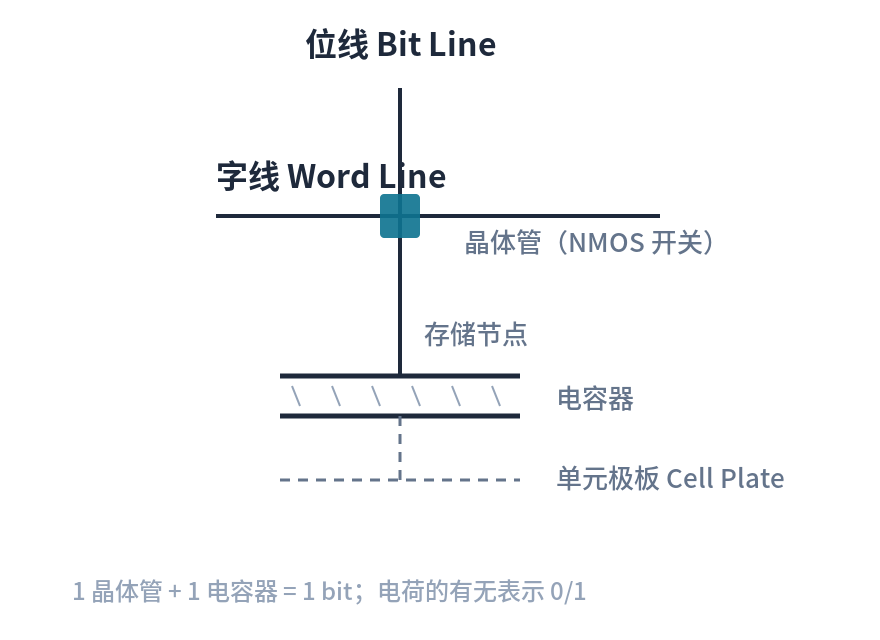
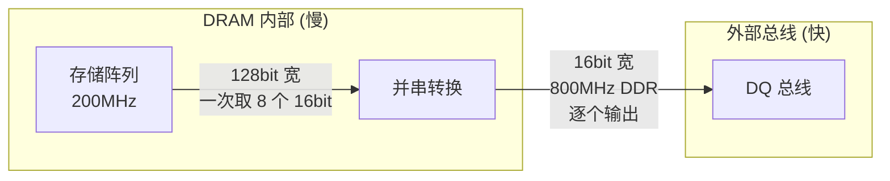
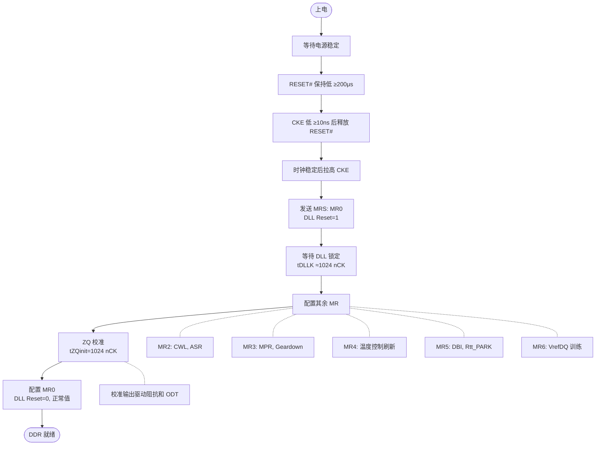
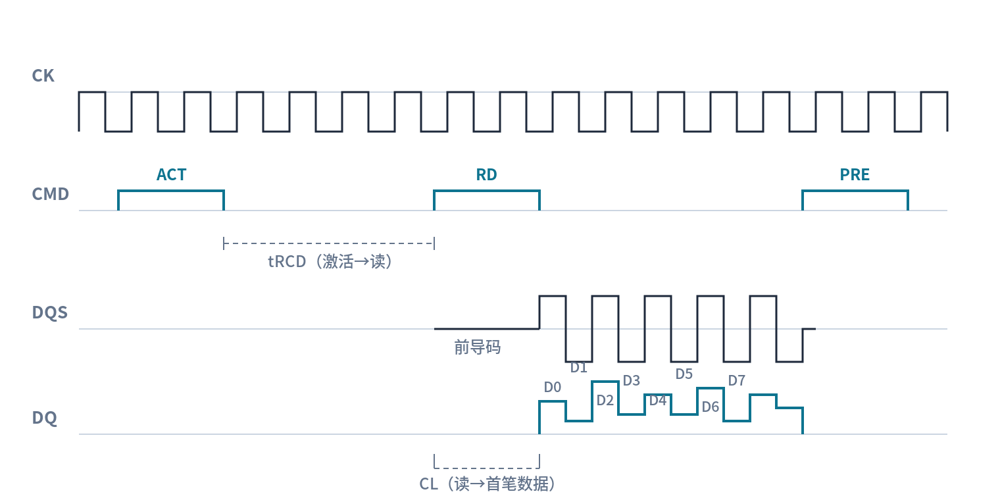
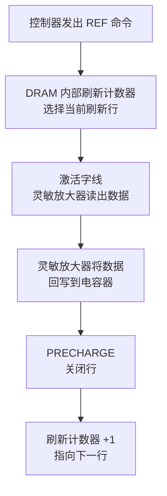
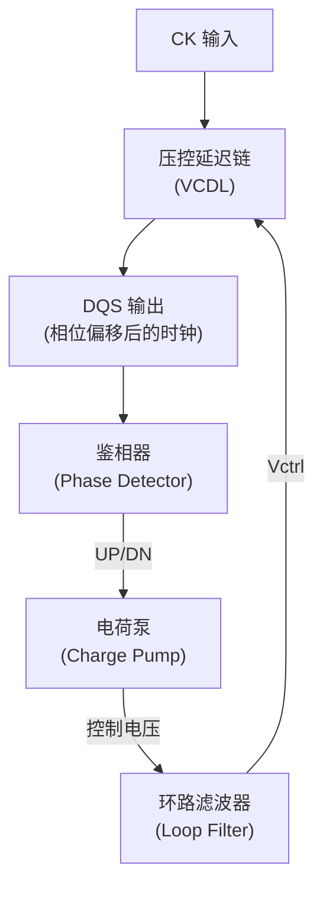
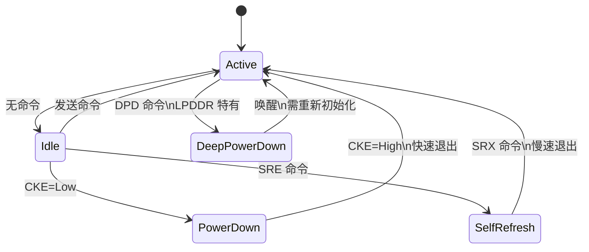
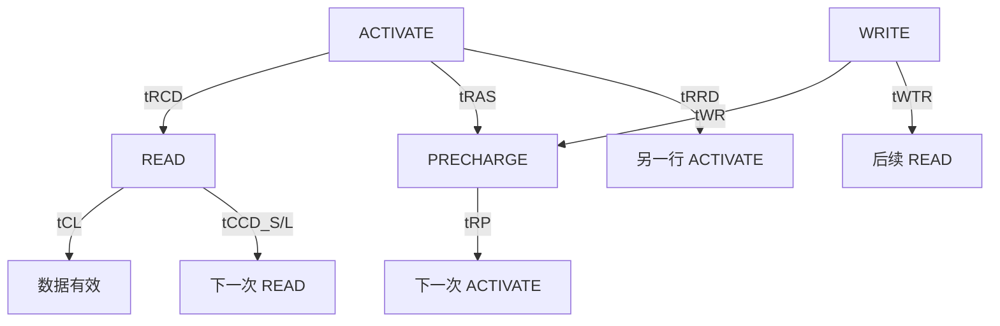
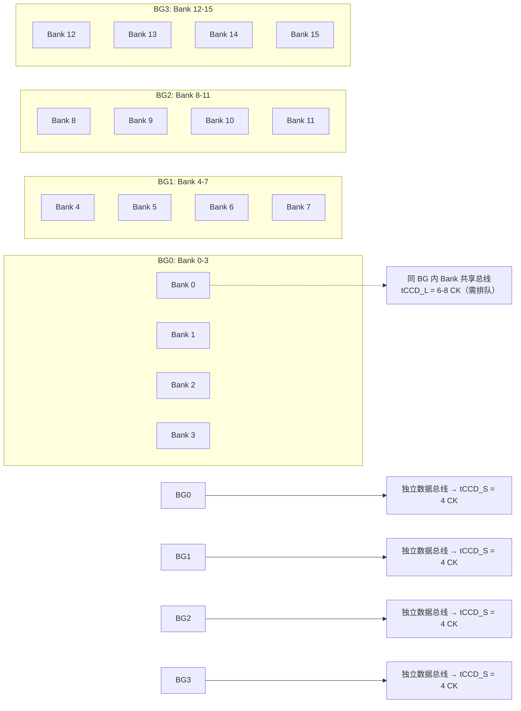

# DDR 工作原理与时序参数

> 深入 DDR 内部：从 1T1C 存储单元到预取架构，从读写时序到刷新机制，理解 DDR 为什么这样工作。
> **工程师视角**：理解预取架构是看懂 DDR 频率/延迟/带宽三者关系的关键——频率翻倍不等于延迟减半。

### 关键术语

| 缩写 | 全称 | 含义 |
|------|------|------|
| 1T1C | 1 Transistor 1 Capacitor | 1 晶体管 1 电容器，DRAM 基本存储单元 |
| BL | Burst Length | 突发长度，一次命令连续传输的数据个数 |
| DLL | Delay-Locked Loop | 延迟锁定环，产生精确相位偏移的时钟电路 |
| OTF | On-The-Fly | 动态切换突发长度（DDR4 支持 BL8 和 BC4 动态切换） |
| BC4 | Burst Chop 4 | 突发截断为 4，BL8 模式下只传输 4 个数据 |
| PASR | Partial Array Self Refresh | 部分阵列自刷新，仅刷新部分 Bank（LPDDR 特有） |
| DVFS | Dynamic Voltage and Frequency Scaling | 动态电压频率调节 |
| RFM | Refresh Management | 刷新管理（DDR5 引入，缓解 Row Hammer） |

### 1.1 前置知识

| 需要了解 | 参考文档 |
|----------|----------|
| DDR 基本概念、Bank/Rank 结构 | [DDR 基础概念](./01-DDR基础概念.md) |
| 颗粒内部 Bank/Bank Group 组织 | [DDR 物理结构与硬件设计](./02-DDR物理结构与硬件设计.md) |

---

## 一、存储单元与预取架构

理解 DDR 工作原理之前，必须先回答一个问题：**为什么 DDR 频率越来越高，但延迟（以 ns 计）几乎没降？** 答案藏在预取架构里。

### 1.1 DRAM 存储单元：1T1C

每个 DRAM 存储单元由一个晶体管和一个电容器组成：



- **写操作**：字线激活 → 晶体管导通 → 位线电压写入电容器
- **读操作**：字线激活 → 晶体管导通 → 电容器电荷共享到位线 → 灵敏放大器检测位线电压变化
- **读是破坏性的**：读操作会消耗电容器电荷，读完后必须**回写**（这也是为什么需要 tRAS 和 PRECHARGE）

> 灵敏放大器（Sense Amplifier）是 DRAM 内部的关键电路。它不仅能检测微弱的位线电压变化（~100mV），还在读操作后自动将数据回写到电容器——这就是为什么读操作后行仍然"开着"。

### 1.2 预取架构：DDR 的核心设计

**预取（Prefetch）** 是理解 DDR 一切行为的关键概念。

DRAM 内部存储阵列的工作频率远低于外部 I/O 总线频率。预取架构的解决思路是：**内部一次取出 N 个数据，然后在外部总线上用 N 倍频率逐个输出**。



**各代预取宽度演进**：

| 代际 | 预取宽度 | 内部总线宽 : 外部总线宽 | 含义 |
|------|:--------:|:----------------------:|------|
| SDR SDRAM | 1n | 1:1 | 内外同频，无预取 |
| DDR | 2n | 2:1 | 内部一次取 2 个，外部 2 倍频输出 |
| DDR2 | 4n | 4:1 | 内部一次取 4 个 |
| DDR3 | 8n | 8:1 | 内部一次取 8 个 |
| DDR4 | 8n | 8:1 | 同 DDR3，但 Bank Group 提供额外并行度 |
| DDR5 | 16n | 16:1 | 内部一次取 16 个 |

**预取宽度直接决定了突发长度**：
- 8n-prefetch → 内部一次取 8 个数据 → 外部必须 8 次传输才能用完 → **BL=8 固定**
- 16n-prefetch → 内部一次取 16 个数据 → **BL=16 固定**

> **工程师视角**：这就是为什么 DDR3/DDR4 的 BL=8 不可配置——不是 JEDEC 不想让你改，而是 8n-prefetch 架构决定了内部一次取 8 个，外部必须 8 次传完。BC4（Burst Chop 4）只是把后 4 个数据丢弃，内部仍然取了 8 个。

### 1.3 预取架构的代价：延迟不降

预取架构让外部频率可以远高于内部频率，但有一个代价：**内部操作的时间没有变快**。

```
DDR3-1600 (800MHz CK):
  内部阵列频率: 200MHz (1600MT/s ÷ 8n-prefetch)
  tRCD = 13.75ns (11 nCK × 1.25ns)
  
DDR4-3200 (1600MHz CK):
  内部阵列频率: 400MHz (3200MT/s ÷ 8n-prefetch)
  tRCD = 13.75ns (22 nCK × 0.625ns)
```

频率翻倍，tRCD 的周期数也翻倍（11→22），但**绝对时间几乎不变**。这就是为什么 DDR 的"CL=22"看起来比"CL=11"大，但实际延迟差不多。

---

## 二、基本操作

### 2.1 初始化流程

DDR 上电后不能立即使用，必须经过严格的初始化序列。JEDEC 规范定义了每一步的时序要求。



> **工程师视角**：初始化失败最常见的原因是**上电时序不对**——VDD 和 VDDQ 的上电顺序和间隔时间必须严格按数据手册来。如果 DDR 训练总是失败，先检查电源上电时序，再怀疑 PCB 问题。

### 2.2 读操作

一次完整的读操作包含四个阶段：


**读操作内部数据路径**：

```
READ 命令 → 列地址解码 → 选中 8n 个灵敏放大器 → 
→ 并串转换 (8:1) → DQ 输出驱动 → DQ 总线
```

**时序图**（DDR4-2400, CL=17, tRCD=17）：



> **为什么 DQS 是差分信号？** 读操作时，DDR 颗粒用 DQS 的边沿告诉控制器"数据有效"。差分信号（DQS_t/DQS_c）抗共模干扰能力强，在 GHz 级频率下比单端信号可靠得多。

### 2.3 写操作

写操作与读操作的关键区别：**写数据与 WRITE 命令同时发出**，不需要等待 CL。


**写操作的时序细节**：

| 阶段 | 参数 | 说明 |
|------|------|------|
| Write Preamble | tWPRE | DQS 在数据前的准备时间（1 nCK，DDR4 可配 2 nCK），让控制器准备好采样 |
| 数据传输 | — | DQS 中心对齐 DQ（与读操作的边沿对齐不同），控制器用 DQS 的上升/下降沿采样 DQ |
| Write Postamble | tWPST | DQS 在数据后的保持时间（0.5 nCK），确保最后一个数据被可靠写入 |
| Write Recovery | tWR | 写数据写入存储阵列的时间，PRECHARGE 必须等 tWR 结束 |
| DM 掩码 | — | Data Mask 信号，可屏蔽不想要的字节（如只写 4 字节但 BL8 传 8 字节时） |

> **为什么写操作是中心对齐而读操作是边沿对齐？** 写操作时控制器同时发出 DQS 和 DQ，颗粒用 DQS 采样 DQ——中心对齐给颗粒最大的建立/保持时间窗口。读操作时颗粒发出 DQS 和 DQ，控制器用 DQS 边沿采样——边沿对齐让控制器能精确锁存数据。

### 2.4 ACTIVATE 与 PRECHARGE 的物理过程

这两个命令是理解 tRCD、tRAS、tRP 的关键。

**ACTIVATE（激活）**：
1. 字线驱动 → 行中所有存储单元的晶体管导通
2. 每个电容器与位线共享电荷 → 位线电压产生微小变化（~100mV）
3. 灵敏放大器检测并放大到位线全摆幅（VDD）
4. 整行数据被"锁存"在灵敏放大器中——这就是"行打开"的含义
5. 耗时 = tRCD（RAS to CAS Delay），即从激活到可以读/写的时间

**PRECHARGE（预充电）**：
1. 灵敏放大器中的数据**回写**到电容器（读操作消耗了电荷）
2. 位线电压均衡到 VDD/2（预充电电平）
3. 字线关闭，行进入空闲状态
4. 耗时 = tRP（RAS Precharge），即预充电所需时间

> **为什么 tRAS 有最小值？** tRAS 是行激活到预充电的最小时间。如果过早 PRECHARGE，灵敏放大器还没来得及把数据回写到电容器，数据就丢了。tRAS_min 由灵敏放大器的回写速度决定。

---

## 三、刷新机制

### 3.1 为什么需要刷新

DRAM 用电容器存储数据，而电容器会**漏电**。漏电来源：

- **PN 结漏电**：存储节点与衬底之间的反向偏置 PN 结有微小漏电流
- **亚阈值漏电**：晶体管即使在"关断"状态也有微弱电流流过

典型的数据保持时间（Retention Time）为 **64ms**（JEDEC 标准）。这意味着 64ms 内必须刷新所有行，否则数据可能丢失。

> 温度每升高 10°C，漏电速率约翻一倍。这就是为什么高温下 tREFI 要减半（7.8μs → 3.9μs）。

### 3.2 刷新内部机制

刷新操作由 DRAM 内部的**刷新计数器**控制：



**关键点**：
- 刷新是**逐行**进行的，一次 REF 命令刷新一行（所有 Bank 同时刷新同一行号）
- 刷新期间 Bank 不可访问（灵敏放大器被占用）
- 刷新计数器由 DRAM 内部维护，控制器不需要知道当前刷新到哪一行

### 3.3 刷新类型

| 刷新类型 | 触发方式 | CKE | 特点 |
|----------|----------|-----|------|
| **自动刷新 (AR)** | 控制器周期性发 REF 命令 | High | 正常工作中的刷新，每次占用 tRFC |
| **自刷新 (SR)** | 控制器发 SRE 命令进入 | Low | 低功耗模式，DRAM 内部自动刷新，时钟可停 |
| **部分阵列自刷新 (PASR)** | 模式寄存器配置 | Low | LPDDR 特有，仅刷新部分 Bank，进一步省电 |
| **刷新管理 (RFM)** | 控制器发 RFM 命令 | High | DDR5 引入，缓解 Row Hammer，不阻塞正常访问 |

### 3.4 刷新开销

| 参数 | DDR4 典型值 | 含义 |
|------|------------|------|
| tREFI | 7.8μs（标准温度） | 平均刷新间隔 |
| tRFC | 350ns（8Gb 颗粒） | 每次刷新占用时间 |
| 刷新次数 / 64ms | 8192 次 | 64ms 内需刷新所有行 |
| 带宽开销 | 350ns / 7800ns ≈ **4.5%** | 刷新占用的时间比例 |

> 密度越大，tRFC 越长（更多行需要刷新），但 tREFI 不变——所以大容量 DDR 的刷新开销更高。DDR5 16Gb 颗粒的 tRFC 可达 550ns。

### 3.5 Row Hammer（行锤攻击）

**Row Hammer** 是 DDR3/DDR4 的一个物理漏洞：如果反复、快速地激活某一行（"攻击行"），相邻行（"受害行"）的电容器会因电磁耦合而异常漏电，导致数据翻转。

```
正常刷新: 64ms 内刷新所有行 → 每行每 64ms 刷新一次
Row Hammer: 64ms 内激活同一行 100K+ 次 → 相邻行来不及刷新就漏光了
```

**缓解措施**：

| 方案 | 代际 | 原理 |
|------|------|------|
| 提高刷新率 | DDR3/4 | 把 tREFI 减半（3.9μs），简单但功耗增加 |
| pTRR (Pseudo Target Row Refresh) | DDR4 | 控制器检测到高频激活后，额外刷新相邻行 |
| RFM (Refresh Management) | DDR5 | DRAM 内部检测并刷新，不依赖控制器 |

> **工程师视角**：嵌入式系统通常不受 Row Hammer 威胁（没有恶意代码），但**汽车/安全关键系统**必须考虑——ISO 26262 要求内存有故障检测和隔离机制。

---

## 四、DLL 与时钟系统

### 4.1 DLL 的工作原理

**DLL（Delay-Locked Loop，延迟锁定环）** 是 DDR 内部产生精确时钟相位的电路。它的作用是：让 DQS 的边沿与 CK 保持固定的相位关系。



**DLL 的工作过程**：
1. CK 经过可调延迟链 → 产生 DQS
2. 鉴相器比较 CK 和 DQS 的相位差
3. 相位差 → 电荷泵 → 控制电压 → 调整延迟链
4. 最终 DQS 与 CK 锁定在固定相位关系（如 90° 偏移）

> **为什么需要 DLL？** DDR 在 CK 的双边沿传输数据。如果没有 DLL，DQS 的边沿位置会随温度/电压漂移，导致数据采样窗口偏移——这就是"DLL 失锁"会导致数据错误的原因。

### 4.2 DLL 锁定与失锁

| 状态 | 含义 | 影响 |
|------|------|------|
| DLL 锁定 | DQS 与 CK 相位关系稳定 | 正常读写 |
| DLL 失锁 | 相位关系漂移 | 数据错误，需重新锁定 |
| DLL 关闭 | MR1[0]=0，DLL 不工作 | 仅用于特殊省电模式，正常使用必须开启 |

**DLL 锁定时间**：tDLLK 随速度分级变化（DDR4-3200 为 1024 nCK，低速档约 597 nCK）。初始化时必须等待 DLL 锁定后才能正常访问。

> **LPDDR 的特殊性**：LPDDR5 在低功耗模式下可关闭 DLL，此时用 **WCK（Write Clock）** 信号做写时序。注意 **WCK 是 LPDDR5 引入的，LPDDR4 没有**（LPDDR4 用 CK + DQS）。这是 LPDDR 与标准 DDR 的重要架构差异。

---

## 五、电源管理与功耗模式

### 5.1 功耗模式全景



| 功耗模式 | CKE | 数据保持 | 退出延迟 | 功耗（相对 Active） | 说明 |
|----------|-----|----------|----------|---------------------|------|
| Active | High | ✅ | — | 100% | 正常工作 |
| Idle | High | ✅ | — | 30-50% | 无命令执行 |
| Power Down (Fast Exit) | Low | ✅ | tXP（6-10 CK） | 10-20% | DLL 保持 |
| Power Down (Slow Exit) | Low | ✅ | tXP + DLL 重锁 | 10-20% | DLL 关闭 |
| Self Refresh | Low | ✅ | tXSDLL（数百 CK） | 1-5% | 内部自动刷新 |
| Deep Power Down | Low | ❌ | 需完整重新初始化 | <1% | LPDDR 特有 |

### 5.2 DVFS（动态电压频率调节）

DVFS 根据系统负载动态调整 DDR 频率和电压：

| 负载场景 | DDR 频率 | 电压 | 典型功耗 |
|----------|----------|------|----------|
| 重度使用（视频/游戏） | 最高 | 正常 | ~1W+ |
| 中度使用（浏览/编辑） | 中等 | 略低 | ~500mW |
| 低负载/待机 | 最低 | 降低 | ~200mW |
| 息屏 | Self Refresh | 最低 | ~10mW |

**DVFS 切换流程**：停止新命令 → 等待当前操作完成 → 进入 Power Down → 调整频率和电压 → 重新训练（可能需要）→ 恢复正常工作

> 嵌入式系统中，DVFS 切换延迟约 10-100μs。可通过硬件自动 DVFS（基于带宽监控）或软件控制 DVFS（内核 devfreq 驱动）实现。

---

## 六、突发传输

### 6.1 突发模式

突发传输（Burst Transfer）指一次命令连续传输多个数据。突发长度（BL）由预取架构决定（见 §1.2）。

| 代际 | 支持的突发长度 | 原因 |
|------|:-------------:|------|
| DDR | BL = 2, 4, 8 | 2n-prefetch，可配置 |
| DDR2 | BL = 4, 8 | 4n-prefetch |
| DDR3 | BL = 8（固定） | 8n-prefetch |
| DDR4 | BL = 8（固定），支持 BC4 | 8n-prefetch |
| DDR5 | BL = 16（固定），支持 BC8 | 16n-prefetch |

**BC4（Burst Chop 4）**：在 BL8 模式下，只传输前 4 个数据，后 4 个被截断。但内部仍然取了 8 个数据——BC4 只是把后 4 个丢弃。

### 6.2 突发顺序

现代 DDR 使用**顺序突发（Sequential）**，从起始地址开始连续递增：

```
起始地址 A[2:0] = 010 (地址 0x2)
BL8 顺序: 0x2 → 0x3 → 0x4 → 0x5 → 0x6 → 0x7 → 0x0 → 0x1
```

> 早期 DDR 也支持交错突发（Interleaved），但实际应用中已很少使用。DDR4/DDR5 默认顺序突发。

---

## 七、DDR 时序参数

### 7.1 时序参数全景



> tRC = tRAS + tRP（行周期时间，从激活到可以再次激活同一行的总时间）

### 7.2 核心时序详解

| 参数 | 全称 | 含义 | DDR4-2400 典型值 |
|------|------|------|:----------------:|
| **tCL** | CAS Latency | READ 命令到第一个数据有效的时钟周期数 | 17 CK (14.16ns) |
| **tRCD** | RAS to CAS Delay | ACTIVATE 到 READ/WRITE 的最小间隔 | 17 CK (14.16ns) |
| **tRP** | RAS Precharge | PRECHARGE 到下一次 ACTIVATE 的最小间隔 | 17 CK (14.16ns) |
| **tRAS** | RAS Active Time | ACTIVATE 到 PRECHARGE 的最小间隔 | 39 nCK（32ns） |
| **tRC** | Row Cycle Time | tRAS + tRP，同一行完整周期 | 56 nCK（45.75ns） |
| **tWR** | Write Recovery | WRITE 到 PRECHARGE 的最小间隔 | 15ns（18 nCK） |
| **tRFC** | Refresh Cycle Time | 一次 REF 命令占用的时间 | 350ns（8Gb，≈420 nCK） |

### 7.3 命令间时序

这些参数决定了命令的"发射速率"——即多快能发下一条命令：

| 参数 | 全称 | 含义 | DDR4 典型值 |
|------|------|------|:-----------:|
| **tCCD_L** | CAS to CAS Delay (Long) | **同** Bank Group 内连续 READ/WRITE 的最小间隔 | 6-8 CK |
| **tCCD_S** | CAS to CAS Delay (Short) | **不同** Bank Group 间连续 READ/WRITE 的最小间隔 | 4 CK |
| **tRRD_L** | RAS to RAS Delay (Long) | **同** Bank Group 内不同行激活的最小间隔 | 6-8 CK |
| **tRRD_S** | RAS to RAS Delay (Short) | **不同** Bank Group 间不同行激活的最小间隔 | 4 CK |
| **tFAW** | Four Activate Window | 4 次 ACTIVATE 的时间窗口上限 | 21 CK |
| **tWTR_L** | Write to Read (Long) | **同** Bank Group 内 WRITE 到 READ 的最小间隔 | 8-12 CK |
| **tWTR_S** | Write to Read (Short) | **不同** Bank Group 间 WRITE 到 READ 的最小间隔 | 4 CK |
| **tRTP** | Read to Precharge | READ 到 PRECHARGE 的最小间隔 | 8-12 CK |

#### 为什么 tCCD_L > tCCD_S？

这是 Bank Group 架构的核心设计权衡：



> **工程师视角**：这就是为什么性能优化要"跨 Bank Group 交错访问"——把连续的地址映射到不同 BG，让 tCCD_S 生效而不是被 tCCD_L 卡住。

### 7.4 时序参数对性能的影响

**访问延迟计算示例**（DDR4-2400, CL=17, tRCD=17）：

| 步骤 | 参数 | 计算 | 时间 |
|------|------|------|------|
| 激活行 | tRCD | 17 × 0.833ns | 14.16ns |
| 等待数据 | tCL | 17 × 0.833ns | 14.16ns |
| 突发传输 | BL8 | 8 × 0.833ns / 2 | 3.33ns |
| **总延迟** | — | — | **≈ 31.65ns** |

> 优化策略：降低时序参数 → 降低延迟；增加频率 → 提高带宽；Bank 交错访问 → 隐藏延迟。

### 7.5 模式寄存器配置

**DDR4 模式寄存器位域详解**：

| 寄存器 | Bit 位 | 功能 | 说明 |
|--------|--------|------|------|
| **MR0** | [1:0] | 突发长度 (BL) | 00=BL8(固定)、01=BC4/8(OTF)、10=BC4 |
| | [2]+[6:4] | CAS 延迟 (CL) | 查表（如 DDR4-3200: A2=0、A[6:4]=101 → CL=22） |
| | [3] | 读突发类型 | 0=顺序、1=交错 |
| | [7] | 测试模式 (TM) | 0=正常 |
| | [8] | DLL Reset | 1=复位（自清） |
| | [11:9] | 写恢复 (WR)/RTP | 000=10、001=12、010=14、011=16、100=18、101=20、110=24 |
| **MR1** | [0] | DLL 使能 | 0=禁止、1=使能（与 DDR3 相反） |
| | [2:1] | 输出驱动阻抗 (DIC) | 00=RZQ/7、01=RZQ/5 |
| | [4:3] | 附加延迟 (AL) | 00=0、01=CL-1、10=CL-2 |
| | [7] | Write Leveling 使能 | 0=禁止、1=使能 |
| | [10:8] | RTT_NOM (ODT) | 查表（RZQ/1~RZQ/7） |
| | [11] | TDQS 使能 | x8 颗粒用 |
| | [12] | Qoff | 1=输出缓冲关闭 |
| **MR2** | [5:3] | CAS 写延迟 (CWL) | 查表（与写前导码模式相关） |
| | [7:6] | 低功耗自动自刷新 (LP ASR) | 00=手动正常、11=ASR |
| | [10:9] | 动态 ODT (RTT_WR) | 禁用/RZQ/2/RZQ/4… |
| | [12] | Write CRC | 0=禁止、1=使能 |
| **MR3** | [1:0] | MPR page 选择 | 00~11 = Page0~3 |
| | [2] | MPR 操作 | 0=正常、1=MPR 数据流 |
| | [3] | Geardown 模式 | 0=1/2 速率、1=1/4 速率 |
| | [4] | Per-DRAM 寻址 | 0=禁止、1=使能 |
| | [5] | 温度传感器读出 | 0=禁止、1=使能 |
| | [8:6] | Fine Granularity Refresh | 000=正常 1x… |
| | [12:11] | MPR Read Format | 00=串行、01=并行、10=交错 |

> 来源：JEDEC JESD79-4D §3.5 Mode Register（Table 14–22）。旧版多处位域错误（WR 写成 [9:8]、DLL Reset 写成 [11]、WL 写成 [12]、Qoff 写成 [6]、DLL 使能极性写反、MR3[2:0] 误写成「DDR3/DDR4 模式切换」），已按规范修正。

> 配置示例（DDR4-2400）：MR0: CL=17、WR=15（A[11:9]=101）；MR1: DLL=Enable(A0=1)、AL=0；MR2: CWL=12

---

## 参考资料

- [JEDEC DDR4 SDRAM Specification (JESD79-4C)](https://www.jedec.org/standards-documents/docs/jesd79-4c) — DDR4 官方规范，时序参数和模式寄存器的权威来源
- [JEDEC DDR5 SDRAM Specification (JESD79-5C)](https://www.jedec.org/standards-documents/docs/jesd79-5c) — DDR5 官方规范，16n-prefetch 和 RFM 的详细定义
- [Row Hammer: A Retrospective (Kim et al., 2020)](https://ieeexplore.ieee.org/document/9066947) — Row Hammer 问题的综述论文
- [Understanding DRAM Operation (Micron TN-46-05)](https://www.micron.com/support/technical-notes) — Micron 技术笔记，DRAM 内部操作的工程级解释

---

> **导航**：[上一篇：DDR 物理结构与硬件设计](./02-DDR物理结构与硬件设计.md) | [下一篇：DDR 控制器、PHY 与训练](./04-DDR控制器PHY与训练.md)
