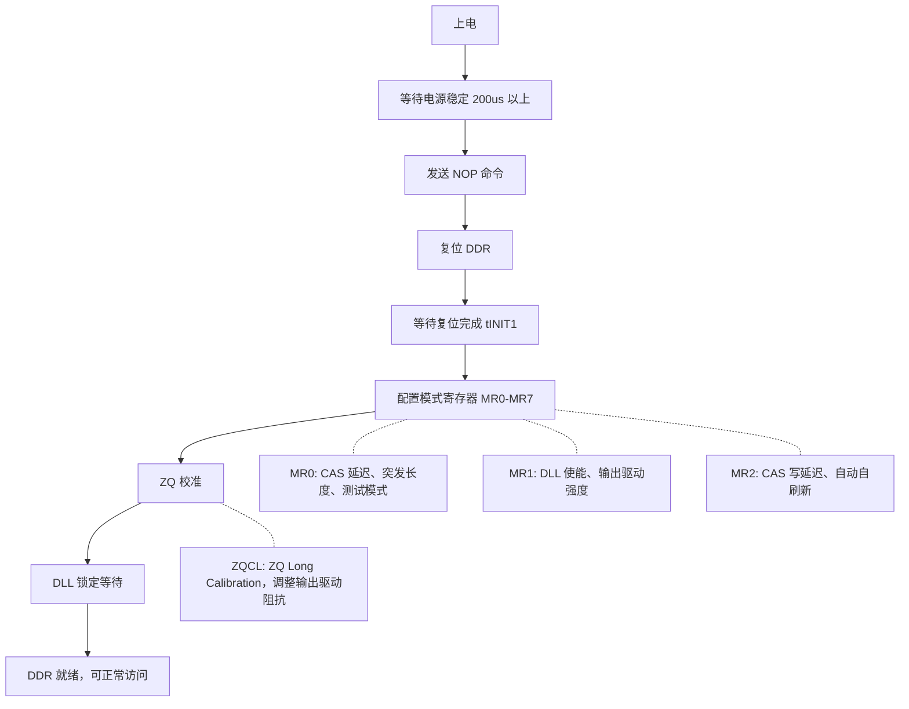
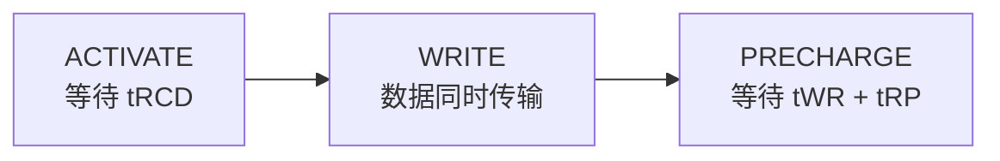
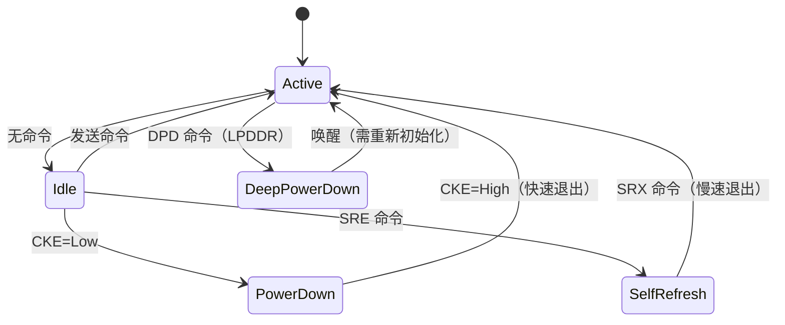
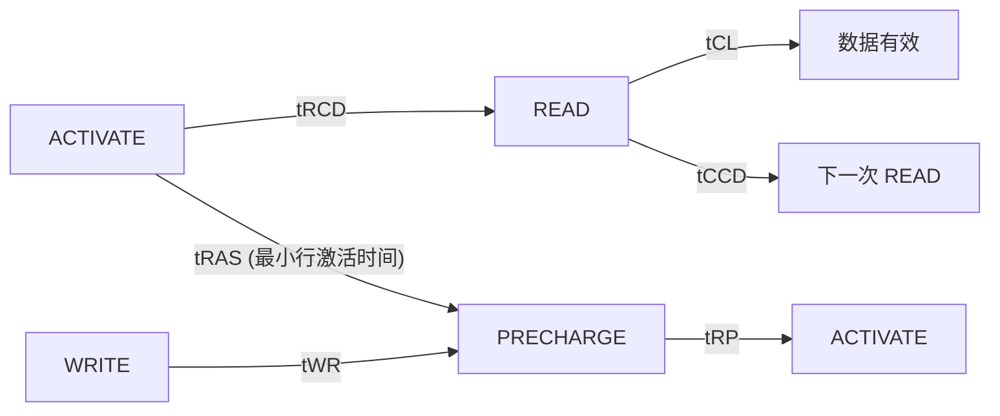

# DDR 工作原理与时序参数

> 本文档整理自 DDR 学习笔记，涵盖 DDR 的基本工作原理（初始化流程、读写操作、刷新机制、电源管理、突发传输）以及关键时序参数的详解与配置方法。

***

## 一、DDR 工作原理

### 1.1 基本操作

#### 1.1.1 初始化流程



#### 1.1.2 读操作


**时序图**：

```
时钟周期:  1    2    3    4    5    6    7    8    9   10

CK      ─┐ ┌─┐ ┌─┐ ┌─┐ ┌─┐ ┌─┐ ┌─┐ ┌─┐ ┌─┐ ┌─┐ ┌─
         └─┘ └─┘ └─┘ └─┘ └─┘ └─┘ └─┘ └─┘ └─┘ └─┘ └─

CMD     ──< ACT >< NOP >< NOP >< RD  >< NOP >< PRE >──
          Row   ─tRCD─→       ─CL──→
                        ────────→ 数据返回

DQ                        ─────< D0 D1 D2 D3 D4 D5 D6 D7 >
```

#### 1.1.3 写操作



> 写操作与读操作的关键区别：写数据与 WRITE 命令同时传输，不需要类似 CL 的等待；但写操作有额外的时序参数 tWR（写恢复时间）和 tWTR（写到读转换时间）。

### 1.2 刷新机制

#### 1.2.1 为什么需要刷新

DRAM 存储单元由一个晶体管和一个电容器（1T1C）组成：电容器存储电荷表示数据（有电=1，无电=0），晶体管作为开关控制访问。由于电容器会漏电，数据会随时间丢失，因此必须定期刷新来补充电荷。

#### 1.2.2 刷新类型

| 刷新类型               | 说明          | 特点            |
| ------------------ | ----------- | ------------- |
| **自动刷新 (AR)**      | DRAM 内部自动执行 | 外部无法访问，影响性能   |
| **自刷新 (SR)**       | 低功耗模式下的刷新   | 用于休眠状态        |
| **部分阵列自刷新 (PASR)** | 仅刷新部分 Bank  | LPDDR 特有，节省功耗 |

**刷新关键参数：**

| 参数 | 含义 | DDR4 典型值 |
|------|------|------------|
| tREFI | 平均刷新间隔 | 7.8μs（标准温度）；3.9μs（高温 > 85°C，刷新频率翻倍） |
| tRFC | 每次刷新占用的时间 | 350-550ns（取决于密度），刷新期间无法访问内存 |
| 刷新次数 | 64ms 内需刷新所有行 | 8192 次 / 64ms |

> 刷新开销约占 3-5% 的带宽。

### 1.3 DDR 电源管理与功耗模式

| 功耗模式 | CKE | 数据保持 | 退出延迟 | 功耗（相对 Active） | 说明 |
|----------|-----|----------|----------|---------------------|------|
| Active | High | ✅ | — | 100% | 正常工作，可执行所有命令 |
| Idle | High | ✅ | — | 30-50% | 无命令执行，ODT 可能关闭 |
| Power Down (Fast Exit) | Low | ✅ | tXP（6-10 周期） | 10-20% | DLL 保持，快速退出 |
| Power Down (Slow Exit) | Low | ✅ | tXP + DLL 重锁 | 10-20% | DLL 关闭，慢速退出 |
| Self Refresh | Low | ✅ | tXSDLL（数百周期） | 1-5% | DDR 内部自动刷新，时钟可停 |
| Deep Power Down | Low | ❌ | 需完整重新初始化 | <1% | LPDDR 特有，数据丢失 |



#### 1.3.1 DVFS (动态电压频率调节)

DVFS（Dynamic Voltage and Frequency Scaling）根据系统负载动态调整 DDR 频率和电压，实现功耗优化。

| 负载场景 | DDR 频率 | 电压 | 典型功耗 |
|----------|----------|------|----------|
| 重度使用（视频/游戏） | 最高 | 正常 | ~1W+ |
| 中度使用（浏览/编辑） | 中等 | 略低 | ~500mW |
| 低负载/待机 | 最低 | 降低 | ~200mW |
| 息屏 | Self Refresh | 最低 | ~10mW |

**DVFS 切换过程**：停止新命令 → 等待当前操作完成 → 进入 Power Down → 调整频率和电压 → 重新训练（可能需要） → 恢复正常工作

> 嵌入式系统中，DVFS 切换延迟约 10-100μs，可通过硬件自动 DVFS（基于带宽监控）或软件控制 DVFS（内核驱动）实现。

***

### 1.4 突发传输

#### 1.4.1 突发模式

突发传输（Burst Transfer）指一次命令连续传输多个数据，突发长度（Burst Length, BL）决定了每次传输的数据量。

| 代际 | 支持的突发长度 | 说明 |
|------|---------------|------|
| DDR | BL = 2, 4, 8 | 可配置 |
| DDR2 | BL = 4, 8 | 可配置 |
| DDR3 | BL = 8 | 固定 |
| DDR4 | BL = 8 | 固定 |
| DDR5 | BL = 16 | 固定 |

> 示例（BL8）：一次 READ 命令 → 连续返回 8 个数据，如地址 0x100 → 返回 0x100-0x107 的数据。现代 DDR 主要使用顺序突发（Sequential Burst）。

#### 1.4.2 突发顺序

现代 DDR 主要使用**顺序突发（Sequential）**，即从起始地址开始连续递增。早期 DDR 也支持交错突发（Interleaved），但实际应用中已很少使用。

***

## 二、DDR 时序参数

### 2.1 关键时序参数



> tRC = tRAS + tRP（行周期时间）

### 2.2 时序参数详解

| 参数          | 全称                       | 说明                 | 典型值                                     |
| ----------- | ------------------------ | ------------------ | --------------------------------------- |
| **tCL**     | CAS Latency              | 读命令到数据有效的延迟        | 9-22 时钟周期                               |
| **tRCD**    | RAS to CAS Delay         | 激活行到读/写命令的延迟       | 9-18 时钟周期                               |
| **tRP**     | RAS Precharge            | 预充电时间              | 9-18 时钟周期                               |
| **tRAS**    | RAS Active Time          | 行激活时间              | 24-42 时钟周期                              |
| **tRC**     | Row Cycle Time           | 行周期时间 (tRAS + tRP) | 33-60 时钟周期                              |
| **tWR**     | Write Recovery           | 写恢复时间              | 10-16 时钟周期                              |
| **tRFC**    | Refresh Cycle Time       | 刷新周期时间             | 350-550 ns (约 260-410 cycles @ 1600MHz) |
| **tFAW**    | Four Activate Window     | 4次激活窗口时间           | 16-30 时钟周期                              |
| **tRRD**    | RAS to RAS Delay         | 不同行激活最小间隔          | 4-6 时钟周期                                |
| **tWTR**    | Write to Read Turnaround | 写到读转换延迟            | 8-12 时钟周期                               |
| **tRTP**    | Read to Precharge        | 读到预充电延迟            | 8-12 时钟周期                               |
| **tCCD_L**  | CAS to CAS Delay (Long)  | 同Bank Group内命令间隔   | 6-8 时钟周期                                |
| **tCCD_S**  | CAS to CAS Delay (Short) | 不同Bank Group间命令间隔  | 4 时钟周期                                  |

### 2.3 时序参数对性能的影响

**访问延迟计算示例**（DDR4-2400, CL=17, tRCD=17）：

| 步骤 | 参数 | 计算 | 时间 |
|------|------|------|------|
| 激活行 | tRCD | 17 × 0.833ns | 14.16ns |
| 等待数据 | tCL | 17 × 0.833ns | 14.16ns |
| 突发传输 | BL8 | 8 × 0.833ns / 2 | 3.33ns |
| **总延迟** | — | — | **≈ 31.65ns** |

> 优化策略：降低时序参数 → 降低延迟；增加频率 → 提高带宽；Bank 交错访问 → 隐藏延迟。

### 2.4 时序参数配置

#### 2.4.1 模式寄存器 (Mode Register)

**DDR4 模式寄存器位域详解：**

| 寄存器 | Bit 位 | 功能 | 说明 |
|--------|--------|------|------|
| **MR0** | [1:0] | 突发长度 (BL) | 00=OTF, 01=BC4, 10=BL8 |
| | [2] | 读突发类型 | 0=顺序, 1=交错 |
| | [6:4] | CAS 延迟 (CL) | CL[2:0]，实际 CL = 4 + CL |
| | [7] | 测试模式 | 0=正常, 1=测试 |
| | [9:8] | 写恢复 (tWR) | 编码查表 |
| | [11] | DLL 复位 | 1=复位 DLL |
| **MR1** | [0] | DLL 使能 | 0=使能, 1=禁止 |
| | [2:1] | 输出驱动强度 | RZQ/1,2,3,4,6,7 |
| | [4:3] | 附加延迟 (AL) | 0, CL-1, CL-2 |
| | [6] | Qoff (禁止输出) | 0=使能输出 |
| | [12] | 使能写均衡 (WL) | Write Leveling |
| **MR2** | [3:0] | CAS 写延迟 (CWL) | CWL = 9 + n |
| | [6:5] | 自刷新温度范围 | 0=标准, 1=扩展, 2=低 |
| | [9:8] | 动态 ODT (RTT_WR) | 禁用, RZQ/2, RZQ/4 |
| **MR3** | [2:0] | 特性配置 | 控制 DDR3 vs DDR4 模式 |

> 配置示例（DDR4-2400）：MR0: CL=17, WR=15；MR1: DLL=Enable, AL=0；MR2: CWL=12

***

> 导航链接：
> - [上一篇：DDR物理结构与硬件设计](./02-DDR物理结构与硬件设计.md) | [下一篇：DDR控制器PHY与训练](./04-DDR控制器PHY与训练.md)
