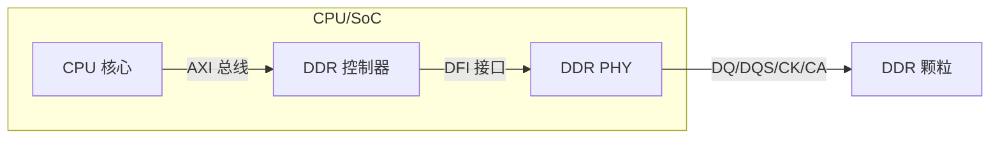
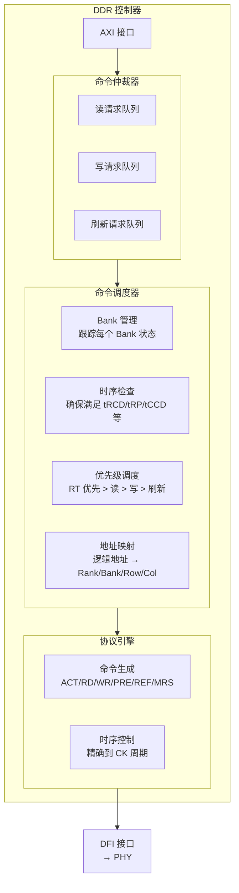
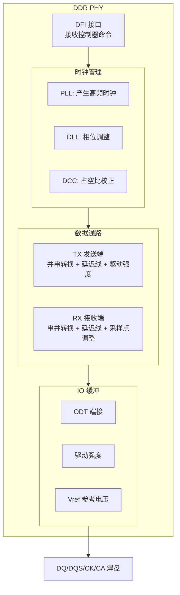
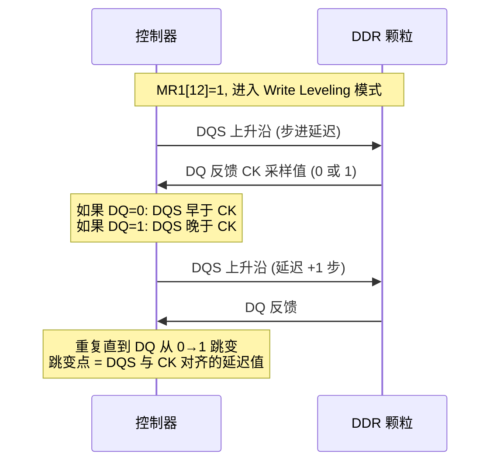
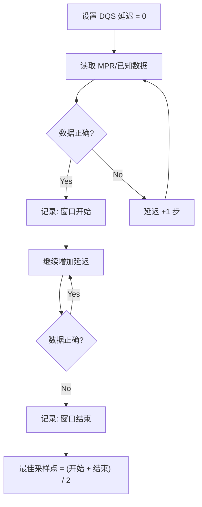
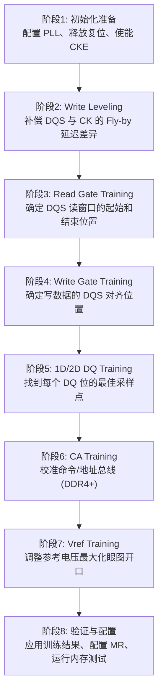

# DDR 控制器、PHY 与训练

> 控制器是大脑，PHY 是神经末梢，训练是让它们协调工作的校准过程。理解这三者，才能看懂 DDR 初始化代码在做什么。
> **工程师视角**：DDR 训练失败是嵌入式开发中最常见的硬件-软件交界问题。90% 的训练失败不是代码 bug，而是电源、时钟或 PCB 布局问题。

### 关键术语

| 缩写 | 全称 | 含义 |
|------|------|------|
| DFI | DDR PHY Interface | 控制器与 PHY 之间的标准接口协议 |
| PLL | Phase-Locked Loop | 锁相环，产生高频时钟 |
| DLL | Delay-Locked Loop | 延迟锁定环，产生精确相位偏移 |
| PVT | Process, Voltage, Temperature | 工艺/电压/温度，影响信号延迟的三大因素 |
| DCC | Duty Cycle Correction | 占空比校正，确保时钟高低电平各 50% |
| MPR | Multi-Purpose Register | 多用途寄存器，DDR4 内置的训练数据源 |
| CA | Command/Address | 命令/地址总线 |
| ODT | On-Die Termination | 片上端接电阻 |
| Vref | Voltage Reference | 参考电压，用于判断信号是 0 还是 1 |

### 1.1 前置知识

| 需要了解 | 参考文档 |
|----------|----------|
| DDR 基本操作（ACTIVATE/READ/WRITE/PRECHARGE） | [DDR 工作原理与时序参数](./03-DDR工作原理与时序参数.md) |
| Bank/Bank Group/Rank 结构 | [DDR 物理结构与硬件设计](./02-DDR物理结构与硬件设计.md) |
| 信号线定义（DQ/DQS/CK/CA） | [DDR 基础概念](./01-DDR基础概念.md) |

---

## 一、DDR 控制器架构

### 1.1 控制器在系统中的位置

DDR 控制器是 CPU/SoC 与 DDR 颗粒之间的桥梁。它接收来自 CPU 的内存访问请求（通常是 AXI 总线协议），将其翻译为 DDR 能理解的命令序列（ACTIVATE → READ/WRITE → PRECHARGE）。



### 1.2 控制器内部结构



**各模块职责**：

| 模块 | 职责 | 为什么需要 |
|------|------|-----------|
| 命令仲裁器 | 合并多个源的请求（CPU、DMA、GPU） | 多个 master 同时访问内存 |
| 命令调度器 | 决定命令的发射顺序和时机 | 最大化带宽利用率，满足 QoS |
| Bank 管理 | 跟踪每个 Bank 的打开/关闭状态 | 避免对已打开的行重复 ACTIVATE |
| 时序检查 | 确保命令间隔满足 JEDEC 时序参数 | 违反时序会导致数据错误 |
| 地址映射 | 将线性地址映射到 Rank/Bank/Row/Col | 影响 Bank 交错效率和性能 |
| 协议引擎 | 生成符合 JEDEC 规范的命令序列 | 将"读地址 X"翻译为 ACT→RD→PRE |

> **工程师视角**：地址映射策略是控制器中最影响性能的配置。把连续地址映射到不同 Bank/Bank Group 可以最大化并行度（tCCD_S 而非 tCCD_L），但映射到不同 Rank 会增加切换开销。详见 [DDR 性能优化](./06-DDR性能优化与测量调试.md)。

---

## 二、DDR PHY 架构

### 2.1 PHY 的职责

PHY（Physical Interface，物理层接口）负责将控制器的数字命令转换为符合电气规范的模拟信号，并处理接收端的信号恢复。



### 2.2 DFI 接口：控制器与 PHY 之间的协议

**DFI（DDR PHY Interface）** 是控制器和 PHY 之间的标准接口，由 DFI Group 定义。它的存在让控制器 IP（如 Synopsys uMCTL2）和 PHY IP（如 Synopsys DDR PHY）可以来自不同厂商。

| DFI 信号组 | 方向 | 功能 |
|-----------|------|------|
| dfi_address | 控制器→PHY | Bank + Row + Column 地址 |
| dfi_command | 控制器→PHY | ACT/RD/WR/PRE/REF 等命令编码 |
| dfi_wrdata | 控制器→PHY | 写数据 |
| dfi_rddata | PHY→控制器 | 读数据 |
| dfi_cke | 控制器→PHY | CKE 信号 |
| dfi_cs_n | 控制器→PHY | CS# 信号 |
| dfi_odt | 控制器→PHY | ODT 控制 |
| dfi_phy_clk | PHY→控制器 | PHY 反馈给控制器的时钟 |

> DFI 的存在意味着：更换 PHY IP 时，控制器代码不需要大改——只要 DFI 接口兼容即可。这是 SoC 集成中的关键抽象层。

### 2.3 PHY 的模拟挑战

PHY 是 DDR 系统中最"模拟"的部分，以下挑战直接影响训练成败：

| 挑战 | 描述 | 影响 |
|------|------|------|
| **PVT 变异** | 工艺角（SS/TT/FF）、电压波动、温度变化导致晶体管延迟变化 | 同一套延迟参数在不同芯片上效果不同 |
| **DLL 锁定范围** | DLL 只能在有限频率范围内锁定（如 300-800MHz） | 低频时 DLL 可能失锁，需关闭 DLL 或切换模式 |
| **抖动放大** | PLL 的参考时钟抖动会被放大到输出时钟 | 高频时抖动可能超过数据眼图裕量 |
| **占空比失真** | 时钟高低电平不是精确的 50% | DDR 双边沿采样，占空比失真直接缩小数据窗口 |
| **ISI（码间干扰）** | 前一比特的电压残留影响后一比特的判决 | 长连 0 或长连 1 后数据眼图闭合 |

> **工程师视角**：如果训练结果在不同温度下差异很大，通常是 PVT 补偿没做好。检查 PHY 的 DLL 是否在温度变化时重新锁定，以及 Vref 是否随温度调整。

---

## 三、DDR 训练

### 3.1 为什么需要训练

DDR 在 GHz 级频率下，信号的有效窗口只有几百皮秒。以下因素都会导致信号偏移：

| 问题 | 量级 | 影响 |
|------|------|------|
| PCB 走线长度差异 | 1mm ≈ 6ps（FR4） | DQ 和 DQS 到达时间不同 |
| Fly-by 拓扑的 CK 延迟 | 每颗颗粒 ~50-100ps | 不同颗粒的 CK 到达时间不同 |
| 芯片工艺差异 | ±20% 延迟 | 同一 PCB 上不同颗粒行为不同 |
| 温度变化 | -40°C~105°C 延迟变化 ~15% | 冷启动和热稳定后训练结果不同 |
| 电源波动 | VDD ±5% | 驱动强度和延迟变化 |

> **训练的本质**：通过扫描延迟和电压参数，找到每个信号的"最佳工作点"，使数据眼图开口最大。

### 3.2 Write Leveling（写均衡）

**物理原因**：DDR3+ 采用 Fly-by 拓扑，CK 信号依次经过每颗颗粒，到达时间不同。但 DQS 是点对点的——控制器到每颗颗粒的 DQS 长度相同。

```
Fly-by 拓扑下的 CK 到达时间差异:

控制器 ──CK──→ 颗粒0 ──CK──→ 颗粒1 ──CK──→ ... ──CK──→ 颗粒7
              CK 到达: 0ps    CK 到达: +80ps           CK 到达: +560ps

控制器 ──DQS0──→ 颗粒0 (等长)
控制器 ──DQS1──→ 颗粒1 (等长)
...
```

**问题**：如果控制器同时发出 CK 和 DQS，颗粒 7 的 CK 比 DQS 晚到 560ps——写时序完全错乱。

**Write Leveling 过程**：



**结果**：每颗颗粒获得一个独立的 DQS 延迟值，补偿 CK 的 Fly-by 延迟差异。

### 3.3 Read Training（读训练）

**目标**：找到 DQS 读采样点的最佳位置。

读操作时，DDR 颗粒同时发出 DQS 和 DQ。控制器需要确定用 DQS 的哪个相位来采样 DQ 最可靠。

**算法**：



**眼图示意**：

```
读训练结果 (眼图):

DQS 采样窗口:
        ←────────── 有效区域 ──────────→
        │                              │
    错误│        ┌──────────┐          │错误
    区域│        │   正确   │          │区域
        │        └──────────┘          │
        │                              │
    ────┼──────────────────────────────┼────→ 采样相位
        0°         90°   180°   270°  360°
                         ▲
                    最佳采样点 (眼图中心)
```

> **工程师视角**：如果读训练窗口很窄（<30°），说明信号质量差。常见原因：PCB 阻抗不匹配、DQS/DQ 等长没做好、Vref 设置不当。先检查硬件再调参数。

### 3.4 Write Training（写训练）

**目标**：调整写数据与 DQS 的对齐关系。

写操作时控制器同时发出 DQS 和 DQ，颗粒用 DQS 采样 DQ。训练通过"写入→回读→比较"来找到最佳延迟。

**与 Read Training 的关键区别**：
- Read Training 调整的是**接收端**采样点（控制器侧）
- Write Training 调整的是**发送端**延迟（控制器侧），使数据在颗粒侧有最大建立/保持时间

### 3.5 1D / 2D Training

**1D Training**：固定 Vref，扫描 DQ 延迟，找到每个 DQ 位的有效窗口。

```
1D 扫描 (固定 Vref = 0.6VDD):

DQ0: 延迟 10-50 有效 → 最佳 = 30
DQ1: 延迟 12-48 有效 → 最佳 = 30
DQ2: 延迟 8-52 有效  → 最佳 = 30
DQ3: 延迟 15-45 有效 → 最佳 = 30
...
```

**2D Training**：同时扫描延迟（X 轴）和 Vref（Y 轴），绘制二维眼图。

```
2D 眼图 (DQ0):

Vref ▲
0.70 │  错误  错误  正确  错误  错误
0.65 │  错误  正确  正确  正确  错误
0.60 │  错误  正确  正确  正确  错误  ← 最大裕量
0.55 │  错误  正确  正确  正确  错误
0.50 │  错误  错误  正确  错误  错误
     └──────────────────────────────→ 延迟
        10    20    30    40    50

最佳工作点: 延迟=30, Vref=0.60VDD
```

> 2D Training 比 1D 更精确，但耗时更长（每个 DQ 位需要扫描 M×N 个点）。通常只在首次冷启动时做 2D，后续热启动用 1D 微调。

### 3.6 CA Training（命令/地址训练）

**为什么 DDR4+ 需要 CA Training？**

DDR4 的 CA 总线也是高速信号（与 CK 同频），且同样采用 Fly-by 拓扑。不同颗粒的 CA 到达时间不同，需要训练来补偿。

```
DDR3: CA 频率 = CK 频率（单边沿采样），裕量较大
DDR4: CA 频率 = CK 频率（双边沿采样），裕量减半
DDR5: CA 频率 = CK 频率，但电压更低（0.5V），裕量更小
```

**CA Training 过程**：
1. 控制器通过 MRS 命令让 DDR 进入 CA Training 模式
2. 控制器发送已知的 CA 模式
3. DDR 通过 DQ 线反馈采样结果（正确/错误）
4. 控制器调整 CA 延迟，重复直到找到最佳点

### 3.7 Vref Training（参考电压训练）

**Vref** 是判断信号是 0 还是 1 的参考电压。DDR4 支持内部 Vref（由颗粒产生），但训练时仍需校准。

| Vref 设置 | 效果 |
|-----------|------|
| 偏高 | 0→1 跳变容易，1→0 跳变困难 → 眼图上移 |
| 偏低 | 1→0 跳变容易，0→1 跳变困难 → 眼图下移 |
| 最佳 | 眼图开口最大 → 位于高低电平中间 |

**训练方法**：扫描 Vref 范围（如 0.50VDD ~ 0.70VDD），找到数据正确的 Vref 窗口，取窗口中心。

### 3.8 训练流程总览



| 阶段 | 关键操作 | 失败常见原因 |
|------|----------|-------------|
| 初始化准备 | 配置 PLL、释放复位、等待时钟稳定 | 电源上电时序错误、时钟未稳定 |
| Write Leveling | 扫描 DQS 延迟，DQ 反馈 CK 采样 | Fly-by 走线过长、颗粒未响应 |
| Read Gate Training | 扫描 DQS 延迟，读 MPR 验证 | 信号质量差、Vref 偏差大 |
| Write Gate Training | 写入并回读验证 | 写数据与 DQS 对齐偏差 |
| 1D/2D Training | 扫描延迟和 Vref | 个别 DQ 位信号质量差（焊接问题） |
| CA Training | CA 模式发送与反馈 | CA 总线信号质量差 |
| Vref Training | 扫描 Vref 范围 | 电源噪声大 |
| 验证配置 | 运行 memtester/memtest | 训练结果未正确应用到寄存器 |

### 3.9 训练结果保存与复用

**为什么需要保存**：每次上电都完整训练会显著延长启动时间（2D Training 可能需要数秒）。训练结果在温度变化不大时基本稳定。

| 保存内容 | 典型保存位置 | 大小 |
|----------|-------------|------|
| Write Leveling 延迟值（每 Byte Lane） | SPI Flash / eMMC | ~32 bytes |
| Read Gate 延迟值 | SPI Flash / eMMC | ~32 bytes |
| DQ 延迟值（每 DQ 位） | SPI Flash / OTP | ~256 bytes |
| CA 延迟值 | SPI Flash | ~32 bytes |
| Vref 值 | SPI Flash | ~16 bytes |
| 训练时间戳 + 温度 | SPI Flash | ~8 bytes |

**复用策略**：

| 启动类型 | 条件 | 策略 |
|----------|------|------|
| 冷启动（首次） | 无保存数据 | 完整训练（含 2D） |
| 热启动 | 温度变化 <10°C | 使用保存结果，跳过训练 |
| 温启动 | 温度变化 10-30°C | 1D 微调，跳过 2D |
| 定期校准 | 运行超过 N 小时 | 后台重新训练 |

> **工程师视角**：保存训练结果到 Flash 时，务必加 CRC 校验。如果 Flash 数据损坏导致加载了错误的训练参数，DDR 可能完全无法启动——连打印错误日志的机会都没有。

---

## 参考资料

- [DFI Specification v5.1](https://www.dfispec.com/) — DFI 接口规范，控制器与 PHY 之间的标准协议
- [JEDEC DDR4 SDRAM Specification (JESD79-4C)](https://www.jedec.org/standards-documents/docs/jesd79-4c) — DDR4 训练模式（MPR、Write Leveling、CA Training）的权威定义
- [Synopsys DesignWare DDR Controller Technical Note](https://www.synopsys.com/designware-ip/interface-ip/ddr.html) — 业界最常用的 DDR 控制器 IP，理解其架构有助于看懂 SoC 的 DDR 子系统

---

> **导航**：[上一篇：DDR 工作原理与时序参数](./03-DDR工作原理与时序参数.md) | [下一篇：DDR 驱动开发与调试](./05-DDR驱动开发与调试.md)
