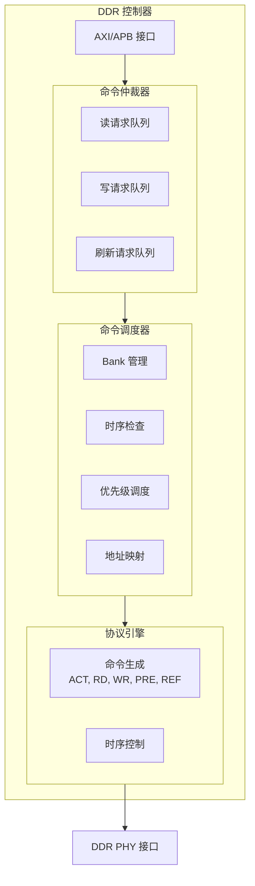
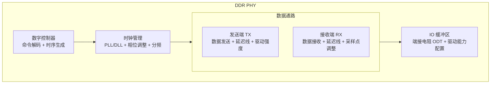
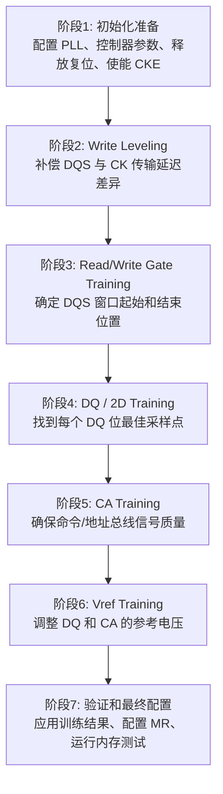

# DDR 控制器、PHY 与训练

> 本文档详细介绍 DDR 控制器的内部架构、PHY 的组成与功能，以及 DDR 训练的完整流程——从写均衡、读写门控训练到 Vref 校准，帮助读者理解高速信号完整性保障的关键技术。

***

## 一、DDR 控制器与 PHY

### 1.1 DDR 控制器架构



### 1.2 DDR PHY 架构



### 1.3 DDR 训练

#### 1.3.1 为什么需要训练

| 问题 | 影响 |
|------|------|
| PCB 走线长度差异 | 信号到达时间不同 |
| 芯片工艺差异 | 延迟不一致 |
| 温度变化 | 延迟漂移 |
| 电源波动 | 时序抖动 |

> **解决**：DDR 训练动态调整延迟，补偿上述差异。

#### 1.3.2 训练流程

| 阶段 | 训练项目 | 目的 | 方法 | 结果 |
|------|----------|------|------|------|
| 1 | Write Leveling | 调整 DQS 与 CK 的相位对齐 | DDR 芯片反馈 DQS 边沿，控制器调整 DQS 延迟 | 找到最佳 DQS 延迟 |
| 2 | Read Training | 调整 DQS 采样点 | 读取已知模式数据，检查错误 | 找到最佳采样相位 |
| 3 | Write Training | 调整写数据与 DQS 的对齐 | 写入并回读，检查错误 | 找到最佳写延迟 |
| 4 | MPR 训练 | 精细调整读数据眼图 | 使用 DDR 内置模式寄存器 | 优化每个 DQ 位延迟 |
| 5 | Vref 训练 | 调整参考电压 | 扫描 Vref 值，找到最佳范围 | 最大化数据眼图开口 |

#### 1.3.3 训练结果示例

```
读训练结果 (眼图):

DQS 采样窗口:
        ←────── 有效区域 ──────→
        │                    │
    错误│      ┌────────┐    │错误
    区域│      │  正确  │    │区域
        │      └────────┘    │
        │                    │
    ────┼────────────────────┼────→ 采样相位
        0°   90°  180°  270° 360°

最佳采样点: 180° (眼图中心)
```

#### 1.3.4 DDR 训练完整流程详解



**各阶段详解：**

| 阶段 | 关键操作 | 说明 |
|------|----------|------|
| 初始化准备 | 配置时钟 PLL、释放复位、使能 CKE | 等待时钟稳定 >200μs |
| Write Leveling | 控制器发送 DQS，DDR 通过 DQ 反馈边沿 | 调整 DQS 延迟直到与 CK 对齐 |
| Read Gate Training | 扫描 DQS 延迟，找到正确读取范围 | 确定 DQS 有效窗口 [Start, End] |
| Write Gate Training | 写入测试数据并回读验证 | 调整 Write Gate 延迟 |
| 1D Training | 固定电压，扫描延迟 | 找到延迟有效窗口，设置窗口中心 |
| 2D Training | 扫描延迟（X 轴）和电压（Y 轴） | 绘制二维眼图，找到最大裕量点 |
| CA Training | DDR 进入 CA 训练模式，DQ 反馈采样结果 | DDR4 及以上需要，DDR3 通常不需要 |
| Vref Training | 扫描 Vref 电压范围（如 0.5VDD ~ 0.7VDD） | 找到 Vref 有效窗口，设置窗口中心 |
| 验证配置 | 应用所有训练结果、配置 MR0~MR7、运行测试 | 保存训练结果到 Flash/OTP |

#### 1.3.5 训练结果保存与复用

**为什么需要保存**：每次上电都训练会延长启动时间，训练结果在温度变化不大时基本稳定，保存后可跳过训练快速启动。

**保存内容与位置：**

| 保存内容 | 保存位置 |
|----------|----------|
| Write Leveling 延迟值（每个 Byte Lane） | SPI Flash（Bootloader 区域） |
| Read Gate 延迟值 | eMMC/SD（特定分区） |
| DQ 延迟值（每个 DQ 位） | OTP（One-Time Programmable）熔丝 |
| CA 延迟值 | SoC 内部 SRAM（带电池备份） |
| Vref 值 | — |
| 训练时间戳和温度 | — |

**复用策略：**

| 启动类型 | 条件 | 策略 |
|----------|------|------|
| 冷启动（首次） | — | 完整训练 |
| 热启动 | 温度变化 <10°C | 使用保存结果 |
| 温启动 | 温度变化 10~30°C | 部分训练 + 微调 |
| 定期校准 | 每隔一定时间 | 重新训练 |

***

> 导航链接：
> - [上一篇：DDR工作原理与时序参数](./03-DDR工作原理与时序参数.md) | [下一篇：DDR驱动开发与调试](./05-DDR驱动开发与调试.md)
