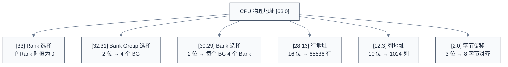
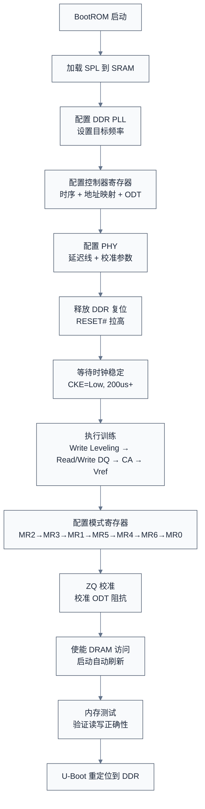
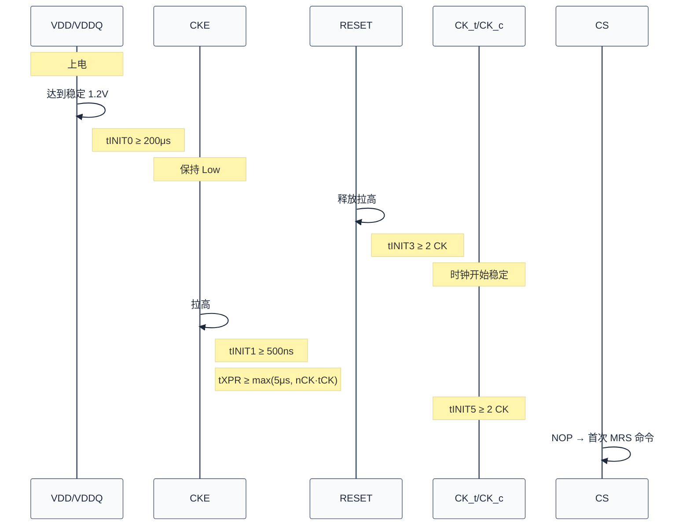
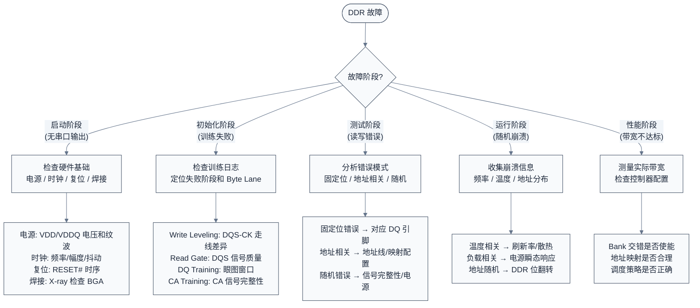

# DDR 驱动开发与调试

> 本章介绍 DDR 驱动开发的完整流程：从寄存器配置、U-Boot 初始化序列、设备树描述，到内存测试和故障排查。
> **工程师视角**：DDR 初始化是嵌入式系统启动的第一道关卡——如果 DDR 起不来，连串口日志都看不到。本章的目标是让你在 DDR 不工作时，知道从哪里下手。

### 关键术语

| 缩写 | 全称 | 含义 |
|------|------|------|
| SPL | Secondary Program Loader | U-Boot 第二阶段加载器，负责 DDR 初始化 |
| DTS | Device Tree Source | 设备树源文件，描述硬件配置 |
| SPD | Serial Presence Detect | 串行存在检测，DIMM 上的 EEPROM 存储时序参数 |
| BIST | Built-In Self Test | 内置自测试，控制器内部的硬件测试引擎 |
| ECC | Error Correction Code | 错误纠正码 |
| DFS | Dynamic Frequency Scaling | 动态频率调节 |

### 1.1 前置知识

| 需要了解 | 参考文档 |
|----------|----------|
| DDR 初始化流程和模式寄存器 | [DDR 工作原理与时序参数](./03-DDR工作原理与时序参数.md) |
| DDR 控制器架构和训练流程 | [DDR 控制器、PHY 与训练](./04-DDR控制器PHY与训练.md) |
| U-Boot 基本架构（SPL/TPL） | — |

***

## 一、DDR 控制器需要配置什么

DDR 控制器在上电后处于未配置状态，软件需要向它提供一套完整的参数，告诉它"你连接的是什么 DDR、怎么访问它"。这些参数分为四类：

| 类别 | 配置内容 | 数据来源 |
|------|---------|---------|
| **颗粒识别** | DDR 类型（DDR3/4/5）、容量、位宽、Rank 数 | 颗粒数据手册 / SPD |
| **地址结构** | Row/Column/Bank/Bank Group 地址位数 | 颗粒数据手册 |
| **时序参数** | tCL, tRCD, tRP, tRAS, tRC, tWR, tRFC, tFAW 等 | 颗粒数据手册的 AC Characteristics 表 |
| **工作模式** | 突发长度、ODT 阻抗、驱动强度、刷新间隔 | JEDEC 规范 + PCB 设计 |

### 1.1 颗粒识别：从数据手册到寄存器

以一颗常见的 DDR4-3200 8Gb x8 颗粒为例，从数据手册中可以提取以下关键信息：

| 参数 | 数据手册中的位置 | 典型值 | 含义 |
|------|-----------------|--------|------|
| Density | Ordering Information | 8 Gb | 单颗容量 |
| Organization | Ordering Information | 1G x8 | 1G 个地址 × 8 位数据 |
| Bank Groups | Feature List | 4 | Bank Group 数量（DDR4 特有） |
| Banks per Group | Feature List | 4 | 每个 Group 内的 Bank 数 |
| Row Address | Addressing Table | A[0:15] → 16 位 | 行地址位数 |
| Column Address | Addressing Table | A[0:9] → 10 位 | 列地址位数 |
| Page Size | 计算得出 | 1KB（= 2^10 × 8 / 8） | 每行数据量 |

这些参数决定了控制器如何将物理地址翻译为 DDR 芯片内部的 Row/Bank/Column 地址。**地址位数配错一个，整个地址空间就会错位**——这是 DDR 调试中最常见的低级错误。

### 1.2 时序参数：从 AC Characteristics 到寄存器

颗粒数据手册的 AC Characteristics 表列出了该颗粒支持的所有时序参数。以 DDR4-3200 (tCK = 0.625ns) 为例：

| 时序参数 | 数据手册值（CK 周期） | 实际时间 | 含义 |
|----------|---------------------|---------|------|
| tCL | 22 CK | 13.75 ns | 读命令到数据输出的延迟 |
| tRCD | 22 CK | 13.75 ns | 行激活到读/写命令的延迟 |
| tRP | 22 CK | 13.75 ns | 预充电到下一行激活的延迟 |
| tRAS | 52 CK | 32.5 ns | 行激活到预充电的最小时间 |
| tRC | 74 CK | 46.25 ns | 同一 Bank 两次激活的最小间隔（= tRAS + tRP） |
| tWR | 24 CK | 15 ns | 写恢复时间 |
| tRFC | 550 CK | 343.75 ns | 刷新周期时间 |
| tFAW | 34 CK | 21.25 ns | 四激活窗口（限制短时间内跨 Bank 激活次数） |

> **工程师视角**：数据手册给出的通常是"该颗粒能跑的最紧时序"。实际配置时建议放宽 1-2 个周期作为裕量，等系统稳定后再收紧。另外注意：同一 PCB 上不同颗粒的时序参数可能不同，取最慢的那颗。

### 1.3 配置代码示例

以下代码展示了如何将上述参数填入控制器寄存器。**注意**：这段代码是教学性质的伪代码，实际控制器的寄存器名和位域定义因 SoC 而异（Synopsys uMCTL2、Cadence DDRC 等各有不同的寄存器布局），但配置逻辑是通用的。

```c
/*
 * DDR 配置结构体 —— 从数据手册提取的参数汇总
 * 这个结构体是"参数清单"，不是控制器寄存器映射
 */
struct ddr_config {
    /* === 颗粒识别 === */
    uint32_t dram_type;         /* DDR3 / DDR4 / DDR5 */
    uint32_t rank_count;        /* 1 = 单 Rank, 2 = 双 Rank */
    uint32_t channel_count;     /* 通道数 */
    uint32_t bus_width;         /* 总线位宽: 32 / 64 */
    uint32_t cs0_density;       /* Rank 0 容量 (Gb) */
    uint32_t cs1_density;       /* Rank 1 容量 (Gb)，单 Rank 时为 0 */

    /* === 地址结构 === */
    uint32_t bank_addr_bits;    /* Bank 地址位数 (DDR4: 通常 2) */
    uint32_t bank_group_bits;   /* Bank Group 位数 (DDR4: 通常 2) */
    uint32_t row_addr_bits;     /* 行地址位数 (8Gb x8: 16) */
    uint32_t col_addr_bits;     /* 列地址位数 (8Gb x8: 10) */

    /* === 时序参数 (单位: CK 周期) === */
    uint32_t tCL;               /* CAS Latency */
    uint32_t tRCD;              /* RAS to CAS Delay */
    uint32_t tRP;               /* RAS Precharge */
    uint32_t tRAS;              /* RAS Active Time */
    uint32_t tRC;               /* Row Cycle Time (= tRAS + tRP) */
    uint32_t tWR;               /* Write Recovery */
    uint32_t tRFC;              /* Refresh Cycle Time */
    uint32_t tFAW;              /* Four Activate Window */
};

/*
 * 将配置写入控制器寄存器
 * 实际代码中，每个 SoC 的寄存器名和位域偏移都不同，
 * 这里用伪寄存器名展示配置逻辑
 */
void ddr_init_controller(struct ddr_config *cfg)
{
    struct ddr_ctrl *ctrl = DDR_CTRL_BASE;

    /*
     * 1. 主控寄存器: DDR 类型 + 总线位宽 + Rank 数
     *    这是控制器最基本的身份信息，配错则一切皆错
     */
    ctrl->MSTR = (cfg->dram_type << DDR_TYPE_SHIFT) |
                 (cfg->bus_width << BUS_WIDTH_SHIFT) |
                 (cfg->rank_count << RANK_CNT_SHIFT);

    /*
     * 2. 调度策略: 使能 Page 保持 + Bank 交错 + Rank 交错
     *    Page 保持: 读写完成后不立即关闭行，下次同行走捷径
     *    Bank 交错: 连续地址分散到不同 Bank，隐藏 tRCD/tRP
     *    Rank 交错: 连续地址分散到不同 Rank，隐藏刷新延迟
     */
    ctrl->STRATEGY = (1 << OPEN_PAGE_EN) |
                     (1 << BANK_INTERLEAVE) |
                     (1 << RANK_INTERLEAVE);

    /*
     * 3. 时序寄存器组: 将 CK 周期数填入对应位域
     *    注意: 某些参数跨多个寄存器（如 tRAS 高位在 DRAMTMG1）
     */
    ctrl->DRAMTMG0 = (cfg->tRAS << tRAS_SHIFT) |
                     (cfg->tRC << tRC_SHIFT);

    ctrl->DRAMTMG1 = (cfg->tRCD << tRCD_SHIFT) |
                     (cfg->tRP << tRP_SHIFT) |
                     (cfg->tRAS >> 8 << tRAS_MSB_SHIFT);

    ctrl->DRAMTMG2 = (cfg->tWR << tWR_SHIFT) |
                     (cfg->tCL << tCL_SHIFT);

    /*
     * 4. 地址映射寄存器: 告诉控制器物理地址如何拆分为 Row/Bank/Col
     *    这是最容易配错的部分——配错后内存测试会随机失败
     */
    ctrl->ADDRMAP0 = (cfg->bank_addr_bits << BANK_BITS_SHIFT) |
                     (cfg->bank_group_bits << BG_BITS_SHIFT);

    ctrl->ADDRMAP1 = cfg->row_addr_bits;
    ctrl->ADDRMAP2 = cfg->col_addr_bits;

    /*
     * 5. Rank 控制: 每个 Rank 的容量
     */
    ctrl->RANKCTL = (cfg->rank_count << RANK_CNT_SHIFT);
    if (cfg->rank_count >= 1)
        ctrl->RANKCTL |= (cfg->cs0_density << CS0_DENSITY_SHIFT);
    if (cfg->rank_count >= 2)
        ctrl->RANKCTL |= (cfg->cs1_density << CS1_DENSITY_SHIFT);
}
```

### 1.4 两种典型配置实例

以下给出两个真实场景的配置参数，展示单 Rank 和双 Rank 的差异：

```c
/* 场景 A: 单颗 DDR4-3200 8Gb x8, 4 颗组成 32 位总线, 单 Rank */
struct ddr_config ddr4_4gb_x8_single_rank = {
    .dram_type       = DDR_TYPE_DDR4,
    .rank_count      = 1,
    .channel_count   = 1,
    .bus_width       = 32,              /* 4 颗 x8 = 32 位 */
    .cs0_density     = DENSITY_4GB,     /* 4 × 8Gb = 4GB */
    .cs1_density     = 0,
    .bank_addr_bits  = 2,               /* 4 Banks per Group */
    .bank_group_bits = 2,               /* 4 Bank Groups */
    .row_addr_bits   = 16,              /* 8Gb x8: 16 位行地址 */
    .col_addr_bits   = 10,              /* 8Gb x8: 10 位列地址 */
    .tCL             = 22,              /* DDR4-3200 CL22 */
    .tRCD            = 22,
    .tRP             = 22,
    .tRAS            = 52,
    .tRC             = 74,              /* tRAS + tRP */
    .tWR             = 24,
    .tRFC            = 550,
    .tFAW            = 34,
};

/* 场景 B: 双 Rank 配置, 每 Rank 8 颗 8Gb x8 = 8GB, 总计 16GB */
struct ddr_config ddr4_16gb_x8_dual_rank = {
    .dram_type       = DDR_TYPE_DDR4,
    .rank_count      = 2,
    .channel_count   = 1,
    .bus_width       = 64,              /* 8 颗 x8 = 64 位 */
    .cs0_density     = DENSITY_8GB,     /* Rank 0: 8 颗 × 8Gb */
    .cs1_density     = DENSITY_8GB,     /* Rank 1: 8 颗 × 8Gb */
    .bank_addr_bits  = 2,
    .bank_group_bits = 2,
    .row_addr_bits   = 16,
    .col_addr_bits   = 10,
    .tCL             = 22,
    .tRCD            = 22,
    .tRP             = 22,
    .tRAS            = 52,
    .tRC             = 74,
    .tWR             = 24,
    .tRFC            = 550,
    .tFAW            = 34,
};
```

> **双 Rank 的关键差异**：Rank 数从 1 变为 2，cs1_density 从 0 变为 8GB。控制器会根据 Rank 数自动管理 CS# 信号切换和 Rank 交错。如果 Rank 数配错（比如双 Rank 配成单 Rank），系统只能识别一半容量。

### 1.5 地址映射：物理地址如何变成 DDR 内部地址

地址映射是控制器配置中最容易出错的部分。CPU 发出的物理地址是线性的，但 DDR 内部是三维的（Row × Bank × Column）。控制器需要将线性地址拆分为这三个维度。



**为什么地址映射顺序很重要**：如果把 Bank 地址放在高位、Row 地址放在低位，那么连续物理地址会落在同一 Bank 的不同行上，导致频繁的 ACT-PRE 切换，性能急剧下降。正确的做法是把 Bank 地址放在低位，让连续地址分散到不同 Bank，实现 Bank 交错。

### 1.6 设备树中的 DDR 描述

设备树不是用来"配置 DDR 控制器寄存器"的（那在 SPL 中完成），而是用来**告知操作系统 DDR 的物理范围和基本属性**。最关键的是 `memory` 节点——它告诉内核有多少内存可用。

```dts
/*
 * 设备树中的 DDR 描述
 * 注意: memory 节点描述的是"OS 可用的内存范围"，
 * 不是控制器的寄存器配置（寄存器配置在 SPL 中完成）
 */

/ {
    /*
     * memory 节点: 告诉内核 DDR 的物理地址范围和大小
     * 这是设备树中最重要的 DDR 相关节点
     * reg = <起始地址高32位 起始地址低32位 大小高32位 大小低32位>
     */
    memory@80000000 {
        device_type = "memory";
        reg = <0x0 0x80000000 0x0 0x80000000>;  /* 起始 0x80000000, 大小 2GB */
    };

    /*
     * DDR 控制器节点: 用于 DDR PMU (性能监控) 和 DFS (动态调频)
     * 注意: 这个节点不用于初始化——初始化在 SPL 中已完成
     */
    ddr_controller: ddr@ff780000 {
        compatible = "vendor,ddr4-controller";
        reg = <0x0 0xff780000 0x0 0x10000>;

        /* 以下属性供 DFS 驱动使用，不是初始化参数 */
        clock-frequency = <1600000000>;     /* 当前 DDR 频率 (Hz) */
        ddr-type = "DDR4";

        /* PHY 子节点: 供训练状态查询 */
        phy {
            compatible = "vendor,ddr4-phy";
            reg = <0x0 0xff790000 0x0 0x10000>;
        };
    };
};
```

> **工程师视角**：`memory` 节点的 `reg` 配错是最常见的设备树问题之一。如果 `reg` 写的大小超过了实际物理内存，内核会在访问不存在的地址时崩溃。如果写小了，多余的内存就浪费了。务必与硬件原理图核对。

***

## 二、U-Boot DDR 初始化流程

DDR 初始化发生在 U-Boot SPL（或 TPL）阶段，此时系统还没有完整的内存管理，代码直接在 SRAM 中运行。初始化完成后，U-Boot 将自身重定位到 DDR 中继续执行。

### 2.1 初始化流程概览



### 2.2 上电时序要求

DDR 芯片在上电后必须严格遵循 JEDEC 规定的时序要求。DRAM 内部状态机需要时间从上电默认状态转换到可操作状态；内部 PLL/DLL 需要时间锁定；内部电压调节器需要时间稳定；存储单元需要完成初始充电。如果时序不满足，DRAM 可能进入未定义状态。



| 参数 | 最小值 | 说明 |
|------|--------|------|
| tINIT0 | ≥ 200μs | VDD/VDDQ 达到稳定后需等待的时间 |
| tINIT1 | ≥ 500ns | CKE 拉高后需等待的时间 |
| tINIT3 | ≥ 2 CK | RESET# 释放后需等待的时钟周期数 |
| tINIT5 | ≥ 2 CK | CKE 拉高后到首次 MRS 命令的等待时间 |
| tPWRESET | ≥ 1μs | RESET# 脉冲最小宽度 |
| tXPR | max(5μs, nCK·tCK) | CKE 拉高到可发送有效命令的时间 |

### 2.3 10 步初始化序列详解

以下对 DDR 初始化的 10 个标准步骤逐一解释。每个步骤包含：**做什么**（原理）、**怎么做**（代码）、**哪里容易出错**（调试要点）。

#### 步骤 1: 等待电源稳定

DDR 上电后，VDD/VDDQ 需要时间上升到稳定值。在此期间 CKE 必须保持低电平，否则 DRAM 可能在电压不足时收到命令，进入未定义状态。工程实践中通常等待 1ms 以留出充足裕量。

```c
static void ddr_wait_power_stable(void)
{
    writel(0, DDR_CTRL_BASE + DDR_CTRL_CKE);  /* CKE = Low */
    mdelay(1);                                 /* tINIT0 ≥ 200μs, 实际 1ms */
    debug("DDR: power stable\n");
}
```

| 常见错误 | 排查方法 |
|---------|---------|
| 等待时间不足 | 用示波器测量 VDD/VDDQ 上升沿，确认稳定时间 |
| 忘记保持 CKE=Low | 检查 CKE 引脚默认电平 |
| 电源纹波过大 | 测量纹波，应 < 50mV p-p |

#### 步骤 2: 释放 DDR 复位

RESET# 为低时 DRAM 忽略所有命令。释放复位（拉高 RESET#）后，DRAM 开始内部初始化。复位脉冲宽度需满足 tPWRESET ≥ 1μs。

```c
static void ddr_release_reset(void)
{
    writel(DDR_RST_ASSERT, DDR_CTRL_BASE + DDR_CTRL_RSTN);   /* 断言复位 */
    udelay(10);                                                /* tPWRESET ≥ 1μs */
    writel(DDR_RST_DEASSERT, DDR_CTRL_BASE + DDR_CTRL_RSTN); /* 释放复位 */
    udelay(1);                                                 /* tINIT3 ≥ 2 CK */
    debug("DDR: reset released\n");
}
```

| 常见错误 | 排查方法 |
|---------|---------|
| RESET# 引脚 GPIO 配置错误 | 检查 GPIO 方向、复用功能 |
| 复位脉冲宽度过短 | 示波器测量 RESET# 波形 |
| 多通道 RESET# 时序不一致 | 对比各通道 RESET# 上升沿 |

#### 步骤 3: 使能 CKE

CKE (Clock Enable) 拉高后，DRAM 开始接收命令。拉高后需等待 tINIT1 ≥ 500ns，再等待 tXPR 后才能发送有效命令。

```c
static void ddr_enable_cke(void)
{
    writel(DDR_CTRL_CKE_EN, DDR_CTRL_BASE + DDR_CTRL_CKE);
    udelay(1);   /* tINIT1 ≥ 500ns */
    udelay(10);  /* tXPR = max(5μs, nCK·tCK), 留裕量 */
    debug("DDR: CKE enabled\n");
}
```

| 常见错误 | 排查方法 |
|---------|---------|
| CKE 拉高后立即发命令 | 增加等待时间 |
| CKE 信号质量差 | 示波器检查 CKE 与 CK 的建立/保持时间 |

#### 步骤 4: DRAM 复位 (通过 MR0 DLL Reset)

通过写入 MR0[11]=1 触发 DLL 复位。DLL (Delay-Locked Loop) 用于对齐 DQS 与 DQ 信号，复位后需等待 tDLLK = max(512 CK, 10μs) 让其重新锁定。

```c
static void ddr_reset_via_mr0(void)
{
    ddr_mr_write(0, 0x0800);  /* MR0[11]=1 → DLL Reset */
    udelay(10);                /* tDLLK = max(512 CK, 10μs) */
    debug("DDR: DLL reset issued\n");
}
```

| 常见错误 | 排查方法 |
|---------|---------|
| 将 DLL Reset 写入 MR1 而非 MR0 | 确认 MR 编号 |
| 忘记等待 DLL 锁定 | 增加等待时间 |
| DLL 永远无法锁定 | 检查时钟信号质量，降低频率测试 |

#### 步骤 5: 配置模式寄存器

模式寄存器 (MR0~MR6) 定义 DRAM 的操作模式：突发长度、CAS Latency、ODT 阻抗、驱动强度等。JEDEC 规定配置顺序为 MR2→MR3→MR1→MR5→MR4→MR6→MR0（MR0 最后，因为它包含 DLL Reset 位）。

每个 MR 的位域定义在 JEDEC 标准中有详细说明。以 MR0 为例：

| MR0 位域 | 功能 | DDR4-3200 典型值 |
|----------|------|-----------------|
| [1:0] | 突发长度 | 00 = BL8 (on-the-fly) |
| [2], [6:4] | CAS Latency | A2=0, A[6:4]=13 → CL = 9+13 = 22 |
| [9:7] | 写恢复 (WR) | 011 → WR = 16 |
| [11] | DLL Reset | 0（已在步骤 4 中复位） |
| [12] | 电源 down 模式 | 0 = 禁用 |

```c
static void ddr_config_mode_registers(void)
{
    /*
     * 严格按 JEDEC 顺序写入:
     * MR2 → MR3 → MR1 → MR5 → MR4 → MR6 → MR0
     */
    ddr_mr_write(2, 0x0020);  /* MR2: CWL=12, RTT_WR=60Ω */
    ddr_mr_write(3, 0x0000);  /* MR3: 默认值 */
    ddr_mr_write(1, 0x0006);  /* MR1: DLL=1, RTT_NOM=60Ω */
    ddr_mr_write(5, 0x0000);  /* MR5: CA Parity 禁用 */
    ddr_mr_write(4, 0x0000);  /* MR4: 内部 Vref 默认 */
    ddr_mr_write(6, 0x0000);  /* MR6: VrefDQ 范围默认 */
    ddr_mr_write(0, 0x01F0);  /* MR0: BL8, CL=16, WR=16 (最后) */
    debug("DDR: mode registers configured\n");
}
```

| 常见错误 | 排查方法 |
|---------|---------|
| 配置顺序错误 | 严格按 JEDEC 顺序 |
| CL/CWL 与频率不匹配 | 查数据手册确认对应关系 |
| ODT 配置错误 | 尝试不同 ODT 值（40Ω/60Ω/120Ω） |

#### 步骤 6: ZQ 校准

ZQ 校准用于校准 DRAM 内部 ODT 阻抗。DRAM 的 ZQ 引脚外接一个 240Ω ±1% 的精密电阻作为参考，内部电路通过对比这个参考电阻来校准输出驱动强度和 ODT 端接阻抗。

- **ZQCL** (ZQ Calibration Long)：完整校准，初始化时必须执行，耗时 tZQINIT ≥ 1μs
- **ZQCS** (ZQ Calibration Short)：增量校准，运行时定期执行用于温度补偿，耗时 tZQCS ≥ 160ns

```c
static void ddr_zq_calibration(void)
{
    writel(DDR_CTRL_ZQCL_CMD, DDR_CTRL_BASE + DDR_CTRL_ZQCR);
    udelay(10);  /* tZQINIT ≥ 1μs, 留裕量 */
    debug("DDR: ZQ calibration done\n");
}
```

| 常见错误 | 排查方法 |
|---------|---------|
| ZQ 引脚外部电阻值错误 | 测量 ZQ 引脚对地电阻，应为 240Ω |
| ZQ 校准未完成就训练 | 增加等待时间 |
| ZQ 引脚走线过长 | 检查 PCB 走线，应尽量短 |

#### 步骤 7: 等待 DLL 锁定

DLL 锁定后 DRAM 才能正确处理数据。可以通过轮询控制器状态寄存器或使用固定延时来等待。

```c
static int ddr_wait_dll_lock(void)
{
    u32 timeout = 1000;
    while (--timeout) {
        if (readl(DDR_CTRL_BASE + DDR_CTRL_STATUS) & DDR_STATUS_DLL_LOCKED)
            return 0;
        udelay(1);
    }
    /* 超时回退: 固定等待 200μs */
    udelay(200);
    return 0;
}
```

#### 步骤 8: 训练

训练是 DDR 初始化中最复杂、最耗时的步骤。训练由 PHY 硬件引擎自动完成，软件只需启动训练并等待结果。训练内容已在 [DDR 控制器、PHY 与训练](./04-DDR控制器PHY与训练.md) 中详细讨论，这里给出软件侧的调用方式：

```c
static int ddr_training(void)
{
    /* 启动 PHY 训练引擎 */
    writel(DDR_PHY_TRAIN_START, DDR_PHY_BASE + DDR_PHY_TRAIN_CTRL);

    /* 等待训练完成，超时 1s */
    int ret = wait_for_bit_le32(DDR_PHY_BASE + DDR_PHY_TRAIN_STATUS,
                                DDR_PHY_TRAIN_DONE, true, 1000, false);
    if (ret) {
        printf("DDR: training timeout!\n");
        return -ETIMEDOUT;
    }

    /* 检查训练结果 */
    ret = readl(DDR_PHY_BASE + DDR_PHY_TRAIN_RESULT);
    if (ret != DDR_PHY_TRAIN_PASS) {
        printf("DDR: training failed! result=0x%x\n", ret);
        return -EIO;
    }

    debug("DDR: training passed\n");
    return 0;
}
```

| 常见错误 | 排查方法 |
|---------|---------|
| Write Leveling 失败 | DQS/CK 走线长度差异过大 |
| Read Gate 失败 | DQS 信号质量差，检查终端电阻 |
| DQ Training 窗口过小 | 信号完整性问题，降低频率重试 |
| 训练超时 | PHY 配置错误或硬件故障 |

#### 步骤 9: 使能 DRAM 访问

训练完成后，控制器打开 DRAM 访问通道并启动自动刷新。刷新间隔的计算：

```
tREFI = 64ms / 8192 rows = 7.8125μs (标准温度, ≤85°C)
tREFI = 32ms / 8192 rows = 3.90625μs (扩展温度, >85°C)

寄存器值 = tREFI / tCK
例: 7.8125μs / 1.25ns (800MHz) = 6250 CK
```

```c
static void ddr_enable_access(void)
{
    /* 配置刷新间隔 */
    writel(DDR_REFRESH_INTERVAL, DDR_CTRL_BASE + DDR_CTRL_RFSHCTL);

    /* 使能自动刷新 */
    u32 ctrl = readl(DDR_CTRL_BASE + DDR_CTRL_RFSHCTL);
    ctrl |= DDR_CTRL_RFSH_EN;
    writel(ctrl, DDR_CTRL_BASE + DDR_CTRL_RFSHCTL);

    /* 使能 DRAM 访问 */
    ctrl = readl(DDR_CTRL_BASE + DDR_CTRL_CTRL);
    ctrl |= DDR_CTRL_ACCESS_EN;
    writel(ctrl, DDR_CTRL_BASE + DDR_CTRL_CTRL);

    debug("DDR: access enabled\n");
}
```

| 常见错误 | 排查方法 |
|---------|---------|
| 刷新间隔配置错误 | 过长→数据丢失；过短→性能下降 |
| 忘记使能自动刷新 | DRAM 数据在毫秒级内丢失 |
| 训练未完成就使能访问 | 确认训练结果后再使能 |

#### 步骤 10: 内存测试

测试通过后 DDR 才能交付系统使用。测试应从小范围开始，逐步扩大：

```c
static int ddr_memory_test(void)
{
    volatile u32 *base = (volatile u32 *)CONFIG_SYS_SDRAM_BASE;
    size_t size = gd->ram_size;
    size_t words = size / sizeof(u32);

    printf("DDR: testing %zuMB...\n", size / (1024 * 1024));

    /* 先测前 4KB 快速验证基本功能 */
    if (mem_test_fixed_pattern(base, min(words, 1024))) {
        printf("DDR: basic test FAILED!\n");
        return -1;
    }

    /* 地址线测试 */
    if (mem_test_address_lines(base, min(words, 1024))) {
        printf("DDR: address test FAILED!\n");
        return -1;
    }

    /* Walking Bits 测试 */
    if (mem_test_walking_bits(base, min(words, 1024))) {
        printf("DDR: walking bits FAILED!\n");
        return -1;
    }

    printf("DDR: memory test PASSED\n");
    return 0;
}
```

### 2.4 完整初始化代码

以下将上述 10 个步骤整合为一个完整的 `dram_init()` 函数，这是 U-Boot SPL 中 DDR 初始化的典型实现：

```c
/* DDR 控制器基地址 (SoC 相关) */
#define DDR_CTRL_BASE    0xFF780000
#define DDR_PHY_BASE     0xFF790000

/* 控制器寄存器偏移 (Synopsys uMCTL2 风格, 简化) */
#define DDR_CTRL_RSTN        0x0000
#define DDR_CTRL_CKE         0x0004
#define DDR_CTRL_CTRL        0x0008
#define DDR_CTRL_ZQCR        0x0010
#define DDR_CTRL_RFSHCTL     0x0020
#define DDR_CTRL_STATUS      0x0100
#define DDR_CTRL_MRS         0x0030

#define DDR_CTRL_CKE_EN      BIT(0)
#define DDR_CTRL_ACCESS_EN   BIT(0)
#define DDR_CTRL_RFSH_EN     BIT(0)
#define DDR_CTRL_ZQCL_CMD    BIT(0)
#define DDR_STATUS_DLL_LOCKED BIT(8)

#define DDR_PHY_TRAIN_CTRL   0x0000
#define DDR_PHY_TRAIN_STATUS 0x0004
#define DDR_PHY_TRAIN_RESULT 0x0008
#define DDR_PHY_TRAIN_START  BIT(0)
#define DDR_PHY_TRAIN_DONE   BIT(0)
#define DDR_PHY_TRAIN_PASS   0x0

/* 刷新间隔: 7.8125μs @ 800MHz = 6250 CK */
#define DDR_REFRESH_INTERVAL 6250

static u32 dram_size_mb;

static void ddr_mr_write(u32 mr, u32 val)
{
    writel((mr << 0) | (val << 3), DDR_CTRL_BASE + DDR_CTRL_MRS);
    udelay(1);
}

int dram_init(void)
{
    int ret;

    printf("DDR: initializing...\n");

    /* 步骤1: 等待电源稳定 */
    udelay(200);

    /* 步骤2: 释放 DDR 复位 */
    writel(0, DDR_CTRL_BASE + DDR_CTRL_RSTN);
    udelay(10);
    writel(1, DDR_CTRL_BASE + DDR_CTRL_RSTN);
    udelay(500);

    /* 步骤3: 使能 CKE */
    writel(DDR_CTRL_CKE_EN, DDR_CTRL_BASE + DDR_CTRL_CKE);
    udelay(10);

    /* 步骤4: DRAM 复位 (MR0 DLL Reset) */
    ddr_mr_write(0, 0x0800);
    udelay(200);

    /* 步骤5: 配置模式寄存器 (JEDEC 顺序) */
    ddr_mr_write(2, 0x0020);  /* MR2: CWL=12, RTT_WR=60Ω */
    ddr_mr_write(3, 0x0000);  /* MR3 */
    ddr_mr_write(1, 0x0006);  /* MR1: DLL=1, RTT_NOM=60Ω */
    ddr_mr_write(5, 0x0000);  /* MR5 */
    ddr_mr_write(4, 0x0000);  /* MR4 */
    ddr_mr_write(6, 0x0000);  /* MR6 */
    ddr_mr_write(0, 0x01F0);  /* MR0: BL8, CL=16, WR=16 (最后) */

    /* 步骤6: ZQ 校准 */
    writel(DDR_CTRL_ZQCL_CMD, DDR_CTRL_BASE + DDR_CTRL_ZQCR);
    udelay(10);

    /* 步骤7: 等待 DLL 锁定 */
    udelay(200);

    /* 步骤8: 训练 */
    ret = ddr_training();
    if (ret) {
        printf("DDR: training failed! (ret=%d)\n", ret);
        return ret;
    }

    /* 步骤9: 使能 DRAM 访问 */
    writel(DDR_REFRESH_INTERVAL, DDR_CTRL_BASE + DDR_CTRL_RFSHCTL);
    writel(DDR_CTRL_RFSH_EN, DDR_CTRL_BASE + DDR_CTRL_RFSHCTL);
    writel(DDR_CTRL_ACCESS_EN, DDR_CTRL_BASE + DDR_CTRL_CTRL);

    /* 步骤10: 内存测试 */
    if (ddr_memory_test()) {
        printf("DDR: memory test FAILED!\n");
        return -1;
    }

    gd->ram_size = dram_size_mb * 1024 * 1024;
    printf("DDR: %dMB initialized successfully\n", dram_size_mb);
    return 0;
}
```

### 2.5 初始化失败排查表

| 现象 | 最可能的原因 | 第一排查动作 |
|------|-------------|-------------|
| 系统挂死在 DRAM init | 电源时序不满足 | 示波器测量 VDD/VDDQ 上电时序 |
| DDR 容量识别为 0 | 地址映射配置错误 | 检查 row/col/bank 位宽是否与颗粒匹配 |
| 训练失败 | PCB 走线不等长 | 检查 DQS 组内走线长度差异（应 < 5ps） |
| 训练通过但读写错误 | 时序参数过紧 | 放宽 tCL/tRCD 1-2 周期 |
| 特定位固定错误 | 对应 DQ 信号线故障 | 示波器检查对应 DQ 引脚 |
| 大容量测试失败 | Row/Bank 地址位宽配置错误 | 单 Rank 模式测试，逐步增加容量 |
| 低温/高温下失败 | 时序裕量不足 | 放宽时序参数，检查温度补偿刷新 |
| 间歇性错误 | 信号完整性边沿 | 眼图测试，检查电源纹波 |

**排查优先级**：电源和时钟 → 复位和 CKE 时序 → 模式寄存器配置 → 训练结果 → 内存测试。永远从最基础的硬件条件开始排查。

***

## 三、内存测试方法

DDR 初始化完成后，必须通过内存测试验证读写正确性。不同的测试模式覆盖不同类型的故障。

### 3.1 测试方法选择

| 测试类型 | 检测目标 | 执行时间 | 适用场景 |
|----------|---------|---------|---------|
| 固定模式 (Fixed Pattern) | 基本读写功能 | 最快 | 初始化后快速验证 |
| Walking Bits | 位间干扰、数据线短路/开路 | 较快 | 信号完整性验证 |
| Checkerboard | 相邻单元干扰 | 中等 | 密集性故障检测 |
| 地址线测试 | 地址线短路/开路 | 较快 | 地址映射验证 |
| 边界测试 | Bank/Row 边界配置错误 | 快 | 地址位宽验证 |

### 3.2 固定模式测试

最基础的测试：写入几个特征模式（0xAAAAAAAA、0x55555555、全 0、全 1），然后回读比较。如果这个测试都过不了，说明最基本的读写通路有问题——先检查电源和时钟，不要纠结于时序参数。

```c
static int mem_test_fixed_pattern(volatile u32 *addr, size_t words)
{
    u32 patterns[] = {
        0xAAAAAAAA,  /* 1010... 检测相邻位短路 */
        0x55555555,  /* 0101... 检测相邻位短路（互补） */
        0xFFFFFFFF,  /* 全 1 */
        0x00000000,  /* 全 0 */
        0x12345678,  /* 随机模式 */
    };

    for (int p = 0; p < ARRAY_SIZE(patterns); p++) {
        for (int i = 0; i < words; i++)
            addr[i] = patterns[p];
        for (int i = 0; i < words; i++) {
            if (addr[i] != patterns[p]) {
                printf("FAIL at word %d: exp=0x%08x got=0x%08x\n",
                       i, patterns[p], addr[i]);
                return -1;
            }
        }
    }
    return 0;
}
```

### 3.3 Walking Bits 测试

逐位翻转测试：依次将每个 bit 置 1（Walking 1s）和置 0（Walking 0s），检测数据线之间是否存在短路或串扰。如果某个 bit 出错，直接定位到对应的 DQ 引脚。

```c
static int mem_test_walking_bits(volatile u32 *addr, size_t words)
{
    /* Walking 1s: 每次只有 1 个 bit 为 1 */
    for (int bit = 0; bit < 32; bit++) {
        u32 pattern = 1 << bit;
        for (int i = 0; i < words; i++)
            addr[i] = pattern;
        for (int i = 0; i < words; i++) {
            if (addr[i] != pattern) {
                printf("Walking 1s FAIL at bit %d, word %d\n", bit, i);
                return -1;
            }
        }
    }

    /* Walking 0s: 每次只有 1 个 bit 为 0 */
    for (int bit = 0; bit < 32; bit++) {
        u32 pattern = ~(1 << bit);
        for (int i = 0; i < words; i++)
            addr[i] = pattern;
        for (int i = 0; i < words; i++) {
            if (addr[i] != pattern) {
                printf("Walking 0s FAIL at bit %d, word %d\n", bit, i);
                return -1;
            }
        }
    }
    return 0;
}
```

### 3.4 地址线测试

每个地址写入自身的地址值，然后回读验证。这个测试专门检测地址线故障：如果某根地址线短路或开路，写入的地址和读回的地址会不一致。

```c
static int mem_test_address_lines(volatile u32 *addr, size_t words)
{
    for (int i = 0; i < words; i++)
        addr[i] = (u32)i;          /* 写入地址值本身 */

    for (int i = 0; i < words; i++) {
        if (addr[i] != (u32)i) {
            printf("Address test FAIL at %d: exp=0x%08x got=0x%08x\n",
                   i, (u32)i, addr[i]);
            return -1;
        }
    }
    return 0;
}
```

### 3.5 综合测试入口

```c
int mem_test_comprehensive(void *start, size_t size)
{
    volatile u32 *addr = (volatile u32 *)start;
    size_t words = size / sizeof(u32);

    printf("Fixed pattern...\n");
    if (mem_test_fixed_pattern(addr, words)) return -1;

    printf("Walking bits...\n");
    if (mem_test_walking_bits(addr, words)) return -1;

    printf("Address lines...\n");
    if (mem_test_address_lines(addr, words)) return -1;

    printf("All tests PASSED\n");
    return 0;
}
```

### 3.6 常用内存测试工具

除了自己写的测试代码，以下工具在调试中也很常用：

| 工具 | 平台 | 用途 | 特点 |
|------|------|------|------|
| **U-Boot mtest** | Bootloader | 快速验证 | `mtest 0x80000000 0x81000000`，适合早期调试 |
| **memtester** | Linux | 用户态测试 | `memtester 512M 1`，支持多种测试模式 |
| **stressapptest** | Linux/Android | 压力测试 | Google 出品，模拟真实负载，`stressapptest -s 300 -M 1024` |
| **MemTest86+** | x86 PC | 启动时测试 | 独立启动，不依赖 OS，全面覆盖 |

> **工程师视角**：U-Boot mtest 是最先能用的工具——DDR 初始化完就能跑。如果 mtest 都过不了，后面的 Linux 工具都没机会运行。所以调试顺序永远是：mtest → memtester → stressapptest。

***

## 四、系统级故障排查

DDR 问题在不同阶段表现为不同的症状。以下按故障出现的阶段组织排查思路。

### 4.1 故障分类与排查路线



### 4.2 启动阶段：系统无任何输出

这是最棘手的场景——DDR 初始化失败导致系统挂死，连串口日志都没有。排查必须从最基础的硬件条件开始：

**第一步：确认电源**

用万用表/示波器测量 DDR 相关电源轨：
- VDD (核心电压): DDR4 = 1.2V ±5%, LPDDR4 = 1.1V/0.6V
- VDDQ (I/O 电压): DDR4 = 1.2V ±5%
- VREF (参考电压): 通常为 VDDQ/2
- VPP (字线升压): DDR4 = 2.5V ±5%
- VTT (终端电压): 通常为 VDDQ/2，仅用于地址/命令线

**第二步：确认时钟**

- CK_t/CK_c 差分时钟频率是否正确
- 时钟幅度是否在 600~1200mV 范围内
- 抖动是否 < 0.2 UI

**第三步：确认复位和 CKE 时序**

- RESET# 释放时序是否满足 tPWRESET
- CKE 拉高时序是否满足 tINIT1

**第四步：检查焊接**

- X-ray 检查 BGA 焊球是否有虚焊/短路
- 重点关注角落的颗粒（PCB 形变最大处）

### 4.3 初始化阶段：训练失败

训练失败时，首先要确定**哪个阶段**失败、**哪个 Byte Lane** 失败。大多数控制器的训练引擎会输出详细的训练日志。

| 失败阶段 | 典型原因 | 排查方向 |
|----------|---------|---------|
| Write Leveling | DQS 与 CK 走线长度差异过大 | 检查 DQS/CK 走线等长，调整 PHY 延迟 |
| Read Gate Training | DQS  preamble 未正确检测 | 检查 DQS 信号质量，调整 ODT |
| Write DQ Training | DQ 眼图未打开 | 检查 Vref 电压，调整驱动强度 |
| Read DQ Training | 读数据眼图窗口过小 | 降低频率，检查信号完整性 |
| CA Training | 命令/地址信号质量问题 | 检查 CA 总线终端和走线阻抗 |
| Vref Training | 参考电压不在有效范围 | 检查 VREF 引脚电压 |

> **工程师视角**：训练失败时，第一件事是**降频**。把 DDR 频率降到最低档（如 DDR4-1600），如果降频后训练通过，说明是信号完整性问题——走线不等长、阻抗不匹配、或电源噪声。如果降频后仍然失败，说明是配置或硬件问题。

### 4.4 运行阶段：内核崩溃分析

DDR 问题在内核启动后通常表现为难以追踪的随机崩溃。以下是典型模式：

| 崩溃类型 | 内核日志关键字 | DDR 相关原因 |
|----------|---------------|-------------|
| 数据中止 | `Unable to handle kernel paging request at virtual address XXXXXXXX` | DDR 数据错误导致指针损坏 |
| 指令未定义 | `Undefined instruction` | DDR 位翻转导致指令码损坏 |
| init 被杀 | `Kernel panic - not syncing: Attempted to kill init!` | init 进程代码被 DDR 错误破坏 |
| 静默损坏 | 文件系统校验和不匹配 | DDR 偶发性位翻转 |

排查步骤：

1. **确认崩溃地址是否在 DDR 范围内**：`cat /proc/iomem | grep "System RAM"`
2. **判断错误模式**：固定地址 → 某颗颗粒故障；随机地址 → 信号完整性/时序问题
3. **降频测试**：降频后稳定 → 信号完整性问题；降频后仍崩溃 → 配置或硬件问题
4. **分析出错位**：总是某几位出错 → 对应 DQ 位焊接不良；整字节出错 → 对应 Byte Lane 问题

> **工程师视角**：`Unable to handle kernel paging request` 是最常见的 DDR 相关内核崩溃。如果崩溃地址看起来"合理"（不是 NULL 也不是明显越界），且每次崩溃地址不同，高度怀疑 DDR 问题。

***

## 五、常见 SoC 的 DDR 初始化差异

不同 SoC 平台的 DDR 控制器 IP 不同，初始化流程和寄存器布局有显著差异：

| SoC 平台 | 控制器 IP | 初始化特点 | 训练方式 |
|----------|----------|-----------|----------|
| **RK3588** (Rockchip) | Synopsys uMCTL2 | 使用闭源 ddr.bin，SPL 加载后执行 | 硬件自动训练 |
| **i.MX8M Plus** (NXP) | Synopsys uMCTL2 | U-Boot SPL 中调用 `ddr_init()`，NXP 工具生成配置 | 固件辅助训练 |
| **ZynqMP** (Xilinx/AMD) | Synopsys uMCTL2 | FSBL 中初始化，Vivado 导出配置 | 硬件自动训练 |
| **Allwinner H6** | 自研控制器 | U-Boot SPL 中手动配置寄存器 | 软件手动训练 |
| **STM32MP1** (ST) | STM32 DDRCTRL | TF-A 中初始化，STM32CubeMX 生成配置 | 硬件自动训练 |
| **MTK Genio** (MediaTek) | 自研控制器 | 闭源 preloader 初始化 | 硬件自动训练 |

> **工程师视角**：大多数现代 SoC 使用 Synopsys uMCTL2 控制器 IP，所以寄存器布局和训练流程大同小异。差异主要在 PHY 配置和厂商的封装方式（闭源 blob vs 开源代码）。如果你熟悉一种 uMCTL2 平台，迁移到另一种通常只需要调整 PHY 参数。

---

> **导航**：[上一篇：DDR 控制器、PHY 与训练](./04-DDR控制器PHY与训练.md) | [下一篇：DDR 性能优化与测量调试](./06-DDR性能优化与测量调试.md)
