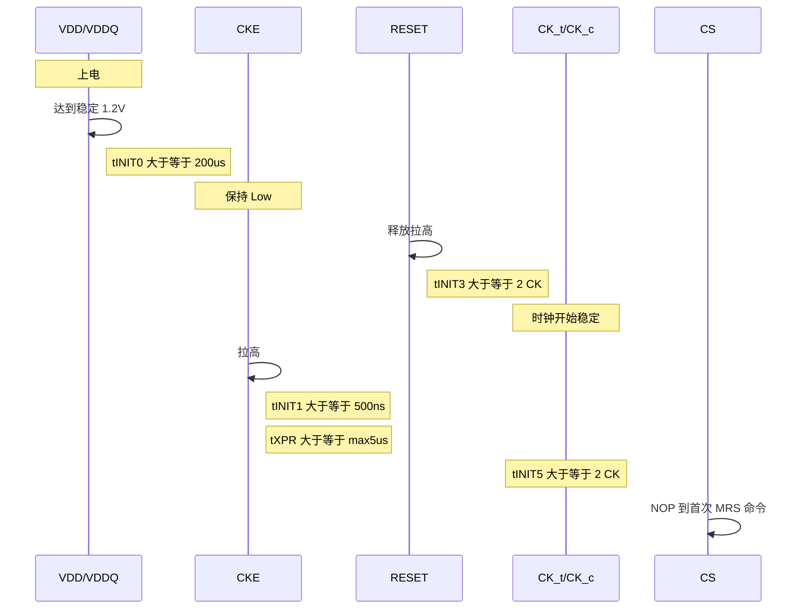
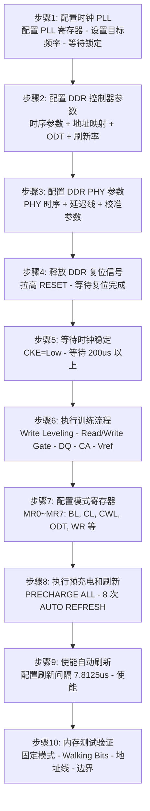
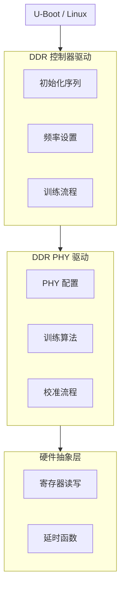
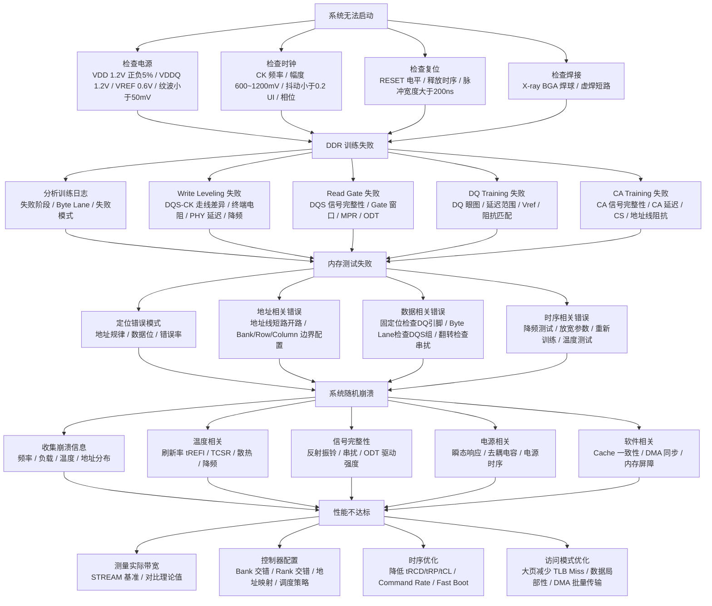

# DDR 驱动开发与调试

> 本章介绍 DDR 驱动开发的完整流程，包括 U-Boot 初始化、设备树配置、内存测试、调试工具与故障排查。

***

## 一、DDR 驱动开发

### 1.1 软件初始化配置

#### 1.1.1 DDR 控制器寄存器配置

```c
struct ddr_config {
    uint32_t dram_type;         /* DDR类型: DDR3/DDR4/DDR5 */
    uint32_t rank_count;        /* Rank数量 */
    uint32_t channel_count;     /* 通道数量 */
    uint32_t bus_width;         /* 总线位宽: 32/64 */
    uint32_t cs0_density;       /* CS0对应的内存容量 */
    uint32_t cs1_density;       /* CS1对应的内存容量 */
    uint32_t bank_addr_bits;    /* Bank地址位数 */
    uint32_t bank_group_bits;   /* Bank Group位数 */
    uint32_t row_addr_bits;     /* 行地址位数 */
    uint32_t col_addr_bits;     /* 列地址位数 */
    uint32_t tCL;               /* CAS Latency */
    uint32_t tRCD;              /* RAS to CAS Delay */
    uint32_t tRP;               /* RAS Precharge */
    uint32_t tRAS;              /* RAS Active Time */
    uint32_t tRC;               /* Row Cycle Time */
    uint32_t tWR;               /* Write Recovery */
    uint32_t tRFC;              /* Refresh Cycle Time */
    uint32_t tFAW;              /* Four Activate Window */
};

void ddr_init_controller(struct ddr_config *cfg)
{
    struct ddr_ctrl *ctrl = DDR_CTRL_BASE;

    ctrl->MSTR = (cfg->dram_type << DDR_TYPE_SHIFT) |
                 (cfg->bus_width << BUS_WIDTH_SHIFT) |
                 (cfg->rank_count << RANK_CNT_SHIFT);

    ctrl->STRATEGY = (1 << OPEN_PAGE_EN) |
                     (1 << BANK_INTERLEAVE) |
                     (1 << RANK_INTERLEAVE);

    ctrl->DRAMTMG0 = (cfg->tRAS << tRAS_SHIFT) |
                     (cfg->tRC << tRC_SHIFT);

    ctrl->DRAMTMG1 = (cfg->tRCD << tRCD_SHIFT) |
                     (cfg->tRP << tRP_SHIFT) |
                     (cfg->tRAS >> 8 << tRAS_MSB_SHIFT);

    ctrl->DRAMTMG2 = (cfg->tWR << tWR_SHIFT) |
                     (cfg->tCL << tCL_SHIFT);

    ctrl->ADDRMAP0 = (cfg->bank_addr_bits << BANK_BITS_SHIFT) |
                     (cfg->bank_group_bits << BG_BITS_SHIFT);

    ctrl->ADDRMAP1 = cfg->row_addr_bits;
    ctrl->ADDRMAP2 = cfg->col_addr_bits;

    ctrl->RANKCTL = (cfg->rank_count << RANK_CNT_SHIFT);

    if (cfg->rank_count >= 1) {
        ctrl->RANKCTL |= (cfg->cs0_density << CS0_DENSITY_SHIFT);
    }
    if (cfg->rank_count >= 2) {
        ctrl->RANKCTL |= (cfg->cs1_density << CS1_DENSITY_SHIFT);
    }
}
```

#### 1.1.2 颗粒参数配置示例

```c
struct ddr_config ddr4_8gb_x8_single_rank = {
    .dram_type       = DDR_TYPE_DDR4,
    .rank_count      = 1,               /* 单Rank */
    .channel_count   = 1,
    .bus_width       = 64,              /* 64位总线 */
    .cs0_density     = DENSITY_8GB,
    .cs1_density     = 0,
    .bank_addr_bits  = 2,               /* 4 Banks per Group */
    .bank_group_bits = 2,               /* 4 Bank Groups */
    .row_addr_bits   = 16,              /* 65536行 */
    .col_addr_bits   = 10,              /* 1024列 */
    .tCL             = 17,              /* CAS Latency */
    .tRCD            = 17,              /* RAS to CAS */
    .tRP             = 17,              /* RAS Precharge */
    .tRAS            = 39,              /* RAS Active */
    .tRC             = 56,              /* Row Cycle */
    .tWR             = 15,              /* Write Recovery */
    .tRFC            = 350,             /* Refresh Cycle */
    .tFAW            = 30,              /* Four Activate Window */
};

struct ddr_config ddr4_16gb_x8_dual_rank = {
    .dram_type       = DDR_TYPE_DDR4,
    .rank_count      = 2,               /* 双Rank */
    .channel_count   = 1,
    .bus_width       = 64,
    .cs0_density     = DENSITY_8GB,     /* Rank 0: 8GB */
    .cs1_density     = DENSITY_8GB,     /* Rank 1: 8GB */
    .bank_addr_bits  = 2,
    .bank_group_bits = 2,
    .row_addr_bits   = 16,
    .col_addr_bits   = 10,
    .tCL             = 17,
    .tRCD            = 17,
    .tRP             = 17,
    .tRAS            = 39,
    .tRC             = 56,
    .tWR             = 15,
    .tRFC            = 350,
    .tFAW            = 30,
};
```

#### 1.1.3 地址映射配置

```c
void ddr_set_address_mapping(struct ddr_ctrl *ctrl,
                              int rank_bits,
                              int bank_bits,
                              int row_bits,
                              int col_bits)
{
    uint32_t addrmap[6] = {0};

    addrmap[0] = (col_bits - 3) << COL_BITS_SHIFT;

    addrmap[1] = (bank_bits - 2) << BANK_BITS_SHIFT;

    addrmap[2] = (row_bits - 13) << ROW_BITS_SHIFT;

    addrmap[3] = (rank_bits - 1) << RANK_BITS_SHIFT;

    ctrl->ADDRMAP0 = addrmap[0];
    ctrl->ADDRMAP1 = addrmap[1];
    ctrl->ADDRMAP2 = addrmap[2];
    ctrl->ADDRMAP3 = addrmap[3];
}

/*
 * 地址映射示例 (DDR4, 8GB, 单Rank):
 *
 * 物理地址: [63:0]
 *
 * [63:34] - 未使用
 * [34:33] - Rank 选择 (1位, 单Rank时为0)
 * [31:30] - Bank Group 选择 (2位, 4个Bank Group)
 * [29:28] - Bank 选择 (2位, 每个Bank Group 4个Bank)
 * [27:12] - 行地址 (16位, 65536行)
 * [11:3]  - 列地址 (9位, 512列地址 + 3位突发内偏移)
 * [2:0]   - 字节偏移 (3位, 8字节)
 *
 * 注意: 实际地址映射因控制器而异，需参考具体芯片手册
 */
```

#### 1.1.4 Rank 配置与训练

```c
int ddr_rank_training(struct ddr_ctrl *ctrl, int rank_count)
{
    int rank;
    int ret = 0;

    for (rank = 0; rank < rank_count; rank++) {
        ctrl->RANK_SEL = rank;

        ret = ddr_write_leveling(ctrl, rank);
        if (ret) {
            printf("Rank %d write leveling failed\n", rank);
            return ret;
        }

        ret = ddr_read_training(ctrl, rank);
        if (ret) {
            printf("Rank %d read training failed\n", rank);
            return ret;
        }

        ret = ddr_write_training(ctrl, rank);
        if (ret) {
            printf("Rank %d write training failed\n", rank);
            return ret;
        }

        printf("Rank %d training passed\n", rank);
    }

    return 0;
}

void ddr_enable_rank_interleave(struct ddr_ctrl *ctrl, int rank_count)
{
    if (rank_count >= 2) {
        ctrl->STRATEGY |= (1 << RANK_INTERLEAVE_EN);

        ctrl->RANK_INTERLEAVE_CFG =
            (RANK_INTERLEAVE_SIZE_1GB << INTERLEAVE_SIZE_SHIFT);
    }
}

/*
 * Rank 交错优势:
 *
 * 无 Rank 交错:
 * Rank 0: ACT ──tRCD──► RD ──数据──► PRE ──tRP──► ACT ...
 * Rank 1: 空闲                                               RD ...
 *         └───── 等待 Rank 0 ─────┘
 *
 * 有 Rank 交错:
 * Rank 0: ACT ──tRCD──► RD ──数据──► PRE ──tRP──► ACT ...
 * Rank 1:      ACT ──tRCD──► RD ──数据──► PRE ──tRP──► ACT ...
 *         └─ 隐藏延迟 ─┘
 *
 * 性能提升: 10-20% (取决于访问模式)
 */
```

#### 1.1.5 设备树配置示例

```dts
/ {
    memory@80000000 {
        device_type = "memory";
        reg = <0x0 0x80000000 0x0 0x80000000>;  /* 2GB */
    };

    ddr_controller: ddr@ff780000 {
        compatible = "vendor,ddr4-controller";
        reg = <0x0 0xff780000 0x0 0x10000>;

        /* 颗粒配置 */
        dram-type = "DDR4";
        density = <8>;              /* 单颗容量: 8Gb */
        io-width = <8>;             /* 颗粒位宽: x8 */

        /* Rank 配置 */
        rank-count = <2>;           /* 双 Rank */
        cs0-density = <8>;          /* Rank 0: 8Gb */
        cs1-density = <8>;          /* Rank 1: 8Gb */

        /* Bank 配置 */
        bank-groups = <4>;          /* 4 个 Bank Group */
        banks-per-group = <4>;      /* 每个 Group 4 个 Bank */

        /* 地址配置 */
        row-bits = <16>;            /* 16位行地址 */
        column-bits = <10>;         /* 10位列地址 */

        /* 时序参数 */
        timing {
            tCL = <17>;
            tRCD = <17>;
            tRP = <17>;
            tRAS = <39>;
            tRC = <56>;
            tWR = <15>;
            tRFC = <350>;
            tFAW = <30>;
        };

        /* PHY 配置 */
        phy {
            compatible = "vendor,ddr4-phy";
            reg = <0x0 0xff790000 0x0 0x10000>;

            training-mode = "auto";
            odt-impedance = <60>;   /* ODT 阻抗: 60Ω */
            drive-strength = <34>;  /* 驱动强度: 34Ω */
        };
    };
};
```

***

### 1.2 U-Boot DDR 初始化

#### 1.2.1 典型初始化流程

```c
void dram_init(void)
{
    struct ddr_info info;

    info.base = CONFIG_SYS_SDRAM_BASE;
    info.size = get_ram_size((void *)info.base, CONFIG_MAX_RAM_SIZE);

    gd->ram_size = info.size;
}

void ddr_init(void)
{
    struct ddr_controller *ddr = DDR_CTRL_BASE;

    ddr_phy_init(ddr);

    ddr_set_rate(ddr, DDR_FREQ_1600MHZ);

    ddr_training(ddr);

    ddr_check_result(ddr);
}
```

#### 1.2.2 DDR 初始化详解

##### 1.2.2.1 上电时序要求

DDR 芯片在上电后必须严格遵循 JEDEC 规定的时序要求，否则 DRAM 内部状态机无法正确初始化，后续所有操作都将失败。



| 参数 | 最小值 | 说明 |
|------|--------|------|
| tINIT0 | ≥ 200μs | VDD/VDDQ 达到稳定后需等待的时间 |
| tINIT1 | ≥ 500ns | CKE 拉高后需等待的时间 |
| tINIT3 | ≥ 2 CK | RESET# 释放后需等待的时钟周期数 |
| tINIT5 | ≥ 2 CK | CKE 拉高后到首次 MRS 命令的等待时间 |
| tPWRESET | ≥ 1μs | RESET# 脉冲最小宽度 |
| tXPR | max(5μs, nCK·tCK) | 从 CKE 拉高到可以发送有效命令的时间（DDR4: nCK=最大 CL） |

> **为什么这些时序很重要**：DRAM 内部状态机需要时间从上电默认状态转换到可操作状态；内部 PLL/DLL 需要时间锁定；内部电压调节器需要时间稳定；存储单元需要完成初始充电。如果时序不满足，DRAM 可能进入未定义状态，导致后续操作失败。

##### 1.2.2.2 10步初始化序列逐行解析

以下对 DDR 初始化的 10 个标准步骤逐一进行详细解释，包含原理说明、代码示例和调试方法。

**步骤 1: 等待电源稳定**

| 要点 | 说明 |
|------|------|
| 等待条件 | VDD/VDDQ 稳定后至少等待 tINIT0 ≥ 200μs |
| CKE 状态 | 必须保持低电平，DRAM 处于复位状态 |
| 工程实践 | 通常等待 1ms 以留出足够裕量 |

```c
/*
 * 步骤1: 等待电源稳定
 * 必须在 CKE 拉高之前完成
 */
static void ddr_wait_power_stable(void)
{
    /* 确保 CKE 为低电平（默认上电状态） */
    writel(0, DDR_CTRL_BASE + DDR_CTRL_CKE);

    /*
     * 等待 tINIT0 >= 200us
     * 实际使用 1ms 留出裕量，应对电源缓慢上升场景
     */
    mdelay(1);

    debug("DDR: power stable, tINIT0 satisfied\n");
}

/*
 * 常见错误:
 * 1. 等待时间不足 → DRAM 内部状态机未就绪
 * 2. 忘记保持 CKE=Low → DRAM 可能接收到无效命令
 * 3. 电源纹波过大 → 即使等待足够时间，DRAM 仍可能不稳定
 *
 * 调试方法:
 * - 用示波器测量 VDD/VDDQ 上升沿，确认稳定时间
 * - 增加等待时间，观察问题是否消失
 * - 检查电源上电时序，确保 VDD 先于 VDDQ 或同时上电
 */
```

**步骤 2: 释放 DDR 复位**

| 要点 | 说明 |
|------|------|
| RESET# 作用 | 为低时 DRAM 忽略所有命令（除 CKE），释放后开始内部初始化 |
| 脉冲宽度 | 需满足 tPWRESET ≥ 1μs |
| 释放后等待 | tINIT3 ≥ 2 个 CK 周期 |

```c
/*
 * 步骤2: 释放 DDR 复位信号
 * 通过 GPIO 或专用复位控制器控制 DDR_RESET# 引脚
 */
static void ddr_release_reset(void)
{
    /*
     * 先确保 RESET# 为低电平（复位状态）
     * 如果系统刚上电，RESET# 通常已由硬件拉低
     */
    writel(DDR_RST_ASSERT, DDR_CTRL_BASE + DDR_CTRL_RSTN);

    /* 等待 tPWRESET >= 1us，确保复位脉冲宽度足够 */
    udelay(10);

    /* 释放复位：拉高 RESET# */
    writel(DDR_RST_DEASSERT, DDR_CTRL_BASE + DDR_CTRL_RSTN);

    /*
     * 等待 tINIT3 >= 2 CK
     * 以 800MHz 时钟为例，2 CK = 2.5ns，实际等待更长时间
     */
    udelay(1);

    debug("DDR: reset released\n");
}

/*
 * 常见错误:
 * 1. RESET# 引脚配置错误（GPIO 方向/复用功能）
 * 2. 复位脉冲宽度过短，DRAM 未完成内部复位
 * 3. 多个 DDR 通道的 RESET# 时序不一致
 *
 * 调试方法:
 * - 用示波器测量 RESET# 引脚波形，确认脉冲宽度
 * - 检查 GPIO 配置是否正确（方向、复用、驱动强度）
 * - 尝试延长复位脉冲宽度
 */
```

**步骤 3: 使能 CKE**

| 要点 | 说明 |
|------|------|
| CKE 作用 | Clock Enable，控制时钟是否有效；为低时 DRAM 忽略所有命令 |
| 拉高后等待 | tINIT1 ≥ 500ns |
| 首次命令等待 | tXPR = max(5μs, nCK·tCK) |

```c
/*
 * 步骤3: 使能 CKE (Clock Enable)
 * CKE 拉高后 DRAM 开始接收命令
 */
static void ddr_enable_cke(void)
{
    /* 拉高 CKE，使能时钟 */
    writel(DDR_CTRL_CKE_EN, DDR_CTRL_BASE + DDR_CTRL_CKE);

    /*
     * 等待 tINIT1 >= 500ns
     * CKE 拉高到可以发送 NOP 之外命令的等待时间
     */
    udelay(1);

    /*
     * 等待 tXPR (最大值取 max(5us, nCK * tCK))
     * DDR4-3200 (CL=22): tXPR = max(5us, 22*0.625ns) = 5us
     * DDR4-2400 (CL=17): tXPR = max(5us, 17*0.833ns) = 5us
     */
    udelay(10);  /* 留出充足裕量 */

    debug("DDR: CKE enabled, tINIT1 and tXPR satisfied\n");
}

/*
 * 常见错误:
 * 1. CKE 拉高后立即发送命令 → 违反 tINIT1/tXPR 时序
 * 2. CKE 信号质量差（抖动/噪声）→ DRAM 时钟不稳定
 * 3. 多 Rank 场景下 CKE 时序不一致
 *
 * 调试方法:
 * - 增加 CKE 拉高后的等待时间
 * - 用示波器检查 CKE 信号质量
 * - 确认 CKE 与 CK 的建立/保持时间满足要求
 */
```

**步骤 4: DRAM 复位 (通过 MR1)**

| 要点 | 说明 |
|------|------|
| 命令方式 | 通过 MR1[0] 发送 DLL Reset，等效于硬件 RESET# 的软件版本 |
| 执行时机 | CKE 使能后、配置其他 MR 之前 |
| 复位后等待 | DLL 锁定时间 tDLLK = max(512 CK, 10μs) |

```c
/*
 * 步骤4: 通过 MR1 发送 DRAM 复位命令
 * MR1[0] = 1 → DLL Reset
 */
static void ddr_reset_via_mr1(void)
{
    /*
     * 发送 MRS 命令写入 MR1
     * MR1 地址编码: A0=1 (DLL Reset), 其他位=0
     * 实际编码为: MA[0]=1, MA[1:17]=0
     */
    ddr_mr_write(1, 0x0001);

    /*
     * DLL 复位后需要等待锁定
     * DDR4 DLL 锁定时间: tDLLK = max(512 CK, 10us)
     * 以 800MHz 为例: 512 CK = 640ns, 取 10us
     */
    udelay(10);

    debug("DDR: DRAM reset via MR1, DLL reset issued\n");
}

/*
 * 常见错误:
 * 1. 忘记等待 DLL 锁定 → 后续读写操作失败
 * 2. MR1 其他位被意外修改 → ODT/驱动强度配置错误
 * 3. 在错误的时序点发送复位命令
 *
 * 调试方法:
 * - 增加 DLL 锁定等待时间
 * - 读取 MR1 确认写入值正确
 * - 检查控制器日志中是否有 DLL 锁定状态位
 */
```

**步骤 5: 配置模式寄存器**

| 要点 | 说明 |
|------|------|
| 功能 | 模式寄存器 (MR) 定义 DRAM 的操作模式 |
| 配置顺序 | JEDEC 规定：MR2→MR3→MR1→MR0→MR5→MR4→MR6，不可打乱 |
| 配置方法 | 通过 MRS 命令，MR 值通过地址线 A[0:17] 传递 |

```c
/*
 * 步骤5: 按 JEDEC 规定顺序配置模式寄存器
 * 顺序: MR2 → MR3 → MR1 → MR0 → MR5 → MR4 → MR6
 */

/* MR2: CAS Write Latency, 动态 ODT, 自刷新温度范围 */
static u32 ddr_calc_mr2(u32 cwl, u32 odt_cfg)
{
    /*
     * MR2 位域定义:
     * [3:0]   - CWL (CAS Write Latency - 9)
     * [7:5]   - 自刷新温度范围 (0: normal)
     * [10:9]  - 动态 ODT (RTT_WR)
     * [11]    - 动态 ODT 使能
     */
    u32 mr2 = 0;

    /* CWL = 12 → 编码值 = 12 - 9 = 3 */
    mr2 |= ((cwl - 9) & 0xF) << 0;

    /* 动态 ODT: RTT_WR = 60Ω (编码值 0b01) */
    mr2 |= (odt_cfg & 0x7) << 9;

    return mr2;
}

/* MR0: 突发长度, CAS Latency, 写恢复, 电源 down 模式 */
static u32 ddr_calc_mr0(u32 bl, u32 cl, u32 wr)
{
    /*
     * MR0 位域定义:
     * [1:0]   - 突发长度 (BL8=0b10, BC4=0b01, OTF=0b00)
     * [2]     - 读突发类型 (0: sequential)
     * [3]     - CAS Latency [2] (MSB)
     * [6:4]   - CAS Latency [1:0] (LSB)
     * [9:7]   - 写恢复 (WR)
     * [11]    - 电源下使能
     */
    u32 mr0 = 0;

    /* 突发长度: BL8 (on-the-fly) */
    mr0 |= (0x0 & 0x3) << 0;

    /* CAS Latency = 17 → 编码: CL[2]=0, CL[1:0]=1 */
    mr0 |= ((cl >> 2) & 0x1) << 3;
    mr0 |= ((cl - 4) & 0x7) << 4;

    /* Write Recovery = 15 → 编码值查表 */
    mr0 |= (wr & 0x7) << 7;

    return mr0;
}

/* 按顺序写入所有模式寄存器 */
static void ddr_config_mode_registers(void)
{
    u32 mr0, mr1, mr2, mr3, mr4, mr5, mr6;

    /* 计算各 MR 值 */
    mr2 = ddr_calc_mr2(12, 0x2);   /* CWL=12, RTT_WR=60Ω */
    mr3 = 0x0000;                   /* MR3: 默认值 */
    mr1 = 0x0006;                   /* MR1: DLL=1, ODT=60Ω(RTT_NOM) */
    mr0 = ddr_calc_mr0(8, 17, 15); /* MR0: BL8, CL=17, WR=15 */
    mr5 = 0x0000;                   /* MR5: 默认值 */
    mr4 = 0x0000;                   /* MR4: 默认值 */
    mr6 = 0x0000;                   /* MR6: 默认值 */

    /*
     * 严格按 JEDEC 规定顺序写入:
     * MR2 → MR3 → MR1 → MR0 → MR5 → MR4 → MR6
     */
    ddr_mr_write(2, mr2);  /* MR2: CWL, 动态ODT */
    debug("DDR: MR2 = 0x%04x\n", mr2);

    ddr_mr_write(3, mr3);  /* MR3: 温度控制等 */
    debug("DDR: MR3 = 0x%04x\n", mr3);

    ddr_mr_write(1, mr1);  /* MR1: DLL, ODT, 驱动强度 */
    debug("DDR: MR1 = 0x%04x\n", mr1);

    ddr_mr_write(0, mr0);  /* MR0: BL, CL, WR */
    debug("DDR: MR0 = 0x%04x\n", mr0);

    ddr_mr_write(5, mr5);  /* MR5: 数据掩码, CA parity */
    debug("DDR: MR5 = 0x%04x\n", mr5);

    ddr_mr_write(4, mr4);  /* MR4: 内部Vref, 温度范围 */
    debug("DDR: MR4 = 0x%04x\n", mr4);

    ddr_mr_write(6, mr6);  /* MR6: VrefDQ 范围 */
    debug("DDR: MR6 = 0x%04x\n", mr6);

    debug("DDR: all mode registers configured\n");
}

/*
 * 常见错误:
 * 1. 配置顺序错误 → DRAM 可能进入未定义状态
 * 2. CL/CWL 值与实际频率不匹配 → 读写数据错误
 * 3. ODT 配置错误 → 信号反射、数据错误
 * 4. 突发长度配置错误 → 数据对齐问题
 *
 * 调试方法:
 * - 使用 MPR (Multi-Purpose Register) 读回模式验证配置
 * - 检查 DRAM 数据手册确认 CL/CWL 与频率的对应关系
 * - 逐一修改 MR 值，定位问题寄存器
 */
```

**步骤 6: ZQ 校准**

| 要点 | 说明 |
|------|------|
| 目的 | 校准 DRAM 的 ODT 阻抗，确保信号完整性 |
| ZQCL | 完整校准，初始化时必须执行，tZQINIT ≥ 1μs |
| ZQCS | 增量校准，运行时定期执行用于温度补偿，tZQCS ≥ 160ns |
| 外部电阻 | ZQ 引脚需接 RZQ = 240Ω ±1% |

```c
/*
 * 步骤6: ZQ 校准
 * 校准 DRAM 内部 ODT 阻抗，确保信号完整性
 */
static void ddr_zq_calibration(void)
{
    /*
     * 发送 ZQCL (ZQ Calibration Long) 命令
     * 这是完整校准，初始化时必须执行
     */
    writel(DDR_CTRL_ZQCL_CMD, DDR_CTRL_BASE + DDR_CTRL_ZQCR);

    /*
     * 等待 tZQINIT >= 1us
     * DDR4 规范要求 ZQCL 完成时间最大 1us
     * 实际等待 10us 留出裕量
     */
    udelay(10);

    debug("DDR: ZQ calibration (ZQCL) completed\n");
}

/*
 * 运行时增量校准（由控制器自动或软件定期触发）:
 */
static void ddr_zq_calibration_short(void)
{
    /* ZQCS: 增量校准，用于补偿温度变化 */
    writel(DDR_CTRL_ZQCS_CMD, DDR_CTRL_BASE + DDR_CTRL_ZQCR);

    /* 等待 tZQCS >= 160ns */
    udelay(1);
}

/*
 * 常见错误:
 * 1. ZQ 引脚外部电阻值错误（标准值 RZQ=240Ω）
 * 2. ZQ 校准未完成就开始训练 → 训练结果不准确
 * 3. ZQ 引脚走线过长 → 校准精度下降
 *
 * 调试方法:
 * - 测量 ZQ 引脚外部电阻值（应为 240Ω ±1%）
 * - 增加 ZQ 校准等待时间
 * - 检查 ZQ 引脚走线长度和阻抗
 */
```

**步骤 7: 等待 DLL 锁定**

| 要点 | 说明 |
|------|------|
| DLL 作用 | Delay-Locked Loop，用于对齐 DQS 与 DQ 信号 |
| 锁定时间 | tDLLK = max(512 CK, 10μs) |
| 未锁定影响 | DRAM 无法正确发送/接收数据 |
| 检查方法 | 轮询控制器 DLL 锁定状态位，或使用固定延时 |

```c
/*
 * 步骤7: 等待 DLL 锁定
 * DLL 锁定后 DRAM 才能正确处理数据
 */
static int ddr_wait_dll_lock(void)
{
    u32 timeout = 1000; /* 超时计数器 */
    u32 status;

    /*
     * 方法1: 轮询 DLL 锁定状态位（如果控制器支持）
     */
    do {
        status = readl(DDR_CTRL_BASE + DDR_CTRL_STATUS);
        if (status & DDR_STATUS_DLL_LOCKED) {
            debug("DDR: DLL locked (polled)\n");
            return 0;
        }
        udelay(1);
    } while (--timeout);

    /*
     * 方法2: 如果控制器不支持状态查询，使用固定延时
     * tDLLK = max(512 CK, 10us)
     * 以 DDR4-3200 为例: 512 * 0.625ns = 320ns < 10us
     * 所以固定等待 10us 即可，实际使用 200us 留裕量
     */
    udelay(200);

    debug("DDR: DLL lock wait completed (fixed delay)\n");
    return 0;
}

/*
 * 常见错误:
 * 1. DLL 永远无法锁定 → 时钟信号质量差或频率配置错误
 * 2. 等待时间不足 → 读写数据出错
 * 3. DLL 锁定后因温度变化失锁 → 需要温度监控和重新校准
 *
 * 调试方法:
 * - 用示波器检查 CK_t/CK_c 时钟信号质量
 * - 增加 DLL 锁定等待时间
 * - 降低 DDR 频率测试
 */
```

**步骤 8: 训练**

| 训练类型 | 功能 | 关键点 |
|----------|------|--------|
| Write Leveling | 对齐 DQS 与 CK 的时序 | 多 Rank 场景必需 |
| Read Gate Training | 找到 DQS 读选通窗口 | 又称 Read Preamble |
| Write DQ Training | 校准写数据 DQ 延迟 | — |
| Read DQ Training | 校准读数据 DQ 延迟 | — |
| Vref Training | 找到最佳参考电压 | — |
| CA Training | 校准命令/地址信号 | DDR4+ 支持 |

> 训练通常由 DDR PHY 硬件自动完成，训练结果决定 DDR 能否稳定工作。

```c
/*
 * 步骤8: 执行 DDR 训练
 * 训练是 DDR 初始化中最复杂、最耗时的步骤
 */
static int ddr_training(void)
{
    int ret;

    /*
     * 训练通常由 PHY 硬件引擎自动完成
     * 软件只需要启动训练并等待结果
     */

    /* 启动训练引擎 */
    writel(DDR_PHY_TRAIN_START, DDR_PHY_BASE + DDR_PHY_TRAIN_CTRL);

    /* 等待训练完成，超时时间根据经验设置 */
    ret = wait_for_bit_le32(DDR_PHY_BASE + DDR_PHY_TRAIN_STATUS,
                            DDR_PHY_TRAIN_DONE, true, 1000, false);
    if (ret) {
        printf("DDR: training timeout!\n");
        return -ETIMEDOUT;
    }

    /* 检查训练结果 */
    ret = readl(DDR_PHY_BASE + DDR_PHY_TRAIN_RESULT);
    if (ret != DDR_PHY_TRAIN_PASS) {
        printf("DDR: training failed! result=0x%x\n", ret);
        return -EIO;
    }

    /* 打印训练结果摘要 */
    ddr_print_training_summary();

    debug("DDR: training completed successfully\n");
    return 0;
}

/*
 * 常见错误:
 * 1. Write Leveling 失败 → DQS/CK 走线长度差异过大
 * 2. Read Gate Training 失败 → DQS 信号质量差
 * 3. DQ Training 窗口过小 → 信号完整性问题
 * 4. 训练超时 → PHY 配置错误或硬件故障
 *
 * 调试方法:
 * - 降低 DDR 频率重试
 * - 检查 PCB 走线等长和阻抗
 * - 调整 PHY 延迟线范围
 * - 检查 Vref 电压设置
 * - 单独执行各阶段训练，定位失败步骤
 */
```

**步骤 9: 使能 DRAM 访问**

| 要点 | 说明 |
|------|------|
| 训练完成后 | 控制器打开 DRAM 访问通道，开始自动刷新和命令调度 |
| 刷新间隔 | 通常 7.8125μs（标准温度：8192 行 / 64ms） |
| 扩展温度 | 3.90625μs（>85°C：8192 行 / 32ms） |
| 使能后 | DRAM 进入正常工作模式，可进行内存读写测试 |

```c
/*
 * 步骤9: 使能 DRAM 访问
 * 配置控制器进入正常工作模式
 */
static void ddr_enable_access(void)
{
    u32 ctrl;

    /* 配置自动刷新间隔 */
    /*
     * 刷新率计算:
     * DDR4 标准温度: tREFI = 7.8125us (8192 rows / 64ms)
     * 扩展温度:      tREFI = 3.90625us (8192 rows / 32ms)
     *
     * 控制器通常以时钟周期为单位配置:
     * refresh_interval = tREFI / tCK
     * 例: 7.8125us / 1.25ns (800MHz) = 6250 CK
     */
    writel(DDR_REFRESH_INTERVAL, DDR_CTRL_BASE + DDR_CTRL_RFSHCTL);

    /* 使能自动刷新 */
    ctrl = readl(DDR_CTRL_BASE + DDR_CTRL_RFSHCTL);
    ctrl |= DDR_CTRL_RFSH_EN;
    writel(ctrl, DDR_CTRL_BASE + DDR_CTRL_RFSHCTL);

    /* 使能 DRAM 访问 */
    ctrl = readl(DDR_CTRL_BASE + DDR_CTRL_CTRL);
    ctrl |= DDR_CTRL_ACCESS_EN;
    writel(ctrl, DDR_CTRL_BASE + DDR_CTRL_CTRL);

    debug("DDR: access enabled, auto-refresh started\n");
}

/*
 * 常见错误:
 * 1. 刷新间隔配置错误 → 数据丢失（过长）或性能下降（过短）
 * 2. 在训练未完成时就使能访问 → 数据错误
 * 3. 忘记使能自动刷新 → DRAM 数据在毫秒级内丢失
 *
 * 调试方法:
 * - 检查刷新间隔寄存器配置值
 * - 在使能访问前确认训练结果
 * - 使能后立即执行内存测试验证
 */
```

**步骤 10: 内存测试**

| 测试方法 | 功能 | 适用场景 |
|----------|------|----------|
| 固定模式测试 | 写入特定模式并回读验证 | 快速验证基本功能 |
| 地址测试 | 每个地址写入唯一值 | 检测地址线故障 |
| Walking Bits | 逐位翻转测试 | 检测位间干扰 |

> 测试通过后 DDR 才能交付系统使用；测试失败需重新检查配置或硬件。

```c
/*
 * 步骤10: 内存测试
 * 验证 DDR 初始化是否成功
 */
static int ddr_memory_test(void)
{
    volatile u32 *base = (volatile u32 *)CONFIG_SYS_SDRAM_BASE;
    size_t size = gd->ram_size;
    size_t words = size / sizeof(u32);
    int ret;

    printf("DDR: running memory test on %zuMB...\n", size / (1024 * 1024));

    /* 测试1: 固定模式测试（快速验证基本功能） */
    ret = mem_test_fixed_pattern(base, min(words, 1024));  /* 先测前4KB */
    if (ret) {
        printf("DDR: fixed pattern test FAILED!\n");
        return ret;
    }

    /* 测试2: 地址线测试 */
    ret = mem_test_address_lines(base, min(words, 1024));
    if (ret) {
        printf("DDR: address line test FAILED!\n");
        return ret;
    }

    /* 测试3: Walking Bits 测试 */
    ret = mem_test_walking_bits(base, min(words, 1024));
    if (ret) {
        printf("DDR: walking bits test FAILED!\n");
        return ret;
    }

    printf("DDR: memory test PASSED\n");
    return 0;
}

/*
 * 常见错误:
 * 1. 固定模式测试失败 → 基本读写功能异常，检查控制器配置
 * 2. 地址线测试失败 → 地址映射配置错误或地址线硬件故障
 * 3. Walking Bits 测试失败 → 特定位数据线故障
 * 4. 大容量测试失败但小容量通过 → Bank/Row 边界配置错误
 *
 * 调试方法:
 * - 从小范围测试开始，逐步扩大测试范围
 * - 记录出错的地址和数据模式，分析规律
 * - 降低频率测试，判断是否为时序问题
 */
```

##### 1.2.2.3 实际代码示例

以下给出一个完整的 U-Boot DDR 初始化函数示例，整合上述所有步骤：

```c
/*
 * U-Boot DDR 初始化完整示例
 * 适用于典型的 ARM64 SoC + DDR4 场景
 *
 * 调用路径: board_init_f → dram_init → ddr_init_hw
 */

/* DDR 控制器基地址 */
#define DDR_CTRL_BASE    0xFF780000
#define DDR_PHY_BASE     0xFF790000

/* 控制器寄存器偏移 */
#define DDR_CTRL_RSTN        0x0000  /* 复位控制 */
#define DDR_CTRL_CKE         0x0004  /* CKE 控制 */
#define DDR_CTRL_CTRL        0x0008  /* 主控制 */
#define DDR_CTRL_ZQCR        0x0010  /* ZQ 校准控制 */
#define DDR_CTRL_RFSHCTL     0x0020  /* 刷新控制 */
#define DDR_CTRL_STATUS      0x0100  /* 状态寄存器 */

/* 控制器位定义 */
#define DDR_CTRL_CKE_EN      BIT(0)
#define DDR_CTRL_ACCESS_EN   BIT(0)
#define DDR_CTRL_RFSH_EN     BIT(0)
#define DDR_CTRL_ZQCL_CMD    BIT(0)
#define DDR_CTRL_ZQCS_CMD    BIT(1)
#define DDR_STATUS_DLL_LOCKED BIT(8)

/* PHY 寄存器偏移 */
#define DDR_PHY_TRAIN_CTRL   0x0000  /* 训练控制 */
#define DDR_PHY_TRAIN_STATUS 0x0004  /* 训练状态 */
#define DDR_PHY_TRAIN_RESULT 0x0008  /* 训练结果 */

#define DDR_PHY_TRAIN_START  BIT(0)
#define DDR_PHY_TRAIN_DONE   BIT(0)
#define DDR_PHY_TRAIN_PASS   0x0

/* 刷新间隔: 7.8125us @ 800MHz = 6250 CK */
#define DDR_REFRESH_INTERVAL 6250

/* 全局变量: DDR 容量 (MB) */
static u32 dram_size_mb;

/*
 * 写入模式寄存器
 * @mr: 模式寄存器编号 (0-7)
 * @val: 要写入的值
 */
static void ddr_mr_write(u32 mr, u32 val)
{
    /*
     * MRS 命令通过控制器发送
     * MR 编码在 CS# 和地址线中:
     *   CS0# = 0, CS1# = 1 (选择 Rank 0)
     *   A[2:0] = MR 编号
     *   A[17:3] = MR 值
     */
    writel((mr << 0) | (val << 3), DDR_CTRL_BASE + DDR_CTRL_MRS);
    udelay(1);  /* MRS 命令间最小间隔 */
}

/*
 * 完整的 DDR 初始化函数
 * 返回: 0 成功, 负值 失败
 */
int dram_init(void)
{
    int ret;

    printf("DDR: initializing...\n");

    /* ====== 步骤1: 等待电源稳定 ====== */
    udelay(200);  /* tINIT0 >= 200us, 实际等待更久 */

    /* ====== 步骤2: 释放 DDR 复位 ====== */
    writel(0, DDR_CTRL_BASE + DDR_CTRL_RSTN);   /* 断言复位 */
    udelay(10);                                   /* tPWRESET >= 1us */
    writel(1, DDR_CTRL_BASE + DDR_CTRL_RSTN);   /* 释放复位 */
    udelay(500);                                  /* tINIT3 + 裕量 */

    /* ====== 步骤3: 使能 CKE ====== */
    writel(DDR_CTRL_CKE_EN, DDR_CTRL_BASE + DDR_CTRL_CKE);
    udelay(10);  /* tINIT1 >= 500ns + tXPR */

    /* ====== 步骤4: DRAM 复位 (MR1 DLL Reset) ====== */
    ddr_mr_write(1, 0x100);  /* MR1[8]=1, DLL Reset */
    udelay(200);              /* 等待 DLL 锁定 */

    /* ====== 步骤5: 配置模式寄存器 (JEDEC 规定顺序) ====== */
    ddr_mr_write(2, 0x0020);  /* MR2: CWL=12, RTT_WR=60Ω */
    ddr_mr_write(3, 0x0000);  /* MR3: 默认值 */
    ddr_mr_write(1, 0x0006);  /* MR1: DLL=1, RTT_NOM=60Ω */
    ddr_mr_write(0, 0x1100);  /* MR0: BL=8(OTF), CL=17 */
    ddr_mr_write(5, 0x0000);  /* MR5: 默认值 */
    ddr_mr_write(4, 0x0000);  /* MR4: 默认值 */
    ddr_mr_write(6, 0x0000);  /* MR6: 默认值 */

    /* ====== 步骤6: ZQ 校准 ====== */
    writel(DDR_CTRL_ZQCL_CMD, DDR_CTRL_BASE + DDR_CTRL_ZQCR);
    udelay(10);  /* tZQINIT >= 1us */

    /* ====== 步骤7: 等待 DLL 锁定 ====== */
    udelay(200);  /* tDLLK = max(512 CK, 10us), 留裕量 */

    /* ====== 步骤8: 训练 ====== */
    ret = ddr_training();
    if (ret) {
        printf("DDR: training failed! (ret=%d)\n", ret);
        return ret;
    }

    /* ====== 步骤9: 使能 DRAM 访问 ====== */
    writel(DDR_REFRESH_INTERVAL, DDR_CTRL_BASE + DDR_CTRL_RFSHCTL);
    writel(DDR_CTRL_RFSH_EN, DDR_CTRL_BASE + DDR_CTRL_RFSHCTL);
    writel(DDR_CTRL_ACCESS_EN, DDR_CTRL_BASE + DDR_CTRL_CTRL);

    /* ====== 步骤10: 内存测试 ====== */
    if (ddr_memory_test()) {
        printf("DDR: memory test FAILED!\n");
        return -1;
    }

    /* 设置全局内存大小 */
    gd->ram_size = dram_size_mb * 1024 * 1024;
    printf("DDR: %dMB initialized successfully\n", dram_size_mb);

    return 0;
}
```

##### 1.2.2.4 常见初始化失败及排查

以下表格总结了 DDR 初始化过程中常见的失败现象、可能原因和排查方法：

| 现象 | 可能原因 | 排查方法 |
|------|----------|----------|
| 系统挂死在 DRAM init | 电源时序不满足；CKE/RESET# 时序错误；时钟信号异常；DDR 芯片焊接不良 | 示波器测量 VDD/VDDQ 上电时序；检查 tINIT0/tINIT1；测量 CK 频率和幅度；X-ray 检查 BGA 焊球 |
| DDR 容量识别为 0 | 颗粒型号与配置不匹配；地址映射配置错误；CS# 信号异常；控制器未正确识别 Rank | 读取颗粒 SPD 或确认型号；检查 dts 中 row/col/bank 位宽；示波器检查 CS# 信号；检查控制器 Rank 配置 |
| 训练失败 | PCB 走线不满足等长要求；阻抗不匹配；时钟信号质量差；Vref 电压不正确；频率设置过高 | 检查走线长度差异（DQS 组内 <5ps）；TDR 测量阻抗（DDR4: 40-60Ω）；检查时钟抖动（<0.2 UI）；测量 Vref 引脚电压；降低频率重试 |
| 读写数据错误（训练通过但测试失败） | CL/tRCD 等时序参数过紧；ODT 配置不正确；电源纹波过大；温度过高；DLL 未完全锁定 | 放松时序参数（增大 1-2 周期）；尝试不同 ODT 阻抗值；测量电源纹波（<50mV p-p）；检查散热；增加 DLL 锁定等待时间 |
| 特定位固定错误（如 bit5 恒错） | 对应 DQ 信号线故障；BGA 焊球虚焊/短路；PCB 走线断裂；控制器引脚损坏 | 示波器检查对应 DQ 引脚；X-ray 检查焊球；飞线测试走线连通性；更换 SoC 或飞线绕过 |
| 大容量测试失败（小容量正常） | Row/Bank 地址位宽配置错误；高地址位信号异常；多 Rank 切换异常；刷新覆盖不完整 | 检查 dts 中 row-bits/bank-groups；示波器检查高地址线信号；单 Rank 模式测试；检查刷新配置覆盖 |
| 低温/高温下失败 | 时序参数裕量不足；刷新率未做温度补偿；电源电压温漂过大；ZQ 校准值温度漂移 | 放松时序参数增加温度裕量；开启扩展温度范围自刷新；检查电源温度系数；定期执行 ZQCS |
| 间歇性错误（偶发错误） | 信号完整性边沿情况；电源噪声干扰；EMI 干扰；机械应力（PCB 形变） | 全面信号完整性测试（眼图/模板）；频谱分析仪检查电源噪声；屏蔽测试检查干扰源；按压试验检查焊接 |

**排查流程建议**：

1. **确认电源和时钟**（最基础的硬件条件）→ 电源电压、纹波、上电时序 → 时钟频率、幅度、抖动
2. **检查复位和 CKE 时序** → RESET# 脉冲宽度 → CKE 时序 → tINIT0/tINIT1/tINIT3
3. **验证模式寄存器配置** → CL/CWL 与频率匹配 → ODT 配置 → 突发长度
4. **检查训练结果** → 各阶段训练是否通过 → 训练窗口裕量是否足够
5. **全面内存测试** → 从小范围到大范围 → 从简单模式到复杂模式

#### 1.2.3 DDR 初始化完整流程 (10步标准序列)



| 步骤 | 操作 | 关键要点 |
|------|------|----------|
| 1 | 配置时钟 (PLL) | 设置目标频率，等待 PLL 锁定（10~100μs） |
| 2 | 配置控制器参数 | 时序参数 (tCL/tRCD/tRP/tRAS/tRC/tRFC/tWR)、地址映射、总线位宽、ODT、刷新率 |
| 3 | 配置 PHY 参数 | PHY 时序、延迟线、校准参数，使能 PHY |
| 4 | 释放复位信号 | 拉高 RESET#，等待复位释放完成，DRAM 进入空闲状态 |
| 5 | 等待时钟稳定 | CKE 保持 Low，等待 ≥200μs（内部 PLL 锁定、电压调节器稳定） |
| 6 | 执行训练流程 | 使能 CKE → Write Leveling → Read/Write Gate → DQ Training → CA Training → Vref Training |
| 7 | 配置模式寄存器 | MR0 (BL/CL/WR)、MR1 (ODT/驱动强度)、MR2 (CWL/动态ODT)、MR3~MR7 |
| 8 | 预充电和刷新 | PRECHARGE ALL → 至少 8 次 AUTO REFRESH（确保存储电容充电） |
| 9 | 使能自动刷新 | 刷新间隔 = 64ms/8192行 = 7.8125μs（>85°C 时 3.9μs） |
| 10 | 内存测试验证 | 多种测试模式覆盖全部 DDR 空间，通过后方可交付系统使用 |

#### 1.2.4 DDR 驱动结构



***

### 1.3 设备树配置

```dts
ddr_controller: ddr@ff780000 {
    compatible = "vendor,ddr-controller";
    reg = <0x0 0xff780000 0x0 0x10000>;

    clock-frequency = <1600000000>;

    ddr-type = "DDR4";
    ddr-density = <8>;          /* 单颗容量: 8Gb */
    ddr-width = <64>;           /* 总线位宽: 64位 (非颗粒位宽) */

    timing {
        tcl = <17>;
        trcd = <17>;
        trp = <17>;
        tras = <42>;
        trc = <59>;
        twr = <15>;
        trfc = <350>;
    };

    phy {
        compatible = "vendor,ddr-phy";
        reg = <0x0 0xff790000 0x0 0x10000>;

        training-mode = "auto";
        odt-impedance = <60>;
        drive-strength = <34>;
    };
};
```

***

### 1.4 常见调试方法

#### 1.4.1 内存测试

```c
/*
 * 综合内存测试套件
 * 包含多种测试模式，覆盖不同类型的内存错误
 */

/* 测试1: 固定模式测试 (快速验证) */
static int mem_test_fixed_pattern(volatile u32 *addr, size_t words)
{
    u32 patterns[] = {
        0xAAAAAAAA,  /* 1010... 交替位 */
        0x55555555,  /* 0101... 交替位 */
        0xFFFFFFFF,  /* 全1 */
        0x00000000,  /* 全0 */
        0x12345678,  /* 随机模式 */
    };
    int p, i;

    for (p = 0; p < ARRAY_SIZE(patterns); p++) {
        for (i = 0; i < words; i++)
            addr[i] = patterns[p];
        for (i = 0; i < words; i++) {
            if (addr[i] != patterns[p]) {
                printf("Fixed pattern fail at %d: exp=0x%08x got=0x%08x\n",
                       i, patterns[p], addr[i]);
                return -1;
            }
        }
    }
    return 0;
}

/* 测试2: Walking 1s/0s 测试 (检测位间干扰) */
static int mem_test_walking_bits(volatile u32 *addr, size_t words)
{
    u32 pattern;
    int i, bit;

    /* Walking 1s */
    for (bit = 0; bit < 32; bit++) {
        pattern = 1 << bit;
        for (i = 0; i < words; i++)
            addr[i] = pattern;
        for (i = 0; i < words; i++) {
            if (addr[i] != pattern) {
                printf("Walking 1s fail at bit %d, addr %d\n", bit, i);
                return -1;
            }
        }
    }

    /* Walking 0s */
    for (bit = 0; bit < 32; bit++) {
        pattern = ~(1 << bit);
        for (i = 0; i < words; i++)
            addr[i] = pattern;
        for (i = 0; i < words; i++) {
            if (addr[i] != pattern) {
                printf("Walking 0s fail at bit %d, addr %d\n", bit, i);
                return -1;
            }
        }
    }
    return 0;
}

/* 测试3: Checkerboard 模式 (检测相邻单元干扰) */
static int mem_test_checkerboard(volatile u32 *addr, size_t words)
{
    int i;

    /* 写 Checkerboard 模式 */
    for (i = 0; i < words; i++) {
        addr[i] = (i % 2) ? 0xAAAAAAAA : 0x55555555;
    }
    /* 验证 */
    for (i = 0; i < words; i++) {
        u32 expected = (i % 2) ? 0xAAAAAAAA : 0x55555555;
        if (addr[i] != expected) {
            printf("Checkerboard fail at %d: exp=0x%08x got=0x%08x\n",
                   i, expected, addr[i]);
            return -1;
        }
    }
    return 0;
}

/* 测试4: 地址线测试 (检测地址线短路/开路) */
static int mem_test_address_lines(volatile u32 *addr, size_t words)
{
    int i;

    /* 每个地址写入唯一值 (地址本身) */
    for (i = 0; i < words; i++)
        addr[i] = (u32)i;

    /* 回读验证 */
    for (i = 0; i < words; i++) {
        if (addr[i] != (u32)i) {
            printf("Address test fail at %d: exp=0x%08x got=0x%08x\n",
                   i, (u32)i, addr[i]);
            return -1;
        }
    }
    return 0;
}

/* 测试5: 边界测试 (检测 Bank/Row 边界问题) */
static int mem_test_boundary(volatile u32 *addr, size_t words)
{
    /* 测试 256 字节边界 (Cache line 大小) */
    int i, step = 64; /* 64 words = 256 bytes */

    for (i = 0; i < words; i += step) {
        addr[i] = 0xDEADBEEF;
    }
    for (i = 0; i < words; i += step) {
        if (addr[i] != 0xDEADBEEF) {
            printf("Boundary test fail at %d\n", i);
            return -1;
        }
    }
    return 0;
}

/* 综合测试入口 */
int mem_test_comprehensive(void *start, size_t size)
{
    volatile u32 *addr = (volatile u32 *)start;
    size_t words = size / sizeof(u32);
    int ret;

    printf("Running fixed pattern test...\n");
    ret = mem_test_fixed_pattern(addr, words);
    if (ret) return ret;

    printf("Running walking bits test...\n");
    ret = mem_test_walking_bits(addr, words);
    if (ret) return ret;

    printf("Running checkerboard test...\n");
    ret = mem_test_checkerboard(addr, words);
    if (ret) return ret;

    printf("Running address line test...\n");
    ret = mem_test_address_lines(addr, words);
    if (ret) return ret;

    printf("Running boundary test...\n");
    ret = mem_test_boundary(addr, words);
    if (ret) return ret;

    printf("All tests passed!\n");
    return 0;
}
```

**测试策略选择**:

| 测试类型          | 检测问题        | 执行时间 | 推荐场景  |
| ------------- | ----------- | ---- | ----- |
| Fixed Pattern | 基本读写功能      | 最快   | 初始化验证 |
| Walking Bits  | 位间干扰、短路     | 较快   | 信号完整性 |
| Checkerboard  | 相邻单元干扰      | 中等   | 密集性测试 |
| Address Lines | 地址线故障       | 较快   | 硬件验证  |
| Boundary      | Bank/Row 边界 | 快    | 配置验证  |

#### 1.4.2 常用内存测试工具

| 工具 | 用途 | 平台 | 特点 |
|------|------|------|------|
| memtester | Linux用户空间测试 | Linux | 轻量级，支持多种测试模式 |
| stressapptest | Google压力测试工具 | Linux/Android | 模拟真实负载，支持多核 |
| DDR Stress Test | NXP官方工具 | NXP SoC | 图形界面，支持训练调试 |
| mtest | U-Boot内置测试 | Bootloader | 快速验证，适合早期调试 |
| memtest86+ | 独立启动测试 | x86 PC | 全面测试，支持ECC |
| linpack | 内存带宽测试 | 通用 | 测试峰值带宽 |
| stream | 内存带宽基准测试 | 通用 | 测试不同访问模式带宽 |

#### 1.4.3 内存测试工具详解

```bash
# 1. memtester (Linux用户空间)
# 安装: sudo apt install memtester
# 用法: memtester <内存大小> [测试次数]

# 测试 512MB 内存，运行 1 次
$ memtester 512M 1

# 测试 1GB 内存，循环运行
$ memtester 1G

# 输出示例:
# memtester version 4.5.0 (64-bit)
# Copyright (C) 2010 Charles Cazabon
#
# want 1024MB (1073741824 bytes)
# got  1024MB (1073741824 bytes)
# trying mlock: OK
#
# Loop 1:
#   Stuck Address       : ok
#   Random Value        : ok
#   Compare XOR         : ok
#   Compare SUB         : ok
#   Compare MUL         : ok
#   Compare DIV         : ok
#   Compare OR          : ok
#   Compare AND         : ok
#   Sequential Increment: ok
#   Solid Bits          : ok
#   Block Sequential    : ok
#   Checkerboard        : ok
#   Bit Spread          : ok
#   Bit Flip            : ok
#   Walking Ones        : ok
#   Walking Zeroes      : ok
#   8-bit Writes        : ok
#   16-bit Writes       : ok


# 2. stressapptest (Google压力测试)
# 安装: sudo apt install stressapptest
# 用法: stressapptest [选项]

# 测试 1GB 内存，运行 60 秒
$ stressapptest -s 60 -M 1024

# 测试全部可用内存，运行 300 秒
$ stressapptest -s 300

# 使用 4 个线程测试
$ stressapptest -s 120 -t 4

# 输出示例:
# StressAppTest: 120 seconds, 1024 MB memory, 4 threads
# PASS: 0 errors in 120.00 seconds


# 3. U-Boot mtest 命令
# 进入 U-Boot 命令行
=> mtest [start_addr] [end_addr] [pattern] [iterations]

# 测试 0x80000000 到 0x90000000 区域
=> mtest 0x80000000 0x90000000

# 使用特定模式测试
=> mtest 0x80000000 0x90000000 0xAAAAAAAA 10


# 4. MemTest86+ (x86 PC)
# 创建启动U盘
# 下载 MemTest86+ ISO 镜像
# 使用 Rufus 或 dd 写入U盘
# 从U盘启动，自动运行测试
```

#### 1.4.4 DDR 调试工具

**软件工具**：

| 工具 | 平台 | 用途 |
|------|------|------|
| U-Boot mtest | Bootloader | 内存快速测试 |
| memtester | Linux | 用户态内存测试 |
| stress-ng | Linux | 压力测试 |
| MemTest86 | x86 BIOS | 启动时内存测试 |

**硬件工具**：

| 工具 | 用途 |
|------|------|
| 示波器 | 测量时钟、DQS、DQ 信号 |
| 逻辑分析仪 | 捕获总线时序 |
| DDR 协议分析仪 | 解析 DDR 命令 |
| JTAG | 访问 DDR 控制器寄存器 |

**调试步骤**：1. 检查电源电压 → 2. 测量时钟频率和抖动 → 3. 检查 DQS/DQ 时序 → 4. 运行内存测试 → 5. 调整训练参数

#### 1.4.5 系统级故障排查流程



#### 1.4.6 常见问题排查

| 问题 | 检查项 |
|------|--------|
| 启动失败，卡在 DDR 初始化 | 电源时序、时钟信号、复位信号、DDR 芯片焊接 |
| 内存测试失败 | 训练结果、时序参数配置、温度、电源纹波 |
| 随机崩溃 | 信号完整性、ODT 配置、频率、热问题 |
| 性能不达标 | 带宽利用率、Bank 交错、调度策略、地址映射优化 |

***

> 导航链接：
> - [上一篇：DDR控制器PHY与训练](./04-DDR控制器PHY与训练.md) | [下一篇：DDR性能优化与测量调试](./06-DDR性能优化与测量调试.md)
