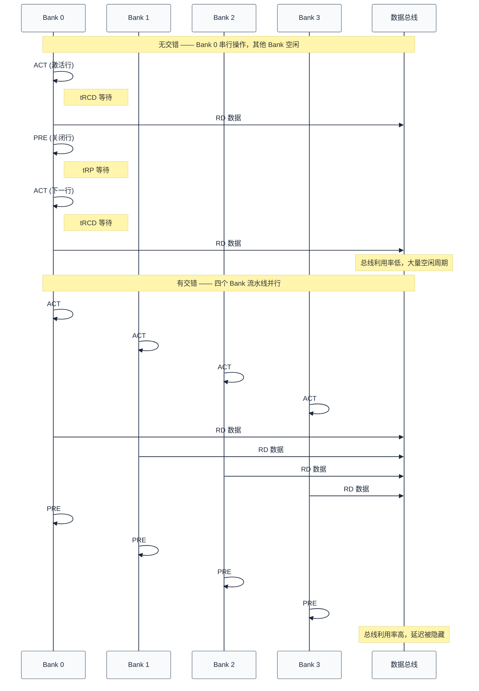
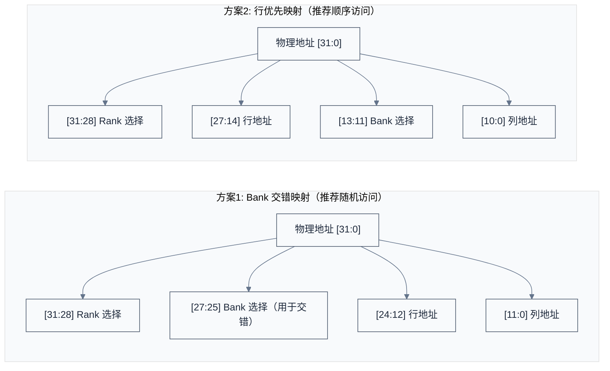
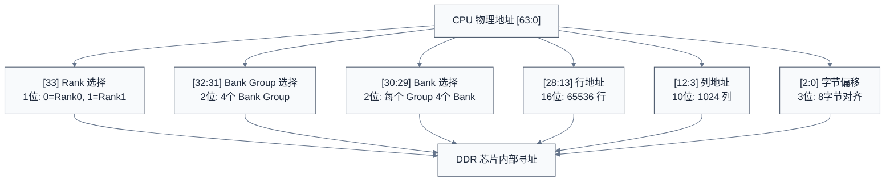
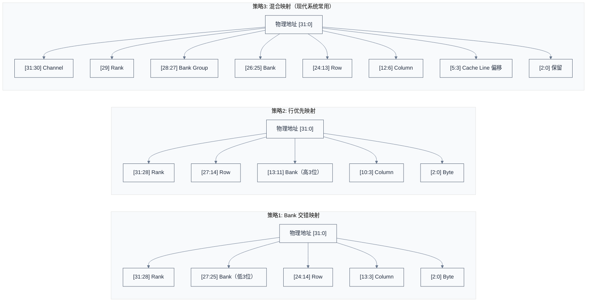
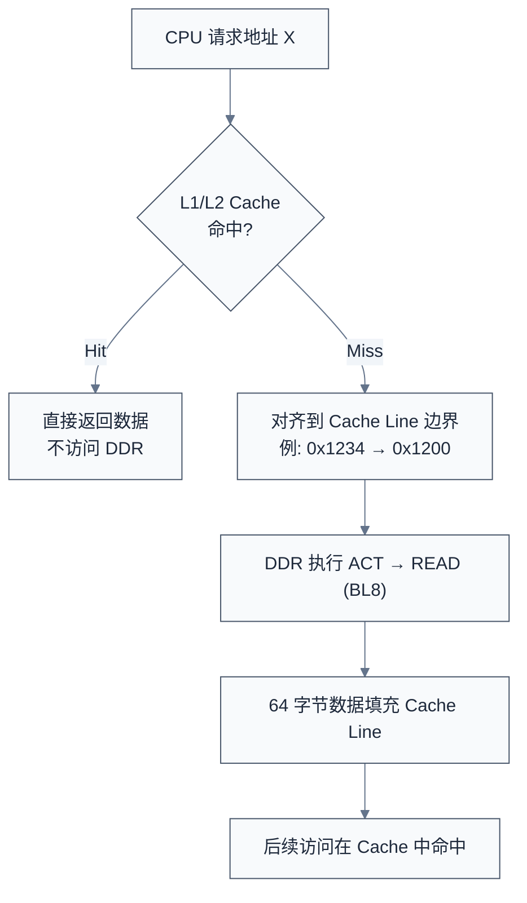
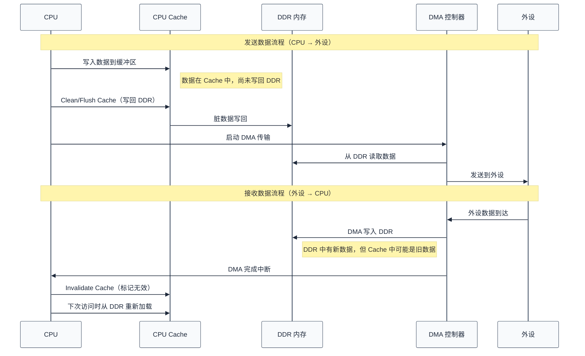
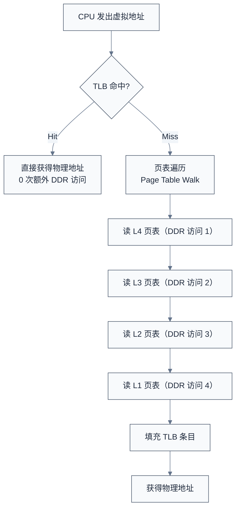
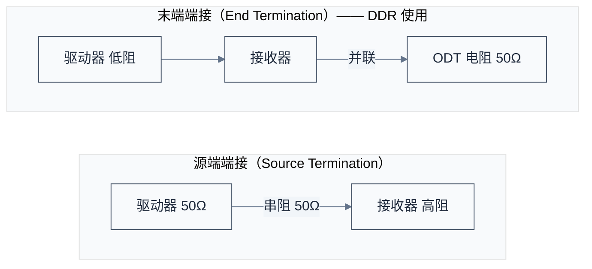
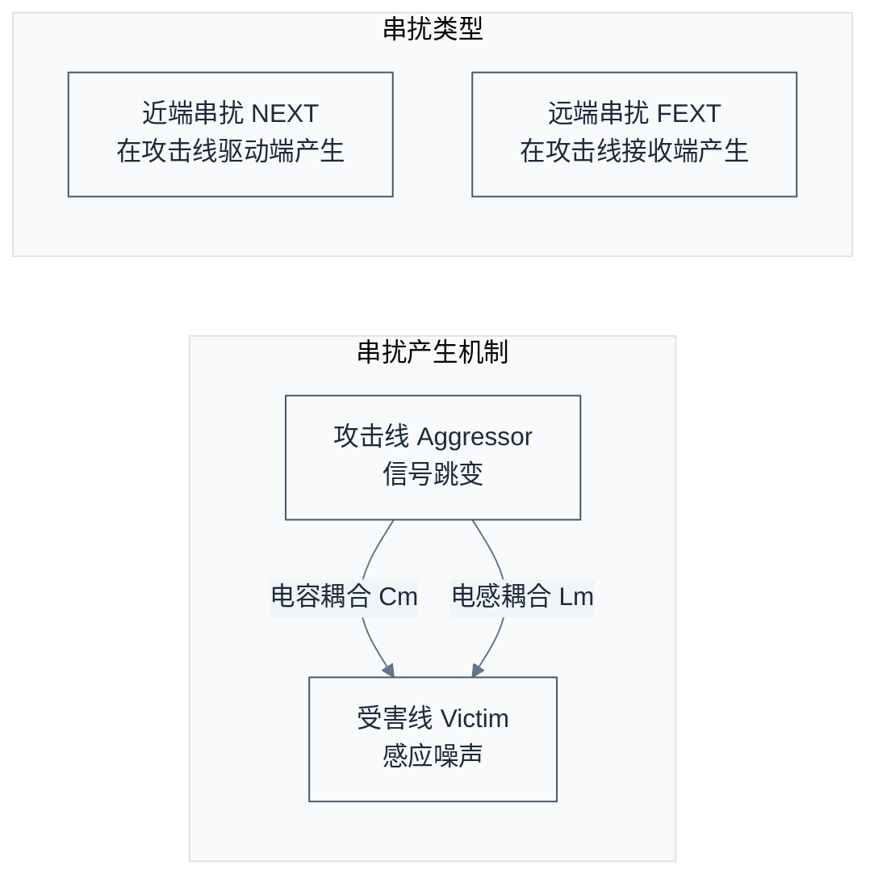

# DDR 性能优化与测量调试

> 本文档涵盖 DDR 性能优化（带宽计算、Bank 交错、地址映射、调度策略）、信号完整性分析，以及实际案例分析。
> **工程师视角**：性能优化不是调参数——是理解瓶颈在哪。大多数 DDR 性能问题不是带宽不够，而是 Bank 冲突和地址映射不合理。

### 关键术语

| 缩写 | 全称 | 含义 |
|------|------|------|
| QoS | Quality of Service | 服务质量，保证关键流量优先访问内存 |
| TLB | Translation Lookaside Buffer | 页表缓存，影响虚拟地址到物理地址的转换延迟 |
| DMA | Direct Memory Access | 直接内存访问，外设不经 CPU 直接读写 DDR |
| ISI | Inter-Symbol Interference | 码间干扰，前一比特影响后一比特的判决 |
| BER | Bit Error Rate | 误码率 |

### 1.1 前置知识

| 需要了解 | 参考文档 |
|----------|----------|
| DDR 时序参数（tCL/tRCD/tRP/tCCD 等） | [DDR 工作原理与时序参数](./03-DDR工作原理与时序参数.md) |
| Bank/Bank Group 结构和地址映射 | [DDR 物理结构与硬件设计](./02-DDR物理结构与硬件设计.md) |
| DDR 训练流程 | [DDR 控制器、PHY 与训练](./04-DDR控制器PHY与训练.md) |

***

## 一、DDR 性能优化

### 1.1 带宽计算

**理论带宽** = 数据速率 × 位宽 / 8

**示例（DDR4-3200）**：

| 参数 | 值 |
|------|-----|
| 数据速率 | 3200 MT/s |
| 位宽 | 64 位 |
| 理论带宽 | 3200 × 64 / 8 = 25600 MB/s = 25.6 GB/s |
| 实际带宽 | 约 70-80% 理论值 |

**影响实际带宽的因素**：

| 因素 | 开销 |
|------|------|
| 刷新开销 | 约 3-5% |
| 行切换开销 | 取决于访问模式 |
| 时序延迟 | tRCD, tCL, tRP |
| 协议开销 | 命令/地址传输 |

### 1.2 Bank 交错

**Bank 交错（Bank Interleaving）** 是 DDR 性能优化的核心技术之一。它的核心思想是：将连续的物理地址映射到不同的 Bank，使得对一个 Bank 的访问延迟（tRCD、tRP）被其他 Bank 的并行操作所隐藏。

以下时序图对比了无交错和有交错两种情况下的总线利用率差异：



**Bank 交错的三个关键收益**：

| 收益 | 原理 |
|------|------|
| 隐藏 tRCD 延迟 | 在 Bank 0 等待 tRCD 期间，向 Bank 1 发送 ACT 命令 |
| 隐藏 tRP 延迟 | 在 Bank 0 执行 PRE 期间，从 Bank 1 读取数据 |
| 提高总线利用率 | 数据总线几乎不间断地传输数据，而非等待行切换 |

**Bank 交错的代价**：需要控制器支持命令队列和乱序调度；同一 Bank 内的连续访问仍然受限于 tCCD（CAS-to-CAS Delay）。

### 1.3 地址映射优化

地址映射决定了 CPU 物理地址如何拆分为 DDR 的 Rank、Bank Group、Bank、Row、Column。不同的映射策略直接影响 Bank 交错效果和行命中率。



**选择依据**：

| 访问模式 | 推荐策略 | 原因 |
|----------|----------|------|
| 随机访问为主（通用计算） | Bank 交错映射 | 连续物理地址分散到不同 Bank，最大化并行度 |
| 顺序访问为主（流媒体/视频） | 行优先映射 | 连续物理地址在同一行内，最大化行命中率 |
| 混合负载（现代多核系统） | 混合映射 | 结合 Cache Line 大小，平衡并行度和命中率 |

### 1.4 调度策略

| 策略 | 原理 | 优缺点 |
|------|------|--------|
| 先来先服务（FCFS） | 按请求到达顺序调度 | 简单，但效率低 |
| 行命中优先（Row Hit First） | 优先调度已打开行的请求 | 减少 ACT/PRE 次数 |
| 写回读优先（Write-Read First） | 写数据后立即读回验证 | 提高写后读性能 |
| 饥饿防止（Anti-Starvation） | 长时间等待的请求提高优先级 | 保证公平性 |

> 现代 DDR 控制器通常采用组合策略。

### 1.5 内存地址映射详解

#### 1.5.1 物理地址到 DDR 地址的转换

CPU 发出的物理地址不是直接送到 DDR 芯片的——它需要经过 DDR 控制器的地址映射逻辑，拆分为 Rank、Bank Group、Bank、Row、Column 五个维度。



**地址映射示例**：

| 物理地址 | Rank | BG | Bank | Row | Col | Byte |
|----------|------|-----|------|-----|-----|------|
| `0x4_8000_0000` | 0 | 1 | 0 | 0 | 0 | 0 |
| `0x5_1234_5678` | 0 | 2 | 0 | 37282 | 719 | 0 |

> 地址映射规则由 DDR 控制器的 ADDRMAP 寄存器组配置，不同 SoC 的默认映射方式不同。配错地址映射是 DDR 调试中最隐蔽的问题之一——内存测试可能部分通过、部分失败，因为地址回绕导致不同逻辑地址访问到同一物理位置。

#### 1.5.2 地址映射策略

三种常见策略的对比：



| 策略 | Bank 位位置 | 适用场景 | 关键特征 |
|------|------------|----------|----------|
| Bank 交错映射 | 低位（紧邻 Column） | 通用计算 | 连续地址分散到不同 Bank |
| 行优先映射 | 高位（紧邻 Row） | 流媒体/视频 | 连续地址在同一行内 |
| 混合映射 | 中位（Bank Group + Bank 分离） | 多核系统 | 64B Cache Line 对齐，减少 False Sharing |

### 1.6 Cache 与 DDR 交互

#### 1.6.1 缓存行与 DDR 的关系

Cache Line（缓存行）是 CPU Cache 与 DDR 之间数据传输的最小单位，通常为 64 字节。这与 DDR 的 BL8 突发传输天然对齐：BL8 × 8 字节（64 位总线）= 64 字节。



**空间局部性对 DDR 带宽利用率的影响**：

| 代码模式 | Cache Miss 频率 | DDR 访问次数（N 次迭代） | 带宽利用率 |
|----------|----------------|------------------------|-----------|
| 顺序访问 `arr[i]` | 每 16 次访问 1 次 Miss | N/16 | 高——每次 Miss 加载的 64B 中 16 个元素都被使用 |
| 跨步访问 `arr[i*16]` | 每次访问都 Miss | N | 低——每次 Miss 加载的 64B 中只有 1 个元素被使用 |

> **实践建议**：在性能敏感代码中，尽量按 Cache Line 对齐数据结构（`__attribute__((aligned(64)))`），避免跨 Cache Line 的频繁访问。

#### 1.6.2 DMA 与 DDR 交互

DMA（Direct Memory Access）允许外设不经过 CPU 直接读写 DDR。这带来了性能优势，但也引入了 Cache 一致性问题：CPU 的 Cache 中可能有尚未写回 DDR 的脏数据，DMA 从 DDR 读取时会读到过期数据。



**Cache 一致性操作的三个关键 API**（Linux 内核 DMA API）：

| API | 方向 | 作用 |
|-----|------|------|
| `dma_map_single(dev, buf, size, DMA_TO_DEVICE)` | CPU→设备 | 映射前 Clean Cache，确保设备读到最新数据 |
| `dma_map_single(dev, buf, size, DMA_FROM_DEVICE)` | 设备→CPU | 映射前 Invalidate Cache，确保 CPU 读到设备写入的数据 |
| `dma_unmap_single(dev, addr, size, dir)` | 传输完成 | 解除映射，必要时 Invalidate Cache |

> **常见错误**：DMA 传输后忘记 Invalidate Cache，导致 CPU 读到的是 Cache 中的旧数据而非 DMA 写入的新数据。症状通常是"数据偶尔正确、偶尔错误"，因为 Cache 命中状态不确定。

#### 1.6.3 TLB 与 DDR 性能

TLB（Translation Lookaside Buffer，页表缓存）缓存虚拟地址到物理地址的转换结果。TLB Miss 会导致页表遍历（Page Table Walk），而页表本身存储在 DDR 中——每次 TLB Miss 可能触发多次 DDR 访问。



**大页（Huge Page）减少 TLB 压力的原理**：

| 页大小 | 覆盖范围 | 4GB 地址空间所需 TLB 条目 | TLB Miss 的 DDR 访问次数 |
|--------|---------|------------------------|------------------------|
| 4KB（标准页） | 4KB | ~1,000,000 | 4 次（4 级页表遍历） |
| 2MB（大页） | 2MB | ~2,000 | 3 次（3 级页表遍历） |
| 1GB（巨页） | 1GB | 4 | 2 次（2 级页表遍历） |

> **实践建议**：数据库、虚拟机、帧缓冲等需要大块连续内存的场景，使用 Huge Page 可显著降低 TLB Miss 率，减少 DDR 带宽浪费在页表遍历上。

***

## 二、DDR 测量与调试

### 2.1 示波器测量

#### 2.1.1 测量点

| 测量项目 | 测量点 |
|----------|--------|
| 时钟（CK/CK#） | DDR 芯片时钟引脚 |
| 数据选通（DQS） | DDR 芯片 DQS 引脚 |
| 数据（DQ） | DDR 芯片 DQ 引脚 |
| 地址/命令 | DDR 芯片地址引脚 |

> 注意事项：使用差分探头测量差分信号；探头接地要短，减少噪声；测量点尽量靠近 DDR 芯片；注意探头负载效应。

#### 2.1.2 眼图测量

**眼图（Eye Diagram）** 是评估 DDR 信号质量的核心工具。它将多个比特周期的波形叠加显示，形成"眼睛"形状的图案。眼图的开口大小直接反映了信号的时序裕量和电压裕量。

```
眼图原理示意（DQ vs DQS）:

←── 单位间隔 (UI) ──→
│                  │
错误│    ┌────────┐    │错误
区域│    │  眼图  │    │区域
│    │  开口  │    │
│    └────────┘    │
│                  │
────┼──────────────────┼────→ DQS 相位
0°              360°
```

**眼图关键参数**：

| 参数 | 含义 | 工程意义 |
|------|------|----------|
| 眼高 | 信号幅度裕量 | 眼高越大，抗噪声能力越强。眼高不足 → 增加 Vref 或检查电源噪声 |
| 眼宽 | 时序裕量 | 眼宽越大，抗抖动能力越强。眼宽不足 → 调整 DQS 延迟或降低频率 |
| 抖动 | 边沿时间不确定性 | 抖动大 → 检查 PLL 电源滤波、时钟源质量 |
| 上升/下降时间 | 信号边沿陡峭程度 | 过缓 → 驱动强度不足；过陡 → EMI 和串扰增加 |

> DDR 训练的核心目标就是"张开眼图"——通过 Write Leveling、Read DQS Training、Vref Training 等步骤，最大化信号的眼图开口，确保数据采样的时序和电压裕量充足。

### 2.2 信号完整性分析

| 问题 | 原因 | 解决方案 |
|------|------|----------|
| 反射（Reflection） | 阻抗不匹配 | 正确的端接电阻（ODT） |
| 串扰（Crosstalk） | 相邻信号线耦合 | 增加间距、地屏蔽 |
| 抖动（Jitter） | 电源噪声、时钟抖动 | 电源滤波、时钟优化 |
| 码间干扰（ISI） | 传输线损耗 | 均衡技术 |
| 同步开关噪声（SSN） | 多位同时翻转 | 电源去耦、降低驱动强度 |

#### 2.2.1 信号反射与阻抗匹配

**为什么信号会反射？**

当信号在传输线上传播时，如果遇到阻抗不连续点（连接器、过孔、分支走线、接收端未端接），就会发生反射。反射信号叠加在原信号上，导致接收端看到的是畸变的波形。

反射系数公式：**Γ = (Z_L - Z_0) / (Z_L + Z_0)**，其中 Z_0 为传输线特性阻抗（通常 50Ω），Z_L 为负载阻抗。

| 负载状态 | Z_L | Γ | 结果 |
|----------|-----|---|------|
| 阻抗匹配 | Z_0 | 0 | 无反射，信号完整传输 |
| 开路 | ∞ | +1 | 全反射，接收端电压加倍 |
| 短路 | 0 | -1 | 全反射，接收端电压为零 |

**DDR 中的两种端接方案**：



| 方案 | 原理 | 优点 | 缺点 | DDR 中的应用 |
|------|------|------|------|-------------|
| 源端端接 | 驱动器串联电阻匹配 Z_0 | 接收端无反射 | 信号幅度减半 | 较少使用 |
| 末端端接 | 接收端并联电阻到 VDDQ/2 | 信号幅度大，完整性好 | 静态功耗大 | **DDR 标准方案（ODT）** |

**ODT 的工作原理**：DDR 颗粒内部集成了可配置的端接电阻，通过 ODT 引脚动态使能。写操作时目标颗粒使能 ODT，读操作时控制器端使能 ODT，空闲时关闭以省电。

DDR4 ODT 电阻值通过模式寄存器 MR1 配置（RZQ = 240Ω 外接精密电阻）：

| MR1 设置 | Rtt_NOM | 适用场景 |
|----------|---------|----------|
| 001 | RZQ/4 = 60Ω | 轻载、短走线 |
| 011 | RZQ/6 = 40Ω | 重载、多颗粒 |
| 100 | RZQ/1 = 240Ω | 高阻、省电模式 |
| 000 | RTT_OFF | 禁用（空闲时） |

#### 2.2.2 串扰分析

**串扰（Crosstalk）** 是相邻信号线之间通过电磁场耦合产生的干扰。在 DDR 高速并行总线中，几十根信号线紧密排列，串扰是限制信号质量的主要因素之一。



**减小串扰的方法**：

| 方法 | 原理 | 实施要点 |
|------|------|----------|
| 增加线间距（3W 原则） | 线间距 ≥ 3 倍线宽，耦合电容随距离平方衰减 | PCB 布线阶段实施，是成本最低的方法 |
| 地线隔离 | 在敏感信号间插入地线，提供屏蔽 | 会增加布线面积，需权衡 |
| 差分对布线 | 正负信号紧密耦合，外部干扰为共模，被差分接收器抑制 | DQS/DQS#、CK/CK# 天然使用差分对 |
| 交错走线 | 相邻层走线方向垂直，减少层间耦合 | 多层 PCB 设计时规划叠层方向 |
| 控制边沿速率 | 减缓驱动器的上升/下降时间，减少高频分量 | 通过配置 DDR 模式寄存器调整驱动强度 |

#### 2.2.3 眼图分析

眼图是时域反射计（TDR）或高速示波器通过叠加多个比特周期的波形生成的。它综合反映了反射、串扰、抖动、ISI 等所有信号完整性问题的最终效果。

```
眼图形成原理（多周期波形叠加）:

        │    ┌───┐      ┌───┐      ┌───┐
电压    │   /     \    /     \    /     \
        │  /       \  /       \  /       \
        │ /         \/         \/         \
        │/                              \
        ├───────────────────────────────────
        │\         /\         /\         /
        │ \       /  \       /  \       /
        │  \     /    \     /    \     /
        │   └───┘      └───┘      └───┘
        └───────────────────────────────────
              ↑                    ↑
           采样窗口              采样窗口
```

**眼图参数与信号完整性问题的对应关系**：

| 眼图异常 | 反映的问题 | 排查方向 |
|----------|-----------|----------|
| 眼高不足（上下闭合） | 信号幅度衰减、电源噪声 | 检查 Vref 电压、VDDQ 纹波、驱动强度 |
| 眼宽不足（左右闭合） | 抖动过大、ISI | 检查 PLL 抖动、降低频率、检查走线损耗 |
| 多眼皮/双线 | 阻抗不匹配、反射 | 调整 ODT 阻值、检查走线阻抗连续性 |
| 上升沿/下降沿过缓 | 驱动强度不足、容性负载过大 | 增加驱动强度、减少负载颗粒数 |
| 过冲/下冲明显 | 端接不足、驱动过强 | 调整 ODT、降低驱动强度 |

> **实践技巧**：在 DDR 调试中，先用较低频率（如 DDR4-1600）测量眼图，确认眼图正常后再逐步提升到目标频率（如 DDR4-3200）。如果低频正常、高频异常，问题通常出在信号完整性（走线损耗、阻抗不连续）而非配置错误。

***

## 三、实际案例分析

### 3.1 案例1: DDR 训练失败

**问题**：某开发板 DDR4 初始化时，读训练失败。

**排查过程**：

| 步骤 | 检查项 | 发现 |
|------|--------|------|
| 1. 训练日志 | 写均衡/读训练/Vref | 写均衡通过，读训练失败（某些 DQ 位错误） |
| 2. 示波器测量 | CK/DQS/DQ | 某位 DQS 边沿变缓，某位 DQ 幅度偏低 |
| 3. PCB 检查 | 走线质量 | DQS 走线有残桩，DQ 走线阻抗偏差较大 |

**解决方案**：修改 PCB 布局去除残桩 → 调整 ODT 阻抗配置 → 降低数据速率测试 → 重新训练后通过。

### 3.2 案例2: 内存随机错误

**问题**：系统运行一段时间后出现随机内存错误。

**排查过程**：

| 步骤 | 检查项 | 发现 |
|------|--------|------|
| 1. 内存测试 | memtester | 错误集中在某些地址，温度升高时错误率增加 |
| 2. 环境测试 | 常温/高温/低温 | 常温偶发错误，高温（85°C）频繁，低温（-40°C）无错误 |
| 3. 时序检查 | tREFI 配置 | tREFI 偏大，高温下刷新不及时 |

**解决方案**：减小 tREFI（缩短刷新间隔）→ 开启温度补偿自刷新 → 增加时序裕量 → 增强散热措施。

### 3.3 案例3: 性能不达标

**问题**：DDR4-3200 理论带宽 25.6 GB/s，实测仅 12 GB/s。

**排查过程**：

| 步骤 | 检查项 | 发现 |
|------|--------|------|
| 1. 带宽测试 | STREAM 基准 | Copy: 12 GB/s, Scale: 11 GB/s, Add: 10 GB/s |
| 2. 性能分析 | DDR 控制器配置 | Bank 交错未开启，地址映射未优化 |
| 3. 寄存器检查 | 交错/调度/优先级 | Bank 交错禁用，调度策略 FCFS，读优先级低 |

**解决方案**：开启 Bank 交错 → 优化地址映射 → 调整调度策略 → 重新测试带宽提升至 20 GB/s。

***

> **导航**：[上一篇：DDR 驱动开发与调试](./05-DDR驱动开发与调试.md) | [下一篇：DDR 新技术与学习资源](./07-DDR新技术与学习资源.md)
