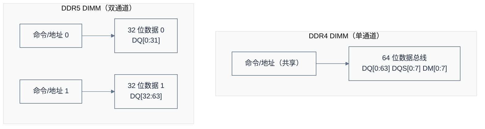

# DDR 新技术趋势与学习资源

> 本文档涵盖 DDR 新技术趋势（DDR5、HBM、GDDR、MRDIMM）以及精选学习资源。
> **工程师视角**：DDR5 不是 DDR4 的频率升级版——16n-prefetch、双通道架构、片上 ECC 是架构级变化。理解这些变化才能做好下一代产品的 DDR 选型。

### 关键术语

| 缩写 | 全称 | 含义 |
|------|------|------|
| HBM | High Bandwidth Memory | 高带宽内存，3D 堆叠，1024 位宽接口 |
| GDDR | Graphics DDR | 图形 DDR，面向 GPU 的高带宽内存 |
| MRDIMM | Multi-Ranked Buffered DIMM | 多 Rank 缓冲 DIMM，DDR5 时代的新 DIMM 类型 |
| TSV | Through-Silicon Via | 硅通孔，HBM 堆叠的关键技术 |
| RFM | Refresh Management | 刷新管理，DDR5 引入的 Row Hammer 缓解机制 |
| ODT | On-Die Termination | 片上端接电阻 |

### 1.1 前置知识

| 需要了解 | 参考文档 |
|----------|----------|
| DDR4 架构和时序参数 | [DDR 工作原理与时序参数](./03-DDR工作原理与时序参数.md) |
| DDR 物理结构和 DIMM 类型 | [DDR 物理结构与硬件设计](./02-DDR物理结构与硬件设计.md) |

***

## 一、DDR 新技术趋势

### 1.1 DDR5 新特性

| 特性 | DDR4 | DDR5 | 改进幅度 |
|------|------|------|----------|
| 数据速率 | 最高 3200 MT/s | 3200-8800 MT/s | 2.75× |
| 理论带宽（64位） | 最高 25.6 GB/s | 最高 70.4 GB/s | 2.75× |
| 单芯片最大容量 | 64Gb | 64Gb (更高密度在研) | — |
| 工作电压 | 1.2V | 1.1V | 降低 8% |
| 子通道 | 1×64 位 | 2×32 位 | 独立命令流 |
| 突发长度 | BL8 | BL16 | 2× |
| Bank Group | 4 | 8 (x4/x8) / 4 (x16) | 2× |
| 电源管理 | 主板供电 | 集成 PMIC (12V 输入) | 更精确控制 |
| ECC | 无片上 ECC | 片上 ECC + 链路 ECC | 可靠性增强 |
| CA 奇偶校验 | 无 | 有 | 命令可靠性增强 |

#### 1.1.1 DDR5 双通道子通道架构详解



**DDR5 双通道优势**：提高命令并行度（两路独立命令流）、减少命令总线瓶颈、提高小随机访问性能、更灵活的数据调度，适合现代多核处理器。

**对驱动开发的影响**：需分别配置两个子通道、地址映射更复杂、训练需对每个子通道执行、内核中需识别子通道拓扑。

#### 1.1.2 DDR5 PMIC 详解

DDR5 将电源管理从主板移至 DIMM 模块上集成的 PMIC（Power Management IC），输入 12V，内部转换。

| 电源 | 电压 | 说明 |
|------|------|------|
| VDD | 1.1V | 核心电源 |
| VDDQ | 1.1V | I/O 电源 |
| VPP | 1.8V | 字线电源（DDR4 为 2.5V，DDR5 降至 1.8V） |

PMIC 还支持动态电压调节（DVS）和电源时序控制。

**优势**：更精确的电源控制、支持 DVFS、降低主板设计复杂度、更好的噪声隔离。

**驱动注意事项**：通过 I2C 访问 PMIC、需要配置电压调节、监控电源状态。

### 1.2 HBM (高带宽内存)

HBM（High Bandwidth Memory）采用 3D 堆叠封装，通过硅通孔（TSV）互连多层 DRAM Die，与 GPU/AI 芯片集成。

| 代际 | 带宽（单栈） | 位宽 | 典型应用 |
|------|-------------|------|----------|
| HBM2 | 256 GB/s | 1024 位 | 高性能 GPU、AI 加速器 |
| HBM2E | 460 GB/s | 1024 位 | HPC、网络处理器 |
| HBM3 | 最高 819 GB/s | 1024 位 | 旗舰 GPU、AI 训练 |
| HBM3E | 1 TB/s+ | 1024 位 | 下一代 AI 加速器 |

### 1.3 GDDR (图形 DDR)

GDDR（Graphics DDR）专为图形处理优化，高带宽优先，延迟要求相对宽松。

| 代际 | 最高速率 | 典型应用 |
|------|----------|----------|
| GDDR6 | 16 Gbps/pin | 显卡、游戏主机 |
| GDDR6X | 24 Gbps/pin | 高端显卡 |
| GDDR7 | 32 Gbps/pin | 下一代显卡、高性能显示设备 |

### 1.4 MRDIMM (多路复用双列直插内存模块)

MRDIMM（Multiplexed RIMM）是 DDR5 服务器平台引入的新一代内存模块技术，通过频率倍增实现更高带宽。

| 特性 | 标准 RDIMM | MRDIMM | 说明 |
|------|------------|--------|------|
| 理论带宽 | 51.2 GB/s | 102.4 GB/s | 带宽翻倍 |
| 数据速率 | DDR5-6400 | DDR5-12800 | 频率倍增 |
| 架构 | 直接连接 | 2:1 缓存/复用 | 多路复用降低信号频率 |
| 功耗 | 较低 | 较高（需要额外缓冲） | 功耗增加约 20-30% |
| 典型应用 | 通用服务器 | AI/ML/HPC 服务器 | 需要极致带宽的场景 |

**工作原理**：MRDIMM 在控制器与 DRAM 之间增加了一个复用缓冲芯片，将 DDR5-12800 的高频信号降为 DDR5-6400 的信号传给 DRAM，同时保持对外（CPU侧）的高速接口。

> **MRDIMM vs LRDIMM**：两者都使用缓冲芯片，但 MRDIMM 采用频率倍增（2:1），而 LRDIMM 主要是降低负载（1:N 缓冲）。MRDIMM 适合需要极高带宽的场景，LRDIMM 适合需要大容量和多 Rank 的场景。

### 1.5 LPDDR 与标准 DDR 的关键差异

LPDDR（Low Power DDR）不是 DDR 的"低功耗版本"——它是为移动和嵌入式场景重新设计的独立产品线。

| 对比维度 | 标准 DDR (DDR4/DDR5) | LPDDR (LPDDR4/LPDDR5) |
|----------|---------------------|----------------------|
| **目标场景** | 服务器、PC、工作站 | 手机、平板、汽车、IoT |
| **封装形式** | DIMM/SODIMM（可插拔） | PoP（Package-on-Package）或直接焊接 |
| **位宽** | 64-bit（DIMM） | 16/32-bit per channel |
| **供电电压** | DDR4: 1.2V, DDR5: 1.1V | LPDDR4: 1.1V/0.6V, LPDDR5: 1.05V/0.5V |
| **功耗管理** | 自刷新、时钟停止 | 深度睡眠、部分阵列自刷新（PASR）、温度补偿自刷新（TCSR） |
| **频率** | DDR5-6400 起步 | LPDDR5-6400 起步，LPDDR5X 达 8533 Mbps |
| **ECC** | 可选（DIMM 上） | 通常无硬件 ECC（依赖链路层 CRC） |
| **训练** | 每次上电训练 | 训练结果可保存，减少启动时间 |
| **信号完整性** | 多 Rank、多 DIMM，拓扑复杂 | 点对点连接，信号完整性更好 |

> **工程师视角**：如果你在做嵌入式 Linux 产品（如 AI 摄像头、车载域控），大概率用的是 LPDDR4/LPDDR5 焊接在 PCB 上。LPDDR 的初始化流程和标准 DDR 类似（都是 JEDEC 标准），但寄存器地址和时序参数不同，需要查阅具体颗粒的数据手册。

***

## 二、学习资源与参考

### 2.1 规范文档

| 类别 | 文档 | 说明 |
|------|------|------|
| JEDEC 标准 | JESD79-4 | DDR4 SDRAM 标准 |
| | JESD79-5 | DDR5 SDRAM 标准 |
| | JESD209-4 | LPDDR4 标准 |
| | JESD209-5 | LPDDR5 标准 |
| 厂商文档 | Samsung DDR Datasheet | 公开 |
| | Micron DDR Technical Note | 公开 |
| | SK Hynix DDR Application Manual | 需注册 |
| | SoC 厂商 DDR 控制器手册 | 需注册 |

> JEDEC 标准获取：[JEDEC 官网](https://www.jedec.org/)，免费注册后可下载部分标准，完整标准需付费购买。

### 2.2 JEDEC 标准组织与规范

JEDEC (Joint Electron Device Engineering Council):

- 成立时间: 1958年
- 总部: 美国弗吉尼亚州阿灵顿
- 性质: 全球微电子行业标准化组织
- 职责: 制定内存、闪存、封装等标准

**DDR 标准文档编号:**

| 类型   | 标准编号     | 说明                    | 发布年份 |
| ------ | ------------ | ----------------------- | -------- |
| DDR    | JESD79       | DDR SDRAM 标准          | 2000     |
| DDR2   | JESD79-2     | DDR2 SDRAM 标准         | 2003     |
| DDR3   | JESD79-3     | DDR3 SDRAM 标准         | 2007     |
| DDR3L  | JESD79-3F    | DDR3L (1.35V) 标准      | 2010     |
| DDR4   | JESD79-4     | DDR4 SDRAM 标准         | 2012     |
| DDR5   | JESD79-5     | DDR5 SDRAM 标准         | 2020     |
| LPDDR  | JESD209      | LPDDR 标准              | 2006     |
| LPDDR2 | JESD209-2    | LPDDR2 标准             | 2009     |
| LPDDR3 | JESD209-3    | LPDDR3 标准             | 2012     |
| LPDDR4 | JESD209-4    | LPDDR4 标准             | 2014     |
| LPDDR4X| JESD209-4B   | LPDDR4X 标准            | 2017     |
| LPDDR5 | JESD209-5    | LPDDR5 标准             | 2019     |

**获取方式:**

- JEDEC 官网: https://www.jedec.org/
- 免费注册后可下载部分标准
- 完整标准需付费购买
- 部分厂商提供公开的技术文档

**厂商技术文档:**

Samsung:
- DDR4 Datasheet (公开)
- DDR5 Datasheet (公开)
- Application Notes (需注册)

Micron:
- DDR4 Technical Note (公开)
- DDR5 Technical Note (公开)
- Design Guide (需注册)

SK Hynix:
- DDR4 Datasheet (公开)
- DDR5 Datasheet (公开)
- Application Manual (需注册)

### 2.3 DDR 封装类型

**常见 DDR 封装类型：**

| 封装类型 | 全称 | 特点 | 间距 | 典型应用 |
|----------|------|------|------|----------|
| BGA | Ball Grid Array | 底部焊球阵列，高密度互连 | 0.65mm, 0.8mm | 主流 DDR 封装 |
| FBGA | Fine-pitch BGA | 更小间距 BGA | 0.4mm, 0.5mm, 0.65mm | 高密度 DDR 芯片 |
| PoP | Package on Package | 底部 CPU/SoC + 顶部 DDR | 0.4mm, 0.5mm | 智能手机、平板 |
| 3D TSV | Through-Silicon Via | 垂直互连多层 Die 堆叠 | — | HBM（高带宽内存） |
| WLCSP | Wafer Level CSP | 晶圆级封装，尺寸接近芯片 | — | 移动设备 LPDDR |

**封装对比:**

| 封装类型 | 尺寸    | 引脚密度 | 成本 | 典型应用     |
| -------- | ------- | -------- | ---- | ------------ |
| BGA      | 中      | 中       | 低   | 桌面/服务器  |
| FBGA     | 小      | 高       | 中   | 嵌入式       |
| PoP      | 小      | 高       | 高   | 手机/平板    |
| 3D TSV   | 极小    | 极高     | 极高 | HBM/GPU      |
| WLCSP    | 最小    | 中       | 高   | 可穿戴设备   |

**封装标识示例:**

```
Samsung K4A8G165WB-BCTD:
├── K4A: DDR4
├── 8G: 8Gb 容量
├── 16: x16 位宽
├── 5: 第5代
├── WB: BGA 封装
└── BCTD: 速度等级/温度等级
```

### 2.4 推荐书籍

1. **《DDR SDRAM 规范与应用》**
   - 系统讲解 DDR 原理与应用
2. **《高速数字设计》**
   - Howard Johnson 著
   - 信号完整性理论基础
3. **《DDR 存储器设计与应用》**
   - 硬件设计实践
4. **《嵌入式系统内存管理》**
   - 软件视角的内存管理

### 2.5 在线资源

**在线学习资源:**

1. **JEDEC 官网**
   - 标准规范下载
2. **厂商技术社区**
   - NXP 社区: DDR 调试指南
   - TI Wiki: DDR 设计指南
   - Xilinx Wiki: MIG (Memory Interface Generator)
3. **技术博客**
   - Udoo: DDR4 Training 详解
   - RocketBoards: DDR 调试案例
   - CNX Software: DDR 技术文章
4. **开源项目**
   - U-Boot: DDR 初始化代码
   - Linux Kernel: DDR 驱动
   - Coreboot: DDR 初始化参考

***

***

> **导航**：[上一篇：DDR 性能优化与测量调试](./06-DDR性能优化与测量调试.md) | [下一篇：DDR 附录与参考资料](./08-DDR附录与参考资料.md)
