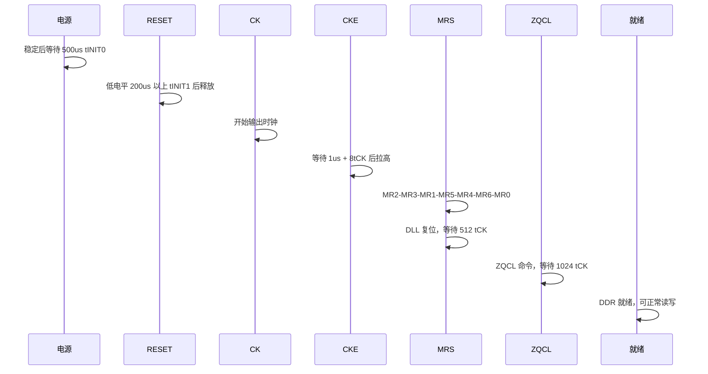
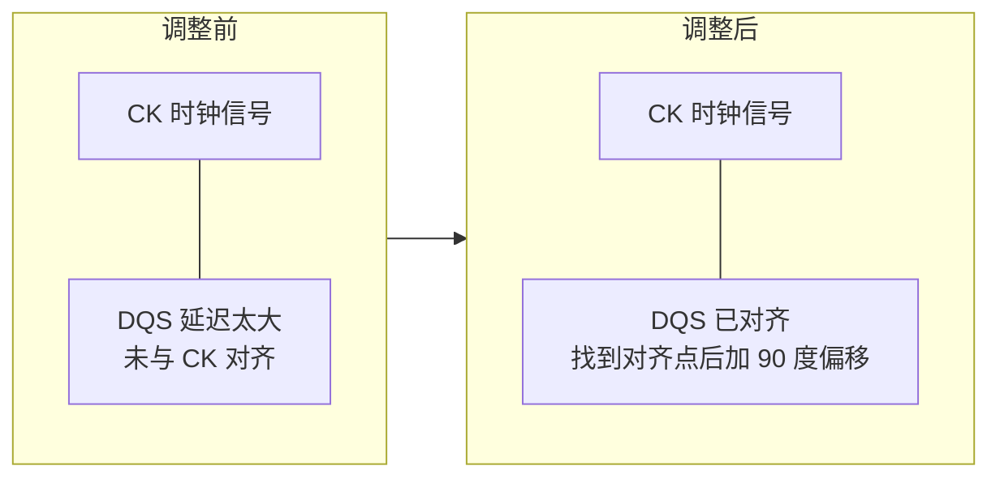
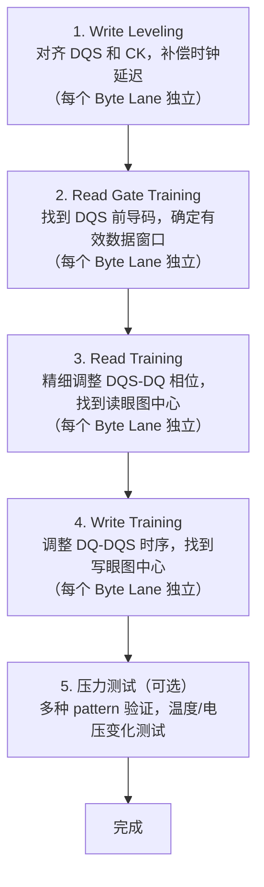
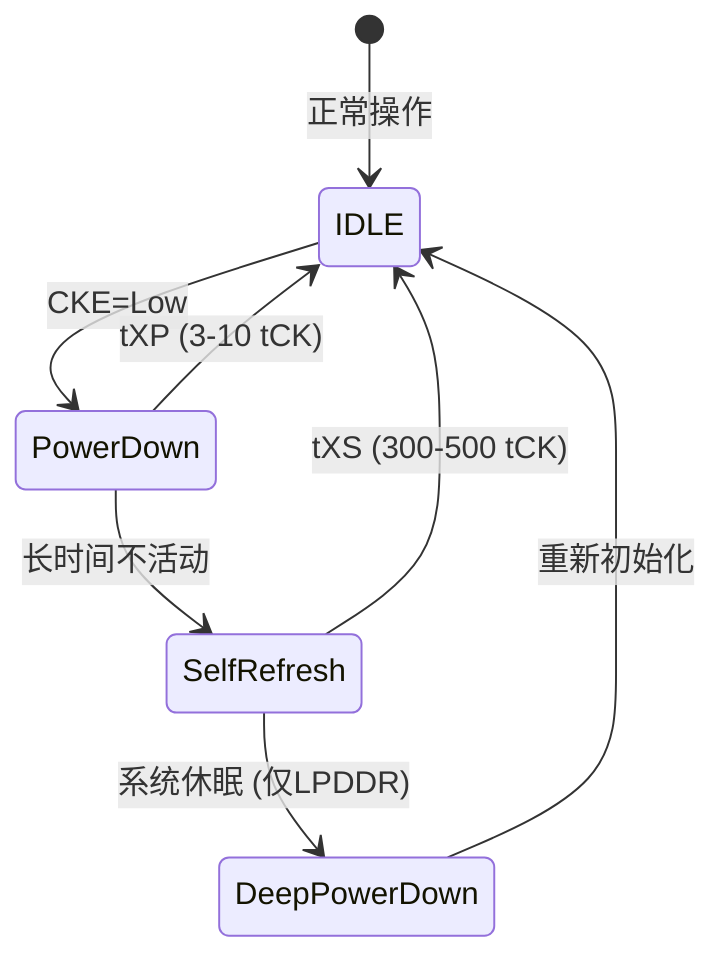

# DDR 附录与参考资料

> 本文档为 DDR 学习笔记的附录部分，包含 DDR 初始化与训练流程详解、内存映射与地址译码、功耗管理与温度管理、错误检测与纠正(ECC)、调试与故障排查、总结以及术语表和频率对照表等参考资料。

***

## 附录A: DDR初始化和训练流程详解

### A.1 上电初始化序列 (JEDEC标准)

DDR4 上电初始化流程（JEDEC DDR4 规范）：

**步骤 1：上电和复位**

| 子步骤 | 操作 | 时序要求 |
|--------|------|----------|
| 1.1 电源上电 | VDD 和 VDDQ 同时上电（或 VDD 先于 VDDQ）；VPP 上电到 2.5V；VrefCA 和 VrefDQ 建立 | 所有电源稳定后等待 500μs（tINIT0） |
| 1.2 复位信号 | RESET# 保持低电平；CKE 保持低电平；时钟稳定后释放 RESET# | RESET# 低电平至少 200μs（tINIT1） |

**步骤 2：开始初始化**

| 子步骤 | 操作 | 时序要求 |
|--------|------|----------|
| 2.1 等待稳定 | RESET# 释放后等待内部电路稳定 | tINIT3（1μs） |
| 2.2 拉高 CKE | 在时钟上升沿拉高 CKE | 之后等待 tINIT4（8 个时钟周期） |
| 2.3 配置 MRS | MR2→MR3→MR1→MR5→MR4→MR6→MR0 依次配置 | 每条 MRS 命令间等待 tMRD |
| 2.4 DLL 锁定 | 发送 DLL 复位命令后等待 | 512 个时钟周期 |

MRS 寄存器配置内容：

| 寄存器 | 配置内容 |
|--------|----------|
| MR2 | 刷新特性、温度范围 |
| MR3 | 特性配置、PDA 模式 |
| MR1 | DLL 使能、ODT 配置、输出驱动强度 |
| MR5 | 读/写 DBI、DM、CA 奇偶校验 |
| MR4 | 温度更新、PPR、写前导码 |
| MR6 | 刷新间隔、tRFC 模式 |
| MR0 | 突发长度、CAS 延迟、DLL 复位 |

**步骤 3：ZQ 校准**

| 子步骤 | 操作 | 时序要求 |
|--------|------|----------|
| 3.1 ZQCL | 发送 ZQCL 命令，校准内部 ODT 电阻和输出驱动强度 | 等待 tZQinit（1024 个时钟周期） |
| 3.2 初始化完成 | DDR 进入空闲状态，可进行正常读写 | — |

**完整时序图**：



### A.2 DDR训练(Training)详解

**为什么需要训练？**

需要训练的物理因素：

| 因素 | 影响 |
|------|------|
| 芯片制造差异 | 延迟和驱动能力不一致 |
| PCB 走线长度不匹配 | 信号到达时间差异 |
| 温度变化 | 时序漂移 |
| 电压波动 | 信号质量变化 |
| PVT（工艺/电压/温度）变化 | 综合时序偏移 |

需要补偿的延迟：时钟布线延迟、数据信号传输延迟、命令/地址信号延迟、DLL 内部延迟。

训练目标：对齐 DQS 和 CK（Write Leveling）、找到最佳采样窗口（Read/Write Training）、补偿信号传播延迟、确保可靠的数据传输。

#### A.2.1 Write Leveling (写均衡)

**目的**：对齐 DQS 和 CK，补偿时钟布线延迟。

**原理**：DDR4 中 DQS 需要与 CK 对齐，但由于布线延迟，不同颗粒的 DQS 到达时间不同。

**Write Leveling 过程**：

1. 进入 Write Leveling 模式（发送 MRS 命令设置 MR1[7] = 1）
2. DDR 芯片内部比较 DQS 上升沿与 CK 上升沿，当对齐时 DQ0 输出 0→1 跳变
3. 控制器发送 DQS 脉冲，读取 DQ0 反馈，调整 DQS 输出延迟，找到 DQ0 跳变点
4. 将 DQS 延迟设置为跳变点 + 90°（1/4 周期）



代码示例 (伪代码):
void write_leveling(void) {
    // 1. 进入 Write Leveling 模式
    write_mr1(1 << 7);  // 设置 MR1[7] = 1

    // 2. 对每个 Byte Lane 进行训练
    for (byte = 0; byte < NUM_BYTES; byte++) {
        uint32_t delay = 0;
        uint8_t prev_dq, curr_dq;

        // 从最小延迟开始扫描
        set_dqs_delay(byte, delay);
        prev_dq = read_dq0();

        // 逐步增加延迟，寻找跳变点
        for (delay = 1; delay < MAX_DELAY; delay++) {
            set_dqs_delay(byte, delay);
            send_dqs_pulse();
            curr_dq = read_dq0();

            // 检测到 0 -> 1 跳变
            if (prev_dq == 0 && curr_dq == 1) {
                // 保存跳变点，并加上 90° 偏移
                wl_delay[byte] = delay + (tCK / 4);
                break;
            }
            prev_dq = curr_dq;
        }
    }

    // 3. 退出 Write Leveling 模式
    write_mr1(0);  // 清除 MR1[7]

    // 4. 应用最终的 DQS 延迟
    for (byte = 0; byte < NUM_BYTES; byte++) {
        set_dqs_delay(byte, wl_delay[byte]);
    }
}
```

#### A.2.2 Read Gate Training (读门训练)

**目的**：确定 DQS 前导码（Preamble）的位置，找到有效数据窗口。

**背景**：读操作时，DDR 在发送数据前会先发送 DQS 前导码。DDR4 支持两种前导码模式：1t Preamble（1 个时钟周期低电平，默认）和 2t Preamble（2 个时钟周期，高性能模式）。

**训练过程**：

1. 在 DDR 中写入已知 pattern（如 0xAA, 0x55）
2. 发送读命令，捕获 DQS
3. 扫描 DQS 接收延迟，寻找前导码结束点
4. 确定最佳延迟，设置 DQS 门控延迟

| 延迟状态 | 结果 |
|----------|------|
| 延迟太小 | 捕获到前导码之前的噪声，数据错误 |
| 延迟正确 | 捕获到前导码后的第一个边沿，数据正确 |

代码示例 (伪代码):
void read_gate_training(void) {
    // 1. 写入测试 pattern
    for (addr = TEST_ADDR; addr < TEST_ADDR + 0x100; addr += 8) {
        write_ddr(addr, 0xAA55AA55AA55AA55ULL);
    }

    // 2. 对每个 Byte Lane 进行训练
    for (byte = 0; byte < NUM_BYTES; byte++) {
        uint32_t delay;
        uint8_t found = 0;

        // 从最小延迟开始扫描
        for (delay = 0; delay < MAX_DELAY; delay++) {
            set_rg_delay(byte, delay);

            // 发送读命令并检查数据
            uint64_t data = read_ddr(TEST_ADDR);

            // 检查是否读到正确数据
            if (data == 0xAA55AA55AA55AA55ULL) {
                // 找到有效窗口起点
                rg_delay[byte] = delay;
                found = 1;
                break;
            }
        }

        if (!found) {
            printf("Read Gate Training failed for byte %d\n", byte);
        }
    }
}
```

#### A.2.3 Read Training (读训练)

**目的**：精细调整 DQS 和 DQ 的相位关系，找到最佳采样点。

**原理**：即使在 Read Gate Training 之后，DQS 和 DQ 之间仍可能存在小的相位偏差。Read Training 通过扫描 DQS 延迟，找到眼图中心的最佳采样点。

**训练过程**：

1. 写入测试 pattern（复杂 pattern，如 0xFF00FF00, 0x0F0F0F0F, 0x5555AAAA 等）
2. 对每个 Byte Lane，扫描 DQS 延迟
3. 确定眼图边界：从左到右扫描找到第一个正确读取的延迟（左边界），继续扫描找到最后一个正确读取的延迟（右边界），最佳延迟 = (左边界 + 右边界) / 2
4. 使用多种 pattern 验证训练结果

| DQS 延迟 | 采样结果 |
|----------|----------|
| 延迟太小 | 采样点在数据边沿前，数据错误 |
| 延迟合适 | 采样点在数据眼图中心，数据正确 |
| 延迟太大 | 采样点在数据边沿后，数据错误 |

代码示例 (伪代码):
typedef struct {
    uint32_t left_edge;
    uint32_t right_edge;
    uint32_t center;
} eye_window_t;

void read_training(void) {
    // 测试 pattern 集合
    uint64_t patterns[] = {
        0xFF00FF00FF00FF00ULL,
        0x0F0F0F0F0F0F0F0FULL,
        0x5555AAAA5555AAAAULL,
        0x3333CCCC3333CCCCULL
    };
    int num_patterns = sizeof(patterns) / sizeof(patterns[0]);

    // 对每个 Byte Lane 进行训练
    for (byte = 0; byte < NUM_BYTES; byte++) {
        eye_window_t eye;
        uint32_t delay;

        // 写入第一个 pattern
        write_ddr(TEST_ADDR, patterns[0]);

        // 寻找左边界
        for (delay = 0; delay < MAX_DELAY; delay++) {
            set_dqs_delay(byte, delay);
            uint64_t data = read_ddr(TEST_ADDR);
            if (data == patterns[0]) {
                eye.left_edge = delay;
                break;
            }
        }

        // 寻找右边界
        for (delay = eye.left_edge + 1; delay < MAX_DELAY; delay++) {
            set_dqs_delay(byte, delay);
            uint64_t data = read_ddr(TEST_ADDR);
            if (data != patterns[0]) {
                eye.right_edge = delay - 1;
                break;
            }
        }

        // 计算中心点
        eye.center = (eye.left_edge + eye.right_edge) / 2;

        // 验证所有 pattern
        int valid = 1;
        set_dqs_delay(byte, eye.center);
        for (i = 0; i < num_patterns; i++) {
            write_ddr(TEST_ADDR, patterns[i]);
            uint64_t data = read_ddr(TEST_ADDR);
            if (data != patterns[i]) {
                valid = 0;
                break;
            }
        }

        if (valid) {
            rd_delay[byte] = eye.center;
            printf("Byte %d: Eye window [%d, %d], center %d\n",
                   byte, eye.left_edge, eye.right_edge, eye.center);
        } else {
            printf("Read Training failed for byte %d\n", byte);
        }
    }
}
```

#### A.2.4 Write Training (写训练)

**目的**：调整 DQ 和 DQS 的相对时序，确保 DDR 正确采样写入的数据。

**原理**：写操作时，DQ 和 DQS 都从控制器发出，但由于布线差异，到达 DDR 的时间可能不同。Write Training 确保 DDR 能在正确的窗口内采样数据。

**训练过程**：

1. 写入测试 pattern 到 DDR
2. 读回数据并比较
3. 调整 DQ/DQS 延迟，找到可靠写入的窗口
4. 确定最佳延迟（类似 Read Training，找到眼图中心）

代码示例 (伪代码):
void write_training(void) {
    // 测试 pattern
    uint64_t pattern = 0xA5A5A5A5A5A5A5A5ULL;

    // 对每个 Byte Lane 进行训练
    for (byte = 0; byte < NUM_BYTES; byte++) {
        eye_window_t eye;
        uint32_t delay;

        // 寻找左边界
        for (delay = 0; delay < MAX_DELAY; delay++) {
            set_wr_delay(byte, delay);

            // 写入并读回验证
            write_ddr(TEST_ADDR, pattern);
            uint64_t data = read_ddr(TEST_ADDR);

            if (data == pattern) {
                eye.left_edge = delay;
                break;
            }
        }

        // 寻找右边界
        for (delay = eye.left_edge + 1; delay < MAX_DELAY; delay++) {
            set_wr_delay(byte, delay);

            write_ddr(TEST_ADDR, pattern);
            uint64_t data = read_ddr(TEST_ADDR);

            if (data != pattern) {
                eye.right_edge = delay - 1;
                break;
            }
        }

        // 计算中心点并应用
        eye.center = (eye.left_edge + eye.right_edge) / 2;
        set_wr_delay(byte, eye.center);
        wr_delay[byte] = eye.center;

        printf("Byte %d: Write eye [%d, %d], center %d\n",
               byte, eye.left_edge, eye.right_edge, eye.center);
    }
}
```

### A.3 完整训练流程总结



**注意事项**：

| 要点 | 说明 |
|------|------|
| 训练顺序 | Write Leveling 必须在其他训练之前 |
| 独立训练 | 每个 Byte Lane 独立训练，延迟值可能不同 |
| 训练时机 | 应在系统启动时进行，温度稳定后 |
| 运行时重训练 | 某些系统支持 Runtime Training |
| 训练失败 | 需增加驱动强度或调整 ODT |

***

## 附录B: DDR内存映射与地址译码

### B.1 物理地址到DDR地址的映射

CPU 使用线性地址空间访问内存，DDR 芯片需要分层地址（Rank/Bank/Row/Col）来访问存储单元，内存控制器负责将线性地址转换为 DDR 分层地址。合理的映射策略可以提高访问效率（利用并行性）。

**DDR 地址分层结构**：

| 层级 | 位宽 | 信号 | 说明 |
|------|------|------|------|
| Rank 选择 | 1-2 位 | CS# | 选择哪个 Rank（双 Rank 系统） |
| Bank Group 选择 | 2 位（DDR4） | BG[1:0] | DDR4 有 4 个 Bank Group |
| Bank 选择 | 2-3 位 | BA[1:0] | DDR4 每个 BG 有 4 个 Bank，共 16 个 |
| Row 选择 | 14-18 位 | A[17:0]（ACTIVATE 命令时传输） | 每个 Bank 有 16K-256K 行 |
| Column 选择 | 10 位 | A[9:0]（READ/WRITE 命令时传输） | 每行有 1K 列 |

**示例：DDR4-16GB 双 Rank 配置**

| 字段 | 位范围 | 位数 | 说明 |
|------|--------|------|------|
| Rank | bit[35] | 1 位 | 2 Ranks |
| BG | bit[34:33] | 2 位 | 4 Bank Groups |
| Bank | bit[32:31] | 2 位 | 4 Banks/BG |
| Row | bit[30:15] | 16 位 | 64K rows |
| Column | bit[14:3] | 12 位 | 实际用 10 位 |
| 字节偏移 | bit[2:0] | 3 位 | 8 字节对齐 |

### B.3 地址交错(Interleaving)机制

地址交错将连续的物理地址分散到不同的 Bank/Rank，使多个访问可以并行进行，提高带宽利用率。

**非交错 vs 交错访问**：

| 方式 | 地址映射 | 效果 |
|------|----------|------|
| 非交错 | 0x0000-0x0FFF → Bank 0, 0x1000-0x1FFF → Bank 1 | 连续访问同一 Bank，需等待 tRCD 和 tRAS，效率低 |
| 交错 | bit[7:6] 用于 Bank 选择（64 字节交错），地址循环映射到不同 Bank | 连续访问不同 Bank，可流水线并行，效率高 |

**交错粒度选择**：

| 交错粒度 | 适用场景 |
|----------|----------|
| 1KB | 细粒度，适合随机小访问 |
| 4KB | 默认粒度，匹配页大小，通用性好 |
| 64KB | 粗粒度，适合顺序大访问 |
| 1MB | 很粗粒度，适合视频流等大顺序访问 |

### B.4 内存映射配置示例

**ARM64 处理器内存映射示例**：

| 区域 | 地址范围 | 说明 |
|------|----------|------|
| DDR Channel 0 | 0x0000_0000 - 0x0003_FFFF_FFFF | 16GB DRAM |
| DDR Channel 1 | 0x0004_0000_0000 - 0x0007_FFFF_FFFF | 16GB DRAM |
| PCIe/MMIO | 0x4000_0000_0000 起 | 设备内存 |

双通道交错配置：地址 bit[7] 用于 Channel 选择（256 字节交错），偶数地址块 → Channel 0，奇数地址块 → Channel 1，双通道并行访问带宽翻倍。

***

## 附录C: DDR功耗管理与温度管理

### C.1 功耗管理概述

总功耗 = 动态功耗 + 静态功耗。

**动态功耗**（与活动相关）：

| 类型 | 说明 |
|------|------|
| 读写操作功耗 | 与频率和访问模式相关 |
| 激活/预充电功耗 | 与行切换频率相关 |
| I/O 功耗 | 与驱动强度和 ODT 相关 |

**静态功耗**（与活动无关）：

| 类型 | 说明 |
|------|------|
| 刷新功耗 | 周期性刷新所有行 |
| 漏电流功耗 | 晶体管亚阈值漏电流 |
| 端接功耗 | ODT 电阻消耗的功率 |

**典型功耗比例（DDR4）**：

| 组成 | 占比 |
|------|------|
| 读写操作 | 约 40% |
| 激活/预充电 | 约 25% |
| 刷新 | 约 15% |
| I/O/ODT | 约 10% |
| 漏电流 | 约 10% |

### C.2 低功耗模式详解



| 模式 | 进入条件 | 退出时间 | 功耗节省 | 特点 |
|------|----------|----------|----------|------|
| Power Down | CKE = Low | tXP（3-10 tCK） | 约 20-30% | 保持状态，不执行刷新，快速退出，无需重新训练 |
| Self Refresh | SRE 命令 | tXS（300-500 tCK） | 约 70-80% | DDR 内部自动刷新，可关闭时钟，退出需重新锁定 DLL（tDLLK），可能需重新 ZQ 校准 |
| Deep Power Down | DPD 命令（仅 LPDDR） | 较长（需重新初始化） | 约 90%+ | 数据丢失，最低功耗，退出相当于重新上电 |

### C.3 温度管理

**温度升高导致的问题**：刷新间隔需缩短（数据保持时间减少）、信号完整性下降（驱动能力变化）、漏电流增加（静态功耗上升）、可靠性降低（加速老化）。

**DDR4 内置温度传感器**：通过 MR4 寄存器读取温度状态，温度范围 0°C 到 95°C（商业级），精度 ±5°C。

| MR4 状态 | 温度范围 | 说明 |
|----------|----------|------|
| 00 | ≤ 85°C | 正常温度 |
| 01 | 85°C - 95°C | 警告温度 |
| 10 | > 95°C | 过热 |

**温度补偿自刷新（TCSR）**：

| 温度范围 | 刷新间隔 | 说明 |
|----------|----------|------|
| ≤ 85°C | 7.8 μs | 正常刷新 |
| 85-95°C | 3.9 μs | 2 倍刷新率 |
| > 95°C | 约 2.6 μs | 3 倍刷新率（紧急） |

> >95°C 的具体刷新倍率取决于颗粒厂商实现。

实现方式：自动模式（DDR 根据内部温度传感器自动调整）或手动模式（软件通过 MR4 配置刷新率）。

**系统级温度管理策略**：

| 温度状态 | 响应措施 |
|----------|----------|
| 正常温度 | 标准刷新率，正常操作 |
| 警告温度 | 增加刷新率，降低性能 |
| 过热温度 | 触发降频或系统保护 |

***

## 附录D: DDR错误检测与纠正(ECC)

### D.1 ECC概述

**软错误（Soft Error）来源**：宇宙射线（中子、α粒子）、电磁干扰、电源噪声、时序边际失效。

| 指标 | 说明 |
|------|------|
| 典型 DRAM 错误率 | 约 10⁻¹² 到 10⁻¹⁴ 错误/bit/小时 |
| 高密度 DDR | 错误率随容量增加而上升 |
| 关键系统（服务器） | 必须使用 ECC |

ECC 能力：SECDED（单错误纠正，双错误检测），需要额外 8 位 ECC per 64 位数据，增加约 12.5% 内存成本。

### D.2 ECC实现方式

| 方式 | 实现 | 特点 | 适用场景 |
|------|------|------|----------|
| Sideband ECC | 64 位数据 + 8 位 ECC（单独存储在 ECC 芯片），x8 DRAM × 8 颗 = 64 位数据 + x8 DRAM × 1 颗 = 8 位 ECC | 需额外 ECC 芯片，增加 PCB 面积和成本 | 传统服务器内存（DIMM） |
| Inline ECC | ECC 数据存储在普通 DRAM 中，数据区占总容量 7/8（或 15/16），ECC 区占 1/8（或 1/16） | 不需额外芯片，减少可用内存容量，需内存控制器支持 | 嵌入式系统 |
| On-Die ECC（DDR5 新特性） | 每个 DRAM 芯片内部集成 ECC 逻辑，纠正芯片级单 bit 错误，对外不可见 | 提高单芯片可靠性，不需系统级 ECC 支持，但只能纠正芯片内错误，系统级 ECC 仍需要 | 高密度存储 |

### D.3 ECC算法原理

对于 64 位数据，需要 8 位 ECC（SECDED）。每个数据位参与多个 ECC 位的异或计算，通过 Syndrome（综合征）定位错误位。

**错误检测和纠正流程**：

| 阶段 | 操作 |
|------|------|
| 写入时 | 数据 → ECC 编码器 → 数据 + ECC → 写入内存 |
| 读取时 | 数据 + ECC → ECC 解码器 → 纠正后的数据 + 错误状态（无错/单错/多错） |

**Syndrome 计算**：S = 读取的 ECC ⊕ 重新计算的 ECC。S = 0 无错误；S ≠ 0 有错误，查表确定错误位置，可纠正则翻转对应位，不可纠正则报告不可纠正错误。

***

## 附录E: DDR调试与故障排查

### E.1 常见问题分类

**常见问题分类**：

| 类别 | 具体问题 |
|------|----------|
| 启动问题 | 完全无法启动（DDR 初始化失败）、启动随机崩溃、启动缓慢 |
| 稳定性问题 | 随机死机/重启、数据损坏、内存测试失败、特定地址访问失败 |
| 性能问题 | 带宽低于预期、延迟高于预期、性能随时间下降 |

### E.2 调试工具和方法

**软件工具**：

| 工具 | 类型 | 说明 |
|------|------|------|
| memtest86+ | 独立内存测试 | 全面测试各种 pattern，可定位到具体地址 |
| Linux memtester | 用户空间测试 | 可测试特定内存区域，适合运行时测试 |
| U-Boot mtest | 嵌入式测试 | 快速测试内存范围，适合启动阶段调试 |

**硬件工具**：

| 工具 | 用途 |
|------|------|
| 示波器 | 测量信号质量（眼图）、检查时序关系、验证信号完整性 |
| 逻辑分析仪 | 捕获命令/地址/数据总线、分析协议时序、定位命令序列问题 |
| JTAG 调试器 | 访问内存控制器寄存器、查看训练结果、单步调试初始化代码 |

### E.3 典型故障案例分析

**案例 1：启动时 DDR 初始化失败**

现象：系统卡在 DDR 初始化阶段，串口无输出。

| 步骤 | 检查项 | 关注点 |
|------|--------|--------|
| 1. 检查电源 | VDD/VDDQ/VPP 电压 | 是否在规格范围内，上电顺序和时序 |
| 2. 检查时钟 | CK/CK# | 频率、幅度和抖动、稳定性 |
| 3. 检查复位 | RESET# | 时序，持续时间是否足够 |
| 4. 检查配置 | DDR 型号/容量/时序/引脚 | 参数是否匹配 |

常见原因：电源不稳定或上电顺序错误、时钟质量问题、DDR 芯片焊接不良、配置参数错误。

---

**案例 2：内存测试随机失败**

现象：memtester 偶尔报告错误，位置不固定。

| 步骤 | 检查项 | 关注点 |
|------|--------|--------|
| 1. 信号完整性 | 眼图/DQS-DQ 时序/ODT | 数据信号质量 |
| 2. 重新训练 | 训练结果/margin/驱动强度 | 增加训练裕量 |
| 3. 环境测试 | 温度/电压/长时间压力 | 不同条件下表现 |

常见原因：时序 margin 不足、信号完整性问题、温度影响、电源噪声。

---

**案例 3：特定地址范围访问失败**

现象：只有某些地址范围出错。

| 步骤 | 检查项 | 关注点 |
|------|--------|--------|
| 1. 确定失败模式 | 地址规律/Bank/Row 关联 | 地址映射配置 |
| 2. 硬件检查 | Rank 焊接/信号线/地址线 | 物理连接 |

常见原因：某颗 DDR 芯片损坏、地址线开路或短路、片选信号问题、地址映射配置错误。

### E.4 调试检查清单

| 类别 | 检查项 | 标准 |
|------|--------|------|
| **电源** | VDD 电压 | 1.2V ± 5%（DDR4） |
| | VDDQ 电压 | 1.2V ± 5% |
| | VPP 电压 | 2.5V ± 5% |
| | 电源纹波 | < 50mV |
| | 上电顺序 | 正确 |
| **时钟** | 时钟频率 | 正确 |
| | 时钟幅度 | 差分 0.7V-1.1V |
| | 时钟抖动 | < 0.1 UI |
| | 时钟稳定性 | 稳定 |
| **信号完整性** | 眼图 | 张开 |
| | 建立/保持时间 | 满足 |
| | 过冲/下冲 | 无 |
| | ODT 配置 | 正确 |
| **配置** | DDR 型号 | 匹配 |
| | 容量配置 | 正确 |
| | 时序参数 | 合理 |
| | 引脚复用 | 正确 |
| **训练结果** | Write Leveling | 成功 |
| | Read Gate Training | 成功 |
| | Read Training margin | > 10% |
| | Write Training margin | > 10% |
| **软件测试** | mtest/memtester | 通过 |
| | 压力测试 | 稳定 |
| | 温度循环测试 | 通过 |

***

## 总结

### 学习路径建议

| 阶段 | 时间 | 内容 |
|------|------|------|
| 入门 | 1-2 周 | 理解 DDR 基本概念、了解发展历程、掌握系统架构 |
| 进阶 | 2-4 周 | 深入理解工作原理、掌握时序参数、了解控制器与 PHY |
| 实践 | 4-8 周 | 阅读初始化代码、学习训练流程、实践调试方法 |
| 深入 | 持续 | 性能优化实践、信号完整性分析、关注新技术趋势 |

### 关键知识点回顾

| 类别 | 核心知识点 |
|------|------------|
| 基本原理 | 双倍数据速率（上升沿和下降沿都传输）、Bank-Row-Column 三级寻址、刷新机制（补充电容电荷） |
| 关键时序 | tCL（读命令到数据有效）、tRCD（激活到读/写）、tRP（预充电时间） |
| 训练流程 | 写均衡（DQS 与 CK 对齐）、读训练（优化采样点）、Vref 训练（优化参考电压） |
| 性能优化 | Bank 交错（隐藏延迟）、地址映射（减少行切换）、调度策略（提高效率） |
| 调试方法 | 内存测试（功能验证）、示波器测量（信号质量）、日志分析（定位问题） |

***

## 附录F: DDR 术语表

| 术语       | 全称                    | 说明           |
| -------- | --------------------- | ------------ |
| **ACT**  | Activate              | 激活命令         |
| **BL**   | Burst Length          | 突发长度         |
| **CAS**  | Column Address Strobe | 列地址选通        |
| **CL**   | CAS Latency           | CAS 延迟       |
| **DLL**  | Delay Locked Loop     | 延迟锁定环        |
| **DM**   | Data Mask             | 数据掩码         |
| **DQ**   | Data                  | 数据线          |
| **DQS**  | Data Strobe           | 数据选通         |
| **ODT**  | On-Die Termination    | 片上端接         |
| **PRE**  | Precharge             | 预充电命令        |
| **RAS**  | Row Address Strobe    | 行地址选通        |
| **REF**  | Refresh               | 刷新命令         |
| **tRCD** | RAS to CAS Delay      | RAS 到 CAS 延迟 |
| **tRP**  | RAS Precharge         | RAS 预充电时间    |
| **tWR**  | Write Recovery        | 写恢复时间        |
| **ZQ**   | Impedance Calibration | 阻抗校准         |

## 附录G: DDR 频率对照表

| 标准        | 时钟频率     | 数据速率      | 理论带宽 (64位) |
| --------- | -------- | --------- | ---------- |
| DDR4-1600 | 800 MHz  | 1600 MT/s | 12.8 GB/s  |
| DDR4-2133 | 1066 MHz | 2133 MT/s | 17.0 GB/s  |
| DDR4-2400 | 1200 MHz | 2400 MT/s | 19.2 GB/s  |
| DDR4-2666 | 1333 MHz | 2666 MT/s | 21.3 GB/s  |
| DDR4-3200 | 1600 MHz | 3200 MT/s | 25.6 GB/s  |
| DDR5-4800 | 2400 MHz | 4800 MT/s | 38.4 GB/s  |
| DDR5-5600 | 2800 MHz | 5600 MT/s | 44.8 GB/s  |
| DDR5-6400 | 3200 MHz | 6400 MT/s | 51.2 GB/s  |

***

**文档版本**: v1.0
**最后更新**: 2026-04-12
**适用对象**: 驱动工程师、嵌入式工程师、硬件工程师

***

> 本文档持续更新中，如有疑问或建议，欢迎反馈。

***

> 导航链接：
> - [上一篇：DDR新技术与学习资源](./07-DDR新技术与学习资源.md)
