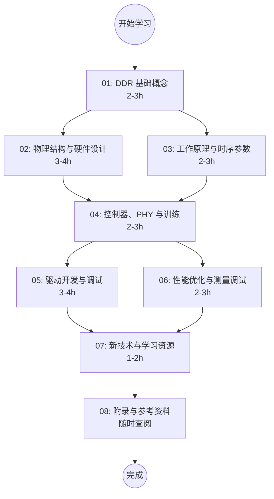

# DDR 内存技术学习笔记

> 面向嵌入式工程师、驱动开发者和硬件工程师的 DDR 内存技术完整学习指南。从基础概念到高级调试，涵盖 DDR3/DDR4/DDR5 及 LPDDR 系列。

---

## 学习路线图



---

## 文档索引

| 序号 | 文档 | 内容概要 | 建议用时 |
|:----:|------|---------|:--------:|
| 01 | [DDR 基础概念](./01-DDR基础概念.md) | DDR 概述、发展历程、系统架构、总线信号、存储阵列 | 2-3h |
| 02 | [DDR 物理结构与硬件设计](./02-DDR物理结构与硬件设计.md) | 颗粒/Rank/Bank 详解、PCB 布局、ECC、ODT | 3-4h |
| 03 | [DDR 工作原理与时序参数](./03-DDR工作原理与时序参数.md) | 预取架构、初始化/读写操作、刷新机制、时序参数详解 | 2-3h |
| 04 | [DDR 控制器、PHY 与训练](./04-DDR控制器PHY与训练.md) | 控制器架构、DFI 接口、PHY 设计、训练流程 | 2-3h |
| 05 | [DDR 驱动开发与调试](./05-DDR驱动开发与调试.md) | U-Boot 初始化、设备树、内存测试、SoC 差异、内核崩溃分析 | 3-4h |
| 06 | [DDR 性能优化与测量调试](./06-DDR性能优化与测量调试.md) | 带宽计算、地址映射、调度策略、信号完整性、案例分析 | 2-3h |
| 07 | [DDR 新技术与学习资源](./07-DDR新技术与学习资源.md) | DDR5/HBM/GDDR/MRDIMM、LPDDR 差异、参考书籍 | 1-2h |
| 08 | [DDR 附录与参考资料](./08-DDR附录与参考资料.md) | 术语表、频率对照表、数据手册阅读指南、命令速查 | 随时查阅 |

---

## 按角色推荐学习路径

### 驱动工程师（BSP / 嵌入式 Linux）

关注 DDR 初始化、设备树配置、调试方法：

```
01 基础概念 → 03 工作原理 → 04 控制器与训练 → 05 驱动开发（重点）→ 08 附录
```

- **05 是核心**：包含 U-Boot 初始化代码、设备树配置、SoC 差异对比、内核崩溃分析
- 04 的训练流程是理解 DDR 为什么能稳定工作的关键
- 08 的数据手册阅读指南和命令速查是日常工具

### 硬件工程师（PCB / 信号完整性）

关注物理结构、电气特性、信号完整性：

```
01 基础概念 → 02 物理结构（重点）→ 04 控制器与训练 → 06 性能优化（重点）→ 08 附录
```

- **02 是核心**：颗粒选型、Rank 拓扑、ODT 配置、PCB 布局约束
- 06 的信号完整性分析（眼图、ISI、阻抗匹配）是硬件调试必备
- 04 的训练流程帮助理解硬件设计如何影响训练结果

### 性能工程师（系统优化 / Benchmark）

关注带宽、延迟、调度策略：

```
01 基础概念 → 03 工作原理（重点）→ 04 控制器与训练 → 06 性能优化（重点）→ 07 新技术
```

- **03 是核心**：理解 tCCD、Bank 冲突、预取架构对性能的影响
- 06 的地址映射优化和调度策略直接影响实测带宽
- 07 了解 DDR5/HBM 的架构变化，为下一代产品做准备

---

## 审核修正记录

在拆分和整理过程中，对原始内容进行了以下技术审核和修正：

### 已修正的技术错误

| 位置 | 问题 | 修正 |
|------|------|------|
| DBI 数据恢复 | XOR 运算描述错误 | 改为 NOT（取反）操作 |
| DM 信号编号 | DQ 字节与 DM 编号对应偏移 | DM0→DQ[0:7], DM1→DQ[8:15] 等 |
| ODT 阻抗值 | RZQ 分压比与阻抗值对应错误 | 34Ω=RZQ/7, 40Ω=RZQ/6 等 |
| AL 可选值 | 与 tRCD 关联错误 | 改为与 CL 关联 |
| DDR5 PMIC | 输入电压标注为 5V/3.3V | 修正为 12V |
| DDR5 VPP | 标注为"DDR5 新增" | DDR4 已有，DDR5 降至 1.8V |
| HBM3 带宽 | 未注明是最高速率值 | 补充 6.4 Gbps/pin 条件 |
| 刷新率计算 | 高温刷新分母写为 4096 | 修正为 8192 |
| 地址映射示例 | 位解析计算错误 | 重新计算各字段值 |
| Micron 型号 | 容量计算逻辑错误 | 2G8 = 2Gb + x8 位宽 |
| DDR5 容量 | 单颗标注 256Gb | 修正为 64Gb |
| MR10 笔误 | DDR4 复位通过 MR10 | 修正为 MR1 |

### 2026-04-22 审核修复

| 位置 | 问题 | 修正 |
|------|------|------|
| 05-DDR驱动开发 | MR1 DLL Reset位错误 | 0x0001 (MR1[0]) 修正为 0x0100 (MR1[8]) |
| 02-DDR物理结构 | 交叉引用错误 | "第三章" 修正为 "第三章和第六章" 并添加链接 |
| 01-DDR基础概念 | DDR5 Bank数量描述不一致 | 统一为 "x4/x8: 32, x16: 16" |

### 2026-04-22 二次审核修复

| 位置 | 问题 | 修正 |
|------|------|------|
| 05-DDR驱动开发 | DLL Reset 位置根本性错误：不在 MR1 而在 MR0[11] | ddr_mr_write(1, 0x0100) 修正为 ddr_mr_write(0, 0x0800) |
| 05-DDR驱动开发 | MR0 CL 编码值错误 (0x1100 编码 CL=9) 且 CL=17 非标准值 | 改用 CL=16 (DDR4 标准值)，MR0=0x01F0 |
| 05-DDR驱动开发 | MRS 配置顺序错误 (MR0 不应先于 MR5/4/6) | 改为 MR2→MR3→MR1→MR5→MR4→MR6→MR0 (MR0最后) |
| 03-DDR工作原理 | MR0[2] 描述为"读突发类型"（DDR3概念） | 修正为 CAS Latency MSB (A2) |
| 03-DDR工作原理 | CL 编码公式 "CL=4+CL" 不适用 DDR4 | 修正为 A2=0: CL=9+A[6:4], A2=1: CL=18+2×A[6:4] |
| 02-DDR物理结构 | 阻抗值矛盾 (40Ω vs 50Ω) | 统一为 50Ω/100Ω，注明 DDR4 也有 40Ω/80Ω 设计 |
| 08-DDR附录 | tINIT0 值错误 (500μs) | 修正为 200μs (符合 JEDEC 规范) |
| 08-DDR附录 | 版本号过时 (v1.0) | 更新为 v2.1 |
| 08-DDR附录 | B.2 节缺失，编号跳转 | B.3→B.2, B.4→B.3 |
| 02-DDR物理结构 | DDR5 Bank 数量描述不完整 | 补充 x4/x8: 32 Bank/8 BG; x16: 16 Bank/4 BG |
| 07-DDR新技术 | DDR5 Bank Group 数量未区分位宽 | 补充 8 (x4/x8) / 4 (x16) |

### 2026-08-24 结合 JEDEC 规范 + 源码重审

本轮将 JEDEC 标准（JESD79-4D/5C、JESD209-5C/6、JESD235D/238B/270-4、JESD239C/250D）下载到 `reference/`，并以 u-boot 真实源码（imx8m/fsl）替换伪代码。关键修正（此前部分"修正"记录本身有误，以本表为准）：

| 位置 | 问题 | 最终正确值 |
|------|------|-----------|
| 03/05/08 的 MR0 | DLL Reset 位域（此前误记 MR1 → MR0[11]） | **MR0[8]**，自清 |
| 03/05 的 MR0 | WR 位域误写成 [9:8]/[9:7] | **MR0[11:9]** |
| 03 的 MR1 | Write Leveling 误写成 [12]、DLL 使能极性写反 | **MR1[7]**、DLL 使能 **A0=1 使能** |
| 08 的 C.3 | "MR4 读温度" | MR4 只有温度控制刷新(A3/A2)，温度传感器在 MR3[5] |
| 03/05 的 tRFC | 8Gb/16Gb 混淆 | 8Gb=350ns、16Gb=550ns |
| 03 的 tRAS/tRC | 32/49 CK（实为 ns 误当 nCK） | 39/56 nCK（=32/45.75ns）@DDR4-2400 |
| 05/08 训练代码 | 软件扫描延迟伪代码 | PHY 固件训练，引用 ddrphy_train.c |

### 格式修复

- 删除了所有"假"代码块（仅包含标题/粗体/空行的代码块），释放 Markdown 渲染
- 修复了嵌套代码块问题（DMA 代码块、训练代码块中的 ` ```c ` 嵌套）
- 移除了代码块内不必要的反斜杠转义（\_、\[、/\* 等）
- 统一了分隔线格式为 `***`
- 修正了重复的章节编号（8.3.4、13.1、13.3）
- 修正了附录编号冲突（A/B → F/G）

---

**文档版本**: v2.4
**最后更新**: 2026-08-24
**适用对象**: 驱动工程师、嵌入式工程师、硬件工程师
**原始文档**: DDR学习笔记.md（5933 行，已拆分为 8 个子文档）
