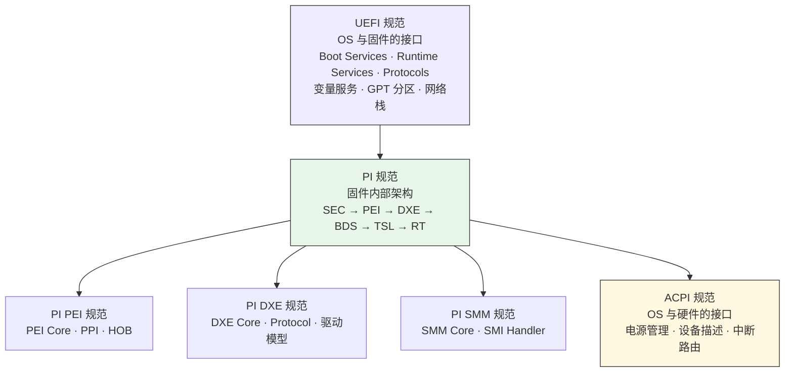
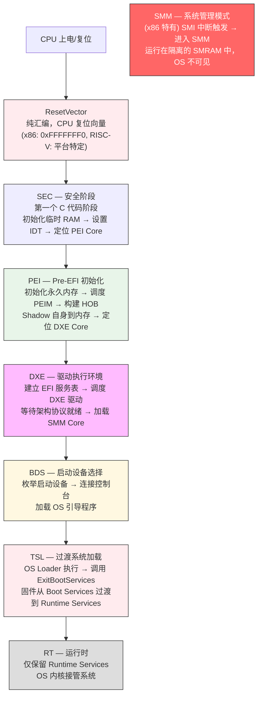
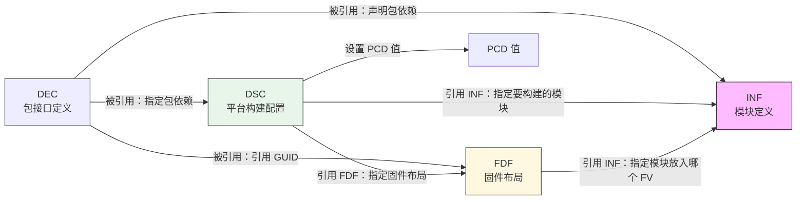
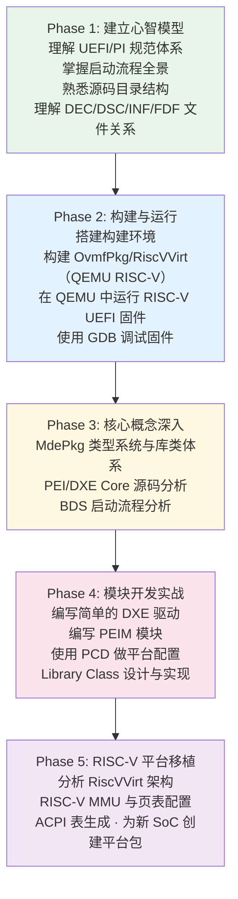

# EDK2 全景地图

> 从 BIOS 到 UEFI，从闭源到开源，固件开发正在经历一场静悄悄的革命。EDK2 是这场革命的核心战场。

## 1. 为什么你需要了解 EDK2

如果你是一名系统软件工程师，尤其是从事 RISC-V SoC 固件和内核开发，EDK2 是你绕不开的基础设施。原因很简单：

- **UEFI 是事实标准**：从服务器到嵌入式，UEFI 已经取代传统 BIOS 成为固件接口标准
- **EDK2 是 UEFI 的参考实现**：Intel 开源，社区维护，工业界广泛使用
- **RISC-V 服务器需要 UEFI**：RISC-V 服务器生态正在快速成熟，UEFI + ACPI 是服务器启动的标配
- **固件是安全的第一道防线**：Secure Boot、TPM、Measured Boot 都在固件层实现

**一句话总结**：不懂 EDK2，你的 RISC-V SoC 就是一块没有灵魂的硅片。

### 1.1 从 BIOS 到 UEFI：为什么要替换传统 BIOS

传统 BIOS（Legacy BIOS）诞生于 1981 年 IBM PC 时代，在近 40 年的演进中积累了根本性的架构缺陷，UEFI 的出现正是为了解决这些问题：

| 传统 BIOS 的局限 | UEFI 的解决方案 |
|------------------|-----------------|
| 16 位实模式运行，只能寻址 1MB | 保护模式/长模式运行，完整地址空间 |
| 汇编语言编写，不可移植 | C 语言编写，跨架构（x86/ARM/RISC-V） |
| 512KB 空间限制（Option ROM） | 无空间限制，支持大容量固件 |
| 无网络栈，只能从本地启动 | 内置网络栈，支持 PXE/HTTP 启动 |
| INT 13h 中断接口，只能读 8GB | Block I/O 协议，支持大容量存储 |
| 无安全启动机制 | Secure Boot 防止恶意代码执行 |
| MBR 分区表，最多 4 个主分区 | GPT 分区表，支持 128 个分区 |
| 图形界面简陋（VGA 文字模式） | GOP 图形协议，支持高分辨率 |

> **设计背景**：Intel 在 1998 年启动 EFI（Extensible Firmware Interface）项目，最初用于 Itanium（IA-64）服务器。2005 年，Intel 将 EFI 捐赠给 UEFI Forum，更名为 UEFI。同时，AMD、ARM、IBM、Microsoft 等公司共同参与制定规范，使其成为跨厂商的行业标准。

## 2. EDK2 是什么

EDK II (EFI Development Kit II) 是一个现代化的、跨平台的固件开发环境，实现了 UEFI (Unified Extensible Firmware Interface) 和 PI (Platform Initialization) 规范。

### 2.1 规范体系

理解 EDK2 必须先理解它实现的规范体系，这是整个知识体系的骨架：

**UEFI vs PI 的区别**（这是初学者最容易混淆的点）：

> **设计背景**：为什么需要两套规范？因为它们服务的对象不同。UEFI 规范面向 OS 开发者——定义"OS 能从固件获得什么服务"；PI 规范面向固件开发者——定义"固件内部各阶段如何协作"。这种分离让 OS 不需要关心固件内部实现，也让固件内部架构可以独立演进。

- **UEFI 规范**定义的是固件暴露给 OS 的接口（对外的契约）
- **PI 规范**定义的是固件内部各阶段之间的接口（对内的契约）
- EDK2 同时实现了两者

### 2.2 EDK2 的核心设计哲学

| 设计哲学 | 体现 | 设计动机 |
|----------|------|----------|
| **模块化** | 每个功能是一个独立的 Module（.inf 描述），可独立编译 | 固件代码量巨大（百万行级），模块化使团队可以并行开发、独立测试 |
| **包化管理** | 相关模块组织成 Package（.dec 描述），包是发布和版本管理的基本单位 | 不同厂商（CPU/SoC/OEM）各自维护自己的包，互不干扰 |
| **接口与实现分离** | Library Class（接口）vs Library Instance（实现），DSC 中做绑定 | 同一接口在不同阶段（PEI/DXE）或不同平台有不同实现，代码无需修改 |
| **数据驱动** | PCD (Platform Configuration Database) 实现配置与代码分离 | 平台差异通过配置数据表达，而非 `#ifdef` 条件编译，降低代码复杂度 |
| **声明式构建** | DSC/FDF 声明"要构建什么"，构建系统自动解决依赖和生成代码 | 固件构建涉及数千模块和复杂的依赖关系，手动管理 Makefile 不现实 |

## 3. 源码目录全景

EDK2 源码树庞大但组织有序。以下是按功能分类的目录地图：

### 3.1 核心框架包（必须掌握）

| 包 | 路径 | 职责 | 重要程度 |
|----|------|------|----------|
| **MdePkg** | `MdePkg/` | 模块开发环境：类型定义、库类声明、UEFI/PI 规范头文件 | ⭐⭐⭐⭐⭐ |
| **MdeModulePkg** | `MdeModulePkg/` | 核心实现：PEI Core、DXE Core、SMM Core、通用驱动 | ⭐⭐⭐⭐⭐ |

### 3.2 CPU 与平台包

| 包 | 路径 | 职责 | 重要程度 |
|----|------|------|----------|
| **UefiCpuPkg** | `UefiCpuPkg/` | CPU 驱动：CPU DXE、异常处理、SMM CPU、定时器、MMU | ⭐⭐⭐⭐ |
| **OvmfPkg** | `OvmfPkg/` | QEMU 虚拟机平台（含 RiscVVirt 子目录） | ⭐⭐⭐⭐ |
| **ArmPkg** | `ArmPkg/` | ARM 架构支持 | ⭐⭐⭐ |

### 3.3 功能包

| 包 | 路径 | 职责 |
|----|------|------|
| **CryptoPkg** | `CryptoPkg/` | 加密库（基于 OpenSSL/MbedTLS） |
| **SecurityPkg** | `SecurityPkg/` | 安全功能（TPM、Secure Boot） |
| **NetworkPkg** | `NetworkPkg/` | 网络协议栈（TCP/IP、HTTP、PXE） |
| **ShellPkg** | `ShellPkg/` | UEFI Shell |
| **FatPkg** | `FatPkg/` | FAT 文件系统驱动 |

### 3.4 特殊用途包

| 包 | 路径 | 职责 |
|----|------|------|
| **StandaloneMmPkg** | `StandaloneMmPkg/` | 独立 MM 框架（ARM TrustZone 安全环境） |
| **DynamicTablesPkg** | `DynamicTablesPkg/` | 动态 ACPI 表生成（含 RISC-V ACPI 表） |
| **IntelFsp2Pkg** | `IntelFsp2Pkg/` | Intel FSP（固件支持包） |
| **UefiPayloadPkg** | `UefiPayloadPkg/` | Universal Payload 入口 |
| **EmulatorPkg** | `EmulatorPkg/` | 宿主机模拟器（开发调试用） |

### 3.5 构建系统

| 路径 | 职责 |
|------|------|
| `BaseTools/` | 构建工具集（C 工具 + Python 构建引擎） |
| `Conf/` | 构建配置（由 BaseTools/Conf/*.template 生成） |

## 4. 启动流程全景

这是理解 EDK2 最重要的心智模型——从按下电源键到 OS 启动的完整旅程：

**RISC-V 的差异**：RISC-V 没有 x86 的实模式/保护模式切换，也没有 SMM。在典型的 OpenSBI + UEFI 流程中，OpenSBI 在 M-mode 运行，通过 SBI ecall 为上层提供服务；UEFI 固件（从 SEC 开始）运行在 S-mode。RISC-V 的安全隔离通过 StandaloneMmPkg 在独立的安全环境中实现。

## 5. 核心文件类型速查

EDK2 有自己独特的元数据文件体系，这是理解项目的钥匙：

| 文件类型 | 扩展名 | 作用 | 类比 |
|----------|--------|------|------|
| **DEC** | `.dec` | 包声明：定义包的公共接口（库类、GUID、PCD） | C 的 `.h` 文件 |
| **DSC** | `.dsc` | 平台描述：定义如何构建一个平台（库绑定、PCD 值、模块列表） | Makefile / CMakeLists |
| **INF** | `.inf` | 模块定义：描述一个模块的源码、依赖、入口点 | `.c` 文件 + 编译信息 |
| **FDF** | `.fdf` | 固件描述：定义 Flash 布局和固件卷内容 | 链接脚本 + 分区表 |
| **UNI** | `.uni` | Unicode 字符串资源（多语言支持） | `.po` / `.resx` |
| **VFR** | `.vfr` | Visual Form Representation（BIOS Setup 界面） | HTML 表单 |
| **CI** | `.ci.yaml` | 包的 CI 配置 | `.github/workflows/` |

**文件之间的依赖关系**：

## 6. 官方文档导航

TianoCore 官方文档体系庞大，按学习阶段推荐阅读顺序：

### 6.1 入门必读（第一阶段）

| 文档 | 内容 | 优先级 |
|------|------|--------|
| EDK II Build Specification | 构建系统详解 | ⭐⭐⭐⭐⭐ |
| EDK II DEC Specification | 包声明文件格式 | ⭐⭐⭐⭐⭐ |
| EDK II INF Specification | 模块定义文件格式 | ⭐⭐⭐⭐⭐ |
| EDK II DSC Specification | 平台描述文件格式 | ⭐⭐⭐⭐ |
| EDK II FDF Specification | 固件描述文件格式 | ⭐⭐⭐⭐ |

### 6.2 进阶必读（第二阶段）

| 文档 | 内容 | 优先级 |
|------|------|--------|
| EDK II PCD Specification | 平台配置数据库 | ⭐⭐⭐⭐ |
| EDK II Module Writer's Guide | 模块开发指南 | ⭐⭐⭐⭐⭐ |
| EDK II C Coding Standards | C 编码规范 | ⭐⭐⭐ |
| Understanding UEFI Secure Boot Chain | 安全启动链 | ⭐⭐⭐⭐ |

### 6.3 高级专题（第三阶段）

| 文档 | 内容 | 优先级 |
|------|------|--------|
| EDK II VFR Specification | BIOS Setup 界面开发 | ⭐⭐⭐ |
| EDK II Secure Coding Guide | 安全编码指南 | ⭐⭐⭐⭐ |
| EDK II Minimum Platform Specification | 最小平台规范 | ⭐⭐⭐⭐ |
| Understanding the Trusted Boot Chain | 可信启动链 | ⭐⭐⭐⭐ |

**文档获取**：所有文档可在 https://tianocore-docs.github.io/ 获取 HTML/PDF 版本。

## 7. 学习路线图

针对 RISC-V 固件开发者的推荐学习路线：

## 8. 关键术语表

| 术语 | 全称 | 含义 |
|------|------|------|
| UEFI | Unified Extensible Firmware Interface | 统一可扩展固件接口 |
| PI | Platform Initialization | 平台初始化规范 |
| SEC | Security Phase | 安全阶段（启动第一阶段） |
| PEI | Pre-EFI Initialization | PEI 阶段（内存初始化） |
| DXE | Driver Execution Environment | DXE 阶段（驱动执行环境） |
| BDS | Boot Device Selection | 启动设备选择 |
| TSL | Transient System Load | 过渡系统加载 |
| RT | Runtime | 运行时 |
| SMM | System Management Mode | 系统管理模式（x86 特有） |
| MM | Management Mode | 管理模式（SMM 的架构无关抽象） |
| PPI | PEIM-to-PEIM Interface | PEI 阶段模块间接口 |
| Protocol | - | DXE 阶段模块间接口 |
| HOB | Hand-Off Block | 阶段间数据传递结构 |
| PCD | Platform Configuration Database | 平台配置数据库 |
| FV | Firmware Volume | 固件卷 |
| FFS | Firmware File System | 固件文件系统 |
| BFV | Boot Firmware Volume | 启动固件卷 |
| CAR | Cache-as-RAM | 缓存作为 RAM（SEC/PEI 早期临时内存） |
| SBI | Supervisor Binary Interface | RISC-V 特权层二进制接口 |
| FDT | Flattened Device Tree | 扁平化设备树 |
| GCD | Global Coherency Domain | 全局一致性域（内存映射管理） |

---

**下一篇**：[01-architecture.md](01-architecture.md) — 架构与核心概念深入
